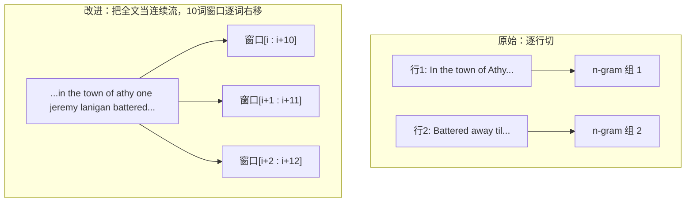

# 🎬 第 08 章 · 用机器学习生成文本（Using ML to Create Text）

> 本章对应原书 *AI and ML for Coders in PyTorch*（Laurence Moroney 著）第 8 章 "Using ML to Create Text"，PDF 第 195–218 页。

## 🗺️ 本章地图（读完能会什么）

- 从**分类**（第 5–7 章都在做的事）转向**生成**：不再判断一句话是不是讽刺，而是让网络**续写**一句话。
- 学会把一段语料切成**「输入序列 + 标签」**——用 n-gram 的方式，把「前 k 个词」当特征、「第 k+1 个词」当标签，这是所有自回归语言模型（包括 GPT）的训练范式雏形。
- 亲手搭一个 `Embedding → 双向 LSTM → Softmax 全连接` 的**下一词预测器**，用一首 1860 年代的爱尔兰民谣当语料。
- 掌握**复合预测（compounding）**：把预测词接回种子文本再预测，理解为什么生成文本会「滚雪球式」崩坏成胡言乱语——这正是 **LLM 幻觉（hallucination）** 的第一性原理。
- 学会四招提升效果：**扩大数据集**、**改进架构**（嵌入维度 / LSTM 初始化 / OneCycleLR 变学习率）、**改进数据**（滑动窗口 windowing）、**字符级编码**（character-based）。

> 💡 **一句话本质**：文本生成 = 反复做「下一词分类」——把词表大小当类别数，用前文预测下一个 token，预测完接回去再预测，一个足够大的这种模型就是 GPT。本章用最小的 LSTM 把这件事讲透。

---

## 🎯 从分类到生成：换一种思路看文本

前三章（[[05_自然语言处理入门：把语言编码成数字]]、[[06_用嵌入让情感可编程：Embeddings]]、[[07_循环神经网络RNN与LSTM做NLP]]）我们都在做**分类**：把句子 tokenize 成数字序列 → 过 Embedding → 过 RNN/LSTM → 输出「讽刺 / 不讽刺」。本章要**换挡（shift gears）**：不再判别已有文本，而是**预测并生成**文本。

原书开篇就把这件事和 ChatGPT 挂上钩：

> "A transformer learns the patterns that turn one piece of text into another... the GPT model (GPT stands for generative pretrained transformers) could predict the next tokens to follow a piece of text."
> 「Transformer 学习的是把一段文本变成另一段文本的模式……GPT 模型（GPT 即 generative pretrained transformers，生成式预训练 Transformer）能够预测跟在一段文本之后的下一批 token。」——原书约 173 页

Moroney 坦白：用 Transformer 造模型超出本书范围（留到 [[15_Transformer架构与transformers库]] 细讲），但**训练 Transformer 的原理，可以用更小更简单的 RNN/LSTM 复现**。所以本章用一个「玩具级」LSTM + 一小撮爱尔兰民谣，把生成式 AI 的骨架露出来。

作者还给了个招牌例子：拿《权力的游戏》名台词 `You know nothing, Jon Snow` 当种子，模型续写出了一段爱尔兰风的诗歌，甚至冒出 "the wild Colleen dying"（看过剧的都懂这个梗）。


> 💡 **实战/面试高频**：这张图就是**自回归生成（autoregressive generation）** 的全部。GPT-4 在推理时干的事和这里的 LSTM 一模一样——每一步只预测下一个 token，把它 append 回 context，再预测下一个。区别只在于：Transformer 换掉了 LSTM、token 用 BPE 子词、context 长到几十万、参数量大了几亿倍。

---

## 🧩 把序列变成「输入序列」（Turning Sequences into Input Sequences）

分类任务里标签是**显式给定**的（讽刺=1）。生成任务里**没有现成标签**——标签要从文本自己切出来。核心思想一句话：

> "for a block of n words, the next word in the sentence will be the label."
> 「对于一段 n 个词的文本块，句子里的下一个词就是它的标签。」——原书约 174–175 页

举例：句子 `Today has a beautiful blue sky`，可以切成
- 特征：`Today has a beautiful blue`
- 标签：`sky`

如果训练集里还有 `Yesterday had a beautiful blue sky`，那给模型看 `Tomorrow will have a beautiful blue`，它大概率会补 `sky`。**把大量句子都「去掉最后一个词当标签」，就能训出一个下一词预测器。**

### 第 1 步：分词 + 建词典

本章刻意用最朴素的手写实现（生产环境请用现成组件，这里是为了「看清引擎盖下面」）：

```python
def tokenize(text):
    tokens = text.lower().split()   # 全小写 + 按空格切
    return tokens

def create_word_dictionary(word_list):
    word_dict = {}
    word_dict["UNK"] = 0            # 0 号留给「未知词」(Unknown)
    counter = 1                     # 从 1 开始编号，0 已被 UNK 占用
    for word in word_list:
        if word not in word_dict:
            word_dict[word] = counter
            counter += 1
    return word_dict
```

语料用的是传统爱尔兰民谣《Lanigan's Ball》的选段（`In the town of Athy one Jeremy Lanigan / Battered away 'til he hadn't a pound...`）。把整段文本存成一个字符串、用 `\n` 分行：

```python
tokens = tokenize(data)
word_index = create_word_dictionary(tokens)
total_words = len(word_index) + 1   # +1 给 padding 的 0 号留位
```

> ⚠️ **踩坑**：注意 `UNK=0` 和 padding 用的 `0` 在这个朴素实现里**撞了号**。生产代码里通常把 padding 单独留 `0`、`UNK` 另给一号（或反过来）。本章为了简单没区分，但你要清楚 0 号 embedding 会同时承载「填充」和「未知」两种语义，这会污染表示。

### 第 2 步：切成 n-gram 输入序列

光有「整句去尾」还不够。为了让模型见识**各种长度的前缀**，我们把每一行切成一串**逐渐变长**的子序列：前 2 个 token、前 3 个 token、前 4 个……然后统一在**前面补零（prepend zeros）** 对齐到最长长度。

```python
def text_to_sequence(sentence, word_dict):
    words = sentence.lower().strip().split()
    return [word_dict[word] for word in words]   # 词 → 编号

def pad_sequences(sequences, max_length=None):
    if max_length is None:
        max_length = max(len(seq) for seq in sequences)
    padded = []
    for seq in sequences:
        num_zeros = max_length - len(seq)
        padded.append([0] * num_zeros + list(seq))   # 关键：零补在【前面】
    return padded

# 生成 n-gram 输入序列
corpus = data.lower().split("\n")
input_sequences = []
for line in corpus:
    token_list = text_to_sequence(line, word_index)
    for i in range(1, len(token_list)):
        n_gram_sequence = token_list[:i+1]           # 前缀: [0:2], [0:3], ...
        input_sequences.append(n_gram_sequence)

max_sequence_len = max(len(x) for x in input_sequences)
input_sequences = pad_sequences(input_sequences, max_sequence_len)
```

比如一句 `[1, 2, 3, 4, 5]` 会展开成：

| n-gram 前缀 | 补零对齐（max_len=5） |
|---|---|
| `[1, 2]` | `[0, 0, 0, 1, 2]` |
| `[1, 2, 3]` | `[0, 0, 1, 2, 3]` |
| `[1, 2, 3, 4]` | `[0, 1, 2, 3, 4]` |
| `[1, 2, 3, 4, 5]` | `[1, 2, 3, 4, 5]` |

> ⚠️ **踩坑：为什么补在前面而不是后面？** 因为我们要「取每个序列的**最后一个 token** 当标签」。零补在前面，真实词就都靠右对齐，标签永远是最右那个，逻辑统一。如果补在后面，标签位置就乱了。这也是 NLP 里 **left-padding** 在自回归生成场景常见的原因——GPT 类模型做 batch 推理时也偏爱 left-padding，道理相通。

### 第 3 步：切特征 x 和标签 y，并 one-hot 标签

```python
def split_sequences(sequences):
    xs = [seq[:-1] for seq in sequences]      # 特征 = 去掉最后一个
    labels = [seq[-1:] for seq in sequences]  # 标签 = 只保留最后一个
    return xs, labels

xs, labels = split_sequences(input_sequences)
```

标签现在还是「token 编号」。要当分类标签用，得 **one-hot 编码**成 `vocab_size` 维的向量——因为输出层要有 `vocab_size` 个神经元，第几个神经元概率最高就预测第几个词：

```python
def one_hot_encode_with_checks(value, corpus_size):
    if not 0 <= value < corpus_size:
        raise ValueError(f"Value {value} out of range for corpus size {corpus_size}")
    encoded = [0] * corpus_size
    encoded[value] = 1
    return encoded
```

原书在这里敲了个**内存警钟**：

> "Suppose you had 100,000 training sentences, with a vocabulary of 10,000 words—you'd need 1,000,000,000 bytes just to hold the labels!"
> 「假设你有 10 万个训练句、词表 1 万——光是存标签就要 10 亿字节（≈1 GB）！」——原书约 179 页

这就是 **one-hot 的稀疏之痛**。

> 💡 **实战/面试高频**：现代做法根本**不 one-hot**。PyTorch 的 `nn.CrossEntropyLoss` 直接吃**整数类别索引**（形状 `(batch,)`），内部融合了 `log_softmax + NLLLoss`，既省那 1 GB 内存，又数值稳定。所以本章为了「讲清原理」手写了 one-hot，但真写代码时你的 label 就是一个 `LongTensor` 的 token id，不用展开。记住这个「教学版 vs 生产版」的差别，面试常问。

---

## 🏗️ 创建模型（Creating the Model）

架构极简：**一个 Embedding + 一个双向 LSTM + 一个 Dense 输出层**。

- **Embedding**：每个词一个向量。词不多，`embedding_dim=8` 就够。
- **LSTM**：做成**双向（bidirectional）**，`hidden_dim = max_sequence_len - 1`（减 1 是因为标签占了末尾一个 token）。
- **输出层**：`Linear(hidden*2, total_words)`（双向所以 hidden 要 ×2），后接 Softmax，每个神经元 = 「下一个词是该 index 的概率」。

```python
import torch
import torch.nn as nn

class LSTMPredictor(nn.Module):
    def __init__(self, total_words, embedding_dim=8, hidden_dim=None):
        super().__init__()
        if hidden_dim is None:
            hidden_dim = max_sequence_len - 1          # 对齐原 TF 版设定

        self.embedding = nn.Embedding(total_words, embedding_dim)
        self.lstm = nn.LSTM(
            input_size=embedding_dim,
            hidden_size=hidden_dim,
            bidirectional=True,                        # 双向
            batch_first=True,                          # 输入形状 (batch, seq, feat)
        )
        self.fc = nn.Linear(hidden_dim * 2, total_words)  # 双向 → ×2
        self.softmax = nn.Softmax(dim=1)

    def forward(self, x):
        x = self.embedding(x)          # (batch, seq_len) -> (batch, seq_len, 8)
        lstm_out, _ = self.lstm(x)     # -> (batch, seq_len, hidden*2)
        lstm_out = lstm_out[:, -1, :]  # 取最后一个时间步 -> (batch, hidden*2)
        out = self.fc(lstm_out)        # -> (batch, total_words)
        out = self.softmax(out)        # -> 概率分布
        return out
```

训练设置：分类损失（categorical cross-entropy）+ Adam：

```python
total_words = len(word_index)
model = LSTMPredictor(total_words)
criterion = nn.CrossEntropyLoss()
optimizer = torch.optim.Adam(model.parameters())
```

原书说：这么小的模型训 **15,000 个 epoch（约 10 分钟）** 能到 **80%+ 准确率**。但立刻泼冷水：

> "when generating text, it will continually see words that it hasn't previously seen, so despite this good number, you'll find that the network will rapidly end up producing nonsensical text."
> 「生成文本时，它会不断遇到之前没见过的词组合，所以尽管这个准确率好看，你会发现网络很快就开始产出胡言乱语。」——原书约 181 页

> ⚠️ **踩坑：模型里放了 Softmax，还用 CrossEntropyLoss，会重复！** PyTorch 的 `nn.CrossEntropyLoss` **内部已经含 log_softmax**，期望你喂**原始 logits**。而本章 `forward` 末尾又套了一层 `nn.Softmax`——这在教学上为了「看到概率」可以，但严格来说训练时会导致「softmax 套 softmax」，梯度变平、收敛变慢。**生产写法：`forward` 只返回 logits（去掉 self.softmax），训练用 CrossEntropyLoss；只有推理时才手动 `torch.softmax` 看概率。** 这是初学者最常踩的坑之一。

---

## ✍️ 生成文本（Generating Text）

### 预测下一个词（Predicting the Next Word）

给一个**种子文本 seed**，走一遍「tokenize → 补零 → 转 tensor → 前向 → argmax」：

```python
input_text = "In the town of Athy"
words = input_text.lower().strip().split()
# 未知词用 0 兜底
number_sequence = [word_dict.get(word, 0) for word in words]
# 左补零到训练时的长度
padded = [0] * (sequence_length - len(number_sequence)) + number_sequence
input_tensor = torch.LongTensor([padded])         # 加 batch 维 -> (1, seq_len)

with torch.no_grad():                             # 推理不需要梯度
    output = model(input_tensor)

predicted_idx = torch.argmax(output[0]).item()    # 取概率最大的词
reverse_dict = {v: k for k, v in word_dict.items()}
predicted_word = reverse_dict[predicted_idx]
```

`In the town of Athy` → 预测出 `one`（index 6），概率 **0.9999**——完全正确，因为这就是原歌词的下一句 `...Athy one Jeremy Lanigan`。换个种子 `sweet Jeremy saw Dublin` → 预测 `his`，概率 0.7782。这些词都在语料里，所以头几个词预测得挺准。

### 复合预测：让文本滚起来（Compounding Predictions）

生成的精髓——**把预测词接回种子，再预测下一个，循环 N 次**：

```python
def generate_sequence(model, initial_text, word_dict, sequence_length, num_words=10):
    model.eval()
    current_text = initial_text
    generated = initial_text
    reverse_dict = {v: k for k, v in word_dict.items()}

    for i in range(num_words):
        words = current_text.lower().strip().split()
        if len(words) > sequence_length:              # 只保留最近 sequence_length 个词
            words = words[-sequence_length:]
        seq = [word_dict.get(w, 0) for w in words]
        padded = [0] * (sequence_length - len(seq)) + seq
        input_tensor = torch.LongTensor([padded])

        with torch.no_grad():
            output = model(input_tensor)
        idx = torch.argmax(output[0]).item()
        predicted_word = reverse_dict[idx]

        generated += " " + predicted_word            # 追加
        current_text = generated                     # 更新种子，进入下一轮
    return generated
```

结果？`sweet Jeremy saw Dublin` 续写出：

```
sweet jeremy saw dublin his right leg acres of the nolans, dolans, daughter, of
```

> "It rapidly descends into gibberish."
> 「它迅速沦为胡言乱语。」——原书约 185 页

**为什么会滚雪球式崩坏？** 原书给了两个第一性原理的解释：

1. **语料太小**，模型没多少上下文可依。
2. **误差复合（compounding error）**：下一词依赖前文；一旦前文是个「训练集里从没出现过的组合」，哪怕「最优的下一词」概率也很低；把这个低质词接回去再预测，下一步概率更低——**越滚越随机**。

看数字最清楚：`sweet Jeremy saw Dublin` 里每个词都在语料里，但**这个顺序从没出现过**。

| 步 | 输入（种子已崩） | 预测词 | 概率 |
|---|---|---|---|
| 1 | `sweet Jeremy saw Dublin` | his | 0.7782 |
| 2 | `sweet Jeremy saw Dublin his` | right | 0.7678 |
| 3 | `...his right` | leg | 高（"leg" 常跟 "right"）|
| … | 组合越来越陌生 | … | 概率整体走低 |

> 💡 **实战/面试高频（这是全章最重要的一句）**：
> > "This is also the basis of hallucination in LLMs, a common phenomenon that reduces trust in them."
> > 「这也是 LLM **幻觉（hallucination）** 的根源——一个降低人们信任度的常见现象。」——原书约 186 页
>
> 面试被问「LLM 为什么会幻觉」，最硬核的答法就是从这里切入：**自回归生成是逐 token 采样，误差会沿序列复合**；一旦踩进「训练分布外」的 context，后续每一步都在低置信度区域采样，模型仍会「自信地」输出最高概率 token，于是编造出流畅但错误的内容。缓解手段（temperature、top-k/top-p 采样、beam search、RLHF、[[18_RAG检索增强生成入门]] 用检索把生成锚定到真实文档）都是在对抗这个复合误差。

原书还推荐了一部**全程由 LSTM 生成剧本**的科幻短片 **Sunspring**（2016，导演 Oscar Sharp / 技术 Ross Goodwin，模型自称 "Benjamin"）：开头还像样，越往后越不知所云——活体演示了本章讲的崩坏。

---

## 📈 四招改进：数据、架构、数据（再）、字符级

### 招 1：扩展数据集（Extending the Dataset）

作者托管了一个 **约 1,700 行、来自多首爱尔兰民谣**的文本文件 `irish-lyrics-eof.txt`。换数据几乎不用改代码：

```python
data = open('/tmp/irish-lyrics-eof.txt').read()
corpus = data.lower().split("\n")
# 其余流程原样复用
```

词表涨到 **3,259 词**。训 **50,000 epoch（T4 上约 30 分钟）**，准确率反而只到 **~30%**（曲线拉平）——因为数据多了、任务更难了，但生成质量**主观上更好**：

```
in the town of athy one my heart
was they were the a reflections
on me all the frivolity;
```

> 💡 **实战**：注意这里「准确率下降但效果变好」的反直觉。生成任务**没有唯一正确答案**（不像分类有 ground-truth 类别），所以 accuracy 只是个粗糙的 yardstick（标尺），真正要看的是生成文本读起来「有多像样」——这是一种主观评估。这也预告了现代 LLM 评测为什么这么难（需要人类偏好、Elo 竞技场、LLM-as-judge 等）。

### 招 2：改进架构（Improving the Model Architecture）

原书列了三个可调点，都指向真实研究：

**① 嵌入维度（Embedding Dimensions）**
两条经验法则给出一个「合理区间」：

| 法则 | 公式 | 词表=3259 时 |
|---|---|---|
| 四次方根（第 6 章提过） | `vocab ** 0.25` | ≈ 8 |
| 对数 | `log(vocab)` | ≈ 32 |

学得慢就在 8~32 之间挑一个，给模型足够「空间」去捕捉词间关系。详见 [[06_用嵌入让情感可编程：Embeddings]]。

**② LSTM 初始化（Initializing the LSTMs）**
默认初始化为零往往不是最优。原书点名了三类初始化 + 对应论文：

- **Embedding 层**：正态分布，标准差按 `1/sqrt(embedding_dim)` 缩放 → 更好的梯度流，类似 **word2vec** 风格初始化。
- **LSTM 层**：LSTM 有四个内部门（input / forget / cell / output），权重是它们堆叠而成，不同门吃不同初始化最好。引用两篇经典：Jozefowicz 等《An Empirical Exploration of Recurrent Network Architectures》和 Pascanu 等《On the Difficulty of Training Recurrent Neural Networks》。
- **最后的 Linear 层**：用 **Kaiming（He）初始化**，出自 He 等 2015《Delving Deep into Rectifiers》。

```python
# 一种可行的初始化示例（对应原书 GitHub notebook 思路）
import math
def init_weights(model):
    # 嵌入层：word2vec 风格
    nn.init.normal_(model.embedding.weight, mean=0.0,
                    std=1.0 / math.sqrt(model.embedding.embedding_dim))
    # 线性层：Kaiming / He
    nn.init.kaiming_uniform_(model.fc.weight, nonlinearity='relu')
    nn.init.zeros_(model.fc.bias)
```

**③ 可变学习率（Variable Learning Rate）**
早期 epoch 想学得快（大 LR），后期不想过拟合（小 LR）——用**调度器**在训练中动态调 LR。原书用 `OneCycleLR`：

```python
scheduler = torch.optim.lr_scheduler.OneCycleLR(
    optimizer,
    max_lr=0.01,             # 峰值学习率
    epochs=20000,            # 总 epoch
    steps_per_epoch=1,       # 每 epoch 步数
    pct_start=0.1,           # 前 10% 做「热身 warm-up」，LR 爬升到峰值
    div_factor=10.0,         # 初始 LR = max_lr / 10
    final_div_factor=1000.0, # 末尾 LR = 初始 LR / 1000
)
# 训练循环里每步调用一次
# optimizer.step(); scheduler.step()
```

`pct_start=0.1` 定义了前 10% 的 **warm-up**：LR 先从 `max_lr/10` 爬到 `0.01`，再一路降到 `初始LR/1000`。加了它（配合堆叠第二层 LSTM），模型在 **6,800 epoch 就到 ~90% 准确率**并触发早停。

> 💡 **实战/面试高频**：**warm-up + 余弦/单周期退火**是今天训练大模型的**标配**。GPT、LLaMA、几乎所有大模型的训练都用「线性 warm-up 若干步 → 余弦退火」。原理和本章一模一样：初期权重随机，直接上大 LR 会炸；先小步热身让梯度稳定，再拉满，最后退火收敛。`OneCycleLR` 背后的思想来自 Leslie Smith 的 super-convergence 工作。

> ⚠️ **踩坑**：`OneCycleLR` 的**总步数 = epochs × steps_per_epoch**，且 scheduler 走完这些步就到头，**多走一步会报错**。所以调度器的 `epochs/steps_per_epoch` 必须和你实际的训练循环步数严格对齐；如果用了早停，也要保证没超过预设总步数。

### 招 3：改进数据——滑动窗口（Windowing）

一个**不加新歌就扩数据**的妙招：**windowing（滑动窗口）**。原来是「一行歌词 → 一批 n-gram」；现在把**所有行拼成一段连续长文本**，用一个 `n` 词的窗口在上面滑动，每滑一格就产出一个新的输入序列。

```python
window_size = 10
sentences = []
data = open('/tmp/irish-lyrics-eof.txt').read()
words = data.lower().split(" ")
range_size = len(words) - max_sequence_len
for i in range(0, range_size):
    thissentence = ""
    for w in range(0, window_size - 1):
        thissentence += words[i + w] + " "   # 从 i 开始取 window_size 个词
    sentences.append(thissentence)
```

滑窗能产出约 **`(词总数 - window_size) × window_size`** 个输入序列——数据量暴涨。



原书说这需要更大显存（他用了 **Colab 的 40 GB A100**）。代价是每 epoch 更慢，但**结果显著更好、崩坏得更慢**：

```
you know nothing jon snow
tell the loved ones and the friends
we would neer see again.
```

窗口大小是关键超参：窗口小→数据多但每个标签的上下文短（太小会又变胡言乱语）；还可调嵌入维度、LSTM 层数、词表大小。**没有硬性最优，就是实验 + 主观判断 + 玩得开心。**

> 💡 **实战**：这个 windowing 本质就是**用固定长度的滑动上下文窗口切训练样本**——和今天 LLM 预训练把海量语料**切成定长 context（如 2048/4096/8192 token）块**、每块做 next-token 预测，是同一件事。你甚至可以把 windowing 理解成「context length」这个超参的雏形。

### 招 4：字符级编码（Character-Based Encoding）

前几章都是**词级（word-based）**。生成任务里可以考虑**字符级（character-based）**，因为**唯一字符数远少于唯一词数**：

> "if you look at the dataset of the complete works of Shakespeare, you'll see that there are only 65 unique characters in the entire set."
> 「莎士比亚全集里，整个数据集只有 65 个唯一字符。」——原书约 193 页

| 维度 | 词级（Irish songs） | 字符级（Shakespeare） |
|---|---|---|
| 输出层神经元数 | ~2,700（或 3,259） | **65** |
| 每步预测的概率分布 | 铺在几千个词上 | 只铺 65 个 |
| 能否预测标点/换行 | 难 | **能**（标点、`\n` 都是字符）|
| 词表爆炸风险 | 高 | 几乎无 |
| 序列变长 | 短（词少） | **长**（一个词=好几个字符）|

字符级模型更简单、输出层更小、还能自己学会断行和标点。作者拿字符级 RNN 训莎翁全集，用 `You know nothing, Jon Snow` 当种子，续出了带角色名（`YGRITTE:` `MENENIUS:` `KING RICHARD II:`）和换行的「莎士比亚风」文本——同样很快退化，但因为莎翁语言本就陌生，我们更宽容。

> ⚠️ **踩坑**：原书特别注明，字符级那个演示 **Colab 是 TensorFlow 版**，不是 PyTorch 版；PyTorch 版在配套 GitHub 仓库里（结果不同但思路一致）。所以你在书里跟到这段代码时别混淆框架。

---

## 🔬 关键代码拆解：`forward` 里的张量形状之旅

本章最核心的一段是 `LSTMPredictor.forward`——顺着张量形状走一遍，你就懂了整条数据流。假设 `batch=32`、`max_sequence_len=6`（所以输入序列长 `seq_len=5`）、`embedding_dim=8`、`hidden_dim=5`、`total_words=T`：

```python
def forward(self, x):
    # 输入 x: (32, 5)  —— 32 个样本，每个是 5 个 token id 的 LongTensor
    x = self.embedding(x)
    # -> (32, 5, 8)    每个 token id 查表变成 8 维向量

    lstm_out, _ = self.lstm(x)
    # 双向 LSTM: hidden=5，前后各 5 维拼接 -> (32, 5, 10)
    # 第 3 维 = hidden_dim * 2 = 10

    lstm_out = lstm_out[:, -1, :]
    # 取「最后一个时间步」的输出 -> (32, 10)
    # 直觉：读完整个序列后 LSTM 的「总结状态」

    out = self.fc(lstm_out)
    # 线性映射到词表大小 -> (32, T)  每个词一个打分

    out = self.softmax(out)
    # -> (32, T)  变成概率分布，第 j 列 = 「下一个词是第 j 个词」的概率
    return out
```

关键理解点：
- `nn.Embedding(T, 8)` 是一张 `T×8` 的**查找表**，前向就是「按 id 取行」，反向会更新被用到的那些行——这就是 [[06_用嵌入让情感可编程：Embeddings]] 讲的东西。
- **双向**让 hidden 维度翻倍（`×2`），所以 `fc` 的输入维度必须写 `hidden_dim * 2`，写错就形状不匹配报错。
- `lstm_out[:, -1, :]` 是「多对一」——整段序列 → 一个下一词分布。对比 [[07_循环神经网络RNN与LSTM做NLP]] 里做分类时也是取最后时间步，套路一致。

> 💡 **面试高频**：为什么取 `[:, -1, :]`（最后时间步）而不是所有时间步？因为这是**多对一（many-to-one）** 任务：读完整个前缀，只预测**一个**下一词。如果要做「每个位置都预测下一词」（teacher forcing 式并行训练，GPT 就是这么干的），则要保留所有时间步 `lstm_out` 并对每个位置算 loss——那样训练效率高得多。

---

## 🌍 社区案例与延伸

1. **Karpathy《The Unreasonable Effectiveness of Recurrent Neural Networks》(2015)** —— 本章「字符级生成」的**祖师爷博客**。Karpathy 用 char-RNN 训莎士比亚、Linux 源码、代数几何论文，生成以假乱真的文本，还可视化了神经元「学会」引号配对、缩进等。强烈建议读原文：http://karpathy.github.io/2015/05/21/rnn-effectiveness/ ，配套代码 `char-rnn`：https://github.com/karpathy/char-rnn 。本章的爱尔兰民谣/莎士比亚实验基本是它的 PyTorch 简化复刻。

2. **word2vec（Mikolov et al. 2013, arXiv:1301.3781）** —— 原书提到嵌入层的 word2vec 风格初始化。这篇是词嵌入奠基作，`king - man + woman ≈ queen` 的经典类比就出自它。理解本章 Embedding 为何这么初始化，去读它。

3. **Sunspring（2016 科幻短片）** —— 原书亲自推荐的「LSTM 写剧本」实景演示。模型 "Benjamin"（Ross Goodwin/Oscar Sharp）在科幻剧本上训练后自动生成整部剧本，前段像样、后段崩坏，是「复合误差 → 退化」的活体教材。Ars Technica 有报道与全片。

4. **训练技巧论文三连**（原书直接点名）：
   - Pascanu et al. 2013《On the Difficulty of Training Recurrent Neural Networks》，arXiv:1211.5063（梯度爆炸/消失与梯度裁剪）。
   - Jozefowicz et al. 2015《An Empirical Exploration of Recurrent Network Architectures》（RNN 架构与初始化的大规模实证）。
   - He et al. 2015《Delving Deep into Rectifiers》，arXiv:1502.01852（Kaiming/He 初始化）。

5. **Karpathy nanoGPT** —— 从本章 LSTM 生成，到 Transformer 生成的最短路径。https://github.com/karpathy/nanoGPT ，几百行代码实现一个能训的 GPT，用的正是本章「next-token 预测 + 自回归生成」的范式，只是把 LSTM 换成了 Transformer。

---

## 🔗 通向 LLM

本章几乎每个概念都在现代 LLM 里有直接对应，这一节把主线接上：

| 本章概念 | 现代 LLM 里的对应 |
|---|---|
| n-gram「前 k 词→第 k+1 词」当训练样本 | **next-token prediction**——GPT 全系列的**唯一**预训练目标 |
| 复合预测（predict → append → predict） | **自回归解码（autoregressive decoding）**，推理时逐 token 生成 |
| argmax 取最可能词 | greedy decoding；实战换成 **temperature / top-k / top-p 采样**、beam search |
| 生成越滚越乱 | **hallucination（幻觉）** 的根源；靠 RLHF、[[18_RAG检索增强生成入门]] 缓解 |
| 词级 vs 字符级编码 | 现代用**子词 BPE / SentencePiece**——折中方案：比字符短、比词表小、无 OOV |
| windowing 定长窗口切样本 | **context length**（2K/8K/128K token）+ 预训练语料分块 |
| Embedding 层 | LLM 的 **token embedding 矩阵**（GPT-2 是 50257×768）|
| 双向 LSTM 读全序列 | 生成用**单向/因果（causal）** 注意力（不能偷看未来）；双向是 BERT 那种编码器的路子 |
| Softmax 输出 vocab 概率 | LLM 输出头就是 `Linear(hidden, vocab_size)` + softmax，一模一样 |
| warm-up + 变学习率 | 大模型训练标配：linear warm-up → cosine decay |

一句话串起来：**把本章的 LSTM 换成 Transformer（[[15_Transformer架构与transformers库]]）、把词级换成 BPE、把语料从 1700 行爱尔兰民谣换成几万亿 token 的互联网文本、把参数从几千个放大到几千亿——训练目标和生成方式完全不变，你就得到了 GPT。** 后续 [[14_使用第三方模型与模型中心Hub]]、[[16_用自定义数据微调与提示微调LLM]]、[[17_用Ollama部署与服务LLM]] 会带你真正用上工业级 LLM；本章是理解它们「为什么这样工作」的地基。合流总览见 [[21_从本书基础到LLM落地实战（合流篇）]]。

---

## ⚠️ 常见坑

1. **Softmax 和 CrossEntropyLoss 叠加**：`nn.CrossEntropyLoss` 内含 `log_softmax`，`forward` 里**别再套 `nn.Softmax`**，否则梯度变平、训练变慢。生产写法返回 logits，只在看概率时手动 softmax。
2. **padding 补错方向**：本任务标签取「序列最后一个 token」，所以零必须**补在前面（left-pad）**，靠右对齐真实词；补在后面标签位置就乱。
3. **`UNK` 和 padding 撞用 0 号**：本章朴素实现让 0 同时表示「未知词」和「填充」，会污染 0 号 embedding。生产里给它们分配不同 id，并考虑 `nn.Embedding(..., padding_idx=0)` 冻结填充位。
4. **双向 LSTM 忘了 `×2`**：`fc` 输入维度必须是 `hidden_dim * 2`，写成 `hidden_dim` 直接形状报错。
5. **用 accuracy 当生成质量的唯一标准**：生成没有唯一正确答案，accuracy 只是粗糙标尺（扩数据后反而从 80% 掉到 30% 却更好读）。要主观评估文本「像不像样」。
6. **`OneCycleLR` 步数不对齐**：总步数 = `epochs × steps_per_epoch`，训练循环步数超了会报错；配合早停时尤其要算准。

---

## 🎯 面试速答

- **Q：文本生成模型是怎么训练的？** A：把它变成「下一词分类」——用滑动/前缀的方式，把「前 k 个 token」当特征、「第 k+1 个 token」当标签，最小化 next-token 的交叉熵；这就是 GPT 的预训练目标。
- **Q：为什么生成的文本会越来越不知所云（LLM 为什么幻觉）？** A：自回归逐 token 生成，误差会沿序列**复合**；一旦进入训练分布外的 context，后续每步都在低置信度区采样，模型仍自信输出最高概率 token，于是流畅地编造。缓解靠采样策略、RLHF、RAG 检索锚定。
- **Q：词级和字符级编码怎么选？** A：字符级词表极小（莎翁仅 65）、无 OOV、能预测标点换行，但序列长、语义弱；词级语义强但词表爆炸、有 OOV。现代 LLM 用**子词 BPE** 折中。
- **Q：为什么用 warm-up 和变学习率？** A：初期权重随机，大 LR 会发散；先小步 warm-up 让梯度稳定，再拉到峰值加速，后期退火防过拟合并精调。大模型训练标配「linear warm-up → cosine decay」。
- **Q：`nn.CrossEntropyLoss` 要不要先手动 softmax？** A：不要。它内部融合了 `log_softmax + NLLLoss`，直接喂 logits 即可，既省内存又数值稳定；手动再 softmax 会重复、损害训练。

---

## 📌 本章小结

- 文本生成的本质是**反复做下一词分类**：n-gram 切「前缀→下一词」样本，训一个 `Embedding → LSTM → Softmax` 的预测器，再**复合预测**（预测→接回→再预测）滚出整段文本。
- **复合误差**导致生成随小语料迅速崩坏，这正是 **LLM 幻觉**的第一性原理。
- 四招提升：**扩数据**、**改架构**（嵌入维度取四次方根到对数之间、word2vec/Kaiming 初始化、OneCycleLR 变学习率）、**windowing 滑窗扩数据**、**字符级编码**（词表更小、能出标点换行）。
- 生成任务**没有唯一正确答案**，accuracy 只是粗糙标尺，最终看文本「有多像样」——这预告了现代 LLM 评测之难。
- 把 LSTM 换成 Transformer、词级换成 BPE、语料和参数放大若干数量级，训练目标和生成方式不变，就是 GPT——本章是理解 LLM 的地基。

---

## 🔗 延伸阅读 & 交叉链接

- 上一章打底：[[07_循环神经网络RNN与LSTM做NLP]]（LSTM 怎么读序列）、[[06_用嵌入让情感可编程：Embeddings]]（Embedding 层原理与维度经验法则）、[[05_自然语言处理入门：把语言编码成数字]]（tokenize 与词典）。
- 数据管线：[[04_用PyTorch管理数据：Dataset与DataLoader]]（把本章手写循环升级成 Dataset/DataLoader）。
- 通向 LLM：[[15_Transformer架构与transformers库]]（把 LSTM 换成 Transformer）、[[16_用自定义数据微调与提示微调LLM]]、[[17_用Ollama部署与服务LLM]]、[[18_RAG检索增强生成入门]]（用检索对抗幻觉）、[[21_从本书基础到LLM落地实战（合流篇）]]。
- 外部真实链接：
  - Karpathy《The Unreasonable Effectiveness of RNNs》：http://karpathy.github.io/2015/05/21/rnn-effectiveness/
  - char-rnn 仓库：https://github.com/karpathy/char-rnn ／ nanoGPT：https://github.com/karpathy/nanoGPT
  - word2vec（Mikolov et al. 2013）：https://arxiv.org/abs/1301.3781
  - Kaiming He 等《Delving Deep into Rectifiers》：https://arxiv.org/abs/1502.01852
  - Pascanu 等《On the Difficulty of Training RNNs》：https://arxiv.org/abs/1211.5063
