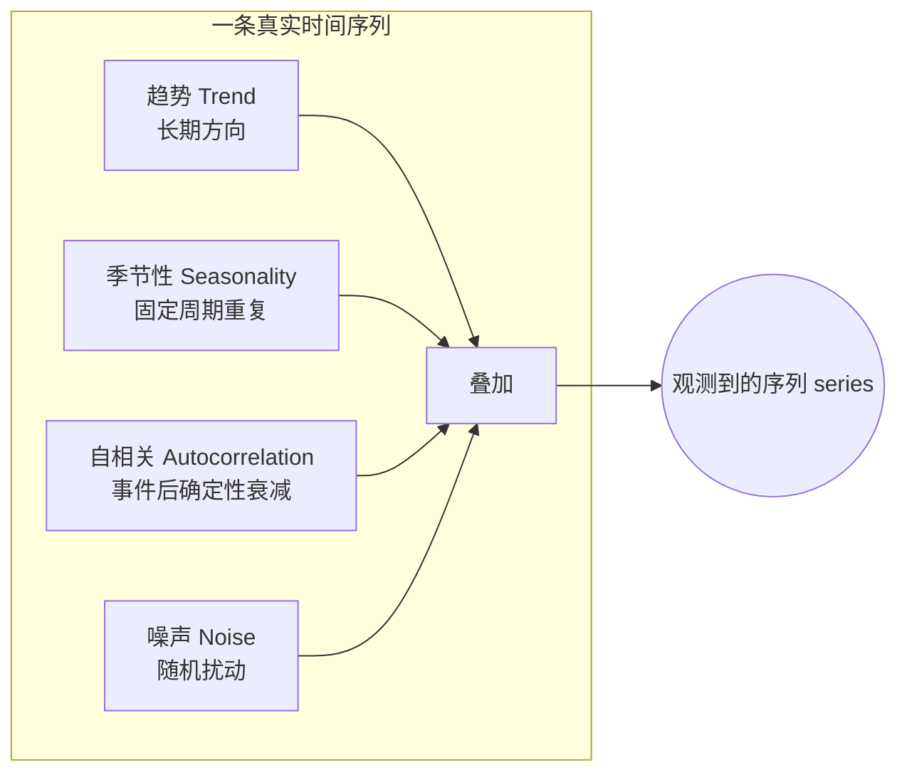

# 🎬 第 9 章 · 理解序列与时间序列数据（Understanding Sequence and Time Series Data）

> 本章对应原书 *AI and ML for Coders in PyTorch*（Laurence Moroney 著）第 9 章 "Understanding Sequence and Time Series Data"，PDF 第 219–230 页。

## 🗺️ 本章地图（读完能会什么）

- 认识**时间序列（time series）**到底是什么：一组按时间排布的值，横轴是时间；理解**单变量（univariate）**与**多变量（multivariate）**的区别。
- 拆解时间序列的四大**共同属性**：趋势（trend）、季节性（seasonality）、自相关（autocorrelation）、噪声（noise）——这是后面所有序列建模的"物理直觉"。
- 学会**造一条合成时间序列**（trend + seasonality + noise），从此不依赖真实数据也能验证算法。
- 用**朴素预测（naive forecast）**建立基线（baseline），并用 **MAE / MSE / MAPE** 量化"我到底预测得多准"。
- 用**移动平均（moving average）**改进预测，再用**差分（differencing）去季节性**进一步压低误差——为第 10、11 章上 ML/RNN 铺路。
- 这一章是全书从"图像 / 文本"切换到"**序列建模**"的桥梁：本章不训练神经网络，专门打地基和标尺。

> 💡 **一句话本质**：时间序列建模的第一步不是搭模型，而是**先把趋势、季节性、自相关、噪声这四个成分拆出来，再用一个"傻瓜基线"划一条误差红线**——任何 ML 模型跑不赢这条红线，就是白搭。

---

## 🌊 一、时间序列无处不在

天气预报、股价、摩尔定律（Moore's law，晶体管数量约每两年翻一番，已灵验近 50 年）——这些都是时间序列。原书开篇就用摩尔定律举例：

> "Time series data is a set of values that are spaced over time, usually in a particular order or denoting values of a thing at a timestamped point in time."
>
> 时间序列数据是**一组沿时间排布的值**，通常有特定顺序，或表示某个事物在带时间戳的某一点上的取值。（原书约 219–220 页）

把它画出来，x 轴通常是时间轴（temporal）。这里有个关键区分：

| 类型 | 定义 | 例子 |
|---|---|---|
| **单变量 univariate** | 每个时间点只有**一个**值 | 逐月降雨量、每日 UV 访问量 |
| **多变量 multivariate** | 每个时间点有**多个**值同时演化 | 摩尔定律图里"实际晶体管数"+"预测值"两条线；股票的开/高/低/收/量 |

> 摩尔定律的预测之所以简单，是因为它背后有一条**固定简单的规则**（每两年翻倍）。可现实里的时间序列（比如股价、季节性降雨）没有这种干净规则，看起来"随机又嘈杂"——但它们仍藏着**可预测的共同属性**。这正是本章要拆的。

```python
import numpy as np
import matplotlib.pyplot as plt

# 本章通篇复用的画图工具函数（原书原样给出）
def plot_series(time, series, format="-", start=0, end=None):
    plt.plot(time[start:end], series[start:end], format)
    plt.xlabel("Time")
    plt.ylabel("Value")
    plt.grid(True)
```

> 💡 **实战/面试高频**：面试官问"时间序列和普通监督学习数据有啥本质不同？"——标准答法是**样本之间不独立（非 i.i.d.）**，存在时间上的顺序依赖。所以你不能随机打乱来切 train/valid（会数据泄漏），必须**按时间顺序切**，这在本章下面切数据集时会再强调。

---

## 🧬 二、时间序列的四大共同属性

原书专门用一节 "Common Attributes of Time Series" 把四个成分讲清楚。理解它们，等于拿到了"看穿"任何序列图的 X 光片。



### 2.1 趋势（Trend）—— 长期方向

> "Time series typically move in a specific direction."
>
> 时间序列通常朝某个特定方向移动。（原书约 221 页）

摩尔定律 y 轴随时间**上升**，就是上升趋势；"每晶体管价格"随时间下降，就是下降趋势；也有的序列长期基本水平。趋势是序列的**长期骨架**。

```python
def trend(time, slope=0):
    return slope * time      # 一条斜率为 slope 的直线：斜率>0 上升，<0 下降，=0 水平
```

### 2.2 季节性（Seasonality）—— 固定周期的重复

许多序列以**固定间隔**重复出现相同模式，这个间隔叫"季节（season）"。原书举了两个绝妙的例子：

- **气温**：一年四季，夏季最高，画几年就能看到每 4 季一个峰——这就是季节性。
- **网站流量**（图 9-3，一个面向软件开发者的站点）：按周画，规律性地"掉坑"。为什么？**周末访问量低**！于是形成"5 高 2 低"的一周季节性；再叠加圣诞/新年假期又是另一层季节性。

> 💡 **直觉**：季节性 ≠ 一定是"春夏秋冬"。任何**以固定周期复现**的模式都算：一天里的早晚高峰、一周里的工作日/周末、一年里的节假日。零售网站可能周末达峰，开发者网站却周末掉坑——**周期由业务决定**。

```python
def seasonal_pattern(season_time):
    """一个任意的周期内形状，想改就改"""
    return np.where(season_time < 0.4,
                    np.cos(season_time * 2 * np.pi),   # 前 40% 走一段余弦
                    1 / np.exp(3 * season_time))       # 后 60% 指数衰减

def seasonality(time, period, amplitude=1, phase=0):
    """每隔 period 重复同一个 seasonal_pattern"""
    season_time = ((time + phase) % period) / period   # 关键：取模 %period 把时间折叠进一个周期
    return amplitude * seasonal_pattern(season_time)
```

这里最妙的一行是 `((time + phase) % period) / period`：用**取模运算 `%`** 把无限延伸的时间"折叠"进 `[0,1)` 的一个周期内，`period` 控制周期长度，`amplitude` 控制振幅，`phase` 控制相位平移。

### 2.3 自相关（Autocorrelation）—— 事件后的确定性行为

> "Another feature that you may see in time series is predictable behavior after an event."
>
> 你可能在时间序列里看到的另一个特征是：**某个事件之后出现可预测的行为**。（原书约 223 页）

原书图 9-4：序列里有明显的尖峰（spike），而**每个尖峰之后都有一段确定性的衰减（deterministic decay）**。这种"当前值与自己过去某个时刻的值相关"的现象，就叫自相关。自相关意味着**内在可预测性**——一条充满自相关的序列往往是可预测的。

> 💡 **一句话理解自相关**：`series[t]` 和 `series[t-k]` 之间存在统计相关（k 叫 lag 滞后）。这正是后面 RNN/LSTM 能奏效的根基——网络要学的就是"用过去若干步预测下一步"。

### 2.4 噪声（Noise）—— 随机扰动

噪声是序列里**看似随机的扰动**，带来高度不可预测性，会**掩盖**趋势、季节性和自相关。原书图 9-5：给图 9-4 的自相关序列加一点噪声后，突然就很难看出自相关了。

```python
def noise(time, noise_level=1, seed=None):
    rnd = np.random.RandomState(seed)      # 固定 seed 保证可复现
    return rnd.randn(len(time)) * noise_level   # 标准正态 × 噪声强度
```

> ⚠️ **踩坑**：噪声是**不可预测部分的下界**。你的模型误差再怎么优化，也不可能低于噪声本身的方差（这就是所谓"贝叶斯误差 / irreducible error"）。所以看到误差降不下去时，先问一句：**是模型不行，还是数据本身噪声就这么大？**

---

## 🏗️ 三、亲手造一条合成时间序列

原书的做法非常"工程师"：**不找真实数据，直接合成一条同时含趋势、季节性、噪声的序列**，这样算法对不对、误差降没降，一目了然、可复现。

```python
import numpy as np

# 4 年多一点的每日数据：4*365+1 = 1461 个时间点
time = np.arange(4 * 365 + 1, dtype="float32")

baseline = 10        # 基线水平（整体抬高）
amplitude = 15       # 季节性振幅
slope = 0.09         # 趋势斜率
noise_level = 6      # 噪声强度

# 组装：基线 + 趋势 + 季节性
series = baseline + trend(time, slope) + seasonality(time, period=365, amplitude=amplitude)
# 再叠加噪声（seed=42 保证每次跑出来一样）
series += noise(time, noise_level, seed=42)
```

画出来就是原书图 9-6：一条同时带**上升趋势 + 年度季节性 + 噪声**的曲线。整条序列 = `baseline(常数) + trend(斜线) + seasonality(周期波) + noise(随机抖动)`，四个成分线性叠加——这也印证了上面 mermaid 图的分解。

> 💡 **实战/面试高频**："为什么要用合成数据？"——**因为你完全知道 ground truth 的每个成分（趋势斜率、周期、噪声方差都是你设的）**，可以精确验证算法是否恢复出了这些成分。真实项目里做时间序列，第一步也常是先在合成数据上把 pipeline 跑通再上真数据。

### 切分数据集：一定要按时间、且切在整季边界

有季节性时，切 train/valid **要保证每一份都包含完整的整数个季节**。原书建议：图 9-6 这条数据，在 **time step = 1000** 处切——前 1000 步做训练、之后做验证。

```python
split_time = 1000
time_train = time[:split_time]
x_train    = series[:split_time]
time_valid = time[split_time:]
x_valid    = series[split_time:]
```

> ⚠️ **踩坑（面试最爱考）**：时间序列**绝不能随机打乱后切分**。随机切会让"未来"的信息混进训练集，造成**数据泄漏（data leakage）**，验证分数虚高、上线暴死。永远**按时间顺序切**，验证集在训练集之后。

---

## 📏 四、朴素预测（Naive Forecast）：先划一条基线

在上 ML 之前，原书先教**朴素预测**——最简单的预测法，用来建立**基线（baseline）**衡量后续 ML 的价值。

> "The most basic method to predict a time series is to say that the predicted value at time t + 1 is the same as the value from time t, effectively shifting the time series by a single period."
>
> 预测时间序列最基本的方法，就是断言 **t+1 时刻的预测值等于 t 时刻的实际值**，本质上就是把整条序列往后平移一个周期。（原书约 224 页）

```python
# 预测值 = 前一步的真实值，等价于整条序列右移一格
naive_forecast = series[split_time - 1:-1]
```

**这一行是本章第一个 tricky 索引，值得逐一拆**（下面"关键代码拆解"会细讲）：`split_time - 1` 从验证起点的**前一格**开始取，`:-1` 到倒数第二个结束，长度恰好与验证集 `x_valid = series[split_time:]` 对齐，且每个位置都是"用前一天当今天的预测"。

原书图 9-7：把朴素预测叠在验证集上，看起来相当贴合——因为相邻两天的值确实高度相关（这正是自相关在起作用）。但"看起来贴合"不算数，得**量化**。

> 💡 **面试高频**："naive forecast 为什么是必须的？"——它是**免费的下限基线**。任何复杂模型都必须显著跑赢它才有意义。工业界评审模型第一句常问："你的 baseline 是什么，赢了多少？"没有 baseline 的准确率数字毫无信息量。

---

## 🎯 五、度量预测精度：MAE / MSE / MAPE

原书重点讲两个指标，我们再补上工业界常用的第三个（MAPE）。核心都是"预测值 vs 实际值的差 → 去负号 → 求平均"。

| 指标 | 全称 | 公式 | 去负号方式 | 特点 |
|---|---|---|---|---|
| **MSE** | Mean Squared Error 均方误差 | mean( (pred − actual)² ) | **平方** | 对大误差惩罚重（离群点敏感）；单位是原值的平方 |
| **MAE** | Mean Absolute Error 平均绝对误差 | mean( \|pred − actual\| ) | **绝对值** | 与原值同量纲、好解释；对离群点更稳健 |
| **MAPE** | Mean Absolute Percentage Error 平均绝对百分比误差 | mean( \|pred − actual\| / \|actual\| ) | 绝对值 + 相对化 | 无量纲、可跨序列比较；actual≈0 时会爆炸 |

原书用 **PyTorch 的损失函数**直接算（注意：本书是 PyTorch 版，用 `torch.nn.functional`）：

```python
import torch
import torch.nn.functional as F

# 均方误差 MSE —— F.mse_loss
mse = F.mse_loss(torch.tensor(x_valid), torch.tensor(naive_forecast)).item()
print(mse)

# 平均绝对误差 MAE —— F.l1_loss（L1 就是绝对值损失）
mae = F.l1_loss(torch.tensor(x_valid), torch.tensor(naive_forecast)).item()
print(mae)
```

原书作者跑出来：**MSE ≈ 76.47，MAE ≈ 6.89**。这就是我们要打败的红线。

补一个 MAPE 的实现（原书没写，工业界高频）：

```python
def mape(actual, pred):
    actual, pred = np.array(actual), np.array(pred)
    return np.mean(np.abs((actual - pred) / actual)) * 100   # 返回百分比
```

> 💡 **实战/面试高频**：
> - `F.l1_loss` 就是 MAE（L1），`F.mse_loss` 就是 MSE（L2）——PyTorch 里训练回归模型时也是这两个损失，本章度量指标和第 10 章的**训练损失函数是同一个东西**，只是这里当"尺子"，那里当"优化目标"。
> - **选哪个？** 数据有离群点、不希望被少数极端值主导 → 用 MAE；希望重罚大偏差、且要可导优化 → 用 MSE；要跨不同量级序列比较 → 用 MAPE。

---

## 📉 六、移动平均（Moving Average）：不那么朴素的预测

朴素预测只用 `t-1` 一个值。**移动平均**改进为：取过去一组值（比如 30 个）求平均，当作 `t` 时刻的预测。这样能**平滑掉噪声**。

```python
def moving_average_forecast(series, window_size):
    """预测值 = 最近 window_size 个值的均值。
       当 window_size=1 时，退化为朴素预测。"""
    forecast = []
    for time in range(len(series) - window_size):
        forecast.append(series[time:time + window_size].mean())
    return np.array(forecast)

# 窗口 30，对齐到验证区间
moving_avg = moving_average_forecast(series, 30)[split_time - 30:]

plt.figure(figsize=(10, 6))
plot_series(time_valid, x_valid)
plot_series(time_valid, moving_avg)
```

原书图 9-8：移动平均曲线比朴素预测更平滑。作者跑出 **MSE ≈ 49，MAE ≈ 5.5**——比朴素的 76.47 / 6.89 **确实好了一截**。

> ⚠️ **踩坑**：移动平均**天然滞后**。窗口越大越平滑，但对趋势和拐点的响应越慢（预测总是"慢半拍"地追着真实值）。而且它**完全没利用趋势和季节性信息**——所以还有改进空间。

---

## 🧮 七、改进移动平均：用差分（Differencing）去季节性

本章的点睛之笔。既然季节性周期是 **365 天**，就可以用**差分（differencing）**把趋势和季节性一起"抹平"：**用 `t` 时刻的值减去 `t-365` 时刻的值**。

> "you can smooth out the trend and seasonality by using a technique called differencing, which just subtracts the value at t - 365 from the value at t."
>
> 你可以用一种叫**差分**的技术抹平趋势和季节性，它做的事就是**用 t 时刻的值减去 t−365 时刻的值**。（原书约 226 页）

```python
# 差分：series[t] - series[t-365]，抹掉年度季节性和大部分趋势
diff_series = (series[365:] - series[:-365])
diff_time = time[365:]
```

差分后剩下的基本是**噪声 + 残余自相关**，趋势/季节性被"减没了"。对差分序列再做移动平均去噪，然后**把过去的季节性 + 趋势加回来**（restore）：

```python
# 对差分序列做窗口 50 的移动平均
diff_moving_avg = moving_average_forecast(diff_series, 50)[split_time - 365 - 50:]

# 把"去掉的过去"平滑后加回来：series[t-365] 附近做窗口 10 的移动平均，再加上差分预测
diff_moving_avg_plus_smooth_past = \
    moving_average_forecast(series[split_time - 370:-360], 10) + diff_moving_avg
```

原书图 9-9：预测曲线**非常贴近真实值**，趋势线几乎重合，噪声被平滑掉，季节性也复原了。作者最终跑出 **MSE ≈ 40.9，MAE ≈ 5.13**——比裸移动平均（49 / 5.5）又进一步。

**一路走来的误差对比（原书三个阶段）：**

| 方法 | MSE | MAE | 相对朴素基线 |
|---|---|---|---|
| 朴素预测 naive | 76.47 | 6.89 | 基线 |
| 移动平均（窗口 30） | ~49 | ~5.5 | 明显改善 |
| 差分 + 移动平均 + 加回过去 | ~40.9 | ~5.13 | 进一步改善 |

> 💡 **实战/面试高频**：差分是经典时间序列（ARIMA 里的 "I" = Integrated）的核心操作之一。**一阶差分去趋势，季节性差分（lag = 周期）去季节性**。把序列变得"平稳（stationary）"后再建模，是统计时序方法的标准套路。本章用最朴素的移动平均演示了这个思想，第 10、11 章会换成 ML/RNN 来学这些残差。

---

## 🔬 关键代码拆解：`naive_forecast = series[split_time - 1:-1]` 为什么这样切

这一行看着简单，却是本章最容易搞错索引对齐的地方。设 `split_time = 1000`，`series` 长度为 `N = 1461`。

```python
x_valid        = series[split_time:]       # 索引 1000 .. 1460，长度 461，这是"真实答案"
naive_forecast = series[split_time - 1:-1] # 索引  999 .. 1459，长度 461，这是"预测"
```

**逐段对齐分析：**

| 位置 i（验证区内） | 真实值 `x_valid[i]` | 预测值 `naive_forecast[i]` | 含义 |
|---|---|---|---|
| 第 0 个 | `series[1000]` | `series[999]` | 用第 999 天预测第 1000 天 |
| 第 1 个 | `series[1001]` | `series[1000]` | 用第 1000 天预测第 1001 天 |
| … | … | … | 每个预测 = **前一天的真实值** |
| 最后一个 | `series[1460]` | `series[1459]` | 用倒数第 2 天预测最后一天 |

- `split_time - 1`（= 999）：预测序列从验证起点的**前一格**开始，实现"右移一格 = 用昨天预测今天"。
- `:-1`（到倒数第二个止）：因为最后一天没有"明天"可预测，切掉末尾一格。
- **两条序列长度都是 461，逐元素一一对应**，才能直接喂进 `F.mse_loss(x_valid, naive_forecast)`。

> ⚠️ **形状对齐是时间序列代码第一大坑**：只要两条序列错位一格，MSE/MAE 就会算错却不报错（因为长度可能碰巧一样）。写完切片，**永远打印 `len()` 和头尾几个值核对对齐**。

同理，`moving_avg = moving_average_forecast(series, 30)[split_time - 30:]` 里的 `[split_time - 30:]`，是因为 `moving_average_forecast` 返回的数组比原序列**短了 window_size 个**（前 30 个没有足够历史算不出来），所以要减 30 才能对齐回验证区间。差分那段 `[split_time - 365 - 50:]` 同理——**每叠加一次"损失长度"的操作（差分损 365、移动平均损 window），切片偏移就要相应累加**。

---

## 🌍 社区案例与延伸

本章讲的四大成分与经典分解，都能在真实工具/文献里找到对应，建议延伸：

1. **statsmodels 的经典时序分解**（trend / seasonal / residual 三分量）：官方 `seasonal_decompose` 和更强的 STL 分解，正是把本章"趋势+季节性+噪声"的分解工业化。文档：<https://www.statsmodels.org/stable/generated/statsmodels.tsa.seasonal.seasonal_decompose.html>。STL 原论文：Cleveland et al., 1990, "STL: A Seasonal-Trend Decomposition Procedure Based on Loess"。
2. **ARIMA / 差分（differencing）**：本章的差分正是 Box-Jenkins 方法的核心。经典教材 Hyndman & Athanasopoulos, *Forecasting: Principles and Practice*（免费在线，OTexts）系统讲了 stationarity、differencing、seasonal differencing：<https://otexts.com/fpp3/>。这是时间序列从业者的"圣经"级免费资源。
3. **M4 / M5 预测竞赛**：Makridakis 等人组织的大规模预测竞赛证明了一个反直觉结论——**简单统计基线（naive、指数平滑）常常极难被打败**，纯 ML 未必赢。参考 Makridakis et al., 2020, "The M4 Competition: 100,000 time series and 61 forecasting methods"（*International Journal of Forecasting*）。这正是本章"先建 naive 基线"的现实意义。
4. **Prophet（Facebook/Meta）**：把"趋势 + 多重季节性 + 节假日效应 + 噪声"显式加性建模，思路和本章合成序列如出一辙。GitHub：<https://github.com/facebook/prophet>；论文 Taylor & Letham, 2018, "Forecasting at Scale"。

---

## 🔗 通向 LLM

时间序列看似和大语言模型无关，其实**"序列建模"这条主线直接贯通到 LLM**：

- **自回归（autoregressive）预测**：本章的朴素预测"用 `t-1` 预测 `t`"，正是 LLM 生成文本的内核——**用前面所有 token 预测下一个 token**（next-token prediction）。GPT 的 "autoregressive" 和本章的"shift by one period"是同一个思想的两个尺度。
- **自相关 ↔ 注意力（attention）**：本章的自相关说"当前值依赖过去某个滞后的值"。Transformer 的 self-attention 就是**让模型自己学出"当前 token 该关注过去哪些位置"**——可以理解成"可学习的、数据驱动的自相关结构"。参见 [[15_Transformer架构与transformers库]]。
- **序列窗口 ↔ 上下文窗口（context window）**：移动平均用固定窗口 30 看过去；LLM 用固定的 context window（如 4K/128K token）看过去。窗口大小的取舍（响应速度 vs 平滑/记忆）在两处高度类比。
- **合成数据造 pipeline**：本章"先合成、验证算法、再上真数据"的方法论，在 LLM 训练/评测里同样成立（合成数据做单元测试、做 eval）。
- **误差红线**：本章的 naive baseline 思想，在 LLM 评测里对应"**先跑一个 dummy/majority baseline**"再看模型提升了多少——没有基线的分数没有意义。

一句话：**本章打的是"把问题看成序列 + 用过去预测未来 + 先建基线"的地基，第 10 章上 DNN、第 11 章上卷积/RNN、后半本书上 Transformer/LLM，都是这块地基上盖的楼。** 见 [[10_创建预测序列的ML模型]]、[[11_用卷积与循环方法做序列建模]]。

---

## ⚠️ 常见坑

1. **随机打乱切分导致数据泄漏**：时间序列必须**按时间顺序**切 train/valid/test，验证集在训练集之后；随机 shuffle 会让未来信息泄漏，线下分数虚高。
2. **切分没对齐整季**：有季节性时，每一份数据要包含**完整整数个季节**，否则统计量偏差。原书特意把 `split_time` 选在 1000（保证前后都含完整年度周期）。
3. **移动平均/差分后的索引偏移算错**：每做一次差分损失 `period` 个点、每做一次移动平均损失 `window_size` 个点，切片偏移要**逐项累加**（如 `split_time - 365 - 50`），错一格误差就算错却不报错。
4. **误差降不下去还硬调模型**：噪声是不可约误差（irreducible error）的下界，MAE/MSE 不可能低于噪声本身。先估噪声水平，再定优化目标。
5. **只报绝对误差不给基线**：MSE=40 是好是坏？没有 naive 基线（76.47）对比就无从判断。**任何时序结果都要带 baseline 对比**。

---

## 🎯 面试速答

1. **时间序列的四大属性是什么？** —— 趋势（长期方向）、季节性（固定周期重复）、自相关（事件后确定性衰减 / 当前值依赖过去滞后值）、噪声（随机不可约扰动）。
2. **naive forecast 是什么，为什么要做？** —— 用 `t-1` 的真实值作为 `t` 的预测；它是**免费的基线红线**，任何 ML 模型必须显著跑赢它才有价值。
3. **MAE 和 MSE 怎么选？** —— MAE 与原值同量纲、对离群点稳健；MSE 重罚大误差、可导好优化、对离群点敏感。数据有离群点选 MAE，要跨量级比较用 MAPE。
4. **差分（differencing）解决什么问题？** —— 用 `series[t] − series[t−period]` 抹平趋势和季节性，让序列**平稳（stationary）**，是 ARIMA 里 "I" 的核心；本章用 lag=365 去年度季节性。
5. **时间序列切分为什么不能随机打乱？** —— 会造成**数据泄漏**（未来信息进训练集），必须按时间顺序切、验证集在后。

---

## 📌 本章小结

- 时间序列 = **一组沿时间排布的值**；单变量一列、多变量多列；横轴是时间。
- 任何序列都可拆成**趋势 + 季节性 + 自相关 + 噪声**四个成分——这是看穿序列图的 X 光片。
- **合成数据**（trend + seasonality + noise）让你在已知 ground truth 上验证算法，是工程师的标准起手式。
- **朴素预测建基线 + MAE/MSE/MAPE 量化**，是上 ML 之前必做的两件事；naive 给出 MSE≈76.47 / MAE≈6.89 的红线。
- **移动平均**平滑噪声（→ 49 / 5.5），**差分去季节性 + 加回过去**进一步改善（→ 40.9 / 5.13）——但本章全程**没用神经网络**，下一章才请 ML 出场。

---

## 🔗 延伸阅读 & 交叉链接

**兄弟章节：**
- 上一章：[[08_用机器学习生成文本]] —— 文本生成本质也是序列自回归，与本章的"用过去预测未来"同源。
- 下一章：[[10_创建预测序列的ML模型]] —— 把本章的合成序列喂进 DNN，看 ML 能否跑赢朴素/移动平均基线。
- [[11_用卷积与循环方法做序列建模]] —— 用 Conv1D / RNN / LSTM 进一步提升序列预测。
- [[07_循环神经网络RNN与LSTM做NLP]] —— RNN/LSTM 的序列记忆机制，是本章自相关思想的 ML 化身。
- [[15_Transformer架构与transformers库]] —— self-attention 可视为"可学习的自相关结构"，通向 LLM。
- [[21_从本书基础到LLM落地实战（合流篇）]] —— 序列建模主线的总收束。

**外部真实资源：**
- Hyndman & Athanasopoulos, *Forecasting: Principles and Practice*（免费在线教材）：<https://otexts.com/fpp3/>
- statsmodels 时序分解 `seasonal_decompose` 文档：<https://www.statsmodels.org/stable/generated/statsmodels.tsa.seasonal.seasonal_decompose.html>
- Meta Prophet（加性趋势+季节+节假日建模）：<https://github.com/facebook/prophet>
- Makridakis et al., 2020, "The M4 Competition"（*International Journal of Forecasting*）—— 简单基线难打败的经典证据。
