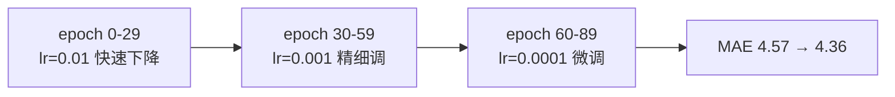

# 🎬 第 10 章 · 创建预测序列的 ML 模型（Creating ML Models to Predict Sequences）

> 本章对应原书 *AI and ML for Coders in PyTorch*（Laurence Moroney 著）第 10 章 "Creating ML Models to Predict Sequences"，PDF 第 231–244 页。

## 🗺️ 本章地图（读完能会什么）

- 承接 [[09_理解序列与时间序列数据]] 里那条「趋势 + 季节性 + 噪声」的合成时间序列，本章正式从**统计预测**跨到**机器学习预测**——这是全书从图像/文本转向序列建模的关键一跳。
- 学会**窗口化数据集（windowed dataset）**：把一维时间序列切成「前 N 个值当特征、第 N+1 个值当标签」的监督学习样本。这是所有序列模型（DNN / RNN / LSTM / Transformer）喂数据的通用套路。
- 学会用 `tensor.unfold`、`TensorDataset`、`Subset`、`DataLoader` 把序列变成可批量、可打乱、可切分训练/验证集的标准数据管线。
- 用一个**只有三层 Linear 的 DNN** 把合成序列拟合出来，并用 **MAE** 客观评估，感受「ML 比朴素统计强在哪」。
- 学会**学习率调度（learning rate scheduling）**：用 `StepLR` 在训练中动态降 LR，把 MAE 从 4.57 压到 4.36，体会最基础的超参调优。
- 为下一章 [[11_用卷积与循环方法做序列建模]] 用 RNN/LSTM 建模埋好伏笔。

> 💡 **一句话本质**：时间序列预测的核心不是模型多花哨，而是**先把「用过去预测未来」这句话翻译成一堆 `(过去 N 个值 → 下一个值)` 的监督样本**——一旦数据被窗口化成特征/标签对，剩下的就是我们早已熟悉的普通回归问题。

---

## 🪟 为什么要窗口化：把「预测未来」翻译成「监督学习」

第 9 章我们造了一条合成时间序列（见原书 Figure 10-1）。现在想象一个具体任务：**预测 time step 1,200 处的值**。凭什么预测？凭它前面那些值。假设我们决定用**前 30 个值**（time step 1,170 到 1,199）来预测 1,200 处的值。

这时候一个熟悉的画面浮现了——前 30 个值就是**特征（features）**，第 31 个值就是**标签（label）**。如果对整条序列的每个位置都这么切一刀，就得到一大批 `(特征, 标签)` 对，一个标准的监督学习数据集就诞生了。

> 📖 原书原文（约 210 页）：
> *"If you can get your dataset into a condition where you have a certain number of values as features and the following value as the label, and if you do this for every known value in the dataset, then you'll end up with a pretty decent set of features and labels that you can use to train a model."*
> 中译：「如果你能把数据集整理成『若干个值作为特征、紧随其后的那个值作为标签』的形式，并且对数据集里每一个已知值都这么做，那么你最终会得到一套相当不错的特征与标签，可以用来训练模型。」

这就是**第一性原理**：时间序列预测本质上是「函数拟合」——学一个函数 $f$，使得 $f(x_{t-N}, \dots, x_{t-1}) \approx x_t$。窗口化就是把这个函数的输入输出显式地摆到桌面上。


> 💡 **实战/面试高频**：面试常问「时间序列怎么做成监督学习？」标准答法就是**滑动窗口**：用长度为 N 的窗口在序列上滑动，窗口内前 N-1 个（或前 N 个）当特征、下一个当标签。这套路对 DNN、RNN、Transformer 全通用，只是模型换了、喂法不变。

---

## 🔧 创建一个窗口化数据集（Creating a Windowed Dataset）

原书的教学策略很聪明：**先别碰那条 1461 个点的真序列，先拿一个 0–9 的迷你序列练手**，把窗口化的机制看清楚。用 `torch.arange(10)` 造一个「假时间序列」，然后用 PyTorch 张量自带的 `unfold` 开滑动窗口。

### 第一步：只切窗口，不分特征/标签

```python
import torch

def create_sliding_windows(data, window_size, shift=1):
    # 如果传进来的不是张量，先转成张量
    if not isinstance(data, torch.Tensor):
        data = torch.tensor(data)

    # 计算有效窗口数量（这里只是提示性计算，unfold 会自己算）
    n = len(data)
    num_windows = max(0, (n - window_size) // shift + 1)

    # 核心：用 unfold 在第 0 维开一个滑动窗口视图
    windows = data.unfold(0, window_size, shift)

    return windows

# 示例：0-9 这条迷你序列，窗口大小 5，每次滑动 1 格
data = torch.arange(10)
windows = create_sliding_windows(data, window_size=5, shift=1)

for window in windows:
    print(window.numpy())
```

跑出来是这样，每一行就是一个长度为 5 的窗口，逐格右移：

```
[0 1 2 3 4]
[1 2 3 4 5]
[2 3 4 5 6]
[3 4 5 6 7]
[4 5 6 7 8]
[5 6 7 8 9]
```

`unfold` 这个 API 是本章的技术核心，它有三个参数：

| 参数 | 含义 | 本例取值 |
|---|---|---|
| `dimension` | 沿哪个维度展开（一维序列就是第 0 维） | `0` |
| `size` | 每个滑动窗口的长度（window_size） | `5` |
| `step` | 相邻窗口之间的步长（shift / stride） | `1` |

> 📖 原书原文（约 212 页）：
> *"This uses the unfold technique on tensor data, which creates a sliding window over your data to turn it into sets like those outlined previously."*
> 中译：「这里对张量数据使用了 unfold 技巧，它在你的数据上创建了一个滑动窗口，把数据变成前面描述的那种样本集合。」

> ⚠️ **踩坑**：`unfold` 返回的是原张量的**视图（strided view）**，不是拷贝——它靠改 stride 实现，几乎零内存开销、超快。但正因为是视图，**别对它做原地（in-place）修改**，否则会改脏原数据。需要独立副本时记得 `.clone()`。另外，把窗口维度放哪也有讲究：`unfold` 会把新窗口维**追加到最后**，所以 `data.unfold(0,5,1)` 出来的形状是 `(6, 5)`，即 `(窗口数, 窗口长度)`。

### 第二步：把每个窗口切成「特征 + 标签」

有了窗口，还差临门一脚：把每个窗口的**最后一个值抠出来当标签**，前面的当特征。纯 Python 切片就能搞定。

```python
import torch

def create_sliding_windows_with_target(data, window_size, shift=1):
    if not isinstance(data, torch.Tensor):
        data = torch.tensor(data, dtype=torch.float32)

    windows = data.unfold(0, window_size, shift)   # (num_windows, window_size)

    features = windows[:, :-1]   # 除最后一个外的所有元素 → 特征
    targets  = windows[:, -1:]   # 只取最后一个元素 → 标签（保留维度，形状 (num_windows, 1)）

    return features, targets

data = torch.arange(10)
features, targets = create_sliding_windows_with_target(data, window_size=5, shift=1)

for x, y in zip(features, targets):
    print(f"Features: {x.numpy()}, Target: {y.numpy()}")
```

输出正是我们想要的「前 4 个值 → 第 5 个值」：

```
[0 1 2 3] [4]
[1 2 3 4] [5]
[2 3 4 5] [6]
[3 4 5 6] [7]
[4 5 6 7] [8]
[5 6 7 8] [9]
```

注意一个小细节：`windows[:, -1:]` 用的是切片 `-1:` 而不是索引 `-1`。索引 `-1` 会把那一维**压掉**得到形状 `(num_windows,)`；切片 `-1:` **保留**那一维得到 `(num_windows, 1)`。后者才和模型输出 `(batch, 1)` 对得上，算 MSE 时不会触发广播踩坑（后面「常见坑」会细说）。

### 第三步：包成 TensorDataset，享受打乱与分批

有了 `features` 和 `targets` 两个张量，直接塞进 `TensorDataset`，就能白嫖 PyTorch 原生的 shuffle 和 batch 能力。

```python
from torch.utils.data import TensorDataset, DataLoader

data = torch.arange(10)
features, targets = create_sliding_windows_with_target(data, window_size=5, shift=1)

dataset = TensorDataset(features, targets)     # 把特征和标签打包成一个数据集

batch_size = 2
dataloader = DataLoader(dataset, batch_size=batch_size, shuffle=True)

for batch_features, batch_targets in dataloader:
    print(f"Batch features shape: {batch_features.shape}")
    print(f"Features:\n{batch_features}")
    print(f"Targets:\n{batch_targets}\n")
```

因为 `shuffle=True`，每批的两条样本是随机抓的（起始值可能是 5 和 0、1 和 3……），标签也跟着走：

```
Features:
tensor([[5, 6, 7, 8],
        [0, 1, 2, 3]])
Targets:
tensor([[9],
        [4]])
...
```

> ⚠️ **踩坑（原书特别强调）**：
> 原书原文（约 213 页）：*"In time series data, shuffling before the split can cause information from the training set to bleed into the test set, which would compromise the evaluation process."*
> 中译：「对时间序列数据，如果在切分之前就打乱，会导致训练集的信息泄漏到测试集，从而破坏评估过程。」
> 这是时间序列的**头号大坑**：一定要**先按时间顺序切好 train/val/test，再对训练集内部 shuffle**。窗口是重叠的（窗口 1 是 `[0,1,2,3]→4`，窗口 2 是 `[1,2,3,4]→5`），如果先打乱再切，验证集里某个窗口的「过去」可能正是训练集里某个窗口的「未来」，模型等于偷看了答案。这跟图像分类可以随便 shuffle 完全不同。

---

## 📈 把真实合成序列窗口化（Creating a Windowed Version of the Time Series Dataset）

现在把迷你序列换成第 9 章那条真序列。先回顾造数据的代码（趋势 + 季节性 + 噪声）：

```python
import numpy as np

def trend(time, slope=0):
    return slope * time

def seasonal_pattern(season_time):
    # 前 40% 用余弦波，后面用指数衰减，模拟一个季节形状
    return np.where(season_time < 0.4,
                    np.cos(season_time * 2 * np.pi),
                    1 / np.exp(3 * season_time))

def seasonality(time, period, amplitude=1, phase=0):
    season_time = ((time + phase) % period) / period
    return amplitude * seasonal_pattern(season_time)

def noise(time, noise_level=1, seed=None):
    rnd = np.random.RandomState(seed)
    return rnd.randn(len(time)) * noise_level

time = np.arange(4 * 365 + 1, dtype="float32")   # 4 年 + 1 天 = 1461 个点
baseline = 10
amplitude = 20
slope = 0.09
noise_level = 5

series = baseline + trend(time, slope)                       # 基线 + 上升趋势
series += seasonality(time, period=365, amplitude=amplitude)  # 加一年一个周期的季节性
series += noise(time, noise_level, seed=42)                   # 加固定种子的噪声（结果可复现）
```

然后用刚写好的函数窗口化，窗口大小设为 **30**（用前 29 天预测第 30 天）：

```python
import torch
from torch.utils.data import TensorDataset, DataLoader

series_tensor = torch.tensor(series, dtype=torch.float32)

window_size = 30
features, targets = create_sliding_windows_with_target(
    series_tensor, window_size=window_size, shift=1)

dataset = TensorDataset(features, targets)
batch_size = 32
train_loader = DataLoader(dataset, batch_size=batch_size, shuffle=True)

print(f"Series length: {len(series)}")
print(f"Number of windows: {len(features)}")
print(f"Feature shape: {features.shape}")   # (num_windows, window_size-1)
print(f"Target shape: {targets.shape}")     # (num_windows, 1)
```

输出把形状说得明明白白：

```
Series length: 1461
Number of windows: 1432
Feature shape: torch.Size([1432, 29])
Target shape: torch.Size([1432, 1])
```

**算一下数字对不对**：序列 1461 个点，窗口长 30，步长 1，窗口数 = `(1461 - 30) // 1 + 1 = 1432`。每个窗口 30 个值，前 29 个当特征（所以是 `[1432, 29]`），第 30 个当标签（`[1432, 1]`）。数字全对得上——**做序列时永远要能手算出这几个形状**，对不上就说明窗口逻辑写错了。

### 切分训练集与验证集：必须按时间顺序切

原书用 `torch.utils.data.Subset`，取前 1000 个窗口当训练、剩下的当验证。**关键：按索引顺序切，不打乱**，这样验证集在时间上严格晚于训练集。

```python
from torch.utils.data import Subset, DataLoader

full_dataset = TensorDataset(features, targets)

train_size = 1000
total_windows = len(full_dataset)
train_indices = list(range(train_size))                    # 前 1000 个（较早的时间）
val_indices   = list(range(train_size, total_windows))     # 剩下的（较晚的时间）

train_dataset = Subset(full_dataset, train_indices)
val_dataset   = Subset(full_dataset, val_indices)

batch_size = 32
train_loader = DataLoader(train_dataset, batch_size=batch_size, shuffle=True)   # 训练集可以内部打乱
val_loader   = DataLoader(val_dataset,   batch_size=batch_size, shuffle=False)  # 验证集绝不打乱
```

检查一条样本长啥样：

```python
features, target = train_dataset[0]
print(f"Features shape: {features.shape}")   # torch.Size([29])
print(f"Target: {target.item()}")            # 28.71073...
```

单条样本的特征是 29 维向量，标签是一个标量。注意这里 `train_dataset[0]` 取的是**单条**（没过 DataLoader，所以没有 batch 维），形状是 `(29,)`；过了 `DataLoader` 后才会变成 `(batch, 29)`。

> 💡 **实战/面试高频**：为什么验证集 `shuffle=False`？两个原因：（1）验证不需要打乱，打乱不影响指标但白费算力；（2）更重要的是**画预测曲线时要按时间顺序**，打乱了画出来就是一团乱麻，没法和真实曲线叠图对比。训练集 `shuffle=True` 则是为了打散每个 batch 的相关性、让梯度估计更稳。

---

## 🧠 创建并训练一个 DNN 来拟合序列（Creating and Training a DNN）

数据准备好了，模型反而是最简单的部分——一个**三层全连接**的普通 DNN。

```python
import torch.nn as nn
import torch.optim as optim

class TimeSeriesModel(nn.Module):
    def __init__(self, window_size):
        super(TimeSeriesModel, self).__init__()
        # 输入是 window_size-1 维（29），因为最后一个值被拿去当标签了
        self.network = nn.Sequential(
            nn.Linear(window_size - 1, 10),   # 29 → 10
            nn.ReLU(),
            nn.Linear(10, 10),                # 10 → 10（隐藏层）
            nn.ReLU(),
            nn.Linear(10, 1)                  # 10 → 1（输出预测的下一天的值）
        )

    def forward(self, x):
        return self.network(x)

model = TimeSeriesModel(window_size)
criterion = nn.MSELoss()                       # 回归问题用均方误差
optimizer = optim.Adam(model.parameters())     # Adam，默认 lr=1e-3
```

> 📖 原书原文（约 218 页）：
> *"In this case, the loss function is specified as MSELoss, which stands for 'mean squared error' and is commonly used in regression problems (which is what this ultimately boils down to). For the optimizer, Adam is a good fit."*
> 中译：「这里损失函数指定为 MSELoss，即『均方误差』，常用于回归问题（本任务归根结底就是个回归问题）。优化器用 Adam 很合适。」

**为什么是这些选择**（第一性原理）：
- **MSE 损失**：预测的是连续数值（明天的序列值），这是回归而不是分类，所以不用交叉熵，用 MSE。MSE 对大误差惩罚更重（平方放大），训练时逼模型别犯离谱错误。
- **Adam 优化器**：自适应学习率 + 动量，收敛快、对超参不敏感，是回归任务的稳妥默认选择。
- **输入 29 维**：窗口 30，抠掉最后一个当标签，剩 29 个特征。这就是 `nn.Linear(window_size-1, 10)` 里 `window_size-1` 的由来。

### 标准训练循环

原书的训练循环是 PyTorch 最经典的「三件套」：`zero_grad → backward → step`。

```python
train_losses, val_losses = [], []
epochs = 100
device = torch.device("cuda" if torch.cuda.is_available() else "cpu")
model = model.to(device)

for epoch in range(epochs):
    # ---- 训练阶段 ----
    model.train()
    train_loss = 0
    for batch_features, batch_targets in train_loader:
        batch_features = batch_features.to(device)
        batch_targets  = batch_targets.to(device)

        outputs = model(batch_features)               # 前向：(32, 29) → (32, 1)
        loss = criterion(outputs, batch_targets)      # 算 MSE

        optimizer.zero_grad()   # 清空上一轮的梯度（PyTorch 梯度默认累加）
        loss.backward()         # 反向：算出每个参数的梯度
        optimizer.step()        # 更新参数

        train_loss += loss.item()

    # ---- 验证阶段 ----
    model.eval()
    val_loss = 0
    with torch.no_grad():       # 验证不需要梯度，省显存 + 提速
        for batch_features, batch_targets in val_loader:
            batch_features = batch_features.to(device)
            batch_targets  = batch_targets.to(device)
            outputs = model(batch_features)
            val_loss += criterion(outputs, batch_targets).item()

    # 求每个 epoch 的平均 loss
    train_loss /= len(train_loader)
    val_loss   /= len(val_loader)
    train_losses.append(train_loss)
    val_losses.append(val_loss)
```

跑 100 个 epoch，loss 会从很高一路稳降（原书 Figure 10-4）。这时候你会亲眼看到「模型在学」。

> 💡 **实战/面试高频**：`optimizer.zero_grad()` 为什么不能忘？因为 PyTorch 的梯度是**累加**的（`loss.backward()` 把新梯度加到 `.grad` 上而不是覆盖）。忘了清零，梯度就会跨 batch 越滚越大，训练直接崩。顺序也别记错：**先 zero_grad，再 backward，最后 step**。

> ⚠️ **踩坑**：验证阶段一定要 `model.eval()` + `with torch.no_grad()` 双管齐下。`eval()` 让 Dropout/BatchNorm 切到推理模式，`no_grad()` 关掉计算图省显存提速。本章的模型没有 Dropout/BatchNorm，`eval()` 影响不大，但养成习惯：换成有 BN 的模型时忘了 `eval()` 会让验证指标假高假低。

---

## 🔬 关键代码拆解

本章最核心、也最容易在形状上翻车的，是**特征/标签切分 + 模型前向**这条数据流。把它逐块拆开，盯紧每一步的张量形状：

```python
# ① unfold：一维序列 → 二维窗口矩阵
windows = series_tensor.unfold(0, 30, 1)
# series_tensor:  (1461,)          一条一维序列
# windows:        (1432, 30)       1432 个窗口，每个长 30
#   dim0 参数说明沿第 0 维滑；size=30 窗口长；step=1 步长

# ② 切特征与标签
features = windows[:, :-1]   # (1432, 29)   每行前 29 个 = 特征
targets  = windows[:, -1:]   # (1432, 1)    每行最后 1 个 = 标签（保留列维，故是 1 不是标量）

# ③ 打包 + DataLoader
dataset = TensorDataset(features, targets)
loader  = DataLoader(dataset, batch_size=32, shuffle=True)
# 每次迭代吐出：batch_features (32, 29)，batch_targets (32, 1)

# ④ 模型前向：一层层看形状怎么变
#   输入          x: (32, 29)
#   Linear(29,10) →  (32, 10)
#   ReLU          →  (32, 10)
#   Linear(10,10) →  (32, 10)
#   ReLU          →  (32, 10)
#   Linear(10,1)  →  (32, 1)   ← 和 batch_targets 形状一致，MSE 才不会广播出 bug
outputs = model(batch_features)     # (32, 1)
loss = criterion(outputs, targets)  # 标量
```

三个形状锚点必须记牢：**`(1432, 29)` 特征 → `(1432, 1)` 标签 → 模型输出 `(batch, 1)`**。只要这三个对得上，整条链路就是通的。序列建模里 90% 的诡异报错都出在「标签维度被压掉了」或「输出输入维度对不上」，盯死形状就能秒定位。

---

## 📊 评估 DNN 的结果（Evaluating the Results of the DNN）

模型训好了，怎么知道它到底行不行？两步：**画预测 vs 真实曲线**（直觉）+ **算 MAE**（客观）。

### 收集预测值

```python
model.eval()
with torch.no_grad():
    val_predictions, val_targets = [], []
    for batch_features, batch_targets in val_loader:
        batch_features = batch_features.to(device)
        outputs = model(batch_features)
        val_predictions.extend(outputs.cpu().numpy())    # 张量搬回 CPU → numpy → 拼进大列表
        val_targets.extend(batch_targets.numpy())
```

这里有个原书特意点出的 `.cpu()` 细节：

> 📖 原书原文（约 220 页）：
> *"PyTorch allows you to designate where your code runs, and if you have a GPU or other accelerator available, you can push the intense calculations of ML to it. You can also use a CPU to do other things like processing and preprocessing data to save accelerator time."*
> 中译：「PyTorch 允许你指定代码在哪里运行——如果有 GPU 或其他加速器，就把 ML 的密集计算推到它上面；同时也可以用 CPU 去做数据处理、预处理等其他事，从而节省加速器的时间。」

即：模型在 GPU 上算，但要转 numpy、拼列表、画图这些，得先 `.cpu()` 把张量搬回来（numpy 不认 GPU 张量）。

### 画图：预测 vs 真实

```python
import matplotlib.pyplot as plt

plt.figure(figsize=(15, 6))
plt.plot(val_targets,     label='Actual',    color="lightgrey")
plt.plot(val_predictions, label='Predicted', color="red")
plt.title('Predictions vs Actual Values (Validation Set)')
plt.xlabel('Time'); plt.ylabel('Value')
plt.legend(); plt.grid(True); plt.show()
```

原书 Figure 10-5 的结果：**红色预测线紧贴原始数据的整体走势，但明显更平滑、方差更小**。这非常符合直觉——模型学到了趋势和季节性（可预测的部分），但学不到噪声（本就随机、不可预测）。数据剧烈变化时，预测会「慢半拍」才追上。

### 算 MAE：客观指标

肉眼看曲线不够精确，得上数字。第 9 章介绍过 **MAE（平均绝对误差）**，这里用 `torch.mean` + `torch.abs` 手算：

```python
val_predictions_tensor = torch.tensor(val_predictions)
val_targets_tensor     = torch.tensor(val_targets)

mae_torch = torch.mean(torch.abs(val_predictions_tensor - val_targets_tensor))
print(f"Validation MAE (PyTorch): {mae_torch:.4f}")
```

原书作者跑出来 **MAE = 4.57**（因为有随机噪声，你的结果会略有不同）。

| 评估手段 | 优点 | 局限 |
|---|---|---|
| 肉眼看曲线 | 直观，能看出「慢半拍」「过平滑」等定性问题 | 无法量化，没法比较两个模型谁更好 |
| MAE（平均绝对误差） | 单一数字，单位和原数据一致，好解释 | 对异常值不如 MSE 敏感 |
| MSE（训练损失） | 对大误差惩罚重，适合当损失函数优化 | 单位是平方，不直观 |

> 💡 **实战/面试高频**：MAE 和 MSE 怎么选？**训练时**常用 MSE 当损失（可导、对大误差惩罚重、优化友好）；**汇报/评估时**常用 MAE（单位和原数据一致、好向业务解释「平均差 4.57」）。原书正是这么分工的：loss 用 MSELoss，评估用 MAE。

---

## 🎚️ 调学习率（Tuning the Learning Rate）

把预测做得更准，本质上就是**把 MAE 降下去**。除了改窗口大小，本章重点演示**调学习率**。

回想之前的优化器：

```python
optimizer = optim.Adam(model.parameters())   # 没写 lr，用默认 1e-3
```

> 📖 原书原文（约 222 页）：
> *"In that case, you didn't specify an LR, so the model used the default LR of 1 × 10⁻³. But that seemed to be a really arbitrary number. What if you changed it, and how should you go about changing it?"*
> 中译：「这种情况下你没指定学习率，模型就用了默认的 1×10⁻³。可这个数字看起来挺随意的。如果改一改会怎样？又该怎么改呢？」

### 用 lr_scheduler 动态降 LR

一个好实践：**开局用较大 LR 快速下降，随训练进行逐步调小 LR 精细收敛**。PyTorch 用 `torch.optim.lr_scheduler` 实现。

```python
from torch.optim import lr_scheduler

optimizer = optim.Adam(model.parameters(), lr=0.01)   # 起步 1e-2，很高

# StepLR：每 step_size 个 epoch，把 lr 乘以 gamma
scheduler = lr_scheduler.StepLR(optimizer, step_size=30, gamma=0.1)
```

这个调度器的行为是：**起步 0.01 → 第 30 个 epoch 后 ×0.1 变 0.001 → 第 60 个 epoch 后再 ×0.1 变 0.0001**……阶梯式下降。

配套要在训练循环里每个 epoch 末尾调一次 `scheduler.step()`：

```python
for epoch in range(epochs):
    # ... 训练一个 epoch ...
    scheduler.step()   # ⚠️ 每个 epoch 结束调一次（注意别和 optimizer.step() 混）
    print(f"Epoch {epoch}: lr = {scheduler.get_last_lr()[0]:.5f}")
```

原书结果：这么一调，**MAE 从 4.57 略降到 4.36**。继续折腾窗口大小（30 天不够就试 40 天）、多训几个 epoch，**能把 MAE 压到接近 4**。



| 调优手段 | 怎么改 | 原书效果 |
|---|---|---|
| 加 StepLR 调度 | `lr=0.01` + 每 30 epoch ×0.1 | MAE 4.57 → 4.36 |
| 改窗口大小 | 30 → 40 天 | 作者建议自己试 |
| 训更多 epoch | 100 → 更多 | 综合可到 ≈4 |

> ⚠️ **踩坑**：`scheduler.step()` 和 `optimizer.step()` 是**两回事**，别搞混。`optimizer.step()` 每个 **batch** 调一次（更新参数）；`scheduler.step()` 一般每个 **epoch** 调一次（更新学习率）。放错位置（比如 scheduler 也放进 batch 循环）会让 LR 掉得飞快，模型没学几步 LR 就趋近 0，训练卡死。

> 💡 **实战/面试高频**：LR 太大/太小分别啥症状？**太大**——loss 震荡甚至发散（NaN），因为每步跨太远越过最优点；**太小**——loss 降得极慢、卡在局部最优。所以「大 LR 起步 + 逐步衰减」是黄金组合：先大步快速逼近，再小步精细落点。这也是为什么 Transformer 训练普遍用 warmup + decay 的调度策略。

---

## 🌍 社区案例与延伸

本章讲的「滑动窗口 + DNN 回归」是序列建模的入门套路，工业界和学术界有大量更成熟的实践可以佐证与延伸：

1. **经典时序竞赛数据集 M4 / M5（Makridakis Competitions）**。M4 有 10 万条时间序列，M5（Kaggle 2020，沃尔玛销量预测）验证了一个反常识结论：**纯统计方法（如指数平滑）和轻量 ML（LightGBM）在很多真实业务序列上依然打得过深度网络**。这提醒我们别一上来就堆大模型，本章的简单 DNN 有它的位置。参见 M5 竞赛综述：*"The M5 competition: Background, organization, and implementation"*（Makridakis et al., 2022, International Journal of Forecasting）。

2. **Facebook Prophet（github.com/facebook/prophet）**。把「趋势 + 季节性 + 假日效应」显式建模的开源库，思路和本章造合成序列的 `trend + seasonality + noise` 完全同源——只不过 Prophet 是拿这套分解去做**预测**而非造数据。适合快速上手业务时序预测。

3. **DeepAR（Salinas et al., 2020, arXiv:1704.04110）**。亚马逊提出的基于 RNN 的概率时序预测模型，是「用神经网络做时序」的工业标杆。它比本章的 DNN 多两个关键升级：用 RNN 捕捉长依赖（下一章 [[11_用卷积与循环方法做序列建模]] 会讲）、输出概率分布而非单点值。是从本章走向生产级时序预测的自然下一步。

4. **N-BEATS（Oreshkin et al., 2020, arXiv:1905.10437）**。纯前馈网络（和本章一样不用 RNN！）却在 M4 上击败所有传统方法，证明了「DNN + 巧妙的架构设计」在时序上的潜力，是对本章「简单 DNN 也能打」这一信念的有力延伸。

---

## 🔗 通向 LLM

本章的每个概念，在现代 LLM 里都能找到直接对应——序列建模是 LLM 的**亲爹**：

- **滑动窗口 = LLM 的上下文窗口 + 因果语言建模**。本章「用前 29 个值预测第 30 个值」，和 GPT「用前面的 token 预测下一个 token」是**同一个数学范式**：自回归（autoregressive）下一步预测。LLM 训练时把长文本切成固定长度的 block（比如 2048/4096 token），每个位置都在做「给定左侧全部 token，预测当前 token」——本质就是一个超大号、滑动的窗口化数据集。

- **窗口大小 = context length（上下文长度）**。本章纠结「30 天窗口够不够、要不要 40 天」，正是 LLM 世界里「上下文长度 2K 够不够、要不要 128K / 1M」的雏形。窗口越长，能利用的历史越多，但计算成本也越高——这个 trade-off 从时序 DNN 一路贯穿到长上下文 LLM。

- **DataLoader + 窗口化 = LLM 的数据管线**。本章用 `unfold + TensorDataset + DataLoader` 把序列切成批。LLM 预训练的数据管线一模一样，只是规模巨大：把万亿 token 打包（packing）成定长序列、分批、喂给模型。你在这里练的形状意识 `(batch, seq_len)`，就是 LLM 训练脚本里天天打交道的张量形状。

- **自回归解码 = 本章「预测下一个值」的推理版**。本章训完模型逐点预测序列；LLM 推理时逐 token 生成，把生成的 token 拼回输入再预测下一个——同一个「预测下一步」的循环，只不过值换成了 token 的概率分布。这条线在 [[08_用机器学习生成文本]] 已经初见端倪，到 [[15_Transformer架构与transformers库]] 会完全展开。

- **学习率调度 = LLM 训练的标配 warmup + decay**。本章的 `StepLR` 是最朴素的调度；LLM 训练普遍用「线性 warmup + 余弦衰减（cosine decay）」——开局几百步把 LR 从 0 慢慢拉起来（防止一开始梯度爆炸），然后余弦曲线缓慢降到接近 0。原理和本章「大 LR 起步、逐步降」一脉相承，只是曲线更讲究。

> 💡 一句话串起来：**把「时间序列」换成「token 序列」，把「预测下一个数值」换成「预测下一个 token」，本章的 DNN 就长成了 GPT。** 序列建模的地基在这里，Transformer 只是把这个地基上的「模型」部分换成了注意力机制。

---

## ⚠️ 常见坑

1. **切分前就 shuffle 导致数据泄漏**：时间序列窗口彼此重叠，先打乱再切 train/val，验证集会「偷看」训练集的未来。**铁律：先按时间顺序切，再对训练集内部 shuffle**；验证集 `shuffle=False`。

2. **标签维度被压掉，MSE 静默广播出错**：用 `windows[:, -1]`（索引）得到 `(N,)`，模型输出是 `(N, 1)`，两者做 MSE 会**广播成 `(N, N)`**，loss 变成一个诡异的大数却不报错。务必用 `windows[:, -1:]`（切片）保留成 `(N, 1)`。

3. **忘记 `optimizer.zero_grad()`**：PyTorch 梯度累加，忘清零会让梯度跨 batch 越滚越大，loss 发散。顺序记牢：`zero_grad → backward → step`。

4. **`scheduler.step()` 放错位置**：应每个 **epoch** 调一次，误放进 batch 循环会让 LR 断崖式下跌，模型没学几步就停止更新。也别和 `optimizer.step()` 弄混。

5. **GPU 张量直接转 numpy 报错**：`outputs.numpy()` 在 GPU 张量上会崩，必须先 `.cpu()`。且转 numpy 前若张量还带梯度，需要 `.detach()`（本章在 `torch.no_grad()` 块里所以省了）。

6. **不做归一化直接喂**：本章序列数值范围不大（几十）所以能直接训，但真实业务序列（如股价、销量）量级差异巨大，**不归一化会让训练极不稳定**。生产中通常先做标准化/归一化，预测后再反变换回原量纲。

---

## 🎯 面试速答

- **Q：时间序列怎么转成监督学习问题？**
  A：滑动窗口。用长度 N 的窗口在序列上滑动，窗口内前 N-1 个值当特征、最后一个值当标签，对每个位置都切一刀，得到一批 `(过去→未来)` 的回归样本。

- **Q：时间序列切分数据集和图像分类有什么不同？**
  A：图像可以随便 shuffle 再切；时间序列**必须先按时间顺序切 train/val/test，再对训练集内部 shuffle**，否则窗口重叠会造成未来信息泄漏到验证集，评估虚高。

- **Q：为什么训练用 MSE，评估却看 MAE？**
  A：MSE 可导、对大误差惩罚重，适合当损失优化；MAE 单位和原数据一致、好向业务解释「平均差多少」，适合汇报。两者分工，不矛盾。

- **Q：学习率调度（StepLR / 衰减）有什么用？**
  A：大 LR 起步快速逼近最优区，逐步降 LR 精细收敛、避免在最优点附近震荡。本章 StepLR 把 MAE 从 4.57 降到 4.36；LLM 里对应 warmup + 余弦衰减。

- **Q：为什么预测曲线比真实曲线平滑？**
  A：模型能学到趋势和季节性（可预测的结构性成分），但学不到噪声（本就随机不可预测），所以输出是「去噪后的期望走势」，方差更小、更平滑。

---

## 📌 本章小结

1. **窗口化是序列建模的入场券**：把一维序列用滑动窗口切成 `(前 N-1 个值 → 第 N 个值)` 的特征/标签对，时间序列预测就变成了普通回归问题。核心 API 是 `tensor.unfold(dim, size, step)`。
2. **数据管线一条龙**：`unfold` 切窗口 → 切特征/标签 → `TensorDataset` 打包 → `Subset` 按时间切训练/验证 → `DataLoader` 分批。验证集切分前绝不 shuffle，防数据泄漏。
3. **模型可以很简单**：三层 Linear 的 DNN（29→10→10→1）+ MSELoss + Adam，就能把合成序列的趋势和季节性学得有模有样，预测曲线紧贴真实走势但更平滑。
4. **评估要定性 + 定量**：画预测 vs 真实曲线看趋势，算 MAE 给客观数字（本章 4.57）。降 MAE 就是调优的目标。
5. **调学习率是最基础的超参调优**：`StepLR` 让 LR 阶梯下降（大起步 + 逐步降），MAE 从 4.57 降到 4.36；配合调窗口大小和 epoch 数可逼近 4。这套「大 LR 起步、逐步衰减」的思想一路通向 LLM 的 warmup + decay。

---

## 🔗 延伸阅读 & 交叉链接

- 上一章打底：[[09_理解序列与时间序列数据]] —— 趋势/季节性/噪声/自相关，以及本章合成序列的来源和 MAE 指标。
- 下一章升级：[[11_用卷积与循环方法做序列建模]] —— 用 RNN/LSTM/Conv1D 替换本章的简单 DNN，捕捉更长的时间依赖。
- 数据管线基础：[[04_用PyTorch管理数据：Dataset与DataLoader]] —— `Dataset`/`DataLoader`/`Subset` 的完整用法，本章大量复用。
- 生成的同源思想：[[08_用机器学习生成文本]] —— 「预测下一个」在文本上的版本，通向自回归生成。
- 主线合流：[[15_Transformer架构与transformers库]] 与 [[21_从本书基础到LLM落地实战（合流篇）]] —— 序列建模如何长成现代 LLM。

外部真实资料：
- PyTorch `torch.Tensor.unfold` 官方文档：https://pytorch.org/docs/stable/generated/torch.Tensor.unfold.html
- PyTorch `torch.optim.lr_scheduler` 官方文档：https://pytorch.org/docs/stable/optim.html
- DeepAR 论文（RNN 概率时序预测）：Salinas et al., 2020, arXiv:1704.04110
- N-BEATS 论文（纯前馈网络做时序）：Oreshkin et al., 2020, arXiv:1905.10437
- Facebook Prophet 开源库：https://github.com/facebook/prophet
