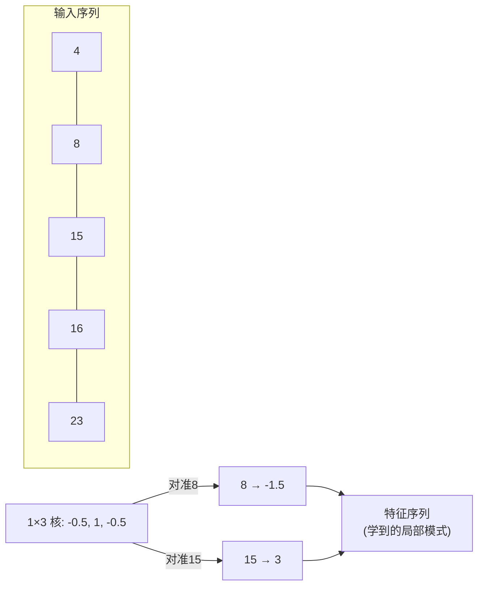
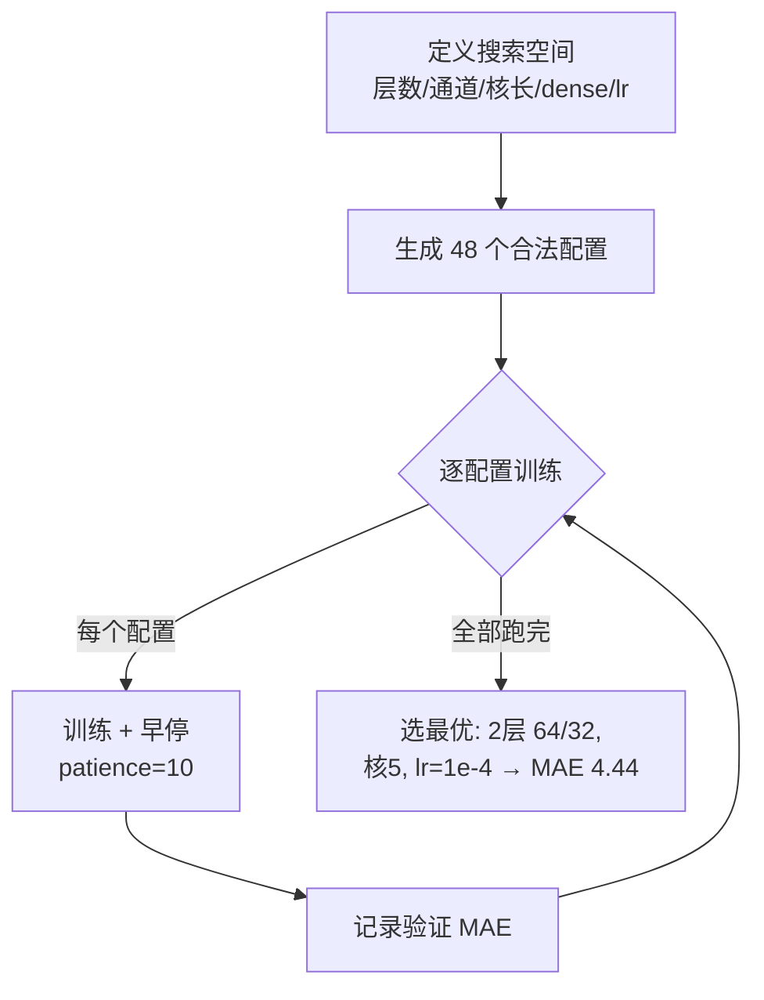
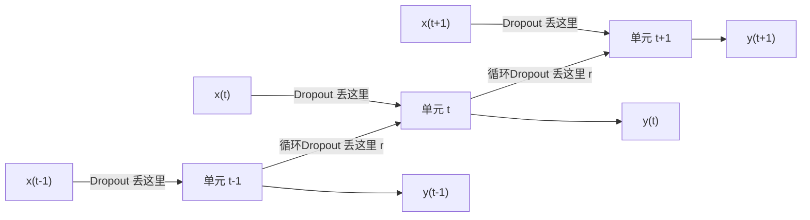

# 🎬 第 11 章 · 用卷积与循环方法做序列建模（Using Convolutional and Recurrent Methods for Sequence Models）

> 本章对应原书 *AI and ML for Coders in PyTorch*（Laurence Moroney 著）第 11 章 "Using Convolutional and Recurrent Methods for Sequence Models"，PDF 第 245–270 页。

## 🗺️ 本章地图（读完能会什么）

- 承接 [[09_理解序列与时间序列数据]] 和 [[10_创建预测序列的ML模型]]：第 9 章讲"序列长什么样"、第 10 章用 DNN + 滑窗做了第一个预测器，本章要给这个预测器**换更强的引擎**——1D 卷积（Conv1D）和循环网络（RNN/GRU/LSTM/双向）。
- 学完你能：把 [[03_卷积神经网络：在图像中检测特征]] 里学的 2D 卷积**降维成 1D** 用在时间序列上；写一个可跑的 `Conv1D` 时序模型；用**神经架构搜索（NAS）+ 早停**自动挑超参。
- 学会读**两个真实气象数据集**：NASA GISS 逐月地表温度、KNMI 的英格兰中部逐日温度（1772–2020，9 万+点），并处理 `999.9` 缺失值和归一化陷阱。
- 掌握把 `nn.RNN` 一行换成 `nn.GRU` / `nn.LSTM` 的"即插即用"技巧，理解 **Dropout vs 循环 Dropout** 的区别，以及**双向（Bidirectional）**为什么能消除预测"滞后"。
- 打通到 [[07_循环神经网络RNN与LSTM做NLP]]：本章的循环层就是当年 NLP 的主力军，也是理解现代 SSM/Mamba、以及 BERT 双向编码的地基。

> 💡 **一句话本质**：时间序列预测 = 在滑动窗口上做"高级模式匹配"；卷积负责抓**局部形状**，循环负责记**长程上下文**，双向负责**两头对齐**，而这些正是通向 [[15_Transformer架构与transformers库]] 的三块垫脚石。

---

## 🧩 1. 为什么卷积能处理序列数据？

在 [[03_卷积神经网络：在图像中检测特征]] 里，一个 2D 滤波器扫过图像，网络学会哪些滤波器值能有效提取"边缘、纹理"等特征。原书一句话点破了本章的核心迁移：

> "The same technique can be applied to numeric time series data, but with one modification: the convolution will be one dimensional (1D) instead of two dimensional."
> "同样的技术也能用在数值型时间序列上，只要做一个改动：卷积从二维变成一维。"（原书 p.223）

**第一性原理**：图像里，一个像素的"意义"取决于它周围的像素（局部空间结构）；时间序列里，一个时刻的值也取决于它前后几个时刻（局部时间结构）。2D 卷积用 `k×k` 的核抓空间局部；1D 卷积用长度 `k` 的核抓时间局部。两者数学上是同一件事，只是核少了一个维度。

原书举的例子：序列 `[4 8 15 16 23 42 51 64 99 -1]`，用一个 `1×3` 的滤波器 `[-0.5, 1, -0.5]` 扫过去：

- 对准第二个值 `8` 时：`-0.5×4 + 1×8 + (-0.5)×15 = -2 + 8 - 7.5 = -1.5`，`8` 被变换成 `-1.5`。
- 再滑一步对准 `15`：`-0.5×8 + 1×15 + (-0.5)×16 = -4 + 15 - 8 = 3`，`15` 被变换成 `3`。



> 💡 **实战/面试高频**：图像卷积**有标签**去学"哪个核能匹配像素改动"，而时序卷积**通常没有显式标签**——原书说得很准："there are no labels, but the convolutions that minimize overall loss can be learned"（没有标签，但能学出让整体损失最小的那组卷积核）。核是通过下游预测的损失反传学出来的。

---

## 🔧 2. 编码卷积：写一个 CNN1D

在加卷积之前，需要先用**滑动窗口**（第 10 章的 `create_sliding_windows_with_target`）把长序列切成 `(窗口, 下一个值)` 的样本对。有了 `DataLoader` 后，就在原来的全连接层前面塞一个卷积层。原书的模型：

```python
import torch
import torch.nn as nn
import torch.optim as optim

class CNN1D(nn.Module):
    def __init__(self, input_size):
        super(CNN1D, self).__init__()
        # 1D 卷积：单通道输入、128 个滤波器、核长 3、padding=1 保持长度
        self.conv1 = nn.Conv1d(in_channels=1,
                               out_channels=128,
                               kernel_size=3,
                               padding=1)

        conv_output_size = input_size  # "same padding" 保证输出长度 = 输入长度

        self.relu = nn.ReLU()
        self.flatten = nn.Flatten()
        self.dense1 = nn.Linear(128 * conv_output_size, 28)  # 128 个通道 × 窗口长
        self.dense2 = nn.Linear(28, 10)
        self.dense3 = nn.Linear(10, 1)   # 最终回归出一个标量：下一时刻的值

    def forward(self, x):
        # 把输入整形成 [batch, 1, seq_len]，这是 Conv1d 要的形状
        if len(x.shape) == 2:            # [32, 20] → 缺通道维
            x = x.unsqueeze(1)           # 在位置 1 插入通道 → [32, 1, 20]
        elif len(x.shape) == 3 and x.shape[1] != 1:  # [32, 20, 1] → 通道放错位置
            x = x.transpose(1, 2)        # 交换维度 → [32, 1, 20]

        x = self.relu(self.conv1(x))     # 卷积 + ReLU
        x = self.flatten(x)              # [32, 128, 20] → [32, 128*20=2560]
        x = self.relu(self.dense1(x))
        x = self.relu(self.dense2(x))
        x = self.dense3(x)
        return x
```

### 逐个参数拆解

| 参数 | 含义 | 本例取值 | 什么时候改 |
|---|---|---|---|
| `in_channels` | 每个时间步有几个特征 | `1`（单变量温度） | 多变量时改，如 RGB 就是 3 |
| `out_channels` | 学多少个滤波器（卷积核） | `128` | 想抓更多局部模式就调大 |
| `kernel_size` | 核覆盖几个连续时间步 | `3` | 想看更宽的局部窗就调大（5、7…） |
| `padding` | 两端补几个 0 | `1` | 配合核长做 "same" 填充 |

关于 **`padding` 与 same padding**，原书解释得很直观：序列 `[4 8 15 …]` 若不填充，核长 3 的滤波器第一次只能看 `[4 8 15]`，`4` 永远当不了"中间值"，头尾各丢一个，输出长度是 `n-2`。加 `padding=1` 后序列变成 `[0 4 8 15 … 99 -1 0]`，核第一次看 `[0 4 8]`，输出长度恢复成 `n`——这就是 "same padding"（同尺寸填充）。

> "But if we pad the list with padding=1, then the kernel sliding across the list will give us n answers, so the output size from the layer will be the same as the input size."
> "但若用 padding=1 填充列表，核滑过后会给出 n 个结果，于是该层输出尺寸与输入尺寸相同。"（原书 p.225）

正因为输出长度 = 输入长度，`self.dense1 = nn.Linear(128 * conv_output_size, 28)` 里的输入维度才能写成 `128 * input_size`（128 个通道，每通道 `input_size` 个点）。

> ⚠️ **踩坑**：`nn.Conv1d` 的输入约定是 `[batch, channels, length]`，**通道在中间**，跟 NLP 里常见的 `[batch, length, features]`（`batch_first`）**恰好相反**。原书那段 `if/elif` 就是在兜底两种可能的输入形状，把它们都掰成 `[32, 1, 20]`。你换数据集时最容易在这里挂——记住"卷积要通道在中间"。

训练则一如既往地朴素——回归任务用 MSE，优化器用 Adam：

```python
criterion = nn.MSELoss()
optimizer = optim.Adam(model.parameters(), lr=learning_rate)
```

预测时复用 loader，逐 batch 前向即可：

```python
def predict(model, loader):
    device = torch.device("cuda" if torch.cuda.is_available() else "cpu")
    model.eval()                          # 关掉 Dropout、切换 BN 统计
    predictions = []
    with torch.no_grad():                 # 推理不建计算图，省显存
        for inputs, _ in loader:
            inputs = inputs.to(device)
            batch_predictions = model(inputs)
            predictions.append(batch_predictions.cpu().numpy())
    return np.concatenate(predictions)
```

原书坦白：这个朴素 CNN 的 MAE 是 **5.33**，比第 10 章纯 DNN **还略差**。作者没有掩饰，反而借机点出一个重要心态：

> "This could be because we haven't tuned the convolutional layer appropriately, or it could be that convolutions simply don't help. This is the type of experimentation you'll need to do with your data."
> "可能是我们没调好卷积层，也可能是卷积对这份数据根本没用。这正是你需要在自己数据上做的那类实验。"（原书 p.228）

> 💡 **实战/面试高频**：**加了新结构反而变差**是家常便饭，别慌。第一反应不是"卷积没用"，而是"超参没调"。下一节的 NAS 就是系统化地把这句话验证一遍。

---

## 🔍 3. 试验 Conv1D 超参：一次微型神经架构搜索（NAS）

为什么是 128 个滤波器、核长 3？原书的答案是：**别硬编码，去搜**。PyTorch 定义网络"啰嗦"反而是优点——改结构很直接。思路是列出一批候选参数，各训一小会儿，挑损失最低的。

```python
# 定义搜索空间
num_conv_layers_options = [1, 2]        # 卷积层数
conv_channels_options = [
    [32],
    [64],
    [32, 16],
    [64, 32],
]
kernel_sizes = [3, 5]
dense_sizes_options = [
    [16],
    [32, 16],
    [64, 32],
]
learning_rates = [0.001, 0.0001]
```

原书特意提醒组合数的坑：表面看是 `4(通道) × 2(核) × 3(dense) × 2(lr) = 48`，你可能以为要乘上 2 种层数变成 96，但代码里**只允许"通道配置的长度 == 层数"的组合**，所以卷积部分实际只有 4 种有效组合，总共仍是 **48**。

```python
# 只生成"通道数量与层数匹配"的合法配置
configurations = []
for num_conv_layers in num_conv_layers_options:
    for channels in conv_channels_options:
        if len(channels) == num_conv_layers:      # 关键约束：长度必须等于层数
            for kernel_size in kernel_sizes:
                for dense_sizes in dense_sizes_options:
                    for lr in learning_rates:
                        configurations.append({
                            'num_conv_layers': num_conv_layers,
                            'conv_channels': channels,
                            'kernel_size': kernel_size,
                            'dense_sizes': dense_sizes,
                            'learning_rate': lr
                        })
```

48 个配置若每个都训满 100 epoch 太慢，于是引入**早停（early stopping）**：验证损失连续 `patience`（=10）个 epoch 没进步就放弃这个配置，换下一个。

```python
# 训练循环内部的早停逻辑
if val_loss < best_val_loss:
    best_val_loss = val_loss
    best_model = deepcopy(model)      # 记住目前最好的权重
    patience_counter = 0
else:
    patience_counter += 1

if patience_counter >= early_stopping_patience:   # 连输 10 次就收手
    print(f'Early stopping triggered after {epoch} epochs')
    break
```

原书报告的搜索结论：**2 个卷积层（64、32 滤波器）+ 核长 5 + 两个全连接层（64、32）+ lr=0.0001**，验证集 MAE 降到 **4.4439**——这次终于**同时打败了朴素 CNN（5.33）和原始 DNN**。



> 💡 **实战/面试高频**：这就是最朴素的 **grid search + early stopping**。面试被问"怎么调超参"，可以答：小空间用网格搜索、配早停砍掉没希望的配置；空间大了换随机搜索（Bergstra & Bengio 2012 证明随机搜索通常比网格更省）或贝叶斯优化（Optuna）。

---

## 🌡️ 4. 用 NASA/GISS 真实气象数据

告别合成数据。原书用 **NASA 戈达德空间研究所（GISS）地表温度分析**：进 Station Data，选一个气象站（作者选了西雅图 SeaTac 机场），页面底部能下载逐月 CSV，得到 `station.csv`——**每行一个年份、每列一个月份**的网格。

> ⚠️ **踩坑**：原书强调，读 CSV 时我们习惯"一行 = 一个数据点"，但这份数据**一行有至少 12 个我们关心的数据点**（12 个月）。读的时候要展平，不能一行当一个样本。

### 4.1 在 Python 里读 GISS 数据

```python
import numpy as np

def get_data():
    data_file = "station.csv"
    f = open(data_file)
    data = f.read()
    f.close()
    lines = data.split('\n')
    header = lines[0].split(',')     # 第一行是表头，跳过
    lines = lines[1:]
    temperatures = []
    for line in lines:
        if line:                      # 跳过空行
            linedata = line.split(',')
            linedata = linedata[1:13] # 第 1~12 列 = 1 月到 12 月（第 0 列是年份）
            for item in linedata:
                if item:
                    temperatures.append(float(item))  # 逐月展平成一维序列
    series = np.asarray(temperatures)
    time = np.arange(len(temperatures), dtype="float32")  # 0,1,2,... 当时间轴
    return time, series
```

它把网格逐月展平成一条**长的一维温度序列**，`time` 只是 `0,1,2,…` 的步数索引。

### 4.2 处理 999.9 缺失值 + 归一化

GISS 里未填充的月份用 `999.9` 表示（哨兵值），会严重污染预测。好在它们通常在序列尾部。原书的清洗+归一化：

```python
def normalize_series(data, missing_value=999.9):
    data = np.array(data, dtype=np.float64)
    # 只保留有效值：既不是缺失哨兵，也不是 NaN
    valid_mask = (data != missing_value) & (~np.isnan(data))
    clean_data = data[valid_mask]
    # 用有效值算均值/标准差做 z-score 标准化
    mean = np.mean(clean_data)
    std = np.std(clean_data)
    normalized = (clean_data - mean) / std
    return normalized

time, series = get_data()
series_normalized = normalize_series(series)
```

再切滑窗、做数据集与划分（`window_size=48`，前 800 点做训练，注意窗口重叠要减 `window_size-1`）：

```python
from torch.utils.data import TensorDataset, Subset, DataLoader

series_tensor = torch.tensor(series_normalized, dtype=torch.float32)
window_size = 48
features, targets = create_sliding_windows_with_target(
    series_tensor, window_size=window_size, shift=1)

split_location = 800
full_dataset = TensorDataset(features, targets)
train_size = 800 - window_size + 1          # 关键：扣掉窗口重叠
total_windows = len(full_dataset)
train_indices = list(range(train_size))
val_indices = list(range(train_size, total_windows))

train_dataset = Subset(full_dataset, train_indices)   # 时序划分不能 shuffle！
val_dataset = Subset(full_dataset, val_indices)

batch_size = 32
train_loader = DataLoader(train_dataset, batch_size=batch_size, shuffle=True)
val_loader = DataLoader(val_dataset, batch_size=batch_size, shuffle=False)
```

> ⚠️ **踩坑**：`window_size=48` 对逐月数据 = **4 年**，能覆盖多个季节周期，这对高度季节性的气象数据很关键。另外**训练/验证是按时间前后切的**（`Subset` 用连续索引），不能像分类那样随机打乱划分，否则会用"未来"预测"过去"，造成数据泄漏。

---

## 🔁 5. 用 RNN 做序列建模

有了窗口数据集，换成循环网络就很自然。RNN 你在 [[07_循环神经网络RNN与LSTM做NLP]] 已见过，原书一句话复习它的本质：

> "Notably, an RNN has an internal loop that iterates over the time steps of a sequence while maintaining an internal state of the time steps it has seen so far."
> "值得注意的是，RNN 有一个内部循环，它在序列的各时间步上迭代，同时维护一个记录目前已见时间步的内部状态。"（原书 p.237）

原书的朴素双层 RNN：

```python
class SimpleRNNModel(nn.Module):
    def __init__(self, input_size=1, hidden_size=100,
                 output_size=1, dropout_rate=0.3):
        super(SimpleRNNModel, self).__init__()
        self.rnn1 = nn.RNN(input_size=input_size,
                           hidden_size=hidden_size,
                           batch_first=True,        # 输入是 [batch, seq, feat]
                           dropout=dropout_rate)
        self.rnn2 = nn.RNN(input_size=hidden_size,
                           hidden_size=hidden_size,
                           batch_first=True,
                           dropout=dropout_rate)
        self.dropout = nn.Dropout(dropout_rate)
        self.linear = nn.Linear(hidden_size, output_size)

    def forward(self, x):
        out1, _ = self.rnn1(x)          # out1: [batch, seq, hidden]
        out2, _ = self.rnn2(out1)
        last_out = out2[:, -1, :]       # 只取最后一个时间步的隐状态 [batch, hidden]
        last_out = self.dropout(last_out)
        output = self.linear(last_out)  # → [batch, 1] 预测下一个值
        return output
```

`criterion = nn.MSELoss()` + Adam 训练。原书的实验观察很有教学价值：

- 训 **100 epoch** 结果已经不错，只在峰值和模式突变处（约第 160–170 步）有偏差。
- 训到 **1500 epoch** 差别不大，只是峰值被"抹平"了。看训练/验证损失曲线会发现**开始过拟合**——作者估计 **500 epoch** 更合适。
- 原因猜测：逐月气象数据**季节性强**，且**训练集大、验证集小**。

> 💡 **实战/面试高频**：`out2[:, -1, :]` 取最后一步——这是"用整段历史预测下一个值"的多对一（many-to-one）范式。如果要预测多步（seq2seq），就得取全部时间步或接一个解码器。`_` 丢掉的是 `h_n`（最终隐状态），若要做 stateful 推理需要接住它。

---

## 📚 6. 更大的数据集：英格兰中部 249 年逐日温度

原书换到 **KNMI Climate Explorer**，下载了**英格兰中部 1772–2020 年逐日温度**（CET）。格式与 GISS 不同：日期字符串 + 若干空格 + 读数。作者预处理成"日期和读数之间只留一个空格"，读起来很简单：

```python
import numpy as np
def get_data():
    data_file = "tdaily_cet.dat.txt"
    f = open(data_file); data = f.read(); f.close()
    lines = data.split('\n')
    temperatures = []
    for line in lines:
        if line:
            linedata = line.split(' ')
            temperatures.append(float(linedata[1]))  # 第 1 项是温度读数
    series = np.asarray(temperatures)
    time = np.arange(len(temperatures), dtype="float32")
    return time, series
```

这份数据有 **91,502 个点**。作者按 **80,000** 切分，留 10,663 条验证：

```python
split_location = 80000
features = features.unsqueeze(1)
full_dataset = TensorDataset(features, targets)
train_size = split_location - window_size + 1   # 同样扣窗口重叠
# ... 其余划分逻辑与 GISS 完全一样
```

训 100 epoch，整体拟合看着不错；但**放大到最后 100 天**，会看到虽然大趋势对、极值处却偏得厉害，仍有改进空间。

> ⚠️ **踩坑（本章最重要的一条）**：数据被**归一化**过，所以 loss/MAE 看着很低——但那是**归一化后**低方差数值上的 MAE，会给你**虚假的安全感**（false sense of security）。要看真实误差，必须**反归一化**：先乘回标准差、再加回均值，然后在原始尺度上重算 MAE。别拿归一化空间的 0.01 MAE 去汇报"精度极高"。

```python
# 反归一化：normalize 的逆运算
real_pred = normalized_pred * std + mean   # 先乘标准差，再加均值
```

---

## 🔀 7. 其它循环方法：GRU 与 LSTM（即插即用）

PyTorch 里 RNN、GRU、LSTM 接口高度一致，换起来只改一个类名。把上面的 `nn.RNN` 换成 `nn.GRU`：

```python
self.rnn1 = nn.GRU(input_size=input_size, hidden_size=hidden_size,
                   batch_first=True, dropout=dropout_rate)
self.rnn2 = nn.GRU(input_size=hidden_size, hidden_size=hidden_size,
                   batch_first=True, dropout=dropout_rate)
```

换成 LSTM 也类似（注意 LSTM 返回的是 `(output, (h_n, c_n))`，多一个 cell state）：

```python
class SimpleLSTMModel(nn.Module):
    def __init__(self, input_size=1, hidden_size=100,
                 output_size=1, dropout_rate=0.3):
        super(SimpleLSTMModel, self).__init__()
        self.lstm1 = nn.LSTM(input_size=input_size, hidden_size=hidden_size,
                             batch_first=True, dropout=dropout_rate)
        self.lstm2 = nn.LSTM(input_size=hidden_size, hidden_size=hidden_size,
                             batch_first=True, dropout=dropout_rate)
        self.fc1 = nn.Linear(hidden_size, hidden_size)
        self.relu = nn.ReLU()
        self.linear = nn.Linear(hidden_size, output_size)

    def forward(self, x):
        out1, _ = self.lstm1(x)   # LSTM 返回 (output, (h_n, c_n))，这里都丢掉
        out2, _ = self.lstm2(out1)
        last_out = out2[:, -1, :]
        output = self.linear(last_out)
        return output
```

| 层类型 | 门数 | 状态 | 长程记忆 | 参数量 | 一句话 |
|---|---|---|---|---|---|
| `nn.RNN` | 0（无门） | 只有 `h` | 弱，易梯度消失 | 最少 | 最朴素，短序列够用 |
| `nn.GRU` | 2（更新、重置） | 只有 `h` | 较强 | 中 | LSTM 的轻量替代，常持平且更快 |
| `nn.LSTM` | 3（输入、遗忘、输出） | `h` + `c` | 强 | 最多 | 长序列稳，NLP 时代主力 |

原书态度很务实：

> "It's worth experimenting with these layer types as well as with different hyperparameters, loss functions, and optimizers. There's no one-size-fits-all solution."
> "值得同时试验这些层类型以及不同的超参、损失函数和优化器。没有放之四海皆准的方案。"（原书 p.242）

> 💡 **实战/面试高频**：GRU vs LSTM 怎么选？经验法则——**先上 GRU**（更少参数、更快，Chung et al. 2014 的实证研究显示两者在多数任务上难分伯仲）；数据长、要更强记忆时再换 LSTM。这不是理论定论，而是"先便宜后昂贵"的工程直觉。

---

## 🎲 8. Dropout 与循环 Dropout

训练误差远低于验证误差 = 过拟合，解药之一是 **Dropout**：训练时随机丢弃一部分神经元，避免网络对某些特征"过度熟悉"。RNN 里还有一个专门的**循环 Dropout（recurrent dropout）**。原书讲清了两者区别：

> "Dropout will randomly drop out the input values, and recurrent dropout will randomly drop out the recurrent values that get passed to the next step."
> "Dropout 随机丢弃输入值，而循环 Dropout 随机丢弃传给下一步的循环值。"（原书 p.244）



- **普通 Dropout**：丢的是每个时间步的**输入 x**。
- **循环 Dropout**：丢的是时间步之间传递的**循环连接 r**（隐状态的流动）。

原书还引了理论依据——Gal & Ghahramani 的论文《A Theoretically Grounded Application of Dropout in Recurrent Neural Networks》，其关键洞见：**每个时间步应该用同一套 Dropout 掩码**（variational dropout），而不是每步都换一套随机掩码。

在 PyTorch 里加 Dropout 就是给循环层传 `dropout=` 参数（0~1 之间，表示丢弃比例，`0.1` = 丢 10%），并在循环层和线性层之间再加一层 `nn.Dropout`：

```python
self.rnn1 = nn.GRU(..., dropout=dropout_rate)
self.rnn2 = nn.GRU(..., dropout=dropout_rate)
self.dropout = nn.Dropout(dropout_rate)     # 额外的一层
self.linear = nn.Linear(hidden_size, output_size)
```

原书观察：加了 Dropout 后学习曲线**更陡、100 epoch 时还在下降**，验证曲线偏平且**噪声很大**——用 Dropout 时损失噪声大是常态，提示你可能要调 Dropout 比例、也调 lr。

> ⚠️ **踩坑**：`nn.GRU/nn.LSTM` 的 `dropout=` 参数**只在多层（`num_layers>1`）时对层间生效**，对单层 GRU/LSTM 传 `dropout` 会被 PyTorch 忽略并告警。原书这里是把 `rnn1`、`rnn2` 当两个独立单层模块堆叠，所以层间那部分 dropout 实际不起作用，真正起作用的是中间那个显式 `nn.Dropout`。想要真正的循环 dropout，得用一层多 `num_layers` 或自己实现 variational dropout。别被"传了参数"骗了。

---

## ↔️ 9. 双向 RNN（Bidirectional）

分类/预测序列时还有一招：**双向训练**。原书先替你说出直觉上的疑惑：

> "This may seem counterintuitive at first, as you might wonder how future values could impact past ones."
> "这乍看反直觉——你会想，未来的值怎么可能影响过去的值？"（原书 p.246）

答案是：时间序列有**季节性/周期性**，数据会重复。既然会重复，"数据如何重复"的信号也可能藏在**未来值**里。双向训练就是**正着扫一遍（t→t+x）、反着再扫一遍（t+x→t）**，两个方向的表示合并后再往下传。

编码只加一个 `bidirectional=True`，但要注意**输出维度翻倍**（正反两个方向拼接），所以下一层的 `input_size` 要 `hidden_size * 2`：

```python
class BidirectionalGRUModel(nn.Module):
    def __init__(self, input_size=1, hidden_size=100,
                 output_size=1, dropout_rate=0.1):
        super(BidirectionalGRUModel, self).__init__()
        self.gru1 = nn.GRU(input_size=input_size, hidden_size=hidden_size,
                           batch_first=True, dropout=dropout_rate,
                           bidirectional=True)                 # 双向
        self.gru2 = nn.GRU(input_size=hidden_size * 2,         # ← 注意 ×2
                           hidden_size=hidden_size,
                           batch_first=True, dropout=dropout_rate,
                           bidirectional=True)
        self.fc1 = nn.Linear(hidden_size * 2, hidden_size)     # ← 也要 ×2
        self.relu = nn.ReLU()
        self.dropout = nn.Dropout(dropout_rate)
        self.linear = nn.Linear(hidden_size, output_size)

    def forward(self, x):
        out1, _ = self.gru1(x)
        out2, _ = self.gru2(out1)
        last_out = out2[:, -1, :]      # [batch, hidden*2]
        x = self.fc1(last_out)
        x = self.relu(x)
        x = self.dropout(x)
        output = self.linear(x)
        return output
```

原书的关键结果：双向 GRU + Dropout，MAE 只略微改善，但**更大的收获是预测曲线消除了"滞后（lag）"**——单向模型常常比真实曲线晚半拍，双向能对齐。此外**调 `window_size` 让窗口覆盖多个季节**能带来更大提升。

> ⚠️ **踩坑**：双向 RNN **看得到未来**，所以只能用在**离线**、整段序列已知的场景（分类、补全、离线预测）。**实时/在线预测天然不能双向**——未来还没发生。别在滚动预测里用它，会造成信息泄漏、线下虚高线上翻车。

---

## 🔬 关键代码拆解：CNN1D 的 `forward` 与张量形状之旅

本章最容易挂人的就是卷积的形状。逐块追踪一次（设 `batch=32`、`window_size=20`）：

```python
def forward(self, x):
    # ① 入口：DataLoader 给的形状可能是 [32, 20]（只有 batch 和长度）
    if len(x.shape) == 2:
        x = x.unsqueeze(1)          # 在位置1插通道 → [32, 1, 20]
    elif len(x.shape) == 3 and x.shape[1] != 1:
        x = x.transpose(1, 2)       # [32, 20, 1] → [32, 1, 20]，把通道换到中间

    # ② 卷积：in=1, out=128, kernel=3, padding=1（same）
    x = self.relu(self.conv1(x))    # [32, 1, 20] → [32, 128, 20]（长度不变，通道→128）

    # ③ 展平：把通道和长度摊成一维
    x = self.flatten(x)             # [32, 128, 20] → [32, 128*20] = [32, 2560]

    # ④ 三层全连接逐步降维到 1
    x = self.relu(self.dense1(x))   # [32, 2560] → [32, 28]
    x = self.relu(self.dense2(x))   # [32, 28]   → [32, 10]
    x = self.dense3(x)              # [32, 10]   → [32, 1]  预测下一时刻
    return x
```

形状表（一图胜千言）：

| 阶段 | 张量形状 | 发生了什么 |
|---|---|---|
| DataLoader 输出 | `[32, 20]` | 一批 32 个窗口，每窗 20 个月温度 |
| `unsqueeze(1)` | `[32, 1, 20]` | 补上"1 个通道"，满足 Conv1d 约定 |
| `conv1 + relu` | `[32, 128, 20]` | 128 个滤波器各扫出一条长度 20 的特征 |
| `flatten` | `[32, 2560]` | `128×20` 摊平进全连接 |
| `dense1/2/3` | `[32, 1]` | 逐层压到 1 个标量 = 预测值 |

**核心理解**：`same padding` 让长度稳定在 20，才使得 `flatten` 后的 `128*20=2560` 可以**写死**在 `nn.Linear` 里。一旦你改 `padding` 或 `stride`，这个 2560 就得重算，否则形状对不上直接报错。

---

## 🌍 社区案例与延伸

1. **WaveNet：因果空洞卷积生成原始音频**——DeepMind 的 WaveNet 把 1D 卷积推向极致，用"因果卷积（causal conv，只看过去）+ 空洞卷积（dilated，指数级扩大感受野）"直接对 16kHz 音频波形自回归建模。这正是本章 Conv1D 思路的工业级版本。van den Oord et al., 2016, *WaveNet: A Generative Model for Raw Audio*，arXiv:1609.03499。

2. **TCN：卷积能不能全面替代 RNN 做序列？**——Bai、Kolter、Koltun 的经典对比研究《An Empirical Evaluation of Generic Convolutional and Recurrent Networks for Sequence Modeling》系统论证：带残差和空洞的 **时序卷积网络（TCN）在很多序列任务上打平甚至超过 LSTM/GRU**，且训练更并行、内存更省。呼应本章"卷积 vs 循环谁更好取决于数据"的结论。arXiv:1803.01271。

3. **GRU 的出身 + Karpathy 的 RNN 布道**——GRU 由 Cho et al. 2014 在机器翻译论文里提出（arXiv:1406.1078）；Chung et al. 2014 的实证评估（arXiv:1412.3555）表明 GRU 与 LSTM 难分伯仲。想建立对 RNN 的直觉，强烈推荐 Andrej Karpathy 的博客 *The Unreasonable Effectiveness of Recurrent Neural Networks*（http://karpathy.github.io/2015/05/21/rnn-effectiveness/），手把手展示字符级 RNN 如何"凭空"学会写代码与莎士比亚。

4. **数据源本身**——NASA GISS 地表温度分析（GISTEMP）官方入口：https://data.giss.nasa.gov/gistemp/ ；双向 RNN 的原始提出：Schuster & Paliwal, 1997, *Bidirectional Recurrent Neural Networks*，IEEE TSP；循环 Dropout 理论：Gal & Ghahramani, 2016, arXiv:1512.05287（即原书点名那篇）。

---

## 🔗 通向 LLM

本章三种武器，都在现代 LLM 里有清晰的对应或"进化后代"：

| 本章概念 | LLM 里的对应/后代 | 说明 |
|---|---|---|
| **Conv1D 抓局部** | 早期 CNN 文本分类（TextCNN）、部分 tokenizer 前端；SSM 里的局部卷积分支 | 卷积擅长局部 n-gram，但感受野有限，被注意力取代主流地位 |
| **RNN/LSTM 的循环状态** | **Mamba / S4 / RWKV 等状态空间模型（SSM）** 的复兴 | "维护一个压缩历史的隐状态"这个思想在 2023 年后回潮，用来解决 Transformer 的 O(n²) 长序列瓶颈 |
| **自回归"预测下一个值"** | **LLM 的自回归解码**（predict next token） | 本章 `out[:, -1, :] → linear → 下一个值`，换成词表 softmax 就是 GPT 的下一个 token 预测 |
| **双向（Bidirectional）** | **BERT 双向编码器** vs **GPT 单向解码器** | BERT 用双向自注意力同时看左右上下文（对应本章双向 RNN 的动机）；GPT 因果掩码只看左边（对应实时预测不能双向） |
| **Dropout** | Transformer 里依然标配（attention dropout、residual dropout） | 从 RNN 一路沿用到 Transformer，正则化思想不变 |
| **NAS + 早停** | LLM 预训练的超参搜索、scaling law 指导下的配置选择 | 大模型太贵，早停/小规模代理实验的思想被放大成"用小模型外推大模型" |

**一条主线**：从本章的"用过去 48 个月预测下个月温度"，到 GPT 的"用前面所有 token 预测下一个 token"，**范式完全同构**——都是在序列上做条件生成。区别只在于：循环网络用**固定大小的隐状态**压缩历史（会遗忘），而 [[15_Transformer架构与transformers库]] 的注意力用**全局加权**直接回看每一个历史位置（不遗忘、但更贵）。理解本章 RNN 的"记忆瓶颈"，就理解了 Transformer 为什么要用注意力、以及 Mamba 为什么又想把状态压缩找回来。

> 💡 **实战/面试高频**：面试官问"为什么 Transformer 取代了 RNN？"——标准答法：RNN 时序依赖导致**无法并行训练**（第 t 步要等第 t-1 步），且长程信息经隐状态多次覆写会**衰减**；注意力可并行、可直接建模任意距离依赖。但反问一句"那为什么最近 SSM/Mamba 又火了？"——因为注意力 O(n²) 在超长序列（几十万 token）上太贵，循环式的线性复杂度状态更新又回来了。本章正是这场循环。

---

## ⚠️ 常见坑

1. **Conv1d 通道维放错**——`nn.Conv1d` 要 `[batch, channels, length]`，通道在**中间**；而 `batch_first` 的 RNN 要 `[batch, length, features]`，特征在**最后**。混用两种模块时最容易在这里形状报错。
2. **归一化空间的低 MAE 自我陶醉**——loss 看着 0.01 很爽，但那是标准化后的低方差数值。汇报"真实精度"前必须**反归一化**（乘 std、加 mean）再算 MAE。
3. **时序划分误用 shuffle**——训练/验证必须**按时间前后连续切**（`Subset` + 连续索引），DataLoader 内部可 shuffle，但**划分本身不能打乱**，否则用未来预测过去 = 数据泄漏。
4. **单层 GRU/LSTM 的 `dropout` 参数无效**——PyTorch 只在 `num_layers>1` 时对层间应用该 dropout，单层传了会被忽略并告警。想正则化就显式加 `nn.Dropout`，或用多层。
5. **双向 RNN 用在实时预测**——双向要看到整段（含未来）序列，只适合离线场景。滚动/在线预测里用它会泄漏未来，线下虚高、线上崩盘。
6. **窗口太短抓不到季节**——逐月数据 `window_size=48`（4 年）才覆盖多个周期；窗口小于一个季节周期，模型根本学不到季节性。

---

## 🎯 面试速答

- **Q：1D 卷积和 2D 卷积本质区别？** A：核少一个维度，其余完全一样；1D 沿时间轴滑动抓局部时序模式，2D 沿空间抓局部空间模式，都是可学习的加权滑窗。
- **Q：什么是 same padding，为什么要它？** A：两端补 0 使输出长度=输入长度（核长 3 配 padding=1），好处是层间形状稳定，`flatten` 后接全连接的维度可写死不会错。
- **Q：GRU 和 LSTM 怎么选？** A：先上 GRU（参数少、更快，多数任务与 LSTM 持平——Chung 2014）；序列长、要强长程记忆再换 LSTM（多一个 cell state 和遗忘门）。
- **Q：Dropout 和循环 Dropout 区别？** A：普通 Dropout 丢每步**输入 x**；循环 Dropout 丢步间传递的**隐状态 r**，且理论上应对所有时间步用同一套掩码（Gal & Ghahramani 2016）。
- **Q：双向 RNN 为什么对时序有效、又有什么限制？** A：时序有季节性/重复，未来值含"如何重复"的信号，正反双扫能对齐、消除滞后；限制是只能离线用，实时预测看不到未来。

---

## 📌 本章小结

1. 卷积可降到 1D 处理序列，`nn.Conv1d` 的 `out_channels`=滤波器数、`kernel_size`=局部窗、`padding=1`=same padding，核心记住"**通道在中间** `[B,C,L]`"。
2. 加卷积**不保证变好**（本章朴素 CNN 反而 5.33 > DNN）；用**网格搜索 + 早停**做微型 NAS，才把 MAE 调到 4.44 打赢基线。
3. 真实数据要会读会洗：GISS 逐月网格要**逐月展平**、`999.9` 是缺失哨兵要**掩码剔除**、务必**z-score 归一化**、评估时**反归一化**。
4. RNN/GRU/LSTM 在 PyTorch 里**一行互换**；取 `out[:, -1, :]` 做多对一预测；加 Dropout 对抗过拟合（注意单层 dropout 参数无效的坑）。
5. **双向**只加 `bidirectional=True`（记得下游维度 ×2），能消除预测滞后，但只能离线用——这条正是 BERT（双向编码）与 GPT（单向解码）分野的源头。

---

## 🔗 延伸阅读 & 交叉链接

- 前置：[[03_卷积神经网络：在图像中检测特征]]（2D 卷积原理）、[[07_循环神经网络RNN与LSTM做NLP]]（RNN/LSTM 机制）、[[04_用PyTorch管理数据：Dataset与DataLoader]]（大数据集处理）
- 承接：[[09_理解序列与时间序列数据]]、[[10_创建预测序列的ML模型]]（本章的 DNN 基线与滑窗）
- 通向：[[15_Transformer架构与transformers库]]（注意力取代循环）、[[21_从本书基础到LLM落地实战（合流篇）]]（主线合流）
- 外部真实链接：
  - WaveNet（1D 因果空洞卷积生成音频）：arXiv:1609.03499
  - TCN 卷积 vs 循环序列建模实证：arXiv:1803.01271
  - 循环 Dropout 理论（原书点名）：Gal & Ghahramani 2016, arXiv:1512.05287
  - Karpathy, *The Unreasonable Effectiveness of RNNs*：http://karpathy.github.io/2015/05/21/rnn-effectiveness/
  - NASA GISTEMP 地表温度数据：https://data.giss.nasa.gov/gistemp/
