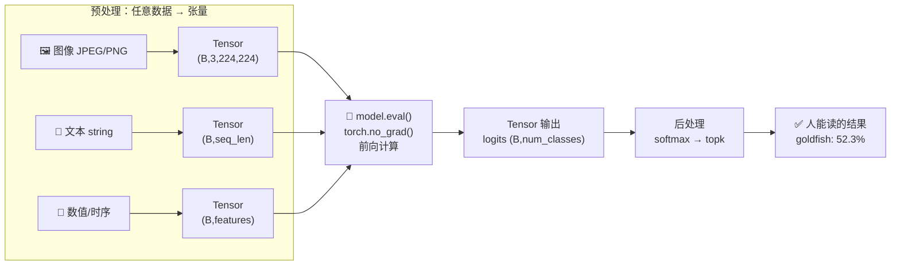

# 🎬 第 12 章 · 推理的概念：Tensor 进与出（Concepts of Inference）

> 本章对应原书 *AI and ML for Coders in PyTorch*（Laurence Moroney 著）第 12 章 "Concepts of Inference"，PDF 第 271–278 页。

## 🗺️ 本章地图（读完能会什么）

- 这是全书的「转轴章」：**前 11 章都在讲训练，从本章开始转向推理（inference）**——用训练好的模型对新数据做预测，尤其是后面几章的文本生成、图像生成大模型。
- 你会彻底搞懂那个贯穿所有深度学习框架的核心数据结构——**张量（Tensor）**：它是什么、为什么 0D 到 nD 都能装、为什么 GPU 喜欢它。
- 你会掌握**「任何数据 → 张量 → 模型 → 张量 → 结果」这条不变的管道**：图像怎么变张量、文本怎么变张量、模型吐出来的张量（logits）又怎么后处理成人能看懂的答案。
- 你会学会两个推理时**必按的开关**：`model.eval()` 与 `torch.no_grad()`——它们是训练和推理的分水岭，也是面试高频考点。
- 学完你能独立写出「预处理 → 前向 → 后处理（softmax + topk）」的完整推理脚本，这套骨架在 CNN、BERT、乃至 GPT 类 LLM 上是**同一套**。

> 💡 **一句话本质**：无论你喂给模型的是猫的照片还是一句英文，无论模型是分类器还是 GPT，接口永远是 **tensor in, tensor out**——张量是深度学习世界里唯一的「通用集装箱」，推理的全部工程就是「把数据装进这个集装箱、再从集装箱里取货」。

---

## 🧭 推理 vs 训练：一次视角切换

原书开门见山地点明了本章在全书中的坐标：

> "For the rest of this book, you'll cover a lot of content around using trained models to make predictions from new data (aka inference)..."
>
> 「本书余下的部分，你将大量接触如何用训练好的模型对新数据做预测（即推理）……」——原书 p.271

训练（training）和推理（inference）是模型生命周期的两个阶段，工程关注点截然不同：

| 维度 | 训练 Training | 推理 Inference |
|---|---|---|
| 目标 | 从数据中**学参数**（更新权重） | 用**冻结的参数**做预测 |
| 是否算梯度 | 要（`loss.backward()`） | 不要（`torch.no_grad()`） |
| 反向传播 | 有 | 无 |
| BatchNorm / Dropout | 训练行为（统计 batch、随机丢弃） | 评估行为（用滑动均值、不丢弃）→ `model.eval()` |
| 显存占用 | 高（要存激活值供反传） | 低（只需前向） |
| 数据 | 训练集，带标签 | 新数据，无标签 |
| 典型开关 | `model.train()` | `model.eval()` + `torch.no_grad()` |

原书强调：不管训练还是推理，**你都必须理解底层的数据传输技术——张量**。这就是本章要打的地基。



---

## 📦 张量（Tensors）：深度学习的通用集装箱

### 第一性原理：为什么是张量？

模型只会做一件事——**大规模的数值线性代数运算**（矩阵乘、逐元素加、非线性激活）。要让「猫的照片」「一句话」「一段股价」都能进同一个模型，就得先把它们**统一压成一种通用的数值容器**。张量就是这个容器。

> "A tensor is an array that can have any number of dimensions. Tensors are typically used to represent numerical data for deep-learning algorithms; they're containers that can hold numbers in multiple dimensions."
>
> 「张量是一个可以拥有任意维数的数组。张量通常用来为深度学习算法表示数值数据；它们是能在多个维度上装数字的容器。」——原书 p.271

一句冷知识：Google 的深度学习框架 **TensorFlow** 名字就来自张量。而在 PyTorch 里，张量是**一切计算的基础数据结构**。

### 维度阶梯：从 0D 到 nD

原书用 `torch.tensor` 给了一组经典例子，把「维度」这件事讲得很直观：

```python
import torch

# 标量 Scalar（0D 张量）——就一个数
scalar = torch.tensor(42)                    # shape: ()

# 向量 Vector（1D 张量）——一排数
vector = torch.tensor([1, 2, 3, 4])          # shape: (4,)

# 矩阵 Matrix（2D 张量）——网格
matrix = torch.tensor([[1, 2, 3],
                       [4, 5, 6]])           # shape: (2, 3)

# 3D 张量——立方体
cube = torch.tensor([[[1, 2], [3, 4]],
                     [[5, 6], [7, 8]]])      # shape: (2, 2, 2)

for t in (scalar, vector, matrix, cube):
    print(t.shape, t.dim())   # .dim() 就是「阶/维数」
```

不同数据类型天然落在不同维度上，这正是张量的威力：

| 数据 | 维度 | 典型 shape | 说明 |
|---|---|---|---|
| 一个数 / loss 值 | 0D | `()` | 标量 |
| 词嵌入向量 | 1D | `(768,)` | 一个词的语义坐标 |
| 灰度图 / 一张表 | 2D | `(H, W)` | 矩阵 |
| 彩色图 | 3D | `(3, H, W)` | 通道 × 高 × 宽 |
| **一批彩色图** | 4D | `(B, 3, H, W)` | 多一维放 batch 索引 |

原书点出了那个**处处出现的第 0 维——batch 维**：

> "...a single image can be a 3D matrix, but 100 images instead of 100 3D matrices could be a single 4D tensor, with the fourth dimension being the index of the image!"
>
> 「一张图是 3D 矩阵，但 100 张图与其存成 100 个 3D 矩阵，不如存成一个 4D 张量，多出来的那一维就是图像的索引！」——原书 p.272

> 💡 **实战/面试高频**：几乎所有 PyTorch 模型都默认「batch first」，即第 0 维是 batch。哪怕你只推理**一张**图、**一句**话，也要 `unsqueeze(0)` 把它变成 batch size = 1 的 4D/2D 张量，否则 shape 对不上直接报错。这是新手第一个高频翻车点。

> 💡 **实战/面试高频**：原书特别提到「大量投入被用于优化张量在 GPU 上的运行」。张量之所以快，是因为它在内存里是**连续的、规整的数值块**，能被 GPU 的成千上万个核心并行吞吐。这也是为什么你要尽量用向量化的张量运算，而不是 Python 的 `for` 循环逐元素处理。

---

## 🖼️ 图像数据如何变张量

### 从像素到 -1~1 的标准化数值

原书先讲清楚图像在磁盘上的样子：JPEG/PNG 是**为人眼观看和压缩存储优化**的格式，每个像素通常由若干颜色通道的强度值组成——典型 24 位（RGB 各 8 位，即 0–255），若是 32 位则多出 8 位 alpha 透明通道。

> "ML models typically use values between -1 and 1, and not 0 to 255... it's good for us to standardize the values by focusing on the meaningful variations between the pixel intensities as opposed to just their values."
>
> 「ML 模型通常使用 -1 到 1 之间的值，而不是图像原生存储的 0 到 255……对我们有利的做法是标准化这些值，关注像素强度之间有意义的变化，而不只是它们的绝对数值。」——原书 p.251

**为什么要标准化？** 三个第一性原因：

1. **数值稳定**：0–255 的大数值会让激活和梯度爆炸/剧烈波动；缩到 -1~1 附近，loss 曲线更平滑。
2. **关注「变化」而非「绝对亮度」**：减均值除标准差后，模型学到的是像素间的相对差异（边缘、纹理），而不是整体偏亮偏暗。
3. **匹配预训练分布**：用别人的预训练模型时，**必须用它训练时同样的均值/方差**，否则输入分布对不上，精度骤降。

### 原书的 `prepare_image`：torchvision 预处理流水线

```python
import torch
from torchvision import transforms
from PIL import Image

def prepare_image(image_path):
    # 用 PIL/Pillow 加载图像（解压成像素）
    raw_image = Image.open(image_path)

    # 定义变换流水线
    preprocess = transforms.Compose([
        transforms.Resize(256),          # 最短边缩到 256
        transforms.CenterCrop(224),      # 中心裁 224×224
        transforms.ToTensor(),           # HWC 0-255 → CHW 0.0-1.0 的 float 张量
        transforms.Normalize(            # 按 ImageNet 均值/方差标准化
            mean=[0.485, 0.456, 0.406],
            std=[0.229, 0.224, 0.225]
        )
    ])

    input_tensor = preprocess(raw_image)      # shape: (3, 224, 224)  一张图 = 3D 张量
    input_batch = input_tensor.unsqueeze(0)   # shape: (1, 3, 224, 224) 加 batch 维 = 4D
    return input_batch
```

原书解释道：`Image.open` 读取图像、解压成像素，再套一串 transforms——先标准化到 ML 友好的值，再转成张量。**单张图是 3D 张量，`unsqueeze` 之后加一维就成了 4D 的一批**。

> ⚠️ **踩坑**：那组 `mean=[0.485, 0.456, 0.406], std=[0.229, 0.224, 0.225]` 不是随便写的，是整个 **ImageNet 数据集在 RGB 三通道上的统计量**。凡是用 ImageNet 上预训练的模型（ResNet、ViT 等），预处理都要用这组数；换成别的数据或自己乱填，精度会明显掉。**训练用什么归一化，推理就必须用什么**——这条铁律永远成立。

流程可视化：


---

## 📝 文本数据如何变张量

### 字符串不能直接喂——先 tokenize 或算 embedding

> "Typically, text is stored in a string... but training a model or passing text like this to a pretrained model is unfeasible. Models... are trained on numeric data."
>
> 「文本通常存成字符串……但用这样的文本去训练模型、或喂给预训练模型是行不通的。模型是在数值数据上训练的。」——原书 p.253

把文本变数字有两条路（在第 5、6 章已见过）：**tokenize**（把词/子词映射成整数 id）或 **embedding**（把词映射成向量，方向里还能编码情感——见第 6 章）。原书用 BERT 演示，因为它两样都能做。

```python
import torch
from transformers import BertTokenizer, BertModel

def text_to_embeddings(texts):
    # 加载预训练的 BERT 分词器与模型
    tokenizer = BertTokenizer.from_pretrained('bert-base-uncased')
    model = BertModel.from_pretrained('bert-base-uncased')
    model.eval()  # 🔑 切到评估模式（推理必做）

    encoded = tokenizer(
        texts,
        padding=True,        # 短句补齐到最长句长度
        truncation=True,     # 太长的截断
        return_tensors='pt'  # 🔑 返回 PyTorch 张量
    )
    return encoded, model

texts = ["I love my dog", "The manatee became a doctor"]
```

原书强调最关键的是最后一行 `return_tensors='pt'`——让分词器直接吐 PyTorch 张量。打印 `encoded['input_ids']` 得到：

```text
Encodings:
tensor([[  101,  1045,  2293,  2026,  3899,   102,     0,     0],
        [  101,  1996, 24951, 17389,  2150,  1037,  3460,   102]])
```

原书逐个数字拆给你看，非常关键：

- 第一句 "I love my dog"（4 词）→ 6 个 token；第二句（6 词）→ 8 个 token。
- 每行都以 **101 开头、102 结尾**——这是编码器加的**特殊 token**，标记句子的开始（`[CLS]`）与结束（`[SEP]`）。
- 第一句结尾补了两个 **0**——这是 `padding`，把短句补齐到和最长句一样长（8），好凑成规整的 2D 张量。

> "A string can be represented as a 1D vector, but we have multiple strings here, so we can add a dimension to 1D to get 2D..."
>
> 「一个字符串可以表示为 1D 向量，但这里有多个字符串，于是给 1D 加一维得到 2D……」——原书 p.254

于是 `input_ids` 的 shape 是 **(2, 8)** = (句子数, 序列长度)——**第二维选句子、第一维选词**，又是那个熟悉的「batch + 内容」结构。

### 从 token 到 768 维 embedding

```python
# 生成 embedding
with torch.no_grad():                    # 🔑 推理不需要梯度
    outputs = model(**encoded)
    embeddings = outputs.last_hidden_state
# embeddings.shape == (2, 8, 768)
# 即：2 句 × 每句 8 个 token × 每个 token 768 维向量
print(embeddings[0, 1, :5])
# tensor([ 0.0401,  0.3046,  0.0669, -0.1975, -0.0103])  第1句第1个词，前5维
```

原书说明：BERT-base 里每个 embedding 向量是 **768 维**的 1D 张量，句向量也是 768 维，多句就再加一维。别急着看懂这些数字——第 13 章起会细讲。**本章的核心只有一句**：

> "The important point here is that... a tensor... gives you a consistent input into a model. You don't need to train models on different data types—they'll always be tensor in, tensor out."
>
> 「关键在于……张量给了模型一个一致的输入。你不需要为不同数据类型训练不同模型——永远是 tensor in, tensor out。」——原书 p.254

| 阶段 | 对象 | shape | 含义 |
|---|---|---|---|
| 原始 | 字符串 | — | `"I love my dog"` |
| 分词 | `input_ids` | `(2, 8)` | (句数, 序列长) 整数 token id |
| 前向 | `last_hidden_state` | `(2, 8, 768)` | (句数, 序列长, 隐藏维) |
| 句向量 | 池化后 | `(2, 768)` | 每句一个 768 维语义坐标 |

---

## 📤 从模型取出张量：logits、Softmax 与 TopK

### 输出层就是一排神经元

> "...consider a dataset like ImageNet that contains 15 million images in over 21,000 classes... you'll need over 21,000 output neurons, each of which gives you a percentage likelihood that the image is of the representative class."
>
> 「以 ImageNet 为例，它有 1500 万张图、超过 21,000 个类别……你需要超过 21,000 个输出神经元，每个给出图像属于对应类别的概率。」——原书 p.254–255

关键概念：模型**不直接输出「这是金鱼」这个类名**，而是暴露每个输出神经元的原始值。这些值叫 **logits（对数几率/原始分数）**——一个 1D 向量，自然又是张量。

原书给了一个模拟输出（2 张图 × 20 类，简化版）：

```python
import torch

class_names = [
    'tench', 'goldfish', 'great white shark', 'tiger shark', 'hammerhead shark',
    'electric ray', 'stingray', 'rooster', 'hen', 'ostrich', 'brambling',
    'goldfinch', 'house finch', 'junco', 'indigo bunting', 'robin', 'bulbul',
    'jay', 'magpie', 'chickadee'
]

# 模拟 model(input_tensor) 的输出：shape (2, 20)
example_output = torch.tensor([
    [ 1.2,  4.5, -0.8,  2.1,  0.3,
     -1.5,  0.9,  3.2, -0.4,  1.1,
      0.5, -0.2,  1.8,  0.7, -1.0,
      2.8,  1.6, -0.6,  0.4,  1.3],
    [-0.5,  5.2,  0.3,  1.4, -0.8,
      0.9,  1.2,  2.8,  0.6,  1.5,
     -1.1,  0.4,  2.1,  0.2, -0.7,
      1.9,  0.8, -0.3,  1.6,  0.5]
])
```

### Softmax + TopK：把 logits 变成「人能读的答案」

logits 是任意实数（可正可负），既不好比较也不像概率。**Softmax** 把它们压成一组和为 1 的正数（概率分布）；**TopK** 挑出最大的 k 个。

```python
def interpret_output(output_tensor, top_k=5):
    # 1) softmax：把 logits 沿「类别维」转成概率（每行和为 1）
    probabilities = torch.nn.functional.softmax(output_tensor, dim=1)

    # 2) topk：取每张图概率最高的 k 个类
    top_probs, top_indices = torch.topk(probabilities, k=top_k)

    # 3) 转 numpy，方便打印/后续普通 Python 处理
    top_probs = top_probs.numpy()
    top_indices = top_indices.numpy()
    return top_probs, top_indices
```

原书的运行结果（第一张图）：

```text
Image 1 Predictions:
------------------------
Raw logits (first 5): [1.20, 4.5, -0.80, 2.10, 0.30]

Top 5 Predictions:
1. goldfish: 52.3%
2. rooster: 14.2%
3. robin: 9.5%
4. tiger shark: 4.7%
5. house finch: 3.5%
```

注意 logits 里第 1 类 `goldfish=4.5` 最大，softmax 后就成了 52.3% 的最高概率。原书点出张量的又一好处：**因为输出是张量，就能直接用 PyTorch 为张量优化好的一堆函数（softmax、topk）来处理，不管它是几维**。

> 💡 **实战/面试高频**：`softmax` 的 `dim` 千万别选错。输出 shape 是 `(batch, num_classes)`，你要在**类别维**上归一化，所以 `dim=1`（或 `dim=-1`，即最后一维）。若误写 `dim=0`，会在 batch 维上归一化，结果彻底错误却不报错——是最阴险的 bug 之一。

---

## 🔬 关键代码拆解：一条完整推理管道的张量形状

把本章零散的片段串成一条真实的图像推理链，逐块盯住 shape：

```python
import torch
from torchvision import transforms, models
from PIL import Image
import torch.nn.functional as F

# ① 预处理：图像文件 → 4D 张量
preprocess = transforms.Compose([
    transforms.Resize(256),
    transforms.CenterCrop(224),
    transforms.ToTensor(),                       # → (3, 224, 224), 值 0.0~1.0
    transforms.Normalize(mean=[0.485, 0.456, 0.406],
                         std=[0.229, 0.224, 0.225]),
])
img = Image.open("cat.jpg")                       # PIL Image, HWC, 0-255
x = preprocess(img)                               # (3, 224, 224)  ← 单张图 3D
x = x.unsqueeze(0)                                # (1, 3, 224, 224) ← 加 batch 维 4D

# ② 加载预训练模型并切到推理模式
model = models.resnet50(weights="IMAGENET1K_V2")
model.eval()                                      # 🔑 BN 用滑动统计、Dropout 关闭

# ③ 前向：不建计算图、不算梯度
with torch.no_grad():                             # 🔑 省显存、提速
    logits = model(x)                             # (1, 1000)  ← 1000 类 logits

# ④ 后处理：logits → 概率 → TopK
probs = F.softmax(logits, dim=1)                  # (1, 1000)，每行和=1
top_probs, top_idx = torch.topk(probs, k=5)       # 各 (1, 5)

# ⑤ 取回 CPU/numpy 给人看
top_probs = top_probs.squeeze(0).tolist()         # 去 batch 维 → 长度 5 的列表
top_idx = top_idx.squeeze(0).tolist()
for p, i in zip(top_probs, top_idx):
    print(f"class#{i}: {p*100:.1f}%")
```

逐块看**张量在管道里怎么变形**：

| 步骤 | 张量 | shape | 维度含义 |
|---|---|---|---|
| ToTensor 后 | `x` | `(3, 224, 224)` | (通道, 高, 宽)，值 0–1 |
| Normalize 后 | `x` | `(3, 224, 224)` | 同上，值 ≈ -2~2 |
| unsqueeze(0) | `x` | `(1, 3, 224, 224)` | (batch, 通道, 高, 宽) |
| 前向输出 | `logits` | `(1, 1000)` | (batch, 类别) 原始分数 |
| softmax | `probs` | `(1, 1000)` | (batch, 类别) 概率，行和=1 |
| topk | `top_probs/top_idx` | `(1, 5)` | 每张图最高 5 类 |
| squeeze(0) | 列表 | `len=5` | 去掉 batch 维给人读 |

> 💡 **实战/面试高频**：`unsqueeze(0)` 加维、`squeeze(0)` 去维，是推理脚本里最常成对出现的动作——进模型前加 batch 维，出模型给人看时去 batch 维。搞不清 shape 时，**到处 `print(t.shape)`** 是最快的排错手段。

---

## 🌍 社区案例与延伸

本章的抽象概念（张量、logits、softmax、归一化）都能在经典工作里找到活生生的对应：

1. **ImageNet 与「1000 个输出神经元」的由来**——ImageNet 数据集出自 Deng et al., *ImageNet: A Large-Scale Hierarchical Image Database*, CVPR 2009（[image-net.org](https://www.image-net.org/)）。原书说的「21,000 类/1500 万图」是**完整的 ImageNet-21k**；而工业界最常用的是其子集 **ILSVRC-2012**（1000 类、约 120 万图）——这就是为什么 `resnet50` 的输出恰好是 `(batch, 1000)`。AlexNet（Krizhevsky et al., 2012，[原论文 PDF](https://proceedings.neurips.cc/paper/2012/file/c399862d3b9d6b76c8436e924a68c45b-Paper.pdf)）正是靠这个 1000 维 logits + softmax 的输出层一举夺魁，点燃了深度学习浪潮。本章的 `interpret_output` 就是它推理阶段的缩影。

2. **BERT 与 101/102 这两个魔法数字**——出自 Devlin et al., *BERT: Pre-training of Deep Bidirectional Transformers*, 2018（[arXiv:1810.04805](https://arxiv.org/abs/1810.04805)）。原书编码里的 `101` 就是 `[CLS]`、`102` 就是 `[SEP]`——这是 BERT 词表里固定的特殊 token id。`last_hidden_state` 的 `(batch, seq_len, 768)` 三维结构，是所有 Transformer 编码器的标准输出形状。Hugging Face 的 [transformers 文档](https://huggingface.co/docs/transformers/model_doc/bert) 里对这套接口有完整说明。

3. **torchvision 的标准预处理与 ImageNet 统计量**——那组 `mean/std` 常量和 `Resize→CenterCrop→ToTensor→Normalize` 流水线，是 [torchvision transforms 官方文档](https://pytorch.org/vision/stable/transforms.html) 推荐的标准做法，配合 [PyTorch 预训练模型库](https://pytorch.org/vision/stable/models.html)（Model Zoo）使用。图像加载底层依赖 **Pillow (PIL)**（[pillow.readthedocs.io](https://pillow.readthedocs.io/)），负责把压缩的 JPEG/PNG 解码成像素数组。

---

## 🔗 通向 LLM

本章「tensor in, tensor out」不是玩具概念——它**逐字对应现代 LLM 的推理流程**：

- **文本 → 张量（分词）**：本章 BERT 的 `tokenizer(...) → input_ids (batch, seq_len)`，在 GPT 类 LLM 里换成 BPE 分词，产出的仍是 `(batch, seq_len)` 的 token id 张量。特殊 token `[CLS]/[SEP]`（101/102）对应 LLM 的 `<|endoftext|>`、`<s>/</s>`、以及聊天模板里的 `<|im_start|>` 等。→ 详见 [[05_自然语言处理入门：把语言编码成数字]]。
- **张量 → logits（前向）**：CNN 输出 `(batch, 1000)` 的类别 logits；LLM 每一步输出 `(batch, seq_len, vocab_size)` 的**词表 logits**——本质完全一样，只是「类别数」从 1000 变成了几万到几十万的词表大小。
- **logits → 下一个词（采样解码）**：本章的 `softmax + topk` **就是 LLM 自回归生成的核心**。LLM 取最后一个位置的 logits，用温度（temperature）缩放后 softmax，再用 **top-k / top-p（nucleus）采样** 挑下一个 token——`torch.topk` 你现在就见过了。→ 参见 [[08_用机器学习生成文本]]。
- **`model.eval()` + `torch.no_grad()`**：LLM 推理服务（如 vLLM、Ollama）永远在这两个开关下运行，再叠加 **KV cache** 复用历史计算。→ 参见 [[17_用Ollama部署与服务LLM]]。
- **batch 维 → 批量/连续批处理**：本章那个「第 0 维放 batch」的习惯，在 LLM 服务里演化成 vLLM 的 **continuous batching**——把多个用户请求的张量拼在 batch 维上一起推理，榨干 GPU。
- **embedding 张量 → 向量检索**：本章 BERT 的 768 维句向量，正是 [[18_RAG检索增强生成入门]] 里把文档/查询编码成向量、做相似度检索的基石。

一句话：**你在本章学会看的 shape，第 13–21 章会原封不动地再遇到一遍**。

---

## ⚠️ 常见坑

1. **忘了 `model.eval()`**：BatchNorm 会继续用当前 batch 的统计量、Dropout 会继续随机丢神经元，导致同一张图每次推理结果都不一样、且系统性偏差。推理前**第一件事**就是 `model.eval()`。
2. **忘了 `torch.no_grad()`**：模型仍会构建计算图、保存中间激活供反传，**显存暴涨甚至 OOM、速度大跌**。推理时用 `with torch.no_grad():` 包住前向。（`model.eval()` 与 `torch.no_grad()` 是两件独立的事，缺一不可——见下方面试题。）
3. **归一化参数不匹配**：用 ImageNet 预训练模型却不用它的 `mean/std`，或训练/推理用了不同的归一化，精度断崖式下跌。**记住训练时用了什么，推理照抄**。
4. **`softmax` / `topk` 的 `dim` 选错**：输出 `(batch, num_classes)` 要在类别维归一化，用 `dim=1`（或 `dim=-1`）。选 `dim=0` 不报错但结果全错。
5. **忘了加/去 batch 维**：只推一张图直接喂 `(3,224,224)` → shape 报错；要 `unsqueeze(0)`。反过来取结果时忘了 `squeeze(0)`，会得到多一层嵌套的列表。
6. **GPU 张量直接 `.numpy()`**：会报 `can't convert cuda tensor to numpy`。正确写法是 `t.detach().cpu().numpy()`——先脱离计算图、搬回 CPU 再转。

---

## 🎯 面试速答

- **训练和推理有什么区别？**
  一句话：训练要算梯度、反向传播、更新权重，用 `model.train()`；推理冻结权重、只前向、不算梯度，用 `model.eval()` + `torch.no_grad()`，显存更省速度更快。

- **`model.eval()` 和 `torch.no_grad()` 有什么区别，能只用一个吗？**
  一句话：`model.eval()` 改的是**模块行为**（BatchNorm 用滑动统计、Dropout 关闭），`torch.no_grad()` 改的是**是否建计算图/存梯度**——两者正交，推理时都要，缺任一个都不对：只 `eval()` 会白占显存，只 `no_grad()` 会让 BN/Dropout 行为错误。

- **什么是 logits？为什么不直接输出概率？**
  一句话：logits 是输出层神经元的**原始未归一化分数**（任意实数）；训练时配合 `CrossEntropyLoss`（内部已含 softmax）数值更稳定，推理时再手动 `softmax` 转概率——直接吐概率会丢失数值稳定性且限制后处理灵活性。

- **图像为什么要归一化到 -1~1 附近？那组 `mean/std` 从哪来？**
  一句话：让数值稳定、loss 平滑、聚焦像素间的相对变化；`[0.485,0.456,0.406]/[0.229,0.224,0.225]` 是 ImageNet 全库 RGB 三通道的均值和标准差，用其预训练模型就必须照用。

- **BERT 编码里的 101 和 102 是什么？**
  一句话：`[CLS]`（句首，id=101）和 `[SEP]`（句尾/分隔，id=102）两个特殊 token，标记序列的开始与结束；后面补的 0 是 padding，用来把不等长的句子对齐成规整的 2D 张量。

---

## 📌 本章小结

- **张量是深度学习唯一的通用数据结构**：0D 标量、1D 向量、2D 矩阵、3D 图像、4D 一批图像——任意数据都压成张量，接口永远 **tensor in, tensor out**。
- **进模型前是预处理**：图像走 `Resize→Crop→ToTensor→Normalize→unsqueeze` 变 4D 张量；文本走 tokenizer 变 `(batch, seq_len)` 的 id 张量，句子加特殊 token（101/102）和 padding。
- **出模型后是后处理**：模型吐 logits（1D/2D 张量），用 `softmax` 转概率、`topk` 取最优，再 `.numpy()` 给人看——这套 CNN 和 LLM 通用。
- **推理两大开关**：`model.eval()`（改 BN/Dropout 行为）+ `torch.no_grad()`（不建图省显存），正交且都必须开。
- 本章是全书从「训练」转向「推理/生成式 AI」的转轴——你现在掌握的 shape 直觉，会一路用到 Transformer、LLM 部署、RAG 和扩散模型。

---

## 🔗 延伸阅读 & 交叉链接

**兄弟章节**
- [[05_自然语言处理入门：把语言编码成数字]] —— 本章文本→张量的前置，讲 tokenize 的原理
- [[06_用嵌入让情感可编程：Embeddings]] —— 本章 768 维 embedding 的来龙去脉
- [[04_用PyTorch管理数据：Dataset与DataLoader]] —— batch 维与数据管道的由来
- [[08_用机器学习生成文本]] —— softmax+topk 采样解码的进阶应用
- [[13_用TorchServe与Flask部署PyTorch模型]] —— 把本章推理管道包成线上服务
- [[14_使用第三方模型与模型中心Hub]] —— 下一章：从 Hub 取预训练模型来推理
- [[15_Transformer架构与transformers库]] —— BERT/last_hidden_state 的完整展开
- [[17_用Ollama部署与服务LLM]] —— LLM 推理的 eval/no_grad + KV cache 实战
- [[18_RAG检索增强生成入门]] —— 句向量张量做检索的应用
- [[21_从本书基础到LLM落地实战（合流篇）]] —— 全书主线汇总

**外部真实链接**
- PyTorch 官方教程：[Tensors 入门](https://pytorch.org/tutorials/beginner/basics/tensorqs_tutorial.html)
- torchvision transforms 文档：<https://pytorch.org/vision/stable/transforms.html>
- BERT 论文：Devlin et al., 2018，[arXiv:1810.04805](https://arxiv.org/abs/1810.04805)
- ImageNet：Deng et al., CVPR 2009，<https://www.image-net.org/>
- `torch.no_grad` 文档：<https://pytorch.org/docs/stable/generated/torch.no_grad.html>
