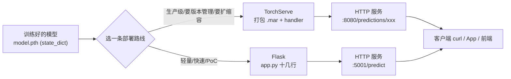
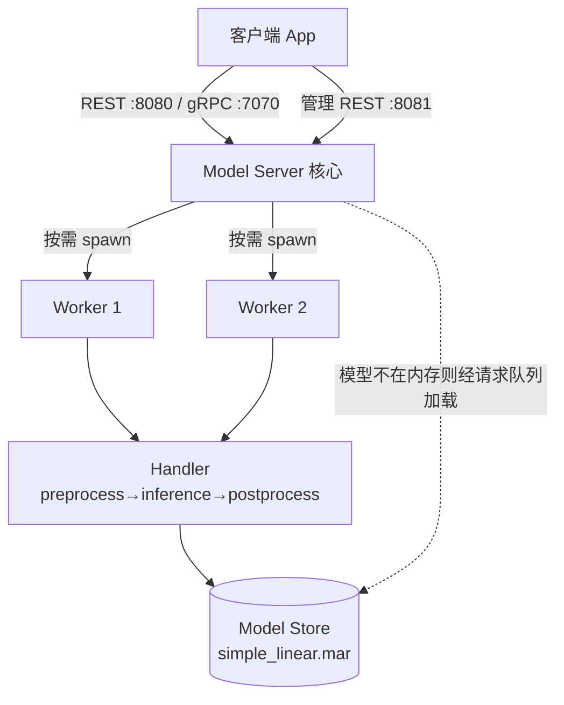

# 🎬 第 13 章 · 用 TorchServe 与 Flask 部署 PyTorch 模型（Hosting PyTorch Models for Serving）

> 本章对应原书 *AI and ML for Coders in PyTorch*（Laurence Moroney 著）第 13 章 "Hosting PyTorch Models for Serving"，PDF 第 279–294 页（书内页码 257–272）。

## 🗺️ 本章地图（读完能会什么）

- 想清楚一个残酷的事实：**训练出模型只是第一步，模型不能被别人调用就毫无价值**——本章补上"从 `.pth` 文件到线上服务"的最后一公里。
- 吃透 **TorchServe** 的四大组件（model server / model workers / frontend handlers / model store）与端口约定，并**亲手**把第 1 章那个 `y = 2x − 1` 的线性模型从头部署上线：装环境 → 写 `config.properties` → 分离模型定义 → 写 handler → 打包 `.mar` → 起 server → curl 测推理。
- 学会 handler 的四段式生命周期：`initialize / preprocess / inference / postprocess`——这是所有 serving 框架的通用骨架，换成图像、文本模型也是同一套。
- 用 **Flask** 十几行代码搭一个同样的推理服务，理解"轻量灵活 vs 生产级重武器"的取舍。
- 建立**部署选型直觉**：什么时候上 TorchServe，什么时候 Flask/FastAPI 就够，并顺手接上后面 [[17_用Ollama部署与服务LLM]] 里 LLM 专用的 serving 思路。

> 💡 **一句话本质**：Serving 就是把"一次 `model(x)` 的函数调用"包装成一个**能并发、能扩缩容、能被 HTTP 调用**的长期在线服务；TorchServe 帮你把这套脚手架标准化，Flask 让你用最少代码手搓一个。

---

## 🚀 为什么需要专门的 serving？

在前面 12 章里，我们一直在同一个 Python 进程里 `model(x)` 拿结果——那叫**推理（inference）**，[[12_推理的概念：Tensor进与出]] 讲的就是这件事的输入输出。但真实世界里，调用你模型的往往是**另一台机器上的另一个程序**：一个网页前端、一个手机 App、一个下游微服务。它们不会导入你的 PyTorch 代码，只会发一个 HTTP 请求。于是问题从"怎么算"变成了"怎么**在线、稳定、高并发**地算"。

> "You should note that taking a trained PyTorch model to a production-ready service will involve a lot more than just deploying it, and that the machine learning operations (MLOps) discipline is designed with that in mind."
> —— 原书 p.257
>
> 译：你要注意，把一个训练好的 PyTorch 模型变成生产级服务，远不止"部署"两个字这么简单，机器学习运维（MLOps）这门学科正是为此而生的。

书里点名了 serving 阶段冒出的一堆**新挑战**（p.257）：

| 挑战 | 训练时不用管，上线后躲不掉 |
|---|---|
| **实时请求（real-time requests）** | 一秒钟几百个请求进来，不能排队排到天荒地老 |
| **计算资源管理** | 一张 GPU 要服务多少个模型/多少并发？显存怎么分？ |
| **可靠性（reliability）** | 一个模型崩了不能拖垮整台服务器 |
| **负载波动下的性能** | 白天流量高峰和凌晨低谷，worker 数要能伸缩 |

> 💡 **实战/面试高频**：面试官问"训练和部署有什么本质区别？"标准答法——**训练关心吞吐与收敛（batch 越大越好、可离线跑几天），部署关心延迟与可用性（单条请求要快、要 7×24 在线、要能水平扩展）**。二者的优化目标几乎是相反的，所以需要专门的 serving 框架而不是把训练脚本套个 `while True`。

原书也诚实地说明：完整的 MLOps（CI/CD、监控、数据漂移检测……）超出本章范围，并推荐了 O'Reilly 的两本书 *Implementing MLOps in the Enterprise*（Yaron Haviv & Noah Gift）和 *LLMOps*（Abi Aryan）。本章只聚焦最核心的一环：**把模型挂成一个能被调用的 HTTP 服务**，并给出两条路线——TorchServe 与 Flask。



---

## 🏛️ TorchServe 介绍：官方的 serving 框架

TorchServe 是 PyTorch 官方的默认 serving 框架，主页在 [pytorch.org/serve](https://pytorch.org/serve/)。

> "TorchServe's goal was originally to be a reference implementation on how to properly serve models with a modular extensible architecture, but it has grown beyond that into a fully performant professional-grade framework..."
> —— 原书 p.258
>
> 译：TorchServe 最初的目标只是做一个"如何用模块化、可扩展架构正确地服务模型"的参考实现，但它后来长成了一个完全高性能的专业级框架。

它开箱即用地提供了生产环境常见的能力（p.257）：**模型版本管理（model versioning）、A/B 测试、指标采集（metrics collection）**。适合"想要一个生产级方案、又不想从零搭"的团队。

### 四大核心组件

原书把 TorchServe 拆成四块（p.258），这是理解它的钥匙：

| 组件 | 英文 | 职责 |
|---|---|---|
| **模型服务器** | model server | 中枢，管理模型生命周期，处理所有推理请求，提供 REST 与 gRPC 端点 |
| **模型 worker** | model workers | 独立进程，真正加载模型并执行推理；彼此**隔离**，一个模型出问题不影响其他模型 |
| **前端 handler** | frontend handlers | 自定义 Python 类，负责某个模型的预处理 / 推理 / 后处理；与训练代码互补，**建议单独成文件** |
| **模型仓库** | model store | 存放 `.mar`（Model ARchive）文件的目录，模型的"可服务对象" |

### 端口与请求流转

TorchServe 的默认端口是**面试常考的死记点**：

| 端口 | 协议 | 用途 |
|---|---|---|
| **8080** | REST | 推理（inference）——客户端发预测请求走这里 |
| **7070** | gRPC | 推理（gRPC 版） |
| **8081** | REST | 管理（management）——注册/注销模型、查模型信息、调 worker 数 |
| **8082** | REST | 指标（metrics）——Prometheus 抓取 |

原书 p.259 描述了一次请求的完整流转：

> "The endpoint will then call the core model server, which in turn will spawn the appropriate number of model workers. The workers will then interface with the model handlers to do preprocessing, inference, and postprocessing."
>
> 译：端点会调用核心模型服务器，服务器再启动相应数量的 model worker；worker 会对接 model handler 完成预处理、推理和后处理。



> 💡 **实战/面试高频**：为什么 worker 要"独立进程 + 隔离"？因为一个模型崩溃（比如某次输入触发了段错误）不能连累同机部署的其它模型——**进程隔离是多模型共存服务器的可靠性基石**。这也是为什么 TorchServe 用多进程 worker 而不是简单的多线程。

---

## 🛠️ 搭建 TorchServe：手把手七步

原书作者的方法论是"用一个简单但有代表性的场景一步步走"。我们复用 [[01_PyTorch入门：从传统编程到学习]] 里那个学 `y = 2x − 1` 的线性模型，全程七步。

### 第 1 步：准备环境

强烈建议干净的虚拟环境（原书用 `venv`），避免依赖污染：

```bash
# 建一个干净的虚拟环境并激活
python3 -m venv chapter13env
source chapter13env/bin/activate   # Windows 是 chapter13env\Scripts\activate

# 安装 TorchServe 三件套：服务器、模型打包器、工作流打包器
pip install torchserve torch-model-archiver torch-workflow-archiver
```

> ⚠️ **踩坑**：原书 p.260 明确警告——TorchServe 的错误经常**藏在日志文件里**，很难一眼看出还缺哪些依赖。作者从干净系统起步时，额外还需要 **JDK 11 以上**（TorchServe 底层用 Java Netty 做网络层）和 **PyYAML**。这也是本章后面反复提到"把 `log_level` 设成 DEBUG、去翻 `logs/models_log.log`"的原因。

然后在工作目录里建一个存放 `.mar` 的子目录：

```bash
mkdir model_store
```

### 第 2 步：写 config.properties

这是服务器的配置文件，最关键的是三个地址和 model_store 目录（原书 p.260 的完整配置）：

```properties
# config.properties
inference_address=http://0.0.0.0:8080      # 推理端口
management_address=http://0.0.0.0:8081     # 管理端口
metrics_address=http://0.0.0.0:8082        # 指标端口
number_of_netty_threads=32                 # Netty 网络线程数
job_queue_size=1000                        # 请求队列容量
model_store=model_store                    # 指向你刚建的目录
default_response_timeout=120               # 单次推理超时(秒)
default_workers_per_model=1                # 每个模型默认 worker 数
log_level=DEBUG                            # 调试期设 DEBUG，方便抓依赖问题
```

`0.0.0.0` 表示监听所有网卡（容器/服务器上必须这样，否则外部访问不到）。文件名必须叫 `config.properties`。

### 第 3 步：定义模型（和训练分离）

原书强调一条**最佳实践**：模型定义（网络结构）要和训练代码**分开成两个文件**，因为 handler 稍后也要 `import` 这个定义。

`linear.py`（只放结构）：

```python
# linear.py —— 只定义网络结构，不含训练
import torch
import torch.nn as nn

class SimpleLinearModel(nn.Module):
    def __init__(self):
        super().__init__()
        self.linear = nn.Linear(1, 1)   # 一个输入、一个输出的线性层

    def forward(self, x):
        return self.linear(x)           # 输入 (batch,1) → 输出 (batch,1)
```

`train.py`（导入结构来训练，最后存 `state_dict`）：

```python
# train.py —— 导入结构、训练、保存
import torch
import torch.nn as nn
import torch.optim as optim
from linear import SimpleLinearModel   # 关键：从独立文件导入

def train_model():
    model = SimpleLinearModel()
    optimizer = optim.SGD(model.parameters(), lr=0.01)
    criterion = nn.MSELoss()

    # y = 2x - 1 的 6 个样本，形状都是 (6, 1)
    xs = torch.tensor([[-1.0], [0.0], [1.0], [2.0], [3.0], [4.0]], dtype=torch.float32)
    ys = torch.tensor([[-3.0], [-1.0], [1.0], [3.0], [5.0], [7.0]], dtype=torch.float32)

    for _ in range(500):               # 训练 500 轮
        optimizer.zero_grad()          # 清梯度
        outputs = model(xs)            # 前向
        loss = criterion(outputs, ys)  # 算 MSE
        loss.backward()                # 反向
        optimizer.step()               # 更新
    return model

model = train_model()
torch.save(model.state_dict(), "model.pth")   # 只存 state_dict，不存整个对象
```

> 💡 **实战/面试高频**：为什么存 `state_dict()` 而不是 `torch.save(model, ...)`？原书 p.261 说 "I find that this way of saving out a model works best with TorchServe"。本质原因是：`torch.save(model)` 会用 pickle 把**类的引用路径**一起腌进去，换环境/换目录容易 `ModuleNotFoundError`；而 `state_dict` 只是一个"参数名→张量"的字典，**加载时你自己 new 一个模型再 `load_state_dict`**，可移植性最好。这条规则在整个 PyTorch 生态都成立。

### 第 4 步：写 Handler（灵魂所在）

Handler 负责推理的"重活"：加载模型、预处理、推理、后处理。它继承 `BaseHandler`：

```python
# model_handler.py
import os
import logging
import torch
from ts.torch_handler.base_handler import BaseHandler
from linear import SimpleLinearModel   # 复用同一个模型定义

logger = logging.getLogger(__name__)

class ModelHandler(BaseHandler):
    def __init__(self):
        super().__init__()
        self.initialized = False       # 先标记未就绪
        logger.info("ModelHandler initialized")

    def initialize(self, ctx):
        """服务器加载模型时调用一次"""
        self.manifest = ctx.manifest              # MAR 文件里的元信息
        properties = ctx.system_properties
        model_dir = properties.get("model_dir")   # .mar 解包后的目录

        # 拼出权重文件路径
        serialized_file = "model.pth"
        model_pt_path = os.path.join(model_dir, serialized_file)

        # 有 GPU 就用 GPU，否则 CPU
        self.device = torch.device(
            "cuda:" + str(properties.get("gpu_id"))
            if torch.cuda.is_available() else "cpu"
        )

        # 关键三步：new 模型 → 灌权重 → 上设备
        self.model = SimpleLinearModel()
        state_dict = torch.load(model_pt_path, weights_only=True)  # 只读权重更安全
        self.model.load_state_dict(state_dict)
        self.model.to(self.device)
        self.model.eval()             # 切推理模式（关 dropout/固定 BN）

        self.initialized = True       # 此刻才算就绪
        return self

    def preprocess(self, data):
        """把 HTTP 请求体转成模型要的张量"""
        value = float(data[0].get("body"))                       # 取请求体里的数字
        tensor = torch.tensor([value], dtype=torch.float32).view(1, 1)  # → (1,1)
        return tensor.to(self.device)

    def inference(self, data):
        """真正跑一次前向"""
        with torch.no_grad():         # 推理不需要梯度，省显存又快
            results = self.model(data)
        return results

    def postprocess(self, inference_output):
        """把张量转回人类可读格式"""
        return inference_output.tolist()   # tensor → Python list，能 JSON 序列化
```

原书 p.262 特别解释了 `self.initialized = False` 这个"看起来很奇怪"的设计：

> "...the idea here is that this code will initialize the class but it won't be ready to use until the initialize custom function is called."
>
> 译：思路是——构造函数只是把类实例化出来，但它要等到自定义的 `initialize` 函数被调用（加载好模型）之后才真正可用。

这四个方法（`initialize/preprocess/inference/postprocess`）就是 handler 的**四段式生命周期**，是所有 serving 的通用骨架。原书 p.263 说这些步骤"非常定制化、我故意做得极简，好让你看清 flow——但对更复杂的模型，整体架构不变"。

### 第 5 步：打包成 .mar

用命令行工具 `torch-model-archiver` 把"权重 + handler + 模型定义"打成一个 `.mar` 归档（原书 p.264）：

```bash
torch-model-archiver \
  --model-name simple_linear \
  --version 1.0 \
  --serialized-file model.pth \
  --handler model_handler.py \
  --model-file models/linear.py \
  --export-path model-store \
  --force \
  --extra-files models/linear.py,models/__init__.py
```

逐参数拆解：

| 参数 | 含义 |
|---|---|
| `--model-name` | 模型在 store 里的名字，**可任意起，不必等于类名**，curl 时用它 |
| `--version` | 版本号，用于追踪不同版本（bug 修复 / 新场景） |
| `--serialized-file` | 权重文件，即 `model.pth` |
| `--handler` | handler 文件 |
| `--model-file` | 模型定义文件（关键，防止 TorchServe 搞混从哪拿定义） |
| `--export-path` | 输出目录，即 `model-store` |
| `--force` | 覆盖已存在的归档（学习期方便，**生产慎用**） |
| `--extra-files` | 额外打包的文件，这里把 `linear.py` 和空的 `__init__.py` 一起塞进去，让模型定义成为可 import 的包 |

> ⚠️ **踩坑**：原书 p.264 记录了一个真实的坑——**如果训练文件里也含模型定义、handler 里也含模型定义，TorchServe 会搞不清该从哪拿定义**。这正是要把模型定义单独抽成 `linear.py`、放进 `models/` 目录并配一个空 `__init__.py` 的原因。把 `models/linear.py,models/__init__.py` 一起写进 `--extra-files`，让它成为一个可导入的 Python 包。跑成功后 `model-store/` 里会出现 `simple_linear.mar`。

### 第 6 步：启动 Server

```bash
torchserve \
  --start \
  --model-store model-store \
  --ts-config config/config.properties \
  --disable-token-auth \
  --models simple_linear=model_store/simple_linear.mar
```

- `--start` / `--stop`：启动 / 停止（停止能让终端别再刷屏）。
- `--model-store`：`.mar` 所在目录。
- `--ts-config`：指向刚写的 `config.properties`。
- `--disable-token-auth`：学习/测试期关掉鉴权，**生产别关**。
- `--models`：`名字=路径` 列表，可挂多个模型。

> ⚠️ **踩坑**：原书 p.266 说，如果启动后终端文字**不停滚动**，通常是启动出错了——多半是缺依赖（如 PyYAML）。此时因为 `config.properties` 设了 DEBUG，去 `logs/models_log.log` 翻日志。另外在 **Mac / 无 N 卡的机器**上会报找不到 `nvgpu` 模块，这是 GPU 推理用的，可以**安全忽略**，推理会自动落到 CPU。

### 第 7 步：测试推理

从另一个终端用 curl 打推理端点（原书 p.267）：

```bash
curl -X POST http://127.0.0.1:8080/predictions/simple_linear \
     -H "Content-Type: text/plain" -d "5.0"
```

因为模型学的是 `y = 2x − 1`，`x = 5` 应得接近 `9` 的值：

```json
[
  8.997674942016602
]
```

还能用**管理端点（8081）**看服务器挂了哪些模型：

```bash
curl http://localhost:8081/models
```

```json
{
  "models": [
    { "modelName": "simple_linear", "modelUrl": "model_store/simple_linear.mar" }
  ]
}
```

查某个模型的详细规格（worker 状态、batchSize、deviceType 等）：

```bash
curl http://localhost:8081/models/simple_linear
```

返回里能看到 `"minWorkers": 1`、`"maxWorkers": 1`、`"batchSize": 1`、worker 的 `"status": "READY"` 等。原书 p.268 提到：如果 `deviceType` 是 `gpu` 但机器没 `nvgpu`，worker 会报 `"gpuUsage": "failed to obtained gpu usage"`——在没 N 卡的开发机上正常，但在**本该有 GPU 的服务器上看到这个就要去查 handler 了**。

> 💡 **实战/面试高频**：注意 curl 里 `predictions/simple_linear` 的 `simple_linear` 必须能对应上 `--model-name` 里那个名字，否则 404。**推理走 8080，管理走 8081**——把这两个端口和它们的职责背下来，面试被问 TorchServe 时能直接答上。

### 进阶：内置 Handler，连预处理都不用写

原书 p.269 提到，PyTorch 生态为常见场景准备了现成 handler。比如图像分类，你不用自己写"把图片转成张量"的预处理——直接用内置的 `ImageClassifier`（继承自 `BaseHandler`）。官方仓库还有 MNIST 图像 handler 的完整示例。这与 [[03_卷积神经网络：在图像中检测特征]] 训练出的模型一拍即合：训练归训练，部署时套个内置 handler 就能上线。

---

## 🪶 用 Flask 搭一个推理服务

TorchServe 强大但重。原书说 Flask 是"超好用的替代品"——一个轻量、灵活的 Python Web 框架。

> "Flask's simplicity and extensive ecosystem also make it an excellent choice for smaller-scale deployments and proof-of-concept services."
> —— 原书 p.257–258
>
> 译：Flask 的简洁与丰富生态，使它成为小规模部署和概念验证服务的绝佳选择。

### 建环境

```bash
pip install flask   # 在同一个 venv 里追加即可
```

前提和 TorchServe 一样：有 `model_def.py`（模型定义）和训练好的 `model.pth`。然后只需一个 `app.py`。

### 写 Flask server

原书 p.270 的完整代码——**同一个线性模型，只用十几行**：

```python
# app.py
from flask import Flask, request, jsonify
import torch
from model_def import SimpleLinearModel

app = Flask(__name__)        # 创建 Flask 实例

# 加载训练好的模型（同样是 state_dict 路线）
model = SimpleLinearModel()
model.load_state_dict(torch.load("model.pth"))
model.eval()                 # 切推理模式

@app.route("/predict", methods=["POST"])   # 注册一个 POST 路由
def predict():
    value = float(request.form.get('value', 0))              # 从表单取参数
    input_tensor = torch.tensor([[value]], dtype=torch.float32)  # → (1,1)
    with torch.no_grad():
        prediction = model(input_tensor)
    return jsonify({                        # 转成友好的 JSON
        "input": value,
        "prediction": prediction.item()     # .item() 取标量
    })

if __name__ == "__main__":
    app.run(port=5001)       # 注意端口 5001，不是 5000
```

> ⚠️ **踩坑**：原书 p.271 特意备注——Flask 文档惯用 **5000 端口**，但 **Mac 上 5000 被 AirPlay 占用**，会冲突，所以示例改用 **5001**。你在 Mac 上遇到 `port already in use` 别慌，换个端口即可。

测试：

```bash
curl -X POST -d "value=5" http://localhost:5001/predict
```

```json
{"input":5.0,"prediction":8.993191719055176}
```

原书总结得很直白（p.271）：

> "As you can see, that's much simpler than using TorchServe, but for that simplicity, you give up power."
>
> 译：如你所见，这比 TorchServe 简单得多，但这份简单是用"能力"换来的。

Flask 没有现成的预处理/后处理基类，想扩缩容、开多 worker 线程，全得你自己写。原书末尾还提了一句：除了这两者，还有 **ONNX、FastAPI** 等选项，其中 FastAPI 正在快速流行。

---

## 🔬 关键代码拆解：Handler 里张量的一进一出

本章最核心、也最能体现 serving 本质的，是 handler 里数据从"字符串请求体"到"张量"再到"JSON"的完整变形。以线性模型的 `preprocess` 为例逐行看形状：

```python
def preprocess(self, data):
    value = float(data[0].get("body"))                    # ① 拿原始请求体
    tensor = torch.tensor([value], dtype=torch.float32).view(1, 1)  # ② 变形
    return tensor.to(self.device)                         # ③ 搬到设备
```

- **① `data[0].get("body")`**：TorchServe 把一次请求包成一个列表 `data`，每个元素是一个 dict，`"body"` 键装着客户端 POST 的原始负载。这里 curl 发的是文本 `"5.0"`，取出来是字符串，`float(...)` 转成 Python 浮点 `5.0`。
- **② `torch.tensor([5.0])`** 得到形状 `(1,)` 的一维张量；`.view(1, 1)` 重塑成 `(1, 1)`——第一维是 **batch=1**，第二维是**特征数=1**。这正是 `nn.Linear(1, 1)` 期望的输入形状。**形状对不上就会当场报错**，这是新手最容易翻车的地方。
- **③ `.to(self.device)`**：把张量搬到模型所在设备（CPU 或 CUDA）。**模型和数据必须同设备**，否则报 `Expected all tensors to be on the same device`。

推理与后处理接力：

```python
def inference(self, data):
    with torch.no_grad():          # (1,1) 张量进
        results = self.model(data) # nn.Linear：out = x·W^T + b，得 (1,1)
    return results                 # 仍是 (1,1) 张量

def postprocess(self, inference_output):
    return inference_output.tolist()   # (1,1) 张量 → 嵌套 list [[8.99...]]
```

`with torch.no_grad()` 的意义：推理不需要反向传播，关掉自动求导能**省显存、加速**——这是 [[12_推理的概念：Tensor进与出]] 反复强调的推理铁律。`.tolist()` 把张量转成纯 Python 结构，才能被 HTTP 层 JSON 序列化返回给客户端。整条链路：`"5.0"（str）→ (1,1) tensor → 前向 → (1,1) tensor → [[8.99]]（list）→ JSON`。

> 💡 **实战/面试高频**：能把"一次请求里张量形状怎么变"讲清楚，是判断你**真的部署过模型**还是只跑过 demo 的分水岭。记住 batch 维永远在最前面，即使只有一条请求也是 `(1, ...)`。

---

## 🌍 社区案例与延伸

1. **TorchServe 官方仓库与内置 handler**——原书推荐的 MNIST 图像 handler 示例就在这里，还有 `ImageClassifier`、`TextClassifier` 等开箱即用的基类。仓库：[github.com/pytorch/serve](https://github.com/pytorch/serve)，文档：[pytorch.org/serve](https://pytorch.org/serve/)。真实工业界（如 Amazon、Walmart 的部分 ML 服务）用它做多模型托管。

2. **FastAPI + Uvicorn——现代 Python 服务的事实标准**：原书两次点名 FastAPI"正在快速流行"。相比 Flask，它基于 ASGI 支持**原生异步**，并用 Pydantic 做请求体校验、自动生成 OpenAPI 文档。Hugging Face 的推理服务、无数 LLM 后端都建在它之上。官方：[fastapi.tiangolo.com](https://fastapi.tiangolo.com/)。**面试常被问"Flask 和 FastAPI 怎么选"，答：I/O 密集、要异步/自动文档选 FastAPI；极简 PoC 选 Flask。**

3. **ONNX Runtime——跨框架、跨硬件的推理引擎**：把 PyTorch 模型 `torch.onnx.export` 成 `.onnx` 后，可脱离 PyTorch、在 C++/移动端/浏览器/各种加速器上跑，常带来可观的推理加速。这是"训练用 PyTorch、部署换轻量运行时"的经典范式。官方：[onnxruntime.ai](https://onnxruntime.ai/)。

4. **KServe / Triton Inference Server——K8s 时代的模型编排**：当你从"一台机器一个模型"走向"集群里几十个模型、自动扩缩容、GPU 共享"，会遇到 NVIDIA Triton（[github.com/triton-inference-server/server](https://github.com/triton-inference-server/server)）和 KServe。它们把 TorchServe 学到的 handler/worker 思想搬上了 Kubernetes，是大厂生产环境的主力。

---

## 🔗 通向 LLM

本章的 serving 骨架，正是现代 LLM 上线时天天在用的东西，只是规模和细节被放大了：

- **handler 四段式 → LLM 推理管线**：`preprocess` 变成 **tokenization**（文本 → token id，见 [[05_自然语言处理入门：把语言编码成数字]]），`inference` 变成 **自回归解码**（一次生成一个 token，见 [[08_用机器学习生成文本]]），`postprocess` 变成 **detokenize**（token → 文本）。TorchServe 甚至有专门支持大模型连续批处理（continuous batching）的字段（你在 `curl .../models/simple_linear` 返回里见过的 `"continuousBatching": false`）。

- **worker/进程隔离 → LLM 的多副本部署**：一张 A100 上跑一个 70B 模型，多用户并发时靠的正是 worker 架构 + **动态批处理（batching）** 把多条请求拼在一起喂进 GPU，这是 vLLM、TGI 的核心优化。

- **Flask/FastAPI 路由 → OpenAI 兼容 API**：你今天写的 `@app.route("/predict")`，在 LLM 世界里就是 `/v1/chat/completions`。几乎所有开源推理服务都暴露这个 HTTP 接口。

- **本章是"手搓 serving"，下章是"拿现成服务"**：[[17_用Ollama部署与服务LLM]] 里的 Ollama 本质就是一个把"下载权重 + 起 HTTP server + 暴露 `/api/generate`"打包好的 LLM 专用 TorchServe；[[18_RAG检索增强生成入门]] 的检索服务、[[19_用HuggingFace_Diffusers做生成式图像]] 的图像生成服务，全都要挂成本章这样的 HTTP 端点才能被产品调用。

> 💡 **一句话串联**：从 `y=2x−1` 的 `.mar`，到 70B 大模型的推理集群，**serving 的心智模型是同一个**——把 `model(x)` 包成一个能并发、能扩缩容、能被 HTTP 调用的在线服务。本章就是这套心智模型的最小可运行样本。

---

## ⚠️ 常见坑

1. **存了整个 model 对象而非 state_dict**：`torch.save(model)` 换目录就 `ModuleNotFoundError`。永远存 `state_dict`，加载时先 new 模型再 `load_state_dict`。

2. **忘了 `model.eval()`**：不切推理模式，dropout 还在随机丢、BatchNorm 还在用 batch 统计量，**同一输入每次结果都不一样**。上线前务必 `eval()`。

3. **张量形状/设备对不上**：`preprocess` 里少了 `.view(1,1)` 会形状报错；忘了 `.to(self.device)` 会报"tensors on different devices"。batch 维永远在最前，哪怕只有一条。

4. **TorchServe 启动刷屏其实是启动失败**：多半缺依赖（PyYAML、JDK 11+）。把 `log_level=DEBUG` 打开，去 `logs/models_log.log` 找根因，别对着滚动的终端干瞪眼。

5. **端口冲突 / 端口用错**：Mac 上 5000 被 AirPlay 占（Flask 换 5001）；TorchServe 推理走 8080、管理走 8081，curl 打错端口会连不上或 404。curl 里的模型名必须对应 `--model-name`。

---

## 🎯 面试速答

- **Q：为什么不能直接用训练脚本跑推理服务？**
  A：训练关心吞吐与收敛（可离线、batch 越大越好），部署关心低延迟、高可用、可扩缩容，优化目标几乎相反，需要专门的 serving 框架处理并发请求、资源管理和可靠性。

- **Q：TorchServe 有哪几个核心组件、端口分别是什么？**
  A：四组件——model server（中枢）、model workers（隔离进程做推理）、frontend handlers（预处理/推理/后处理）、model store（存 `.mar`）。端口：推理 8080（REST）/7070（gRPC），管理 8081，指标 8082。

- **Q：TorchServe 的 handler 有哪几个方法？**
  A：四段式生命周期——`initialize`（加载模型上设备、`eval()`）、`preprocess`（请求转张量）、`inference`（`no_grad` 下前向）、`postprocess`（张量转 JSON 可读格式）。

- **Q：`.mar` 文件是什么、怎么生成？**
  A：Model Archive，把权重（`model.pth`）+ handler + 模型定义 + 额外文件打成一个可服务归档，用命令行 `torch-model-archiver` 生成，放进 model store 供服务器加载。

- **Q：Flask 和 TorchServe 怎么选？**
  A：小规模/PoC/学习用 Flask，十几行就能起服务但要自己搞并发和预处理；生产级、要版本管理/A-B 测试/指标/扩缩容用 TorchServe。更现代的异步场景可考虑 FastAPI。

---

## 📌 本章小结

1. **模型不能被调用就没价值**——serving 是训练之后躲不掉的最后一公里，它带来实时请求、资源管理、可靠性、负载波动四类新挑战，属于 MLOps 范畴。
2. **TorchServe = 官方生产级方案**：四组件（server/workers/handlers/store）+ 四端口（8080/7070/8081/8082），核心工作流是"分离模型定义 → 写四段式 handler → `torch-model-archiver` 打 `.mar` → `torchserve --start` → curl 测"。
3. **handler 的四段式（initialize/preprocess/inference/postprocess）是所有 serving 的通用骨架**，换图像、文本、LLM 都是同一套，PyTorch 还提供 `ImageClassifier` 等内置 handler 省掉预处理代码。
4. **Flask = 十几行的轻量替代**：简单换灵活但放弃了扩缩容/预处理基类等能力，适合小规模与 PoC；FastAPI/ONNX/Triton 是往生产/异步/集群走的进阶选项。
5. **两条路线是同一个心智模型的两种投入档位**——把 `model(x)` 包成可并发、可扩缩容、可被 HTTP 调用的在线服务，这套思想一路通向 LLM 的推理服务。

---

## 🔗 延伸阅读 & 交叉链接

- 上一站：[[12_推理的概念：Tensor进与出]]（本章把"一次推理"变成"在线服务"）
- 复用的模型来源：[[01_PyTorch入门：从传统编程到学习]]（`y=2x−1` 线性模型）
- 内置 handler 场景：[[03_卷积神经网络：在图像中检测特征]]（图像分类模型可套 `ImageClassifier`）
- 下一站：[[14_使用第三方模型与模型中心Hub]]（拿现成预训练模型）
- LLM serving 专章：[[17_用Ollama部署与服务LLM]]、[[18_RAG检索增强生成入门]]、[[21_从本书基础到LLM落地实战（合流篇）]]
- 外部真实资料：
  - TorchServe 官方文档 [pytorch.org/serve](https://pytorch.org/serve/) 与仓库 [github.com/pytorch/serve](https://github.com/pytorch/serve)
  - Flask 官方文档 [flask.palletsprojects.com](https://flask.palletsprojects.com/)
  - FastAPI 官方文档 [fastapi.tiangolo.com](https://fastapi.tiangolo.com/)
  - ONNX Runtime [onnxruntime.ai](https://onnxruntime.ai/)
