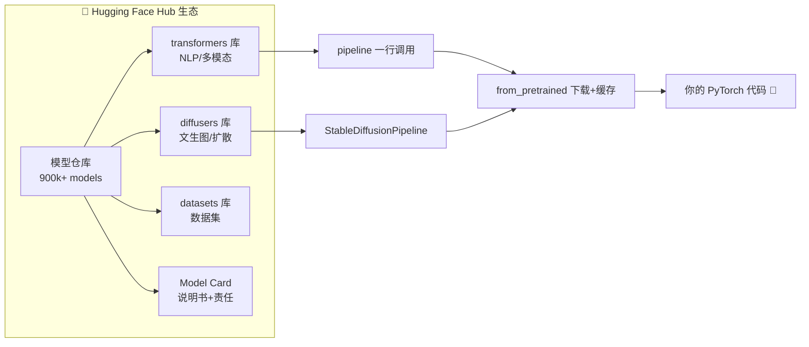
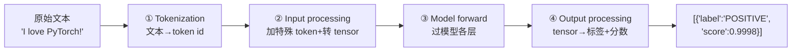

# 🎬 第 14 章 · 使用第三方模型与模型中心Hub（Using Third-Party Models and Hubs）

> 本章对应原书 *AI and ML for Coders in PyTorch*（Laurence Moroney 著）第 14 章 "Using Third-Party Models and Hubs"，PDF 第 295–310 页。

## 🗺️ 本章地图（读完能会什么）

- 理解「预训练模型生态」这件事的本质：站在巨人肩膀上，用别人烧钱训练好的 SOTA 模型，而不是从零训练。
- 掌握 **Hugging Face Hub** 全流程：注册、拿 Read Token、处理 gated（受限）模型、在 Colab / 代码里用 Token 登录。
- 会用 **transformers 的 `pipeline`** 三行代码做情感分析，会用 **diffusers 的 `StableDiffusionPipeline`** 文生图，并说清 pipeline 在底层帮你做了哪四步。
- 掌握 **PyTorch Hub**：`torch.hub.list` / `torch.hub.load` 加载 ResNet-50，写完整的图像分类推理（预处理→归一化→`unsqueeze`→前向→解码 ImageNet 标签）。
- 了解 fairseq 翻译模型等「其它 Hub」，以及为什么现在几乎所有场景都优先选 Hugging Face。
- 把本章的「用现成模型」直接接到现代 LLM 工作流：`from_pretrained` 就是你以后加载 Llama、Qwen、Mistral 的同一把钥匙。

> 💡 **一句话本质**：现代 AI 工程 90% 的价值不在"从头训练"，而在"精准地把别人训练好的模型 `from_pretrained` 下来、包成 `pipeline`、跑推理或微调"——Hub 就是这个生态的中央仓库 + 版本控制 + 说明书。

---

## 🧭 为什么要用预训练模型：站在巨人肩膀上

在讲 API 之前，先讲清**为什么**。原书开篇就把整章的立意点明了：

> "I like to call this 'standing on the shoulders of giants.'"
>
> "我喜欢把这件事叫做'站在巨人的肩膀上'。"（原书 p.295）

第一性原理：训练一个 SOTA 模型需要三样你多半没有的东西——

| 稀缺资源 | 从头训练需要 | 用预训练模型 |
| --- | --- | --- |
| **算力** | 成百上千张 GPU 训练几周到几个月 | 下载权重 + 一次前向推理（一张卡甚至 CPU） |
| **数据** | 干净、多样、海量、标注好的数据集 | 别人已经在 ImageNet / C4 / SST 上训过了 |
| **专业知识** | 架构设计、超参调优、稳定训练的经验 | 直接拿 SOTA 架构（ResNet / BERT / SD） |
| **责任合规** | 你要自己评估偏见/风险 | 附带 **model card** 讲清训练数据与局限 |

原书还点出用法的两条主线：**直接推理**（inference）和**作为微调起点**（fine-tuning / transfer learning / LoRA，LoRA 留到第 20 章讲）。

> 💡 **实战/面试高频**：面试被问"你怎么快速做一个情感分类器？"——标准答法不是"我搭个 LSTM 训练"，而是"我先用 HF 上 `distilbert-base-uncased-finetuned-sst-2-english` 起个 baseline，效果不够再拿业务数据微调"。**先复用、再微调、最后才考虑从头训**，这是当下工程师的默认心智。

原书特别提到一个职业观察，值得工程师记住：

> "I'm personally seeing huge growth in the careers of software developers who don't train models from scratch and instead use or fine-tune existing ones."
>
> "我个人看到，那些不从零训练模型、而是复用或微调现有模型的软件开发者，职业发展非常迅猛。"（原书 p.296）

原书还给出了 Hub 的江湖格局——记住这句"没有一个 Hub 能统治所有"：

> "There is no 'One Hub to Rule Them All.'"（原书 p.296）

- **Hugging Face**：transformer / 生成式模型的事实标准（de facto standard）。
- **PyTorch Hub**：官方支持的实现（如 torchvision、fairseq）。
- **Kaggle**：竞赛冠军模型。
- **GitHub-based TorchHub**：直接触达研究实现。

---

## 🤗 Hugging Face Hub 是什么

原书对 HF 的定位讲得很准：它靠两个开源库起家并封神——

> "Much of its usefulness … is the open source availability of two things: a transformers library … and a diffusers library …"
>
> "它绝大部分的实用性……来自两个开源库的开放：一个 transformers 库……和一个 diffusers 库……"（原书 p.296）

- **transformers**：让"用预训练语言模型"变得极其简单（BERT、GPT、Llama…）。
- **diffusers**：对文生图扩散模型（如 Stable Diffusion）做同样的封装。

一开始只是 transformer 模型的仓库，如今已长成覆盖 **CV / 音频 / 强化学习** 的一站式生态：模型版本控制 + 文档 + model card。原书写作时公开模型已 **超过 90 万个**（"over 900,000 publicly available models"，p.296）——今天早已破百万。



---

## 🔑 使用 Hugging Face Hub：先搞定 Token

原书用了整整一节讲怎么拿 Token，因为**很多模型需要鉴权才能下载**。流程：

1. 去 `huggingface.co` 注册/登录。
2. 右上角头像 → 下拉菜单 → **Access Tokens**。
3. **Create New Token** → 选 **Read** 权限 → 起个名字（原书示例叫 `PyTorch Book`）。
4. 弹窗提示：**关掉就再也看不到明文**，务必点 Copy 存好。忘了就只能 **Invalidate and Refresh** 重新生成。

> ⚠️ **踩坑**：Token 权限分 **Read / Write / Fine-grained**。**下载模型跑推理用 Read 就够了**——不要图省事建 Write Token 到处贴，泄露了别人能往你账号推模型。生产环境用细粒度（fine-grained）Token 并限定仓库范围。

### Gated（受限）模型

很多热门模型（比如 Llama 系列）需要你在模型页**先申请许可**，你的许可是**绑定在 Token 上**追踪的。没权限时会看到原书给的这个报错：

```text
GatedRepoError: 401 Client Error.
Cannot access gated repo for url [...]
Access to model [...] is restricted.
You must have access to it and be authenticated to access it.
Please log in.
```

解决办法：拿模型名去 HF 找到它的 landing page，点同意条款 → 等审批通过（通常几分钟到几小时）。

### 三种把 Token 喂给代码的方式

| 方式 | 场景 | 做法 |
| --- | --- | --- |
| **Colab Secret** | 在 Google Colab 跑 | 左侧 🔑 图标 → Add new secret → 名字必须叫 `HF_TOKEN`，打开 Notebook Access |
| **代码内 login** | 任意环境 | `from huggingface_hub import login; login(token="...")` |
| **环境变量**（工程推荐） | 服务器/CI | 设 `export HF_TOKEN=hf_xxx`，库会自动读取 |

原书给的代码内登录写法：

```python
# 方式二：直接在代码里登录（Colab 或本地都行）
from huggingface_hub import login

login(token="YOUR_TOKEN_HERE")  # 之后这个 Python 会话里所有 HF 调用都会带上这个 Token
```

> 💡 **实战/面试高频**：**不要把明文 Token 硬编码进代码提交到 Git**。正确姿势是读环境变量或 Colab Secret。原书用 `HF_TOKEN` 这个名字不是随意的——`huggingface_hub` 库会**自动**去读名为 `HF_TOKEN` 的环境变量/Secret，你甚至可以不写 `login()`。

---

## 🎯 从 Hugging Face Hub 用一个模型：`pipeline`

这是本章最核心的 API。原书用**情感分析**做演示，需要先装 transformers：

```bash
pip install transformers
```

然后三行拿到一个在斯坦福 SST（Stanford Sentiment Treebank）数据集上微调过的模型：

```python
from transformers import pipeline

# 加载一个小型情感分析模型
classifier = pipeline(
    "sentiment-analysis",                                    # 第一个参数：任务类型
    model="distilbert-base-uncased-finetuned-sst-2-english"  # 模型在 HF 仓库里的名字
)
```

`pipeline` 的第一个参数是**任务（task）**，`transformers` 提供了一大堆任务类型：`sentiment-analysis` / `text-classification` / `text-generation` / `translation` / `question-answering` / `fill-mask` / `zero-shot-classification`……第二个参数是**具体模型名**（不传就用该任务的默认模型）。

原书强调：`pipeline` 远不止"下载"，它**封装了一整套常见任务流程**。调用时底层发生了四步：



对应原书 Figure 14-9 的 NLP pipeline flow。四步分别是：

1. **Tokenization**：文本转 token（第 4/5 章讲过的编码）。
2. **Input processing**：加特殊 token（如 `[CLS]` `[SEP]`），转成张量。
3. **The model forward pass**：token 过模型各层得到结果。
4. **Output processing**：把输出张量解码回人能读的标签。

调用超简单，编码负担全被抽象掉了：

```python
# 测试模型
text = "I love programming with PyTorch!"
result = classifier(text)
print(result)  # 输出: [{'label': 'POSITIVE', 'score': 0.9998}]
```

> 💡 **实战/面试高频**：`pipeline` 的价值就是**把 tokenizer + model + 后处理三件套打包**。面试常问"transformers 里 `AutoTokenizer`、`AutoModel`、`pipeline` 什么关系"——`pipeline` = `AutoTokenizer` + `AutoModelForXxx` + 前后处理的高层封装；要更细粒度控制（改 batch、改 device、拿 logits）就下沉到 `AutoModel` 手动写。

### diffusers：同一套心智，文生图

原书顺势展示 diffusers，说明**同一种"pipeline 封装"心智**也适用于生成式图像：

```python
import torch
from diffusers import StableDiffusionPipeline

model_id = "CompVis/stable-diffusion-v1-4"
device = "cuda"

# from_pretrained 下载权重并实例化；float16 半精度省显存
pipe = StableDiffusionPipeline.from_pretrained(model_id, torch_dtype=torch.float16)
pipe = pipe.to(device)  # 挪到 GPU

prompt = "a cute colorful cartoon cat"
image = pipe(prompt).images[0]   # 一行完成文生图
image.save("cat.png")
```

底层其实做了四步（原书列出）：

1. **文本编码**：Stable Diffusion 用 **CLIP** 把 prompt 转成模型能懂的 embedding。
2. 从**随机噪声**构造一张初始图像。
3. embedding 喂进模型，通过**去噪（denoising）**逐步生成匹配文本的像素/特征。
4. 输出张量转回 RGB 图像。

> ⚠️ **踩坑**：原书专门提醒——**因为起点是随机噪声，每次生成的图都不一样**，别慌以为代码错了。要复现同一张图，需要固定 **seed**（`torch.Generator(device).manual_seed(42)`），这个第 19/20 章会讲。

---

## 🔬 关键代码拆解：ResNet-50 完整推理管线

本章第二个 Hub 是 **PyTorch Hub**。原书用 `torch.hub` 加载 ResNet-50 做图像分类，我们把这段**从加载到解码标签**的完整代码逐块拆开，把张量形状讲透——这是本章最值得吃透的一段。

先装并列出可用模型（注意**版本号要和你的 torchvision 对齐**）：

```python
import torch, torchvision

# 列出该版本 vision 仓库里所有模型（写作时接近 100 个）
models = torch.hub.list('pytorch/vision:v0.20.1')
for m in models:
    print(m)

print(torchvision.__version__)  # 出问题时先查自己的版本，tag 要和它匹配
```

### 第一步：加载模型并进入 eval 模式

```python
# 从 PyTorch Hub 加载 ResNet-50
model = torch.hub.load('pytorch/vision:v0.20.1', 'resnet50', pretrained=True)
model.eval()   # 关键：切到推理模式
```

- `torch.hub.load(repo, model_name, pretrained=True)`：会**下载权重 → 缓存到本地（`~/.cache/torch/hub`）→ 返回一个 `nn.Module`**。第二次加载走缓存，秒开。
- `model.eval()`：把 **BatchNorm 切到用运行时统计量、Dropout 关闭**。推理**必须**调，否则 BN/Dropout 行为错乱，结果会飘。

### 第二步：图像预处理（形状是重点）

```python
from PIL import Image
from torchvision import transforms

image = Image.open("example.jpg").convert('RGB')   # 保证 3 通道

preprocess = transforms.Compose([
    transforms.Resize(256),        # 短边缩放到 256
    transforms.CenterCrop(224),    # 从中心裁 224×224
    transforms.ToTensor(),         # PIL(H,W,C)[0,255] → Tensor(C,H,W)[0,1]
    transforms.Normalize(          # 按 ImageNet 均值/方差归一化
        mean=[0.485, 0.456, 0.406],
        std=[0.229, 0.224, 0.225]),
])

input_tensor = preprocess(image)       # 形状 (3, 224, 224)
input_batch  = input_tensor.unsqueeze(0)  # 形状 (1, 3, 224, 224) —— 加 batch 维
```

逐个讲清形状变化：

| 步骤 | 张量形状 | 说明 |
| --- | --- | --- |
| `Image.open().convert('RGB')` | PIL 图 (H, W, 3) | 强制 3 通道，防止灰度/RGBA 混入 |
| `Resize(256)` | (256, 256) 附近 | 短边 256，保持长宽比 |
| `CenterCrop(224)` | (224, 224) | ResNet 期望的输入尺寸 |
| `ToTensor()` | **(3, 224, 224)** | 通道优先 CHW，值域 `[0,1]` |
| `Normalize(...)` | (3, 224, 224) | 减均值除方差，值域大致 `[-2.6, 2.6]` |
| `unsqueeze(0)` | **(1, 3, 224, 224)** | 补 batch 维，单张也要 batch |

> ⚠️ **踩坑**：这三件事错一个结果就废——① 尺寸必须 **224×224**（ResNet 在 ImageNet 上就是这么训的）；② **Normalize 的 mean/std 必须用 ImageNet 那组固定数**（`[0.485,0.456,0.406]/[0.229,0.224,0.225]`），因为预训练时就用这组；③ **`unsqueeze(0)` 不能省**——模型永远吃 `(batch, C, H, W)` 四维，单张也得是 `(1,3,224,224)`。

### 第三步：前向推理

```python
device = torch.device("cuda" if torch.cuda.is_available() else "cpu")
model.to(device)
input_batch = input_batch.to(device)   # 模型和数据必须在同一 device

with torch.no_grad():                  # 推理不需要梯度，省显存+加速
    output = model(input_batch)        # 形状 (1, 1000)：ImageNet 1000 类的 logits

_, predicted_idx = torch.max(output, 1)  # 取最大 logit 的下标 → tensor([153])
```

- `output` 形状 **(1, 1000)**：ImageNet 1000 个类别每类一个分数（logit）。
- `torch.max(output, 1)` 沿第 1 维取最大，返回 `(values, indices)`，我们只要下标。
- 原书举例结果是 `tensor([153])`——**第 153 类是 Maltese dog（马耳他犬）**。

> 💡 **实战/面试高频**：`with torch.no_grad()` + `model.eval()` 是推理的**黄金搭档**，缺一不可。`eval()` 管 BN/Dropout 的行为，`no_grad()` 管不建计算图（省显存、提速）。面试常把这俩混问，记清：**一个管层行为，一个管梯度**。

### 第四步：把数字下标解码成人话

```python
import json, urllib.request

url = ("https://raw.githubusercontent.com/anishathalye/imagenet-simple-labels/"
       "master/imagenet-simple-labels.json")
class_labels = json.load(urllib.request.urlopen(url))   # 1000 个标签的列表
predicted_label = class_labels[predicted_idx]
print("Predicted Label:", predicted_label)   # Maltese dog
```

模型输出层的每个神经元**下标就对应一个标签的索引**，所以拿下标去查标签表即可。这个 labels 文件的 URL 是从 PyTorch Hub 的模型页挖出来的。

---

## 🌐 PyTorch Hub 的 NLP 与其它模型

### fairseq 翻译

原书说 PyTorch Hub 的 NLP 最终指向两处：一是前面讲的 HF transformers，二是 Facebook 的 **fairseq** 研究团队。fairseq 坑多，原书**强烈建议用 Python 3.11（不要更高）**：

```python
import torch

en2de = torch.hub.load('pytorch/fairseq', 'transformer.wmt19.en-de.single_model')
en2de.translate('Hello Pytorch', beam=5)
# 'Hallo Pytorch'
```

> ⚠️ **踩坑**：原书原话——fairseq 环境"对 PyTorch、pip 和一堆库的版本极度挑剔，体验很脆（brittle）"。原书直接建议："**unless you really want to use the models from the fairseq repository, I'd recommend just going with the Hugging Face transformer versions.**"（除非你非用 fairseq 不可，否则直接上 HF transformers 版本。p.309）。这也是本章反复出现的主旋律：**能用 HF 就用 HF**。

### 其它模型

PyTorch Hub 还有音频、强化学习、生成式 AI 等仓库。原书给的探索方法：直接去 pytorch.org/hub 浏览，顺着 landing page 上的链接跳到对应 GitHub。新且创新的模型（如 **YOLO** 目标检测，"You Only Look Once"）也常首发在这里。

### 两个 Hub 怎么选

| 维度 | 🤗 Hugging Face Hub | 🔥 PyTorch Hub |
| --- | --- | --- |
| **定位** | 事实标准，一站式 | 老前辈（granddaddy），研究圈仍活跃 |
| **模型量** | 90 万+ | 近百个（vision）+ 零散仓库 |
| **API 一致性** | 高（`pipeline` / `from_pretrained` 统一） | 较低，原书说"不够一致、有时挺费劲" |
| **加载方式** | `pipeline(...)` / `AutoModel.from_pretrained` | `torch.hub.load(repo:tag, name)` |
| **鉴权** | Token（gated 模型需申请） | 一般无需 |
| **最佳场景** | NLP / 多模态 / 生成式 / 微调 | torchvision 官方视觉模型、YOLO、研究复现 |
| **易碎程度** | 稳 | 版本对齐敏感（尤其 fairseq） |

---

## 🔗 通向 LLM

本章的"用现成模型"正是你今后玩 LLM 的**底层肌肉记忆**，几乎一一对应：

- **`from_pretrained` = 加载任何 LLM 的钥匙**。你以后写 `AutoModelForCausalLM.from_pretrained("Qwen/Qwen2.5-7B-Instruct")` 加载 Qwen、Llama、Mistral，用的就是本章这套 API，只是任务从 `sentiment-analysis` 换成 `text-generation`（自回归解码）。
- **`pipeline("text-generation")` = 最快的 LLM 推理入口**。`pipe("请解释注意力机制", max_new_tokens=200)` 底层还是那四步（tokenize → 加特殊 token → forward → decode），只是 forward 变成**逐 token 自回归采样**。
- **gated 模型 + Token** = 你申请 Llama、Gemma 权限的必经之路。Meta / Google 的开源 LLM 都是 gated repo，本章的 `GatedRepoError` 处理流程原样复用。
- **Model card** = 现代 LLM 的"营养成分表"。训练数据、上下文长度、许可证（能不能商用）、已知偏见都写在这，选型第一步就是读它。
- **diffusers 的 pipeline 心智** = 第 19/20 章文生图与 LoRA 微调的地基；CLIP 文本编码器也是多模态 LLM（如 LLaVA）的组件。
- **`.to(device)` / `torch_dtype=torch.float16`** = 大模型推理的显存生存术。7B 模型 fp16 约 14GB 显存，本章的半精度、`no_grad` 全部照搬，再往上就是量化（int8/int4）与 `device_map="auto"` 多卡切分。
- **迁移学习/LoRA 伏笔**：本章反复提"用作微调起点"，第 16 章微调、第 20 章 LoRA 会把这条线补全。

> 💡 **实战/面试高频**：一句话串起全书主线——"**本章的 `from_pretrained` 就是我加载 LLM 的入口，`pipeline` 就是我跑 LLM 推理的最短路径，Token 就是我拿 Llama 权限的凭证。**"能这么讲，说明你把"用现成模型"这条主线吃透了。

---

## 🌍 社区案例与延伸

补几个原书之外、可查证的真实资料，帮你把本章概念钉在文献上：

1. **transformers 库论文**：Wolf et al., *Transformers: State-of-the-Art Natural Language Processing*, EMNLP 2020 Demo（arXiv:1910.03771）。这是 `pipeline`/`AutoModel` 背后的库论文，官方仓库 <https://github.com/huggingface/transformers>。
2. **DistilBERT**（本章情感分析用的那个模型的骨架）：Sanh et al., *DistilBERT, a distilled version of BERT: smaller, faster, cheaper and lighter*（arXiv:1910.01108）。它蒸馏自 BERT，参数少 40%、快 60%、保留 97% 性能——所以原书说它"small"。
3. **ResNet**（本章 PyTorch Hub 加载的模型）：He et al., *Deep Residual Learning for Image Recognition*, CVPR 2016（arXiv:1512.03385）。残差连接让上百层网络可训，是 CV 迁移学习最常用的 backbone。
4. **Stable Diffusion**：Rombach et al., *High-Resolution Image Synthesis with Latent Diffusion Models*, CVPR 2022（arXiv:2112.10752）；文本编码器 **CLIP**：Radford et al.（arXiv:2103.00020）。对应本章 diffusers 文生图的 CLIP+去噪流程。
5. **Model Cards 方法论**：Mitchell et al., *Model Cards for Model Reporting*, FAT\* 2019（arXiv:1810.03993）。原书说的"model card 帮你负责任地用模型"就出自这篇。
6. **YOLO**：Redmon et al., *You Only Look Once: Unified, Real-Time Object Detection*, CVPR 2016（arXiv:1506.02640）；工程实现看 Ultralytics 仓库 <https://github.com/ultralytics/ultralytics>。
7. 官方文档：Hugging Face Hub 文档 <https://huggingface.co/docs/hub>、PyTorch Hub 主页 <https://pytorch.org/hub/>。

---

## ⚠️ 常见坑

1. **Token 明文进 Git**：硬编码 `login(token="hf_xxx")` 提交上去 = 泄露。用环境变量 `HF_TOKEN` 或 Colab Secret，别 commit。
2. **忘了申请 gated 权限**：加载 Llama/Gemma 报 `GatedRepoError 401`，不是代码 bug，是你没在模型页点同意 + Token 没绑权限。去 landing page 申请。
3. **`torch.hub.load` 版本 tag 不匹配 torchvision**：`pytorch/vision:v0.20.1` 的 tag 必须和你本地 `torchvision.__version__` 对齐，否则报错或加载失败。先 `print(torchvision.__version__)`。
4. **推理忘了 `model.eval()` + `torch.no_grad()`**：不 `eval()` 则 BatchNorm/Dropout 行为错误、结果漂移；不 `no_grad()` 则白建计算图、浪费显存。两者都要。
5. **预处理不一致**：Normalize 不用 ImageNet 那组 mean/std、尺寸不是 224×224、忘了 `unsqueeze(0)` 补 batch 维——任何一个都会让 ResNet 输出乱码。**预处理必须和预训练时完全一致**。
6. **扩散模型每次出图不同还以为报错**：起点是随机噪声，天生不确定；要复现固定 `seed`。

---

## 🎯 面试速答

- **Q：为什么优先用预训练模型而不是从头训练？**
  A：省算力、省数据、拿到 SOTA 架构、附带 model card 更合规——从头训练需要的 GPU/数据/调参经验大多数团队都没有，复用是性价比最高的起点。

- **Q：Hugging Face `pipeline` 底层做了哪几步？**
  A：Tokenization（文本转 token）→ Input processing（加特殊 token、转张量）→ Model forward（过模型层）→ Output processing（张量解码成标签），四步打包成一次调用。

- **Q：`model.eval()` 和 `torch.no_grad()` 分别管什么？**
  A：`eval()` 让 BatchNorm 用运行时统计量、关闭 Dropout（管层行为）；`no_grad()` 不构建计算图、省显存加速（管梯度）。推理两者都要。

- **Q：加载模型报 `GatedRepoError 401` 怎么办？**
  A：这是受限模型，去 HF 模型页申请许可并同意条款，确保用的是绑定了该许可、且有 Read 权限的 Token 登录。

- **Q：Hugging Face Hub 和 PyTorch Hub 怎么选？**
  A：NLP/多模态/生成式/微调一律 Hugging Face（生态大、API 统一、900k+ 模型）；官方视觉模型（torchvision/ResNet）或研究复现（YOLO/fairseq）可用 PyTorch Hub，但注意版本对齐、fairseq 环境很脆。

---

## 📌 本章小结

1. **核心心智**：现代 AI 工程是"站在巨人肩膀上"——用 `from_pretrained` 下载别人训练好的 SOTA 模型做推理或微调，而非从零训练。
2. **Hugging Face Hub** 是事实标准：`transformers` 的 `pipeline` 三行做情感分析，`diffusers` 的 `StableDiffusionPipeline` 一行文生图，底层都封装了 tokenize→forward→decode。
3. **鉴权流程**：Read Token → 处理 gated 模型（`GatedRepoError`）→ 用 `HF_TOKEN`（Colab Secret / 环境变量 / `login()`）。
4. **PyTorch Hub**：`torch.hub.load` 加载 ResNet-50，写完整推理链（Resize/Crop/ToTensor/Normalize/unsqueeze → `no_grad` 前向 → `torch.max` → ImageNet 标签解码）；fairseq 翻译能用但环境脆。
5. **主线**：本章 API 直接通向 LLM——`from_pretrained`/`pipeline`/Token/model card 就是你后面加载 Llama、跑推理、申请权限、做微调（第 15–20 章）的同一套工具。

---

## 🔗 延伸阅读 & 交叉链接

- 上一章部署基础：[[13_用TorchServe与Flask部署PyTorch模型]]
- 推理张量进出（配合本章预处理理解形状）：[[12_推理的概念：Tensor进与出]]
- 下一章深入 transformers 与 LLM：[[15_Transformer架构与transformers库]]
- 用自定义数据微调 LLM（本章"作为微调起点"的展开）：[[16_用自定义数据微调与提示微调LLM]]
- 本地部署 LLM：[[17_用Ollama部署与服务LLM]]
- 用 diffusers 做生成式图像（本章 Stable Diffusion 的展开）：[[19_用HuggingFace_Diffusers做生成式图像]]
- LoRA 微调（本章开头提到的 low-rank adaptation）：[[20_用LoRA与Diffusers微调生成式图像模型]]
- 落地实战合流：[[21_从本书基础到LLM落地实战（合流篇）]]

外部真实链接：
- Hugging Face Hub 官方文档：<https://huggingface.co/docs/hub>
- PyTorch Hub：<https://pytorch.org/hub/>
- transformers 仓库：<https://github.com/huggingface/transformers>
- diffusers 仓库：<https://github.com/huggingface/diffusers>
- ResNet 论文（arXiv:1512.03385）：<https://arxiv.org/abs/1512.03385>
- Stable Diffusion 论文（arXiv:2112.10752）：<https://arxiv.org/abs/2112.10752>
