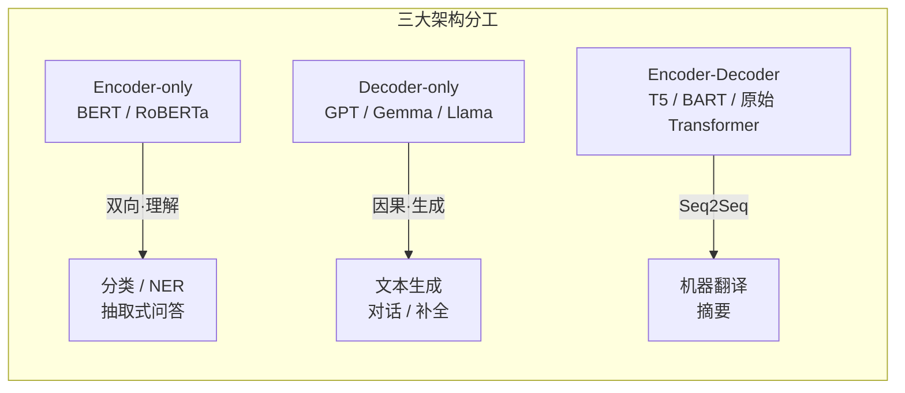
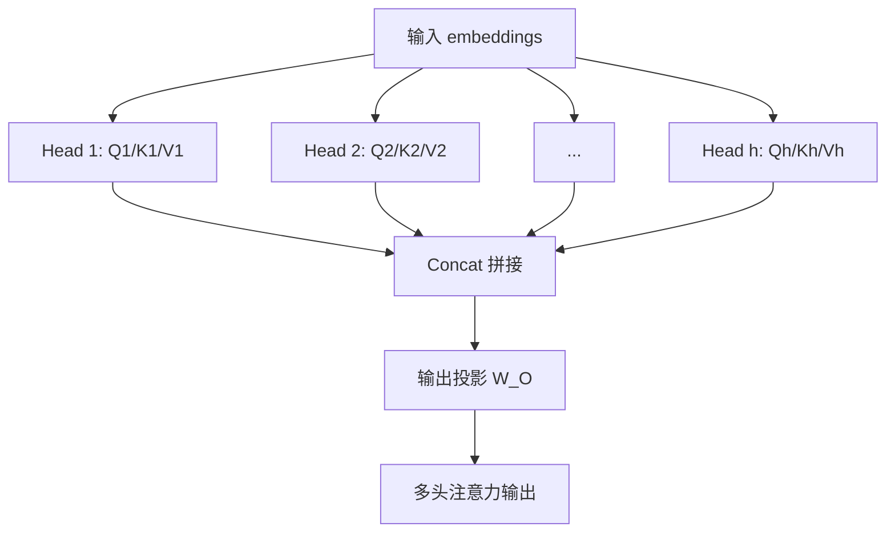
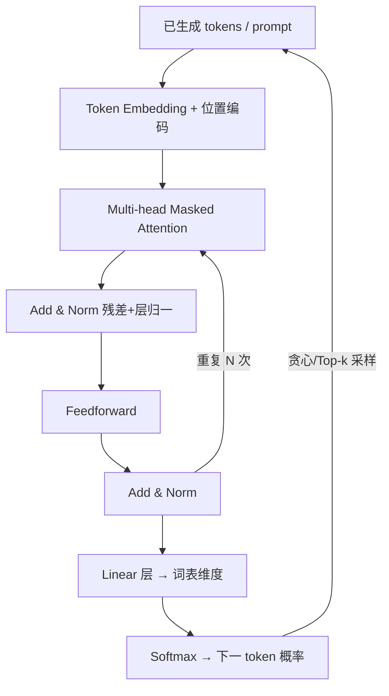

# 🎬 第 15 章 · Transformer架构与transformers库（Transformers and transformers）

> 本章对应原书 *AI and ML for Coders in PyTorch*（Laurence Moroney 著）第 15 章 "Transformers and transformers"，PDF 第 311–338 页。

## 🗺️ 本章地图（读完能会什么）

- 从第一性原理讲清 **Transformer 架构**：为什么 2017 年的《Attention Is All You Need》能一举取代前面第 4–9 章讲的卷积（CNN）和循环（RNN/LSTM）。
- 讲透三大架构骨架：**Encoder-only（BERT 类，擅长“理解”）**、**Decoder-only（GPT 类，擅长“生成”）**、**Encoder-Decoder（T5/翻译类，擅长“序列到序列”）**——以及每种该用在什么场景。
- 拆开 Transformer 的零件：**self-attention（Q/K/V）**、**多头（multi-head）**、**位置编码（positional encoding）**、**masked attention（因果掩码）**、**FFN（前馈网络引入非线性）**、**LayerNorm + 残差连接**、**cross-attention**，每一个都配可跑的 PyTorch 代码。
- 学会用大写 T 的概念 **Transformers** 之外，还会用小写 t 的 **Hugging Face `transformers` 库**：`pipeline` 一行调模型、`AutoTokenizer` 处理分词。
- 吃透三种主流分词器：**WordPiece（BERT）/ BPE（GPT）/ SentencePiece（T5）**，并把它们直接接到现代 LLM 的分词管线上。

> 💡 **一句话本质**：Transformer 用「注意力」代替了「循环/卷积」——让序列里每个 token 都能一步直连地"看"到（或按掩码有选择地看到）其它 token，从而把语言理解与生成变成可大规模并行、可堆深的矩阵运算；而 Hugging Face `transformers` 库把这套复杂架构封装成几行 `pipeline` 就能调用的 API。

---

原书开篇就把这条分水岭讲得很直白：

> "With the paper 'Attention Is All You Need' by Ashish Vaswani et al. in 2017, the field of AI was changed forever. ... At its core was a new approach to ML architecture: Transformers (which we capitalize to indicate that we're referring to them as a concept)."
>
> 「随着 Ashish Vaswani 等人 2017 年的论文《Attention Is All You Need》，AI 领域被永远改变了。……其核心是一种全新的 ML 架构方法：Transformers（我们把首字母大写，以表示这是一个概念）。」——原书 p.289

作者特意定了一个贯穿全章的约定，先记牢，否则后面会晕：

| 写法 | 指代 | 例子 |
|---|---|---|
| **Transformers**（大写 T） | 架构、模型、概念本身 | self-attention、encoder、decoder |
| **transformers**（小写 t） | Hugging Face 出的**库/API** | `from transformers import pipeline` |

---

## 🧠 Understanding Transformers：注意力为什么赢

在第 7、8、11 章里我们用 RNN/LSTM 处理序列，它有个结构性痛点：信息必须**沿时间一步步传递**，句子越长，早期 token 的信息越容易在传递中衰减；而且天生串行，没法把整句话一次性喂给 GPU 并行算。

Transformer 的第一性原理就是：**别再让信息"接力跑"了，直接让每个词一步连到所有词**。它用一个叫 self-attention 的机制，为句子里任意两个 token 之间建立一条"直连高速路"。

原书用了一个非常好记的例子来解释注意力在解决什么：

> "consider the sentence 'I went to high school in Ireland, so I had to study how to speak Gaelic.' The last word in this sentence is Gaelic, and it's effectively triggered by the word Ireland earlier in the sentence."
>
> 「考虑句子『我在爱尔兰上的高中，所以我得学怎么说盖尔语（Gaelic）。』这句话的最后一个词是 Gaelic，它其实是被句子前面的 Ireland 这个词触发的。」——原书 p.290

如果模型只盯着 "how to speak" 附近，最可能补的是 politely 之类的副词；只有**注意到整句话**、把 Gaelic 和远处的 Ireland 关联起来，才能预测正确。这就是注意力的价值：让相关但相隔很远的词互相"够得着"。



原书对三种架构的定性总结（务必背下这张对照表，面试常问）：

| 架构 | 代表模型 | 注意力方向 | 天生擅长 | 天生不擅长 |
|---|---|---|---|---|
| **Encoder-only** | BERT、RoBERTa | 双向（看全句） | 深度理解、分类、NER、抽取式 QA | 生成新文本 |
| **Decoder-only** | GPT-2/3、Llama、Gemma | 单向/因果（只看左边） | 自回归生成、对话、补全 | 无（现代 LLM 主流） |
| **Encoder-Decoder** | T5、BART、原始 Transformer | 编码双向 + 解码因果 + cross | 翻译、摘要等序列到序列 | 结构更重、纯生成任务偏冗余 |

---

## 🔍 Encoder Architectures：把文本读成"富含上下文的向量"

原书对 encoder 的定性：

> "Encoder-only architectures (e.g., BERT, RoBERTa) generally excel at understanding text ... They're bidirectional in nature, being able to 'see' the entire input sequence at once."
>
> 「Encoder-only 架构（如 BERT、RoBERTa）通常擅长理解文本……它们天生是双向的，能一次性'看见'整个输入序列。」——原书 p.290

Encoder 的数据流是：**分词后的输入 → self-attention → FFN → LayerNorm**，这三层堆叠 N 次。我们逐个零件拆。

### 🎯 The self-attention layer：Q / K / V 三向量

self-attention 的机制是：给句子里每个 token 学出三个向量。原书用三个大白话问题定义它们：

| 向量 | 原书大白话 | 直觉 |
|---|---|---|
| **Query (Q)** | "What am I looking for that's relevant to this token?" | 我在找什么与我相关的信息 |
| **Key (K)** | "What tokens might reference me?" | 什么 token 可能会来引用我 |
| **Value (V)** | "What type of information do I carry?" | 我携带的是什么信息 |

计算流程：用某个 token 的 Q 去和所有 token 的 K 做点积得到**注意力分数**，过 Softmax 变成权重，再对所有 V 加权求和——原书说这会"把有学到相似性的词向量彼此拉近（bending word embeddings closer to one another）"。

标准公式（原书没写死，但这是必须记住的核心）：

$$\text{Attention}(Q,K,V) = \text{softmax}\left(\frac{QK^\top}{\sqrt{d_k}}\right)V$$

那个 $\sqrt{d_k}$ 是缩放因子，防止维度大时点积过大、Softmax 饱和到梯度消失。下面用 PyTorch 手写一遍单头 self-attention，把形状标清楚：

```python
import torch
import torch.nn.functional as F

# 假设 batch=1, 序列长度 seq=3（the cat sat），每个 token 维度 d_model=4
x = torch.randn(1, 3, 4)          # (batch, seq, d_model) = (1, 3, 4)

d_model, d_k = 4, 4
Wq = torch.nn.Linear(d_model, d_k, bias=False)
Wk = torch.nn.Linear(d_model, d_k, bias=False)
Wv = torch.nn.Linear(d_model, d_k, bias=False)

Q = Wq(x)   # (1, 3, 4)  每个 token 一个 query
K = Wk(x)   # (1, 3, 4)
V = Wv(x)   # (1, 3, 4)

# QK^T：(1,3,4) @ (1,4,3) -> (1,3,3)，行 i 列 j = token i 对 token j 的原始分数
scores = Q @ K.transpose(-2, -1) / (d_k ** 0.5)   # (1, 3, 3) 缩放
weights = F.softmax(scores, dim=-1)                # 每行归一化成概率，(1, 3, 3)
out = weights @ V                                  # (1,3,3)@(1,3,4) -> (1, 3, 4)
print(out.shape)   # torch.Size([1, 3, 4]) —— 形状不变，但每个向量已"注入上下文"
```

> 💡 **实战/面试高频**：self-attention 里 encoder 是**双向**的，所以"词的顺序本身不影响谁能看谁"——原书原文 "self-attention is generally bidirectional, so the order of the words doesn't matter"。正因为注意力对顺序无感，才**必须**额外加位置编码（下节讲），否则 "cat sat" 和 "sat cat" 在模型眼里一模一样。

### 🎯 Multi-head：多个注意力"专家"并行

原书把多头讲得很清楚：多头就是**并行跑多套 Q/K/V**，每套学不同的表示、专精输入的不同方面，最后把各头结果**拼接（concatenate）**再做一次输出投影。

> "each head has its own set of learned weights for Q, K, and V vectors. The processing and learning for these vectors is done in parallel, with their results concatenated"
>
> 「每个头都有自己一套学到的 Q、K、V 权重。这些向量的计算与学习是并行的，结果再拼接起来。」——原书 p.291

模型越做越大，头数是一个重要维度。原书给了具体数字，值得记：

| 模型 | 注意力头数 |
|---|---|
| BERT-base | 12 |
| BERT-large | 16 |
| GPT-2 | 12 |
| GPT-3 | **96** |



### 🎯 The feedforward network（FFN）：给模型注入非线性

原书用一个绝妙的例子解释"为什么需要非线性"：如果 good = +1、not = −1，那 "not good" 若按线性相加就是 0（中性），但 "not good" 明明是**负面**。语言的情感不是线性可加的，所以必须有非线性。

FFN 干的事：**升维 → 过 ReLU 把负值抹成 0（这一步就是引入非线性）→ 降回原维度**。原书把 ReLU 抹负值形象地叫做 **bending（弯折）**。下面是原书 p.293 的原样代码（PyTorch）：

```python
import torch
import torch.nn as nn

d_model = 2   # 输入/输出维度
d_ff = 4      # 隐藏层维度（升维）

x = torch.tensor([[-1.0, 2.0]])            # (1, 2)

# 第一层线性：2 -> 4
W1 = torch.tensor([[1.0, -1.0],
                   [-1.0, 1.0],
                   [0.5, 0.5],
                   [-0.5, -0.5]])
b1 = torch.tensor([0.0, 0.0, 0.0, 0.0])
layer1_out = torch.matmul(x, W1.t()) + b1  # -> [-3.0, 3.0, 0.5, -0.5]

relu_out = torch.relu(layer1_out)          # -> [0.0, 3.0, 0.5, 0.0]  负值被 bend 成 0

# 第二层线性：4 -> 2（降回原维度）
W2 = torch.tensor([[1.0, -1.0, 0.5, -0.5],
                   [-1.0, 1.0, 0.5, -0.5]])
b2 = torch.tensor([0.0, 0.0])
final_out = torch.matmul(relu_out, W2.t()) + b2   # -> [-2.75, 3.25]
print(final_out)
```

原书特意验证非线性："如果输入 `[-1.0, 2.0]` 翻倍成 `[-2.0, 4.0]`，输出不会是简单翻倍"：

| 输入 | 输出 | 说明 |
|---|---|---|
| `[-1.0, 2.0]` | `[-2.75, 3.25]` | 基准 |
| `[-2.0, 4.0]` | `[-5.5, 6.5]` | **不是简单翻倍** |
| `[1.0, -2.0]` | `[2.75, -3.25]` | **不是简单取反** |

> 💡 **实战/面试高频**：FFN 里的升维倍数在真实模型里通常是 **4 倍**（如 d_model=768 → d_ff=3072）。这个 4× 是 Transformer 的"参数大户"——约 2/3 的参数量都在 FFN 里，而不是注意力。近年 LLM（Llama、Mixtral）把这一层换成 **SwiGLU / MoE** 来提效。

### 🎯 Layer normalization：稳住数据流

LayerNorm 的目标是**稳定流过网络的数据**：算出输入特征的均值和方差，做标准化（把均值推到 0、标准差推到 1），再用可学习的 **gamma（缩放/scale）** 和 **beta（平移/shift）** 恢复一点分布。原书打了个绝妙的比方：

> "I like to think of this as what you do with your TV ... Think of the contrast as the scale and the brightness as the shift."
>
> 「我喜欢把它想成调电视——把对比度想成 scale，把亮度想成 shift。」——原书 p.296

为什么要 scale/shift？因为纯标准化会"把特征变得太像、抹掉了区分度"，gamma/beta 是给网络一个可学习的旋钮，把有用的方差"还"回来。原书 p.296 代码：

```python
import torch

features = torch.tensor([5.0, 1.0, 0.1])
mean = features.mean()          # 2.033...
std  = features.std()           # 2.608...
normalized = (features - mean) / std     # 均值≈0，标准差≈1

gamma = torch.tensor([2.0, 0.5, 1.0])    # 可学习：像"对比度"
beta  = torch.tensor([1.0, 0.0, -1.0])   # 可学习：像"亮度"
scaled_shifted = gamma * normalized + beta
print(scaled_shifted)   # tensor([ 3.2748, -0.1981, -1.7412])
```

### 🎯 Repeated encoder layers：堆 N 层

原书指出：self-attention + FFN + LayerNorm 这一整块会**重复 N 次**，小模型典型 12 层、大模型 24 层。越深容量越大，但**训练更慢、显存更多、更易过拟合**。一个省参数的技巧是**跨层共享权重**——原书点名 **ALBERT** 就是复用同一层。

---

## ✍️ The Decoder Architecture：自回归的生成引擎

encoder 擅长"理解全句"，decoder 则是**逐个 token 往外吐字的生成引擎**。原书的关键定性：

> "the decoder operates autoregressively. It generates each output token while considering both the encoded input representations and the previously generated outputs."
>
> 「decoder 是自回归工作的。它在生成每个输出 token 时，会同时考虑编码后的输入表示和之前已生成的输出。」——原书 p.297

原书的经典例子：给 decoder 喂 prompt

```python
["If", "you", "are", "happy", "and", "you", "know", "it"]
```

跑一遍后生成 `"clap"`，然后把 clap 追加回去，再预测下一个……这就是**自回归（autoregressive）**。



### 🎯 Token + Positional Encoding：把"位置"缝进向量

token 先变成 embedding（第 5 章讲过，语义相近的词聚在相近向量空间）。然后做 **positional encoding（位置编码）**——原书称之为 Transformer 的"巨大创新"。因为注意力对顺序无感，必须显式告诉模型"谁在第几位"。

原书的做法：用**正弦/余弦波**给每个位置生成一个向量，加到 token embedding 上。原书举的简化例子（3 维）：

```
"it"   位置7 -> embedding [0.2, -0.5, 0.7] + PE[.122, .992, .122] = [0.322, 0.492, 0.822]
"clap" 位置8 -> embedding [-0.3, 0.4, 0.1] + PE[.139, .990, .139] = [-0.161, 1.390, 0.239]
```

标准正弦位置编码公式（原书给的是简化写法，这里是准确版，务必记）：

$$PE_{(pos,\,2i)} = \sin\!\left(\frac{pos}{10000^{2i/d_{model}}}\right),\quad PE_{(pos,\,2i+1)} = \cos\!\left(\frac{pos}{10000^{2i/d_{model}}}\right)$$

偶数维用 sin、奇数维用 cos。PyTorch 实现：

```python
import torch, math

def sinusoidal_pe(seq_len, d_model):
    pe = torch.zeros(seq_len, d_model)                  # (seq_len, d_model)
    pos = torch.arange(seq_len).unsqueeze(1).float()    # (seq_len, 1)
    # 每一对 (2i, 2i+1) 共享同一个频率
    div = torch.exp(torch.arange(0, d_model, 2).float() * (-math.log(10000.0) / d_model))
    pe[:, 0::2] = torch.sin(pos * div)   # 偶数维 sin
    pe[:, 1::2] = torch.cos(pos * div)   # 奇数维 cos
    return pe

print(sinusoidal_pe(4, 8).round(decimals=3))   # 对应原书 Table 15-1
```

原书点出位置编码的深意："让本来离得远的位置在某些维度上更近，本来离得近的在某些维度上更远"——从而给"远距离但相关"的词（如 Gaelic 和 Ireland）留出被聚类的可能。

> ⚠️ **踩坑**：原书用的是**加法**（PE 加到 embedding 上），且强调它"提供一种压力，但不完全覆盖 embedding"。现代主流 LLM（Llama、GPT-NeoX、Qwen）大多已换成 **RoPE（旋转位置编码）**——不是加法，而是对 Q/K 做旋转，外推长度更好。这是本章概念通向现代 LLM 的一个关键升级点。

### 🎯 Multi-head Masked Attention：因果掩码

decoder 和 encoder 的注意力唯一的关键区别：**掩码（mask）**。原书原文：

> "we should only pay attention to previous positions in the sequence."
>
> 「我们应该只关注序列中更靠前的位置。」——原书 p.300

因为生成第 9 个词时，你不可能"偷看"还没生成的第 9、10 个词——那是作弊。实现方式是一个**下三角矩阵**（1 表示可见，0 表示屏蔽）。原书 Table 15-2 的 "the cat sat"：

|  | the | cat | sat |
|---|---|---|---|
| **the** | 1 | 0 | 0 |
| **cat** | 1 | 1 | 0 |
| **sat** | 1 | 1 | 1 |

PyTorch 里就是把上三角位置的分数设成 `-inf`，Softmax 后自然变 0：

```python
import torch

seq = 3
scores = torch.randn(seq, seq)                       # (3, 3) 原始注意力分数
mask = torch.triu(torch.ones(seq, seq), diagonal=1)  # 上三角为 1（要屏蔽的未来）
scores = scores.masked_fill(mask == 1, float('-inf'))# 未来位置置 -inf
weights = torch.softmax(scores, dim=-1)              # -inf 经 Softmax -> 0
print(weights)   # 每行只在"当前及之前"有非零权重
```

### 🎯 Add & Norm：残差连接治梯度消失

原书讲得很实在：masked attention 的输出会**加回**原始输入（**残差连接 residual connection**），而不是替换它：

```
原始 "cat" embedding: [0.5, -0.3, 0.7, 0.1]   # cat 的基本信息
注意力学到的更新:      [0.2, 0.1, -0.1, 0.3]   # 来自其它词的上下文
相加后:               [0.7, -0.2, 0.6, 0.4]   # 原义 + 上下文
```

为什么加而不是替换？原书直接点名解决 **vanishing gradient（梯度消失）**：如果不保留原始输入，梯度会随层数越来越小，限制能堆的层数；始终把注意力输出加回原始输入，就给梯度设了一个"地板"，让深网络也能训。加完再过一次 LayerNorm 稳定数值。这个 `Attention → Add&Norm → FFN → Add&Norm` 会重复 N 次。

### 🎯 Linear + Softmax：把表示变成下一词的概率

decoder 跑完所有层后得到一个向量（比如 1×4）。**Linear 层**用一个词表大小的权重矩阵（每个词一列，4×1）去乘它，为每个词打分。原书 p.302 的手算例子——decoder 输出 `[0.2, -0.5, 0.8, -0.3]`，对 "cat" 打分：

```
(0.2×1.0) + (-0.5×-0.3) + (0.8×2.0) + (-0.3×0.4) = 1.8
```

各词得分过 Softmax 变概率：

| 词 | cat | dog | sat | mat | the |
|---|---|---|---|---|---|
| 分数 | 1.8 | −0.2 | 1.1 | 0.2 | 0.5 |
| Softmax | **47.5%** | 6.4% | 23.6% | 9.6% | 12.9% |

原书点名两种解码策略：

- **贪心解码（greedy decoding）**：直接取概率最高的词（这里选 cat）。
- **Top-k 解码**：从概率最高的 k 个（如前 3）里采样一个，增加多样性。

选出的词又喂回顶部的 token 列表，循环继续。这就是完整的自回归生成闭环。

---

## 🔀 The Encoder-Decoder Architecture：Seq2Seq 与 cross-attention

encoder-decoder（又叫 **sequence-to-sequence / seq2seq**）把两者拼起来，专治"输入和输出长度不一样"的任务——**机器翻译**是最典型的，摘要、问答也行。原书说它"长得很像 decoder 架构，区别是多插了一个 **cross-attention** 层"，把 encoder 的输出注入生成流程中间。

原书用**人类译者**的类比讲透 cross-attention 的直觉：

> "When a person translates a sentence from French to English, they don't just memorize the entire French corpus and then write English. Instead, while writing the English words, they actively look at different parts of the French sentence."
>
> 「一个人把法语翻成英语时，不会先背下整个法语语料再写英语。而是在写每个英语词时，主动去看法语句子的不同部分。」——原书 p.304

例子：法语 "Le chat noir" → 英语 "The black cat"，但法语里名词和形容词顺序是反的（直译会变成 "The cat black"）。译者边写边回看原文，聚焦最相关的部分——这正是 cross-attention 干的事。

**cross-attention 的机制关键**（面试爱问）：Q/K/V 还是老三样，但——

> "the Q vector will code from the decoder, while the K and V vectors will come from the encoder."
>
> 「Q 向量来自 decoder，而 K 和 V 向量来自 encoder。」——原书 p.305

| 注意力类型 | Q 来源 | K/V 来源 | 掩码 | 作用 |
|---|---|---|---|---|
| Encoder self-attention | encoder | encoder | 无（双向） | 理解输入全句 |
| Decoder masked self-attention | decoder | decoder | 因果掩码 | 看已生成的部分 |
| **Cross-attention** | **decoder** | **encoder** | 无 | 生成时回看源句 |

原书还解释了"为什么不干脆让 decoder 自注意力不加掩码、自己搞定理解+生成"：**关注点分离（separation of concerns）**——如果一个块既要理解输入又要生成输出，学习目标会很糟；分开后各司其职，encoder 用久经考验的理解架构，质量更高。

---

## 🤗 The transformers API：Hugging Face 把复杂封装成几行

现在切到小写 t 的库。原书对它的定位：

> "transformers provide an API for working with pretrained models that use Python and PyTorch. The library's success stems from three key innovations: a simple interface for using pretrained models, an extensive collection of pretrained models ... and a vibrant community."
>
> 「transformers 提供了一套用 Python 和 PyTorch 操作预训练模型的 API。它的成功源于三大创新：使用预训练模型的简单接口、海量预训练模型集合，以及活跃的社区。」——原书 p.306

它早已超出 NLP，覆盖**视觉、音频、多模态**。对开发者提供**多层抽象**：高层的 `pipeline`（第 14 章用过，一行调用），到底层的细粒度组件（tokenizer / model / optimizer 可自由拼装）。

### Getting Started：安装与登录

原书 p.307 的安装三件套：

```bash
pip install transformers
pip install datasets     # 处理 HuggingFace 数据集
pip install tokenizers   # 快速分词
```

很多 Hub 模型需要 token 鉴权（第 14 章讲过怎么拿）。代码里登录：

```python
from huggingface_hub import login
login(token="your_token_here")
```

或用环境变量：

```bash
export HUGGINGFACE_TOKEN="your_token_here"
```

---

## 🧩 Core Concepts：pipeline 与 tokenizer

### Pipelines：最有用的抽象

原书对 pipeline 的定性：它"把从数据预处理到模型推理再到结果格式化的**整个 ML 流程**封装进一个方法"。看它的威力（原书 p.308）：

```python
from transformers import pipeline

# 情感分析：没指定模型，只指定"场景"，pipeline 自动挑默认模型 + 初始化
classifier = pipeline("sentiment-analysis")
result = classifier("I love working with transformers!")
```

注意：你**没写任何**分词、转张量、归一化、反分词的代码——原书强调 pipeline 把这些全藏起来了。支持的场景远不止情感分析：文本分类、生成、摘要、翻译、实体识别、问答，乃至图像分类/分割/检测、语音识别/生成等多模态。

也可以覆盖默认、传自定义参数（原书 p.309 的文本生成例子）：

```python
generator = pipeline(
    "text-generation",
    model="gpt2",
    max_length=50,      # 生成多少 token
    temperature=0.7,    # 温度：越高越"有创意"
    top_k=50,           # 每步从概率最高的 50 个里挑
)
text = generator("The future of AI is")
```

原书列出 pipeline 在幕后帮你干的 5 件事，记住这份清单：

| 步骤 | pipeline 帮你做的事 |
|---|---|
| **Model loading** | 指定模型名即自动下载并缓存模型及配套工具（如 tokenizer） |
| **Preprocessing** | 把原始输入（字符串/位图/wave 文件）转成模型能吃的格式 |
| **Tokenization** | 用该模型专属的分词策略（"一种分词方案不适配所有模型"） |
| **Batching** | 自动算最优 batch size，兼顾内存约束 |
| **Post-processing** | 把模型输出的概率张量转成人类可读格式 |

### Tokenizers：`AutoTokenizer` 与三大流派

原书强调分词器"是把原始文本喂给模型的**第一步**，却常被低估——设计不好会拖垮整个模型性能"。核心权衡：**词表大小 vs 序列长度 vs 处理生僻词的能力**。

主流是**子词分词（subword）**——介于字符级和词级之间。原书的经典例子：`antidisestablishmentarianism`（反政教分离主义）虽然罕见，但由 `anti / dis / est / ab / lish / ment / ari / an / ism` 这些常见片段组成，于是既能**保持词表可控**，又能**优雅处理未登录词（OOV）**。

Hugging Face 用 `AutoTokenizer` 统一接口。三大流派对比（务必记 model ↔ tokenizer 的绑定关系）：

| 分词器 | 关联模型 | 子词标记 | 特点 |
|---|---|---|---|
| **WordPiece** | BERT | `##` 前缀 | 从基础词表迭代加最频繁组合；擅长有空格边界的语言 |
| **BPE**（字节对编码） | GPT 家族 | `Ġ`（空格符） | 数据压缩算法起家；从字符起迭代合并最频繁的对 |
| **SentencePiece** | T5 | `▁`（下划线代空格） | 把文本当原始 Unicode 序列，空格也当字符；强多语言支持 |

**WordPiece（BERT）**——原书 p.311 的例子：

```python
from transformers import AutoTokenizer

tokenizer = AutoTokenizer.from_pretrained('bert-base-uncased')   # WordPiece
text = "The ultramarathoner prequalified for the immunohistochemistry conference in neuroscience."
tokens = tokenizer.tokenize(text)
# ['the', 'ultra', '##mara', '##th', '##one', '##r', 'pre', '##qual', '##ified',
#  'for', 'the', 'im', '##mun', '##oh', '##isto', '##chemist', '##ry',
#  'conference', 'in', 'neuroscience', '.']

token_ids = tokenizer.encode(text)   # 加了特殊 token：[101, ..., 102]
decoded = tokenizer.decode(token_ids)
# [CLS] the ultramarathoner ... neuroscience. [SEP]
```

原书特别提醒：ID 列表首尾的 **101 / 102** 是特殊 token——`[CLS]`（句首）和 `[SEP]`（句尾），是模型要求的。长生僻词（marathoner、immunohistochemistry）被切成子词，常见词（conference、neuroscience）保持整词。

**BPE（GPT-2）**——同一句话，切法不同（用 `Ġ` 标空格）：

```python
tokenizer = AutoTokenizer.from_pretrained('gpt2')   # BPE
tokens = tokenizer.tokenize(text)
# ['The', 'Ġult', 'ram', 'ar', 'athon', 'er', 'Ġpre', 'qualified', 'Ġfor',
#  'Ġthe', 'Ġimmun', 'oh', 'ist', 'ochemistry', 'Ġconference', 'Ġin', 'Ġneuroscience', '.']
```

原书点出切法差异反映训练集不同：**BERT 训在 Wikipedia + Toronto BookCorpus，GPT-2 训在 web 文本**。

**SentencePiece（T5）**——用 `▁` 标空格，强在多语言：

```python
tokenizer = AutoTokenizer.from_pretrained('t5-base')   # SentencePiece
text2 = "Tokyo 東京 is beautiful! Preprocessing in 2024 costs $123.45"
tokens2 = tokenizer.tokenize(text2)
# ['▁Tokyo', '▁東', '京', '▁is', '▁beautiful', '!', '▁Pre', '-', 'processing',
#  '▁in', '▁2024', '▁costs', '▁$', '123', '.', '45']
```

原书强调：日文"東京"被拆成多个 token，数字 123 和 45 保持整体。SentencePiece 早于生成式 AI，天生为国际化设计（把空格也当字符，无需语言相关的预处理），对中日等无明显词边界的语言尤其有效。

> ⚠️ **踩坑**：原书反复强调 "You must use the correct tokenizer with each model, or it won't be able to understand your input." **分词器和模型必须配对**——拿 GPT-2 的分词器喂 BERT，token ID 全对不上，模型会输出垃圾。`AutoTokenizer.from_pretrained(模型名)` 就是为了防止你搞错。

---

## 🔬 关键代码拆解：masked self-attention 的形状全流程

本章最核心的机制是"带因果掩码的自注意力"。把它从头到尾串一遍，标清每一步张量形状——这是理解 decoder / GPT 的钥匙。

```python
import torch
import torch.nn.functional as F

batch, seq, d_model = 1, 4, 8       # 1 个样本，4 个 token，每个 8 维
x = torch.randn(batch, seq, d_model)  # (1, 4, 8) 输入（已含位置编码）

# 1) 线性投影出 Q/K/V，形状都保持 (1, 4, 8)
Wq, Wk, Wv = (torch.nn.Linear(d_model, d_model, bias=False) for _ in range(3))
Q, K, V = Wq(x), Wk(x), Wv(x)         # 各 (1, 4, 8)

# 2) 打分：Q @ K^T，(1,4,8) @ (1,8,4) -> (1,4,4)
#    scores[b, i, j] = 第 i 个 token 对第 j 个 token 的相关度
scores = Q @ K.transpose(-2, -1) / (d_model ** 0.5)   # (1, 4, 4) 已缩放

# 3) 因果掩码：只允许看"当前及更早"的位置
mask = torch.triu(torch.ones(seq, seq), diagonal=1).bool()  # 上三角=True（未来）
scores = scores.masked_fill(mask, float('-inf'))            # 未来位置 -> -inf

# 4) Softmax 沿最后一维归一化：-inf -> 0
attn = F.softmax(scores, dim=-1)      # (1, 4, 4)，每行是"当前 token 分给各历史 token 的权重"

# 5) 用权重对 V 加权求和：(1,4,4) @ (1,4,8) -> (1,4,8)
out = attn @ V                        # (1, 4, 8) 形状与输入一致，可继续堆下一层

print("scores/attn:", attn.shape)     # (1, 4, 4)
print("output:", out.shape)           # (1, 4, 8)
print(attn[0])                        # 观察下三角结构：第 0 行只有 1 个非零，第 3 行有 4 个
```

拆解要点：

- **`scores` 是 (seq × seq) 的方阵**，行是"谁在问"、列是"看向谁"，它的大小是序列长度的平方——这就是 Transformer **O(n²) 显存/算力瓶颈**的来源，也是后来 FlashAttention、稀疏注意力要优化的地方。
- **掩码只改 3 步里的一步**：把上三角设 `-inf`。这一行代码就是 encoder（双向）和 decoder（因果）的全部区别。
- **输出形状 = 输入形状 (1,4,8)**，所以能无限堆叠 N 层——这正是 Transformer 能做深的结构前提。
- 真实多头版把 `d_model` 拆成 `num_heads × head_dim`，在头维度上并行做上面全套，最后拼回来。PyTorch 里直接用 `nn.MultiheadAttention` 或 `F.scaled_dot_product_attention`（2.0+ 内置，自动走 FlashAttention 内核）。

---

## 🌍 社区案例与延伸

- **《Attention Is All You Need》(Vaswani et al., 2017, arXiv:1706.03762)** —— 本章的源头论文，提出原始 encoder-decoder Transformer 与缩放点积注意力。原书反复引用，务必读原文。
- **BERT (Devlin et al., 2018, arXiv:1810.04805)** —— encoder-only 的代表，双向掩码语言建模，本章 WordPiece / `[CLS]` / `[SEP]` / 12-16 头的数字都来自它。
- **GPT-2 (Radford et al., 2019, OpenAI)** 与 **BPE for NMT (Sennrich et al., 2016, arXiv:1508.07909)** —— decoder-only 自回归生成 + 字节对编码分词的来源。
- **T5 (Raffel et al., 2019, arXiv:1910.10683)** 与 **SentencePiece (Kudo & Richardson, 2018, arXiv:1808.06226)** —— encoder-decoder "text-to-text" 统一范式 + 多语言分词。
- **ALBERT (Lan et al., 2019, arXiv:1909.11942)** —— 原书点名的跨层参数共享省参代表。
- **Jay Alammar, "The Illustrated Transformer"**（https://jalammar.github.io/illustrated-transformer/）—— 全网最好的图解，把 Q/K/V 和多头讲得极直观，配本章食用绝佳。
- **Harvard NLP, "The Annotated Transformer"**（http://nlp.seas.harvard.edu/annotated-transformer/）—— 逐行 PyTorch 实现原始论文，想深入代码看这个。
- **Andrej Karpathy, nanoGPT / minGPT**（https://github.com/karpathy/nanoGPT）—— 300 行 PyTorch 从零搭一个可训练的 decoder-only GPT，把本章"masked attention → FFN → 采样"全跑通。
- **Hugging Face `transformers` 官方文档 / GitHub**（https://github.com/huggingface/transformers）—— 原书鼓励你"打开源码读 GPT、Gemma 的实现"，这是最好的活教材。

---

## 🔗 通向 LLM

本章几乎每个零件都是现代 LLM 的直接祖先，对应关系值得逐条落实：

| 本章概念 | 在现代 LLM 里 |
|---|---|
| **Decoder-only 架构** | GPT-4、Llama 3、Qwen、DeepSeek、Gemma 全是纯 decoder，本章的 masked attention→FFN→采样就是它们的骨架 |
| **Masked / causal attention** | LLM 训练时的"预测下一个 token"就靠因果掩码，一次 forward 并行算完整句的所有位置损失 |
| **多头注意力** | 现代 LLM 头数从 GPT-3 的 96 起步；推理时演化出 **MQA / GQA**（多头共享 K/V）大幅省显存，是长上下文的关键 |
| **正弦位置编码** | 已升级为 **RoPE（旋转位置编码, arXiv:2104.09864）** 和 ALiBi，外推长上下文更稳 |
| **FFN + ReLU** | 升级为 **SwiGLU**（Llama）和 **MoE 稀疏专家**（Mixtral、DeepSeek-V3），是参数与算力的大头 |
| **Softmax + temperature/top-k** | 就是 LLM 推理的**采样策略**，再加 top-p（nucleus）、重复惩罚等 |
| **`pipeline` / `AutoTokenizer`** | 你调用任何开源 LLM（`AutoModelForCausalLM.from_pretrained`）的标准入口 |
| **BPE 分词** | GPT-4/Llama 的 tokenizer 都是 BPE 变体（tiktoken、SentencePiece-BPE），"一个词几个 token"直接决定 API 计费和上下文长度 |
| **cross-attention** | 多模态 LLM（如把视觉编码注入文本 decoder）和检索增强里仍在用；纯文本 LLM 则退化为纯 decoder |

一句话主线：**读完本章，你就掌握了 GPT 类 LLM 的完整数据流**——token 化 → embedding + 位置编码 → N 层（masked 多头注意力 + 残差 + LayerNorm + FFN）→ Linear 投影到词表 → Softmax 采样下一个 token → 自回归循环。后面第 16 章微调、第 17 章 Ollama 部署、第 18 章 RAG，全建立在这套架构之上。

---

## ⚠️ 常见坑

1. **大写 T 和小写 t 分不清**：Transformers 是架构/概念，transformers 是 Hugging Face 的库。面试和读文档时务必分清语境。
2. **分词器和模型不配对**：用 `bert-base-uncased` 的分词器去喂 GPT-2，或反过来，token ID 完全错位，输出垃圾。永远用 `AutoTokenizer.from_pretrained(同名模型)`。
3. **忘了位置编码**：self-attention 对顺序无感，只堆注意力不加位置编码，"猫追狗"和"狗追猫"在模型眼里一样。
4. **decoder 忘加因果掩码**：训练生成模型时若不加下三角 mask，模型能"偷看未来"，训练 loss 好看但推理时完全不会生成——典型的信息泄露 bug。
5. **`temperature`/`top_k` 乱设**：temperature 太高胡言乱语，太低（趋近 0）退化成死板贪心；生成任务要跑不通先查采样参数，而不是先怀疑模型。
6. **忽视特殊 token**：`[CLS] [SEP] [PAD] <bos> <eos>` 这些是模型训练时约定的，手动构造输入漏了它们会显著掉点。

---

## 🎯 面试速答

- **Q：Transformer 相比 RNN/LSTM 好在哪？** A：用注意力让任意两 token 一步直连，解决长程依赖衰减，且可全序列并行训练（RNN 必须串行），能堆更深、吃更大数据。
- **Q：self-attention 里 Q、K、V 分别是什么？** A：Query 是"我在找什么"，Key 是"谁能匹配我"，Value 是"我携带的信息"；用 softmax(QKᵀ/√dₖ)·V 得到注入了上下文的新表示。
- **Q：encoder-only、decoder-only、encoder-decoder 各用在什么场景？** A：encoder（BERT）擅长理解/分类/NER；decoder（GPT）擅长自回归生成；encoder-decoder（T5）擅长翻译/摘要等 seq2seq。
- **Q：为什么 decoder 要 masked attention？** A：自回归生成时不能偷看未来 token，用下三角掩码把未来位置的注意力分数设 −∞，Softmax 后为 0，保证只依赖已生成内容。
- **Q：为什么要位置编码？残差连接又是干嘛的？** A：注意力对顺序不敏感，位置编码把"第几位"缝进向量；残差连接（把注意力输出加回原输入）给梯度设地板，缓解深网络的梯度消失。
- **Q：WordPiece、BPE、SentencePiece 区别？** A：WordPiece（BERT）用 `##` 标子词、迭代加最频繁组合；BPE（GPT）从字符起合并最频繁对、用 `Ġ` 标空格；SentencePiece（T5）把空格也当字符、强多语言，用 `▁` 标空格。

---

## 📌 本章小结

1. **注意力取代循环/卷积**：Transformer 用 self-attention 让每个 token 一步直连全序列，可并行、可堆深，是现代 AI 的分水岭（《Attention Is All You Need》, 2017）。
2. **三大架构分工明确**：encoder（BERT，双向理解）、decoder（GPT，因果生成）、encoder-decoder（T5，seq2seq + cross-attention）。
3. **零件都要吃透**：Q/K/V 与多头注意力、正弦位置编码、masked attention、FFN（ReLU 引入非线性）、LayerNorm + 残差连接、Linear+Softmax 采样——串起来就是一个完整的生成模型。
4. **小写 t 的 transformers 库**：`pipeline` 一行封装"预处理→推理→后处理"全流程，`AutoTokenizer` 统一处理三大分词流派，是使用一切开源模型的标准入口。
5. **本章是通向 LLM 的总闸门**：masked 注意力、BPE 分词、Softmax 采样、`AutoModel` 入口，全部原样活在今天的 GPT/Llama 里，只是把位置编码换成 RoPE、FFN 换成 SwiGLU/MoE。

---

## 🔗 延伸阅读 & 交叉链接

- 上游铺垫：[[05_自然语言处理入门：把语言编码成数字]]、[[06_用嵌入让情感可编程：Embeddings]]（本章的 token/embedding 概念之源）
- 序列建模对照：[[07_循环神经网络RNN与LSTM做NLP]]、[[08_用机器学习生成文本]]、[[11_用卷积与循环方法做序列建模]]（Transformer 取代的正是这些）
- 库的前置：[[14_使用第三方模型与模型中心Hub]]（`pipeline` 和 Hub token 在这里首次登场）
- 顺流而下：[[16_用自定义数据微调与提示微调LLM]]、[[17_用Ollama部署与服务LLM]]、[[18_RAG检索增强生成入门]]、[[21_从本书基础到LLM落地实战（合流篇）]]
- 外部真实链接：
  - 《Attention Is All You Need》原文 —— https://arxiv.org/abs/1706.03762
  - Jay Alammar, The Illustrated Transformer —— https://jalammar.github.io/illustrated-transformer/
  - Hugging Face transformers 文档 —— https://huggingface.co/docs/transformers
  - Andrej Karpathy, nanoGPT —— https://github.com/karpathy/nanoGPT
