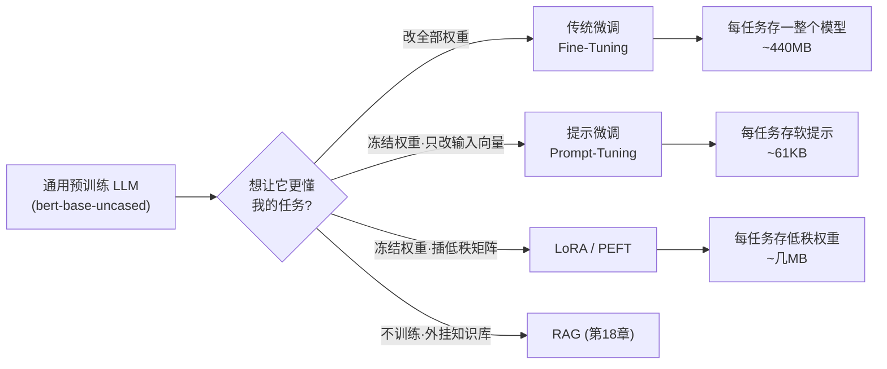
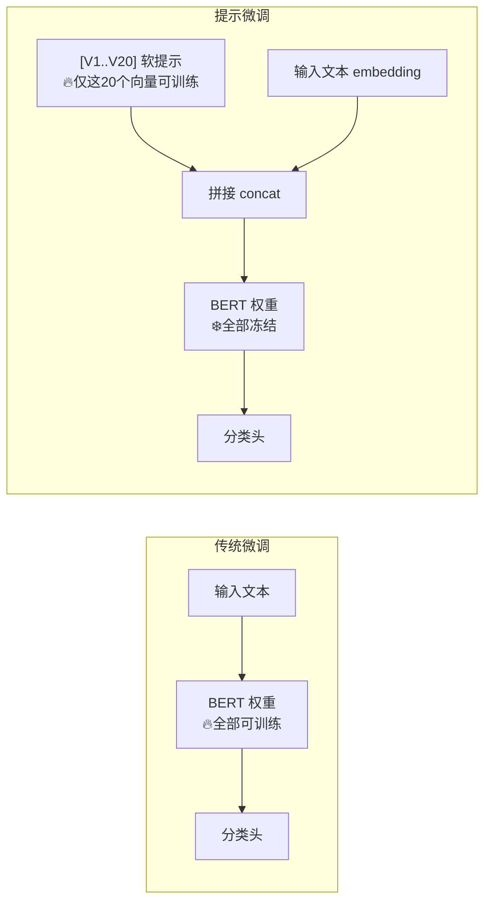

# 🎬 第 16 章 · 用自定义数据微调与提示微调 LLM（Using LLMs with Custom Data）

> 本章对应原书 *AI and ML for Coders in PyTorch*（Laurence Moroney 著）第 16 章 "Using LLMs with Custom Data"，PDF 第 339–360 页。

## 🗺️ 本章地图（读完能会什么）

- 承接 [[15_Transformer架构与transformers库]]：上一章你学会了**用**别人训练好的 Transformer，这一章学会**改造**它——让通用大模型对你的领域、你的任务变强。
- 走通**传统微调（fine-tuning）**的完整十步流水线：用 Hugging Face `datasets` + `Trainer` 把 `bert-base-uncased` 在 IMDb 影评上微调成一个 94% 准确率的情感分类器。
- 走通**提示微调（prompt-tuning，PEFT 的 soft prompt 方法）**：冻结整个 BERT，只训练 20 个「软提示」向量，用手写训练循环把模型「编程」成分类器，最后只存下一个 61 KB 的 `.pt` 文件。
- 建立一张**微调 vs 提示微调 vs LoRA** 的决策表：什么时候花大钱改权重，什么时候只改一小撮参数。
- 打通到 LLM 主线：这两条路正是今天 SFT（指令微调）、LoRA/QLoRA、Prompt/Prefix Tuning 的雏形——你在本章手搓的东西，就是 `peft` 库背后的核心机制。

> 💡 **一句话本质**：微调是「换掉一部分脑子」（改权重），提示微调是「不换脑子、只在输入前塞一段学出来的暗号」（改输入）——前者强但贵、每个任务存一整个模型；后者轻但弱一点、每个任务只存几十 KB 向量，可热插拔。

---

## 🧭 为什么需要「自定义数据」这一步

大模型在海量文本上预训练，通用能力极强，但**对你的具体任务/领域不一定最优**。原书开篇点题：

> "Large Transformer-based models, which are trained on vast amounts of text, are very powerful, but they aren't always ideal for specific tasks or domains."
> （基于 Transformer 的大模型在海量文本上训练，非常强大，但它们对特定任务或领域并不总是理想的。）——约 PDF p.339

解决办法有一整个谱系。本章聚焦其中最基础的两端，中间地带（LoRA/PEFT）在 [[20_用LoRA与Diffusers微调生成式图像模型]] 会再深入，检索增强（RAG）留给 [[18_RAG检索增强生成入门]]：



本章我们把两条最有教学价值的路走完整：**先做传统微调（改权重），再做提示微调（不改权重）**，并且刻意用**同一个数据集 IMDb、同一个 base 模型 BERT** 做直接对比。

---

## 🛠️ 传统微调：把 BERT 调成 IMDb 情感分类器

原书用一句话定下目标：

> "We'll take the IMDb database and fine-tune the model on it to be better at detecting sentiment in movie reviews."
> （我们将拿 IMDb 数据库微调模型，让它更擅长识别影评中的情感。）——约 PDF p.339

整个流程原书拆成编号 1–11 的十一步。我们逐步过，重点讲**每一步在干嘛、张量长什么样**。

### 第 1 步：Setup —— 三个新依赖 + 五个新类

除了 `torch`，本章引入三个新库：

| 库 | 作用 |
|---|---|
| `datasets` | 加载 IMDb 数据集和内置 train/test 划分（第 4 章 [[04_用PyTorch管理数据：Dataset与DataLoader]] 讲过 Dataset 概念，这里是 HF 的托管版） |
| `evaluate` | 提供标准化的评测指标（accuracy / f1 / BLEU…） |
| `transformers` | 第 14、15 章用过，让 LLM 好用的核心库 |

`transformers` 里本章用到的五个明星类，先记住它们各管一摊：

| 类 | 职责 |
|---|---|
| `AutoModelForSequenceClassification` | 加载预训练 base 模型，**并在顶上加一个分类头（classification head）**；给它 checkpoint 名就自动配好架构 |
| `AutoTokenizer` | 自动初始化对应的分词器：文本→token，加特殊 token、padding、truncation |
| `TrainingArguments` | 一个「超参数遥控器」：学习率、weight decay、batch size、设备…全在这配 |
| `Trainer` | 替你管**整个训练循环**：批处理、优化、loss、反向传播 |
| `DataCollatorWithPadding` | 把长度不一的样本高效打成 batch，补 padding、造 attention mask、转张量 |

```python
# 1. Setup and Dependencies
import torch
from datasets import load_dataset
from transformers import (
    AutoModelForSequenceClassification,  # 带分类头的自动模型
    AutoTokenizer,                        # 自动分词器
    TrainingArguments,                    # 训练超参数
    Trainer,                              # 训练循环封装
    DataCollatorWithPadding               # 动态padding整理器
)
import evaluate
import numpy as np
```

> 💡 **实战/面试高频**：`AutoModelForSequenceClassification` 和 `AutoModel` 的区别？前者在 base 模型（BERT encoder）顶上**新加一个随机初始化的线性分类头**（`[CLS]` 向量 → `num_labels` 维 logits），微调时这个头从零学起，base 权重也一起被小步更新。这就是「用通用模型做特定分类」的标准姿势。

### 第 2 步：加载并检查数据

```python
# 2. Load and Examine Data
dataset = load_dataset("imdb")  # 影评情感分析数据集
print(f"Train size: {len(dataset['train'])}")  # 25000
print(f"Test size: {len(dataset['test'])}")    # 25000
```

IMDb 数据集：25000 条训练 + 25000 条测试，每条有两列——`text`（影评文本）、`label`（0=负面 / 1=正面）。这是 NLP 情感分类的「MNIST」，见本章末尾社区引用。

### 第 3 步：初始化模型与 tokenizer

```python
# 3. Initialize Model and Tokenizer
model_name = "bert-base-uncased"
tokenizer = AutoTokenizer.from_pretrained(model_name)
model = AutoModelForSequenceClassification.from_pretrained(
    model_name,
    num_labels=2          # ← 关键：告诉它分两类，据此建 2 维分类头
)
device = torch.device("cuda" if torch.cuda.is_available() else "cpu")
model = model.to(device)  # 把权重搬到 GPU
```

`num_labels=2` 是全场关键：它定义了新分类头的输出维度（正/负）。原书特别提醒算力问题：

> "Training with this model is computationally intensive, and if you're using Colab, you'll likely need a high-RAM GPU like an A100 ... but it can take many hours on a CPU!"
> （训练很吃算力，用 Colab 的话你大概需要 A100 这种高显存 GPU……在纯 CPU 上可能要好几个小时！）——约 PDF p.340

### 第 4 步：预处理——分词 + 改列名

```python
# 4. Preprocess Data
def preprocess_function(examples):
    result = tokenizer(
        examples["text"],
        truncation=True,      # 超长截断
        max_length=512,       # BERT 最大序列长度
        padding=True
    )
    # Trainer 约定标签列必须叫 "labels"（复数），从原来的 "label" 拷过来
    result["labels"] = examples["label"]
    return result

tokenized_dataset = dataset.map(
    preprocess_function,
    batched=True,
    remove_columns=dataset["train"].column_names  # 删掉 text/label 原列
)
```

两个坑点原书讲得很清楚：**（1）** 训练不需要原始 `text` 列；**（2）** `Trainer` 期望标签列叫 `labels`（复数），而原数据叫 `label`（单数）。所以我们 `remove_columns` 把原列全删，只留 `input_ids`、`attention_mask` 和新造的 `labels`。

> ⚠️ **踩坑**：忘了把 `label` 改成 `labels`，`Trainer` 会算不出 loss（模型 `forward` 的关键字参数就是 `labels`），报「没有 loss」或直接不更新。这是新手用 `Trainer` 最常见的一个哑巴 bug。

### 第 5 步：数据整理器（Collator）

```python
# 5. Create Data Collator
data_collator = DataCollatorWithPadding(tokenizer=tokenizer)
```

它把多个不等长样本 → 补 padding → 转张量 → 造 attention mask。本章我们在 tokenizer 里已经 `padding=True` 固定成 512，其实用不太上动态 padding，但**留着它是好习惯**：以后想改动态 padding（按 batch 内最长补，更省算力）不用动别的代码。

### 第 6 步：定义评测指标

```python
# 6. Define Metrics
metric = evaluate.load("accuracy")

def compute_metrics(eval_pred):
    predictions, labels = eval_pred
    predictions = np.argmax(predictions, axis=1)  # logits → 类别 id
    return metric.compute(predictions=predictions, references=labels)
```

`evaluate` 库把「自己手写指标」的活标准化了：喂进预测集和标签集，它算出来。它内置 f1、BLEU 等一大堆。`np.argmax(predictions, axis=1)` 把每行两个 logit 取较大者的下标（0 或 1）作为预测类别。

### 第 7 步：配置训练——TrainingArguments

```python
# 7. Configure Training
training_args = TrainingArguments(
    output_dir="./results",
    learning_rate=2e-5,               # 微调用小学习率，别把预训练知识冲垮
    per_device_train_batch_size=32,
    per_device_eval_batch_size=8,
    num_train_epochs=3,
    weight_decay=0.01,
    logging_dir='./logs',
    logging_steps=500,
    evaluation_strategy="epoch",      # 每个 epoch 末评估一次
    save_strategy="epoch",            # 每个 epoch 末存一次
    load_best_model_at_end=True,      # 训完加载最优 checkpoint 而非最后一个
    metric_for_best_model="accuracy", # 用哪个指标判「最优」
    push_to_hub=False,
    gradient_accumulation_steps=4,    # 梯度累积:等效 batch=32*4=128
    gradient_checkpointing=True,      # 省显存:用时间换空间
    report_to="none",                 # 关掉 W&B 上报
    fp16=True                         # 半精度训练,更快更省显存
)
```

几个值得单拎出来讲的参数：

| 参数 | 为什么这么设 |
|---|---|
| `learning_rate=2e-5` | 微调的经典量级（BERT 论文推荐 2e-5~5e-5）。太大 → 灾难性遗忘，把预训练学到的语言知识冲垮 |
| `load_best_model_at_end=True` | 长训练时救命：不用最后一步，而是回头加载**验证指标最好**的那个 checkpoint |
| `gradient_accumulation_steps=4` | 显存不够放大 batch 时，累积 4 个小 batch 的梯度再更新一次，等效 batch=128 |
| `gradient_checkpointing=True` | 前向不缓存全部激活，反向时重算，**用算力换显存** |
| `fp16=True` | 混合精度，A100/T4 上能显著提速省显存 |
| `report_to="none"` | 默认会用 Weights & Biases 上报，需要 API key；设 none 关掉 |

> 💡 **实战/面试高频**：`gradient_accumulation_steps` 和真加大 batch 有什么区别？数学上等效（同样的梯度平均），但**显存占用只按小 batch 算**——这是穷人训大模型的标配技巧，在 LoRA/QLoRA 里也天天用。

### 第 8 步：初始化 Trainer

```python
# 8. Initialize Trainer
trainer = Trainer(
    model=model,
    args=training_args,
    train_dataset=tokenized_dataset["train"],
    eval_dataset=tokenized_dataset["test"],
    tokenizer=tokenizer,
    data_collator=data_collator,
    compute_metrics=compute_metrics,
)
```

前面所有步骤（模型、参数、数据、collator、指标）**在这里汇总**。`Trainer` 就是把「第 12 章 [[12_推理的概念：Tensor进与出]] / 第 1 章 [[01_PyTorch入门：从传统编程到学习]] 里你手写的 `optimizer.zero_grad()→loss.backward()→optimizer.step()` 循环」整个封装掉了。

### 第 9 步：训练 + 评估

```python
# 9. Train and Evaluate
train_results = trainer.train()
print(f"\nTraining results: {train_results}")

eval_results = trainer.evaluate()
print(f"\nEvaluation results: {eval_results}")
```

原书作者在 T4 High-RAM GPU 上约 50 分钟、A100 上约 12 分钟训完 3 个 epoch，结果：

```
Training results: TrainOutput(global_step=585, training_loss=0.186, ...)
Evaluation results: {'eval_loss': 0.185, 'eval_accuracy': 0.93596, ...}
```

**约 94% 准确率、3 个 epoch**——原书评价「moving in the right direction」，但也提醒可能有过拟合，需要独立评估集验证。

### 第 10–11 步：保存与测试

```python
# 10. Save Model
trainer.save_model("./final_model")   # 存完整模型（权重+config+tokenizer）

# 11. Example Usage —— 手写推理函数
def predict_sentiment(text):
    inputs = tokenizer(text, truncation=True, padding=True, return_tensors="pt")
    inputs = {k: v.to(device) for k, v in inputs.items()}  # 搬到同一设备

    with torch.no_grad():                                   # 推理不需要梯度
        outputs = model(**inputs)
        predictions = torch.nn.functional.softmax(outputs.logits, dim=-1)

    positive_prob = predictions[0][1].item()  # neuron 1 = 正面概率
    return {
        'sentiment': 'positive' if positive_prob > 0.5 else 'negative',
        'confidence': positive_prob if positive_prob > 0.5 else 1 - positive_prob
    }

# 测试
test_text = "This movie was absolutely fantastic! The acting was superb."
result = predict_sentiment(test_text)
# → Sentiment: positive, Confidence: 99.16%
```

`predictions` 是 `(1, 2)` 的张量：`[0][0]` 是负面概率、`[0][1]` 是正面概率，两者和为 1（softmax）。这句「绝妙的电影、演技超群」被判正面、置信度 99.16%——微调成功。

原书结尾很诚实地补了一刀：

> "In many circumstances, this may be overkill (and training your own model instead of fine-tuning an LLM may be quicker and cheaper) ... Sometimes, even untuned LLMs will work well for classification!"
> （很多情况下这可能是杀鸡用牛刀——自己从头训个小模型反而更快更省；有时候甚至不微调的 LLM 直接分类就够好了！）——约 PDF p.343

---

## 🪶 提示微调：冻结 BERT，只学 20 个「软提示」向量

### 直觉：把指令变成可学习的连续向量

传统微调改的是**权重**；提示微调（prompt-tuning）一个字节的权重都不碰，改的是**输入**。原书定义：

> "With prompt tuning, you do this by prepending trainable soft prompts to each input instead of modifying the model weights. These soft prompts will then be optimized during training."
> （提示微调的做法是：在每个输入前面拼上可训练的软提示，而不是改模型权重。这些软提示会在训练中被优化。）——约 PDF p.343

关键在**「软」**这个字。你平时写的 prompt 是**离散文本**（"Classify the sentiment"），每个词必须是词表里真实存在的 token。而软提示是**连续向量**，直接活在模型的 embedding 空间里，不对应任何真实单词：

> "when processing 'This movie was great,' the model would see '[V1][V2]…[V20]This movie was great.' ... [V1][V2]...[V20] are vectors that will help steer the model toward the desired classification."
> （处理「This movie was great」时，模型看到的是「[V1][V2]…[V20]This movie was great」，这些 [V] 是引导模型做出目标分类的向量。）——约 PDF p.343



**为什么值得**？效率。原书点破：不用为每个任务存一整个改过的模型，你**只需存软提示向量**——又小又可热插拔。而且：

> "Prompt tuning like this can actually match or exceed the performance of full fine-tuning, particularly with larger models, and it's significantly more efficient."
> （这种提示微调实际上能匹配甚至超过全量微调的效果，尤其是在大模型上，而且效率高得多。）——约 PDF p.343

这句话的出处正是 Lester et al. 2021（见社区案例），核心发现是「模型越大，软提示越能追平全量微调」。

### 数据准备：给软提示腾出位置

因为要在前面塞 20 个虚拟 token，真实文本的可用长度就得从 512 缩到 492：

```python
dataset = load_dataset("imdb")
tokenizer = AutoTokenizer.from_pretrained("bert-base-uncased")
max_length = 512
num_virtual_tokens = 20

def tokenize_function(examples):
    return tokenizer(
        examples["text"],
        padding="max_length",
        truncation=True,
        max_length=max_length - num_virtual_tokens   # 512-20=492，给软提示留位
    )

# 只用 5000 条（原本 25000），拿速度换一点精度
train_size = 5000
np.random.seed(42)
train_indices = np.random.choice(len(dataset["train"]), train_size, replace=False)
test_indices  = np.random.choice(len(dataset["test"]),  train_size, replace=False)

tokenized_train = dataset["train"].map(tokenize_function, batched=True)
tokenized_test  = dataset["test"].map(tokenize_function, batched=True)
```

### 造 DataLoader

```python
tokenized_train = tokenized_train.select(train_indices)   # 按随机索引取子集
tokenized_test  = tokenized_test.select(test_indices)

# 只保留训练需要的三列，并转成 torch 张量
tokenized_train.set_format(type="torch", columns=["input_ids", "attention_mask", "label"])
tokenized_test.set_format(type="torch",  columns=["input_ids", "attention_mask", "label"])

train_dataloader = DataLoader(tokenized_train, batch_size=64,  shuffle=True)
eval_dataloader  = DataLoader(tokenized_test,  batch_size=128)
```

这里回到了第 4 章 [[04_用PyTorch管理数据：Dataset与DataLoader]] 的手动 `DataLoader` 姿势——**因为 `Trainer` 不认识我们的自定义模型，这次得手写训练循环**。`input_ids` 是分词后的 id、`attention_mask` 标记哪些 token 有意义（过滤 padding）、`label` 是标签。

### 手写 PromptTuningBERT 模型

原书直言 `transformers` 没有现成的 prompt-tuning 类（当年），所以自己写一个 `nn.Module`：

```python
class PromptTuningBERT(nn.Module):
    def __init__(self, model_name="bert-base-uncased",
                       num_virtual_tokens=50, max_length=512):
        super().__init__()
        # 1) 加载带分类头的 BERT
        self.bert = AutoModelForSequenceClassification.from_pretrained(
                        model_name, num_labels=2)
        # 2) 冻结整个 BERT —— 这是提示微调的灵魂
        self.bert.requires_grad_(False)

        self.n_tokens = num_virtual_tokens
        self.max_length = max_length - num_virtual_tokens

        # 3) 用词表里随机 token 的 embedding 初始化软提示
        vocab_size = self.bert.config.vocab_size
        token_ids = torch.randint(0, vocab_size, (num_virtual_tokens,))
        word_embeddings = self.bert.bert.embeddings.word_embeddings
        prompt_embeddings = word_embeddings(token_ids).unsqueeze(0)  # (1, n, 768)
        # 4) 注册成 nn.Parameter —— 唯一会被优化器更新的东西
        self.prompt_embeddings = nn.Parameter(prompt_embeddings)
```

四步逐句拆：

1. `self.bert = AutoModelForSequenceClassification...`：和微调一样加载带 2 类分类头的 BERT。
2. `self.bert.requires_grad_(False)`：**一键冻结全部 BERT 权重**，反向传播不会碰它们。
3. `token_ids = torch.randint(...)`：随机抽 20 个词表 id，用它们的**真实 embedding** 当软提示的初值（原书说这里可以更聪明地初始化，为简单起见用随机）。`.unsqueeze(0)` 把形状变成 `(1, 20, 768)`——第 0 维预留给 batch。
4. `self.prompt_embeddings = nn.Parameter(...)`：**注册为参数**。因为 BERT 被冻结了，这 `20×768=15360` 个数就是**整个模型里唯一可训练的参数**。

> 💡 **实战/面试高频**：为什么软提示只有 `20×768` 个参数就能干活？因为 BERT 的 12 层 self-attention 都会「看到」这 20 个前缀向量，梯度会经由注意力一路回传到软提示上。相当于用极少参数去「拨动」一个庞大冻结网络的行为——这正是 PEFT（Parameter-Efficient Fine-Tuning）的核心思想。

### forward：拼接软提示 + 延长 attention mask

```python
def forward(self, input_ids, attention_mask, labels=None):
    batch_size = input_ids.shape[0]
    input_ids = input_ids[:, :self.max_length]           # 截到 492
    attention_mask = attention_mask[:, :self.max_length]

    # 1) 真实文本 → embedding: (batch, 492, 768)
    embeddings = self.bert.bert.embeddings.word_embeddings(input_ids)
    # 2) 软提示扩展到 batch: (1,20,768) → (batch,20,768)
    prompt_embeddings = self.prompt_embeddings.expand(batch_size, -1, -1)
    # 3) 前缀拼接: (batch, 20+492, 768)
    inputs_embeds = torch.cat([prompt_embeddings, embeddings], dim=1)

    # 4) 软提示的 attention mask 全设 1（让 BERT 关注全部软提示）
    prompt_attention_mask = torch.ones(batch_size, self.n_tokens,
                                       device=attention_mask.device)
    attention_mask = torch.cat([prompt_attention_mask, attention_mask], dim=1)

    # 5) 用 inputs_embeds（而非 input_ids）喂给 BERT
    return self.bert(
        inputs_embeds=inputs_embeds,
        attention_mask=attention_mask,
        labels=labels,
        return_dict=True
    )
```

这段是全章技术含量最高的地方，下一节「关键代码拆解」会逐张量讲形状。核心一句：**平时喂 `input_ids`（整数），这里改喂 `inputs_embeds`（浮点向量）**，因为软提示不是真实 token、没有 id，只能以向量身份混进 embedding 序列。

### 训练循环：只优化软提示

```python
optimizer = AdamW(model.parameters(), lr=1e-2)   # 只有软提示可训练
num_epochs = 3

for epoch in range(num_epochs):
    model.train()
    total_train_loss = 0
    for batch in tqdm(train_dataloader, desc=f'Training Epoch {epoch+1}'):
        batch = {k: v.to(device) for k, v in batch.items()}  # 数据搬到 GPU
        labels = batch.pop('label')                          # 标签单独拿出
        outputs = model(**batch, labels=labels)              # 前向

        loss = outputs.loss
        total_train_loss += loss.item()
        loss.backward()                                      # 反向

        clip_grad_norm_(model.parameters(), max_grad_norm)   # 梯度裁剪
        optimizer.step()
        optimizer.zero_grad()
```

关键点：

- `AdamW(model.parameters(), lr=1e-2)`：写法和普通训练一模一样，但因为只有软提示 `requires_grad=True`，**优化器实际只动这 20 个向量**——所以极快。
- **学习率 1e-2 出奇地大**（微调是 2e-5）。原书解释：可训练参数少、要快速收敛，所以给大学习率；真实系统里可能想小一点或做退火。
- `labels = batch.pop('label')`：模型 `forward` 期望 `labels` 单独传入，不能混在 batch 字典里。
- `clip_grad_norm_`：梯度裁剪防「梯度爆炸」——梯度太大时把它整体缩小，避免优化器迈出摧毁性的一大步。

> ⚠️ **踩坑**：注意 `batch.pop('label')` 用的是**单数 `label`**（因为我们 `set_format` 时保留的列叫 `label`），而传给模型 `forward` 时参数名是 `labels`。这里和传统微调「必须叫 labels」的约定容易混——手写循环里键名由你掌控，只要 `forward` 签名对得上即可。

### 训练结果：87% 准确率、每 epoch 约 1 分钟

```
Epoch 1: train_loss 0.6559 | val_loss 0.6037 | val_acc 0.8036
Epoch 2: train_loss 0.6112 | val_loss 0.5854 | val_acc 0.8386
Epoch 3: train_loss 0.5799 | val_loss 0.5270 | val_acc 0.8736
```

对比传统微调的 94%，提示微调 3 epoch 只到 87%——但**只训了 5000 条、只动了 20 个向量、每 epoch 才 1 分钟**。原书提供了训 30 epoch 的软提示下载版本，效果更好。

### 保存：一个 61 KB 的文件

```python
torch.save(model.prompt_embeddings, "imdb_prompt_embeddings.pt")
```

原书的赞叹很到位：

> "this file is relatively small (61 K), and it doesn't require you to amend the underlying model in any way. Thus, in an application, you could potentially have a number of these prompt-tuning files and hot-swap ... which is the basis for an agentic solution."
> （这个文件很小（61 K），完全不改底层模型。所以在应用里你可以准备一堆这样的提示微调文件，按需热插拔——这正是 agent 方案的基础。）——约 PDF p.352

这就是提示微调的杀手锏：**一个冻结的 base 模型 + N 个几十 KB 的软提示 = N 个专用「人格」，随时切换。**

### 推理：加载软提示，不训练

推理类 `PromptTunedBERTInference` 结构类似训练类，但两处关键不同：`self.model.eval()`（推理模式）和 `torch.load(prompt_path)`（直接读软提示而非训练）：

```python
class PromptTunedBERTInference:
    def __init__(self, model_name="bert-base-uncased",
                       prompt_path="imdb_prompt_embeddings.pt"):
        self.tokenizer = AutoTokenizer.from_pretrained(model_name)
        self.model = AutoModelForSequenceClassification.from_pretrained(
                        model_name, num_labels=2)
        self.model.eval()                                    # 推理模式
        self.prompt_embeddings = torch.load(prompt_path)     # 加载软提示
        self.device = torch.device('cuda' if torch.cuda.is_available() else 'cpu')
        self.model.to(self.device)

    def predict(self, text):
        inputs = self.tokenizer(text, padding=True, truncation=True,
                    max_length=512 - self.prompt_embeddings.shape[1],
                    return_tensors="pt")
        inputs = {k: v.to(self.device) for k, v in inputs.items()}
        with torch.no_grad():
            embeddings = self.model.bert.embeddings.word_embeddings(inputs['input_ids'])
            batch_size = embeddings.shape[0]
            prompt_embeds = self.prompt_embeddings.expand(batch_size, -1, -1).to(self.device)
            inputs_embeds = torch.cat([prompt_embeds, embeddings], dim=1)

            attention_mask = inputs['attention_mask']
            prompt_attention = torch.ones(batch_size, self.prompt_embeddings.shape[1],
                                          device=self.device)
            attention_mask = torch.cat([prompt_attention, attention_mask], dim=1)

            outputs = self.model(inputs_embeds=inputs_embeds, attention_mask=attention_mask)
        probs = torch.nn.functional.softmax(outputs.logits, dim=-1)
        return {"prediction": outputs.logits.argmax(-1).item(),
                "confidence": probs.max(-1).values.item()}
```

原书末尾诚实提醒：提示微调可能出现**低置信度导致误判**，二分类尤甚。改进手段：调 softmax 温度、加更多软提示 token 给模型更大容量、**用情感相关词（而非随机 token）初始化软提示**。

---

## 🔬 关键代码拆解：forward 里的张量形状之舞

提示微调 `forward` 是本章的心脏。设 batch=64、嵌入维 768（BERT-base）、软提示 20 个、文本截到 492，逐行盯张量：

```python
def forward(self, input_ids, attention_mask, labels=None):
    batch_size = input_ids.shape[0]              # 64
    input_ids = input_ids[:, :self.max_length]   # (64, 492)
    attention_mask = attention_mask[:, :self.max_length]  # (64, 492)

    embeddings = self.bert.bert.embeddings.word_embeddings(input_ids)
    #   input_ids (64,492) → 查 embedding 表 → embeddings (64, 492, 768)

    prompt_embeddings = self.prompt_embeddings.expand(batch_size, -1, -1)
    #   (1, 20, 768) → expand → (64, 20, 768)
    #   expand 不复制内存，只是「广播视图」，把同一份软提示铺给整个 batch

    inputs_embeds = torch.cat([prompt_embeddings, embeddings], dim=1)
    #   沿序列维(dim=1)拼: (64,20,768) + (64,492,768) → (64, 512, 768)
    #   软提示在前、真实文本在后，正好凑满 BERT 的 512 长度

    prompt_attention_mask = torch.ones(batch_size, self.n_tokens, ...)  # (64, 20) 全1
    attention_mask = torch.cat([prompt_attention_mask, attention_mask], dim=1)
    #   (64,20) + (64,492) → (64, 512)，让 BERT 对 20 个软提示全部关注

    return self.bert(inputs_embeds=inputs_embeds, attention_mask=attention_mask,
                     labels=labels, return_dict=True)
```

| 张量 | 形状 | 含义 |
|---|---|---|
| `input_ids` | (64, 492) | 每条影评的 token id 序列（截断后） |
| `embeddings` | (64, 492, 768) | 文本 token 查表后的词向量 |
| `self.prompt_embeddings` | (1, 20, 768) | 可训练软提示（全模型唯一梯度来源） |
| `prompt_embeddings`（expand后） | (64, 20, 768) | 广播到每条样本 |
| `inputs_embeds` | (64, **512**, 768) | 软提示 + 文本拼成完整输入 |
| `attention_mask` | (64, 512) | 前 20 位软提示全 1，后 492 位按真实 padding |

**核心洞见**：BERT 从头到尾以为自己在处理一段 512 长的普通序列，根本不知道前 20 个「token」是学出来的假货。梯度经过 12 层注意力一路回传，只落在 `self.prompt_embeddings` 上——20×768 个数被反复微调，直到这段「暗号」能把冻结的 BERT 引导成情感分类器。

---

## 🌍 社区案例与延伸

1. **BERT 原论文**——本章 base 模型的来源：Devlin et al., "BERT: Pre-training of Deep Bidirectional Transformers for Language Understanding"，arXiv:1810.04805。BERT 的 `[CLS]` 向量做句子级分类、`AutoModelForSequenceClassification` 的分类头就架在它上面。

2. **IMDb 数据集原始出处**：Maas et al., "Learning Word Vectors for Sentiment Analysis"，ACL 2011（https://aclanthology.org/P11-1015/ ）。5 万条平衡的影评正负样本，是情感分类的标准基准。

3. **Prompt Tuning 论文**——本章「软提示」方法的理论根基：Lester, Al-Rfou & Constant, "The Power of Scale for Parameter-Efficient Prompt Tuning"，arXiv:2104.08691。核心结论：**模型越大，只训软提示就越能追平全量微调**——原书那句「can match or exceed full fine-tuning」正来自此。

4. **Prefix-Tuning**（软提示的近亲，作用于每一层）：Li & Liang, "Prefix-Tuning: Optimizing Continuous Prompts for Generation"，arXiv:2101.00190。区别：Prompt-Tuning 只在输入层加前缀，Prefix-Tuning 在**每一层**的 K/V 前都加。

5. **LoRA**——今天最主流的 PEFT 方法，本章对比表的第三极：Hu et al., "LoRA: Low-Rank Adaptation of Large Language Models"，arXiv:2106.09685。见 [[20_用LoRA与Diffusers微调生成式图像模型]] 深入。

6. **Hugging Face `peft` 库**——把本章手搓的东西工业化：https://github.com/huggingface/peft 。一行 `get_peft_model(model, PromptTuningConfig(...))` 就替你造好软提示、冻结 base、管理 adapter，还统一支持 LoRA / Prefix / P-Tuning / IA³。

---

## 🔗 通向 LLM

本章两条路，正是现代 LLM 定制的两大主干，一定要建立起对应：

- **传统微调 → 指令微调（SFT, Supervised Fine-Tuning）**：ChatGPT/Llama/Qwen 的第一步对齐就是全量或部分微调——把 base LLM 在「指令-回答」对上继续训练。本章的 `Trainer` 十步流水线，换成 `AutoModelForCausalLM` + 对话数据集，就是一套最小 SFT。RLHF 的奖励模型（reward model）本质就是本章「BERT + 分类头」的放大版：给回答打分。
- **分类头 → 回归/奖励头**：`AutoModelForSequenceClassification` 的 `num_labels=2` 换成 `num_labels=1`，就是 RLHF 里的奖励模型输出标量分数。
- **提示微调 → Prompt/Prefix/P-Tuning 家族**：本章手搓的 soft prompt 就是 `peft` 里 `PromptTuningConfig` 的原型。在 10B+ 大模型上，只训几万个软提示参数即可让模型专精某任务，一个 base + 一堆几十 KB 软提示 = 多任务热插拔。
- **PEFT 的经济学 → LoRA/QLoRA 统治今天的开源微调**：全量微调一个 7B 模型要几十 GB 显存、存 14GB 权重；LoRA 只训低秩增量、存几 MB。本章「冻结 base + 只训小参数 + 只存小文件」的逻辑，正是 QLoRA 能在单张 24GB 消费卡上微调 65B 模型的思想内核。
- **软提示热插拔 → Agentic / 多技能编排**：原书亲口说软提示是「the basis for an agentic solution」——一个冻结底座上挂多个专家软提示，按需切换，正是轻量多智能体的雏形。这条线接到 [[17_用Ollama部署与服务LLM]] 的服务化和 [[21_从本书基础到LLM落地实战（合流篇）]]。

---

## ⚠️ 常见坑

1. **标签列没改名**：`Trainer` 硬性要求标签列叫 `labels`（复数）。原数据是 `label`（单数），忘了 `result["labels"] = examples["label"]` 就没有 loss、模型不更新。
2. **`evaluation_strategy` / `save_strategy` 不一致**：想用 `load_best_model_at_end=True`，两个 strategy 必须相同（都 `epoch` 或都 `steps`），否则 `Trainer` 直接报错。
3. **提示微调忘了 `requires_grad_(False)`**：若没冻结 BERT，优化器会连同 base 一起更新，那就退化成（而且是很糟的）全量微调，软提示的意义全失。
4. **`input_ids` vs `inputs_embeds` 混用**：提示微调必须喂 `inputs_embeds`（因为软提示无 id）。同时传 `input_ids` 和 `inputs_embeds` 会冲突报错——二选一。
5. **序列长度没给软提示留位**：BERT 上限 512，塞 20 个软提示后真实文本必须截到 492（`max_length - num_virtual_tokens`），否则拼接后超 512、position embedding 越界报错。
6. **提示微调的低置信度误判**：二分类软提示常给出接近 0.5 的置信度导致翻车。缓解：加软提示 token 数、调 softmax 温度、用情感词而非随机 token 初始化。

---

## 🎯 面试速答

1. **微调和提示微调的本质区别？** 微调改模型权重（每任务存整个模型）；提示微调冻结权重、只训练拼在输入前的连续向量（每任务只存几十 KB），可热插拔。
2. **为什么提示微调的学习率能到 1e-2，微调却只有 2e-5？** 微调改动预训练权重，学习率太大会灾难性遗忘；提示微调可训练参数极少且不碰 base，用大学习率快速收敛。
3. **软提示为什么必须走 `inputs_embeds` 而不是 `input_ids`？** 软提示是连续向量、不对应任何真实词表 token，没有整数 id，只能以嵌入向量身份混进序列。
4. **`gradient_accumulation_steps` 解决什么问题？** 显存装不下大 batch 时，累积多个小 batch 的梯度再更新一次，数学上等效大 batch，但显存只按小 batch 算。
5. **提示微调、Prefix-Tuning、LoRA 三者关系？** 都是 PEFT：Prompt-Tuning 在输入层加软前缀；Prefix-Tuning 在每层 K/V 前加前缀；LoRA 给权重矩阵加低秩增量。base 全冻结，只训一小撮参数。

---

## 📌 本章小结

1. **传统微调十步法**：setup → 加载数据 → 初始化模型/tokenizer → 预处理（改 `labels`）→ collator → 定义 metrics → `TrainingArguments` → `Trainer` → `train()/evaluate()` → 保存/测试。BERT 在 IMDb 上 3 epoch 达约 94%。
2. **提示微调（soft prompt）**：冻结整个 BERT，只把 20 个可训练向量拼在输入前，手写训练循环只优化这些向量，3 epoch 约 87%，产物仅 61 KB。
3. **核心张量魔法**：`prompt_embeddings (1,20,768) → expand → (batch,20,768) → cat 文本 embedding → (batch,512,768)`，喂 `inputs_embeds` 而非 `input_ids`，attention mask 前缀补 1。
4. **微调 vs 提示微调 vs LoRA** 是一条效率光谱：改权重（贵、强、大文件）→ 只改输入向量（轻、稍弱、KB 级）→ 加低秩增量（折中，MB 级、今天主流）。
5. 这两条路直通现代 LLM 的 SFT、PEFT/LoRA/QLoRA、Prompt-Tuning 与 agent 化多技能编排——本章你手搓的，就是 `peft` 库的核心机制。

---

## 🔗 延伸阅读 & 交叉链接

**兄弟章节**
- [[15_Transformer架构与transformers库]] —— 本章的直接前置：先会用 Transformer，才能改造它。
- [[14_使用第三方模型与模型中心Hub]] —— `from_pretrained` / Hub / checkpoint 的来龙去脉。
- [[04_用PyTorch管理数据：Dataset与DataLoader]] —— 提示微调手写循环用到的 `DataLoader` 基本功。
- [[12_推理的概念：Tensor进与出]] —— `predict` 函数里 tensor 进出、`torch.no_grad()` 的原理。
- [[20_用LoRA与Diffusers微调生成式图像模型]] —— PEFT 家族的第三极 LoRA 深入实战。
- [[18_RAG检索增强生成入门]] —— 不改权重、外挂知识的另一条定制路线。
- [[17_用Ollama部署与服务LLM]] —— 微调好的模型如何服务化。
- [[21_从本书基础到LLM落地实战（合流篇）]] —— 全书主线的收束。

**外部真实链接**
- Prompt Tuning 论文：Lester et al. 2021, arXiv:2104.08691 —— https://arxiv.org/abs/2104.08691
- LoRA 论文：Hu et al. 2021, arXiv:2106.09685 —— https://arxiv.org/abs/2106.09685
- Hugging Face `peft` 库（工业级 PEFT 实现）—— https://github.com/huggingface/peft
- Hugging Face `Trainer` 官方文档 —— https://huggingface.co/docs/transformers/main_classes/trainer
