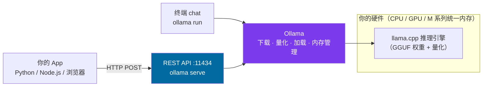
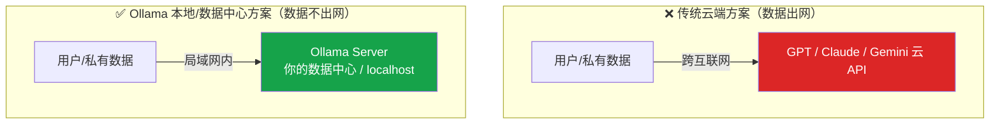
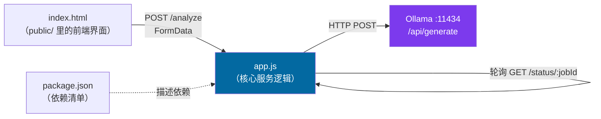

# 🎬 第 17 章 · 用Ollama部署与服务LLM（Serving LLMs with Ollama）

> 本章对应原书 *AI and ML for Coders in PyTorch*（Laurence Moroney 著）第 17 章 "Serving LLMs with Ollama"，PDF 第 361–378 页。

## 🗺️ 本章地图（读完能会什么）

- 理解 **Ollama 到底解决了什么**：它是一个「LLM 的 Docker」——一条命令下载、量化、加载、运行开源大模型，把内存管理和模型优化这些脏活全接管了。
- 会用 **命令行本地跑开源 LLM**：`ollama run gemma2:2b` 在终端里聊天，`ollama run llama3.2-vision` 拖张图进去做多模态分析。
- 会把 Ollama **变成一个 HTTP server**（`ollama serve`，默认端口 `11434`），用 `curl` POST 到 `/api/generate`，并**读懂返回 JSON 里每个字段**（`response` / `done_reason` / `prompt_eval_count` / `eval_count` / 各种 `*_duration`）。
- 会**从 0 搭一个「本地 LLM 应用」**：先写 Python 概念验证（PoC），再包成 Node.js Web App（`app.js` + `index.html`，上传小说→后台任务→轮询→出分析报告）。
- 想透**本地 LLM 的战略意义**：隐私（数据不出网）、成本（无 API 计费）、离线、以及**锁定模型版本**避免"今天能跑明天跑不通"。

> 💡 **一句话本质**：Ollama 把「下载 + 量化 + 加载 + 起一个 OpenAI 式 REST 接口」这四件麻烦事收敛成一条命令，让你在**自己的机器/数据中心**里拥有一个私有、离线、版本可控的 LLM 服务——推理这件事，从"调别人云端 API"变成了"POST 到 localhost:11434"。

---

## 🧭 为什么是 Ollama：把 transformers 又往前推了一步

第 14–16 章我们已经会用 `transformers` 的 `pipeline` 下载模型、推理、微调了。那为什么还需要 Ollama？原书开篇把话说得很直白：

> "I'd be remiss if I didn't show you the open source Ollama project, which ties it all together by giving you an environment that gives you a full wrapper around an LLM that you can either chat with in your terminal or use as a server that you can HTTP POST to and read the output from."
>
> "如果不给你介绍开源的 Ollama 项目，那是我的失职。它把一切串了起来：给你一个环境，把 LLM 完整地包装好，你既能在终端里跟它聊天，也能把它当成一个服务器，用 HTTP POST 请求它、读回输出。"（原书 p.339）

第一性原理：`transformers` 给的是**库（library）**，你还得自己写加载、自己管显存、自己搭 Web 框架。Ollama 给的是**产品（product）**——它在 `transformers` 之上又补齐了三块非功能性（nonfunctional）却极其烦人的能力：

| 能力 | 你手写 `transformers` 时 | Ollama 帮你做了 |
| --- | --- | --- |
| **下载/管理模型** | 手动 `from_pretrained`、管缓存目录 | `ollama run <model>`，像 `docker pull` 一样 |
| **量化（quantization）** | 自己配 `bitsandbytes` / GGUF | **自动量化**，让大模型塞进消费级硬件 |
| **内存管理** | 自己算显存、OOM 调参 | 自动加载/卸载、共享内存优化 |
| **标准化接口** | 自己写 Flask/FastAPI 包一层 | **内置 REST API**，`HTTP POST` 即用 |

> 原书对 Ollama 的战略定位：它"bridges the gap between cloud-based third-party services like GPT, Claude, and Gemini and locally deployed services"（p.339，在云端第三方服务和本地部署服务之间架起桥梁）。你写 App 的代码几乎不用变，只是把服务器地址从云端换成了 `localhost` 或你数据中心里的一台机器。

> 💡 **实战/面试高频**：被问"本地跑 LLM 有哪些方案？"——标准答法是 **Ollama / llama.cpp / vLLM / LM Studio**。其中 **Ollama = llama.cpp 的易用封装**（底层就是 `ggerganov/llama.cpp`，用 GGUF 权重格式），面向个人/小团队开箱即用；**vLLM** 面向生产高并发（PagedAttention）。这条谱系一定要说清。



---

## 🚀 第一部分：Ollama 入门（本地跑开源 LLM）

### 安装

Ollama 项目主页在 **ollama.com**，首页直接给 macOS / Linux / Windows 三个下载入口。

> ⚠️ **踩坑（Windows 用户注意）**：原书明确指出——"the Windows version needs Windows Subsystem for Linux (WSL)"（p.340，Windows 版需要 WSL）。作者本人用的是 macOS 版。在 M1/16GB 的 Mac 上，M 系列芯片的**统一内存（shared RAM）**让 Gemma 2B 跑得又快又顺。

装好后 Ollama 会常驻在系统菜单栏，但**你的主要交互界面是命令行**。

### 用 `ollama run` 下载并聊天

```bash
# 下载并运行 Google 的 Gemma 2（20 亿参数版本）
ollama run gemma2:2b
```

这条命令做了 `docker run` 式的事：本地没有就先拉取，然后加载进内存，最后进入交互式对话。原书的实测数字很关键：

> "In this case, I ran the gemma2:2b (2-billion parameter) version, which requires about 8 GB of GPU RAM."（p.340）
> gemma2:2b 是 20 亿参数版本，大约需要 **8 GB 显存**。作者说在两年前的老笔记本上，回复**不到一秒**就返回了。

> 💡 **实战**：模型名里的 `:2b` 是 **tag**（标签），指定参数量/量化档位，用法和 Docker 镜像 tag 一模一样。同一个模型常有 `2b / 9b / 27b` 多档，还有 `:q4_0`、`:q8_0` 等量化 tag。**内存装不下就跑不动**——原书原话"it can't perform miracles"（它变不出奇迹）。选型第一步永远是"我这台机器的内存/显存能装下哪一档"。

### 多模态：拖张图进终端

Ollama 也支持多模态模型，比如 Meta 的 Llama 3.2 Vision：

```bash
ollama run llama3.2-vision
```

原书作者演示了一个很生活化的场景：他丢进一张 2018 年晨跑时拍的**大阪城**照片，配上提示词——

> "Please give me a detailed analysis of what's in this image. Call out any major or minor features and tell me everything you know about it. Are there any interesting and fun facts? Maybe even estimate when this picture was taken."（p.342）

然后把图片拖进对话窗口。结果：Llama 认出了大阪城，虽然猜不出确切日期，但**能根据画面里的植被推断出季节**，其余信息全对。多模态那套「视觉 encoder + 语言 decoder」的重活，Ollama 全帮你藏起来了。

---

## 🌐 第二部分：把 Ollama 作为 Server（REST API）

真正的威力不在于本地聊天，而在于**把它当服务器**。原书说得很清楚："the real power in Ollama is in using it as a server that can then be the foundation of an application"（p.342）。

### 启动服务

```bash
ollama serve
```

这会在**默认端口 11434** 上起一个 HTTP 服务。在**另一个终端窗口**里，用 `curl` 打它的 `/api/generate` 端点测一下：

```bash
curl http://localhost:11434/api/generate -d '{
  "model": "gemma2:2b",
  "prompt": "Why is the sky blue?",
  "stream": false
}'
```

### `stream` 参数：时间到首字 vs 时间到末字

原书专门强调了 `stream` 这个参数，它直接决定用户体验：

| `stream` | 行为 | 体验 |
| --- | --- | --- |
| `true` | 保持 HTTP 长连接，**逐词（word by word）**推送 | **首字（first token）来得快**，像打字机，适合聊天 |
| `false` | 全部生成完再一次性返回 | 到**末字（last token）**的总时间差不多，但中途没输出，**感觉更慢** |

> "If you set it to true, you'll get an active HTTP connection that will send the answer word by word... it will make for a better user experience."（p.343）

> 💡 **面试高频**：这两个词——**time-to-first-token (TTFT)** 和 **time-to-last-token / total latency**——正是 LLM 推理服务的两大核心指标。聊天场景优化 TTFT（所以要流式），批处理场景优化吞吐。记住这组对照。

### 读懂返回 JSON：每个字段都有用

`stream: false` 时，Gemma 返回的 JSON（原文做了裁剪）长这样：

```json
{
  "model": "gemma2:2b",
  "created_at": "2024-12-09T18:10:05.711484Z",
  "response": "The sky appears blue because ... phenomena! \n",
  "done": true,
  "done_reason": "stop",
  "context": [106, 1645, 108, 4385, 603, 573, ..., 235248, 108],
  "total_duration": 7994972625,
  "load_duration": 820325334,
  "prompt_eval_count": 15,
  "prompt_eval_duration": 2599000000,
  "eval_count": 282,
  "eval_duration": 4573000000
}
```

逐字段拆解（这是本章的**知识密度最高处**）：

| 字段 | 含义 | 工程用途 |
| --- | --- | --- |
| `response` | LLM 生成的**文本**（真正要用的东西） | 塞进你的 App 展示 |
| `done` | 是否生成完毕 | 流式时先为 `false`，直到结束——**UI 据此判断"还在打字"还是"打完了"** |
| `done_reason` | 结束原因：`stop`（正常）/ `length`（撞 token 上限）/ `canceled`（用户中断）/ `error` | **错误处理关键**，尤其流式时 |
| `context` | 本轮对话的 **token id 数组** | 传回下一轮即可**保持多轮上下文**（KV/对话记忆） |
| `prompt_eval_count` | 提示词消耗的 token 数（此例 **15**） | **计费/配额统计**；对应"prefill/预填充"阶段 |
| `eval_count` | 生成消耗的 token 数（此例 **282**） | 同上；对应"decode/解码"阶段 |
| `*_duration` | 各阶段耗时，**单位是纳秒（nanoseconds）** | `load_duration` ≈ 0.82 秒（820325334 ns） |

> 💡 **通向 LLM 的关键洞见**：`prompt_eval_*` 就是 **prefill（预填充）** 阶段——一次性把整段 prompt 喂进去、并行算出所有 KV cache；`eval_*` 就是 **decode（解码）** 阶段——逐个 token 自回归生成。这两个阶段的性能特征完全不同（prefill 是计算密集、decode 是访存密集），是 vLLM / TensorRT-LLM 等推理框架优化的主战场。Ollama 把这两个数直接给你了，等于把 LLM 推理的两大阶段"可观测化"了。

### 给请求附带图片（多模态 curl）

要在 API 里传图片，**不是**上传二进制，而是把图**编码成 base64 字符串**，塞进 `images` 数组：

```bash
curl -X POST \
  -H "Content-Type: application/json" \
  -d "{\"model\":\"llama3.2-vision\",
       \"prompt\":\"What is in this image?\",
       \"images\":[\"$(cat ./osaka.jpg | base64 | tr -d '\n')\"],
       \"stream\":false}" \
       http://localhost:11434/api/generate
```

> ⚠️ **踩坑**：原书特意提醒——`$(cat ./osaka.jpg | base64 | tr -d '\n')` 这段是 **macOS 的 base64 用法**。"Different systems may produce different base64 encodings for images, and they can lead to errors on the backend."（p.344）不同系统的 base64 换行处理不同（Linux 常需 `base64 -w 0`），编码错了后端直接报错。**`tr -d '\n'` 删掉换行是必须的**，因为 JSON 字符串里不能有裸换行。

> ⚠️ **踩坑（冷启动慢）**："it starts up slowly as it loads the model into memory. It can take one to two minutes"（p.345）——首次请求要把模型从磁盘加载进内存，可能耗时 **1–2 分钟**；一旦加载并预热（warmed up）完成，后续推理就快了。这就是 `load_duration` 字段存在的意义。

---

## 🏗️ 第三部分：构建一个用 Ollama LLM 的 App

### 场景设定：为什么必须本地跑

原书用三张架构图讲清了"为什么"。核心矛盾是：**用户的私有数据不该跨互联网发给第三方**。



原书举了最经典的反例——**源代码**：ChatGPT 早期很多公司禁用它，就是怕"company IP might be sent to a competitor for analysis"（公司知识产权被发给竞争对手分析，p.345）。用 Ollama，架构一变，数据永远留在你的网络里。原书还点出第二个好处：**版本可控**。

> "Given that LLMs are not deterministic, this effectively means the prompts that work today may not work tomorrow!"（p.346）
> 由于 LLM 不是确定性的，**今天有效的提示词明天可能就失效了**——依赖云端 API 就是把命脉押在别人某个会悄悄升级的模型版本上。本地跑，你自己钉死版本。

**本章要做的 App**：一个**小说分析工具**。用户上传一本书（`.txt`），后端把它拼进 prompt 发给本地 Gemma，返回一份专业的故事分析。书稿是宝贵 IP，绝不能发给第三方——完美契合 Ollama 的价值。核心 prompt 是：

> "You are an expert storyteller who understands story structure, nuance, and content. Attached is a novel, so please evaluate this novel for storylines and suggest improvements that could be made in character development, plot, and emotional content..."（p.346）

### 3.1 Python 概念验证（PoC）

原书的方法论值得记住："I like to build a simple proof-of-concept as a Python file to see how well it works"（p.347）——**先用一个 Python 脚本验证概念可行，再谈工程化**。完整 PoC 如下（原书分片给出，这里合并并补全中文注释）：

```python
import requests
import json
from pathlib import Path

def analyze_file(filepath: str, model: str = "gemma2:2b") -> dict:
    # 1) 读入书稿文本（注意 utf-8，避免中文/特殊字符乱码）
    with open(filepath, 'r', encoding='utf-8') as file:
        file_content = file.read()

    # 2) 准备请求：Ollama 本地端点 + JSON 头
    url = "http://localhost:11434/api/generate"
    headers = {"Content-Type": "application/json"}

    # 3) 组装 payload：模型名 + prompt（把整本书 file_content 拼在提示词后面）+ 不流式
    payload = {
        "model": model,
        "prompt": (
            "You are an expert storyteller who understands story structure, "
            "nuance, and content. Attached is a novel, please evaluate this "
            "novel for storylines, and suggest improvements that could be made "
            "in character development, plot, and emotional content. Be as verbose "
            "as needed to provide an in-depth analysis that would help the author "
            f"understand how their work would be accepted: {file_content}"
        ),
        "stream": False,   # 一次性返回，PoC 阶段图简单
    }

    try:
        # 4) 同步 POST（阻塞直到拿到结果——生产环境应改异步）
        response = requests.post(url, headers=headers, json=payload)
        response.raise_for_status()          # 非 2xx 直接抛异常
        result = response.json()['response'] # 只取 LLM 生成的文本字段
        return result
    except requests.exceptions.RequestException as e:
        raise Exception(f"Error making request to Ollama: {str(e)}")
    except json.JSONDecodeError as e:
        raise Exception(f"Error parsing Ollama response: {str(e)}")


# 调用
input_path = Path("./my_novel.txt")
result = analyze_file(str(input_path))
print(result)
```

原书对这段的两个诚实说明：① 这是**完全同步（fully synchronous）**的——POST 后阻塞一切直到返回，真实 App 应做异步；② 用最小的 `gemma2:2b` 就能在几秒内消化整本书给出**惊人详细**的分析（原书贴了对一本科幻小说《太空瘟疫》的分析节选：夸它前提引人入胜、人物真实、悬念递进、世界观有潜力）。

> ⚠️ **踩坑（上下文窗口）**：原书直言"depending on your model, the context window size might not be big enough for a complete novel"（p.347）。把**整本书**塞进 `prompt` 会撞**上下文窗口上限**——Gemma 2 是 8K token，一本长篇小说可能十几万 token，直接超限（`done_reason` 会变 `length` 或干脆报错）。真实做法要么换长上下文模型，要么**分块 + RAG**（正是[[18_RAG检索增强生成入门]]要解决的问题）。

### 3.2 为 Ollama 做 Web App（Node.js）

PoC 跑通后，原书把它包成一个 **Node.js Web App**：浏览器上传 `.txt` → 后端调 Ollama → 页面显示分析。一个最简 Node 应用就三个文件：



### 3.3 `app.js`：后端核心逻辑

**启动服务器**，监听端口（默认 3000）：

```javascript
const PORT = process.env.PORT || 3000;
app.listen(PORT, () => {
  console.log(`Server running on port ${PORT}`);
});
```

**定义上传端点** `/analyze`（用 `multer` 的 `upload.single('novel')` 接单个文件）。这里的关键设计是**异步后台任务 + jobId 轮询**——因为分析一本书很慢，不能让 HTTP 请求一直挂着：

```javascript
app.post('/analyze', upload.single('novel'), async (req, res) => {
  try {
    if (!req.file) {
      return res.status(400).send('No file uploaded');   // 没传文件直接报错
    }

    // 1) 生成唯一 jobId（用时间戳），登记为 processing
    const jobId = Date.now().toString();
    analysisJobs.set(jobId, { status: 'processing' });

    // 2) 读文件内容，然后清理临时文件
    const fileContent = await fs.readFile(req.file.path, 'utf8');
    await fs.unlink(req.file.path);

    // 3) 后台跑分析（不 await！立刻把 jobId 返回给前端）
    analyzeNovel(fileContent)
      .then(result => {
        analysisJobs.set(jobId, { status: 'completed', result: result });
      })
      .catch(error => {
        analysisJobs.set(jobId, { status: 'error', error: error.message });
      });

    res.json({ jobId });   // 前端拿到 jobId 后去轮询 /status/:jobId
  } catch (err) {
    res.status(500).send(err.message);
  }
});
```

**核心 `analyzeNovel`**：几乎就是 Python PoC 的 JS 翻版——组请求体、`fetch` 到 Ollama、取 `data.response`：

```javascript
async function analyzeNovel(text) {
  try {
    console.log('Sending request to Ollama...');
    const requestBody = {
      model: 'gemma2:2b',
      prompt: `You are an expert storyteller who understands story structure, `
            + `nuance, and content. Attached is a novel. Please evaluate this novel `
            + `for storylines and suggest improvements that could be made in character `
            + `development, plot, and emotional content. Be as verbose as needed to `
            + `provide an in-depth analysis that would help the author understand how `
            + `their work would be accepted:\n\n${text}`,
      stream: false,
    };

    const response = await fetch(OLLAMA_URL, {
      method: 'POST',
      headers: { 'Content-Type': 'application/json' },
      body: JSON.stringify(requestBody),
    });

    if (!response.ok) {
      throw new Error(`HTTP error! status: ${response.status}`);
    }
    const data = await response.json();
    return data.response;   // 只要 LLM 生成的文本
  } catch (err) {
    throw err;
  }
}
```

> ⚠️ **踩坑（两个 response 别搞混）**：原书专门提醒——这里有**两个 `response`**！① `response` 对象（`response.ok` / `response.status` / `response.json`）是**你这次 HTTP POST 的响应**；② `data.response` 是 **JSON 里那个字段**，装的才是 **LLM 生成的文本**。命名撞车，写代码时极易搞混。（p.352）

### 3.4 `index.html`：前端界面 + 轮询

前端就是一个上传表单 `uploadForm`：

```html
<h1>Novel Analysis Tool</h1>
<div class="upload-form">
  <h2>Upload your novel</h2>
  <form id="uploadForm">
    <input type="file" name="novel" accept=".txt" required>
    <br>
    <button type="submit" class="submit-button">Analyze Novel</button>
  </form>
</div>
```

提交时的 JS：把文件作为 `FormData` POST 到 `/analyze`，拿到 `jobId` 后**每秒轮询一次** `/status/:jobId`，直到 `completed` 或 `error`：

```javascript
document.getElementById('uploadForm')
  .addEventListener('submit', async (e) => {
    e.preventDefault();

    // 1) 上传文件到后端 /analyze
    const formData = new FormData(form);
    const response = await fetch('/analyze', { method: 'POST', body: formData });
    if (!response.ok) throw new Error('Upload failed');
    const { jobId } = await response.json();

    // 2) 轮询任务状态，直到完成/出错
    while (true) {
      const statusResponse = await fetch(`/status/${jobId}`);
      if (!statusResponse.ok) throw new Error('Status check failed');
      const status = await statusResponse.json();

      if (status.status === 'completed') {
        result.textContent = status.result;   // 显示分析报告
        result.style.display = 'block';
        loading.style.display = 'none';
        break;
      } else if (status.status === 'error') {
        throw new Error(status.error);
      }
      // 3) 每秒轮询一次（可调大以减轻服务器压力）
      await new Promise(resolve => setTimeout(resolve, 1000));
    }
  });
```

启动整个 App 只需：

```bash
node app.js
```

然后浏览器打开 `localhost:3000`，上传 `.txt` 就能拿到分析。原书在 GitHub 上附了作者自己写的、已拥有全部版权的一本小说 `.txt` 供你试跑。

> 💡 **面试高频（为什么要轮询而不是直接等）**：LLM 分析是**长任务（long-running）**，若让 `/analyze` 同步返回，HTTP 连接会因超时断掉，且无法并发。**"提交即返回 jobId + 后台任务 + 前端轮询"**是处理慢任务的经典异步模式（也可升级为 WebSocket 或 SSE 流式推送）。这套 `jobId` 状态机（`processing`→`completed`/`error`）是通用工程模式。

---

## 🔬 关键代码拆解：`stream: false` 这一个布尔值背后的全部

本章最核心的一行，是 payload 里的 `"stream": false`。它看似只是个开关，实则决定了整条数据链路的形态。我们把 `stream: true` 时 Ollama 逐块返回的 **NDJSON（换行分隔 JSON）**形态也补出来，对照理解：

```python
import requests, json

# stream=True 时：Ollama 返回一串「每行一个 JSON」的流
resp = requests.post(
    "http://localhost:11434/api/generate",
    json={"model": "gemma2:2b", "prompt": "Why is the sky blue?", "stream": True},
    stream=True,                       # requests 也要开 stream，才能逐块读
)

full_text = ""
for line in resp.iter_lines():         # 逐行读取
    if not line:
        continue
    chunk = json.loads(line)           # 每一行是一个独立 JSON
    piece = chunk.get("response", "")  # 该块新吐出的一小段文本（通常一个 token）
    full_text += piece
    print(piece, end="", flush=True)   # 打字机效果：立刻打印
    if chunk.get("done"):              # 最后一块 done=true，且带上全部统计字段
        print("\n--- 完成 ---")
        print("生成 token 数 eval_count =", chunk.get("eval_count"))
        print("结束原因 done_reason  =", chunk.get("done_reason"))
```

逐块理解形状与语义：

- **每一块（chunk）都是一个完整 JSON 对象**，不是半个。`stream=True` 时 Ollama 用 **NDJSON**（一行一个 JSON）而非 SSE。
- **中间块**：`response` 是刚生成的一小段（多为 1 个 token），`done: false`。你把它 append 到界面上，就是打字机效果。
- **最后一块**：`response` 通常为空串，`done: true`，并**一次性附上** `done_reason` / `eval_count` / `total_duration` 等全部统计——所以**统计字段只有流结束时才拿得到**。
- **对照 `stream: false`**：服务器内部同样逐 token 生成，但**攒齐了再一次性返回单个 JSON**（就是第二部分那个大 JSON）。到末字的总时间几乎一样，只是首字体验天差地别。

> 💡 这就把「用户体验」和「协议形态」焊在了一起：**要打字机效果 → `stream:true` + 逐行解析 NDJSON**；**要一把梭简单处理 → `stream:false` + 一个 `resp.json()`**。这是你写任何 LLM 前端都要做的第一个架构选择。

---

## 🌍 社区案例与延伸

1. **llama.cpp —— Ollama 的引擎**（`ggerganov/llama.cpp`，github.com/ggerganov/llama.cpp）。Ollama 本质是它的易用封装：把 C/C++ 写的高效 CPU/GPU 推理内核 + **GGUF 权重格式** + **量化（Q4_K_M 等 k-quants）**打包成一条命令。想理解"Ollama 为什么能在没有独显的笔记本上跑 7B 模型"，答案就在 llama.cpp 的量化与内存映射。

2. **vLLM —— 生产级替代**（Kwon et al., 2023, *"Efficient Memory Management for Large Language Model Serving with PagedAttention"*, arXiv:2309.06180；github.com/vllm-project/vllm）。Ollama 面向个人/开发，vLLM 面向**高并发生产服务**：它的 **PagedAttention** 像操作系统分页一样管理 KV cache，把吞吐拉高数倍。面试常问"Ollama 和 vLLM 怎么选"——个人本地/隐私原型选 Ollama，多用户高 QPS 线上选 vLLM。

3. **Gemma 与 Llama 的技术报告**：本章用到的模型都有公开论文——Gemma 2（*"Gemma 2: Improving Open Language Models at a Practical Size"*, arXiv:2408.00118）、Mistral 7B（arXiv:2310.06825）、Llama 3（*"The Llama 3 Herd of Models"*, arXiv:2407.21783）。原书提到 Ollama 支持 Llama / Mistral / Gemma 及各类专用模型，这些就是它模型库的主干。

4. **Ollama 的 OpenAI 兼容层**（官方文档 github.com/ollama/ollama/blob/main/docs/openai.md）。除了本章的 `/api/generate`，Ollama 还提供 `/v1/chat/completions` 端点，**协议与 OpenAI 完全一致**——意味着任何写给 OpenAI SDK 的代码，只要把 `base_url` 指向 `http://localhost:11434/v1`、`api_key` 随便填，就能**零改代码切到本地**。这是"云端到本地"迁移最丝滑的一条路。

---

## 🔗 通向 LLM

本章的每一个概念，都直接是现代 LLM 落地的核心工程：

- **`ollama serve` + `/api/generate`** = **推理服务化（inference serving）**。今天所有 LLM 落地的第一步都是"把模型变成一个 HTTP 端点"。Ollama 让你在本地就复刻了 OpenAI/Anthropic 那套 REST 服务形态。
- **`prompt_eval_*` vs `eval_*`** = LLM 推理的 **prefill vs decode** 两阶段。这是理解 KV cache、TTFT、吞吐、连续批处理（continuous batching）的地基——vLLM / TensorRT-LLM 全在这两阶段上做文章。
- **`stream` 参数** = 现代 LLM 的**流式解码（streaming / SSE）**。ChatGPT 那个逐字蹦出来的效果，底层就是这一个布尔值。自回归生成天然逐 token，流式只是把它暴露给了前端。
- **`context` 数组** = **多轮对话记忆**。把上一轮返回的 token 上下文回传，就是最朴素的对话状态维持；再往上是 KV cache 复用、会话管理。
- **`images` + base64** = **多模态输入协议**。GPT-4V / Claude / Gemini 的视觉输入，走的也是"图编码进 JSON payload"这条路。
- **本地/私有部署** = 企业 LLM 的**主流诉求**。金融、医疗、法律、代码等敏感场景，**on-prem（本地部署）+ 数据不出网**是硬约束，Ollama/vLLM + 开源模型正是答案。
- **上下文窗口撞墙 → RAG**：本章 PoC "把整本书塞进 prompt"必然超限的困境，正是[[18_RAG检索增强生成入门]]的起点——用向量检索只喂相关片段。

> 💡 一句话串起来：**Ollama 就是你能在自己机器上摸到的"迷你 OpenAI"**——同样的 REST 形态、同样的流式、同样的 token 计数、同样的多模态协议，只是模型是开源的、数据是私有的、算力是你自己的。

---

## ⚠️ 常见坑

1. **端口没起 / 服务没跑**：`curl` 报 `connection refused` 十有八九是没先 `ollama serve`（或 Ollama 桌面端没启动）。默认端口 `11434`，被占用要用 `OLLAMA_HOST` 改。
2. **模型没拉就调 API**：payload 里写了 `gemma2:2b` 但本地没 `pull` 过，首次请求会先下载（慢）或直接 404。先 `ollama run gemma2:2b` 预热。
3. **冷启动 1–2 分钟被当成卡死**：模型加载进内存很慢（`load_duration`），别在这段时间反复重试导致更堵。第一次请求耐心等，之后就快。
4. **上下文窗口溢出**：把长文档整段塞 prompt，超过模型 context（Gemma 2 为 8K）会截断或报错（`done_reason: length`）。长文档要分块/RAG。
5. **base64 跨平台差异**：Linux 用 `base64 -w 0`、macOS 用 `base64 | tr -d '\n'`，换行没删干净会让 JSON 解析或后端解码失败。
6. **两个 `response` 混淆**：前端/后端里 HTTP 的 `response` 对象和 JSON 的 `response` 字段同名，取错就拿到 `[object]` 或整个 HTTP 对象而非文本。
7. **内存不够硬上大模型**：`27b` 塞进 16GB 机器会疯狂 swap 甚至 OOM。先看模型页标注的内存需求，选装得下的量化档。

---

## 🎯 面试速答

- **Q：Ollama 是什么？和 transformers、vLLM 什么关系？**
  A：Ollama 是"LLM 版 Docker"，一条命令下载/量化/加载/起 REST 服务，底层是 llama.cpp（GGUF + 量化）。transformers 是库、要自己搭服务；vLLM 是生产级高并发服务（PagedAttention）。个人本地隐私原型选 Ollama，线上高 QPS 选 vLLM。

- **Q：为什么要本地跑 LLM，不用云 API？**
  A：三点——**隐私**（敏感数据/IP 不出网）、**成本/离线**（无按 token 计费、断网可用）、**版本可控**（云端模型会悄悄升级导致 prompt 今天能跑明天跑不通，本地钉死版本）。

- **Q：`stream: true` 和 `false` 区别？各用在哪？**
  A：`true` 逐词流式返回，**首字快（低 TTFT）**、打字机体验，用于聊天；`false` 一次性返回，到末字总时间差不多但中途无输出、感觉更慢，用于批处理/简单脚本。

- **Q：Ollama 返回 JSON 里 `prompt_eval_count` 和 `eval_count` 是什么？**
  A：分别是提示词 token 数和生成 token 数，用于计费/配额统计；本质对应 LLM 推理的 **prefill（预填充）** 和 **decode（解码）** 两阶段，配套的 `*_duration`（纳秒）能算出两阶段耗时。

- **Q：把整本书塞进 prompt 会有什么问题？怎么解决？**
  A：会撞**上下文窗口上限**（Gemma 2 仅 8K token），触发截断或 `done_reason: length`。解决方案是**分块 + RAG**：向量检索只召回相关片段喂给 LLM，而不是全文硬塞。

---

## 📌 本章小结

1. **Ollama = LLM 的 Docker**：一条 `ollama run` 搞定下载、自动量化、内存管理、加载；一条 `ollama serve` 起一个默认 `11434` 端口的 REST 服务。
2. **`/api/generate` 的返回 JSON 值得逐字段吃透**：`response`（文本）、`done`/`done_reason`（状态机）、`context`（多轮记忆）、`prompt_eval_count`/`eval_count`（= prefill/decode token 数）、`*_duration`（纳秒计时）。
3. **`stream` 一个布尔值定生死**：`true` 优化首字体验（打字机、NDJSON 逐行解析），`false` 简单一把梭。
4. **构建本地 LLM App 的标准路径**：Python PoC 验证概念 → Node.js Web App 工程化（`app.js` 后台任务 + jobId 轮询 + `index.html` 上传表单）。
5. **本地 LLM 的战略价值**：隐私、成本、离线、版本可控——尤其在源代码、书稿等高价值 IP 场景，数据绝不出网。

---

## 🔗 延伸阅读 & 交叉链接

- 上一章：[[16_用自定义数据微调与提示微调LLM]] —— 微调好的模型，可以导出成 Ollama 能加载的格式来本地服务。
- 下一章：[[18_RAG检索增强生成入门]] —— 解决本章"整本书塞不进上下文"的困境，用向量检索增强本地 LLM。
- 对照部署方式：[[13_用TorchServe与Flask部署PyTorch模型]] —— 传统 PyTorch 模型的服务化，和 Ollama 的 LLM 服务化对照看。
- 模型来源：[[14_使用第三方模型与模型中心Hub]] —— Ollama 的模型和 Hugging Face Hub 生态的关系。
- 架构底座：[[15_Transformer架构与transformers库]] —— Ollama 里跑的所有 LLM 都是 Transformer decoder。
- 全书合流：[[21_从本书基础到LLM落地实战（合流篇）]] —— 本地服务 + RAG + 微调如何拼成完整落地方案。

外部真实链接：
- Ollama 官方仓库与文档：https://github.com/ollama/ollama （API 文档见 `docs/api.md`，OpenAI 兼容见 `docs/openai.md`）
- llama.cpp（Ollama 的推理引擎）：https://github.com/ggerganov/llama.cpp
- vLLM（PagedAttention 高并发服务）：arXiv:2309.06180，https://github.com/vllm-project/vllm
- Gemma 2 技术报告：arXiv:2408.00118
