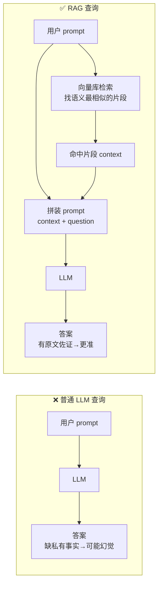
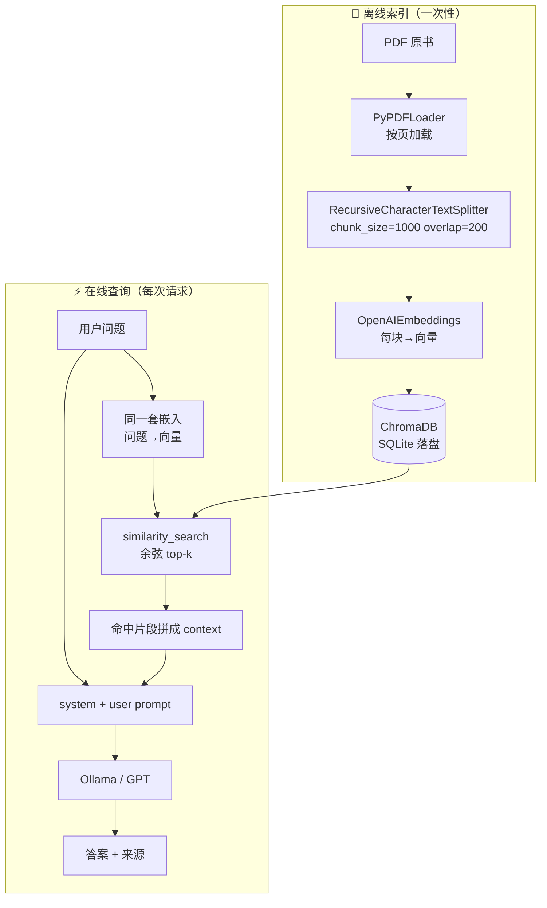

# 🎬 第 18 章 · RAG检索增强生成入门（Introduction to RAG）

> 本章对应原书 *AI and ML for Coders in PyTorch*（Laurence Moroney 著）第 18 章 "Introduction to RAG"，PDF 第 379–394 页。

## 🗺️ 本章地图（读完能会什么）

- 想清楚一个**根本性认知转变**：别再把 LLM 当成"什么都懂的知识库"，而是把它当成一台**「人工理解」（artificial understanding）的引擎**——它擅长的是读懂语言，而不是记住你的私有数据。
- 说清 **RAG（检索增强生成）到底解决什么问题**：LLM 有个永远存在的盲区——**私有数据 / 训练集之外的数据**，一碰这类问题它就自信地胡编（hallucination）。RAG 用「先检索、再生成」堵住这个洞。
- 掌握 RAG 的**完整工程链路**：PDF 加载 → 文本切块（chunk）→ 算嵌入（embedding）→ 存进向量库（ChromaDB）→ 按**余弦相似度**检索 → 把命中片段拼进 prompt → 喂给 LLM 生成答案。
- 吃透 RAG 的数学内核——**相似度（similarity）**：为什么用向量表示语义、余弦相似度怎么算、和 L2 / 内积有什么区别，并用**纯 PyTorch** 手算一遍。
- 会把同一套 RAG 代码在**本地小模型（Ollama 上的 Llama / Gemma）**和**托管大模型（GPT via OpenAI API）**之间无缝切换，并知道两者的 system prompt 该怎么写不一样。
- 这一章是全书从「训练模型」走向「**编排模型 + 数据**」的分水岭，也是当下最值钱的工程技能之一。

> 💡 **一句话本质**：RAG = **「检索」补上 LLM 不知道的私有事实 + 「生成」用 LLM 的语言理解力把这些事实组织成答案**。它不改一个模型参数，却能让一个没读过你数据的模型，回答得像读过一样——核心就一句话：**在提问时，把最相关的原文片段一起塞进 prompt**。

---

## 🧠 认知转变：把 LLM 当「人工理解」引擎，而不是知识库

原书开篇没有直接讲代码，而是先纠正一个心智模型。这一步极其重要，直接决定你后面能不能把 RAG 用对。

> 原文（p.357）：*"Stop seeing them as intelligent and knowledgeable and start seeing them as utilities to help you parse your data better."*
>
> 翻译：别再把它们（LLM）看成有智慧、有知识的东西，开始把它们看成**帮你更好地解析你自己数据的工具**。

作者给这件事起了个名字，叫 **artificial understanding（人工理解）**——把它当成 AI 的一项**互补技术**：LLM 通过海量阅读，把「语言」这件事泛化理解得极好；但它读过的那些文本本身，不应被当成一个可靠的知识库。

为什么这个区分是第一性的？因为它直接推出了 RAG 的存在理由：

- 如果你把 LLM 当**知识库**，你会指望它"记得"你的数据 → 它没读过 → 幻觉。
- 如果你把 LLM 当**理解引擎**，你会主动**把你的数据喂给它当上下文** → 它用强大的语言能力去解析这段上下文 → 得到靠谱答案。

原书用一个非常具体的例子把这件事钉死：作者 2014 年自己写了一本科幻小说 *Space Cadets*，出版社几个月后就倒闭了，所以这本书极其冷门、**绝对不在任何 LLM 的训练集里**。他去问 ChatGPT 书里一个角色 **Soo-Kyung Kim** 的信息，GPT 信誓旦旦地答"她来自韩国（South Korea）"——**错了，她是朝鲜（North Korea）人**。

> 原文（p.358）：*"GPT is being confidently incorrect. Why? Because this novel isn't in the training set!"*
>
> 翻译：GPT 在**自信地犯错**。为什么？因为这本小说不在训练集里！

但注意一个有趣的细节：即便国籍搞错，GPT 至少推断出了"这名字是**朝鲜语/韩语**的"。这恰恰印证了"人工理解"——它对语言的泛化能力还在，只是缺具体事实。RAG 要补的，就是这块**事实**。

> 💡 **实战/面试高频**：面试被问"LLM 为什么会幻觉、怎么缓解？"——标准答法：幻觉本质是**模型在训练分布外用最大似然强行补全**。缓解手段里，**RAG 是最工程化、最不需要重训的一种**——把权威事实作为上下文注入，让模型"抄"而不是"编"。另一类是微调（第 16 章）、还有约束解码 / 引用溯源等。

---

## 🩹 什么是 RAG（What Is RAG?）

RAG 是 **R**etrieval **A**ugmented **G**eneration 的缩写：**检索 - 增强 - 生成**。它要弥合的是一道鸿沟——

> 原文（p.359）：*"…retrieval augmented generation, which works to bridge the knowledge gap between what an LLM has been trained on and private data you own that it doesn't have mappings for."*
>
> 翻译：……检索增强生成，其作用是**弥合 LLM 训练所学 与 你拥有但它没有映射的私有数据 之间的知识鸿沟**。

先看**普通 LLM 查询**长什么样（原书 Figure 18-2）：你丢一个 prompt 进去，transformer 用它学到的知识生成 QKV、吐出答案。**没有外部数据介入**。

再看 **RAG 查询**（原书 Figure 18-3）：在把 prompt 交给 LLM 之前，先去一个**本地数据库**里搜"和这个问题语义相关"的片段，把它们**捆绑（bundle）**进 prompt。对角色的提问，检索到的片段可能就包含她的家乡、家族史、爱吃什么、为什么喜欢某人某物——LLM 拿到这些"她本人的原文"，理解自然一下子聪明起来。



原书把成败的关键点得很清楚：

> 原文（p.360）：*"The key to all of this, of course, is in being able to retrieve the best information to bundle with the prompt to make the most of the LLM."*
>
> 翻译：这一切的关键，当然在于**能否检索到最好的信息**，把它捆进 prompt，从而把 LLM 用到极致。

而要能"按语义相关"去搜，就必须把源材料（这里是整本书）**以支持语义搜索的方式存起来**——这就要用到 **vector store（向量库）**。RAG 的所有技术含量，几乎都压在"检索"这一环。

> ⚠️ **踩坑**：很多人以为 RAG 的难点在 LLM，其实 **RAG 系统的天花板由检索质量决定**。检索没召回对片段，再强的 GPT-4 也只能对着无关上下文瞎答。业界一句话：*"RAG is a retrieval problem, not a generation problem."*

---

## 📐 理解相似度（Understanding Similarity）

RAG 的检索靠"语义相似"，而"语义"要变成可计算的东西——就是**向量**。这一节回到第 6 章的嵌入（embedding）。

原书 Figure 18-4 画了三个词 `Awesome`、`Great`、`Terrible` 在二维平面上的向量。`Awesome` 和 `Great` 挨得近（夹角小），`Terrible` 离它俩很远（夹角大）。**用夹角的余弦来量化这种"近"**，就是 **cosine similarity（余弦相似度）**。

> 原文（p.361）：*"Taking a function of that angle, like its cosine, can give us a great indication of how close the vectors are to each other. … This process is called cosine similarity."*
>
> 翻译：对这个夹角取一个函数——比如它的余弦——就能很好地指示两个向量有多接近。……这个过程就叫余弦相似度。

**为什么用余弦而不是欧氏距离？** 第一性原理：语义嵌入里，"方向"编码语义、"长度"往往受词频等无关因素影响。余弦只看方向、不看长度，天然适合比"意思像不像"。

余弦相似度公式：

$$\text{cos\_sim}(\mathbf{a},\mathbf{b}) = \frac{\mathbf{a}\cdot\mathbf{b}}{\lVert\mathbf{a}\rVert\,\lVert\mathbf{b}\rVert}$$

取值 $[-1,1]$：1 = 完全同向（最相似），0 = 正交（无关），-1 = 完全反向。

用**纯 PyTorch** 手算一遍，把上面那张图跑出来：

```python
import torch
import torch.nn.functional as F

# 用极简 3 维"假嵌入"演示（真实嵌入是几百到几千维）
awesome  = torch.tensor([0.90, 0.85, 0.10])
great    = torch.tensor([0.88, 0.80, 0.12])   # 和 awesome 意思相近 → 方向相近
terrible = torch.tensor([-0.80, -0.75, 0.05]) # 意思相反 → 方向大致相反

def cosine(a, b):
    # a·b / (|a| |b|)；等价于把两个向量先 L2 归一化再点积
    return torch.dot(a, b) / (a.norm() * b.norm())

print(cosine(awesome, great).item())     # ≈ 0.999  非常相似
print(cosine(awesome, terrible).item())  # ≈ -0.998 非常不相似

# 工程写法：一次算一个 query 对一批文档的相似度
query = awesome.unsqueeze(0)                 # (1, 3)
docs  = torch.stack([great, terrible])       # (2, 3)
sims  = F.cosine_similarity(query, docs)     # (2,) 广播比对
print(sims)   # tensor([ 0.9995, -0.9982])
```

原书也提醒：余弦只是**众多相似度算法之一**，生产系统里值得试别的（下一节的 `distance_metric` 就给了选项），这里为了简单一律用余弦。

| 相似度/距离 | 公式直觉 | 特点 | 何时用 |
|---|---|---|---|
| **余弦（cosine）** | 看夹角、忽略长度 | 语义检索默认首选 | 文本语义相似（本章用它） |
| **L2（欧氏距离）** | 两点直线距离 | 受向量长度影响 | 嵌入已归一化时与余弦等价 |
| **内积（inner product, ip）** | 点积、不除模长 | **算得最快**、精度略低 | 大规模、嵌入已归一化 |

> 💡 **面试高频**：当嵌入向量都做了 L2 归一化后，**余弦相似度、内积、和「负的 L2 距离平方」三者单调等价**——所以很多向量库（FAISS）内部把余弦转成"归一化 + 内积"来加速。记住这个等价关系，能答出很多向量检索的性能题。

---

## 🚀 上手 RAG：搭建向量库（Getting Started with RAG）

原书选的技术栈很务实：用 **LangChain** 做胶水、用 **OpenAI 预训练嵌入**偷懒（不用自己训嵌入）、用免费开源的 **Chroma** 当向量库。

> 原文（p.360）：*"…you'll start by using a pre-built, pre-learned set of embeddings from OpenAI with an API provided by LangChain. These will be combined with a vector store database called Chroma that is free and open source."*
>
> 翻译：……你会先用 OpenAI 预训练好的一套嵌入（通过 LangChain 提供的 API），把它和一个免费开源的向量库 Chroma 结合起来。

四个核心 import，各司其职：

```python
from langchain_community.document_loaders import PyPDFLoader                 # 读 PDF
from langchain.text_splitter import RecursiveCharacterTextSplitter          # 切块
from langchain_community.embeddings import OpenAIEmbeddings                  # 文本→向量
from langchain_community.vectorstores import Chroma                         # 存/搜向量
```

- `PyPDFLoader`：把 PDF 读进来（作者用 PDF 形式提供整本小说）。
- `RecursiveCharacterTextSplitter`：把书切成一块块文本（chunk），能控制**块大小**和**块间重叠**。
- `OpenAIEmbeddings`：直接用 OpenAI 训 GPT 时学到的嵌入——一条捷径。原书强调：**只要「入库文本」和「查询 prompt」用同一套嵌入，就能做相似度搜索**，不必自己训。
- `Chroma`：负责按相似度存储和检索文本。

> 💡 **实战**：`OpenAIEmbeddings` 需要付费 API key，且把你的私有文本发给 OpenAI 算嵌入——**隐私敏感场景别这么干**。原书也点了：Hugging Face 上有大量开源嵌入可选。后面「社区案例」会给出用本地 `sentence-transformers` 完全离线算嵌入的方案。

---

## 🗄️ 创建向量库（Creating the Database）

四步走：加载 PDF → 切块 → 算嵌入 → 存盘。逐步拆。

**① 加载 PDF：**

```python
loader = PyPDFLoader(pdf_path)
documents = loader.load()   # 每页 → 一个 Document 对象（含正文 + 元数据）
```

**② 设置切块器：** 这一步是整个 RAG 里**最需要调参的地方**。

```python
text_splitter = RecursiveCharacterTextSplitter(
    chunk_size=1000,        # 每块目标 ~1000 个字符
    chunk_overlap=200,      # 相邻块重叠 ~200 字符
    length_function=len,    # 用什么量"长度"，默认 Python 的 len
    add_start_index=True,   # 记录每块在原文的起始位置（便于溯源/引用）
)
```

原书把两个关键参数的**为什么**讲得很透：

- **为什么"recursive"？** 它不是死切到第 1000 个字符，而是**优先在自然边界上切**——先试换行，再试句子，再试标点，再试空格，**实在不行才切在词中间**。这样尽量不破坏语义完整性。
- **为什么要 overlap？** 让下一块从"往回退 ~200 字符"的地方开始，于是有些文字会**在两块里各出现一次**——这没关系。

> 原文（p.362-363）：*"If we have these overlaps, some text will be included twice in the data—and that's OK. It means that we won't lose content by splitting in the middle of a sentence, etc."*
>
> 翻译：有了这些重叠，一些文字会在数据里出现两次——这没关系。它意味着我们不会因为在句子中间切断而丢失内容。

原书还讲了 chunk 大小的**权衡**：块越大 → 块数越少 → 搜索越快；但块太大、prompt 又短时，"块与 prompt 相似"的概率反而降低（大块里混进太多无关内容，稀释了相似度）。所以**块大小要按场景调**。

> ⚠️ **踩坑**：`length_function` 默认按字符数 `len` 计，但**模型是按 token 收费和限长的**。原书举例：GPT-3.5 里 `lol` 是 1 个 token，而一个 emoji 可能是 4 个 token。1000 字符 ≠ 1000 token。生产里更稳的做法是把 `length_function` 换成真正的 tokenizer 计数（如 `tiktoken`），否则可能悄悄超出上下文窗口。

**③ 切块 + ④ 算嵌入入库：**

```python
texts = text_splitter.split_documents(documents)   # → 一堆 chunk

embeddings = OpenAIEmbeddings()                     # 需要 OPENAI_API_KEY 环境变量

vectorstore = Chroma.from_documents(
    documents=texts,
    embedding=embeddings,
    persist_directory=persist_directory,            # 落盘目录
)
vectorstore.persist()                               # 保存到磁盘
```

`Chroma.from_documents` 一步做完：**对每个 chunk 调用嵌入模型算出向量，连同原文和元数据一起写进库**。底层存储是一个 **SQLite3** 数据库（原书 Figure 18-5/18-6），所以你能用任意 SQLite 工具（如免费的 DB Browser for SQLite）直接翻看里面存了什么。

> 💡 **实战/面试高频**：`OpenAIEmbeddings()` 严格依赖名为 `OPENAI_API_KEY` 的环境变量（大小写、拼写都不能错）。面试常问"RAG 的离线索引阶段（indexing）和在线查询阶段（querying）各做什么"——**离线：加载→切块→嵌入→入库（本节）；在线：查询嵌入→检索→拼 prompt→生成（后两节）**。索引是一次性、可缓存的重活，查询是每次请求的轻活。



---

## 🔎 执行相似度检索（Performing a Similarity Search）

库建好后，搜起来极简：

```python
def search_vectorstore(vectorstore, query, k=3):
    # 内部：把 query 用同一套嵌入编码 → 在库里找余弦最近的 k 个 chunk
    results = vectorstore.similarity_search(query, k=k)
    return results   # 返回 k 个 Document（含原文 page_content）
```

原书列了几个值得调的可选参数（决定"怎么找"）：

| 参数 | 默认 | 可选值 & 含义 |
|---|---|---|
| `search_type` | `similarity` | `mmr`（最大边际相关，Maximum Marginal Relevance）——**避免召回一堆几乎重复的片段**，生产系统值得试 |
| `distance_metric` | `cosine` | `l2`（直线距离）/ `ip`（内积，最快但精度略低） |
| `lambda_mult` | — | 0~1，控距离度量的松紧：1.0 结果高度相关，0.0 结果更多样 |

> 原文（p.365）：*"Search_type … can also be mmr for maximum marginal relevance (MMR) … MMR is particularly useful when you want to avoid redundant results."*
>
> 翻译：`search_type`……也可以设成 mmr（最大边际相关）……当你想避免冗余结果时，MMR 特别有用。

> 💡 **面试高频**：为什么需要 **MMR**？纯 top-k 相似度检索有个通病——**召回的 k 个片段彼此高度重复**（都命中同一句话的不同 overlap），信息密度低、白白吃 token。MMR 在"和 query 相关"与"和已选片段不重复"之间做权衡，让 k 个片段各自贡献新信息。这是 RAG 召回优化的经典手段之一。

---

## 🧩 整合起来（Putting It All Together）

把上面串成一条可跑的链路，对着 *Space Cadets* 那本书提问：

```python
pdf_path = "space-cadets-2020-master.pdf"

# 建向量库（内部就是上面「创建向量库」四步）
vectorstore = create_vectorstore(pdf_path)

# 提问：请给我 Soo-Kyung Kim 的细节——她来自哪、喜欢什么、方方面面
query = ("Give me some details about Soo-Kyung Kim. "
         "Where is she from, what does she like, tell me all about her?")

results = search_vectorstore(vectorstore, query, 5)   # 取 top-5 片段
```

原书展示了检索命中的**真实原文片段**——注意这段就是从小说里搜出来的：

> ```
> "So where are you from?"
> "I am from a small village called Sijungho," continued Soo-Kyung.
> "Sounds Korean," said Aisha. "You from South Korea?"
> "North Korea," corrected Soo-Kyung. "I've never even been to South Korea."
> ```

看到关键了吗——**"North Korea" 这个正确事实，白纸黑字就在检索到的片段里**。接下来只要把这段喂给 LLM，它就再也不会答成 South Korea 了。这就是 RAG 治幻觉的机理：**不是让模型变聪明，而是把答案的证据直接递到它面前。**

---

## 🤖 把 RAG 检索内容喂给 LLM（Using RAG Content with an LLM）

前半段是"检索"，这一段是"生成"。原书用本地 **Ollama** 服务（第 17 章）来跑，图省事。

**① 加载已建好的向量库**（查询进程通常和建库进程分开）：

```python
def load_vectorstore(persist_directory="./chroma_db"):
    embeddings = OpenAIEmbeddings()               # ⚠️ 必须和建库时同一套嵌入！
    vectorstore = Chroma(
        persist_directory=persist_directory,
        embedding_function=embeddings,
    )
    return vectorstore
```

> 原文（p.366）：*"You must use the same embeddings as those you used when you created the vector store. Otherwise, there will be a mismatch when you try to encode your prompt and search for stuff similar to it."*
>
> 翻译：你**必须**用和建库时相同的嵌入。否则你编码 prompt、去搜相似内容时就会出现不匹配。

> ⚠️ **踩坑（最常见的 RAG bug）**：建库用 A 嵌入、查询用 B 嵌入——两套向量空间根本不可比，检索结果全是噪声，但程序**不报错**，只是答得莫名其妙。规则记死：**建库和查询的嵌入模型必须逐字节一致（含版本）。**

**② RAG 查询主函数**——这是全章的骨架：

```python
def rag_query(vectorstore, query, num_contexts=3):
    # 1) 检索：拿回最相关的 num_contexts 个 chunk
    relevant_docs = search_vectorstore(vectorstore, query, k=num_contexts)

    # 2) 拼 context：把命中片段用空行拼成一大段字符串
    context = "\n\n".join([doc.page_content for doc in relevant_docs])

    # 3) 生成：把 query + context 交给 Ollama
    response = query_ollama(query, context)

    return response, relevant_docs   # 同时返回答案 + 用到的来源（可做引用）
```

**③ 调 Ollama**——这里藏着"对话消息结构"这个 LLM 基本功：

```python
import requests

def query_ollama(prompt, context, model="llama3.1:latest", temperature=0.7):
    ollama_url = "http://localhost:11434/api/chat"

    messages = [
        {
            "role": "system",
            "content": ("You are a helpful AI assistant. "
                        "Use the provided context to answer questions. "
                        "If you cannot find the answer in the context, say so. "
                        "Only use information from the provided context."),
        },
        {
            "role": "user",
            "content": f"Context:\n{context}\n\nQuestion: {prompt}",
        },
    ]

    payload = {
        "model": model,
        "messages": messages,
        "stream": False,          # 想一次拿到完整答案，必须 False
        "temperature": temperature,
    }

    try:
        response = requests.post(ollama_url, json=payload)
        response.raise_for_status()
        return response.json()["message"]["content"]   # 模型答案在这里
    except requests.exceptions.RequestException as e:
        return f"Error querying Ollama: {str(e)}"
```

对话消息结构（原书 Figure 18-7）：一段 **system**（给模型定规矩）、若干轮 **user / model** 你来我往，每条消息用 `role` 标身份，整体是一份 JSON。

原书对这段 system prompt 有个关键提醒——它**故意写得很"死板"**，逼模型只用给定 context 回答、找不到就说找不到：

> 原文（p.369）：*"Depending on how you set up the system role, you'll get very different behavior. In this case, I used a prompt that gets it to heavily focus on the provided context."*
>
> 翻译：system 角色怎么设，行为差别巨大。这里我用的 prompt 让它**高度聚焦于所提供的上下文**。

`temperature=0.7`：越小越确定、越大越有创意。但原书警告：**用 Ollama 里的小模型（如 llama3.1）时，temperature 高会更容易幻觉**。

跑起来，作者用 Llama 3.1 得到的答案（节选）：*"1. She is from North Korea. 2. She has been trained in … martial arts, languages, piloting, and strategy. 3. Her family name 'Kim' is significant …"*——**国籍答对了**，还从原文里挖出了技能、家族名的含义。RAG 成功。

> ⚠️ **踩坑（上下文窗口）**：原书特意示范这个陷阱——你可以用极小的 **Gemma 2B** 也拿到好结果，但它的**上下文窗口只有 2k token**。而你若检索 10 个 1000 字符的块，光 context 就 ~10k 字符、可能 >10k token，**直接爆窗**。规则：`num_contexts × chunk_size` 必须留在模型上下文窗口内，还要给 system prompt 和答案留空间。

---

## 🔬 关键代码拆解：`rag_query` 的数据流与「形状」

RAG 里没有 `(batch, C, H, W)` 那种张量形状，但**数据的"形状变换"同样清晰**，把它盯死就理解了整条链路。逐段追踪 `rag_query(vectorstore, query, num_contexts=10)`：

```python
relevant_docs = search_vectorstore(vectorstore, query, k=num_contexts)
```
- **输入**：`query` 是 1 个字符串（比如 68 个字符）。
- **内部**：`similarity_search` 先把 query 用嵌入模型编成 1 个向量，形状 `(1, D)`——OpenAI `text-embedding` 系列 `D=1536`；库里有 `N` 个 chunk 向量，形状 `(N, D)`。做一次 `(1, D) · (N, D)^T` 的余弦比对得到 `(N,)` 个分数，取 top-`k`。
- **输出**：`relevant_docs` 是**长度 k=10 的 `Document` 列表**，每个 `.page_content` 是 ~1000 字符的原文串。

```python
context = "\n\n".join([doc.page_content for doc in relevant_docs])
```
- **10 个 ~1000 字符的串** → 用空行拼接 → **1 个 ~10000+ 字符的大串**。这一步就是"增强（Augmented）"的物理动作：把私有事实压成一段可注入的文本。

```python
response = query_ollama(query, context)
```
- `query`（问题）+ `context`（证据）→ 组装成 `messages`（system + user 两条）→ HTTP POST 给 Ollama → 模型把这 ~10k+ 字符连同问题一起 tokenize（可能 >10k token）送进 transformer → 自回归生成答案字符串。
- **返回** `response.json()["message"]["content"]`：1 个答案字符串。

```python
return response, relevant_docs
```
- 同时把 **答案** 和 **来源片段** 抛回去。`relevant_docs` 里每个 chunk 因为建库时 `add_start_index=True`，带着"它在原书哪个位置"的元数据——**这就是做「引用溯源 / citation」的原料**。

一句话概括这条数据流：**string(问题) → vector(1×D) → top-k vectors → k×string(证据) → 1×string(证据大段) → messages(JSON) → tokens → string(答案)**。RAG 的工程感，全在这几次形状转换里。

---

## 🌍 社区案例与延伸

RAG 不是本书发明的，它有清晰的学术源头和活跃的工业生态。三条真实、可查的延伸：

1. **RAG 的原始论文（一切的起点）**：Lewis et al., *"Retrieval-Augmented Generation for Knowledge-Intensive NLP Tasks"*, NeurIPS 2020，**arXiv:2005.11401**。这篇 Facebook AI 的论文正式提出 RAG 这个名字和范式：把一个**参数化记忆（seq2seq 生成器）**和一个**非参数化记忆（Wikipedia 的稠密向量索引 + DPR 检索器）**联合起来。本书讲的 Chroma+LLM 就是它的工程化、平民化版本。配套的检索器基石是 **DPR（Dense Passage Retrieval）**，Karpukhin et al. 2020，**arXiv:2004.04906**——用双塔 BERT 把 query 和 passage 编码到同一向量空间做内积检索，正是本章"同一套嵌入"要求的理论依据。

2. **嵌入怎么选？看 MTEB 榜**：本章用 OpenAI 嵌入图省事，但离线、免费、隐私可控的做法是 **Sentence-BERT**（Reimers & Gurevych, EMNLP 2019, **arXiv:1908.10084**）家族。挑哪个模型，业界看 **MTEB（Massive Text Embedding Benchmark）** 排行榜（Muennighoff et al. 2022, **arXiv:2210.07316**，榜单在 Hugging Face `mteb/leaderboard`）。纯本地嵌入 + torch 的最小实现：

   ```python
   # pip install sentence-transformers —— 完全离线，不把数据发给 OpenAI
   from sentence_transformers import SentenceTransformer
   import torch.nn.functional as F

   model = SentenceTransformer("all-MiniLM-L6-v2")   # D=384，小而快，MTEB 常客
   emb = model.encode(["North Korea village Sijungho",
                       "South Korea Seoul city"], convert_to_tensor=True)
   print(F.cosine_similarity(emb[0:1], emb[1:2]))    # 两个"半岛"句子的语义距离
   ```
   把 `OpenAIEmbeddings()` 换成 HuggingFace 的嵌入，就得到一套零成本、可私有部署的 RAG。

3. **检索的两个必知工程真相**：其一，**"Lost in the Middle"**（Liu et al. 2023, **arXiv:2307.03172**）——LLM 对**长上下文中间部分**的信息利用率显著下降，所以 RAG 里"检索到就万事大吉"是错的，**片段的排序、精简、rerank 很关键**（呼应本章的 MMR）。其二，向量库层面，大规模场景用 **FAISS**（Johnson et al., *"Billion-scale similarity search with GPUs"*, **arXiv:1702.08734**，GitHub `facebookresearch/faiss`）做 ANN 近似最近邻；Chroma（`github.com/chroma-core/chroma`）、LangChain（`python.langchain.com`）则是把这套流程平民化的胶水。

> 💡 **延伸**：本章是"朴素 RAG（naive RAG）"。进阶范式值得知道名字：**HyDE**（先让 LLM 假想一个答案再拿它去检索）、**RAG-Fusion / 多查询改写**、**GraphRAG**（微软，把知识组织成图谱再检索）、**rerank**（用 cross-encoder 对 top-k 二次精排）。它们都在优化"检索"这一环——再次印证 RAG 的天花板在检索。

---

## 🔗 通向 LLM

本章几乎**就是**现代 LLM 应用的主流形态，逐个概念对上号：

- **RAG 本身 = 企业级 LLM 落地的头号范式**。今天 90% 的"企业知识库问答 / 文档助手 / 客服 bot / Copilot 接私有代码库"都是 RAG。原因很直接：**微调贵、更新慢、还可能把新知识灾难性遗忘；RAG 便宜、数据一改立即生效、还能给出引用溯源。** 面试问"私有知识接入 LLM 选微调还是 RAG"，标准答法：**频繁变动的事实型知识用 RAG，稳定的风格/格式/能力用微调，二者常叠加**。

- **嵌入 = LLM 时代的检索基础设施**。本章的 `OpenAIEmbeddings` 就是 OpenAI 的 `text-embedding-3` 系列，和你在 [[06_用嵌入让情感可编程：Embeddings]] 学的词嵌入是同一思想的放大版——从"词向量"长成"句/段向量"。**句向量检索**是 RAG、语义搜索、推荐、去重、聚类的共同底座。

- **余弦相似度 = 注意力的近亲**。你在 [[15_Transformer架构与transformers库]] 学的 QKV，其中 $QK^\top$ 算的就是 query 和 key 的**点积相似度**（缩放后 softmax）。RAG 的向量检索和 Transformer 的注意力，**内核都是"用相似度决定关注谁"**——RAG 是在**外部文档库**里做一次粗粒度检索，注意力是在**模型内部序列**里做细粒度加权。理解了余弦相似度，两处一通百通。

- **context 拼装 = prompt engineering / 上下文工程**。`f"Context:\n{context}\n\nQuestion: {prompt}"` 这行，就是当下最热的 **context engineering** 的雏形。什么放前、什么放后（"Lost in the Middle"）、放多少（上下文窗口）、system 怎么约束——都是 LLM 应用工程师的日常。

- **切块 + token 计数 = 数据管线的延续**。本章的 chunk 和你在 [[04_用PyTorch管理数据：Dataset与DataLoader]] 学的数据切分、以及 [[05_自然语言处理入门：把语言编码成数字]] 的 tokenization 是一脉相承的——**LLM 应用里，怎么把长文档切成模型吃得下、检索得准的片段，本身就是一门数据工程。**

- **Ollama 服务 = 生产化的最后一环**。本章直接复用 [[17_用Ollama部署与服务LLM]] 的本地服务，并示范了**同一套 RAG 代码在本地小模型和托管大模型间切换**（见下节）——这正是"开发用本地、上线用托管 / 或反过来做数据隔离"的真实工程选择。

---

## 🌐 扩展到托管模型（Extending to Hosted Models）

同一套 RAG，想换成 GPT 这类**托管大模型**，流程"完全一样"，只需换掉"生成"那一环，并**调整 system prompt 的哲学**：

> 原文（p.370）：*"Given that these models have huge amounts of parameters that have learned a lot, it's good to unshackle them a bit and not expect them to be limited solely to the context provided!"*
>
> 翻译：鉴于这些模型参数量巨大、学到的东西很多，**适当给它松绑**、别指望它只被限制在所提供的上下文里，是件好事！

对照理解：**小模型（Llama/Gemma）→ system prompt 要「收紧」**（只准用 context，防它瞎编）；**大模型（GPT）→ system prompt 可「放松」**（让它把 context 当补充、结合自身知识给更丰富的答案）。这是同一套代码里最微妙、也最体现工程判断的一处差异。

用 LangChain 接 GPT：

```python
from langchain_openai import ChatOpenAI
from langchain_core.prompts import ChatPromptTemplate

chat = ChatOpenAI(model=model, temperature=temperature)   # model 如 "gpt-4" / "gpt-3.5-turbo"

# 提示模板：两条 system（角色 + 上下文）+ 一条 user（问题）
prompt_template = ChatPromptTemplate.from_messages([
    ("system", "You are a helpful AI assistant. Use the following context to answer "
               "questions. Please provide as much detail as possible in a comprehensive answer."),
    ("system", "Context:\n{context}"),
    ("user", "{question}"),
])

formatted_prompt = prompt_template.format(context=context, question=prompt)
response = chat.invoke(formatted_prompt)
answer = response.content
```

只要设好 `OPENAI_API_KEY`，你就在**对 GPT 做 RAG** 了。原书末尾提醒一句很实在的话：**留意 OpenAI 的计费**——托管模型按 token 收费，而 RAG 会把大段 context 塞进去，token 消耗（=钱）会明显上升。

| 维度 | 本地模型（Ollama：Llama/Gemma） | 托管模型（OpenAI：GPT） |
|---|---|---|
| 部署 | 自己的机器，`localhost:11434` | 云端 API |
| 成本 | 电费/显卡，边际近乎 0 | 按 token 计费，需盯账单 |
| 隐私 | 数据不出本机 | context 会发给 OpenAI |
| 能力/上下文窗口 | 较小（Gemma 2B 仅 2k）易爆窗 | 大（可达 128k+），能力强 |
| system prompt 策略 | **收紧**（只用 context，防幻觉） | **松绑**（结合自身知识补充） |

> 💡 **实战**：真实项目常**混合**——开发/内部敏感数据用本地 Ollama 保隐私，对外要效果时用 GPT/Claude。因为 `rag_query` 把"检索"和"生成"解耦了，换 LLM 只动 `query_ollama` / `chat.invoke` 一处，**检索层完全不用改**。这种解耦是好 RAG 架构的标志。

---

## ⚠️ 常见坑

1. **建库和查询嵌入不一致**：最隐蔽的坑，程序不报错、结果全乱。**嵌入模型（含版本）必须两端严格一致**，换嵌入就得重建整个库。
2. **chunk 大小 / overlap 拍脑袋**：块太大→稀释相似度且易爆窗；太小→语义被切碎、召回断章取义。overlap 太小→句子被切断丢信息。**务必按你的文档和 query 长度实测调参**，别照抄 1000/200。
3. **用 `len` 当 token 数**：字符数 ≠ token 数（emoji、CJK、代码差异极大）。检索 `num_contexts × chunk_size` 逼近甚至超过模型上下文窗口时，**要么截断、要么爆窗报错**。上生产请用真实 tokenizer 计长。
4. **top-k 召回冗余**：纯相似度会召回一堆几乎重复的片段，白吃 token 又没新信息。用 **MMR** 或 rerank 提升片段多样性和信息密度。
5. **迷信"检索到就答对"**：召回对了，还要考虑**排序**（"Lost in the Middle"）、**噪声片段干扰**、以及 system prompt 是否约束住模型别脱离 context。检索质量 + prompt 设计共同决定成败。

---

## 🎯 面试速答

- **Q：一句话讲 RAG 是什么、解决什么问题？**
  A：**检索增强生成**——提问时先从向量库检索最相关的私有片段，拼进 prompt 再交给 LLM 生成；解决 LLM **对训练集外/私有数据无知、易幻觉**的问题，且**无需重训模型、数据改动即时生效**。

- **Q：RAG 里为什么用余弦相似度而不是欧氏距离？**
  A：语义嵌入里**方向编码语义、长度受词频等无关因素影响**，余弦只比方向、忽略长度，更契合"意思像不像"。且嵌入 L2 归一化后，余弦与内积、负 L2 距离三者单调等价，可用内积加速。

- **Q：私有知识接入 LLM，选 RAG 还是微调？**
  A：**频繁变动的事实型知识用 RAG**（便宜、即时更新、可溯源）；**稳定的风格/格式/领域能力用微调**；生产中常二者叠加——RAG 供事实、微调定调性。

- **Q：RAG 系统的性能瓶颈通常在哪？**
  A：**在检索（retrieval），不在生成**。召回不到对的片段，再强的 LLM 也白搭。优化重点是嵌入模型选型、chunk 策略、MMR/rerank、以及片段排序（Lost in the Middle）。

- **Q：为什么建库和查询必须用同一套嵌入？**
  A：嵌入定义了一个**特定的向量空间**，不同模型的空间不可比。两端不一致会导致 query 向量和库向量落在不同坐标系，相似度检索退化成噪声，**且程序不报错**，极难排查。

---

## 📌 本章小结

1. **认知先行**：把 LLM 当**「人工理解」引擎**而非知识库——它强在读懂语言，弱在记住你的私有事实。RAG 就是给它补事实。
2. **RAG 的机理**：不改一个参数，靠"**检索**私有片段 + 把它**捆进 prompt** + LLM **生成**"三步，把幻觉替换成有原文佐证的答案（Soo-Kyung Kim 从 South 纠正到 North Korea）。
3. **完整链路**：PDF 加载 → `RecursiveCharacterTextSplitter` 切块（1000/200）→ 嵌入 → Chroma（SQLite）入库；查询时同套嵌入编码 → 余弦 top-k 检索 → 拼 context → 喂 LLM。
4. **两个铁律**：**建库与查询嵌入必须一致**；**`num_contexts × chunk_size` 必须留在上下文窗口内**。相似度默认余弦，可换 l2/ip，可用 MMR 去冗余。
5. **可移植**：同一套检索层，生成层可在本地 Ollama（收紧 system prompt 防幻觉）和托管 GPT（松绑 system prompt 增丰富度、但要盯计费）之间自由切换——这正是 RAG 工程的解耦之美。

---

## 🔗 延伸阅读 & 交叉链接

**兄弟章节：**
- [[06_用嵌入让情感可编程：Embeddings]] —— 本章相似度检索的地基：词/句向量从哪来。
- [[15_Transformer架构与transformers库]] —— QKV 的点积相似度与 RAG 向量检索同源，理解注意力就理解了 RAG 的"关注谁"。
- [[17_用Ollama部署与服务LLM]] —— 本章生成端直接复用它，本地跑 Llama/Gemma。
- [[14_使用第三方模型与模型中心Hub]] —— 用 HuggingFace 拿开源嵌入替代 OpenAIEmbeddings，做离线/隐私 RAG。
- [[05_自然语言处理入门：把语言编码成数字]] —— 切块与 token 计数是 tokenization 的延续。
- [[21_从本书基础到LLM落地实战（合流篇）]] —— RAG 是全书主线在真实产品里的合流点。

**外部真实资料：**
- Lewis et al., *Retrieval-Augmented Generation for Knowledge-Intensive NLP Tasks*, NeurIPS 2020 —— arXiv:2005.11401（RAG 开山论文）。
- Reimers & Gurevych, *Sentence-BERT*, EMNLP 2019 —— arXiv:1908.10084（句向量的事实标准）。
- Liu et al., *Lost in the Middle: How Language Models Use Long Contexts*, 2023 —— arXiv:2307.03172（长上下文利用率，指导片段排序）。
- Chroma 官方仓库与文档 —— https://github.com/chroma-core/chroma ，https://docs.trychroma.com
- MTEB 嵌入模型排行榜 —— https://huggingface.co/spaces/mteb/leaderboard （选嵌入模型看这里）。
