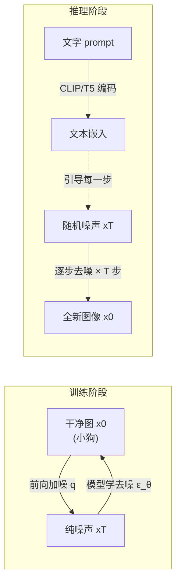
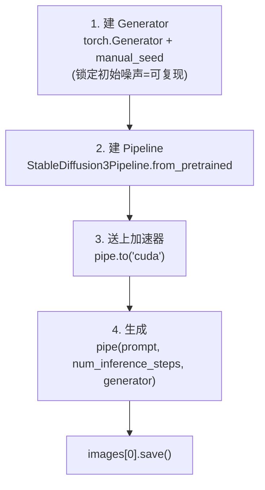
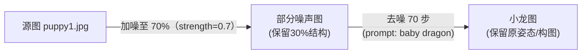

# 🎬 第 19 章 · 用 Hugging Face Diffusers 做生成式图像（Using Generative Models with Hugging Face Diffusers）

> 本章对应原书 *AI and ML for Coders in PyTorch*（Laurence Moroney 著）第 19 章 "Using Generative Models with Hugging Face Diffusers"，PDF 第 395–408 页。

## 🗺️ 本章地图（读完能会什么）

- 承接前几章「用 LLM 做**文生文**（text-to-text）」的主线，这一章跨到另一半生成式 AI——**文生图**（text-to-image）：把一句 prompt 变成一张 1024×1024 的图。
- 从**第一性原理**吃透扩散模型（diffusion）：为什么「先加噪、再学去噪」这套看似绕圈子的做法，能凭空造出训练集里根本不存在的图（比如「泰迪熊在火星上吃披萨」）。补齐 DDPM 的核心直觉与最小数学。
- 用 Hugging Face `diffusers` 库跑通**三种玩法**：`StableDiffusion3Pipeline`（文生图）、`StableDiffusion3Img2ImgPipeline`（图生图）、`StableDiffusion3InpaintPipeline`（局部重绘 / inpainting）。
- 学会调三个关键旋钮：**seed（复现）**、**num_inference_steps（采样步数）**、**strength（图生图改动幅度）**，外加原书没细讲但工业必备的 **guidance scale（CFG，文本约束强度）** 与 **negative prompt（负向提示）**。
- 打通到 LLM 主线：图像生成里的**文本编码器（CLIP/T5）就是 LLM 的嵌入**，SD3 的骨干是**扩散版 Transformer（MMDiT）**，而原书提到的**自回归图像模型**正是「像 LLM 一样逐 token 生成图」——多模态大模型的地基。

> 💡 **一句话本质**：扩散模型学的不是「怎么画画」，而是「怎么把一张全是雪花点的噪声图，一步步擦干净还原成一张真实图」；训练时给它无数「干净图 → 加噪图」的配对当习题，推理时你随手扔一团随机噪声 + 一句文字，它就把这团噪声「擦」成一张符合你描述的新图。

---

## 🌫️ 扩散模型到底是什么

我们都见过 AI 生成的图，也惊叹于它们从几年前抽象粗糙进化到几乎照片级。原书开门见山抛出一个问题：**这一切到底怎么工作的？** 答案从 diffusion（扩散）这个词开始。

### 第一性原理：把「生成」拆成「去噪」

直接学「凭空画一只小狗」太难——模型面对的是一个巨大到无法枚举的可能空间。扩散的天才之处在于**把一个难问题拆成一串简单问题**：

1. **前向加噪（forward / noising）**：拿一张干净图（比如小狗），一点点往上撒噪声，直到它变成纯粹的雪花点。这一步不需要学，是纯数学。
2. **反向去噪（reverse / denoising）**：训练一个模型，看到「加了噪的图」，学会预测「该去掉多少噪声」，从而一步步还原回干净图。

原书用一句话点破这个「数据/标签」的巧妙对调：

> "Consider the noise to be the data and the original image to be the labels. ... you can train a model that, when it sees noise, can figure out how to turn that noise into an image."
> （把噪声当作数据、把原始图像当作标签。……你就能训练一个模型，当它看到噪声时，能想出如何把这团噪声变成一张图。）——约 PDF p.373

关键的逻辑跳跃在于原书紧接着这句：

> "The logical extension is that you can then generate noise, and the model will figure out how to turn that noise into an image that will look a little bit like one of those in your training set."
> （合乎逻辑的推论是：你可以**自己生成一团噪声**，模型就会想办法把它变成一张长得有点像训练集里某张图的新图。）——约 PDF p.373

这就是「生成」的由来：**训练集里全是狗图，模型学会的去噪能力就会把随机噪声还原成「某种狗」——一只训练集里从没出现过的新狗。**



### 加上文字：让去噪「听话」

如果去噪只靠图片本身，模型只能造出「某种训练集风格的图」，你无法控制它画什么。原书的第二步妙笔：**在加噪时，把一段详细文字描述（以 embeddings 形式）一起挂到噪声图上。**

> "In simple terms, the piece of noise is enhanced by embeddings that describe it, so the process of denoising this image back into the original image ... has the extra data to guide it in how it denoises."
> （简单说，这团噪声被描述它的嵌入向量增强了，于是把它去噪还原回原图的过程，就有了额外的数据来引导它该怎么去噪。）——约 PDF p.374

于是训练变成：**「噪声 + 文本嵌入」当数据，「原始干净图」当标签。** 推理时你给一句 prompt，它被编码成嵌入，配上一团随机噪声，模型在文本嵌入的引导下把噪声去成一张匹配文字的图。这就是**文生图**。

原书用「泰迪熊在火星上吃披萨」当例子（训练集里绝无此图），展示了多步去噪的演化：

| 步数 | 图像状态 |
|---|---|
| Step 0 | 纯噪声，什么都没有 |
| Step 1 | 已经抓到 prompt 里最强的特征——「火星表面」，整张图泛起红色调 |
| Step 10 | 泰迪熊和披萨的形态出现了 |
| Step 40 | 泰迪熊真的在吃披萨，光线也变了（大概到晚饭时间了！） |

> 💡 **实战/面试高频**：扩散是**迭代式**生成——一张图不是一次算出来的，而是几十步（本书例子 40 步）逐步逼近。步数越多细节越好但越慢。这与 LLM「一个 token 一个 token 自回归生成」形成有趣对照：LLM 沿**序列维度**逐步，扩散沿**去噪时间维度**逐步。

### DDPM：给直觉补一点数学

原书只讲直觉，这里补上业界基准 **DDPM（Denoising Diffusion Probabilistic Models, Ho et al. 2020）** 的最小骨架，面试常问：

- **前向过程**一步步加高斯噪声，且有个漂亮的闭式解——**任意时刻 t 的加噪图可以一步算出来**，不用真的迭代 t 次：

$$x_t = \sqrt{\bar\alpha_t}\, x_0 + \sqrt{1-\bar\alpha_t}\,\varepsilon,\qquad \varepsilon \sim \mathcal N(0, I)$$

其中 $\bar\alpha_t$ 随 t 从 1 递减到接近 0（越到后面噪声越多）。这解释了原书「加噪到 70% 像素被噪声替换」那句话的数学出处。

- **训练目标**简单到离谱——就是让模型 $\varepsilon_\theta$ **预测当初加进去的那团噪声**，一个 MSE：

$$\mathcal L = \mathbb E_{x_0,\varepsilon,t}\left\|\varepsilon - \varepsilon_\theta(x_t, t, c)\right\|^2$$

（$c$ 是文本条件嵌入。）预测出噪声，就能反推去掉它、还原 $x_{t-1}$。

> ⚠️ **踩坑**：别把「预测噪声」和「预测图像」搞混。DDPM 训练的是**预测噪声** $\varepsilon$，不是直接预测干净图。这是它训练稳定的关键。至于 SD3，实际用的是更新的 **rectified flow / flow matching**（预测的是从噪声到数据的速度场），但「加噪—去噪」的大直觉与本章完全一致。

原书还提了一句：扩散不是唯一路线，还有**自回归模型**——把文字 token 和图像内容 token 的映射学出来，然后像语言模型预测下一个 token 那样「拼」出图。**记住这条线，它是本章通向多模态 LLM 的桥。**

---

## 🧰 用 Hugging Face Diffusers

正如 `transformers` 库（第 15 章 [[15_Transformer架构与transformers库]]）封装了 NLP 模型，Hugging Face 也提供 `diffusers` 库封装扩散模型。安装一行：

```bash
pip install -U diffusers
```

原书点明 `diffusers` 的价值——**把一长串繁琐步骤打包成 pipeline**：

> "There are many steps involved in getting a model to render an image based on a prompt: encoding the prompt, making embeddings, passing the embeddings to the model ..., grabbing the output tensors, and turning them into an image. But diffusers encapsulate this for you into a pipeline."
> （让模型根据 prompt 渲染一张图要经过很多步：编码 prompt、造嵌入、把嵌入连同超参数喂给模型、取回输出张量、再转成图像。但 diffusers 把这一切封装成一个 pipeline。）——约 PDF p.376

本书用的是 **Stable Diffusion 3.5 Medium**（`stabilityai/stable-diffusion-3.5-medium`），默认输出 **1024×1024** 图。这是个 **limited access（受限访问）** 模型，需要在 Hugging Face 页面填表申请，并用 token 登录：

```python
from huggingface_hub import login
login(token="<YOUR TOKEN HERE>")   # Colab 里可用 secret，见第 14 章
```

> 🔗 token / Hub / `from_pretrained` 的来龙去脉见 [[14_使用第三方模型与模型中心Hub]]。

### 文生图四步走

原书把生成流程明确拆成四步，我们逐步过并讲清每步在干嘛：



**第 1 步：Generator——用种子锁住随机噪声。** 扩散从随机噪声起步，但如果想**复现**同一张图，就得让「随机」变成「伪随机」：同一个 seed 永远生成同一团初始噪声。

```python
import torch

seed = 123456                                   # 任意整数
generator = torch.Generator("cuda").manual_seed(seed)   # 绑定加速器+种子
```

原书原文说得很清楚：

> "You use the seed value to create the initial noise with a level of determinism. ... when the noise is generated with a seed value, the same noise will be generated subsequent times with the same seed."
> （你用种子值来生成带有一定确定性的初始噪声。……用种子生成噪声后，之后用同一个种子会生成完全相同的噪声。）——约 PDF p.377

**第 2 步 + 第 3 步：实例化 pipeline 并送上 GPU。**

```python
from diffusers import StableDiffusion3Pipeline

pipe = StableDiffusion3Pipeline.from_pretrained(
    "stabilityai/stable-diffusion-3.5-medium",
    torch_dtype=torch.bfloat16,   # 半精度省显存，SD3 官方推荐 bf16
)
pipe = pipe.to("cuda")            # 送到 GPU 加速器
```

> ⚠️ **踩坑**：`torch_dtype=torch.bfloat16` 不是可选项而是刚需——full float32 加载 SD3.5 Medium 动辄十几 GB 显存，Colab 免费卡（T4/L4）会直接 OOM。bf16 能砍掉近一半显存且几乎不掉画质。

**第 4 步：生成。** 给 prompt、步数、generator：

```python
image = pipe(
    "A photo of a group of teddy bears eating pizza on the surface of mars",
    num_inference_steps=40,     # 去噪迭代 40 步
    generator=generator,        # 传入种子生成器
).images
image[0].save("teddies.png")
```

注意 `pipe(...)` 返回的对象里 `.images` 是一个**列表**（可以一次生成多张），所以取第一张要 `image[0]`。

### negative prompt：告诉它「别画什么」

原书强调最好去读 pipeline 源码看它支持哪些参数。SD3 pipeline 有个非常实用的 **negative prompt（负向提示）**——**指定你不想看到的东西**。经典用途是修「AI 画不好手」：

```python
image = pipe(
    "A photo of a group of teddy bears eating pizza on the surface of mars",
    negative_prompt="pepperoni",   # 原书例子：不想要意大利辣香肠披萨
    num_inference_steps=40,
    generator=generator,
).images
```

原书亲测：每一版图里泰迪熊吃的都是 pepperoni 披萨，加上 `negative_prompt="pepperoni"` 就把辣肠去掉了。工业里常把 `"deformed hands, lowres, blurry, extra fingers, watermark"` 之类塞进负向提示提升出图质量。

> 💡 **实战/面试高频**：负向提示不是「删关键词」这么简单——它在底层被编码成**另一套文本嵌入**，通过 classifier-free guidance（下面讲）把生成结果**推离**这些概念。所以负向提示越具体，效果越明显。

### 采样步数 与 guidance scale：两个必须懂的旋钮

原书正文重点讲了 `num_inference_steps`，但**没有细讲另一个同等重要的参数 `guidance_scale`（CFG，classifier-free guidance scale）**。工程实践里这俩是你调图的左右手，补齐如下：

| 参数 | 含义 | 调大 | 调小 |
|---|---|---|---|
| `num_inference_steps` | 去噪迭代次数 | 细节更精、更慢 | 更快但可能粗糙/没画完 |
| `guidance_scale` | 文本约束强度（CFG） | 更贴 prompt，但过高会过饱和/伪影 | 更自由多样，但可能跑题 |

**guidance scale 的第一性原理**：模型每步其实同时算两个噪声预测——一个「看了 prompt 的」$\varepsilon_{cond}$ 和一个「没看 prompt 的」$\varepsilon_{uncond}$，然后按下式外推放大文本的影响：

$$\tilde\varepsilon = \varepsilon_{uncond} + w\cdot(\varepsilon_{cond}-\varepsilon_{uncond})$$

这里的 $w$ 就是 `guidance_scale`。$w=1$ 相当于不加引导；SD 常用 **7~8**；SD3 因架构不同常用更低。**负向提示的本质**就是把上式里的 $\varepsilon_{uncond}$ 换成「看了负向 prompt 的」预测，从而主动推离你不想要的东西。

```python
image = pipe(
    "A photo of a group of teddy bears eating pizza on the surface of mars",
    negative_prompt="pepperoni",
    num_inference_steps=40,
    guidance_scale=7.0,          # 文本约束强度（CFG）
    generator=generator,
).images
```

> ⚠️ **踩坑**：步数和 CFG 都不是越大越好。步数从 40 加到 150 边际收益急剧递减，只是白烧算力；CFG 拉到 15+ 常出现颜色过饱和、边缘焦糊、构图崩坏。先固定 seed，只动一个参数做网格对比，是调图正确姿势。

---

## 🖼️ 图生图（Image-to-Image）

文生图从**纯随机噪声**起步；图生图（img2img）改成从**一张已有的图**起步，再按 prompt 改造它。原书用 `StableDiffusion3Img2ImgPipeline`，初始化几乎和文生图一样：

```python
from diffusers import StableDiffusion3Img2ImgPipeline
from PIL import Image

generator = torch.Generator("cuda").manual_seed(123456)

pipe = StableDiffusion3Img2ImgPipeline.from_pretrained(
    "stabilityai/stable-diffusion-3.5-medium",
    torch_dtype=torch.bfloat16,
)
pipe = pipe.to("cuda")

# 载入并预处理源图
init_image = Image.open("puppy1.jpg").convert("RGB")

image = pipe(
    prompt="A highly detailed photograph of a baby dragon",  # 把小狗变成小龙
    image=init_image,          # 源图
    strength=0.7,              # 关键旋钮：改动幅度
    num_inference_steps=100,
    generator=generator,
).images
```

### strength：图生图的灵魂旋钮

`strength` 决定生成图**多大程度上偏离源图**。原书定义两端：

> "At 0.0, the model won't do anything and the output will be the input image. At 1.0, it will effectively ignore the input image and will just act as a text-to-image model."
> （0.0 时模型什么都不做，输出就是输入图；1.0 时它基本忽略输入图，退化成纯文生图。）——约 PDF p.380

**strength 底层怎么工作**（原书讲得很直白，是理解 img2img 的关键）：strength=0.7 意味着——先给源图加噪，**直到 70% 的像素被噪声替换**（只剩 30% 是原图信息），然后**只跑 70 步去噪**（= 100 步的 70%）。所以 strength 同时决定了「加多少噪」和「跑多少步」。



原书给了一张**strength 速查表**，实战极其有用：

| strength | 效果 |
|---|---|
| 0.2 – 0.4 | 风格迁移 / 微调（保留主体，只换质感，如小狗长出鳞片、爪子雏形） |
| 0.5 – 0.7 | 基本构图保留，但主体大改（小狗 → 龙） |
| > 0.8 | 近乎完全重新生成，仅留一点原图影响 |

原书 strength=0.7 的结果：小狗的**基本姿态被保留**，但被想象成了一条龙，前景背景也是新生成的（因为 prompt 没提，模型自由发挥，但和原图相近）；strength=0.4 时则是「还是那只狗的形状，但皮肤变鳞状、开始长爪」。

> 💡 **实战/面试高频**：原书提到一个真实工业场景——**影视后期**。用便宜场景实拍视频，再逐帧 img2img 增强成想要的画面/特效，比传统 CG 后期便宜得多。这正是今天 AI 视频「风格化重绘」的雏形（配合时序一致性技术）。

---

## 🎭 局部重绘（Inpainting）

Inpainting 是图生图的精细版：**只替换图里你指定的区域，其余原封不动**。原书把小狗「搬到月球表面」——狗保留，背景换成月面。用 `StableDiffusion3InpaintPipeline`：

```python
from diffusers import StableDiffusion3InpaintPipeline

pipe = StableDiffusion3InpaintPipeline.from_pretrained(
    "stabilityai/stable-diffusion-3.5-medium",
    torch_dtype=torch.bfloat16,
)
pipe = pipe.to("cuda")

generator = torch.Generator("cuda").manual_seed(42)

original_image = Image.open("puppy.jpg").convert("RGB")     # 原图 RGB
mask_image     = Image.open("puppymask.png").convert("L")   # 掩膜：单通道灰度 L
```

### mask：白色重画，黑色保留

最关键的一步是**掩膜（mask）**。原书的定义要背下来：

> "A mask is simply an image that corresponds to the original one, in which pieces to be replaced are in white and pieces to be preserved are in black."
> （掩膜就是一张与原图对应的图，其中**要被替换的部分是白色，要保留的部分是黑色**。）——约 PDF p.384

原书用了个绝妙类比——**绿幕**：白色部分就是那块绿幕（会被替换成你 prompt 的内容），黑色部分是站在绿幕前不动的东西。注意掩膜用 `.convert("L")` 转成**单通道灰度**（L = Luminance），不是 RGB。

```python
image = pipe(
    prompt="on the surface of the moon",   # 只描述要重画的白色区域
    image=original_image,
    mask_image=mask_image,
    num_inference_steps=50,
    generator=generator,
    strength=0.99,          # 白色区域重画的强度
).images[0]
```

原书有个提示词的小心机：因为**小狗本身在黑色区域被保留了**，prompt 里就**不用再提狗**，只写 "on the surface of the moon" 描述要新画的月面即可。掩膜可以用任何图像工具制作（原书作者用 Mac 的 Acorn：先抹掉背景涂白，再用魔棒选中主体涂黑）。

> ⚠️ **踩坑**：掩膜的黑白别搞反。业界不同工具/pipeline 对「白=重画还是白=保留」约定不完全统一（有的用反掩膜），第一次跑务必看该 pipeline 文档。搞反了会得到「保留了背景、把狗给重画没了」的哭笑不得结果。

> 💡 **实战/面试高频**：inpainting 是电商/修图刚需——去水印、换背景、给人物换装、修 AI 图里画崩的手。也可以反过来做 **outpainting（向外扩画）**，把掩膜设在画布外围，让模型「脑补」画面之外的世界。

---

## 🔬 关键代码拆解

把文生图那段核心代码逐块拆开，讲清**每个对象是什么、张量在哪、形状怎么流动**：

```python
# ① 种子生成器：不产生图，只负责造「可复现的初始噪声」
generator = torch.Generator("cuda").manual_seed(123456)

# ② pipeline：一个「打包好的推理装配线」，内部含 3 个大件
pipe = StableDiffusion3Pipeline.from_pretrained(
    "stabilityai/stable-diffusion-3.5-medium",
    torch_dtype=torch.bfloat16,
).to("cuda")

# ③ 一次调用，内部跑完整条流水线
image = pipe(
    "A photo of a group of teddy bears eating pizza on the surface of mars",
    num_inference_steps=40,
    generator=generator,
).images
image[0].save("teddies.png")
```

**`pipe` 内部到底藏了什么？** 一个 Stable Diffusion pipeline 其实是三大组件的编排（这也是「Latent Diffusion」的架构，见下节）：

| 组件 | 职责 | 张量流动（以 1024×1024 为例） |
|---|---|---|
| **文本编码器**（SD3 = 2×CLIP + T5-XXL） | prompt → 文本嵌入 | `"teddy bears..."` → `(1, seq_len, d)` 嵌入 |
| **去噪骨干**（SD3 = MMDiT，即 Transformer） | 在**潜空间**逐步去噪，受文本嵌入引导 | 潜变量 `(1, 16, 128, 128)`，循环 40 步 |
| **VAE 解码器** | 潜变量 → 真实像素图 | `(1, 16, 128, 128)` → `(1, 3, 1024, 1024)` |

**关键洞察——为什么叫「Stable」/为什么能在消费级 GPU 跑**：去噪**不在 1024×1024×3 的像素空间做**（太贵），而在一个被 VAE 压缩了 8 倍的**潜空间（latent space）**做——`(16, 128, 128)` 的体量只有像素图的几十分之一。这就是 **Latent Diffusion（潜空间扩散）** 的核心，也是 Stable Diffusion 相对早期像素级扩散省算力的根本原因。

`num_inference_steps=40` 就是那个「循环 40 步」的次数：调度器（scheduler）把 $\bar\alpha_t$ 切成 40 个时间点，每步 MMDiT 预测一次噪声、去掉一点，40 步后潜变量足够干净，再交给 VAE 解码成图。

> 💡 SD1.x/2.x 用 **4 通道** 潜变量，SD3 升级到 **16 通道** 潜变量（信息更丰富、细节更好），这是 SD3 画质提升的原因之一。

---

## 🌍 社区案例与延伸

1. **DDPM 原论文**（本章去噪直觉的理论奠基）：Ho, Jain & Abbeel, "Denoising Diffusion Probabilistic Models", NeurIPS 2020, arXiv:2006.11239。确立了「预测噪声 + 简单 MSE」的训练范式。

2. **Latent Diffusion / Stable Diffusion 原论文**（本章 pipeline 的架构来源）：Rombach et al., "High-Resolution Image Synthesis with Latent Diffusion Models", CVPR 2022, arXiv:2112.10752。把扩散搬进 VAE 潜空间，让消费级 GPU 也能跑高分辨率生成。

3. **Classifier-Free Guidance**（`guidance_scale` 和负向提示的原理）：Ho & Salimans, "Classifier-Free Diffusion Guidance", 2022, arXiv:2207.12598。一个模型同时学有/无条件预测，推理时外推放大文本影响。

4. **CLIP**（文本→图像嵌入的桥）：Radford et al., "Learning Transferable Visual Models From Natural Language Supervision", 2021, arXiv:2103.00020。SD 的文本编码器基石，让 prompt 和图像共享语义空间。

5. **SD3 / 官方文档与实现**：Esser et al., "Scaling Rectified Flow Transformers for High-Resolution Image Synthesis"（SD3 技术报告）, arXiv:2403.03206；`diffusers` 库源码与文档 https://github.com/huggingface/diffusers 、https://huggingface.co/docs/diffusers 。SD3 用 **rectified flow + MMDiT**，是「扩散 + Transformer」的融合。

6. **ControlNet**（比 img2img/inpainting 更强的空间控制）：Zhang, Rao & Agrawala, "Adding Conditional Control to Text-to-Image Diffusion Models", ICCV 2023, arXiv:2302.05543。用边缘/深度/姿态图精确控制构图，是社区最火的控图插件。

---

## 🔗 通向 LLM

扩散图像生成看似和文本 LLM 是两条线，其实**共用了 LLM 世界的大量基建**，是理解「多模态大模型」的必经之路：

- **文本编码器 = LLM 的嵌入。** SD3 的 prompt 由 **CLIP + T5-XXL** 编码——T5 就是一个 Transformer 语言模型。你在 [[05_自然语言处理入门：把语言编码成数字]]、[[06_用嵌入让情感可编程：Embeddings]] 学的「把文字变成向量」，正是这里 prompt → 嵌入这一步。**图像生成的「听懂人话」部分，本质就是 LLM 的语义嵌入。**
- **去噪骨干 = 扩散版 Transformer。** 早期 SD 用 U-Net，SD3 换成 **MMDiT（Multimodal Diffusion Transformer）**——把图像潜块和文本 token 一起送进 Transformer 注意力层。你在 [[15_Transformer架构与transformers库]] 学的注意力机制，现在同时驱动了文本和图像生成。
- **自回归图像模型 = 像 LLM 一样「说」出一张图。** 原书特意提到的自回归路线（学 text token ↔ image token 的映射，再逐 token 预测拼出图），正是 **多模态 LLM（如 GPT-4o、Chameleon、Emu）** 生成图的方式——把图切成离散 token，用和文本完全相同的「预测下一个 token」机制生成。你在 [[08_用机器学习生成文本]] 学的自回归采样，直接迁移到图像。
- **guidance / negative prompt ↔ LLM 的可控生成。** CFG 放大文本约束，对应 LLM 里调 temperature/system prompt 控制输出；负向提示 ≈ 给模型一个「反向系统提示」。
- **pipeline 抽象是同一套心智模型。** `diffusers` 的 pipeline 和 `transformers` 的 pipeline（[[15_Transformer架构与transformers库]]）、Ollama 的服务化（[[17_用Ollama部署与服务LLM]]）是同一种「封装推理」的工程哲学。
- **下一步：给扩散模型也做 PEFT。** 就像 LLM 用 LoRA 微调（[[16_用自定义数据微调与提示微调LLM]]），扩散模型同样用 **LoRA** 低成本注入特定风格/主体——正是下一章 [[20_用LoRA与Diffusers微调生成式图像模型]] 的主题。

---

## ⚠️ 常见坑

1. **显存 OOM / 没用半精度**：不加 `torch_dtype=torch.bfloat16` 直接 full fp32 加载 SD3.5，免费 Colab 卡秒 OOM。bf16 是标配；显存还紧就再开 `pipe.enable_model_cpu_offload()`。
2. **忘了 `pipe.to("cuda")` 或 generator 设备不匹配**：`torch.Generator("cuda")` 的设备必须和 pipe 一致，CPU generator 配 GPU pipe 会报设备错误。
3. **访问受限模型没登录**：SD3.5 是 gated model，没在 HF 页面同意许可 + `login(token=...)` 就会 401/403。这一步不能跳。
4. **inpainting 掩膜黑白搞反**：白=重画、黑=保留，且掩膜要 `.convert("L")`（单通道）。搞反或忘了转灰度会得到完全错误的结果。
5. **step 和 guidance 一味调大**：步数过多只烧算力不涨画质；`guidance_scale` 过高导致过饱和/焦糊。固定 seed、单变量网格调参才科学。
6. **图生图 strength 语义误解**：strength 不是「像不像」的百分比，它同时控制加噪量和实际去噪步数——strength=0.7 时 100 步只真正跑 70 步，别以为设了 100 就跑满 100。

---

## 🎯 面试速答

1. **扩散模型的核心思想一句话？** 训练时给图逐步加噪并让模型学会预测/去除噪声，推理时从随机噪声出发、在文本嵌入引导下逐步去噪，生成全新图像。
2. **DDPM 训练目标是什么？** 一个 MSE：让网络预测前向过程中加进去的那团高斯噪声 $\varepsilon$，而不是直接预测干净图。
3. **guidance scale（CFG）是什么，为什么重要？** 模型同时算有条件/无条件两个噪声预测，用 $\tilde\varepsilon=\varepsilon_{uncond}+w(\varepsilon_{cond}-\varepsilon_{uncond})$ 放大文本约束；$w$ 越大越贴 prompt，过大则过饱和崩坏。
4. **img2img 里 strength 控制什么？** 控制给源图加多少噪、随之跑多少去噪步：0=不变，1=退化为纯文生图；0.2–0.4 风格微调，0.5–0.7 主体大改，>0.8 近乎重画。
5. **inpainting 的掩膜怎么用？** 一张与原图对应的灰度图，白色区域被 AI 按 prompt 重画、黑色区域保留（绿幕类比），prompt 只需描述白色区域。
6. **为什么叫 Stable Diffusion / 为什么省算力？** 去噪不在像素空间而在 VAE 压缩后的潜空间进行（潜变量比像素图小几十倍），即 Latent Diffusion，让高分辨率生成能在消费级 GPU 上跑。

---

## 📌 本章小结

1. **扩散 = 学去噪**：前向加噪（纯数学、有闭式解）+ 反向去噪（模型学预测噪声），推理时随机噪声 + 文本嵌入 → 全新图。DDPM 是基准，SD3 用 rectified flow + MMDiT。
2. **文生图四步**：建 `torch.Generator` 锁种子 → `StableDiffusion3Pipeline.from_pretrained(..., bf16)` → `.to("cuda")` → `pipe(prompt, num_inference_steps, guidance_scale, generator)`；`.images[0].save()`。负向提示删掉不想要的元素。
3. **图生图靠 strength**：从已有图起步，strength 同时决定加噪量和去噪步数——0.2–0.4 微调、0.5–0.7 大改、>0.8 近乎重画。用 `StableDiffusion3Img2ImgPipeline`。
4. **局部重绘靠掩膜**：`StableDiffusion3InpaintPipeline` + 灰度掩膜（白重画/黑保留），只改指定区域，prompt 只描述白色区。
5. **三种玩法、一套 API**：文生图 / 图生图 / inpainting 共享同一套 pipeline 心智模型；关键旋钮是 seed、num_inference_steps、guidance_scale、strength、negative_prompt。
6. **通向 LLM**：文本编码器就是 LLM 嵌入、去噪骨干就是 Transformer、自回归图像模型就是「像 LLM 一样说出一张图」——这是多模态大模型的地基，下一章用 LoRA 微调扩散模型。

---

## 🔗 延伸阅读 & 交叉链接

**兄弟章节**
- [[15_Transformer架构与transformers库]] —— SD3 的去噪骨干 MMDiT 和文本编码器都是 Transformer；pipeline 抽象同源。
- [[20_用LoRA与Diffusers微调生成式图像模型]] —— 本章的直接续集：给扩散模型做 LoRA 微调，注入自定义风格/主体。
- [[14_使用第三方模型与模型中心Hub]] —— `from_pretrained` / gated model / HF token 登录的来龙去脉。
- [[06_用嵌入让情感可编程：Embeddings]] —— prompt → 文本嵌入这一步的基本功。
- [[08_用机器学习生成文本]] —— 自回归采样，迁移到「自回归图像生成」。
- [[16_用自定义数据微调与提示微调LLM]] —— LoRA/PEFT 的 LLM 侧对照，理解下一章的迁移。
- [[17_用Ollama部署与服务LLM]] —— 生成模型的服务化思路。
- [[21_从本书基础到LLM落地实战（合流篇）]] —— 全书主线收束。

**外部真实链接**
- DDPM: Ho et al. 2020, arXiv:2006.11239 —— https://arxiv.org/abs/2006.11239
- Latent / Stable Diffusion: Rombach et al. 2022, arXiv:2112.10752 —— https://arxiv.org/abs/2112.10752
- Classifier-Free Guidance: Ho & Salimans 2022, arXiv:2207.12598 —— https://arxiv.org/abs/2207.12598
- Hugging Face Diffusers 官方文档 —— https://huggingface.co/docs/diffusers
- SD3 技术报告: Esser et al. 2024, arXiv:2403.03206 —— https://arxiv.org/abs/2403.03206
