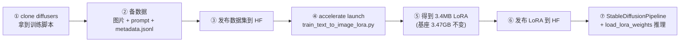
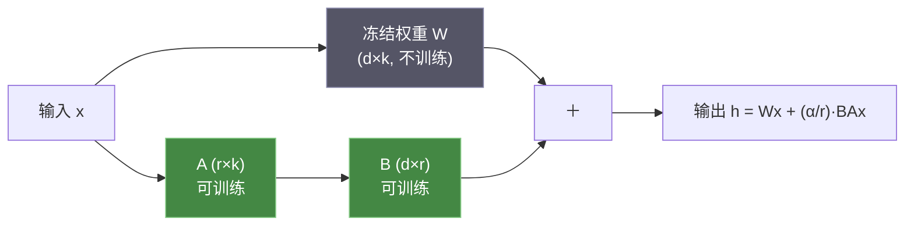

# 🎬 第 20 章 · 用 LoRA 与 Diffusers 微调生成式图像模型（Tuning Generative Image Models with LoRA and Diffusers）

> 本章对应原书 *AI and ML for Coders in PyTorch*（Laurence Moroney 著）第 20 章 "Tuning Generative Image Models with LoRA and Diffusers"，PDF 第 409–424 页。

## 🗺️ 本章地图（读完能会什么）

- 承接 [[19_用HuggingFace_Diffusers做生成式图像]]：上一章你学会**用**别人训练好的扩散模型出图，这一章学会**教它一个它原本不认识的主体/风格**——用极少数据（20 来张图）就能让 Stable Diffusion 2 稳定画出一个特定角色。
- 走通一条**端到端 LoRA 微调流水线**：clone `diffusers` 源码 → 备好带 caption 的图片数据集 → `metadata.jsonl` → `accelerate launch train_text_to_image_lora.py` → 发布到 Hugging Face → 加载 LoRA 权重做推理。
- 吃透**为什么一个 3.47 GB 的基座模型，微调产物只有 3.4 MB**——LoRA 低秩适配（low-rank adaptation）的第一性原理：只训 `ΔW = BA` 这一对小矩阵，省参数也省显存。
- 学会推理侧的关键旋钮：**scheduler（调度器）、negative prompt（负向提示）、guidance scale（引导强度）**，以及它们各自控制什么。
- 打通到 LLM 主线：这里的 LoRA 和 [[16_用自定义数据微调与提示微调LLM]] 里给 BERT 做的 PEFT 是**同一个技术**——今天 QLoRA 微调 Llama/Qwen、一个底座挂一堆几 MB adapter 热插拔，全是这一章思想的放大版。

> 💡 **一句话本质**：全量微调是把整个 3.47 GB 的脑子重写一遍（贵、慢、每个主体存一个巨模型）；LoRA 是**冻住原模型，只在几个关键权重矩阵旁边挂一对能学习的小矩阵 `A`、`B`**，让 `W → W + BA`。因为 `B`、`A` 秩很低，可训练参数从百万级掉到几千级，产物从 GB 掉到 MB，还能像贴纸一样随时贴上/撕下。

---

## 🧭 三种定制路线：DreamBooth / Textual Inversion / LoRA

和文本模型一样（回顾 [[16_用自定义数据微调与提示微调LLM]]），文生图模型也能被微调去干特定任务。原书开门见山把话说清：

> "The architecture of diffusion models and how to fine-tune them is enough for a full book in its own right, so in this chapter, you'll just explore these concepts at a high level. There are several techniques for doing this, including DreamBooth, textual inversion, and the more recent low-ranking adaptation (LoRA)."
> （扩散模型的架构以及如何微调它们，足以单独写一本书，所以本章我们只在高层次探讨这些概念。有好几种技术可以做这件事，包括 DreamBooth、textual inversion，以及较新的低秩适配 LoRA。）——约 PDF p.409

先建立一张对比表，知道 LoRA 在整个谱系里的位置：

| 技术 | 改什么 | 数据量 | 产物大小 | 直觉 |
|---|---|---|---|---|
| 全量微调（full FT） | 整个 UNet 权重 | 大 | 与基座同量级（GB） | 把整个画师重新培训一遍 |
| **DreamBooth** | 微调 UNet + 绑一个稀有触发词，常配先验保持损失 | 3–5 张 | 通常存整个模型（GB） | 教模型「这个稀有词 = 这个主体」 |
| **Textual Inversion** | **只学一个新词向量**，模型权重全冻 | 3–5 张 | 极小（KB） | 在词表里发明一个新词代表主体 |
| **LoRA**（本章） | 给若干权重矩阵加**低秩增量 `BA`**，基座全冻 | 少（本章 21 张） | **几 MB** | 给冻结的画师配一副「专精滤镜」 |

> 💡 **实战/面试高频**：这三者常被混问。一句话区分——Textual Inversion 只动**输入端的词嵌入**（不碰网络）；DreamBooth 动**整个网络权重**（表达力强但产物大）；LoRA 动网络权重但**只以低秩形式动一小撮**，是「表达力」和「产物大小」之间最甜的折中，所以成了社区主流。

本章全程用一个虚构的数字博主 **Misato**（作者用 Daz 3D 渲染出来的合成角色）做演示，把 Stable Diffusion 2 微调成「会画 Misato」，再文生图生成她的新造型（原书图 20-1、20-3）。



---

## 🛠️ 第一步：获取 Diffusers（拿到训练脚本）

微调不靠你手搓训练循环，而是用 `diffusers` 官方仓库里**预置的训练脚本**。原书建议直接从源码 clone，这样能拿到脚本 + 配套 `requirements.txt` 的最新版本：

```bash
# 本地终端
git clone https://github.com/huggingface/diffusers
cd diffusers
pip install .              # 在当前目录源码安装
```

如果在 Colab / 托管 notebook 里，用魔法命令语法：

```python
!git clone https://github.com/huggingface/diffusers
%cd diffusers
!pip install .
```

文生图的 LoRA 微调脚本就在 `/diffusers/examples/text_to_image/` 目录下。进去装它的依赖：

```python
%cd /content/diffusers/examples/text_to_image   # 换成你的实际路径
!pip install -r requirements.txt                # 内含指定版本的 accelerate/transformers/torchvision
!pip install xformers                           # 让 transformer 注意力更省显存、更快
```

> 💡 **实战/面试高频**：`xformers` 提供的是**内存高效注意力（memory-efficient attention）**，把注意力的中间显存占用从 O(N²) 降到近似 O(N)，训练/推理都更省显存、更快。它和后面要讲的 FlashAttention 是同一路思路。不装也能跑，但显存吃紧或想加速时装上很值。

> ⚠️ **踩坑**：一定要**从源码 clone 而不是 `pip install diffusers`**。原书特意强调，脚本和它依赖的库版本要匹配，`requirements.txt` 会锁定这些版本；直接 pip 装的稳定版脚本可能和你环境里的 `transformers`/`accelerate` 对不上，报各种 API 不存在的错。

---

## 📸 第二步：为微调准备数据（含一段必读的伦理提醒）

LoRA 微调主要有两个方向，原书讲得很直接：

> "The two main ways in which you'll fine-tune a LoRA are for style and for subject."
> （你微调 LoRA 主要有两种方式：为**风格**，或为**主体**。）——约 PDF p.410

- **风格（style）**：喂某种画风的一批图，让模型学会用这个画风出图。
- **主体（subject）**：喂同一个人/物的多角度图，让模型学会画这个特定对象。

> ⚠️ **伦理红线（原书用了一整段强调）**：作者明确劝阻两件事——(1) 不要拿在世艺术家赖以谋生的**商业画风**去训 LoRA；(2) 不要 Google 一个名人照片就给他/她做 LoRA。原文："Please only create a LoRA for someone whose likeness you have permission to use."（只为你**有权使用其肖像**的人做 LoRA。）这也是他专门造一个**合成角色 Misato**（Daz 3D 渲染、无真人肖像）来教学的原因。工程实践里这不是可选项，是合规底线。

### 一个好数据集长什么样

原书给出主体类数据集的组图建议，核心是**同一主体、多角度、覆盖不同部位**：

| 镜头类型 | 数量 | 作用 |
|---|---|---|
| 正面证件照式头像（portrait headshots） | 3–4 张 | 学清晰五官正视图 |
| 左右 3/4 侧头像（three-quarters） | 各 3–4 张 | 学过渡角度 |
| 纯侧脸（profile） | 3–4 张 | 学侧面轮廓 |
| 全身照（full-length body） | 3–4 张 | 学身材比例 |

Misato 数据集最终约 21–22 张图（训练日志里 `Num examples = 21`）。**每张图都要配一句描述它的 prompt**，训练时用它给图片提供语境。例如一张正面头像配：

> "Photo of (lora-misato-token), high-quality portrait, clear facial features, neutral expression, front view, natural lighting."

注意 `(lora-misato-token)` 这个**自造触发词**——它就是「Misato 这个主体」的代号。训练完之后，推理时你在 prompt 里写 `(lora-misato-token)`，模型就知道要画她。比如换个场景 `"(lora-misato-token) in food ad, billboard sign, 90s, anime, japanese pop..."`，就能生成她出演快餐广告的全新构图（原书图 20-3）。

> 💡 **实战/面试高频**：触发词为什么要写成 `(lora-misato-token)` 这种**罕见、不像正常词**的形式？因为要挑一个基座模型**几乎没见过的 token**，让 LoRA 把「这个新主体」的全部特征都挂到它身上，而不会污染已有的常见词（比如你若用 `girl` 当触发词，会把所有 `girl` 都变成 Misato）。这和 DreamBooth 用 `sks`、`ohwx` 这类稀有 token 是同一个道理。

### metadata.jsonl：把图片和 prompt 绑起来

`diffusers` 训练脚本吃的是一个标准格式：`metadata.jsonl`——**每行一个 JSON**，含 `file_name`（图片文件名）和 `prompt`（该图描述）。原书片段：

```jsonl
{ "file_name": "rightprofile-smile.png",   "prompt": "photo of (lora-misato-token), right side profile, high quality, detailed features, smiling, professional photo" }
{ "file_name": "rightprofile-neutral.png", "prompt": "photo of (lora-misato-token), right side profile, high quality, detailed features, professional photo" }
```

准备好图片 + `metadata.jsonl` 后，原书强烈建议**把数据集发布到 Hugging Face**（登录后在 HF 网站新建 dataset、设公开/私有、网页上传文件）。发布后地址形如 `https://huggingface.co/datasets/<用户名>/<数据集名>`，作者的就是 `lmoroney/misato`。这样训练脚本一个 `--dataset_name="lmoroney/misato"` 就能直接拉数据，省去本地路径的麻烦。

---

## 🏋️ 第三步：用 Diffusers 微调模型

### 先配 accelerate

`accelerate` 是 Hugging Face 用来**抽象底层加速硬件**（单卡/多卡/TPU、混合精度、分布式）的库。训练前先给它一个配置。Colab 里最省事的写法：

```python
from accelerate.utils import write_basic_config
write_basic_config()   # 生成一份基础配置，单机单卡即用
```

### 跑训练脚本

然后用 `accelerate launch` 启动文生图 LoRA 脚本：

```python
!accelerate launch train_text_to_image_lora.py \
  --pretrained_model_name_or_path="stabilityai/stable-diffusion-2" \
  --dataset_name="lmoroney/misato" \
  --caption_column="prompt" \
  --resolution=512 \
  --random_flip \
  --train_batch_size=1 \
  --num_train_epochs=1000 \
  --checkpointing_steps=5000 \
  --learning_rate=1e-04 \
  --lr_scheduler="constant" \
  --lr_warmup_steps=0 \
  --seed=42 \
  --output_dir="/content/lm-misato-lora"
```

逐个超参数讲清它在干嘛：

| 超参数 | 含义 | 备注 |
|---|---|---|
| `pretrained_model_name_or_path` | 基座模型：HF 路径或本地目录 | 这里是 `stabilityai/stable-diffusion-2` |
| `dataset_name` | 数据集：HF 路径或本地目录 | 这里是 `lmoroney/misato` |
| `caption_column` | jsonl 里哪一列是 caption | 这里是 `prompt` |
| `resolution` | 训练分辨率 | 512×512 |
| `random_flip` | 随机翻转做**数据增强**（见 [[03_卷积神经网络：在图像中检测特征]]） | Misato 已多角度，其实可不加 |
| `train_batch_size` | 每批图片数 | 从 1 起步；作者说 A100 只用了 7GB/40GB，可调大加速 |
| `num_train_epochs` | 训练多少轮 | 这里 1000 |
| `checkpointing_steps` | 多久存一次 checkpoint | 每 5000 步 |
| `learning_rate` | 学习率 | 1e-4 |
| `lr_scheduler` | 学习率调度器 | `constant`（也可用会衰减的调度器） |
| `lr_warmup_steps` | 预热步数（逐步升到初始 LR） | 0 |
| `seed` | 随机种子 | 42，保证可复现 |
| `output_dir` | checkpoint 保存目录 | |

> ⚠️ **踩坑（钱与算力）**：原书明确警告——**这一步非常烧算力也烧钱**。上面这组超参数，在 Colab 的 A100 上跑约 **2 小时**、消耗约 **17 个 compute unit**（出版时约每个 10 美分）。训练日志里会看到 `Total optimization steps = 1000`、每步约 2.9s。真跑之前务必搞清楚计费。

训练时的日志长这样（原书实录）：

```text
Resolving data files: 100% 22/22 [00:00<00:00, 74.14it/s]
INFO - __main__ - ***** Running training *****
INFO - __main__ -   Num examples = 21
INFO - __main__ -   Num Epochs = 1000
INFO - __main__ -   Gradient Accumulation steps = 1
INFO - __main__ -   Total optimization steps = 1000
Steps:  10% 103/1000 [05:03<44:00,  2.94s/it, lr=0.0001, step_loss=0.227]
```

### 关键观察：3.47 GB vs 3.4 MB

训练完，`output_dir` 里能看到（原书图 20-5）：基座 `model.safetensors` 有 **3.47 GB**，而**微调产物 LoRA 只有 3.4 MB**——差了约 1000 倍。这个数字差不是巧合，正是下一节要讲的 LoRA 原理带来的。

---

## 🧠 LoRA 低秩适配的原理（为什么省参数、省显存）

原书说扩散模型微调「够写一本书」，所以只讲了操作没深挖数学。这一节我们把**为什么 3.4 MB 就够**讲透——这也是面试最爱问的地方。理论出处是 LoRA 原论文：Hu et al., "LoRA: Low-Rank Adaptation of Large Language Models"，arXiv:2106.09685。

### 核心假设：权重更新是「低秩」的

全量微调在做什么？对某个权重矩阵 `W ∈ R^{d×k}`，学一个增量 `ΔW`，得到新权重 `W + ΔW`。`ΔW` 和 `W` 一样大（`d×k` 个数），所以微调一个大模型要存和基座同量级的参数。

LoRA 的假设：**微调时真正需要的这个 `ΔW`，其"内在秩"（intrinsic rank）很低**。也就是说，`ΔW` 虽然是个大矩阵，但它其实能被两个瘦长矩阵的乘积很好地近似：

```
ΔW = B · A
     其中 B ∈ R^{d×r},  A ∈ R^{r×k},  且 r ≪ min(d, k)
```

`r` 叫**秩（rank）**，是 LoRA 最重要的超参，典型取 4、8、16。前向传播变成：

```
h = W·x + ΔW·x = W·x + B·(A·x)     （再乘一个缩放系数 α/r）
```

- **`W` 全程冻结**，不算梯度、不更新、不存优化器状态。
- **只有 `A`、`B` 可训练**。

### 一个最小的 PyTorch LoRA 层（把原理写成代码）

```python
import torch
import torch.nn as nn

class LoRALinear(nn.Module):
    """给一个冻结的 nn.Linear 挂上低秩增量 BA。"""
    def __init__(self, base_linear: nn.Linear, r: int = 4, alpha: int = 8):
        super().__init__()
        self.base = base_linear
        for p in self.base.parameters():
            p.requires_grad_(False)          # 冻住原权重 W，只当只读矩阵用

        d_out, d_in = base_linear.weight.shape   # W: (d_out, d_in)
        # A: (r, d_in) 高斯初始化；B: (d_out, r) 初始化为 0
        self.A = nn.Parameter(torch.randn(r, d_in) * 0.01)
        self.B = nn.Parameter(torch.zeros(d_out, r))
        self.scaling = alpha / r                  # 论文里的 α/r 缩放

    def forward(self, x):
        # 原路径 + 低秩旁路；训练开始时 B=0 → ΔW=0 → 等价于原模型
        return self.base(x) + (x @ self.A.t() @ self.B.t()) * self.scaling
```

> 💡 **为什么 `B` 初始化为 0**：训练一开始 `ΔW = B·A = 0`，模型和原基座**逐字节等价**，不会一上来就把预训练能力打乱；然后从这个安全起点慢慢学增量。这是 LoRA 稳定的关键小设计。

### 参数量与显存的账，算给你看

假设某个权重矩阵 `d = k = 1024`：

- 全量微调该矩阵：`1024 × 1024 ≈ 1.05 M` 个可训练参数。
- LoRA（`r=4`）：`A` 是 `4×1024`，`B` 是 `1024×4`，共 `2 × 4 × 1024 = 8192` 个 —— **少了约 128 倍**。

省的不止是**存储**，更狠的是**显存里的优化器状态**：

| 项目 | 全量微调 | LoRA（r=4） |
|---|---|---|
| 可训练参数 | 1.05 M | 8 K |
| 梯度（每参数 1 份） | 1.05 M | 8 K |
| Adam 优化器状态（动量 m + 方差 v，2 份） | 2.1 M | 16 K |
| **显存占用总量级** | 大头 | 忽略不计 |

用 Adam 时，每个**可训练**参数除了自身，还要为梯度、一阶动量、二阶动量各存一份（fp32 下约 3 份额外拷贝）。全量微调时这部分和整个模型同量级、直接吃爆显存；LoRA 把可训练参数砍到几千，**这些优化器状态几乎归零**——这才是「LoRA 省显存」的主因。冻结的 `W` 只需前向用一下，不背负梯度和优化器状态。

这就完美解释了原书那个 **3.47 GB → 3.4 MB**：存下来的只是所有被适配层的 `A`、`B` 小矩阵，基座一个字节都不用重复存。



> 💡 **实战/面试高频**：在扩散模型里，LoRA 通常挂在 **UNet 的交叉注意力（cross-attention）层的 Q/K/V/out 投影**上——因为文本 prompt 就是通过 cross-attention 注入图像生成的，改这里最能高效地"教模型认识新主体"。这和 LLM 里把 LoRA 挂在注意力的 `q_proj`/`v_proj` 上是同构的思路。

---

## 📤 第四步：发布模型到 Hugging Face

原书提醒一个**关键坑**：训练输出目录里塞了远超所需的东西，**包括基座模型的完整拷贝**。如果直接整包上传，会白白传好几 GB。

> "Therefore, you should edit your directory structure to remove the model.safetensors files from the checkpoint directories and keep the rest."
> （因此，你应该修改目录结构，把各 checkpoint 目录里的 model.safetensors 删掉，其余保留。）——约 PDF p.415

也就是**只保留真正的 LoRA 权重（那 3.4 MB），删掉每个 checkpoint 里的基座 safetensors 大文件**，再去 `huggingface.co/new` 建一个 Model 仓库、选好 license、网页上传。作者把它命名为 `finetuned-misato-sd2`（数据是 misato、基座是 Stable Diffusion 2）。

> ⚠️ **踩坑**：不删基座就上传，不仅慢，还会让你的 LoRA 仓库变成好几 GB——别人下载你的"LoRA"时被迫拉一份完整基座，完全违背了 LoRA 轻量可插拔的初衷。LoRA 仓库应该只有 MB 级的 adapter 文件。

---

## 🖼️ 第五步：用自定义 LoRA 生成图像

数据集和 LoRA 都发布到 HF 后，推理就很简单了，流程和 [[19_用HuggingFace_Diffusers做生成式图像]] 类似，但多了两件事：**加一个 scheduler**、**加载 LoRA 权重**。

### scheduler 是什么

> "In stable diffusion, the role of the scheduler determines how the image evolves from random noise to the final image. Not all schedulers work with LoRA."
> （在 stable diffusion 中，scheduler 的作用是决定图像**如何从随机噪声演化为最终图像**。不是所有 scheduler 都能配 LoRA。）——约 PDF p.416

scheduler（也叫 sampler/采样器）控制**去噪的每一步怎么走**：走多少步、每步去掉多少噪声、用什么数值解法。不同 scheduler 在**速度**和**画质**之间权衡不同。原书用 `EulerAncestralDiscreteScheduler`，并演示可换成 `DPMSolverMultistepScheduler`。

### 完整推理代码

```python
import torch
from diffusers import (
    StableDiffusionPipeline,
    EulerAncestralDiscreteScheduler,
)

model_id = "stabilityai/stable-diffusion-2"
device = "cuda" if torch.cuda.is_available() else "cpu"

# 1. 选调度器（注意要 from 基座模型的 scheduler 子目录取配置）
scheduler = EulerAncestralDiscreteScheduler.from_pretrained(
    model_id, subfolder="scheduler"
)

# 2. 载入 pipeline，塞入调度器，用 fp16 省显存
pipe = StableDiffusionPipeline.from_pretrained(
    model_id,
    scheduler=scheduler,
    torch_dtype=torch.float16,
).to(device)

# 3. 关键一步：加载我们训练好的 LoRA 权重（挂到基座上）
pipe.load_lora_weights("lmoroney/finetuned-misato-sd2")

# 4. 正向 prompt（想要什么）+ 负向 prompt（不想要什么）
prompt = ("(lora-misato-token) in food ad, billboard sign, 90s, anime, "
          "japanese pop, japanese words, front view, plain background")

negative_prompt = (
    "(deformed, distorted, disfigured:1.3), poorly drawn, bad anatomy, "
    "wrong anatomy, extra limb, missing limb, floating limbs, "
    "(mutated hands and fingers:1.4), disconnected limbs, mutation, "
    "mutated, ugly, disgusting, blurry, amputation"
)

# 5. 超参数
num_inference_steps = 50    # 去噪步数
guidance_scale = 6.0        # 引导强度（见下）
width = height = 512
seed = 1234567

# 6. 固定种子，保证可复现
generator = torch.Generator(device=device).manual_seed(seed)

# 7. 出图
image = pipe(
    prompt,
    negative_prompt=negative_prompt,
    width=width, height=height,
    num_inference_steps=num_inference_steps,
    guidance_scale=guidance_scale,
    generator=generator,
).images[0]

image.save("lora-with-negative.png")
```

### negative prompt 与 guidance scale 的作用

- **负向提示（negative prompt）**：定义你**不想**要的内容。AI 出图常见的畸形手、错误解剖结构，用它显式排除很有效。原书那串 `deformed, bad anatomy, mutated hands and fingers...` 就是社区常用的"反畸形咒语"。语法里的 `:1.3`、`:1.4` 是**权重**，数字越大这个词的排斥力度越强。
- **引导强度（guidance scale，即 CFG scale）**：控制模型「多听话 vs 多自由」。原书给的经验值：

| guidance scale | 效果 |
|---|---|
| < 5 | 更有创意自由，但可能不太贴合 prompt |
| ≈ 6 | **自由与贴合的平衡点**（原书推荐起点） |
| > 7 | 更严格遵循 prompt，但可能出现奇怪伪影 |

### 换个 scheduler 试试

同样的超参数，换 `DPMSolverMultistepScheduler` 能得到相似结果（原书图 20-8）：

```python
from diffusers import DPMSolverMultistepScheduler
scheduler = DPMSolverMultistepScheduler.from_pretrained(
    model_id, subfolder="scheduler", algorithm_type="dpmsolver++"
)
```

> 💡 **有趣的观察（角色一致性）**：原书图 20-9 把 Misato 用莫奈、毕加索的风格重画，五官特征在换风格后**基本保留**——说明 LoRA 学到的主体特征足够稳。但作者也诚实指出：Misato 是**合成角色**，模型学到的 LoRA 偏"低分辨率、CGI 感"，生成图对人眼接近写实、对模型却明显是合成风。**训练数据的质地会被 LoRA 忠实继承**。

---

## 🔬 关键代码拆解：`load_lora_weights` 那一行到底发生了什么

整章最"魔法"的是这一行：

```python
pipe.load_lora_weights("lmoroney/finetuned-misato-sd2")
```

它做的事，正是本章原理的落地：

1. **从 HF 仓库下载那 3.4 MB 的 adapter 文件**（一堆 `A`、`B` 小矩阵，按层命名，如 `unet.up_blocks.*.attn2.to_q.lora_A/B`）。
2. **定位基座 UNet 里对应的注意力投影层**（`to_q`/`to_k`/`to_v`/`to_out`），把每个 `B·A` 按 `α/r` 缩放，**加到该层前向的输出上**——不是原地改写 `W`，而是加一条低秩旁路。
3. 基座 `pipe.unet` 的 3.47 GB 权重**一个字节都没变**，只是运行时多算了 `+ (α/r)·B(Ax)`。

所以张量层面：设某注意力有 `to_q.weight ∈ (1024, 1024)`。LoRA 下载来的是 `to_q.lora_A ∈ (r, 1024)` 和 `to_q.lora_B ∈ (1024, r)`，`r` 可能是 4。前向时输入 `x ∈ (B, N, 1024)`：

- 原路径：`x @ Wᵀ → (B, N, 1024)`
- 旁路：`x @ Aᵀ → (B, N, r)`，再 `@ Bᵀ → (B, N, 1024)`，乘 `α/r`
- 两者相加。中间那个 `(B, N, r)` 的瓶颈维度 `r=4`，就是"低秩"省一切的物理体现。

正因为它是**加法旁路**，LoRA 才能**热插拔**：`pipe.load_lora_weights(...)` 贴上、`pipe.unload_lora_weights()` 撕下，一个基座配几十个 LoRA 随意切换——这是全量微调永远做不到的。

---

## 🌍 社区案例与延伸

1. **LoRA 原论文**——本章一切的理论根基：Hu et al., "LoRA: Low-Rank Adaptation of Large Language Models"，arXiv:2106.09685（https://arxiv.org/abs/2106.09685）。虽然是为 LLM 提出的，但"低秩增量 + 冻结基座"完全迁移到了扩散模型。核心实验：在 GPT-3 175B 上，LoRA 把可训练参数减少 10000 倍、显存需求减少 3 倍，效果还追平甚至略超全量微调。

2. **DDPM & Stable Diffusion**——你正在微调的模型从哪来：Ho et al., "Denoising Diffusion Probabilistic Models"，arXiv:2006.11239（去噪扩散的开山作，scheduler 就是在实现它的采样过程）；Rombach et al., "High-Resolution Image Synthesis with Latent Diffusion Models"，arXiv:2112.10752（Stable Diffusion 的 latent diffusion 架构，本章基座 SD2 即出于此）。

3. **DreamBooth**——本章对比表里的另一极：Ruiz et al., "DreamBooth: Fine Tuning Text-to-Image Diffusion Models for Subject-Driven Generation"，arXiv:2208.12242（https://arxiv.org/abs/2208.12242）。理解它"稀有触发词 + 先验保持损失"的思路，会让你更懂 LoRA 触发词 `(lora-misato-token)` 的设计动机。

4. **Diffusers 官方 LoRA 训练文档 & 脚本**：https://huggingface.co/docs/diffusers/training/lora 以及本章用到的脚本源码 `examples/text_to_image/train_text_to_image_lora.py`（https://github.com/huggingface/diffusers）。这是把本章跑起来最权威的一手资料。

5. **社区生态 Civitai**：https://civitai.com —— 海量社区 LoRA 分享站，直观感受"一个 SD 基座 + 无数 MB 级 LoRA 热插拔"的生态是怎么运转的（也是理解本章"发布 LoRA 到 Hub"价值的现实映照）。

---

## 🔗 通向 LLM

本章讲的是**图像** LoRA，但 LoRA 本身就诞生于 **LLM**，两边是同一套机制，建立起对应关系你就打通了全书主线：

- **同一个 LoRA，两种模态**：本章给 SD2 的 UNet 交叉注意力挂 `BA`；在 LLM 里给 `q_proj`/`v_proj` 挂 `BA`——数学完全一样。你在 [[16_用自定义数据微调与提示微调LLM]] 见到的 PEFT 家族，LoRA 就是其中最主流一支。
- **QLoRA = 4-bit 量化基座 + LoRA**：Dettmers et al., "QLoRA"，arXiv:2305.14314。把基座压到 4-bit（省显存）、再只训 LoRA（省优化器状态），于是**单张 24GB 消费卡就能微调 65B 大模型**。这正是本章"冻结基座 + 只训低秩增量"经济学的极致版。
- **adapter 热插拔 → 多技能编排**：本章一个 SD 基座配多个角色/风格 LoRA，对应 LLM 侧一个底座挂多个任务 LoRA、按需切换，是轻量多智能体/多技能服务的基础（`peft` 库统一管理，见 [[17_用Ollama部署与服务LLM]] 的服务化）。
- **触发词 → 概念注入**：图像 LoRA 的 `(lora-misato-token)` 教模型认一个新主体；LLM 的 prompt-tuning/soft prompt 学一段连续向量教模型专精一个任务——都是"用极少参数往冻结模型里注入一个新概念"。
- **发布到 Hub 的工作流通用**：本章把 dataset 和 LoRA 都推到 Hugging Face，和 [[14_使用第三方模型与模型中心Hub]] 里 LLM 的 checkpoint 分发是同一套 `from_pretrained` / `push_to_hub` 生态。

---

## ⚠️ 常见坑

1. **用 `pip install diffusers` 而非从源码 clone**：拿不到最新训练脚本、脚本和依赖版本对不上，报 API 不存在。务必 `git clone` 后 `pip install .`，再装 `examples/text_to_image/requirements.txt`。
2. **触发词选了常见词**：用 `girl`/`woman` 当触发词会污染基座对这些词的原有理解，导致"所有女生都变成 Misato"。要用 `(lora-misato-token)` 这种罕见 token。
3. **上传前没删基座 `model.safetensors`**：LoRA 仓库被撑到 GB 级、上传巨慢，还逼别人下载整份基座。只保留 MB 级 adapter。
4. **scheduler 和基座/LoRA 不兼容**：原书明说"Not all schedulers work with LoRA"。换 scheduler 后出图崩坏/报错时，先怀疑兼容性，回退到 `EulerAncestralDiscreteScheduler` 或 `DPMSolverMultistepScheduler` 试。
5. **guidance scale 拉太高**：>7 虽然更贴 prompt，但容易出畸形伪影；<5 又可能不听话。从 6 起步微调。
6. **忽视训练数据质地**：Misato 是合成图，LoRA 学出来就带 CGI/低分感。想要写实结果，训练集本身必须写实——LoRA 只会忠实放大你喂的东西。

---

## 🎯 面试速答

1. **LoRA 为什么省显存？** 冻结基座 `W` 不算梯度、不存优化器状态；只训低秩的 `A`、`B`（可训练参数从 `d×k` 降到 `r×(d+k)`），Adam 的动量/方差等优化器状态随之从大头变到可忽略——省的主要是显存里的优化器状态，其次才是存储。
2. **LoRA 的 `r`（秩）和 `α` 分别控制什么？** `r` 是低秩瓶颈维度，越大表达力越强、参数越多；`α` 配合 `α/r` 缩放增量幅度，常固定 `α=2r` 之类，调 `α` 相当于调 LoRA 影响的"音量"。
3. **为什么 LoRA 的 `B` 初始化为 0？** 让训练起点 `ΔW=BA=0`，模型与原基座等价，不破坏预训练能力，再从安全起点学增量。
4. **DreamBooth、Textual Inversion、LoRA 区别？** Textual Inversion 只学一个新词向量（不碰网络，KB 级）；DreamBooth 微调整个网络（强但 GB 级）；LoRA 给权重加低秩增量（基座冻结，MB 级，可热插拔），是三者中最佳折中。
5. **扩散模型里 LoRA 一般加在哪、negative prompt 起什么作用？** 加在 UNet 的交叉注意力投影层（文本条件注入处）最高效；negative prompt 显式声明不想要的内容（如畸形手），推理时把生成往远离它的方向引导，是 CFG 的负向条件。

---

## 📌 本章小结

1. **端到端五步**：clone `diffusers` → 备图片+`metadata.jsonl`+发布数据集 → `accelerate launch train_text_to_image_lora.py` → 删基座后发布 LoRA → `StableDiffusionPipeline` + `load_lora_weights` 推理。
2. **LoRA 用极少数据定制主体/风格**：本章 21 张 Misato 图，A100 约 2 小时，产出 **3.4 MB** LoRA（基座 3.47 GB 不变），差约 1000 倍。
3. **省的本质是低秩 + 冻结**：`ΔW = BA`，`r ≪ min(d,k)`；`W` 冻结不背负梯度和优化器状态，可训练参数与显存双双骤降；`B=0` 初始化保证起点无损。
4. **推理三旋钮**：scheduler 决定去噪路径（要与 LoRA/基座兼容）、negative prompt 排除畸形、guidance scale≈6 平衡自由与贴合。
5. **主线贯通**：图像 LoRA 和 LLM 的 LoRA/QLoRA 是同一技术；一个冻结底座配一堆 MB 级可热插拔 adapter，是今天 PEFT 生态与轻量多技能编排的基石。

---

## 🔗 延伸阅读 & 交叉链接

**兄弟章节**
- [[19_用HuggingFace_Diffusers做生成式图像]] —— 本章直接前置：先会用扩散模型出图，再学微调它。
- [[16_用自定义数据微调与提示微调LLM]] —— LoRA 在文本侧的孪生应用，PEFT 谱系全景。
- [[14_使用第三方模型与模型中心Hub]] —— `from_pretrained` / Hub / 发布模型的来龙去脉。
- [[03_卷积神经网络：在图像中检测特征]] —— `random_flip` 等数据增强的原理。
- [[17_用Ollama部署与服务LLM]] —— 微调好的模型/adapter 如何服务化、热插拔。
- [[21_从本书基础到LLM落地实战（合流篇）]] —— 全书主线收束。

**外部真实链接**
- LoRA 论文：Hu et al. 2021, arXiv:2106.09685 —— https://arxiv.org/abs/2106.09685
- QLoRA 论文：Dettmers et al. 2023, arXiv:2305.14314 —— https://arxiv.org/abs/2305.14314
- Stable Diffusion（Latent Diffusion）：Rombach et al. 2022, arXiv:2112.10752 —— https://arxiv.org/abs/2112.10752
- Diffusers LoRA 训练官方文档 —— https://huggingface.co/docs/diffusers/training/lora
