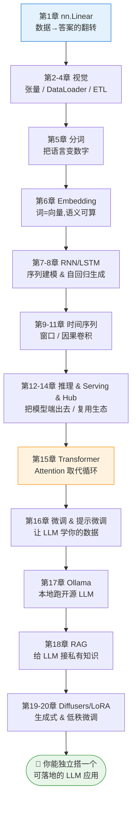
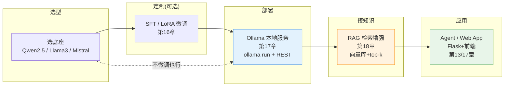

# 🧬 第 21 章 · 从本书基础到 LLM 落地实战（合流篇）

> 这一章不是原书的章节，而是**把全书 20 章的地基，焊到今天的大语言模型（LLM）上的一张"合流图"**。
> 原书用一条隐藏的主线把你从 `y = 2x − 1` 一路带到 Stable Diffusion 与 Ollama —— 本章把这条线显式画出来，并给一条**可动手的 LLM 落地路径**。

---

## 🗺️ 本章地图（读完能会什么）

- 看懂**这本"入门书"其实一直在为 LLM 铺路**：张量、DataLoader、Embedding、Attention、自回归生成、Serving、RAG，全是 LLM 的零件；
- 拿到一张**"本书概念 → LLM 对应物"对照表**，以后读任何 LLM 论文/代码都能对号入座；
- 掌握一条**端到端落地链路**：选底座 → 微调（第 16 章）→ 本地部署（第 17 章 Ollama）→ 接私有知识（第 18 章 RAG）→ 组装成 Agent；
- 跑通仓库里的 **`06_rag_mini_lab`**（离线可跑），再一键换成真实 LLM，把"读过"变成"上线过"。

> 💡 **一句话本质**：**LLM 不是一门新学科，而是把这本书里的每一块积木（张量 / 嵌入 / 注意力 / 自回归 / 服务 / 检索）叠到极大规模后的涌现产物。** 你在第 1–14 章练的手，就是玩转第 15–20 章 LLM 的手。

---

## 21.1 🪜 全书其实是一部"通往 LLM 的阶梯"

原书的编排看似"传统 ML 教材"，但把章节连起来看，是一条**精心设计的 LLM 预备役训练营**：



**关键转折在第 15 章**：前 14 章你都在用"循环（RNN/LSTM）"处理序列，第 15 章 Transformer 用**注意力（attention）一次看全序列**，去掉了循环的顺序瓶颈——这正是 LLM 得以在 GPU 上大规模并行训练、进而"变大出智能"的工程前提。

---

## 21.2 🔁 一张"本书概念 → LLM 对应物"对照表

这张表是本章的核心资产。它告诉你：**你在这本书里学到的每一个手法，在一个真实 LLM 里叫什么、放在哪。**

| 本书概念（章） | 在 LLM 里对应什么 | 说明 |
|---|---|---|
| `nn.Linear` + 反向传播（第 1 章） | LLM 的每一层 FFN / 注意力投影 | LLM 就是几百层 `Linear` + 非线性堆起来的，训练机制完全一样：前向→loss→`backward()`→`step()` |
| 张量 (batch, ...) / `DataLoader`（第 2、4 章） | 大模型训练的数据管线 | LLM 训练也是 batch 张量流；只是数据是 token 序列，DataLoader 换成分布式的 packing/sharding |
| Tokenization（第 5 章） | BPE / SentencePiece 分词器 | LLM 的第一步永远是把文本切成 token id。第 5 章的 `texts_to_sequences` 就是它的玩具版 |
| `nn.Embedding`（第 6 章） | LLM 的 token embedding 矩阵 | GPT/LLaMA 的第一层就是一个 `nn.Embedding(vocab, d_model)`；第 6 章你已经亲手训过它 |
| 词向量语义方向 / 可视化（第 6 章） | 句向量检索、RAG 的召回 | "语义相近→向量相近"正是 RAG（第 18 章）和向量数据库的地基 |
| RNN/LSTM 自回归生成（第 7–8 章） | LLM 的自回归解码（next-token prediction） | LLM 生成文本的本质和第 8 章一模一样：预测下一个 token，再把它接回输入，滚雪球。temperature/采样也一样 |
| 序列窗口 / 因果卷积（第 9–11 章） | 上下文窗口 & 因果掩码 | LLM 的 "context window" 和 causal mask 就是"只能看过去、不能看未来"的序列约束 |
| `model.eval()` / `torch.no_grad()`（第 12 章） | LLM 推理模式 | 部署 LLM 时同样要关梯度、切推理态，还要管 KV-cache |
| TorchServe / Flask（第 13 章） | LLM 推理服务（vLLM / TGI / Ollama） | 第 13 章的"把模型端成 HTTP 服务"就是 LLM Serving 的入门形态 |
| HF Hub / PyTorch Hub（第 14 章） | 从 Hub 拉 LLaMA/Qwen/Mistral | 复用预训练模型的生态与工作流完全一致 |
| Transformer 架构（第 15 章） | **就是 LLM 本体** | GPT = 一堆 Decoder-only Transformer 块；BERT = Encoder。第 15 章讲的就是 LLM 的心脏 |
| 微调 / 提示微调（第 16 章） | SFT / PEFT / LoRA 对齐 | 让通用 LLM 学会你的任务与语气；LoRA 是工业界最常用的省显存微调法 |
| Ollama（第 17 章） | 本地/私有化 LLM 部署 | 隐私、成本、离线三大诉求的落地首选 |
| RAG（第 18 章） | 检索增强生成 | 给 LLM 外接一个"可更新、可溯源"的知识库，缓解幻觉、接私有数据 |
| Diffusers / LoRA（第 19–20 章） | 多模态生成 & 低秩适配 | LoRA 的低秩思想在文本 LLM 与图像模型里通用 |

> 💡 **面试高频**：被问"你怎么理解 LLM？"——**别背参数量**。答："LLM 本质是一个用 Transformer 堆起来、在海量文本上做 next-token 预测训练出来的自回归模型；推理时逐 token 采样生成。它的每个零件——embedding、attention、自回归解码、微调、serving——在传统深度学习里都能找到对应物。" 这正是本书给你的视角。

---

## 21.3 🛠️ 一条可动手的 LLM 落地链路

把第 15–18 章串成一条**工程落地流水线**。这也是今天绝大多数"企业接入 LLM"的标准姿势：



**决策顺序（务实版）：**
1. **先 RAG，后微调**。90% 的"让 LLM 懂我业务"需求，用 RAG（第 18 章）接知识库就够了，成本低、可溯源、知识可即时更新。
2. **RAG 不够再微调**。当你要改的是**风格/格式/固定行为**（而非知识），才上 LoRA 微调（第 16 章）。
3. **能本地就本地**。隐私/合规/成本敏感时，用 Ollama（第 17 章）把开源模型跑在自己机器上。
4. **组装成应用**。用第 13 章的 Flask/服务化思路，把"检索 + LLM"包成一个 HTTP 服务或 Agent。

---

## 21.4 🔬 端到端最小示例：把这本书变成一个能回答问题的 LLM 应用

下面是一段**把第 18 章 RAG + 第 17 章 Ollama 合起来**的最小落地代码（配套项目 `06_rag_mini_lab` 就是它的离线可跑版）。

```python
# rag_llm_app.py —— RAG + 本地 LLM 的最小落地骨架
# 依赖：pip install numpy requests   （LLM 部分用 Ollama，见第 17 章）
import numpy as np, requests, re
from collections import Counter

# ---------- 1) 嵌入：语义→向量（第 6 章的思想，离线确定性版） ----------
def embed(text, dim=256):
    """把文本 hash 成一个归一化向量。真实系统请换成 sentence-transformers / BGE。"""
    v = np.zeros(dim)
    for tok in re.findall(r"[a-z0-9一-鿿]+", text.lower()):
        v[hash(tok) % dim] += 1.0
    n = np.linalg.norm(v)
    return v / n if n else v

# ---------- 2) 向量库 + 检索（第 18 章 RAG 的召回） ----------
KB = [
    "PyTorch 用 nn.Linear 定义全连接层，训练三步走：zero_grad、backward、step。",
    "Fashion-MNIST 是 28x28 灰度服装图，本书第 2 章用它入门计算机视觉。",
    "Transformer 用自注意力替代循环，是所有现代 LLM 的核心架构（第 15 章）。",
    "RAG 先检索相关文档，再把文档拼进提示词交给 LLM 生成答案（第 18 章）。",
    "Ollama 让你在本地一条命令跑开源 LLM，兼顾隐私、成本与离线（第 17 章）。",
]
KB_VEC = np.stack([embed(d) for d in KB])

def retrieve(question, k=3):
    q = embed(question)
    scores = KB_VEC @ q                     # 余弦相似度（向量已归一化）
    idx = np.argsort(-scores)[:k]
    return [KB[i] for i in idx]

# ---------- 3) 用检索到的上下文，调本地 LLM 生成（第 17 章 Ollama） ----------
def generate_with_ollama(question, context, model="qwen2.5:3b"):
    prompt = (f"请只依据下面的资料回答问题，资料没提到就说不知道。\n\n"
              f"资料：\n- " + "\n- ".join(context) + f"\n\n问题：{question}\n答案：")
    try:
        r = requests.post("http://localhost:11434/api/generate",
                          json={"model": model, "prompt": prompt, "stream": False}, timeout=30)
        return r.json()["response"]
    except Exception:
        # 离线兜底：没有 Ollama 时，直接返回检索到的资料（模板生成）
        return "（未连到本地 LLM，返回检索结果）\n- " + "\n- ".join(context)

def answer(question):
    ctx = retrieve(question)
    return generate_with_ollama(question, ctx)

if __name__ == "__main__":
    print(answer("现代 LLM 的核心架构是什么？"))
    print(answer("怎么在本地私有化跑一个 LLM？"))
```

**这段 60 行代码，就是一个能落地的 LLM 应用雏形**：它用第 6 章的嵌入做召回、第 18 章的 RAG 做知识接入、第 17 章的 Ollama 做生成。把 `embed` 换成 BGE/`sentence-transformers`、把 `KB` 换成你公司的文档、把 `qwen2.5:3b` 换成你微调过的模型（第 16 章），就是一套可以真上线的私有知识问答系统。

> ⚠️ **踩坑**：本仓库项目 `06_rag_mini_lab` 的默认路径是**完全离线**的（`hash` 嵌入 + 模板生成），保证 `pytest` 绿；真要效果好，**嵌入器一定要换成语义模型**（hash 嵌入只能做 demo，无法捕捉真实语义）。

---

## 21.5 🎯 三种"让 LLM 懂我"的方式，怎么选

| 方式 | 本书章节 | 改的是 | 成本 | 何时用 |
|---|---|---|---|---|
| **Prompt / In-context** | 第 15、17 章 | 什么都不训，只写好提示词 | 最低 | 通用任务、快速验证 |
| **RAG 检索增强** | 第 18 章 | 外接知识，不动模型权重 | 低 | 知识型问答、私有文档、要溯源、知识常更新 |
| **微调 / LoRA** | 第 16、20 章 | 模型权重（风格/格式/行为） | 中高 | 固定风格、专有格式、RAG 搞不定的行为对齐 |

**经验法则**：**Prompt 兜底 → RAG 接知识 → 微调改行为**，能不训练就不训练。微调解决"怎么说"，RAG 解决"说什么"，别用微调去塞知识（贵、易忘、难更新）。

---

## 21.6 🚀 从这本书出发，下一步学什么

读完本书 + 跑完配套项目，你已经具备"手搓每个零件"的能力。往 LLM 深处走，建议这条路：

1. **看懂一个真实 Decoder-only LLM 的实现** —— Karpathy 的 [nanoGPT](https://github.com/karpathy/nanoGPT)（~300 行复刻 GPT），把第 15 章讲的东西读成代码；
2. **注意力与推理优化** —— FlashAttention、KV-cache、PagedAttention（本仓库 `attention-optimization/` 有 36 讲）；
3. **对齐** —— SFT → RLHF/DPO，把第 16 章的微调升级到偏好对齐；
4. **Serving 规模化** —— 从第 13 章的 Flask，走到 vLLM / TGI / Ollama 生产部署（本仓库 `book-hands-on-llm-serving/`）；
5. **Agent** —— 在 RAG 之上加工具调用、多步规划，把"问答"升级成"办事"。

---

## 🌍 社区案例与延伸

- **RAG 原论文**：Lewis et al., *Retrieval-Augmented Generation for Knowledge-Intensive NLP Tasks*, 2020（[arXiv:2005.11401](https://arxiv.org/abs/2005.11401)）——第 18 章思想的源头。
- **Transformer 原论文**：Vaswani et al., *Attention Is All You Need*, 2017（[arXiv:1706.03762](https://arxiv.org/abs/1706.03762)）。
- **LoRA**：Hu et al., *LoRA: Low-Rank Adaptation of Large Language Models*, 2021（[arXiv:2106.09685](https://arxiv.org/abs/2106.09685)）——第 16、20 章微调的工业标配。
- **nanoGPT**：Andrej Karpathy，[github.com/karpathy/nanoGPT](https://github.com/karpathy/nanoGPT)——把第 15 章读成可跑代码。
- **Ollama**：[ollama.com](https://ollama.com)、[github.com/ollama/ollama](https://github.com/ollama/ollama)——第 17 章本地 LLM。
- **Hugging Face PEFT**：[huggingface.co/docs/peft](https://huggingface.co/docs/peft)——第 16 章提示微调/LoRA 的官方库。

---

## 📌 本章小结

1. **这本"入门书"是一架通往 LLM 的阶梯**：张量 → DataLoader → 嵌入 → 序列生成 → 注意力 → 微调 → Serving → RAG，每一级都是 LLM 的零件。
2. **一张对照表**把本书概念一一映射到 LLM 组件，让你以后读任何 LLM 论文/代码都能对号入座。
3. **落地链路**：选底座 → （可选）LoRA 微调 → Ollama 本地部署 → RAG 接知识 → 组装成应用；**能不训练就不训练**。
4. **三种"让 LLM 懂我"的方式**：Prompt / RAG / 微调，按"改什么、多少成本"取舍——RAG 塞知识、微调改行为。
5. 跑通 `06_rag_mini_lab`，把这套流程从"读过"变成"上线过"。

---

## 🔗 延伸阅读 & 交叉链接

- 上游地基：[[05_自然语言处理入门：把语言编码成数字]]、[[06_用嵌入让情感可编程：Embeddings]]、[[08_用机器学习生成文本]]
- LLM 核心：[[15_Transformer架构与transformers库]]、[[16_用自定义数据微调与提示微调LLM]]
- 落地三件套：[[17_用Ollama部署与服务LLM]]、[[18_RAG检索增强生成入门]]、[[13_用TorchServe与Flask部署PyTorch模型]]
- 配套项目：`projects/06_rag_mini_lab`（离线可跑的 RAG，一键换真实 LLM）
- 本仓库延伸：`attention-optimization/`（注意力与推理优化 36 讲）、`book-hands-on-llm-serving/`（LLM 服务化）、`llm-alignment/`（对齐）
