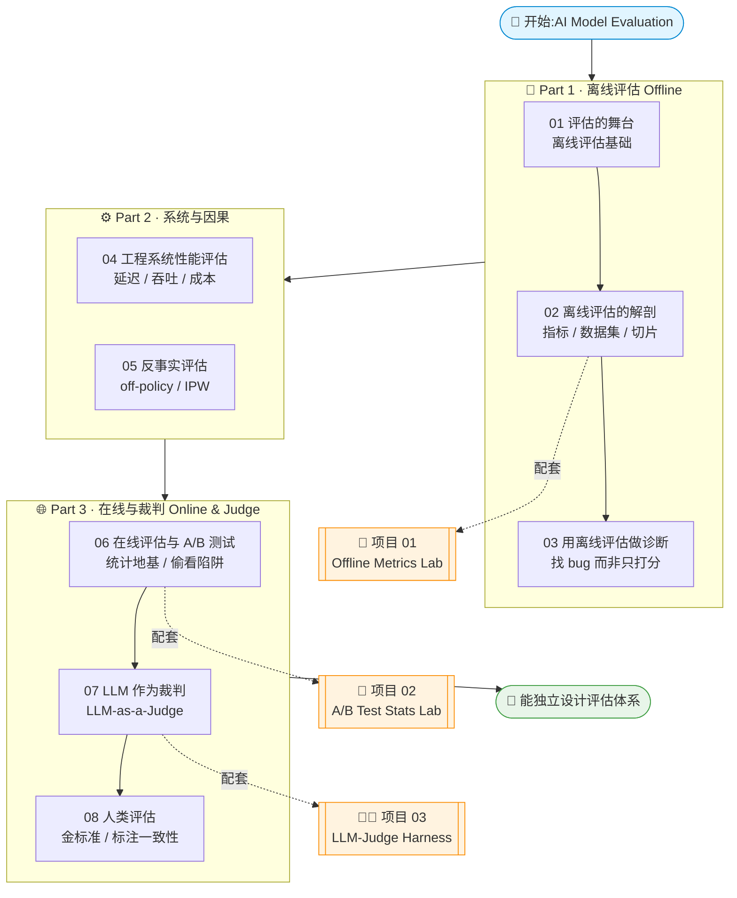

# 📊《AI Model Evaluation》中文逐章精讲 + 实战合集

> 原书:**AI Model Evaluation (MEAP)** · Leemay Nassery 著
> 本仓库把这本书**从零基础到进阶逐章讲透**,并配 **3 个本机可跑的实战项目**(纯 numpy、离线、不联网、不需 GPU / API key,`pytest` 一把过)。
> 一句话定位:**读完讲义懂原理,跑完项目会落地,面试追问不卡壳。**

这不是原书翻译,而是一套面向**工程师 / 面试者 / 研究者**的教学材料:每章都有「本章地图 → 概念本质 → 公式拆解 → 代码对拍 → 踩坑 → 面试题」;每个项目都把书里一笔带过的指标 / 检验 / 裁判,**用可运行代码手写并画图验证**。

---

## 🗺️ 学习路径图



**推荐路线**:离线(01→02→03)打地基 → 系统与因果(04→05)补工程与反事实 → 在线与裁判(06→07→08)收尾。每读到有配套项目的章节(02 / 06 / 07),立刻切到对应项目动手跑一遍。

---

## 📚 逐章精讲(`book-guide/`)

| # | 章节讲义 | 一句话简介 |
|---|----------|-----------|
| 01 | [评估的舞台:离线评估基础](book-guide/01_评估的舞台：离线评估基础.md) | 为什么先做离线评估、离线 / 在线之别,搭好全书的评估心智地图 |
| 02 | [离线评估的解剖](book-guide/02_离线评估的解剖.md) | 拆开一次离线评估:指标、数据集、切片(slice)、Golden set 各是什么、怎么配 |
| 03 | [用离线评估做诊断](book-guide/03_用离线评估做诊断.md) | 从「打个总分」升级到「定位问题」——用切片和错误分析找出模型到底哪里烂 |
| 04 | [工程系统性能评估](book-guide/04_工程系统性能评估.md) | 模型好不等于系统好:延迟、吞吐、成本、可用性等工程侧指标怎么量 |
| 05 | [反事实评估](book-guide/05_反事实评估.md) | 因果推断视角的 off-policy 评估:逆倾向加权(IPW)、日志复用、偏差与校正 |
| 06 | [在线评估与 A/B 测试](book-guide/06_在线评估与AB测试.md) | 假设检验 / p 值 / 置信区间 / 样本量 / 统计功效,以及「偷看 peeking」为何抬高假阳性 |
| 07 | [LLM 作为裁判 LLM-as-a-Judge](book-guide/07_LLM%20作为裁判%20LLM-as-a-Judge.md) | 用 LLM 当评估器:pointwise / pairwise、位置偏置、如何把裁判校准到可信 |
| 08 | [人类评估](book-guide/08_人类评估.md) | 人在环:金标准怎么建、标注一致性(κ)怎么算、人类与自动指标如何互校 |

> 💡 章节 06 / 07 文件名含空格,链接已 URL 编码(`%20`),GitHub / Obsidian 均可直接点开。

---

## 🛠️ 实战项目(`projects/`)

| # | 项目 | 一句话 | 如何跑 |
|---|------|--------|--------|
| 01 | [📏 离线评估指标库<br/>Offline Metrics Lab](projects/01_offline_metrics_lab/) | 纯 numpy 从零手写分类(P/R/F1、ROC-AUC、PR-AUC)、排序(NDCG / MAP / MRR)、校准(Brier / ECE)、切片四大类指标,公式↔代码↔手算对拍 | `cd projects/01_offline_metrics_lab`<br/>`pip install -r requirements.txt`<br/>`python run_demo.py` · `pytest -q` |
| 02 | [🧫 A/B 测试统计实验室<br/>A/B Test Stats Lab](projects/02_ab_test_stats_lab/) | 纯 numpy 实现两比例 / 两均值检验、p 值、置信区间、样本量估算、统计功效,并用蒙特卡洛**亲手跑出「偷看」如何抬高假阳性** | `cd projects/02_ab_test_stats_lab`<br/>`pip install -r requirements.txt`<br/>`python run_demo.py` · `pytest -q` |
| 03 | [🧑‍⚖️ LLM-as-a-Judge 评估器<br/>LLM-Judge Harness](projects/03_llm_judge_harness/) | 可插拔裁判(含 MockLLMJudge)做 pointwise 打分 / pairwise 比较,交换顺序测**位置偏置**,用 Cohen's κ / 相关系数量化「裁判 vs 人类金标准」,出两张图 | `cd projects/03_llm_judge_harness`<br/>`pip install -r requirements.txt`<br/>`python run_demo.py` · `pytest -q` |

三个项目共同约定:**本机 · 离线 · 确定性** —— 不联网、不下模型、不需要任何 API key,依赖仅 `numpy / matplotlib / pytest`(零 sklearn / scipy)。`run_demo.py` 直接在 `figures/` 出图,`pytest` 一把过。

---

## 🎯 面试 / 实战用法

**给面试者:**

- 🔍 **被追问指标内核时不卡壳**:面试官不会满足于「我调了 `roc_auc_score`」。跑一遍**项目 01**,你能亲口说清「AUC 在算随机取一正一负、正样本分更高的概率」「类别不平衡为何看 PR 曲线」「ECE 逐 bin 怎么算」。
- 📈 **讲清 A/B 的统计地基**:很多人只会说「看 p 值 < 0.05」。**项目 02** 让你能解释置信区间、样本量怎么估、统计功效是什么,以及**为什么「天天偷看、显著就停」会把假阳性率抬到 30%+**。
- 🧑‍⚖️ **答好「LLM 怎么评 LLM」**:大模型岗高频题。**项目 03** 让你能谈 pointwise vs pairwise、位置偏置怎么检出、如何用 κ 证明「裁判可信」——这正是 LLM-as-a-Judge 落地的关键。
- 🗣️ **每章末的「面试题」小节**可直接当自测题背。

**给工程师 / 研究者:**

- 🧩 **搭自己的评估体系**:按讲义顺序(离线诊断 → 系统性能 → 反事实 → 在线 A/B → LLM / 人类裁判)组合成一套完整的「上线前 + 上线后」评估流水线。
- 📏 **项目代码可直接改用**:指标库、A/B 统计、裁判 harness 都是**无重依赖的纯函数**,复制到你自己的评估脚本里即用,不必等 sklearn / scipy 环境。
- 🔬 **反事实(05)+ 在线(06)配合**:先用 off-policy / IPW 在**日志上离线预估**新策略收益,再上 A/B **在线确认**,省实验成本、控上线风险。

---

## 📂 目录结构

```
book-ai-model-evaluation/
├── README.md                 # 本文件:总览 + 学习路径 + 目录
├── book-guide/               # 8 章逐章精讲(中文,含面试题)
│   ├── 01_评估的舞台：离线评估基础.md
│   ├── 02_离线评估的解剖.md
│   ├── 03_用离线评估做诊断.md
│   ├── 04_工程系统性能评估.md
│   ├── 05_反事实评估.md
│   ├── 06_在线评估与AB测试.md
│   ├── 07_LLM 作为裁判 LLM-as-a-Judge.md
│   └── 08_人类评估.md
├── projects/                 # 3 个可跑实战项目(pytest + run_demo)
│   ├── 01_offline_metrics_lab/
│   ├── 02_ab_test_stats_lab/
│   └── 03_llm_judge_harness/
└── figures/                  # 讲义配图
```

---

> 📖 建议配合原书 *AI Model Evaluation (MEAP, Leemay Nassery)* 阅读。讲义每章顶部都标注了对应原书页码,便于对照。
> 🚀 边读边跑:**读到 02 / 06 / 07 就切到对应项目动手**,理解会牢一个数量级。
