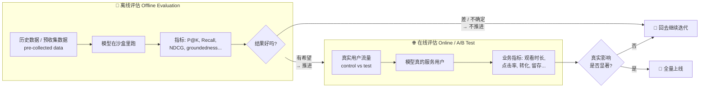
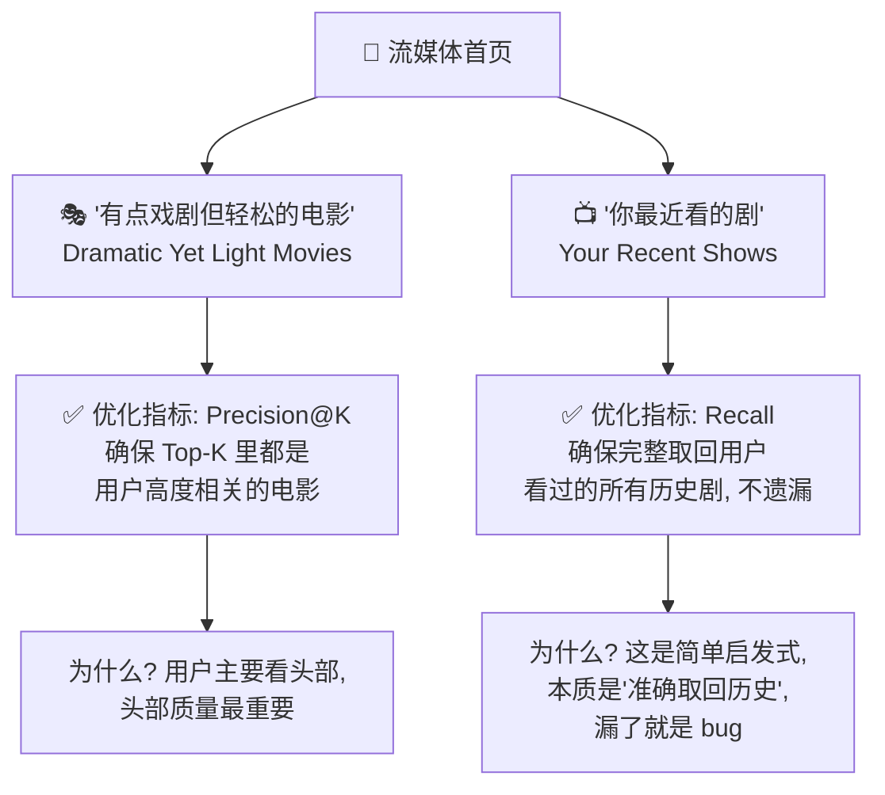
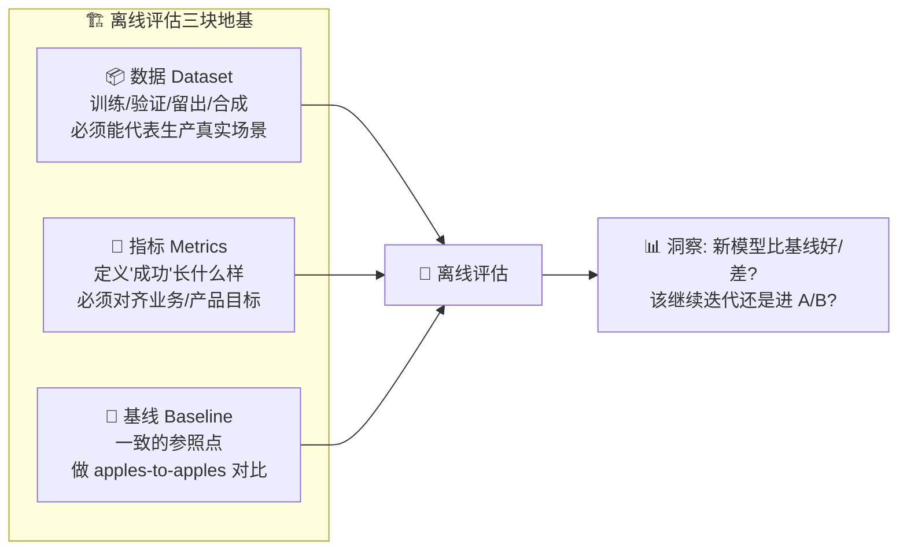
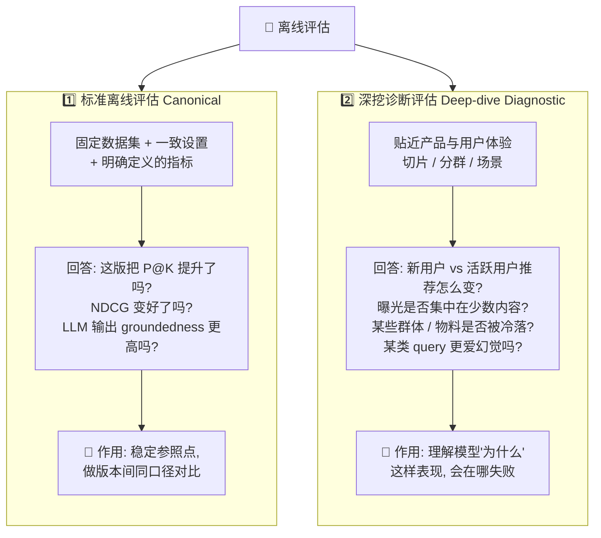
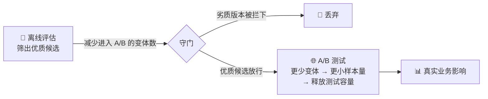
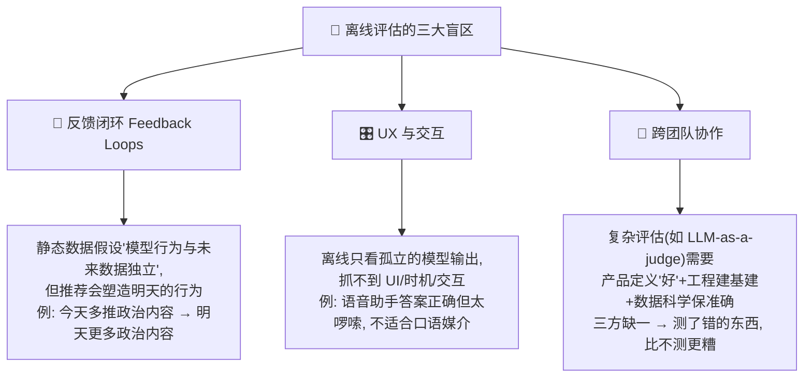
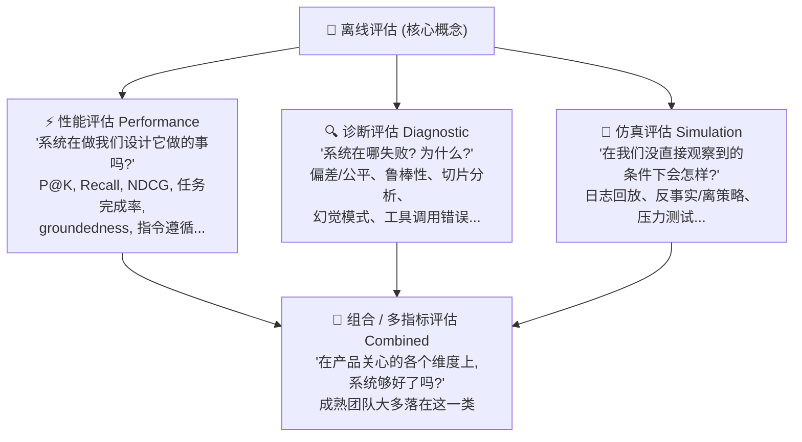

# 🎬 第 1 章 · 评估的舞台：离线评估基础（Offline Evaluation Basics）

> 本章对应原书 *AI Model Evaluation (MEAP)*（Leemay Nassery 著）第 1 章 “Introduction to offline evaluations” 及第 2 章开头，PDF 第 11–52 页。

---

## 🗺️ 本章地图（读完能会什么）

这本书讲的是一件事：**在把一个 AI 模型放到真实用户面前之前，你怎么知道它到底行不行？** 全书分三大部分：

- **Part 1 · 离线评估（Offline Evaluation）** —— 用历史数据在“沙盒”里给模型做体检。← **本章在这里，是整本书的地基**
- **Part 2 · 在线评估（A/B Testing）** —— 把模型放到真实流量里，测真实业务影响。
- **Part 3 · LLM / Agent 评估** —— LLM-as-a-judge、RAG 评估、Agent 评估等新范式。

本章是 **Part 1 的第 0 块砖**。读完你将能：

1. 说清楚 **离线评估（offline evaluation）到底是什么**，以及它和 **在线评估（online / A/B test）** 的边界；
2. 用一张贯穿全书的 **流媒体推荐系统（streaming recommender）** 例子，把“数据 → 指标 → 基线”三件套讲透；
3. 掌握 **离线评估的两层结构**（标准评估 + 深挖诊断）和 **三类评估方法**（性能 / 诊断 / 仿真）；
4. 知道 **数据的几种形态**（训练 / 验证 / 留出 / 合成）以及数据漂移（data drift）这个头号坑；
5. 明白 **什么时候不该迷信离线评估**（反馈闭环、UX、跨团队协作）。

> 💡 **一句话本质**：离线评估是模型的**守门人（gatekeeper）**——它不能替你判死刑或颁奖，但能在模型见真人之前，把明显不行的版本拦在门外，把值得上线的版本推向 A/B 测试。

---

## 1.1 🚪 为什么评估是模型的“守门人”

想象你是某流媒体 App 推荐团队的工程师。今晚就要决定：**要不要把新版排序模型推上线？** 如果直接推，出了问题——比如把恐怖片推给了标注“不看恐怖”的用户——**几百万真实用户会立刻感受到你的失误**，业务指标掉、用户流失、你半夜被叫起来回滚。

原书开篇一句话点题：

> *“That’s why offline evaluation isn’t just a preliminary step, it’s a model’s first reality check.”*
> （这就是为什么离线评估不只是一个前置步骤，它是模型的**第一次现实检验**。）

🔬 **第一性原理：为什么必须先离线评估？**

一个 AI 模型的本质，是“从历史数据里学到模式，然后对新数据做预测 / 分类 / 生成”。原书对 AI 模型的定义（第 11 页）：

> AI 模型 = 一段程序，用来**识别模式（recognize patterns）** 并**基于数据做决策**。它由几块组成：
> - **特征输入（feature inputs）**：你喂给它的信息；
> - **可学习参数（learnable parameters）**：权重 weights 和偏置 biases，模型在学习中调整它们；
> - **激活函数（activation functions）**：引入非线性；
> - **架构结构（architectural structures）**：神经网络的层、树模型的决策路径。

问题在于：**训练时用的历史数据，和上线后遇到的真实数据，从来不完全一样。** 模型在训练集上表现好，不代表在生产环境好。所以你需要一个“预演场”——在不惊动真实用户的前提下，先估计一下改动的效果。这个预演场，就是离线评估。

| 如果没有离线评估 | 如果有离线评估 |
|---|---|
| 每个候选模型都要跑一次 A/B 测试 | 离线先筛掉明显差的版本，只让优质候选进 A/B |
| A/B 要跑几周才有统计功效（statistical power） | 离线几分钟到几小时出结果，迭代飞快 |
| 用真实用户当小白鼠，风险高 | 用历史数据当小白鼠，零用户风险 |
| 上线后才发现对某类用户全崩 | 上线前诊断评估就能发现分群失效 |
| 测试容量被大量差版本占满 | 释放 A/B 测试容量给真正值得测的改动 |

> 💡 **实战 / 面试高频**：面试官问“为什么要做离线评估，直接 A/B 不行吗？”标准答法三点：**① 成本**（A/B 慢且贵，离线快且便宜）；**② 风险**（不拿真实用户试错）；**③ 漏斗**（离线是过滤器，减少进入 A/B 的候选数，从而降低所需样本量、释放测试容量）。见原书 Figure 1.7。

---

## 1.2 🆚 离线 vs 在线：一张表说清边界

原书用整整一节（1.3.1 “The ‘offline’ in offline evaluations”）来厘清“离线”这两个字：

> *“The term offline… refers to assessing a model’s performance using pre-collected data, without exposing the model to real users in a live product environment. In other words, the model is evaluated in a setting where its outputs do not influence user behavior or generate new data.”*

**关键词是那句：模型的输出，不会影响用户行为、也不会产生新数据。** 这是离线与在线最本质的分界线。



| 维度 | 🧪 离线评估 (Offline) | 🌐 在线评估 (Online / A/B) |
|---|---|---|
| **数据来源** | 历史 / 预收集 / 合成数据 | 生产环境的真实实时流量 |
| **模型是否影响用户** | ❌ 不影响，输出不产生新数据 | ✅ 真实用户与模型交互 |
| **测量对象** | 模型自身质量（相关性、准确性…） | 真实**行为影响**（观看时长、转化…） |
| **速度** | 快（分钟~小时） | 慢（往往数周才达统计功效） |
| **成本 / 风险** | 低，零用户风险 | 高，拿真实用户试错 |
| **典型方法** | 回测 backtesting、指标计算、LLM-judge | 控制实验 A/B test，含 control/test 变体 |
| **核心问题** | “模型看起来更好吗？” | “模型真的让用户 / 业务更好了吗？” |
| **能否互相替代** | ❌ **不能替代 A/B** | ❌ 但也**离不开离线的前置过滤** |

> ⚠️ **常见坑（原书反复强调）**：不要把离线评估当成 A/B 的替代品！原书第 34 页几乎在“喊”：
> *“I repeat – online evaluations are very very important! Don’t skip this step just because you have confidence in your offline evaluations.”*
> 原因：**离线指标的小幅提升，未必能在真实用户身上转化为任何有意义的提升**（可能连统计显著都达不到）。离线的价值是**过滤差版本 + 提供影响预判 + 加深对模型行为的理解**，仅此而已——但这“仅此而已”已经极其宝贵。

### 1.2.1 离线评估不只服务外部用户：内部工具也需要

原书 1.3.2 提醒一个容易忽视的点：**“用户”不一定是客户，也可能是员工。**

例子：一个**客服工单优先级分类模型**，把进来的工单分成 `critical / high / low`，特征包括关键词模式、历史解决时长、产品类型。这个模型**只给内部客服团队用，永远不会走传统 A/B**。那怎么评估？

> 用历史工单数据做离线评估——把模型的分类结果，和过去客服人工打的标签对比。指标可以是**准确率、对 “critical” 工单的召回率、或下游代理指标**（如解决时长）。

再进一步，如果换成 **LLM 驱动的 Agent**（帮客服起草回复、总结长工单串），离线评估就变成：**回放历史工单，把 Agent 的输出与已知结论 / 人工回复对比**，指标包括相关性、事实一致性、是否遵守公司规范，甚至**语气**（你可不想你的 Agent 用阴阳怪气的口吻回客户 😅）。

> 💡 **要点**：迭代速度、安全性、运营效率是内部工具的主要诉求，而这些恰恰是离线评估的强项。**所有模型都会漂移（drift），不管面向内部还是外部。**

---

## 1.3 🎞️ 贯穿全书的例子：流媒体推荐系统

原书选了一个**所有人都体验过**的例子来贯穿全书：**流媒体 App 的“For You / 猜你喜欢”首页推荐**。为什么选它？

- 🌍 **普适**：从电商到社交信息流到企业工具，推荐无处不在；
- 🔄 **现代**：现代推荐系统越来越多地融入 LLM 和 Agent 组件；
- 🧩 **原理通用**：离线评估原理，对经典**协同过滤（collaborative filtering）** 和 **LLM 驱动的 Agent** 同样适用。

场景：你忙了一天，只想放松，指望首页推荐帮你**降低决策负担**——理想情况是浏览一分钟就找到想看的剧，而不是一直往下刷。

背后往往有一个（或几个）团队，负责生成候选池（pool of candidates）并**排序（rank）**，依据是：你的口味画像、历史观看记录、内容热度。团队每次改模型，都靠离线指标来验证改进，确认新模型对齐用户偏好与业务目标——**在推上线之前**。

### 1.3.1 不同的“行”用不同的指标（核心洞察！）

原书 Figure 1.4 给了一个极其重要的洞察：**同一个 App 里，不同的推荐行（row），最优指标可能完全不同。**



- **“有点戏剧但轻松的电影”这一行** → 用 **Precision@K（P@K）**：因为用户主要看列表头部，你要保证**排在前面的都是真正相关的**。
- **“你最近看的剧”这一行** → 用 **Recall（召回率）**：这行其实是一个**简单启发式（heuristic）**，任务是“把用户看过的历史剧完整取回来展示”。目标是**一个都不能漏**。原书原话：*“A high recall is ideal because the goal is to display all relevant prior orders without omissions. If there is a low recall, the algorithm… should be looked into for bugs.”*（召回率低了，说明这个简单算法很可能有 bug。）

> 🔬 **第一性原理**：指标的选择是**上下文相关（contextual）** 的，取决于模型 / 算法在产品里**扮演什么角色**。原书原话：*“the specific metric used for the offline evaluation is contextual, it depends on how the model or algorithm is used on the product.”* 记住这句，全书都在展开它。

> 💡 **面试高频**：“Precision 和 Recall 什么时候用哪个？”别背定义，讲场景：**头部质量优先、不能推错 → Precision；宁可多也别漏、覆盖优先 → Recall。** 这个流媒体双行例子就是最佳答案模板。

---

## 1.4 🧱 离线评估的整体框架（数据 · 指标 · 基线）

要把离线评估做起来，你需要三块地基：**数据（Dataset）**、**指标（Metrics）**、**基线（Baseline）**。这是本节的核心，也是全书 Part 1 的骨架。



### 1.4.1 📦 数据（Data in its many forms）

原书 1.3.3 一句定调：**“At the core of all of this is data. Without it, computing offline metrics would be impossible.”**（数据是一切的核心，没它离线指标根本算不出来。）

**最关键的原则**：如果用于离线评估的数据**不能公平代表用户在产品上的真实行为**，那算出来的指标就是误导性的（misleading）。

离线评估通常依赖 **历史数据（historical data）**：过去生产事件、用户行为、系统决策、标签、结果、交互的记录。这些原始材料用于**回测（backtesting）**——把模型的预测和“过去真实发生了什么”做对比。

从历史数据里，团队通常切出几种**数据划分（dataset splits）**：

| 数据集 | 英文 | 用途 | 关键注意 |
|---|---|---|---|
| **训练集** | Training data | 模型**从中学习**模式、关系、行为 | 模型见过 |
| **验证集** | Validation data | 开发期**调参、比版本、选特征 / 超参、查过拟合** | ⚠️ **不是最终评估集**！反复使用会间接“泄露”到模型决策里 |
| **留出集** | Holdout data | 与训练 / 调参**完全隔离**，用于**独立评估**（模型基本定稿后） | 相当于经典 ML 里的 **test set** |
| **合成数据** | Synthetic data | 真实数据**稀缺 / 敏感 / 不均衡 / 缺边界情况**时用 | ⚠️ 别当真实数据的完美替代品，须先对齐生产模式再用 |

> 🔬 **术语映射**：原书特意点明——产品评估里说的 **holdout（留出集）**，往往就是经典 ML 里的 **test set（测试集）**。同一个东西，两套黑话。经典的 train/validation/test 三分，在产品语境下变成 train/validation/holdout。

**一个具体切分例子（原书第 20 页）**：假设产品上线 3 年，你一直在记录用户交互——这全部日志就是你的**历史数据集**。但你不会平等地用全部：

```
时间轴 ────────────────────────────────────────────────►
[........旧数据（可能弃用）........] [训练集][验证集] [留出集(最近几周)]
                                    └─── 用于开发 ───┘ └─ 独立现实检验 ─┘
```

- 取**最近几个月**做开发：较早一段切成**训练集 + 验证集**；
- 保留**最近几周**做**留出集**——因为它在训练 / 验证之后，能更真实地检验模型在**未来生产流量**上的表现。

**留出集 = 基准（benchmark）**：一个一致的参照点，让你在上线任何模型前，就能离线对比多个模型版本，做 **apples-to-apples（同口径）** 对比。

> ⚠️ **头号大坑：数据漂移（Data Drift）+ 陈旧数据（Stale Data）**
> 原书专门开了个 “Watch out for stale data!” 警示框。如果你重度依赖旧日志，即使离线指标漂亮，模型上线后仍可能翻车——因为**用户行为或产品动态已经变了**。这种偏移叫 **data drift**，是模型上线后表现下滑的常见元凶。
>
> **三招对抗**：① 留出评估用**更新的数据**；② 按时间段**切片（slice）** 看指标是否在退化；③ 上 **data drift 监控**，对比训练数据与线上数据的分布。

> 💡 **“Mind the gap” —— 学术 vs 工业的鸿沟（原书亲身经历框）**：学术界的 benchmark 往往是**精心清洗过的固定数据集**，是很棒的受控实验。但真实产品里**一切都很乱**：用户行为会变、数据会漂、实时反馈闭环会以静态 benchmark 抓不到的方式塑造模型表现。原书作者（技术负责人）说，刚出校门的研究员常常“现实检验”——学校里训模型的数据，工业界要么形式不同、要么被真实复杂度稀释了效果。**弥合“理论 vs 脏乱生产”的鸿沟，是当今应用 AI 最大的挑战之一。**

### 1.4.2 📏 指标（Metrics）—— 定义什么叫“成功”

> *“Without metrics, it’s unclear what you’re aiming to observe… Metrics define success.”*
> （没有指标，你根本不知道要观察什么。指标定义了成功。）

原书给了一张 **离线指标类别总表（Table 1.1）**，注意作者反复强调：**这不是一刀切的固定清单，而是“起点”。** 很多指标可以跨任务用（比如 precision/recall 既用于分类，也用于排序、检索、推荐）。

| 指标类别 | 用途 | 示例应用 | 常用指标 |
|---|---|---|---|
| **分类 Classification** | 评估把数据归入预定义类别的模型 | 垃圾邮件检测 | Accuracy, Precision, Recall, F1 |
| **排序与检索 Ranking & Retrieval** | 评估按相关性检索 / 排序 / 排名的模型 | 推荐系统、搜索、RAG 检索 | NDCG, MAP, Precision@K |
| **聚类 Clustering** | 评估无标签下按相似度分组的模型 | 用户分群做个性化 | Silhouette Score, Davies-Bouldin |
| **Agentic 系统** | 评估会规划 / 调工具 / 采取行动 / 多步任务的系统 | 客服 Agent、编码 Agent、工作流自动化 | 任务完成率、工具调用准确率、步骤成功率、约束遵守率、人工接管率 |
| **自然语言处理 NLP** | 评估处理 / 分类 / 翻译 / 转写 / 摘要语言的模型 | 机翻、语音转文字、文本分类、摘要 | BLEU, ROUGE, METEOR, BERTScore |
| **生成式 AI / LLM** | 评估生成输出的有用性 / 正确性 / 一致性 / 对齐 | 客服机器人、摘要助手、个性化解释 | 相关性、事实性、groundedness、指令遵循、毒性；常用人评 / 评分表 / **LLM-as-a-judge** |
| **时间序列 / 预测** | 评估基于历史预测未来值 / 趋势的模型 | 销量 / 库存预测 | MAE, RMSE, MAPE |
| **图像 / 计算机视觉** | 评估分析视觉数据的模型 | 网站商品图分类 | IoU, mAP, Accuracy |
| **回归 Regression** | 评估预测连续值的模型 | 房价预测 | RMSE, MAE |

> ⚠️ **一个重要澄清（原书划重点）**：**LLM-as-a-judge 不是一个“指标类别”**，它是一种**评估方法 / 打分机制（scoring mechanism）**。真正的指标仍然是 groundedness、相关性、事实一致性、指令遵循等；LLM 判官只是**产生评估信号的一种方式**，产出的**不是绝对真理**。所以 LLM-judge 的输出必须**被验证、校准、谨慎解读**。这个区分极其重要，Part 3 会专门讲。

#### 推荐系统的指标怎么选（Table 1.2 精讲）

原书用推荐系统举例，说明**同一个产品里不同部分需要不同指标**：

| 指标 | 类别 | 定义 & 何时用 |
|---|---|---|
| **Precision@K (P@K)** | 排序 / 检索 | Top-K 推荐里有多少是相关的？**头部结果质量最重要时用** |
| **Recall@K (R@K)** | 排序 / 检索 | 所有相关项里，有多少出现在 Top-K？**不能漏相关项时用** |
| **NDCG@K** | 排序 | 高相关项是否排得更靠前？**位置重要时用** |
| **覆盖率 Coverage** | 推荐系统 | 推荐器有意义地服务了多大比例的目录 / 用户？**检测过度集中时用** |
| **多样性 Diversity** | 推荐系统 | 推荐集里是否有多样内容，而非一堆相似项？**避免重复体验时用** |
| **Groundedness** | 生成式 / LLM | 生成的推荐**解释**是否有用户历史 / 物料元数据 / 检索上下文**支撑**？ |

> 🔬 **@K 是什么意思？**（原书第 28 页）“@K” 或 “at K” 指**只评估 Top-K 个结果**。比如 **recall@10** 衡量 Top-10 里相关项的占比。为什么不评 recall@100？因为**用户几乎不会滚到第 78 位去看**——@K 反映的是用户真正会看到、会交互的头部质量。

**一个 P@5 的具体计算**（原书 Figure 1.5）：给用户推了 5 部剧，其中 **3 部相关**（基于历史观看或标注偏好），那么：

$$
\text{Precision@5} = \frac{\text{Top-5 中相关的数量}}{5} = \frac{3}{5} = 60\%
$$

> ⚠️ **只看单一指标的坑（原书第 25 页）**：一个模型可能 **Precision@K 很高，却反复推同一小撮标题**——单个离线指标好看，用户体验却很陈旧（stale）。所以如果产品目标是“别把首页过度个性化”，你还得关心 **多样性 diversity / 覆盖率 coverage / 新颖度 novelty**。
>
> **复杂度也是代价**：原书强调 **complexity, product context, interpretability**（复杂度、产品上下文、可解释性）是选指标的关键考量。**指标越复杂，计算或解读出错的概率越大。** 越了解模型预测在产品上怎么用，越能选对指标。

### 1.4.3 🎯 基线（Baseline）—— 没有参照就没有意义

“新模型 NDCG = 0.72” 这句话本身**毫无意义**，除非你知道对比对象是谁。基线就是那个**一致的参照点**：

- 可以是**上一版模型**（“新版比线上现役好吗？”）；
- 可以是**留出集当基准（benchmark）**（原书：holdout 同时充当 benchmark，让多个模型版本做同口径对比）；
- 也可以是一个**简单启发式（heuristic）**——这引出下一节的重要话题。

---

## 1.5 🤖 AI vs 启发式（Heuristics）：房间里的小象

原书 1.5 专门讲了一个容易被忽视的角色——**启发式（heuristic）**：

> **启发式** = 更快、更直接、计算量更小的解法，通常用简单业务逻辑代替机器学习算法。

原书给出老手的黄金法则：

> *“Any experienced researcher or engineer will always start with the simplest approach — they’ll start with a less complex heuristic or algorithm before jumping to a more complex machine learning model.”*
> （任何有经验的研究员 / 工程师，永远从**最简单**的方案起步——先上简单启发式，再跳到复杂 ML 模型。）


**为什么有时启发式反而更好？** 当**工程复杂度是顾虑、时间线紧张、或可解释性是优化目标**时，一个深思熟虑的启发式能用更少的精力提供可观价值。

> 💡 **关键**：离线评估**不只服务 ML**——启发式也**应该、也可以**被离线评估。一个“按热度排序输出列表”的简单算法，同样适用离线评估这套方法论。它不是你的北极星（north star），但如果你刚在产品里引入 AI，它是很好的**起点 + 基线**。

> ⚠️ **一个例外**（原书括号里的诚实提醒）：如果你产品上的**第一个 AI 特性**本身就是“提示用户给出显式反馈来调整预测”这类交互，那可能就**没法用启发式替代**了——因为特性的输出本身依赖模型能力。

> 全书为简洁起见，后文统一以“模型（model）”指代所有评估对象，但请记住：**启发式也是离线评估的合理、负责任的应用对象。**

---

## 1.6 🔬 离线评估的两层结构（Two Layers）

原书 1.4 提出一个很实用的心智模型：把离线评估看成**两个互补的层**。它们不是死板的分类，但区分很有用，因为**每一层回答不同的问题**。



| | 1️⃣ 标准评估 Canonical | 2️⃣ 深挖诊断 Diagnostic |
|---|---|---|
| **本质** | 标准化、同口径对比版本 | 贴近产品，深挖行为 |
| **典型问题** | “P@K / NDCG / groundedness 提升了吗？” | “它在哪些切片 / 分群失效？为什么？” |
| **数据设置** | 固定数据集、固定指标、固定 rubric（LLM 用固定 prompt 集 + 一致评分表） | 按用户段 / query 类型 / 检索上下文 / Agent 步骤切片 |
| **回答** | “模型看起来更好吗？”（单一聚合指标） | “模型行为如何？在哪、为何失败？”（超越单一聚合指标） |
| **何时侧重** | **早期原型**：判断模型是否有希望 | **集成进产品后**：揭示跨用户 / 内容 / 边界的行为 |

> 💡 **两层如何随成熟度切换**（原书第 32 页）：
> - **刚起步 / 新架构** → 侧重**标准评估**，先判断“这模型到底有没有希望”；
> - **已集成进产品管线** → **诊断评估越来越重要**，因为它揭示模型在真实用户 / 内容 / query / 分群 / 边界情况下的行为。
> - 一个新 LLM 特性，可能既需要**标准指标**看整体答案质量，也需要**诊断评估**看幻觉模式、groundedness 失败、工具调用错误、安全问题。

> 🔬 **对应到生命周期（Figure 1.6）**：标准评估、深挖诊断、A/B 测试，分别对齐模型开发生命周期的不同阶段——**从早期原型 → 上线 → 上线后迭代**。三层各司其职，共同验证模型的技术健全性与真实影响。

---

## 1.7 🔁 离线如何影响在线实验（A/B Testing）

原书 1.6 讲清离线与在线的**接力关系**。**在线控制实验（online controlled experiment）= A/B 测试**，在生产环境进行，用户真实参与，目标是测量改动对**公司顶线指标（top-line）和特性级指标**的影响。

**A/B 测试的解剖结构**（anatomy of an A/B test）包括：
- **对照组 / 实验组变体（control / test variants）**
- **成功指标（success metrics）** 和 **护栏指标（guardrail metrics）**
- **样本量（sample size）**、**假设（hypothesis）**，以及一系列统计细节



原书核心论断（第 33 页）：

> *“Offline evaluations do not replace the need for an A/B test, they help inform you as to whether you should iterate further or can jump to an online experiment.”*

**离线做得越扎实，在线阶段越省事**：A/B 可能要跑**数周**才能达到足够统计功效、降低假阳性风险。你在进入昂贵的在线阶段前对改动理解得越透，之后调试和精修评估要花的时间和资源就越少。**离线评估应该用来影响“在线阶段测什么”**（Figure 1.7）——通过减少毕业到在线阶段的模型变体数量，你降低了 A/B 所需样本量，释放测试容量给其他实验，也更审慎地选择暴露给用户的改动。

> ⚠️ **再次警告（原书最重的一段）**：不要过度依赖离线当作在线的替代品。**无论离线洞察多深，都无法替代 A/B。** 因为不把改动暴露给真实用户，你就无法真正测量真实影响。**离线指标的小幅提升，可能连统计显著都达不到，未必转化为真实用户参与或转化的任何提升。**

---

## 1.8 📊 离线评估的实战应用

原书 1.7 讲离线评估贯穿**每个阶段**（从原型到上线后监控）的实战用法。

### 1.8.1 生产可观测性（Production Observability）

**同一套上线前用的指标，拿到新鲜生产日志上重算**，就变成了强大的监控工具：

- 推荐团队：持续在最近日志上跟踪 **Precision@K、Recall@K、coverage、diversity**；
- LLM 特性团队：在采样的生产输出上监控 **groundedness、相关性、拒答质量、指令遵循**；
- Agent 系统：监控 **工具调用准确率、任务完成率、最常失败的工作流步骤**。

> 🔬 **本质（原书总结句）**：*“The data comes from production, but the evaluation methodology remains offline.”*（**数据来自生产，但评估方法论仍是离线的。**）对于**频繁重训、或依赖变化输入**（新内容、新用户、更新的 embedding、刷新的检索索引、演变的用户行为）的模型，这尤其有价值——哪怕数据分布只有微妙偏移（data drift），也可能让表现退化。

> ⚠️ **注意（caveat）**：并非每个离线指标都能即时 / 自动算出。有些需要**延迟标签、人工审核、或 LLM-as-a-judge 打分**。即便如此，**周期性地在新鲜生产数据上跑离线评估**，能帮团队检测回归、调查异常、决定何时重训 / 回滚 / 深挖。

### 1.8.2 离线-在线相关性（Online-Offline Correlation）

原书称这是团队能构建的**最有价值的能力之一**：

> 当你能**基于离线结果可靠预测在线表现**时，你极大降低迭代成本与时间——不再对“离线信号已暗示没戏”的改动跑冗长 A/B，而把时间花在真正有希望的候选上。

构建这种相关性需要**细致的埋点（instrumentation）**：一致捕获模型推理时用的信号、输出及置信分数、以及由此产生的下游用户行为。随时间对比在线结果 vs 同类数据上的离线指标，就能揭示**你的离线评估到底多有预测力、在哪里失灵**。（原书说这话题“很有料”，会有专门一章讲。）

---

## 1.9 🚫 什么时候**不该**迷信离线评估

原书 1.8 难得地泼冷水：离线评估**不是银弹（silver bullet）**。有几类场景，过度依赖它会把你带偏或给你虚假的安全感。



### 🔁 1.9.1 反馈闭环动态（Feedback Loop Dynamics）

离线评估**难以准确建模反馈闭环**——那种模型预测影响未来用户行为、进而影响模型下次看到的数据的动态迭代过程。这对推荐系统尤其棘手：**今天的推荐塑造明天的参与模式**。

原书例子：新闻信息流算法。今天多推政治内容给用户，用户参与了，模型明天推**更多**政治内容——这种**级联效应（cascading effect）** 无法被静态离线评估捕获，因为后者**假设模型行为与未来数据分布相互独立**。此时应补充**仿真方法（simulation-based）** 或专为测量长期效应设计的在线测试。

### 🎛️ 1.9.2 UX 与交互（UX Considerations）

离线评估通常**孤立地看模型输出**，抓不到输出在产品 UX 语境里如何运作。原书例子：**语音助手（voice assistant）** 可能按离线指标答得“技术上正确”，实际却因**对口语媒介太啰嗦**、或**响应时机不对**而失败——标准离线指标根本捕捉不到这些 UX 维度。

> 💡 **补救思路**（原书给的桥梁）：① 用交互日志建**仿真管线**，估计用户会如何体验某个响应；② 把 **UX 感知过滤器**（如语音接口的最大响应长度）纳入离线评估套件。这些不是完美替代，但能弥合“原始模型表现 vs 真实可用性”的差距。

### 🤝 1.9.3 跨团队协作是关键（Cross-domain Collaboration）

简单指标（recall、precision）工程一个团队就能实现维护。但评估方法越复杂，越需要**产品、工程、数据科学三方对齐**。以 **LLM-as-a-judge** 为例：

- **产品经理（Product）** 定义这个用例里“好”到底是什么——哪些维度重要、质量线在哪、边界情况怎么处理；
- **工程（Engineering）** 搭可靠、可规模化运行 LLM 判官的基建；
- **数据科学（Data Science）** 确保被测维度真的被准确捕获、结果可解释可信。

> ⚠️ 三方缺一，你就可能建出一个**“技术上能跑、却在测错东西”的评估——这比没有评估更糟。** LLM-as-a-judge 坐落在离线评估栈里（而非在线），Part 3 会完整讲，但它需要的跨职能协调，常常被团队低估。

> 原书收尾金句：*“The goal is to make informed decisions given your constraints, not to achieve evaluation perfection.”*（目标是在约束下做出**明智决策**，而非追求评估的完美——尽管完美是个不错的追求。）

---

## 1.10 🧬 离线评估的“解剖”：三类评估方法（衔接第 2 章）

原书第 2 章开头把离线评估比作**起飞前检查清单（pre-flight checklist）**，系统性测试模型在各种条件、边界、用户行为下的反应。它也给了两个好比喻：

- 💬 **“我们线下聊”**：像会议里说 “let’s talk offline”——把关于模型表现的讨论，从主生产环境**挪到一个单独空间**，深挖、彻查，还不打扰真实用户。
- 🏖️ **沙盒（Sandbox）**：一个安全、受控的空间，自由实验、理解模型行为，对真实用户 / 生产系统零风险。

在此基础上，原书把离线评估**按目的分成三类**（+ 一类组合）：



| 评估类型 | 回答的核心问题 | 典型手段 | 示例（推荐系统 / LLM / Agent） |
|---|---|---|---|
| **⚡ 性能 Performance** | 系统在做它该做的事吗？ | 预定义指标衡量“对不对” | 排序：P@K / Recall@K / NDCG / MAP / MRR；LLM：相关性 / groundedness / 事实性 / 指令遵循；Agent：任务完成率 / 工具调用准确率 |
| **🔍 诊断 Diagnostic** | 系统在哪失败？为什么？ | 挖偏差、测鲁棒性、切片分析 | 幻觉模式、安全失败、groundedness 失败、prompt 敏感度、工具使用错误、Agent 多步在哪断掉 |
| **🎲 仿真 Simulation** | 在没观察到的条件下会怎样？ | 回放、反事实、压力测试 | 日志回放、反事实 / 离策略评估、冷启动 / 稀疏历史 / 流量突增压力测试、脚本化多轮对话 |
| **🧩 组合 Combined** | 在各关键维度上够好了吗？ | 融合上面三类 | 用 P@K + diversity + coverage 评推荐；用 groundedness + 相关性 评 LLM 解释；用任务完成 + 工具正确率 评 Agent |

### ⚡ 性能评估里常被忽视的一块：工程效率

原书特意点出一个**不常被认作性能指标的子类——工程效率评估（engineering efficiency）**：

| 类型 | 衡量什么 | 示例指标 |
|---|---|---|
| 分类性能 | 分对类的能力 | Accuracy, Precision, Recall, F1, AUC |
| 排序 / 检索性能 | 检索 / 排序相关项的能力 | Precision@K, Recall@K, NDCG, MAP, MRR |
| 生成 / LLM 输出性能 | 生成输出是否满足任务 / 用户需求 | 相关性、groundedness、事实性、指令遵循、答案完整性 |
| Agentic 任务性能 | Agent 是否完成任务、调对工具、守约束 | 任务完成率、工具调用准确率、步骤成功率、约束遵守率 |
| **⚙️ 工程系统性能** | 模型能否在生产约束内运行 | **推理延迟、吞吐、资源利用率、token 成本、工具调用延迟、错误率** |

> 🔬 **本质**：一个准确率极高、却要 **1500ms** 才返回结果的模型，在延迟 SLA 是 **400ms** 的产品里**根本没法用**。**AI 的效果，被支撑它的基础设施封顶。** 所以要把模型评估和系统约束**配对**——模型不仅要**对（correct）**，还要**可部署（deployable）**。原书第 4 章会深入讲工程向评估。

> 💡 **诊断评估的真实威力（原书亲历案例）**：一个重度依赖“地理位置特征”的排序模型，在 A/B 之前的**诊断离线评估**中发现：**对隐私受限设备 / 不共享位置的浏览器用户，表现暴跌**——因为这些用户的位置特征常为 null/缺失，而模型没优雅处理，加上该特征权重很大，排序被严重扭曲。**离线诊断提前抓到，加了安全兜底（fallback）。** 原书建议：想说服“离线评估怀疑论者”，用**诊断评估**切入，比用性能评估更有说服力——因为诊断能揭示 A/B（聚焦产品 / 用户 / 业务指标）较难捕捉的行为问题。

---

## 📌 本章小结

1. **离线评估 = 模型的第一次现实检验（first reality check）**：用历史 / 预收集数据，在不惊动真实用户的沙盒里，估计一个改动的潜在影响。它是模型的**守门人**。
2. **离线 vs 在线的本质分界**：离线的模型输出**不影响用户、不产生新数据**；在线（A/B）则用真实流量测真实业务影响。**离线不能替代 A/B**，但能**过滤差版本、预判影响、加深行为理解**，从而让 A/B 更高效（更少变体 → 更小样本量 → 释放测试容量）。
3. **三块地基**：**数据**（训练 / 验证 / 留出 / 合成，必须代表生产真实场景，警惕 data drift 与陈旧数据）、**指标**（定义成功，对齐业务目标，@K 反映头部质量，别只看单一指标）、**基线**（一致参照点，做同口径对比，启发式也可当基线）。
4. **贯穿全书的推荐系统例子**告诉我们：**指标选择是上下文相关的产品决策**——同一 App 不同的行（Precision@K vs Recall）用不同指标。
5. **两层结构**（标准评估看“更好吗” + 深挖诊断看“在哪为何失败”）与**三类方法**（性能 / 诊断 / 仿真，成熟团队用组合）构成离线评估的解剖图。
6. **离线评估不是银弹**：反馈闭环、UX 交互、跨团队协作，是它的三大盲区。**LLM-as-a-judge 是打分方法，不是指标类别**，且需要产品 + 工程 + 数据科学三方协作，否则会“测错东西，比不测更糟”。

---

## 🔗 延伸阅读

**本书内**：
- 👉 **第 2 章 · 离线评估的解剖（Anatomy of an offline evaluation）**：本章末尾已预热的三类评估（性能 / 诊断 / 仿真）与核心数据输入、常见陷阱、规模化工程，将在此展开。
- 👉 **第 3 章 · 诊断评估**：偏差 / 公平、错误分析、泛化诊断、覆盖与多样性的完整方法论。
- 👉 **第 4 章 · 工程向评估**：延迟、吞吐、token 成本等系统约束如何与模型质量配对。
- 👉 **Part 2 · A/B 测试**：control/test 变体、成功指标、护栏指标、样本量、统计功效的完整解剖。
- 👉 **Part 3 · LLM-as-a-judge / RAG 评估 / Agent 评估**：本章反复出现的 groundedness、指令遵循、工具调用准确率等新范式指标。
- 👉 **专章 · 离线-在线相关性**：如何埋点、组织数据、解读相关性来指导在线策略。

**仓库内相关目录**（`llm-action`）：
- 📂 `llm-inference/` —— 推理延迟 / 吞吐 / 显存等工程指标，正是本章“工程效率评估”落地处（对应 SLA / latency / throughput 讨论）。
- 📂 `ai-infra-architecture/` —— 模型服务基建、推理管线、版本控制，即原书 Figure 1.2 “运营与部署组件”的工程细节。
- 📂 `llm-interview/` —— Precision/Recall、@K 指标、离线 vs 在线的对比，都是国内外 AI-Infra / 算法岗高频面试题，可与本章的 💡面试框对照复习。

**外部资源**（原书推荐）：
- 📓 官方代码仓库：`https://github.com/lnassery/ai-evaluations`（各章代码 + ReadMe）。
- 🌐 Kaggle：`https://www.kaggle.com/`（更多指标定义、公开数据集、论坛讨论）。
- 📘 Manning《Natural Language Processing in Action》《Build a Large Language Model from Scratch》（补模型基础，与本评估书互补）。
