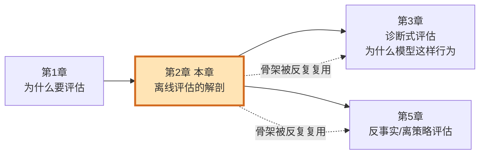
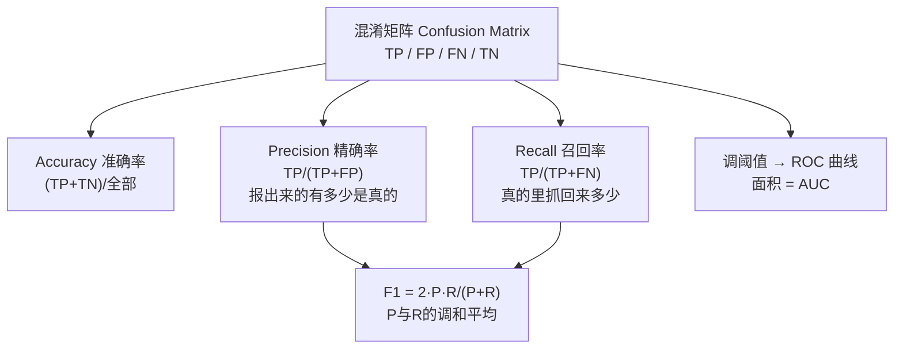
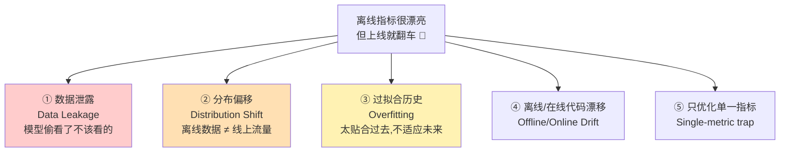
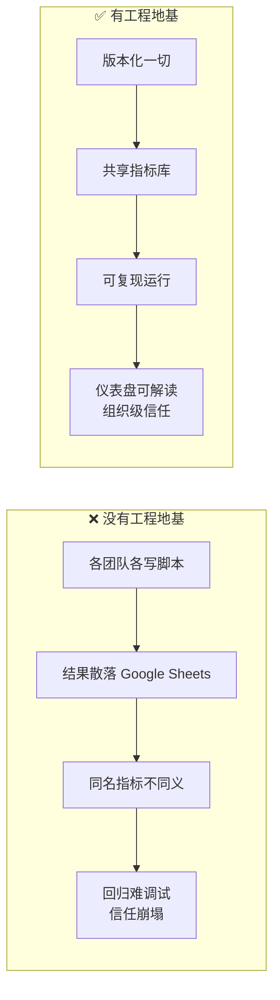

# 第 2 章 🧬 离线评估的解剖(Anatomy of an Offline Evaluation)

> 对应原书:*AI Model Evaluation (MEAP)*,Leemay Nassery,第 2 章(PDF 第 53–94 页)。
> 本篇是《AI Model Evaluation 逐章精讲》第 2 篇。

---

## 🗺️ 本章地图

在第 1 章里,我们弄清了"评估(evaluation)是什么、为什么它比模型本身更能决定产品成败",并把评估分成了**离线(offline)**与**在线(online)**两大世界。这一章,我们要拿起手术刀,把**一次离线评估**从里到外解剖开——看清它的每一块骨骼、每一条神经。

读完这一章,你将能够:

- 🦴 **说清一次离线评估由哪几部分组成**:数据(data)→ 设计(design)→ 指标/输出(metrics/outputs),以及贯穿其中的**标签(labels)**与**切分(splits)**;
- 📊 **为不同任务挑对指标**:分类(classification)、回归(regression)、排序(ranking)三大家族的核心指标,以及所有分类指标的"母体"——**混淆矩阵(confusion matrix)**;
- 🪤 **识别并躲开三大致命陷阱**:**数据泄露(data leakage)**、**分布偏移(distribution shift)**、以及**过拟合历史数据(overfitting historical data)**;
- 🏗️ **理解工程视角**:版本化(versioning)、可复现(reproducibility)、共享指标库为什么是"评估能不能被信任"的地基。

一句话定位:**第 1 章告诉你"评估这件事存在且重要",第 2 章告诉你"一次评估长什么样、怎么拆、哪里会骗你"。** 后面第 3 章(诊断评估)、第 5 章(反事实评估)都建立在本章这套"输入—设计—输出"骨架之上。



---

## 2.1 🔬 先建立"第一性原理":离线评估到底在做什么?

> 🔬 **第一性原理小框**
> 剥掉所有术语,一次离线评估只做一件事:
> **拿"模型的预测(prediction)"去和"我们认为的正确答案(ground truth / label / proxy)"做对比,把这种对比压缩成一个可比较的数字(metric)。**
> 「离线」的含义是:**不把模型推给真实用户**,而是用**历史数据(historical data)**回放。所以它的最大优点是"快、便宜、可重复、无风险",最大缺点是"用过去的数据,永远不能 100% 代表未来的真实用户"。

原书用一句话总结这门手艺的位置:

> Offline evaluations can tell you whether a model **appears to meet** the objective you gave it, but they **do not decide what the objective should be** in the first place.
> (离线评估能告诉你模型**看起来是否达成了**你给它的目标,但它**不负责决定目标本身应该是什么**。)

这句话很关键。目标(objective)来自产品需求、用户研究、领域知识、业务目标、安全要求、工程约束——离线评估只是**在既定目标下的一次体检**,不是"定目标"的人。

📌 对 LLM / Agent 系统尤其重要:在评估一个 Agent 之前,团队必须**先想清楚**——它被允许做哪些任务、能调用哪些工具、必须遵守哪些约束、什么时候该升级(escalate)给人类、哪些失败模式是绝对不可接受的。**离线评估是去检验这些要求有没有被满足,而不是替你想这些要求。**

---

## 2.2 🦴 一次离线评估的解剖:输入 → 设计 → 输出

原书 2.2 节给出了最核心的骨架。就像一次 A/B 测试有它的必备零件(假设 hypothesis、护栏指标 guardrail metric、样本量 sample size……),一次离线评估也有它的**三大构件**:

| 构件 | 英文 | 一句话本质 | 电影推荐例子 |
|---|---|---|---|
| **输入** | Input / Data | 喂进评估的一切原料 | 用户点击/观看/评分日志、电影元数据 |
| **设计** | Design | 中间的"框架"——怎么评、评什么、怎么算 | 用 Precision@10、按冷启动用户切片 |
| **输出** | Output / Metrics | 算出来的数字 + 可行动的洞察 | precision=0.6、发现小众用户召回差 |

用一张图把它串起来:

```mermaid
flowchart LR
    subgraph IN[📥 输入 Input]
    D1[历史交互数据<br/>historical interactions]
    D2[真实标签<br/>ground truth labels]
    D3[上下文元数据<br/>contextual metadata]
    end
    subgraph DE[⚙️ 设计 Design]
    S1[选指标<br/>Precision@K / NDCG]
    S2[定评估单元<br/>user / query / session]
    S3[定基线 baseline]
    S4[定场景 & 切分<br/>cold-start / 切片]
    S5[采样策略 & 置信度]
    end
    subgraph OUT[📤 输出 Output]
    O1[性能指标<br/>precision / recall / AUC]
    O2[诊断洞察<br/>bias / coverage / robustness]
    O3[可视化报告 / 仪表盘]
    end
    IN --> DE --> OUT
    OUT -.反馈:要不要迭代/上线.-> DE
```

### 2.2.1 📥 输入:数据是地基(Data as input)

> 原书原话:**Data is the foundation—without it, there's no way to run an offline evaluation.**(数据是地基——没有它,离线评估根本无从谈起。)

数据在离线评估里,不止一个身份。原书特别提醒:**数据远不只是"评估的输入"**,它同时是训练的燃料、特征工程的原料、超参调优的依据、生产监控与漂移检测(drift detection)的信号源。它是**贯穿整个机器学习生命周期的燃料**。

原书把评估里常用的数据分成三大类:

**① 历史交互数据(historical interaction data)** —— 记录"用户在产品里干了什么":点击(clicks)、曝光(impressions)、观看(watches)、购买(purchases)、收藏(saves)、评分(ratings)、交易(transactions)。

> ⚠️ **常见坑:交互信号是"代理(proxy)",不是"真理(ground truth)"**
> 原书一针见血:**"用户点了一部电影,可能只是因为它被放在了显眼的位置,而不是因为它是最好的推荐。"**(A user may click on a movie because it was prominently placed, not necessarily because it was the best possible recommendation.)
> 换句话说,点击 ≠ 喜欢。把交互信号当成完美的偏好度量,是离线评估最隐蔽的偏差来源之一。解读离线指标时,永远要记得这层"代理性"。

**② 结构化日志(structured logs)** —— 当你要做**回放(replay)、反事实(counterfactual)、决策策略**分析时格外重要。它包含:
- **动作—结果对(action-outcome pairs)**:系统采取的动作 + 由此产生的结果;
- **倾向分(propensity scores)**:在给定上下文下,日志策略(logging policy)选中某个动作/推荐的概率估计;
- **上下文元数据(contextual metadata)**:设备类型、会话细节、地理位置、时间段等。

这类日志是第 5 章"反事实评估"(如逆倾向加权 IPS、双重稳健估计 doubly robust)的原料。

**③ 有标签 / 有判定的数据(labeled or judged data)** —— 当你要**直接把模型预测和已知正确答案比对**时用的"参考标签 / 真值"。比如图像标注"狗 vs 猫"、人工标注"这个生成答案是否正确/有依据/安全"。

> ⚠️ **常见坑:标签也不完美**
> 原书强调:**"标签取决于任务怎么定义、谁来标、分歧怎么裁、标签是否反映真实产品目标。"** 所以——**进入评估的数据质量,和你从中算出的指标同等重要。** 一个建立在脏标签上的漂亮 F1,毫无意义。

**LLM / Agent 系统的数据长什么样?** 原书专门指出,它们的输入"形态不同":
- RAG 聊天机器人评估需要:原始用户问题 + 检索到的文档(retrieved documents)+ 生成的答案 + 一份"答案是否 grounded 于检索上下文"的人工或 LLM 判定;
- Agent 评估需要:任务指令 + 可用工具清单 + 工具调用序列(sequence of tool calls)+ 中间推理/规划轨迹(traces)+ 最终输出 + 任务是否成功完成。

> 💡 **实战 / 面试高频:隐私合规是数据卫生的一部分**
> 原书用一整个 Note 提醒:用日志数据(尤其是 location、device id、session 这类上下文元数据)前,**必须先评估隐私风险**。GDPR(欧盟)、CCPA(加州)只会越来越严。做法:确保日志已**匿名化(anonymized)或聚合(aggregated)**,遵守组织的数据治理规范。
> 面试话术:"Good offline evaluation starts with good data hygiene." 好的离线评估,始于好的数据卫生。

### 2.2.2 ⚙️ 设计:让评估从"随手一跑"变成"可复现的工程"

原书说得很重:**"一个精心设计的离线评估,不是一次随机实验(random experiment),而是一个刻意的、可重复的过程(deliberate and repeatable process)。"**

设计阶段要回答 6 个关键问题(原书 2.2.2):

| # | 问题 | 英文 | 你要想清楚的事 |
|---|---|---|---|
| 1 | 你到底在评什么? | What are you trying to evaluate? | 性能?公平性?鲁棒性?groundedness?工具调用正确率?任务完成? |
| 2 | 评估单元是什么? | What is the unit of evaluation? | user / query / session / 推荐列表 / 单条回复 / 整段对话 / 一个完成的任务 |
| 3 | 和谁比? | What baseline? | 旧模型 / 启发式规则 / 已知参考点。**没有 baseline 的指标几乎没意义** |
| 4 | 用哪些指标? | What metrics? | 必须**直接对齐目标**(见 2.3) |
| 5 | 测哪些场景? | What scenarios? | 冷启动、稀疏历史、罕见事件、对抗输入、多步工作流、工具调用失败…… |
| 6 | 多好才算"够好"? | What is good enough to act on? | 定**阈值 / 决策规则**:多大提升才有意义?护栏跌多少不可接受? |

> 🔬 **第一性原理:为什么"评估单元(unit of evaluation)"这么重要?**
> 同一批数据,按 **per-user** 算和按 **per-session** 算,结果可能天差地别。一个重度用户如果贡献了 1000 次会话,按 session 平均时他会"淹没"999 个轻度用户的声音。**先想清楚"一行代表什么"**,再算指标——否则你算出的是一个自己都解释不清的加权平均。

**可复现性(reproducibility)是设计阶段的灵魂。** 原书反复强调(它自己都说"你会在本章看到 versioning 被提到很多次,因为它就是这么重要"):**一切重要的东西都要版本化(versioned)并有文档**——
> 数据集、模型版本、代码、指标定义、prompt、评分细则(rubric)、裁判模型(judge model)、检索索引(retrieval index)、特征管线(feature pipeline)、评估配置。

> 💡 **实战:工具选型**
> 原书点名两个业界常用工具:
> - **DVC(Data Version Control)**:像 Git 一样版本化训练数据、模型二进制(artifact)、管线阶段;
> - **MLflow**:开源的 ML 生命周期管理平台,管实验追踪与模型版本。
> 缺了这层严谨性,评估会变得"不一致",而不一致会**侵蚀团队对结果的信任**——这正是 2.4 节所有陷阱的根源。

### 2.2.3 📤 输出:指标是"透镜",不是"分数"

原书用了一个很妙的说法:**"指标不只是数字,它们是一面透镜(a lens),让你看清系统在你所测试的条件下如何行为。"**

输出不止是几个数字,它包含:量化指标、诊断切片(diagnostic slices)、模型对比、失败类别(failure categories)、人工复核标签、LLM-as-a-judge 分数、仪表盘、以及"下一步该干嘛"的建议。

原书按任务类型给出了"该用什么指标"的速查:

| 任务类型 | 推荐指标 | 目的 |
|---|---|---|
| **排序 Ranking** | NDCG、Precision@K、Recall@K、MRR | 相关项有没有排在靠前的位置 |
| **分类 Classification** | Accuracy、Precision、Recall、F1、AUC | 标签分对了没有 |
| **LLM 特性** | relevance、groundedness、factuality、instruction following、toxicity、answer completeness | 生成质量与安全 |
| **Agent 系统** | task completion rate、tool-call accuracy、constraint adherence、escalation quality、latency、cost | 可靠性与成本 |

---

## 2.3 📊 指标详解:分类 / 回归 / 排序三大家族

> 原书 Chapter 2 把这些指标当"已知词汇"快速带过。本节我们从**零基础**把它们讲透,这是评估工程师的核心内功,也是**面试必考**。所有对比表都会配上"是什么 / 为什么 / 怎么用 / 代价"。

### 2.3.1 🎯 一切分类指标的母体:混淆矩阵(Confusion Matrix)

**是什么。** 混淆矩阵是一张 2×2(二分类)表格,把"模型说什么"和"真相是什么"交叉,分成四格。它是 accuracy / precision / recall / F1 / AUC **全部**从中推导出来的"母体"。

|  | 真相=正(Positive) | 真相=负(Negative) |
|---|---|---|
| **模型预测=正** | ✅ TP(真阳性 True Positive) | ❌ FP(假阳性 False Positive,"误报") |
| **模型预测=负** | ❌ FN(假阴性 False Negative,"漏报") | ✅ TN(真阴性 True Negative) |

> 🔬 **第一性原理:两类错误的代价天差地别**
> - **FP(误报)**:健康的人被诊断成有病 → 虚惊、浪费复查。
> - **FN(漏报)**:有病的人被判成健康 → 可能致命。
> **没有一个"万能指标"能同时管好两类错误**,这正是为什么我们需要一整套指标,并根据业务决定"哪类错误更不能忍"。



**四个核心公式(务必背熟):**

$$
\text{Accuracy} = \frac{TP + TN}{TP + TN + FP + FN}
$$

$$
\text{Precision} = \frac{TP}{TP + FP} \qquad \text{Recall} = \frac{TP}{TP + FN}
$$

$$
F_1 = 2 \cdot \frac{\text{Precision} \cdot \text{Recall}}{\text{Precision} + \text{Recall}}
$$

**一个具体数值例子**(体检 1000 人,真实 100 人患病):

| 指标 | 计算 | 结果 | 怎么读 |
|---|---|---|---|
| 混淆矩阵 | TP=80, FN=20, FP=50, TN=850 | — | 抓对 80 个病人,漏 20,误报 50 |
| Accuracy | (80+850)/1000 | **0.93** | 看起来很高,但有陷阱(见下) |
| Precision | 80/(80+50) | **0.615** | 报"有病"的人里,只有 61.5% 真有病 |
| Recall | 80/(80+20) | **0.80** | 真病人里抓回了 80% |
| F1 | 2·0.615·0.8/(0.615+0.8) | **0.696** | P 与 R 的综合 |

> ⚠️ **常见坑:类别不平衡下,Accuracy 会骗人(Accuracy Paradox)**
> 原书原话:**"只看不平衡分类里的 accuracy,可能会掩盖少数类的糟糕召回(hide poor recall for minority classes)。"**
> 上例里若模型**永远预测"没病"**,accuracy = 900/1000 = **0.90**,看着很棒,但 Recall = 0,一个病人都没抓到!这就是为什么**在不平衡场景要用 Precision/Recall/F1,而不是 accuracy**。

### 2.3.2 🎚️ 阈值、ROC 与 AUC

**为什么需要 ROC/AUC?** 分类器通常输出一个**概率**(比如"0.73 的概率有病"),而不是直接给"有/无"。要变成"有/无",必须选一个**阈值(threshold)**。阈值调高 → precision 升、recall 降;阈值调低 → recall 升、precision 降。**这是一个此消彼长(trade-off)。**

- **ROC 曲线**:横轴 FPR = FP/(FP+TN),纵轴 TPR = Recall,把所有阈值扫一遍画出的曲线。
- **AUC(Area Under Curve)**:ROC 曲线下面积,范围 [0,1]。**直观含义**:随机取一个正样本和一个负样本,模型给正样本更高分的概率。0.5 = 瞎猜,1.0 = 完美,**AUC 与阈值无关**,所以特别适合比较两个模型的"整体排序能力"。

| 指标 | 是什么 | 什么时候用 | 代价/局限 |
|---|---|---|---|
| Accuracy | 整体对的比例 | 类别均衡时的快速概览 | 不平衡时误导 |
| Precision | 报正的准不准 | FP 代价高(如垃圾邮件误杀) | 忽略漏报 |
| Recall | 正的抓得全不全 | FN 代价高(如癌症筛查) | 忽略误报 |
| F1 | P/R 的调和平均 | 需要平衡 P 与 R | 不含 TN 信息 |
| AUC | 与阈值无关的排序能力 | 比较模型、不平衡数据 | 对极端不平衡也可能偏乐观(可改用 PR-AUC) |

### 2.3.3 📈 回归指标(Regression Metrics)

当标签是**连续数值**(预测评分、时长、价格、GMV),用回归指标。核心是"预测值 $\hat{y}$ 与真值 $y$ 差多少"。

$$
\text{MAE} = \frac{1}{n}\sum_{i=1}^{n}|y_i - \hat{y}_i| \qquad
\text{MSE} = \frac{1}{n}\sum_{i=1}^{n}(y_i - \hat{y}_i)^2
$$

$$
\text{RMSE} = \sqrt{\text{MSE}} \qquad
R^2 = 1 - \frac{\sum (y_i-\hat{y}_i)^2}{\sum (y_i-\bar{y})^2}
$$

| 指标 | 是什么 | 特点 / 代价 |
|---|---|---|
| **MAE** 平均绝对误差 | 平均"差了多少" | 对异常值(outlier)不敏感、稳健、单位直观 |
| **MSE** 均方误差 | 差的平方的平均 | **重罚大误差**,但单位是"平方",不直观 |
| **RMSE** 均方根误差 | MSE 开根号 | 单位回到原量纲,对大误差仍敏感,最常用 |
| **R²** 决定系数 | 模型比"永远猜均值"好多少 | 1=完美,0=和瞎猜均值一样,可为负(比瞎猜还差) |

> 💡 **实战:MAE vs RMSE 怎么选?**
> - 数据里有**离群点且你不想被它主导** → 用 **MAE**;
> - **大误差的业务代价远高于小误差**(比如预测配送时长,差 60 分钟比差 6 分钟严重得多) → 用 **RMSE/MSE**,因为它对大误差施加平方惩罚。

### 2.3.4 🏆 排序指标(Ranking Metrics)—— 推荐/搜索的主战场

原书的电影推荐例子(2.2.3)正是排序任务。排序指标关心的**不是"预测对不对",而是"相关的东西有没有排在靠前的位置"**——因为用户只看前几个。

#### Precision@K / Recall@K

**Precision@K**:Top-K 推荐里,有多少是相关的。

$$
\text{Precision@}K = \frac{|\{\text{Top-}K \text{ 中相关的项}\}|}{K}
$$

**Recall@K**:所有相关项里,有多少落进了 Top-K。

$$
\text{Recall@}K = \frac{|\{\text{Top-}K \text{ 中相关的项}\}|}{|\{\text{全部相关项}\}|}
$$

#### 原书 Listing 2.1:逐行讲解 Precision@K

原书给出了计算单个用户 Precision@K 的简化代码(完整代码在 `https://github.com/lnassery/ai-evaluations`)。我们**逐行**拆解:

```python
def calculate_precision_at_k(user_id, test_data, recommendations, k):
    """Calculate precision@k for a single user."""
    # ① 从测试集里,取出"这个用户真正喜欢的电影"(评分≥4 视为相关)
    actual_movies = set(
        test_data[
            (test_data["user_id"] == user_id) &   # 只看这个用户
            (test_data["rating"] >= 4)             # 高分=相关(relevant)
        ]["movie_id"]
    )

    # ② 如果这个用户在测试集里没有任何相关电影,无法计算,返回 None
    if not actual_movies:
        return None  # No relevant test data for this user

    # ③ 取模型给出的 Top-K 推荐电影 id
    recommended_movies = [movie_id for movie_id, _ in recommendations[:k]]

    # ④ 命中数 = 推荐集合 ∩ 真实喜欢集合 的大小
    hits = len(set(recommended_movies) & actual_movies)

    # ⑤ Precision = 命中数 / min(k, 实际推荐数)
    precision = hits / min(k, len(recommended_movies)) if recommended_movies else 0

    return precision
```

**逐行中文精讲:**

1. **`actual_movies`(第①块)**:用**评分 ≥ 4** 作为"相关(relevant)"的定义。这是本例的**标签(label)定义**——原书特别强调,真实系统里"相关"的定义可能更精细(是否观看、是否收藏、是否完成一次有意义的互动)。**"相关"怎么定义,直接决定这个指标测的是什么。**
2. **`if not actual_movies`(第②块)**:防御性编程。用户在测试集里没有相关电影,分母无从谈起,直接返回 `None`(而不是 0,以免污染后续平均)。这是**"评估单元该不该纳入统计"**的经典处理。
3. **`recommended_movies`(第③块)**:`recommendations` 是 `(movie_id, score)` 列表,已按分数降序;`[:k]` 取前 K 个;列表推导只留 `movie_id`。
4. **`hits`(第④块)**:两个集合取**交集(`&`)**,长度就是"推荐对了几个"。用 `set` 是为了 O(1) 查找、去重。
5. **`precision`(第⑤块)**:分母用 `min(k, len(recommended_movies))`——防止推荐数不足 K 时分母虚高;末尾 `if recommended_movies else 0` 防除零。

> ⚠️ **原书警告框:Don't optimize for just one number(别只优化一个数字)**
> 原书紧接着这段代码给出了本章最重要的告诫之一:**"Precision 能让你的模型在离线看起来很强,但它没有捕捉推荐体验的所有重要品质。一个模型可以在提升 Precision@K 的同时,让推荐变得更窄、更重复、对发现(discovery)更没用。"**
> 所以真实产品里,你还要同时关心:**多样性(diversity)、新颖性(novelty)、覆盖度(coverage)、用户满意度、延迟(latency)、系统性能**。原书建议:除了 Precision@K,再加 **NDCG** 来考虑"相关项排在第几位"。

#### NDCG:为什么位置很重要

**是什么。** NDCG(Normalized Discounted Cumulative Gain,归一化折损累积增益)是排序指标里最"讲究"的一个:它不仅在乎"相关的有没有进 Top-K",还在乎"相关的排在**第几名**"——因为排第 1 和排第 10 的价值天差地别。

$$
\text{DCG@}K = \sum_{i=1}^{K} \frac{rel_i}{\log_2(i+1)} \qquad \text{NDCG@}K = \frac{\text{DCG@}K}{\text{IDCG@}K}
$$

- $rel_i$ 是排在第 $i$ 位那项的相关性分数;
- $\log_2(i+1)$ 是**位置折损(discount)**:排得越靠后,分母越大,贡献越小;
- IDCG 是"理想排序(把最相关的都排最前)"下的 DCG,用来**归一化到 [0,1]**,让不同 query 之间可比。

| 排序指标 | 在乎顺序? | 在乎相关性等级? | 典型用途 |
|---|---|---|---|
| Precision@K | ❌ 只看进没进 Top-K | ❌ 相关就算 1 | 快速看"Top-K 干净不干净" |
| Recall@K | ❌ | ❌ | 看"漏没漏掉相关项" |
| **MRR** | ✅ 只看第一个相关项位置 | ❌ | 问答/单一正确答案 |
| **NDCG@K** | ✅ 每个位置都折损 | ✅ 支持分级相关性 | 搜索/推荐排序质量金标准 |

> 💡 **面试高频:"Precision@K 和 NDCG 有什么区别?"**
> 标准答案:**Precision@K 是"集合指标",只问 Top-K 里有几个相关,不管顺序;NDCG 是"顺序指标",把相关项排得越靠前给分越高,且支持分级相关性(不只是 0/1)。** 一句话:把最相关的排最前,NDCG 会奖励你,Precision@K 无动于衷。

---

## 2.4 🪤 离线评估的常见陷阱(原书 2.3 节的精华)

原书把"真实世界里离线评估会怎么骗你"讲得非常透。这些陷阱在传统 ML、推荐、LLM、Agent 系统里都会出现。我们挑出**本章要点点名的三大陷阱**——数据泄露、分布偏移、过拟合——深入讲,并串上原书的其他几个。



### 2.4.1 🩸 陷阱一:数据泄露(Data Leakage)—— 最危险、最隐蔽

**是什么。** 原书定义:**数据泄露是"评估期(evaluation period)的信息,意外地影响了训练、特征生成、prompt 构造或标签创建"。** 结果是——**模型在评估时"看到了它本不该看到的信息",于是离线指标虚高。**

> 🔬 **第一性原理:泄露 = 时间旅行**
> 离线评估的本质是"用过去预测未来"。泄露就是模型偷偷用了**未来**的信息去预测未来——那当然准得离谱,但一旦真实上线(未来还没发生),这些信息不存在,模型立刻打回原形。

原书给了三个具体形态:

| 场景 | 泄露怎么发生 | 后果 |
|---|---|---|
| **推荐系统** | 训练特征里混入了"用户在评估截止点**之后**看的电影" | 离线指标人为地高 |
| **LLM / 基座模型** | 评测用的 benchmark 在基座模型预训练时**已公开** → 模型可能预训练时就见过这些题 | 离线跑分不反映真实泛化;这类泄露"住在你自己的评估管线上游",甚至不在你掌控中 |
| **特征管线** | 某个特征用了"晚于评估截止点"的信息计算 | 隐蔽,难查 |

**原书给的防泄露手段(务必记住):**

1. **强制"时间切分(temporal split)"**,严格镜像生产里事件发生的顺序:**用过去训练,在未来评估(train on past, evaluate on future)**;
2. **审计特征构造管线**,确保没有任何特征用了晚于评估截止点的信息;
3. **定期 diff 训练集和评估集**,检查重叠,并把这个检查**做成 CI 里的自动门禁(automated gate)**,而不是靠人手动查。

> ⚠️ **原书的"泄露检测小贴士(Leakage Detection Tip)":异常好就是危险信号**
> **"如果你的离线指标好得反常——尤其是在没有重大架构改动的情况下,相比旧基线出现了显著跳升——把它当红旗(red flag),先审计你的数据管线,再下任何结论。反常的高性能,往往是模型看到了它不该看到的东西。"**
> 💡 面试话术:"Unexpectedly high performance is often a sign that the model has seen something it shouldn't have."

### 2.4.2 🌊 陷阱二:分布偏移(Distribution Shift)/ 评估不泛化

**是什么。** 原书 2.3.4 节标题叫 "Evaluations that don't generalize"(不泛化的评估)。核心问题:**离线评估用的数据集,没能代表真实世界用户/场景/生产条件的全貌。**

> 原书原话:**"一个模型在某个特定用户群、时间段、地理区域、语言、设备类型或产品界面上测起来很棒,不代表它在生产中跨更广的上下文也能撑住。"**

原书有一个极其重要的洞察,**特别容易考**:

> ⚠️ **常见坑:这**通常不是指标的错,而是"指标算在了什么数据上"的错**
> **"This isn't necessarily a problem with the metric itself; it is often a problem with what the metric is being computed on."**
> 当 accuracy 从离线掉到生产,看起来像"指标失灵",**但大多数情况下指标在忠实地干活,它只是如实反映了它所跑的数据的局限**。如果评估集不够多样,指标会给你一种**虚假的信心(false sense of confidence)**。

**怎么办(原书方案):** 评估集要**覆盖不同用户群、地理、时间段、产品界面和边界情形**;用**分段评估(segmented evaluation)、场景压测(scenario-based stress testing)、反事实分析(counterfactual analysis)** 在更真实/多样的条件下测。

> 💡 **实战:用 PSI 检测采样漂移(原书专门开框)**
> **PSI(Population Stability Index,群体稳定性指数)** 衡量两个数据集之间(比如训练数据 vs 生产流量)**分布偏移了多少**。
> - **高 PSI = 早期预警**:你的离线数据可能已经不再反映真实世界,**甚至在性能下降之前就能发现**。
> - **但**原书也给了边界:**"PSI 只告诉你分布变了,不告诉你这个变化是否有害、标签是否变了、性能是否真的退化。"** 它是早期信号,不是"模型错了"的证据,要和性能检查、分段分析、领域知识配合用。

**PSI 经验阈值**(业界常用,书未给公式但概念一致):

| PSI 值 | 含义 | 行动 |
|---|---|---|
| < 0.1 | 分布基本稳定 | 无需处理 |
| 0.1 – 0.25 | 中等偏移 | 关注、调查 |
| > 0.25 | 显著偏移 | 报警,离线数据可能已不可信 |

### 2.4.3 🕰️ 陷阱三:过拟合历史数据(Overfitting Historical Data)

**是什么。** 原书 2.3.5 节:模型**太专注于训练/测试数据里的特定模式(包括噪声和无关细节)**,以至于在新的、没见过的数据上表现很差。**"太调教得贴合过去,无法适应变化。"**

> ⚠️ **原书的"过拟合红旗"**
> **"一个常见红旗是:离线评估显示高 precision/accuracy,但线上互动指标持平甚至下降。"** 这种脱节可能意味着:过拟合了历史怪癖、离线指标和产品目标没对齐、评估集过期、或生产实现和离线不一致。看到这信号,回头检查:**数据采样策略、指标选择、时间切分、正则化、离线—在线对齐。**

**原书给的对策 + 重要的"然而":**

- 用**时间切分(temporal splits)** 评估模型适应变化的能力;
- 用 **OOD(out-of-distribution,分布外)性能**衡量鲁棒性;
- **定期刷新历史数据**,让它跟上近期趋势。

> 🔬 **第一性原理:"多久算历史?"取决于你的领域(原书精彩收尾)**
> 原书诚实地补了一句:**"然而(每次谈离线评估,总有一个'然而',对吧?),时间切分和 OOD 指标并非放之四海皆准。"** 什么叫"历史"、什么叫"分布外",**高度依赖你的领域节奏**:
> - **电影推荐**:偏好演化慢,一年的数据可能够用;
> - **新闻 / 电商**:变化快,可能需要**短得多的时间窗**。
> 关键是:**让你的评估设置,对齐你所在场景的变化速度。**

### 2.4.4 其他三个"团队/工程"陷阱(原书 2.3.1–2.3.3、2.3.6)

原书还点了几个更偏"人和系统"的坑,面试和实战都常见,速记如下:

| 陷阱 | 原书节 | 本质 | 对策 |
|---|---|---|---|
| **缺乏信任(Lack of trust)** | 2.3.1 | 工程师/干系人不信离线结果,觉得"永远替代不了 A/B" | 摆清"离线不是替代 A/B,而是让 A/B 更成功";定期比对离线与在线结果 |
| **可接受结果无指引(Limited guidance)** | 2.3.2 | 不知道"多样性掉 2% 换 precision 涨 5% 值不值",决策停摆 | 由 PM+DS+Eng **共同定阈值**;区分"可交易指标"与"护栏指标(guardrail)"(安全/隐私/公平/延迟/合规不可轻易牺牲) |
| **与生产系统的摩擦(Production friction)** | 2.3.3 | 离线/在线用不同语言、格式、prompt、检索索引 → 上线要重写代码 → **静默失败(silent failure)** | **标准化工具、共享库**,离线在线用同一套逻辑;prompt/检索配置/工具定义/模型版本都要版本化 |
| **指标难解读(Interpretation)** | 2.3.6 | NDCG、IPS、groundedness 对非技术干系人像天书 | 翻译成产品语言:不说"NDCG +3%",说"新模型把以前相关的项排得更靠前了";多用图表/仪表盘 |

> 💡 **实战:原书举的经典"静默失败"故事**
> 一个模型离线表现极好,关键特征是 `user_local_time`,你**假设它总是有值**。上线 A/B 几周后,转化率悄悄下滑。调试良久才发现:一个**上游数据管线(由另一个团队维护)** 改了逻辑,让 `user_local_time` 间歇性返回 `null`。因为模型逻辑没设计处理 null,它在生产里开始**行为异常**。离线评估从没抓到这个问题——因为它跑在**一份干净、完全填充的历史数据**上,而这份数据没反映线上不断演化的数据质量。
> **教训:离线/在线代码漂移(offline/online code drift)是 ML 系统最常见的静默失败源之一。**

---

## 2.5 🏗️ 工程视角:让评估"能跑、可信、可复现、可扩展"

原书每章都有 "Engineering Considerations" 一节,理由很硬核:**"没有扎实的工程设计与实现,离线评估只是理论(remains theory)。工程,才是把评估策略变成团队真能跑、能信、能复用、能规模化的东西。"**

原书引用了那篇奠基性论文——**《Hidden Technical Debt in Machine Learning Systems》(NIPS 2015)**——提醒我们:ML 系统里有独特的技术债(依赖、纠缠、系统复杂度),而**工程常常被当成"评估的事后补丁(afterthought)"**。原书吐槽了一个所有工程师都熟悉的画面:

> "随手跑个脚本、加点临时日志算个离线指标……用不了多久,你就会看到工程师们用**不一致的方式**重复评估、把结果**散落在各种 Google Sheets 里**、靠**记数据库表名**来勉强理解全局。"

**一套强健的离线评估工程设置应包含(原书清单):**

- ✅ **版本化**的数据集、模型、prompt、指标、评估代码(**Versioning is the anchor for reproducibility**);
- ✅ **日志框架**,在正确的粒度捕获正确的数据;
- ✅ **可靠的数据管线**,持续喂给评估数据集;
- ✅ **共享的指标库 / 评估框架(shared metric library)**;
- ✅ **可复现的评估运行**,输出可追溯;
- ✅ **仪表盘 / 报告**,让结果可解读。

### 跨团队扩展:一个"同名不同义"的经典难题

原书 2.4.1 用了个绝妙比喻:在大组织里推广离线评估,**"就像让所有人统一点咖啡——每个人都有自己的偏好"**。

真正的痛点是**一致性(consistency)**:

> ⚠️ **常见坑:两个团队都报 "Precision@K",但"相关"的定义不同、K 不同、过滤逻辑不同 → 结果根本不可比。**
> 原书的解药:**共享指标库 / 评估注册表(evaluation registry)**。目标**不是消灭灵活性,而是——"当大家用同一个指标名字时,他们指的是同一件事(they mean the same thing)。"**

原书还点名了几个开源可复用框架:推荐领域的 **RecBole**、**Elliot**(排序/多样性/新颖性指标管线);PyTorch 生态的 **TorchRec**、**PyTorch Lightning**(配自定义指标日志模块)。同时诚实提醒:**最佳实践库会演化,但"严谨评估"这个底层策略永不过时。**



---

## 📌 本章小结

把这一章拧成几句话,方便你回顾与面试速答:

1. 🦴 **一次离线评估 = 输入(数据)+ 设计 + 输出(指标)**;贯穿其中的是**标签质量**、**评估单元**、**基线**、**场景切分**、**采样策略**。数据是地基,**没有数据就没有离线评估**。
2. 📥 **数据有三类**:历史交互(是 proxy 不是真理)、结构化日志(为反事实/回放服务)、有标签数据(标签本身也不完美)。**进入评估的数据质量,和你算出的指标同等重要。**
3. 📊 **指标要对齐目标**:分类看混淆矩阵衍生的 Accuracy/Precision/Recall/F1/AUC(**不平衡时别信 accuracy**);回归看 MAE/RMSE/R²(**大误差敏感与否决定 MAE vs RMSE**);排序看 Precision@K/Recall@K/MRR/**NDCG**(NDCG 兼顾位置与分级相关性)。**永远别只优化一个数字。**
4. 🪤 **三大陷阱刻进 DNA**:
   - **数据泄露** = 模型偷看未来 → 强制时间切分、审计特征、CI diff 门禁;**指标异常好 = 红旗**。
   - **分布偏移 / 不泛化** = 离线数据 ≠ 线上流量 → 分段评估 + PSI 早期预警;**问题常在"数据"不在"指标"**。
   - **过拟合历史** = 太贴合过去 → 时间切分 + OOD;**"多久算历史"取决于领域节奏**。
5. 🏗️ **工程不是事后补丁,是地基**:版本化一切、共享指标库、可复现运行、可解读仪表盘。**"当大家用同一个指标名,他们指的是同一件事。"**

> 🔬 **一条贯穿全章的第一性原理**:离线评估的全部价值,建立在"**历史数据能在多大程度上代表未来真实用户**"这个假设上。泄露、偏移、过拟合,本质上都是这个假设被以不同方式打破。**看懂这一点,你就看懂了整章。**

---

## 🔗 延伸阅读

**本书内(顺着骨架往下读):**

- 📖 **第 1 章:为什么评估比模型更重要** —— 本章"输入—设计—输出"骨架的前置背景,离线 vs 在线的世界观。
- 📖 **第 3 章:把离线评估当诊断用(Diagnostics)** —— 本章骨架的**第一次复用**:用同一套 data/design/metrics 去回答"模型**为什么**这样行为",配电影推荐的**年龄段 × 类型偏好热力图(heatmap)** 与"算法偏见 vs 行为偏好"的消融实验。
- 📖 **第 5 章:反事实 / 离策略评估(Counterfactual / Off-policy)** —— 深入本章 2.2.1 埋下的伏笔:结构化日志、倾向分(propensity)、逆倾向加权(IPS)、双重稳健估计(doubly robust),以及"随机化键(randomization keys)缺失会引入偏差"。
- 📄 **奠基论文**:《Hidden Technical Debt in Machine Learning Systems》(NIPS 2015)——本章工程视角的思想源头。
- 💻 **配套代码**:`https://github.com/lnassery/ai-evaluations`(Listing 2.1 Precision@K 的完整实现)。

**llm-action 仓库内(把评估接到推理/架构上):**

- 🔧 `llm-inference/` —— 本章的 **latency / cost** 护栏指标,正是推理服务的一等公民;把离线评估的 quality 指标与推理侧的吞吐/延迟/显存指标放在同一张多指标仪表盘上,才是完整的上线决策依据。
- 🏛️ `ai-infra-architecture/` —— 本章 2.4 节"共享指标库 / 评估注册表 / 版本化(DVC、MLflow)"对应基础设施架构中的**实验追踪与特征/数据版本化平台**;第 2 部分会展开"评估平台化"。
- 🤖 **LLM / Agent 评估专题**(仓库 `llm-eval` 类目录)—— 本章反复提到的 groundedness、instruction following、tool-call accuracy、LLM-as-a-judge,是把经典离线评估迁移到生成式系统的关键桥梁。

---

*（本篇为《AI Model Evaluation》第 2 章逐章精讲,取材自原书 PDF 第 53–94 页;分类/回归/排序指标公式与混淆矩阵部分为在忠于原书叙事的前提下,面向零基础读者的第一性原理补充。）*
