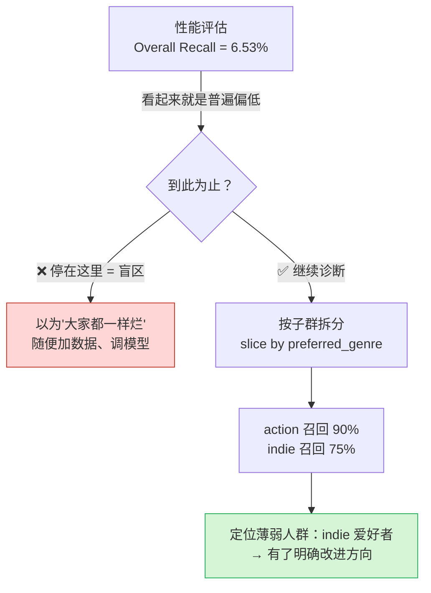
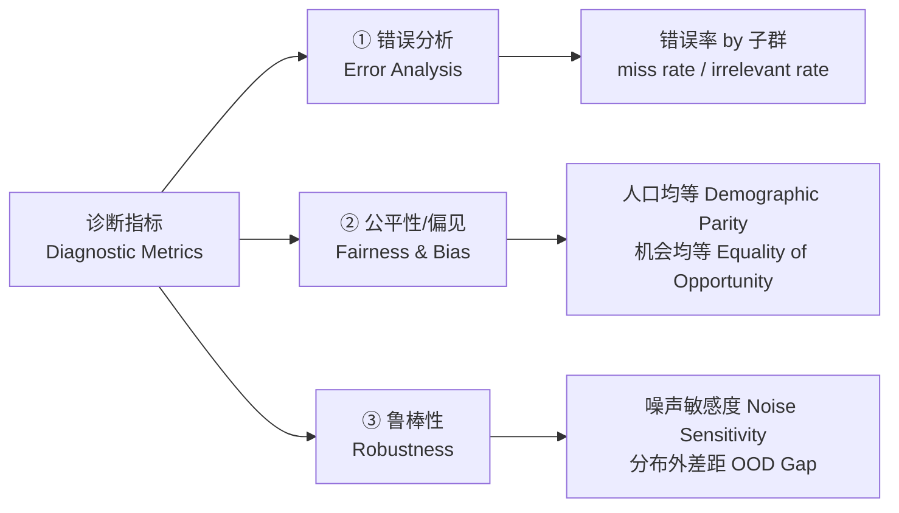
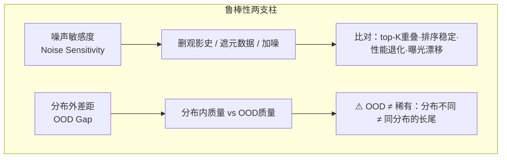
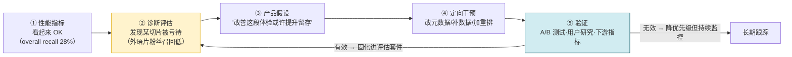
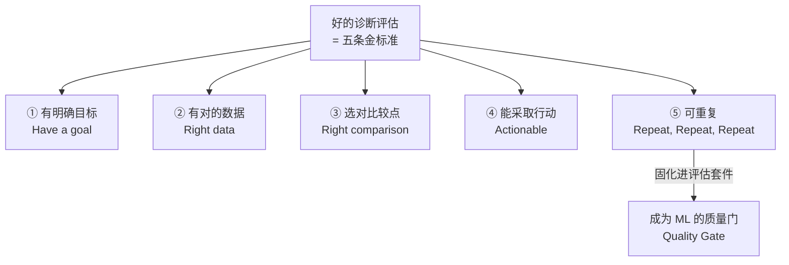

# 第 3 章 · 用离线评估做诊断（Diagnostic Offline Evaluation）

> 对应原书：《AI Model Evaluation》(MEAP, Leemay Nassery) 第 3 章，纸书第 95–136 页。

---

## 🗺️ 本章地图：这一章在全书的位置

在第 2 章里，你学会了「**性能离线评估**」（performance offline evaluation）——用 precision@K、recall@K、NDCG 这些**聚合指标**回答一个问题：**模型整体好不好？** 这就像体检报告上的那个"总分"。

本章要往前走一大步：**诊断离线评估**（diagnostic offline evaluation）。如果说性能评估告诉你「模型平均分 85 分」，诊断评估则要撬开这个平均分，问出一连串更尖锐的问题：

- 这 85 分是**均匀分布**的，还是**某些用户群被系统性地牺牲**了才凑出来的？
- 模型在**哪些切片**（slice）上垮掉？对**哪些子群**（subgroup）不公平？
- 当输入数据**变脏、变乱、变得和训练时不一样**，模型还撑得住吗？
- 发现了薄弱点之后，**下一步该改什么**？

> 一句话记住二者关系：**性能评估回答 "模型好不好"，诊断评估回答 "模型对谁不好、在什么条件下不好、以及接下来改什么"。** 二者不是替代关系，而是「体检总分」和「专科检查」的关系——缺一不可。

**读完本章你能会：**

1. 说清楚「诊断评估 vs 性能评估」的分工，并知道什么时候该切换视角；
2. 用 **切片/子群分析**（slice-based / subgroup analysis）找出模型的薄弱人群；
3. 掌握三大类诊断指标：**错误分析**（error analysis）、**公平性与偏见**（fairness & bias）、**鲁棒性**（robustness），会读会算会解释；
4. 抄得下书里的 Python 代码并**逐行**看懂；
5. 把诊断结论翻译成**产品假设**，再用在线实验去验证——形成「诊断 → 改进 → 复评」的闭环；
6. 知道一个「好的诊断评估」长什么样，以及工程上要准备哪些日志/工具/数据合规。

本章通篇用**电影推荐系统**作主线例子（因为直观好懂），但每个概念都会点明它在 **LLM / Agent** 上的对应形态。

---

## 🎬 3.0 一个开胃故事：均值在骗你

先感受一下诊断的威力。假设你负责一个电影推荐模型，跑完性能评估，拿到：

> **整体召回率 Overall Recall = 6.53%**（书中 Listing 3.2 的真实输出）

召回率 6.53% 是什么意思？——**在用户真正会看的所有相关电影里，模型只把其中约 6.53% 塞进了推荐列表**，也就是说超过 **93%** 用户会感兴趣的内容被漏掉了。

这个数字单看很吓人，但它只是**第一层**分析。真正的问题是：这 6.53% 是**所有人都一样烂**，还是**有的群体更烂**？

于是你把召回率**按子群拆开**（这就是"诊断"的核心动作）：

| 用户子群（按偏好类型切） | 召回率 Recall | 漏检率 Miss Rate | 解读 |
|---|---|---|---|
| 喜欢动作片（action） | **90%** | 10% | 服务得很好 ✅ |
| 喜欢剧情片（drama） | 82% | 18% | 尚可 |
| 喜欢喜剧片（comedy） | 80% | 20% | 尚可 |
| 喜欢独立/小众片（indie） | **75%** | **25%** | 明显偏低 ⚠️ |

> 注：书中在讲 miss rate 时给的对照例子是「indie 漏检率 25% ↔ 召回率 75%；action 漏检率 10% ↔ 召回率 90%」。这里我把它整理成对比表，帮助你一眼看出**同一个模型对不同人群的服务质量差了 15 个百分点**。

**结论**：聚合指标（那个 6.53% 或书里另一处的 28%）像一块毛玻璃，把「独立片爱好者被系统性亏待」这个事实糊住了。诊断评估就是擦掉这层玻璃的抹布。



---

## 🔬 3.1 诊断评估 vs 性能评估：第一性原理

### 3.1.1 两者回答的是不同的问题

| 维度 | 性能离线评估 Performance | 诊断离线评估 Diagnostic |
|---|---|---|
| **核心问题** | 模型整体表现好不好？ | 模型在**哪里**好、在**哪里**失败？失败**集中在哪些切片**？ |
| **看数字的方式** | 只看**聚合值**（一个 aggregate number） | 把结果按**有意义的维度拆开**看分布 |
| **常用指标** | precision@K、recall@K、NDCG | 同样的指标 + **按子群/切片 group by** |
| **典型输出** | "召回率 = 6.53%" | "action 召回 90%，indie 召回 75%" |
| **回答的角色** | 这个模型**能上线吗**？ | 上线后**谁会被亏待**、**为什么**、**怎么修**？ |
| **对应体检类比** | 体检总分 | 专科分项 + 异常定位 |

> 🔬 **第一性原理：为什么"平均"会骗人？**
> 平均值是一种**信息压缩**。把 N 个用户的表现压成 1 个数，必然丢掉「分布形状」。数学上，两个截然不同的分布可以有**完全相同的均值**：
> - 分布 A：所有人召回率都是 30%（公平但平庸）
> - 分布 B：一半人 55%、一半人 5%（不公平且危险）
>
> 二者均值都是 30%，但 B 里那 5% 的人正在被产品抛弃。**性能评估看不出 A 和 B 的区别，诊断评估的全部意义就是把这个区别揪出来。**

**关键洞察（书中原话精神）**：诊断评估**不替代**性能评估，而是**补充**它。你仍然需要聚合指标判断模型是否"广泛有用"；但你**也**需要诊断切片来判断模型是否**鲁棒、公平、和你想要的产品体验对齐**。

### 3.1.2 一个反直觉的例子：偏见 vs 正常个性化

书中提了一个很重要、也很容易踩坑的点：**当你发现不同群体的推荐不一样时，那到底是"偏见"还是"合理的个性化"？**

比如图 3.2 的实验里，作者制造了一批**合成用户**（synthetic users）：**观影行为完全相同，只改变年龄**这一个属性。如果推荐结果因为年龄而变了，那这个差异就**只能来自模型**（因为用户行为被控制住了）——这才叫偏见。

书里给了三条**实操判别技巧**，非常值得记：

| 判别技巧 | 怎么做 | 判据 |
|---|---|---|
| **① 个体 vs 群体对比** | 看推荐是贴合用户**个人观影史**，还是贴合**人群刻板印象** | 若贴合个人史 = 个性化 ✅；若违背个人史却贴合人群标签 = 偏见 ⚠️ |
| **② 受控组测试** | 造一批**偏好相同、人口属性不同**的合成用户 | 隔离出"人口属性"单独的影响 |
| **③ 特征重要度** | 看模型给 age/gender/location 等**人口特征**的权重 vs ratings/watch history 等**行为特征**的权重 | 若人口特征权重压过行为特征 → 模型在强化刻板印象，而非学个人偏好 |

> ⚠️ **常见坑：把"个性化"误当"偏见"，或反过来。**
> 生产环境里群体差异**几乎总是存在**，但差异 ≠ 偏见。正确姿势：**先用受控数据（controlled data）确认模型内在逻辑有没有 bias，再用真实数据看这些模式是不是正常使用行为的反映。** 书中反复强调：**公平性指标是"诊断信号"，不是"最终判决"（fairness metrics are diagnostic tools, not final verdicts）。** 发现差异只意味着"值得调查"，不等于"模型有罪"。

**迁移到 LLM / Agent**：同样的诊断范式照搬——
- 推荐系统问："模型是不是给某些人群过度推荐大片？"
- LLM 问："模型是不是对某些**方言、语言、用户意图**给出更低质量的回答？"
- Agent 问："在需要**多步规划**的任务上是不是失败得更多？"

输入、输出、指标各不相同，但**诊断目标一模一样：在受控条件下隔离模型行为，在它伤害用户之前搞清楚它在哪里有偏、脆弱、失准。**

---

## 📐 3.2 Show me the metrics：三大类诊断指标

书里 3.2 节把诊断指标分成三大类。我们一类一类讲透，每类都配公式、代码、数值例子。



### 3.2.1 错误分析指标（Error Analysis）

**是什么**：错误分析关注模型**在哪里、以何种方式出错**。最有用的诊断指标是 **"按子群的错误率"（error rate by subgroup）**——把模型的失败**按用户/物品/场景的有意义切片**拆开，看是不是某些群体的模型质量系统性地更差。

**基础公式**（书中图 3.7）：

$$
\text{Error Rate}_{\text{subgroup}} = \frac{\text{子群内的错误数量}}{\text{该子群的相关评估集大小}}
$$

其中「错误数量」的定义**取决于你在分析什么**：可以是假阳性（false positive）、假阴性（false negative），或两者都算。

> 💡 **实战：分类模型 vs 推荐系统，"错误"定义不同**
> - **分类模型**最好定义：预测"相关/不相关"，错误率就是预测错的比例。
> - **推荐系统**要显式说明什么算错，通常拆成两个**互补**的错误指标（这一点非常重要，面试高频）：
>
> | 错误指标 | 定义 | 与性能指标的关系 |
> |---|---|---|
> | **无关推荐率**<br/>irrelevant recommendation rate | 推荐出去的东西里，**不相关**的占比 | = **1 − precision@K**（precision 的反面） |
> | **漏检率**<br/>miss rate | 用户真正想要的东西里，**没被推出来**的占比 | = **1 − recall@K**（recall 的反面） |
>
> 为什么要拆成两个？因为**"推了不该推的"和"没推该推的"是两种完全不同的失败**，根因不同、解法也不同。单一错误率会把它们混为一谈。

#### 📝 Listing 3.3 逐行精讲：按"偏好类型"子群算错误指标

下面这段代码是书中 Listing 3.3 的完整抄录，我逐行加中文注释：

```python
# 为每个用户计算两个"错误风格"（error-style）的指标：
# 1. irrelevant_recommendation_rate = 推荐了但其实不相关的比例（precision 的反面）
# 2. miss_rate = 该推却没推出来的比例（recall 的反面）
user_errors = []

for user_id, preferred_movies in user_preferences.items():
    # 用户真正会看 / 会高分评价的电影 —— 这是"相关集合"（ground truth）
    relevant_movies = set(preferred_movies)

    # 模型给这个用户推荐的电影集合
    recommended_movies = set(
        recommendations_df[
            recommendations_df["user_id"] == user_id
        ]["movie_id"].tolist()
    )

    # 推荐里"确实相关"的部分 = 推荐 ∩ 相关（集合交集）
    relevant_recommendations = recommended_movies.intersection(relevant_movies)

    # 假阳性 False Positives：推了、但不相关 = 推荐 − 相关（集合差）
    false_positives = recommended_movies - relevant_movies

    # 假阴性 False Negatives：相关、但没推 = 相关 − 推荐
    false_negatives = relevant_movies - recommended_movies

    # 错误指标 1：无关推荐率 = 假阳性数 / 推荐总数（就是 1 - precision@K）
    #  —— 用三元表达式防止"推荐为空时除以 0"
    irrelevant_recommendation_rate = (
        len(false_positives) / len(recommended_movies)
        if recommended_movies
        else 0
    )

    # 错误指标 2：漏检率 = 假阴性数 / 相关总数（就是 1 - recall@K）
    #  —— 同样防除零
    miss_rate = (
        len(false_negatives) / len(relevant_movies)
        if relevant_movies
        else 0
    )

    # 取出用户元数据，用于后面的子群分析（这是"诊断"的关键：带上切片维度）
    user_info = users_df[users_df["user_id"] == user_id].iloc[0]

    user_errors.append({
        "user_id": user_id,
        "age_group": user_info["age_group"],
        "subscription_type": user_info["subscription_type"],
        "preferred_genre": user_info["preferred_genre"],  # ← 切片维度
        "irrelevant_recommendation_rate": irrelevant_recommendation_rate,
        "miss_rate": miss_rate,
    })

error_df = pd.DataFrame(user_errors)

# 关键一步：按"偏好类型"分组，把每个用户的错误聚合成子群错误
error_by_genre = (
    error_df
    .groupby("preferred_genre")                        # ← 就是这一行把"性能"变成"诊断"
    .agg(
        avg_irrelevant_recommendation_rate=("irrelevant_recommendation_rate", "mean"),
        avg_miss_rate=("miss_rate", "mean"),
        users=("user_id", "nunique"),                  # 每个子群多少人（后面判断可信度用）
    )
    .reset_index()
)
error_by_genre
```

**逐行到底发生了什么？**

| 代码动作 | 集合论视角 | 直觉 |
|---|---|---|
| `recommended ∩ relevant` | 交集 | 推对的部分 |
| `recommended − relevant` | 差集 → 假阳性 | 推错的（该背锅：无关推荐率） |
| `relevant − recommended` | 差集 → 假阴性 | 漏掉的（该背锅：漏检率） |
| `.groupby("preferred_genre")` | 分组聚合 | **点睛之笔**：miss rate 本是性能指标，一旦**按子群拆开**，它就变成了诊断工具 |

> 🔬 **本质：一行 `groupby` 就完成了"性能 → 诊断"的相变。** 书中原话："**Although miss rate is a performance metric, using it across segments turns it into a diagnostic tool**（虽然漏检率是性能指标，但按子群使用它就把它变成了诊断工具）。" 不需要发明新指标，只需要换个**看的粒度**。

#### 从数字到行动

假设跑出来的结果是：

| preferred_genre | avg_miss_rate | ↔ 等价召回率 | 诊断结论 |
|---|---|---|---|
| action | 10% | 90% | 服务好 |
| indie | **25%** | **75%** | 明显偏低，要查 |

发现 indie 漏检率高（召回低）后，书里列了**可能的根因**和**对应动作**：

| 可能根因 | 现象解释 | 对应改进动作 |
|---|---|---|
| **数据不平衡** | 独立片的互动样本太少 | 为欠代表的类型**多收训练样本** |
| **过度依赖热度信号** | popularity 权重太大，主流内容霸屏 | **降低热度权重** / 加类型亲和特征 |
| **特征没抓住小众偏好** | features 表达能力不足 | 加 genre-affinity 特征 |
| **排序目标不对** | ranking objective 偏向大盘 | 调排序目标 / 加 **re-ranking 重排步骤**提升长尾曝光 |

> ⚠️ **常见坑：诊断只能告诉你"哪里坏"，不能自动告诉你"为什么坏"。** 书里反复强调：高 miss rate "does not automatically prove the cause, but it tells you where to investigate"（不自动证明原因，但告诉你去哪儿查）。把诊断结论当"线索"，不要当"结案"。

> 💡 **面试高频**：面试官问"聚合指标很好但用户投诉某群体体验差，你怎么排查？"——标准答法就是这套：**按有意义的子群切片 → 拆成互补的错误指标（miss rate / irrelevant rate）→ 对比子群间差异 → 列根因假设 → 定向验证**。

### 3.2.2 公平性与偏见指标（Fairness & Bias）

**是什么**：公平性指标帮你判断模型输出在**不同用户群/物品群/切片**之间是否有**实质性差异**。当模型影响**访问、可见性、排序、用户体验**时尤其重要。

**真实教训（书中案例）**：2020 年 Twitter（现 X）的**图片裁剪算法**——决定预览缩略图显示图片的哪一部分。用户发现算法在裁剪时**偏袒某些人**。Twitter 后来自查确认存在跨人口群体的**不平等对待**：**对女性有 8% 偏向、对白人有 4% 偏向**，2021 年 5 月弃用该算法。这正是诊断性公平评估存在的意义：**在这些模式造成伤害性/排斥性体验之前，把它们暴露出来。**

书中给了两个核心公平性指标，一定要分清：

#### 指标 A：人口均等（Demographic Parity）

**问的是**：不同群体**获得"正向结果"的比率**是否相近？

关键在于**清晰定义什么是"正向结果"（positive outcome）**。在电影推荐里可以是：
- "top 10 里至少有一部大片"
- "top 10 里至少有一部长尾内容"
- "收到某个特定内容品类的推荐"

**公式**（书中图 3.8）：

$$
\text{Demographic Parity: } \quad P(\text{推荐} \mid \text{群体 A}) \;\approx\; P(\text{推荐} \mid \text{群体 B})
$$

即"A 群体拿到正向结果的概率"要约等于"B 群体拿到正向结果的概率"。若两者**差异显著**，提示模型可能没有平等对待。

#### 📝 Listing 3.4 逐行精讲：算人口均等的"差距比"

```python
# 5.1 计算"大片推荐"的人口均等（Demographic Parity）
# 人口均等衡量：不同群体是否以相近比率获得"正向结果"
# 这里"正向"= 被推荐了一部大片（blockbuster）

# 设一个"参照组"（reference group），比如 18-24 岁这一组
reference_group = '18-24'

# 取出参照组的大片推荐比率，作为分母基准
reference_rate = blockbuster_by_age[
    blockbuster_by_age['age_group'] == reference_group
]['blockbuster_ratio'].values[0]

# 对每个年龄组，算它相对参照组的"差距比"（disparity ratio）
#  disparity_ratio = 本组比率 / 参照组比率
blockbuster_by_age['disparity_ratio'] = (
    blockbuster_by_age['blockbuster_ratio'] / reference_rate
)

# 也可以看"绝对差"（absolute difference）：|本组比率 − 参照组比率|
blockbuster_by_age['absolute_difference'] = abs(
    blockbuster_by_age['blockbuster_ratio'] - reference_rate
)

print("\n各年龄组大片推荐的人口均等分析：")
print(blockbuster_by_age[['age_group', 'blockbuster_ratio', 'disparity_ratio']])
print("\n解读：disparity_ratio 越接近 1.0，说明该组与参照组的曝光越接近")
```

**怎么读这个 `disparity_ratio`？**

| disparity_ratio 取值 | 含义 | 是否有问题？ |
|---|---|---|
| **≈ 1.0** | 该组与参照组获得大片推荐的比率接近 | 曝光均等 ✅ |
| **显著 > 1.0** | 该组比参照组**更容易**收到大片 | 曝光有差异，值得查 |
| **显著 < 1.0** | 该组比参照组**更少**收到大片 | 曝光有差异，值得查 |

> ⚠️ **关键提醒**：书中反复强调——差异**本身不自动是好是坏**，取决于**产品目标、用户真实偏好、以及这个差异是预期的还是意外的**。老年组少收到大片，可能正是因为他们本来就更爱小众片（合理个性化），也可能是模型 bias。**要在"控制了用户行为/偏好之后差异仍然存在"时，才是更强的诊断信号。**

#### 指标 B：机会均等（Equality of Opportunity）

**问的是**：在那些**本来就"够格"拿到正向结果**（即确实有相关物品可推）的用户里，不同群体是否**同样有机会**拿到这个正向结果？

**人口均等 vs 机会均等的核心区别**（务必记牢，面试常考）：

| | 人口均等 Demographic Parity | 机会均等 Equality of Opportunity |
|---|---|---|
| **看谁** | **所有人** | 只看**"合格/相关"的人**（qualified users） |
| **问法** | "所有年龄组拿到大片推荐的比率一样吗？" | "在**有相关电影可推**的用户里，不同年龄组**同样可能**拿到相关推荐吗？" |
| **数学核心** | 比较各组的**正向结果率** | 比较各组的**真阳性率 TP rate**（合格者中被正确命中的比例） |
| **适用场景** | 想看**曝光差异**时 | 有**可靠相关标签**、做**个性化系统**时更合适 |
| **弱点** | 对个性化系统"太钝"——用户偏好本就不同 | 需要可靠的 relevance label |

**公式直觉**（书中图 3.9）：比较两组的真阳性率——

$$
\text{Equality of Opportunity: } \quad \frac{TP_A}{\text{合格用户}_A} \;\approx\; \frac{TP_B}{\text{合格用户}_B}
$$

> 🔬 **本质：为什么个性化系统更该用机会均等？**
> 人口均等要求"所有人正向率相同"，但**个性化系统的前提就是"人和人的偏好不同"**。硬要求人口均等，反而会强迫模型给不爱大片的人也塞大片。机会均等更聪明：它只问"**在同样有货可推的前提下，不同群体是否被同样公平地服务**"——它把"用户偏好差异"从"模型偏见"里剥离了出去。

> 💡 **一句话总结公平性**：书中金句——"**A disparity should prompt investigation**（差异应触发调查）"。发现差异后你还得追问：这是**用户偏好、数据不平衡、模型偏见、业务规则、还是产品策略**导致的？用得好，公平性指标帮团队定位"模型在哪里服务不均、哪里需要更深评估"。

### 3.2.3 鲁棒性测试指标（Robustness）

**是什么**：生产环境是个"荒野生态"（a wild ecosystem）——日志管线会断、元数据会迟到、新特征会改变用户行为、用户输入远没有训练集那么干净。鲁棒性指标衡量：**当输入数据不完美、有噪声、或和训练分布不同时，模型还能不能保持稳定和有用？** 一句话：**数据脏一点，模型还讲不讲道理？**

#### 鲁棒性指标 ①：噪声敏感度（Noise Sensitivity）

**思路**：用**真实感的方式**扰动输入，比较扰动前后的输出差异。对电影推荐可以：
- 从用户观影史里**删掉几部电影**；
- **随机遮住**一些类型元数据（mask genre metadata）；
- 轻微**改动热度分**；
- **模拟缺失评分**；
- 注入**噪声元数据**（如给类型打错标签）。

**公式**（书中图 3.10）：

$$
\text{Noise Sensitivity} = \frac{\lVert \text{模型(带噪输入)} - \text{模型(干净输入)} \rVert}{\lVert \text{模型(干净输入)} \rVert}
$$

分子 = 带噪输出和干净输出的差；分母 = 用原始输出做**归一化**，好让不同样本/不同模型版本之间可比较。

> ⚠️ **推荐系统的坑：输出是"排序列表"不是单个预测，"差异"怎么定义？** 书中给了 4 种实用口径，各测不同东西：

| 差异口径 | 测什么 | 直觉 |
|---|---|---|
| **Top-K 重叠**（top-K overlap） | 加噪前后 top10 里有多少部相同电影 | 列表**成分**稳不稳 |
| **排序稳定性**（ranking stability） | 相同电影加噪后顺序还差不多吗 | 列表**次序**稳不稳 |
| **性能退化**（performance degradation） | 加噪后 precision@K / recall@K / NDCG 掉多少 | 列表**质量**掉多少 |
| **曝光漂移**（exposure shift） | 噪声是否让模型推更多大片、更少长尾、更不多样 | 列表**分布**变没变味 |

> 🔬 **为什么鲁棒性测试往往要用不止一个指标？** 书中原话精神：一个模型可能**对小输入变化很敏感，但仍然推荐相关电影**（成分变了但质量没垮）；也可能**看起来很稳定，却一直推低质量内容**（次序稳但质量本来就烂）。所以你通常需要**两类指标**：一类看"输出变了多少"（overlap/stability），一类看"输出质量退化了多少"（precision/recall/NDCG）。

**三种典型判读**（书中例子整理）：

| 实验 | 现象 | 诊断结论 |
|---|---|---|
| 遮住用户 10% 观影史 | top10 **完全变了** + 召回**骤降** | 模型**过度依赖**少量行为数据 → 太脆 |
| 少了 1 个类型标签 | 整整**一类电影**不再被推 | 模型**太脆**（brittle），单点故障 |
| 遮一点数据 | 列表**略变**但相关性**稳定** | 模型对不完美数据**适应良好** ✅ |

#### 鲁棒性指标 ②：分布外性能差距（Out-of-Distribution / OOD Gap）

**是什么**：OOD 数据指**和训练/评估分布明显不同**的样本。在电影推荐里可能是：新地区的用户、新上线内容品类、新元数据格式、产品发布后用户行为的突变。

> ⚠️ **超高频坑：别把 OOD 和"稀有数据（rare data）"搞混！**
> 书中专门强调：**一个稀有类型不自动就是 OOD**——如果模型训练时见过这个类型，它只是长尾（long tail）的一部分，**同分布**。**OOD 的定义是"来自不同的分布"，而不是"同一分布里更小/更冷门的那部分"。** 这一条几乎是必考辨析题。

**做法**：比较模型在**分布内（in-distribution）数据**上的质量 vs 在 **OOD / 压力测试数据**上的质量。若前者好、后者差 → 你就知道模型在生产环境会在哪里翻车。对应动作：补更有代表性的训练数据、改善元数据覆盖、加更强的兜底逻辑（fallback）、或用混合方案少依赖脆弱的行为信号。



**迁移到 LLM / Agent**（书中明确点出）：

| 系统 | 鲁棒性测什么 |
|---|---|
| **LLM** | prompt 被改写、有拼写错、夹带无关上下文、换方言/换语言时，回答是否仍然**一致且高质量** |
| **Agent** | 工具调用失败、API 返回不完整、指令略含糊、任务步骤比平时更多时，能否**照样完成任务** |

> 💡 **诊断评估的黄金守则**（书中收束语）：**别只用干净、熟悉的样本测模型。** 要用真实感的噪声、缺失数据、损坏元数据、冷启动用户、长尾内容、分布漂移去**压力测试**它。**只在完美条件下表现好的模型，未必扛得住真实产品的脏乱差。**

---

## 🌉 3.3 把诊断连到产品影响（Diagnostics → Product Impact）

诊断评估最大的价值，是当**"翻译官"（translator）**：一头连着模型的技术输出（预测、分数、排序、分类、生成结果），一头连着你真正在乎的产品体验（用户找没找到相关内容、推荐够不够多样有用、不同群体是否被公平服务、系统在边缘 case 是否可靠）。

> 📊 数据点（书中引用 McKinsey 2025 State of AI）：**88%** 的受访组织在至少一个业务职能中使用 AI（上一年为 78%）。AI 越深地嵌进产品，诊断这层"翻译"就越关键。

### 3.3.1 诊断能做什么、不能做什么（务必分清）

> **诊断评估不自动证明产品影响。** 它**不**能仅凭自己就证明"某模型问题导致了留存下降/观看时长下降/满意度下降"。它提供的是——**一个聚焦的产品假设（a focused product hypothesis）。**

例：如果"偏好外语片的用户收到的相关推荐更少"，那么**他们可能更不愿意用产品**。这只是**假设**，接下来必须用**在线实验（A/B test）、用户反馈、或下游产品指标**（观看时长、点击率 CTR、留存、满意度）去**验证**。



### 3.3.2 产品负责人（Product Lead）怎么用诊断做决策

诊断指标**不只给模型开发者用**。它把"模型行为"翻译成"更好推理的产品问题"，产品负责人不需要懂排序算法细节，但需要知道：用户在发现相关内容吗？重要群体被亏待了吗？推荐是不是太重复？新用户体验是不是比老用户差？

**书中的经典叙事**：模型整体召回看着 OK（"health"），但按内容偏好拆开后发现——**主看外语片的用户，收到的相关推荐比平均用户少**。于是：

> 问题从模糊的 **"模型好不好？"** → 变成聚焦的决策点 **"外语片粉丝对我们的产品策略重要吗？值不值得优先提升他们的推荐质量？"**

这个决策**取决于产品语境**：
- 若外语片粉丝**人少但极度活跃**，改善他们可能利好留存；
- 若公司正押注**国际化增长**，这事更重要；
- 若这个群体**又小、差距又轻微**，团队可能选择**先监控、不优先投入**。

> **诊断指标不替你做决定，但给你做决定的更好证据。** 这句话是本节的灵魂。

### 3.3.3 诊断前后对照（书中 Table 3.1 复刻）

书里用一张"跑诊断前 vs 跑诊断后"的对照表，把诊断的价值讲得极其直观：

| 环节 Step | 跑诊断前 Before | 跑诊断后 After |
|---|---|---|
| **子群参与度** Segment Engagement | 外语片粉丝**低** | 通过模型重训**改善** |
| **性能指标** Performance Metrics | 整体召回 **28%**（看着 OK） | 整体不变，但**该子群召回提升了！** |
| **洞察可见性** Insight Visibility | 子群问题**被全局均值糊住** | 子群级效应**被点亮** |
| **采取的行动** Action Taken | **无** | 模型干预 |
| **产品结果** Product Outcome | **错失参与机会** | 该子群**观看时长 & 留存上升** |

> 🔬 **本质：诊断把"看不见的平均"变成"看得见的产品问题"。** 书中原话——"turn an invisible average into a visible product question: **who is being served well, and who is not?**（谁被服务得好，谁没有？）"

### 3.3.4 现实的骨感：当"多样性"撞上"业务策略"

书里作者讲了个亲身故事，非常值得记住——**诊断不是在真空里做的**：

> 团队做了个模型，成功提升了推荐多样性（让用户体验到更多花钱买来的片库），减少了各 carousel 的重复。**听起来是双赢？** 结果业务组织**并不高兴**——他们的策略很大程度绑定在"推广内容方付费主打的特定片名"上，而**多样化恰好破坏了这些片的曝光**。

> ⚠️ **常见坑：最好的模型改进，也必须和更广的业务约束对齐。** 诊断能暴露"过度集中"这类问题，但**解决它必须放在公司优先级的语境里**。这就引出下一节。

### 3.3.5 平衡相互竞争的产品目标 + 设多样性阈值

诊断在**平衡相互冲突的产品目标**时也关键。比如产品既想提升点击率 CTR、又想保证多样体验——诊断能揭示**权衡（trade-off）**：也许优化点击会**无意中收窄推荐多样性**。有了这个洞察，团队可以**给多样性指标设阈值**，同时追求更高参与度。

**怎么设多样性阈值（书中方法）：**

| 步骤 | 做法 |
|---|---|
| **① 测基线** | 先量一个基线多样性分（可基于 genre / content source / 热度） |
| **② 选口径** | 常用 **列表内多样性（intra-list diversity，列表里的物品彼此有多不同）** 或 **目录覆盖率（catalog coverage，物品池被曝光了多少）** |
| **③ 定最低阈值** | 例如"top10 里至少 3 部来自不同类型"，或"列表覆盖片库 X%" |
| **④ 迭代校准** | 在离线评估里测这个阈值，再用用户反馈和 A/B 测试细调 |

> 💡 **金句**：目标**不是盲目最大化多样性**，而是设一个**避免结果过窄**的阈值。多样性不是越多越好——太多样会牺牲相关性。

---

## 🛠️ 3.4 诊断评估的实战应用场景

书里 3.4 节把诊断从"电影推荐"这个玩具例子推广到各种真实系统。核心心法一句话：**从宽泛的"模型好不好？"→ 移到精准的"模型在什么条件下、对哪些用户/物品失败？"**

| 场景 | 性能评估看到的 | 诊断评估进一步问 | 可能的产品动作 |
|---|---|---|---|
| **① 抗噪鲁棒性**（服装网站搜索） | "red dress" 干净查询表现好 | "affordable comfy dress for errands"、"red dres"（有错字）这类脏查询呢？ | 拼写纠错、查询改写、更好的语义检索、补训练数据 |
| **② 分布漂移**（招聘推荐） | 去年好、今年"没那么相关了" | 是否更多人搜远程岗？职位名/技能变了？新市场用户涌入？ | 用更新数据重训、加"远程意图"特征、为远程偏好用户建专门诊断 |
| **③ 冷启动**（音乐 App） | 整体推荐质量还行 | 新用户是否只收到过度通用的推荐？新歌是否被埋没？没有个性化信号时是否过度依赖热度？ | 引导偏好问卷、基于内容检索、探索策略、混合模型 |
| **④ 用户切片差异**（视频流媒体） | 整体参与度看着健康 | 老年用户是否比年轻用户参与更少？某地区用户是否看到"技术上可用但文化上不相关"的内容？ | 改元数据、加地区感知排序特征、调个性化逻辑、收集该群反馈 |
| **⑤ LLM / Agent 失败**（客服助手 / 任务 Agent） | 整体答案质量指标 | 账单类问题质量掉了吗？问政策例外时更爱幻觉吗？换方言/换语言质量变吗？工具超时/API 返回不全/任务超 5 步时 Agent 失败更多吗？ | 见下表专门的 Agent 诊断指标 |

**冷启动的一个精细区分（书中强调）**：
- 新**用户**没听歌历史 → 冷启动；
- 新**歌**（无名艺人）缺互动数据 → 也是冷启动；
- **两者都是冷启动，但需要略微不同的诊断**。诊断目标不只是"确认冷启动难"，而是**识别哪些冷启动 case 在失败、以及什么兜底策略能改善它们**。

**LLM / Agent 的诊断指标菜单（书中列举，非常实用）：**

| 指标 | 测什么 |
|---|---|
| task completion rate **by task type** | 按任务类型的完成率 |
| tool failure recovery rate | 工具失败后的恢复率 |
| hallucination rate **by intent** | 按用户意图的幻觉率 |
| refusal rate **by user segment** | 按用户切片的拒答率 |
| instruction-following accuracy | 指令遵循准确率 |
| escalation rate to a human | 转人工的升级率 |

> 🔬 **贯穿全章的心法**：不管是推荐、搜索、招聘、还是 LLM/Agent，**诊断的思维范式完全一致**——识别系统**在哪里失败、在什么条件下、对哪些用户或任务**。表面（surface area）不同，底层诊断心智相同。

### 诊断即"ML 的 CI/CD 质量门"

书中一个精彩类比：每一轮诊断都提供一个**反馈闭环**——发现问题 → 精修模型 → 复评。这**很像 CI/CD 流水线**：就像你推代码前会自动跑测试，**诊断相当于机器学习模型的"质量门"（quality gate）**。

例：诊断发现**高价值用户（premium/frequent buyers）**收到的推荐相关性落后——原因是模型对有丰富观影史的用户**过度加权大盘热度**而非个人偏好。动作：提高 genre-affinity 特征权重、为影迷（cinephiles）建独立的内容嵌入空间、或调算法平衡热度与个性化。改完后再跑诊断，看最有价值的订户是否收到更相关推荐、**且没伤到休闲观众**——直接把模型改进链接到留存和满意度。

> ⚠️ **业务对齐的深水区**：书中作者反问——"为什么要优先改 premium 用户？他们已经付了大价钱，不如去转化免费用户！" 这提醒你：**你做的每件事都应和业务策略对齐。** 数据/工程/产品团队都要清楚 AI 服务的业务目标。若你在优先新用户，但公司策略是"免费转付费"，你的努力就**错位**了。理想情况下，公司目标应配一个**指标层级（metric hierarchy）**，好在"一个指标涨、另一个跌"时指导取舍。

---

## ⚠️ 3.5 常见挑战（Common Challenges）

诊断很强，但有它自己的坑。书中列了这几类，我整理成表并给对策：

| 挑战 | 表现 | 对策（书中给的） |
|---|---|---|
| **① 对指标的信任** Trust in metrics | 工程/产品质疑"公平性分数真反映产品上的现实问题吗？"——尤其当诊断结果和用户反馈/A-B 结果**脱节**时 | **透明化**：清晰文档写明假设、以及指标如何连到产品目标；配**案例研究/回溯分析**证明其预测价值 |
| **② 场景代表性不足** Diverse scenarios | 太容易只用"最主流体验"的数据评估，无意中**忽略边缘 case 或欠代表群体** | **刻意设计**诊断去覆盖不同切片、稀有行为、极端条件（如既测小众 indie 迷、也测主流口味） |
| **③ 诊断 vs 性能优化的平衡** | 诊断洞察常揭示"反直觉的权衡"；总会遇到只盯性能指标的产品负责人。例如修公平可能**暂时降 precision** | 把诊断**框定为长期投资**：公平/鲁棒/可信不仅是道德正确，更是**战略差异化**——建立用户忠诚、给产品去风险 |
| **④ 诊断结论与在线实验对不齐** | 诊断在孤立看很重要，但**未必转化成线上用户行为的可测差异**（如某人口小差异，A/B 显示不影响参与度） | 把诊断当**假设**去进一步探索。若 A/B 无显著影响，可**暂不优先**，但**仍需考虑公平的长期影响**，准备好在未来测试/反馈显示有实质影响时去处理 |

> 🌍 **书中"向外看"的沉痛案例（部署偏见模型的代价）**：
> - **Twitter 图片裁剪**：初期显著偏向白人面孔；自查确认"基于人口差异的不平等对待"（女性 8% / 白人 4% 偏向），2021 年 5 月弃用。
> - **Amazon Rekognition**（2018）：ACLU 测试发现把 **28 名国会议员**错配成罪犯照片，对有色人种假匹配尤其多；2020 年 6 月 Amazon 对警方使用实施暂停。
> - **Facebook 广告定向**（2019）：允许广告主在住房/就业/信贷广告中按种族、性别等受保护类别排除用户，面临多起诉讼后同意全面整改广告平台。
>
> 这些不是抽象风险，是**真金白银的品牌与法律代价**。诊断评估的终极意义，就是在这些灾难发生前把它们截住。

---

## ✅ 3.6 什么才算一个"好"的诊断离线评估？

书中 3.6 节给出**五条金标准**。一个好的诊断评估不只"挖出本来发现不了的洞察"，还得**可行动、可信任、上下文相关**，真正桥接"模型行为"和"产品影响"。



### ① 心里有目标（Have a Goal）

跑诊断前先想清楚：**你想学到什么？结果会指导什么决策？** 目标越清晰，评估越聚焦有用。没有目标，诊断会退化成"广撒网的钓鱼探险（fishing expedition）"——把数据切来切去直到某处看着异常，有趣但**不一定可靠或可行动**。

**好的诊断问题是具体的**（书中对照表，极其经典）：

| ❌ 太宽泛（没法行动） | ✅ 足够具体（能指导决策） |
|---|---|
| 模型有偏见吗？ | 当用户行为被固定时，模型是否对不同年龄组推荐不同类型？ |
| 模型鲁棒吗？ | 当用户 10% 观影史缺失时，recall@10 掉多少？ |
| 模型对新用户有效吗？ | 交互少于 3 次的用户，是否比历史丰富的用户收到更少相关/更少多样的推荐？ |

### ② 有对的数据（Have the Right Data）

诊断只和它用的数据一样好。**不只是"数据量大"，而是数据要能反映你想诊断的那种模型行为。** 诊断公平/子群，就需要**可靠的切片定义**；诊断长尾曝光，就需要**清晰的热度定义**；诊断冷启动，就需要**真正代表稀疏历史用户/新物品**的样本。

> ⚠️ **切片越细，坑越深**：书中专门警告——**切片会制造更小的组，越具体的切片越容易撞上噪声模式（noisy patterns）。** "某段人群召回更低"这个结论，只有在该切片**定义清晰、样本足够大、且在多次运行/多个时间段里一致**时才可信。基于几千用户的子群指标，通常比基于寥寥几人的靠谱得多。

### ③ 选对比较点（Choose the Right Comparison Point）

诊断指标**孤立看几乎没意义**。"某子群 recall@10 = 12%"，是好是坏？**取决于基线。** 好的诊断要带一个有意义的比较点：

- 当前生产模型
- 上一个模型版本
- 简单基线（如**基于热度**的推荐）
- **另一个用户切片**
- 一个预期阈值
- 或模型的**聚合表现**

> 💡 书中例子：发现"冷启动用户 recall@10 = 12%"，只有当你知道"回访用户 recall@10 = 28%"时才有用；发现"长尾曝光 5%"，只有当你知道"上个模型曝光 12%"时才有用。**比较赋予诊断指标以上下文。**

### ④ 确保能采取行动（Make Sure You Can Take Action）

> **如果算出来的指标你没法据此行动，那跑这个评估就没意义。** 好诊断的标志是**可行动的洞察（actionable insights）**。

不要只报一个公平性分数，要解释这个分数对**用户体验**意味着什么。若某群体被持续低推，要指出具体因素（特征加权？训练数据缺口？）。书中列的可行动作：

- 重新加权欠代表的特征（re-weighting）
- 为受影响群体多收训练数据
- 训练时施加公平性约束（fairness constraints）
- 引入后处理调整，如**重排（re-ranking）**

### ⑤ 重复，重复，再重复（Repeat, Repeat, Repeat）

好诊断必须**可重复**。诊断最有价值的时候，是它**成为模型开发流程的一部分**，而不是一次性调查。

- 若诊断发现某切片被亏待 → 这个切片应**进入常规评估套件**；
- 若鲁棒性测试发现对缺失元数据敏感 → 这个压力测试应在**模型每次变更时重跑**；
- 若公平性指标揭示曝光差距 → 这个指标应**跨未来模型版本持续追踪**。

> 🔬 **这就是诊断变成"质量门"的方式**：它确保模型改进**不会意外重新引入已知问题**，也不会在重要产品切片上制造新问题。这与 3.4 节的 CI/CD 类比首尾呼应——**诊断是 ML 的回归测试。**

---

## 🔧 3.7 工程落地考量（Engineering Considerations）

诊断评估和所有评估一样需要工具、数据基础设施、健壮日志。但诊断有**独特**的工程需求：

### 3.7.1 细粒度日志（Fine-grained Logging）

性能评估常靠聚合指标（accuracy、precision），**诊断需要细致得多的日志**。你不能只记"用户是否点了推荐"，还要记：**用户人口属性、会话上下文、以及推荐本身的属性（热度 popularity、新颖度 novelty、多样性 diversity）**。这种粒度是识别偏见模式、揭示"为什么某子群被亏待"的前提。工具上 **WandB、TensorBoard** 适合结构化追踪这类细粒度日志。

**Listing 3.5 诊断日志 schema 示例（书中抄录，逐字段解读）：**

```json
{
  "user_id": "abc123",
  "age_group": "35-44",          // ← 切片维度：年龄组
  "session_id": "sess-789",
  "timestamp": "2025-07-12T14:03:21Z",
  "recommendations": [
    {
      "movie_id": "m001",
      "genre": "Action",          // ← 物品属性，用于公平/曝光诊断
      "popularity_score": 0.92,   // ← 热度，判断是否过度推大盘
      "novelty_score": 0.15,      // ← 新颖度，判断长尾曝光
      "position": 1               // ← 排序位置，判断排序偏差
    },
    {
      "movie_id": "m002",
      "genre": "Documentary",
      "popularity_score": 0.32,
      "novelty_score": 0.67,
      "position": 2
    }
  ],
  "user_clicked": "m002"          // ← ground truth，算错误/召回用
}
```

> 💡 **为什么这个 schema 是诊断的地基？** 注意它**同时**带了「切片维度」（age_group）+「物品属性」（genre/popularity/novelty/position）+「真值」（user_clicked）。有了这三类字段，你才能事后按任意维度 `groupby` 算子群错误率、算曝光公平、算长尾覆盖——**日志里没记的维度，事后永远诊断不出来。** 诊断的成败，很大程度在数据落库那一刻就决定了。

### 3.7.2 提升可解释性的工具（Interpretability Tooling）

诊断结果比性能指标更复杂，需要**可视化差异**的工具：**热力图（heatmap）**、子群对比图、偏见图。例如"跨人口群体错误率的热力图"能帮工程师**一眼定位模型在哪儿掉链子**。书中作者点名 **Plotly**（她的最爱，高度可定制）。

此外，围绕诊断评估正形成一个**产品生态**，由 MLOps / ML 可观测性工具支撑。书中点名两个开源公平性工具包：
- **Microsoft Fairlearn**
- **IBM AI Fairness 360**

它们能在问题变成现实伤害前，帮你发现细微 issue。

### 3.7.3 敏感数据（Sensitive Data）

诊断的独特之处：**它常需要敏感/隐私数据作输入**——比如人口或社会经济信息，正是测偏见/公平的关键。工程系统必须负责任地处理这些数据：

| 手段 | 作用 |
|---|---|
| **加密**（encryption） | 保护静态/传输中的敏感数据 |
| **基于角色的访问控制**（RBAC） | 只让该看的人看 |
| **审计追踪**（audit trails） | 谁访问了什么可追溯 |
| **数据脱敏**（data masking） | 用合成/随机值混淆 PII，保留数据结构和测试可用性，但**无法回溯到真实用户** |

> 💡 **一个超实用例子**：把真实 user ID 替换成**哈希值（hashed values）**。这让团队能做细致的离线评估（含子群公平、鲁棒性检查）而**不暴露隐私**。书中还点名开源库 **PySyft**（安全处理敏感数据）和 TensorFlow 的 **Fairness Indicators / 伦理数据使用框架**。

> ⚠️ **合规红线**：房产、就业、信贷等场景按受保护类别（种族/性别等）区别对待，可能**直接违法**（回看 3.5 节 Facebook 广告诉讼）。诊断涉及人口数据时，**先过法务/合规，再动手**。

---

## 📌 本章小结

把这一章拧成几条能带走的干货：

1. **诊断 ≠ 性能**：性能评估回答"模型平均好不好"，诊断评估回答"模型对谁不好、在什么条件下不好、接下来改什么"。二者**互补，缺一不可**。**平均值会骗人**——它压缩掉分布，把被亏待的子群糊住。

2. **一行 `groupby` 完成"性能 → 诊断"的相变**：不必发明新指标，把 recall / precision / miss rate **按有意义的切片拆开**，就成了诊断工具。核心动作是 **slice-based / subgroup analysis**。

3. **三大类诊断指标**：
   - **错误分析**：错误率 by 子群；推荐系统拆成互补的 **无关推荐率（=1−precision）** 和 **漏检率（=1−recall）**。
   - **公平性/偏见**：**人口均等**（比正向结果率，看曝光差异）vs **机会均等**（只看合格用户的真阳性率，更适合个性化系统）。**公平指标是诊断信号，不是判决**。
   - **鲁棒性**：**噪声敏感度**（删历史/遮元数据/加噪，用 top-K 重叠·排序稳定·性能退化·曝光漂移四口径衡量）+ **OOD 差距**（⚠️ OOD ≠ 稀有：分布不同 ≠ 同分布的长尾）。

4. **诊断是"翻译官"，但只给假设不给结论**：诊断产出**产品假设**，必须用 **A/B 测试 / 用户反馈 / 下游指标**验证。形成 `性能OK → 诊断发现薄弱切片 → 产品假设 → 定向干预 → 验证 → 固化` 的闭环。

5. **诊断不在真空里做**：最好的模型改进也要和**业务策略对齐**（多样性 vs 付费主打的经典冲突）；用**多样性阈值**平衡竞争目标。

6. **好诊断的五条金标准**：① 有明确目标 ② 有对的数据（切片够大够干净）③ 选对比较点（基线）④ 能采取行动 ⑤ 可重复（进评估套件，当 ML 的**质量门 / 回归测试**）。

7. **工程三支柱**：**细粒度日志**（记全切片维度+物品属性+真值，日志没记的事后诊断不出来）、**可视化工具**（热力图 / Plotly / Fairlearn / AIF360）、**敏感数据合规**（加密 / RBAC / 审计 / 脱敏 / 哈希 ID / PySyft）。

8. **真实代价**：Twitter 裁剪、Amazon Rekognition、Facebook 广告——部署偏见模型有**品牌与法律的真金白银代价**。诊断的终极意义是在灾难前把它截住。

---

## 🔗 延伸阅读

**本书内其它章：**
- **第 2 章 · 性能离线评估**：precision@K / recall@K / NDCG 的定义与计算——本章的所有诊断指标都建立在这些聚合指标之上，先把第 2 章的"总分"搞明白，再来本章"拆分项"。
- **第 4 章 · 工程系统性能评估**：本章诊断的是"模型行为"，第 4 章诊断的是"模型周围的系统"——延迟、加载时间、可靠性、成本、shadow traffic、延迟退化实验。诊断发现的问题很多要靠第 4 章的在线/系统评估去验证落地。

**仓库内相关目录（可对照工程实践）：**
- [`llm-eval/`](../../llm-eval/)：LLM 评估专题，本章"LLM/Agent 诊断指标菜单"（幻觉率 by intent、拒答率 by segment、工具恢复率等）在这里能找到更多落地方法与工具链。
- [`llm-inference/`](../../llm-inference/)：推理服务实践。本章 3.2.3 的鲁棒性/OOD、以及第 4 章的延迟与系统评估，都要在真实推理服务里跑起来——脏输入、冷启动、分布漂移的压力测试离不开推理侧的观测能力。
- [`ai-infra-architecture/`](../../ai-infra-architecture/)：AI 基础设施架构。本章 3.7 的细粒度日志 schema、ML 可观测性、敏感数据合规（加密/RBAC/审计/脱敏），本质是基础设施能力——诊断能做多深，取决于底层日志与数据平台建得多好。
- [`llm-alignment/`](../../llm-alignment/)：对齐与公平性。本章 3.2.2 的人口均等/机会均等、以及"部署偏见模型的代价"案例，与对齐、安全、公平性治理话题深度相关。

**书中提到的外部资源（供进阶）：**
- 论文《A Conceptual Framework for Investigating and Mitigating Machine-Learning Measurement Bias (MLMB) in Psychological Assessment》——子群特定错误分析方法。
- 论文《A structured regression approach for evaluating model performance across intersectional subgroups》（arxiv 2401.14893）——跨交叉子群的模型表现评估。
- 工具：**Fairlearn**（Microsoft）、**AI Fairness 360**（IBM）、**Fairness Indicators / PySyft**（TensorFlow / OpenMined）、**WandB / TensorBoard / Plotly**。
