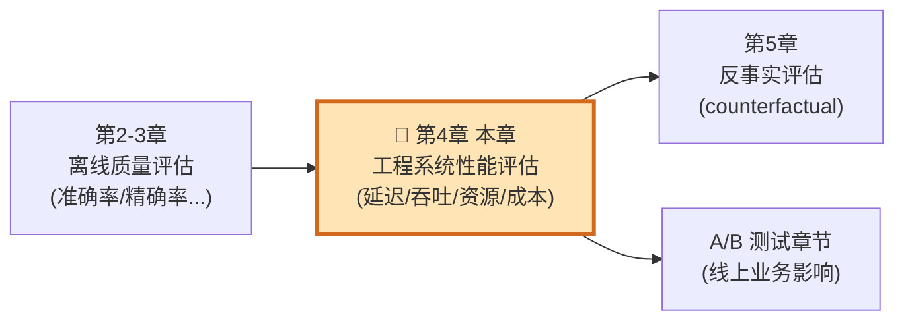
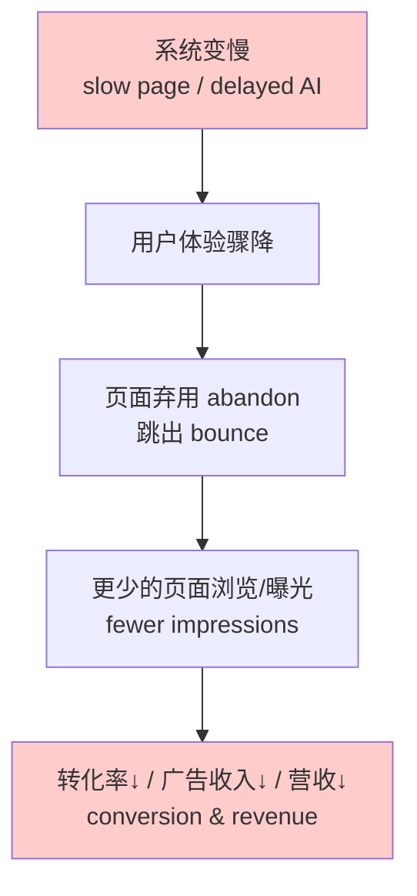
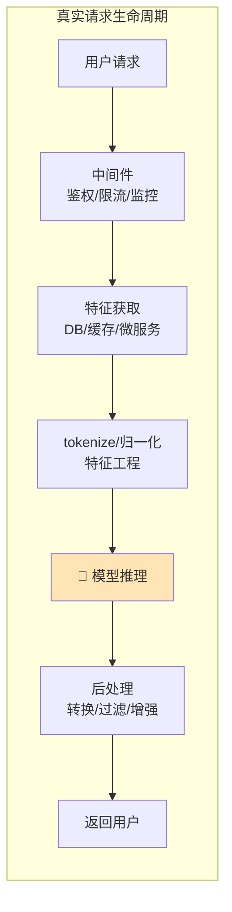
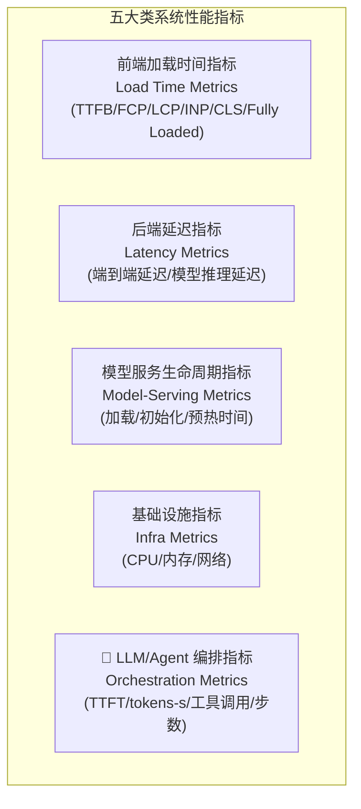
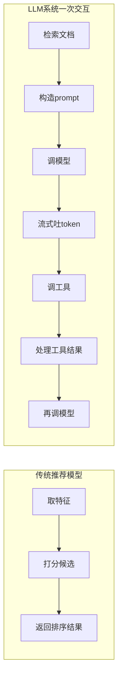
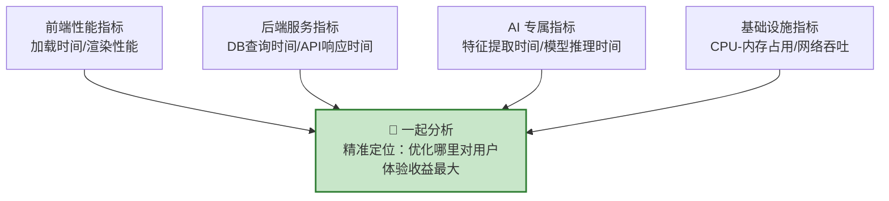
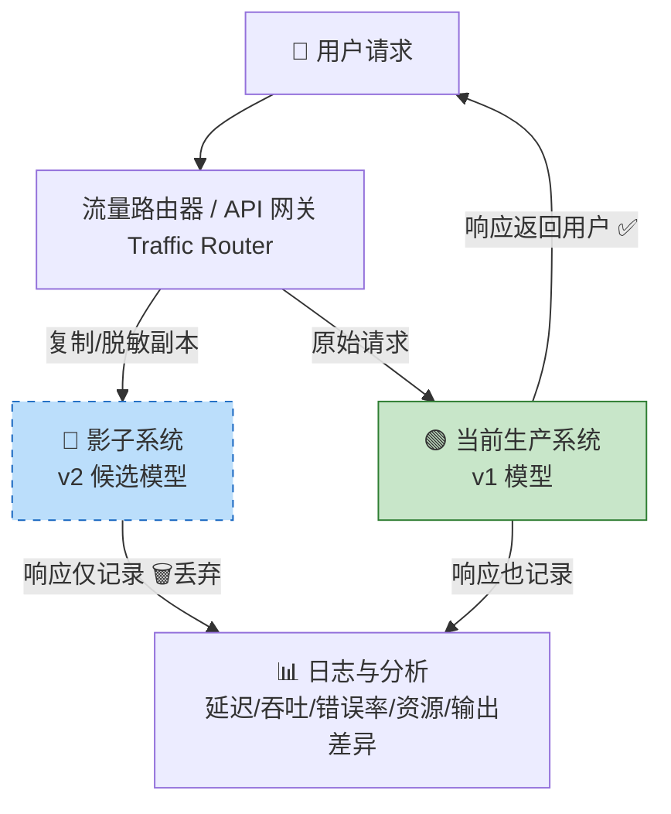
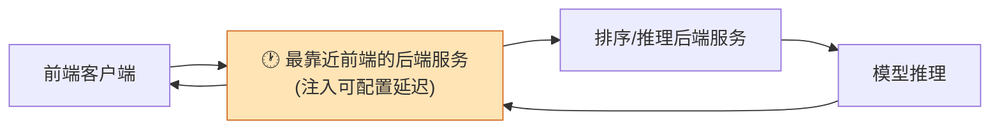
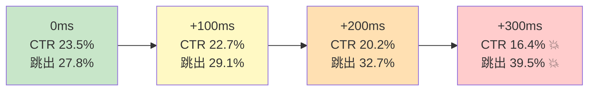
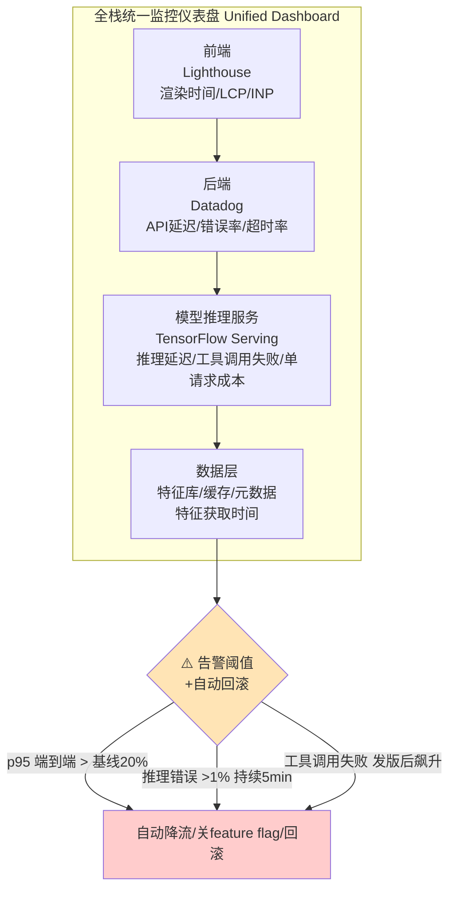

# 第 4 章 · 工程系统性能评估（Engineering System Performance Evaluation）

> 📖 本章对应原书《AI Model Evaluation》(MEAP, Leemay Nassery) 第 137–178 页。

---

## 🗺️ 本章地图（在全书中的位置）

前面几章我们一直在问同一个问题：**"这个模型好不好？"**——用准确率、精确率、召回率、离线基准去衡量模型"在实验室里"的质量。但本书作者反复强调一句话，值得先刻进脑子里：

> **"AI models don't exist in isolation."（AI 模型从不孤立存在。）**

一个离线评测 99% 准确的推荐模型，如果上线后 5 秒才吐出结果，用户早就划走了——**离线的高分毫无意义**。本章就是全书从"模型质量"转向"工程系统质量"的转折点，它回答的问题变成：

> **"这个模型能不能被系统又快、又稳、又便宜地端到生产环境里的真实用户面前？"**

在全书结构中，本章（第 4 章）是**"能不能上线"**这条评估支线的核心：



**读完本章，你将能够：**

1. 说清楚**延迟（latency）、加载时间（load time）、吞吐（throughput）、资源利用率、成本**这些系统指标各是什么、为什么进评估、怎么测、代价是什么；
2. 区分**真实延迟 vs 感知延迟**、**模型推理延迟 vs 用户可见的页面延迟**——这是本章最关键的认知升级；
3. 掌握 **LLM / Agent 系统特有的性能指标**（TTFT、tokens/s、工具调用延迟、步数、循环率……）；
4. 会用 **影子流量（Shadow Traffic / dark loading）** 在不影响任何用户的前提下，用真实生产流量压测一个候选模型；
5. 会设计 **延迟退化实验（Latency Degradation Experiment）**，用数据找到"用户对慢的容忍悬崖"；
6. 理解生产约束下的**质量-性能-成本三方取舍**，学会"最好的模型不是最大最慢最复杂的那个"。

---

## 4.1 为什么延迟和加载时间真的重要 ⏱️

### 4.1.1 是什么：先建立直觉

想象一个场景（书里的原话很生动）：

> 忙了一天回到家，打开电视，选中你最爱的流媒体 App，等啊等……"猜你喜欢"首页迟迟不出来，几秒、甚至几十秒过去了。你太累了，直接切到了另一个 App。

这个场景每天都在真实发生。**用户的注意力越来越短，超过 3 秒加载不出来就会走人。** 而 AI 驱动的应用，因为幕后往往有复杂的计算（取特征、跑推理、后处理……），要满足"3 秒"这个期望反而**更难**。

**核心命题：** 把模型正确地部署到面向用户的生产环境，光有一个高分模型是不够的。你还需要一个**高效（efficient）、可靠（reliable）、可观测（observable）、可扩展（scalable）** 的"周边系统"来支撑产品体验。

### 4.1.2 为什么：延迟直接影响业务指标 💰

书中给出了两个可引用的数据点（🔬 面试和汇报时可以直接甩出来）：

| 现象 | 量化影响 | 来源 |
|---|---|---|
| 页面加载超过 **3 秒** | 用户通常直接弃用（abandon） | Google Marketing Platform |
| AI 响应变慢（如推荐/搜索结果延迟） | 交互率（interaction rate）下降**最高 30%** | arxiv.org/pdf/2303.10255 |

这条因果链很直接也可测量：



比如一个内容推荐系统响应慢了 → e-commerce 网站上推荐内容的曝光变少 → 影响页面浏览量 → **可能直接影响广告收入**。

> 💡 **面试高频认知**：面试官问"你们为什么关心延迟？"——不要只答"用户体验好"。要答出**因果链落到营收**：延迟 → 弃用/跳出 → 曝光减少 → 转化与广告收入下降。这才是工程师视角。

### 4.1.3 ⭐ 关键区分：真实延迟 vs 感知延迟（这是本节精华）

书里有一句必须画重点的话：

> **一个后端模型推理增加 100ms，并不自动等于总页面加载时间增加 100ms。**
> （A 100ms increase in backend model inference time is **not** automatically the same as a 100ms increase in total page load time.）

为什么？因为很多 AI 特性是：
- **异步加载**（asynchronously）——不阻塞主流程；
- **被缓存**（cached）——根本没走模型；
- **渐进渲染背后**（progressive rendering）——先出骨架，AI 内容后填。

由此引出两个必须**分别测量**的概念：

| 概念 | 英文 | 定义 | 关注点 |
|---|---|---|---|
| **真实延迟** | Real latency | 系统实际花了多久响应 | 后端硬指标，工程真相 |
| **感知延迟** | Perceived latency | 用户**感觉**有多慢 | 用户体验真相 |

> 🔬 **第一性原理**：延迟与业务指标的相关性，在延迟**对用户可见时最强**。一个被缓存/异步完全隐藏的后端延迟，可能对用户行为**毫无影响**；但一个阻塞了搜索结果、推荐、结账、或 LLM 回答的延迟，**用户立刻能感觉到**。

**改善"感知延迟"的技术**（即使后端仍在处理）：
- 流式输出（streaming）
- 骨架屏加载态（skeleton loading states）
- 渐进渲染（progressive rendering）
- 缓存（caching）
- 预计算（pre-computation）

💡 **LLM 产品的经典例子**：一个聊天机器人花 6 秒返回完整答案。
- 如果 6 秒屏幕一直空白 → 感觉**巨慢**，用户失去信任；
- 如果**第一个 token 很快就流式出来**、然后可见地持续生成 → 感觉**快多了**。

> **结论：对 LLM 产品，"首 token 时间（Time To First Token, TTFT）"可能比"总生成时间"对用户体验更重要。** 记住这句，4.2.3 会展开。

### 4.1.4 技术约束与扩展挑战（为什么线下测不出来）

模型在"受控环境"（开发/离线评测：专用资源、可预测负载）和"真实生产"（波动流量、突发峰值、数据分布漂移）之间的差距**大到令人意外**。原因：



⚠️ **常见坑**：新手只盯着中间那个"🧠 模型推理"框优化，却忽略了：

- **特征数据依赖**：特征往往要从数据库、缓存、多个微服务里取，**每个依赖都是潜在的延迟点和失败点**；
- **中间件开销**：安全层、鉴权、限流、监控——每个小延迟**累加**成用户可感知的卡顿；
- **后处理**：原始模型输出常需转换/过滤/增强才能展示给用户，又是额外算力；
- **非线性扩展**：很多 AI 模型**不随请求量线性扩展**——能高效处理 100 QPS 的模型，简单加 10 倍机器**未必**能扛 1000 QPS；
- **批处理权衡**：批处理（batching）能提吞吐，但**牺牲单个请求延迟**，最优 batch size 是关键调参。

> 💡 作者的忠告：**如果你的特性感觉慢，先拉一个平台/基础设施工程师进来，别默认是模型的锅。** 他们会有意见（可能还很强烈）。先请杯咖啡。☕（书里这句很俏皮，但道理硬核：慢的元凶常在模型的上游或下游。）

---

## 4.2 工程系统性能指标（Engineering System Performance Metrics）📊

评估 AI 系统的工程性能，要看的不只是"模型预测得好不好"，而是"周边系统能不能**又快、又稳、又省钱**地在真实产品条件下把预测送达"。这些指标分几大类：



放在一起看，才能拼出**"哪里快、哪里脆、哪里体验会崩"**的完整图。

### 4.2.1 关键加载时间指标（Load Time Metrics）

加载时间指标衡量**内容多快出现在用户眼前**，直接决定用户对性能的**感知**。

| 指标 | 英文全称 | 测什么 | AI 系统里的含义 | 怎么优化 |
|---|---|---|---|---|
| **TTFB** | Time to First Byte | 从客户端请求到收到第一个响应字节 | TTFB 高常暗示**后端模型推理或特征获取延迟** | 缓存策略、优化 DB 查询、边缘计算（把推理拉近用户） |
| **FCP** | First Contentful Paint | 首个内容出现在屏幕上的时刻 | 个性化推荐加载前的初始布局 | 优先关键渲染路径、渐进渲染（先出基础内容） |
| **LCP** | Largest Contentful Paint | 最大可见内容元素渲染完成的时间 | 推荐行/生成摘要/动态模块影响它 | 优化最大元素加载 |
| **INP** | Interaction to Next Paint | 用户交互时页面响应有多快 | 页面"跟手"程度 | 减少主线程阻塞 |
| **CLS** | Cumulative Layout Shift | 意外的布局跳动（让页面显得不稳） | 动态 AI 内容后填导致跳版 | 预留占位空间 |
| **Fully Loaded Time** | 完全加载时间 | 页面 + **所有 AI 内容**都加载完 | 推荐轮播/个性化板块的**感知性能** | 懒加载、优化资源投递、**预计算 AI 预测** |

> ⚠️ **坑：客户端推理 vs 服务端推理**。实践中，**绝大多数生产系统的模型跑在后端**，不在浏览器里，所以 FCP 通常不受模型直接影响。但如果你做**客户端推理**（client-side inference，模型在浏览器里跑），要避免 FCP 退化，就得**拆分 CSS/JS bundle**：核心 UI 先快速加载，较重的 AI 组件异步加载——至少让用户先看到内容在动。

💡 **系统思维的经典例子**：**CDN（内容分发网络）配合动态重验证**，从离用户近的边缘节点提供高频内容，**根本没碰你的模型**就把加载时间降下来了。这是一个"和模型优化毫无关系、纯靠懂系统"就能拿下的胜利。

#### 📋 表 4.1 模型服务生命周期指标（Model-Serving Lifecycle Metrics）

这类指标不同于页面渲染指标，它们衡量**模型/服务本身多快"准备好"响应**——在**按需加载、自动扩缩容、Serverless** 场景下会直接影响用户体验。

| 指标 | 测什么 | 为什么重要 | 怎么改善 |
|---|---|---|---|
| **Fully Loaded Time**<br/>完全加载时间 | 页面 + 所有 AI 内容加载总时长 | 反映完整的用户感知加载体验 | 懒加载、优化资源投递、预计算预测 |
| **Model Load Time**<br/>模型加载时间 | 把 AI 模型**载入内存/环境**的耗时 | 关乎**启动性能**和响应性 | 减小模型体积、高效加载方法 |
| **Initialization Time**<br/>初始化时间 | 模型/系统在推理前的初始化耗时 | 影响**部署后或扩容后**的响应性 | 热启动（warm start）、缓存、优化初始化 |
| **Warm-up Time**<br/>预热时间 | 模型**空闲后**达到最优性能所需时间（仅适用于有"冷启动"成本的模型/系统） | 长时间不活跃后，初期响应会变慢 | 用**后台请求**把模型"保温"（keep warm） |

> 🔬 **冷启动（cold start）第一性原理**：一个模型/容器长时间没被调用，就会被系统"回收/休眠"。下次请求来时，要重新加载模型、初始化运行时、填充缓存——这段"冷"的时间用户全得等。**用后台定时请求（保温）** 就是花一点点无用算力，换用户永远打在"热"的实例上。

### 4.2.2 关键延迟指标（Latency Metrics）

延迟指标聚焦**交互过程中的响应性**，对交互式 AI 特性尤其关键。

**① 端到端延迟（End-to-End Latency）**——最常用。从用户请求到显示**完整响应**的总时间，涵盖所有中间步骤：请求处理 → 特征收集 → 模型推理 → 响应格式化 → 渲染。

> 🛠️ 用 **APM 工具**（Application Performance Monitoring，如 **Datadog、New Relic**）整体监控，找系统瓶颈。

**② 模型推理延迟（Model Inference Latency）**——专测模型生成预测的耗时，是**波动最大**的一环，取决于：

- 模型架构（如 Transformer vs 线性模型）
- 参数量 / 模型总体积
- 输入复杂度（图像分辨率、文本长度）
- 计算基础设施（CPU vs GPU vs TPU）
- 负载均衡与服务器路由（尤其峰值流量下）

**降低推理延迟的手段**：量化（quantization）、剪枝（pruning）、蒸馏（distillation）、选对硬件加速器（GPU/TPU）。

#### ⚖️ 批处理 vs 实时推理的权衡

| 方式 | 英文 | 做法 | 优点 | 代价 |
|---|---|---|---|---|
| **批处理推理** | Batch inference | 把多个请求**攒一批**一起处理 | 提高**硬件利用率**和**吞吐** | **牺牲单请求响应性**（要等凑批） |
| **实时推理** | Live / real-time inference | 每个请求**独立**响应 | 适合交互式特性，**低延迟** | 基础设施**成本更高**、扩展效率可能更低 |

> 💡 常见落地路径：团队常**先用批处理推理**（优先把模型launch上线），**长期目标再转向实时推理**。选哪个，取决于产品的延迟要求和工程要求。

### 4.2.3 🤖 LLM 与 Agent 特有的性能指标（重点！）

LLM 和 Agent 系统引入了**额外的性能指标**，因为用户体验往往由**不止一次**模型推理塑造。对比一下：



一个 **Agent 系统**可能把上面这个循环**重复好几遍**才完成一个任务。所以要专门度量。

#### LLM 层性能指标

| 指标 | 英文 | 含义 | 为什么关键 |
|---|---|---|---|
| **首 token 时间** | Time To First Token (TTFT) | 用户看到**任何东西**之前的等待 | 💥 聊天/流式界面里，它对"快"的**感知**影响常**大于总时间** |
| **每秒 token 数** | Tokens per second | 生成开始后，输出**流动**的速度 | 决定"打字机"体验流不流畅 |
| **末 token 时间** | Time to final token | 完整响应**完成**的时刻 | 总时长上限 |
| **prompt 处理时间** | Prompt processing time | 模型开始生成**前**准备输入的耗时 | 长上下文时显著 |
| **上下文大小** | Context size | 发给模型的 token 数 | **悄悄驱动延迟和成本**，对话越长越贵越慢 |
| **检索延迟** | Retrieval latency | 从向量库/文档库/记忆层取数据的耗时 | RAG 系统的独立瓶颈，**单独追踪** |
| **单请求成本** | Cost per request | 每次调用的**直接美元成本** | 用第三方 LLM 时**每次调用都花钱**，必须盯 |
| **超时/重试/降级率** | Timeout / retry / fallback rates | 系统多频繁地**没能干净完成**请求 | 数字低时容易被忽略——直到出事 |

> 💡 **面试高频**："LLM 服务你会监控哪些指标？"——标准答案先给 **TTFT**（并解释它对感知的重要性 > 总时长），再给 tokens/s、末 token 时间、上下文大小（驱动成本）、检索延迟、单请求成本、超时/重试/降级率。能把"成本"和"上下文长度"关联起来，加分。

#### Agent 层编排指标（Orchestration Metrics）

Agent 的性能故事和"单次模型调用"根本不同。先分清两种：

- **一次性 Agent（one-shot agent）**：收到任务 → 一次推理 → 出结果，**不循环、不调外部工具**。
- **多步 Agent（multi-step agent）**：在单个任务内进行多轮内部推理和行动——规划、检索、调工具、评估结果，常**循环回去**再来一遍，直到任务完成。

| 指标 | 英文 | 含义 |
|---|---|---|
| **每任务模型调用数** | Model calls per task | Agent 在**单个任务**内调了几次 LLM |
| **每任务工具调用数** | Tool calls per task | 调了几次外部系统（搜索/API/DB） |
| **工具调用延迟** | Tool-call latency | 每次外部调用耗时 |
| **工具成功/失败率** | Tool success/failure rates | 这些依赖在真实条件下有多可靠 |
| **Agent 步数** | Agent step count | 从头到尾的推理/行动步数（任务复杂度的代理指标；**异常增大是警报**） |
| **循环/重试率** | Loop or retry rate | Agent 卡在重复步骤/重试失败动作的频率（高循环率 = 工具集成脆弱 or 任务指令不清） |
| **外部依赖失败** | External dependency failures | 进展被**完全在控制之外**的东西卡住的频率 |

> 🔬 **第一性原理：Agent 延迟是累加的（cumulative）。** 单次模型调用可能够快，但一个需要 **5 次模型调用 + 3 次检索 + 2 次外部工具调用**的任务，整体仍会又慢又不可靠。所以对 Agent，关键问题不是"模型多快？"，而是——

> **"整个任务花了多久？时间都花在了哪里？"（How long does the full task take, and where does the time get allocated?）**

### 4.2.4 组合加载时间与延迟指标做性能评估

要正确评估 AI 系统性能，必须**把加载时间指标和延迟指标放一起分析**：
- 加载时间指标 → 聚焦**初始页面渲染**；
- 延迟指标 → 捕捉**交互中的响应性**。

**最有效的性能评估框架，组合四类指标：**



#### ⚖️ 这是一场真正的平衡艺术（It's a real balancing act）

> **改一处会影响另一处。** 这是本章、也是全书生产哲学的核心。

| 你做的事 | 好处 ✅ | 代价 ⚠️ |
|---|---|---|
| 降低模型复杂度 | 推理延迟↓ | 预测质量↓ |
| 给 LLM 应用加检索（RAG） | 回答质量↑ | 响应时间↑、成本↑ |
| 增大 batch size | 吞吐↑ | 单用户延迟↑ |

> **所以系统性能必须和模型质量、产品影响一起评估。最好的模型不总是最大、最慢、最复杂的那个。最好的模型，是那个"质量足够好到能改善产品，同时还满足系统的延迟、可靠性、可扩展性和成本要求"的模型。**

---

## 4.3 影子流量（Shadow Traffic / Dark Loading）🌓

现在我们知道了该测哪些指标。下一个问题：**怎么在真实生产条件下评估一个新模型/新系统，又不让用户暴露在候选输出的风险里？** 答案之一就是**影子流量**（也叫 **dark loading，暗加载**）。

### 4.3.1 是什么 & 怎么工作

**核心思想（简单到优雅）**：复制一份真实生产流量，喂给**候选系统（shadow）**处理；与此同时，同一个请求也照常走**当前生产系统（production）**。

- **生产系统的响应** → 照常返回给用户 ✅
- **影子系统的响应** → 仅**捕获用于分析，然后丢弃** 🗑️（用户永远看不到）

这样就"两全其美"：既做了**仿真压测**，又**不动用户体验**。



**典型实现的四个关键组件：**

1. **请求复制（request duplication）**：创建入站请求的精确副本，不改变原始请求流；
2. **流量路由（traffic routing）**：把副本导向影子环境，同时确保原始请求正常流转；
3. **异步处理（asynchronous process）**：影子处理不阻塞主流程；
4. **详细日志（detailed logging）**：记录两个系统的响应时间、错误率、资源利用率、输出差异。

**一次典型实现的 6 步流程：**

1. 位于调用栈最前端的**流量路由器 / API 网关 / 后端服务**拦截入站用户请求；
2. 路由器创建每个请求的**副本或脱敏副本**；
3. 原始请求走**当前生产系统**；
4. 副本请求发往**影子系统**（含新模型/新组件）；
5. **用户只收到生产系统的响应**；
6. **两个响应都被记录**，用于对比分析。

### 4.3.2 影子流量 vs A/B 测试（关键区分）⭐

这是本节最容易考、也最容易混的点：

| 维度 | 🌓 影子流量（Shadow Traffic） | 🧪 A/B 测试 |
|---|---|---|
| **目标** | 工程**系统性能**评估 | **线上评估**：模型对用户/产品/业务指标的影响 |
| **回答的问题** | "这系统从**技术上**准备好上生产了吗？" | "这改动会让**用户和业务**受益吗？" |
| **用户影响** | **无**——用户看不到实验变体的输出 | **有**——用户被暴露在模型变体前 |
| **风险等级** | **低**——不影响用户体验，但会给周边系统（如特征库）**加额外负载** | **较高**——待评估的变体**可能拉低指标** |
| **指标聚焦** | 系统性能：延迟、错误、基础设施容量资源 | 用户、产品、业务指标 |
| **决策依据** | 上生产前的**技术就绪度** | 业务/产品/用户影响评估 |

> 💡 **实践中两者常常"顺序使用"**：
> 1. 先用**影子流量**验证新模型满足性能要求、不会退化体验（技术就绪）；
> 2. 技术就绪确认后，再启动 **A/B 测试**衡量业务影响。
>
> 这个顺序对 AI 系统尤其宝贵：先解决性能问题，再暴露给用户，**避免技术问题混淆（confound）业务指标的评估**。

> ⚠️ **影子流量的根本局限**：它**无法测量用户行为影响**，因为用户从来没见过影子输出。它能回答"这系统扛得住生产流量吗？"，**答不了**"用户会更喜欢这个体验吗？"——后者仍然需要 A/B 测试。

### 4.3.3 影子流量的收益与挑战

**收益 ✅：**

- **零风险实验**：用户只收生产响应，绝不暴露于烂推荐/错误预测/系统故障——测试复杂 AI 模型时尤其宝贵（很多行为要真实多样输入才暴露）；
- **真实数据模式**：不同于合成基准（synthetic benchmark），影子流量给你**真实生产数据的模式、量级、边缘 case**——峰值、低谷、异常用户行为，离线环境几乎无法准确模拟；
- **端到端整体评估**：评估的是**整条请求处理流水线**（数据获取 → 特征提取 → 推理 → 响应格式化），而非只测模型准确率——因为模型不孤立存在，依赖众多其他组件；
- **建立信心**：在类生产环境里跑一段较长时间（覆盖峰值/不同时段/季节变化），能在切真实用户前建立可靠性信心，对**关键任务系统**尤其重要，还能顺带做**质量对比**（影子模型 vs 生产模型的预测差异）。

**挑战 ⚠️：**

| 挑战 | 说明 | 缓解办法 |
|---|---|---|
| **基础设施成本 & 复杂度** | 复制、路由、处理、存储副本都要额外基础设施，带来技术债和运维开销 | 见下方💡Tip |
| **资源翻倍** | 处理副本 = **至少双倍**计算负载，管理不当可能**拖垮它本要保护的生产环境** | 容量规划 |
| **有状态操作** | 写数据库等改状态的操作，副本可能造成**重复写入** | 隔离数据库环境 / 加逻辑阻止影子请求改共享状态 |
| **LLM/Agent 副作用** ☠️ | Agent 可能调外部工具：邮件、日历、工单、支付……影子测试可能**误发重复邮件、改记录、建工单、触发工作流、增加第三方 API 成本** | **dry-run 工具适配器、沙盒 API、只读凭证、录制响应、mock 工具输出** |
| **安全与隐私** | 处理副本 = 敏感用户数据被处理多次，需符合数据隐私法规 | 影子系统保持与生产**同等安全标准** |
| **用户可见副作用** | 影子系统若会触发发邮件/通知，必须**拦截**防止重复触达 | 实现 **"sink"（水槽）组件**：捕获出站动作但**不真正对外执行** |

> 💡 **管理影子流量基础设施成本的 Tip**（书里专门框出来的）：
> - **别 100% 复制**——只对**一部分真实流量**跑影子；
> - **不一定要贵 GPU**——影子跑用**便宜的 CPU** 可能就够，看你要测什么；
> - **智能采样 + 限流（sampling & throttling）**——评估"刚好够（just enough）"就行。"够"取决于你的目标：达到统计显著、覆盖关键用户分群、还是测特定边缘 case。**提前把影子测试目标定清楚**，就能优化采样量和限流，避免成本飙升。

> 🔬 **有状态操作为什么危险**：影子请求走的是真实业务逻辑。如果这逻辑里有 `INSERT INTO orders` 或 `send_email()`，副本请求会**真的**执行一遍——用户会收到两封确认邮件、数据库会多一条订单。所以有状态系统的影子测试，要么用**独立数据存储**，要么在代码里**拦截所有产生永久副作用的动作**（sink 模式）。

### 4.3.4 🐍 模仿一次影子流量（代码逐行讲解）

书里给了一个 Python notebook（`/notebooks/chapter_04/systemsevaluations.ipynb`），高层做这几件事：

1. 造一个**简化推荐模型**，模拟延迟并追踪关键性能指标；
2. 实现一个**影子流量路由器**，把每个请求同时发给生产和影子系统；
3. 聚焦**工程性能指标**（如延迟）；
4. 用**直方图 + 百分位曲线**可视化，对比两者延迟分布；
5. 基于**预定义的性能阈值**做数据驱动决策。

书中 **Listing 4.1** 的核心骨架（原文如此，逐行讲）：

```python
# Create our models - production is faster, shadow is slower but ...
# 造两个模型：生产模型更快，候选(影子)模型更慢但（更好）
production_model = RecommendationModel("Current Production Model")     # ① 当前生产模型，作为基线
shadow_model     = RecommendationModel("New Candidate Model", avg_lat...)  # ② 新候选模型，avg_latency 更高(更慢)

# Create router
# 造路由器
router = ShadowTrafficRouter(production_model, shadow_model)          # ③ 路由器同时持有两个模型
```

**逐行中文讲解：**

- **第 ①、② 行**：分别实例化"生产模型"和"影子候选模型"。命名清晰地表达了实验意图——**候选模型更慢（`avg_lat...` 即 avg_latency 更高），但可能质量更好**。这正是本章反复强调的"质量-性能取舍"：新模型不一定各方面都赢。
- **第 ③ 行**：`ShadowTrafficRouter` 同时持有两个模型的引用。它的职责就是 4.3.1 讲的——**每个请求复制一份**，一份走 `production_model`（返回用户），一份走 `shadow_model`（记录、丢弃）。

概念上，路由器内部逻辑大致是（据书中描述重构，帮助理解）：

```python
def route(self, request):
    # 原始请求走生产系统，响应返回给"用户"
    prod_response, prod_latency = self.production_model.predict(request)
    # 副本请求走影子系统，响应仅记录、不返回用户
    shadow_response, shadow_latency = self.shadow_model.predict(request)
    # 记录两者的延迟等指标，供后续画直方图/百分位曲线对比
    self.log(prod_latency, shadow_latency, prod_response, shadow_response)
    return prod_response   # ⭐ 只把生产响应返回给用户
```

- 关键在最后 `return prod_response`：**无论影子系统多慢、结果多离谱，用户拿到的永远是生产系统的响应**——这就是"零风险"的代码级保证。
- 记录下来的 `shadow_latency` 分布，最后画成直方图和 **p50/p95/p99 百分位曲线**，与生产对比，再对照**预定义阈值**（如"p99 不得超过 X ms"）做**上/不上**的决策。

---

## 4.4 延迟退化实验（Latency Degradation Experiments）🐌

### 4.4.1 是什么 & 为什么

直觉告诉我们"慢会伤害参与度"：页面加载太久用户会走、搜索卡顿用户会少搜、LLM 迟迟不开始流式用户会失去信任。**这些直觉通常合理，但产品团队不该只靠直觉。**

> **延迟退化实验**：一种**故意**给部分用户的体验**加入受控延迟**，然后测量用户/产品/业务指标如何响应的 A/B 测试。

**目的不是折磨用户，而是找到"延迟阈值/悬崖（cliff）"**——搞清楚用户到底能忍多慢，好让未来的模型和系统决策**基于证据而非猜测**。

> ⚠️ **因为它故意让部分用户体验变差，必须谨慎运行**：
> - 限制曝光量（limited exposure）
> - 短周期（short duration）
> - 预定义停止条件（predefined stop conditions）
> - 护栏指标（guardrail metrics）
> - 干系人批准（stakeholder approval）

### 4.4.2 怎么设计

**最简单的注入延迟方式**：在**客户端**、或**最靠近客户端的后端服务**里加一个延迟。关键要求——**延迟必须可配置（configurable）**，这样才能测不同程度的退化。



#### 📋 表 4.3 延迟退化 A/B 测试设计（10ms 增量示例）

| 变体单元（Variant Cell） | 描述 |
|---|---|
| **Control（对照）** | 不加延迟 |
| Test Variant 1 | +10 毫秒 |
| Test Variant 2 | +20 毫秒 |
| Test Variant 3 | +30 毫秒 |
| Test Variant 4 | +40 毫秒 |
| Test Variant 5 | +50 毫秒 |

**多个变体单元 = 能看清"悬崖"在哪**——具体在多少延迟时，产品和用户指标开始**朝负向漂移（drift）**。

**⚙️ 设计要考虑的几个关键点：**

1. **按设备分开测**：如果产品跨设备（iOS App / 桌面浏览器 / Android），不同设备实现不同（比如网页有浏览器缓存层、App 没有）。应为**每种设备类型建独立的测试**，通过 A/B 测试的定向条件（targeting criteria）隔离。理想情况：**每种设备复制一遍表 4.3 的变体设计**。
2. ⚠️ **测试环境必须镜像生产环境**（基础设施和系统资源）。你**不想**把"测试机器降配（downgraded servers / 受限 compute）导致的性能退化"**误当成**你注入的受控延迟。延迟仿真要在尽可能接近生产的资源条件下跑，insights 才反映**真实延迟效应**，而非基础设施局限。

**这类测试设计能让你：**
- 更强地理解延迟对关键产品指标的影响；
- 当引入依赖 AI 模型（稍慢）的复杂新特性时，**基于扎实数据**重新评估响应时间；
- 收集可行动数据，做**性能权衡的知情决策**（新特性靠一个稍慢的模型 → 你能量化对指标的潜在影响，要么优化缓解、要么基于整体业务目标接受）；
- 若数据显示负面影响，**据此排优先级**做改进。

### 4.4.3 关键的线上评估系统性能指标

跑延迟退化实验时，要拿哪些指标来衡量？核心 4 个 KPI：

| 指标 | 英文 | 定义 | 优化手段 |
|---|---|---|---|
| **响应时间（端到端延迟）** | Response Time (End-to-End Latency) | 请求穿越整条请求-响应流水线的总时间：前端 → 后端服务 → 存储取数 → 模型推理 → 后处理 → 返回 | 见下方"先建基线再分解" |
| **模型推理时间** | Model Inference Time | AI 模型处理输入、产出预测的耗时（大模型尤其显著） | 量化/剪枝/蒸馏减小模型；GPU/TPU 加速器；降低输入处理复杂度 |
| **应用加载时间** | Application Load Time | 整个应用/网页加载并可交互的时间（前端资源 + 拉取模型预测 + 填充动态内容） | 见下方"低算力落地页" Tip |
| **资源利用率** | Resource Utilization | CPU（处理能力）、Memory（RAM 消耗）、Network（收发数据量） | 作为**护栏指标**纳入实验配置，或事后 ad-hoc 分析 |

#### 🔑 先建基线，再分解（Before optimizing, establish a baseline）

> 优化延迟之前，**先测当前端到端响应时间，然后按阶段分解**：请求处理 → 特征获取 → 模型推理 → 工具调用 → 响应格式化 → 网络传输 → 渲染。

这能帮你**看清系统时间实际花在哪，而不是靠猜**：


- 若**模型推理占大头** → 减小模型、批处理、量化、换更快的服务方案；
- 若**特征获取/后端调用主导** → 优化 DB 查询、缓存高频数据、减少不必要的服务调用（收益可能更大）。

#### 💡 记忆化（Memoization）实战

一旦定位瓶颈，可用**记忆化**——存储昂贵函数调用的输出，避免冗余计算。书中例子：模型计算两个用户画像的相似度，用户 A 和 B 频繁被比较：

| | 做法 | 结果 |
|---|---|---|
| **无记忆化** | 每次都重跑同样昂贵的计算 | 慢 |
| **有记忆化** | 首次结果存起来，后续 A-B 请求**直接返回缓存** | 瞬时返回 ⚡ |

模型里常有重复计算（embedding 查表、特征变换、预测输出），记忆化减少冗余、加速推理。

#### 💡 应用加载时间 Tip：低算力落地体验

> 设计一个**低算力落地页（low-compute landing experience）**：初始页面保持轻量、只求快速渲染，较重的 AI 特性/模型后端 API **在后台继续加载**。让用户**立刻有东西可交互**，即使完整个性化还没就绪。

两个配套战术：
- **懒加载（lazy loading）**：把非必要内容（推荐模块、动态板块）**推迟**到真正需要时才加载；
- **增量加载（incremental loading）**：随用户滚动**逐步填充**界面，越滚越多。

#### 📈 系统性能百分位（Percentiles）——工程组织的通用语言

> 不同岗位都会用**百分位**框定性能讨论。比如你会听到：**"那个后端服务的 p99 要命了——得降响应时间，不然应用要开始超时/报错了。"**

- **p99（99th percentile）**：99% 的请求在某时间内响应，但**最慢的 1%** 在惹麻烦（它们显著更慢）。p99 是理解**尾延迟（tail latency）** 的关键 KPI——它告诉你最慢的请求表现如何，这些慢响应常是**用户可见错误/超时**的根源。
- **p90 / p95**：类似地看分布的尾部。

另一句常听的话：**"我们老是在返回降级态（fallback state）"**——意味着系统在实时动态数据/预测无法在可接受时间内获取时，退回到默认/静态响应。这常发生在响应时间超阈值、或组件不达性能要求时。

> 🔬 **为什么用百分位而非平均值**：大规模系统里，**离群值（outliers）会扭曲平均性能**。用百分位聚焦分布尾端，确保"一小撮慢事件"不显著拖累整体用户体验。**平均延迟 200ms 听起来还行，但如果 p99 是 5 秒，那 1% 的用户体验是灾难性的**——而这 1% 在千万级流量下就是十万人。

### 4.4.4 🎬 电影推荐实战案例（带真实数据）

书中用"电影推荐"贯穿案例设计了一个延迟退化评估。当前该应用 **p99 = 900 毫秒**。

**实验设置：**

- **假设（Hypothesis）**：在渲染电影推荐视图的页面里引入轻微延迟，会**负面影响用户参与和转化**——具体表现为电影消费下降、滚动行为减少。
- **成功指标（Success metrics）**——同时含系统指标和用户指标：
  - 页面加载时间百分位：尤其 **p50 / p95 / p99**；
  - **CTR（点击率）**：加载页面后至少点击一个推荐的用户占比；
  - **Bounce Rate（跳出率）**：推荐页加载后不久就离开的用户占比；
  - **Abandonment Rate（弃用率）**：页面**完全加载前**就离开的频率（对延迟敏感应用尤其有用）；
  - **Downstream consumption（下游消费）**：用户点击后是否真的观看/参与推荐的电影。
- **实验单元数**：**6 个**——1 个对照组 + 5 个延迟退化变体。
- **定向条件**：按设备类型分开（desktop / iOS / Android），因设备架构和缓存机制不同，延迟影响可能不同——**每种设备复制一遍测试**。

> 💡 **为什么这个案例用 100ms 增量、而不是 10ms？** 因为当前 p99 已经在 900ms，我们关心的是**分布尾端**用户体验开始**显著退化**的地方。10ms 这种小增量**可能观察不到**参与度或性能指标的明显差异；100ms 能观察到用户交互的**更有意义的位移**，帮我们找到延迟开始伤害关键指标的**清晰阈值**。→ **增量大小要匹配你当前的延迟量级**。

> 💡 **A/B 测试要同时含系统指标和用户指标**：这个评估**故意**既放了系统指标（平均页面加载时间），又放了几个用户指标（CTR、跳出率、弃用率）。因为——**系统指标告诉你"发生了什么"，用户指标帮你理解"为什么这重要"。** 两者结合，才得到模型对性能和体验的真实世界影响的**完整画面**。

**运行 2 周、每变体约 5 万用户后的结果（表 4.4，移动端）：**

| 变体单元 | 加入延迟 | 平均页面加载时间 | CTR 点击率 | Bounce Rate 跳出率 |
|---|---|---|---|---|
| **Control** | 0ms | 1050ms | **23.5%** | **27.8%** |
| Test Variant 1 | +100ms | 1155ms | 22.7% | 29.1% |
| Test Variant 2 | +200ms | 1250ms | 20.2% | 32.7% |
| Test Variant 3 | +300ms | 1360ms | **16.4%** ⚠️ | **39.5%** ⚠️ |

**怎么读这张表（数据驱动的洞察）：**



- **+100ms**：CTR 从 23.5% 微降到 22.7%（-0.8pp），跳出微升——**用户还比较能忍**；
- **+200ms**：CTR 掉到 20.2%（-3.3pp），跳出升到 32.7%——**开始明显疼**；
- **+300ms**：CTR 崩到 16.4%（相对 control **降了约 30%**！），跳出飙到 39.5%——**这就是"悬崖"**。

> 🎯 **决策价值**：这张表把"慢多少会死"从直觉变成了**证据**。现在如果产品要上一个"稍慢 200ms 但质量更好"的新推荐模型，团队能精确算出：这会让 CTR 掉约 3pp、跳出升约 5pp——**然后基于业务目标决定：值不值？要不要先优化把这 200ms 抢回来？** 这就是工程性能评估的终极用途——**让"质量-性能取舍"变成一道有数字的算术题，而非拍脑袋。**

---

## 4.5 生产工程考量与取舍 🏗️

本节把散落的工程智慧收拢成三条可执行的原则。先看一张全栈统一监控图——这是把前面所有指标"落地"的方式：



**统一仪表盘**从各层拉指标（前端渲染时间、API 延迟、特征获取时间、模型推理延迟、错误率、超时率、工具调用失败、单请求成本），给团队**在用户之前发现性能回归**的最好机会。

**告警阈值**要基于**历史基线和产品预期**，不是拍脑袋的数字。举例：
- **静态阈值**："错误率超过 2% 就告警"；
- **相对阈值**："延迟比过去 7 天均值差 30% 就告警"、"p95 端到端延迟比基线上升超 20% 就告警"、"模型推理错误连续 5 分钟超 1% 就告警"。

**高风险发版**还可把监控接到**自动回滚触发器**：新模型/新变体让延迟、错误、成本、安全指标越过预定阈值时，部署系统可**自动降流、关掉 feature flag、或回滚到上一个稳定版**。对 AI 系统尤其有用，因为**故障可能同时来自多层**：模型、检索流水线、工具调用、后端服务、UI。

### 4.5.1 一定要做基础设施容量规划（Capacity Planning）

部署前，在**各种负载条件下**评估模型的资源需求：

| 维度 | 说明 |
|---|---|
| **计算资源分配** | 定出模型在不同流量水平需要多少 CPU / 内存 / GPU。做**负载测试（load testing）**看资源需求如何随请求量扩展 |
| **成本-性能取舍** | 同时考虑技术性能和财务影响。例："用更大实例换来的延迟改善，值这个额外成本吗？" **有时稍慢但便宜得多的方案，才是对的商业决策。** |
| **扩展策略** | **垂直扩展（vertical，更强的机器）** vs **水平扩展（horizontal，更多机器）**。有些模型受益于更大内存/专用硬件，有些能高效分布到多个小实例 |

> ⚠️ **自动扩缩容不是性能评估的替代品！** 很多生产系统用 Kubernetes autoscaling、AWS Auto Scaling、GCP 托管实例组按流量动态调资源。但 **autoscaling 能帮你扛流量总量，却不会自动修复**：慢推理、低效特征获取、糟糕的批处理策略、冷启动、内存泄漏、GPU 饱和、第三方 API 限流、昂贵的 Agent 工具调用循环。
>
> **关键是"聪明地扩展"**：用好基础设施的扩缩容机制，但**持续在模型、服务、依赖、产品体验各层测量瓶颈**。

### 4.5.2 永远不会后悔"在真实产品条件下测试"

> 全章主题："AI 模型不孤立存在"。这在过度聚焦模型、而对数据/系统/更大产品体验关注不足的组织里，常是**事后才想起的疏漏**。

因此你的性能测试要**尽可能贴近生产环境**：

- 不只用**稳态负载（steady load）**测，还要用**尖刺、不可预测的模式（spiky, unpredictable patterns）** 测——镜像真实使用；
- 把**季节性变化、事件驱动的流量激增**纳入测试计划；
- 测试数据要代表模型在生产中会遇到的**全部多样性**，包括**边缘 case 和异常输入**（这些可能导致性能退化）；
- 测**完整请求流**（从用户交互到响应交付），**而非只测孤立的模型推理**。

### 4.5.3 记住这些性能优化战术

定位到瓶颈后，考虑这些优化路径：

| 优化方向 | 具体手段 | 代价/注意 |
|---|---|---|
| **模型优化** | 量化（quantization）、剪枝（pruning）、知识蒸馏（distillation）、导出为优化格式（如 **ONNX**） | 通常**不显著损失准确率**就能大幅提速 |
| **批处理策略** | 测不同配置找**最优 batch size** | 大 batch 提吞吐，但**增加单请求延迟** |
| **特征工程效率** | 重审特征预处理，找出可简化/可并行的**昂贵操作** | — |
| **硬件加速** | 评估 GPU / TPU / 定制推理加速器 | 匹配你的具体模型架构 |
| **🤖 LLM & Agent 优化** | 减少无用 prompt token、缓存检索结果、**限制工具调用循环、设最大步数上限**、尽量流式响应、简单子任务用更小更便宜的模型 | **对 Agent，优化"整条任务路径"，而非只优化单次模型调用** |

> 💡 **面试高频**："模型太慢怎么优化？"——分两层答：**(1) 模型层**：量化/剪枝/蒸馏/ONNX、换 GPU/TPU；**(2) 系统层**：缓存/记忆化、批处理调 batch size、CDN/边缘、优化特征获取。**能主动补一句"先建基线分解、定位真正的瓶颈再优化，别盲目动模型"，直接体现资深度。**

---

## 📌 本章小结

本章把评估的焦点从"模型质量"扩展到"**工程系统性能**"，核心结论浓缩如下：

1. **工程系统性能评估**回答的是：AI 特性能否被**可靠、快速、经济地**在生产中服务。一个离线评测很好的模型，若周边系统**太慢、太贵、太脆、扛不住扩展**，照样在生产中失败。

2. **延迟和加载时间之所以重要，是因为它们塑造用户体验**。但要记住：**模型推理延迟 ≠ 用户可见的页面延迟**——要测清延迟**发生在哪、用户是否真能感知**。

3. **重要系统性能指标**：响应时间、模型推理时间、应用加载时间、吞吐、错误率、超时率、降级率、资源利用率。

4. **LLM 系统还要额外追踪**：TTFT（首 token 时间）、末 token 时间、tokens/秒、检索延迟、上下文大小、单请求成本、重试率、降级率。

5. **Agent 系统还要追踪**：模型调用数、工具调用数、工具延迟、工具失败率、步数、循环率、总任务完成时间——因为 **Agent 延迟是累加的**。

6. **影子流量（Shadow Traffic）** 让你用生产流量评估候选模型/系统，**不把候选输出暴露给用户**。适合判断**技术就绪度**，但**测不了用户是否更喜欢新体验**（那需要 A/B 测试）。

7. **延迟退化实验**量化产品/业务指标对"变慢"的敏感度。因为它**故意退化部分用户体验**，必须配**限量曝光、护栏指标、预定义停止条件**。

8. **工程性能评估要和离线模型评估、诊断评估、A/B 测试配合使用**。它们共同帮团队决定：不仅"模型好不好"，更是"**它准备好上生产了吗**"。

9. 🌟 **贯穿全章的哲学**：**"最好的模型不总是最大、最慢、最复杂的那个。"** 一切都是**质量 ↔ 性能 ↔ 成本**的三方平衡艺术——降复杂度提速但掉质量、加检索提质但增延迟增成本、增大 batch 提吞吐但升单用户延迟。工程性能评估的终极价值，就是**把这些取舍变成一道有真实数字支撑的决策题**。

---

## 🔗 延伸阅读

**本书内：**
- 📖 **第 2–3 章｜离线质量评估**：本章的前提。离线的准确率/精确率是"模型好不好"，本章是"能不能上线"——两者必须联合评估，才有第 4.2.4 节强调的"质量-性能联合评估"。
- 📖 **第 5 章｜反事实评估（Counterfactual Evaluations）**：本章聚焦"模型周边的系统"，下一章重新回到"模型的决策"，用日志数据 + off-policy 评估（如 inverse propensity weighting 逆倾向加权）估计"如果模型做了不同决策会怎样"——不用跑线上实验就能评估新策略。是影子流量之外，另一种"低风险评估"的思路。
- 📖 **A/B 测试章节**：本章的"延迟退化实验"本质是一种特殊 A/B 测试；影子流量与 A/B 测试的"顺序使用"（4.3.2）也在此展开。

**本仓库（llm-action）相关目录：**
- 🔧 `llm-inference/`｜**LLM 推理优化**：本章 4.2.3 讲的 TTFT、tokens/s、KV cache、批处理（continuous batching）、量化/剪枝/蒸馏，在这里有工程落地细节。想把"降低推理延迟"从口号变代码，看这里。
- 🏛️ `ai-infra-architecture/`｜**AI 基础设施架构**：本章 4.5 的容量规划、垂直/水平扩展、autoscaling（K8s / AWS / GCP）、GPU 饱和、冷启动、统一监控仪表盘（Datadog / TensorFlow Serving），都属于这个主题的深水区。
- 📊 **可观测性 / 监控相关章节**：本章 4.5 的告警阈值（静态 vs 相对）、自动回滚触发器、p90/p95/p99 尾延迟监控，是生产可观测性（observability）的核心实践。

> 🎯 **一句话记住本章**：模型再准，慢到用户划走就等于零——**评估一个 AI 系统，永远要把"它有多好"和"它有多快/多稳/多贵"放在同一张桌子上算总账。**
