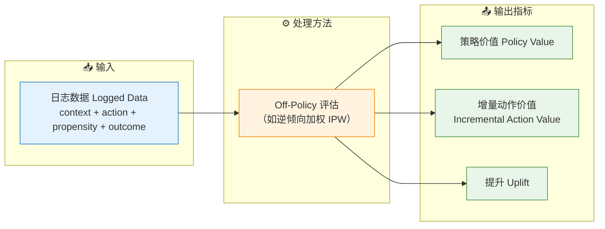
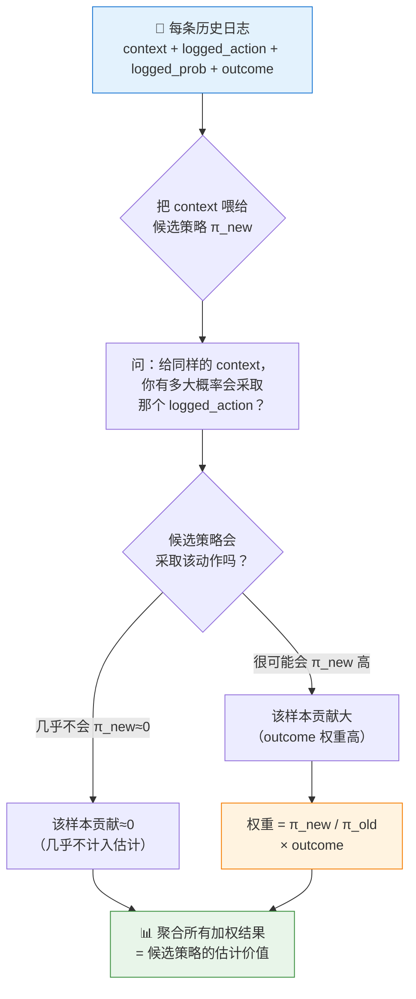
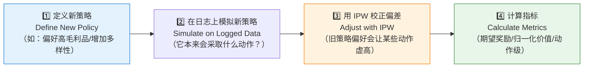
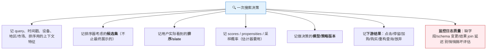
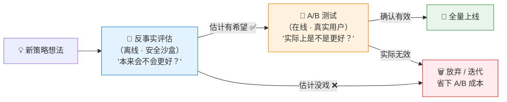
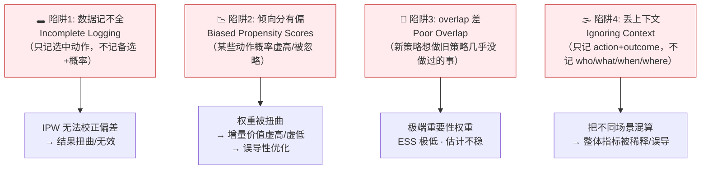
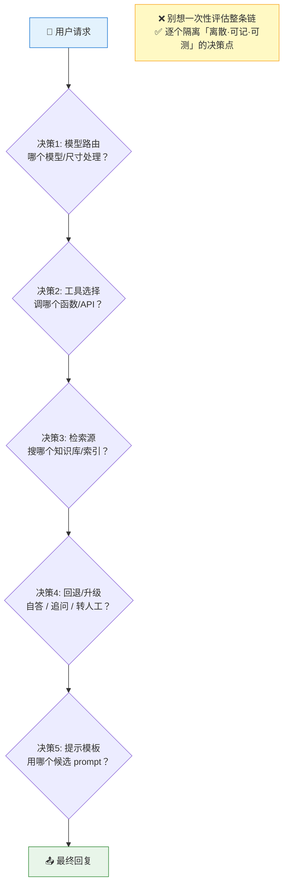
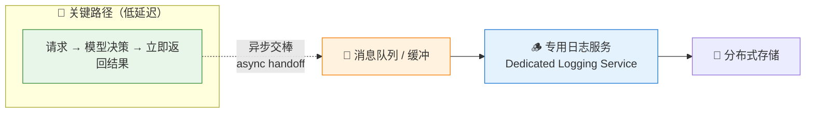

# 第 5 章 · 反事实评估（Counterfactual Evaluation）🔮

> 对应原书：**Chapter 5 · Counterfactual Evaluations**（AI Model Evaluation, MEAP, Leemay Nassery），PDF 第 179–215 页。
> 本讲将书中的因果推断、off-policy 评估、逆倾向加权（IPW）、日志复用、偏差与校正等概念，从零基础到进阶逐层讲透，并把书里的三段代码/日志（Listing 5.1 / 5.2 / 5.3）逐行拆解。

---

## 🗺️ 本章地图

在全书的坐标系里，这一章是「**离线评估（offline evaluation）**」这条主线的**最后一块、也是最烧脑的一块拼图**：

```
第 1–3 章：模型好不好？（准确率 / 生成质量 / LLM-as-judge）
第 4 章  ：系统扛不扛得住？（延迟 / 吞吐 / 成本 / 影子流量）
第 5 章  ：★ 换一个模型/策略会怎样？（反事实评估 = 本章）★
────────────────────────────────────────────────
第 6–8 章：真实用户到底买不买账？（A/B 测试 = 在线评估 Part 2）
```

前四章回答的都是「**这个模型在历史数据上表现如何**」。但产品经理真正想问的往往是另一句话：

> **「如果我们换成新模型 / 新排序策略 / 新推荐逻辑，会不会更好？」**

这句话的要命之处在于——**你手里只有旧策略产生的数据，却想预测新策略的表现**。你没法回到过去把推荐换掉再看用户反应。反事实评估，就是用**已经躺在数据库里的生产日志**，加上一套统计校正方法，去**估计（estimate）**那个「平行宇宙」里的结果。

**读完这一章，你能会什么：**

| 能力 | 具体是什么 |
|------|-----------|
| 🧠 概念 | 说清楚因果推断 / 反事实 / 策略（policy）/ 策略价值（policy value）/ off-policy 评估 到底在讲什么 |
| 📐 数学 | 手推逆倾向加权（IPW）公式，知道权重从哪来、为什么会爆炸 |
| 💻 代码 | 读懂并复现书里的 `new_policy_probabilities` / `evaluate_policy`（IPW + 有效样本量 ESS） |
| 🪵 工程 | 设计反事实日志：记什么、怎么记、异步落盘、PB 级存储怎么扛 |
| ⚠️ 避坑 | 识别四大陷阱（缺数据 / 倾向分有偏 / overlap 差 / 丢上下文），并知道怎么补救 |
| 🤖 前沿 | 把反事实评估搬到 LLM / Agent 系统（模型路由、工具选择的 off-policy 评估）|

一句话总结本章的世界观：

> **反事实评估是「便宜、安全、快速」的沙盒实验，但它给的是「估计值」而非「真相」；它替代不了 A/B 测试，只能帮你决定「哪些新策略值得拉去做 A/B」。**

---

## 5.1 先搞懂因果推断（Causal Inference）🎯

### 是什么

书里开篇就点题：因果推断回答一个「简单却深刻」的问题——**到底是什么导致了什么（what caused what）？**

- 新功能上线后销量涨了，是**功能带来的**，还是**碰巧赶上旺季**？
- 用户看完你推荐的电影后多停留了 20 分钟，是**推荐起了作用**，还是**他本来就打算刷一整晚**？

### 为什么重要：相关 ≠ 因果

这是整章的**第一性原理**，务必刻进脑子里：

> 🔬 **第一性原理：correlation ≠ causation（相关不蕴含因果）**
>
> 观测到「A 发生时 B 也发生」只是**相关**。要证明「A 导致了 B」，你必须回答一个**反事实问题**：*如果 A 没发生，B 还会发生吗？* 而这个「如果没发生」的世界，你**永远观测不到**——因为历史只发生了一次。这就是因果推断的根本困难，学名叫「**反事实的缺失（the fundamental problem of causal inference）**」。

### 怎么用

书里的比喻很传神：

> 你没法回到过去把那条推荐藏起来、或把搜索排序倒过来重放一遍。但**只要有对的数据和方法，你就能估计「如果当初那么做会怎样」**。这就像在**平行宇宙里做实验**。

因果推断是经济学、医学、AI 的共同基石。在 AI 评估里，它的落地形态就是——**反事实评估**。

---

## 5.2 反事实评估：到底在评估什么 🔮

### 一句话定义

> **反事实评估 = 用旧策略产生的历史日志，估计新策略（如果当初用了它）会得到什么结果。**

关键词是 **estimate（估计）**。书里反复强调，它**不是**一个「魔法回放键」揭示唯一的平行现实，而是靠 4 样东西拼出来的估计：

1. 生产日志（logged production data）
2. 决策概率（decision probabilities）
3. 观测到的结果（observed outcomes）
4. 一组假设（assumptions）

### 🔬 最大的坑，开篇就要说清

书里在 177 页就抛出「最大的陷阱」：

> **能问「what if」不等于有数据回答好这个「what if」。**

在几乎所有 AI 系统里，**我们只观测到系统实际采取的那个动作的结果**：

```
推荐系统展示了 电影A  →  我们知道用户点没点 A、看没看 A
                        ✗ 我们不知道：如果展示的是 B/C/D，用户会怎样？
```

那个「B/C/D 会怎样」的结果，就是**缺失的反事实（missing counterfactual）**。反事实评估这一整套方法，本质就是**估计这些缺失结果**。

### 反事实评估的解剖结构（Anatomy）🩻

书里 5.2.1 节沿用全书的「输入-输出框架」，一个反事实评估由三部分组成：



**图 5.1 精讲**：数据必须包含 4 件套——**决策时的上下文（context）、系统采取的动作（action）、采取该动作的概率（propensity）、观测到的结果（outcome）**。有了这 4 件套，off-policy 方法（典型是 IPW）把日志「重加权」，估出候选策略的期望价值，再和基线策略比较。

书里 5.2 节给的**标准工作流（图 5.2）**用一句话概括：

> 日志数据 → 用 off-policy 校正方法（如 IPW）重加权 → 估计候选策略价值 → 与基线策略对比。
> **前提假设**：日志正确、logged 策略与候选策略有足够重叠、上下文捕获了关键因素。

### ⚠️ 藏在底下的四个假设（The assumptions hiding underneath）

书里 5.2.2 节明确列出**四个假设**，缺一不可。这是本章的「命门」，面试高频：

| # | 假设 | 白话解释 | 违反后果 |
|---|------|----------|----------|
| 1 | **重叠 Overlap** | 旧策略**得曾经有机会**采取新策略想采取的动作。旧推荐系统从没给这群用户推过纪录片 → 你就没证据说明新策略推纪录片会怎样 | 估计变成「纯靠模型假设硬猜」 |
| 2 | **准确的倾向分 Accurate propensities** | propensity = 决策**当下**旧策略赋予该动作的概率。这个概率若缺失、算错、或事后瞎补 | 估计误导性极强 |
| 3 | **决策时的上下文 Context that mattered** | 用户行为依赖设备/时段/地点/查询意图/会员状态/近期活跃 → 这些都得记进日志 | 会把「看似相似、实则完全不同」的场景混为一谈 |
| 4 | **把结果当估计，不当证明** | 反事实评估能帮你决定「新策略够不够格拉去做在线测试」，但**替代不了 A/B 测试** | 用估计值当真相，酿成上线事故 |

> 💡 **面试高频**：被问「反事实评估的前提假设是什么？」——背下这四条：**overlap（重叠）、accurate propensities（准确倾向分）、sufficient context（充分上下文）、it's an estimate not proof（是估计非证明）**。答得出这四条，面试官就知道你真做过 off-policy 评估。

> ⚠️ **常见坑（书里原话）**：*Time will always be our biggest enemy*（时间永远是最大的敌人）。别让反事实评估的「洞见」阻止你去花时间做真正的 A/B 测试。反事实评估是**加速器不是终点线**。

### 为什么值得做（Why it matters）

书里 5.2.3 节总结了它的独特价值：

- 💰 **成本低、可控**：用历史数据测新想法，不用真把用户暴露在潜在糟糕体验里。
- ⚡ **迭代快**：不用等几周的 A/B 结果，现有交互数据就能出洞见。
- 🔙 **可回溯（retrospectively）**：分析过去的决策来指导未来，无需上线任何面向用户的实验。

---

## 5.3 反事实日志（Counterfactual Logging）🪵

### 是什么

> **反事实日志 = 记录一次生产决策的足够信息，使你日后能估计「换个策略会怎么表现」。**

书里一句话点破本质（5.2.3 → 5.3）：

> **你实现不了反事实评估，如果没有这些日志——因为整个评估完全依赖模型做决策时采集的数据。**

### 最少要记什么（At minimum）

书里 181 页给出「最低配」清单，请当成**日志 schema 设计模板**：

| # | 字段 | 说明 | 举例 |
|---|------|------|------|
| 1 | **action taken 采取的动作** | 展示的推荐 / 排的结果 / 选的工具 / 回复策略 | 展示了 AirPods Pro Max |
| 2 | **candidate set 候选集** | 决策时可行的备选项（不是整个宇宙的动作） | Sony / Bose / Samsung 三款也在候选里 |
| 3 | **probability 概率** | 被选动作的概率，最好是候选集上的**整个概率分布** | 0.52 / 0.28 / 0.13 / 0.07 |
| 4 | **contextual metadata 上下文元数据** | 用户/会话状态、查询、设备、时段 | desktop / "wireless earbuds" / evening |
| 5 | **policy version 策略版本** | 哪个模型/策略版本做的决策 | search_ranking_v3.1.8 |
| 6 | **outcome 结果** | 后续发生了什么（点击/购买/留存/任务完成/下游互动） | clicked=true, click_position=1 |

> 🔬 **第一性原理：反事实评估的核心是「记录未选之路」**
>
> 传统日志只记「发生了什么（outcome）」。反事实日志的革命性在于——它**逼你记录「哪些动作没被采取，以及它们本来的概率」**。因为反事实问的是「换一个没走的路会怎样」，没有「未选之路」的记录，这个问题从物理上就无法回答。

### 数据「量大」不等于「有用」🎯

书里专门开了个框 **"Data really, really matters here"**，纠正一个巨大误区：

> 一个海量数据集，对反事实评估**可能依然很弱**——如果 logged 策略几乎不探索备选、如果 propensity 缺失、如果新策略的决策和旧策略差异巨大。你可能有**几百万行数据，却只有一丁点**对你那个具体「what if」问题有用的证据。

两个关键概念，务必分清：

| 概念 | 定义 | 直觉 |
|------|------|------|
| **重叠 Overlap** | logged 策略是否**有时也采取过**新策略会采取的那些动作？ | 没重叠 = 没证据 |
| **有效样本量 Effective Sample Size (ESS)** | 加权之后，你**真正拥有**多少可用证据？ | 权重一集中，ESS 暴跌 |

> 💡 **一句话记住**：反事实评估不是「**数据量**」问题，而是「**数据质量 + 探索 + 日志 + 统计功效**」四合一的问题。

### 多少数据才「够」？📏

书里 5.3.2 节的诚实回答是「**看情况（it depends）**」，但列出了驱动数据需求的关键因子：

| 因子 | 需要更多数据的情形 |
|------|-------------------|
| **策略重叠度 Policy overlap** | 新旧策略决策差异越大 → 需要越多数据，且估计仍可能不稳 |
| **动作空间大小 Action space size** | 从 10 个候选里选 vs 从 1000 万个里选，天壤之别 |
| **探索 Exploration** | 旧策略几乎总选 top-1、从不试备选 → 数据里几乎没有可用的反事实证据 |
| **结果方差 Outcome variance** | 「人均收入 / 长期留存」这种高方差指标，比「点没点（0/1）」需要大得多的样本 |
| **期望精度 Desired precision** | 只要个方向感 vs 要改动一个重大生产系统，后者要求高得多的置信度 |

> ⚠️ **书里的警戒线（Keep this in mind）**：**如果你的有效样本量只占总日志的一小部分（a small fraction），这通常是危险信号**——可能是新旧策略太不一样、动作空间太大、或旧策略探索不够。

### 数据本身还不够：需要「反事实建模」

书里 5.3.3 节强调：日志给了「原材料」，但确立因果还需要**方法**。常见技术：

| 技术 | 做什么 | 一句话原理 |
|------|--------|-----------|
| **倾向分匹配 Propensity Score Matching** | 把「上下文相似但采取了不同动作」的样本配对 | 让相似情境下的不同选择可比 |
| **逆倾向加权 Inverse Propensity Weighting (IPW)** | 按「旧策略采取该动作的可能性」给日志重加权 | ★本章主角，下节详解★ |
| **因果机器学习 Causal ML** | 用更灵活的模型估计处理效应 / 反事实结果 | 适合效应在不同用户/情境间变化时 |

这些方法把你从「**我们记录了发生的事**」推进到「**我们能估计换个策略会发生什么**」。但它们**都依赖那四个强假设**（准确日志、足够重叠、充分上下文）。

---

## 5.4 估计结果：策略价值、off-policy、IPW 📐

书里 5.4 节点出反事实评估与普通离线评估的根本区别：

> 普通离线评估问：「模型在历史数据上**答对了吗**？」（拿预测对标已知标签）
> 反事实评估问：「换一个决策策略**本来会表现如何**？」（估计**没直接观测到**的结果）

书里给了一个记忆锚点，把三个概念串起来：

> - **策略价值 Policy Value** = 你**想估计的东西**（what you want to estimate）
> - **off-policy 评估 OPE** = 你**怎么用别的策略的数据去估它**（how you estimate it）
> - **增量动作价值 Incremental Action Value** = 不同动作之间**差多少**

### 5.4.1 策略价值（Policy Value）是什么

先定义**策略（policy）**：

> **策略 = 一个决策函数（decision-making function）**。它可以是推荐算法、排序模型、Agent 里的工具路由策略、搜索排序函数、甚至一条简单的业务规则。**输入 context，输出 action。**

**策略价值 = 一个策略的期望表现**，比如期望点击率、平均观看时长、购买率、任务成功率、留存影响。这是我们**在把用户暴露给 A/B 测试之前**就想估出来的东西。

**怎么估？——重放（replay）历史日志**：



书里把「算策略价值」的离线流程拆成四步（5.4.1 → 5.4）：

1. **定义候选策略**（Define candidate policy）：新推荐算法/排序模型/工具路由/业务规则。
2. **把 logged context 重放过候选策略**（Replay logged contexts）：对每条历史事件，用 logged context 当输入。
3. **用 IPW 校正偏差**（Adjust for bias with IPW）：因为历史动作是旧策略选的，用「候选策略动作概率 / 旧策略动作概率」的比值给结果加权。
4. **聚合结果**（Aggregate）：把加权结果汇总，得到候选策略的估计价值。

> 📖 **书里的搜索引擎例子**：假设评估一个「优先本地结果」的排序算法。日志含：过去的查询、展示的排序结果、旧排序策略给该结果的概率、用户交互（点击/停留）。对每条 query，跑候选策略、看它会不会给「实际展示的结果」分配概率。若会，那次点击/停留就成为候选策略的证据，按「候选比旧策略多/少展示该结果」的程度加权。聚合 → 得到「期望平均会话互动时长」这类估计价值。**但这不等于真在生产里观测到候选策略**——只在「日志重叠够、propensity 准、上下文全」时才可靠。

### 🔬 逆倾向加权（IPW）——手推公式

书里用文字讲了 IPW，我们把它写成数学，一次讲透。

**问题设定**：日志由旧策略 $\pi_{\text{old}}$（也叫 behavior/logging policy）产生。每条日志是一个三元组 $(x_i, a_i, r_i)$：

- $x_i$：上下文（context）
- $a_i$：旧策略实际采取的动作
- $r_i$：观测到的结果 / 奖励（reward，如点击 0/1、观看分钟数）
- $\pi_{\text{old}}(a_i \mid x_i)$：旧策略在 $x_i$ 下采取 $a_i$ 的概率（**倾向分 propensity**，日志里必须有）

我们想估计**新策略 $\pi_{\text{new}}$ 的价值**：

$$
V(\pi_{\text{new}}) = \mathbb{E}_{x \sim D,\; a \sim \pi_{\text{new}}(\cdot \mid x)}\big[\, r(x, a) \,\big]
$$

但我们**没有** $\pi_{\text{new}}$ 采样的数据，只有 $\pi_{\text{old}}$ 采样的数据。IPW 的核心技巧是**重要性采样（importance sampling）**——用一个「重要性权重」$w_i$ 把旧分布下的样本「掰」到新分布：

$$
\boxed{\;w_i = \frac{\pi_{\text{new}}(a_i \mid x_i)}{\pi_{\text{old}}(a_i \mid x_i)}\;}
\qquad
\hat{V}_{\text{IPW}}(\pi_{\text{new}}) = \frac{1}{N}\sum_{i=1}^{N} w_i \, r_i
$$

**逐项拆解权重 $w_i$：**

- 分子 $\pi_{\text{new}}(a_i\mid x_i)$：新策略**有多想**采取这个（旧策略实际采取的）动作。
- 分母 $\pi_{\text{old}}(a_i\mid x_i)$：旧策略**有多想**采取这个动作。
- 比值 $>1$：新策略比旧策略更爱这个动作 → **上调（upweight）**这条样本的结果。
- 比值 $<1$：新策略更不爱 → **下调（downweight）**。
- 比值 $=0$：新策略绝不采取 → 这条样本**贡献 0**（正好对应上面流程图里的「贡献≈0」）。

书里 189 页给了一个具体数字：

> 若旧策略以 **10%** 概率展示某项，而新策略会以 **30%** 概率展示它，那这条结果拿到的权重 = $30\%/10\% = 3$。这让离线估计更贴近新策略的行为。

> 💡 **面试高频**：「IPW 为什么能用旧数据估新策略？」标准答案——**重要性采样**：把旧分布下的期望，通过乘以概率比 $\pi_{\text{new}}/\pi_{\text{old}}$，转换成新分布下的期望。**前提是分母 $\pi_{\text{old}}>0$**（即 overlap，旧策略得有非零概率采过这个动作），否则权重要么爆炸要么无定义。

### ⚠️ IPW 的致命弱点：权重爆炸与自归一化 / 裁剪

书里 187–188 页反复警告这个坑，务必背下：

> **陷阱**：如果旧策略采取某动作的概率**很小**（分母 $\pi_{\text{old}}$ 极小），权重 $w_i$ 会变得**巨大**。巨大的权重让估计**极不稳定**——少数几条日志就能主导整个结果。

书里给出的**三个实战诊断/补救**：

| 手段 | 做什么 | 数学/直觉 |
|------|--------|-----------|
| **有效样本量 ESS** | 看加权后到底剩多少可用证据 | $\text{ESS} = \dfrac{(\sum_i w_i)^2}{\sum_i w_i^2}$，权重越集中 ESS 越小 |
| **自归一化 IPW（SNIPW）** | 用权重之和归一，而非直接除以 N | $\hat V = \dfrac{\sum_i w_i r_i}{\sum_i w_i}$，牺牲一点无偏性换大幅降方差 |
| **裁剪 IPW（Clipped IPW）** | 给权重设上限，砍掉极端值 | $w_i \leftarrow \min(w_i, c)$，防单条样本主导 |

书里在 5.6 节还补充了 **Direct Method（直接法）**：干脆跳过倾向加权，训一个模型**直接预测反事实结果**。优点是方差低，缺点是**重度依赖预测模型的准确性和数据在各上下文的覆盖度**。选哪种，取决于你的数据特征（历史数据多不多、覆盖全不全）。

> 🔬 **第一性原理：偏差-方差权衡（bias-variance tradeoff）贯穿始终**
>
> - 纯 IPW：**无偏但高方差**（权重一爆炸就抖）
> - 自归一化/裁剪 IPW：**引入一点偏差，换来低方差**（实战最常用）
> - Direct Method：**方差低但可能有偏**（模型不准就系统性跑偏）
> - Doubly Robust（书未展开，但值得知道）：结合前两者，两个组件只要有一个对，估计就渐近无偏。

### 5.4.2 Off-Policy 评估（OPE）

> **OPE = 用「另一个策略产生的反事实日志」，比较新策略（如新模型版本）相对当前生产模型的表现，且不把改动暴露给用户。**

书里点出 OPE 的**最佳适用场景**：

> 当在线可控实验**不现实**时——比如测试**罕见场景**或**高风险干预**——OPE 尤其有效。

**OPE 需要的数据（书里 188 页）：**

1. **动作概率 Action Probabilities**：每个动作被选的可能性（做 IPW 用）。
2. **观测结果 Observed Outcomes**：旧策略下的点击/购买/互动。
3. **上下文元数据 Contextual Metadata**：用户属性、查询细节、环境因素。

**OPE 常用指标（书里 189 页）：**

| 指标 | 含义 |
|------|------|
| **期望奖励 Expected Reward** | 新策略的总期望收益（营收/互动） |
| **归一化策略价值 Normalized Policy Value** | 新策略相对现有策略的相对表现 |
| **动作级指标 Action-Level Metrics** | CTR、平均停留时长等具体决策影响 |

**OPE 四步流程（书里 189–190 页）：**



> 📖 **书里的推荐系统例子**：新策略主推「小众商品（niche products）」以提升长期互动。日志含推荐项、各推荐的概率、用户交互（点击/购买）。用「期望奖励」当指标，OPE 在日志上模拟新策略，IPW 校正日志概率里的偏差，从而对新旧策略的互动结果做**无偏对比**。

---

## 💻 代码精讲：书里的电影推荐 OPE 实现

书里用「电影推荐」贯穿讲 IPW。背景设定：

- **旧策略（logged policy）**：基于流行度（popularity-based），它生成了历史日志。
- **新策略（candidate policy）**：**质量导向（quality-focused）**，我们要评估它。

### Listing 5.1 · 计算新策略的动作概率

书里先定义「新策略会以多大概率推荐每部电影」。逻辑三步：① 取用户偏好；② 用「评分」当基础分，若电影 genre 命中用户偏好就 **×2**；③ softmax 转成概率。

```python
def new_policy_probabilities(self, user_id, available_movie_ids):
    """Quality-focused policy (vs popularity-based logged policy)"""
    # ① 从用户目录取该用户的偏好类型（如 "horror"）
    user_prefs = self.users_catalog.iloc[user_id]['preferred_genres']
    # 从电影目录里筛出「当前可推荐」的候选电影
    available_movies = self.movies_catalog[
        self.movies_catalog['movie_id'].isin(available_movie_ids)
    ]

    scores = []
    for _, movie in available_movies.iterrows():
        # ② 基础分 = 电影评分（质量导向 → 只看质量）
        score = movie['rating']            # Focus on quality
        if movie['genre'] in user_prefs:
            score *= 2.0                   # 命中偏好 → 强力加成 ×2
        scores.append(score)

    scores = np.array(scores)
    if len(scores) == 0:
        return np.array([])                # 没有候选就返回空数组，防崩

    # ③ softmax：减去 max 防指数溢出（数值稳定技巧）
    exp_scores = np.exp(scores - np.max(scores))
    return exp_scores / np.sum(exp_scores) # 归一化为概率，和为 1
```

**逐行中文讲解：**

| 行 | 代码 | 讲解 |
|----|------|------|
| 1 | `user_prefs = ...['preferred_genres']` | 拿到该用户偏好的类型集合，后面判断「命中没命中」。 |
| 2 | `available_movies = ...isin(...)` | 只在**当前候选集**里算，不是全库——对应「候选集」概念。 |
| 3 | `score = movie['rating']` | **质量导向**的体现：基础分就是电影评分，不看流行度。 |
| 4 | `if movie['genre'] in user_prefs: score *= 2.0` | **偏好加成 ×2**。书里说这是「强偏好提升（strong preference boost）」。 |
| 5 | `if len(scores) == 0: return ...` | 边界防护：候选为空直接返回空，避免后面 softmax 除零。 |
| 6 | `exp_scores = np.exp(scores - np.max(scores))` | **softmax 数值稳定写法**：先减最大值，防 `exp` 溢出成 `inf`。⚠️ 这是工程必备技巧。 |
| 7 | `return exp_scores / np.sum(exp_scores)` | 归一化成合法概率分布（和为 1），这就是新策略的 propensity。 |

> 📖 **书里的数值例子（190 页）**：用户偏好 horror。
> - Horror 片，评分 7.0 → 命中偏好 ×2 = **14.0**
> - Comedy 片，评分 8.0 → 不命中 ×1 = **8.0**
> - Drama 片，评分 6.0 → 不命中 ×1 = **6.0**
>
> 此刻这些还是**分数（scores）不是概率**。过一遍 softmax，Horror 概率最高、Comedy 次之、Drama 最低。**注意**：虽然 Comedy 原始评分（8.0）比 Horror（7.0）高，但因为偏好加成，Horror 反超——这正是「质量导向 + 偏好」的联合效果。

### Listing 5.2 · off-policy 评估（多指标 + IPW + ESS）

这是**本章代码的核心**。它用重要性权重把历史结果重加权，回答「如果上调那些新策略会做类似决策的会话、下调那些会做不同决策的会话，我们的表现会是多少」。

```python
def evaluate_policy(self, metric='engagement_score'):
    # 关键第一步：算重要性权重（= 新策略概率 / 旧策略概率），校正新旧策略差异
    weights = self.calculate_importance_weights()

    # 根据评估目标选不同的 reward 定义
    if metric == 'click_rate':
        rewards = self.logged_data['clicked'].astype(float)   # 点没点：0 或 1
    elif metric == 'watch_time':
        rewards = self.logged_data['watch_time']              # 实际观看分钟数
    else:  # engagement_score（复合指标）
        rewards = (self.logged_data['clicked'].astype(float)
                   + self.logged_data['watch_time_normalized'])  # 点击 + 归一化时长

    # ★核心公式：IPW 加权平均 = 新策略的估计价值
    new_policy_value      = np.sum(weights * rewards) / np.sum(weights)
    # 不加权的普通平均 = 旧策略的实际表现
    original_policy_value = np.mean(rewards)

    return {
        'original_policy_value': original_policy_value,
        'new_policy_value':      new_policy_value,
        'improvement':           new_policy_value - original_policy_value,           # 绝对提升
        'relative_improvement':  ((new_policy_value / original_policy_value) - 1) * 100,  # 相对提升 %
        # 有效样本量 ESS：(Σw)² / Σ(w²)，衡量加权后到底剩多少可用证据
        'effective_sample_size': (np.sum(weights) ** 2) / np.sum(weights ** 2),
    }
```

**逐行/逐块中文讲解：**

| 块 | 代码 | 讲解 |
|----|------|------|
| 权重 | `weights = self.calculate_importance_weights()` | 内部就是 $w_i = \pi_{\text{new}}/\pi_{\text{old}}$，是 IPW 的引擎。书里说这些权重「essential」，因为我们要估的是**没实际产生这批数据的策略**。 |
| reward=click | `rewards = ...['clicked'].astype(float)` | 点击率目标 → reward 就是 0/1。 |
| reward=watch | `rewards = ...['watch_time']` | 观看时长目标 → reward 是真实分钟数。 |
| reward=engage | `clicked + watch_time_normalized` | **复合指标**：把「即时兴趣（点击）」和「持续投入（归一化时长）」加一起，兼顾两端。 |
| ★核心 | `new_policy_value = np.sum(weights*rewards)/np.sum(weights)` | **这行是灵魂**。注意它是**除以 Σweights 而非 N** → 这其实就是前面讲的**自归一化 IPW（SNIPW）**！书里说这是「the key insight」。 |
| 基线 | `original_policy_value = np.mean(rewards)` | 旧策略的真实表现 = 结果的**朴素平均**（不加权，因为数据本就是旧策略产生的）。 |
| 对比 | `improvement / relative_improvement` | 加权平均 vs 朴素平均之差 = 估计新策略好/坏多少。 |
| ESS | `(Σw)² / Σ(w²)` | **有效样本量**。书里强调这是「critical metric」，因为重要性加权会**大幅缩水**可用数据量。 |

> 💡 **书里的关键洞见原文**：通过对比**加权平均（新策略估计）**与**不加权平均（旧策略表现）**，我们就能估出新策略好/坏多少。而 ESS 告诉你「原始数据里到底有多少真正对这次对比有用」。

> ⚠️ **书里的重要警告（192 页）**：这个例子**故意简化**了。生产系统里，**你不能停在点估计**。你还得看：**置信区间（confidence intervals）、有效样本量（ESS）、权重分布（distribution of weights）**。如果**少数几个会话扛了大部分权重**，结果就脆到不可信。一个说「+8% 提升」的反事实估计，若这 8% 全靠**几条被重度加权的样本**撑着，那它没什么说服力。

### 5.4.3 增量动作价值（Incremental Action Value）要按领域定制

书里 5.4.3 节讲的是「别只预测结果，要估**不同动作之间差多少**」。核心方法论：

1. **从领域假设出发，用历史数据验证**：在每个决策点，比较备选项，问「哪些因素在选项间**有意义地变化**，且这些差异**关联到不同结果**」。
2. **放大有区分度的对比**：电影例子里给「genre 命中」一个大的 **+0.4** 加成，因为那是备选间用户反应差异最大的地方；而小的评分差（4.2 vs 4.4 星）增量影响微乎其微。
3. **按「区分力」加权因子**：高增量价值来自**动作集差异大**的因子（genre、价格区间、内容类型）；低增量价值来自**所有备选都差不多**的因子（若所有商品都 4 星以上，评分就没区分力）。

书里给的**跨领域迁移表**很值得抄下来：

| 领域 | 高增量价值因子 | 低增量价值因子 |
|------|---------------|---------------|
| 电影推荐 | genre 命中（horror 迷看 horror vs comedy） | 微小评分差（4.2 vs 4.4 星）|
| 电商搜索 | 相似商品间的**价格差**、**品牌偏好**（同价位也能拉开巨大差距）| — |
| 内容流 | 新闻看**时效性（recency）**；教育内容看**长青价值（evergreen）**| — |
| Agent 工作流 | 工具选择、延迟、成本、工具调用次数（解释任务成功差异）| — |

---

## 5.5 日志最佳实践（Logging Best Practices）✍️

书里 5.5 节的**黄金法则**只有四个字：

> **有意图地记（Log intentionally）。**

作者自嘲：前面基本在说「记录一切（log everything）」，但真实系统里，「记录一切」往往**不可能、不划算、不合规、不明智**。更好的原则是——**记录支撑你打算跑的那个评估所需的信息**。设计日志时脑子里要装着「反事实问题」：将来可能评估什么策略？哪个候选集重要？估计器需要什么 propensity？什么上下文能解释用户行为？

### 五条具体实践

| # | 实践 | 要点 | ⚠️ 违反后果 |
|---|------|------|------------|
| 5.5.1 | **记录所有可能动作** | 小动作空间记全部；大空间（推荐/搜索/广告/信息流/Agent 路由）记**决策时的候选集**（如选了 A，也记 B/C/D 及其分数/概率） | 无法问「换个合理候选会怎样」 |
| 5.5.2 | **记录动作概率** | 若决策是随机/加权的，必须记**所有可能动作上的概率分布**（如 A=60% B=30%） | IPW 直接失效，评估不完整/不准 |
| 5.5.3 | **记录上下文元数据** | 用户特征（画像/偏好）、环境（时段/设备）、会话细节。周六晚上 vs 周一早上，同一条推荐表现可能天差地别 | 把不同场景混为一谈 |
| 5.5.4 | **一致且无偏的日志** | 所有动作/上下文**用同一种方式记**；一个动作记全上下文、另一个只记一半 = 灾难 | 评估偏向被过/欠采样的动作或人群 |
| 5.5.5 | **实战例子：搜索引擎** | 见下方清单 | — |

### 📖 5.5.5 搜索引擎实战清单

书里以「找外卖餐厅的搜索排序」为例，给出**搜索团队要记的 7 件事**：



> 书里点睛：反事实评估的目标**不是为囤数据而囤数据**，而是**忠实保存「决策当时的样子」**：上下文、候选、被选动作、概率/分数、策略版本、后续结果。日志越忠实地捕获那个决策点，反事实评估就越可靠。

### Listing 5.3 · 一条丰富的电商搜索日志事件

书里给了一个「教科书级」的日志样例（无线耳机搜索）。**这就是你应该照抄的 schema**：

```jsonc
{
  "session_id": "sess_20241125_210315_user_78234",
  "timestamp":  "2024-11-25T21:03:15.342Z",
  "user_id":    "user_78234",

  // 上下文：解释排序为何如此
  "context": {
    "page": "search_results",
    "device": "desktop",
    "query": "wireless earbuds",
    "time_of_day": "evening"
  },

  // ★候选集：位置1 考虑过的全部 4 个动作（不止展示的那个）
  "available_actions": [
    { "action_id": "rank_position_1", "product_id": "prod_84729",
      "product_name": "AirPods Pro Max",      "price": 249.99, "avg_rating": 4.6, "relevance_score": 0.94 },
    { "action_id": "rank_position_1", "product_id": "prod_52846",
      "product_name": "Sony WF-1000XM4",      "price": 199.99, "avg_rating": 4.4, "relevance_score": 0.91 },
    { "action_id": "rank_position_1", "product_id": "prod_73958",
      "product_name": "Bose QuietComfort",    "price": 179.99, "avg_rating": 4.2, "relevance_score": 0.88 },
    { "action_id": "rank_position_1", "product_id": "prod_91647",
      "product_name": "Samsung Galaxy Buds Pro","price": 149.99, "avg_rating": 4.3, "relevance_score": 0.85 }
  ],

  // ★动作概率：4 个候选的精确概率，IPW 的分母就靠它
  "action_probabilities": {
    "prod_84729": 0.52, "prod_52846": 0.28,
    "prod_73958": 0.13, "prod_91647": 0.07
  },

  // 被选动作 + 策略版本
  "selected_action": {
    "product_id": "prod_84729",
    "selection_probability": 0.52,
    "model_version": "search_ranking_v3.1.8"
  },

  // 结果：点击行为 + 对备选的互动
  "outcome": {
    "clicked": true,
    "click_position": 1,
    "time_to_click_seconds": 6.8,
    "added_to_cart": false,
    "viewed_alternatives": ["prod_52846", "prod_73958"]
  }
}
```

书里点出这条日志的**四个关键要素**：

| 要素 | 对应字段 | 为什么关键 |
|------|----------|-----------|
| **完整动作空间** | `available_actions`（全部 4 个） | 没有它，「换 Sony 排第一会怎样」根本无从算起 |
| **动作概率** | `action_probabilities`（0.52/0.28/0.13/0.07）| IPW 的分母，缺了 IPW 直接瘫痪 |
| **搜索上下文** | `context.query` 等 | 解释排序为何如此、结果为何如此 |
| **结果追踪** | `outcome`（含 `viewed_alternatives`）| 甚至记了用户扫过哪些备选，信息极丰富 |

> 书里的点睛问题：有了这种日志，你能回答——**「如果 Sony 耳机排第一会怎样？价格更低，用户会点吗？」** 没有「候选集 + 概率」，这类反事实分析**基本上不可能**。

---

## 5.6 反事实评估 vs A/B 测试：优势与现实 ⚖️

书里 5.6 节把反事实评估比作「决策的虚拟沙盒（virtual sandbox）」，能探索没测过的想法而不影响真实用户。但也坦承它「不是没有挑战」。

**核心张力：flexibility & efficiency，但都带 catch。**

| 优势 | 但是……（catch） |
|------|------------------|
| **灵活（flexibility）**：A/B 不可行时（罕见事件/高风险决策）也能用 | 评估质量**取决于日志的完整与准确**。没记全动作/概率 → 分析不完整或有偏，「像拼一幅缺块/错块的拼图」 |
| **高效（efficiency）**：复用现有数据，更快更便宜出洞见 | 建**健壮的日志管线**是复杂工程挑战；且数学模型**对偏差和假设敏感**，结果**取决于最弱一环** |

### 📊 Table 5.1 · 反事实评估 vs A/B 测试（书里原表精译）

| 维度 | 反事实评估 | A/B 测试 |
|------|-----------|----------|
| **用户影响** | 无。用户不暴露于被评估的改动 | 有。用户被分到实验组，真实收到改动 |
| **风险等级** | 低。改动不进面向用户的环境 | 较高。差功能进 A/B 会伤害用户体验 |
| **速度** | 快——**如果数据现成** | 看情况——取决于实验时长和衡量指标 |
| **数据需求** | 需要**上下文丰富的历史日志**（含备选和概率） | 需要**高质量可靠的用户互动日志**（衡量每个变体的效果）|
| **它该回答的问题** | 「这个模型**本来会不会**表现更好？」 | 「这个模型**实际上是不是**表现更好？」 |
| **执行时序** | 通常**在 A/B 测试之前** | 通常**在离线评估之后**，用真实用户验证 |
| **工程复杂度** | 关键在**日志 + 统计建模** | 需要**实验平台 + 产品埋点** |



> 💡 **两者是互补而非替代**：反事实评估让你**安全地探索** what-if；A/B 测试**确认** what-if 是否真在真实用户身上成立。书里的比喻——反事实评估像一个「**只有擦得锃亮才灵的水晶球**」：洞见就在里面，但得下大功夫和细心才能看清。

---

## 5.7 反事实日志的四大常见陷阱 ⚠️

书里 5.7 节把「翻车点」讲得很透。反事实日志是整套评估的**地基**，但**出奇地容易搞砸**——小错在记录阶段，会**滚雪球**成后期的大问题。



### 5.7.1 数据记不全（Incomplete Data Logging）

> **反事实评估依赖「知道哪些动作没被采取」，和「哪些被采取」同等重要。** 只记系统选的动作、忽略备选（及其概率），你就丢了拼图的一大块。

对 **OPE** 的具体伤害：
- **缺备选动作的概率** → IPW 无法校正偏差 → 结果偏斜/无效。
- **缺上下文数据** → 无法解释用户行为模式 → 评估失准。
- 后果：OPE **错误预测**新推荐/排序策略的表现 → 上线决策代价高昂。

### 5.7.2 倾向分有偏（Biased Propensity Scores）

> 倾向分（每个可能动作的概率）是反事实分析的命脉。若系统**高估某些动作**或**完全忽略另一些**，评估就会偏斜。

**书里给的三条自查（怎么避免）：**
1. ✅ 复查系统是否**正确赋概率**、且**覆盖全部可能动作**。
2. ✅ **定期校验**倾向分，确保它匹配系统实际的决策逻辑。
3. ✅ 警惕概率**过度集中在单个动作**——这会扭曲结果。

**对「增量动作价值」的三重伤害：**
- **对比失真（Skewed Comparisons）**：某些动作概率过/欠表示 → 观测动作与备选的差值算错。
- **加权错误（Incorrect Weighting）**：有偏的分数扭曲权重 → 备选价值被夸大或缩小。
- **误导优化（Misleading Optimizations）**：基于错误增量价值的决策，可能优先「评估里看着好、实际不行」的动作 → 次优策略变更。

### 5.7.3 overlap 差（Poor Overlap）— 面试重灾区

> 当**新策略想采取旧策略几乎/从没采取过的动作**时发生。

> 📖 **书里的例子**：当前策略主推**热门电影**，新策略猛推**小众纪录片**。若历史系统几乎从没给相似用户展示过那些纪录片，你的日志里就**几乎没有证据**说明用户会怎么反应。反事实评估**照样能吐出一个数字**，但那个数字可能**只靠极少量数据或强模型假设撑着**。

**overlap 差的三个症状（诊断信号）：**
- 📈 极端的重要性权重（extreme importance weights）
- 📉 极低的有效样本量（low ESS）
- 🎢 跨分段的不稳定估计（unstable estimates across segments）——**裁掉大权重、删掉少数会话，估计就剧烈变化 → 该踩刹车了。**

**书里的补救（fix 不总是「更多数据」）：**
- 🔭 更好的**探索（exploration）**
- 🐢 更**渐进的策略变更**（gradual policy change）
- 🤏 更**小的候选策略偏移**（smaller candidate policy shift）
- 🧪 设计一个**在线实验**，安全地采集缺失的证据

### 5.7.4 忽略上下文变量（Ignoring Contextual Variables）

> 只记 action + outcome、不记周遭上下文，会导致**过度简化或误导**的评估。同一条推荐，在不同用户偏好/时段/设备下表现可能完全不同。

书里教你想「每个动作的 **who / what / when / where**」，并提醒：⚠️ **注意隐私**——记敏感用户数据要合规、尽量匿名化。

> 📖 **书里的搜索例子**：若不记 query 元数据（信息型「今天天气」 vs 交易型「买耳机」），策略价值可能显示「整体表现不错」。但实际上它可能**对交易型 query 大杀四方、对信息型 query 全面拉胯**——不记上下文，你就**错过这个关键洞见**。

---

## 5.8 完整案例：电影推荐的策略价值评估 🎬

书里 5.8 节用一个端到端案例把前面所有概念串起来。场景：**流媒体平台**，ML 模型基于历史观看习惯推荐电影，你想评估一个**主推「口碑佳作（critically acclaimed）」以提升互动**的新策略。

### 5.8.1 Setup：数据、设计、指标

需要的日志：
- 展示给用户的**推荐电影**
- **备选电影及其概率**（基于当前策略）
- **上下文**：观看历史、会话时间、设备类型
- **结果**：点没点、看没看、事后评没评分

### 评估流程（图 5.3 精讲）


### 5.8.2 途中的挑战

- 🕳️ **数据不完整**：没记备选推荐的概率 → 缺 IPW 校正所需信息。
- 🐘 **规模问题**：给百万级用户/会话扩展日志事件 → 加重数据基础设施与管线负担 → 数据集产出延迟。

### 5.8.3 结果与洞见（假设一切顺利）

书里给了具体数字，很有画面感：

| 发现 | 数字 | 洞见 |
|------|------|------|
| 新策略提升平均观看时长 | **+15%** | 新策略赢了 |
| **周末**用户提升更明显 | — | 周末有更多时间看长片 → **这就是上下文数据为何重要** |
| 主推口碑佳作提升平均评分 | **+10%** | 用户满意度更高 |

### 5.8.4 让它可落地（Making it actionable）

> 这个案例展示了反事实日志 + 策略价值评估如何提供一套**结构化方法**，在**不打扰用户体验**的前提下测试新策略。通过**记录所有可能动作、捕获详细上下文、应用健壮评估方法**，你就能自信地评估新策略、挖出可落地洞见。
>
> ⚠️ 但记住：结果虽诱人，**过程需要细致的工程和缜密的分析**。

---

## 5.9 LLM 与 Agent 系统更棘手 🤖

书里 5.9 节是**给 AI-Infra 工程师量身定制**的一节：反事实评估搬到 LLM/Agent，需要**比传统推荐系统更刻意的设计**。

### 5.9.1 动作空间瞬间失控

> 在**非 Agent** 的电影推荐里，动作很干净：**展示这部、不展示那部**。
> 在 **Agent 系统**里，一个用户请求会触发**一连串决策**：哪个模型处理？调哪个工具？搜哪个检索源？是追问澄清还是直接答？是升级还是自答？**每一个都是独立决策点，而且会复合叠加。**

于是「如果 Agent 换个做法会怎样」瞬间变成「**在哪一步换？**」——**想一次性评估整条链，通常是错的。**



### 5.9.2 从离散、可记录的决策点入手

书里给的**实用原则**：找到 Agent 里那些**离散（discrete）、有界（bounded）、结果可测（measurable outcomes）**的决策点。这些地方反事实评估才**可解（tractable）**。常见的：

| 决策点 | 反事实问题 |
|--------|-----------|
| **模型路由 Model routing** | 哪个模型（或尺寸）处理了这类请求？ |
| **工具选择 Tool selection** | Agent 下一步调了哪个函数/API？ |
| **检索源选择 Retrieval source** | 搜了哪个知识库/索引/文档集？ |
| **回退与升级 Fallback/escalation** | Agent 是自答、推迟、还是转人工？ |
| **提示/模板选择 Prompt selection** | 一个任务有多个候选 prompt，用了哪个？ |

对每一个，你都能记**和推荐系统一样的东西**：决策时上下文、候选选项、被选动作、概率/分数、策略版本、下游结果。

### 5.9.3 实战：带工具路由的 Agent

> 📖 **书里的例子**：一个面向客户的 Agent，能把请求路由到 4 个工具之一——**FAQ 检索、实时数据查询、人工交接队列、无工具的直接 LLM 回复**。路由模型给每个选项赋概率（基于 query 和会话上下文）。
>
> 要对**新路由策略**做反事实评估，你会记录：
> - 用户 query
> - 会话上下文（历史轮次、用户等级、设备）
> - 当前策略下 **4 个候选工具及其概率**
> - 被选工具
> - 下游结果（任务是否解决、几轮解决、是否升级）
>
> 然后算**新路由策略**会给这些候选赋什么概率、应用 **IPW**、估计新策略**会不会提升解决率或降低升级率**。

> 🔬 **第一性原理：结构完全一样，只是需要更刻意的上游设计**
>
> 书里点破：这**和推荐系统的结构一模一样**——只是需要更用心地把「路由决策」隔离、以正确的保真度记录。给 LLM/Agent 做反事实评估的**四条军规**：
> 1. **别**试图反事实评估模型能写的每一个句子（动作空间无限，不可解）。
> 2. **找到你能定义、能记、能测的决策点**，围绕它们建日志 schema。
> 3. 尽量用**专门的路由器（dedicated router）**，保持 propensity 干净。
> 4. **在建管线之前就定义好结果指标**——它决定了下游的一切。

---

## 5.10 工程考量（Engineering Considerations）🏗️

书里 5.10 节回到 AI-Infra 的现实：反事实日志会给系统**压很重的负载**，早期做对工程决策至关重要。

### 5.10.1 平衡系统性能与日志

> ⚠️ **核心矛盾**：如果你在**运行时实时记录一切**，就给「支撑产品体验的关键系统」加了沉重负担 → 延迟问题（高流量下尤甚）。用户不想因为你的系统忙着写日志而多等——**因日志拖慢体验，是你最不该做的事**。

**书里的解法：把日志与运行时解耦（decouple logging from runtime）。**



> 书里的比喻：像**接力赛**——主系统把「记日志」这一棒交给另一个服务，好让自己**专注交付结果**。具体手段：**异步记录（log asynchronously）**、或用**专用日志服务**。

### 5.10.2 海量数据（PB 级不是夸张）

> 反事实日志能**认真地**产生海量数据——**不止 TB，而是 PB 甚至更多**。原因是数据本身的「verbosity（冗长）」：对模型驱动的每个功能，你不只记「发生了什么」，还要记：
> - 📊 **所有备选动作的概率**
> - 🏷️ **上下文元数据**（用户/会话/环境）
> - 🎯 **观测结果**（可能多个事件：点击/购买/停留时长）

对百万级用户/日请求的系统，这个体量**飞速累积**。**基础设施上，分布式数据库和云存储应是首选。**

> ⚠️ **书里的收尾提醒**：对某些用例，**大数据量是硬性要求**——样本太小，反事实评估可能**统计功效不足**，不足以据此决策。**数据量和数据质量共同决定反事实评估的有效性。**

---

## 📌 小结

书里 5.11 节的要点，逐条中文化 + 补一句本质：

| # | 要点 | 本质 |
|---|------|------|
| 1 | 反事实评估帮你估计「换个模型/排序/推荐/决策策略会怎样」 | 用旧数据模拟平行宇宙 |
| 2 | 它们是**假设下的估计**，不是完美回放的另一个现实 | ⭐ estimate ≠ proof |
| 3 | 因果推断讲因果；反事实思考是推理「没走的路」的一种方式 | correlation ≠ causation |
| 4 | 反事实日志捕获决策当时的样子：**上下文/候选集/被选动作/概率或分数/策略版本/结果** | 关键是记「未选之路」 |
| 5 | **策略价值** = 一个策略的期望表现；**OPE** = 用别的策略的数据估这个价值的方法家族 | want vs how |
| 6 | **IPW** 按「新策略采取 logged 动作的可能性 / 旧策略的可能性」重加权 | $w=\pi_{new}/\pi_{old}$ |
| 7 | IPW 及同类方法要求：**准确 propensity + 足够 overlap + 仔细检查不稳定权重** | 命门三件套 |
| 8 | **有效样本量 ESS、置信区间、分段检查、权重分布** 决定估计可不可信 | 别停在点估计 |
| 9 | 好的日志架构要**平衡评估需求与延迟/存储成本/隐私/治理/可维护性** | 异步解耦 + 分布式存储 |

**一句话带走本章：**

> 反事实评估是把「已经花钱采集的生产日志」榨出第二次价值的艺术——用 IPW 之类的重加权，在**不碰一个真实用户**的前提下，回答「换个策略会不会更好」。它便宜、快、安全，但它的每一个数字都**站在四个假设的地基上**（overlap、accurate propensity、context、it's-an-estimate）。**地基一裂，数字再漂亮也是海市蜃楼。** 所以：**记全「未选之路」，盯紧 ESS 和权重分布，把估计当作「值不值得拉去 A/B」的筛子——而不是当作真相。**

---

## 🔗 延伸阅读

### 本书其它章节

- **← 第 4 章《工程系统性能评估》**：延迟/吞吐/成本/影子流量（shadow traffic）。反事实日志的**异步落盘、PB 级存储**正是第 4 章「系统性能 vs 日志开销」权衡的延续。
- **← 第 1–3 章《离线评估》**：准确率、生成质量、LLM-as-judge。反事实评估是离线评估的**最后一环**——从「模型答对没」升级到「换个策略会不会更好」。
- **→ 第 6 章《在线 A/B 测试》**（Part 2 开篇）：反事实评估的**天然下游**。本章 Table 5.1 讲清了两者互补——反事实**筛**出有希望的策略，A/B **确认**真实用户是否买账。书里明说：反事实评估通常在 A/B **之前**跑。
- **→ 第 7 章《模型上线策略》**：内测、灰度、把离线指标接到在线监控——反事实估计的「+15% 观看时长」到底能不能兑现，要靠这一章的 rollout 验证。
- **→ 第 8 章《在线指标的陷阱》**：与本章 5.7「日志陷阱」呼应，讲在线侧的坑。

### llm-action 仓库相关目录

- **`llm-inference/`**：本章 5.10「工程考量」中的**异步日志、专用日志服务、时延敏感路径解耦**，与推理服务的 batching / KV-cache / 时延优化是同一套工程哲学。5.9 节的 Agent「模型路由 / 工具选择」off-policy 评估，直接对应推理侧的多模型路由（大模型贵、小模型省，按请求难度动态选）。
- **`ai-infra-architecture/`**：5.10.2「PB 级数据 + 分布式数据库 + 云存储」是数据基础设施架构的核心议题；反事实日志管线（异步队列 → 日志服务 → 分布式存储）是典型的**数据平台**设计。
- **`llm-interview/`**：本章的**面试高频**：① 反事实评估四大假设（overlap/propensity/context/estimate）；② IPW 公式与权重爆炸；③ 自归一化 IPW / 裁剪 IPW / ESS；④ off-policy 评估 vs A/B 测试的取舍；⑤ 给 Agent 系统做 off-policy 评估（路由决策的隔离与记录）。
- **`rl`（强化学习）相关**：**off-policy evaluation 与 importance sampling 正是 RL 的核心武器**。本章的 $w=\pi_{new}/\pi_{old}$ 就是 RL 里 off-policy 策略评估的重要性采样比；ESS、SNIPW、clipped IPW 在 RLHF / offline RL 里同样是关键工具。学过 RL 的读者会发现——**反事实评估 = 把 RL 的 off-policy 评估搬到推荐/搜索/Agent 的生产日志上**。
