# 06 在线评估与 A/B 测试（Online Evaluation & A/B Testing）

> 逐章精讲《AI Model Evaluation》(MEAP, Leemay Nassery) 第 6 章。
> 对应原书 **p.216–260**（第 6 章全章 + 第 7 章前半的内测/选型内容）。

---

## 🗺️ 本章地图

**这章在全书的位置**：本书 Part 1 讲的是 **离线评估（offline evaluation）**——诊断评估、性能评估、反事实评估，全部在"模型上线前"完成，本质是**预测**。而本章正式跨过那条线，进入 **Part 2：在线评估（online evaluation）**。一句话概括两者关系：

> 离线评估告诉你"**如果**上线，我们**认为**会发生什么"；
> 在线评估（A/B 测试）告诉你"**实际**上线到一小撮真实用户后，**到底**发生了什么"。

**读完这章你能会什么**：

1. 说清楚**为什么**离线指标再漂亮也不能替代 A/B 测试（feedback loop / 用户行为漂移 / 高方差指标）。
2. 用**分层洋葱模型**设计一个 A/B 测试：从最外层的运营参数（样本量、时长、流量分配）到最内核的"模型意图"。
3. 吃透 A/B 测试背后的**统计学地基**——假设检验、p 值、置信区间、功效（power）、样本量公式、多重检验校正——并知道每个数字代表什么、代价是什么。
4. 识别并躲开三大杀手级陷阱：**偷看（peeking）**、**辛普森悖论（Simpson's paradox）**、**多重比较（multiple comparisons）**；外加 AI 模型特有的 novelty effect / cold start / 高方差。
5. 落地工程侧：延迟守卫指标、特征漂移监控（KS 检验 + PSI，含逐行代码讲解）、日志、以及"没有 A/B 平台时怎么办"。

> 💡 **一句话心法**（原书原话）：*"The goal is not just to run an A/B test. The goal is to run an A/B test that helps you make a better product decision without fooling yourself."* —— 做 A/B 测试的目的不是"跑一个 A/B 测试"，而是**在不自欺的前提下做出更好的产品决策**。本章所有的统计严谨性，本质上都是为了对抗"自欺"这一件事。

---

## 6.1 什么是 A/B 测试？为什么 AI 模型尤其需要它

### 6.1.1 定义：一句话与一张图

**A/B 测试（A/B testing）**，学名 **在线受控实验（online controlled experiment, OCE）**，定义极其简单：

> 把用户随机分成两组——**对照组（control）** 不给改动、**实验组（treatment / test / variant）** 给改动——然后对比两组的关键指标，用统计方法判断"改动是否真的造成了差异"。

术语对照表（后文会混用，先统一）：

| 中文 | 英文 | 说明 |
|---|---|---|
| 对照组 | control / baseline | 不给改动，通常是当前生产模型或启发式规则 |
| 实验组 | treatment / test / variant | 给改动，即新模型/新特征权重/新 prompt |
| 变体 | variant | 原书从 6.3.2 起统一用 variant 指代任意一组 |
| 随机化单元 | unit of randomization | 按什么随机分组：user / session / account / device |
| 成功指标 | success metric | 你期望它变好的主指标（primary metric） |
| 守卫指标 | guardrail metric | 你不期望它变差的安全网（secondary metric） |

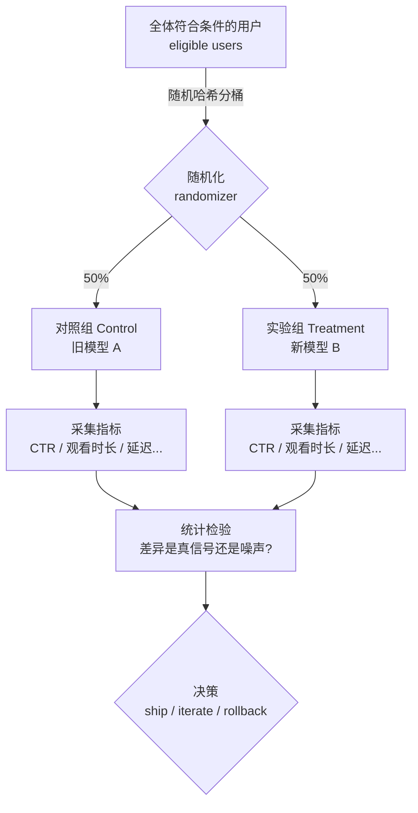

> 🔬 **第一性原理**：为什么"随机分组"能推断因果？
> 因为**随机化**保证了两组在**所有其他因素**（年龄、地区、设备、使用习惯、乃至你没想到的隐藏变量）上的分布**在统计上一致**。于是两组唯一系统性的差别就是"有没有拿到新模型"。这样一来，指标的差异就可以**归因**到模型改动，而不是"实验组恰好年轻人多"。随机化是把**相关性（correlation）升级为因果性（causation）** 的唯一低成本手段——这也是为什么后面辛普森悖论、样本比不匹配（SRM）这些破坏随机性的问题如此致命。

### 6.1.2 为什么离线评估不够，非得在线测？

原书 6.1.1 把这点讲得很透。离线评估**快、可复现、适合早期迭代**，但它给的只是**预测**，不考虑真实用户行为、上下文漂移，以及模型与真实产品环境交互时那些**不可预料的方式**。两种典型翻车：

- **离线看着完美，上线却退化**：模型在历史数据上 NDCG 很高，但真实用户面对它时行为变了。
- **离线一般般，上线却惊喜**：离线指标平平，A/B 测试却拿到意外正收益。

**AI 模型为什么尤其如此？** 因为模型几乎从不是一个孤立组件——它会**改变产品体验本身**：

- 推荐模型改变了"用户看到什么"；
- 排序模型改变了"用户点什么"；
- 生成模型改变了"用户读什么、信什么、忽略什么、据此做什么"。

> ⚠️ **常见坑：反馈回路（feedback loop）**
> 一旦模型改变了产品体验，它就**改变了未来指标所测量的那个行为本身**。例如推荐模型把某片推到 #1，用户点它——不是因为想看，而是因为它在 #1（**位置偏差 position bias**）。这个点击又回流进训练数据，强化"这片受欢迎"的信号，形成自我实现的偏差回路。这正是 6.5 节 Batman/Thor 案例的根因。离线评估**永远看不到**这种回路，因为回路只在真实用户交互时才闭合。

> 💡 **A/B 测试是一种思维方式（mindset）**（原书 6.1 小框）
> 它训练你**把"我希望发生什么"和"实际发生了什么"分开**。做 AI 模型时这尤其重要，因为模型改进"很有说服力"——demo 看着惊艳、离线指标朝对的方向动、几个定性例子让新模型"显然更好"。**但你不是要证明你的想法对，你是要搞清楚这个改动到底有没有让产品变好。**

---

## 6.2 什么时候该给模型做 A/B 测试？

原书 6.2 给了三个判断维度：**模型成熟度、时间线、离线评估的可信度**。先讲一个统领性概念——**离线出闸标准（offline exit criteria）**。

### 6.2.1 离线出闸标准：进 A/B 测试前的最低门槛

> 出闸标准 = 一个模型**成为在线测试候选**前应满足的最低条件。

原书列的清单（务必背下来，面试高频）：

1. ✅ 主离线指标上**打赢当前基线（baseline）**。
2. ✅ 关键**守卫指标**（延迟、成本、安全、公平、校准 calibration）都在可接受范围。
3. ✅ **分段诊断（segment-level diagnostics）** 没暴露关键用户群（内容类型/语言/地区/流量模式）的不可接受退化。
4. ✅ **错误分析（error analysis）** 表明剩余的失败模式已被理解到"能在线监控"的程度。
5. ✅ 模型在**真实、近期、有代表性**的数据上测过，而不只是顺手的开发样本。
6. ✅ 团队对"在线实验里**应该改善什么**、**可接受哪些权衡**"有清晰假设。

> ⚠️ 满足这些**不能证明模型会在线成功**——离线评估终究是近似。它只回答一个务实的问题：**这个模型是否足够有希望且足够安全，值得去干预线上产品？**

### 6.2.2 模型成熟度决定策略（原书 Table 6.1）

这是本章第一张核心对比表。把它内化成一条轴：**左端=早期原型，右端=成熟生产模型**，两端的 A/B 策略截然不同。

| 模型成熟度 | 策略焦点 | A/B 设计 | 指标类型 | 核心目标 |
|---|---|---|---|---|
| **早期/原型**（产品场景没全覆盖） | 方向性学习；验证概念 | 短、小范围、低曝光 | **特征级指标**（CTR、停留时长 dwell time），快速拿早期洞察 | 真实用户接触时"这个想法立不立得住"；能否复现行业研究/别家公司看到的效应 |
| **迭代早期模型**（早期 A/B 已见苗头） | 验证细化；建立信心 | 更宽、多分段、多轮 | 特征级 + **选择性 top-line 指标** | 好想法能否**跨更多用户/场景**迁移 |
| **成熟生产模型** | 精度提升；测增量或长期效应 | 更长期的 **holdback** 和 A/B | **Top-line 指标**、生产留存、特征级、精细目标 | 持续优化，对齐业务与产品目标 |

**怎么用这张表？** 原书给了一句可操作的判据：

> - 如果你问的是 **"这个模型方向可行吗（is this direction viable）?"** → **早测**（早期、轻量、特征级敏感指标）。
> - 如果你问的是 **"这个新版本更好吗（is this version better）?"** → **精测**（更严谨、top-line + 特征级、防退化监控、考虑长期 holdback）。

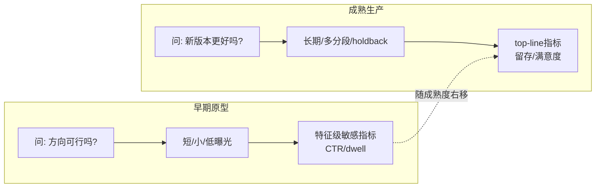

> 💡 **实战：为什么"第一次上线新模型不测留存"？**
> 原书点破：全新模型第一次进 A/B，你**极不可能**测留存（retention）。因为留存是**长反馈周期、高方差、低敏感度**的 top-line 指标，需要几周甚至几月、海量样本才动得起来。早期你要的是**快信号**——CTR、点击、停留这类**秒级反馈的特征级指标**，才能快速判断"方向对不对"。指标敏感度与实验时长/样本量的关系，见 6.4 的统计部分。

### 6.2.3 离线评估强弱决定 A/B 风险（原书 Table 6.2）

| 离线评估强度 | 优点 | 缺点 | 你需要什么 |
|---|---|---|---|
| **强**（诊断+性能+反事实三管齐下 + 分段/边缘案例分析） | 对模型行为高置信；**能更早开测**；在线少惊吓 | 前期投入大；离线迭代周期长 | 三类评估齐全 + 分段分析 |
| **弱**（仅基础性能指标、notebook 里跑跑、诊断/群组分析有限） | **更快到在线**；更早拿真实用户信号 | 误读结果风险高；调试更被动；更可能暂停/回滚/重跑 | **紧观测**（实时看板、告警）+ 守卫指标 + **清晰快速的回滚预案** |

一句话总结这张表的哲学：**离线越强，你越能"早开测且睡得着"；离线越弱，你也可以开测，但要用"更强的观测和回滚"来换"更弱的先验置信"——即"用谨慎换信心（trading confidence for caution）"。**

> ⚠️ **A/B 测试不是"基础模型理解"的替代品。** 如果你不知道模型在哪表现好、在哪崩、哪些用户群受影响不同，那么"看到一个指标动了"你也解释不清——到底是模型质量、数据漂移、定向、日志、延迟，还是**离线指标与在线产品目标不匹配**？

---

## 6.3 设计一个 A/B 测试：分层洋葱模型（原书 Figure 6.2）

原书用一个**同心圆/洋葱**来组织 A/B 设计：**越靠外越是表层运营逻辑、越靠核心越是根本且不可逆的决策**。反直觉的是——**设计时要从内核往外想，执行时从外往内落**。

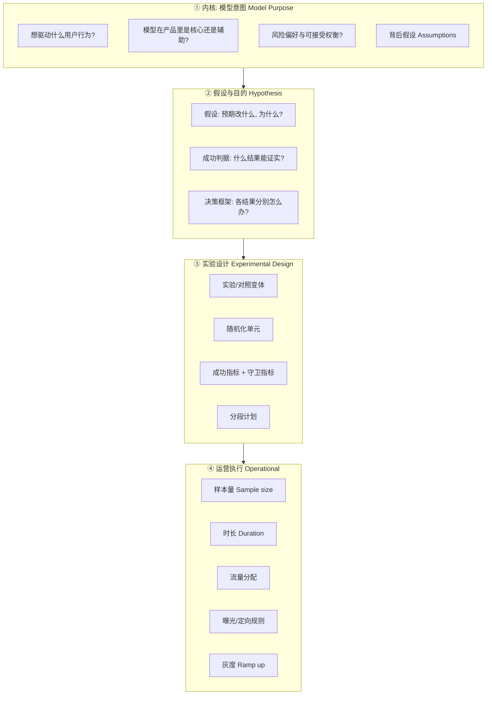

### 6.3.1 最外层：运营执行（Operational setup）

**"测试怎么跑"的执行细节**：

- **样本量（sample size）**：多少用户进测？——由中层指标敏感度**倒推**（见 6.4 功效分析）。
- **时长（duration）**：跑多久？
- **流量分配（traffic allocation）**：每个变体分多少流量？
- **曝光/定向规则（exposure rules / targeting criteria）**：谁看到什么？
- **灰度（ramp up）**：逐步分配还是一次性全量？

**定向规则的实战价值**（原书举例）：只在 Android 上有效的改动，就别把 iOS 用户放进实验；模型在英语市场更好，就按地理区定向；算力贵的大模型，先只投**付费用户/高端机型**。定向让你**策略性地选择"在哪里测"**。

> ❓ **原书专门解释：样本量为什么算"外层"而不是"实验设计层"？**
> 因为样本量**由中层指标敏感度决定，但落在外层执行**。逻辑链是：
> - 高方差指标（day-to-day 波动大）→ 需要**更长实验或更大样本**才能测出真变化；
> - 稀有事件指标（转化、购买）→ 需要**更多数据**才能达到统计显著 → 测试**时长（外层执行）** 可能更长。

### 6.3.2 中间层：实验设计（Experimental design）

**"测什么、怎么解读"的核心机制**：

- **实验/对照变体**：改的是什么？基线是什么？
- **随机化单元（unit of randomization）**：按 user / session / account / device 随机？
- **指标（metrics）**：拿什么衡量影响？
- **分段计划（segmentation plans）**：哪些群组要单独分析？
- **守卫指标（guardrail metrics）**：监控什么以防退化？

> 💡 **守卫指标比看起来重要得多。** 原书原话：你可能造出一个"碾压成功指标"的模型，却**顺手搞坏了用户留存或制造了偏见问题**。守卫指标就是你的**安全网**——它们不必朝好的方向动，但绝不能坏。

> ⚠️ **CTR 上升 ≠ 好事**（原书经典警句）：也许你的模型提高了点击率，但你得深挖——是用户**真的找到了更好内容**，还是模型**更擅长做标题党（clickbait）** 了？这就是为什么要有**成功指标 + 守卫指标 + ad-hoc 分析**三件套。

### 6.3.3 假设与目的（Hypothesis and purpose）

**实验的"why"**。原书强调这是**级联瀑布（cascading waterfall）**：如果你不确定"想学到什么"，你就不确定"该选什么指标""曝光规则怎么定"——一路错下去。

- **假设（hypothesis）**：预期的变化是什么，为什么？
- **成功判据（success criteria）**：什么结果能证实假设？
- **决策框架（decision framework）**：**每种结果分别怎么办**？（ship 到全量的阈值是什么？什么情况需要继续迭代再放大？）

### 6.3.4 最内核：模型意图（Model purpose & intent）

**"why 背后的 why"**——常被低估却影响最大。跳过它，你会跑出一个**"数值上通过了、却回答不了'这是不是产品该要的模型'"** 的 A/B 测试。

- **意图中的用户行为（intended user behavior）**：你希望模型驱动什么改变？更快发现内容？降流失？更好个性化？提升信任？——这定义了"影响（impact）"在语境里到底指什么。
- **模型的产品角色**：核心支柱还是辅助功能？决定其测试结论的分量。
- **风险画像与可接受权衡**：你愿意为这个模型冒多大风险？
- **假设（assumptions）**：每个模型都建立在对用户行为、数据可靠性、系统动态的假设上——在这一层**诚实地写下你假设为真的东西**。

> ⚠️ **最重要的一句：避免"假胜利（false wins）"**——那些数值上赢了、却不对齐产品目标的结果。明确内核意图，你才能写更好的假设、选更相关的指标、更有效地解读模糊结果。

### 6.3.5 解读结果前，先做有效性检查（Validity checks）

原书 6.3.5 是**血泪浓缩**。核心区分——**分配（assignment）≠ 曝光（exposure）**：

- **分配（assignment）**：用户被放进了对照/实验组。
- **曝光（exposure）**：用户**真的经历了**改动后的模型输出。

在真实产品系统里，二者**常常不相等**：用户被分到实验组，但**从没触发**模型所在的界面；或触发了，但模型**失败、回退（fallback）到另一条排序路径、或返回上一版模型的缓存结果**。**如果你只记 assignment 不记 exposure，你会把"从没见过实验"的用户当成"受了实验"来分析——结论直接崩。**

解读指标前必须过的检查清单（面试高频，逐条记）：

| 检查项 | 问什么 |
|---|---|
| **随机化** | 用户是否用**预定的随机化单元**（user/account/session/device）随机分配？ |
| **样本比（sample ratio）** | 观测到的流量分割是否匹配计划？50/50 设计实际是不是约 50/50？（不匹配即 **SRM**，见下方专栏） |
| **曝光日志** | 是否既记了分组、也记了"用户实际看到模型输出没有"？ |
| **模型版本日志** | 能否识别**哪个模型版本/特征集/排序逻辑/prompt/后处理规则**被服务了？ |
| **回退行为** | 系统是否对部分用户回退到对照模型/缓存/默认规则/空响应？ |
| **重叠实验** | 用户是否**同时**在另一个影响相同指标/界面的实验里？（辛普森悖论/干扰的温床） |
| **指标埋点一致性** | 成功/守卫指标在各变体间计算是否一致？ |
| **预先声明的分段** | 哪些分段分析是**实验前**定的，哪些是**看了数据后**才发现的？（HARKing 风险） |
| **停止规则（stopping rules）** | 时长/决策规则是**开测前**定的，还是"结果好看就提前停"？（**偷看**，见 6.5+专栏） |

> 🔬 **专栏：Sample Ratio Mismatch（SRM，样本比不匹配）**
> 你设计 50/50，但实际收到 51.8% / 48.2%——这看着"差不多"，其实**极可能是致命 bug**。用卡方检验（chi-square）可判：假设各 50 万用户，实测 518000 vs 482000，卡方统计量 $\chi^2 = \sum \frac{(O-E)^2}{E} = \frac{18000^2}{500000}\times 2 = 1296$，对应 p 值 $\approx 10^{-283}$——**天文数字级显著**，绝非偶然。SRM 通常意味着：分桶哈希有 bug、某变体的埋点在崩溃前丢了用户、bot 流量只进了一组、或某组因延迟高而用户提前离开（**幸存者偏差**）。**SRM 一旦触发，整个实验作废，先修 bug 再重跑，别硬解读指标。**

### 6.3.6 完整案例：电影推荐 A/B 测试（原书 6.3.6）

把洋葱模型从内到外走一遍。**背景**：流媒体平台，已有生产推荐模型（用户 embedding + 内容 embedding + 历史交互）。新版加了**上下文特征**（设备类型、时段、近期搜索）。这不是全新体验，是**对核心界面的增量改进**——所以测试不仅问"新模型是否提升 engagement"，还要问**"这提升是否值得去动一个已经能用的生产推荐器"**。

**① 内核（意图）**：让用户**更快、更省事地找到想看的**。推荐是核心，小指标波动也重要。风险面：别给重要群体降质、别增延迟、别过度优化短期点击而牺牲长期满意。

**核心假设**：
- 上下文信号（设备/时段/近期搜索）能预测观看意图；
- 这些信号在现有 user/content embedding **之外**还有增量价值；
- 新特征能**可靠且够快**地服务；
- CTR/观看时长的提升，**只有在守卫指标稳定时才算数**。

**② 假设与成功判据**：
> 假设：给现有推荐模型加上下文特征，会提升相关性，从而带来更高 CTR 和观看时长，**同时不增延迟、不降满意度**。

| 指标层级 | 具体指标 |
|---|---|
| **主指标（primary）** | 推荐 CTR、每会话平均观看时长 |
| **次指标（secondary）** | 内容发现率（每用户每周尝试的新片/新类型数） |
| **守卫指标（guardrail）** | 推荐延迟、播放启动数、用户满意信号、错误率、留存敏感指标 |

**上线判据（launch criterion）**：实验组**至少改善一个主指标**且守卫无实质退化。若主指标动得小，团队要**权衡收益 vs 增加的模型复杂度、服务成本、运营风险**。

**③ 实验设计（变体）**：1 对照 + 2 实验，回答"上下文特征该给多大权重"这个具体问题：
- **Control**：当前生产模型；
- **Treatment A**：+上下文特征，**保守权重**；
- **Treatment B**：+上下文特征，**更强权重**（重仓近期搜索和会话上下文）。

**④ 运营执行**：
- **随机化单元**：user-level（同一用户整段实验体验一致）；
- **曝光规则**：纳入"过去 14 天至少看过 1 部"的活跃用户；**排除已在同界面其他推荐实验里的用户**（防重叠实验/干扰）；
- **时长**：4 周，头几天算**稳定期**（缓存/索引/warm-up 效应）；
- **样本量**：开测前基于基线率和**最小可检测效应（MDE）** 用**功效分析（power analysis）** 算，**不用拍脑袋的经验值**。

**决策框架（开测前就定死）**：

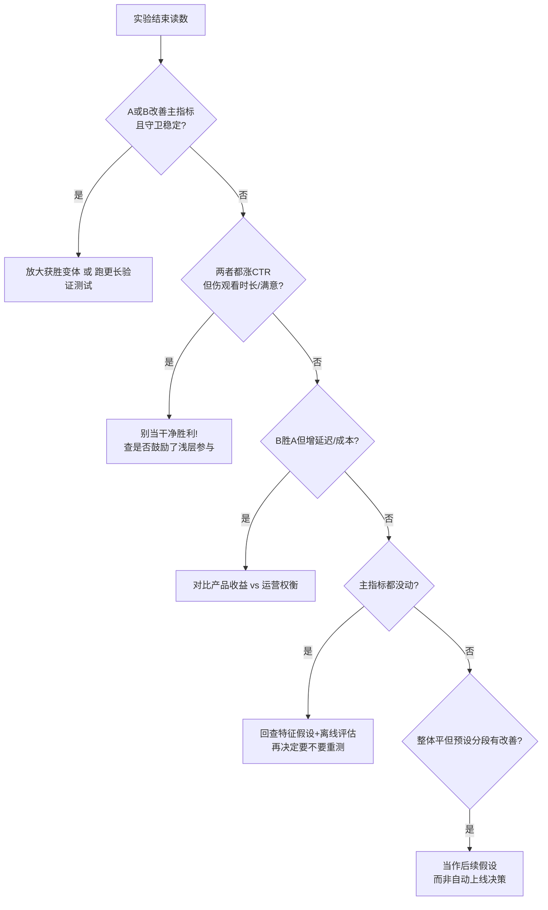

> 💡 这个案例的精髓：**A/B 测试不只问"模型是否更好"，而是问"模型是否为对的用户、在真实服务约束下、创造了足够的产品价值，值得上线"。**

---

## 6.4 A/B 测试的统计学地基（重点·本质）

> ⚠️ 原书正文对纯统计（p 值、置信区间、功效）着墨不多——它更偏产品方法学。但**这一节是本章要点明确要求"讲透"的部分**，我把统计地基从零到进阶铺开，每个概念讲**是什么/为什么/怎么算/代价**。这是 AI 工程师面试和实战的硬通货。

### 6.4.1 假设检验：整个 A/B 的推理骨架

我们想知道"新模型是否真的改善了指标"。但我们只有**一小撮用户的样本**，样本天生有噪声。假设检验（hypothesis testing）是**在噪声中做判断的形式化框架**：

- **原假设（null hypothesis, $H_0$）**：新模型**没有效果**，两组指标真实差异 = 0。观测到的差异纯属**随机波动**。
- **备择假设（alternative hypothesis, $H_1$）**：新模型**有效果**，真实差异 ≠ 0（双尾）或 > 0（单尾）。

**推理逻辑（反证法思维）**：我们**先假设 $H_0$ 为真**，然后问："如果新模型真没用，那我观测到这么大（甚至更大）的差异，纯靠运气发生的概率有多大？" 这个概率就是 **p 值**。若这概率**小到离谱**（比如 < 5%），我们就说"运气解释不了，倾向于拒绝 $H_0$"。

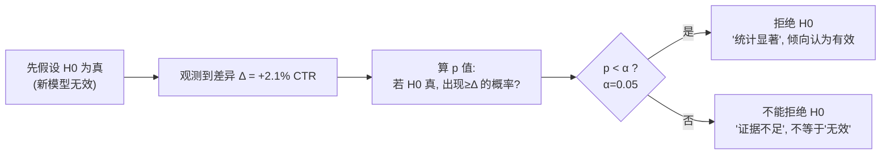

### 6.4.2 p 值：最被误解的数字

**p 值（p-value）的精确定义**：

> **假设 $H_0$ 为真**，观测到"当前这么极端或更极端"的结果的概率。

用一个具体数值走一遍。假设电影推荐实验：

- 对照组 CTR = 10.0%（$n_C = 500{,}000$）
- 实验组 CTR = 10.21%（$n_T = 500{,}000$）
- 观测提升 $\Delta = 0.21\%$（绝对），即 **+2.1% 相对**。

两比例差的检验统计量（z 检验）：

$$
z = \frac{\hat{p}_T - \hat{p}_C}{\sqrt{\hat{p}(1-\hat{p})\left(\frac{1}{n_T}+\frac{1}{n_C}\right)}}, \quad \hat{p}=\frac{x_T+x_C}{n_T+n_C}
$$

代入 $\hat p \approx 0.10105$，标准误 $SE=\sqrt{0.10105\times0.89895\times(2/500000)}\approx 0.000603$，于是

$$
z = \frac{0.1021-0.1000}{0.000603}\approx 3.48 \;\Rightarrow\; p \approx 0.0005
$$

**怎么读这个 p=0.0005？**
> "如果新模型真的一点用都没有，那我看到 +0.21% 或更大的 CTR 差异，纯靠随机运气发生的概率只有 0.05%。" 这太罕见了，所以我们拒绝"无效"的假设。

> ⚠️ **p 值的四大误读（面试必考，逐条纠正）**：
> 1. ❌ "p=0.0005 意味着新模型有效的概率是 99.95%" → **错**。p 值是"给定 $H_0$，看到数据的概率 $P(\text{data}\mid H_0)$"，**不是**"给定数据，$H_0$ 为真的概率 $P(H_0\mid \text{data})$"。二者是贝叶斯定理里被颠倒的方向。
> 2. ❌ "p 越小，效应越大" → **错**。p 反映的是**证据强度（含样本量）**，不是**效应大小（effect size）**。100 万样本能让 +0.01% 这种毫无产品意义的差异也 p<0.001。**永远同时看效应量和置信区间。**
> 3. ❌ "p>0.05 证明新模型无效" → **错**。"不能拒绝 $H_0$" ≠ "$H_0$ 成立"。可能只是**样本不够（underpowered）**，见 6.6。
> 4. ❌ "p=0.05 是宇宙真理" → **错**。α=0.05 只是 Fisher 定的社会约定，不是物理常数。高风险决策该用更严的 α（如 0.01）。

### 6.4.3 显著性水平 α 与两类错误

**显著性水平（significance level, α）**：你**预先**设定的"愿意承担的假阳性风险"，通常 0.05。判据：$p < \alpha$ 则"统计显著（statistically significant）"。

两类错误——**这张表是整个统计推断的心脏**：

| | $H_0$ 实际为真（模型真没用） | $H_0$ 实际为假（模型真有用） |
|---|---|---|
| **判为显著**（拒绝 $H_0$，上线） | ❌ **第一类错误 Type I**<br/>假阳性 FP，概率 = **α**<br/>*上线了一个没用的模型* | ✅ 正确（power = 1−β） |
| **判为不显著**（不拒绝，不上线） | ✅ 正确 | ❌ **第二类错误 Type II**<br/>假阴性 FN，概率 = **β**<br/>*错杀了一个好模型* |

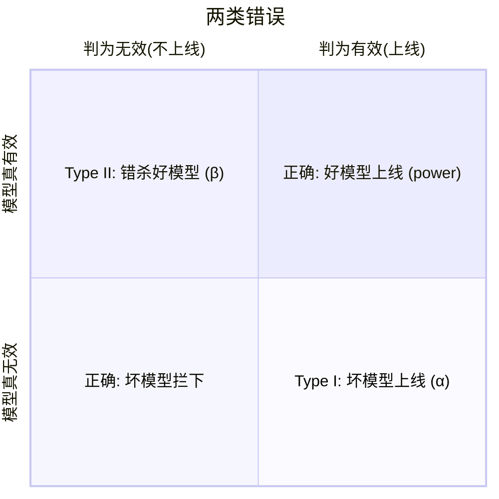

> 🔬 **第一性原理：α 和 β 此消彼长。**
> 把 α 调更严（如 0.01），你更少犯"上线坏模型"的错，但**代价**是更容易"错杀好模型"（β 上升、power 下降）。二者的唯一"双赢"办法是**加大样本量**——样本越多，两组分布重叠越少，两类错误可同时压低。这就是为什么 6.4.5 的样本量公式里 α 和 β 都出现。

### 6.4.4 置信区间：比 p 值信息量大得多

**置信区间（confidence interval, CI）**：给效应量一个**区间估计**而非单点。95% CI 的定义：

> 若把整个实验重复无数次，每次算一个 95% CI，那么**约 95% 的这些区间会覆盖真实效应值**。

接上例，+2.1% 相对提升的 95% CI（用绝对差 $\Delta=0.0021$，$SE\approx0.000603$）：

$$
CI_{95\%} = \Delta \pm 1.96 \times SE = 0.0021 \pm 1.96\times 0.000603 = [0.00092,\; 0.00328]
$$

换算成相对提升约 **[+0.9%, +3.3%]**。

**为什么 CI 比 p 值好用？** 它一次给你三件事：

1. **是否显著**：CI 不含 0 → 等价于 p<0.05 显著。
2. **效应多大**：点估计 +2.1%。
3. **不确定性多大 / 是否值得上线**：区间 [+0.9%, +3.3%]。哪怕最差情况 +0.9% 也是正的且或许值回票价——**这是 p 值单独给不了的产品决策信息**。

> 💡 **实战对比：两个都"显著"的实验，CI 讲了完全不同的故事**

| 实验 | 点估计 | 95% CI | p 值 | 决策解读 |
|---|---|---|---|---|
| 甲（样本大） | +2.1% | [+0.9%, +3.3%] | 0.0005 | 稳，最差也 +0.9%，可上线 |
| 乙（样本小） | +8.0% | [+0.3%, +15.7%] | 0.04 | 点估计诱人但**区间极宽**，可能只 +0.3%（无意义）也可能 +15.7%；**证据不足，需加样本重测** |

> ⚠️ 只看 p 值，乙（p=0.04）也"显著"，容易冲动上线。看 CI 立刻发现乙**极不稳定**——这是**欠功效（underpowered）** 实验的典型面貌。

### 6.4.5 统计功效与样本量：开测前的核心计算

**功效（statistical power = 1 − β）**：当**模型真的有效**时，你的实验**能检测出来**的概率。行业惯例 power = 0.80（即容忍 20% 假阴性）。

四个量互相锁定，定三个求第四个：

$$
n \;\approx\; \frac{2\,(z_{1-\alpha/2}+z_{1-\beta})^2\,\sigma^2}{\Delta^2}
\quad\text{(每组样本量, 连续指标近似)}
$$

对**比例指标**（如 CTR）：

$$
n \;\approx\; \frac{(z_{1-\alpha/2}+z_{1-\beta})^2\,\big[p_C(1-p_C)+p_T(1-p_T)\big]}{(p_T-p_C)^2}
$$

- $z_{1-\alpha/2}=1.96$（α=0.05 双尾），$z_{1-\beta}=0.84$（power=0.80）。
- $\Delta$ = **最小可检测效应（Minimum Detectable Effect, MDE）**——你**在乎的最小提升**。
- $\sigma^2$ = 指标方差（高方差指标 → 需要更大 n）。

**走一个数值**：基线 CTR $p_C=10\%$，想检测 **+2% 相对提升**（$p_T=10.2\%$，$\Delta=0.002$）：

$$
n \approx \frac{(1.96+0.84)^2 \times [0.1\times0.9 + 0.102\times0.898]}{0.002^2}
= \frac{7.84 \times 0.1816}{0.000004} \approx 356{,}000 \;\text{每组}
$$

即**每组约 35.6 万、双组约 71 万用户**才能以 80% 功效检出 +2% 相对提升。这就是原书说"样本量来自 power analysis，不是经验拍脑袋"的含义。

> 🔬 **四个旋钮的方向感（务必内化）**：分母是 $\Delta^2$，所以
> - **MDE 减半 → 样本量 ×4**（要检测更小的效应，代价是四倍数据）。这是最贵的旋钮。
> - **指标方差 $\sigma^2$ 越大 → n 越大**（这就是"高方差指标要更大样本/更长时间"的数学原因）。
> - **要更高 power（0.80→0.90）→ n 上升**（$z$ 从 0.84 升到 1.28）。
> - **α 更严（0.05→0.01）→ n 上升**（$z$ 从 1.96 升到 2.58）。

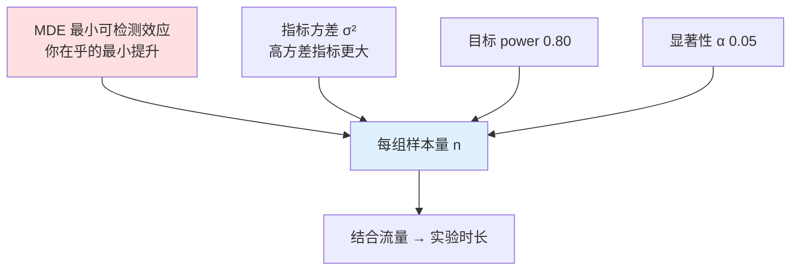

> 💡 **实战面试题：产品经理说"跑 3 天看看就行"，你怎么回答？**
> 先反问三件事：(1) 主指标基线率和方差多少？(2) 你在乎的 MDE 是多少（+1%？+5%？）？(3) 每天有多少符合条件的流量？——把这三个代进上面公式，如果算出需要 71 万样本而每天只有 10 万流量，那"3 天"必然**欠功效**，跑了也是白跑（大概率 p>0.05 但你无法区分"真没用"还是"没测出来"）。**这正是 6.6 节"underpowered"陷阱。**

---

## 6.5 三大杀手级陷阱（要点核心）

原书 6.5 讲了 AI 模型特有的 quirks，6.3.5 讲了 validity checks。本节把要点要求的**三个经典统计陷阱**——**偷看、辛普森悖论、多重检验**——单独拎出来讲透，再补 AI 特有的三个 quirk。

### 6.5.1 陷阱一：偷看 / 提前停止（Peeking / Optional Stopping）

**是什么**：实验还没到预定样本量/时长，你就**反复盯着 p 值看，一旦 p<0.05 就停下宣布胜利**。

**为什么致命**：α=0.05 的保证是**针对"只在终点看一次"** 的。如果你每天看一次、看 20 次，那么"至少有一次偶然 p<0.05"的概率**远超 5%**。这就是**多重检验在时间维度上的变体**。

> 🔬 **第一性原理**：即便 $H_0$ 完全为真（模型真没用），p 值随时间也在**随机游走（random walk）**。你看的次数越多，它**偶然跌破 0.05** 的机会越大。数值感受：连续看 5 次，实际假阳性率从 5% 飙到约 14%；看 10 次约 19%；无限频繁地看，**理论上假阳性率趋近 100%**——也就是说，只要你有耐心偷看，任何 A/A 测试（两组其实一模一样）迟早都会给你一个"显著"结果。


**怎么防**：
1. **开测前定死样本量和时长**，到点才看（原书 validity check 里的 **stopping rules**）。
2. 若确实要中途看，用**序贯检验（sequential testing）** 专门方法：**always-valid p-values**、**mSPRT**、**group sequential（O'Brien-Fleming / Pocock 花费函数）**——它们通过**动态收紧阈值**来保证整体 α。Statsig / Eppo 等平台内置这类方法，就是为了让你"能安全地偷看"。
3. 用**贝叶斯 A/B**（直接算 $P(\text{B优于A})$）也天然免疫偷看问题。

> ⚠️ 原书在 novelty effect（6.5.2）里给的建议同源：**别只凭早期数据下上线决策**。让实验跑够长，初期好奇心退去、行为稳定后再判断。

### 6.5.2 陷阱二：辛普森悖论（Simpson's Paradox）

**是什么**：**在每个子群里实验组都赢，合并到一起却输了**（或反之）。分组趋势和汇总趋势方向相反。

**为什么发生**：**混杂变量（confounder）+ 分组样本量失衡**。当两组在某个子群上的**流量占比不同**时，汇总会被占比大的子群"稀释/淹没"。

**一个具体数值**（推荐实验，按新老用户分层）：

| 分段 | 对照组 CTR | 实验组 CTR | 各段谁赢 |
|---|---|---|---|
| **新用户** | 5% (2000/40000) | 6% (**60**/1000) | 实验组赢 ✅ |
| **老用户** | 20% (200/1000) | 21% (8190/39000) | 实验组赢 ✅ |
| **汇总** | **5.37%** (2200/41000) | **20.6%** (8250/40000) | ？ |

上面数字我特意构造得极端来暴露机制。换一组更清晰的**方向反转**经典数值：

| 分段 | 对照组 | 实验组 |
|---|---|---|
| 新用户 | 1%（10/1000） | 2%（**180**/9000） ✅实验赢 |
| 老用户 | 30%（2700/9000） | 40%（**400**/1000） ✅实验赢 |
| **汇总** | **27.1%**（2710/10000） | **5.8%**（580/10000） ❌**实验输!** |

**解读**：两个子群里实验组**都赢**，但因为实验组的流量**大量堆在低 CTR 的"新用户"段**（9000 vs 对照的 1000），而对照组的流量堆在高 CTR 的"老用户"段——**汇总时实验组被自己的用户结构拖垮了**。这通常源于**SRM 或定向 bug**——随机化在子群层面失效了。

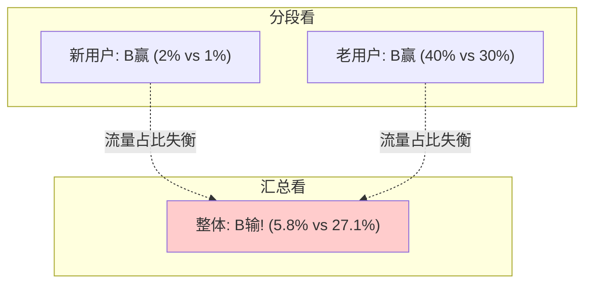

> ⚠️ **怎么防辛普森悖论**：
> 1. **先查 SRM 和分段随机化**——正常的随机化会让每个子群里的 T/C 占比也大致相等；若某子群 T/C 严重失衡，随机化已破。
> 2. **预先声明关键分段**（validity check 里的 pre-planned segments），分段看 + 汇总看**都要看**，方向不一致就深挖。
> 3. 用**分层分析（stratified / CUPED / 回归调整）** 控制混杂变量。
> 4. 原书的对应建议：**排除重叠实验**、按 user-level 随机化保证一致性——都是在保护"子群层面的随机性"。

### 6.5.3 陷阱三：多重比较（Multiple Comparisons）

**是什么**（原书 6.5.1 明确讲了）：AI 模型测试**常有多个实验变体**（多版本、多特征权重、多 prompt、多检索策略）。**比较的变体/指标越多，"至少一个假阳性"的概率越高。**

**数学**：单次假阳性率 α=0.05，做 $m$ 次独立比较，**至少一个假阳性**的概率（**族错误率 FWER**）：

$$
\text{FWER} = 1 - (1-\alpha)^m
$$

| 比较次数 m | FWER（至少一个假阳性） |
|---|---|
| 1 | 5% |
| 5 | 22.6% |
| 10 | **40.1%** |
| 20 | **64.2%** |

**测 20 个指标/变体，几乎必然有一个"显著"是纯运气。** 这就是原书警告的"别为了好玩上线 8 个变体"的统计根源。

**两种校正法（原书点名）**：

| 方法 | 做什么 | 代价 | 适用 |
|---|---|---|---|
| **Bonferroni 校正** | 阈值收紧为 $\alpha/m$（如 10 个比较用 0.005） | 非常保守，power 大降，易错杀 | 比较数少、要严控 FWER（安全/合规） |
| **FDR 校正**（Benjamini-Hochberg） | 控制"显著结果中假阳性的**期望占比**"而非"至少一个" | 更宽松、保 power | 比较数多、探索性分析 |

> 🔬 **Bonferroni vs FDR 的哲学差异**：
> - **FWER（Bonferroni）** 问："我能否保证**一个假阳性都不犯**？"——太严，海量比较下几乎啥都测不出。
> - **FDR（BH）** 问："在我宣布显著的结果里，**平均最多允许 5% 是假的**，行不行？"——更务实。做 100 个特征漂移检测时，你不在乎"绝对零假阳性"，你在乎"报出来的漂移里绝大多数是真的"，此时 FDR 完胜。

> ⚠️ **原书 EXPERIMENTAL DESIGN 小框的忠告**：*别因为"能"就上线 8 个模型变体。* 每个变体背后**必须有清晰假设**和"结果这样/那样分别怎么解读"的预案。无假设的分支只是在**制造噪声**，还让多重比较问题雪上加霜。

### 6.5.4 AI 模型特有的 quirks（原书 6.5 精华）

除三大经典陷阱，AI 模型 A/B 还有这些"非 AI 特征测试里不会出现"的怪癖：

| Quirk | 是什么 | 怎么坑你 | 怎么防 |
|---|---|---|---|
| **新奇效应 novelty effect** | 用户初见新体验会**因为"新"而非"好"**更多互动 | 早期指标虚高，novelty 退去后回落到基线 | 别凭早期数据决策；按周画主指标——**真改进会保持/增长，novelty 会衰减** |
| **冷启动/预热 cold start & warm-up** | 自适应模型（bandit/RL）、带缓存/索引/embedding 的模型**第 1、2 天不在最佳状态** | 把冷启动行为误当模型真实质量 | **预设稳定期**再开测：自适应模型等 5–7 天；带缓存的排 1–3 天；稀有事件模型 2–4 周 |
| **高方差 variance** | AI 影响的常是微妙/下游行为，测量结果大幅波动 | 效应量乱摆，真好真坏分不清；假阳/假阴都升 | 谨慎选指标 + 足够样本 + 稳定指标 + 稳健评估窗口（回到 6.4 功效） |
| **离线-在线不匹配** | 离线好、在线差 | 数据陈旧/标签只近似真实行为/训练数据过采某群/特征在生产里延迟缺失噪声 | 别急着单一归因；用 A/B 结果做**诊断起点**：比分段、查日志、验模型输入、查曝光、回看离线设计 |

> 💡 **原书 warm-up 的具体阈值（可直接抄进 runbook）**：
> - 自适应/在线学习（bandit、RL 推荐器）：**至少 5–7 天** + 最少学习交互数；
> - 带缓存/检索/预索引（搜索、推荐）：**排除头 1–3 天**或直到缓存/索引/服务指标稳定；
> - 稀有事件（流失预测、欺诈检测）：**2–4 周**或足够正例；
> - **稳定期标准务必开测前定死**——可以是时间型（"排除头 3 天"）、量型（"每变体满 5 万曝光前不看"）、或稳定型（"延迟/缓存命中率/输出分布稳定后才开始"）。**模型 A/B 最稳的做法是三者都用。**

---

## 6.6 解读模糊/低信号结果（原书 6.6）

不是每次 A/B 都给你干净的赢家。结果模糊、嘈杂、平淡——**但这不代表实验没价值**。原书列了**低信号的四大成因**，每个对应不同的正确结论：

| 低信号成因 | 表现 | 正确结论（不是"模型无效"！） |
|---|---|---|
| **效应本就很小** | 成熟产品、现有模型已很强 | 问的不是"指标动没动"，而是"动的幅度**值不值**这份复杂度/成本/运营风险"。小正收益若改动**便宜、可靠、对齐战略**仍可上；若增延迟/成本/维护负担则未必 |
| **指标没对上模型意图** | 模型意在提升长期满意/信任/发现/留存，你却盯短期 CTR | 模型可能真在做有用的事，**你在错的地方找证据**。这就是为什么**成功判据要开测前定**——否则事后重新解释太容易自欺 |
| **实验欠功效 underpowered** | 用户太少/跑太短/测稀有结果 | 正确结论不是"模型无效"，而是**"这个实验不够敏感，测不出我在乎的效应"**（回到 6.4.5 样本量） |
| **整体平但分段有差异** | 帮了新用户没帮老用户；提升 mobile 没提升 desktop | **预先声明的分段** 是强证据；**事后发现的分段** 只当**后续假设**，不当自动上线决策 |

> ⚠️ **原书的黄金收尾**：*结果模糊时，抵制"到处找正面解释"的冲动。* 回到原始假设和决策框架，问自己：实验有效吗？用户真被曝光了吗？主指标和守卫指标方向一致吗？结果对得上离线评估吗？效应大到从产品/工程角度值得吗？——**A/B 的价值不在于总产出干净赢家，而在于给你做更好决策的证据。** 有时该上线，有时该迭代重测，有时该停止投这个方向。

> 💡 **面试高频对比：低信号 → "统计不显著" 的三种截然不同的下一步**
> 1. CI 很窄且贴近 0（如 [-0.1%, +0.2%]）→ 高置信地说"效应确实小/没有"，**可以停投**。
> 2. CI 很宽（如 [-5%, +8%]）→ **欠功效**，加样本重测，别下"无效"结论。
> 3. 整体平但预设分段 [新用户 +5%] 显著 → 当**新假设**，针对新用户重新设计实验。
> 三种都是"p>0.05"，但因为看了 CI 和分段，行动完全不同——**这就是为什么永远别只做"p 值猎手（p-value hunting）"**（原书 summary 原话）。

---

## 6.7 运行 A/B 测试的工程前提（原书 6.4 + 6.7）

AI 模型的 A/B 比传统 UX 组件改动**复杂得多**：模型行为会随时间漂移、推理成本会波动、隐蔽的基础设施问题能在你反应过来前就毁掉实验。开测前的关键前提：

### 6.7.1 延迟监控（Latency monitoring）——务必设为守卫指标

**推理延迟（inference latency）** = 模型收到输入后产出预测的耗时。它**直接影响用户体验**，也**直接污染 A/B 结论**：

> 🔬 **延迟是混杂变量（confounder）**：如果实验组模型更慢，实验组用户表现更差**可能是因为体验更慢，而非模型更不相关**；若更快，它"看起来更好"部分是因为产品**更跟手**。两种情况延迟都**混淆了实验解读**。

**所以延迟必须作为守卫指标**，实时追踪，并**按模型版本、实验组、地理、设备**等分段拆开看（第 4 章的 latency degradation test 可量化延迟对指标的影响）。

原书 6.7.1 补的**基础设施守卫指标**清单：

- **推理延迟**（time to prediction）
- **系统吞吐/容量上限**（每秒能扛多少请求）
- **CPU / GPU 利用率**
- **每请求成本**（大模型/外部 API 尤其关键，防止 vendor 成本飙升）

> ⚠️ **原书经典权衡案例**：新模型 CTR +2%，但页面慢了半秒。听着不多，但**规模化后毫秒累加**——用户跳出、产品变迟钝，你"改进"的模型反而拉低整体 engagement。更狠的："CTR +2% 但 GPU 成本翻倍"——如果不把基础设施指标放进看板/守卫，这种"赢"会**悄悄溜过去被当成胜利**。**工程性能必须是评估的一部分，不是事后才管的东西。**

### 6.7.2 特征漂移监控（Feature drift）——含逐行代码讲解

**漂移（drift）** = 模型依赖的数据/环境**随时间变化**，导致"训练时所见"与"生产中所见"不匹配。**特征漂移（feature drift）** 特指**输入特征的分布变了**（如产品更新后用户行为变了，模型看到的输入不再是训练时那种）。

原书给了两个检测工具，代码在 Listing 6.1 / 6.2。**逐行精讲：**

#### Listing 6.1 —— KS 检验检测特征分布漂移

```python
def kolmogorov_smirnov_test(training_feature, production_feature,
                            feature_name, threshold=0.05):
    """
    Perform KS test to detect distribution drift
    执行 KS 检验来检测分布漂移
    """
    # ① 双样本 KS 检验: 比较"训练特征"和"生产特征"两个分布是否同源
    statistic, p_value = stats.ks_2samp(training_feature, production_feature)

    # ② p < 阈值(0.05) 则判定为漂移:
    #    KS 的原假设 H0 = "两样本来自同一分布"; p 小 => 拒绝 => 分布不同 => 漂移
    drift_detected = p_value < threshold

    # ③ 打包结果, 并按 KS 统计量大小分级严重度
    result = {
        'feature': feature_name,
        'ks_statistic': statistic,      # KS 统计量 = 两累积分布函数间最大垂直距离, ∈[0,1]
        'p_value': p_value,
        'drift_detected': drift_detected,
        # statistic>0.2 判 HIGH, 0.1~0.2 判 MEDIUM, 否则 LOW
        'severity': 'HIGH' if statistic > 0.2 else 'MEDIUM' if statistic > 0.1 else 'LOW'
    }
    return result
```

**逐行讲**：
- **①** `stats.ks_2samp` 是 SciPy 的双样本 Kolmogorov-Smirnov 检验。原书点明它的优势：**对底层分布不作任何假设（non-parametric）**——它只问"两个数据集是否来自同一分布"，不像 t 检验要求正态。
- **② KS 统计量的几何含义**：两个经验累积分布函数（ECDF）之间的**最大垂直距离**。距离越大，两分布越不同。这里用 p<0.05 判显著漂移。
- **③** 用统计量本身（而非 p 值）分级严重度——**很关键**，因为 6.4.2 讲过：大样本下 p 值几乎必然极小（哪怕漂移微不足道），所以**用 statistic（效应量）分级，用 p_value 判有无**，二者分工。

> ⚠️ 这正是 6.4.2 "p 小 ≠ 效应大" 在生产监控里的直接应用：百万级流量下，任何微小分布差异都会让 p→0。若只按 p 报警，你会被淹没在无意义告警里。**必须看 KS statistic 的绝对大小。**

#### Listing 6.2 —— PSI（Population Stability Index）度量分布迁移

```python
def population_stability_index(training_feature, production_feature, bins=10):
    """
    Calculate Population Stability Index (PSI) to measure drift
    PSI < 0.1: No significant change      (无显著变化)
    0.1 <= PSI < 0.25: Some minor change  (轻微变化)
    PSI >= 0.25: Major shift in population (总体重大迁移)
    """
    # ① 用训练数据决定分箱边界(bin edges), 保证两侧用同一套箱子对比
    _, bin_edges = np.histogram(training_feature, bins=bins)

    # ② 用同一套 bin_edges 分别统计训练/生产的每箱频数
    training_counts, _   = np.histogram(training_feature,   bins=bin_edges)
    production_counts, _ = np.histogram(production_feature, bins=bin_edges)

    # ③ 归一化成百分比(每箱占比)
    training_pct   = training_counts   / len(training_feature)
    production_pct = production_counts / len(production_feature)

    # ④ 加一个极小常数, 避免后面 log(0) 或除零
    training_pct   = np.maximum(training_pct,   0.0001)
    production_pct = np.maximum(production_pct, 0.0001)

    # ⑤ 核心公式: PSI = Σ (生产占比 - 训练占比) * ln(生产占比 / 训练占比)
    psi = np.sum((production_pct - training_pct) * np.log(production_pct / training_pct))
    return psi
```

**逐行讲**：
- **①②** PSI 的关键前提是**两侧用同一套分箱边界**（都用训练数据定的 `bin_edges`），否则频数不可比。
- **③④** 归一化成概率分布；加 `0.0001` 是**数值稳定性技巧**——防止某箱在某侧为空时 `log(0)=-∞` 或除零把整个 PSI 炸成 NaN。
- **⑤** PSI 公式**本质是对称化的 KL 散度**：$\sum (P_{prod}-P_{train})\ln\frac{P_{prod}}{P_{train}}$。它同时惩罚"占比差 $(P_{prod}-P_{train})$"和"比率差 $\ln\frac{P_{prod}}{P_{train}}$"，给出一个**可解释的单一分数**。

**PSI 阈值口诀**：

| PSI 值 | 含义 | 行动 |
|---|---|---|
| < 0.1 | 无显著变化 | 正常 |
| 0.1 ~ 0.25 | 轻微迁移 | 关注 |
| **≥ 0.25** | **总体重大迁移** | **值得深查**——可能你的实验定向失效，或外部因素改变了测试人群构成 |

> 🔬 **KS 检验 vs PSI，何时用哪个？**
> - **KS** 给的是**假设检验结论**（有无漂移 + p 值），非参数、无需分箱，适合"要不要报警"的二元判断。
> - **PSI** 给的是**连续可解释分数**，适合"漂移**多严重**、要不要人工介入"的分级，且在特征已分箱（如信用评分卡）时天然契合。
> 原书建议**两者互补一起用**——KS 判有无、PSI 量程度。

> ⚠️ **原书强调的时机**：这些统计度量在 **A/B 执行的开头** 尤其重要。若核心特征（用户画像、会话模式、engagement 信号）在实验早期就显著漂移，往往说明**你的实验定向没按预期工作**，或外部因素改变了测试人群构成——此时该**暂停实验、查根因，或调整分析以纳入人群变化**。目标不是消除所有漂移（动态产品里不可能），而是**早发现重大迁移，判断它是否正在损害你的 A/B 结果**。

### 6.7.3 日志：解读结果的第一前提（原书 6.4.3 + 6.7）

原书说"日志会在每一章被提及，因为它太重要了"。A/B 语境下，**最少**要记：

- 谁被**分配**到哪个变体（assignment）；
- 谁**真正被曝光**给模型输出（exposure）；
- **哪个模型版本**被服务；
- 返回了什么**预测/排序**；
- 之后发生了什么**下游用户行为**。

**AI 模型尤其需要**，因为服务路径比看上去复杂：用户被分到实验组，但模型可能失败→回退默认排序；推荐可能来自缓存而非新部署模型；生成模型的响应可能被安全层过滤/改写/拦截后才到用户。**没这些日志，你以为在测一个模型的效果，实则测的是"模型行为 + 回退行为 + 基础设施"的混合物。**

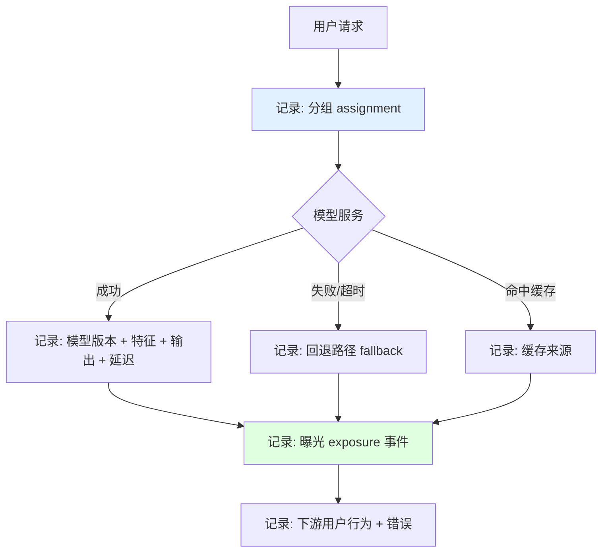

> 💡 有了完整日志你才能回答三个致命问题：**指标为什么动了？模型真的是原因吗？结果可信到能支撑上线决策吗？** 没有日志，调试就是猜谜（debugging becomes guesswork）。

### 6.7.4 没有 A/B 平台怎么办？（原书 6.7.2）

原书作者的真实经历：十年前在一家 Fortune 50 公司，产品在数百万用户手里、每天发版，**却不做 A/B 测试**——直到后来才搭了个最小实验平台来验证个性化的价值。**结论：不是每家大公司都有实验平台。**

三条务实出路：

1. **基于 feature flag 自建 barebones 版**：如果你已有特征开关系统，扩展它来**随机化曝光不同模型版本 + 按 user/session ID 记结果**——这就是最简陋但有用的实验。核心只需三件事：**能路由流量、能测关键指标、能追踪用户**。
2. **用 Experimentation-as-a-Service**：Optimizely、Eppo、Statsig、Split.io 等托管方案帮你搞定难的部分——**随机化、分配、曝光日志、指标管道**。代价：可能和你的数据层/模型服务基础设施集成不干净，要花工程量接线。但如果障碍是**文化性的**（"不想投入自建"），托管服务是务实起点。
3. **接受手动开销**：没有真平台，你会缺自动分桶、holdout、曝光日志、sanity check，解读更难、下错结论风险更高。**但"没平台"不是"跳过在线测试"的理由**——只是要更 scrappy、多担点手动成本。

> ⚠️ **别陷入"A/B 必须从第一天就完美/统计上复杂"的误区**（原书原话）。最重要的是**能以受控方式隔离模型影响**。能路由流量 + 测关键指标 + 追踪用户，你就有了基础。

---

## 6.8 上线前的内部 Beta 测试与模型选型（原书 7.1–7.3 精华）

在正式 A/B 之前，原书强烈建议先跑**结构化内部 Beta（internal beta test）**——让员工检视模型输出、给反馈。**目的不是证明产品影响**（那是 A/B 的活），而是**主动压测模型、挖明显失败模式、在触达真实用户前抓边缘案例**。

三种落地方式：内部对比 UI（模型 v1 vs v2）、把员工加进"仅内部"的小 A/B、或用 feature flag 开沙盒环境。

> ⚠️ **内部 Beta 反馈要谨慎解读**：员工测试者**很少能代表广大用户**——他们更技术、更熟产品、更容忍粗糙边缘、更爱故意测怪场景，地理/设备/语言/使用模式也不同。所以内部 Beta **只适合找明显缺陷和定性问题，不能用来估计用户影响或宣布模型可全量上线**。通过内部 Beta 是**就绪信号（readiness signal），不是成功证明**。

### 🦇 经典案例：Batman/Thor 问题（原书 7.2，作者亲历）

**场景**：新推荐模型 Model B 用两阶段架构——① **召回（two-tower）** 取几百候选；② **重排（GBDT）** 综合个性化分、全局流行度、时新性、业务规则，产出最终 ~20 个 top 列表。

**内部 Beta 中发现的模式**：员工反馈里 Model B **反复把同一部超级英雄片（Batman）顶到 #1**，哪怕它不匹配用户历史/偏好。查日志和重排阶段特征贡献后，**根因清晰**：

- 召回阶段返回的候选是**多样的**；
- **重排阶段过度加权了"全局流行度"特征**，强到足以把 Batman 一直推到榜首，**压过了"个性化分数认为别的片更合适"的信号**。

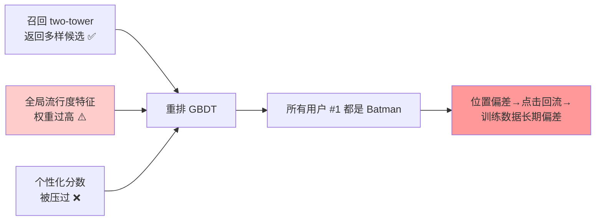

> 🔬 **为什么这是 6.1.2 反馈回路的完美实例**：如果直接上 A/B 不做内部 Beta，Batman 会**霸占 #1 位**→ 因**位置偏差**收获大量点击 → 点击**回流训练数据** → 强化"Batman 受欢迎"→ 下轮更把它顶 #1。**A/B 指标会因此虚高（skewed engagement），你还以为模型很棒。** 作者的真实版本是"Thor"，而且**花了几周 + 一次失败的 A/B** 才发现——内部 Beta 本可在**几天内**抓到。

**因为在 Beta 抓到了，可以低风险修复**：调重排权重平衡流行度与个性化、加**多样性约束**限制 top 位重复标题、重跑离线评估确认多样性/相关性改善且不伤 engagement 预测。

### 模型选型 Playbook 与打分 Rubric（原书 7.1 / 7.3）

进 A/B 前，用 **model selection playbook** 过五个问题，防止浪费 A/B 测试容量：

1. 这个变体想解决**什么用户/产品问题**？
2. **哪些离线指标**改善/退化/持平？
3. 离线或沙盒暴露了**哪些已知风险**？
4. 实验中用**什么在线 watchpoint** 监控这些风险？
5. **决策规则**是什么：ship / iterate / roll back / retest？

**打分 Rubric（原书 Table 7.1 节选）** 不是把一切压成一个魔法数字，而是**把所有相关信号汇总到一处，让"推进决策"透明、可复现、可辩护**，并**强制显式的权衡讨论**：

| 类别 | 指标 | Model A | Model B | 备注 |
|---|---|---|---|---|
| 离线性能 | Recall@10 | 0.82 | 0.78 | |
| 离线性能 | Precision@10 | 0.81 | 0.79 | |
| 离线性能 | 公平性差距(绝对差) | 3% | **1%** | **B 更均衡** |
| 离线性能 | 延迟 p95 | **380ms** | 430ms | A 更快（源于此前调优） |
| 离线性能 | 每百万推理成本 | $22 | $24 | |
| 产品启发式 | 多样性指数 | 0.72 | **0.78** | **B 呈现更多样标题** |
| 产品启发式 | 新颖度(%未见内容) | 28% | **33%** | |
| 模型成熟度 | 当前生产使用 | **Yes** | No | |
| 运营就绪 | 日志/监控 hook 到位 | Yes | Yes | |
| 沙盒/内测 | 正/中/负反馈比 | **80/15/5** | 70/20/10 | B 被反馈有些个性化 miss |

> 💡 这张表的价值在于**逼出权衡对话**：Model B **更慢但更公平、更多样**；Model A **更成熟但多样性差**。决策因此是**协作做出、并清晰记录了"为什么"**——而不是某人拍脑袋。这也呼应 6.6 的核心："A/B 不是产出一个数字，是产出**做决策的证据**"。

> 💡 **LLM 特例（原书 7.4）**：如果公司要上**第一个 LLM 产品体验**，即便该模型家族在别处成功过，通常也该当**早期阶段**对待。成熟度问题不是"这类模型在行业里能用吗"，而是"它对**我们的用户、产品约束、安全要求、运营环境**能用吗"。早期 LLM 特性的 playbook 可在延迟/成本/覆盖上给些灵活度——**如果它解锁了显著更好的用户体验**。

---

## 📌 小结

把本章压缩成一张"从离线到在线"的决策地图：

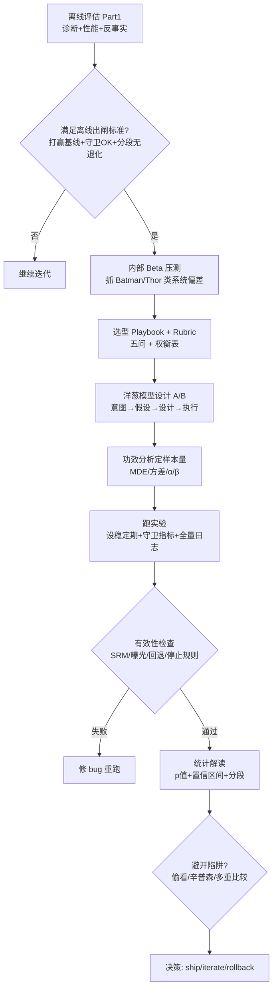

**十条必背要点**：

1. **离线是预测，在线是真相**——A/B 测的是"离线预测能否转化为真实产品影响"，AI 模型尤其需要，因为它会**改变产品体验本身**，形成离线看不到的**反馈回路**。
2. **何时测取决于成熟度**：早期问"方向可行吗"→ 早测、轻量、特征级敏感指标；成熟问"新版本更好吗"→ 精测、top-line、holdback。
3. **洋葱模型**：设计从内核（模型意图）往外想，执行从外层（运营）往内落；跳过内核会跑出"数值通过却答不了产品问题"的假胜利。
4. **assignment ≠ exposure**：只记分配不记曝光，会把没见过实验的人当成受了实验，结论直接崩。
5. **p 值 = 给定 $H_0$ 看到数据的概率**，不是"模型有效的概率"；p 小 ≠ 效应大；p>0.05 ≠ 无效。**永远同时看置信区间和效应量。**
6. **功效分析定样本量**：MDE 减半 → 样本 ×4；高方差指标要更大样本/更长时间。别拍脑袋定时长。
7. **偷看（peeking）** 会把 5% 假阳性率炒到几十个百分点——**开测前定死停止规则**，或用序贯/贝叶斯方法。
8. **辛普森悖论**：分段都赢、汇总却输，根因是流量占比失衡（常是 SRM/定向 bug）——**分段看+汇总看都要，先查随机化**。
9. **多重比较**：测 20 个变体/指标，64% 概率蒙到一个假"显著"——用 Bonferroni（严控 FWER）或 FDR（控假阳性占比）。
10. **延迟是守卫指标、也是混杂变量**；特征漂移用 **KS 检验（判有无）+ PSI（量程度）** 监控；**全量日志**是解读一切的前提；**没平台也别跳过在线测试**，feature flag 就能起步。

> 🎯 **一句话收束全章**：A/B 测试的全部统计严谨性——随机化、功效、置信区间、多重校正、防偷看——本质都服务于开篇那句话：**在不自欺（without fooling yourself）的前提下，做出更好的产品决策。**

---

## 🔗 延伸阅读

**本书内其他章节**：
- 📕 [`05_反事实评估.md`](./05_反事实评估.md)（若存在）—— Part 1 离线评估的收官，理解"反事实评估如何为 A/B 提供出闸置信"。
- 📗 **第 7 章《From offline evaluation to live experiment》**（原书 p.251+）—— 本章的直接续篇：模型选型 playbook、内部 Beta（Batman 案例）、把离线指标翻译成在线 watchpoint、离线-在线相关性。
- 📘 **第 4 章**—— latency degradation test，量化延迟对产品/用户指标的影响（本章 6.7.1 延迟守卫指标的方法来源）。

**llm-action 仓库内相关目录**：
- 🚀 [`../../llm-inference/`](../../llm-inference/) —— 推理延迟从哪来（KV cache、continuous batching、投机解码）。本章 6.7.1 把延迟设为守卫指标，而**降延迟的工程手段**都在这里。
- 🏗️ [`../../ai-infra-architecture/`](../../ai-infra-architecture/) —— 模型服务基础设施、feature flag、流量路由、灰度发布——本章 6.7.4"没有 A/B 平台怎么办"的自建能力地基。
- 📏 [`../../llm-eval/`](../../llm-eval/) —— LLM 离线评估方法（benchmark、LLM-as-judge、人评），与本章在线评估互补，构成完整评估闭环。
- 📖 [`../../book-hands-on-llm-serving/`](../../book-hands-on-llm-serving/) —— 《Hands-On LLM Serving》逐章精讲，深入服务侧的吞吐/成本/GPU 利用率（本章基础设施守卫指标的实现细节）。

**外部经典（进阶自学）**：
- Kohavi, Tang, Xu —《Trustworthy Online Controlled Experiments》(2020) —— A/B 测试圣经，SRM、偷看、辛普森悖论、CUPED 方差削减的权威出处。
- Statsig / Eppo 官方文档 —— 序贯检验（sequential testing）与 always-valid p-values 的工业实现，直接对应本章防偷看方案。
