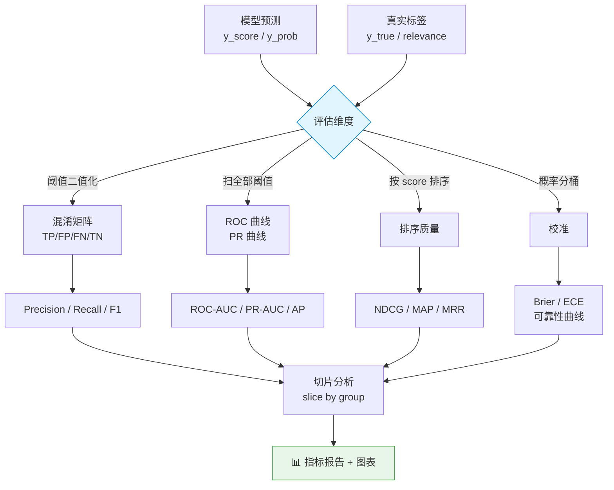
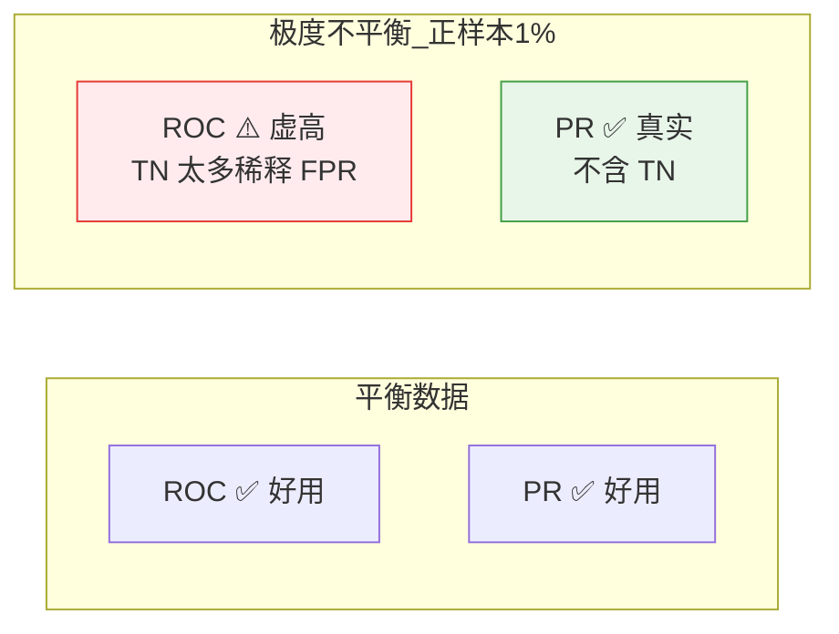
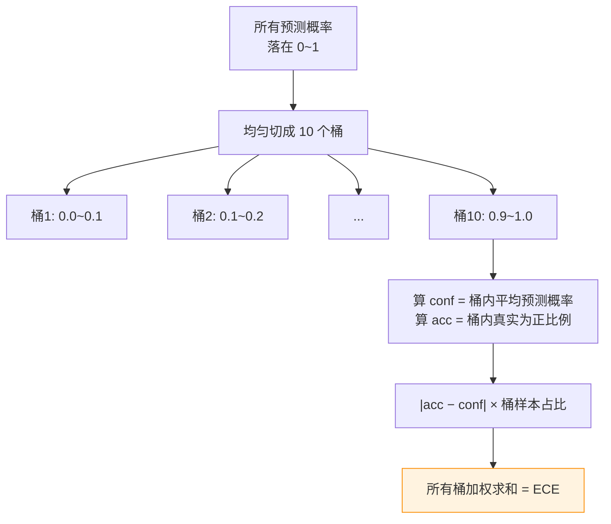
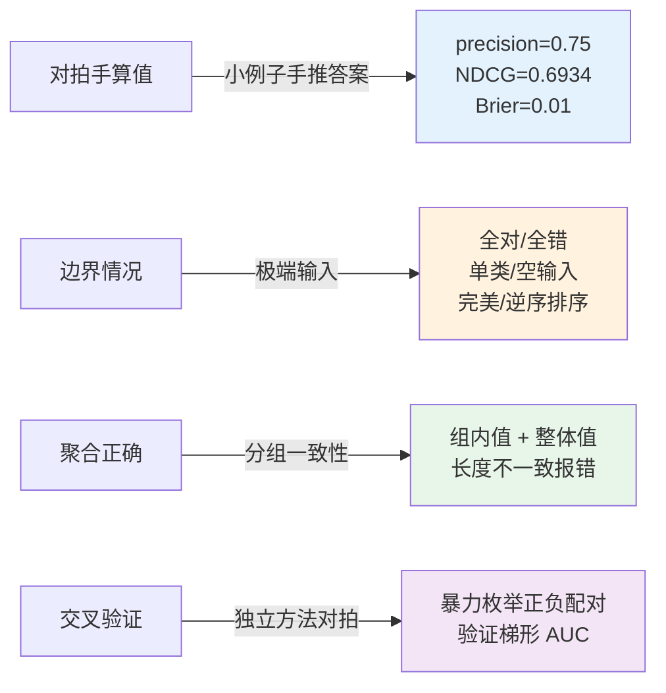

# 📏 离线评估指标库 Offline Metrics Lab

> 《AI Model Evaluation》配套实战项目 · 01
> **纯 numpy 从零手写**分类 / 排序 / 校准 / 切片四大类离线评估指标，本机可跑、不联网、不下模型、无需 GPU/key。

这是一个"把评估指标彻底讲透、且能立刻上手跑"的教学型工程。市面上你 `from sklearn.metrics import roc_auc_score` 一行就调完了，但**面试官一追问"AUC 到底在算什么、为什么类别不平衡时要看 PR 曲线、ECE 怎么算"，很多人就卡壳**。本项目把这些指标的公式、代码、手算对拍、可视化、踩坑全部摊开给你看。

---

## 🎯 你将学到什么

| 类别 | 指标 | 一句话本质 |
|------|------|-----------|
| **分类** Classification | Precision / Recall / F1 | 预测为正里对了多少 / 真正里抓回多少 / 二者调和 |
| | ROC-AUC | 随机取一正一负，正分高于负分的概率 |
| | PR-AUC / AP | 不平衡数据下的"精确率-召回率"曲线下面积 |
| **排序** Ranking | NDCG@k | 带位置折损的排序质量，归一化到 [0,1] |
| | MAP@k | 多 query 的平均精度均值 |
| | MRR | 第一个正确答案排名的倒数均值 |
| **校准** Calibration | Brier Score | 预测概率与真实标签的均方误差 |
| | ECE | 分桶后"说的置信度"与"真实准确率"的差距 |
| **切片** Slice | slice_metric / slice_report | 按子群分组算指标，暴露平均值掩盖的短板 |

---

## 📁 项目结构

```
01_offline_metrics_lab/
├── README.md              # 你正在读的这份（极详教程）
├── metrics.py             # 核心：纯 numpy 实现的所有指标
├── run_demo.py            # 玩具数据上的指标报告 + 出 3 张图（Agg 后端）
├── requirements.txt       # 依赖（numpy / matplotlib / pytest，零 sklearn）
├── tests/
│   └── test_metrics.py    # 26 个单测：对拍手算值 + 边界 + 切片聚合
└── figures/               # run_demo 生成的图（首次运行自动创建）
    ├── roc_pr_curves.png
    ├── reliability_diagram.png
    └── slice_bars.png
```

---

## 🗺️ 全景图：一次离线评估的数据流



> 🔬 **第一性原理**：离线评估的本质是"用一份**固定的、有标签的**测试集，把模型的预测和真值做各种角度的比对"。所有指标都只是"比对方式"的不同——有的看阈值后的对错（P/R/F1），有的看排序（AUC/NDCG），有的看概率本身可不可信（校准）。理解了"从哪个角度比对"，指标就不再是需要死记的公式。

---

## 🚀 如何运行

```bash
# 1) 进入项目目录
cd book-ai-model-evaluation/projects/01_offline_metrics_lab

# 2)（可选）装依赖。本机若已装好可跳过
pip install -r requirements.txt

# 3) 跑测试（应显示 26 passed）
python -m pytest -q

# 4) 跑演示：终端打印指标报告 + 在 figures/ 生成 3 张图
python run_demo.py
```

运行 `run_demo.py` 的终端输出长这样（节选）：

```
【1. 分类指标 Classification】
混淆矩阵:  TP=85  FP=85  FN=29  TN=201
Precision(精确率)     = 0.5000
Recall   (召回率)     = 0.7456
F1                     = 0.5986
ROC-AUC                = 0.8186
PR-AUC (梯形)          = 0.6531
AP (Average Precision) = 0.6552
...
【4. 切片分析 Slice Analysis】(按设备分组)
  ROC-AUC:
      desktop     : 0.9686
      mobile      : 0.4827   ← 长尾短板被切片暴露！
      __overall__  (整体): 0.8186
```

> ⚠️ **Windows 控制台编码坑**：Windows 的 `cmd`/`PowerShell` 默认用 GBK 编码，直接 `print("✅")` 或某些生僻字会抛 `UnicodeEncodeError: 'gbk' codec can't encode...`。本项目在 `run_demo.py` 开头用 `sys.stdout.reconfigure(encoding="utf-8")` 强制切 UTF-8 解决。这是国内做工程一定会踩的坑。

---

## 📐 第一部分：分类指标（逐行精讲）

### 1.1 混淆矩阵——一切分类指标的地基

任何二分类指标，追到根都是四个数：

| | 预测=正 | 预测=负 |
|---|---|---|
| **真实=正** | TP (真正) | FN (漏报) |
| **真实=负** | FP (误报) | TN (真负) |

`metrics.py` 里用**布尔掩码**一次性数出四个格子，比 for 循环快也更清晰：

```python
yt_pos = yt == 1              # 真实为正的掩码（布尔数组）
yp_pos = yp == 1             # 预测为正的掩码
tp = int(np.sum(yt_pos & yp_pos))   # 真且预测真
fp = int(np.sum(~yt_pos & yp_pos))  # 假但预测真（误报）
fn = int(np.sum(yt_pos & ~yp_pos))  # 真但预测假（漏报）
tn = int(np.sum(~yt_pos & ~yp_pos)) # 假且预测假
```

**逐行讲**：`&` 是 numpy 数组的逐元素"与"，`~` 是逐元素"非"。`yt_pos & yp_pos` 得到一个布尔数组，`True` 的位置就是"既真又预测真"，`np.sum` 对布尔数组求和 = `True` 的个数。四行覆盖四个格子，互斥且穷尽（加起来 = 样本总数）。

由此三大指标：

$$\text{Precision} = \frac{TP}{TP+FP}, \quad \text{Recall} = \frac{TP}{TP+FN}, \quad F_1 = \frac{2 \cdot P \cdot R}{P + R}$$

> 💡 **面试高频：Precision 和 Recall 什么时候各自更重要？**
> - **看重 Precision**（少误报）：垃圾邮件过滤——把正常邮件判成垃圾（FP）代价很大，宁可漏放几封垃圾。
> - **看重 Recall**（少漏报）：癌症筛查、欺诈检测——漏掉一个真病人/真欺诈（FN）代价极大，宁可多几个虚警让人复查。
> - **F1** 是两者的**调和平均**，不是算术平均——调和平均对"较小值"更敏感，只要有一个低，F1 就被拉低，逼你两个都做好。

> ⚠️ **常见坑：Accuracy 在类别不平衡时会骗人**。假设 99% 是负样本，模型无脑全预测负，Accuracy = 99%，看着完美，但 Recall = 0，一个正样本都没抓到。**类别不平衡时，别看 Accuracy，看 F1 / PR-AUC**。

### 1.2 ROC-AUC——不依赖阈值的排序质量

前面的 P/R/F1 都需要先选一个阈值（如 0.5）把概率二值化。但阈值是可调的，我们想要一个"**跟阈值无关、直接衡量模型排序能力**"的指标——这就是 ROC-AUC。

**核心骨架 `_binary_clf_curve`**（ROC 和 PR 共用），逐行讲：

```python
desc_order = np.argsort(y_score, kind="mergesort")[::-1]  # 按分数降序的下标
score_sorted = y_score[desc_order]                        # 分数降序排列
y_sorted = y_true[desc_order]                             # 标签跟着一起排

distinct_mask = np.where(np.diff(score_sorted))[0]        # 分数"变化"的位置
threshold_idxs = np.r_[distinct_mask, y_true.size - 1]    # 每个不同分数取一个阈值点

tps = np.cumsum(y_sorted)[threshold_idxs]                 # 各阈值点累计真正数
fps = 1 + threshold_idxs - tps                            # 累计假正数 = 已判正数 - TP
```

**逐行拆解**：
- `np.argsort(...)[::-1]`：`argsort` 返回"能让数组升序的下标"，`[::-1]` 反转成降序。用 `mergesort` 是因为它**稳定**（相等元素保持原相对顺序），保证结果可复现。
- `np.diff(score_sorted)` 相邻做差，非零处说明"分数变了"。我们只在分数变化处放阈值点——**相同分数必须合并**，否则曲线会出现锯齿，AUC 算错。这是自己实现 AUC 最容易翻车的地方。
- `np.cumsum(y_sorted)`：从上往下累加标签（1 是正），得到"扫到这个位置为止累计抓了几个正样本"= 累计 TP。
- `fps = 1 + threshold_idxs - tps`：`threshold_idxs + 1` 是"已经判为正的样本总数"（从头到这个下标），减去其中的正样本数 TP，剩下就是负样本被误判 = FP。

然后 ROC 曲线的两个轴：

$$\text{FPR} = \frac{FP}{FP+TN} \quad (\text{横轴}), \qquad \text{TPR} = \frac{TP}{TP+FN} \quad (\text{纵轴} = \text{Recall})$$

AUC 用**梯形法则**积分：

```python
def _auc_trapezoid(x, y):
    order = np.argsort(x)           # 保证 x 单调递增
    dx = np.diff(x[order])          # 每小段宽度
    # 相邻两个 y 求平均 × dx，就是一个梯形面积，全部加起来
    return np.sum((y[order][1:] + y[order][:-1]) / 2.0 * dx)
```

> 🔬 **第一性原理：AUC 为什么等于"正分高于负分的概率"？**
> ROC 曲线下面积，可以证明恰好等于：随机抽一个正样本 $x^+$ 和一个负样本 $x^-$，模型给的分数满足 $s(x^+) > s(x^-)$ 的概率（平局算 0.5）。这就是它跟阈值无关的原因——它只关心**排序**，不关心具体分数值。测试文件里 `test_roc_auc_bruteforce_agreement` 就是用这个定义（暴力枚举所有正负配对）来对拍我们梯形法算出的 AUC，二者必须一致。

> 💡 **面试高频：AUC = 0.5 / < 0.5 分别意味着什么？**
> - `= 0.5`：模型排序能力等于瞎猜（对角线）。
> - `< 0.5`：比瞎猜还差——**通常是标签接反了或分数取反了**，把分数乘 -1 就 > 0.5。这是排查 bug 的实用信号。

### 1.3 PR-AUC / AP——类别不平衡的正确打开方式

ROC 有个致命弱点：**它的横轴 FPR 分母含 TN**。当负样本极多（正样本稀少）时，TN 巨大，FPR 永远很小，ROC 曲线看着很漂亮，掩盖了模型其实误报一堆的事实。

PR 曲线**完全不看 TN**（Precision 和 Recall 的公式里都没有 TN），所以在**欺诈检测、疾病筛查、推荐点击**这类正样本 1% 都不到的场景，PR 曲线才是真相。



**Average Precision (AP)** 的实现有个**必须注意的坑**（本项目实际调试中踩到过）：

```python
fps, tps, _ = _binary_clf_curve(yt, ys)  # 用逐阈值原始曲线，不要补端点的版本！
recall = tps / total_pos
precision = tps / (tps + fps)
dr = np.diff(recall, prepend=0.0)         # 每步召回增量 ΔR
return float(np.sum(dr * precision))       # AP = Σ ΔR · P
```

> ⚠️ **调试实录**：最初 `average_precision` 是从 `precision_recall_curve` 取点算的，但那个函数为了画图美观在首尾补了 `(P=1,R=0)` 端点。这些端点混进 `Σ ΔR·P` 求和后，**完美区分的数据 AP 竟然算出 0.833 而非 1.0**。修正方法：AP 必须直接用 `_binary_clf_curve` 的**逐阈值**结果，不能用补过端点的画图版曲线。测试 `test_pr_auc_perfect` + `test_average_precision_known` 就是守这条线的。

> 💡 **面试点：PR-AUC 用梯形还是阶梯？**
> 论文里标准的 AP 是**阶梯求和** $\sum_n (R_n - R_{n-1}) P_n$（本项目 `average_precision`）。梯形法则（本项目 `pr_auc_score`）在 recall≈1 处会因线性插值**系统性略微低估**——所以完美区分时 `pr_auc_score` 返回 ~0.92 而非 1.0，这是**已知性质不是 bug**，测试里明确断言了这一点。答得出这个区别，面试官会觉得你真做过。

---

### 1.4 手把手走一遍：一个 4 样本的完整数算

光看公式容易飘，我们拿一个能完全手算的例子把 ROC-AUC 从头走一遍，你可以对着 `metrics.py` 单步核对。

设：

```
样本    A     B     C     D
真值   1     1     0     0
分数   0.9   0.4   0.6   0.3
```

**第 1 步：按分数降序排列**（`argsort[::-1]`）

```
排序后   A(0.9)  C(0.6)  B(0.4)  D(0.3)
标签      1       0       1       0
```

**第 2 步：从上往下累计 TP / FP**（`cumsum`）

| 扫到 | 累计 TP | 累计 FP | 说明 |
|------|--------|--------|------|
| A(1) | 1 | 0 | 抓到 1 个正 |
| C(0) | 1 | 1 | 来了 1 个负（误报） |
| B(1) | 2 | 1 | 又抓到 1 个正 |
| D(0) | 2 | 2 | 又来 1 个负 |

**第 3 步：换算 FPR / TPR**（总正=2，总负=2）

| 阈值点 | FPR=FP/2 | TPR=TP/2 |
|--------|---------|---------|
| 起点 | 0.0 | 0.0 |
| A 后 | 0.0 | 0.5 |
| C 后 | 0.5 | 0.5 |
| B 后 | 0.5 | 1.0 |
| D 后 | 1.0 | 1.0 |

**第 4 步：梯形法则求面积**——把这些 (FPR, TPR) 点连起来，逐段算梯形：

- FPR 0.0→0.0（宽 0）：面积 0
- FPR 0.0→0.5（宽 0.5，高从 0.5 到 0.5）：`(0.5+0.5)/2 × 0.5 = 0.25`
- FPR 0.5→0.5（宽 0）：面积 0
- FPR 0.5→1.0（宽 0.5，高从 1.0 到 1.0）：`(1.0+1.0)/2 × 0.5 = 0.50`

合计 **AUC = 0.25 + 0.50 = 0.75**，与 `test_roc_auc_known_value` 断言完全一致。

**再用"配对定义"独立验证**：所有正负配对 (正样本, 负样本) 共 2×2=4 对，看正分是否 > 负分：
- (A=0.9, C=0.6)：0.9>0.6 ✅
- (A=0.9, D=0.3)：0.9>0.3 ✅
- (B=0.4, C=0.6)：0.4>0.6 ❌
- (B=0.4, D=0.3)：0.4>0.3 ✅

3 胜 1 负 → **3/4 = 0.75**。两条完全独立的路径给出同一个数，这就是我们敢信实现正确的底气（也正是 `test_roc_auc_bruteforce_agreement` 在做的事）。

> 💡 **面试点：为什么全用 numpy 向量化而不写 for 循环？** 三个原因：(1) **速度**——numpy 底层是 C，`cumsum`/`argsort` 比 Python 循环快几十上百倍，评估集动辄百万样本时差距巨大；(2) **正确性**——向量化代码更短，bug 面更小；(3) **可读性**——`np.cumsum(y_sorted)` 直接读作"累计正样本数"，比三行循环更贴近数学定义。但代价是**内存**：向量化会一次性物化中间数组，超大数据集要注意用分块（chunking）或流式计算。

---

## 📊 第二部分：排序指标

推荐/搜索场景里，模型输出的是一个**排好序的列表**，我们关心"最相关的有没有排在最前面"。

### 2.1 NDCG——带位置折损的排序质量

$$\text{DCG@}k = \sum_{i=1}^{k} \frac{rel_i}{\log_2(i+1)}, \qquad \text{NDCG@}k = \frac{\text{DCG@}k}{\text{IDCG@}k}$$

```python
def _dcg(relevances, k):
    rel_k = relevances[:k]
    discounts = np.log2(np.arange(2, len(rel_k) + 2))  # log2(2),log2(3),...
    return float(np.sum(rel_k / discounts))
```

**逐行讲**：`np.arange(2, len+2)` 生成 `[2,3,4,...]`，取 `log2` 得到位置折损因子。第 1 位除以 `log2(2)=1`（不打折），第 2 位除以 `log2(3)≈1.585`，越靠后折损越狠——这精确刻画了"用户很少翻到后面"的现实。

**IDCG** 是"理想排序"（把相关度自己从高到低排）的 DCG，做分母归一化。这样不同 query（相关文档数不同）之间才能公平比较，结果永远落在 [0,1]。

> ⚠️ **坑：全零相关度**。如果一个 query 没有任何相关文档，IDCG=0，NDCG 会 0/0。本项目用 `_safe_divide` 约定这种情况返回 0.0（测试 `test_ndcg_all_zero_relevance` 守着）。

### 2.2 MAP@k——多 query 的平均精度

对每个 query 算 AP@k（每命中一个相关文档就记一次"到此为止的精确率"，再平均），然后对所有 query 求平均：

```python
cum_hits = np.cumsum(rel_ranked)          # 累计命中数
precision_at_i = cum_hits / positions     # 每个位置的精确率
ap = np.sum(precision_at_i * rel_ranked)  # 只在命中位置累加
return ap / min(相关文档总数, k)
```

### 2.3 MRR——只关心第一个正确答案

$$\text{MRR} = \frac{1}{|Q|}\sum_{q} \frac{1}{\text{rank}_q}$$

`rank_q` 是第 q 个 query 里"第一个相关文档"的排名。实现用了个巧妙的技巧：

```python
rel_ranked = rel_arr[ranking] > 0        # 按分数排序后，哪些是相关的（布尔）
if rel_ranked.any():
    first_hit = int(np.argmax(rel_ranked)) + 1  # argmax 返回第一个 True 的下标
    reciprocal_ranks.append(1.0 / first_hit)
```

**逐行讲**：`np.argmax` 对布尔数组返回**第一个 `True`** 的下标（因为 `True > False`），+1 转成从 1 开始的排名，倒数即可。没有相关文档则记 0。

> 💡 **面试点：NDCG vs MAP vs MRR 怎么选？**
> - **NDCG**：相关度**分级**（0/1/2/3，如"非常相关/相关/一般"），且**整体列表质量**都重要 → 电商推荐、网页搜索。
> - **MAP**：相关度是**0/1**，关心**所有相关文档的排序** → 文档检索。
> - **MRR**：只关心**第一个正确答案在哪** → 问答系统、"手气不错"式导航搜索。

---

## 🎚️ 第三部分：校准指标

一个 AUC 很高的模型，输出的**概率值本身可能完全不可信**。校准关心：模型说"我有 80% 把握"时，是不是真的 80% 的时候对了？这在**风控定价、医疗决策、需要用概率做期望计算**的场景至关重要。

### 3.1 Brier Score——概率的均方误差

$$\text{Brier} = \frac{1}{N}\sum_{i}(p_i - y_i)^2$$

```python
return float(np.mean((yp - yt) ** 2))
```

越小越好（0 最好）。它同时惩罚"过度自信"和"信心不足"。

### 3.2 ECE——期望校准误差



$$\text{ECE} = \sum_{b=1}^{B} \frac{|B_b|}{N} \, \bigl| \text{acc}(B_b) - \text{conf}(B_b) \bigr|$$

```python
for i in range(n_bins):
    in_bin = (yp >= lo) & (yp < hi)     # 落在这个桶的样本掩码
    if count == 0: continue              # 空桶跳过
    conf = float(np.mean(yp[in_bin]))    # 桶内平均置信度（"说的"）
    acc  = float(np.mean(yt[in_bin]))    # 桶内真实正比例（"实际的"）
    ece += (count / n) * abs(acc - conf) # 差距按桶大小加权
```

**逐行讲**：把 [0,1] 均匀切 10 桶，每个桶里"模型说的平均置信度 conf"应该约等于"这个桶实际的正样本比例 acc"。若模型完美校准，每桶 `acc ≈ conf`，ECE=0。差得越多 ECE 越大。

> ⚠️ **坑：最后一个桶的右端点**。概率恰好 = 1.0 的样本，如果所有桶都用"左闭右开" `[lo, hi)`，它会掉出所有桶。实现里对最后一个桶特判为闭区间 `[lo, hi]`（`i == n_bins-1` 分支），保证不丢样本。

**可靠性曲线（Reliability Diagram）** 就是把每个桶的 `(conf, acc)` 画成点，完美校准的点全落在对角线 `y=x` 上。run_demo 里我们**故意破坏校准**（把概率做 `p^0.6` 变换制造过度自信），你能在图上清楚看到橙线偏离对角线、ECE 从 0.16 涨到 0.30。

> 💡 **面试点：AUC 高但校准差，可能吗？** 完全可能。AUC 只看**排序**，你把所有概率乘 0.5，排序不变、AUC 不变，但概率整体偏低、校准崩了。**区分度（discrimination, 看 AUC）和校准度（calibration, 看 ECE/Brier）是两个正交的维度**，好模型两者都要。深度网络尤其容易过度自信，常用 Temperature Scaling 事后校准。

---

## 🔍 第四部分：切片分析——平均值是骗子

> 🔬 **第一性原理**：整体指标是各子群的**加权平均**。"多数群体表现很好 + 少数关键群体表现极差"会被平均成一个看着不错的整体值。切片分析把样本按某维度（设备、地区、年龄段、语言）分组，**在每组内单独算指标**，是发现公平性问题和长尾短板的第一道防线。

```python
def slice_metric(y_true, y_score_or_pred, groups, metric_fn):
    for g in np.unique(grp):
        mask = grp == g
        result[str(g)] = float(metric_fn(yt[mask], yp[mask]))  # 组内算指标
    result["__overall__"] = float(metric_fn(yt, yp))           # 附整体做对照
    return result
```

`metric_fn` 是任意"接收 (y_true, y_pred) 返回一个数"的函数——所以**上面所有指标都能塞进来切片**。`slice_report` 再套一层，一次对多个指标做切片，输出嵌套字典方便打表。

**run_demo 的实际效果**（这就是切片的价值）：

| 指标 | desktop | **mobile** | 整体 |
|------|---------|-----------|------|
| ROC-AUC | 0.9686 | **0.4827** ⚠️ | 0.8186 |
| Recall@0.5 | 0.9091 | **0.4054** ⚠️ | 0.7456 |

整体 AUC 0.82 看着挺好，但一切片就发现 **mobile 组的 AUC 只有 0.48（约等于瞎猜）**！如果只看整体指标，这个严重的长尾问题就被完全掩盖了。这正是我们在造玩具数据时故意让 mobile 组"更难分"埋下的伏笔——切片把它精准挖了出来。

> 💡 **面试高频：上线前发现整体指标达标就能发版吗？** 不能。必须做切片/分群评估，尤其检查**关键子群（核心地区、付费用户、少数语言）和长尾群体**。Google 的 "Slicing Analysis"、模型公平性审计都是这个思路。只看整体是最常见的评估失误。

---

### 4.1 切片分析的三种常见误区

切片看着简单，实操里有三个坑：

1. **小样本组的指标不可信**。某个国家只有 3 个样本，算出来 AUC=1.0，别当真——样本太少方差极大。实践中要么设最小样本量阈值（如 < 30 不单独报），要么给指标配置信区间（bootstrap）。本库的 `slice_metric` 会如实返回每组的值，是否可信由使用者结合样本量判断（`slice_report` 也可以扩展成同时返回 count）。

2. **切片维度的组合爆炸**。国家 × 设备 × 年龄段 × 语言，四维一交叉可能几千个格子，大部分格子样本为空。实践中先切**单维度**找出问题维度，再对可疑维度做二维交叉，而不是一上来全维度笛卡尔积。

3. **切片维度本身可能泄露**。如果拿"模型预测结果"当切片维度，那是循环论证。切片维度必须是**与预测独立的、事先已知的**属性（人口学、场景、来源渠道）。

> 🔬 **第一性原理：切片分析 = 条件期望**。整体指标是 $E[\text{metric}]$，切片是 $E[\text{metric} \mid \text{group}=g]$。全期望定律告诉我们 $E[\text{metric}] = \sum_g P(g) \cdot E[\text{metric}\mid g]$——整体就是各切片按占比的加权平均。这从数学上解释了为什么"整体好"可以和"某关键切片差"共存：只要那个差的切片占比小，它对整体的拉低就有限，从而被掩盖。

---

## 🧪 测试设计（26 passed）

测试遵循**"对拍手算 + 边界 + 聚合"**三板斧：



几个代表性用例：
- `test_roc_auc_known_value`：`y=[1,1,0,0], score=[0.9,0.4,0.6,0.3]`，手数正负配对得 3/4=0.75，断言代码算出 0.75。
- `test_roc_auc_bruteforce_agreement`：随机造 20 组数据，用"暴力枚举所有正负配对"这个**独立于梯形法则**的 AUC 定义来交叉验证——两种完全不同的算法给出一致结果，才敢信实现对了。
- `test_ndcg_handcomputed`：手推 DCG/IDCG 每一项，断言到 1e-6。
- `test_ece_miscalibrated`：模型全说 0.9 但全错，`|0 - 0.9| = 0.9`，断言 ECE=0.9。
- `test_slice_metric_grouping`：A 组全对、B 组全错，验证组内值 + 整体值 + 长度校验。

```bash
$ python -m pytest -q
..........................                                        [100%]
26 passed in 0.15s
```

---

## 📷 三张图说明

| 图 | 看点 |
|----|------|
| `roc_pr_curves.png` | 左 ROC（越贴左上越好，附随机基线对角线）+ 右 PR（附正样本率基线）。对比理解两条曲线。 |
| `reliability_diagram.png` | 可靠性曲线。绿线（原始）贴近对角线，橙线（人为破坏校准）明显偏离，点大小 ∝ 桶内样本数。 |
| `slice_bars.png` | 分组柱状图，一眼看出 mobile 组的 AUC/Recall 明显矮一截。 |

---

## ⚠️ 踩坑清单（工程实战）

| 坑 | 现象 | 解法 |
|----|------|------|
| **相同分数不合并** | 自己实现 AUC 曲线出现锯齿、值算错 | `_binary_clf_curve` 用 `np.diff` 只在分数变化处放阈值点 |
| **AP 用了补端点的曲线** | 完美区分数据 AP 算出 0.833 而非 1.0 | AP 必须用 `_binary_clf_curve` 的逐阈值原始结果 |
| **0/0 除法** | recall/NDCG 在无正样本时抛异常或返回 nan | 统一走 `_safe_divide`，无定义时返回 0.0 |
| **ECE 最后一桶丢样本** | 概率=1.0 的样本掉出所有桶 | 最后一桶用闭区间 `[lo,hi]` |
| **Windows GBK 编码** | `print("✅")` 抛 `UnicodeEncodeError` | `sys.stdout.reconfigure(encoding="utf-8")` |
| **matplotlib 中文乱码/无界面报错** | 方块字、`Could not connect to display` | `matplotlib.use("Agg")` + `font.sans-serif=["Microsoft YaHei","SimHei"]` + `axes.unicode_minus=False` |
| **argsort 不稳定** | 相等分数顺序随机，结果不可复现 | `np.argsort(..., kind="mergesort")` 用稳定排序 |

---

## 📌 小结

- **分类指标**追根都是混淆矩阵四个数；P/R/F1 依赖阈值，AUC/AP 不依赖阈值直接衡量排序。
- **类别不平衡看 PR 不看 ROC**，因为 PR 不含 TN，不会被海量真负样本稀释。
- **排序指标**（NDCG/MAP/MRR）衡量"最相关的有没有排前面"，按分级相关度/是否命中/第一个命中来选。
- **校准**（Brier/ECE）和**区分度**（AUC）是**正交**的两个维度，好模型两者都要；深度网络常过度自信。
- **切片分析**是发现长尾/公平性短板的必备手段，只看整体指标是最常见的评估失误。
- 工程上处处是坑：相同分数合并、0/0 安全除法、Windows 编码、matplotlib 中文/无界面配置。

---

## 🔗 延伸阅读

**本书其它章节**
- 下一个项目 `02_*`：在线评估 / A-B 测试与离线指标的对齐（离线涨了线上不涨的经典难题）
- LLM 评估专题：BLEU/ROUGE/困惑度 → LLM-as-Judge → 生成任务的校准，本库的分类/排序/校准思想可直接迁移

**llm-action 仓库相关目录**
- `llm-inference/`：推理服务的**延迟/吞吐**评估——离线质量指标 + 在线性能指标共同构成完整的模型评估体系
- `ai-infra-architecture/`：评估流水线在 AI 平台中的位置，指标如何接入监控与告警
- `llm-interview/`：本 README 的💡框可直接当成"评估指标"这一考点的面试答案素材

**外部经典**
- Guo et al., *On Calibration of Modern Neural Networks* (2017)：ECE / Temperature Scaling 的出处
- 信息检索教材（Manning IR Book）第 8 章：NDCG / MAP / MRR 的严格定义

---

> 🛠️ 本项目所有代码均在 **Python 3.13 + numpy 2.3 + matplotlib 3.10**、纯 CPU、无网络环境下实测通过（`26 passed`，`run_demo.py` 正常出图）。注释以简体中文为主、术语中英并列，欢迎对照 `metrics.py` 逐行阅读。
