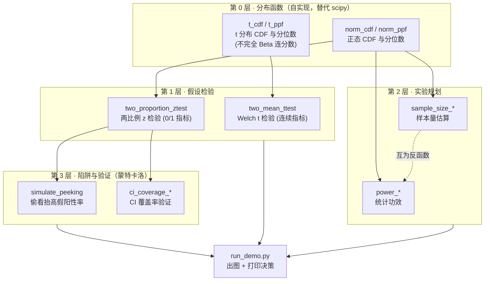
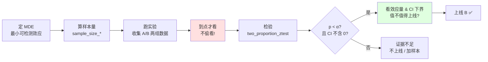
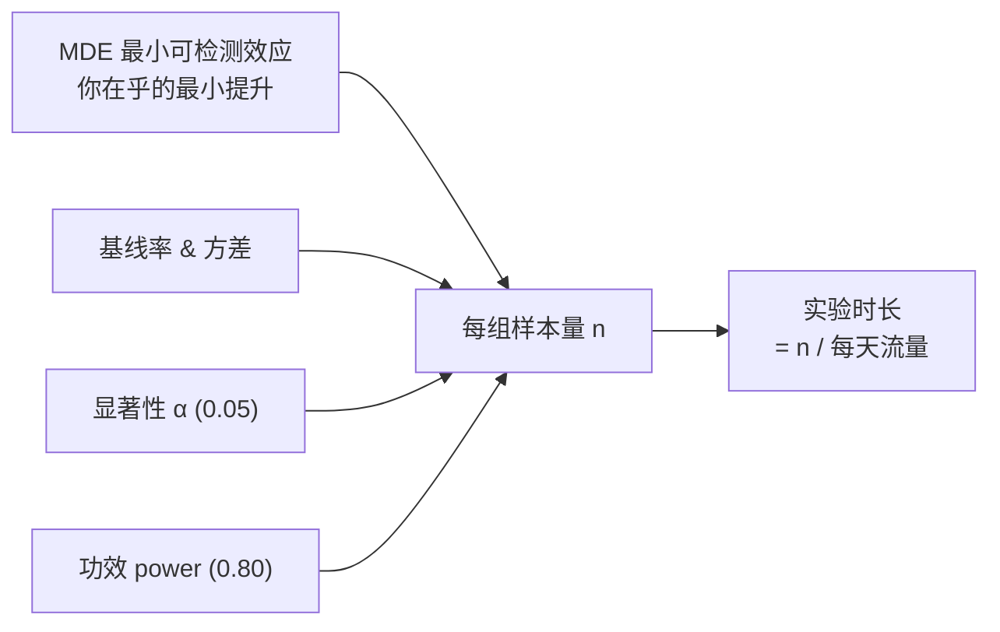
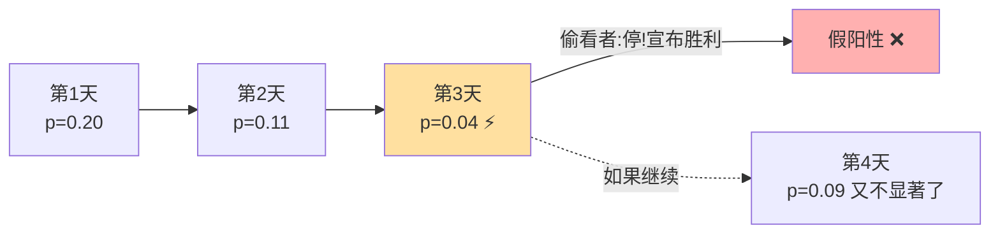
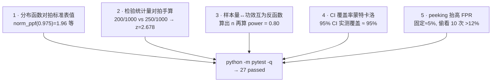

# 🧪 A/B 测试统计实验室（A/B Test Stats Lab）

> 《AI Model Evaluation》第 6 章「在线评估与 A/B 测试」的**可运行配套项目**。
> 用**纯 numpy** 从零实现两比例/两均值检验、p 值、置信区间、样本量估算、统计功效，
> 并用蒙特卡洛把「偷看 peeking 如何抬高假阳性率」这件事**亲手跑出来给你看**。
>
> 🎯 一句话定位：**把 A/B 测试背后的统计学地基，从公式落到能跑通、能画图、能过测试的代码。**

本项目对应书中 **6.4（统计地基）** 与 **6.5.1（偷看陷阱）**，是那两节的"动手版"。
配套章节讲义见 [`../../book-guide/06_在线评估与 A/B 测试.md`](../../book-guide/06_在线评估与%20A/B%20测试.md)。

---

## 📖 目录

- [一、这个项目解决什么问题](#一这个项目解决什么问题)
- [二、快速上手：怎么跑](#二快速上手怎么跑)
- [三、全局架构：一张图看懂](#三全局架构一张图看懂)
- [四、统计地基逐个讲透（零基础→进阶）](#四统计地基逐个讲透零基础进阶)
  - [4.1 假设检验：整个 A/B 的推理骨架](#41-假设检验整个-ab-的推理骨架)
  - [4.2 两比例 z 检验：0/1 型指标](#42-两比例-z-检验01-型指标)
  - [4.3 两均值 t 检验：连续型指标](#43-两均值-t-检验连续型指标)
  - [4.4 p 值：最被误解的数字](#44-p-值最被误解的数字)
  - [4.5 置信区间 CI：比 p 值信息量大得多](#45-置信区间-ci比-p-值信息量大得多)
  - [4.6 样本量与功效：开测前的核心计算](#46-样本量与功效开测前的核心计算)
- [五、核心代码逐行讲解](#五核心代码逐行讲解)
  - [5.1 自实现分布函数（不依赖 scipy）](#51-自实现分布函数不依赖-scipy)
  - [5.2 两比例 z 检验实现](#52-两比例-z-检验实现)
  - [5.3 样本量与功效实现](#53-样本量与功效实现)
- [六、主菜：偷看 peeking 如何抬高假阳性率](#六主菜偷看-peeking-如何抬高假阳性率)
- [七、测试怎么保证正确](#七测试怎么保证正确)
- [八、三张图怎么读](#八三张图怎么读)
- [📌 小结](#-小结)
- [🔗 延伸阅读](#-延伸阅读)

---

## 一、这个项目解决什么问题

你训练了一个新模型 B，离线指标比线上模型 A 好一点。**能上线吗?** 离线好 ≠ 线上好
（书中第 5 章反事实评估已反复强调）。唯一的黄金标准是 **A/B 测试**：把真实流量随机分成两组，
一组走 A、一组走 B，看**线上业务指标**（CTR、转化率、停留时长）谁更好。

但 A/B 测试的结论**全靠统计学撑着**。下面这些问题，每一个答错都会让你**上线一个其实没用的模型**，
或者**错杀一个其实有用的模型**：

| 问题 | 答错的后果 | 本项目对应函数 |
|---|---|---|
| B 比 A 高 1.2%，这是真提升还是**运气**？ | 把噪声当信号，上线废模型 | `two_proportion_ztest` |
| 我该收集**多少样本**才够判断？ | 样本不够 → 白跑（欠功效） | `sample_size_two_proportions` |
| 跑到一半 p 值 <0.05 了，**能提前停吗**？ | 偷看 → 假阳性率飙到 20%+ | `simulate_peeking` |
| 我的**置信区间**可信吗？ | CI 算错 → 决策全错 | `ci_coverage_two_proportions` |

> 🔬 **第一性原理**：A/B 测试的本质是**在噪声里做决策**。同样两个模型，今天测和明天测，
> 数字都会抖。统计学给你一套**量化"这个差异有多可能是运气"** 的工具。整个项目就是把这套工具
> 用最透明的方式（纯 numpy、连正态分位数都自己算）实现出来。

**为什么不用 `scipy.stats` 直接调?** 因为教学库要"透明可讲"，且本机离线。所以我把正态 CDF/PPF、
t 分布 CDF/PPF **全部从零实现**（Acklam 有理逼近 + 不完全 Beta 连分数），这样每一个数字你都能
追到它是怎么来的。生产里当然可以直接用 scipy / statsmodels，但**懂原理的人才知道什么时候不能信它**。

---

## 二、快速上手：怎么跑

```bash
# 1. 进入项目目录
cd book-ai-model-evaluation/projects/02_ab_test_stats_lab

# 2.（可选）装依赖：只需 numpy / matplotlib / pytest，无需 scipy、无需网络、无需 GPU
pip install -r requirements.txt

# 3. 跑测试（应输出 "27 passed"）
python -m pytest -q

# 4. 跑演示（打印决策例子 + 样本量表，并在 figures/ 生成三张图）
python run_demo.py
```

跑完 `run_demo.py`，你会在 `figures/` 看到：

| 文件 | 内容 |
|---|---|
| `power_curve.png` | 功效曲线：功效随样本量、随 MDE 的变化 |
| `peeking_fpr.png` | **本项目主菜**：偷看次数越多，假阳性率越高 |
| `ci_coverage.png` | 置信区间覆盖率验证：实测≈名义，证明 CI 实现正确 |

> ⚠️ **Windows 控制台坑**：Windows 终端默认 GBK 编码，直接 `print` emoji/部分中文会抛
> `UnicodeEncodeError`。`run_demo.py` 开头用 `sys.stdout.reconfigure(encoding="utf-8")`
> 把标准输出重设为 UTF-8 解决。图里的中文靠 `rcParams["font.sans-serif"]=["Microsoft YaHei"]`。

**目录结构**：

```
02_ab_test_stats_lab/
├── README.md              # 本文件（原理 + 逐行讲解）
├── ab_stats.py            # 核心库：分布函数 + 检验 + 样本量 + 功效 + peeking
├── run_demo.py            # 演示：打印决策 + 出三张图（Agg 后端）
├── requirements.txt       # numpy / matplotlib / pytest
├── tests/
│   └── test_ab_stats.py   # 27 个单元测试
└── figures/               # run_demo 生成的图（首次运行后出现）
```

---

## 三、全局架构：一张图看懂



**四层依赖关系**：最底层是自实现的分布函数（一切统计量转 p 值都要它）；
第 1 层是两种检验；第 2 层是开测前的规划（样本量与功效**互为反函数**）；
第 3 层用蒙特卡洛**验证**前面的实现是否正确、并**复现**偷看陷阱。

A/B 测试从设计到决策的完整决策流：



---

## 四、统计地基逐个讲透（零基础→进阶）

### 4.1 假设检验：整个 A/B 的推理骨架

假设检验用的是**反证法思维**。我们**先假设"新模型没用"**（原假设 $H_0$：$p_A = p_B$），
然后问：

> **"如果 B 真的和 A 一样，那我观测到这么大（甚至更大）的差异，纯靠运气发生的概率有多大?"**

这个概率就是 **p 值**。如果它小到离谱（比如 < 5%），我们就说"运气解释不了这个差异"，
倾向于**拒绝 $H_0$**，认为 B 真的不一样。

两类错误（面试必考）：

| | $H_0$ 真（B 其实没用） | $H_0$ 假（B 其实有用） |
|---|---|---|
| **判显著**（上线 B） | ❌ **第一类错误 Type I**，概率 = **α**，*上线废模型* | ✅ 正确（功效 = 1−β） |
| **判不显著**（不上线） | ✅ 正确 | ❌ **第二类错误 Type II**，概率 = **β**，*错杀好模型* |

> 💡 **面试高频**：α 和 β 此消彼长。把 α 调更严（0.05→0.01），更少上线废模型，但代价是
> 更容易错杀好模型（β↑）。**唯一的"双赢"是加大样本量**——样本越多两组分布重叠越少，两类错误
> 可同时压低。这就是为什么样本量公式（4.6）里 α 和 β 同时出现。

### 4.2 两比例 z 检验：0/1 型指标

**用在哪**：指标是"发生/没发生"的二元事件——点击（CTR）、转化、注册、留存。
每个用户贡献一个 0 或 1，组内是**伯努利试验**，转化率就是成功比例 $\hat p$。

**检验统计量**（合并方差版，用于算 p 值）：

$$
\hat p_{\text{pool}} = \frac{x_A + x_B}{n_A + n_B}, \quad
SE_{\text{pool}} = \sqrt{\hat p_{\text{pool}}(1-\hat p_{\text{pool}})\left(\frac{1}{n_A}+\frac{1}{n_B}\right)}, \quad
z = \frac{\hat p_B - \hat p_A}{SE_{\text{pool}}}
$$

> 🔬 **为什么 p 值用"合并" SE，CI 却用"非合并" SE?**
> 算 p 值时我们**假设 $H_0$ 成立**（两组同率），所以用合并所有数据估计的公共率 $\hat p_{\text{pool}}$ 最合理。
> 但置信区间是要**描述真实差异有多大**，不该假设 $H_0$，所以 CI 用各组自己的率算**非合并 SE**：
> $SE_{\text{unpool}} = \sqrt{\hat p_A(1-\hat p_A)/n_A + \hat p_B(1-\hat p_B)/n_B}$。
> ⚠️ **常见坑**：很多人两处都用同一个 SE，会导致"p<0.05 但 CI 含 0"这种自相矛盾的结果。

### 4.3 两均值 t 检验：连续型指标

**用在哪**：指标是连续数值——停留时长、客单价、每用户请求数。这时用 **Welch 两样本 t 检验**
（不假设两组方差相等，比 Student t 更稳健，是现代默认选择）：

$$
t = \frac{\bar x_B - \bar x_A}{\sqrt{s_A^2/n_A + s_B^2/n_B}}, \quad
df \approx \frac{(s_A^2/n_A + s_B^2/n_B)^2}{\dfrac{(s_A^2/n_A)^2}{n_A-1}+\dfrac{(s_B^2/n_B)^2}{n_B-1}}
$$

第二个式子是 **Welch–Satterthwaite 自由度**——两组方差不等时的"有效自由度"，通常不是整数。

> 💡 **z 还是 t?** 大样本（n>几百）时 t 分布几乎等于正态，z 和 t 结论一致。但**比例**指标本身
> 方差由率决定（$p(1-p)$），用 z；**连续**指标要**从样本估计方差**，多了一层不确定性，
> 用 t（自由度惩罚小样本）。样本量大到几千时，两者差异可忽略。

### 4.4 p 值：最被误解的数字

**精确定义**：p 值 = 假设 $H_0$ 为真的前提下，观测到"当前这么极端或更极端"数据的概率
$P(\text{data} \mid H_0)$。

> ⚠️ **p 值四大误读（逐条纠正，面试必考）**：
> 1. ❌ "p=0.005 → B 有效的概率 99.5%" — 错。p 是 $P(\text{data}\mid H_0)$，**不是** $P(H_0\mid \text{data})$。方向被贝叶斯定理颠倒了。
> 2. ❌ "p 越小效应越大" — 错。p 反映**证据强度（含样本量）**，不是效应大小。100 万样本能让 +0.01% 这种没意义的差异 p<0.001。
> 3. ❌ "p>0.05 证明两组没差别" — 错。不显著只是"证据不足"，可能是效应真没有，也可能是**样本不够（欠功效）**，二者靠 p 值分不开。
> 4. ❌ "p=0.05 是自然定律" — 错。0.05 是 Fisher 拍的社会约定，不是物理常数。高风险场景该用 0.01 甚至更严。

**永远同时看效应量和置信区间**，不要只盯 p 值。

### 4.5 置信区间 CI：比 p 值信息量大得多

95% CI 的含义：如果把整个实验**重复很多次**，每次算一个 CI，那么约 95% 的这些区间会**盖住真实效应**。
（注意：不是"真实效应有 95% 概率落在这个区间"——真实效应是固定的，随机的是区间。）

**CI 一次给你三件事，p 值只给一件**：

1. **是否显著**：CI 不含 0 ⟺ p<0.05（双尾）。
2. **效应有多大**：点估计（区间中心）。
3. **有多不确定 / 值不值得上线**：区间宽度。

> 💡 **实战对比：两个都"显著"的实验，CI 讲了完全不同的故事**
>
> | 实验 | 点估计 | 95% CI | p 值 | 解读 |
> |---|---|---|---|---|
> | 甲 | +2.1% | [+1.8%, +2.4%] | 0.001 | 稳，放心上线 |
> | 乙 | +2.0% | [+0.1%, +3.9%] | 0.04 | **极不稳**，欠功效的典型面貌，别冲动 |
>
> 只看 p 值，乙也"显著"；看 CI 立刻发现乙的下界几乎贴着 0，风险很大。

### 4.6 样本量与功效：开测前的核心计算

**统计功效 power = 1 − β**：当 B **真的有效**时，你的实验**能把它检出来**的概率。行业惯例 0.80。

**每组样本量**（两比例，正态近似）：

$$
n = \frac{(z_{\alpha'} + z_\beta)^2\,[\,p_1(1-p_1) + p_2(1-p_2)\,]}{(p_2 - p_1)^2}
$$

其中 $p_1$ 是基线率、$p_2 = p_1 + \text{MDE}$、$z_\beta = \Phi^{-1}(\text{power})$、双尾时 $z_{\alpha'} = z_{\alpha/2}$。



> ⚠️ **最贵的旋钮：MDE 减半 → 样本量 ×4**。想检出更小的效应，代价是四倍数据（分母是 MDE 的平方）。
> `run_demo.py` 的样本量表和功效曲线会把这个关系画给你看。
>
> 💡 **面试高频**：如果算出需要 71 万样本、每天却只有 10 万流量，那"跑 3 天"必然**欠功效**——
> 大概率 p>0.05，但你无法区分"B 真没用"还是"没测出来"。**跑一个欠功效的实验，等于白烧钱。**

---

## 五、核心代码逐行讲解

### 5.1 自实现分布函数（不依赖 scipy）

一切"把统计量换算成 p 值"都要用到分布的 CDF；一切"算临界值/样本量"都要用到 PPF（分位数）。
先看正态 CDF——用误差函数 `math.erf` 精确表达：

```python
def norm_cdf(x: float) -> float:
    # Φ(x) = 1/2 * [1 + erf(x / sqrt(2))]
    return 0.5 * (1.0 + math.erf(x / math.sqrt(2.0)))
```

- `math.erf` 是标准库自带的误差函数，数值精度极高（相对误差 ~1e-16）。
- 正态 CDF 和 erf 的关系是精确的（不是逼近），所以这一行就是"教科书正确"。

正态**分位数** PPF（CDF 的反函数）没有初等闭式，用 **Acklam 有理逼近**（业界经典，最大误差 ~1.15e-9）：

```python
def norm_ppf(p: float) -> float:
    if not (0.0 < p < 1.0):
        raise ValueError(...)         # 定义域检查：概率必须在 (0,1)
    # a,b 中心区系数；c,d 尾部区系数（略）
    plow, phigh = 0.02425, 1 - 0.02425
    if p < plow:                       # 左尾用尾部逼近
        q = math.sqrt(-2 * math.log(p))
        return (...)                    # 有理式
    if p > phigh:                       # 右尾（对称）
        q = math.sqrt(-2 * math.log(1 - p))
        return -(...)
    q = p - 0.5; r = q * q             # 中心区用另一套有理式
    return (...) * q / (...)
```

- **为什么分三段?** 逼近多项式在概率接近 0 或 1（分位数趋向 ±∞）时精度会崩，所以尾部换一套
  以 $\sqrt{-2\ln p}$ 为变量的公式，中心区用另一套。这是数值分析里"分段逼近"的标准手法。
- 验证：`norm_ppf(0.975)` 应得 1.95996（就是那个著名的 1.96）。测试里对拍了这个值。

t 分布 CDF 靠**正则不完全 Beta 函数** $I_x(a,b)$，用连分数展开（`_betacf` + `_betai`，Numerical Recipes 经典实现）：

```python
def t_cdf(t: float, df: float) -> float:
    x = df / (df + t * t)                 # 变量替换到 Beta 定义域
    ib = 0.5 * _betai(df / 2.0, 0.5, x)   # 半个不完全 Beta
    return 1.0 - ib if t > 0 else ib      # t>0 用右尾，t<0 由对称性
```

t 分布**分位数** `t_ppf` 用**二分法**反解 `t_cdf`（因为它单调）：

```python
def t_ppf(p: float, df: float) -> float:
    lo, hi = -100.0, 100.0
    for _ in range(200):                  # 二分 200 次，区间宽度缩到 ~1e-58
        mid = 0.5 * (lo + hi)
        if t_cdf(mid, df) < p:
            lo = mid                      # 目标分位数在右半
        else:
            hi = mid                      # 在左半
    return 0.5 * (lo + hi)
```

- **为什么能二分?** CDF 是严格单调递增函数，`t_cdf(t)=p` 有唯一解。二分法对单调函数必然收敛。
- 200 次远远超过需要（浮点精度约 52 位≈52 次二分就够），但循环极快，图个稳妥。
- 验证：`t_ppf(0.975, 20)` 应得 2.085963（标准 t 表值），测试里对拍了。

> 🔬 **第一性原理：为什么这些函数是整个库的地基?**
> 假设检验的每一步——"z=2.68 对应 p 是多少"、"要 80% 功效需要多大 z"——本质都是在
> **正态/t 分布的 CDF 曲线上查坐标**。CDF 和它的反函数 PPF 就是那把尺子。自己实现它们，
> 意味着这把尺子的每一刻度你都亲手刻过，不用"信 scipy"。

### 5.2 两比例 z 检验实现

```python
def two_proportion_ztest(x_a, n_a, x_b, n_b, alpha=0.05, alternative="two-sided"):
    p_a = x_a / n_a                       # A 组转化率
    p_b = x_b / n_b                       # B 组转化率
    effect = p_b - p_a                    # 效应量 = 绝对提升

    # --- 检验统计量：合并标准误（假设 H0 成立） ---
    p_pool = (x_a + x_b) / (n_a + n_b)    # 两组合并的公共率
    se_pool = math.sqrt(p_pool*(1-p_pool)*(1/n_a + 1/n_b))
    z = effect / se_pool if se_pool > 0 else 0.0
    p_value = _p_from_z(z, alternative)   # z → p，按备择方向取单/双尾

    # --- 置信区间：非合并标准误（不假设 H0） ---
    se_unpool = math.sqrt(p_a*(1-p_a)/n_a + p_b*(1-p_b)/n_b)
    z_crit = norm_ppf(1 - alpha/2)        # 双尾临界值，如 α=.05 → 1.96
    ci_low  = effect - z_crit * se_unpool
    ci_high = effect + z_crit * se_unpool
    return TestResult(z, p_value, effect, ci_low, ci_high, alpha, alternative)
```

逐行要点：
- `effect = p_b - p_a`：约定 **B − A**，正数表示 B 更好。
- `p_pool`：注意这里**用原始计数** `(x_a+x_b)/(n_a+n_b)`，不是 `(p_a+p_b)/2`——只有两组样本量相等时二者才相等，不等时前者才对。
- `_p_from_z`：双尾 `2*norm_sf(|z|)`；`larger`（检验 B>A）用右尾 `norm_sf(z)`；`smaller` 用左尾。
- `se_pool` vs `se_unpool`：**这就是 4.2 讲的那个关键区别**，p 值和 CI 用不同 SE。

`_p_from_z` 把方向逻辑集中在一处：

```python
def _p_from_z(z, alternative):
    if alternative == "two-sided": return 2.0 * norm_sf(abs(z))  # 两侧尾之和
    if alternative == "larger":    return norm_sf(z)             # P(Z>z)
    if alternative == "smaller":   return norm_cdf(z)            # P(Z<z)
```

> 💡 **单尾还是双尾?** 双尾问"有没有差别"，单尾问"是不是更好"。单尾功效更高（同样本量更容易显著），
> 但**只有事先就笃定方向**才能用——上线决策通常"B 更好才上"，理论上可用单尾。⚠️ 但工业界多数
> 团队**默认双尾**求稳，因为"事后改成单尾来凑显著"是学术不端级别的操作。

### 5.3 样本量与功效实现

```python
def sample_size_two_proportions(p_baseline, mde_abs, alpha=0.05, power=0.80,
                                alternative="two-sided"):
    p1 = p_baseline
    p2 = p_baseline + mde_abs             # 目标率 = 基线 + MDE
    z_alpha = norm_ppf(1 - alpha/2)       # 双尾：z_{α/2}
    z_beta  = norm_ppf(power)             # z_β = Φ⁻¹(power)
    var_sum = p1*(1-p1) + p2*(1-p2)
    n = (z_alpha + z_beta)**2 * var_sum / (mde_abs**2)
    return int(math.ceil(n))              # 向上取整：样本量宁多勿少
```

- `z_beta = norm_ppf(power)`：功效 0.80 对应 $z_\beta = 0.8416$。这就是把"我要 80% 概率检出效应"翻译成分位数。
- 分母 `mde_abs**2`：**平方**在这里——所以 MDE 减半，n 变 4 倍（`run_demo` 的表会印证）。
- `math.ceil`：样本量必须是整数，且向上取整保证功效不低于目标。

功效函数是样本量的"逆运算"——**给定 n，反推能达到多大功效**：

```python
def power_two_proportions(p_baseline, mde_abs, n_per_group, alpha=0.05,
                          alternative="two-sided"):
    p1, p2 = p_baseline, p_baseline + mde_abs
    se_alt = math.sqrt(p1*(1-p1)/n + p2*(1-p2)/n)   # 备择假设下的 SE
    z_crit = norm_ppf(1 - alpha/2)
    z = abs(mde_abs)/se_alt - z_crit                 # 主尾功效
    power = norm_cdf(z)
    return power
```

> 🔬 **样本量与功效互为反函数**：`sample_size_*` 问"要 80% 功效需多少人"，`power_*` 问
> "这么多人能给多少功效"。测试 `test_power_roundtrip_proportions` 就验证：用样本量公式算出 n，
> 再喂回 `power_*`，应精确得回 0.80。这个 round-trip 通过，说明两个公式内部一致、没写反。

---

## 六、主菜：偷看 peeking 如何抬高假阳性率

这是本项目**最有教学价值**的部分，对应书中 6.5.1。

**什么是偷看**：实验还没到预定样本量，你就**反复盯着 p 值看，一旦 p<0.05 就停下宣布胜利**。

> 🔬 **第一性原理**：即便 $H_0$ 完全为真（A/B 两组其实一模一样，即 A/A 测试），p 值随时间也在
> **随机游走（random walk）**。你看的次数越多，它**偶然跌破 0.05** 的机会越大。极限情况：只要你有耐心
> 无限次偷看，任何 A/A 测试**迟早**都会给你一个"显著"——假阳性率理论上趋近 100%。



**代码怎么复现的**（`simulate_peeking`）：

```python
def simulate_peeking(n_max=2000, n_peeks=10, alpha=0.05, n_trials=2000, p=0.10, seed=0):
    rng = np.random.default_rng(seed)
    checkpoints = np.linspace(n_max/n_peeks, n_max, n_peeks).astype(int)  # 偷看时刻
    z_crit = norm_ppf(1 - alpha/2)
    false_pos_peek = 0
    for _ in range(n_trials):
        a = rng.random(n_max) < p         # A 组 0/1 序列（A/A：两组同率 p）
        b = rng.random(n_max) < p         # B 组 0/1 序列
        ca, cb = np.cumsum(a), np.cumsum(b)   # 累计转化数
        for n in checkpoints:              # 逐个检查点偷看
            xa, xb = ca[n-1], cb[n-1]
            ...算 z...
            if abs(z) > z_crit:            # 任一检查点显著
                false_pos_peek += 1
                break                       # 偷看策略：立刻停止宣布胜利
    return PeekingResult(fpr_peeking=false_pos_peek/n_trials, ...)
```

关键设计：
- **A/A 测试**：两组用**同一个** `p=0.10`，所以 $H_0$ 铁定为真，**任何"显著"都是假阳性**。这样才能干净地度量假阳性率。
- `np.cumsum`：一次生成完整序列，累加得到每个检查点的转化数，避免重复采样。
- `break`：一旦某检查点显著就停——这精确模拟"偷看者见好就收"的行为。
- 对照组 `false_pos_fixed`：只在**最后一个检查点**看一次，代表"守规矩、到点才看"，其假阳性率应≈名义 α。

**实测结果**（`run_demo.py` 打印 + `peeking_fpr.png`）：

```
偷看  1 次 → 实际假阳性率 4.9%   ← 守规矩，≈ 名义 5%
偷看  2 次 → 实际假阳性率 8.0%
偷看  5 次 → 实际假阳性率 13.3%
偷看 10 次 → 实际假阳性率 18.1%
偷看 20 次 → 实际假阳性率 24.9%   ← 偷看 20 次，5% 变成了 25%!
偷看 30 次 → 实际假阳性率 27.5%
```

> ⚠️ **实战教训**：这就是为什么**开测前必须定死样本量和停止规则**。产品经理天天问"能上了吗"，
> 你每次去瞄一眼 p 值——这就是在偷看，在把公司的假阳性率悄悄推高。
>
> ✅ **正确做法（面试加分）**：
> 1. 开测前用 `sample_size_*` 定死样本量与时长，**到点才看**。
> 2. 确实要中途看，用**序贯检验**：always-valid p-values / mSPRT / group sequential
>    (O'Brien-Fleming / Pocock 花费函数)——它们**动态收紧阈值**来保证整体 α。Statsig / Eppo 内置这类方法。
> 3. **贝叶斯 A/B**（直接算 $P(B>A)$）天然免疫偷看问题。

---

## 七、测试怎么保证正确

`tests/test_ab_stats.py` 共 **27 个测试**，分五类，把"实现正确"这件事从多个独立角度钉死：



几个有代表性的测试：

| 测试 | 验证什么 | 为什么这样验 |
|---|---|---|
| `test_norm_ppf_cdf_inverse` | PPF 与 CDF 互逆 | 反函数关系是最强的自洽检查 |
| `test_known_statistic` | z=2.678、p=0.00741 | 对拍**手算值**，防公式写错 |
| `test_power_roundtrip_proportions` | n→power 回到 0.80 | 两个公式互为反函数，一致才对 |
| `test_mde_halving_quadruples_n` | MDE 减半 n×4 | 验证平方关系这个统计学结论 |
| `test_95_ci_covers_about_95` | 覆盖率∈[0.93,0.97] | **蒙特卡洛**独立验证 CI 定义 |
| `test_peeking_inflates_fpr` | 偷看 FPR > 固定 FPR | 复现书中核心结论 |

> 💡 **测试哲学**：分布函数用**已知表值**对拍（外部真值）；检验用**手算**对拍；样本量/功效用
> **互为反函数**自洽；CI 和 peeking 用**蒙特卡洛**（大数定律逼近真值）。四种验证手段互相独立，
> 任一处写错都会被至少一类测试抓到。

运行结果：

```bash
$ python -m pytest -q
...........................                                    [100%]
27 passed in 0.46s
```

---

## 八、三张图怎么读

**① `power_curve.png` 功效曲线**
- 横轴每组样本量，纵轴功效。三条曲线是三个 MDE（1%/2%/3%）。
- 曲线越靠左上越好（小样本就高功效）。**MDE 越大（要检的效应越明显），曲线越陡越靠左**——大象比蚊子好抓。
- 虚线是 0.80 惯例，圆点标出各 MDE 达到 80% 功效所需样本量（如 MDE=2% 需每组 3839）。

**② `peeking_fpr.png` 偷看假阳性率膨胀（主菜）**
- 横轴偷看次数，纵轴实际假阳性率。蓝虚线是名义 α=5%。
- 红线从 5% 一路爬到 27%，红色阴影是"被偷看偷走的额外假阳性"。**这张图就是"别偷看"的铁证。**

**③ `ci_coverage.png` CI 覆盖率验证**
- 蓝柱名义置信水平，绿柱蒙特卡洛实测覆盖率。两两几乎等高（95%↔94.9% 等）。
- **意义**：如果 CI 实现有 bug，绿柱会明显偏离蓝柱。它们对齐，是"CI 算对了"的实证背书。

---

## 📌 小结

| 你学到的 | 一句话本质 |
|---|---|
| **假设检验** | 先假设"没用"，再问"这差异靠运气有多难" |
| **两比例 z 检验** | 0/1 指标，p 值用合并 SE、CI 用非合并 SE |
| **两均值 t 检验** | 连续指标，Welch 不假设等方差 |
| **p 值** | $P(\text{data}\mid H_0)$，**不是**"$H_0$ 为真的概率" |
| **置信区间** | 比 p 值多给"效应多大 + 多不确定" |
| **样本量/功效** | 开测前的核心计算，MDE 减半样本 ×4 |
| **偷看 peeking** | 反复看 p 值把 5% 假阳性抬到 25%，务必到点才看 |

**这个项目的价值**：它不是"调库出结果"，而是**把每个统计量从分布函数开始亲手实现、再用蒙特卡洛
验证正确、最后复现一个真实工业陷阱**。跑通它，你就能在面试里从容回答"p 值到底是什么"、
"为什么不能偷看"、"样本量怎么算"这些 AI 工程师高频问题，并且知道每个数字背后的代价。

---

## 🔗 延伸阅读

**本书其它章节（`../../book-guide/`）**：
- [`06_在线评估与 A/B 测试.md`](../../book-guide/06_在线评估与%20A/B%20测试.md) — 本项目的理论母章，含分层洋葱模型、SRM、辛普森悖论、多重比较校正（本项目未覆盖，值得补看）
- [`05_反事实评估.md`](../../book-guide/05_反事实评估.md) — A/B 太贵/太慢时的替代：用日志离线估计线上效果
- [`04_工程系统性能评估.md`](../../book-guide/04_工程系统性能评估.md) — 延迟/吞吐这类系统指标，也常进 A/B 的"护栏指标 guardrail"
- [`07_LLM 作为裁判 LLM-as-a-Judge.md`](../../book-guide/07_LLM%20作为裁判%20LLM-as-a-Judge.md) — LLM 评测里同样要做显著性检验（多个 judge 打分的均值比较就是两均值 t 检验）

**同项目目录（`../`）**：
- [`01_offline_metrics_lab`](../01_offline_metrics_lab) — 离线指标实验室（本项目的"上游"：先离线过关，再进 A/B）

**仓库其它相关模块（`../../../`）**：
- [`llm-inference/`](../../../llm-inference) — 推理服务：A/B 测两个推理配置（量化 vs 全精度）时，延迟/质量都要做显著性检验
- [`ai-infra-architecture/`](../../../ai-infra-architecture) — 在线实验平台是 AI 基础设施的一部分，本项目是其"统计内核"的最小实现
- [`llm-alignment/`](../../../llm-alignment) — 对齐后的模型上线前，A/B 测有用性/安全性护栏指标
- [`llm-eval/`](../../../llm-eval) — 评测方法总集，A/B 是"在线评测"这一支的核心
- [`practical-projects/14-llm-eval-mini`](../../../practical-projects/14-llm-eval-mini) — 迷你 LLM 评测（困惑度/生成/下游准确率），与本项目互补：那是"离线内在指标"，这是"在线统计决策"

---

> 🧪 **动手建议**：改 `run_demo.py` 里 `demo_peeking` 的 `n_peeks`，或 `ab_stats.simulate_peeking`
> 的 `p`（基线率），亲手看假阳性率怎么随之变化。真正理解统计，从"改一个参数、跑一遍、看图变没变"开始。
