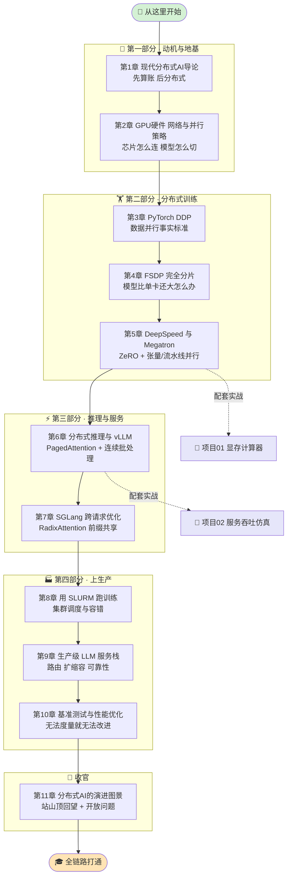

# 📚 《Distributed AI Systems》中文逐章精讲 + 实战合集

> 一份把《**Distributed AI Systems — A practical guide to building scalable training, inference, and serving systems**》从头到尾"讲透 + 跑通"的中文学习仓库。
>
> 🎯 **定位**:不是翻译，而是**第一性原理 + 工程落地 + 面试拆解**三合一。11 章逐章精讲（`book-guide/`）把"为什么单卡时代终结了"到"分布式 AI 往哪演进"讲清楚；2 个**本机可跑、离线、零 GPU、零 API key** 的实战项目（`projects/`）把纸面知识变成手里能敲的代码。
>
> 👥 **适合谁**:准备 AI-Infra / 大模型工程岗面试的同学、想系统补齐"分布式训练 → 推理 → 服务"全链路的工程师、以及读原书想要中文精讲搭档的读者。

---

## 🗺️ 学习路径



> 💡 **怎么走这条路**:11 章有清晰主线——**为什么要分布式（1-2）→ 怎么分布式训练（3-5）→ 怎么分布式推理/服务（6-7）→ 怎么上真实生产（8-10）→ 往哪演进（11）**。读到第 5 章可以顺手动手做**项目 01**（把 ZeRO 分片显存账代码化），读到第 6 章可以做**项目 02**（把推理排队/批处理规律仿真出来）。

---

## 📖 逐章精讲（`book-guide/`）

> 每章都是 Strang 风格的"本质级"精讲:开篇金句 + 本章地图 + 第一性原理 + 可跑代码 + 面试高频 + 常见坑。对应原书 PDF 页码已在每章开头标注。

| 章节 | 精讲文件 | 一句话简介 |
| :--: | :-- | :-- |
| 第 1 章 | [`01_现代分布式AI导论.md`](book-guide/01_现代分布式AI导论.md) | 🚀 为什么单卡时代终结了；教你"**先算账、后分布式**"的工程决策方法论 |
| 第 2 章 | [`02_GPU硬件_网络与并行策略.md`](book-guide/02_GPU硬件_网络与并行策略.md) | 🖥️ 算力怎么估、芯片怎么认、GPU 怎么连（NVLink/IB）、模型/数据怎么切 |
| 第 3 章 | [`03_PyTorch_DDP分布式训练.md`](book-guide/03_PyTorch_DDP分布式训练.md) | 🔄 `DistributedDataParallel`——数据并行分布式训练的**事实标准**与梯度同步 |
| 第 4 章 | [`04_FSDP完全分片数据并行.md`](book-guide/04_FSDP完全分片数据并行.md) | 🧩 模型比单卡显存还大怎么办：FSDP2 从第一性原理到每个 API 参数 |
| 第 5 章 | [`05_DeepSpeed与Megatron超越状态分片.md`](book-guide/05_DeepSpeed与Megatron超越状态分片.md) | ⚙️ ZeRO 三级火箭之外：Megatron 张量并行 / 流水线并行 / 计算分片 |
| 第 6 章 | [`06_分布式推理与vLLM.md`](book-guide/06_分布式推理与vLLM.md) | ⚡ LLM 推理为什么难、KV 缓存为什么是核心矛盾、PagedAttention 如何破局 |
| 第 7 章 | [`07_SGLang跨请求优化.md`](book-guide/07_SGLang跨请求优化.md) | 🌲 RadixAttention 前缀共享、跨请求 KV 复用与调度，把重复计算省下来 |
| 第 8 章 | [`08_用SLURM运行分布式训练.md`](book-guide/08_用SLURM运行分布式训练.md) | 🖥️ 从"理论能跑"到"集群真跑"：SLURM 分配 GPU、协调进程、作业队列与容错 |
| 第 9 章 | [`09_生产级LLM服务栈.md`](book-guide/09_生产级LLM服务栈.md) | 🏭 把零件拼成能扛真实流量的系统：路由、扩缩容、可靠性、成本可控 |
| 第 10 章 | [`10_分布式基准测试与性能优化.md`](book-guide/10_分布式基准测试与性能优化.md) | 📊 "无法度量就无法改进"——如何科学 benchmark、定位瓶颈、做性能优化 |
| 第 11 章 | [`11_分布式AI的演进图景.md`](book-guide/11_分布式AI的演进图景.md) | 🌌 站山顶回望全局：这个领域走到哪了、下一步往哪走、哪些是开放问题 |

---

## 🛠️ 实战项目（`projects/`）

> 两个项目都是**本机可跑 / 离线 / 零 GPU / 零联网 / 零 API key**，核心引擎仅用标准库，配 pytest 用例与可视化图。把"面试官爱问的算账题"变成你手里能敲、能改、能画图的代码。

### 🧮 项目 01 · DDP vs FSDP/ZeRO 显存计算器

📁 [`projects/01_ddp_fsdp_memory_calculator/`](projects/01_ddp_fsdp_memory_calculator/)

**它解决什么**:给定「模型参数量 / 优化器 / dtype / 数据并行度」，精确算出 **DDP** 与 **ZeRO-1/2/3、FSDP** 各自的**单卡显存占用**，并判断「**能不能塞进你的 GPU**」。把"16 字节/参数"定律和 ZeRO 分片账彻底代码化——面试再问"7B/13B/70B 单卡要多少显存、DDP 和 ZeRO-3 差几倍"不慌。

**怎么跑**:

```bash
cd book-distributed-ai-systems/projects/01_ddp_fsdp_memory_calculator

pip install -r requirements.txt   # 核心计算器零依赖；画图需 matplotlib + numpy

python -m pytest -q               # 跑 37 个 pytest 用例
python run_demo.py                # 打印显存对比表 + 生成 3 张可视化图
python memory_calculator.py       # 直接跑计算器引擎自检
```

### 🚀 项目 02 · 分布式推理服务吞吐/延迟仿真

📁 [`projects/02_serving_throughput_sim/`](projects/02_serving_throughput_sim/)

**它解决什么**:用一份纯 Python 的**离散事件仿真**，把"多副本 + 连续批处理"的推理服务搬进你的笔记本，亲手测出 **吞吐、p50/p95/p99 尾延迟、副本利用率、扩副本的边际收益**。回答"QPS 涨一倍该加几张卡""什么负载下 p99 会炸""连续批处理到底省多少"这类老板必问的问题——排队论对连续批处理解不出闭式解，只能靠仿真。

**怎么跑**:

```bash
cd book-distributed-ai-systems/projects/02_serving_throughput_sim

pip install -r requirements.txt   # 核心引擎与测试仅用标准库；出图才需 matplotlib

python -m pytest -q               # 跑 28 个 pytest 用例
python run_demo.py                # 4 组实验 + 生成 4 张 png（吞吐/尾延迟/利用率/边际收益）
python serving_sim.py             # 直接跑仿真引擎自检
```

---

## 🎓 面试 & 实战怎么用这份仓库

| 场景 | 建议用法 |
| :-- | :-- |
| 🎯 **突击面试** | 每章末尾都有「面试高频 & 常见坑」，先扫这部分建立题感；再回头补第一性原理。项目 01/02 的 README 有专门的面试问答小节。 |
| 🧠 **系统补链路** | 严格按学习路径走 1→11，缺哪一环补哪一环。训练岗重点 3-5 + 8，推理岗重点 6-7 + 9-10。 |
| ✋ **动手验证直觉** | 别只看数字。改项目 01 的参数量/优化器，看显存怎么变；改项目 02 的到达率/副本数，看 p99 何时"炸"。**改一个旋钮跑一次**，比读十遍公式记得牢。 |
| 📖 **配合原书** | 每章标了对应原书 PDF 页码，读英文原文卡壳时来这里找中文精讲搭档。 |
| 💬 **手撕白板题** | "7B 模型单卡要多少显存""连续批处理为什么能提吞吐"——先在项目里跑出数字，再用第一性原理讲给面试官听。 |

---

## 📂 目录结构一览

```
book-distributed-ai-systems/
├── README.md                          # 👈 你在这里
├── book-guide/                        # 11 章逐章精讲
│   ├── 01_现代分布式AI导论.md
│   ├── 02_GPU硬件_网络与并行策略.md
│   ├── ...
│   └── 11_分布式AI的演进图景.md
└── projects/                          # 2 个本机可跑实战项目
    ├── 01_ddp_fsdp_memory_calculator/ # 显存计算器（37 pytest + 3 图）
    └── 02_serving_throughput_sim/     # 服务吞吐仿真（28 pytest + 4 图）
```

---

> 📌 **一句话总结**:训练怎么切（DDP/FSDP/ZeRO/Megatron）、推理怎么快（vLLM/SGLang）、生产怎么稳（SLURM/服务栈/benchmark）——这条全链路，这份仓库帮你**读懂 + 跑通 + 会讲**。祝学习顺利，面试拿下！🎉
