# 第 1 章 🚀 现代分布式 AI 导论（Introduction to Modern Distributed AI）

> "A distributed system is one in which the failure of a computer you didn't even know existed can render your own computer unusable."（分布式系统就是这样一种系统：一台你甚至不知道它存在的机器出了故障，却能让你自己的机器瘫痪。）
> —— Leslie Lamport, 1987

> 对应原书：*Distributed AI Systems — A practical guide to building scalable training, inference, and serving systems*，第 1 章（PDF 第 42–99 页）。
> 本章是全书地基：把"**为什么单卡时代终结了**"讲透，再教你**先算账、后分布式**的工程决策方法论，最后用可跑的 PyTorch 代码把训练/推理/服务三大场景跑一遍。

---

## 🗺️ 本章地图

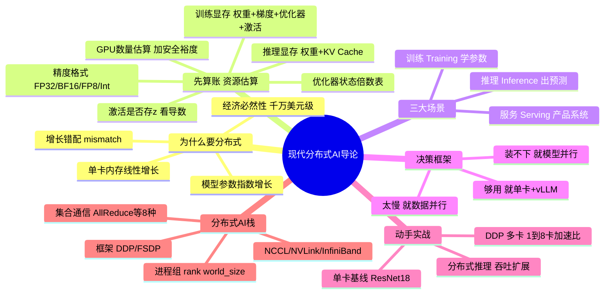

**一句话主线**：现代 AI 模型已经**大到单卡装不下、单卡训不动**，分布式从"锦上添花的优化"变成了"架构层面的必需品"。但——分布式会带来复杂度、通信开销和成本，所以本章教你的核心心法是：**先估算资源，确认真的需要，再上分布式**（Use them when you have to, not when you want to）。

---

## 1.1 🔥 为什么现代 AI 必须分布式

### 1.1.1 是什么：单机 AI 时代已经结束

原书开篇给了一个非常直观的对比：

- **几年前**：大多数模型能在**单张 GPU** 上训练。ResNet-50 在 ImageNet 上训练，也就**几天**的事。
- **今天**：在单张 GPU 上训练一个 **70B 参数**的语言模型要花**几个月**——前提是它还**塞得进显存**。

模型变大了，数据集变大了，单卡训练变得**不切实际**。原书用一句话定性：

> *"The era of single-machine AI is over; modern AI systems are inherently distributed by design."*
> 单机 AI 的时代已经结束；现代 AI 系统在设计上就是天生分布式的。

### 1.1.2 为什么：模型规模的指数级爆炸

原书用 **Table 1.1** 罗列了近年的大模型规模。我们把它整理成表（含书中给出的 2023→2026 演进）：

| 模型 Model | 参数量 Parameters | 公司 Company | 年份 Year |
|---|---|---|---|
| ViT-22B | 22B | Google | 2023 |
| Grok-1 | 314B | xAI | 2023 |
| Gemini-1 | 1.6T | Google | 2023 |
| LLaMA-2 | 70B | Meta | 2023 |
| PanGu-Σ | 1.085T | Huawei | 2023 |
| DeepSeek-V1 | 6.7B | DeepSeek | 2023 |
| GPT-4V | ~1.8T | OpenAI | 2024 |
| DeepSeek-V2 | 236B | DeepSeek | 2024 |
| Qwen-Max | ~1.2T | Alibaba | 2025 |
| GPT-5 | ~2–5T | OpenAI | 2025 |
| DeepSeek-V3 | 671B | DeepSeek | 2025 |
| Claude Opus 4.7 | ~1T+ | Anthropic | 2026 |
| Kimi K2.6 | 1T | Moonshot AI | 2026 |
| DeepSeek-V4-Pro | 1.6T | DeepSeek | 2026 |
| Claude Mythos 5 | ~10T | Anthropic | 2026 |

> ⚠️ **常见坑：参数量的"~"号是有讲究的**
> 表里很多前沿模型标了 `~`（约等于），原书专门在 References[1][2] 里解释：这些**闭源**模型不公开精确参数量，数字是从架构、训练成本、行业估算里**推断**出来的。更重要的是——很多是 **MoE（Mixture-of-Experts，混合专家）**模型，要区分「**总参数（total）**」和「**每 token 激活参数（active）**」。比如 Claude Mythos 5 被描述为 ~10T 总参数、但每 token 只激活 ~800B–1.2T。所以看到一个"万亿参数"模型，先问一句：**这是总参数还是激活参数？** 二者的显存/算力含义完全不同。

### 1.1.3 🔬 核心论证：增长错配（The Growth Mismatch）

这是本章**最重要的第一性原理**，原书用 Figure 1.2 专门画了一张图。逻辑链条是：

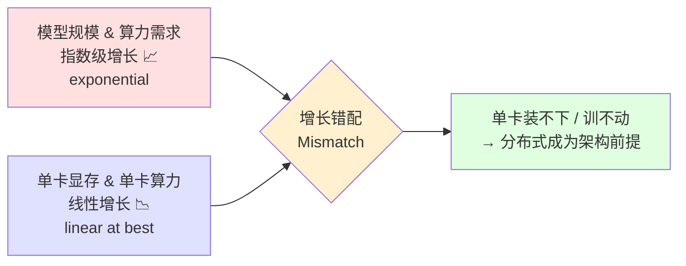

用一个不等式来概括这个矛盾：

$$
\underbrace{\text{Model Size} \sim O(\text{exp}(t))}_{\text{指数增长}} \quad \gg \quad \underbrace{\text{Single-GPU Memory} \sim O(t)}_{\text{线性增长（乐观估计）}}
$$

**只要指数增长的曲线跑在线性增长曲线之上，缺口就会越拉越大**——这就是为什么"堆更强的单卡"永远追不上模型的胃口，你**必须**把工作负载横向铺开到多张卡、多个节点上。

### 1.1.4 具体规模挑战：拿 70B 模型算笔账

原书给了一个非常具体的例子（The scale challenge）：

- 一个 **70B 参数**的模型，用**全精度 FP32** 存储，光**权重**就需要 $70 \times 10^9 \times 4 \text{ bytes} = 280\text{GB}$ 显存。
- **今天没有任何一款主流数据中心 GPU 装得下这么多**——连 **H200（141 GB）** 和 **B200（192 GB）** 都不够。
- 光是**加载模型**就得多张卡，更别说训练了。
- 训练要花**数千 GPU-小时**；单卡跑要几个月。数据集也巨大——**万亿级 token**，光加载和预处理就需要**分布式流水线**。

$$
\text{FP32 权重显存} = \text{参数量} \times 4 \text{ bytes} = 70\text{B} \times 4 = 280\text{GB} \;\;\gg\;\; \text{B200 的 192GB}
$$

### 1.1.5 代价：不只是技术问题，更是经济必然

原书引用 PyTorch 官方文档和行业报告指出：训练**万亿参数**模型需要**数千万美元级**的基础设施投入（tens of millions of dollars）。所以分布式计算：

> *"...making distributed computing not just a technical necessity but an economic imperative."*
> ……不仅是**技术必需**，更是现代 AI 研发的**经济必然**。

而且这不只是训练问题——**在生产环境为这些模型提供服务**（serving），要扛住**数千个并发请求**，同样需要分布式推理架构。

---

## 1.2 💰 先算账：估算模型的资源需求

> 原书核心工程心法：*"Before you start training or deploying, you need to know how much memory and compute you'll need. Get this wrong, and you'll hit out-of-memory errors or waste money on over-provisioned infrastructure."*
> 开工前先算清楚要多少显存和算力。算错了，要么撞 **OOM（Out-Of-Memory）**，要么在过度配置的机器上烧钱。

### 1.2.1 精度格式：一切显存计算的起点

显存占用取决于你"用什么精度存"。原书给出了一张精度速查表，这是**整章计算的基石**，务必背熟：

| 格式 Format | 字节/参数 Bytes | 格式细节（sign / exponent / mantissa） | 主要用途 |
|---|---|---|---|
| **FP32** | 4 | 32 位浮点（1 符号 / 8 指数 / 23 尾数） | 训练、高精度推理 |
| **BF16** | 2 | 16 位 bfloat（1 / **8** / 7） | **训练（首选）**、推理 |
| **FP16** | 2 | 16 位 float（1 / 5 / 10） | 推理 |
| **FP8 E4M3** | 1 | 8 位浮点（1 / 4 / 3） | 推理（激活、权重） |
| **FP8 E5M2** | 1 | 8 位浮点（1 / 5 / 2） | 训练（梯度存储） |
| **MXFP8** | ~1 | E4M3 + 32 值块级缩放 | Blackwell 训练 |
| **NVFP4** | ~0.5 | E2M1 + 16 值块级缩放 | Blackwell 推理 |
| **Int8** | 1 | 8 位整数 | 量化推理 |
| **Int4** | 0.5 | 4 位整数 | 量化推理（极限压缩） |

以一个 **7B 参数**模型为例，权重显存随精度直接变化：

$$
\text{7B 权重} = \begin{cases} 28\text{GB} & \text{FP32（}\times 4\text{）} \\ 14\text{GB} & \text{BF16 / FP16（}\times 2\text{）} \\ 7\text{GB} & \text{Int8（}\times 1\text{）} \\ 3.5\text{GB} & \text{Int4（}\times 0.5\text{）} \end{cases}
$$

> 🔬 **第一性原理：为什么训练首选 BF16 而不是 FP16？**
> 二者都是 2 字节，区别在**指数位（exponent）**：
> - **BF16** 有 **8 位指数**，和 FP32 **一模一样的动态范围（dynamic range）**——只是尾数少（7 位，精度低一点）。动态范围大，训练时**不容易上溢/下溢（overflow/underflow）**，更稳定。
> - **FP16** 只有 **5 位指数**，动态范围小，训练中容易出现数值问题（梯度爆炸/消失到 inf/0）。
> 一句话：**BF16 用"精度"换"范围"，而训练最怕的是范围不够（数值炸掉），所以 BF16 赢。** 现代 GPU（A100、H100）的 Tensor Core 都专门为 BF16 做了优化。推理时 FP16/BF16 都能用，但为了和训练一致，还是偏好 BF16。

> 💡 **实战 / 面试高频：FP8 的两种格式为什么要分家？**
> FP8 有 **E4M3** 和 **E5M2** 两种，**都是 1 字节**但用途不同：
> - **E4M3**（4 指数 3 尾数）→ **精度更高**，用于推理的**激活和权重**。
> - **E5M2**（5 指数 2 尾数）→ **动态范围更宽**，用于**梯度存储**（训练）。
> 记忆法：**存梯度要范围（E5），存权重要精度（E4）**。在 NVIDIA Blackwell 上，MXFP8 在 Hopper 风格的 per-tensor FP8 之上加了**更细的块级缩放（block scaling）**；NVFP4 更是压到 8 位以下用于推理。因为用了微缩放（microscaling），实际显存略高于名义位数。

### 1.2.2 训练显存 = 权重 + 梯度 + 优化器状态 + 激活

原书反复强调："**训练需要的显存远多于推理**"（Training needs way more memory than inference）。训练时你要同时存四样东西：

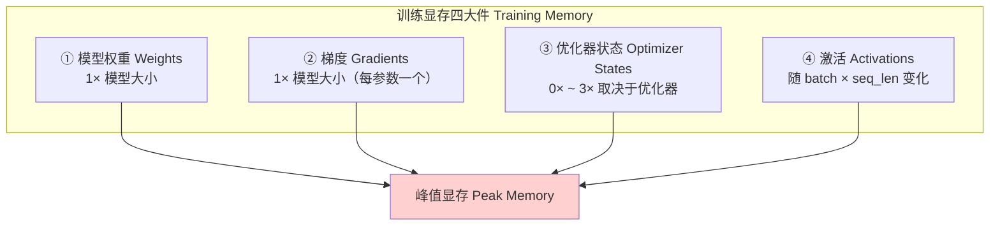

而推理只需要：**权重 + KV Cache**。差别巨大。下面逐一拆解。

### 1.2.3 优化器状态：为什么 Adam 比 SGD 多吃 2 倍显存

这是理解训练显存的关键。原书从公式出发讲得非常清楚。

**SGD（随机梯度下降）**的更新公式：

$$
w_{t+1} = w_t - \eta \, g_t
$$

- $w_t$：第 $t$ 步的模型参数
- $g_t = \nabla_w L(w_t)$：损失对参数的梯度（反向传播时算出来）
- $\eta$：学习率（learning rate）

**逐点分析**：SGD 更新只需要一个标量 $\eta$。你要存 $w_t$（权重）和 $g_t$（梯度），但**优化器状态本身只是 $\eta$——可忽略不计（~0×）**。这就是 SGD 显存开销小的原因。

**Adam（自适应矩估计）**的公式复杂得多，它维护两个**逐参数**的张量：

$$
m_t = \beta_1 m_{t-1} + (1-\beta_1) g_t \quad \text{（一阶矩 / 均值）}
$$
$$
v_t = \beta_2 v_{t-1} + (1-\beta_2) g_t^2 \quad \text{（二阶矩 / 未中心化方差）}
$$
$$
\hat{m}_t = \frac{m_t}{1-\beta_1^t}, \quad \hat{v}_t = \frac{v_t}{1-\beta_2^t}, \quad w_{t+1} = w_t - \eta \frac{\hat{m}_t}{\sqrt{\hat{v}_t}+\epsilon}
$$

**逐点分析**：
- $m_{t-1}$（一阶矩）和 $v_{t-1}$（二阶矩）**形状都和 $w_t$ 一样**——每个参数一个值。
- 所以 Adam 存 $m$（1× 模型大小）+ $v$（1× 模型大小）= **2× 模型大小**的优化器状态。
- $\beta_1, \beta_2$（典型值 0.9、0.999）、$\eta$、$\epsilon$ 都是**标量**，只存一次，可忽略。

> 🔬 **第一性原理：什么样的张量才"吃显存"？**
> 只有**形状和 $w_t$ 一样（每参数一个值）**的张量才占大量显存：$w_t, g_t, m_{t-1}, v_{t-1}$。标量超参数（$\eta, \beta, \epsilon$）不占。这就是"Adam 比 SGD 多 2× 显存"的根源。**AdamW** 和 Adam 显存需求一样（都维护 $m, v$），区别只在权重衰减 weight decay 的施加方式（AdamW 直接作用于参数，Adam 加到梯度上）。

**优化器状态显存倍数速查表**（原书完整表格）：

| 优化器 Optimizer | 优化器状态 | 额外显存倍数 |
|---|---|---|
| SGD | 学习率 η（标量） | **~0×** |
| SGD+Momentum | $v_{t-1}$（速度/动量） | 1× |
| Nesterov | $v_{t-1}$ | 1× |
| Adagrad | 累积梯度平方 | 1× |
| RMSProp | $v_{t-1}$（二阶矩） | 1× |
| **Adam** | $m_{t-1}$ + $v_{t-1}$ | **2×** |
| **AdamW** | $m_{t-1}$ + $v_{t-1}$ | **2×** |
| Adafactor | 行列统计（因式分解） | **~0.5×** |
| LAMB | $m_{t-1}$ + $v_{t-1}$ | 2× |
| Lion | 仅 $m_{t-1}$（一阶矩） | 1× |
| Nadam | $m_{t-1}$ + $v_{t-1}$ | 2× |
| AMSGrad | $m_{t-1}$ + $v_{t-1}$ + $v_{\max}$ | 3× |
| SparseAdam | $m_{t-1}$ + $v_{t-1}$（稀疏） | 2× |
| Shampoo | 每参数左右预条件矩阵 | >2×（不定） |
| AdaBelief | $m_{t-1}$ + $s_{t-1}$（belief 项） | 2× |

> ⚠️ **注意**：上表**只是优化器状态**。无论用哪个优化器，你**还要额外**存权重（1×）和梯度（1×）。所以 Adam 全量训练时，光"权重+梯度+优化器状态"就是 **1× + 1× + 2× = 4× 模型大小**。

> 💡 **实战省显存**：想省优化器显存？可以看 **Adafactor（~0.5×）** 或 **Lion（1×，只存一阶矩）**。原书后面也提到，用 SGD 能比 Adam 省 2× 优化器显存，但 Adam 的自适应学习率通常**收敛更快**，多数情况这个 trade-off 是划算的。

### 1.2.4 激活显存：为什么有的激活函数要多存一份 z？

激活层（ReLU、GELU、Sigmoid 等）**本身没有参数**——它们只是逐元素（element-wise）应用的函数。但它们的**输出（activations）需要在训练时存在显存里**，因为反向传播算梯度时要用。

原书用一个 3 层的 `SimpleDNN` 来讲透这件事：

```python
class SimpleDNN(nn.Module):
    def __init__(self, input_dim, output_dim, hidden_dim=1, bias=False):
        super(SimpleDNN, self).__init__()
        self.linear1 = nn.Linear(input_dim, hidden_dim, bias=bias)  # x -> z
        self.activation = nn.Sigmoid()                              # z -> h
        self.linear2 = nn.Linear(hidden_dim, output_dim, bias=bias) # h -> y_hat

    def forward(self, x):
        z = self.linear1(x)      # z = W_1 * x
        h = self.activation(z)   # h = sigmoid(z)
        y_hat = self.linear2(h)  # y_hat = W_2 * h
        return y_hat
```

前向：$x \xrightarrow{W_1} z \xrightarrow{\sigma} h \xrightarrow{W_2} \hat{y}$

反向传播用链式法则（chain rule）算梯度：

$$
\frac{\partial L}{\partial W_2} = \frac{\partial L}{\partial \hat{y}} \cdot \frac{\partial \hat{y}}{\partial W_2} = \frac{\partial L}{\partial \hat{y}} \cdot h
$$

→ 这个梯度**依赖 $h$**（sigmoid 的输出）。所以 $h$ 必须存在显存里。

$$
\frac{\partial L}{\partial W_1} = \frac{\partial L}{\partial \hat{y}} \cdot \underbrace{\frac{\partial \hat{y}}{\partial h}}_{=W_2} \cdot \underbrace{\frac{\partial h}{\partial z}}_{=\sigma'(z)} \cdot \underbrace{\frac{\partial z}{\partial W_1}}_{=x}
$$

→ 这个梯度需要 $h$ **和** $x$（输入数据）。所以**激活输出和输入数据都必须在前向时保留**，直到反向传播算完它们的梯度。

> 🔬 **第一性原理：一个精妙的观察——z 不需要存！**
> 注意上面算 $\frac{\partial h}{\partial z} = \sigma'(z)$。对 sigmoid，导数是：
> $$\sigma'(z) = \sigma(z)(1-\sigma(z)) = h(1-h)$$
> **导数可以直接用输出 $h$ 表达，根本不需要原始的 $z$！** 因为前向时我们已经把 $h$ 存下来了。这是 sigmoid（以及部分激活函数）的性质：**它们的导数能用自己的输出表示，所以不用存前激活值 z**。

但——**不是所有激活函数都这么幸运**。原书据此把激活函数分成两类：

| 类别 | 激活函数 | 前向需存什么 | 原因 |
|---|---|---|---|
| **导数可用输出 h 表达** | Sigmoid、Tanh、Softplus | **只存 h** ✅ | $\sigma'=h(1-h)$，$\tanh'=1-h^2$，$\text{Softplus}'=\sigma(z)$ |
| **导数需要输入 z** | ReLU、Leaky ReLU、ELU、GELU、Swish、Mish、GLU 族（GEGLU/ReGLU/SwiGLU） | **必须存 z** ⚠️ | 导数公式里显式含 z，或依赖 z 的符号 |

以 **GELU** 为例（精确形式用标准正态的累积分布函数 $\Phi$）：

$$
\text{GELU}(z) = z \cdot \Phi(z), \qquad \text{GELU}'(z) = \Phi(z) + z \cdot \phi(z)
$$

导数里**显式含有 $z$**（那个 $z \cdot \phi(z)$ 项，$\phi$ 是标准正态的概率密度）。即使用 tanh 近似，导数里仍然到处是 $z$、$z^2$、$z^3$，而 tanh 又不好求逆，所以**没法只从 $h$ 恢复 $z$，只能老老实实存 $z$**。

**Swish（也叫 SiLU）**同理：$\text{Swish}(z) = z \cdot \sigma(z)$，导数含 $z$ 和 $\sigma(z)$，必须存 $z$。

> 💡 **PyTorch autograd 的智能之处**：框架的自动微分系统会**根据计算图自动决定要存什么**——对 sigmoid 这种，只存后激活值 h；对 GELU/Swish 这种，存前激活值 z。目的是**在保证梯度正确的前提下，尽量少占显存**。

**激活显存的关键规律**：它**随 batch size 和 sequence length 线性增长**——批更大、序列更长，就要存更多激活。省激活显存的经典手段是**梯度检查点（gradient checkpointing）**：用"重算激活"换"少存激活"，拿算力换显存。

### 1.2.5 训练显存的时间线：峰值到底出现在哪一步？

原书用一段标准训练循环，逐行讲清"**每一步显存里装着什么**"：

```python
for epoch in range(num_epochs):
    model.train()                         # 设为训练模式
    for x_batch, y_batch in dataloader:   # 遍历批次
        optimizer.zero_grad()             # 1. 清空梯度
        y_hat = model(x_batch)            # 2. 前向传播
        loss = criterion(y_hat, y_batch)  # 3. 计算损失
        loss.backward()                   # 4. 反向传播
        optimizer.step()                  # 5. 更新参数
```

**逐步显存分析**（以 7B 模型 + Adam + 全程 BF16 为例）：

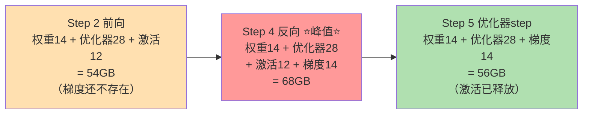

| 代码行 | 阶段 | 显存内容 | 合计 |
|---|---|---|---|
| L2 `model(x_batch)` | 前向 | 权重 14 + 优化器 28 + 激活 12 | **54 GB**（梯度尚不存在） |
| L4 `loss.backward()` | 反向 | 权重 14 + 优化器 28 + 激活 12 + **梯度 14** | **68 GB ⭐ 峰值** |
| L5 `optimizer.step()` | 更新 | 权重 14 + 优化器 28 + 梯度 14 | **56 GB**（激活可释放） |

> 🔬 **第一性原理：为什么峰值一定在反向传播（L4）？**
> 因为**反向传播时，激活和梯度必须同时在显存里**——你需要用前向存下来的**激活**去计算**梯度**，二者**重叠（overlap）**。前向阶段梯度还没生成；优化器 step 阶段激活已经能释放。所以**「激活 + 梯度同时存在」的那一刻，就是峰值**。理解了这点，你就懂了三个省显存招数为什么有效：
> - **减小 batch size** → 直接砍激活显存
> - **梯度累积（gradient accumulation）** → 跑几个小 micro-batch，最后才 `optimizer.step()`，有效 batch 不变但峰值激活更低
> - **梯度检查点（gradient checkpointing）** → 反向时重算激活，用算力换显存

**7B 模型显存拆账总结**（BF16 全程 + Adam）：

$$
\underbrace{14}_{\text{权重}} + \underbrace{14}_{\text{梯度}} + \underbrace{28}_{\text{优化器 }m,v} = 56\text{GB（固定，激活之外）}
$$

激活再加 **8–16GB**（取决于 batch 和 seq_len，示例用 12GB），峰值 = 56 + 12 = **68GB**，整体区间 **64–72GB/卡**。

> ⚠️ **生产环境的坑：混合精度不是"全程 BF16"**
> 上面是干净的教学示例。很多生产设置用**不同的混合精度策略**：前向/反向用 BF16（`torch.autocast`），但**优化器状态——有时还有一份权重的 master copy——保留 FP32**。这会把优化器显存推到 $4 \text{ bytes} \times 2 \text{ states} \times 7\text{B} = 56\text{GB}$，而不是 28GB。**所以真实显存往往比"理论最省"高不少。** 结论：一个 7B 模型用 Adam 训练，在这个 footprint 下**至少要一张 A100（80GB）**；若用 FP32 优化器状态/master 权重，还要更多。更小的卡就得靠 **FSDP / DeepSpeed 分片** 才行。

### 1.2.6 推理显存 = 权重 + KV Cache

推理和训练完全不同——**不需要梯度、不需要反向、不需要优化器状态**，只要：**模型权重 + KV Cache**。

**KV Cache（键值缓存）**是 LLM 推理的核心：它把**前面 token 已经算过的 key-value 对存起来**，这样生成新 token 时就不用对整个序列重算注意力（attention）。这大大加速了**自回归生成（autoregressive generation）**，但代价是——**KV Cache 显存随 batch size、序列长度、模型深度线性增长**。

$$
\text{推理显存} \approx \text{权重} + \text{KV Cache}(\text{batch} \times \text{seq\_len} \times \text{layers})
$$

原书的例子：一个 **70B 模型（BF16）**：
- 权重 ≈ **140GB**
- batch=32、seq_len=2048 时，KV Cache 再加 **20–40GB**
- 合计 **160–180GB** → **超过单张 A100（80GB）**，必须多卡或模型并行。

> 💡 **面试高频：超长上下文会把 KV Cache 撑爆**
> 原书举了 `meta-llama/Llama-4-Scout-17B-16E-Instruct` 这个例子：支持 **1000 万 token** 上下文窗口。尽管它只是个 17B 的 **MoE 模型（16 个专家，每 token 只激活一部分）**，但在满上下文长度下，**单条序列的 KV Cache 就能超过 1TB**！这直接宣判了单机推理架构"死刑"——超长上下文模型让"几十张 GPU 的分布式推理"从"有益"变成"唯一可行"的部署架构。

### 1.2.7 GPU 数量估算：别忘了安全裕度

原书教了一套加"安全裕度（safety margin）"的估算方法。

**训练**：从模型显存 footprint 出发，加 **10–20%** 安全裕度（给通信 buffer 和框架开销）。
- 例：13B 模型（BF16）基础需求 ≈ 72GB/卡 → 加裕度 → **85GB** → A100 只有 80GB → **需要 2 张卡**（模型并行或 FSDP）。

**推理**：权重 + KV Cache。
- 例：70B（BF16）权重 140GB + KV Cache → **160–180GB** → **至少 2 张 A100**；或用 **Int8 量化**把权重压到 ~70GB → **可能单卡搞定**（配合精细的 KV Cache 管理）。

**真实世界还有隐藏开销**（Real-World considerations）：

| 开销来源 | 大小 |
|---|---|
| PyTorch 框架 | 1–2 GB |
| 操作系统 | 5–10 GB |
| 分布式通信 buffer | 2–5 GB / 卡 |
| Checkpoint 操作 | 临时峰值（要预留） |

> 💡 **实战保守估算法**：在基础估算上再加 **20–30% buffer**，来兜住这些开销和运行时波动。用 `nvidia-smi` 监控**实际显存**，验证你的理论估算。撞了 **OOM** 时，**减小 batch size 是最立竿见影的止血手段**（因为激活显存随 batch 线性增长）。

**显存速查表**（原书 Quick Reference Table，务必收藏）：

| 模型规模 | FP32 权重 | BF16 权重 | 训练（BF16+Adam） | 推理（BF16） |
|---|---|---|---|---|
| **1B** | 4 GB | 2 GB | ~8 GB | 2–4 GB |
| **7B** | 28 GB | 14 GB | ~60–70 GB | 14–20 GB |
| **13B** | 52 GB | 26 GB | ~110–130 GB | 26–35 GB |
| **70B** | 280 GB | 140 GB | ~600–700 GB | 140–180 GB |

---

## 1.3 📜 从经典 ML 到基础模型：范式的根本转变

原书用一条演进线，说明"为什么分布式成了架构前提而非优化选项"：

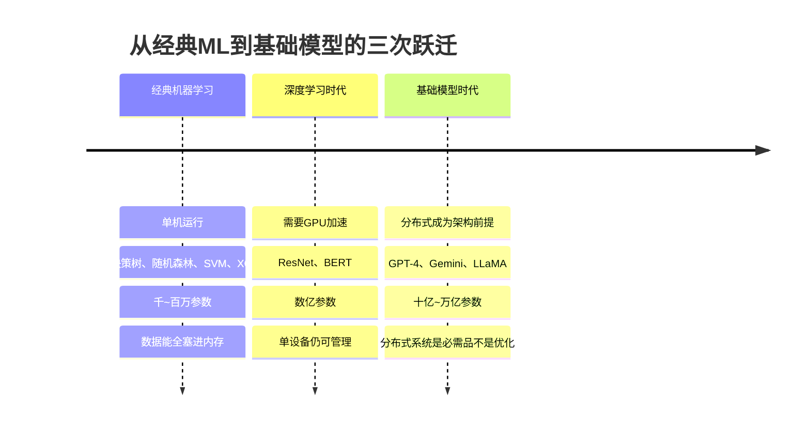

| 时代 | 代表 | 参数规模 | 分布式需求 |
|---|---|---|---|
| **经典 ML** | 线性回归、SVM、XGBoost、LightGBM | 千 ~ 百万 | 无（单机、数据入内存） |
| **深度学习** | ResNet、BERT | 数亿 | 需 GPU，但单设备可控 |
| **基础模型** | GPT-4、Gemini、LLaMA | 十亿 ~ 万亿 | **分布式是架构前提** |

这次向分布式的转变，直接催生了能理解/生成类人文本、代码、多模态内容的模型能力，也催化了企业级规模化落地，并通过**并行实验**加速了研究迭代。

### 1.3.1 现代 AI 模型的生命周期

原书 Figure 1.5 强调：建模不是"一锤子买卖"，而是一个**循环（cycle）**：

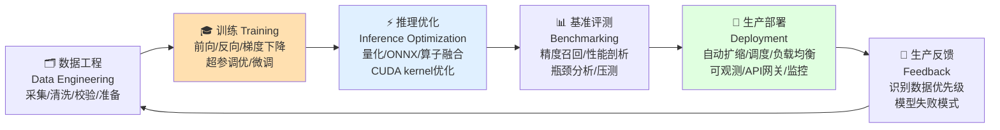

> 📌 **本书聚焦点**：训练、推理、基准评测、部署这些**分布式技术**。数据工程只做简要概览——不是因为不重要，而是它已经是成熟话题（Spark、Dask、Ray 存在多年了）。本书的主战场是 **AI 特有的分布式挑战**：训练大模型、优化推理、大规模服务。

---

## 1.4 🎯 训练 / 推理 / 服务：三大场景讲透

这是本章的核心分类。很多人把三者混为一谈，其实它们的目标、显存、算力、通信模式**完全不同**。

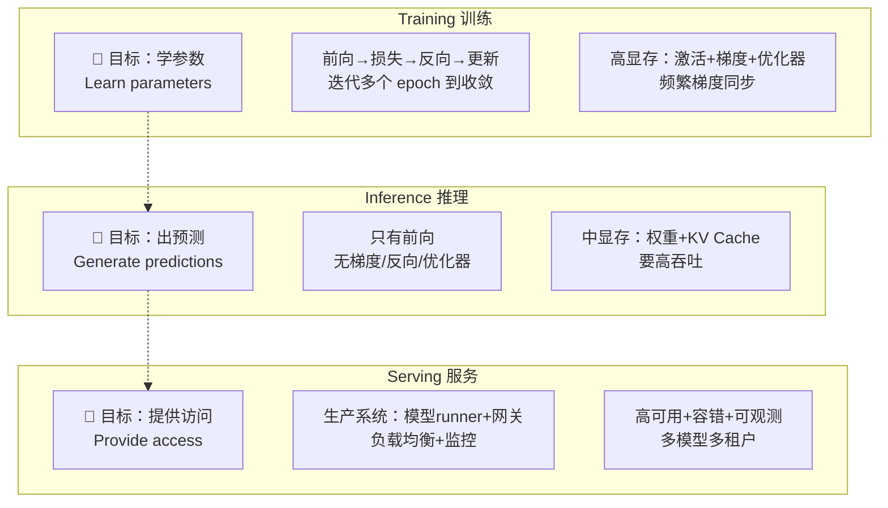

### 1.4.1 训练（Training）：学习阶段

**是什么**：从数据中学习模型参数。流程固定——**前向传播 → 计算损失 → 反向传播算梯度 → 梯度更新参数**，迭代多个 epoch 直到收敛。

**特点与挑战**：
- 显存要存**激活、梯度、优化器状态**（如前所述），最重。
- 算力**密集且迭代**。
- 分布式训练需要**跨设备频繁同步梯度**，保持所有模型副本一致。
- 挑战：梯度同步开销、大模型显存约束、可能长达**数天到数周**的训练时长、以及**容错和检查点（checkpointing）**需求。

**原书基准**：训练一个 **7B 模型**在 **1 万亿 token** 上，典型需要 **8 张 A100（80GB）** + **约 2 周**连续训练。全程要小心梯度同步以保证跨 GPU 的训练稳定性。

### 1.4.2 推理（Inference）：预测/生成阶段

**是什么**：用训练好的模型生成预测。和训练不同——**只需要前向传播**，没有梯度、没有反向、没有优化器状态。

**特点与挑战**：
- 显存更低（只要权重 + KV Cache）。
- 单请求算力低，但需要**高吞吐**同时服务大量请求。
- 通信极少（主要在分布式推理时）。
- 挑战：**延迟（latency，交互应用要亚秒级）**、**吞吐（throughput，每秒数千请求）**、通过 KV Cache 管理高效用显存、以及高效的**批处理和调度**。

**原书实践**：为 **70B 模型**做 chat 服务，需要优化的推理引擎如 **vLLM 或 SGLang**、**连续批处理（continuous batching）**最大化 GPU 利用率、以及对变长序列的精细 KV Cache 管理。

### 1.4.3 服务（Serving）：生产系统

**是什么**：提供可靠、可扩展的模型访问。**它不只是"跑推理"**——而是构建一个包含**模型 runner、API 网关、负载均衡器、监控**的生产系统。

**特点与挑战**：
- 要求**高可用、容错、可观测（observability）**。
- 规模化时要处理**多模型、多租户（multi-model, multi-tenant）**系统。
- 挑战：系统可靠性和正常运行时间、多模型路由与负载均衡、通过 GPU 利用率和自动扩缩做成本优化、以及用于调试的可观测性。

**原书实践**：一个生产级 LLM 服务平台可能包含**多个模型变体**（不同规模、不同微调版本）、**A/B 测试**基础设施、**金丝雀部署（canary deployment）**流水线、以及分布式追踪与监控。

### 1.4.4 三者对比总表（原书核心表格）

| 维度 Aspect | 训练 Training | 推理 Inference | 服务 Serving |
|---|---|---|---|
| **目标 Goal** | 学参数 | 生成预测 | 提供访问 |
| **显存 Memory** | 高（激活 + 梯度） | 中（权重 + KV Cache） | 可变 |
| **计算 Computation** | 迭代、密集 | 单次前向 | 请求驱动 |
| **通信 Communication** | 频繁（梯度） | 中等 | API 级 |
| **延迟 Latency** | 小时到天 | 毫秒到秒 | 毫秒 |
| **吞吐 Throughput** | 样本/秒 | token/秒 | 请求/秒 |

> 💡 **面试高频：一句话区分三者**
> **训练在乎"多快收敛"（time-to-convergence），推理在乎"每秒多少 token"（throughput），服务在乎"系统不能挂"（reliability）。** 训练的通信是**梯度同步**，推理的通信是**分布式并行**，服务的通信是**API 级路由**。

---

## 1.5 🧭 决策框架：什么时候才真的需要分布式？

> 原书黄金法则：*"Distributed systems add complexity, communication overhead, and cost. Use them when you have to, not when you want to."*
> 分布式会带来复杂度、通信开销和成本。**能不用就不用，逼不得已才用。**

原书用一棵决策树（Figure 1.6）给出可执行的判断流程：

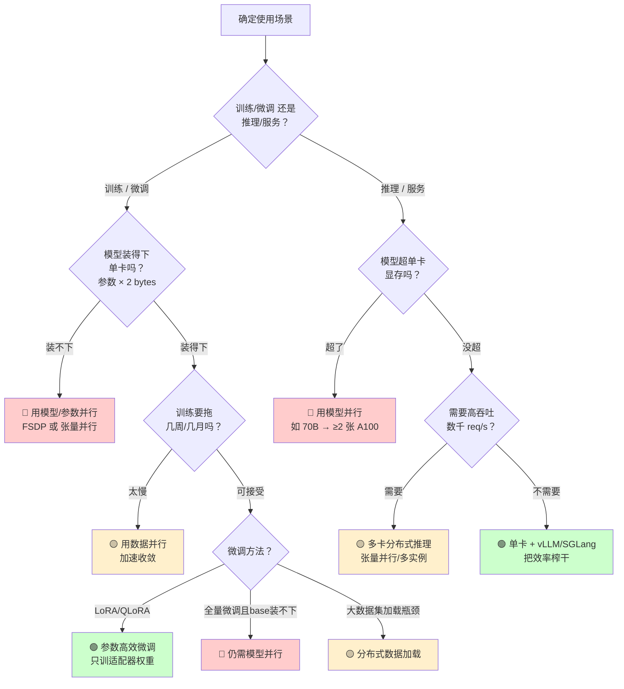

### 训练/微调分支逐条解读

1. **先算"装不装得下"**：算 BF16 模型大小（参数 × 2 bytes）。超单卡容量 → 需要 FSDP 或张量并行。
   - 例：13B 模型光权重 26GB，加 Adam 优化器状态 → **总共 ~78GB**，逼近 80GB A100 的极限（cutting it close）。
2. **模型装得下但训练太慢**：几周几月 → **数据并行**能提速。7B 模型在 1T token 上，单卡几个月 vs. **8 卡约 2 周**。
3. **微调方法很关键**：**LoRA / QLoRA** 改变了等式。**QLoRA 微调 70B 模型能塞进 48GB GPU**，因为它只训练**适配器权重（adapter weights）**；而**全量微调**同一模型需要多卡。⚠️ 但**如果 base 模型本身都装不下**，无论用哪种微调方法，你**仍然需要模型并行**。
4. **大数据集**：数据加载成瓶颈的多 TB 数据集 → 适合**分布式数据加载**。

### 推理/服务分支逐条解读

1. **模型超单卡显存** → **模型并行**。70B（BF16）权重 140GB + KV Cache → 160–180GB → **至少 2 张 A100**。
2. **显存够但要高吞吐**（数千 req/s）→ **多卡分布式推理**。需要亚秒延迟 + 高吞吐的实时服务，常需张量并行或多推理实例。
3. **显存和吞吐单卡都够** → **就用单卡**，配 **vLLM / SGLang** 这类优化引擎把效率榨到最大。

> 🔬 **核心论证：为什么"能不用就不用"？**
> 分布式的收益是"更多算力/显存"，但代价是**通信开销**（梯度同步、参数聚合）、**工程复杂度**（进程组、容错、调试分布式 hang）、以及**真金白银的成本**。当单卡就能满足显存和延迟要求时，多加一张卡不仅不提速，反而因为通信开销**可能更慢**。所以正确姿势永远是：**先估算（memory + compute），确认单卡装不下或太慢，才上分布式。**

---

## 1.6 🛠️ 动手实战：跑通分布式训练与推理

原书用可复现的代码，让你亲眼看到分布式的加速效果。环境：PyTorch，代码在
`git clone https://github.com/PacktPublishing/Distributed-AI-Systems`。没有多卡？**Kaggle 提供免费的双卡（GPU T4×2）环境**。

**验证 GPU**（`code/check_cuda.py`）：

```python
import torch
print(f"CUDA available: {torch.cuda.is_available()}")
print(f"Number of GPUs: {torch.cuda.device_count()}")
for i in range(torch.cuda.device_count()):
    props = torch.cuda.get_device_properties(i)
    vram_gb = props.total_memory / (1024**3)
    print(f"GPU {i}: {props.name} ({vram_gb:.1f} GB)")
```

### 1.6.1 单卡基线（Single-GPU Baseline）

用 **ResNet18**（轻量 18 层 CNN）+ **FashionMNIST**（7 万张 28×28 灰度图，10 类服饰）。跑基线：

```bash
python code/single_gpu_baseline.py
```

3 个 epoch 后的输出：

```text
Epoch 1/3, Loss: 0.4164, Accuracy: 84.94%
Epoch 2/3, Loss: 0.2936, Accuracy: 89.17%
Epoch 3/3, Loss: 0.2531, Accuracy: 90.58%
Total training time: 8.78s
```

> ⚠️ **数据集适配的坑**：`torchvision` 的 ResNet18 是为 **3 通道 RGB** 设计的，但 FashionMNIST 是 **1 通道灰度**。要改两层：
> ```python
> model.conv1 = nn.Conv2d(1, 64, kernel_size=7, stride=2, padding=3, bias=False)  # 3→1 输入通道
> model.fc = nn.Linear(model.fc.in_features, 10)                                   # 输出 10 类
> ```

### 1.6.2 多卡分布式训练（DDP）

用 **torchrun** 启动多进程，同一个 ResNet18 + FashionMNIST，但把工作切到多卡：

```bash
torchrun --nproc_per_node=2 code/multi_gpu_ddp.py
# 或
bash code/launch_torchrun.sh
```

2 卡把 8.78 秒降到 **5.91 秒 → 1.48× 加速**。原书测了 1→8 卡的扩展性：

| GPU 数 | 训练时间（FashionMNIST） | 加速比 |
|---|---|---|
| 1 | 8.78s | 1.00× |
| 2 | 5.91s | 1.48× |
| 4 | 3.69s | 2.38× |
| 6 | 2.92s | 3.01× |
| 8 | 2.44s | **3.60×** |

**更真实的负载**：ResNet18 + **CIFAR-10（5 万张 32×32 RGB）+ 20 epochs**：

| GPU 数 | 训练时间（CIFAR-10, 20ep） | 加速比 |
|---|---|---|
| 1 | 73.00s | 1.00× |
| 2 | 46.47s | 1.57× |
| 4 | 27.72s | 2.63× |
| 6 | 21.24s | 3.44× |
| 8 | 18.20s | **4.01×** |

> 🔬 **第一性原理：为什么 CIFAR-10 的加速比（4.01×）比 FashionMNIST（3.60×）更好？**
> 关键在**通信开销 vs 计算开销的比例**。CIFAR-10 每个 epoch 的**计算量更大**（图更大、更复杂、20 epoch），所以**梯度同步（通信）只占总时间的一小部分**——通信开销被更多训练步**摊薄（amortized）**了。每张卡在两次通信之间有足够的计算工作，把并行效率拉满。
> **推论**：对**十亿级参数**的大模型，分布式训练扩展性**更好**——当计算主导总时间时，加速比会**趋近线性扩展（linear scaling）**。这正是"越大的模型越适合分布式"的底层原因。

上面这种 **DDP 用的是数据并行（data parallelism）**：每张卡持有**完整的模型副本**，处理**不同的数据**。这是最简单的分布式训练形式，适合**能塞进单卡的模型**。对超出单卡显存的大模型，后续章节会讲**张量并行**（切模型层）、**流水线并行**（切模型阶段）以及混合策略。

### 1.6.3 分布式推理：吞吐扩展

训练在乎"time-to-convergence"，推理在乎"**吞吐（throughput）**——每秒处理多少请求"。分布式推理让多卡同时处理不同请求，吞吐**近乎线性**增长。而且——**推理没有梯度同步开销**，每张卡独立处理分到的请求，所以分布式推理对服务场景**极其高效**。

原书讲了**两种分发模式**：

| 模式 | 脚本 | 机制 | 适用 |
|---|---|---|---|
| **数据切分 data-split** | `multi_gpu_inference.py` | 用 `DistributedSampler` **预先**把请求切给各卡，每卡处理固定子集 | 批处理，简单高效 |
| **请求切分 request-split** | `multi_gpu_inference_queue.py` | **动态**轮询（round-robin）分配，模拟真实队列 | 生产服务，请求异步到达 |

基准结果（1000 请求）：

| GPU | 模式 | 时间 | 吞吐 | 加速比 |
|---|---|---|---|---|
| 1 | Baseline | 1.85s | 541.00 req/s | 1.00× |
| 2 | Data-split | 0.98s | 1025.45 req/s | **1.89×** |
| 2 | Request-split | 1.22s | 819.09 req/s | 1.51× |

> 💡 **实战：为什么 data-split（1.89×）比 request-split（1.51×）快？**
> **data-split** 每卡处理独立请求、协调开销极小，所以**近乎线性扩展**。**request-split** 的轮询分配有额外开销、且所有卡都要遍历数据集，吞吐略低——但它**更灵活**，适合请求异步到达的生产环境。这里两种都是**数据并行**推理，适合单卡装得下的模型；超大 LLM 则要靠**专家并行、序列并行、张量并行**以及 vLLM/SGLang 等服务框架。

---

## 1.7 🧱 分布式 AI 栈：从框架到物理层

看完实战，来理解让这一切工作的**底层栈（stack）**。原书 Figure 1.12 把分布式 AI 系统分成层次分明的一叠，理解它能帮你**调试问题、优化性能、选对工具**。

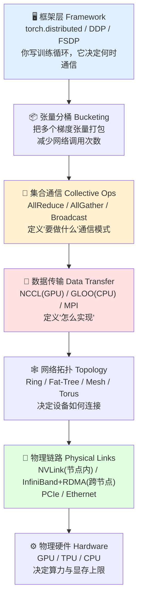

**逐层解读**：

1. **框架层**：你写代码的地方。定义模型、调 `loss.backward()`，PyTorch 负责梯度计算并决定何时通信。你不用管网络包和硬件链路。
2. **张量分桶（Bucketing）**：DDP 把多个小梯度张量**打包成桶**一起发，而不是一个个发——减少网络调用。自动发生，不用你控制，但理解它有助于**调试"为什么通信比预期慢"**。
3. **集合通信层（Collective Ops）**：定义**用什么通信模式**。AllReduce 跨所有 rank 求和并分发回结果；AllGather 从所有 rank 收集数据；Broadcast 从一个 rank 发给所有。这层定义**做什么**，不管**怎么实现**。DDP 同步梯度时，底层就在调 AllReduce。
4. **数据传输层**：真正的实现。**NCCL**（NVIDIA Collective Communications Library）是 GPU 训练最常用的后端，为 NVIDIA GPU 优化了 AllReduce 等。**GLOO** 是 CPU 后端（测试用）。**MPI** 主要用于 CPU 集群。PyTorch 默认 GPU 用 NCCL、CPU 用 GLOO。
5. **网络拓扑**：决定设备如何连接。**Ring（环）**：GPU 组成环，每个发给下一个——简单但可能有瓶颈。**Fat-Tree**：多路径、减少拥塞。**Mesh / Torus**：不同的复杂度/带宽权衡。拓扑影响 NCCL 如何路由数据，从而影响带宽和延迟。
6. **物理链路**：真正搬数据的东西。**NVLink** 连接**单节点内**的 GPU，带宽约 **600 GB/s – 1.8 TB/s**（视代际）。**InfiniBand + RDMA（远程直接内存访问）**让**跨节点**直接访问内存、不经过 CPU——多节点训练的关键。**PCIe** 连 GPU 和 CPU，**Ethernet** 更慢但更普及。
7. **物理硬件**：最底层。GPU 做并行计算、TPU 做张量运算、CPU 做协调。这层决定原始算力和显存上限——**上面任何优化都无法突破这里的硬件极限**。

> 🔬 **核心论证：一次 `dist.all_reduce()` 的完整旅程**
> 当你在代码里调 `dist.all_reduce()`，请求**沿整个栈向下流动**：PyTorch 把张量组织成桶 → 调 AllReduce 集合操作 → NCCL 用它发现的网络拓扑实现它 → 数据在节点内走 NVLink、跨节点走 InfiniBand → 结果回到 GPU 显存。**理解这条链路，才能在通信慢或分布式作业 hang 住时定位问题**：是拓扑问题？链路带宽问题？还是集合操作本身的问题？知道栈，就能逐层排查。

---

## 1.8 🔧 PyTorch 分布式基础：进程组、Rank 与集合通信

### 1.8.1 进程组（Process Group）与 Rank

分布式训练里，多个进程协同工作，每个跑在不同 GPU 或节点上。PyTorch 把它们组织成**进程组（process group）**。组内每个进程有唯一的 **rank**（从 0 开始的整数）。进程总数叫 **world size（世界大小）**。

- **world（世界）**：整个分布式作业——所有参与训练/推理的进程。
- 例：2 节点 × 4 GPU/节点 → world size = **8**。

**两种 rank**：

| 类型 | 范围 | 说明 |
|---|---|---|
| **全局 rank Global rank** | 0 ~ world_size−1 | 整个作业内唯一 |
| **局部 rank Local rank** | 每节点从 0 开始 | 仅节点内唯一，通常对应该节点的 GPU 索引 |

例：2 节点、每节点 4 卡 → 节点 0 局部 rank 0–3（全局 0–3），节点 1 局部 rank 0–3（全局 4–7）。这就是为什么分布式代码里常见 `torch.cuda.set_device(local_rank)`——**局部 rank 对应本节点的 GPU 索引**。

### 1.8.2 初始化进程组

任何分布式操作前，先初始化进程组，告诉 PyTorch 进程之间怎么通信：

```python
import torch.distributed as dist

def setup(rank, world_size):
    dist.init_process_group(
        backend="nccl",        # GPU 通信用 NCCL
        rank=rank,             # 本进程的 rank
        world_size=world_size  # 进程总数
    )
    torch.cuda.set_device(rank)  # 设置本进程用哪张 GPU
```

跑最简验证（`code/distributed_basic_test.py`，不用 DDP，只测多进程能否通信）：

```bash
torchrun --nproc_per_node=2 code/distributed_basic_test.py
# 只有 1 张卡但想测分布式逻辑，可在单卡上模拟多进程：
CUDA_VISIBLE_DEVICES=0 torchrun --nproc_per_node=2 code/multi_gpu_simulation.py
```

会看到 "Rank 0 says hello"、"Rank 1 says hello" 从不同进程打印，确认设置成功。

> ⚠️ **OMP_NUM_THREADS 警告的坑**：跑 torchrun 时可能看到 `OMP_NUM_THREADS` 警告（PyTorch 想控制 CPU 线程避免过载）。解决：**在 torchrun 命令前**设 `OMP_NUM_THREADS=4`。
> ```bash
> OMP_NUM_THREADS=4 torchrun --nproc_per_node=2 code/distributed_basic_test.py
> ```
> **必须在 shell 里、torchrun 启动前设**——在 Python 脚本里设**无效**，因为 torchrun 在启动进程前就检查了环境变量。

### 1.8.3 八种集合通信操作（Collective Operations）

集合通信是分布式通信的**积木**。PyTorch 提供 **8 种**主要操作。理解它们，才能选对操作、调对问题。

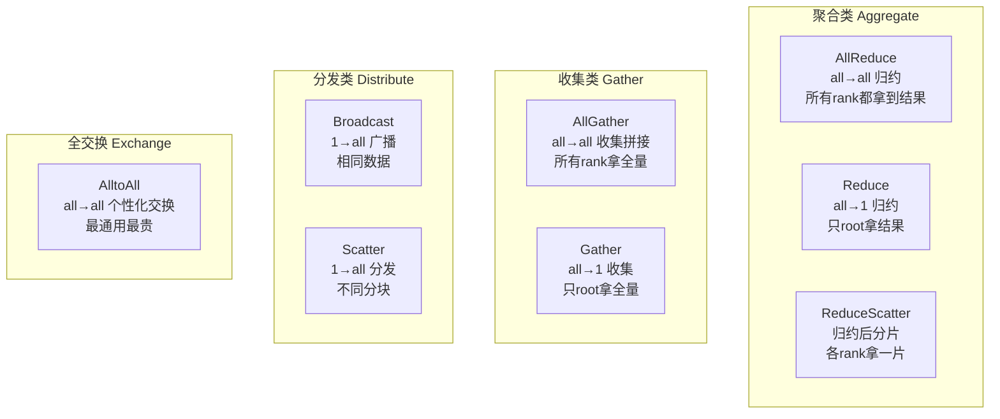

下面逐一讲，附典型用途和显存/通信代价。

#### ① AllReduce —— 数据并行训练的基石

**做什么**：跨所有 rank 做归约（sum/max/min），结果存回**每个** rank 的 buffer。全对全（all-to-all）模式。

```python
tensor = torch.tensor([rank + 1, rank + 2, rank + 3], device=device)
dist.all_reduce(tensor, op=dist.ReduceOp.SUM)
# 之后所有 rank 拿到相同结果：[sum(1..ws), sum(2..ws+1), sum(3..ws+2)]
```

**为什么重要**：**DDP 的核心**。反向传播时每个 rank 在自己的数据分片上算梯度，这些**局部梯度必须跨 rank 同步**以保证模型一致。DDP 用 AllReduce 把所有 rank 的梯度求和、再把平均结果发回每个 rank。之后所有 rank 有**完全相同的梯度**，能**同步更新（lockstep）**参数。没有 AllReduce，各 rank 只用局部梯度更新，会导致**模型发散、训练不稳定**。

归约操作可以是 SUM（梯度最常用）、MAX、MIN、PRODUCT。梯度同步用 SUM，结果除以 world_size 得平均——这保证**有效 batch size 随 rank 数扩展**（8 卡每步处理 8× 数据）。

> 🔬 **第一性原理：AllReduce 为什么比 Reduce+Broadcast 高效？**
> 二者结果一样，但 NCCL 把 AllReduce 优化成**单次操作**，用 **ring AllReduce** 或 **tree AllReduce** 算法。Ring 算法只需 **(world_size − 1)** 步通信，而 Reduce+Broadcast 要 **2×(world_size − 1)** 步。对百万参数大模型，AllReduce 会成瓶颈——所以**梯度压缩、分桶、通信与计算重叠**才这么关键。

#### ② AllGather —— 收集拼接，FSDP 重建参数

**做什么**：从所有 rank 收集数据、把拼接结果分发给每个 rank。每 rank 贡献 N 值、收到 world_size × N 值（按 rank 顺序排列）。

```python
input_tensor = torch.tensor([rank * 10 + 1, rank * 10 + 2], device=device)
output_list = [torch.zeros_like(input_tensor) for _ in range(world_size)]
dist.all_gather(output_list, input_tensor)
# 所有 rank 得到 [rank0_data, rank1_data, ..., rankN_data]
```

**用途**：和 AllReduce（聚合）不同，AllGather **保留每个个体贡献并拼接**——适合收集 embedding、特征表示、跨 rank 注意力、跨 rank BatchNorm、分布式评测指标。**FSDP 中用 AllGather 在前向/反向前重建完整参数分片**（每 rank 存一片，AllGather 收集所有片，之后用 ReduceScatter 重新分发）。

> ⚠️ **代价**：每 rank 发 N 收 world_size×N，总数据移动 **world_size² × N**——**二次方（quadratic）扩展**，大 world size 下很贵。所以 FSDP 选择性使用 AllGather 并配合 ReduceScatter 降开销。

#### ③ Broadcast —— 一对多，初始化广播权重

**做什么**：从 root rank 复制数据到所有其他 rank。一对多（one-to-all）。

```python
root = 0
if rank == root:
    tensor = torch.tensor([10.0, 20.0, 30.0], device=device)
else:
    tensor = torch.zeros(3, device=device)
dist.broadcast(tensor, src=root)  # 之后所有 rank 都有 [10,20,30]
```

**用途**：分布式训练初始化的基础。rank 0 加载权重/优化器状态/checkpoint 后，用 Broadcast 分发给所有 rank，**保证每个进程从相同参数开始**。也用于分发超参、同步随机种子（可复现）、发控制信号。**代价与 rank 数无关**（root 发的数据量固定）——适合把大 tensor（如权重）分发给多卡。

#### ④ Reduce —— 多对一归约，只 root 收结果

**做什么**：和 AllReduce 一样归约，但**只有 root 收结果**，其他 rank buffer 不变。多对一（all-to-one）。

```python
root = 0
tensor = torch.tensor([rank + 1, rank + 2, rank + 3], device=device)
dist.reduce(tensor, dst=root, op=dist.ReduceOp.SUM)  # 只有 root 有 sum
```

**用途**：当**只有一个 rank 需要聚合结果**时比 AllReduce 高效（省了 Broadcast 那一步）。典型场景：把各 rank 的局部指标（loss、accuracy、梯度范数）聚合到 rank 0，用于**日志、checkpoint、训练决策（早停、学习率调度）**。

#### ⑤ Gather —— 多对一收集，Scatter 的逆操作

**做什么**：从所有 rank 收集数据到 root，root 收 world_size × N 值（按 rank 顺序）。多对一。

```python
root = 0
input_tensor = torch.tensor([rank * 10 + 1, rank * 10 + 2], device=device)
if rank == root:
    output_list = [torch.zeros_like(input_tensor) for _ in range(world_size)]
    dist.gather(input_tensor, output_list, dst=root)  # root 拿到全部拼接
else:
    dist.gather(input_tensor, None, dst=root)          # 非 root 传 None
```

**用途**：收集结果到 rank 0 做处理/保存——I/O、日志、checkpoint、集中式评测。和 AllGather 区别：Gather **只发给 root**，当只有一个 rank 需要完整数据时更高效。⚠️ 输出**顺序确定**（rank 0 在前），root 要预分配输出 list，非 root 传 None。**代价**随 rank 数线性增长，大数据集会在 rank 0 形成瓶颈——所以所有 rank 都需要数据时优先 AllGather。

#### ⑥ Scatter —— 一对多分发不同分块

**做什么**：Gather 的逆操作。root 把**不同的分块**分发给各 rank。一对多。

```python
root = 0
if rank == root:
    scatter_list = [torch.tensor([r * 10 + 1, r * 10 + 2], device=device)
                    for r in range(world_size)]
output_tensor = torch.zeros(2, device=device)
if rank == root:
    dist.scatter(output_tensor, scatter_list=scatter_list, src=root)
else:
    dist.scatter(output_tensor, scatter_list=None, src=root)  # 各 rank 收到自己那块
```

**用途**：和 Broadcast（发**相同**数据）不同，Scatter 发**不同**分块——启用数据并行（每 rank 处理不同数据子集）。用于切分大数据集、分发模型分片、按 rank 分发不同配置。⚠️ 实践中，Scatter 常**不如 `DistributedSampler`** ——后者避免了"先把所有数据加载到 rank 0"的开销。

#### ⑦ ReduceScatter —— 归约+分片，FSDP 的核心

**做什么**：Reduce + Scatter 合体。跨所有 rank 归约，再把结果**等分成片**，每 rank 拿一片。

```python
input_list = [torch.tensor([rank * 10 + i, rank * 10 + i + 1], device=device)
              for i in range(world_size)]
input_tensor = torch.cat(input_list)
output_tensor = torch.zeros(2, device=device)
dist.reduce_scatter(output_tensor, input_list, op=dist.ReduceOp.SUM)  # 每 rank 收到一片归约结果
```

**用途**：**FSDP 的基础**。FSDP 里参数按 rank 分片，反向时每 rank 算局部梯度，但因为参数分片了，**梯度要先归约再重新分发**，让每 rank 用对应梯度片更新自己的参数片。ReduceScatter **一步搞定**，比分开的 Reduce+Scatter 高效。**代价**类似 AllReduce，但输出是**分布的而非复制的**——只要分片时比 AllReduce 更省显存。

> 💡 **面试高频：AllReduce 的分解等式**
> $$\boxed{\text{ReduceScatter} + \text{AllGather} = \text{AllReduce}}$$
> 很多系统（尤其 FSDP）用这个分解做优化——因为 ReduceScatter 和 AllGather 可以**和计算重叠（overlap）**，隐藏通信延迟。

#### ⑧ AlltoAll —— 最通用也最贵，张量/专家并行

**做什么**：最一般的操作。每 rank 给**每个**其他 rank 发**不同**数据。每 rank 提供 world_size 个块、收 world_size 个块。完整的全交换。

```python
input_list = []
for dst_rank in range(world_size):
    chunk = torch.tensor([rank * 100 + dst_rank * 10 + 1,
                          rank * 100 + dst_rank * 10 + 2], device=device)
    input_list.append(chunk)  # chunk[i] 发给 rank i
output_list = [torch.zeros(2, device=device) for _ in range(world_size)]
dist.all_to_all(output_list, input_list)  # output_list[i] 收自 rank i
```

**用途**：和 AllGather（拼接相同数据）不同，AlltoAll 允许每 rank 给每个目标发**不同**数据——**个性化通信模式**。这使它成为**张量并行（tensor parallelism）**的关键：列并行线性层里，每 rank 持有不同列切片，前向要分发输入激活、反向要收集重分发输出梯度。也用于**序列并行**（交换序列块）、**专家并行**（MoE 里把 token 路由到不同专家）。

> ⚠️ **代价 & 限制**：AlltoAll 是**所有集合操作里最贵的**——总数据移动 **world_size² × chunk_size**，二次方扩展，大 world size 下昂贵。而且 **AlltoAll 需要 NCCL 后端，GLOO（CPU）不支持**（复杂通信模式需 GPU 优化库）。所以它只在张量/专家并行等无法用更简单操作表达的场景**选择性使用**。

### 1.8.4 如何选对操作？

原书给了清晰的选择指南：

| 需求 | 用哪个操作 | 谁在用 |
|---|---|---|
| 梯度同步 | **AllReduce** | DDP 自动调用（你不用手写） |
| 收集 embedding/指标到所有 rank | **AllGather** | FSDP 重建参数 |
| 一份数据发给所有人 | **Broadcast** | 初始化分发权重 |
| 所有人的数据收到一个 rank | **Gather** | rank 0 日志/保存 |
| 一个 rank 的不同块分给所有人 | **Scatter** | 数据切分 |
| 归约结果只需一个 rank | **Reduce** | 集中式指标 |
| 归约+分片（分片并行） | **ReduceScatter** | FSDP 梯度同步 |
| 每 rank 发不同数据给每个 rank | **AlltoAll** | 张量/专家/序列并行 |

> 💡 **实战心法**：**大多数时候你不用手写这些操作**。DDP 帮你调 AllReduce；FSDP 底层用 ReduceScatter + AllGather。但理解每个操作做什么，能在**通信慢、作业 hang、或要实现标准 API 覆盖不到的自定义并行**时救命。

### 1.8.5 把 DDP 拼起来：最小可用范式

**包装模型**（`DistributedDataParallel`）：

```python
from torch.nn.parallel import DistributedDataParallel as DDP

model = YourModel().cuda(rank)
model = DDP(model, device_ids=[rank])
# 之后像单卡一样用，DDP 在 loss.backward() 时自动同步梯度
```

DDP 假设每个进程有**完整模型副本**，只切分数据——每个进程训不同子集，但每步后所有进程参数一致。DDP 适合模型能塞进单卡的情况；更大的模型用 **FSDP**（把模型分片同时还用数据并行）。

**切分数据**（`DistributedSampler`，让每进程训不同数据）：

```python
from torch.utils.data import DataLoader, DistributedSampler

sampler = DistributedSampler(dataset, num_replicas=world_size, rank=rank)
dataloader = DataLoader(dataset, batch_size=32, sampler=sampler)
# 每个 epoch 开头调 sampler.set_epoch(epoch) 保证跨 epoch 的 shuffle 正确
```

> ⚠️ **坑**：不用 `DistributedSampler`，所有进程会看到**相同数据**，分布式训练就失去意义了。而且**每个 epoch 要 `sampler.set_epoch(epoch)`**，否则 shuffle 跨 epoch 不变。

**启动作业**（现代方式用 `torchrun`）：

```bash
torchrun --nproc_per_node=2 code/multi_gpu_ddp.py
# 多节点还要指定 --nnodes, --node_rank, --master_addr
```

这条命令背后串起了本章讲的所有原语：`init_process_group()` 建立通信、`barrier()` 同步数据集下载、`DistributedSampler` 切分数据、DDP 内部用 `allreduce()` 在 `loss.backward()` 时同步梯度。

---

## 1.9 🧾 本章代码 API 速查

原书 Code Summary 汇总（`torch.distributed` 核心 API）：

| API | 作用 |
|---|---|
| `torch.distributed` | 分布式计算核心模块（训练 + 推理） |
| `dist.init_process_group()` | 初始化进程组（后端 NCCL / Gloo） |
| `dist.all_reduce()` | 跨所有 rank 归约，结果存回所有 rank |
| `dist.all_gather()` | 跨所有 rank 收集并拼接，所有 rank 都有 |
| `dist.broadcast()` | 从源 rank 广播到所有其他 rank |
| `dist.reduce()` | 归约到单个目标 rank（通常 rank 0） |
| `dist.gather()` | 收集到单个目标 rank |
| `dist.scatter()` | 从源 rank 分发不同块到所有 rank |
| `dist.reduce_scatter()` | 归约后分片到各 rank |
| `dist.all_to_all()` | 每 rank 发不同块到每个其他 rank |

**原书章末练习**（建议动手，检验掌握程度）：
1. `setup_distributed(rank, world_size, backend='nccl')`——带错误处理的进程组初始化。
2. `average_gradients(model, world_size)`——手写 AllReduce 梯度平均，复现 DDP 内部逻辑。
3. `broadcast_and_verify(tensor, root=0)`——广播并验证所有 rank 数据一致。
4. `AutoEpochDistributedSampler`——自动处理 `set_epoch()` 的 DistributedSampler 包装类。
5. `measure_sync_time(model, num_iterations=10)`——测量 AllReduce 梯度同步耗时，观察它如何随模型大小和 world size 扩展。

**预期学习成果**：算不同规模/精度的显存需求；正确初始化进程组；理解 DDP 梯度同步；有效使用集合操作；用 DistributedSampler 切分数据；测量和分析通信开销。

---

## 📌 小结

本章是全书的**思想地基**，核心可以浓缩成三句话：

1. **为什么必须分布式**：模型规模**指数增长**、单卡显存/算力**线性增长**，二者错配（Growth Mismatch）让单卡时代终结——70B 模型 FP32 权重就要 280GB，连 B200（192GB）都装不下。分布式从"优化"变成"架构前提"，且是**经济必然**（万亿模型要千万美元级基建）。

2. **先算账再动手**：训练显存 = **权重 + 梯度 + 优化器状态 + 激活**，峰值出现在**反向传播**（激活与梯度重叠）；Adam 比 SGD 多吃 **2× 优化器显存**；激活函数导数能否用输出 h 表达，决定要不要多存 z；推理显存 = **权重 + KV Cache**，超长上下文能把 KV Cache 撑到 1TB。**先估算、加安全裕度、确认单卡不够，才上分布式**（Use them when you have to）。

3. **三大场景 + 一套栈**：**训练**求收敛速度（梯度同步）、**推理**求吞吐（KV Cache/批处理）、**服务**求可靠性（生产系统）。它们跑在同一套**分布式 AI 栈**上——框架（DDP/FSDP）→ 分桶 → **8 种集合通信**（AllReduce 是数据并行基石，ReduceScatter+AllGather 撑起 FSDP，AlltoAll 支撑张量/专家并行）→ NCCL → 拓扑 → NVLink/InfiniBand → GPU。实战里 8 卡训练 CIFAR-10 达 **4.01× 加速**，且**计算越重、通信占比越小、扩展性越接近线性**。

**一图记住训练显存**：

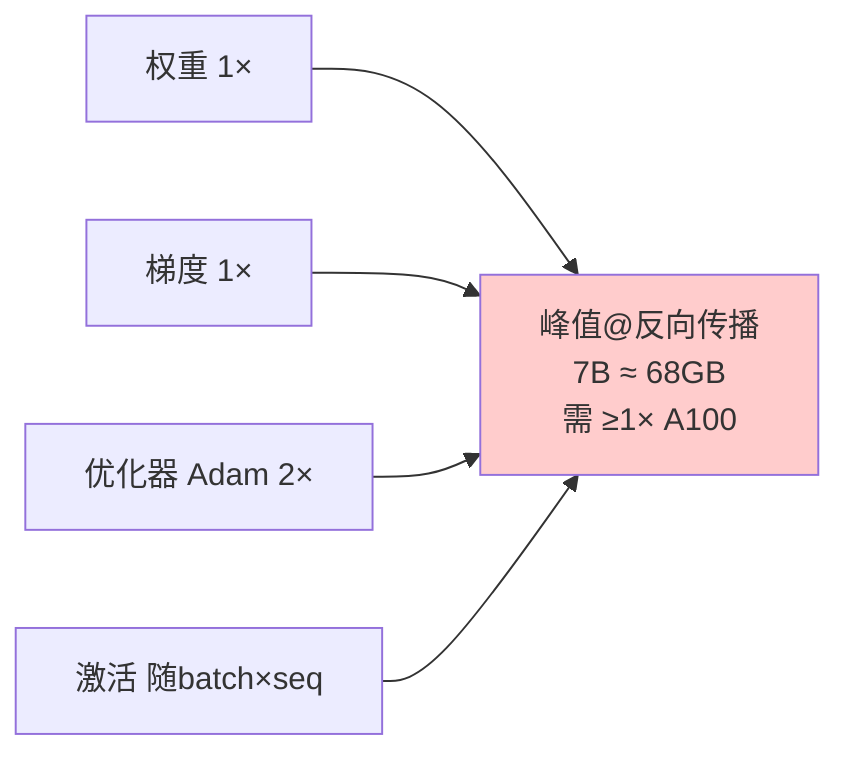

---

## 🔗 延伸阅读与承上启下

- **下一章（第 2 章）**：GPU 硬件、网络拓扑、以及让分布式 AI 成为可能的基本并行策略。理解这些硬件基础，才能对"用哪种分布式方案"做出明智决策——本章多次出现的"见 Chapter 2"（GPU 代际、NVLink 带宽、FP8/MXFP8/NVFP4 硬件语境）都在那里展开。
- **第 3 章**：DDP 深入——实现细节、优化技术、最佳实践。
- **第 5 章**：FP8 训练。**第 6 章**：KV Cache 精细 sizing。
- **相关笔记（本仓/brain vault）**：
  - `Desktop\Enigneer-infra` —— 动手 AI-Infra 课程，分布式训练/通信的代码搭档。
  - `Desktop\llm-action\llm-inference\` —— LLM 推理优化（vLLM/SGLang、KV Cache、continuous batching）。
  - `brain\Areas\ai-infra\` —— AI-Infra 面试备战 roadmap，集合通信原语是高频考点。
- **原书参考文献要点**：
  - SemiAnalysis, *"GPT-4 Architecture, Infrastructure, Training Dataset, Costs, Vision, MoE"* (2023)——GPT-4 ~1.76T 总参数的行业分析来源。
  - Epoch AI, *"Compute Trends Across Three Eras of Machine Learning"* & *"Trends in GPU price-performance"*——增长错配的量化依据。
  - vLLM Blog, *"Llama 4 in vLLM"* (2025)——超长上下文 KV Cache 超 1TB 的例子来源。

> 🎓 **给读者的一句话**：整本书往后都在展开本章埋下的种子。记住这条主线——**估算 → 决策 → 分布式**。不要一上来就堆卡，先把这一章的显存账算明白，你已经赢过一半的分布式初学者了。
