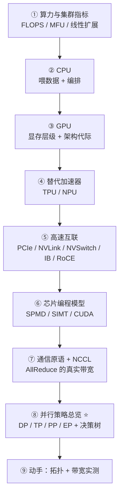
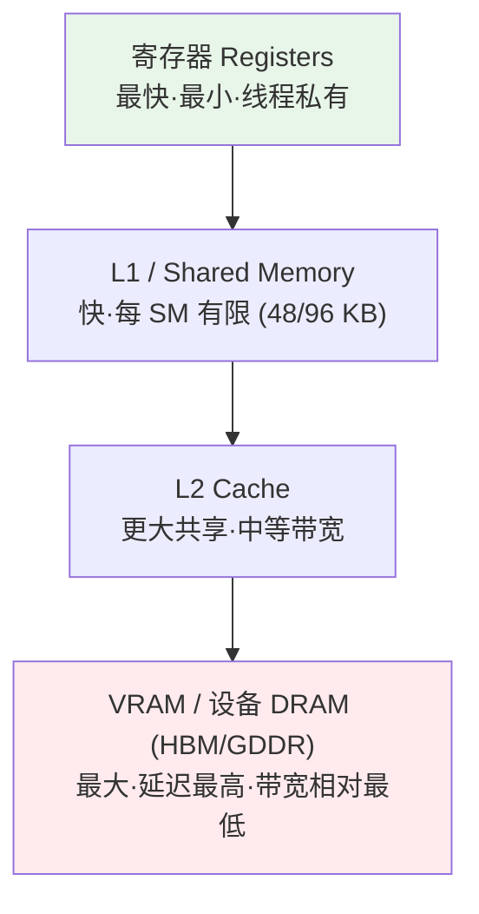
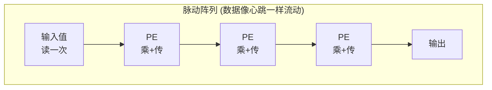
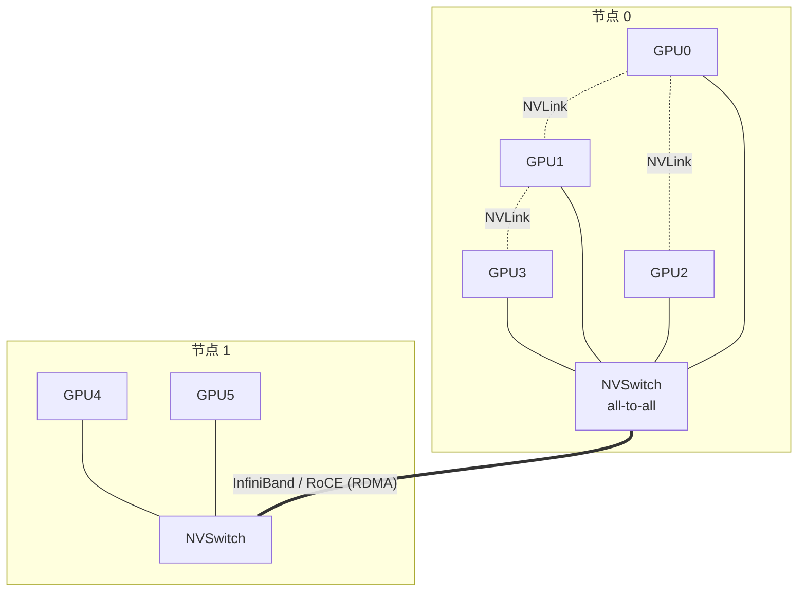
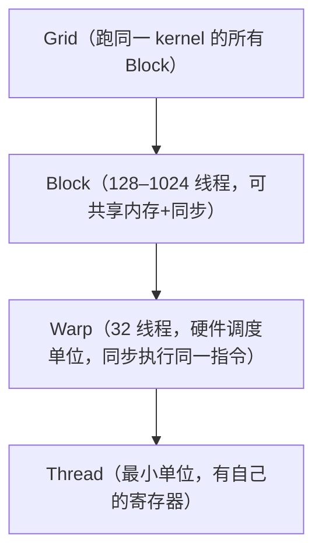
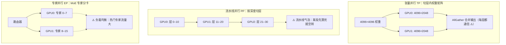
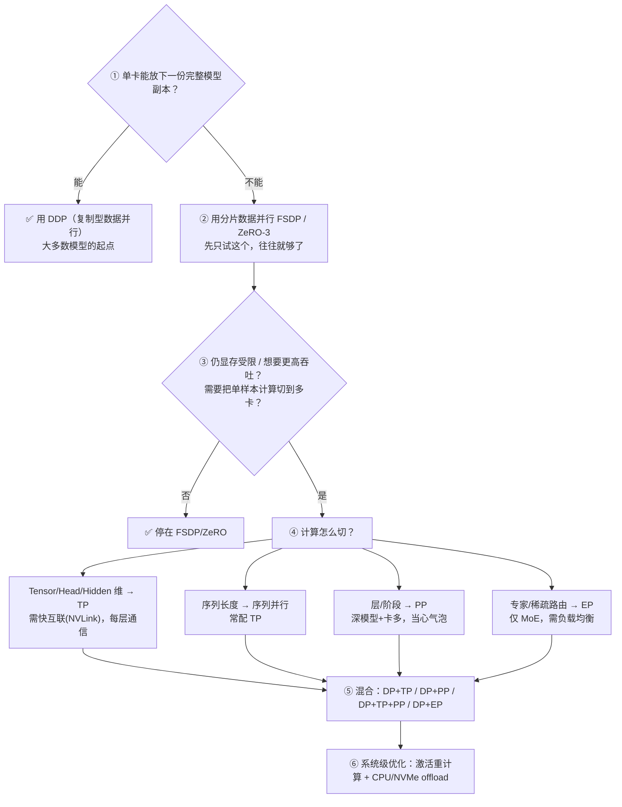

# 第 2 章 · GPU 硬件、网络与并行策略 🖥️🔗

> "创新不只是芯片本身，而是整个技术栈。" —— 黄仁勋 (Jensen Huang)
>
> 本篇对应原书《Distributed AI Systems》第 2 章（PDF 第 100–157 页）。第 1 章回答了"为什么必须做分布式"；本章回答"分布式建在什么硬件上、这些硬件怎么连起来、连好之后又该怎么切模型和数据"。这是全书从"动机"落到"工程"的第一块地基。

---

## 🗺️ 本章地图

本章有一条非常清晰的主线：**先算清楚要多少算力 → 认识各类芯片 → 搞懂芯片怎么连 → 搞懂芯片怎么编程 → 最后落到并行策略的选择**。我把它拆成八站：



| 站点 | 一句话核心 | 对应页码 |
|------|-----------|---------|
| ① 算力指标 | 峰值 FLOPS 是营销数字，**MFU 才是真本事** | 100–107 |
| ② CPU | GPU 干重活，CPU 负责喂饭和指挥，**喂不上就 GPU 空转** | 108–110 |
| ③ GPU | 为吞吐而生；显存层级 + Hopper/Blackwell 代际 | 110–117 |
| ④ TPU/NPU | 脉动阵列 ASIC，稠密矩阵强、生态弱 | 117–125 |
| ⑤ 互联 | **节点内 NVLink、节点间 InfiniBand**，带宽决定策略 | 126–128 |
| ⑥ 编程模型 | SPMD 写法 + SIMT 执行 = GPU 的编程本质 | 128–133 |
| ⑦ NCCL | 峰值带宽是上界，**有效集合带宽才是瓶颈** | 133–134 |
| ⑧ 并行策略 ⭐ | 切"计算"还是切"状态"？DP/TP/PP/EP 全景 | 134–144 |
| ⑨ 动手 | `nvidia-smi topo -m` + AllReduce microbench | 145–157 |

> ⭐ 第 ⑧ 站是本章标题里的"并行策略总览"，也是全书后续（DDP/FSDP/ZeRO/Megatron/vLLM）的分叉点，我会用最大篇幅讲透。

---

## 🧮 ① 算力与集群指标：别被峰值 FLOPS 骗了

### 是什么：从单卡 TFLOPS 到集群 EFLOPS

**算力 (computational power / compute capacity)** 衡量系统每秒能做多少次运算。对 AI 负载，我们关心 **每秒浮点运算次数 (FLOPS, floating-point operations per second)**。

书里给了一条一眼看懂"指数级"的换算链（第 100–101 页）：

$$
\underbrace{1000\ \text{GPU}}_{\text{集群规模}} \times \underbrace{1000\ \text{TFLOPS}}_{\text{单卡 H200, FP16}} = 10^6\ \text{TFLOPS} = 1000\ \text{PFLOPS} = 1\ \text{EFLOPS}
$$

| 量级 | 记号 | 每秒运算次数 | 直觉 |
|------|------|------------|------|
| TFLOPS (tera) | $10^{12}$ | 一万亿 | 一张现代 GPU（H200 FP16 ≈ 1000 TFLOPS） |
| PFLOPS (peta) | $10^{15}$ | 一千万亿 | 一个中型 AI 集群 |
| EFLOPS (exa) | $10^{18}$ | 一百亿亿 | 1000 张 H200 拼起来 |

### 为什么：峰值数字会撒谎——先问"什么精度"

> 🔬 **第一性原理：同一块硅片，报不同精度就是完全不同的数字**
>
> 峰值 FLOPS 取决于精度：
> - **FP64** —— 传统 HPC（科学计算）
> - **FP32** —— 训练基线
> - **FP16 / BF16** —— 现代 AI 训练主力
> - **FP8 及更低** —— 推理与量化
>
> 所以当有人说"这个集群 500 PFLOPS"，你的第一反应必须是：**在什么精度下？** HPC 集群会报 FP64，AI 集群会报 FP16/BF16——**同一台机器，数字能差好几倍**。这是全章第一个"防忽悠"技能。

书里还点出一个残酷现实（第 101 页）：**大模型的算力需求几年内涨几个数量级，而硬件能力同期只涨约 3×**。这个鸿沟就是"分布式训练不是可选项、而是唯一出路"的根本原因——延续第 1 章的论点。

### 为什么要集群？三个"scale"

单卡放不下现代模型。书里的账（第 102 页）：

> 一个 **70B 参数**模型，FP16 权重光存储就要 **≈ 140 GB**；加上梯度、优化器状态、激活值，**一个训练步就要 500+ GB**——超出任何单卡容量。

**集群 (cluster)** = 一群用高速网络连起来、当成单一系统协同工作的计算机（节点）。每个节点通常有多块 GPU、CPU、内存、存储。协同带来三种扩展：

| 扩展维度 | 做什么 |
|---------|--------|
| **Scale memory（扩显存）** | 把参数、梯度、优化器状态分散到多卡 |
| **Scale compute（扩算力）** | 并行处理更大 batch 或更快训练 |
| **Scale storage（扩存储）** | 装下单机放不下的数据集 |

> ⚠️ **AI 集群 vs 传统 HPC 集群：区别在通信模式**
>
> 集群不是新东西，HPC 用了几十年。但 AI 训练的**通信模式**不同：HPC 常做**大而稀疏**的数据交换；AI 训练做**频繁而小**的交换（**每一步都要同步梯度**）。这让**网络带宽和延迟变成生死线**——一个慢节点能拖垮整个训练作业。

### 训练 vs 推理：AI 集群的需求分叉

| | **训练**需要 | **推理**需要 |
|--|------------|-------------|
| 网络 | 高**带宽**互联（每步同步梯度，慢了 GPU 就干等） | 低**延迟**网络（用户等的是毫秒不是秒） |
| 显存 | 大**聚合**显存（70B 模型光装下就要 8–16 卡，即便用 FSDP） | 高效显存（**KV cache** 会吃掉大量显存，要在上下文长度与显存上限间权衡） |
| 存储 | 快速并行文件系统 + 本地 NVMe（ImageNet 150 GB，文本数据集可达 TB 级） | —— |
| 其他 | —— | **负载均衡**（推理流量是突发的，要在 GPU 间高效路由、扛住流量尖峰） |

> 💡 **一句话贯穿全书**：硬件拓扑——GPU 怎么在节点内连、节点间怎么连——**直接决定哪种并行策略可行**。全 NVLink 的 all-to-all 集群能高效跑张量并行；只有 PCIe 的集群一遇到通信密集策略就趴窝。记住这句，后面第 ⑧ 站会反复兑现它。

### 关键指标：真正衡量集群好坏的量

原始 FLOPS 是营销，**你用得有多高效才是关键**。书里给了一整套指标（第 104–107 页），我整理成表：

| 指标 | 公式 | 好的范围 / 意义 |
|------|------|----------------|
| **MFU**（模型 FLOPS 利用率，最重要 ⭐） | $\text{MFU}=\dfrac{\text{每次迭代模型 FLOPs} / \text{迭代时间}}{\text{峰值 FLOPS}}$ | 大模型 **40–60%** 算优秀；<20% 说明撞了显存带宽/通信/kernel 瓶颈 |
| **线性扩展 (linear scaling)** | $\dfrac{\text{多卡吞吐}}{\text{单卡吞吐}\times\text{GPU 数}}$ | 完美=1.0；优化良好 0.7–0.9；<0.5 = 通信瓶颈 |
| **GPU 利用率** | `nvidia-smi` 查（计算时间占比） | 90%+ 好，但不告诉你 kernel 对不对、通信有没有堵住计算——**MFU 更有信息量** |
| **通信效率** | $\dfrac{\text{实测带宽}}{\text{理论带宽}}$ | IB HDR 200 Gb/s 能跑到 180 → 90% 效率 |
| **吞吐（集群）** | $\dfrac{\text{全局 batch}\times\text{序列长}}{\text{总训练时间}}$ | tokens/s，越高越好但要与收敛平衡 |
| **FLOPS/Watt** | $\dfrac{\text{总 FLOPS}}{\text{总功耗}}$ | H100 FP16 ≈ 1.4 TFLOPS/W，越高越省电费 |
| **PUE** | $\dfrac{\text{设施总功率}}{\text{IT 设备功率}}$ | 理想 1.0（不可能），真实机房 1.2–1.5，越低越好 |

#### 🔬 手把手：H100 上一个 70B 模型的 MFU 怎么算

书里给了一个非常实用的 walk-through（第 105 页）——这是面试高频，务必会算：

```text
理论 FLOPs/迭代 : ≈ 860 TFLOP        (取决于 batch、序列长)
迭代时间       : ≈ 2.0 秒
实际 FLOPS     : 860 TFLOP / 2.0 s ≈ 430 TFLOPS
H100 峰值      : ≈ 989 TFLOPS (BF16)
────────────────────────────────────────
MFU           : 430 / 989 ≈ 43%     ← 落在 40–60% 的健康区
```

> 💡 **在自己的作业上复算 MFU 的通用配方（第 105 页）**
> 1. 先算每步碰多少 token：单卡通常 = `microbatch × 序列长`；乘上数据并行宽度得到全集群。
> 2. 稠密 Transformer 的 FLOP 估算：**≈ 6 × 参数量 × token 数**（前向+反向合计，出自 PaLM/Kaplan 的 $6N$ 经验[^2]）。
> 3. 从 trainer 日志拿 step 时间，用 FLOPs ÷ 墙钟秒 ÷ **你训练精度下的峰值 matmul 速率**（H100 用 BF16/FP16 那个数，**别用营销 slide 上的 FP8 数**）。

> ⚠️ **常见坑：拿 FP8 峰值算 BF16 训练的 MFU**，分母虚高，MFU 被算得虚低，你会误判"通信有问题"去瞎调网络，其实只是分母用错了。

#### 时间都花哪了 & 可靠性指标

一个优化良好的集群：**70–80% 时间在算，10–20% 在通信，几乎不空转**。此外长作业还要看：

- **MTBF**（平均无故障时间）：1 万卡集群可能**每几小时就坏一次**。
- **可用性**：生产集群目标 99%+。
- **MTTR**（平均恢复时间）：好集群分钟级恢复，不是小时级。
- **通信延迟**：节点内 NVLink AllReduce **< 1 ms**，节点间 IB **< 5 ms**；**P99 比均值更重要**——一个慢节点拖垮全局。

> 💡 **实战：分级 benchmark**。在 8 / 64 / 512 / 2048 卡各测一遍。**随规模退化的指标**（线性扩展、通信效率）会直接指出瓶颈在哪。

---

## 🧠 ② CPU：不干重活，但喂不上饭 GPU 就饿死

GPU 干重活，CPU 是关键配角。**CPU 优化延迟**（快速单线程 + 复杂控制逻辑），**GPU 优化吞吐**（几千个简单核）。

> 🔬 **核心区别**：CPU 大部分硅片给了**控制逻辑和缓存**（乱序执行、分支预测、多级缓存），只有 8–64 个复杂核；GPU 是几千个简单核。这就是"延迟 vs 吞吐"两种设计哲学的物理体现。

CPU 在分布式训练里负责三件事：**数据加载与预处理**（读盘、解码图像、tokenize）、**编排**（启动 GPU kernel、管进程组、处理通信）、**系统管理**（内存分配、进程调度、网络栈）。

### CPU–GPU 交互与 PCIe 瓶颈

跑一次分布式训练发生了什么（第 108–109 页）：

1. **CPU 启动 GPU kernel**：你的 Python 代码（跑在 CPU）调 PyTorch → 生成 CUDA kernel → CPU 经 **PCIe** 发给 GPU。
2. **CPU 管内存**：分配 GPU 显存、把数据从 CPU RAM 搬到 GPU、协调多卡通信。
3. **CPU 管通信**：多节点训练时，CPU 进程处理网络（IB / 以太网）并与 **NCCL** 协作做 GPU 集合通信。

> ⚠️ **PCIe 是常见瓶颈**：PCIe Gen4 x16 单向 ≈ 31.5 GB/s（双向 ≈ 63 GB/s），而 GPU 间 NVLink 是 **300–900 GB/s/卡**（Blackwell B200 达 1.8 TB/s）。**差了一个数量级**——这就是为什么你要让 GPU 走 NVLink 直连，而不是绕 CPU。

### NUMA 与 CPU 亲和性

现代服务器有多个 CPU socket（**NUMA 节点**），每个 socket 有自己的内存控制器和 PCIe 通道。连在不同 socket 的 GPU 访存模式不同。

```bash
numactl --hardware        # 查 NUMA 拓扑
```

> ⚠️ **PyTorch 不会自动帮你绑 NUMA**！要手动设 CPU 亲和性或用 `numactl` 启动，**让进程和它的 GPU 待在同一 NUMA 节点**，否则跨 NUMA 通信平白增加延迟。

### 8 卡服务器的 CPU 配置经验值

| 资源 | 经验值 | 理由 |
|------|--------|------|
| CPU 核 | **每 GPU 2–4 核**（8 卡 → 16–32 核起） | 喂数据 + 编排 |
| CPU 内存 | GPU 显存的 **1.5–2×**（8×80GB → ≥ 1 TB） | 数据暂存 |
| PCIe 通道 | 每卡 x16（8 卡 → 128 lanes，通常双路 EPYC/Xeon） | 保证 CPU-GPU 带宽 |
| 本地 NVMe | 聚合顺序读 **10–20 GB/s**（2–4 块 Gen4/5 盘，常 RAID-0） | dataloader / checkpoint I/O 不卡 GPU |

> 💡 **CPU 不用最新代**——它不做计算，**够核数 + 够 PCIe 带宽把 GPU 喂饱**就行。TB 级数据集一般放集群并行文件系统，本地 NVMe 做每节点缓存和 scratch。

---

## 🎮 ③ GPU：为吞吐而生

### 显存层级：OOM 时满的是哪一层？

GPU 为**吞吐**而非延迟设计：几千个简单核 + 高带宽访存。理解它必须先理解**显存层级**（第 110–111 页）：



> 🔬 **第一性原理：容量与带宽此消彼长**。越靠上（寄存器）带宽越高、延迟越低、但容量越小；越靠下（HBM）容量越大、但延迟越高、带宽相对越低。这是内存设计不可回避的物理权衡。

关键认知（会救你的命）：
- **OOM 报错满的通常是设备 DRAM（HBM），不是缓存。**
- **显存带宽常常比算力先成为瓶颈。** 如果 profiler 显示 **GPU 利用率低但显存带宽拉满**，你就是 memory-bound——这时加算力没用，得改 kernel/融合/降精度。

### 看清你的硬件：三条必备命令

```bash
# ① 查规格：显存、PCIe 代际与位宽
nvidia-smi --query-gpu=name,memory.total,pcie.link.gen.max,pcie.link.width.max --format=csv
# H200 → PCIe Gen5 x16 ≈ 64 GB/s/向；RTX 4090 → Gen4 x16 ≈ 31.5 GB/s/向

# ② 查拓扑矩阵（本章最重要的一条命令）
nvidia-smi topo -m
```

**`nvidia-smi topo -m` 输出怎么读**（第 112–113 页）——这是本章反复出现的核心技能：

| 标记 | 含义 | 好坏 |
|------|------|------|
| `NV18` / `NV12` / `NV4` | **NVLink** 连接 | ✅ 好（300–900 GB/s/卡，B200 达 1.8 TB/s） |
| `PIX` / `PXB` | 仅 **PCIe** 连接 | ⚠️ 能用但带宽早早触顶 |
| `NODE` / `SYS` | 跨 **NUMA** 边界 | ⚠️ 增加延迟 |

一台理想的 H200（带 NVSwitch）会是全 `NV18` 的 all-to-all 矩阵：

```text
        GPU0    GPU1    GPU2    GPU3    GPU4    GPU5    GPU6    GPU7
GPU0     X      NV18    NV18    NV18    NV18    NV18    NV18    NV18
GPU1    NV18     X      NV18    NV18    NV18    NV18    NV18    NV18
```

> 💡 **每 GPU 都能全速直连每一块 GPU = 张量并行的理想土壤。** 若你看到某些对是 `PIX`/`PXB`，就要小心把通信密集的操作只放在 NVLink 对上。还要看 CPU 亲和列：GPU 0–3 可能在 NUMA0、4–7 在 NUMA1，尽量让进程和 GPU 同节点。

### GPU 架构代际里程碑：你会遇到哪一代？

| 代际（年份） | 关键特性 | 定位 |
|------|---------|------|
| Pascal 前 (≤2016) | 确立 CUDA、早期 NVLink | 生产集群基本见不到了 |
| **Volta / Ampere** (2017–2020) | Volta 引入 **Tensor Core**；A100 加 TF32/BF16、NVLink 3.0 (**600 GB/s/卡**)、NVSwitch | A100 仍常见于推理和旧训练队 |
| **Hopper** (2022) ⭐ | H100 带 **FP8**、**Transformer Engine**（动态精度切换）、NVLink 4.0 (**900 GB/s/卡**)；H200 同算力但 HBM3e **141 GB**（vs H100 80 GB） | **当前分布式训练主力** |
| **Blackwell** (2024) | B200：**双 die 封装**、NVLink **1.8 TB/s/卡**、HBM 带宽 **8 TB/s/卡**，规模下约 **2× H100** 的 Transformer 训练吞吐；B300 类加更多 HBM | 今天新建集群的高端选择 |

> ⚠️ **代际之上还有供货现实**。书里反复叮嘱（第 115 页）：**可获得性（availability）和 spec sheet 一样重要**。需求尖峰和产品换代常让老卡还在跑、新 SKU 才爬产，交期/云配额/最容易买到哪代会**逐季度翻转**。冻结设计前务必找厂商/云确认 backlog——高需求部件历史上出现过数月等待。

### 选卡决策树（训练）

| GPU | 显存 / 带宽 / NVLink | 什么时候选 |
|-----|--------------------|-----------|
| **H100** | 80 GB / 3 TB/s / 900 GB/s | 主力马。现在建集群、要成熟稳定的硬件就它 |
| **H200** | 141 GB / 同 H100 算力 | **显存受限**时：更大模型 / 更长序列 / 更大 batch；多花的钱能减少 GPU 数 |
| **B200** | 192 GB / 8 TB/s / 1.8 TB/s | 要**极致吞吐**且能拿到货：双 die ≈ 2× H100 算力，溢价高、供货看季度和地区 |

> 💡 **三个选卡维度**：① 显存容量与带宽（70B FP16 权重 140 GB，加梯度+Adam 优化器 2× 模型大小+激活 → 500+ GB/步）；② 算力吞吐（Tensor Core 是核心；FP8 训练可 2× 于 FP16，但**不是所有模型都能在 FP8 下训好**）；③ 互联带宽（**NVLink 决定梯度同步多快**，数据并行每步都 AllReduce）。

> ⚠️ **HBM 带宽 vs 互联带宽别混淆**（第 114 页）：A100/H100/B200 的 HBM 带宽是 2/3/8 TB/s，但**跨卡梯度同步的主要瓶颈通常是互联（NVLink/IB），不是 HBM**。HBM 带宽主要影响**本地操作**（reduce kernel、融合算子）——HBM 越快，本地规约和 memory-bound 操作越快。

### 产品形态与"单块巨型 GPU"的营销陷阱

| 形态 | 是什么 | 典型规格 |
|------|--------|---------|
| **HGX** | OEM 集成到服务器的基板模块 | HGX H100 = 8×H100 经 NVSwitch，640 GB HBM，900 GB/s NVLink/卡，≈3.6 TB/s 二分带宽 |
| **DGX** | NVIDIA 的整机 | DGX H100 = 8×H100 + EPYC + NVMe + IB + 优化软件栈，贵但"开箱即用" |
| **SuperPOD** | 多 DGX 经 IB 组集群 | 32–64 节点，数千 GPU |
| **GB200 NVL72** | 液冷机架，36×GB200 超芯片 = 72 GPU 经 NVLink | 每机架约 130 TB/s NVLink 容量 |

> ⚠️ **面试高频陷阱：NVL72 是"一块巨型 GPU"吗？** NVIDIA 这么营销，但**那是营销、不是编程模型**（第 115 页）。你仍要用**显式并行**跑 72 张卡（TP/PP/DP、集合通信、刻意的张量摆放），框架帮你切分。**别指望像 CPU NUMA 那样的透明统一内存**。好处是机架内超快通信利于万亿参数训练，而不是"一个逻辑设备、零分布式代码"。

### 值得记的架构特性

- **Tensor Core**：专用矩阵乘单元，比 CUDA 核快 10–100×。PyTorch/TF/JAX 经 cuBLAS/cuDNN **自动使用**——你只要用 FP16/BF16/FP8 精度即可，不用写特殊代码。
- **Transformer Engine**（Hopper/Blackwell）：监控激活统计，**安全时用 FP8、需要精度时用 FP16 自动切换**；H100 白皮书称在 FP8+TE 下 Transformer 训练吞吐**最高 6× 于 A100**[^3]（**并非对每个模型都保证**）。
- **MIG**（多实例 GPU，A100/H100）：把一张卡切成多个虚拟 GPU，各有独立显存和算力。**适合云厂商租时给多租户；训练大模型你要整卡。**
- **NVLink-C2C**（Grace Hopper）：以 900 GB/s 连 CPU-GPU，GPU 可直接访问 CPU 内存。GH200 = 96 GB GPU + 512 GB Grace CPU = **608 GB 可寻址内存**，适合放不下 GPU 的模型。

---

## 🔷 ④ 替代加速器：TPU 与 NPU

### TPU：脉动阵列的 ASIC 哲学

> 🔬 **TPU 为什么存在**（第 118 页）：Google 2013 年算了一笔账——若每人每天用 3 分钟神经网络语音搜索，数据中心要翻倍。CPU 扩不起，当时 GPU 也没为神经网络优化。**洞见：神经网络不需要 CPU/GPU 的灵活性，它几乎全是矩阵乘——那就造一块把这件事做到极致的芯片。** TPU v1 从设计到部署仅 **15 个月**，首版硅片零掩膜改动即工作。

**脉动阵列 (systolic array)** 是 TPU 的心脏——**矩阵乘单元 (MXU)**：



> 🔬 **本质**：普通做法是把中间结果存寄存器、再取回；脉动阵列让数据**直接从一个 PE 流到下一个**，每个 PE 做一次乘法再把结果传给邻居。**这消除了绝大部分访存**——每个输入值只读一次、在流经阵列时被复用很多次。对矩阵乘极其高效。TPU v1 是 256×256 阵列（65,536 个 PE）@700 MHz，INT8 约 92 TOPS；v2 起改 128×128 但每芯片多 MXU。

**TPU Pod 拓扑**用自定义互联（不是 IB 交换机）：

| 拓扑 | 结构 | 特点 |
|------|------|------|
| 2D torus（早期） | 网格，每芯片 4 邻居（边缘环绕） | 本地带宽好，远距离多跳 |
| 3D torus（v4 起） | 3D 网格环绕，每芯片 6 邻居 | 同芯片数下直径更短，Pod 规模关键 |
| **OCS**（光路交换，v4 起） | MEMS 光开关路由光信号 | 转换损耗低，可重配以容错 |

> 🔬 **torus vs Clos/胖树**：GPU 集群用 Clos/胖树（**非阻塞**：任意输入可同时全带宽通任意输出）；TPU 用 torus（**更便宜**：更少交换机、更简单布线，本地通信低延迟，但**扩展和负载均衡不灵活、可能拥塞**）。

**TPU vs GPU 何时用哪个**（第 119–121 页）：

| 用 **TPU** 如果… | 用 **GPU** 如果… |
|-----------------|-----------------|
| 你在 Google / GCP | 你要灵活性（不同架构、研究） |
| 负载几乎全是稠密矩阵乘（Transformer/CNN） | 你用 PyTorch（TPU 有支持但 GPU 是一等公民） |
| 你在 Google 规模训练（数千芯片） | 你要本地/多云部署 |
| —— | 负载有稀疏/不规则模式 |
| —— | **你要能调试**（XLA 报错晦涩、profiler 弱于 Nsight、社区支持少） |

> ⚠️ **TPU 的隐藏成本 = 可调试性**（第 120 页）。GPU 有成熟工具（`nvidia-smi`、Nsight、PyTorch profiler）和庞大社区；TPU 失败常表现为**晦涩的 XLA 编译错误**（超长编译日志、几乎无行级上下文），profiling 不成熟，求助基本只能靠 GCP/Google 渠道。对学分布式训练的团队，**这份摩擦是实打实的成本**，与 FLOPS/价格并列考量。

> 💡 **TPU 编程模型**：走 **XLA**——你写 TF/JAX，XLA 降级到 TPU 指令。代价是**首次运行编译整张图、可能几分钟**；之后复用编译产物就快很多（GPU 启动更快但每步运行时开销可能更多）。JAX 里用 `jax.jit` + `PartitionSpec`/`NamedSharding` 在设备 mesh 上描述张量分片；**摆放很重要——让流量尽量在 torus 邻居间**。v4 起的 **Sparse Core** 专门加速 embedding 这类不规则查表（推荐系统重要，纯 Transformer 意义不大）。

### NPU：专用化的连续谱，而非三个物种

> 🔬 **核心论证（打破迷思）**：书里明确说（第 122 页）——"CPU / GPU / NPU 三分法是**有用的心智模型，不是硬边界**"。现代数据中心 GPU 越来越不像"图形芯片"：NVIDIA Tensor Core 就是领域专用矩阵引擎，AMD MI300X (CDNA3) 把大量 die 面积给了矩阵单元和 HBM，**看起来很像 NPU**。选硬件时你比较的往往是**专用化程度**，而不是三个独立物种。**生态（CUDA/ROCm、PyTorch、NCCL）比 slide 上的标签更重要。**

架构权衡的心智模型：**CPU**（通用控制/编排）→ **GPU**（吞吐导向 + 庞大软件栈）→ **NPU**（AI 优先，牺牲灵活换效率）。

真实部署版图：**华为昇腾**（910C+，配 SuperPoD，中国及部分出口市场常见）、**AWS Trainium**（EC2 上的训练 ASIC）、**Google Edge TPU**（低功耗边缘推理，≠ 云端 TPU Pod）、寒武纪 MLU 等区域厂商。

> ⚠️ **NPU 的最大风险 = 软件锁定**（第 124 页）。NPU 软件栈通常比 GPU 生态更私有，各家自带框架和运行时（如 MindSpore、CANN）。**不像 CUDA 跨所有 NVIDIA GPU，一家 NPU 的代码换一家就要大量移植。** PyTorch 有实验性 NPU 后端、ONNX Runtime 能多厂商，但体验远不如 GPU 无缝。互联也多为私有（不像 InfiniBand 是开放标准），多厂商混部困难。

> 💡 **一句话结论**：GPU 仍是多云和研究灵活性的默认；NPU 能在**成本、地域、调优过的特定负载**上取胜，**前提是厂商栈匹配你的框架和地区**，且预期比 CUDA/NCCL 更多的移植工作。

---

## 🔗 ⑤ 高速互联：网络才是分布式训练的脊梁

**关键区分：节点内 (intra-node) vs 节点间 (inter-node)**。这是全章拓扑思维的骨架。



### 节点内三选项

| 技术 | 带宽 | 说明 |
|------|------|------|
| **PCIe** | 16–64 GB/s（看代际） | 默认。无 NVLink 时 GPU 间也得绕 CPU，最慢、延迟最高 |
| **NVLink** | 300–900 GB/s/卡（B200 1.8 TB/s） | GPU-GPU 直连，绕开 CPU。坑：不是所有系统都有、有也未必所有对都连 |
| **NVSwitch** | 全 NVLink 速率 all-to-all | DGX/HGX 里的交换芯片，**每卡可同时全速通每一块卡**——大规模训练节点内的理想配置 |

### 节点间：InfiniBand vs 以太网

**InfiniBand (IB)** 是多节点 GPU 集群的标准：高带宽低延迟，**200–400 Gb/s（25–50 GB/s）/端口**，亚微秒延迟（HDR 200 Gb/s / NDR 400 Gb/s）。

> 🔬 **IB 为什么快 = RDMA**（第 127 页）。**RDMA (Remote Direct Memory Access)** 让网卡**直接读写内存，不经 CPU 和内核**。IB 从设计之初就原生支持 RDMA——用 IB 默认就有 RDMA。NCCL 做多节点通信用 **GPUDirect RDMA**（NVIDIA 的实现，把 RDMA 延伸到 GPU 显存）：数据从一个节点的 GPU 显存**直接**传到另一节点的 GPU 显存，**完全绕过 CPU 和系统 RAM**——这就是它快的原因。

**以太网**两种口味：

| 方式 | 带宽 | 特点 |
|------|------|------|
| 标准以太网 (TCP/IP) | 10–100 Gb/s | 走内核网络栈，延迟高；小集群/省钱可用，扩展时掉性能 |
| **RoCE** (RDMA over Converged Ethernet) | 100–400 Gb/s | **RDMA 不是 IB 专属**！RoCE v2 在标准以太网上给你同样的 RDMA 好处；带宽可比，但**延迟通常高于 IB**，且需正确配置交换机（DCB/PFC）避免丢包 |

> 💡 **选型经验**：多数本地集群 **IB 仍是默认**（为 HPC 而生、规模下更可靠）；已有以太网基础设施则 RoCE 可行（但要仔细调 DCB/PFC、无损网络）。**规模下梯度同步由带宽和延迟主导，一定要 benchmark 你环境的真实值。**

---

## ⚙️ ⑥ 芯片编程模型：SPMD 怎么写，SIMT 怎么跑

> 🔬 **两层概念别混**（第 128 页）：**编程模型 (programming model)** 是给开发者的抽象（线程/块/kernel，你怎么写代码）；**执行模型 (execution model)** 是硬件真实运行方式（可能是 SIMD 指令）。**编译器在两层间搭桥。** 分布式训练你多数时候在编程模型层（PyTorch/TF/JAX），但懂执行模型能在出问题/要优化时救命。

### SPMD：一个程序，多份数据

**SPMD (Single Program, Multiple Data)** 是 CUDA 用的编程模型——**写一个程序（kernel），它在多个线程上跑，每个线程处理不同数据**。书里的向量加例子：

```cuda
__global__ void vectorAdd(float *A, float *B, float *C, int N) {
    int i = blockIdx.x * blockDim.x + threadIdx.x;   // 每线程算自己的全局 ID
    if (i < N) {                                       // 边界检查
        C[i] = A[i] + B[i];
    }
}
// 启动：
vectorAdd<<<numBlocks, threadsPerBlock>>>(A, B, C, N);
```

**逐行本质**：每个线程执行**同一段代码** `vectorAdd`，但 `threadIdx.x` 给每个线程唯一 ID，于是它们处理不同数组元素——这就是 SPMD。

> ⚠️ **SPMD ≠ SIMD**：SIMD 是**执行模型**（硬件一条指令同时作用多个数据）；SPMD 是**编程模型**（你把每个线程当独立的写，即便硬件可能以 SIMD 方式执行）。

### SIMT：GPU 的执行模型

NVIDIA GPU 用 **SIMT (Single Instruction, Multiple Thread)** 执行 SPMD 程序。线程层级：



- **Warp 执行**：32 线程同时执行同一指令（SIMD 风格）但各自处理不同数据。**若 warp 内线程走了不同分支（divergence），硬件顺序执行两条路径**——伤性能。
- **细粒度多线程 (FGMT)**：一个 warp 等访存时，调度器切到另一个就绪 warp，**用切换隐藏访存延迟**。这就是"要有足够并行度"的原因——warp 不够，GPU 就闲着等内存、利用率掉下来。

> 🔬 **为什么 SIMT 优于传统 SIMD**（第 130 页）：① **数据对齐**——SIMD 要求数据对齐连续，SIMT 每线程可独立访问不同地址，好处理不规则模式；② **分支发散**——SIMT 处理更优雅（线程可发散，虽仍有代价）；③ **编程模型**——SIMT 让你写标量代码（一线程一元素）却编译成 SIMD 执行，**不用手动向量化/操心向量宽度**；④ **动态分组**——硬件动态把线程组成 warp，你写代码时不用知道 warp 大小。

**CUDA 内存层级映射硬件**：寄存器（最快、线程私有、每 SM 约 64 KB）→ 共享内存（块内共享、每 SM 48/96 KB）→ 全局内存（慢但大，即 HBM）→ 常量内存（只读、缓存）→ 纹理内存（2D 访问优化）。分布式训练主要用全局内存（权重/激活/梯度）。

### 框架怎么用 CUDA

```python
output = torch.matmul(input, weight)
```

> 💡 **本质**：PyTorch **不在运行时现生成 CUDA kernel**，而是调用 **cuBLAS**（矩阵乘）/ **cuDNN**（卷积）里预编译的高度优化 kernel，用到 **kernel 融合**（多操作合一减访存）、**tile 算法**（切成能放进共享内存的小块）、**自动用 Tensor Core**。分布式训练你几乎不手写 CUDA，但懂它能帮你调试（为啥利用率低）、写自定义融合算子、理解框架限制。

**SPMD 天然延伸到分布式训练**：每个 GPU 跑**同一程序**（你的训练脚本）但处理不同数据——**数据并行**（同模型不同数据）、**模型并行**（同数据不同模型层）。AllReduce/AllGather 等原语在 GPU 间协调，但每卡仍执行同一程序结构。**这就是 DDP/FSDP 用起来像单卡训练的原因——你还是在写 SPMD 代码，只是加了通信。**

> ⚠️ **AMD 不一样**：CDNA (MI300X) 用 **SIMD 执行单元**而非 SIMT（每 CU 4 个 SIMD 单元）；ROCm 提供类 CUDA 接口但硬件执行不同，**为 NVIDIA 优化的代码在 AMD 上未必跑得一样好**。书的建议：**能用 NVIDIA 就用**——CUDA/cuDNN/NCCL 生态成熟，AMD 在追赶但软件支持仍落后。

---

## 📡 ⑦ 通信原语与 NCCL：峰值是上界，有效带宽才是瓶颈

第 1 章已定义 Broadcast / AllReduce / AllGather / ReduceScatter 等原语。本章要点是：**生产中 NCCL（PyTorch 默认 GPU 后端 `backend="nccl"`）在上述互联之上实现它们**；CPU-only / 调试作业才用 Gloo。训练中的映射（后续章节反复出现）：

| 原语 | 用在哪 | 章节 |
|------|--------|------|
| **AllReduce** | DDP 梯度同步 | 第 3 章 |
| **ReduceScatter + AllGather** | FSDP 式分片 | 第 4 章 |
| **每层 AllGather** | 张量并行 | 第 5 章 |

> 🔬 **最重要的一句话（贯穿本章）**：**900 GB/s NVLink 或 400 Gb/s IB 是上界，不是你的 AllReduce 吞吐！** 集合通信有启动延迟，NCCL 会依消息大小和拓扑选 ring 或 tree 算法。框架也会藏掉部分开销（DDP 把梯度分桶，让 AllReduce 与反向计算重叠）。**限制训练的是有效集合带宽，不是 slide 上的峰值数。** 这就是为什么互联小节以 NCCL benchmark 收尾。

**通信慢/卡住时，先调这些环境变量再改并行策略**（第 133–134 页）：

| 环境变量 | 作用 |
|---------|------|
| `NCCL_DEBUG=INFO` | 打印 NCCL 选了哪些路径和算法（NVLink/PCIe/IB）。跑短作业看，长生产关掉 |
| `NCCL_IB_DISABLE=1` | 禁 IB/RoCE、回落 TCP，用于隔离坏 IB 配置；正常 IB 集群应设 `=0` 或不设 |
| `NCCL_TOPO_FILE=...` | 覆盖自动发现的拓扑（容器/奇怪 PCIe 树/部分 GPU 集时可见性错）。罕用 |
| `NCCL_SOCKET_IFNAME=ib0` | 多节点时让 NCCL 用高速 NIC（如 `ib0`），别用管理口以太网 |

---

## 🧩 ⑧ 并行策略总览 ⭐（本章核心）

这是标题里的"DP/TP/PP/EP 并行策略总览"，也是全书后续章节的分叉点。书里给了一个**极其重要的分类哲学**——务必吃透。

### 分类的第一性原理：你在切"计算"还是切"状态"？

> 🔬 **核心区分（第 134 页）**：判断标准很简单——**你分片的是计算还是状态？**
> - **如果单个样本的前向必须多卡才能完成 → 模型并行 (model parallelism)**（切计算）。
> - **如果每卡独立处理样本、只是同步梯度或分片优化器状态 → 数据并行 (data parallelism)**（切状态/数据）。
>
> **⚠️ 最容易被搞错的一点：FSDP/ZeRO 不是模型并行！** 它们分片状态、不分片计算，每卡仍独立处理样本。这是面试高频误区。

### 判定任意并行技术的"三个问题"

书里给了一套可操作的判定法（第 136 页）：

1. **它切计算吗？** 前向/反向本身被切到多卡，还是只切模型状态（参数/梯度/优化器）？
2. **单个样本必须跨设备吗？** 处理一个样本需要多设备，还是每设备能独立处理？
3. **它引入新的设备间协作吗？** 需要新通信模式，还是用现有原语（如 AllReduce）？

| 答案组合 | 类别 | 例子 |
|---------|------|------|
| Q1=是, Q2=是 | **模型并行**（切计算） | TP, PP, EP, Sequence, Context |
| Q1=否, Q2=否, Q3=是 | **状态分片**（切状态，**非**模型并行） | FSDP, ZeRO |
| Q1=否, Q2=否, Q3=是 | **数据并行**（切数据） | DDP（每卡独立处理不同样本） |

### 权威分类表（原书 canonical taxonomy）

按**分片对象**（计算 / 状态 / 数据）分类：

| 并行 | 类别 | 子类 / 分的是什么 | 阶段 | 实现 |
|------|------|------------------|------|------|
| **DP**（数据并行） | 数据 | 复制模型、分片数据 | 训练 | PyTorch DDP（第 3 章）/ Horovod |
| **FSDP** | 状态 | 全状态分片（参数+梯度+优化器） | 训练 | PyTorch FSDP（第 4 章） |
| **ZeRO-1** | 状态 | 优化器状态分片 | 训练 | DeepSpeed（第 5 章） |
| **ZeRO-2** | 状态 | 优化器 + 梯度分片 | 训练 | DeepSpeed（第 5 章） |
| **ZeRO-3** | 状态 | 参数 + 梯度 + 优化器分片 | 训练 | DeepSpeed（第 5 章） |
| **TP**（张量并行） | 计算 | 层内（hidden/head）切分 | 训练/推理 | Megatron-LM（第 5 章） |
| **Sequence Parallelism** | 计算 | 序列长度维切分 | 训练 | Megatron-LM（第 5 章） |
| **Context Parallelism** | 计算 | 长上下文 attention/KV 切分 | 推理 | vLLM（第 6 章）/ SGLang（第 7 章） |
| **PP**（流水线并行） | 计算 | 层间/阶段切分 | 训练/推理 | GPipe / DeepSpeed PP（第 5 章） |
| **EP**（专家并行，MoE） | 计算 | 稀疏条件计算 | 训练/推理 | DeepSpeed-MoE（第 5 章） |
| **Operator/Intra-op** | 计算 | 通用算子级分片 (SPMD) | 训练/推理 | XLA SPMD / JAX jit / PyTorch DTensor |

### 数据并行：复制型 vs 分片型

**复制型数据并行 (DDP)** —— 最简单：**每卡复制整个模型，把 batch 切开**，每卡独立处理不同样本，然后用 **AllReduce 同步梯度**。

- ✅ 易实现，模型能装进单卡时效果极佳。
- ⚠️ **代价：每卡都存整个模型，显存随 GPU 数不减**。

**分片型数据并行 (FSDP / ZeRO)** —— 不复制模型，把**参数、梯度、优化器状态**分片到多卡。FSDP 三样全分；ZeRO 分阶段（Stage 1 分优化器 → Stage 2 加梯度 → Stage 3 加参数）。**用同样卡数能训大得多的模型。**

> ⚠️ **再强调一次**：FSDP/ZeRO **不是模型并行**——它们分片状态、不分片计算，每卡仍独立处理样本，只是不再每卡都存整份模型状态。

### 模型并行：四种切计算的方式



| 策略 | 怎么切 | 关键代价 |
|------|--------|---------|
| **张量并行 (TP)** | 切单层权重矩阵（4096×4096 → 两个 4096×2048），前向各算一部分再 AllGather 合并 | **每层都通信**，昂贵；必须快互联（NVLink） |
| **序列并行** | 按序列长度维切，不同卡管不同 token 位置；常与 TP 组合（Megatron） | 适合超长序列，attention 成瓶颈时 |
| **上下文并行** | 类似序列并行但专为长上下文，切 attention 计算和 **KV cache** 管理 | 推理长 prompt 关键（第 6 章） |
| **流水线并行 (PP)** | 按深度切（GPU0 管层 0–10，GPU1 管 11–20…），用 microbatch 流水以保持繁忙 | **流水线气泡**——一段先算完下一段没就绪就空转；调度是关键 |
| **专家并行 (EP)** | MoE 专用：不同专家分到不同卡（64 专家 8 卡 → 每卡 8 专家），token 路由到对应专家 | **负载均衡**——热门专家流量大，需好路由；仍是模型并行（单样本前向可能需多卡不同专家） |

### 混合并行：组合模式

实践中**总是组合使用**。书里给了常见组合表（第 138–139 页）——**这些是组合，不是新原语**：

| 组合模式 | 成分 | 典型场景 | 代表系统 |
|---------|------|---------|---------|
| **DP + TP** | 数据 + 计算 | 大型稠密 LLM 训练 | Megatron-LM |
| **DP + PP** | 数据 + 计算 | 显存受限的深模型 | GPipe + DDP |
| **DP + TP + PP** | 数据 + 计算 | 数千 GPU 训练 | Megatron-DeepSpeed |
| **DP + EP** | 数据 + 计算 | 稀疏 MoE 模型 | DeepSpeed-MoE |
| **FSDP + TP** | 状态 + 计算 | 显存高效的大 LLM | PyTorch FSDP + Megatron |
| **ZeRO-3 + PP** | 状态 + 计算 | 极大规模模型 | DeepSpeed |
| **TP + 上下文并行** | 计算 + 计算 | 长上下文推理 | vLLM / SGLang |

> 💡 一个 **70B 模型**的常见配方：**FSDP**（省显存）+ 对最大的层加**张量并行** + 卡够多再加**流水线并行**。MoE 模型则 **专家并行 + 数据并行**（跨专家组）。**多数人不从零实现这些**——用 PyTorch DDP/FSDP、DeepSpeed ZeRO、Megatron-LM 即可，但**懂底层原理能在出问题时救命**。

---

## 🌳 训练策略决策树（照着走就行）

书里的 6 步决策法（第 139–141 页），我做成流程图 + 表：



**第 ⑥ 步系统级优化**（显存还不够时）：
- **激活重计算 (activation checkpointing)**：反向时重新计算激活（几乎总与 FSDP 一起用）。
- **CPU/NVMe offload**：把优化器状态或参数搬出 GPU（更慢但能训更大模型）。

> ⚠️ **训练四条黄金准则**（第 141–142 页）：
> 1. **拓扑决定摆放**——把通信密集操作（如 TP）放在 NVLink 对上；框架不会自动做，可能要手动设进程组/设备放置。
> 2. **互联速度决定可行性**——TP 每层通信，**只有 PCIe 就别用 TP**，改 FSDP/ZeRO 或 PP。
> 3. **显存 vs 吞吐权衡**——FSDP/ZeRO 省显存但不必然提吞吐；TP 提吞吐但每卡显存更高；PP 卡够+流水满才提吞吐。
> 4. **从简单开始，需要才加复杂度**——多数模型 DDP 或 FSDP 就够，每加一种并行都增加复杂度和故障模式。

---

## 🚀 推理策略决策树（约束不同）

推理不需要存梯度/优化器状态，但要处理 **KV cache**，且很多场景**延迟比吞吐更重要**（第 142–144 页）：

```mermaid
flowchart TD
    I1{"① 扩单请求还是多请求？"} -->|多请求| REQ["请求级并行：批处理 + 多副本 + 负载均衡（第 7 章）"]
    I1 -->|单请求(超大模型/长上下文)| I2{"② 单卡放得下模型计算？"}
    I2 -->|能| KERN["单卡 + 优化 kernel：<br/>FlashAttention / 量化 INT8·INT4 / kernel 融合"]
    I2 -->|不能| I3["③ 计算怎么切？"]
    I3 --> ITP["Tensor/Head/Hidden → TP（vLLM/TensorRT-LLM）"]
    I3 --> ICP["长上下文/KV → 上下文并行（第 6 章）"]
    I3 --> IPP["层/阶段 → PP（推理少见）"]
    I3 --> IEP["专家 → EP（仅 MoE）"]
    ITP & ICP & IPP & IEP --> I4["④ 显存/KV cache 是瓶颈？"]
    I4 --> PAGE["PagedAttention 分页 / KV cache 解聚 / CPU·NVMe offload"]
```

> ⚠️ **推理五条准则**：① **延迟 vs 吞吐**——服务关心 TTFT 和每 token 延迟，TP 每层加通信，**只在需要时用**；② **KV cache** 在长上下文+高并发下主导显存，**PagedAttention 是必需**；③ **先批处理+副本再考虑 TP**；④ **量化** INT8/INT4 常能不重训就把模型塞进单卡；⑤ **从简单开始**（单卡+量化+融合 kernel 优先于 TP/PP）。

> 💡 **五条通用实战贴士**（第 145 页）：**先 profile 再优化**（你以为是通信，可能是数据加载）；**GPU 集合通信用 NCCL**（自动处理 NVLink，比 GLOO/MPI 快）；**混合精度**（FP16/BF16 省一半显存和带宽）；**当心 NUMA**；**先小规模跑通**（2–4 卡调好再上多节点，调试容易得多）。

---

## 🛠️ ⑨ 动手：硬件检查 + 带宽实测

书末的 5 步 hands-on（第 145–151 页），是把前面所有概念落到你自己机器上的闭环。

**Step 1 · 查 GPU**（`python code/check_cuda.py`，不到 1 秒）：

```python
import torch
print(f"CUDA available: {torch.cuda.is_available()}")
print(f"Number of GPUs: {torch.cuda.device_count()}")
for i in range(torch.cuda.device_count()):
    props = torch.cuda.get_device_properties(i)
    vram_gb = props.total_memory / (1024**3)
    print(f"GPU {i}: {props.name}")
    print(f"  Total memory: {vram_gb:.1f} GB")
    print(f"  Compute capability: {props.major}.{props.minor}")   # H100 = 9.0
    print(f"  Multiprocessors: {props.multi_processor_count}")     # H100 = 132
```

**Step 2 · 查拓扑**：`nvidia-smi topo -m`（看 `NV18`/`PIX`/`SYS`，见前文表）。

**Step 3 · 测单卡 HBM 带宽**（`bandwidth_test.py`，几秒）——核心是**每次 copy 读 a 写 b，所以按 2× 张量大小计流量**：

```python
import torch, time
size_mb, iterations = 64, 200
nbytes = size_mb * 1024 * 1024
a = torch.randn(nbytes // 4, device='cuda')   # float32 = 4 字节/元素
b = torch.empty_like(a)
for _ in range(10): b.copy_(a)                  # warmup
torch.cuda.synchronize()
t0 = time.time()
for _ in range(iterations): b.copy_(a)
torch.cuda.synchronize()
t1 = time.time()
bytes_moved = 2 * nbytes * iterations           # 读 a + 写 b
bw = bytes_moved / (1024**3) / (t1 - t0)
print(f"Effective bandwidth (read+write): {bw:.2f} GB/s")   # H100 例：≈1980 GB/s
```

**典型有效拷贝带宽**：H100 / H200 **2–3 TB/s**，A100 **1.5–2 TB/s**。测得显著偏低 → 显存带宽饱和或其他瓶颈。

**Step 4 · 测跨卡 AllReduce**（`torchrun --nproc_per_node=2 code/allreduce_microbench.py`，几秒到几十秒）：

> 🔬 **两个带宽数字必须分清**（第 149 页，面试高频）：
> - **算法带宽 (algorithm bandwidth)**：`n × size / time`（NCCL benchmark 用的口径）。
> - **总线带宽 (bus bandwidth)**：修正 ring AllReduce 实际过网数据——每迭代 **2×(n−1)×size** 总量，即 `alg_bw × 2(n−1)/n`。
> - **n=2 时 ring 因子 2(n−1)/n = 1，两者相等；n=4 时 bus = 1.5× alg。**

```python
import torch.distributed as dist
size = size_mb * 1024 * 1024 // 4          # float32 元素数/卡
tensor = torch.ones(size, device=f'cuda:{local_rank}')
for _ in range(warmup): dist.all_reduce(tensor, op=dist.ReduceOp.SUM)
torch.cuda.synchronize()
start = time.time()
for _ in range(iterations): dist.all_reduce(tensor, op=dist.ReduceOp.SUM)
torch.cuda.synchronize()
elapsed = time.time() - start
n = world_size
alg_bytes = size_bytes * n * iterations
bus_bytes = size_bytes * 2 * (n - 1) * iterations    # ring: 2(n-1)/n 每卡 × n 卡
alg_bw = alg_bytes / (1024**3) / elapsed
bus_bw = bus_bytes / (1024**3) / elapsed             # = alg_bw × 2(n-1)/n
```

> ⚠️ **实测 AllReduce 带宽 ≠ 数据表峰值**！NVLink 卡实测常见**几十到低几百 GB/s（bus）**，PCIe-only 对常见 **~10–50 GB/s**——**远低于数据表的 300–900 GB/s（B200 1.8 TB/s）峰值链路数**。看到很低就用 `nvidia-smi topo -m` 查拓扑，多半是被 PCIe 限住了。

**Step 5 · 分析：从带宽反推该用哪种并行**（本章的最终落点）：

| 你的系统特征 | 结论 |
|-------------|------|
| HBM 高、跨卡低 | 单卡负载行，但通信密集并行会挣扎 → **优先 FSDP/ZeRO 或 PP** |
| 跨卡高（NVLink all-to-all） | 能高效用 **TP** 等通信密集策略——理想 |
| 跨卡低（PCIe-only） | **避免 TP**（通信开销主导）→ FSDP/ZeRO 或通信更少的 PP |

---

## 📌 小结

把本章浓缩成 10 条"带走就能用"的结论：

1. **峰值 FLOPS 会撒谎**——先问精度（FP64/FP32/BF16/FP8），**MFU（40–60% 为优）才是训练效率的真指标**；稠密 Transformer 用 **6N FLOPs/token** 估算。
2. **分布式是唯一出路**——模型需求几年涨几个数量级，硬件同期只涨 3×；70B 模型一步就要 500+ GB。
3. **CPU 不干重活但决定 GPU 吃不吃得饱**——每卡 2–4 核、显存 1.5–2×、128 PCIe lanes、10–20 GB/s NVMe；**手动绑 NUMA**。
4. **显存层级 + OOM 满的是 HBM**；**显存带宽常比算力先成瓶颈**（利用率低 + 带宽满 = memory-bound）。
5. **代际认知**：Hopper (H100/H200, FP8+TE, NVLink 900 GB/s) 是当前主力，Blackwell (B200, 1.8 TB/s, ≈2× H100) 是新建高端；**可获得性和 spec 一样重要**。
6. **`nvidia-smi topo -m` 是本章第一技能**：`NV*` = NVLink（好）、`PIX/PXB` = PCIe、`NODE/SYS` = 跨 NUMA。
7. **节点内 NVLink/NVSwitch，节点间 InfiniBand（RDMA/GPUDirect 绕过 CPU）**；RoCE 让 RDMA 也能跑在以太网上。
8. **SPMD 写 + SIMT 执行 = GPU 编程本质**；框架经 cuBLAS/cuDNN 自动用 Tensor Core，你几乎不手写 CUDA。
9. **并行分类的第一性原理：切计算 = 模型并行（TP/PP/EP/序列/上下文）；切状态 = FSDP/ZeRO（不是模型并行！）；切数据 = DDP。** 三个判定问题背下来。
10. **策略选择由拓扑决定**：能放单卡 → DDP；放不下 → FSDP/ZeRO；仍不够 → 加 TP（需 NVLink）/PP（当心气泡）/EP（仅 MoE）；**峰值链路带宽是上界，有效 AllReduce 带宽才是真瓶颈**。

---

## 🔗 延伸

**书内后续章节**（本章是分叉点，全部在此埋线）：
- **第 3 章** —— PyTorch **DDP**：复制型数据并行的工作马，setup / 坑 / 调试 / 优化。
- **第 4 章** —— PyTorch **FSDP**：全状态分片 + 激活重计算。
- **第 5 章** —— **DeepSpeed ZeRO**（1/2/3）+ **Megatron-LM**（TP、序列并行）+ **DeepSpeed-MoE**（EP）+ PP。
- **第 6 / 7 章** —— **vLLM / SGLang**：PagedAttention、上下文并行、KV cache 解聚。
- **第 8 章** —— **SLURM** 集群上跑分布式作业。
- **第 9 章** —— 推理服务的 offloading 与扩展。

**关键文献**（原书注释）：
- [^2] Chowdhery et al., *PaLM: Scaling Language Modeling with Pathways*, JMLR 24 (2023)，附录 B（**6N** matmul FLOPs/token 与 MFU）；Kaplan et al., *Scaling Laws for Neural Language Models*, arXiv:2001.08361 (2020)。
- [^3] NVIDIA, *H100 Tensor Core GPU Architecture* 白皮书 (2022)（Transformer Engine + FP8，最高 6× 训练吞吐 vs A100）；及 *Breaking MLPerf Training Records with NVIDIA H100 GPUs* (2023，MLPerf 3.0 独立审计结果)。

**动手代码**（原书仓库）：
`git clone https://github.com/PacktPublishing/Distributed-AI-Systems` → `chapter2-.../code/`：`check_cuda.py`、`bandwidth_test.py`、`allreduce_microbench.py`。**练习**建议做：GPU 硬件巡检器、训练显存计算器（`calculate_training_memory`）、拓扑检测器（解析 `nvidia-smi topo -m`）、并行策略选择器（`recommend_parallelism_strategy`）——四个练习正好把本章的检查、算账、拓扑、选策略四项技能各练一遍。

**本仓库相关**：可与 `llm-action` 的 `ai-infra/` 分布式训练、`llm-inference/` 推理优化目录对照阅读，把本章的"策略总览"落到具体框架实现。

---

[^2]: PaLM (JMLR 24, 2023) 附录 B；Kaplan et al. (arXiv:2001.08361, 2020)。
[^3]: NVIDIA H100 架构白皮书 (2022) 与 MLPerf Training 3.0 博客 (2023)。
