# 第 3 章 · PyTorch DDP 分布式训练 🚀

> *"The search for the ultimate algorithm is a search for scale." —— Richard Sutton*
>
> （对终极算法的追寻，就是对规模的追寻。）

本章对应原书 **第 3 章「Distributed Training with PyTorch DDP」**（PDF 第 158–215 页）。第 2 章讲的是"硬件地基与并行策略"——那是**为什么可以**分布式训练；本章讲的是**实际怎么做**：`DistributedDataParallel`（简称 **DDP**）——PyTorch 数据并行分布式训练的**事实标准**。无论你的 GPU 是塞在一台机器里，还是散布在一个集群的几百上千张卡上，DDP 都是你把训练"横向扩展"起来的那把螺丝刀。

---

## 🗺️ 本章地图

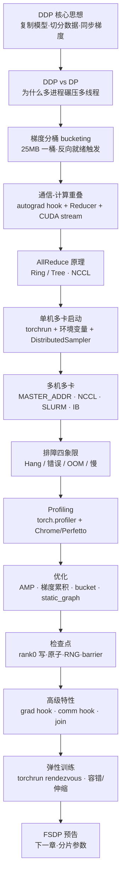

学习路径建议：
1. 先吃透 **核心思想 + AllReduce + 分桶重叠**（原理，第 1–5 节），这是面试与调优的根。
2. 再练 **单机 → 多机启动**（工程落地，第 6–8 节），能跑起来。
3. 最后掌握 **排障 / Profiling / 优化 / 检查点 / 弹性**（生产运维，第 9–14 节），能扛住真实集群。

---

## 1. DDP 到底在干什么？—— 核心思想 💡

### 是什么

一句话概括 DDP 的**优雅内核**（原书原文 elegant）：

> **在每张 GPU 上复制一份模型（replicate），把数据切分到各张 GPU（shard），每次反向传播后同步梯度（synchronize）。**

拆开看一个训练 step 里发生的四件事：

| 阶段 | 英文 | 每个进程干什么 | 关键点 |
|------|------|----------------|--------|
| ① 前向 | Forward pass | 在**自己那份数据分片**上跑前向 | 模型**完全一样**，但数据不同（靠 `DistributedSampler`） |
| ② 反向 | Backward pass | **本地独立**计算梯度 | DDP 在这里"插手"——不是各算各的更新，而是把梯度收集起来 |
| ③ 梯度同步 | Gradient sync | 用 **AllReduce**（GPU 上走 NCCL）把所有进程梯度**求和**，再除以 `world_size` | 每个 rank 拿到的都是**平均梯度**——等价于用一张卡跑全局大 batch 得到的更新 |
| ④ 参数更新 | Parameter update | 各进程用同步后的梯度做 `optimizer.step()` | 起点相同 + 梯度相同 → **终点参数完全一致** |

### 🔬 第一性原理：为什么"平均梯度"是对的？

设有 $N$ 张 GPU（world_size = $N$），第 $i$ 张卡看到 mini-batch $B_i$，本地计算的梯度是：

$$g_i = \frac{1}{|B_i|}\sum_{x\in B_i} \nabla_\theta \ell(x;\theta)$$

DDP 做 AllReduce 求和再除以 $N$，得到：

$$\bar{g} = \frac{1}{N}\sum_{i=1}^{N} g_i = \frac{1}{N}\sum_{i=1}^{N}\frac{1}{|B_i|}\sum_{x\in B_i}\nabla_\theta \ell(x;\theta)$$

当各卡 batch 大小相等（$|B_i| = b$）时，令全局 batch $B = \bigcup_i B_i$，$|B| = Nb$：

$$\bar{g} = \frac{1}{N}\cdot\frac{1}{b}\sum_{i}\sum_{x\in B_i}\nabla\ell = \frac{1}{Nb}\sum_{x\in B}\nabla\ell(x;\theta)$$

**这正是在全局大 batch $B$ 上算出来的梯度！** 所以 DDP 的数学承诺是：

> 用 $N$ 张卡各跑 batch $b$，在数值上**等价于**一张卡跑 batch $Nb$。

这就是"平均而不是求和"的原因——如果只求和不除以 $N$，梯度会被放大 $N$ 倍，等价于学习率被偷偷乘了 $N$，训练可能发散。⚠️ **面试高频坑**：某些实现里手动做 all_reduce 忘了除 world_size，导致 loss 莫名变差，就是这个。

### 与模型并行的区别

这叫 **数据并行（Data Parallelism）**：**模型被复制，数据被切分**。它的对立面是 **模型并行（Model Parallelism）**：**模型本身被拆到多张卡上**（后续章节讲，如张量并行、流水线并行、FSDP）。判断口诀：

- 模型能塞进一张卡 → 想训得更快 → **数据并行（DDP）**。
- 模型塞不进一张卡 → 必须拆模型 → **模型并行 / FSDP**。

---

## 2. DP vs DDP：为什么官方劝你别用 DataParallel 🆚

PyTorch 早期有个 `DataParallel`（DP），现在仍然能用，但**官方文档强烈建议：哪怕是单机多卡也请用 DDP**。为什么？

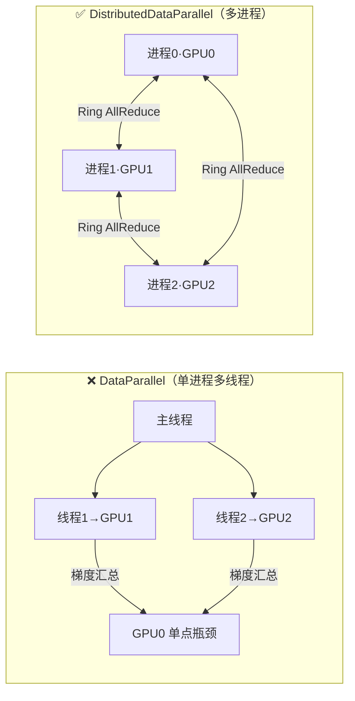

| 维度 | DataParallel (DP) | DistributedDataParallel (DDP) |
|------|-------------------|-------------------------------|
| 架构 | 单进程 + **多线程** | **多进程**，每卡一个进程 |
| Python GIL | ⚠️ GIL 阻止真并行 | ✅ 多进程绕过 GIL，真并行 |
| 梯度汇总位置 | **全压在 GPU 0** → 单点瓶颈 | 所有 GPU **平等参与** Ring/Tree AllReduce |
| 跨机器 | ❌ 只能单机 | ✅ 可跨网络扩展到成百上千卡 |
| 通信算法 | 朴素、GPU0 做全部工作 | 优化过的集合通信原语（Ring/Tree AllReduce） |
| 通信-计算重叠 | ❌ 无 | ✅ 一桶梯度在同步时，下一桶已在计算 |

**三大杀手锏**（原书总结 DDP 优势）：

1. **多进程绕过 GIL** —— Python 的全局解释器锁让多线程无法真正并行，多进程直接根治。
2. **消除 GPU0 瓶颈** —— DP 所有梯度都汇到 GPU0，DDP 用 Ring AllReduce 让每张卡负载均衡。
3. **通信隐藏在计算之下** —— DDP 边算边同步，把通信延迟藏起来（下面详讲）。

> 💡 **结论**：DDP 是分布式训练的标准，**单机也用它**。DP 基本可以从你的字典里删掉了。

---

## 3. 梯度分桶（Gradient Bucketing）：为什么它至关重要 🪣

### 是什么 & 为什么

想象一个有几百个参数张量的模型。如果 DDP **对每个梯度张量单独做一次 AllReduce**，你就会有**成千上万次小 AllReduce**。每次 AllReduce 都有固定开销：

- 网络延迟（latency）
- kernel 启动开销（kernel launch overhead）
- 同步成本（synchronization cost）

小张量太多 → 固定开销摊不平 → 通信被"碎片化"拖垮。

**解法就是梯度分桶**：DDP 把小梯度张量**攒成一个个桶（bucket）**，对**整桶**做 AllReduce。

### 怎么工作

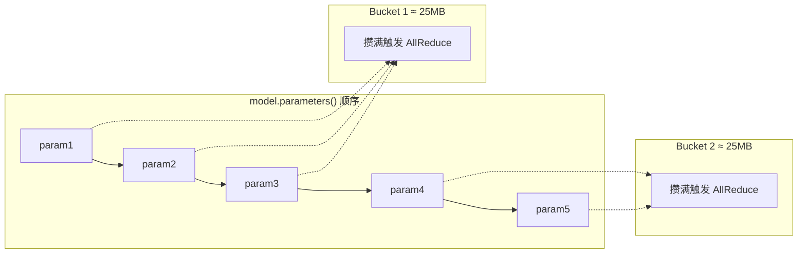

工作流程（原书细节）：
1. DDP 分析你模型的**参数顺序**（`model.parameters()` 出现的顺序）。
2. 把**连续的参数按大小**归入桶。
3. 反向传播推进到某个桶的边界时，**触发这一桶的 AllReduce**。
4. 默认桶大小 **25 MB**，可用 `bucket_cap_mb` 调。

### 桶大小的权衡（tradeoff）⚖️

| 桶大小 | AllReduce 次数 | 固定开销 | 同步时机 | 适合场景 |
|--------|----------------|----------|----------|----------|
| **大桶** | 少 | 低 | **晚**（要等桶攒满） | 大模型、NVLink 快互联、通信主导时 |
| **小桶** | 多 | 高 | **早**（更早开始同步） | 小模型、慢/跨节点链路、通信缓冲内存受限 |

> ⚠️ **常见坑**：桶太大 → 梯度要等整桶就绪才能同步，重叠窗口变窄；桶太小 → AllReduce 次数暴增，固定开销吃掉收益。**对大多数模型，默认 25 MB 就很好**，只在极大或极小模型上才需要调。

---

## 4. 通信-计算重叠（Communication–Computation Overlap）：真正的性能之源 ⚡

这是 DDP **最精妙的性能设计**，也是面试必考点。

### 核心洞见

> **DDP 不会等所有梯度都算完才开始通信。它一旦发现某个桶就绪，就立刻通信这个桶，把通信"藏"在后续计算之下。**

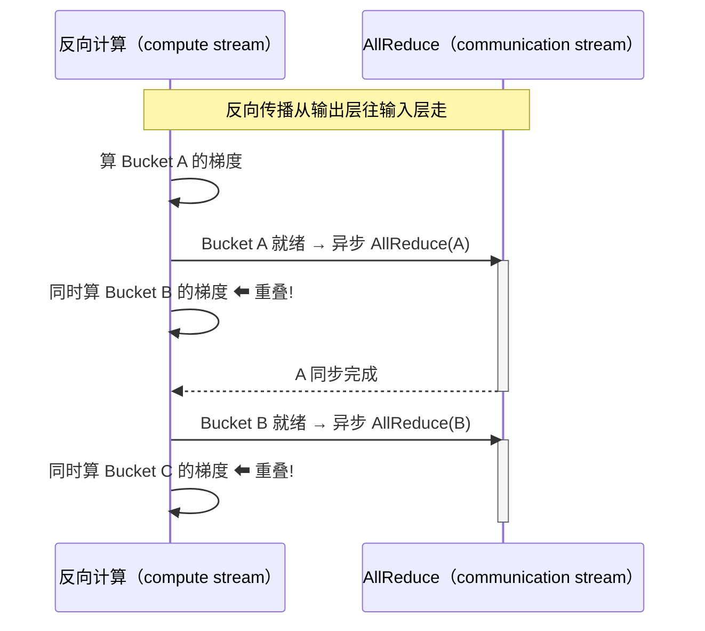

**DDP 实现重叠的三个手段**（原书原文）：
1. **异步启动 AllReduce**（Launching AllReduce asynchronously）。
2. **用 CUDA stream** 让通信 kernel 和计算 kernel 并行（overlap communication kernels with compute kernels）。
3. **按桶就绪顺序处理**（不必按参数顺序）。

### 底层三件套：autograd hook + bucketing + Reducer 🔬

原书把重叠机制的实现拆成三个组件：

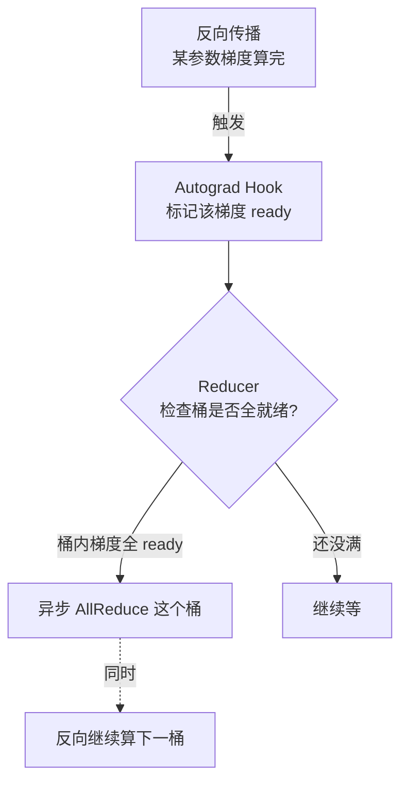

| 组件 | 职责 |
|------|------|
| **Autograd Hooks** | DDP 在每个参数上注册 hook；反向算出该参数梯度时 hook 被触发，把梯度**标记为 ready**（可归约） |
| **Parameter Bucketing** | Reducer 按 `bucket_cap_mb` 把梯度组织成桶。参数按 `model.parameters()` 的**大致逆序**分桶——**逆序是因为反向传播是从后往前算梯度**，逆序分桶能让同桶梯度**几乎同时就绪** |
| **Reducer** | 当一个桶内所有梯度都 ready，Reducer 就**异步发起该桶的 AllReduce**；同时反向继续算下一桶 → 实现重叠 |

### ⚠️ 重叠"生效"的前提

- **桶与桶之间要有足够的计算量**。如果模型参数很少、层很小，两次桶边界之间没多少活可干，就没东西可"重叠"，你会看到**通信时间主导**，重叠帮不上忙。
- **如何验证重叠在工作**：用 profiler。若看到 AllReduce 与反向计算**并发**发生 → 重叠 OK；若 AllReduce 在所有梯度算完后**顺序**发生 → 重叠没生效（可能模型太小，或有同步点阻塞了它）。

### ⚠️ 未使用参数（Unused Parameters）导致挂死

如果某参数**在前向里没被用到**（比如条件分支模型），它的梯度**永远不会 ready**，那个桶就**永远等下去 → 挂死（hang）**。

解法：`find_unused_parameters=True`。它让 DDP **遍历计算图**找出未使用的参数，直接把它们标记为 ready，不再傻等。代价：遍历图有开销，**只在模型确实有未使用参数时才开**。

```python
model = DDP(
    model,
    device_ids=[local_rank],
    find_unused_parameters=True  # 更慢，但能处理未使用参数
)
```

---

## 5. AllReduce 操作：Ring 与 Tree 🔁

AllReduce 是让 DDP 运转的**核心集合操作**。它做的事：**从所有进程拿梯度 → 求和 → 把结果分发回所有进程**。GPU 上 DDP 通过 **NCCL**（NVIDIA Collective Communications Library）高效实现，NCCL 会根据你的硬件拓扑**自动选择** ring AllReduce、tree AllReduce 等算法。

### Ring AllReduce（环形，带宽最优）


Ring AllReduce 分两个阶段（原书细节，$N$ 个 rank）：

1. **Reduce-Scatter 阶段**：每个 rank 持有整个张量的**一个 chunk**。每步把自己的 chunk 发给下一个 rank、从上一个 rank 收，累加部分和。经过 **$N-1$ 步**后，每个 rank 拥有**某一个 chunk 的完整求和**。
2. **All-Gather 阶段**：各 rank 交换这些已归约的 chunk，直到**每个 rank 都拿到完整的归约结果**。

> 🔬 **带宽最优（bandwidth-optimal）**：Ring 算法总共只搬运 $2\cdot\frac{N-1}{N}$ 倍张量大小的数据，**与 $N$ 几乎无关**（$N$ 很大时趋近于 2 倍），且**每条链路都被高效利用**。这就是为什么它在大规模上如此优秀。

$$\text{通信量} = 2\cdot\frac{N-1}{N}\cdot|\text{tensor}| \xrightarrow{N\to\infty} 2|\text{tensor}|$$

### Tree AllReduce（树形，低延迟）

当 NCCL 检测到**树形布局延迟更低**或**更贴合物理互联**（例如 NVLink vs PCIe vs 网络）时，会改用 tree AllReduce 或其他变体。树形在**小消息、跨节点**时延迟更优。

### 🔬 面试高频：AllReduce 慢，怎么定位？

原书给了三个常见原因 + 定位手段：

| 可能原因 | 说明 |
|----------|------|
| ① 算法与拓扑不匹配 | NCCL 选的算法不适合你的拓扑（比如在"非物理环"的网络上跑 ring） |
| ② 带宽饱和 | 网络 / 互联带宽被打满 |
| ③ 消息太小 | 小消息摊不平集合操作的固定成本 |

**定位工具**：
- `NCCL_DEBUG=INFO`：查看 NCCL 的算法选择与耗时。
- PyTorch profiler：看 AllReduce 实际时间。
- **对比理论环成本**：`AllReduce 时间` vs `张量大小 ÷ 每链路带宽`——若实测远大于理论，说明**带宽受限**；若张量很小实测却慢，说明**延迟受限**。

---

## 5.5 混合精度与梯度缩放（Mixed Precision & Gradient Scaling）🎚️

用 **FP16** 混合精度时，梯度可能**下溢（underflow，变成 0）**，因为 FP16 指数范围太窄。解法是**梯度缩放（gradient scaling）**：反向前把 loss 乘一个 scale 因子放大，optimizer 步骤前再把梯度 unscale 回去。

**BF16** 与 FP32 共享同样的指数范围，很少下溢，**通常不需要 GradScaler**——在支持的硬件上 `autocast(dtype=torch.bfloat16)` 就够了。

### AMP + DDP 的流水线（FP16 + GradScaler）

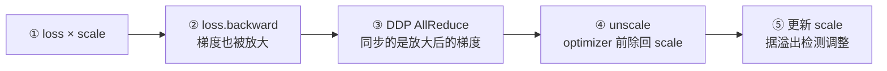

原书 5 步：
1. **Scale loss**：`loss = loss * scale`
2. **Backward**：`loss.backward()`（梯度也被放大）
3. **DDP AllReduce**：同步**放大后的**梯度
4. **Unscale**：optimizer 前把梯度除回 scale
5. **Update scale**：根据是否检测到梯度溢出调整 scale 因子

> 💡 **关键点**：DDP 是在**梯度被 scale 之后**才同步的。每个进程 scale 自己的梯度，DDP 把 scale 后的梯度求和；AllReduce 后所有进程有相同的 scaled 梯度，再 unscale 后做 optimizer step。
>
> ⚠️ 用 FP16 AMP + DDP 时：**GradScaler 要在用 DDP 包模型之前创建**，且 `scaler.step()` 和 `scaler.update()` **每个进程都要调**（不是只在 rank 0）。BF16 训练通常省掉 scaler。

---

## 5.6 缓冲区同步（Buffer Synchronization）📡

DDP 不只同步梯度，**还同步缓冲区（buffers）**。缓冲区是**不需要梯度**的模型参数，典型如 **BatchNorm 的 running mean / variance**。前向传播时，DDP 把 buffer **从 rank 0 广播到所有 rank** 以保证一致。

- 这是自动的，但有性能考量：buffer 同步增加通信开销。若模型 buffer 多或大，会拖慢训练。
- 可用 `broadcast_buffers=False` 关掉——但**只在你确定 buffer 不需要同步时**（比如没用 BatchNorm，或你手动同步）。
- **大多数模型保持默认 `broadcast_buffers=True`** 是对的。BatchNorm 这类层需要同步的统计量才能在分布式下正确工作。

### 🔬 前向一致性的底层机制

PyTorch 里所有模型继承 `torch.nn.Module`，它维护两个关键字典：

| 字典 | 内容 |
|------|------|
| `_parameters` | 需要梯度的网络参数 |
| `_buffers` | 不需要梯度但要持久化的数据（如 BatchNorm 的 running mean/var） |

DDP 通过 `_sync_module_states` 同步 `_parameters` 和 `_buffers`，发生在两处：
1. **DDP 初始化时**：把初始参数和 buffer 从 rank 0 同步到所有 rank（保证起点一致）。
2. **每次前向前**：若 `broadcast_buffers=True`，前向前同步 buffer。

这保证所有进程**从相同模型状态出发**，这对训练一致性至关重要。

---

## 6. 单机多卡 DDP 启动 🖥️

最简单的 DDP 就是**单机多卡**：一台机器多张 GPU。这是大多数人的起点，也是开发和小规模训练的场景。

### 用 torchrun 启动（推荐）

现代方式是用 **`torchrun`**（老版本叫 `torch.distributed.run`）。它自动处理进程创建、环境变量设置、错误处理。

**最小可运行例子**（原书 `code/train_ddp_single_mini.py`）：

```python
import os
import torch
import torch.distributed as dist
import torch.nn as nn
from torch.nn.parallel import DistributedDataParallel as DDP
from torch.utils.data.distributed import DistributedSampler

def setup():
    """初始化进程组并设置设备。"""
    # torchrun 自动设置这些环境变量
    rank = int(os.environ['RANK'])
    local_rank = int(os.environ['LOCAL_RANK'])
    world_size = int(os.environ['WORLD_SIZE'])
    # 为本进程设置设备
    torch.cuda.set_device(local_rank)
    device = torch.device(f'cuda:{local_rank}')
    # 初始化进程组
    dist.init_process_group(backend='nccl')
    return rank, local_rank, world_size, device

def cleanup():
    """清理进程组。"""
    dist.destroy_process_group()

def main():
    rank, local_rank, world_size, device = setup()
    # 建模型并搬到设备
    model = nn.Linear(10, 1).to(device)
    model = DDP(model, device_ids=[local_rank])          # ← 关键：DDP 包裹
    # 造假数据
    data = torch.randn(64, 10).to(device)
    target = torch.randn(64, 1).to(device)
    # 训练
    optimizer = torch.optim.SGD(model.parameters(), lr=0.01)
    loss_fn = nn.MSELoss()
    for epoch in range(10):
        optimizer.zero_grad()
        output = model(data)
        loss = loss_fn(output, target)
        loss.backward()                                   # ← DDP 在这里同步梯度
        optimizer.step()
        if rank == 0:                                     # ← 只 rank 0 打印
            print(f'Epoch {epoch}, Loss: {loss.item():.4f}')
    cleanup()

if __name__ == '__main__':
    main()
```

**逐行讲解关键点**：
- `dist.init_process_group(backend='nccl')`：GPU 训练用 **NCCL** 后端（CPU 用 gloo）。这是进程"握手"的地方。
- `torch.cuda.set_device(local_rank)`：**每个进程绑一张卡**——进程 0 → cuda:0，进程 1 → cuda:1……
- `DDP(model, device_ids=[local_rank])`：把普通模型包成 DDP 模型。之后 `loss.backward()` 就会自动触发梯度同步。
- `if rank == 0`：**日志/打印只让 rank 0 干**，否则每张卡都刷屏。

**启动命令**：
```bash
torchrun --nproc_per_node=4 code/train_ddp_single_mini.py
```

这会启动 **4 个进程，每卡一个**（假设你有 4 张卡）。torchrun 自动设 `RANK`、`LOCAL_RANK`、`WORLD_SIZE`、`MASTER_ADDR`、`MASTER_PORT`。

### 环境变量详解 🔑

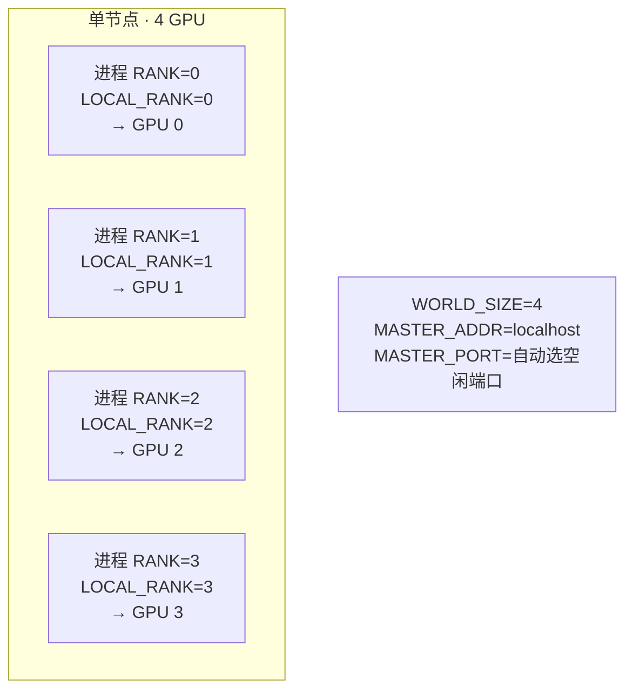

| 变量 | 含义 |
|------|------|
| `RANK` | 本进程的**全局** rank（0 到 WORLD_SIZE-1） |
| `LOCAL_RANK` | 本进程在**本节点内**的 rank（0 到 本节点 GPU 数-1） |
| `WORLD_SIZE` | 进程**总数** |
| `MASTER_ADDR` | 主节点 IP（单机就是 localhost） |
| `MASTER_PORT` | 进程组初始化端口（torchrun 自动挑空闲端口） |

> 💡 单机训练你通常只关心两个：`LOCAL_RANK`（选哪张 GPU）和 `RANK`（识别主进程用于日志/checkpoint）。

### DistributedSampler：让每个进程看到不同数据 ✂️

数据并行的关键是**每个进程看到不同的数据**。`DistributedSampler` 把数据集**切成互不重叠的连续分片**分给各 rank。

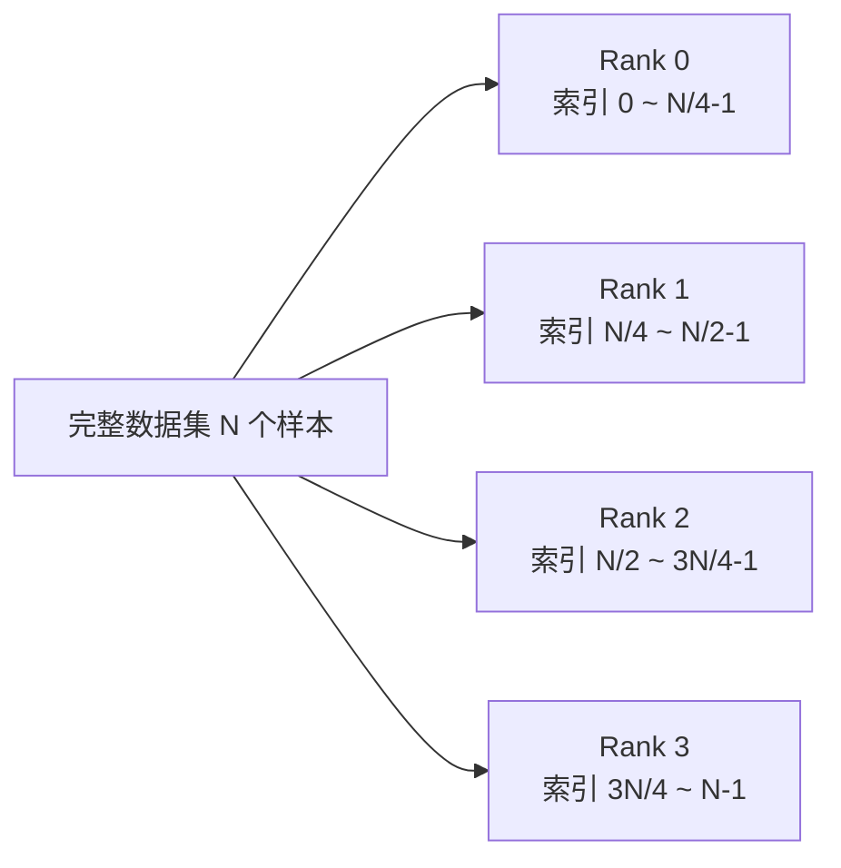

原书代码：

```python
from torch.utils.data import DataLoader, Dataset
from torch.utils.data.distributed import DistributedSampler

class MyDataset(Dataset):
    def __init__(self, size=1000):
        self.data = torch.randn(size, 10)
        self.labels = torch.randn(size, 1)
    def __len__(self):
        return len(self.data)
    def __getitem__(self, idx):
        return self.data[idx], self.labels[idx]

def get_dataloader(rank, world_size, batch_size=32):
    dataset = MyDataset(size=1000)
    sampler = DistributedSampler(
        dataset,
        num_replicas=world_size,
        rank=rank,
        shuffle=True,      # 每 epoch 打乱
        drop_last=True     # 避免 DDP 同步问题
    )
    dataloader = DataLoader(
        dataset,
        batch_size=batch_size,
        sampler=sampler,   # ← 用 sampler 而不是 shuffle=True
        num_workers=4,
        pin_memory=True    # CPU→GPU 更快
    )
    return dataloader, sampler
```

**四个必须记住的细节**（面试高频）：

1. **`sampler` 和 `DataLoader` 的 shuffle 冲突**：打乱由 **sampler 控制**（`shuffle=True`），DataLoader 的 `shuffle` 保持默认（别设），因为 sampler 已经决定了索引顺序。
2. **⚠️ 每个 epoch 开头必须调 `sampler.set_epoch(epoch)`**：它用 epoch 号作种子，让每个 epoch 看到**不同的打乱顺序**。**忘了调 → 每个 epoch 都用同样的顺序遍历数据**（隐蔽 bug！）。
3. **`drop_last=True` 关乎同步**：丢掉最后一个不完整 batch，让**每个 rank 做同样多的 step**——避免某个 rank 跑快了、卡在集合通信里。
4. **`drop_last=False` 的后果**：想用光小数据集的每个样本时，某些 rank 会多一个 batch。这时训练循环要用 **DDP 的 `join()` 上下文**让先跑完的 rank 等其他 rank，否则**死锁**。

### DataLoader 内部：多进程数据加载 🔧

`num_workers > 0` 时，PyTorch 用**多进程数据加载**：

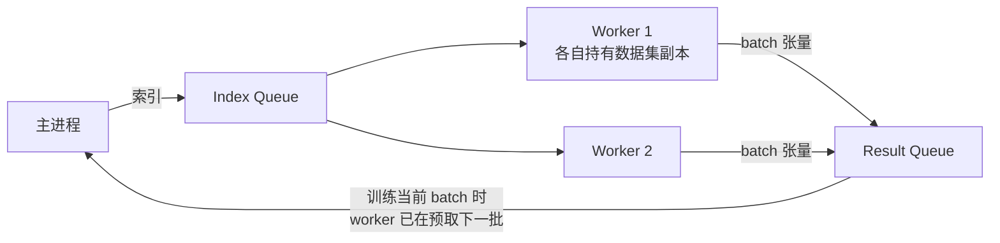

工作机制：
1. **主进程**：建 index queue 和 result queue，spawn worker 进程。
2. **Worker 进程**：从 index queue 读索引 → 从数据集取数据 → 做 transform → 把处理好的 batch 放进 result queue。
3. **预取（Prefetching）**：主进程用当前 batch 训练时，worker 已经在加载下一批 → **数据加载与计算重叠**（流水线并行）。
4. **Pin memory**：`pin_memory=True` 时，一个独立线程异步把数据从 CPU 拷到 GPU，进一步重叠传输与计算。

> 💡 **性能贴士**（原书）：
> - `num_workers` 是**每 rank** 的（每进程 spawn 自己的 worker），所以整个节点跑 `num_workers × world_size` 个 worker。实用起点：每 rank 设 `min(8, cpu_cores_per_node / gpus_per_node / 2)`。
> - `pin_memory=True` 加速 CPU→GPU。
> - `prefetch_factor=2`（默认）提前预取。
> - `persistent_workers=True` 让 worker 跨 epoch 存活，减少启动开销。

### 设备选择最佳实践

```python
local_rank = int(os.environ['LOCAL_RANK'])
torch.cuda.set_device(local_rank)
device = torch.device(f'cuda:{local_rank}')
```

> ⚠️ **必用 `LOCAL_RANK` 选设备，别用 `RANK`**（RANK 是跨所有节点的全局值，多机时会指向不存在的本地 GPU 编号）。也可以启动前用 `CUDA_VISIBLE_DEVICES=0,1,2,3` 限制可见 GPU。

### 完整单机例子：CIFAR-10 + 小 CNN

原书给了一个完整例子（`code/train_ddp_cifar10.py`），核心训练循环：

```python
def main():
    rank, local_rank, world_size = setup()
    device = torch.device(f'cuda:{local_rank}')
    model = Net().to(device)
    model = DDP(model, device_ids=[local_rank])
    criterion = nn.CrossEntropyLoss()
    optimizer = optim.SGD(model.parameters(), lr=0.001, momentum=0.9)
    trainloader, sampler = get_dataloader(rank, world_size)
    for epoch in range(10):
        sampler.set_epoch(epoch)                 # ← 每 epoch 必调!
        model.train()
        for batch_idx, (data, target) in enumerate(trainloader):
            data, target = data.to(device), target.to(device)
            optimizer.zero_grad()
            output = model(data)
            loss = criterion(output, target)
            loss.backward()
            optimizer.step()
            if rank == 0 and batch_idx % 100 == 0:
                print(f'Epoch {epoch}, Batch {batch_idx}, Loss: {loss.item():.4f}')
    if rank == 0:
        print('Training finished')
    cleanup()
```

启动：`torchrun --nproc_per_node=4 code/train_ddp_cifar10.py`。首次运行会把 CIFAR-10 下载到 `./data`；只有 rank 0 打印 loss。

---

## 7. 多机多卡 DDP 🌐

多机 DDP = **每 GPU 一个进程，横跨多台机器**。每台机器叫一个**节点（node）**，进程总数就是 **world size**。

### 多机架构

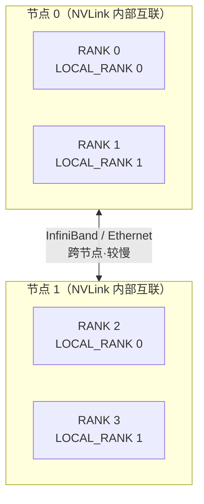

以 **2 节点 × 2 GPU** 为例：`WORLD_SIZE=4`，RANK 0–3。节点 0 跑 RANK 0/1，节点 1 跑 RANK 2/3（两节点内部 LOCAL_RANK 都是 0/1）。扩展规律：4 节点 × 8 GPU = world size 32，每节点 8 进程。

**🔬 通信成本随布局分层**（关键洞见）：
- **同节点** GPU 走 **NVLink**（几百 GB/s）。
- **跨节点** GPU 走 **InfiniBand 或 Ethernet**（每链路几十 GB/s，慢但聚合带宽可观）。
- NCCL 利用这个层级：**先在每个节点内部归约 → 再跨节点归约 → 再广播回来**，把跨节点流量压到最低（这叫 hierarchical / 层级化 AllReduce）。

### 启动多机训练

多机要求每个进程**都同意在哪里"集合"（rendezvous）、总共多少进程**。需指定：主节点地址+端口、节点总数、每节点的 rank。

**2 节点 × 2 GPU**，在**各节点上分别**运行——主节点（node 0）：
```bash
torchrun --nnodes=2 --nproc_per_node=2 --node_rank=0 \
  --master_addr=<master_ip> --master_port=29500 code/train_ddp_multi_mini.py
```
工作节点（node 1）：
```bash
torchrun --nnodes=2 --nproc_per_node=2 --node_rank=1 \
  --master_addr=<master_ip> --master_port=29500 code/train_ddp_multi_mini.py
```

把 `<master_ip>` 换成主节点真实 IP（用 `hostname -I` 或 `ip addr show | grep inet` 查）。更大规模（4 节点 × 8 GPU）就设 `--nnodes=4 --nproc_per_node=8`，各节点 `--node_rank=0,1,2,3`。

### 用 SLURM 启动（HPC 集群标配）

```bash
#!/bin/bash
#SBATCH --job-name=ddp_train
#SBATCH --nodes=2
#SBATCH --ntasks-per-node=2
#SBATCH --gres=gpu:2
#SBATCH --time=24:00:00
export MASTER_ADDR=$(scontrol show hostnames $SLURM_JOB_NODELIST | head -n 1)
export MASTER_PORT=29500
srun torchrun --nnodes=$SLURM_NNODES --nproc_per_node=2 \
  --node_rank=$SLURM_NODEID --master_addr=$MASTER_ADDR --master_port=$MASTER_PORT \
  code/train_ddp_multi_mini.py
```

SLURM 从作业布局自动设 `$SLURM_NNODES`、`$SLURM_NODEID`、`$SLURM_PROCID`、`$SLURM_LOCALID` 等，喂给 torchrun。

### 网络配置：InfiniBand vs Ethernet 🚄

| 维度 | InfiniBand | Ethernet |
|------|-----------|----------|
| 带宽 | 200–400 Gb/s / 链路 | 10–100 Gb/s / 链路 |
| 延迟 | 亚微秒 | 微秒级 |
| RDMA | ✅ 直接 GPU-to-GPU 内存访问 | 一般无 |

用 IB 时确保：所有节点在同一 IB 子网；NCCL 能检测到 IB 接口（必要时 `NCCL_IB_DISABLE=0`）；防火墙放行 master 端口。

**测连通性**：优先用 **nccl-tests**（`all_reduce_perf`）——它跑真正的 NCCL 集合操作，比裸 `ib_write_bw` 更贴近 DDP 实际：
```bash
# ./build/all_reduce_perf -b 8 -e 128M -f 2 -g <gpus_per_node>
```

### ⚠️ 多机首跑前的检查清单（避免神秘挂死/慢）

原书列的血泪清单：

| 检查项 | 说明 |
|--------|------|
| **软件栈一致** | 每个节点的 CUDA 驱动、NCCL、PyTorch 版本要一致。某个 rank 驱动旧 / PyTorch 不同版本，是 `init_process_group` 挂死和 NCCL 神秘错误的常见来源 |
| **MASTER_ADDR 是 IP 不是主机名** | 每个节点都要能通过同一地址到达；主机名各节点解析不同会破坏 rendezvous |
| **选对网卡** | 多网卡机器（管理网 + IB）上 NCCL 可能绑错网卡。用 `NCCL_SOCKET_IFNAME=ib0` 指定集群 fabric 接口（`ip addr` 查名字） |
| **MASTER_PORT** | 多机上必须是真实 IP，各节点用同一端口；`29500` 连续复用可能撞上 TIME_WAIT 的 "address already in use" |

---

## 8. 调试与排障：四大象限 🔧

DDP 失败大致落入四类：**挂死（hangs）、结果错误、显存溢出（OOM）、性能慢**。

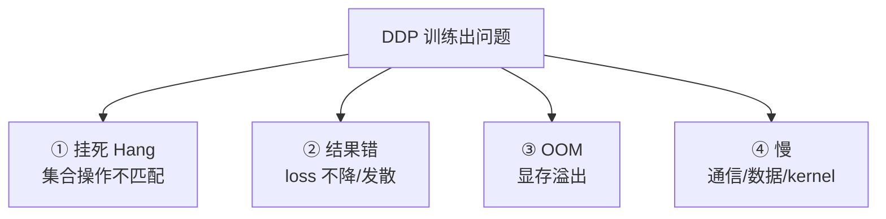

### 象限①：挂死（最常见）💀

**根因：集合操作不匹配。** 每个进程必须**以相同顺序调用相同的集合操作**。一个进程调 `all_reduce`，另一个在等别的东西，就全挂了。

| 原因 | 错误 vs 正确 |
|------|--------------|
| **WORLD_SIZE 不一致** | ❌ `world_size = torch.cuda.device_count()`（各节点可能不同）<br/>✅ `world_size = int(os.environ['WORLD_SIZE'])` |
| **条件性集合调用** | ❌ `if rank == 0: dist.all_reduce(tensor)`（只 rank 0 调，其他人干等）<br/>✅ `dist.all_reduce(tensor)`（所有进程都调） |
| **防火墙挡端口** | `telnet <master_ip> <master_port>` 测试；或换 `MASTER_PORT=29501` |

**进程组 / NCCL 超时**：PyTorch 的 watchdog 超时**在 Python 里设，不是靠 `NCCL_TIMEOUT` 环境变量**（PyTorch 根本不读这个名字）。默认 **30 分钟**。慢集群/大作业要调大：

```python
from datetime import timedelta
dist.init_process_group(
    backend='nccl',
    timeout=timedelta(minutes=60),  # 默认 30 分钟
)
```

配套环境变量（PyTorch 2.2+ 名字，老版本去掉 `TORCH_` 前缀）：
```bash
export TORCH_NCCL_ASYNC_ERROR_HANDLING=1
export TORCH_NCCL_BLOCKING_WAIT=1
# 调试挂死加日志：
export NCCL_DEBUG=INFO
export NCCL_DEBUG_SUBSYS=INIT,COLL
```

**渐进式排障法**（强烈推荐的黄金流程）：
```bash
# 1. 先单进程测基本正确性（不带 DDP）
CUDA_VISIBLE_DEVICES=0 python code/train_ddp_multi_mini.py
# 2. 再单进程 + DDP
torchrun --nproc_per_node=1 code/train_ddp_multi_mini.py
# 3. 再扩到多进程
torchrun --nproc_per_node=2 code/train_ddp_multi_mini.py
```

### 象限②：结果错误 / 梯度不一致 ⚖️

原书特别强调**区分两种情况**：
- **loss 不降或发散** → 大概率是**真 bug**（数据切分、全局 batch 后学习率、忘了 `set_epoch()` 等）。
- **相同命令不同次跑 loss 数值不同** → **通常正常**——CUDA/NCCL 默认非完全确定性，除非开启慢速确定模式，否则别去追比特级复现（那只对回归测试有意义）。

**loss 停滞/发散时的排查**：
1. **忘了 `DistributedSampler.set_epoch()`** → 每个 epoch 数据顺序一样。
2. **单卡 vs 多卡对比**：同样的全局 batch 和学习率下比较 loss 趋势。不必逐 step 对齐，但**系统性大差距**（如 4 卡 loss 差 4 倍）暗示 setup bug——比如每卡 batch 大小错了，或梯度被求和而非求平均。

### 象限③：CUDA 显存溢出（OOM）💥

DDP **在每张卡复制模型**，显存随卡数放大。

| 原因 | 修法 |
|------|------|
| **batch 太大** | 全局 128 + 4 卡 → **每卡应是 32 不是 128**：`per_gpu = global // world_size` |
| **梯度累积没清零** | 见下面梯度累积正确写法 |
| **激活值大** | Transformer 长序列激活巨大 |

**梯度累积正确姿势**：
```python
# ❌ 错误：梯度跨累积步累加，没清零
for i,(data,target) in enumerate(dataloader):
    loss = model(data, target); loss.backward()   # 累加!
    if (i+1) % accumulation_steps == 0: optimizer.step()

# ✅ 正确：开头清零 + loss 缩放
optimizer.zero_grad()
for i,(data,target) in enumerate(dataloader):
    loss = model(data, target)
    loss = loss / accumulation_steps               # 缩放 loss
    loss.backward()
    if (i+1) % accumulation_steps == 0:
        optimizer.step(); optimizer.zero_grad()
```

**四大解法**：
- **减小 batch**：降低每卡 batch。
- **梯度检查点（gradient checkpointing）**：用计算换显存，重算激活——`output = checkpoint(model, x)`。
- **混合精度**：FP16/BF16 减半显存。
- **`torch.cuda.empty_cache()`**：⚠️ 只把"预留但未用"的显存还给驱动，**不降低训练 step 的峰值显存**。在训练循环里调会**强制同步、拖慢训练**——只在作业/进程之间用，别每次迭代都调。

### 象限④：性能慢 🐌

低 GPU 利用率 = 瓶颈在通信、数据加载或低效 kernel。

| 原因 | 修法 |
|------|------|
| **数据加载瓶颈** | CPU 跟不上 GPU：`num_workers=8, pin_memory=True, prefetch_factor=2` |
| **batch 太小** | GPU 没吃饱，增大 batch |
| **通信开销** | 模型小/通信慢时 AllReduce 主导，用 profiler 定位 |
| **NCCL 拓扑低效** | `NCCL_DEBUG=INFO` 看算法；`NCCL_SOCKET_IFNAME=ib0` 选对网卡 |

**监控命令**：`watch -n 1 nvidia-smi`、`dstat -cdngy`。网络问题用 `ibdev2netdev` 列 IB 设备。

---

## 9. Profiling DDP 性能 🔬

**优化前先 profile**——猜哪里慢不靠谱。`torch.profiler.profile` 捕获 CPU/CUDA 详细计时。对 DDP 你要盯：前向时间、反向时间、AllReduce 通信时间、计算-通信重叠、数据加载时间。

```python
from torch.profiler import profile, record_function, ProfilerActivity

with profile(
    activities=[ProfilerActivity.CPU, ProfilerActivity.CUDA],
    record_shapes=True,
    profile_memory=True,
    with_stack=True,          # 更深的调用栈分析
) as prof:
    with record_function("forward_pass"):
        output = model(data); loss = criterion(output, target)
    with record_function("backward_pass"):   # DDP 通信就发生在这
        loss.backward()
    with record_function("optimizer_step"):
        optimizer.step(); optimizer.zero_grad()

if rank == 0:  # 只 rank 0 打印，避免重复
    print(prof.key_averages().table(sort_by="cuda_time_total", row_limit=30))
    prof.export_chrome_trace("ddp_trace.json")   # 导出 Chrome trace
```

### 看时间线：Chrome tracing / Perfetto

导出的 `.json` 是一条 CPU+CUDA 事件时间线。打开 `chrome://tracing` 或 [ui.perfetto.dev](https://ui.perfetto.dev/) 加载。

> 🔬 **关键理解**：Chrome/Perfetto 按 **stream** 组织 CUDA 事件。DDP 在**默认 stream** 上跑反向计算，在**独立的通信 stream** 上启动 NCCL AllReduce。**在时间上重叠、但处于不同 stream 行**的柱子 = 真重叠；**同一 stream** 上的事件不管水平怎么对齐，都是**顺序执行**。

**判读清单**：

| 看什么 | 含义 |
|--------|------|
| `nccl:all_reduce` | 跨 rank 的梯度同步 |
| 重叠指标 | 反向 kernel（如 `ConvolutionBackward0`）与 AllReduce 在**不同 stream** 上并发 |
| 通信开销占比 | AllReduce 占总 step 时间：**<20% 好，20–40% 可接受，>40% 疑似瓶颈**（依模型大小和拓扑而定——小模型 NVLink 可能 5%，大模型 Ethernet 到 50% 也正常） |
| 桶边界 | 反向期间多个 AllReduce——**每桶一个** |

### 重叠分析脚本

原书给了个只 profile 反向的例子，核心判断逻辑：

```python
# 如果反向计算时间 >> AllReduce 时间，说明重叠在工作
if total_backward_time > total_allreduce_time * 1.5:
    print("✓ Good overlap: 计算时间超过通信时间")
else:
    print("⚠ Limited overlap: 通信时间显著")
    print("  考虑：更大 bucket / 更快互联 / 更大模型")
```

> ⚠️ **注意**：用极小模型（单个 linear 层）时，反向计算几乎为 0，你会看到 "Total backward compute time: 0.00 ms" 和 "Limited overlap"——**这是预期的**。用 ResNet50 这类真实模型，反向计算才会主导，重叠才可见。原书专门用 `profile_ddp_resnet50.py` 演示这个对比。

---

## 10. 优化 DDP 性能 🎯

**优化顺序**（原书建议，很重要）：

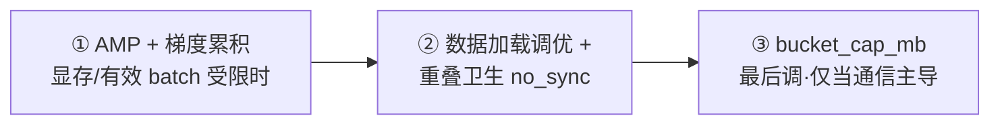

### 混合精度（AMP）

```python
from torch.cuda.amp import autocast, GradScaler
scaler = GradScaler()
for data, target in dataloader:
    optimizer.zero_grad()
    with autocast():                        # 混合精度前向
        output = model(data)
        loss = criterion(output, target)
    scaler.scale(loss).backward()           # 缩放后反向
    scaler.step(optimizer)                  # 内部先 unscale
    scaler.update()                         # 调整 scale 因子
```

`GradScaler` 缩放 loss 防下溢，检测溢出（inf/NaN）时**跳过该 optimizer step** 并调整 scale。

| 格式 | 指数位 | 尾数位 | 特点 |
|------|--------|--------|------|
| FP16 | 5 bit | 10 bit | 范围窄易下溢，推理常用、可能更快 |
| BF16 | **8 bit（同 FP32）** | 7 bit | 范围大更稳、精度损失小，**训练常首选** |

BF16 用法：`with autocast(dtype=torch.bfloat16): ...`。**DDP 下 scaler 要在包 DDP 前建，`scaler.step()/update()` 每进程都调。**

### 梯度累积 + `no_sync()` 🔑

梯度累积**不增显存模拟大 batch**：只每几步更新一次参数，中间累积梯度。**DDP 下的关键坑**：`backward()` **默认触发 AllReduce**，如果不管，累积 4 步就白白做了 4 次 AllReduce！

```python
accumulation_steps = 4
optimizer.zero_grad()
for i,(data,target) in enumerate(dataloader):
    output = model(data)
    loss = criterion(output, target) / accumulation_steps
    # 只在窗口最后一个 micro-batch 才 AllReduce
    if (i+1) % accumulation_steps != 0:
        with model.no_sync():               # ← 中间步禁用同步!
            loss.backward()
    else:
        loss.backward()                     # 最后一步才同步
        optimizer.step(); optimizer.zero_grad()
# epoch 结尾若停在窗口中间，把剩余梯度 step 一次
if (i+1) % accumulation_steps != 0:
    optimizer.step(); optimizer.zero_grad()
```

> 💡 **`no_sync()` 的意义**：把中间 micro-batch 包进 `no_sync()`，**只在每个累积窗口的最后一次反向做 AllReduce**——否则你每次 optimizer step 要付 `accumulation_steps` 次集合通信，而不是 1 次。

### 调桶大小 `bucket_cap_mb`

```python
model = DDP(model, device_ids=[local_rank], bucket_cap_mb=50)  # 默认 25MB
```

**调参方法**：profile 几个值（10/25/50/100 MB），各跑一小段训练比吞吐。默认 25 MB 是好起点。大桶适合大模型/快互联/通信主导；小桶适合小模型/慢链路/通信缓冲内存受限。

### 找未使用参数 & 静态图

```python
# 条件模型有未使用参数时（否则会挂死）——但有开销，仅需时开
model = DDP(model, device_ids=[local_rank], find_unused_parameters=True)

# 计算图每次迭代不变时，可开静态图优化
model = DDP(model, device_ids=[local_rank], static_graph=True)
```

`static_graph=True` 假设**用/未用参数集合固定、图结构每次迭代相同**，可优化通信模式。能否用可训练几步后检查：

```python
ddp_logging_data = model._get_ddp_logging_data()
if ddp_logging_data.get("can_set_static_graph", False):
    print("Can enable static_graph=True")
```

---

## 11. 分布式检查点与恢复 💾

长训练要定期存 checkpoint，DDP 下要正确保存/恢复**模型状态、优化器状态、RNG 状态**。原书用 **rank-0-only** 的 `torch.save`（适合 DDP 复制权重）；更大规模时集中到一个 rank 会成写瓶颈，那时用 `torch.distributed.checkpoint`（DCP，第 4 章）让每 rank 写自己的分片。

### 保存（只 rank 0 写，避免竞态）

```python
def save_checkpoint(model, optimizer, epoch, loss, filepath):
    rank = dist.get_rank()
    if rank == 0:
        checkpoint = {
            'epoch': epoch,
            'model_state_dict': model.module.state_dict(),  # ← 注意 .module!
            'optimizer_state_dict': optimizer.state_dict(),
            'loss': loss,
        }
        if scaler is not None:
            checkpoint['scaler_state_dict'] = scaler.state_dict()
        torch.save(checkpoint, filepath)
    dist.barrier()   # ← 所有进程等 rank 0 写完
```

> ⚠️ **面试高频坑**：保存 DDP 模型要用 **`model.module.state_dict()`** 而不是 `model.state_dict()`——因为 DDP wrapper 把真实模型暴露为 `.module` 属性。直接存 wrapper 的 state_dict，key 全带 `module.` 前缀，加载到裸模型会对不上。

### 加载（每进程都从同一文件加载）

```python
def load_checkpoint(model, optimizer, filepath, scaler=None):
    rank = dist.get_rank()
    checkpoint = torch.load(filepath, map_location=f'cuda:{rank}')  # 每进程都读
    model.module.load_state_dict(checkpoint['model_state_dict'])
    optimizer.load_state_dict(checkpoint['optimizer_state_dict'])
    if scaler is not None and 'scaler_state_dict' in checkpoint:
        scaler.load_state_dict(checkpoint['scaler_state_dict'])
    return checkpoint['epoch'] + 1, checkpoint['loss']
```

### RNG 状态（完全可复现恢复）

要完全可复现，得存/恢复 RNG 状态（PyTorch、CUDA、可选 Python 和 NumPy）：

```python
checkpoint = {
    ...,
    'rng_state': torch.get_rng_state(),
    'cuda_rng_state': torch.cuda.get_rng_state_all(),
    'python_rng_state': random.getstate(),
    'numpy_rng_state': np.random.get_state(),
}
# 恢复：torch.set_rng_state / torch.cuda.set_rng_state_all / random.setstate / np.random.set_state
```

### 原子写（防写一半崩溃）

```python
def save_checkpoint_atomic(model, optimizer, epoch, filepath):
    if dist.get_rank() == 0:
        temp_file = filepath + '.tmp'
        torch.save({...}, temp_file)      # 先写临时文件
        os.rename(temp_file, filepath)    # 原子重命名
    dist.barrier()
```

> 🔬 **为什么原子？** 若进程写到一半崩了，半截文件会污染 checkpoint。"先写 `.tmp` 再 rename" 保证磁盘上的 checkpoint **要么完整、要么根本不存在**——rename 在同一文件系统上是原子操作。

**检查点最佳实践**：定期写（每 N epoch/iteration）；**保留多个** checkpoint 而非覆盖单文件；只 rank 0 写 + `dist.barrier()` 让所有进程看到后再继续；定期验证 checkpoint 能正确加载。这套模式（rank-0 写、barrier、原子存、启动加载）也复用于**容错和弹性训练**。

---

## 12. DDP 高级特性 🛠️

### 梯度 hook（Gradient hooks）

在参数上注册 hook，反向时**检查或修改梯度**。hook 收到梯度张量，**必须返回一个梯度**（原样或改过的）。因为模型被 DDP 包裹，参数经 `model.module.*` 访问：

```python
def gradient_hook(grad):
    print(f'Gradient norm: {grad.norm().item()}')
    return grad  # 必须返回梯度

model.module.fc.weight.register_hook(gradient_hook)
```
常用于：梯度裁剪、监控梯度范数、其他 per-parameter 修改。

### 通信 hook（Communication hooks）

**替换 DDP 默认梯度同步逻辑**。hook **每桶调用一次**，收到桶的 buffer，做归约/变换，**必须返回一个 future**（完成时带回可能改过的张量），DDP 才能继续：

```python
def allreduce_hook(state, bucket):
    tensor = bucket.buffer()
    dist.all_reduce(tensor, async_op=False)     # 可换成带压缩的 AllReduce
    fut = torch.futures.Future()
    fut.set_result(tensor)
    return fut                                  # DDP 期望返回 future

model.register_comm_hook(state=None, hook=allreduce_hook)
```
典型应用：**梯度压缩**（量化/稀疏化）、自定义归约、梯度过滤。⚠️ 这是高级特性，实现错了会破坏 DDP 或训坏模型，**只在你完全理解同步语义时用**。

### 处理不均输入的 `join()`

不同进程数据量不同（uneven inputs）时，有的 rank 先跑完，DDP 会因为其他进程还在集合通信里等待而**挂死**。`join()` 上下文让**先跑完的进程参与"假 AllReduce"**保持同步：

```python
model = DDP(model, device_ids=[local_rank])
with model.join():                      # ← 关键
    for data, target in dataloader:
        output = model(data)
        loss = criterion(output, target)
        loss.backward()
        optimizer.step()
```

原书例子：rank 0 有 2 个 batch，rank 1 有 3 个——没 `join()` 会在 rank 0 先完成时挂死。`join()` 让 rank 0 跑完自己的 2 步后，为 rank 1 的第 3 步参与假 AllReduce，两者一起退出。

> 💡 `join()` 适用于：数据集大小不能被 `batch × world_size` 整除、各进程数据集大小不同、或用动态批处理时。

---

## 13. 弹性数据并行（Elastic Data Parallelism）🔄

标准 DDP 里**单个节点/进程失败会拖垮整个作业**。长训练（数天）在共享/可抢占集群上承受不起——你希望作业能从失败中恢复，某些环境甚至希望**动态增减 worker**。弹性数据并行在 DDP 的梯度同步逻辑外**加了一层进程管理与容错**。

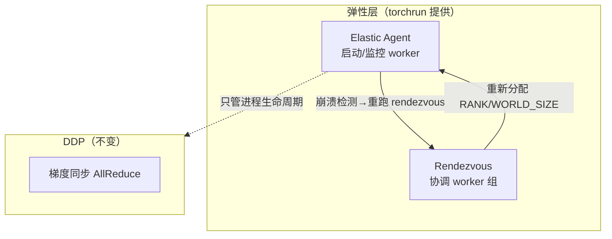

> 🔬 **核心理解**：弹性数据并行 = **DDP（梯度同步）+ torchrun 提供的容错进程管理**。弹性层**不实现 AllReduce 或任何训练逻辑**，它只管进程生命周期和恢复。梯度同步仍由每个 worker 内部的 DDP 完成，DDP 甚至**不知道**发生过重启。

### 怎么工作：Rendezvous（集合）

worker 通过 **rendezvous** 组建：节点联系一个 rendezvous 端点，等到参与者数量达标（弹性作业里是 MIN 到 MAX 之间任意数），rendezvous 完成，每个进程拿到全局 `RANK` 和 `WORLD_SIZE`。

> ⚠️ **训练脚本不能硬编码 RANK/WORLD_SIZE**——它们在重启或成员变化后会变。**world size 变 → 有效全局 batch 变**（每 rank batch × world size），这会改变梯度噪声和基于 step 的学习率调度。**resize 后 loss 尖刺往往是这个动力学，不是 DDP bug。**

**rendezvous 后端**：
- **c10d**（推荐）：用 TCP store，无需额外服务。`--rdzv-backend=c10d --rdzv-endpoint=host:port`（端口默认 29400）。
- **etcd / etcd-v2**：用 etcd 服务器，优先 etcd-v2（etcd 是 legacy 可能被移除）。

### 启动弹性训练

**单节点容错**：
```bash
torchrun --nnodes=1 --nproc_per_node=2 --max_restarts=2 \
    --rdzv_id=elastic_one_node --rdzv_backend=c10d \
    --rdzv_endpoint=127.0.0.1:29400 \
    code/train_elastic_checkpoint.py
```

**多节点弹性（2–4 节点，最多 3 次重启）**——每节点跑同样命令，端点换成 master：
```bash
torchrun --nnodes=2:4 --nproc_per_node=2 --max_restarts=3 \
    --rdzv_id=my_job --rdzv_backend=c10d \
    --rdzv_endpoint=MASTER_HOST:29400 \
    code/train_elastic_checkpoint.py
```

**两种模式**：

| 模式 | 参数 | 行为 |
|------|------|------|
| **容错（fault-tolerant）** | `--nnodes=2`（固定） | worker 崩溃重启，world size 不变 |
| **弹性（elastic）** | `--nnodes=2:4`（MIN:MAX） | 节点可加入/离开，world size 会变 |

> ⚠️ 关键前提：**跨重启保留进度全靠 checkpoint**——启动时加载最新 checkpoint、训练、定期保存（只 rank 0 写、原子写）。`--rdzv_id` 所有节点必须相同。可用 `@record` 装饰 entrypoint 得到更清晰的失败摘要。

**何时用**：长跑作业（天/周）承受不起单节点失败丢全部进度、不可靠/共享集群频繁抢占、需要动态伸缩节点。短作业或稳定专用集群，**普通 torchrun + 标准 DDP 更简单够用**。

---

## 14. 完整实战：DDP + Transformer 🤖

原书 `code/train_transformer_ddp.py` 把所有拼图串起来：DDP 设置 + `DistributedSampler`（带 `set_epoch()`）+ 混合精度（autocast + GradScaler）+ 每 epoch rank-0 检查点，用一个小 GPT 式 transformer（embedding + 位置编码 + transformer block + next-token 预测）。用假数据集（随机 token id）就能跑，换真数据（NanoGPT 管线、C4/OpenWebText 切片）时接线不变：

```bash
torchrun --nproc_per_node=8 code/train_transformer_ddp.py
```

> 💡 **这个模式是生产级扩展的模板**：单一 entrypoint + torchrun 启动 + 会加载/保存 checkpoint 的训练循环。它能扩到成百上千 GPU 并支持从失败恢复，**直接迁移到生产负载**。

---

## 📌 本章小结

DDP 是 PyTorch 分布式训练的**地基**。核心概念一张表带走：

| 概念 | 一句话本质 |
|------|-----------|
| **梯度同步** | 用 AllReduce 跨进程聚合梯度（求和后除 world_size = 求平均），保证模型一致 |
| **数据并行** | 模型复制、数据切分；等价于单卡跑全局大 batch |
| **梯度分桶** | 攒小张量成 25MB 桶再 AllReduce，摊平固定开销 |
| **通信-计算重叠** | autograd hook 标 ready + Reducer 按桶异步 AllReduce + CUDA stream，把通信藏在计算下 |
| **Ring AllReduce** | 带宽最优，通信量 $\approx 2|\text{tensor}|$ 与卡数无关 |
| **进程管理** | torchrun 启动 + 环境变量（RANK/LOCAL_RANK/WORLD_SIZE） |
| **数据切分** | DistributedSampler 保证每进程看不同数据，别忘 `set_epoch()` |
| **性能优化** | AMP → 数据加载/重叠卫生（no_sync）→ bucket_cap_mb（最后调） |
| **容错** | rank-0 原子 checkpoint + barrier；弹性训练 = DDP + torchrun 容错层 |

**Code 速查**（原书 Code Summary）：

| API | 作用 |
|-----|------|
| `dist.init_process_group()` | 初始化进程组 |
| `DistributedDataParallel` | 数据并行 wrapper |
| `DistributedSampler` | 跨进程切分数据集 |
| `dist.all_reduce()` | 跨 rank 求和的集合操作 |
| `dist.barrier()` | 同步所有进程 |
| `dist.get_rank()` / `get_world_size()` | 拿当前 rank / 进程总数 |
| `torchrun` | 分布式启动器 |

**面试高频清单** ⭐：
1. AllReduce 为什么求平均而非求和？（梯度放大 = 偷偷放大学习率）
2. DDP vs DP 三大差异？（多进程绕 GIL、消除 GPU0 瓶颈、通信-计算重叠）
3. 梯度分桶为什么逆序分桶？（反向从后往前算，逆序让同桶梯度几乎同时就绪）
4. 保存 checkpoint 为什么用 `model.module.state_dict()`？（DDP 把真实模型暴露为 `.module`）
5. 梯度累积在 DDP 下为什么要 `no_sync()`？（否则每个 micro-batch 都触发 AllReduce）
6. DDP 挂死的头号原因？（集合操作不匹配：world_size 不一致、条件性集合调用、未使用参数）
7. Ring AllReduce 为什么带宽最优？（通信量 $2\frac{N-1}{N}|T|$ 与 N 几乎无关，每链路满载）

**最佳实践顺序**（贯穿全章）：
- ✅ 先单进程验证，再单进程 DDP，再扩规模。
- ✅ 用 torchrun 启动，别手动 spawn。
- ✅ 所有进程设种子；profile 后再优化；实时看 `nvidia-smi`。
- ✅ 用混合精度；定期存 checkpoint 并测试加载；多机尽早测。

---

## 🔗 延伸阅读

- **下一章 → FSDP（Fully Sharded Data Parallel）**：DDP 复制整个模型，当模型**塞不进单张 GPU** 时就得升级到 FSDP——它把**模型参数分片**到各 GPU，让超大模型也能训。DDP 是 FSDP 的思想根基，先吃透 DDP 再学 FSDP 会非常顺。
- **第 4 章**：`torch.distributed.checkpoint`（DCP）——大规模分片检查点，每 rank 写自己的分片，解决 rank-0 集中写的瓶颈。
- **第 8 章**：SLURM 与多机启动的完整细节。
- **第 10 章**：NVIDIA Nsight Systems（`nsys`）做 kernel 级 NCCL 分析与跨 rank 可视化。
- **官方文档**：
  - [PyTorch DDP 官方教程](https://pytorch.org/tutorials/intermediate/ddp_tutorial.html)
  - [Torch Distributed Elastic (TDE)](https://pytorch.org/docs/stable/distributed.elastic.html)
  - [nccl-tests](https://github.com/NVIDIA/nccl-tests) —— 测集群 fabric 上的真实 NCCL 集合性能
  - Chrome tracing (`chrome://tracing`) / [Perfetto UI](https://ui.perfetto.dev/) —— 可视化 profiler trace

---

> 🎓 **一句话记住整章**：**复制模型、切分数据、AllReduce 求平均梯度**——再用**分桶 + autograd hook + CUDA stream** 把通信藏进计算里，用 **torchrun** 启动、**DistributedSampler** 喂数据、**rank-0 原子 checkpoint** 保命。这就是 DDP。
