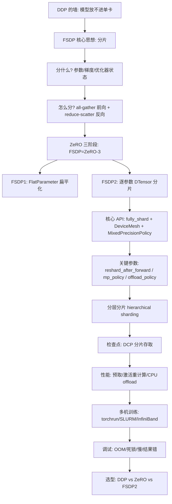
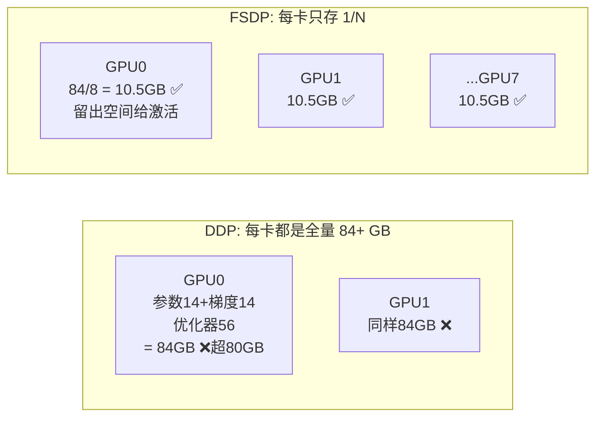
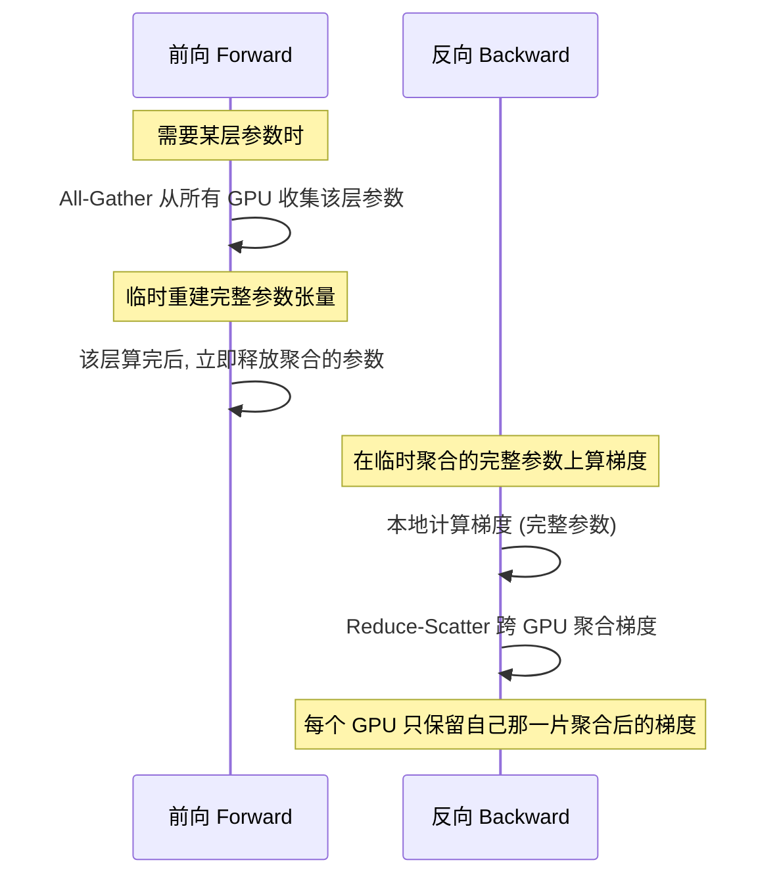
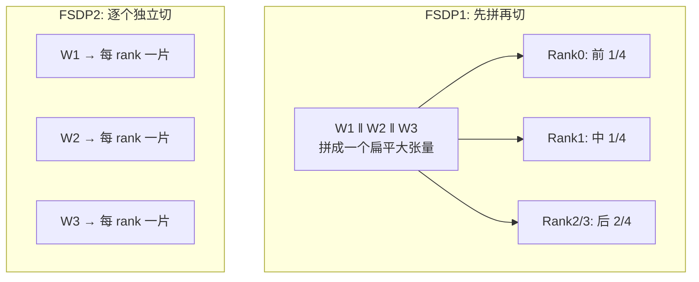
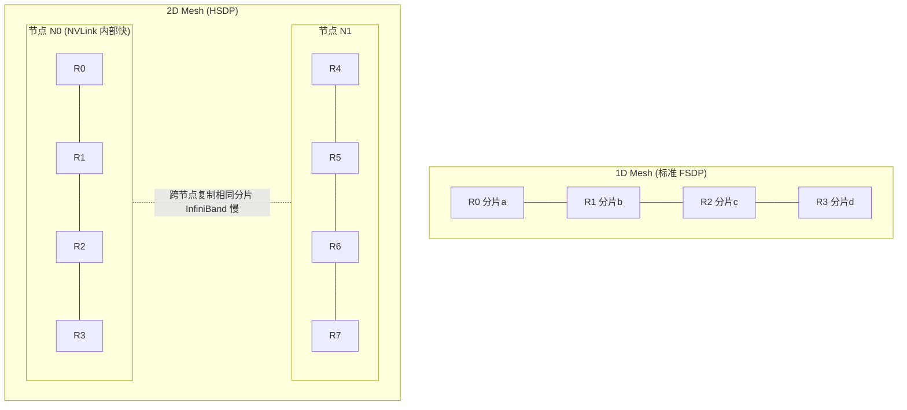
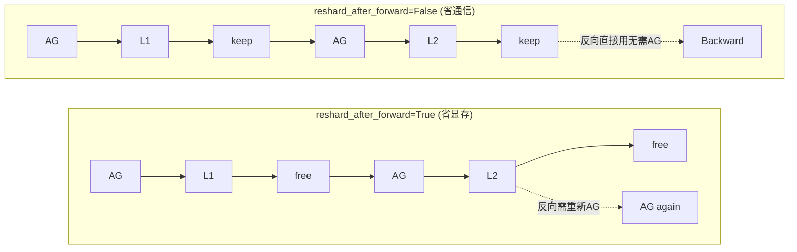
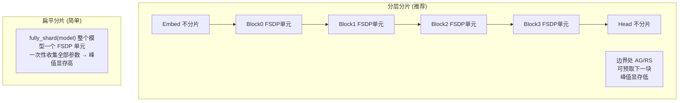
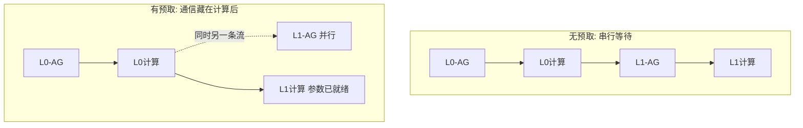
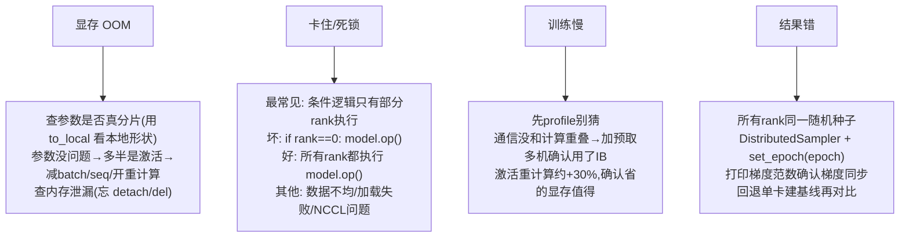
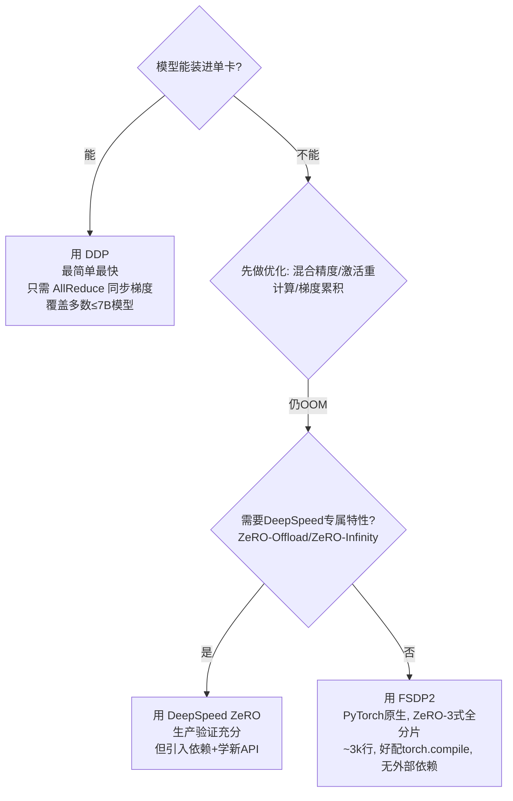

# 🧩 第 4 章 · FSDP 完全分片数据并行（Fully Sharded Data Parallel）

> "The data center is the new unit of computing." —— Jensen Huang, NVIDIA CEO
>
> 「数据中心才是新的计算单元。」当单张 GPU 装不下你的模型时，你能买到的最大 GPU 不再是天花板 —— 你能连起来的 GPU 数量才是。FSDP 就是把这句话变成现实的技术。

本章对应原书《Distributed AI Systems》第 4 章（PDF 第 216–260 页）。我们把 DDP 无法处理的「模型比单卡显存还大」这一核心难题彻底拆开讲透，从第一性原理到 PyTorch FSDP2 的每一个 API 参数、每一段代码。

---

## 🗺️ 本章地图



| 小节 | 你会学到 |
|---|---|
| 1️⃣ 从 DDP 到 FSDP | 为什么 DDP 会撞墙，FSDP 凭什么能突破 |
| 2️⃣ FSDP 如何工作 | ZeRO 思想 + all-gather/reduce-scatter 两大集合通信 |
| 3️⃣ FSDP1 vs FSDP2 | 扁平参数 vs 逐参数分片，两代 API 的演进 |
| 4️⃣ FSDP2 核心 API | `fully_shard`、`DeviceMesh`、关键参数逐个讲 |
| 5️⃣ 分层分片 | 在哪里放分片边界，为什么按 transformer block 切 |
| 6️⃣ 检查点 | DCP 分片存取，为什么不再需要 gather 到 rank 0 |
| 7️⃣ 性能优化 | 预取、激活重计算、CPU offload、profiling |
| 8️⃣ 多机与调试 | torchrun/SLURM、四类经典故障排查 |
| 9️⃣ 选型对比 | DDP / DeepSpeed ZeRO / FSDP2 该选谁 |

---

## 1️⃣ 从 DDP 到 FSDP：一堵必须翻越的墙

### 是什么

**FSDP（Fully Sharded Data Parallel，完全分片数据并行）** 是一种训练策略：它把**模型参数、梯度、优化器状态**切分（shard）到多个设备上，让每张 GPU 只持有整个模型的**一小部分**（1/N，N 为 GPU 数）。

对比第 3 章讲的 **DDP（Distributed Data Parallel）**：DDP 在**每一张** GPU 上都复制**一整份完整模型**。当模型（加上梯度和优化器状态）能塞进单卡显存时，DDP 又快又简单；一旦塞不下，DDP 就直接失效。FSDP 通过把训练状态摊到多卡上，让你训练**比任何单张卡显存都大**的模型。

### 🔬 第一性原理：DDP 到底为什么会 OOM？

我们做一道算术题。用 **DDP** 训练一个 **7B（70 亿参数）** 的模型，每张 GPU 需要存储四类东西：

| 组成 | 精度 | 占用（7B 模型） | 计算方式 |
|---|---|---|---|
| **模型参数** Parameters | BF16 | 14 GB | 7B × 2 字节 |
| **梯度** Gradients | BF16 | 14 GB | 与参数同大小，7B × 2 字节 |
| **优化器状态** Optimizer States | FP32 | 56 GB | Adam 的动量+方差 = 2× 参数，FP32 即 7B × 4 × 2 |
| **激活值** Activations | —— | 取决于 batch/seq | 大模型轻松几十 GB |

光是**参数 + 梯度 + 优化器状态**三项就是 `14 + 14 + 56 = 84 GB`，已经**超过一张 80 GB H100** —— 而且**激活值还没算**。

更狠的是：混合精度 Adam 还会额外保留一份 **FP32 主权重副本**（master copy），7B 模型再加约 **28 GB**。于是 DDP 的真实显存占用逼近 **112 GB**。单卡装不下，DDP 到此为止。



### 为什么 FSDP 能救命

用 FSDP，这三类组件被**切分到 N 张 GPU** 上：每张卡只持有每一项的 **1/N**。

在 **8 张 GPU** 上：`84 / 8 = 10.5 GB` 每卡（前三项），**留出充足的空间给激活值**。

> 这就是关键差别：同一个 7B 模型，**DDP 在单张 80GB 卡上装不下**，而 **FSDP 用 8 张卡就能训练**。

💡 **实战直觉**：FSDP 把「显存天花板」从「单卡容量」变成了「整个集群容量」。一个需要 160 GB 显存的模型，可以跑在 8 张各 24 GB 的卡上（每卡只放 1/8）。你不再受限于「能买到的最大 GPU」，而是受限于「能连起来多少 GPU」。这是一次根本性的转变。

### ⚠️ 常见坑：FSDP 不分片激活值！

原书用一个专门的 NOTE 强调：

> **Activations are not sharded** —— FSDP 只分片**参数、梯度、优化器状态**，**不分片激活值**。

每张 GPU 在前向/反向时，仍然要为**自己那一份 batch** 存储完整的激活值。所以**激活显存仍然是每卡各自的开销**，不会随 N 变小。

这也是为什么 **激活重计算（activation checkpointing）** 几乎总是和 FSDP 搭配使用 —— 在反向时**重算**激活而不是**存储**它们，腾出空间给那些临时 all-gather 上来的完整参数（后面第 7 节详解）。

---

## 2️⃣ FSDP 如何工作：ZeRO 思想 + 两大集合通信

### 🔬 核心思想来自 ZeRO 论文

FSDP 的核心思想源自微软研究院 2019 年的 **ZeRO（Zero Redundancy Optimizer，零冗余优化器）** 论文。ZeRO 观察到：在数据并行训练里，每张 GPU 都持有一份完整的模型、梯度、优化器状态 —— **其中绝大部分是冗余的**。

把这些状态**分区（partition）到各 GPU**，只在**需要时才聚合（gather）**，你就能在**不改变底层数据并行算法**的前提下，训练大得多的模型。（ZeRO 的完整细节在原书第 5 章讲 DeepSpeed，本章聚焦 PyTorch 的原生实现。）

### 两个集合通信操作

PyTorch 的 FSDP 用**两个集合通信操作**实现这个思想：



**前向传播（Forward）**：当某一层需要它的参数时，FSDP 从所有 GPU **all-gather**（全收集）过来 —— 临时重建出完整的参数张量。该层算完后，聚合的参数**立即被释放**。

**反向传播（Backward）**：梯度在**临时聚合的完整参数**上本地计算，然后跨 GPU 做 **reduce-scatter**（归约散射），使每个 GPU 最终只拿到它那一片**聚合后**的梯度。

### 💡 关键洞察：你不需要一次拥有所有参数

神经网络是**逐层顺序处理**的 —— 先过第 1 层，再过第 2 层……FSDP 利用这一点：**只 all-gather 当前层的参数，用完就释放，再处理下一层**。

任意时刻，显存里只需要放「当前正在计算的那一层」的完整参数，其余层仍是分片状态。这就是 FSDP 省显存的机理，也解释了为什么它和激活重计算是绝配。

| 集合通信 | 触发时机 | 作用 | 数据流向 |
|---|---|---|---|
| **All-Gather** 全收集 | 前向 & 反向需要参数时 | 每卡的 1/N 分片 → 每卡都拿到完整参数 | 分散 → 完整（临时） |
| **Reduce-Scatter** 归约散射 | 反向算完梯度后 | 每卡的完整梯度 → 每卡只留 1/N 聚合后分片 | 完整 → 分散 |

> 📎 补充：`all-gather` 和 `reduce-scatter` 的底层原理在原书第 1 章讲集合通信时已铺垫。这里只需记住：一个是「把碎片拼成整块」，一个是「把整块的求和结果再切碎发回去」。两者恰好互为逆向的数据流。

---

## 3️⃣ FSDP1 vs FSDP2：两代 API 的演进

PyTorch 为 GPU 训练提供了两套主要 FSDP API，外加一套给 TPU 的独立实现：

| API | 类/函数 | 设计 | 定位 |
|---|---|---|---|
| **FSDP1** | `FullyShardedDataParallel`（包装类） | 扁平参数（flat-parameter） | 原始版，仍在生产中使用 |
| **FSDP2** | `fully_shard()`（函数） | 逐参数分片（per-parameter） | **新项目推荐**，PyTorch 未来方向 |
| **FSDP via SPMD** | `SpmdFullyShardedDataParallel` | GSPMD 自动并行 | 仅用于 XLA/TPU 设备 |

> 全章中，当我们讨论**通用技术**（分片参数、all-gather、reduce-scatter）时，就说「FSDP」（不带数字）；当区别重要时才明确说 FSDP1 或 FSDP2。本章聚焦 **FSDP2 的 GPU 训练** —— 这是 CUDA 设备上新项目的推荐做法。

### FSDP1：扁平参数设计

FSDP1（2021 年发布，借鉴自 FairScale）用的是**扁平参数（flat-parameter）** 设计：它把一个被包装模块里的**所有参数拼接成一个连续的 `FlatParameter` 张量**，再把这个大张量切片到各 GPU。

这能工作，但有**局限**：

- 一个组里所有参数必须**同一 dtype**；
- 冻结参数需要**单独分组**；
- 扁平化让编译器**难以优化**通信模式。

### FSDP2：逐参数分片设计

FSDP2（2024 年通过 PyTorch RFC #114299 引入）走了另一条路：**逐参数分片**，用 `DTensor` 配 `Shard(0)`。它**不做扁平化**，而是把**每个参数张量单独在第 0 维上分片**。

举个具体例子：一个形状 `(4096, 1024)` 的线性层权重，在 **4 张 GPU** 上会变成 4 个形状 `(1024, 1024)` 的分片 —— **每张卡持有四分之一的行**。没有扁平化，没有 `FlatParameter` 类。

> ⚠️ **不能整除怎么办**：当第 0 维不能被 world size 整除时，FSDP2 会**填充（pad）** 张量；非常小的参数可能被**复制（replicate）** 而非分片。



### 为什么 FSDP2 更好

逐参数设计**更简单**（约 3k 行代码 vs FSDP1 的约 14k 行）**也更灵活**：

- ✅ **混合 dtype**：有的参数用 fp8，有的用 bf16，自由组合（FSDP1 要求一组内全同一 dtype）；
- ✅ **冻结与可训练参数放同一组**；
- ✅ **保存分片检查点无需先 gather**；
- ✅ 给编译器**看到单个参数**的可见性，优化通信更好。

**集合通信操作完全相同** —— 还是 All-Gather 和 Reduce-Scatter —— 只是**参数布局**根本不同。

### 💡 为什么 FSDP1 至今不能被淘汰？（Wan2.2 案例）

原书用开源视频生成模型 **Wan2.2** 说明：FSDP1 的存在**不只是历史惯性**，而有实打实的技术原因：

1. **序列并行的耦合**：Wan2.2 靠 **DeepSpeed Ulysses** 做序列并行处理高分辨率视频帧。Ulysses 用的特定 all-to-all 注意力头分发模式是针对 FSDP1 接口打磨过的。虽然 FSDP2 的 `DeviceMesh` 是为多维并行设计的，但 FSDP + Ulysses 的混合方案往往发现 FSDP1 对 `distributed_c10d` 群组调用的 hook 更稳定、更可预测。
2. **MoE 架构的精细控制**：27B 总参数 / 14B 激活参数的混合专家架构，需要对**非均匀分片**精确控制。FSDP1 的手动包装策略 `ModuleWrapPolicy` 在专家动态换入换出/卸载时，比 FSDP2 的 `fully_shard` 注解更好调试。
3. **冻结大块的生态**：模型用 UMT5-XXL 做文本编码 —— 一个巨大的**冻结参数块**。HuggingFace 生态里许多优化过的 T5 封装是围绕 FSDP1 的 `ShardedGradScaler` 和 auto-wrap 策略构建的。把整条流水线迁到 FSDP2 得重写 T5 集成，避免跨版本分布式错误。

> 面试高频：当你遇到或扩展这类项目时，理解 FSDP1 的**包装类风格**和**扁平参数行为**就成了必备技能，而不是可选项。

---

## 4️⃣ FSDP2 核心 API：`fully_shard`

### 与 FSDP1 最大的不同：原地修改

FSDP2 不用「包装类」，而是用 **`fully_shard()` 函数**，它**原地（in-place）修改模块** —— 更函数式、更可组合。

```python
from torch.distributed.fsdp import fully_shard, MixedPrecisionPolicy
from torch.distributed.device_mesh import init_device_mesh

# 初始化设备网格
mesh = init_device_mesh("cuda", (world_size,))

# 对模型应用 FSDP
fully_shard(
    model,
    mesh=mesh,
    mp_policy=MixedPrecisionPolicy(param_dtype=torch.bfloat16),
)
```

**逐行讲解**：

- `init_device_mesh("cuda", (world_size,))`：创建一个一维设备网格，把所有 GPU 排成一列。
- `fully_shard(model, ...)`：**注意它不返回包装后的模型** —— 你的 `model` **本身**就变成了 FSDP 模型（对比 FSDP1 是 `model = FSDP(model)`）。
- 这种「原地」设计让它更容易和其他变换组合，也**和 `torch.compile` 配合得更好**。

启动方式（`torchrun`）：

```bash
torchrun --nproc_per_node=2 code/train_fsdp2.py
```

### DeviceMesh：一切的基础

`DeviceMesh` 是 PyTorch 里表示**设备逻辑排布**的新抽象。对 FSDP，通常用**一维网格**（所有 GPU 排一维）：

```python
from torch.distributed.device_mesh import init_device_mesh

# 标准 FSDP 用一维网格（4 张 GPU）
mesh = init_device_mesh("cuda", (4,))
# 得到 [0, 1, 2, 3]
```

对**超大集群**，跨所有 GPU 全分片会造成过多**跨节点通信**。**HSDP（Hybrid Sharded Data Parallel，混合分片数据并行）** 用**二维网格**解决：只在**节点内分片**参数，**跨节点复制**参数 —— 用一点显存换取更少的节点间流量：

```python
# 二维网格用于混合分片
# 2 节点 × 每节点 4 GPU = 共 8 GPU
mesh = init_device_mesh("cuda", (2, 4))
```



> 💡 HSDP 的精髓：把**繁重的 all-gather 流量**留在**节点内的快速互联（NVLink）** 上，只在**较慢的节点间网络**上交换梯度。R0(N0) 与 R4(N1) 持有相同数据（沿 dim 0 复制），节点内 R0–R3 各持不同分片（沿 dim 1 分片）。

### 关键参数逐个讲

#### ⭐ `reshard_after_forward`：显存 vs 通信的核心权衡

这是**最重要的参数**，控制显存与通信的取舍：

| 取值 | 行为 | 显存 | 通信 | 对应 ZeRO |
|---|---|---|---|---|
| `True`（默认） | 每层前向后**立即重新分片**，释放显存，但反向需**额外一次 all-gather** | 低 ✅ | 高（多一次 AG） | **ZeRO-3** |
| `False` | 前向后**保留参数在显存**，反向**跳过 all-gather** | 高 | 低 ✅ | 类似 **ZeRO-2** |
| 整数（如 `2`） | 只分片到 2 张 GPU 而非全部 | 中 | 中 | ZeRO++ 的 hpZ |



原书 Figure 4.5 的图解：每行是一个两层模型的前向（Fwd）+ 反向（Bwd）。彩块含义：**AG**（All-Gather，紫，收集分片参数）、**L1/L2**（Compute，黄，层计算）、**RS**（Reduce-Scatter，红，分发梯度）。
- `=True`（上）：每层前向后参数被释放（标 "free"），反向必须再次 all-gather —— **显存低但 all-gather 翻倍**。
- `=False`（下）：参数前向后保留（标 "keep"），反向**完全跳过 all-gather** —— **峰值显存高但通信少**。

> **实战建议**：绝大多数显存受限场景，默认 `True` 是对的。只有当你**有显存余量、且通信是瓶颈**时，才试 `False`。

#### `mp_policy`：混合精度

```python
mp_policy = MixedPrecisionPolicy(
    param_dtype=torch.bfloat16,    # 参数存储精度
    reduce_dtype=torch.float32,    # 梯度归约精度（常用 FP32 保数值稳定）
)
```

- `param_dtype`：参数存储精度（如 `torch.bfloat16`）。
- `reduce_dtype`：梯度归约精度，**常用 `torch.float32` 保证数值稳定**。
- 还可选 `output_dtype` 指定层输出精度。

因为 FSDP2 是**逐参数分片**而非塞进一个大 buffer，你可以**自由混合 dtype** —— 有的层 fp8，有的层 bf16。原始 FSDP 要求一组内全同一 dtype。

#### `offload_policy`：CPU 卸载（最后手段）

```python
from torch.distributed.fsdp import CPUOffloadPolicy

fully_shard(
    model,
    mesh=mesh,
    offload_policy=CPUOffloadPolicy(pin_memory=True),
)
```

> ⚠️ 卸载有**性能代价**，把它当作**用尽其他显存优化后的最后一招**。减速幅度差异很大，取决于 PCIe 代际、CPU 内存带宽、优化器状态大小 —— **经验范围 20–50%**。

---

## 5️⃣ 分层分片（Hierarchical Sharding）

除了逐调用参数，FSDP2 还让你控制**在模型层级里哪里放分片边界**。比如：**逐个包装 transformer block，而让 embedding 层不分片**：

```python
# 逐个分片每个 transformer 层
for layer in model.transformer.layers:
    fully_shard(layer, mesh=mesh)

# 不分片 embedding 层（它很小）
# fully_shard(model.embedding, mesh=mesh)  # 跳过这个
```



**为什么分层更好**（原书 Figure 4.6）：

| 维度 | 分层分片（左） | 扁平分片（右） |
|---|---|---|
| 做法 | 循环 `fully_shard(block)` 逐块包装 | 一次 `fully_shard(model)` 包整个模型 |
| AG/RS 时机 | 在**块边界**发生 | 一次性全部收集 |
| 预取（prefetch） | ✅ 可在算当前块时预取下一块参数 | ❌ 无法预取 |
| 峰值显存 | 低（同时只需一块的完整参数） | 高（要一次收集所有参数） |
| 复杂度 | 稍复杂 | 简单 |

> 💡 **实战要点**：小层（如 embedding）分片可能**不划算** —— 分片带来的通信开销可能超过省下的显存。可以把它们**留着不分片**。原则：**只分片够大的层**。

### 完整示例：T5 摘要训练

原书提供了一个完整可跑的例子（`code/FSDP/`），用 FLAN-T5 做文本摘要，同时支持 FSDP1、FSDP2、单卡三种入口对比：

```bash
# 单卡基线
python code/FSDP/T5_training_Single.py
# FSDP1 双卡
torchrun --nnodes 1 --nproc_per_node 2 code/FSDP/T5_training_FSDP1.py
# FSDP2 双卡
torchrun --nnodes 1 --nproc_per_node 2 code/FSDP/T5_training_FSDP2.py
```

#### 📊 实测数据（H200 GPU）

**FLAN-T5-XL（3B）**：单卡能装下：

| 模式 | GPU 数 | 显存/卡 | 峰值/卡 | 吞吐 | 每轮耗时 |
|---|---|---|---|---|---|
| 单卡 | 1 | ~43 GB | ~58 GB | ~4.36 it/s | ~91 s |
| FSDP1 | 2 | ~22 GB | ~33 GB | ~4.09 it/s | ~49 s |

> ⚠️ **易被误解的点**：从 91s → 49s 的加速**主要来自把 batch 摊到两张卡**（数据并行），**不是** FSDP 让每一步更快！你看**每卡迭代率（it/s）几乎不变**（4.36 → 4.09，甚至略降，因为多了通信）。**FSDP 扩展的是显存，不是单样本算力。**

**FLAN-T5-XXL（11B）**：单卡直接 OOM（连 140GB 的 H200 都装不下）：

| 模式 | GPU 数 | 显存/卡 | 峰值/卡 | 吞吐 | 每轮耗时 |
|---|---|---|---|---|---|
| 单卡 | 1 | OOM | OOM | — | — |
| FSDP1 | 2 | ~84 GB | ~105 GB | ~1.96 it/s | ~101 s |
| FSDP2 | 2 | ~84 GB | ~105 GB | ~1.86 it/s | ~106 s |

> **关键结论**：FSDP1 和 FSDP2 在这个 setup 上显存/吞吐**几乎一样**。选 FSDP2 的理由**不是原始速度** —— 而是**更简单的 API、更紧的 `torch.compile` 集成、通过 DCP 的分片检查点**，这些随着任务和代码库变大越发重要。

#### FSDP1 的策略与包装（代码精讲）

FSDP1 里，**policy（策略）** 是你传给包装器的配置对象：

```python
# get_policies: 混合精度 + 包装策略
def get_policies(cfg, rank):
    mixed_precision_policy = None
    if cfg.mixed_precision:
        mixed_precision_policy = policies.bfSixteen  # bfloat16
    wrapping_policy = policies.get_t5_wrapper()      # 针对 T5Block
    return mixed_precision_policy, wrapping_policy

# 包装策略: 把每个 T5Block 包成一个 FSDP 单元
def get_t5_wrapper():
    from torch.distributed.fsdp.wrap import transformer_auto_wrap_policy
    return functools.partial(
        transformer_auto_wrap_policy,
        transformer_layer_cls={T5Block},   # ← 告诉 FSDP 在 T5Block 处切分
    )

# 应用 FSDP
mixed_precision_policy, t5_auto_wrap_policy = get_policies(train_config, rank)
model = FSDP(model,
    auto_wrap_policy=t5_auto_wrap_policy,
    mixed_precision=mixed_precision_policy,
    sharding_strategy=fsdp_config.sharding_strategy,   # FULL_SHARD = ZeRO-3
    device_id=torch.cuda.current_device(),
    limit_all_gathers=fsdp_config.limit_all_gathers)
```

- `wrap policy` 是个**可调用对象**，告诉 FSDP 把哪些子模块包成独立 FSDP 单元（这里是每个 `T5Block`），从而实现分层分片，让 AG/RS 在块边界发生。
- `sharding_strategy=FULL_SHARD` 即 ZeRO-3 风格的完全分片。

#### FSDP2 的显式分片（代码精讲）

FSDP2 用 `MixedPrecisionPolicy`（不是 FSDP1 的 `MixedPrecision`），且**没有 auto wrap policy** —— 分片是**显式**的：

```python
model = T5ForConditionalGeneration.from_pretrained(model_name)
model = model.to(device)

# 分片 encoder 每个 block（每个 T5Block 成为一个 FSDP 单元）
if hasattr(model, 'encoder') and hasattr(model.encoder, 'block'):
    for block in model.encoder.block:
        fully_shard(block, **fsdp_kwargs)
# 分片 decoder 每个 block
if hasattr(model, 'decoder') and hasattr(model.decoder, 'block'):
    for block in model.decoder.block:
        fully_shard(block, **fsdp_kwargs)
# 最后分片整个模型（根）；子模块必须已先分片
fully_shard(model, **fsdp_kwargs)
```

> ⚠️ **顺序至关重要**：**先分片子模块（children），再分片根（root）**。原书原话："Order matters—children are sharded before the root."
>
> 💡 **可省略 mesh**：单进程组（常见情况）时 `fully_shard()` 会**自动从 world size 推断默认 mesh**。只有多维并行（如 HSDP）才需显式传 `mesh`。

---

## 6️⃣ 检查点：FSDP2 的分片存取

长时间训练会失败 —— 硬件错误、抢占、bug —— 丢掉几天进度非常痛。FSDP2 的检查点**比以前简单**：因为**分片后的 state dict 恰好匹配训练时的表示**，每个 rank 直接存自己那片就行。**无需 gather 到 rank 0，无需 load 时重新分片。** 存取都在本地发生 —— 更快，更省显存。

两种方式：**DCP API（推荐）** 或**手动处理分片 state dict**。

### DCP API（推荐）

**DCP（Distributed Checkpoint，分布式检查点）** API 是保存/加载 FSDP2 检查点的推荐方式，它替你处理分片 state dict 的所有复杂性：

```python
from torch.distributed.checkpoint.state_dict import (
    get_model_state_dict, get_optimizer_state_dict,
    set_model_state_dict, set_optimizer_state_dict, StateDictOptions,
)
import torch.distributed.checkpoint as dcp

def save_checkpoint_dcp(model, optimizer, epoch, checkpoint_dir):
    """用 DCP API 保存检查点。"""
    model_state_dict = get_model_state_dict(
        model=model,
        options=StateDictOptions(full_state_dict=False, cpu_offload=True),
    )
    optim_state_dict = get_optimizer_state_dict(
        model=model, optimizers=optimizer,
        options=StateDictOptions(full_state_dict=False, cpu_offload=True),
    )
    checkpoint_path = os.path.join(checkpoint_dir, f"epoch_{epoch}")
    dcp.save({"model": model_state_dict, "optimizer": optim_state_dict, "epoch": epoch},
             checkpoint_id=checkpoint_path)

def load_checkpoint_dcp(model, optimizer, checkpoint_dir, epoch):
    """用 DCP API 加载检查点。"""
    checkpoint_path = os.path.join(checkpoint_dir, f"epoch_{epoch}")
    opt = get_optimizer_state_dict(model, optimizers=optimizer,
          options=StateDictOptions(full_state_dict=False))
    state_dict = {"model": get_model_state_dict(model,
                  options=StateDictOptions(full_state_dict=False)),
                  "optimizer": opt, "epoch": 0}
    dcp.load(state_dict, checkpoint_id=checkpoint_path)   # ← 原地填充，不返回新 dict!
    set_model_state_dict(model, state_dict["model"],
                         options=StateDictOptions(full_state_dict=False))
    set_optimizer_state_dict(model, optimizers=optimizer,
                             optim_state_dict=state_dict["optimizer"],
                             options=StateDictOptions(full_state_dict=False))
    return state_dict["epoch"]
```

**逐点精讲**：
- **`full_state_dict=False`** 是关键 —— 表示保存**分片**表示；每个 rank 只写自己那片。
- **保存路径很直白**：每个 rank 用 `dcp.save` 写自己的分片。
- ⚠️ **加载路径反直觉**：`dcp.load` **不返回新的 state dict**！你要先在**已初始化、已分片**的模型和优化器上调 `get_model_state_dict` / `get_optimizer_state_dict` 构造一个**模板（template）**，把它传给 `dcp.load`，DCP 会**原地逐项填充**。
- 模板告诉 DCP **期望的 keys、shapes、分片布局**。**跳过它**（在模型构造分片前就加载）是形状不匹配、参数未初始化错误的常见来源。
- 最后的 `set_model_state_dict` / `set_optimizer_state_dict` 完成 PyTorch 文档规定的加载路径 —— **优化器状态尤其需要**，即使模型参数已通过模板引用原地更新。
- **全程无 gather 到 rank 0，无 broadcast** —— 每个 rank 只读自己的分片。

### 手动分片检查点

需要更多控制时可手动处理：每个 rank 存 `model_rank_{rank}.pt`，rank 0 额外存元数据（epoch、world_size）。加载时每个 rank 读自己那片。灵活但要小心处理分片 state dict —— **多数情况仍推荐 DCP**。

### 全量 state dict（用于评估/推理）

有时需要**完整（未分片）** 的 state dict —— 比如保存最终模型做推理或分享给别人。可 gather 所有分片到 rank 0：

```python
model_state_dict = get_model_state_dict(
    model=model,
    options=StateDictOptions(
        full_state_dict=True,   # ← gather 所有分片
        cpu_offload=True,
    ),
)
# 只有 rank 0 保存
if rank == 0:
    torch.save({"model": model_state_dict, ...}, checkpoint_path)
torch.distributed.barrier()
```

> ⚠️ 这会 gather 所有分片到 rank 0，**用更多显存**，但给你一个**单一文件**可在任意数量 GPU 上加载。**除非明确需要（如推理），否则别为了全量检查点去 gather** —— gather 慢，且大模型可能 OOM。

---

## 7️⃣ 性能优化

FSDP 增加了通信开销 —— 每次前向都要 all-gather 重建参数，每次反向都要 reduce-scatter 梯度。NVLink 这类快速互联能减轻但**不能消除**它。

### 预取（Prefetching）：隐藏通信延迟

**核心洞察**：现代 GPU 能在**不同硬件单元上并发执行计算与通信**（CUDA 流做计算，NVLink/PCIe 做传输）。如果计算比通信久，all-gather 在需要之前就完成了，你就**不付延迟代价**。



**前向预取**：在处理当前层时，提前 all-gather 后续层的参数：

```python
def set_modules_to_forward_prefetch(model, num_to_forward_prefetch):
    for i, layer in enumerate(model.layers):
        if i >= len(model.layers) - num_to_forward_prefetch:
            break
        layers_to_prefetch = [
            model.layers[i + j] for j in range(1, num_to_forward_prefetch + 1)
        ]
        layer.set_modules_to_forward_prefetch(layers_to_prefetch)
```

**反向预取**：类似，为梯度计算提前取上一批层的参数（方向相反，`i - j`）。

> 💡 **何时用**：模型**层数多（10+）** 且每层计算量够大到能藏住通信延迟时最有效。如果层很小或互联已很快（NVLink、高带宽 IB），收益缩水，甚至可能因额外调度逻辑**增加开销**。
>
> **实战顺序**：**先不用预取**。profile 训练循环，如果通信显示为瓶颈，再加 `num_to_forward_prefetch=2` 和 `num_to_backward_prefetch=2`，然后根据 profiler 调整。

### 激活重计算（Activation Checkpointing）

**几乎总和 FSDP 一起用**。前向时不存所有激活，而在反向时**重算**它们。这能砍掉 **50–80%** 的激活显存。

**激活显存估算公式**（transformer 数量级估算）：

$$
\text{激活显存} \approx L \times B \times S \times H \times (\text{每元素字节}) \times k
$$

- $L$ = 层数，$B$ = batch size，$S$ = 序列长度，$H$ = 隐藏维度；
- $k$ = 系数（通常 **10–20**），算上注意力和 MLP 块里的中间张量。

> 这**不是精确公式** —— 实际取决于是否物化注意力分数、MLP 扩展比、框架开销。但给出正确的**数量级**。

**举例**：7B 模型（L=32, H=4096），seq=2048，batch=8，fp16：

$$
32 \times 8 \times 2048 \times 4096 \times 2 \times 12 \approx 52\ \text{GB}
$$

用激活重计算，只存**每个 checkpoint 块的输入**而非所有中间张量，省 50–80%。**代价**：反向时重算激活（前向约慢 30%，但反向差不多 —— 反正你本来就要算梯度）。

```python
from torch.utils.checkpoint import checkpoint

# 方式一: 整个模型重计算
def forward_with_checkpoint(x):
    return checkpoint(model, x)

# 方式二(推荐): 逐 transformer 块重计算
class TransformerBlockWithCheckpoint(nn.Module):
    def forward(self, x):
        if self.use_checkpoint:
            return checkpoint(self._forward_impl, x)  # 重计算整块
        return self._forward_impl(x)
    def _forward_impl(self, x):
        h = x + self.attention(self.attention_norm(x))
        out = h + self.feed_forward(self.ffn_norm(h))
        return out

# 隔层 checkpoint, 平衡显存与速度
for i, layer in enumerate(model.layers):
    layer.use_checkpoint = (i % 2 == 0)
```

### CPU 卸载（Offloading）：最后一招

把参数、梯度、优化器状态搬到 CPU 内存，腾出 GPU 显存，代价是训练变慢：

```python
from torch.distributed.fsdp import CPUOffloadPolicy
fully_shard(model, mesh=mesh, offload_policy=CPUOffloadPolicy(pin_memory=True))
```

分片参数在每次 all-gather 前拷回 GPU；梯度和优化器步在 CPU 上跑。减速取决于 PCIe 代际（3.0/4.0/5.0）、CPU 内存带宽、NUMA 拓扑、优化器状态大小 —— **经验 20–50%**。

> ⚠️ 如果 CPU 内存也耗尽，**NVMe offload 是 DeepSpeed ZeRO-Infinity 的特性**（原书第 5 章），**FSDP2 原生不提供**。
>
> **何时用**：CPU 卸载应排在优化序列的**最后**。只有当你已经开了 full-shard + 激活重计算、把 batch/seq 减到不能再减、仍然 OOM 时，才用它。**多数模型 full-shard + 激活重计算就够了，根本不用碰卸载。**

### Profiling：让数据说话

用 PyTorch profiler 找瓶颈，别猜：

```python
from torch.profiler import profile, record_function, ProfilerActivity
with profile(activities=[ProfilerActivity.CPU, ProfilerActivity.CUDA],
             record_shapes=True, profile_memory=True) as prof:
    for i in range(num_iterations):
        with record_function("forward"):
            output = model(data); loss = criterion(output, target)
        with record_function("backward"):
            loss.backward()
        with record_function("optimizer"):
            optimizer.step(); optimizer.zero_grad()
if rank == 0:
    print(prof.key_averages().table(sort_by="cuda_time_total", row_limit=30))
    prof.export_chrome_trace(f"fsdp_trace_rank{rank}.json")
```

- 只让 rank 0 打印/导出 —— FSDP 所有 rank 同步执行相同操作，**看一个 rank 的 trace 通常就够**（怀疑 straggler 才看全部）。
- trace 是 Chrome trace 格式，`chrome://tracing` 打开。在时间线上找 all-gather / reduce-scatter，**理想情况它们与计算重叠**；如果阻塞，预取可能有帮助。

**其他优化手段**：

| 瓶颈 | 手段 |
|---|---|
| 通信 | 预取；有显存余量则 `reshard_after_forward=False`；确认 NCCL 用了 NVLink/IB |
| 激活显存 | 减小 batch/seq；**梯度累积**（下方）；选择性 checkpoint |

**梯度累积**：拿到大有效 batch，却只付单 batch 的显存：

```python
accumulation_steps = 4
optimizer.zero_grad()
for i, (data, target) in enumerate(dataloader):
    loss = criterion(model(data), target) / accumulation_steps
    loss.backward()
    if (i + 1) % accumulation_steps == 0:
        optimizer.step(); optimizer.zero_grad()
```
有效 batch = `batch_size × accumulation_steps`，显存只是单个 `batch_size` 的量。

**内存 profiling**：在关键步打印 `torch.cuda.memory_allocated()` / `memory_reserved()`：若 "After forward" 远高于 "After FSDP"，罪魁是**激活**；若 "After backward" 居高不下，可能是**梯度或优化器状态**。更细可用 `torch.cuda.memory_summary()`。

---

## 8️⃣ 多机训练与调试

### 多机启动

多机 FSDP 与多机 DDP 用法相同 —— 需要进程组初始化 + 正确的网络。主要差别在检查点（分片，每 rank 存自己那片，加载无需 all-gather）。

```bash
# 主节点 (node 0)
torchrun --nnodes=2 --nproc_per_node=8 --node_rank=0 \
  --master_addr=<master_ip> --master_port=29500 code/train_fsdp2.py
# 工作节点 (node 1)
torchrun --nnodes=2 --nproc_per_node=8 --node_rank=1 \
  --master_addr=<master_ip> --master_port=29500 code/train_fsdp2.py
```

用 `hostname -I` 找主节点 IP。

### 网络配置：InfiniBand 优于以太网

FSDP 比 DDP 通信更多（all-gather + reduce-scatter），所以**快速互联更重要**：

| 维度 | InfiniBand | Ethernet |
|---|---|---|
| 带宽 | 200–400 Gb/s per link | 10–100 Gb/s |
| 延迟 | 亚微秒 | 微秒级 |
| RDMA | ✅ GPU 直连内存访问 | ❌ |

确认 NCCL 用了 IB：

```bash
export NCCL_IB_DISABLE=0 && export NCCL_DEBUG=INFO
# 日志应出现: NCCL INFO NET/IB: Using [device] for node [rank]
```

### SLURM 集成

大多数 HPC 集群用 SLURM 调度。最小示例：

```bash
#!/bin/bash
#SBATCH --job-name=fsdp_train
#SBATCH --nodes=4
#SBATCH --ntasks-per-node=8
#SBATCH --gres=gpu:8
#SBATCH --time=24:00:00

export MASTER_ADDR=$(scontrol show hostnames $SLURM_JOB_NODELIST | head -n 1)
export MASTER_PORT=29500
srun torchrun --nnodes=$SLURM_NNODES --nproc_per_node=8 \
  --node_rank=$SLURM_NODEID --master_addr=$MASTER_ADDR \
  --master_port=$MASTER_PORT train_fsdp2.py
```

多机检查点三种存储：**① 共享文件系统（NFS/Lustre）** 各 rank 直写；**② 本地写后同步**；**③ 对象存储（S3 + s3fs）**。分片方式让每 rank 只写小文件、省带宽。

> **扩展注意**：节点越多通信开销越大 —— 确保模型够大让**计算仍占主导**；检查点碎片文件多，用 Lustre/S3 这类擅长小文件的存储；硬件越多故障越多，**勤存检查点**、考虑弹性训练。

### 🔧 四类经典故障排查



**① OOM**：先做 sanity check —— 参数是否真分片？FSDP2 下参数是 DTensor，`param.shape` 是**全局形状**，要看本地分片得用 `to_local()`：

```python
for name, param in model.named_parameters():
    local = param.to_local() if hasattr(param, "to_local") else param
    print(f"{name}: local_shape={local.shape}, device={param.device}")
```
参数没问题却仍 OOM，八成是激活 —— 减 batch/seq 或开激活重计算；也留意**内存泄漏**（忘 detach/删张量导致跨迭代累积）。

**② 卡住/死锁**：进程失同步。最常见原因是**只有部分 rank 执行**的条件逻辑：

```python
# ❌ 坏: 只有 rank 0 触发这个集合通信
if rank == 0:
    model.some_operation()
# ✅ 好: 所有 rank 执行相同代码
model.some_operation()
```
其他：数据不均（某 rank 先耗尽 batch）、部分 rank 检查点加载失败、NCCL 问题（`NCCL_DEBUG=INFO`）。

**③ 慢**：先 profile 别猜。看通信是否与计算重叠，不重叠加预取；多机确认用了 IB；激活重计算约 +30%，确认省的显存值得；确认混合精度真的开了。

**④ 结果错**：① 所有 rank 用**同一随机种子**（`torch.manual_seed(42)` + `torch.cuda.manual_seed_all(42)`）；② `DistributedSampler` 正确设置且**每 epoch 调 `sampler.set_epoch(epoch)`**（忘了会导致每 epoch 用同一 shuffle）；③ 打印各 rank 梯度范数确认梯度同步；④ 实在不行回退单卡建基线再对比。

**调试工具**：`NCCL_DEBUG=INFO`（通信层）、PyTorch profiler（通信模式与瓶颈）、`torch.cuda.memory_summary()`（显存明细）、`torch.distributed.set_debug_level(DebugLevel.DETAIL)`（分布式运行时详细日志）。

---

## 9️⃣ 选型对比：DDP vs ZeRO vs FSDP2



| 方案 | 分片什么 | 通信 | 何时用 | 代价 |
|---|---|---|---|---|
| **DDP** | 什么都不分（全复制） | 仅梯度 AllReduce（高度优化） | 模型能装进单卡（现代 GPU 混合精度下多数 ≤7B） | 模型大了就撞墙 |
| **ZeRO-1** | 优化器状态 | —— | —— | —— |
| **ZeRO-2** | + 梯度 | —— | —— | —— |
| **ZeRO-3** | + 参数（全部） | AG + RS | 需 DeepSpeed 生态/ZeRO-Offload/Infinity | 引入 DeepSpeed 依赖，学其 API |
| **FSDP2** | 参数+梯度+优化器（= ZeRO-3） | AG + RS | 模型超单卡、想用 PyTorch 原生 | 较新，实战范例少些 |

**ZeRO 的分阶段分片**：ZeRO-1 分片优化器状态 → ZeRO-2 加梯度 → ZeRO-3 分片一切（含参数）。**FSDP ≈ ZeRO-3**。

**显存与性能对比（具体化）**：
- 7B + Adam：DDP 需 ~84 GB/卡（全复制）；FSDP2 或 ZeRO-3 在 8 卡上降到 ~10.5 GB/卡。
- **模型能装下时，DDP 最快**（通信最少）；**装不下时，FSDP2 与 ZeRO-3 表现相近** —— 两者都做 AG + RS，差别在实现细节和网络拓扑，而非根本设计。**按生态契合度选，而非性能。**

### 🎯 渐进式优化的正确顺序

原书反复强调的实战心法：

1. **先简单**：FSDP2 + 混合精度。
2. **OOM 了**：加激活重计算。
3. **还 OOM**：减 batch / 减 seq。
4. **实在不行**：CPU 卸载（最后手段，减速明显）。
5. **别过早优化** —— 先让它跑起来。

其他实战贴士：
- **初始化大模型**：先在 `meta` 设备上建模，`fully_shard` 后再 `to_empty(device)` + `reset_parameters()`，避免任何时刻在单卡物化完整模型（所有 rank 用同一种子保证参数一致）。
- **共享参数**（tied embeddings）：同一张量若出现在多处，这些用法必须在**同一 FSDP 组**里 —— FSDP 的参数交换不跨组保留 sharedness。
- **混合精度**：BF16 通常优于 FP16（动态范围更宽，不易溢出）；梯度归约保持 FP32（`reduce_dtype=torch.float32`）保数值稳定；**先跑通再加混合精度**。
- **梯度裁剪**：`torch.nn.utils.clip_grad_norm_` 正常用，FSDP 自动处理 unsharding/resharding。

### 附：TPU 上的 FSDP via SPMD

TPU/XLA 用另一套 `SpmdFullyShardedDataParallel`，基于 **GSPMD** 自动并行：不是显式 all-gather/reduce-scatter，而是 **XLA 编译器根据分片注解自动切分计算**（类似 JAX 的 `pmap`）。用 `xr.use_spmd()` 开启、`xs.Mesh` 建带命名维度的网格。**仅 TPU 可跑，GPU 训练仍用本章的 `fully_shard()`。**

---

## 🔬 本章核心论证回顾

**FSDP 改变了什么，没改变什么**（原书 Summary 的点睛之笔）：

- ✅ **改变**：把显存天花板从「单卡约束」变成「集群约束」。你不再受限于「能买到的最大 GPU」，而是「能连起来多少 GPU」。这是根本性的转变。
- ❌ **没改变**：FSDP 本质仍是**数据并行**。每张 GPU 处理**不同的数据 batch**，模型计算本身**没有跨设备拆分** —— 每张卡执行**相同**的操作，只是在需要时把分片 all-gather 回来。这区别于**模型并行**（张量并行、流水线并行），后者是不同 GPU **同时计算模型的不同部分**。

$$
\boxed{\text{FSDP 扩展的是「显存」，不是「单样本算力」。算力扩展仍靠更大 batch 摊到更多 GPU，和 DDP 一样。}}
$$

这个架构区别决定了并行策略的选择：FSDP **单独就能带你走很远**（大集群上到数千亿参数）。但对**最大的模型（万亿+参数）** 或需**降低单样本延迟**时，你要把 FSDP **和张量/流水线并行组合**（后续章节详解）。

---

## 📌 小结

| 关键点 | 一句话记住 |
|---|---|
| **FSDP 是什么** | 把参数/梯度/优化器状态切到 N 张卡，每卡只存 1/N，训练超单卡显存的模型 |
| **两大集合通信** | 前向 **all-gather** 拼出完整参数（用完即弃），反向 **reduce-scatter** 聚合梯度回分片 |
| **= ZeRO-3** | 思想源自微软 ZeRO；FSDP 分片一切 = ZeRO-3；`reshard_after_forward=False` ≈ ZeRO-2 |
| **FSDP1 vs FSDP2** | FSDP1 扁平参数（FlatParameter，~14k 行）；FSDP2 逐参数 DTensor 分片（~3k 行，推荐） |
| **核心 API** | `fully_shard(model, mesh, mp_policy)` **原地修改**；`init_device_mesh`；`MixedPrecisionPolicy` |
| **最重要参数** | `reshard_after_forward`：`True`（默认/省显存/ZeRO-3）vs `False`（省通信/ZeRO-2） |
| **分层分片** | 逐 block `fully_shard`，可预取、峰值显存低；小层（embedding）留着不分片 |
| **激活不分片** | FSDP 不分激活！所以几乎总配**激活重计算**（省 50–80% 激活显存，约慢 30%） |
| **检查点** | DCP API 分片存取，每 rank 存自己那片，无需 gather 到 rank 0；`dcp.load` 原地填充需先建模板 |
| **性能** | 预取隐藏通信；profile 找瓶颈别猜；CPU 卸载是最后一招（减速 20–50%） |
| **选型** | 装得下用 DDP（最快最简单）；装不下先优化，仍 OOM 用 FSDP2；要 DeepSpeed 特性用 ZeRO |
| **本质** | FSDP 扩展显存不扩展算力；仍是数据并行，非模型并行 |

---

## 🔗 延伸阅读

**官方文档**
- PyTorch FSDP 文档：https://pytorch.org/docs/stable/fsdp.html
- PyTorch FSDP 教程：https://docs.pytorch.org/tutorials/intermediate/FSDP_tutorial.html
- 逐参数分片 FSDP RFC（#114299）：https://github.com/pytorch/pytorch/issues/114299
- TorchTitan FSDP 指南：https://github.com/pytorch/torchtitan/blob/main/docs/fsdp.md
- PyTorch XLA SPMD：https://docs.pytorch.org/xla/master/spmd.html

**教程与指南**
- HuggingFace：FSDP 与 DeepSpeed 对比 / FSDP1 vs FSDP2（Accelerate 文档）
- UvA Deep Learning：Data Parallel FSDP（JAX 版）
- Introduction to Parallelism：https://ggrigorev.me/posts/introduction-to-parallelism/

**论文**
- Rajbhandari et al., *"ZeRO: Memory Optimizations Toward Training Trillion Parameter Models"*, SC 2020：https://arxiv.org/abs/1910.02054 （FSDP 的理论源头）
- *"PyTorch FSDP: Experiences on Scaling Fully Sharded Data Parallel"* (2023)：https://arxiv.org/abs/2304.11277

**项目**
- Wan2.2（FSDP1 + DeepSpeed Ulysses 多卡推理的活教材）：https://github.com/Wan-Video/Wan2.2

**下一章预告**
> FSDP2 能应付大多数大模型训练场景。但如果连全分片都不够 —— 需要 CPU/NVMe 卸载把显存推得更远，或跨多节点的优化通信模式？那就是 **DeepSpeed ZeRO** 登场的地方。下一章我们探索 **ZeRO-Offload、ZeRO-Infinity、ZeRO++** 这些 FSDP2 目前尚未提供的特性，以及何时该选 DeepSpeed 而非 PyTorch 原生方案。

---

> 📖 本章练习（原书 Exercises，建议动手）：① 手动实现参数分片 `shard_parameters`/`gather_parameters`；② benchmark 对比 `FULL_SHARD`/`SHARD_GRAD_OP`/`NO_SHARD` 三种策略的显存/吞吐/通信量；③ 实现自定义 transformer auto-wrap policy；④ 实现并对比三种混合精度配置；⑤ 实现支持 resharding 的 FSDP 检查点系统。完成后你应能：理解 FSDP 如何跨 GPU 分片参数、为工作负载选合适分片策略、为 transformer 写自定义包装策略、配置混合精度、构建鲁棒的分布式检查点系统、在保持吞吐的同时优化显存。
