# 第 5 章 · DeepSpeed 与 Megatron：超越状态分片 🚀

> "未来已经到来，只是分布得还不均匀。"（The future is already here. It's just unevenly distributed.）—— William Gibson
>
> 这句话被作者放在本章开篇，恰是一语双关：训练前沿大模型的技术已经存在，但它们"分布"（distribute）在不同的 GPU、不同的节点上——**如何把模型的状态与计算切开、摊到成百上千张卡上**，正是本章要讲透的事。

---

## 🗺️ 本章地图

上一章我们学了 **FSDP / ZeRO 状态分片（state sharding）**：把参数、梯度、优化器状态切碎，分摊到 N 张 GPU 上，每张卡只存 1/N。这解决了**"存不下"**的问题。

但状态分片有个隐含假设：**"参数聚齐（all-gather）之后，单层的计算能舒舒服服放进一张 GPU"**。当模型涨到 100B、175B、405B 参数时，这个假设崩了——**单层的矩阵乘法本身就大到一张卡算不动 / 存不下中间激活**。这时需要另一条正交的轴：**计算分片（computation sharding）**，也就是 Megatron 干的事。

本章的行进路线：

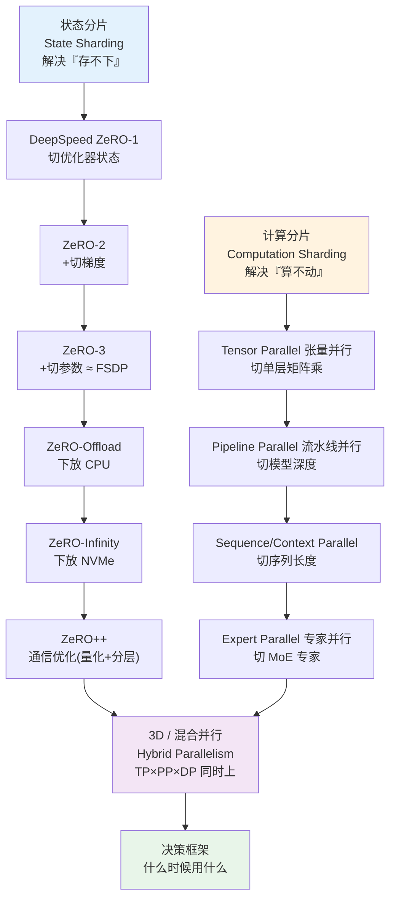

学完本章你能做到：

- 讲清 **ZeRO 三级 + Offload + Infinity + ZeRO++** 各自切了什么、代价是什么、什么时候用；
- 从第一性原理推出 **张量并行**为什么"列并行 + 行并行"配对只需一次 all-reduce；
- 理解 **流水线并行的气泡（bubble）**从哪来、1F1B / 交错式（VPP）怎么把它压小；
- 掌握 **序列并行 / 上下文并行（Ring Attention、DeepSpeed-Ulysses）** 如何驯服长上下文的激活内存；
- 搞懂 **专家并行**如何摊 MoE 的专家、all-to-all 通信与负载均衡；
- 会用 **两轴视角**搭 3D 混合并行，并按决策树选型（附 LLaMA-3 8B / GPT-3 175B / Mixtral 8x7B 真实配置）。

> 💡 **一句话总纲**：**状态分片管『住哪』（where the model lives），计算分片管『怎么算』（how the model computes）。两者正交，可以且应该叠加使用。**

---

## 1️⃣ 从状态分片到计算分片：为什么还不够？

### 🔬 第一性原理：分片的两个瓶颈

先把上一章的结论钉牢。作者原文说得很清楚：

> FSDP2's full sharding is functionally equivalent to DeepSpeed's ZeRO Stage 3：both eliminate memory redundancy by ensuring each GPU holds only 1/N of the training state.

FSDP2 的完全分片，**在功能上等价于** DeepSpeed 的 ZeRO-3——两者都通过"每张 GPU 只持有 1/N 的训练状态"消除**内存冗余**。

但作者紧接着点出状态分片的**天花板**：

> State sharding solves the memory problem, but it doesn't change **how computation happens**. Every GPU still executes the same operations on the same model architecture—just with different data batches.

**状态分片解决了内存问题，但没改变"计算怎么发生"**。每张 GPU 依然在同一套模型架构上跑同样的算子，只是喂的数据批次不同。对最大的模型（100B+），这就受限了：

1. **单层太大**：某一层的权重矩阵大到一张 GPU 算不高效；
2. **模型太深**：即便开了激活检查点（checkpointing），激活也塞不进显存。

用一个具体数字理解这个"墙"（作者在书里给的例子）：

| 模型规模 | 最大权重矩阵形状 | 参数量 | FP16 占用 | 单卡能否吃下 |
|---|---|---|---|---|
| **7B** | 4096 × 16384（MLP 首投影）| ~2.7 亿 | ~500 MB | ✅ 轻松 |
| **175B（假想）** | 12288 × 49152（MLP 首投影）| >6 亿 | ~1.2 GB | ⚠️ 单个矩阵就 1.2GB，激活同步膨胀 |

作者的关键论断：

> You can shard the storage as finely as you want, but **if the computation itself doesn't fit**, no amount of clever memory management will help.

**你可以把存储切得任意细，但如果计算本身放不下，再聪明的内存管理也救不了你。** 这正是 Megatron 要解决的失效模式——**不只切"模型住哪"，还要切"模型怎么算"**。

> 💡 **面试高频**：面试官问"FSDP/ZeRO 和 Megatron 是不是二选一？" 标准答案是**不是**——它们解决不同问题、在正交的轴上工作，是**互补**而非竞争。后面第 7 节会专门讲"为什么 FSDP2 替代不了 Megatron"。

### 📜 一段历史：Megatron 从哪来

Megatron-LM 出自 **NVIDIA 应用深度学习研究团队（2019）**，论文标题《Megatron-LM: Training Multi-Billion Parameter Language Models Using Model Parallelism》。当时 GPT-2（1.5B）已算"大"，社区刚开始探索如何突破单卡极限。NVIDIA 团队意识到：**光靠加卡做数据并行，解决不了"有些层单卡就是算不动"这个根本问题**。他们的解法就是把单个矩阵运算切开——**张量并行（tensor parallelism）**。原始论文演示了训练 **8.3B** 模型，在当时是空前的。此后，Megatron 的技术成了训练 GPT-3（175B）、Llama（405B）以及几乎所有前沿模型的基础设施。

---

## 2️⃣ DeepSpeed ZeRO 全家桶：状态分片的渐进式三级 🧊

在讲 Megatron 之前，作者先系统过一遍 **ZeRO 家族**——因为很多现存代码库仍在用它，且理解 ZeRO 各级能帮你建立"用通信换内存"的直觉。

> ZeRO = **Ze**ro **R**edundancy **O**ptimizer，零冗余优化器。核心思想：DDP 里每张卡都存一份完整副本，这份冗余（redundancy）就是要消灭的敌人。

### 📊 图解：DDP vs ZeRO-1/2/3 内存布局

书里的 Figure 5.1 用两个 rank（R0、R1）画出各方案的内存布局。每行是一张 GPU，三个色块表示存了什么：**P（参数，蓝）、G（梯度，红）、O（优化器状态，绿）**。

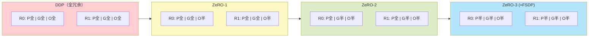

- **DDP**：所有块满宽——每张卡都存完整副本，这就是要消灭的冗余。
- **ZeRO-1**：P、G 仍复制，**只切 O**（优化器状态块变小）。
- **ZeRO-2**：**额外切 G**（G、O 都缩小）。
- **ZeRO-3**：**三样全切**——2 GPU 时每个块都只剩一半。

从左到右，每级 per-GPU 内存递减，代价是**需要更多通信来重建完整张量**。

### 🧮 内存账本：为什么优化器状态是大头？

先复习上一章的内存分解。对用 **Adam** 的混合精度训练：

| 组成 | 每参数字节数（典型） | 说明 |
|---|---|---|
| FP16 参数 | 2 | 前向/反向用 |
| FP16 梯度 | 2 | 反向产出 |
| **FP32 master 权重** | 4 | 混合精度保留的主副本 |
| **Adam 一阶动量 m** | 4 | FP32 |
| **Adam 二阶方差 v** | 4 | FP32 |

作者原文：

> for models using Adam, **optimizer states dominate memory usage**—each parameter requires storing momentum and variance as two FP32 copies, totaling **8 bytes per parameter**. A 7B parameter model needs **56GB** just for optimizer states. Mixed-precision training also keeps an FP32 master copy（another 4 bytes），so the full optimizer-side footprint is closer to **12 bytes**.

翻译要点：

- 光 Adam 的 m+v = 2 × FP32 = **8 bytes/param** → 7B 模型仅优化器状态就要 **56 GB**；
- 加上 FP32 master 权重（4 bytes），**优化器侧完整足迹 ≈ 12 bytes/param**（后面 70B 例子用这个口径）。

**优化器状态是内存大头**，这就是为什么 ZeRO 从它下手（Stage 1）。

### 🥇 ZeRO Stage 1：只切优化器状态

**是什么**：只把优化器状态（m、v、FP32 master）按参数切片分到各卡。参数、梯度仍全复制。

**为什么可行**（第一性原理）：

> since each GPU ultimately updates only its assigned portion of parameters, **why store the full optimizer states?**

每张 GPU 最终只负责更新**分给自己的那部分参数**，那它为什么要存**全量**优化器状态？前向、反向照常跑；梯度同步后，每张卡**只用本地那份优化器状态**去更新对应的参数分片。7B 的 56GB 优化器状态摊到 2 卡，每卡降到 **28GB**。

**怎么用**：DeepSpeed 不像 PyTorch 原生 DDP 那样"零配置"，而是用一个**配置字典（或 JSON 文件）**统管所有训练设置——优化器、精度、ZeRO 级别等。把 config 传给 `deepspeed.initialize()`，返回一个包装好的 **model engine**：

```python
import deepspeed

ds_config = {
    "train_batch_size": 32,
    "optimizer": {"type": "Adam", "params": {"lr": 1e-4}},
    "fp16": {"enabled": True},
    "zero_optimization": {"stage": 1}   # 启用 ZeRO-1
}

model_engine, optimizer, _, _ = deepspeed.initialize(
    model=model,
    model_parameters=model.parameters(),
    config=ds_config
)

# 训练循环用 model_engine 代替 model
for batch in dataloader:
    loss = model_engine(batch)
    model_engine.backward(loss)
    model_engine.step()
```

逐点讲解：

- **与 DDP 的关键区别**：DeepSpeed **从 config 里构建优化器**，而不是你外部 `torch.optim.Adam(...)` 那个——**外部优化器会被忽略**。`model_engine` 包住你的模型，提供 `backward()` 和 `step()`。
- `"fp16": {"enabled": True}`：例子用 FP16 是为了**可移植性**。⚠️ 但作者提醒：**Hopper 及更新的 GPU 上，BF16 往往是更好的默认**（动态范围更宽、无需 loss scaling）。

**运行命令**（体验 API）：

```bash
pip install deepspeed
# 单卡（熟悉 API）
deepspeed --num_gpus=1 code/zero_minimal.py --zero_stage 1
# 多卡（看到真实分片收益）
deepspeed --num_gpus=2 code/zero_minimal.py --zero_stage 1
```

单卡时分片几乎无效果（只有一个分区）；2 卡时每卡只存一半优化器状态，per-GPU 内存下降。

> 💡 **何时用 ZeRO-1**：模型本体能塞进显存，但**加上优化器状态就溢出**。它对训练循环改动最小、最好调试，是**从 DDP 迁移的第一站**。

### 🥈 ZeRO Stage 2：再切梯度

**是什么**：在 Stage 1 基础上，**把梯度也切了**。7B 模型的梯度（FP16）是 14GB，Stage 1 时它仍全复制在每张卡上；Stage 2 让梯度也只留自己那份。

**为什么可行**：

> gradients, like optimizer states, are **only needed for the parameters each GPU is responsible for updating.**

梯度和优化器状态一样，**只对各卡负责更新的那部分参数有用**。关键在通信原语的替换：

- Stage 1 反向用 **`all_reduce`**（每张卡都拿到完整的平均梯度）；
- Stage 2 反向用 **`reduce_scatter`**（每张卡只收到**分给自己的那片**平均梯度，其余立刻丢弃、腾出内存）。

2 卡时每卡持有：**全参数 + 半梯度 + 半优化器状态**。7B 模型梯度内存从 14GB → **7GB/卡**。

**怎么用**（多了 bucket size 参数控制梯度批量通信）：

```python
ds_config = {
    "train_batch_size": 32,
    "optimizer": {"type": "Adam", "params": {"lr": 1e-4}},
    "fp16": {"enabled": True},
    "zero_optimization": {
        "stage": 2,
        "allgather_bucket_size": 5e8,
        "reduce_bucket_size": 5e8
    }
}
```

> ⚠️ **常见坑 / 调优点**：`bucket_size` 是**梯度在通信前先攒多大再一起发**。桶越大，**摊薄每次集合通信的固定开销、通信效率越高**，但**吃更多内存**。默认 500M 元素对大多数场景够用。

> 💡 **何时用 ZeRO-2**：**梯度内存成为瓶颈**，但你仍想保留参数全复制以获得快速前向时。

### 🥉 ZeRO Stage 3：全分片（≈ FSDP）

**是什么**：Stage 2 还留着参数全复制（7B 的 14GB FP16 参数在每张卡上重复）。**Stage 3 把这最后一份冗余也消灭——参数也切**。至此三样（参数、梯度、优化器状态）全部分布。这**在功能上等价于 PyTorch FSDP**。

**内存对比**（7B 模型，2 GPU，作者原始数字）：

| 方案 | 参数 | 梯度 | 优化器状态 | **每卡合计** |
|---|---|---|---|---|
| **DDP** | 14GB | 14GB | 56GB | **84GB** |
| **ZeRO-3** | 7GB | 7GB | 28GB | **42GB** |

**代价是通信**。参数被切后，每层前向计算前要 **`all_gather`** 重建完整权重，用完立刻释放；反向同理，再加一次 **`reduce_scatter`** 收梯度。作者精确指出：

> This means **3× the model size in communication per iteration**（1× forward all-gather, 1× backward all-gather, 1× gradient reduce-scatter）.

**每次迭代的通信量 = 3× 模型大小**（前向 all-gather 1 次、反向 all-gather 1 次、梯度 reduce-scatter 1 次）。

**怎么用 + 如何缓解开销**：DeepSpeed 用**通信与计算重叠**来抵消——**当前层计算时，后台预取下一层的参数**：

```python
ds_config = {
    "train_batch_size": 32,
    "optimizer": {"type": "Adam", "params": {"lr": 1e-4}},
    "fp16": {"enabled": True},
    "zero_optimization": {
        "stage": 3,
        "overlap_comm": True,                 # 通信/计算重叠
        "contiguous_gradients": True,         # 梯度连续内存，利于 reduce-scatter
        "stage3_prefetch_bucket_size": 5e8,   # 预取桶大小
        "stage3_max_live_parameters": 1e9     # 同时"活着"的参数上限
    }
}
```

> 💡 **单节点 vs 多节点的性能差**：作者原话——**单节点有 NVLink 时，ZeRO-3 相比 ZeRO-2 的性能差距通常不大（10-20%）；跨多节点时 all-gather 成本涨、差距拉大。** 何时选 ZeRO-3：连复制的参数都塞不下，或你要极致内存效率、能容忍一些通信开销。

---

## 3️⃣ 越过显存墙：Offload 与 Infinity 🪜

ZeRO-3 把 GPU 显存压到极限后，如果还不够怎么办？答案是**用更慢但更大的存储层做后备**——这不是性能优化，而是**可行性方案（feasibility solution）**，让本来根本训不了的模型能训。

### 💾 ZeRO-Offload：把优化器状态下放 CPU

**场景**：即便 ZeRO-3，消费级硬件（如 24GB 的 RTX 4090）仍可能 OOM。

**做法**（作者原文）：

> keep forward and backward passes on the GPU where they're fast, but **offload the memory-hungry optimizer states to CPU RAM**.

**前向/反向留在 GPU（那里快），把吃内存的优化器状态挪到 CPU**。梯度算完经 PCIe 传到 CPU → **优化器 step 在 CPU 上跑** → 更新后的参数传回 GPU。DeepSpeed 让这些传输与计算重叠：**GPU 跑下一批前向时，CPU 同时在跑上一批的优化器 step**。

**代价**——瓶颈是 PCIe 带宽：

| 通道 | 带宽 |
|---|---|
| GPU HBM | ~2 TB/s |
| PCIe 4.0（GPU↔CPU）| ~32 GB/s |

作者：**预期吞吐下降 20-40%。**

```python
ds_config = {
    "train_batch_size": 32,
    "optimizer": {"type": "Adam", "params": {"lr": 1e-4}},
    "fp16": {"enabled": True},
    "zero_optimization": {
        "stage": 2,
        "offload_optimizer": {
            "device": "cpu",
            "pin_memory": True      # 页锁定内存，加快 CPU↔GPU 传输
        }
    }
}
```

运行后你会看到 GPU 内存保持很低（如 3.5GB）却能训 354M 模型——**优化器状态住在 CPU**。适合"VRAM 有限但系统 RAM 充裕"的消费级 GPU。

### 🗄️ ZeRO-Infinity：再加一层 NVMe

**场景**：CPU RAM 也有上限（工作站典型 256-512GB）。对真正巨大的模型（几千亿参数），CPU 内存也不够。ZeRO-Infinity 把 **NVMe SSD 当作又一层内存**。

书里 Figure 5.2 画出**三层内存金字塔**：

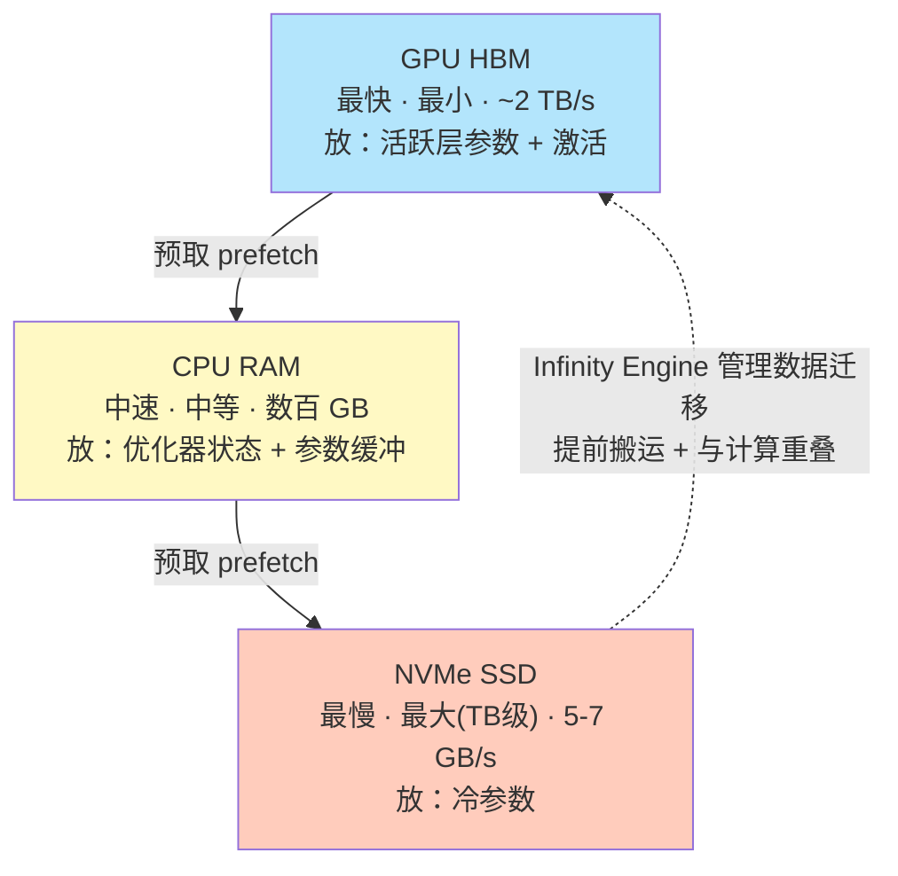

**Infinity Engine** 跨层管理数据搬运：**NVMe → CPU → GPU 提前预取**，与计算重叠。现代 NVMe（PCIe Gen4）顺序读 5-7 GB/s，虽比 CPU 内存带宽慢，但提供 **TB 级、低成本**容量。

```python
ds_config = {
    "train_batch_size": 32,
    "optimizer": {"type": "Adam", "params": {"lr": 1e-4}},
    "fp16": {"enabled": True},
    "zero_optimization": {
        "stage": 3,
        "offload_optimizer": {"device": "cpu", "pin_memory": True},
        "offload_param": {
            "device": "nvme",
            "nvme_path": "/local_nvme",   # 必须是挂载文件系统上的"目录"
            "buffer_count": 5,
            "buffer_size": 1e8
        }
    },
    "aio": {                  # 异步 I/O，用于把 NVMe 读写与计算重叠
        "block_size": 1048576,
        "queue_depth": 16,
        "thread_count": 2
    }
}
```

> ⚠️ **常见坑**（作者反复强调）：
> - `nvme_path` **必须是挂载文件系统上的目录**（如 `/home/$USER/nvme_offload`），**不是** raw 设备路径（`/dev/nvme0n1p7`）。
> - 需要 **libaio** 库做异步 I/O：`sudo apt install libaio-dev`。
> - 需要 **提高打开文件数上限**：`ulimit -n 65535`（NVMe offload 会开很多文件句柄）。
> - 磁盘要留 **模型大小的 2-4 倍**空闲空间（存优化器状态和参数缓冲）。

**代价递进**（越往下越慢）：

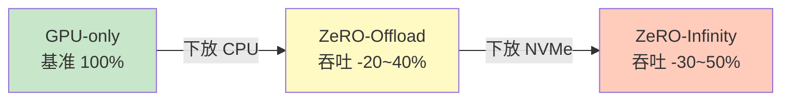

> 🔬 **本质**：Offload / Infinity 的价值**不是性能，是可行性**。它让你训练那些**本来根本塞不下**的模型。

### 🚄 ZeRO++：通信优化的 ZeRO

ZeRO-3 消除了内存冗余，但引入了**大量通信开销**。ZeRO++ 用三招互补技术缓解（命名沿用论文记号：**q** = quantized 量化，**hp** = hierarchical partitioning 分层划分，**Z** = ZeRO）：

| 技术 | 全名 | 做什么 | 收益 |
|---|---|---|---|
| **qwZ** | quantized weights 量化权重 | all-gather 时用 **INT8** 传参数，收到后反量化回 FP16 | 通信量 **2× 减少** |
| **hpZ** | hierarchical partitioning 分层划分 | **节点内复制参数、只跨节点分片** | 慢速 InfiniBand 流量骤减 |
| **qgZ** | quantized gradients 量化梯度 | reduce-scatter 时对梯度同样做 INT8 量化 | 梯度通信量减少 |

**qwZ 的一个关键正确性保证**（作者特别澄清）：

> INT8 applies only to parameters **in transit** during all-gather; **master weights used for the optimizer step remain in full precision**, so rounding error does not carry over between iterations.

INT8 **只作用于 all-gather 传输途中的参数**；**优化器 step 用的 master 权重仍是全精度**，所以量化的舍入误差**不会在迭代间累积**。

**hpZ 的第一性原理**——利用互连带宽的层级差异：

| 互连 | 带宽 |
|---|---|
| NVLink（节点内）| ~600 GB/s |
| InfiniBand（跨节点）| ~400 GB/s |

书里 Figure 5.3 对比 2 节点 × 2 GPU（共 4 卡）的场景：

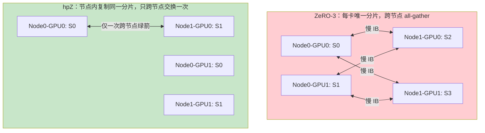

- **ZeRO-3（左）**：每卡持唯一分片 S0–S3，重建完整参数需 4 卡全 all-gather，**每张卡都要跨节点跟别人通信**（红箭头，走慢速 IB）。
- **hpZ（右）**：**节点内两卡持同一分片**（Node0 都是 S0，Node1 都是 S1），只需**节点间一次交换**（绿箭头）。节点内已有相同数据，复制部分无需节点内通信——**大幅削减慢速跨节点流量**。

```python
ds_config = {
    "train_batch_size": 32,
    "optimizer": {"type": "Adam", "params": {"lr": 1e-4}},
    "fp16": {"enabled": True},
    "zero_optimization": {
        "stage": 3,
        "zero_quantized_weights": True,      # qwZ
        "zero_hpz_partition_size": 2,        # hpZ（每节点 GPU 数）
        "zero_quantized_gradients": True     # qgZ
    }
}
```

> ⚠️ **两个坑**：
> 1. `zero_hpz_partition_size` **应等于集群每节点的 GPU 数**。
> 2. **ZeRO++ 要求 FP16**——量化特性反量化到 FP16，用 BF16 会触发 dtype 不匹配错误。
>
> 💡 **何时用 ZeRO++**：**大规模多节点训练、跨节点通信是瓶颈**时最值。单节点或小集群收益有限（节点内本来就快）。

---

## 4️⃣ Megatron：把"计算"当作第二根轴 ⚙️

至此，状态分片这条轴讲透了。它解决的是**内存冗余**问题。但**状态分片本身不足以支撑最大的模型**：当模型继续变大，出现第二个正交的限制——**计算本身大到单卡算不动**。这就是 Megatron 登场的地方。

### 🧩 张量并行（Tensor Parallelism, TP）：切开单层

**核心洞见**（第一性原理）：**矩阵乘法在某些维度上天然可并行**，我们可以借此同时分摊计算和内存。

考虑一个简单线性层 $Y = XW$：

#### 列并行（Column-Parallel Linear）

设 $W$ 形状 $d \times 4d$（MLP 首投影典型形状）。**按列切成两半**：$W = [\,W_0 \mid W_1\,]$。GPU 0 持 $W_0$、GPU 1 持 $W_1$。相同输入 $X$ 喂给两卡，各算自己那份：

$$Y_0 = XW_0, \qquad Y_1 = XW_1$$

完整输出 $Y = [\,Y_0 \mid Y_1\,]$——**只是逻辑上的拼接，无需通信**。

#### 行并行（Row-Parallel Linear）

问题：下一层期望**完整输入**，不是切开的。这就轮到行并行。若第二层权重**按行切**为 $W' = [\,W'_0 ; W'_1\,]$（竖直堆叠），每卡用本地那份输入算**部分结果**：

$$Y'_0 = Y_0 W'_0, \qquad Y'_1 = Y_1 W'_1$$

最终输出是两者之和：

$$Y' = Y'_0 + Y'_1 \quad\Longleftarrow\quad \textbf{一次 all-reduce}$$

书里 Figure 5.4 展示这个两步配对模式：

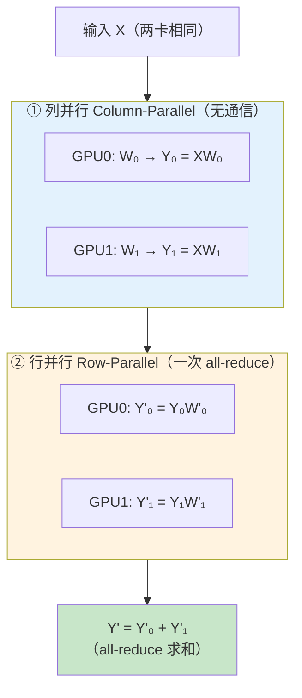

**为什么这样配对是精髓**（作者原文）：

> By pairing these two operations—column-parallel followed by row-parallel—**a complete MLP block requires only one all-reduce**. This is the key to Megatron's efficiency: communication is minimized to **a single synchronization point per layer**.

**列并行接行并行，一个完整 MLP 块只需一次 all-reduce**——通信被压缩到**每层一个同步点**，而非每个算子都同步。

#### 注意力同理

Q、K、V 投影矩阵**按列切**，每卡算**一部分注意力头**。由于**注意力头相互独立**，注意力计算本身**无需通信**。只有**输出投影用行并行**，需一次 all-reduce 合并结果。

#### ⚠️ TP 改变了通信模式（关键区别）

作者点出一个重要的微妙之处：

| | 状态分片（FSDP/ZeRO）| 张量并行（TP）|
|---|---|---|
| 通信**在哪** | **层与层之间**（before/after 一层）| **层内部**（每个 MLP / attention 块内）|
| 通信内容 | all-gather 参数 | all-reduce 部分结果 |
| 带宽敏感度 | 较低 | **极高** |

**结论**：TP 对互连带宽极其敏感。**实践中要把 TP 组放在同一节点内、走 NVLink（~600 GB/s），而非跨节点走 InfiniBand（~400 GB/s）。**

现代实现用 `--tp-comm-overlap` 把 all-reduce 与计算重叠——当前层的 all-reduce 在途中时，下一层计算已能开始，隐藏大部分延迟。

#### 序列并行是 TP 的自然延伸

开了 TP 后，**序列并行（sequence parallelism）**顺理成章。不把激活在所有 TP rank 上复制，而是**沿序列维切分激活**。这把激活内存**按 TP 度数成比例削减**——对长上下文训练（激活内存能压过模型内存本身）至关重要。

```bash
--tensor-model-parallel-size 2    # 2 路张量并行
--sequence-parallel               # 启用序列并行（配合 TP 推荐）
--tp-comm-overlap                 # TP 通信与计算重叠
```

想在底层看 TP，可跑纯 PyTorch 实现（从头实现列/行并行线性层，展示权重怎么切、all-reduce 怎么合并）：

```bash
torchrun --nproc_per_node=2 code/tensor_parallel_mlp.py
```

### 🌊 流水线并行（Pipeline Parallelism, PP）：切开深度

TP 切**单层的宽度**；PP 利用另一个维度——**模型的深度**。32 层 Transformer 不必每张卡都放全 32 层：**层 0–15 放 GPU 0，层 16–31 放 GPU 1**。

**直觉**：数据像水流过管道——GPU 0 处理前半段层，把中间激活传给 GPU 1 处理后半段。

**但有个坑——气泡（bubble）**：

> if we naively process one batch at a time, GPU 1 sits idle while GPU 0 is working, and vice versa. **This "pipeline bubble" can waste up to 50% of compute.**

朴素地一次处理一个批次，GPU 1 空转等 GPU 0，反之亦然——**这个"流水线气泡"最多浪费 50% 算力**。

**解法：微批（micro-batch）+ 1F1B 调度**。把批次拆成小微批，流水起来：GPU 1 处理微批 1 的层 16–31 时，GPU 0 已能开始微批 2 的层 0–15。足够多微批在途，各卡就能大部分时间忙碌。这叫 **1F1B（One Forward One Backward）**：每张卡在前向和反向间交替，维持所有 stage 都活跃的稳态。

书里 Figure 5.5 对比朴素 vs 1F1B：

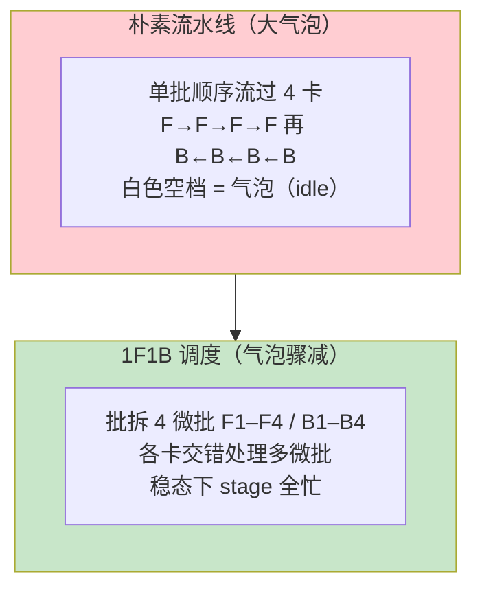

**Megatron 支持的几种调度**：

| 调度 | 特点 | 气泡 |
|---|---|---|
| **1F1B**（最常用）| 前向/反向交替，稳态全忙 | 中 |
| **GPipe** | 先跑完所有前向，再跑所有反向；更简单 | **大** |
| **交错式 / 虚拟流水线（VPP）** | 每卡分**多段非连续**层块 | **小**（代价：更多点对点通信）|

**虚拟流水线并行（VPP）值得单说**：不是"层 0–15 给 GPU 0、16–31 给 GPU 1"，而是**层 0–7 和 16–23 给 GPU 0，层 8–15 和 24–31 给 GPU 1**——每卡跑两个"虚拟 stage"。这种交错让微批更快地循环通过各 stage，**缩小气泡**，代价是**更多 stage 间点对点通信**。

```bash
--pipeline-model-parallel-size 4          # 4 个流水线 stage
--num-layers-per-virtual-pipeline-stage 2 # VPP：每虚拟 stage 2 层
```

> 💡 **黄金搭配法则**（作者核心结论）：
> - **TP 用在节点内**（NVLink 快，扛得住 TP 频繁的层内 all-reduce）；
> - **PP 用在跨节点**（PP 只需 stage 间**点对点传激活**，对慢速互连更宽容）。
>
> **"节点内 TP、跨节点 PP"** 是训 100B+ 模型的标准打法。

```bash
torchrun --nproc_per_node=2 code/pipeline_parallel_simple.py
```

---

## 5️⃣ 驯服长上下文：序列并行与上下文并行 📏

前面的并行都在解决**模型大小**。但还有一个维度日益重要——**序列长度**。现代模型训练用 8K、32K 甚至 128K 上下文窗口。这些长度下，**激活内存（前向存下、反向要用的中间值）能超过模型本身所需内存**。

**具体例子**：隐藏维 4096、处理 32K token 序列，每层激活形状 `(batch, 32K, 4096)`，32 层叠起来，**激活内存轻松到几十 GB/卡**。

### 序列并行 vs 上下文并行

| | 序列并行（Sequence Parallelism, SP）| 上下文并行（Context Parallelism, CP）|
|---|---|---|
| **切什么** | **仅** LayerNorm、Dropout 的激活 | **一切**：输入、所有中间激活、注意力计算本身 |
| **前提** | 需先开 TP | 独立技术 |
| **激进程度** | 温和、开销极小 | 更激进 |
| **典型收益** | 每卡只存 1/TP 的这些激活 | CP=2 时每卡只处理 4K/8K token |

**序列并行**：开了 TP 后，LayerNorm、Dropout 这类算子**不参与 TP 通信**——它们在**完整隐藏维**上本地操作。SP 把分片扩展到这些算子，**沿序列维切激活**。TP=4 时，SP 让每卡只存 **1/4** 序列的这些激活。通常与 TP 一起开，开销极小。

**上下文并行**：更狠——**沿序列维划分一切**。CP=2 处理 8K 序列时，每卡在整个前向和反向都**只处理 4K token**。

#### 🔗 CP 的核心难题与 Ring Attention

**挑战在注意力**：标准自注意力里，每个 token 的 query 必须 attend 到序列中**所有** key 和 value。如果 GPU 0 持 token 0–3999、GPU 1 持 token 4000–7999，GPU 0 上的 query 怎么 attend 到 GPU 1 上的 key？

**解法：Ring Attention（环形注意力）**——思想优雅：

> instead of gathering all KV pairs to every GPU（which would defeat the memory savings），**we pass KV chunks around in a ring.**

不把所有 KV 汇聚到每张卡（那就白省内存了），而是**让 KV 块在环上传递**：GPU 0 先对本地 KV 算注意力，然后把自己的 KV 发给 GPU 1、收下 GPU 1 的 KV，再对新 KV 块算注意力并**累积结果**。**转完一圈，每个 query 都见过每个 KV 对，但没有任何一张卡持有过完整序列。**

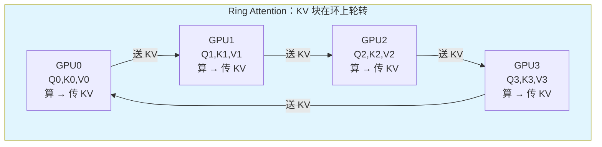

通信精心优化：**边算当前 KV 块的注意力，边传下一块 KV**（重叠）。配合 **GQA（Grouped-Query Attention，多个 query 头共享 KV 头）**，通信量进一步锐减。

**收益**（作者强调）：没有 CP 时，长序列训练常需**激活检查点**（反向时重算激活，约 +30% 开销）；有了 CP，**把激活内存摊到更多 GPU，就能完全省掉重算**。代价是通信，但长序列下**算/通比依然有利**。

书里 Figure 5.6 并排展示 SP（左，沿序列切 LayerNorm/Dropout 激活）和 CP（右，Ring Attention 让 K、V 环形轮转）。

```bash
--tensor-model-parallel-size 2
--context-parallel-size 4        # 32K 序列切到 4 卡 = 每卡 8K
--sequence-parallel              # 同时开序列并行
```

> 💡 **经验法则**：**序列长度超 8K token 且激活内存是瓶颈时用 CP**；更短序列，TP + SP 通常够了。

### 🔄 DeepSpeed-Ulysses：Ring Attention 的替代方案

Ring Attention 不是唯一解。DeepSpeed 提出 **DeepSpeed-Ulysses**，用**通信模式换简单性**。

**核心洞见**：与其在环上轮转 KV 块（还要小心跨块的 softmax 归一化簿记），不如**在注意力前把完整序列聚齐、算完再散回去**。

**工作原理——两次 all-to-all 做 2D 转置**：

- 注意力**前**，每卡持一个序列块，形状 `(batch, local_seq, num_heads, head_dim)`——**每卡有全部头、部分序列**。
- 一次 **all-to-all** 重组数据：变成**每卡有全部序列位置、部分头**，形状 `(batch, full_seq, local_heads, head_dim)`。
- 转置后，**每卡对自己那部分头跑标准自注意力**——没有部分分数、无需累积，就是普通注意力！
- 注意力**后**，再一次 all-to-all 逆转换，回到原划分。

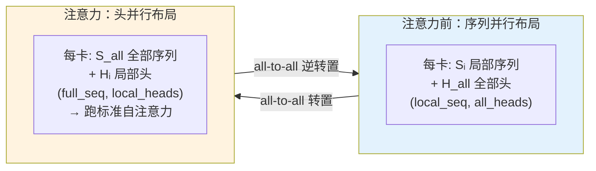

**Ulysses vs Ring Attention 的权衡**（通信量 vs 通信模式）：

| | Ring Attention | DeepSpeed-Ulysses |
|---|---|---|
| 通信 | KV 块绕环传 P 次（P 卡）| 两次 all-to-all（前后各一次）|
| 每次传输 | 与计算重叠 | 全体 GPU 同时参与 |
| **小并行度（P≤8）** | | ✅ **常胜**（NVLink 上 all-to-all 高度优化）|
| **大 P 或带宽受限** | ✅ **重叠通信更高效** | |
| softmax 处理 | 需跨块 partial softmax 簿记 | ❌ 无需，普通注意力 |

> 💡 **怎么选**：**已在 DeepSpeed 生态、要简单的中等并行度序列并行 → Ulysses**（与 ZeRO 等干净集成）；**冲超长序列（100K+）+ 大并行度 → Ring Attention**（通信重叠更省）。

```bash
torchrun --nproc_per_node=2 code/ulysses_demo.py
```

---

## 6️⃣ 专家并行（Expert Parallelism, EP）：给 MoE 摊专家 🧑‍🔬

**MoE（Mixture-of-Experts，混合专家）** 提供独特的扩展机会：不是把每层加宽，而是**加多个"专家"子网络，每个 token 只路由到其中一部分**。如 **Mixtral 8x7B** 每个 MoE 层有 8 个专家，但每个 token 只激活 2 个——**模型拥有更大网络的容量，同时保持 per-token 计算可控**。

**怎么把专家摊到 GPU？** 这就是 **专家并行（EP）**。思路自然：**8 个专家 8 张卡，一卡一专家**。token 要被专家 3 处理，就路由到 GPU 3，处理完送回。**通信模式是 all-to-all**：各卡的 token 可能去任意专家，结果再流回来源。

书里 Figure 5.8 画出这个分布模式：

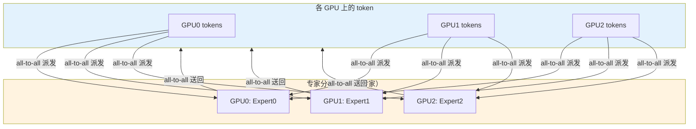

### ⚖️ 核心挑战：负载均衡

> If the router sends 80% of tokens to expert 0 and only 2% to expert 7, **GPU 0 is overloaded while GPU 7 sits idle.**

如果路由器把 80% token 送给专家 0、只 2% 给专家 7，**GPU 0 过载而 GPU 7 空转**。MoE 训练通常加一个**辅助损失（auxiliary loss）**，鼓励路由更均匀。Megatron 支持几种均衡策略：

| 策略 | 机制 |
|---|---|
| **aux_loss** 辅助损失 | 对不均衡路由加惩罚项 |
| **Sinkhorn** | 迭代归一化强制均衡 |
| **aux-loss-free** | 靠架构约束实现均衡，无需辅助损失 |

### 🧬 EP 与其他并行天然组合

大规模 MoE 训练可能：**EP=8 摊专家、PP=4 分流水线 stage、DP 跨节点数据并行**。非专家层（注意力、LayerNorm）可独立用 TP。这种灵活性对 DeepSeek-V3、Qwen-MoE（数百专家）这类模型必不可少。

**Mixtral 8x7B 配置示例**：

```bash
--num-experts 8
--expert-model-parallel-size 8   # 一卡一专家
--moe-router-topk 2              # 每 token 激活 2 个专家
--moe-router-load-balancing-type aux_loss
--moe-grouped-gemm               # 批量化专家计算
--pipeline-model-parallel-size 4
```

- `--moe-grouped-gemm`：当一张卡承载多个专家（EP < 专家数）时，**把跨专家的计算批成一次 grouped 矩阵乘**，显著提升 GPU 利用率。
- 超大专家数时，专用通信库如 **DeepEP**（DeepSeek 开源）用低延迟 GPU kernel 和高效跨节点传输优化 all-to-all token 派发。

```bash
torchrun --nproc_per_node=2 code/expert_parallel_demo.py
```

---

## 7️⃣ 为什么 FSDP2 替代不了 Megatron 🚫

作者用一整节澄清一个常见误解——**FSDP2（或 ZeRO）和 Megatron 可互换、按喜好二选一**。这误解了两个系统各自到底在做什么。

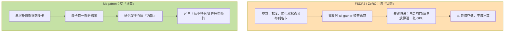

**决定性例子**（作者原文）：

> Consider a model where a single attention layer has a **16K × 16K** weight matrix. Even if you shard the parameters across 8 GPUs with FSDP2, when it's time to compute, **one GPU must gather the full matrix and perform the multiplication.** If that matrix doesn't fit in one GPU's memory, or if the computation is too slow on one GPU, **FSDP2 cannot help—it only shards storage, not compute.**

假设某注意力层有 16K × 16K 权重矩阵。即便你用 FSDP2 把参数切到 8 卡，**计算时仍需一张 GPU 聚齐完整矩阵做乘法**。若这矩阵单卡放不下、或单卡算太慢，**FSDP2 救不了——它只切存储，不切计算**。

而 **Megatron 的 TP** 把这 16K × 16K 矩阵切成 8 片、每卡持 16K × 2K 片，**并行计算、只通信结果，没有任何一张卡需要持有或计算完整矩阵**。

**结论**：

> FSDP2 and Megatron are **complementary, not competing**. The choice isn't "which one," but "**how to combine them**."

**FSDP2 和 Megatron 互补而非竞争。问题不是"用哪个"，而是"怎么组合"。**

---

## 8️⃣ 混合并行：把两根轴叠起来（3D 并行）🧊🧊🧊

既然状态分片和计算分片解决不同问题，**能不能都用？** 答案是能，这正是大规模训练系统在做的。

### 🎯 两轴视角（The Two-Axis View）

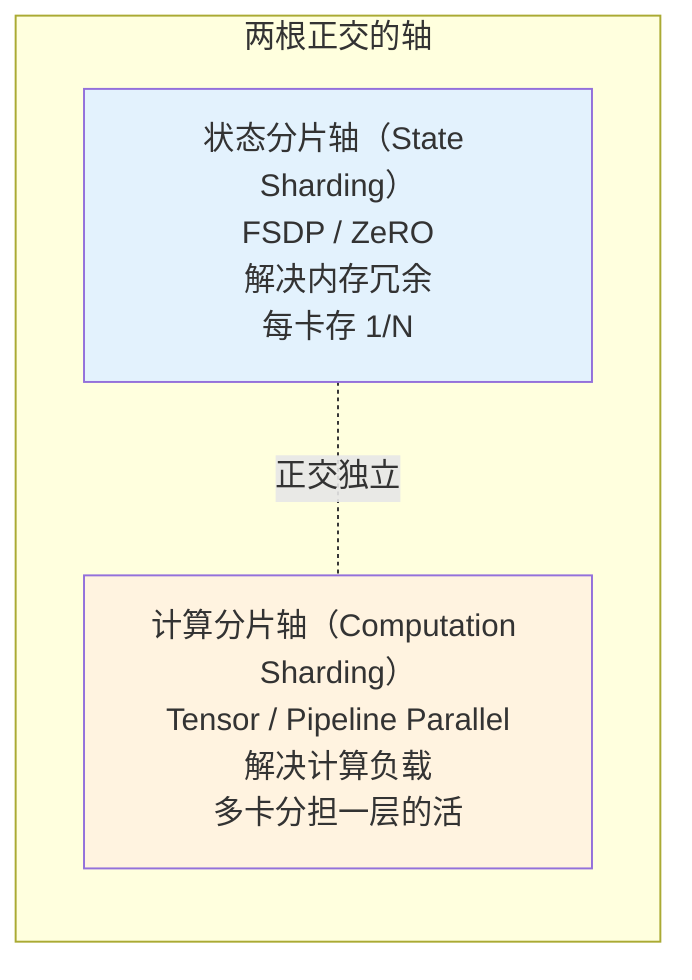

这两根轴**相互独立**，可任意组合：

| 组合 | 例子 |
|---|---|
| 只状态分片 | 7B 模型 + ZeRO-3 |
| 只计算分片 | 70B 模型 + TP=8 + 参数全复制 |
| **两者都要** | 405B 模型 + TP + PP + FSDP |

选哪种取决于**你撞到哪个瓶颈**。

### 🛠️ 搭一个混合配置：70B on 64 GPU（8 节点）

作者手把手走一遍：每节点 8 GPU（NVLink 互连），节点间 InfiniBand。

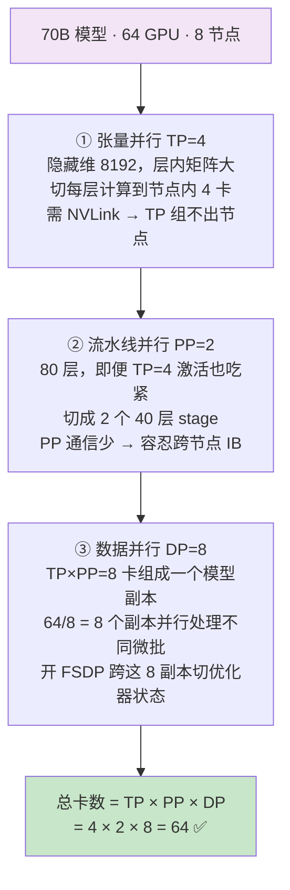

**从单卡视角看**：它存 **1/8** 的优化器状态（FSDP）、算每层的 **1/4**（TP）、负责模型深度的 **1/2**（PP）。

**为什么这样能行**（每招治不同的病）：

| 技术 | 治的病 | 代价 |
|---|---|---|
| **FSDP** | 消除 Adam 动量/方差的冗余存储 | all-gather / reduce-scatter |
| **TP** | 让单卡放不下/算太慢的矩阵乘可行 | 层内高频 all-reduce（需 NVLink）|
| **PP** | 限制同时活跃的层数、约束激活内存 | 流水线气泡 |

### 🧭 FSDP2 还是 ZeRO-3？

两者都能干净地和 Megatron 计算分片组合（正交轴）。选哪个看生态：

| | PyTorch FSDP2 | DeepSpeed ZeRO-3 |
|---|---|---|
| 生态 | 原生 PyTorch，紧密集成 `torch.compile` | 成熟优化生态 |
| 特色 | 纯 PyTorch 栈、无外部依赖 | **CPU / NVMe offload**（内存受限时）|
| 与 Megatron 组合 | 若已跑 Megatron Core，用 **Megatron 分布式优化器 / Megatron-FSDP** 更省事 | 需保证进程组严格不相交，较麻烦 |

> 💡 不想手工拼 Megatron + DeepSpeed 的团队，可评估**集成框架 Colossal-AI**——打包混合并行（DP+TP+PP）、ZeRO 式分片、**Gemini 异构内存管理**（GPU/CPU/NVMe，注意：**不是** Google 的 Gemini）。

---

## 9️⃣ 生产级工具：Megatron Core 与配套优化 🏭

前面都在概念层讲 Megatron 的并行策略。实践中怎么用？答案是 **Megatron Core**——从原始 Megatron-LM 研究代码库抽出、为生产打磨的库。

### 🧱 Megatron Core：现成的并行积木

你**不用自己实现列/行并行**，直接用库里的 `ColumnParallelLinear`、`RowParallelLinear`，通信自动处理。它提供 GPU 优化的构建块：内建 TP 的注意力层、理解流水线边界的 MLP 块、处理词表并行的 embedding 层。此外还带大规模训练所需的基础设施：

- **激活重算（activation recomputation）**：用算力换内存；
- **分布式检查点（distributed checkpointing）**：高效存/取分片模型状态，比朴素 PyTorch checkpoint **快达 50×**，且支持 **resharding**（64 卡存的 checkpoint 能在 128 卡加载）；
- **FP8 精度支持**（Hopper / Ada / Blackwell 优化）；
- **分布式优化器**：跨数据并行 rank 切优化器状态。

```bash
pip install --no-build-isolation megatron-core[mlm,dev] pybind11
# 或用 NVIDIA 容器（cuDNN、NCCL 预装）
docker run --gpus all -it nvcr.io/nvidia/pytorch:25.04-py3
```

> ⚠️ Megatron Core 需 Python 包 `pybind11` 和系统库 `cuDNN`、`NCCL`，先装好再用。

### 🚀 Megatron-FSDP：为 Megatron 量身的状态分片

PyTorch FSDP2 是通用方案，它**不懂** Megatron 的 TP 及其特定通信模式。**Megatron-FSDP** 是 NVIDIA 的实现，与 Megatron 其他并行维度无缝配合。NVIDIA 基准测试：**吞吐高约 15-25%、内存省约 23%**（vs PyTorch FSDP2）。

这些收益来自"FSDP 实现懂周边上下文"才可能的优化：更好的参数分桶、更聪明的缓冲管理、更激进的通信/计算重叠。**一个技术细节**：Megatron-FSDP 用 **NCCL 的 userbuffer 特性**减少通信占用的 GPU SM（流多处理器）——大规模训练中，花在通信上的 SM 就是不能算矩阵乘的 SM，这个优化**留更多 SM 给实际计算**。

```bash
--use-megatron-fsdp
--data-parallel-sharding-strategy optim_grads_params  # 等价 ZeRO-3
--overlap-grad-reduce
--overlap-param-gather
```

> 💡 **何时选 Megatron-FSDP**：已用 Megatron 的 TP/CP/EP、或要 Transformer Engine 的 FP8 训练 → Megatron-FSDP 集成自然、性能更好。想要纯 PyTorch 栈 + `torch.compile`、无外部依赖 → PyTorch FSDP2 更干净。

### 🧮 分布式优化器：省内存的优化

即便 TP/PP 处理了计算，**优化器状态仍是内存大头**（Adam 每参数 8 bytes 的 m+v；70B 模型优化器状态可超 500GB）。Megatron 的**分布式优化器**跨数据并行 rank 切优化器状态（概念上类似 ZeRO-1）：梯度 reduce-scatter → 本地更新自己那片 → 更新后参数 all-gather 回来。

**内存节省随数据并行度扩展**（作者给的精确公式表）：

| 精度配置 | 不用分布式 | 分布式（d 卡）|
|---|---|---|
| fp16 参数, fp16 梯度 | 20 bytes/param | **4 + 16/d** bytes/param |
| bf16 参数, fp32 梯度 | 18 bytes/param | **6 + 12/d** bytes/param |
| fp32 参数, fp32 梯度 | 16 bytes/param | **8 + 8/d** bytes/param |

以 8 路数据并行（bf16 参数 / fp32 梯度）为例：per-GPU 从 18 → **6 + 12/8 = 7.5** bytes/param，**2.4× 缩减**。

```bash
--use-distributed-optimizer
--overlap-grad-reduce      # 梯度 all-reduce 与反向重叠
--overlap-param-gather     # 参数 gather 与下次前向重叠
```

### 🎛️ FP8 训练：下一代精度

FP32 → FP16/BF16 带来了显著提速和省内存。NVIDIA 最新 GPU（Hopper/Ada/Blackwell）原生 **FP8** 再进一步——8 位浮点，**内存减半、吞吐比 FP16 翻倍**。

但 FP8 训练**不是改个 dtype 标志那么简单**。8 位浮点动态范围比 16 位窄得多，值必须**仔细缩放**避免上/下溢。Megatron 通过 **Transformer Engine** 处理：追踪张量的**最大绝对值（amax）**、动态调整缩放因子。

```bash
--fp8-format hybrid          # 前向 E4M3、反向 E5M2
--fp8-amax-history-len 1024  # 计算缩放时看多少个最近 amax
--fp8-amax-compute-algo max
--fp8-param-gather           # 用 FP8 gather 参数，省一半通信
```

- **hybrid 格式**：前向用 **E4M3**（4 指数位、3 尾数位），反向用 **E5M2**（5 指数位、2 尾数位）——范围与精度的平衡，实践效果好。
- `--fp8-param-gather` 配分布式优化器特别有用：以 FP8 gather 参数，all-gather 通信量减半。

> ⚠️ FP8 需硬件支持：**H100 / RTX 4090 或更新 GPU + Transformer Engine 1.1+**。有硬件的话，大矩阵乘常有 **1.5-2× over BF16** 的提速。

---

## 🔟 决策框架：什么时候用什么？🧭

技术这么多，怎么选？作者给了一套**增量式**决策逻辑——**从最简单的开始，只在需要时加复杂度**。

### 🌳 决策树（书里 Figure 5.9）

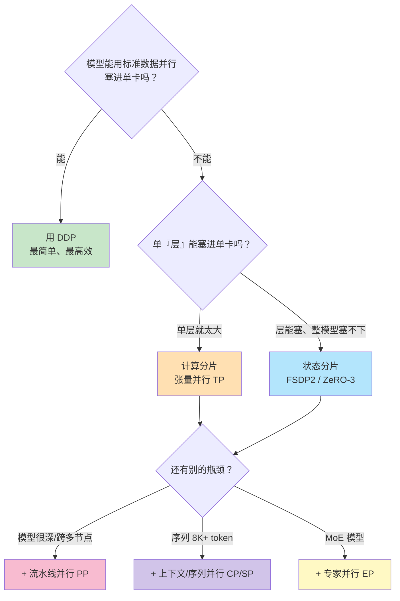

### 📋 何时需要 Megatron？四堵墙

如果**单层舒舒服服放进一张 GPU 且算得够快**，你**不需要** Megatron——状态分片管内存、数据并行管扩展。**多数 <10B 模型在现代 GPU 上属于这类**。Megatron 变得必要，是当你撞到以下之一：

| 墙 | 触发条件 | 对应技术 |
|---|---|---|
| **① 层太大** | 隐藏维 16K+，单层权重矩阵单卡放不下/算太慢 | **张量并行 TP** |
| **② 序列太长** | 8K+ token 上下文，激活内存爆炸 | **上下文/序列并行 CP/SP** |
| **③ MoE 模型** | 要摊数百专家 | **专家并行 EP** |
| **④ 规模太大** | 用数百 GPU，Megatron 优化的通信模式收益复利 | 组合并行 |

**若都不沾**（层塞得下、序列适中、非 MoE、就几张卡）——**状态分片一招足矣，更简单。**

### ⚖️ 各技术的权衡一览

| 技术 | 切什么 | 内存节省 | 通信开销 | 适用互连 |
|---|---|---|---|---|
| **DDP** | 什么都不切（全复制）| ❌ 无 | 最低 | 任意 |
| **ZeRO-1** | 优化器状态 | 约减半 | 极小 | 任意 |
| **ZeRO-2** | +梯度 | 更多 | 小 | 任意 |
| **ZeRO-3** | +参数（全切）| 近线性随卡数 | 每层前 all-gather | 单节点 NVLink 佳 |
| **TP 张量并行** | 单层计算（宽度）| 随 TP 度成比例 | **层内 all-reduce（高）** | **节点内 NVLink** |
| **PP 流水线并行** | 模型深度 | 按 stage 分激活 | 点对点（低）| **跨节点可** |
| **CP 上下文并行** | 序列 | 随 CP 度成比例 | KV 轮转/all-to-all | 节点内佳 |
| **EP 专家并行** | MoE 专家 | 随专家分布 | all-to-all | **节点内 NVLink** |

### 🧮 一个具体内存例子（70B + Adam，FP16）

作者用它把账算清：

| 组成 | 总量 |
|---|---|
| 参数（FP16）| 140 GB |
| 梯度（FP16）| 140 GB |
| 优化器状态（FP32 master + m + v）| 840 GB |
| **合计** | **>1 TB** |

| 方案（8 GPU）| 每卡存 |
|---|---|
| **DDP** | 全部 1TB+ |
| **ZeRO-1** | 140（参）+ 140（梯）+ 105（优化器 1/8）= **385 GB** |
| **ZeRO-3** | 约 **140 GB**（每样 1/8）|

**catch 仍是通信**：ZeRO-3 每层前 all-gather 参数、每层后 reduce-scatter 梯度。**层相对通信延迟小的模型，这开销显著；大模型每层计算量大，开销被摊薄，ZeRO-3 就好用。**

---

## 1️⃣1️⃣ 真实训练配置：三个实战范例 🎬

作者给了三个基于**真实 Megatron 训练脚本**的配置，帮你把知识落地。先克隆仓库：

```bash
git clone https://github.com/NVIDIA/Megatron-LM.git && cd Megatron-LM
# 文档在 docs/，按模型组织的示例在 examples/（llama/、gpt3/、mixtral/）
```

### 🦙 范例一：LLaMA-3 8B 长上下文（8 × 80GB GPU）

```bash
CUDA_DEVICE_MAX_CONNECTIONS=1 torchrun --nproc_per_node=8 pretrain_gpt.py \
    --use-mcore-models \
    --num-layers 32 \
    --hidden-size 4096 \
    --ffn-hidden-size 14336 \
    --num-attention-heads 32 \
    --group-query-attention \
    --num-query-groups 8 \
    --seq-length 8192 \
    --tensor-model-parallel-size 1 \
    --context-parallel-size 2 \
    --sequence-parallel \
    --fp8-format hybrid \
    --fp8-param-gather \
    --use-distributed-optimizer \
    --overlap-grad-reduce \
    --overlap-param-gather \
    --micro-batch-size 1 \
    --global-batch-size 128 \
    --max-position-embeddings 8192 \
    --mock-data \
    --bf16
```

逐点讲：

- **架构标志**定义 LLaMA-3 8B 结构。`--group-query-attention` + `--num-query-groups 8` 启用 **GQA**：32 个 query 头共享 8 个 KV 头，**显著省 KV cache 内存**。
- **并行选择**：**跳过 TP**（`--tensor-model-parallel-size 1`，因每层能塞进单卡），但用 **CP=2** 把 8K 序列切到 2 卡。
- **有效数据并行度** = 8 / (TP × PP × CP) = 8 / (1 × 1 × 2) = **4**（三因子是张量、流水线、上下文并行）。于是 `--global-batch-size 128` = 128 / 4 = **32 样本/数据并行副本**，除以 `--micro-batch-size 1` = **32 微批/梯度累积周期**。
- **FP8 标志**在 Hopper 及更新 GPU 上提速；**A100 上删掉它们**。40GB GPU 请调小 `--num-layers`、`--hidden-size`、`--ffn-hidden-size`。

### 🧠 范例二：GPT-3 175B 规模（128 GPU，16 节点）

```bash
CUDA_DEVICE_MAX_CONNECTIONS=1 torchrun --nproc_per_node=8 --nnodes=16 \
    pretrain_gpt.py \
    --use-mcore-models \
    --num-layers 96 \
    --hidden-size 12288 \
    --num-attention-heads 96 \
    --seq-length 2048 \
    --tensor-model-parallel-size 8 \
    --pipeline-model-parallel-size 16 \
    --micro-batch-size 1 \
    --global-batch-size 1536 \
    --use-distributed-optimizer \
    --mock-data \
    --bf16
```

逐点讲：

- 隐藏维 12288 的单层受益于 **TP=8**（节点内 8 卡切）。
- 96 层分到 **PP=16** 个流水线 stage，**每 stage 6 层**。
- **有效数据并行度** = 128 / (8 × 16) = **1**——**所有 GPU 全投入模型并行**。
- 大 `--global-batch-size 1536` 靠**跨众多微批的梯度累积**实现。

这正是**"节点内 TP、跨节点 PP"** 黄金搭配的教科书体现。

### 🧑‍🔬 范例三：Mixtral 8x7B MoE（64 GPU，8 节点）

```bash
CUDA_DEVICE_MAX_CONNECTIONS=1 torchrun --nproc_per_node=8 --nnodes=8 \
    pretrain_gpt.py \
    --use-mcore-models \
    --num-layers 32 \
    --hidden-size 4096 \
    --num-experts 8 \
    --expert-model-parallel-size 8 \
    --tensor-model-parallel-size 1 \
    --pipeline-model-parallel-size 4 \
    --moe-router-topk 2 \
    --moe-grouped-gemm \
    --moe-permute-fusion \
    --sequence-parallel \
    --use-distributed-optimizer \
    --overlap-grad-reduce \
    --overlap-param-gather \
    --micro-batch-size 1 \
    --global-batch-size 256 \
    --mock-data \
    --bf16
```

逐点讲：

- `--num-experts 8` 每 MoE 层建 8 专家，`--expert-model-parallel-size 8` **一卡一专家**；`--moe-router-topk 2` 每 token 路由到 2 专家。
- `--moe-grouped-gemm`、`--moe-permute-fusion` 批量化专家计算、融合 token 重排，提效。
- **PP=4** 分 32 层；**TP=1**——因为**专家并行已经分担了计算**。

> 💡 **对照三例看两轴**：LLaMA 靠 **CP**（长上下文），GPT-3 靠 **TP+PP**（超大稠密模型），Mixtral 靠 **EP+PP**（稀疏 MoE）——同一套原语，按瓶颈组装。

---

## 1️⃣2️⃣ 生产实战：调优与运维现实 🔧

### ⚡ 性能优化最佳实践

**最有效的是通信重叠（communication overlap）**。默认通信和计算串行（算→通信→再算）；开重叠后，通信在后台跑、下一段计算同时推进。

```bash
--overlap-grad-reduce          # 梯度 all-reduce 与反向重叠
--overlap-param-gather         # 参数 gather 与前向重叠
--tp-comm-overlap              # 张量并行 all-reduce 与计算重叠
```

**内存优化组合**：

```bash
--sequence-parallel            # 沿序列切 LayerNorm/Dropout 激活
--use-distributed-optimizer    # 跨数据并行 rank 切优化器状态
--recompute-activations        # 内存受限时：反向重算激活换内存
```

**拓扑放置原则**（按通信特性）：

| 技术 | 通信强度 | 放置 |
|---|---|---|
| TP、EP | 通信密集 | **节点内（NVLink 域）** |
| PP | 容忍高延迟 | 可跨节点 |
| CP | 长序列 | 节点内佳，必要时可跨节点 |

### 🧩 配置模式（生产总结）

| 场景 | 推荐 |
|---|---|
| 稠密 <10B | 常无需 TP：状态分片管内存、DP 管扩展 |
| 稠密 70B+ | TP 必要（TP=4 或 8，节点内）；更多卡加 PP |
| MoE（Mixtral 式）| **EP=8**（一卡一专家）替代专家层的 TP，加 PP 分深度 |
| 长序列 8K+ | **CP=2 或 CP=4**，可减半/减到 1/4 激活内存 |

### ⚠️ 运维现实（作者的诚实提醒）

混合并行带来运维复杂度，几个必须知道的坑：

1. **TP 组必须放在互连快的 GPU 上**——**把 TP 组跨节点会瘫痪性能**。
2. **PP 需调微批数**以最小化气泡开销。
3. **检查点变复杂**：**TP=4, PP=2 的 checkpoint 不能直接加载到 TP=8, PP=1**，需 resharding（重分片）。
4. **调试变难**：某个 bug 可能只在特定并行配置下出现，复现困难。

> 💡 **黄金准则**（作者反复强调）：**从满足需求的最简配置开始，逐维增量加并行。** 不要一上来就 3D 全开。

### 🎓 上手练习（书末 Exercises 精华）

作者给了 5 个动手练习，建议逐个做：

1. **对比 ZeRO 各级**：同一 7B 模型跑 Stage 1/2/3，测峰值显存、吞吐（tok/s）、通信开销，出对比表。
2. **实现 CPU offloading**：ZeRO-3 + CPU offload，测最大可训模型、吞吐 vs GPU-only、CPU 内存、PCIe 带宽利用率。
3. **实现张量并行**：从头写 `ColumnParallelLinear`（切输出特征）和 `RowParallelLinear`（切输入特征 + all-reduce），对标准线性层验证正确性。
4. **实现流水线并行**：拆模型成 N stage，写 1F1B 调度，测气泡开销，对比数据并行基线。
5. **配置 3D 混合并行**：给 8 GPU 设 DP=2, TP=2, PP=2，验证进程组：

```python
def setup_3d_parallelism(world_size, dp, tp, pp):
    assert dp * tp * pp == world_size
    rank = dist.get_rank()
    # 在 3D 网格中的位置
    dp_rank = rank // (tp * pp)      # 数据并行组：TP、PP 位置相同
    tp_rank = (rank // pp) % tp      # 张量并行组：DP、PP 位置相同
    pp_rank = rank % pp              # 流水线并行组：DP、TP 位置相同
    return dp_rank, tp_rank, pp_rank, ...
```

> 🔬 **本质**：3D 并行的进程组划分就是把线性 rank 编号**解释成 3 维网格坐标** `(dp_rank, tp_rank, pp_rank)`——同一维内、其余两维坐标相同的 rank 组成一个通信组。理解这套坐标映射，就理解了 Megatron 通信拓扑的骨架。

---

## 📌 小结

本章覆盖了**扩展模型训练超越单卡**的两条互补路径：

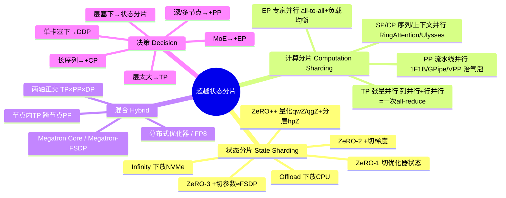

**十条核心 takeaway**：

1. **状态分片 vs 计算分片是正交两轴**——前者管"住哪"，后者管"怎么算"，可叠加，非二选一。
2. **ZeRO 三级渐进**：切优化器状态（1）→ +梯度（2）→ +参数（3，≈FSDP）；ZeRO-3 每迭代通信 = 3× 模型大小。
3. **优化器状态是内存大头**（Adam 8 bytes/param），所以 ZeRO 和分布式优化器都从它下手。
4. **Offload/Infinity 是可行性而非性能方案**：下放 CPU（-20~40%）、下放 NVMe（-30~50%），换来"能训"。
5. **张量并行的精髓**：列并行 + 行并行配对，一个 MLP 块只需**一次 all-reduce**；对带宽敏感，**必须放节点内 NVLink**。
6. **流水线并行治气泡**：微批 + 1F1B 是标配，VPP（虚拟流水线）进一步缩气泡；PP 只需点对点通信，**适合跨节点**。
7. **长上下文靠 SP/CP**：SP 切 LayerNorm/Dropout 激活；CP 用 **Ring Attention** 环形轮转 KV 或 **Ulysses** all-to-all 转置，序列 8K+ 时启用。
8. **MoE 靠专家并行**：一卡一专家、all-to-all 派发，核心难题是**负载均衡**（aux_loss / Sinkhorn / aux-loss-free）。
9. **FSDP2 替代不了 Megatron**：前者只切存储、算时仍需单卡聚齐完整矩阵；后者切计算本身，单卡从不持完整矩阵。
10. **决策增量式**：能塞单卡→DDP；层塞得下→状态分片；单层太大→加 TP；很深/多节点→加 PP；长序列→加 CP；MoE→加 EP。**从最简开始，按瓶颈逐维加。**

**黄金搭配再强调一次**：**节点内 TP（NVLink 快，扛层内 all-reduce）、跨节点 PP（点对点传激活，容忍慢互连）、FSDP/分布式优化器切优化器状态**——这就是训 100B+ 前沿模型的标准骨架。

> 训练只是故事的一半。训好模型后，你还要**高效地服务（serve）它**。本书接下来转向**分布式推理**：如何大规模运行大模型、扛高吞吐负载、把模型部署到生产。

---

## 🔗 延伸阅读

**DeepSpeed 与 ZeRO**：

- ZeRO 原论文《ZeRO: Memory Optimizations Toward Training Trillion Parameter Models》(2020) — [arxiv.org/abs/1910.02054](https://arxiv.org/abs/1910.02054)
- ZeRO-Offload《Democratizing Billion-Scale Model Training》(2021) — [arxiv.org/abs/2101.06840](https://arxiv.org/abs/2101.06840)
- ZeRO-Infinity《Breaking the GPU Memory Wall for Extreme Scale Deep Learning》(2021) — [arxiv.org/abs/2104.07857](https://arxiv.org/abs/2104.07857)
- ZeRO++《Extremely Efficient Collective Communication for Giant Model Training》(2023) — [arxiv.org/abs/2306.10209](https://arxiv.org/abs/2306.10209)
- DeepSpeed 文档 — [deepspeed.ai](https://www.deepspeed.ai/) ｜ GitHub — [github.com/microsoft/DeepSpeed](https://github.com/microsoft/DeepSpeed)

**Megatron-LM**：

- Megatron-LM 原论文《Training Multi-Billion Parameter Language Models Using Model Parallelism》(2019) — [arxiv.org/abs/1909.08053](https://arxiv.org/abs/1909.08053)
- 《Efficient Large-Scale Language Model Training on GPU Clusters Using Megatron-LM》(SC 2021) — [arxiv.org/abs/2104.04473](https://arxiv.org/abs/2104.04473)（交错式流水线来源）
- 《Reducing Activation Recomputation in Large Transformer Models》(MLSys 2023) — [arxiv.org/abs/2205.05198](https://arxiv.org/abs/2205.05198)（序列并行来源）
- Megatron-LM GitHub — [github.com/NVIDIA/Megatron-LM](https://github.com/NVIDIA/Megatron-LM) ｜ Megatron Core 文档 — [docs.nvidia.com/megatron-core](https://docs.nvidia.com/megatron-core/)

**长序列与专家并行**：

- 《GPipe: Efficient Training of Giant Neural Networks using Pipeline Parallelism》(NeurIPS 2019) — [arxiv.org/abs/1811.06965](https://arxiv.org/abs/1811.06965)
- 《Ring Attention with Blockwise Transformers for Near-Infinite Context》(ICLR 2024) — [arxiv.org/abs/2310.01889](https://arxiv.org/abs/2310.01889)
- 《DeepSpeed Ulysses: System Optimizations for Enabling Training of Extreme Long Sequence Transformer Models》(2023) — [arxiv.org/abs/2309.14509](https://arxiv.org/abs/2309.14509)
- DeepEP（DeepSeek 开源专家并行通信库）— [github.com/deepseek-ai/DeepEP](https://github.com/deepseek-ai/DeepEP)

**集成框架**：

- Colossal-AI — [colossalai.org](https://colossalai.org/)（混合并行 + ZeRO + Gemini 异构内存）
- NVIDIA NeMo — [docs.nvidia.com/nemo-framework](https://docs.nvidia.com/nemo-framework/)

**前沿研究（2024-2025）**：

- 《Arctic Long Sequence Training: Scalable Training for Multi-Million Token Sequences》(2025) — [arxiv.org/abs/2507.19845](https://arxiv.org/abs/2507.19845)
- 《SuperOffload: Large-Scale LLM Training on Superchips》(2025) — [arxiv.org/abs/2502.19811](https://arxiv.org/abs/2502.19811)
- 《Universal Checkpointing for Large-Scale Training》(2024) — [arxiv.org/abs/2503.15758](https://arxiv.org/abs/2503.15758)

> 🧭 **配套代码**（本章 `code/` 目录）：`zero_minimal.py`（ZeRO 各级）、`zero_offload_example.py`（CPU/NVMe offload）、`tensor_parallel_mlp.py`（TP 从头实现）、`pipeline_parallel_simple.py`（PP + 微批）、`sp_demo.py`（序列/上下文并行 + Ring Attention）、`ulysses_demo.py`（DeepSpeed-Ulysses）、`expert_parallel_demo.py`（EP）、`train_megatron_mcore.py`（完整 Megatron Core 训练）。**边读边跑，直觉最扎实。**
