# 第 6 章 分布式推理与 vLLM 🚀

> "Inference is the new web app."（推理就是新时代的 Web 应用）
> —— Clayton Coleman, Google 杰出工程师

> 本章对应原书 *Distributed AI Systems* 第 6 章（PDF 第 312–363 页）。前几章我们把大模型 **训练** 拆到多卡上（ZeRO / FSDP 做状态分片，Megatron 的张量并行/流水线并行做计算分片）。但训练只是硬币的一面 —— 模型训好后要把它 **服务（serve）** 给用户，而服务是一套完全不同的挑战。本章从第一性原理讲透 LLM 推理为什么难、KV 缓存为什么是核心矛盾、vLLM 的 PagedAttention 与连续批处理如何一招破局，最后把张量/数据/流水线/专家四种并行策略讲到"什么时候用哪个"。

---

## 🗺️ 本章地图

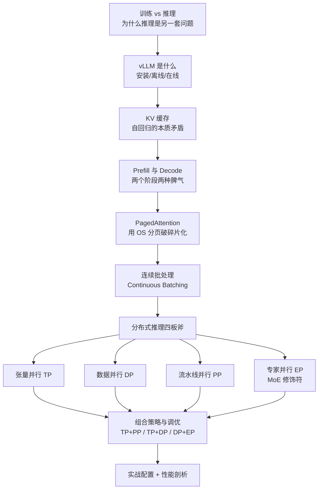

学完你能回答的核心问题：
1. 为什么说 LLM 推理的瓶颈**通常是内存而不是算力**？
2. KV 缓存把 decode 阶段的复杂度从 $O(T^3)$ 降到 $O(T^2)$，代价是什么？
3. PagedAttention 到底"paged"了什么？它一箭双雕解决了哪两个问题？
4. TP / DP / PP / EP 四种并行分别切什么、通信什么、什么场景选哪个？
5. 为什么加了张量并行反而"真正的动机"往往是给 KV 缓存腾地方？

---

## 6.1 从训练到推理：一枚硬币的另一面 🪙

很多人以为"会训练就会部署"，但训练和推理在优化目标、内存构成、请求模式上都截然不同。先把这张对比表刻进脑子里：

| 维度 | 训练 Training | 推理 Inference |
|---|---|---|
| **优化目标** | 吞吐（throughput）：每秒尽量多处理 token，摊薄到长时间训练 | 延迟 + 吞吐**同时**：用户要毫秒级响应，系统还要扛数千并发 |
| **批大小** | 固定 batch size | 变长请求，在不可预测的时刻到达 |
| **容错** | 可 checkpoint、可重启 | 必须**始终在线** |
| **内存大头** | 优化器状态（动量、方差）+ 激活检查点 | **模型权重 + KV 缓存**（无优化器状态） |
| **长序列时** | —— | KV 缓存可能**超过模型权重本身** |

> 🔬 **第一性原理：推理为什么"内存优先"？**
> 训练时反向传播要保留海量激活、优化器要存 momentum/variance，内存被这些吃掉。推理时**没有反向、没有优化器**，剩下的就是两块：一是固定不动的**模型权重**，二是随生成不断膨胀的 **KV 缓存**。对长上下文（100K+ token），KV 缓存能把权重比下去。所以"谁在吃显存"这个问题，训练答优化器，推理答 KV 缓存 —— 而 vLLM 的全部创新都围绕后者。

vLLM（**v**irtual **L**arge **L**anguage **M**odel）正是 2023 年 UC Berkeley 团队提出的推理引擎。它把两个东西做成了生产标准：**PagedAttention**（KV 缓存的分页管理）和 **continuous batching**（连续批处理）。今天它是 LLM 服务的事实标准，从初创公司到超大规模云厂商都在用。

---

## 6.2 vLLM 入门：装上、跑起来 🛠️

### 6.2.1 环境前提

- Linux + Python 3.10+
- NVIDIA GPU + CUDA（也支持 AMD 等，但 NVIDIA 是主流部署目标）
- 匹配的驱动版本（pip 包会自带 CUDA runtime，但**驱动必须匹配**）

### 6.2.2 三种安装法

**Docker（最快，免装依赖）**：

```bash
docker pull vllm/vllm-openai:latest   # 镜像约 8GB

docker run --runtime nvidia --gpus all \
  -v $HOME/.cache/huggingface:/root/.cache/huggingface --env "HF_TOKEN=$HF_TOKEN" \
  -p 8000:8000 --ipc=host vllm/vllm-openai:latest \
  facebook/opt-125m
```

逐行拆解这几个"魔法 flag"（面试常问 Docker 跑 GPU 推理的坑都在这）：

| Flag | 作用 | 坑点 |
|---|---|---|
| `--runtime nvidia --gpus all` | 开启 GPU 访问 | 指定单卡用 `--gpus '"device=0"'`，多卡 `--gpus '"device=0,1"'` |
| `-v ...huggingface:...` | 挂载本地 HF 缓存，避免重复下模型 | 容器默认 root，路径要对应；或用 `HF_HOME` 自定义 |
| `--ipc=host` | 让容器访问宿主共享内存 | **张量并行推理时 PyTorch 靠它做高效数据共享**，不加会报错 |
| 位置参数（模型名） | 镜像 tag 后跟模型名，再往后可追加 vLLM 引擎参数 | —— |

适合学习的小模型：

| HF 模型名 | 类型 | 参数量 |
|---|---|---|
| `facebook/opt-125m` | Base | 125M |
| `Qwen/Qwen2.5-0.5B-Instruct` | Chat/Instruct | 0.5B |
| `meta-llama/Llama-3.2-1B-Instruct` | Chat/Instruct | 1B |
| `microsoft/Phi-tiny-MoE-instruct` | MoE/Instruct | ~500M（激活） |
| `sentence-transformers/all-MiniLM-L6-v2` | Embedding | 22M |

**uv（官方推荐，比 pip 快且依赖解析更稳）**：

```bash
curl -LsSf https://astral.sh/uv/install.sh | sh
uv venv --python 3.12 --seed
source .venv/bin/activate
uv pip install vllm --torch-backend=auto   # auto 自动探测 CUDA 驱动版本选对应 PyTorch 索引
```

> ⚠️ **常见坑：CUDA/PyTorch 版本错配**
> 用纯 pip 装最容易踩"PyTorch 版本和 CUDA 不匹配"的坑，会报一堆看不懂的 runtime 错误。`--torch-backend=auto` 帮你自动选；要指定就写 `--torch-backend=cu126`（CUDA 12.6）。即使在 conda 环境里，作者也建议用 `uv` 来装 vLLM，因为它的依赖太复杂。

### 6.2.3 离线推理（Offline，脚本一把梭）

```python
from vllm import LLM, SamplingParams

# 1. 初始化模型
llm = LLM(model="facebook/opt-125m")

# 2. 定义提示词和采样参数
prompts = ["Hello, my name is", "The capital of France is"]
sampling_params = SamplingParams(temperature=0.8, top_p=0.95)

# 3. 生成
outputs = llm.generate(prompts, sampling_params)

# 4. 打印
for output in outputs:
    print(f"Prompt: {output.prompt!r}")
    print(f"Generated: {output.outputs[0].text!r}")
```

三步走：`LLM(model=...)` → `SamplingParams(...)` → `llm.generate(...)`。这就是整个 vLLM 编程模型的骨架。

### 6.2.4 在线推理（Online，起一个 OpenAI 兼容的服务）

```bash
vllm serve Qwen/Qwen2.5-0.5B-Instruct --port 8000
```

另开一个终端测：

```bash
# 列出模型
curl http://localhost:8000/v1/models

# 聊天补全（指令模型走 /v1/chat/completions，传 messages 列表带 role）
curl http://localhost:8000/v1/chat/completions \
  -H "Content-Type: application/json" \
  -d '{"model": "Qwen/Qwen2.5-0.5B-Instruct",
       "messages": [{"role": "user", "content": "Hello, how are you?"}]}'

# 文本补全（base 模型走 /v1/completions，传 prompt）
curl http://localhost:8000/v1/completions \
  -H "Content-Type: application/json" \
  -d '{"model": "facebook/opt-125m", "prompt": "The result of 1+1 is", "max_tokens": 3}'
```

vLLM 暴露的是 **OpenAI 兼容 REST API**：`/v1/completions`（base 模型）、`/v1/chat/completions`（chat 模型，传 `messages`）、`/v1/embeddings`（embedding 模型）、`/health`（健康检查）。这意味着你现有的 OpenAI SDK 代码几乎无缝迁移过来。

> ⚠️ **坑：`temperature=0` 不等于完全可复现**
> 设 `temperature=0` 是贪心采样（永远选最高概率 token），但 vLLM **默认不保证完全可复现**，因为调度和批处理会引入非确定性。要严格复现得设 `VLLM_ENABLE_V1_MULTIPROCESSING=0` 或开启 batch invariance（见 vLLM 复现文档）。这一点在做 A/B 对齐、回归测试时经常坑人。

---

## 6.3 KV 缓存：自回归的本质矛盾 🧩

要理解 vLLM 的所有创新，必须先理解 KV 缓存为什么存在。它源于 LLM 生成的**自回归（autoregressive）**本质：模型不是一次吐出整段输出，而是**一个 token 一个 token**地生成，每个新 token 都依赖它之前的所有 token。

### 6.3.1 Decoder-Only 架构与注意力

现代 LLM（GPT、LLaMA、Qwen……）都是 **decoder-only transformer**：一摞相同的层（7B 模型约 32 层，更大的 80+ 层），每层两个核心组件 —— 带因果掩码的**自注意力**子层 + **前馈网络（FFN）**，靠残差连接和层归一化串起来。

注意力用三个学习到的线性投影把输入变成 Query / Key / Value：

$$
Q_i = x_i W_Q,\quad K_i = x_i W_K,\quad V_i = x_i W_V
$$

- **Query（查询）**：我在找什么？
- **Key（键）**：我包含什么？
- **Value（值）**：我能提供什么信息？

注意力计算：

$$
\text{Attention}(Q,K,V) = \text{softmax}\!\left(\frac{QK^\top}{\sqrt{d_k}}\right)V
$$

逐项理解：$QK^\top$ 算所有 token 两两之间的相似度分数（每个历史 token 对当前 token 有多相关）；softmax 归一化成概率分布；再用它加权 Value 向量。$\sqrt{d_k}$ 缩放因子防止点积过大把 softmax 推进梯度消失区。

**因果掩码（causal mask）**：自回归生成时，预测第 $i$ 个 token 只能看 $0,1,\dots,i-1$，不能"偷看"还不存在的未来 token。实现上就是把未来位置的注意力分数在 softmax 前置为 $-\infty$。

> 💡 **面试高频：Pre-Norm vs Post-Norm**
> 原始 Transformer 是 "Add & Norm"（先残差再归一化，即 Post-Norm）。现代 LLM（GPT、LLaMA）几乎都改用 **Pre-Norm**（在进注意力/FFN 之前归一化），训练更稳定。另外现代模型的 FFN 常用 **SwiGLU**（~2.7× 扩展）而非传统的 4× MLP。

### 6.3.2 两个阶段：Prefill 与 Decode 🔀

文本生成分成两个**计算特性截然不同**的阶段。这是理解推理优化的分水岭。

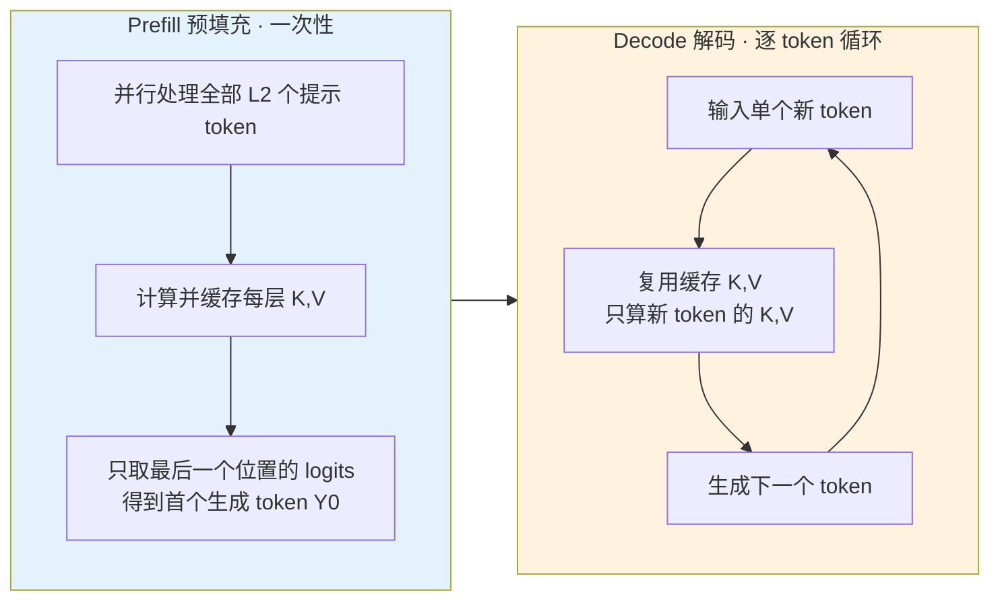

**Prefill（预填充）阶段**：把整个提示序列**并行**处理一遍，模型"读懂"输入。输入 $X_0$ 形状 $B \times L_2 \times D$，流过所有层，产出每个位置的 logits（$B \times L_2 \times V$），但我们**只关心最后一个位置**（$B \times 1 \times V$）—— 它给出第一个生成 token $Y_0$ 的概率分布。

关键：prefill 时要**计算并缓存所有提示 token、所有层的 K 和 V**。$N$ 层就缓存 $2N$ 个张量（每层一 K 一 V），这就是 KV 缓存的初始内容。

- **Prefill 是 compute-bound（算力受限）**：并行处理 $L_2$ 个 token，每层做 $O(L_2^2)$ 的注意力运算，算术强度高（compute/memory 比高），密集矩阵乘让 GPU 的 tensor core 忙起来，利用率高。类似训练的前向传播。

**Decode（解码）阶段**：prefill 完成后进入自回归循环 —— 生成 $Y_0$，把它喂回去生成 $Y_1$，直到 EOS 或达到最大长度。

- **Decode 是 memory-bound（内存受限）**：每步只处理**一个** token，矩阵乘退化成矩阵-向量运算，算术强度极低。大部分时间在**从 GPU 显存搬模型权重**，而不是算数。**这正是要把多个 decode 请求批在一起（连续批处理）的根本原因** —— 用一次权重加载服务多个请求，摊薄搬运成本。

### 6.3.3 没有 KV 缓存有多蠢？

假设提示 $X_0$ 是 "Time flies"，$Y_0$ 是 "like"。朴素做法：用 "like" 去查 "Time flies like" 预测下一个 "an"；再用 "an" 查 "Time flies like an" 得 "arrow"……**每一步都要为整个历史序列重算 K 和 V**，哪怕 $X_0$ 部分早在 prefill 就乘过 $W_K, W_V$ 了。

> 🔬 **复杂度的量级差 —— 这道账要算清楚**
>
> | | 无 KV 缓存 | 有 KV 缓存 |
> |---|---|---|
> | Prefill | $O(L_2^2 \cdot D)$（一次性） | 同左，一次性 |
> | Decode 每 token | $O(L_{total}^2 \cdot D)$ | $O(L_{total} \cdot D)$ |
> | 生成 $T$ 个 token 总计 | $O(T \cdot L_{total}^2 \cdot D)$，当 $L_t \gg L_2$ 时 $\approx O(T^3 D)$ | $O(T \cdot L_{total} \cdot D) \approx O(T^2 D)$ |
>
> **核心改进**：把 decode 阶段对序列长度的**平方依赖降成线性**，让长序列生成变得可行。有了缓存，每步只需为新 token 计算 $K_{new}$（形状 $B \times 1 \times D_{qk}$），再和缓存的历史 K/V 做注意力即可。

**代价**：KV 缓存要 $O(L_{total} \cdot D)$ 的内存来存所有历史 K、V 向量 —— **省了算力，花了内存**。这个 trade-off 是理解后续一切的关键：内存成了新瓶颈。

### 6.3.4 两阶段张量形状速查表

| 阶段 | 张量 | 形状 | 说明 |
|---|---|---|---|
| **Prefill** | 输入 $X_{prompt}$ | $B \times L_2 \times D$ | 提示序列，全部 token 并行 |
| | 缓存 K, V | $B \times L_2 \times D_{qk/v}$ | 供复用 |
| **Decode** | 输入 $x_t$ | $B \times 1 \times D$ | 单个新 token |
| | $Q_t = x_t W_Q$ | $B \times 1 \times D_{qk}$ | 新 token 的 query |
| | $K_{cached}$ | $B \times (L_2+t) \times D_{qk}$ | 所有历史 key |
| | $V_{cached}$ | $B \times (L_2+t) \times D_v$ | 所有历史 value |
| | 注意力分数 | $B \times 1 \times (L_2+t)$ | 新 token 关注所有历史 |
| | 输出 $Z_t$ | $B \times 1 \times D$ | 单个生成 token |

记号约定：$B$ 批大小，$L_2$ key/value 序列长度，$D$ 隐藏维度，$H$ 注意力头数，$D_{qk}$ query/key 向量维度，$D_v$ value 维度且 $D = D_v \times H$。

---

## 6.4 PagedAttention：用操作系统的智慧治碎片 🧠

KV 缓存解决了算力浪费，却带来一个生产级难题：**内存碎片化（fragmentation）**。vLLM 的破局之招 **PagedAttention** 灵感直接来自操作系统的**虚拟内存分页**。

### 6.4.1 碎片化问题：为什么传统分配这么浪费？

生产环境要同时服务多个并发请求，每个请求的 KV 缓存随生成**动态增长**，不同提示、不同生成长度导致缓存大小千差万别。传统系统给每个请求分配**连续内存块** —— 这从训练框架借来的思路，用在推理上水土不服。

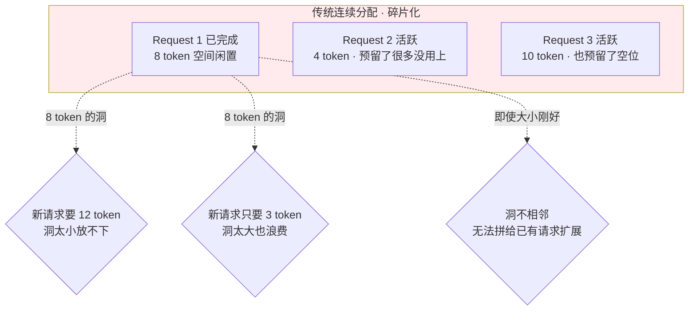

**图 6.7 的故事**：Request 1 生成 8 个 token 后完成，它的内存现在闲着 —— 但为什么不能复用？

1. Request 2、3 各自要求 KV 缓存存在**连续内存**里才能高效算注意力；
2. Request 1 释放的 8-token 块，对需要 12 token 的新请求太小，对只要 3 token 的又太大；
3. 即使大小刚好，这块空闲区若**不与某个活跃请求的缓存相邻**，也没法扩展那个请求的序列；
4. 与此同时，Request 2、3 又为它们**可能永远生成不到**的 token 预留着空间。

> 📊 **触目惊心的数字**：在高并发服务里，这些浪费加起来可达 GPU 显存的 **60–80%**（PagedAttention 论文报告的范围）。等于你买的 H100 有大半显存在空转。

### 6.4.2 第二个隐形杀手：Padding FLOPs 浪费

除了内存浪费，传统批处理还有个不那么显眼但同样致命的低效：**填充（padding）导致的注意力算力浪费**。

批处理 decode 时，同一个 batch 里不同请求的有效上下文长度不同。要批在一起，传统注意力实现必须把所有序列**填充到统一的最大长度**：

$$
(L_2 + t)_{max} = \max_i \left(L_2^{(i)} + t^{(i)}\right)
$$

于是缓存的 K、V 都被 pad 到这个最大长度。虽然掩码会阻止 padding 位置影响输出，但**涉及 padding token 的点积仍然被完整计算了**。当 batch 内上下文长度差异大时，大量注意力 FLOPs 白白花在没有语义的 token 上。

### 6.4.3 PagedAttention 怎么做：固定块 + 块表

核心洞察：**连续分配必然碎片化，唯一可行的是把 KV 缓存切成可独立分配/释放的固定大小块。**

- PagedAttention 把 KV 缓存切成**固定大小块**，通常每块 **16 个 token**（记作 $B_{size}$），就像 OS 虚拟内存里的**内存页**。
- 每块存一段连续 token 的 K、V，形状 $Block \in \mathbb{R}^{B_{size} \times D_{qk/v}}$。
- 请求 $i$ 需要 $N_i = \lceil (L_2^{(i)} + t^{(i)}) / B_{size} \rceil$ 个块。
- 每个请求维护一张**块表（block table）**，把**逻辑序列位置 → 物理块地址**，正如 OS 的**页表**。

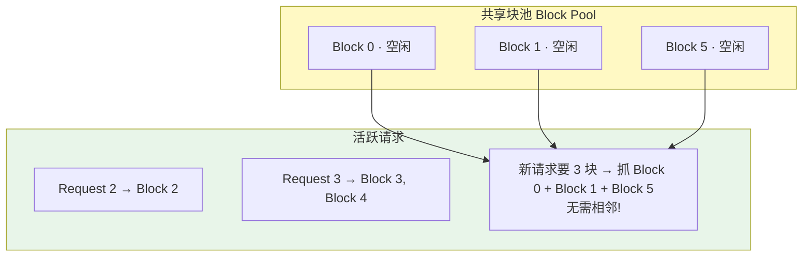

**图 6.8 的机制**：块池在顶部持有所有可用块。Request 1 完成后，它的块（Block 0、1）**立刻归还块池**，标记为空闲。Request 2 用 Block 2，Request 3 用 Block 3、4。和连续分配不同，Request 1 一完成，它的块**立刻对任意大小的新请求可用**。需要 3 块的新请求可以抓 Block 0、1、5，**根本不要求相邻**。

结果：碎片化被消灭，接近 **100% 内存利用率**。

### 6.4.4 消灭 Padding FLOPs：不是额外优化，是块设计的必然

一旦有了块，注意力计算的**迭代语义就根本变了** —— 这是块设计的直接结果，不是额外加的优化。

注意力不再假设 KV 缓存是从位置 1 到 $(L_2+t)_{max}$ 的连续序列，而是**遍历块表**；不存在的 token 根本没有对应的块。decode 时请求 $i$ 的注意力只遍历它块表里列出的块（记 $B_i$ 为请求 $i$ 拥有的块集合），这个计算**只依赖 $(L_2^{(i)} + t^{(i)})$，与 batch 内最大长度无关**。

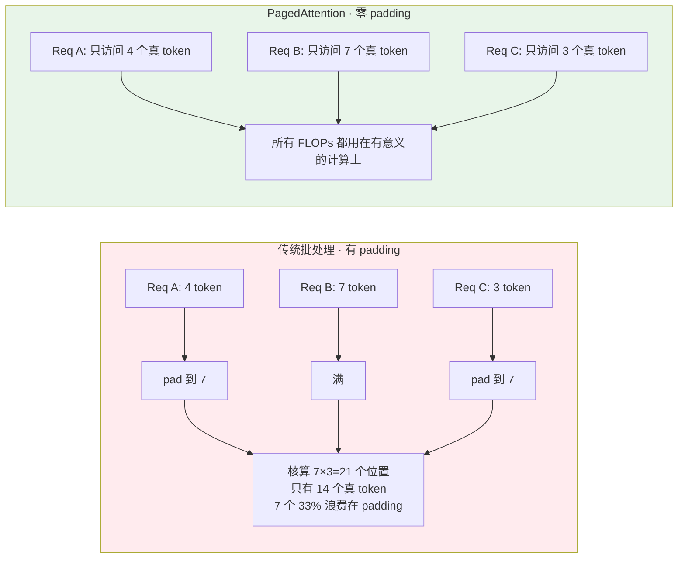

**图 6.9 对比**：传统批处理里 3 个长度 4/7/3 的请求都要 pad 到 7，注意力核在 $7 \times 3 = 21$ 个位置上计算，只有 14 个是真 token，**7 个（33%）浪费在 padding**。PagedAttention 里每个请求只访问自己的真实 token，**padding 从不参与计算** —— 注意力核压根不为 padding 位置发起点积。每个请求的注意力 FLOPs 正比于**真实上下文长度**，而非 batch 最大长度。

> 🔬 **核心论证：一石二鸟，两面同源**
> vLLM 的性能提升来自两个效果协同：
> 1. **碎片化削减** → 同样显存能同时服务更多并发请求；
> 2. **零 padding FLOPs** → 提高 decode 注意力的有效算力利用率。
>
> 这两者是**同一个块设计决策的两面**。和 OS 页管理（关注地址映射与访问正确性）不同，PagedAttention 是为**高效注意力计算**而优化的：自定义 CUDA 核从非连续块读 KV，同时维持**合并访存（coalesced memory access）**模式，保证 GPU 高利用率。

### 6.4.5 收益清单

| 收益 | 具体表现 |
|---|---|
| **内存效率** | 消除变长序列碎片浪费，接近 100% 利用率 |
| **并发能力** | 同样显存下服务 **2–4×** 并发请求 |
| **零 padding 开销** | 完全消除 padding FLOPs，显著提升真实场景吞吐 |
| **灵活批处理** | 不同长度请求无需 padding 即可高效批处理，支持每步动态改变 batch 组成 |
| **长上下文** | 按需分配块，100K+ token 的超长序列也能服务，无需预分配最大内存 |
| **高并发** | 天生为高频请求到达/完成的 high-churn 工作负载设计 |

---

## 6.5 连续批处理（Continuous Batching）⚙️

PagedAttention 是**内存侧**的创新，连续批处理是**调度侧**的创新，两者是绝配。

传统"静态批处理"必须等一个 batch 里**所有序列都生成完**才能处理下一批 —— 但请求们长度天差地别，短的早早生成完却要干等最慢的那个，GPU 大量空转。

**连续批处理**（源自 Orca 论文的做法）：在**同一个 batch 内**动态地**接纳新到达的请求、退休已完成的请求**，而不是等所有序列结束。批的组成**每一步都在变**，GPU 利用率最大化。

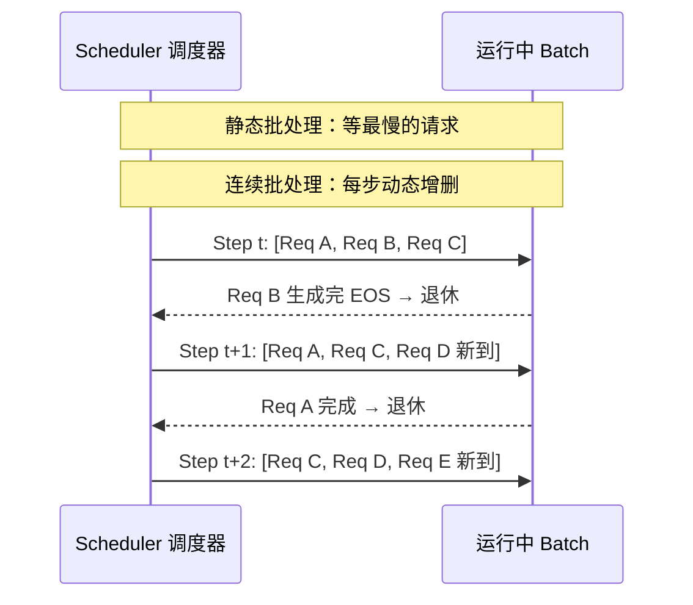

这正是 vLLM 调度器实现的核心。它和 PagedAttention 天然协同：请求一完成，块立刻归还块池，新请求马上能补进 batch 用上这些块 —— **调度的灵活性由内存的灵活性支撑**。

> 💡 **实战：为什么 decode 阶段格外依赖连续批处理？**
> 回忆 6.3.2：decode 是 memory-bound，瓶颈在搬权重。一次权重加载只服务一个请求太亏了。连续批处理把尽可能多的活跃 decode 请求塞进同一步，**一次搬权重、服务一大批**，把内存带宽摊薄到多个请求上。batch 越满，decode 效率越高。

---

## 6.6 分布式推理：当一张卡装不下 🌐

PagedAttention 解决了**单卡内**的内存效率。但当模型本身超过单卡容量，或吞吐要求超过单卡能力时，就得上多卡分布式推理。

### 6.6.1 动机：Out-of-Memory 问题

模型大小的残酷现实：

| 模型 | 参数量 | FP16 权重内存 | 需要几张 H100(80GB) |
|---|---|---|---|
| LLaMA 3.1 405B | 405B | 810GB（2 字节/参数） | ~10 张 |
| DeepSeek R1 | 671B | 更大 | 更多 |

**量化能救吗？** FP8 减半 → 405B 需 405GB（还是 5 张 H100）；INT4 → ~200GB，但引入精度损失，不是所有场景可接受。而且这还**没算 KV 缓存**，长上下文时它能超过权重本身。

**更可扩展的解法：把模型分布到多张 GPU。** vLLM 提供三大基础策略 + 一个 MoE 修饰符。

### 6.6.2 vLLM 架构：Scheduler–Executor–Worker

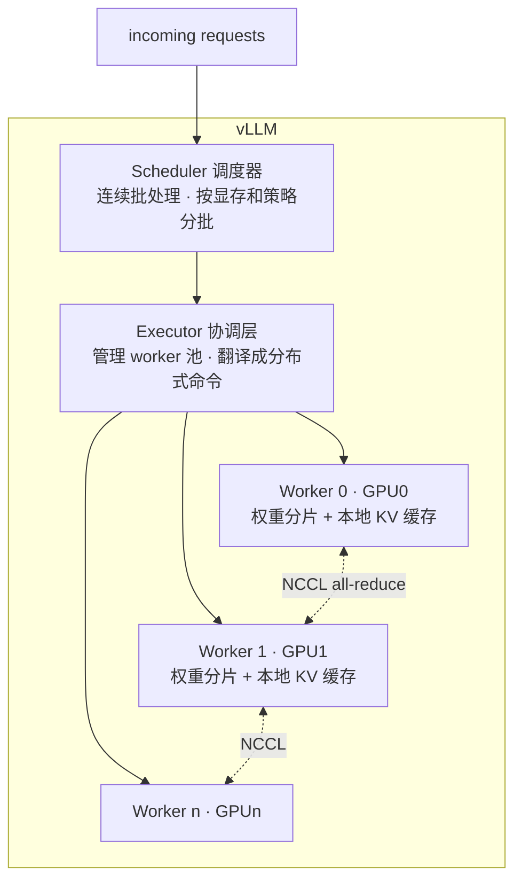

- **Scheduler（调度器）**：接请求 → 按可用显存和调度策略分批 → 决定每次迭代处理哪些请求。它实现**连续批处理**（Orca 风格）。
- **Executor（执行器）**：调度器和算力资源之间的**协调层**，管 worker 池，把高层调度决策翻译成分布式命令，广播给所有 worker 并收集结果。三种后端：单卡 executor（小模型）、多进程 executor（单节点多卡）、**Ray executor（跨节点分布式）**。
- **Worker（工作单元）**：每个绑一张 GPU，持有模型权重的一个分片，管本地 KV 缓存，跑真正的前向。张量并行时 worker 之间通过 **NCCL** 做 all-reduce 等集合通信。所有 worker 跑同样的代码，只是数据/分片不同。

这套分层设计让 vLLM 从单卡扩展到几百张卡跨节点，**编程模型不变**。

### 6.6.3 四种并行策略总览

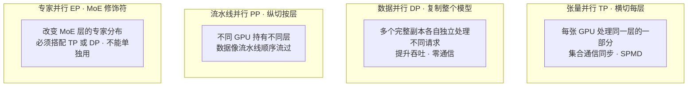

| 策略 | 切什么 | 通信 | 主要收益 | 主要代价 |
|---|---|---|---|---|
| **TP** | 每层横向切（权重矩阵） | 每层 all-reduce（高频，节点内） | 装大模型、降延迟、腾 KV 缓存 | 每层通信开销 |
| **DP** | 复制整个模型 | 推理时**零通信** | 吞吐线性扩展、天然容错 | 每副本存完整权重，内存低效 |
| **PP** | 纵向按层切 | 仅在阶段边界（低频，跨节点） | 支持多节点、装超大模型 | 流水线气泡 |
| **EP** | MoE 专家分布（修饰符） | all-reduce 或 all-to-all | 分布专家、省内存带宽 | 需额外依赖、超稀疏时反而变慢 |

---

## 6.7 张量并行（Tensor Parallelism, TP）✂️

TP 把模型权重**横向切**到单节点内的多张 GPU，让所有 GPU **同时**算同一层（对比 PP 是不同 GPU 顺序算不同层）。遵循 **SPMD**（Single Program, Multiple Data）范式。

### 6.7.1 线性代数基础：列并行与行并行

**列并行（Column Parallelism）**：把权重矩阵按**列**切。$Y = X \times A$，把 $A$ 切成列块 $[A_1 \mid A_2]$，则 $Y = [X A_1 \mid X A_2]$。每张 GPU 独立算一块，重组时用 **all-gather** 拼接。

**行并行（Row Parallelism）**：把输入 $X$ 和权重 $A$ 都按**行**切，$X = [X_1; X_2]$，$A = [A_1; A_2]$，则 $Y = X_1 A_1 + X_2 A_2$。每张 GPU 算一个部分和，用 **all-reduce** 求和。

> 🔬 **核心论证：链式组合把通信降到每层一次**
> 巧妙之处在于把两种模式**串联**以最小化通信。Transformer 的 MLP 是"上投影 → 激活 → 下投影"：
> - 对**上投影用列并行** → 输出天然按 GPU 分片；
> - 激活是**逐元素**的 → 无需通信；
> - 分片结果直接喂给**行并行的下投影**。
> 
> 于是整个 MLP **只需末尾一次 all-reduce**，中间不用 all-gather。注意力同理：Q/K/V 投影列并行（每 GPU 管一部分注意力头），输出投影行并行，每个注意力层也只要**一次 all-reduce**。

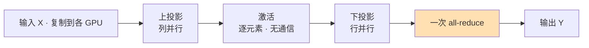

### 6.7.2 TP 的收益：不只是"装得下"

1. **内存削减**：每张 GPU 只存一部分权重。140B 模型装不进单卡，TP=2 后每卡约 70B。
2. **给 KV 缓存腾地方（往往才是真正动机！）**：假设 140B 模型在 141GB 的 H200 上加载后只剩 ~20GB 给 KV 缓存；TP=2 后每卡只放一半权重，**腾出约 ~70GB 给 KV 缓存**。即使模型技术上能塞进更少的卡，为了 KV 缓存容量也值得上 TP。
3. **降延迟（等效放大内存带宽）**：decode 阶段 memory-bound，卡在从 HBM 搬权重。TP=2 时**同时从两张 GPU 的 HBM 加载**，等效带宽翻倍。

### 6.7.3 代价与约束

**通信开销**：每层都要一次 all-reduce，传输量 $= \text{batch\_size} \times \text{sequence\_length} \times \text{hidden\_size}$。

| 互联 | 带宽 | 后果 |
|---|---|---|
| NVLink | 600+ GB/s | 开销可控 |
| 仅 PCIe | 32 GB/s | **prefill 密集负载下通信可能吃掉 60%+ 时间** |

> ⚠️ **约束：注意力头数必须能整除 TP size**
> 注意力头数（以及 GQA/MQA 里的 KV 头数）必须能被 TP size 整除。若模型 32 头你却想 TP=6，就得 padding 或换 TP size（否则 vLLM 可能内部复制 KV 头）。现代模型多用 2 的幂次头数，正是为了灵活配 TP。

**何时用 TP**：模型装不下单卡 **且有好的互联（NVLink）**；延迟敏感、希望所有 GPU 都参与每个请求。PCIe-only 系统上做 prefill 密集负载要谨慎 —— 先 profile 通信/计算比再决定。

---

## 6.8 数据并行（Data Parallelism, DP）📈

TP 是把一个模型切开；**DP 是复制多个完整副本**。每个副本独立跑在自己的 GPU（或 TP 组）上，各处理不同请求，负载均衡器分发流量。**副本间推理时零通信**，像跑多个独立的 vLLM 服务器。

> 🔬 **DP 的独立性 —— 既是最大优点也是唯一局限**
> - 优点：零通信 → 吞吐**线性扩展**。加 4 个副本，吞吐 ×4。每副本有自己的 KV 缓存，总缓存容量也线性增长。一个副本挂了其他照常服务 → 天然容错。
> - 局限：每副本要存**完整**模型权重 → **模型本身太大时 DP 救不了**。

### 6.8.1 DP 与其他策略组合

DP 常和 TP 组合。例：8 卡服务 70B 模型，模型需 TP=2 才装下，于是有 4 个 TP 组，跑 **DP=4**，总卡数 $= \text{DP} \times \text{TP} = 4 \times 2 = 8$：

```bash
vllm serve $MODEL --data-parallel-size 4 --tensor-parallel-size 2
```

> ⚠️ **坑：MoE + DP 并非纯"独立"**
> MoE 模型里，注意力层可纯 DP（每副本有完整注意力权重），但专家层要用 EP 把专家分布到 DP 组。这需要同步：**即使某个 DP rank 这一步没请求，也必须参与专家路由的 all-to-all 通信**。vLLM 自动处理，但要明白 MoE+DP 不像 dense 模型 DP 那么独立。

### 6.8.2 两种部署模式

**内部负载均衡（自包含）**：单个 API 端点，内部按队列长度自动均衡，部署简单。缺点是 DP size 很大时 API server 会成瓶颈（可用 `--api-server-count` 扩展）。

```bash
# 单节点 DP=4, TP=2（8 卡）
vllm serve $MODEL --data-parallel-size 4 --tensor-parallel-size 2

# 多节点：Node 0 头节点带 API server
vllm serve $MODEL --data-parallel-size 4 --data-parallel-size-local 2 \
    --data-parallel-address 10.99.48.128 --data-parallel-rpc-port 13345
# Node 1 worker 节点（--headless）
vllm serve $MODEL --headless --data-parallel-size 4 --data-parallel-size-local 2 \
    --data-parallel-start-rank 2 \
    --data-parallel-address 10.99.48.128 --data-parallel-rpc-port 13345
```

**外部负载均衡**：每个 DP rank 是独立 vLLM 实例带独立端点，外部 LB（nginx/HAProxy）按实时遥测（队列长度、KV 缓存使用率）、请求特征（前缀缓存机会）、健康状态路由。更适合大规模 DP，支持更精细的 **KV-cache-aware** 均衡。

```bash
CUDA_VISIBLE_DEVICES=0 vllm serve $MODEL --data-parallel-size 2 --data-parallel-rank 0 --port 8000
CUDA_VISIBLE_DEVICES=1 vllm serve $MODEL --data-parallel-size 2 --data-parallel-rank 1 --port 8001
```

> 💡 **决策框架（贯穿全章）**：**先用 TP/PP 让模型装下，再加 DP 扩吞吐。** 模型能装进单卡且要更多吞吐 → DP 最简单。延迟是首要关切 → TP（并行化计算降单请求延迟）优于 DP（对单请求延迟毫无帮助）。

---

## 6.9 流水线并行（Pipeline Parallelism, PP）🏭

当模型大到**单节点都装不下**（DeepSeek R1 671B、LLaMA 405B），就要把层分布到多台机器。PP **沿层纵向切**：GPU 0 持有 0–19 层，GPU 1 持有 20–39 层……数据像流水线顺序流过。

### 6.9.1 与 TP 的通信对比

| | TP | PP |
|---|---|---|
| 切法 | 每层横向切 | 沿层纵向切 |
| 通信频率 | **每层** all-reduce（高频） | 仅**阶段边界**（低频） |
| 通信位置 | 数据留在**节点内**（NVLink 快） | 通常**跨节点**（网络带宽受限） |
| 适用 | 节点内 | **多节点**（inter-node 带宽是瓶颈时） |

### 6.9.2 流水线气泡（Pipeline Bubble）问题

PP 的顺序本质带来低效：GPU 0 在算时，GPU 1、2 干等；GPU 2 在算时，GPU 0、1 又闲着。朴素实现下每张 GPU 只有一小部分时间在干活。

```mermaid
gantt
    title 图 6.12 · 流水线气泡（3 阶段处理单 batch，每 GPU 空闲 2/3）
    dateFormat X
    axisFormat %s
    section GPU0 stage0
    忙 :active, 0, 1
    气泡 :crit, 1, 3
    section GPU1 stage1
    气泡 :crit, 0, 1
    忙 :active, 1, 2
    气泡 :crit, 2, 3
    section GPU2 stage2
    气泡 :crit, 0, 2
    忙 :active, 2, 3
```

3 阶段流水线处理单个 batch，每张 GPU 空闲 **2/3** 时间。H100 每小时几千美元，空转就是烧钱。

**vLLM 的解法：请求组（request groups，又叫 virtual engines）。** 不再一次只处理一个 batch，而是维护多个独立请求流：GPU 2 处理 Group 1 时，GPU 1 处理 Group 2，GPU 0 处理 Group 3 —— **流水线一直填满，所有 GPU 都在忙**。

> ⚠️ **代价**：KV 缓存要在请求组间**均分**。4 个流水线阶段，每组约拿 1/4 的 KV 缓存容量，限制了每组最大 batch size，可能拖累依赖大 batch 的 memory-bound decode。

### 6.9.3 分块预填充（Chunked Prefill）：让流水线更顺滑

另一个气泡来源是 **prefill 与 decode 的失配**：prefill 并行处理很多 token、compute-intensive；decode 一次一个 token、memory-bound。一个长 prefill 可能比一个 decode 步慢 10×，快的 decode 只能干等慢的 prefill。

**分块预填充**把长 prefill 拆成小块与 decode 交错。比如 4096-token 的提示不一次处理完，而是每次迭代处理 512 token，把 prefill 成本摊到多步，抹平流水线，防止单个长 prefill 阻塞其他请求。

> 💡 **实战：chunk 大小要调**
> vLLM v1 默认开启 chunked prefill，但 chunk 大小要按负载调：太大 → 有气泡；太小 → 额外迭代带来开销。profile 你的 prefill-to-decode 比例找甜点。相关参数：`--enable-chunked-prefill`、`--max-num-batched-tokens`（每个调度步最多 prefill 多少 prompt token）。

---

## 6.10 专家并行（Expert Parallelism, EP）：MoE 的修饰符 🧬

MoE（Mixture-of-Experts）模型（Mixtral、DeepSeek、Phi-MoE）有个独特挑战：不像 dense 模型每个参数处理每个 token，MoE 把每个 token **只路由给一小部分"专家"**（典型 8/16/256 个专家里选 2 个）。稀疏激活意味着参数量远大于同等算力的 dense 模型，但这些参数分布在很多不同时激活的专家里。

### 6.10.1 MoE 架构

标准 Transformer 里注意力后是简单两层 MLP；MoE 里这个 FFN 被替换成**多个专家网络**（每个专家本身是完整 MLP）+ 一个**路由机制**决定哪些专家处理每个 token。

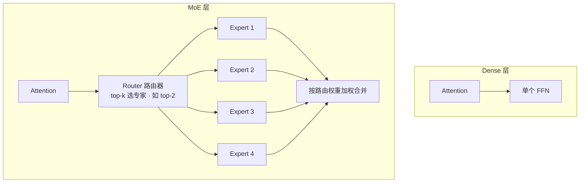

路由四步（对照 `PhiMoESparseMoeBlock` 代码）：
1. **gate 层**为每个 token 在所有专家上算路由 logits —— "哪些专家该处理这个 token？"
2. 按 logits 选 **top-k 专家**（典型 k=2），算路由权重决定各专家贡献多少；
3. 每个被选专家处理分给它的 token；
4. 按路由分数加权聚合专家输出，得到每个 token 的最终输出。

每个专家（`PhiMoEBlockSparseTop2MLP`）是三投影的门控 MLP：`w1` 投到中间维并激活，`w3` 提供门控信号，`w2` 投回隐藏维 —— 即 $\text{w2}(\text{act}(\text{w1}(x)) \odot \text{w3}(x))$。稀疏激活让模型有 4× 的 FFN 参数容量，但每 token 只激活一小部分，**算力接近 dense 模型而容量更大**。

### 6.10.2 EP 如何改变行为

- **不开 EP**：vLLM 用 TP 把**每个专家的权重**切到各 GPU —— 每张 GPU 有每个专家的一片。
- **开 EP**（`--enable-expert-parallel`）：分布方式变了 —— 每张 GPU 持有**完整的专家，但只有一部分**。公式：$\text{EP\_SIZE} = \text{TP\_SIZE} \times \text{DP\_SIZE}$，每 GPU 持有 $\text{Total\_Experts} / \text{EP\_SIZE}$ 个完整专家。

以 DeepSeek-R1 的 256 个路由专家为例，TP=8/DP=1 开 EP，每张 GPU 持 32 个完整专家；TP=1/DP=8 开 EP 也是每卡 32 个，但**通信模式不同**：

| 组合 | 通信 | KV 缓存布局 |
|---|---|---|
| **TP + EP** | all-reduce（同不开 EP 的 TP） | 按注意力头分片 KV 缓存，每 rank 存一片 |
| **DP + EP** | **all-to-all**（把 token 路由到持有其选中专家的 GPU） | 按**请求**分片 KV 缓存（"DP Attention"） |

> 💡 **面试高频：为什么 DeepSeek 这类 MLA 模型偏爱 DP+EP？**
> MLA/MQA 模型下，张量并行会把**压缩的潜在 KV 缓存复制到每个 rank**（因为太小不值得切），这很浪费。DP+EP 按请求分片缓存，每 GPU 只存自己请求的缓存，对内存吃紧的 MoE 部署（如 DeepSeek）更合适。

> ⚠️ **EP 的激活约束与适用性**
> - EP 是**修饰符不是独立策略**，必须 $\text{TP\_SIZE} \times \text{DP\_SIZE} > 1$ 才生效；TP=1&DP=1 时 `--enable-expert-parallel` 被**静默忽略**。
> - DP=1（纯 TP）时即使开 EP 也用 all-reduce；DP>1 才切到 all-to-all 并启用分片 KV 缓存。
> - 专家激活密度 **>3%** 时，all-to-all 开销被内存带宽收益抵消，EP 才划算；**超稀疏（<1%）时 EP 反而伤性能**。
> - EP 需额外依赖（DeepEP、pplx-kernels、DeepGEMM），并非所有模型/量化/硬件组合都稳定。
> - 只写 `--data-parallel-size`（不加 `--enable-expert-parallel`）的 MoE 走的是"传统 DP + 分片专家"，**不是** DP Attention。要分片 KV 缓存必须显式开 EP。

---

## 6.11 组合并行策略 🧩

真实部署很少只用单一策略。这些策略沿**正交的轴**切，可以叠加。

### 6.11.1 TP + PP：标准多节点配置

TP 横切每层、PP 纵切按层，天然互补。标准模式：**节点内用 TP（吃 NVLink 600+GB/s），节点间用 PP（网络带宽只有 100–400 Gb/s）**。

这个组合还**降低 inter-node 通信**：TP=4 时，流水线阶段间传的数据只有 $\text{batch\_size} \times \text{sequence\_length} \times \text{hidden\_size} / 4$ —— 每张 GPU 只发自己的分片。hidden_size=8192 时，每 token 只传 2048 个元素而非 8192。

```bash
--tensor-parallel-size 4 --pipeline-parallel-size 8
```

### 6.11.2 TP + DP：既分片又复制

模型既要分片（装下）又要复制（吞吐）时组合两者。每个 DP rank 包含一个完整 TP 组，总卡数 $= \text{DP} \times \text{TP}$。`--tensor-parallel-size 4 --data-parallel-size 2` 用 8 卡：2 个副本各切到 4 卡。

MoE 还可加 EP，此时 $\text{EP\_SIZE} = \text{TP\_SIZE} \times \text{DP\_SIZE}$，专家分布到全部 8 卡。

### 6.11.3 MoE 的 EP 组合选型

```bash
# TP+EP：延迟敏感、低并发（每 GPU 参与每个请求）
--tensor-parallel-size 8 --enable-expert-parallel

# DP+EP：吞吐导向、高并发（DP Attention 分片 KV 缓存，尤其 MLA/MQA）
--data-parallel-size 8 --enable-expert-parallel
```

### 6.11.4 决策树

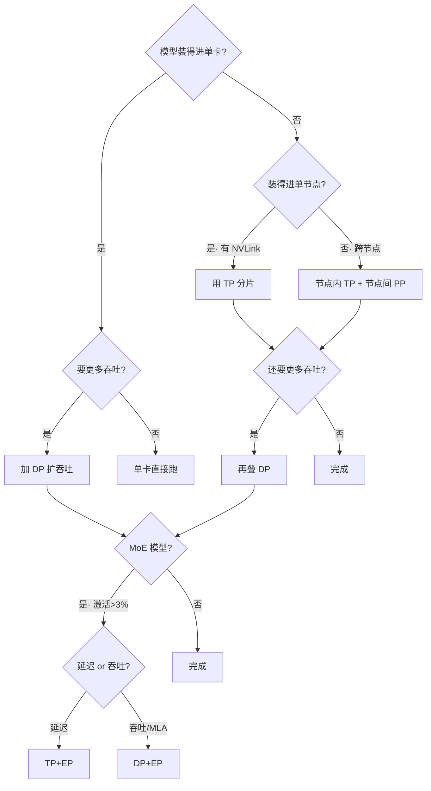

**一句话记忆：TP 先让模型装下 → PP 上多节点 → DP 扩吞吐 → MoE 再看激活密度决定 EP，延迟选 TP+EP、吞吐选 DP+EP。**

---

## 6.12 实战配置示例 🔧

### 基础 TP（单节点多卡）

```bash
python -m vllm.entrypoints.api_server \
    --model meta-llama/Llama-2-70b-hf \
    --tensor-parallel-size 4 \
    --port 8000
```

`--tensor-parallel-size 4` 把 70B 权重切到 4 卡，每卡约 17.5B 参数 + 各自的 KV 缓存分片，每层 all-reduce 通信 —— 最好有 NVLink。

### 多节点 TP + PP（超大模型）

```bash
python -m vllm.entrypoints.api_server \
    --model deepseek-ai/DeepSeek-R1 \
    --tensor-parallel-size 4 \
    --pipeline-parallel-size 8 \
    --enable-chunked-prefill \
    --max-num-batched-tokens 2048 \
    --port 8000
```

用 32 卡（4 TP × 8 PP）服务 DeepSeek R1（671B）。每个流水线阶段约 84B 参数（671B/8），阶段内切到 4 卡。`--max-num-batched-tokens 2048` 限制每步 prefill 的 prompt token 数 —— **没有它，一个长 prompt 会卡住整条流水线让其他请求干等**。

### Python API 精细控制 chunked prefill

```python
from vllm import LLM, SamplingParams

llm = LLM(
    model="meta-llama/Llama-2-70b-hf",
    tensor_parallel_size=4,
    pipeline_parallel_size=2,
    enable_chunked_prefill=True,
    max_num_seqs=256,           # 限制并发序列数，直接影响 KV 缓存内存
    max_num_batched_tokens=1024, # 每调度步最多 token 数，按 prefill/decode 比调
)
sampling_params = SamplingParams(temperature=0.8, top_p=0.95)
outputs = llm.generate(["Hello, how are you?"], sampling_params)
```

`max_num_seqs=256` 配 4K 上下文，需要 $256 \times 4K \times (\text{key\_size} + \text{value\_size})$ 每层的内存。`max_num_batched_tokens=1024` 让长 prompt 与其他请求的 decode 步交错。

### 用 Nsight Systems 做性能剖析

```bash
nsys profile --trace=cuda,nvtx --output=profile.qdrep \
    python -m vllm.entrypoints.api_server \
        --model meta-llama/Llama-2-70b-hf --tensor-parallel-size 4
nsys-ui profile.qdrep
```

在 Nsight UI 里看 **NCCL 操作（all-reduce/all-gather）**的耗时对比计算核：
- **通信主导** → 减小 TP size 或换 PP；
- **计算主导** → 有余量增大 TP 降延迟；
- profile 还能看到**流水线气泡**（GPU 空闲的空隙），提示调 chunked prefill 或请求组大小。

> 💡 **最佳实践清单**
> 1. 部署前用 Nsight 搞清通信/计算比；
> 2. 按 prefill-to-decode 比调 `max_num_batched_tokens`（prefill 重 → 大值；decode 重 → 小值降延迟）；
> 3. 看硬件：NVLink 利好 TP，PCIe-only 即使单节点也可能受益于 PP；
> 4. 算清可用 KV 缓存空间定最优 TP size —— 有时更多并行 = 更多缓存 = 更高吞吐；
> 5. 一个部署的最优解未必适用另一个 —— **实验、测量、迭代**。

---

## 6.13 动手练习（原书 Exercises）🏋️

原书章末给了 6 个渐进式练习，建议全做一遍来吃透本章：

| 练习 | 核心签名/目标 | 学到什么 |
|---|---|---|
| **1. 实现 KV 缓存管理器** | `KVCacheManager(num_layers, num_heads, head_dim, block_size, num_blocks)` + `allocate/free/get_cache` | 块式分配、空闲/已分配块追踪、动态增长、（选做）碎片整理 |
| **2. 实现连续批处理调度器** | `ContinuousBatchingScheduler(max_batch_size, max_seq_len)` + `add_request/step/get_batch` | 维护待处理队列、有空位就加入运行 batch、完成即移除、优先 prefill 新请求 |
| **3. Benchmark vLLM 吞吐** | `benchmark_vllm(model, batch_size, input_len, output_len, tp_size)` | 测吞吐(tok/s)、TTFT、TPOT、显存利用率，变量含 batch/输入长/输出长/TP |
| **4. 实现投机解码** | `SpeculativeDecoder(target, draft, tokenizer, num_speculative)` | 用小 draft 模型生成候选、target 模型验证、拒绝采样保正确性、测加速比 |
| **5. 部署 OpenAI 兼容 API** | `VLLMClient(base_url)` + `chat/list_models` | 起服务、流式响应、超时重试、延迟分布 |

> 💡 **面试高频：投机解码（Speculative Decoding）**
> 本章正文没细讲但练习 4 引入了它 —— 用一个**小的 draft 模型**快速猜 $k$ 个候选 token，再用**大的 target 模型一次并行验证**这 $k$ 个，用拒绝采样保证输出分布和只用 target 模型一致。因为 decode 是 memory-bound，一次验证多个 token 几乎不增加权重搬运成本，接受率高时能显著加速。这是 2024 年后推理加速的标配，务必理解其"验证比生成便宜"的本质。

完成后你应能：理解 KV 缓存与块式分配、实现连续批处理、benchmark 与优化 vLLM 吞吐、理解投机解码权衡、部署并调用 OpenAI 兼容 API、分析推理性能瓶颈。

---

## 📌 本章小结

```mermaid
mindmap
  root((分布式推理<br/>与 vLLM))
    推理≠训练
      内存优先·延迟+吞吐
      大头是权重+KV缓存
    KV缓存
      自回归本质
      O(T³)→O(T²)
      省算力·花内存
      prefill compute-bound
      decode memory-bound
    PagedAttention
      固定块16token·块表
      消灭碎片≈100%利用率
      消灭padding FLOPs
      2-4×并发
    连续批处理
      Orca风格动态增删
      与分页天然协同
    四板斧
      TP横切·每层all-reduce·腾KV缓存
      DP复制·零通信·线性吞吐
      PP纵切·气泡·chunked prefill
      EP修饰符·MoE·TP+EP/DP+EP
    决策
      TP装下→PP多节点→DP扩吞吐
      profile通信/计算比
```

一图流的记忆锚点：

1. **推理是另一套问题**：优化目标是延迟+吞吐，内存大头是权重+KV 缓存，长上下文时 KV 缓存能超过权重。
2. **KV 缓存是核心矛盾**：它把 decode 复杂度从 $O(T^3)$ 降到 $O(T^2)$，代价是 $O(L_{total} \cdot D)$ 内存 —— 从此**内存而非算力成为瓶颈**。
3. **PagedAttention 一石二鸟**：借 OS 分页思想把 KV 缓存切成 16-token 固定块 + 块表，同时消灭**碎片化**（60–80% 浪费 → 近 100% 利用）和 **padding FLOPs**（never computed），带来 2–4× 并发。
4. **连续批处理**：Orca 风格在同一 batch 内动态接纳/退休请求，与分页协同榨干 GPU。
5. **四种并行**：TP（横切/每层 all-reduce/腾 KV 缓存/降延迟）、DP（复制/零通信/线性吞吐但内存低效）、PP（纵切/多节点/气泡靠请求组+chunked prefill 治）、EP（MoE 修饰符/TP+EP 低延迟、DP+EP 高吞吐+分片 KV 缓存）。
6. **决策框架**：先 TP 装下 → PP 上多节点 → DP 扩吞吐 → MoE 看激活密度选 EP。**别拍脑袋设参数，测量、迭代。**

**展望**：vLLM 仍在演进 —— **disaggregated prefill/decode**（把 compute-bound 的 prefill 和 memory-bound 的 decode 拆到不同硬件）、更稳的 EP、对 AMD MI300X / Intel Gaudi 的支持。下一章的 **SGLang** 走另一条路：不重模型分片，而重**请求级路由、前缀缓存、workload disaggregation**，追求不同的性能画像。

---

## 🔗 延伸阅读

**vLLM 与 PagedAttention**
- Kwon et al., *Efficient Memory Management for Large Language Model Serving with PagedAttention* (2023) —— PagedAttention 原始论文，60–80% 浪费的数据出处：https://arxiv.org/abs/2309.06180
- vLLM 官方文档：https://docs.vllm.ai/
- vLLM GitHub：https://github.com/vllm-project/vllm
- vLLM Roadmap：https://roadmap.vllm.ai

**分布式推理**
- 并行与扩展：https://docs.vllm.ai/en/stable/serving/parallelism_scaling/
- 数据并行部署：https://docs.vllm.ai/en/stable/serving/data_parallel_deployment.html
- 分布式服务：https://docs.vllm.ai/en/stable/serving/distributed_serving.html
- NVIDIA Dynamo KV Cache Manager：https://docs.nvidia.com/dynamo/archive/0.2.0/architecture/kv_cache_manager.html

**研究前沿**
- *When to Reason: Semantic Router for vLLM* (2025)：https://arxiv.org/abs/2510.08731
- *Distributed Inference with vLLM* (Red Hat, 2025)：https://developers.redhat.com/articles/2025/02/06/distributed-inference-with-vllm

**vLLM 关键 API 速查**
- `vllm.LLM` —— 模型加载与推理主类
- `vllm.SamplingParams` —— 采样配置
- `vllm.engine.LLMEngine` —— 核心推理引擎
- `vllm.engine.async_llm_engine.AsyncLLMEngine` —— 异步服务引擎
- `vllm.worker.worker.Worker` —— 分布式 worker 进程
- `vllm.distributed.parallel_state` —— 并行状态管理
- `vllm.engine.arg_utils` —— 命令行参数工具

---

> **本章一句话**：LLM 推理的本质矛盾是"自回归带来的 KV 缓存把内存变成瓶颈"，vLLM 用 **PagedAttention（分页治碎片+消 padding）** 和 **连续批处理（动态填满 GPU）** 解决单卡效率，再用 **TP/DP/PP/EP 四种并行** 突破单卡上限 —— 记住那句决策口诀：**先装下，再扩吞吐，永远先 profile。**
