# 第 7 章 · SGLang 跨请求优化 —— RadixAttention 前缀共享、跨请求 KV 复用与调度 🌲

> "预测未来最好的方式，就是把它发明出来。" —— Alan Kay
>
> 本章对应原书 *Distributed AI Systems* 第 7 章（PDF 第 364–411 页）。

---

## 🗺️ 本章地图

上一章我们讲了 **vLLM**：当模型太大装不下一张 GPU 时，用**模型并行**（TP/PP）把权重切开，workers 之间靠 all-reduce / 流水线互相同步，系统目标是**尽量多地攒 batch 来堆吞吐**。vLLM 优化的核心是 **单请求内部（intra-request）的执行效率**——一个请求怎么算得快。

**SGLang 换了一个问题来问**：多个请求之间能不能**共享计算、互相受益**？它把 **跨请求（inter-request）优化** 提升为**一等公民**。这条主线牵出了本章所有内容：

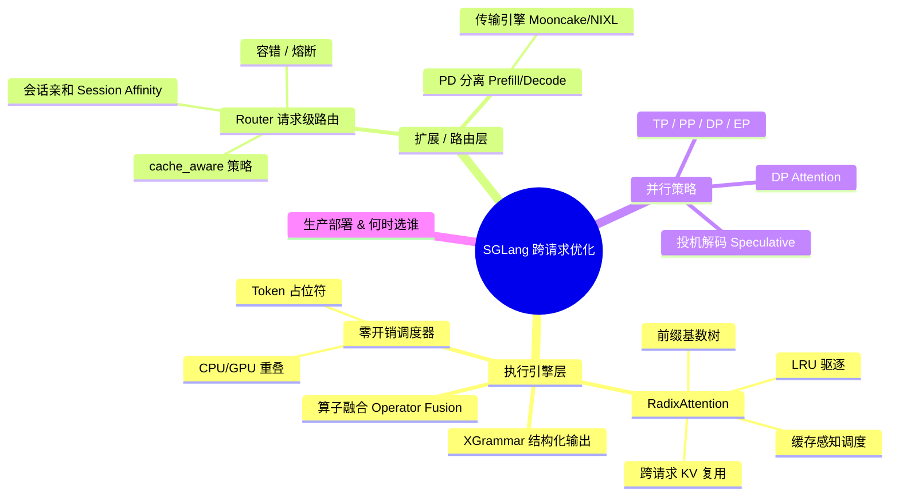

读完本章你能回答四个层层递进的问题：

| 层次 | 核心机制 | 解决什么痛点 |
|---|---|---|
| **① 内核 / 引擎层** | RadixAttention、零开销调度器、XGrammar、算子融合 | 跨请求复用前缀 KV、消除 CPU/GPU 空转、结构化输出、减少 kernel 启动开销 |
| **② 扩展 / 路由层** | Router（Model Gateway）+ PD 分离 | 独立 worker 横向扩展、会话亲和、prefill/decode 独立伸缩 |
| **③ 并行策略层** | TP / PP / DP / EP + DP Attention + 投机解码 | 大模型切分 vs 小模型复制的取舍 |
| **④ 决策层** | SGLang vs vLLM 选型 | 按 **workload 特征**而非"谁更好"来选 |

一句话记住本章的灵魂：**vLLM 优化"一个请求算得多快"，SGLang 额外优化"多个请求怎么共享工作"。** 但这份收益是**有条件的**——它需要前缀复用、对话型负载、非批处理主导的场景。

---

## 0️⃣ 为什么需要"另一种哲学"

### 是什么：两种分布式推理哲学的分岔

- **vLLM 的路线 = 模型并行 (model parallelism)**：模型太大 → 切权重（TP 切每层、PP 切层数）→ workers 必须同步（TP 要 all-reduce，PP 要流水线交接）→ 优化目标是**攒大 batch 堆吞吐**。
- **SGLang 的路线 = 跨请求优化 + 请求级路由**：TP / PP / EP 它**全都支持**（和 vLLM 一样），但它额外把**请求之间怎么互动、怎么共享资源**当成头等大事。

### 为什么：一个典型场景暴露了浪费

想象一个 AI 助手服务，**每个请求都以同一段系统提示词开头**：

> "You are a helpful assistant. You provide accurate, helpful responses..."（假设 500 tokens）

传统系统里，如果 **100 个用户同时发请求**，系统就会为这段 500-token 前缀**计算 100 次 KV cache**——这是巨大的**计算浪费**和**显存浪费**。SGLang 的核心创新 **RadixAttention** 正是冲着这个浪费来的。

> 🔬 **第一性原理：Transformer 的因果注意力天然可复用前缀**
>
> 在自回归 Transformer 里，位置 $i$ 的 KV（Key/Value）只依赖 token $0 \dots i$，**与后面的 token 无关**（因果掩码）。因此只要两个请求的**前缀 token 序列完全相同**，它们前缀那一段的 KV cache 在数学上**逐比特一致**。
>
> $$\text{KV}_i = f(\text{token}_0, \text{token}_1, \dots, \text{token}_i)$$
>
> 既然前缀相同 → KV 相同 → **算一次，共享给所有人**。这就是跨请求复用在数学上"免费"的根本原因。RadixAttention 只是把这个不变量用一棵树高效地组织起来。

### SGLang 的身世

SGLang（**S**tructured **G**eneration **Lang**uage）出自 UC Berkeley 的 **LMSYS 团队**——就是做 **Chatbot Arena 排行榜**的那伙人。vLLM 关注的是"用 PagedAttention 省显存"，而 SGLang 的作者问了一个不同的问题：

> **"怎么才能跨请求优化，让请求们共享计算、互相受益？"**

答案催生了三大件 + 一个扩展层：
1. **RadixAttention** —— 跨请求 KV cache 共享；
2. **XGrammar** —— 受约束的结构化输出；
3. **零开销调度器** —— 榨干 GPU 利用率；
4. **请求级路由（Router）** —— 后来加上的生产扩展层，补齐前三者。

---

## 1️⃣ 安装与快速上手（Docker 最省事）

SGLang 跑在 **Linux + Python 3.10+**，最常见的部署目标是带 **CUDA 的 NVIDIA GPU**（也支持其他加速器）。最快的试用方式是 **Docker**，镜像里打包好了所有依赖。

### 拉镜像

```bash
docker pull lmsysorg/sglang:latest-runtime
```

- `latest-runtime`：**生产级**、依赖最小，约 **16GB** 磁盘。
- `latest`：含开发/编译工具，约 **35GB**，大得多。多数场景用 runtime 即可。

### 起容器（暴露 OpenAI 兼容 API）

```bash
export SGLANG_MODEL="Qwen/Qwen2.5-0.5B-Instruct"

docker run --runtime nvidia --gpus all \
  -v $HOME/.cache/huggingface:/root/.cache/huggingface \
  --env "HF_TOKEN=$HF_TOKEN" \
  --env "SGLANG_MODEL=$SGLANG_MODEL" \
  -p 30000:30000 --ipc=host --shm-size 32g \
  lmsysorg/sglang:latest-runtime \
  python3 -m sglang.launch_server \
    --model-path $SGLANG_MODEL \
    --host 0.0.0.0 \
    --port 30000
```

**逐个 flag 讲透**（这些正是理解 SGLang 运行时的关键）：

| Flag | 作用 | 为什么重要 |
|---|---|---|
| `--runtime nvidia --gpus all` | 开启 GPU 访问 | 换成 `--gpus '"device=0"'` 指定单卡，`'"device=0,1"'` 指定多卡 |
| `-v .../huggingface:...` | 挂载本地 HF 缓存 | 避免重复下载模型 |
| `--ipc=host` | 容器访问宿主机共享内存 | PyTorch 在 **TP 推理**时靠共享内存高效传数据 |
| `--shm-size 32g` | 设置共享内存大小 | ⚠️ **对 KV cache 管理和 RadixAttention 至关重要**，太小会限制缓存 |

> ⚠️ **常见坑**：忘了 `--ipc=host` 或 `--shm-size` 设太小，会在 TP 推理或大 KV cache 时报共享内存不足 / 性能骤降。RadixAttention 依赖充足共享内存来维护基数树。

### 模型类型一览

SGLang 通过不同端点服务不同类型模型（**OpenAI 兼容**，可直接替换 OpenAI SDK）：

| 端点 | 模型类型 | 例子 |
|---|---|---|
| `/v1/completions` | Base 基础模型（文本补全） | `meta-llama/Llama-3.2-1B` |
| `/v1/chat/completions` | Chat 对话模型 | `Qwen/Qwen2.5-0.5B-Instruct` |
| `/v1/embeddings` | Embedding 向量 | `Qwen/Qwen3-Embedding-0.6B` |

还支持：**diffusion 语言模型**（非自回归生成）、**多模态**（图/视频+文本）、**rerank**（搜索结果排序）、**reward 模型**（RL 用）。学习用的小模型建议 `Qwen/Qwen2.5-0.5B-Instruct`（0.5B）或 `meta-llama/Llama-3.2-1B-Instruct`（1B）。

### 验证

```bash
# 健康检查
curl -w "HTTP Status: %{http_code}\n" http://localhost:30000/health
# 列出模型
curl http://localhost:30000/v1/models
# chat 测试（temperature:0 得到确定性输出）
curl http://localhost:30000/v1/chat/completions \
  -H "Content-Type: application/json" \
  -d '{"model":"'"$SGLANG_MODEL"'","messages":[{"role":"user","content":"Hello"}],"temperature":0}'
```

---

## 2️⃣ SGLang 架构总览：前端 / 后端分离

SGLang 遵循 **frontend / backend** 设计：**前端（API Server）** 处理客户端请求，**后端（SGLang Runtime，简称 SRT）** 执行推理。分层让每一层可独立优化。

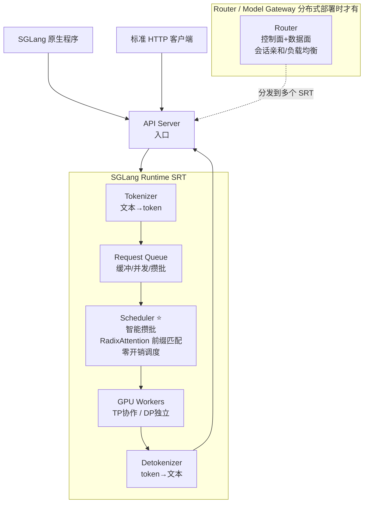

**逐组件讲解**：

| 组件 | 职责 | 关键点 |
|---|---|---|
| **API Server** | 请求入口 | OpenAI 兼容 |
| **Tokenizer** | 文本 → 数字 token | |
| **Request Queue** | 缓冲已 tokenize 的请求，管并发、准备攒批 | |
| **Scheduler ⭐** | **SGLang 的智能所在** | 智能攒批、优先调度能命中 RadixAttention 缓存的请求、实现零开销调度（CPU/GPU 重叠） |
| **GPU Workers** | 真正跑模型推理 | 可组成 TP 组（协作单请求）或独立 workers（DP） |
| **Detokenizer** | token → 人类可读文本 | 响应经 API Server 流回客户端 |
| **Router / Model Gateway** | 分布式部署时叠在 API Server **之上** | 跨多个 SRT 分发请求，**维持会话亲和**（同一对话进同一 worker，保住 KV cache 局部性），含控制面（worker 管理/负载监控/健康检查）+ 数据面（负载均衡策略） |

### 和 vLLM 的架构差异（核心对比）

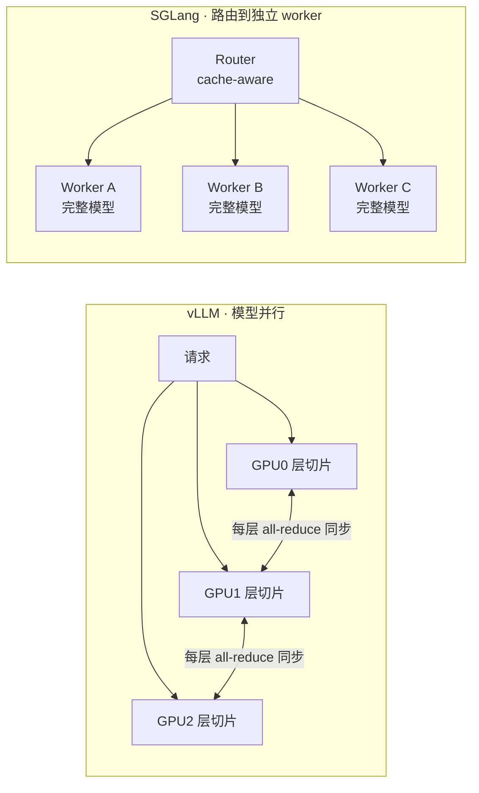

| 维度 | vLLM | SGLang |
|---|---|---|
| 优化焦点 | **intra-request**（PagedAttention 省显存、模型并行跑大模型） | 额外做 **inter-request**（RadixAttention + 缓存感知调度） |
| 扩展方式 | 主要靠模型并行 | 模型并行 **+** 请求级路由（互补） |
| worker 间同步 | TP 每层 all-reduce | 独立 worker **无跨 worker 同步** |
| 代价 | 通信开销 | 每个 worker 要装**完整模型**（或小 TP 组） |

> 💡 **一句话**：vLLM 的 workers 每层都要"开会"（all-reduce）；SGLang 的独立 workers "各干各的"，Router 只做负载均衡和缓存感知路由——**横向扩展无通信开销**，代价是每个 worker 要装下整个模型。

---

## 3️⃣ RadixAttention：前缀缓存复用（本章主角）🌲

> RadixAttention 大概是 SGLang **最有辨识度**的创新。

### 是什么：把 KV cache 组织成一棵基数树

- vLLM 的 **PagedAttention** 优化的是**单个请求内部** KV cache 的显存管理。
- RadixAttention 优化的是**跨多个请求**——为**公共前缀共享 KV cache**。

> 💡 **和 vLLM 前缀缓存的区别（面试高频）**
>
> vLLM 近期版本默认也开了前缀缓存，它靠 **对共享 token block 做 hash** 来实现复用；RadixAttention 则**显式维护一棵基数树（radix tree / 前缀树）**，并把**前缀查找直接接进批调度**。收益在**很多请求共享长而相同的前缀**时最明显——系统提示词、few-shot 模板、多轮对话的早期轮次。

### 怎么运作：最长匹配前缀 + 只算新 token

**基数树（radix tree，又叫前缀树 / prefix tree）** 里，**公共前缀只存一次**，被所有用它的请求共享。当新请求到来：

1. 在树里找**最长匹配前缀**；
2. **复用**该前缀已有的 KV cache；
3. **只为新 token 计算** KV cache；
4. 请求完成后，共享前缀**留在树里**供未来复用，独有后缀被驱逐。

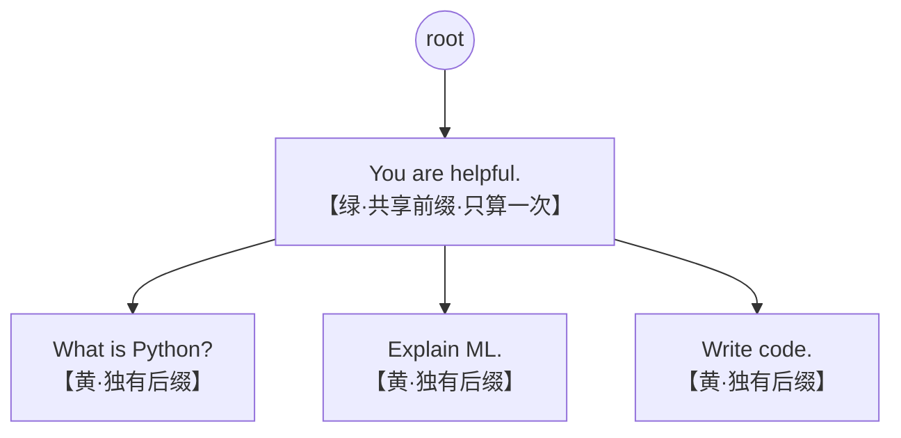

**图 7.3 讲解**：三个请求 `"You are helpful. What is Python?"`、`"You are helpful. Explain ML."`、`"You are helpful. Write code."` 到来。基数树把共享前缀 **"You are helpful. "** 存一次（绿色节点），各自独有后缀分开存（黄色节点）。前缀 KV **只算一次**、三个请求共享；后缀各算各的。**共享的请求越多，省得越多（收益复利式增长）**。

### 收益：可观，但有条件 ⚠️

| Workload 特征 | RadixAttention 收益 |
|---|---|
| 长共享前缀（系统提示、few-shot、多轮对话） | **prefill 计算最多省 90%** |
| 无前缀共享（独特 prompt、单轮交互） | 收益**微乎其微** |

其余收益：
- **显存效率**：共享前缀存一次而非每请求一份；
- **延迟**：命中缓存的请求延迟**降 2–3 倍**；
- **吞吐**：每请求显存变少 → 能攒**更大 batch** → 吞吐上升。

> 🔬 **收益的第一性原理**：prefill 阶段的算力 $\propto$ 待算 token 数。若前缀长 $L_p$、后缀长 $L_s$，命中缓存后 prefill 只需算 $L_s$ 而非 $L_p + L_s$。当 $L_p \gg L_s$（长系统提示 + 短问题），节省比例 $\approx \frac{L_p}{L_p+L_s} \to 90\%+$。这解释了"最多省 90%"从哪来。

### 缓存感知调度：把树接进批形成

RadixAttention 不只是个缓存——**调度器是"知道"这棵树的**。在挑选下一个 batch 时，调度器会：
- 按**最长匹配前缀长度**给请求排序；
- **优先调度共享前缀更长的请求**。

这样能**最大化缓存命中率和 GPU 利用率**——把能复用同一前缀的请求凑到一起跑。

### 和会话亲和结合

当来自**同一会话**的请求被路由到**同一 worker** 时，那个 worker 上的基数树会**累积整段对话历史**。后续消息复用之前轮次的缓存 KV，**多轮交互延迟大幅下降**。（会话亲和细节见第 6 节。）

### 基数树的生命周期与 LRU 驱逐（图 7.4–7.6）

内存是**有限的**。树会随请求增删而"生长"和"自我修剪"：

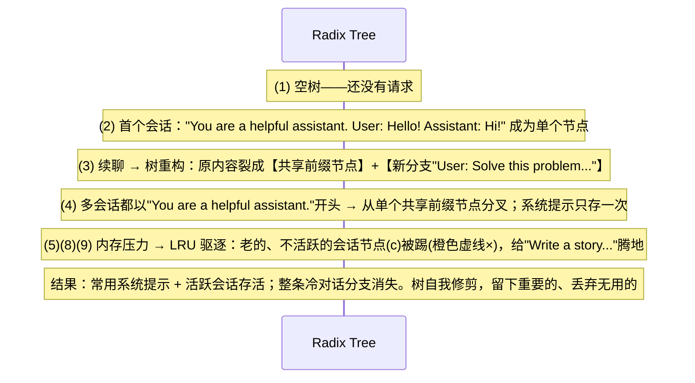

**关键洞察**：
- **树会重构**——续聊时把已有节点裂成"共享前缀 + 新分支"；
- **多用户分叉**——共同系统提示存一次，各自问题挂在下面；
- **LRU 驱逐**——内存吃紧时踢掉**最久未用**的节点；**高频访问的系统提示和活跃会话会存活**。

### 底层实现：两级内存池（SGLang v0.5）

RadixAttention 底层靠**两级内存池**实现：

| 级别 | 内容 |
|---|---|
| **第一级** | 每个请求 → 其 token 的 **KV cache 索引** 映射 |
| **第二级** | 真正的 **KV cache 数据**，组织为 `[num_layers, max_tokens, num_heads, head_dim]` |

**基数树坐在这两个池之上**，追踪哪些前缀被缓存、支持高效查找和共享。

> 💡 **面试高频：手写一个 RadixCache**
> 本章练习就要你实现简化版 `RadixCache`（trie 结构 + 每节点存 KV + LRU 驱逐 + 命中率统计）。核心三接口：`insert(token_ids, kv)`、`lookup(token_ids) -> (match_len, kv)`（返回**最长匹配前缀长度**）、`evict(n)`。例如插入 `[1,2,3,4,5]`、`[1,2,3,6,7]`、`[1,2,8,9]` 后，查询 `[1,2,3,4,10,11]` 应返回 **match_len=4**（前缀 `[1,2,3,4]`）。

---

## 4️⃣ XGrammar：结构化输出解码

### 是什么 & 为什么

很多应用要 LLM 输出**特定格式**：JSON（API 响应）、SQL（数据库查询）、自定义 schema。朴素的**约束解码**是：每生成一个 token 就对照语法规则检查、mask 掉非法 token。但**词表有 128K token（如 Llama-3）**时，每步都检查每个 token **计算上不可承受**。

### 怎么做：预编译成状态机

SGLang **默认用 XGrammar**（备选后端 Outlines、llguidance）：

- **上下文无关规则** → 预编译成**有限状态机（FSM）**。例：生成布尔值时，只有 `"true"` 和 `"false"` 的 token 保持合法。这层预编译覆盖了典型 JSON / schema 约束里的**大多数 token**。
- **上下文相关规则**（如**括号配对**）→ 用**下推自动机（pushdown automata）** + **树状栈管理**，避免昂贵的栈快照。

结果：**保证合法**的结构化输出，**开销极小**。

### 怎么用

**在线（OpenAI 兼容）**：

```bash
curl http://localhost:30000/v1/chat/completions \
  -H "Content-Type: application/json" \
  -d '{
    "model": "Qwen/Qwen2.5-0.5B-Instruct",
    "messages": [{"role": "user", "content": "Extract: John is 30 years old, lives in NYC"}],
    "response_format": {
      "type": "json_schema",
      "json_schema": {
        "name": "person",
        "schema": {
          "type": "object",
          "properties": {
            "name": {"type": "string"},
            "age": {"type": "number"},
            "city": {"type": "string"}
          },
          "required": ["name", "age"]
        }
      }
    }
  }'
```

**离线批处理（Python Engine）** —— 同一 schema 通过 `sampling_params` 传：

```python
import json
from sglang import Engine

llm = Engine(model_path="Qwen/Qwen2.5-0.5B-Instruct")
schema = {
    "type": "object",
    "properties": {"name": {"type": "string"}, "age": {"type": "number"}},
    "required": ["name", "age"],
}
outputs = llm.generate(
    ["Extract: John is 30 years old, lives in NYC"],
    {"max_new_tokens": 100, "json_schema": json.dumps(schema)},
)
print(outputs[0]["text"])
```

XGrammar 广泛支持**上下文无关文法**——JSON、SQL、DSL 及应用需要的各种结构化格式。

---

## 5️⃣ 零开销调度器与算子融合

### 5.1 零开销调度器（Zero-overhead Scheduler）

**传统推理系统串行执行调度与计算**：CPU 调度下一批 → GPU 计算 → CPU 处理结果并再调度……**GPU 在 CPU 工作时干等**，调度开销可能吃掉**总时间的 50% 以上**！

SGLang 的**零开销调度器**用**重叠**消除这段空转。核心洞察：

> **当 GPU 处理 batch N 时，CPU 可以同时准备 batch N+1、处理 batch N-1 的结果。GPU 永不等 CPU。**

```mermaid
gantt
    title 图 7.7 · 串行 vs 零开销调度
    dateFormat X
    axisFormat %s
    section 串行(慢)
    CPU 调度 batchN      :0, 2
    GPU 计算 batchN      :2, 4
    CPU 处理结果+调度N+1 :4, 6
    GPU 计算 batchN+1    :6, 8
    section 零开销(重叠)
    GPU 计算 batchN      :0, 3
    CPU 备 batchN+1 & 处理 N-1 :0, 3
    GPU 计算 batchN+1    :3, 6
    CPU 备 batchN+2 & 处理 N   :3, 6
```

调度器把 CPU 工作拆成两个逻辑部分，因为它们**处理不同的 batch，所以能重叠**：

| CPU 部分 | 干什么 |
|---|---|
| **Scheduler CPU** | 预调度（收集请求、在基数树里匹配前缀、分配内存）+ 后调度（检查完成条件、移除完成请求、更新缓存） |
| **Launch CPU** | kernel 启动 + 结果处理 |

**Token 占位符机制**让重叠成为可能：调度器把 batch 派给 GPU 后**不等结果**，而是**分配占位 token** 继续调度下一批；一个**后台线程**监控 GPU 完成、在结果就绪时**用真实 token 替换占位符**。

**收益**：相比串行调度，**吞吐最高提升 2 倍**，端到端延迟更低（GPU 始终忙碌）。

> 🔬 **第一性原理**：GPU 是极贵的资源，任何一刻它空转都是纯损失。零开销调度器把"调度"这个 CPU 活动从**关键路径**上挪走——只要 CPU 备下一批的速度跟得上 GPU 算当前批的速度，GPU 利用率就趋近 100%。这是一个经典的**流水线/双缓冲（double buffering）**思想。

### 5.2 算子融合（Operator Fusion）

现代 GPU 算得快，但**每次 kernel 启动都有开销**。把 LayerNorm、线性投影、激活当成**三个独立 kernel** → 多次启动 + 额外显存往返。

SGLang 为常见 Transformer 模式提供**融合 CUDA kernel**：
- **LayerNorm + Linear + Activation** 融合；
- **注意力输出投影**融合；
- **MoE routing + expert GEMM** 融合。

好处：**中间结果留在寄存器里**，不用往返全局显存。对 MoE 模型，专用 kernel 把 **expert routing 和计算合并**，减少 all-to-all 开销。

---

## 6️⃣ Router：请求级路由架构

在核心执行引擎之上，SGLang 引入**请求级路由（request-level routing）** 作为**扩展原语**，**补充**（而非替代）传统模型并行。

### 关键区分：消除的是"跨请求同步"，不是"层内同步"⚠️

> 这是**面试高频误区**，务必分清：

| 同步类型 | 能否被 Router 消除 |
|---|---|
| **层内 collective**（TP 的 all-reduce、PP 的流水线交接、EP 的 all-to-all） | ❌ **不能**。用 TP=8 时那 8 张卡每层照样同步，Router 管不着 |
| **跨请求同步**（不同请求分给不同 worker 时 worker 间的协调） | ✅ **能**。每个 worker 独立处理请求，worker 之间零协调开销 |

**何时最有价值**：模型能装进**单 GPU 或小 TP 组（2–8 卡）**时。对**必须跨大量 GPU 做 TP/PP 的超大模型**，Router 价值不大——你反正被模型并行卡住了。但对**小模型高 QPS**，路由让你**无传统数据并行的通信开销地横向扩展**。

### SGLang Model Gateway 架构（控制面 + 数据面）

**SGLang Model Gateway**（旧称 SGLang Router）坐在多个 SRT 实例前面，按复杂策略分发流量，并提供**企业级可靠性**。

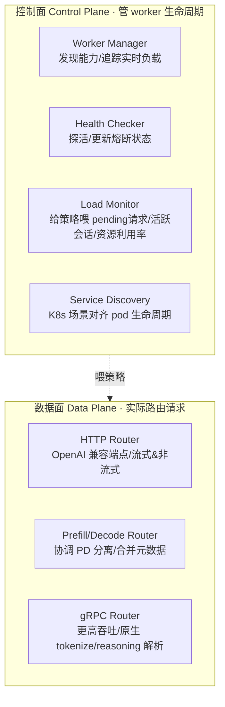

**可靠性特性**：指数退避 + 抖动重试、worker 级熔断器（worker 不健康自动 failover）、token-bucket 限流 + 排队。**可观测性**：Prometheus 指标（延迟/吞吐/**缓存命中率**）、OpenTelemetry tracing、结构化日志。

### Router 何时大放异彩 vs 何时别用

| ✅ 适合 Router | ❌ 不适合 Router |
|---|---|
| **高 QPS 交互式**（聊天平台、多租户、10 万+ 并发会话）→ 缓存感知策略最大化前缀共享 | **批量推理**：Router 这一跳只加延迟、无缓存局部性收益，直接模型并行更好 |
| **多轮对话**：会话亲和让整段对话留同一 worker（KV 已 warm），follow-up **降延迟 2–3 倍** | **超大模型（70B+）**：反正被 TP/PP 卡住，Router 价值小 |
| **PD 分离**：prefill/decode 独立伸缩，worker 挂了 Router 绕过它 | **纯吞吐、不在乎延迟**：vLLM 连续批处理可能更高效 |

> ⚠️ **收益是有条件的**：多轮/会话亲和的收益**要求真实存在前缀复用的对话型负载**。单发（single-shot）prompt 看不到这些收益。

### 路由策略（Router Policies）

| 策略 | 机制 | 适用 |
|---|---|---|
| **cache_aware（推荐）** | 为每个 worker 维护**近似基数树**，追踪哪些前缀可能已缓存。请求来时找**前缀匹配最好**的 worker；匹配超阈值 → 去那台（命中）；否则回退到负载均衡 | 多数负载。**最大化 RadixAttention 收益**同时防止单 worker 过载 |
| **round_robin** | 不看缓存状态，均匀轮询 | 请求不共享前缀、或想要均匀分布时 |
| **shortest_queue** | 路由到**pending 请求最少**的 worker | 请求长度不一时自适应（跑长请求的 worker 自然少收新请求） |
| **power_of_two_choices** | 随机采样两个 worker，选负载较轻的 | 负载均衡文献经典技巧，**开销比检查全部 worker 低** |

`cache_aware` 的可调阈值：

```bash
python -m sglang_router.launch_router \
    --worker-urls http://node1:30000 http://node2:30000 \
    --policy cache_aware \
    --cache-threshold 0.5 \
    --balance-abs-threshold 10 \
    --balance-rel-threshold 1.5
```

### 会话亲和与缓存局部性（Session Affinity）

**思想极简**：**同一对话的请求应进同一 worker**，那里上一轮的 KV cache 还是 warm 的。

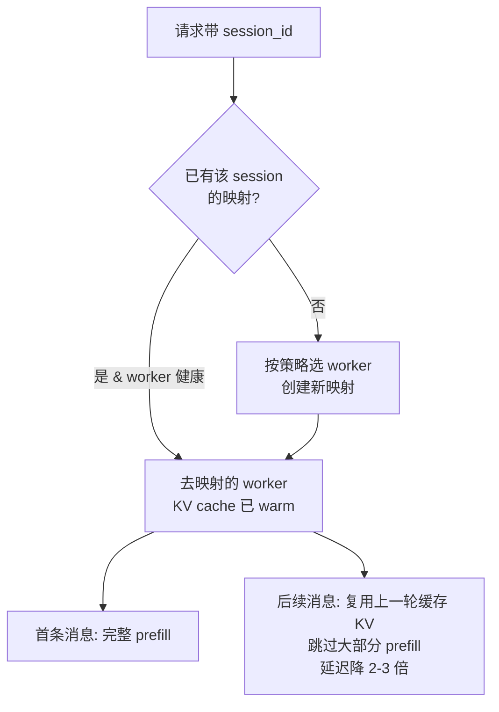

**为什么 vLLM 的模型并行难做到这个**：TP/PP 部署里模型**分散在所有 GPU**上，没有天然的"worker"可路由；会话状态得**显式管理**、可能还要在请求间搬来搬去。而 SGLang 的路由架构让**会话亲和成为设计的自然结果**。

### 容错（Fault Tolerance）

路由架构**天然容错**：

- **健康监控**：Router 周期探测每个 worker 的 `/health`；worker 挂了/无响应 → 自动移出活跃池、把流量重分给健康 worker。
- **熔断器（circuit breaker）**：worker **连续失败（通常 5 次）** → "打开"熔断、停发请求一段时间；超时后发**单个探测**请求，成功则重新入池，失败则保持打开。
- **会话迁移（session migration）**：持有活跃会话的 worker 挂了 → Router 把受影响会话重映射到健康 worker。**代价**：新 worker 上 KV cache 要**重新计算**，迁移后**首个请求承受完整 prefill 延迟**，但后续请求受益于新 worker 的 warm 缓存。

> 💡 **对比 TP/PP**：TP/PP 部署要求**所有 rank 都在线**——**单张 GPU 挂了能拖垮整个服务组**。而路由架构里 worker 独立，挂一台只损失一台。

---

## 7️⃣ Prefill/Decode（PD）分离

SGLang 最强大的分布式模式之一。同样的拆分在现代 serving 栈里到处可见——**DistServe、Mooncake** 早期就记录了这个设计，**vLLM、NVIDIA Dynamo** 也有类似模式——但动机是普适的。

### 为什么要分离：两个阶段资源画像相反

回忆第 6 章：**prefill 并行处理整个 prompt（compute-bound 计算密集）**，**decode 一次生成一个 token（memory-bound 显存带宽密集）**。

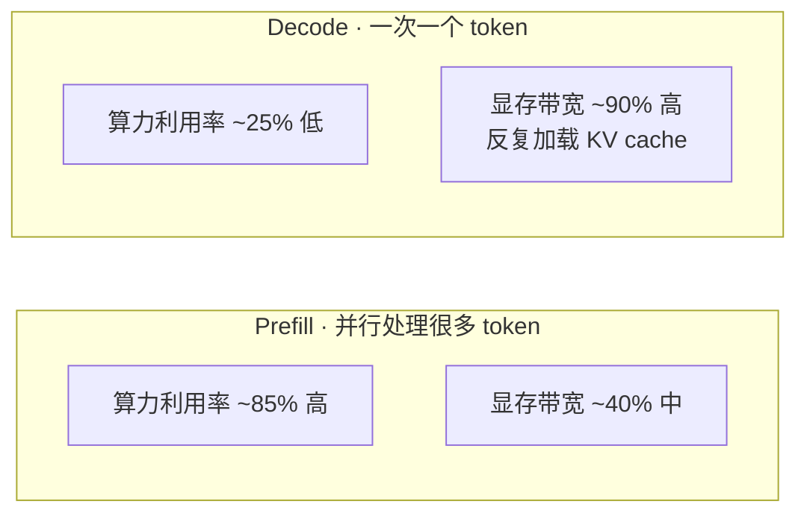

**图 7.8 讲解**：两者资源画像**完全相反**。混在同一硬件上跑 → **总有一方（算力或带宽）被浪费**。在统一系统里，prefill 和 decode **抢同一份资源**：一个长 prefill 能**阻塞 decode workers**，让等 token 的用户延迟飙升。

### PD 分离怎么解

**彻底分开**：专用 **prefill workers**（为算力吞吐优化）处理初始 prompt；专用 **decode workers**（为低延迟优化）处理 token 生成。Router 把新请求先送 prefill worker，再把 **KV cache 转移**给 decode worker 生成。

> **与 vLLM 的流水线并行（PP）本质不同**：PP 是**切模型层**、各 stage 严格同步（每 stage 等上一个）；**PD 分离切的是 workload 类型**（不是模型层），允许**无同步开销地独立伸缩**。

### PD 分离架构与数据流

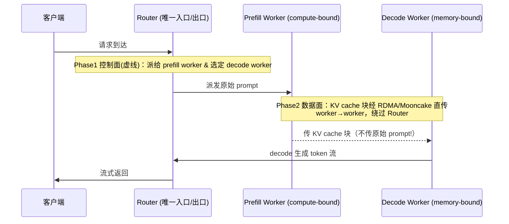

**图 7.9 关键点**：单个 Router 管进出口。**Phase 1（控制面，虚线）** Router 派请求给 prefill、并**选好 decode worker**；**Phase 2（数据面）** prefill worker 把 **KV cache 块经 RDMA / Mooncake 直传** decode worker，**绕过 Router**。⚠️ **注意：原始 prompt 永远不进 decode worker，它们只收 KV cache 块**。

**收益**：
- **独立伸缩**：prompt 处理成瓶颈就加 prefill worker，生成延迟要紧就加 decode worker；
- **异构硬件**：高算力 GPU 给 prefill，显存优化 GPU 给 decode；
- **故障隔离**：prefill worker 挂了不影响进行中的 decode。

### 传输引擎（Transfer Engines）

PD 分离的**关键难点**是把 KV cache 从 prefill 传到 decode——**长上下文时这份缓存可达数 GB**，高效传输至关重要。

| 引擎 | 技术 | 特点 |
|---|---|---|
| **Mooncake** | RDMA（远程直接内存访问） | **无 CPU 参与**的内存到内存直传，**InfiniBand 上延迟最低** |
| **NIXL** | 基于 UCX | 跨不同网络 fabric（IB、以太网）通用，**灵活但略损性能** |
| **ASCEND** | 华为 Ascend NPU 专用 | |

### PD 分离部署示例（Mooncake）

```bash
# 装传输引擎
uv pip install mooncake-transfer-engine

# Prefill worker（--disaggregation-mode prefill 配置为仅 prefill）
python -m sglang.launch_server \
    --model-path Qwen/Qwen2.5-0.5B-Instruct \
    --disaggregation-mode prefill \
    --port 30000 \
    --disaggregation-ib-device mlx5_roce0   # 指定 InfiniBand 设备做 RDMA

# Decode worker（另一张 GPU，--base-gpu-id 1）
python -m sglang.launch_server \
    --model-path Qwen/Qwen2.5-0.5B-Instruct \
    --disaggregation-mode decode \
    --port 30001 \
    --base-gpu-id 1 \
    --disaggregation-ib-device mlx5_roce0

# Router 开启 PD 分离
python -m sglang_router.launch_router \
    --pd-disaggregation \
    --prefill http://127.0.0.1:30000 \
    --decode http://127.0.0.1:30001 \
    --host 0.0.0.0 \
    --port 30000
```

- 用 **NIXL 后端**（跨 fabric）时，把 `--disaggregation-ib-device mlx5_roce0` 换成 `--disaggregation-transfer-backend nixl`。
- 生产上通常跑**多个** prefill/decode worker，比例按 workload 定：**长上下文（prefill 重）用 2:1 或 3:1**，**聊天（decode 重）用 1:2**。

> ⚠️ **常见坑**：不用 RDMA 时 KV cache 块得**走整个网络栈**，延迟显著增加。`--disaggregation-ib-device` 指定 RDMA 设备是性能关键；Mooncake 做**零拷贝**数据搬运。

---

## 8️⃣ 分布式并行策略：TP / PP / DP / EP

SGLang 的核心创新（RadixAttention、零开销调度器）在**执行引擎层**工作。**扩展**时它支持传统并行（TP/PP/EP）+ 路由式请求分发。理解**何时用哪个、怎么组合**是构建可扩展系统的关键。

四个并行维度**可任意组合**（维度相乘）：

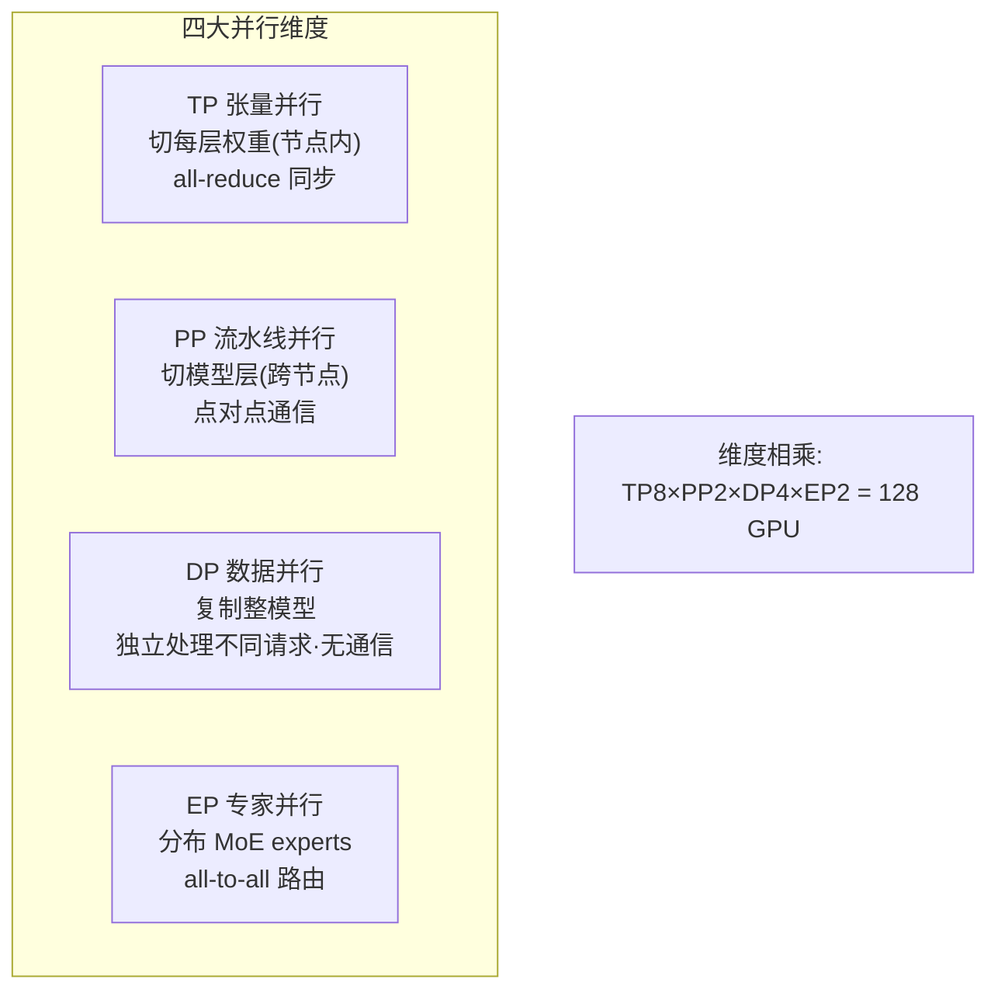

> **关键洞察**：SGLang 的**路由架构给了传统 DP 一个替代方案**——不用"训练式带同步的数据并行去复制模型"，而是**在 Router 后面跑独立 worker，零同步开销**。

### 8.1 张量并行 TP：切权重

模型太大装不下单卡时，**TP 把权重切到多卡**。SGLang 的 TP 用和 vLLM **一样的 Megatron 式算法**（列并行 / 行并行线性层 + all-reduce），但适配了 SGLang 的调度器和 RadixAttention。

- 每层权重按 TP rank 切分，**每卡存 1/TP 权重**；每层后 all-reduce 合并部分结果；
- 注意力层 QKV 投影**按列切**；MLP 层 up 投影用**列并行**、down 投影用**行并行**；
- ⚠️ **通信开销大**：每个 attention 和 MLP 层后都要 all-reduce → **对网络拓扑极敏感**。TP 组最好靠 **NVLink 连在单节点内**；跨节点 TP 需 InfiniBand 等高带宽互连。

```bash
# 单节点 8 卡 TP
python -m sglang.launch_server --model-path Qwen/Qwen2.5-0.5B-Instruct --tp 8

# 多节点 TP=16（2 节点，需指定 dist-init 地址和 node-rank）
# Node 0
python -m sglang.launch_server --model-path ... --tp 16 \
    --dist-init-addr 172.16.4.52:20000 --nnodes 2 --node-rank 0
# Node 1
python -m sglang.launch_server --model-path ... --tp 16 \
    --dist-init-addr 172.16.4.52:20000 --nnodes 2 --node-rank 1
```

### 8.2 流水线并行 PP：切层

**PP 按深度切**：把连续的层分给不同 stage（stage0 管层 0–7，stage1 管层 8–15……）。通信模式**比 TP 简单**——相邻 stage 间**点对点传激活**（不是全体 all-reduce），更适合**带宽有限的跨节点**部署。

- **挑战：流水线气泡（pipeline bubble）** —— 启动/排空阶段流水线未满时的空转（启动时后段等前段，排空时前段先完）。micro-batching、虚拟流水线并行能**缓解但无法根除**。
- **常与 TP 组合**：节点内用 TP（NVLink 高带宽），跨节点用 PP（低带宽可接受）。

```bash
python -m sglang.launch_server --model-path ... --tp 8 --pp 4 \
    --dist-init-addr 172.16.4.52:20000 --nnodes 2 --node-rank 0
```

### 8.3 数据并行 DP：请求级复制（Router 大放异彩之处）

**DP 复制整个模型**到多 worker，每个 worker 处理不同请求，**推理时 worker 间无通信**。**训练式 DP 要梯度同步，但推理 worker 真正独立**——SGLang 的 Router 提供**零同步开销的智能请求分发**。

**DP vs TP 权衡表（面试高频，务必记牢）**：

| 维度 | 数据并行 DP | 张量并行 TP |
|---|---|---|
| **显存** | 每 worker **完整模型** | 每 worker **1/TP 模型** |
| **通信** | 推理时**无** | **每层 all-reduce** |
| **延迟** | **更低**（无同步） | 更高（同步开销） |
| **吞吐** | 小 batch 更高 | 大 batch 更高 |
| **可扩展性** | **受模型大小限制** | **能扩到超大模型** |

> 💡 **决策口诀**：**模型能装进单 GPU → DP + 路由几乎总是胜过 TP**（延迟更低、容错更好、还能有 TP 给不了的会话亲和）。模型装不下单卡 → 才上 TP。

```bash
# 最简 DP + Router
python -m sglang.launch_server --model-path ... --port 30000   # Worker 1
python -m sglang.launch_server --model-path ... --port 30001   # Worker 2
python -m sglang_router.launch_router \
    --worker-urls http://worker1:30000 http://worker2:30001 --policy cache_aware
```

### 8.4 混合并行：组合拳

现实部署常混用多种策略。**最常见模式 = 节点内 TP（吃 NVLink）+ 跨节点 PP 或路由式 DP**：

| 场景 | 推荐组合 | 例子 |
|---|---|---|
| **大模型需多节点** | TP + PP | 32 GPU / 4 节点 → TP=8（节点内）+ PP=4（跨节点） |
| **高吞吐、模型装得下小组** | TP + DP（via Router） | 16 GPU → 4 个独立 worker，每个 TP=4，Router 分发无同步 |
| **MoE 模型** | TP + PP + EP | TP=4（节点内）+ PP=2（节点对间）+ EP=16（分布 experts） |

### 8.5 通信模式对照

| 并行 | 通信模式 | 通信量 / 频率 | 敏感点 |
|---|---|---|---|
| **TP** | **all-reduce**（每卡发部分结果给所有卡求和） | `O(hidden × batch)` / **每层** | 对互连带宽极敏感 |
| **PP** | **点对点**（仅相邻 stage 传激活） | 类似 TP / **每 micro-batch**（频率低） | |
| **EP** | **all-to-all**（token 路由） | 更复杂，**数据依赖**（不同 token 去不同 expert） | |
| **路由式 DP** | 推理时**无通信** | — | 因此延迟最低 |

**通信优化**：`--tp-comm-overlap`（通信与计算重叠）、拓扑感知放置（TP 组保持在 NVLink 域内）、多后端（NCCL 通用 / DeepEP 用于 MoE / Mooncake 用于 RDMA）。

### 8.6 多节点部署：两条路

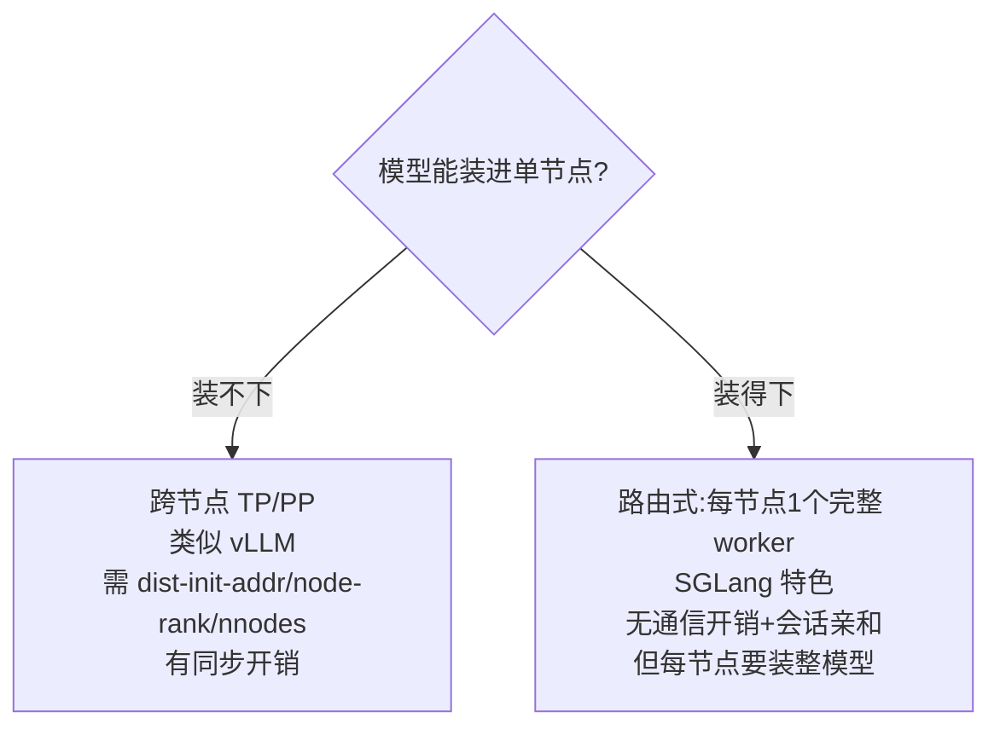

TP 多节点需配 `--dist-init-addr`（master 地址，NCCL 初始化）、每节点唯一 `--node-rank`（0=master）、`--nnodes`（总节点数）。路由式多节点则每节点起一个完整 worker，Router 用 `--policy cache_aware` 分发（相同 `session_id` 进同一 worker 保住 KV 局部性）。

---

## 9️⃣ MoE 优化 · 投机解码 · DP Attention

### 9.1 MoE 模型的专属优化

MoE 推理的**挑战：all-to-all 通信可能主导运行时**，尤其大 batch。SGLang 的应对：

- **all-to-all 后端**：**DeepEP**（跨节点 MoE 推荐）、**Mooncake**（DeepEP + RDMA，IB 上更低延迟）、**none**（EP+TP 混合想用 all-reduce 而非 all-to-all 时）；
- **expert 计算后端**：**DeepGEMM**（MoE 专门优化）、**Triton**（灵活可移植）、**CUTLASS**（NVIDIA 高性能 GEMM），`auto` 按硬件自选；
- **最强特色：通信重叠**——
  - **Two-Batch Overlap（TBO）**：把 batch 拆成 micro-batch 流水线化，**一个 micro-batch 做 all-to-all 时另一个跑 attention 计算**，几乎能**翻倍吞吐**（把通信延迟藏在计算后面）。`--enable-two-batch-overlap`
  - **Single-Batch Overlap（SBO）**：单 batch 内用**多 CUDA stream** 达到类似效果。`--enable-single-batch-overlap`

```bash
# 基础 MoE
python -m sglang.launch_server --model-path microsoft/Phi-tiny-MoE-instruct \
    --ep 8 --moe-a2a-backend deepep --moe-runner-backend deep_gemm

# 大 MoE（Qwen3-235B）组合并行
python -m sglang.launch_server --model-path Qwen/Qwen3-235B-A22B \
    --tp 4 --ep 16 --pp 2 \
    --moe-a2a-backend deepep --moe-runner-backend deep_gemm \
    --enable-dp-attention
```

> ⚠️ `--enable-dp-attention` 对 **KV head 少的模型（如用 MLA 的）特别重要**：避免 KV cache 在 TP rank 间重复，否则白白浪费显存。EP 组尽量留在 NVLink 域内——all-to-all 吃带宽，NVLink 的 600+ GB/s 远超跨节点互连。

### 9.2 投机解码（Speculative Decoding）

**核心思想**：用一个**更小更快的 draft 模型**预测多个 token，再用**大 target 模型并行验证**。

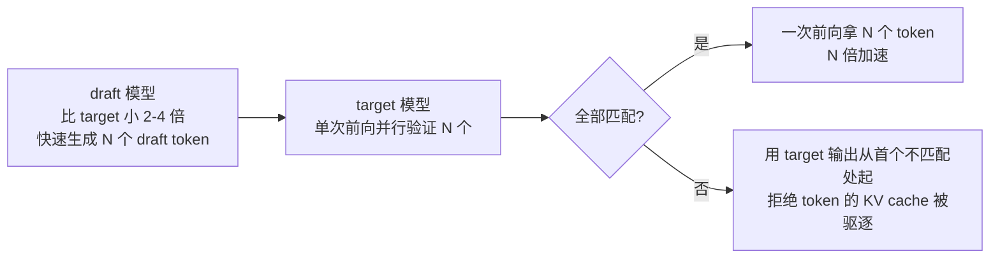

- **为什么快**：传统 decode 一次一个 token、**memory-bound**（GPU 大部分时间在加载权重而非计算）。投机解码把**多个验证步批在一起**。
- **接受率**：draft 越贴近 target 越高。**同家族、同训练数据**的配对常达 **70–90% 接受率 → 2–4 倍加速**。
- **要求**：draft 与 target **共享同一 tokenizer 和词表**；同家族（如 Qwen2.5-0.5B 做 Qwen2.5-7B 的 draft）效果最好。

```bash
python -m sglang.launch_server \
    --model-path Qwen/Qwen2.5-7B-Instruct \
    --speculative-draft-model-path Qwen/Qwen2.5-0.5B-Instruct \
    --speculative-num-draft-tokens 4
```

> 💡 **投机解码与 RadixAttention 完美互补**：RadixAttention 复用前缀 KV **降 prefill 时间 → 改善 TTFT（首 token 时间）**；投机解码**每次前向出多 token → 加速 decode 阶段**。两者合起来大幅降对话型负载的端到端延迟——**RadixAttention 管前缀，投机解码管生成**。

### 9.3 DP Attention（数据并行注意力）

**解决的问题微妙但重要**：传统 TP 里 QKV 投影切到各卡，但当 **KV head 数 < TP size** 时，**KV head 必须在各卡复制**。模型只有 1 个 KV head、TP=8 → **8 张卡各存一份完整 KV cache = 8 倍显存浪费**！（用 **MLA（Multi-Head Latent Attention）** 的模型正是这种。）

**DP Attention 的做法**：注意力计算**不用 TP 切、改用数据并行**——每卡独立处理不同请求、**KV cache 不复制**；MLP 前用 **all-gather** 合并各卡注意力输出，MLP 用 TP 跑（MLP 无 KV cache 问题），输出再切回各卡。

- **收益**：KV head 少的模型**解码吞吐最高提升 1.9 倍**（显存不浪费在重复 KV 上）；
- **适用**：**大 batch**（显存效率要紧时）最受益；**低延迟小 batch** 时 all-gather 开销可能盖过收益。

```bash
python -m sglang.launch_server --model-path microsoft/Phi-tiny-MoE-instruct \
    --enable-dp-attention --dp-size 8 --tp-size 8
```

---

## 🔟 生产部署模式 & 选型决策

### 按模型大小选部署模式

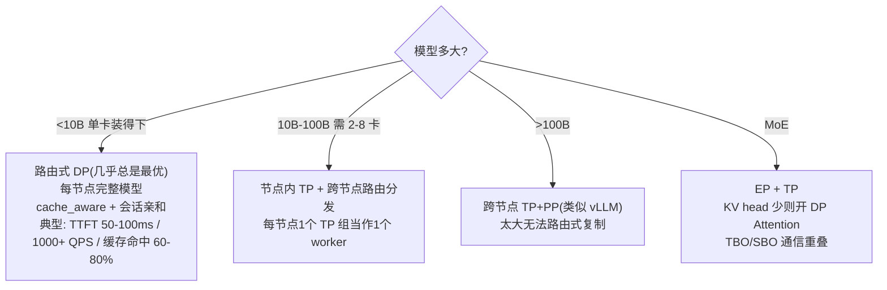

**跨模式通用优化清单**：

| 目标 | 措施 |
|---|---|
| **通信** | TP 留在 NVLink 域内；NCCL 配好网络（`NCCL_IB_DISABLE=0`、`NCCL_IB_GID_INDEX=3`、`NCCL_SOCKET_IFNAME=ib0`） |
| **显存** | 长上下文开 **chunked prefill**（`--enable-chunked-prefill` + `--max-num-batched-tokens`）：把长 prompt 拆小块与 decode 交错，避免显存尖峰和流水线气泡 |
| **量化** | FP8 或 INT4/AWQ 降显存、常提吞吐 |
| **延迟敏感** | 缓存感知路由 + 投机解码 |
| **吞吐敏感** | 扩 DP + 开所有重叠（`--tp-comm-overlap`、`--enable-two-batch-overlap`） |
| **PD 分离** | prefill/decode 特征差异大（长 prompt 短生成或反之）时独立伸缩 |

### 何时选 SGLang，何时选 vLLM 🎯

> **不是"谁更好"，而是"哪种优化焦点匹配你的 workload"。**

| 选 **SGLang** 当…… | 选 **vLLM** 当…… |
|---|---|
| **跨请求优化要紧**：聊天平台共享系统提示 | 服务**超大模型**、需跨大量 GPU 做 TP/PP |
| **多轮对话** + 会话亲和保住 KV cache | **批吞吐**比延迟重要 |
| **高 QPS**，路由式扩展避开模型并行开销 | **单发 prompt 无前缀复用**为主 |
| 需**结构化输出**（XGrammar） | |

> 💡 **两者并非互斥**：vLLM 也支持前缀缓存和 session pinning；它们代表**不同的设计取舍、对"该优化什么"的不同回答**。很多生产部署**两者并用**——vLLM 跑批处理和大模型，SGLang 跑交互式 API（RadixAttention + 会话亲和带来延迟收益），再用一个路由层按 workload 特征把流量导到合适后端。

---

## 🧪 动手练习（原书习题精讲）

原书给了 6 道从易到难的练习，串起本章所有核心概念：

| # | 题目 | 学什么 | 关键接口/机制 |
|---|---|---|---|
| 1 | **实现 RadixAttention cache** | 前缀缓存机制 | `RadixCache`：trie 结构 + 每节点存 KV + LRU 驱逐 + 命中率统计；`lookup` 返回最长匹配前缀长度（`[1,2,3,4,10,11]` 查得 match_len=4） |
| 2 | **Benchmark 前缀缓存** | 对比 SGLang vs vLLM | 造无/中/高共享前缀三档 workload，测 TTFT、命中率、显存、吞吐，出对比图 |
| 3 | **实现受约束解码** | JSON schema 强制输出 | 语法过滤 token、处理嵌套结构、测 vs 无约束的开销 |
| 4 | **多轮对话 + 状态** | 跨轮复用 KV cache | `@sgl.function` + `sgl.system/user/assistant/gen`，支持分支对话，比 naive 省显存 |
| 5 | **fork 并行生成** | best-of-N | `s.fork(n)` 分叉状态并行探索多路径 → `sgl.join`，测 vs 顺序生成的加速比 |

**练习 4/5 展示的 SGLang 原生编程接口（重点体会）**：

```python
import sglang as sgl

@sgl.function
def multi_turn_chat(s, system_prompt: str):
    s += sgl.system(system_prompt)
    s += sgl.user("What is machine learning?")
    s += sgl.assistant(sgl.gen("response1", max_tokens=200))
    # 第二轮自动复用第一轮的 KV cache（RadixAttention 在幕后工作）
    s += sgl.user("Can you give me a simple example?")
    s += sgl.assistant(sgl.gen("response2", max_tokens=200))
```

```python
@sgl.function
def parallel_generation(s, prompt: str, num_samples: int = 4):
    s += sgl.user(prompt)
    forks = s.fork(num_samples)          # 分叉状态，多路径并行
    for i, fork in enumerate(forks):
        fork += sgl.assistant(sgl.gen(f"response_{i}", max_tokens=200, temperature=0.8))
    s += sgl.join(forks)                 # 合并
```

> 💡 **这就是 SGLang 名字里 "Structured Generation Language" 的由来**——它不只是个推理服务器，还是一套**用 `@sgl.function` + `fork/join` 描述复杂 LLM 程序**的 DSL。多轮 / 分叉 / best-of-N 这些结构**天然映射到 RadixAttention 的前缀共享**：`fork` 出来的多路共享同一前缀 KV，只算各自后缀。

**完成后应能**：理解 RadixAttention 与前缀缓存机制、benchmark 前缀缓存、实现 JSON schema 约束解码、构建高效多轮对话、用 fork 做并行生成、用共享前缀优化推理负载。

---

## 📌 小结

本章我们把 SGLang 的"跨请求优化"哲学从内核吃到了生产部署：

1. **一句话灵魂**：vLLM 优化"一个请求算得多快"（intra-request），**SGLang 额外优化"多个请求怎么共享工作"（inter-request）**。SGLang **不拒绝**模型并行——TP/PP/EP 全支持——它只是把**跨请求优化提升为一等公民**。

2. **RadixAttention（主角）🌲**：把 KV cache 组织成**基数树**，公共前缀（系统提示 / few-shot / 多轮历史）**存一次、共享给所有请求**。长共享前缀场景 **prefill 计算最多省 90%、延迟降 2–3 倍**；无共享则收益微乎其微。调度器**感知这棵树**、按最长匹配前缀排序攒批；LRU 驱逐让树自我修剪；底层是**两级内存池 + 树**。

3. **零开销调度器**：用 **CPU/GPU 重叠**（token 占位符机制）消除 GPU 空转，**吞吐最高翻倍**。**XGrammar** 把语法**预编译成状态机**，实现低开销、保证合法的结构化输出。**算子融合**减少 kernel 启动开销。

4. **Router（扩展层）**：把请求分发给**独立 worker**，消除的是**跨请求同步**（不是层内 all-reduce）。搭配 **cache_aware 策略**和**会话亲和**，在**高 QPS 交互 / 多轮对话**上大放异彩——但收益**有条件**（要真有前缀复用）。天然容错（健康检查 / 熔断 / 会话迁移），胜过"一卡挂全组崩"的 TP/PP。

5. **PD 分离**：prefill（compute-bound）与 decode（memory-bound）资源画像相反，拆成专用 worker **独立伸缩**；KV cache 经 **RDMA/Mooncake 直传**、绕过 Router、原始 prompt 不进 decode worker。

6. **并行与部署决策**：**模型装得下单卡 → 路由式 DP 几乎总是最优**（低延迟 / 强容错 / 会话亲和）；装不下 → TP（节点内）+ PP（跨节点）；MoE 加 EP + TBO/SBO + DP Attention；投机解码与 RadixAttention **完美互补**（一个管前缀一个管生成）。

7. **选型**：不是谁更好，是**哪种优化焦点匹配你的负载**。两者**可并用**——vLLM 跑批处理/大模型，SGLang 跑交互式 API。

至此，我们讲完了分布式 AI 的两面：**训练系统**（DDP、FSDP、DeepSpeed、Megatron，优化吞吐与显存）和**推理系统**（vLLM、SGLang，优化延迟与吞吐）。下一章将手把手在 **HPC 集群 + Slurm** 上跑这些负载。

---

## 🔗 延伸阅读

**SGLang & RadixAttention**
- SGLang: Efficient Execution of Structured Language Model Programs (2023) — https://arxiv.org/abs/2312.07104 （RadixAttention 原论文，图 7.4–7.6 出处 Zheng et al., 2023）
- SGLang v0.4: Faster, Longer, and Scalable LLM Serving (2025) — https://arxiv.org/abs/2506.21901
- SGLang 文档 — https://docs.sglang.io/ ｜ GitHub — https://github.com/sgl-project/sglang

**分布式推理**
- SGLang Model Gateway (Router) — https://docs.sglang.io/advanced_features/router.html
- PD Disaggregation — https://docs.sglang.io/advanced_features/pd_disaggregation.html
- Expert Parallelism — https://docs.sglang.io/advanced_features/expert_parallelism.html
- Multi-Node Deployment — https://docs.sglang.io/references/multi_node_deployment/multi_node.html

**结构化输出 / 约束解码**
- XGrammar: Flexible and Efficient Structured Generation Engine (2024) — https://arxiv.org/abs/2411.15100
- Understanding Constrained Decoding — https://www.aidancooper.co.uk/constrained-decoding/

**教程与走读**
- SGLang Code Walk Through / Scheduler Evolution — https://github.com/zhaochenyang20/Awesome-ML-SYS-Tutorial
- Use Cases Favoring vLLM vs SGLang (2025) — https://kanerika.com/blogs/sglang-vs-vllm/

**代码入口速查**（原书 Code summary）：`sglang.Engine`（离线推理）、`sglang.srt.server`（分布式服务）、`sglang.srt.router`（请求路由）、`sglang.srt.scheduler`（调度器）、`sglang.srt.sampling_params`（采样/约束参数）。
