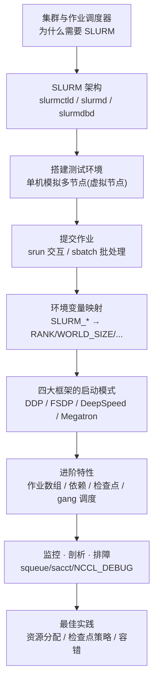
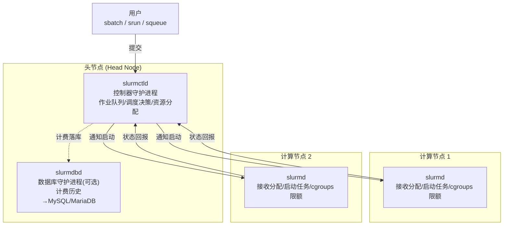
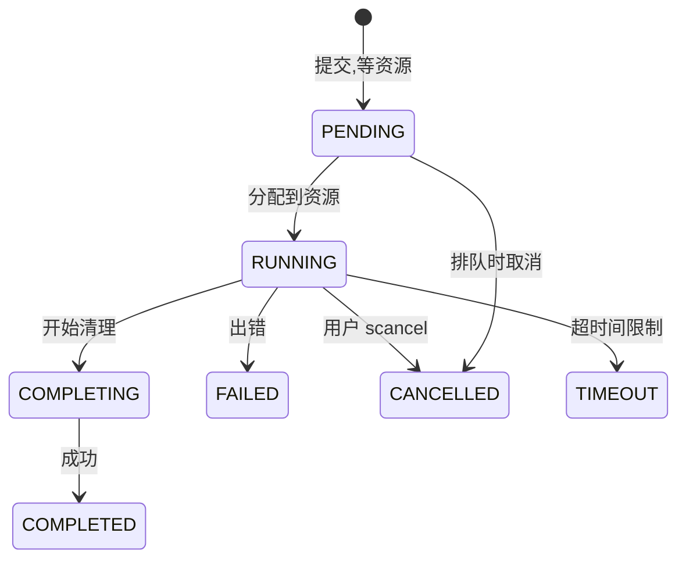
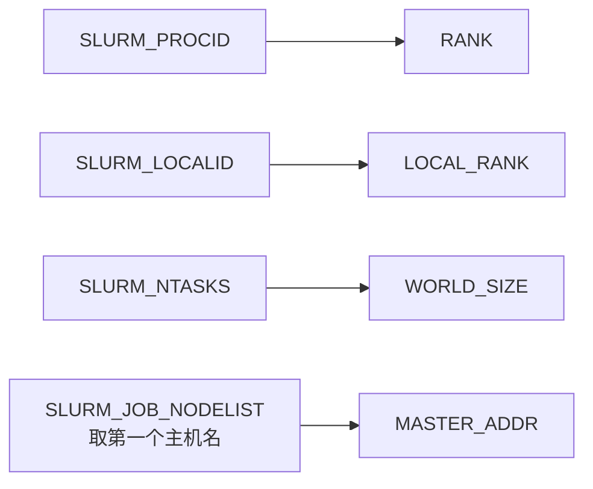
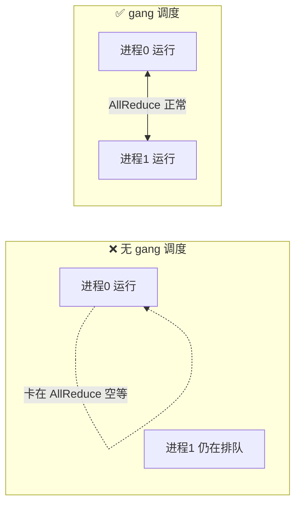
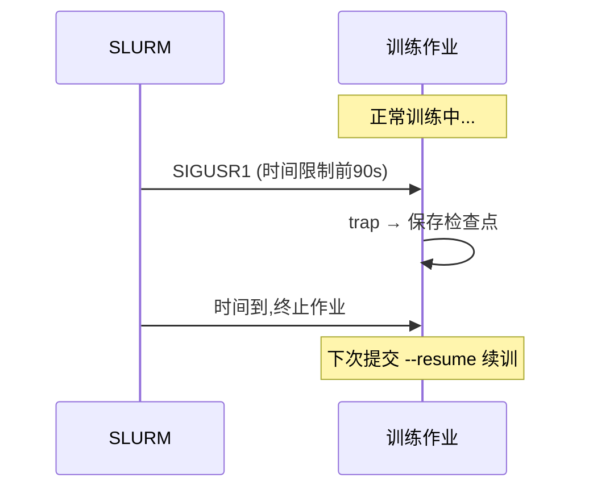

# 第 8 章 · 用 SLURM 运行分布式训练 🖥️

> "In a room full of top software designers, if two agree on the same thing, that's a majority." —— Bill Curtis
>
> 前几章把分布式训练的**理论**讲透了：DDP 做梯度同步、FSDP 省显存、DeepSpeed 的 ZeRO、Megatron 的模型并行。但这只是一半功夫。另一半是——**怎么在真实硬件上把它跑起来**：跨节点分配 GPU、协调进程、管理作业队列、处理规模化后必然出现的故障。这一章就讲这另一半的主角:**SLURM**。

---

## 🗺️ 本章地图



学完本章你将能够:
- 看懂 GPU 集群与作业调度器的运作原理,理解 SLURM 为什么成了 AI 训练的事实标准;
- 在**一台机器**上模拟多节点集群,不用真集群就能调试分布式代码;
- 熟练用 `srun` / `sbatch` 提交训练作业,读懂 `#SBATCH` 指令;
- 掌握 SLURM 环境变量到 PyTorch 分布式概念的映射,写出**跨集群可移植**的代码;
- 分别用 SLURM 启动 DDP / FSDP / DeepSpeed / Megatron-LM;
- 用作业数组做超参搜索、用依赖串联流水线、用信号做优雅检查点;
- 排查 NCCL 通信错误、作业挂起、GPU 分配失败等高频问题。

---

## 1. 🏢 从集群说起:为什么需要作业调度器

### 1.1 什么是 HPC/AI 集群

现代 AI 训练发生在**集群(cluster)** 上——一堆通过网络互联、把算力汇聚起来的机器。一个典型的 GPU 集群由四部分组成:

| 组成部分 | 英文 | 作用 |
|---|---|---|
| 计算节点 | compute nodes | 每台含多张 GPU、多核 CPU、大内存,真正干活的机器 |
| 高速互联 | interconnect | InfiniBand 或高带宽以太网,把节点连起来做跨机通信 |
| 共享存储 | shared storage | 所有节点都能访问的文件系统,放数据集/检查点 |
| 头节点 | head node | 管理作业提交与调度的"大脑",用户从这里登录 |

这样的集群小则几十节点、大则上千节点,代表着**数百万美元**的硬件,必须在众多用户和项目之间高效共享。

### 1.2 共享带来的根本矛盾 🔬

> 🔬 **第一性原理:调度器要解决的核心问题**
>
> 昂贵硬件共享有三个内在冲突,任何调度器都是在这三者之间做权衡:
> 1. **公平(fairness)**——怎么在用户之间公平分配资源,不让某个人独占;
> 2. **隔离(isolation)**——怎么保证作业之间互不干扰(尤其是 GPU 显存,一旦被别的作业抢占就会 OOM);
> 3. **利用率(utilization)**——怎么让这堆昂贵硬件尽可能不空转。
>
> 早期计算机时代,用户是"预约时间段"排队上机。现代集群用**作业调度器(job scheduler)** 自动化这件事:接收作业请求 → 按优先级和资源可用性排队 → 资源就绪时分配 → 监控运行 → 完成/失败后清理。

### 1.3 调度器生态与 SLURM 的位置

HPC 圈里调度器不止一家:

| 调度器 | 全称/背景 | 典型场景 |
|---|---|---|
| PBS / Torque / PBS Pro | Portable Batch System | 传统 HPC 曾经的主流 |
| LSF | Load Sharing Facility | 企业环境(金融、生命科学) |
| HTCondor | UW-Madison 出品 | 高吞吐计算(大量独立小作业) |
| Kubernetes | 云原生 | 云原生工作负载(可用 Volcano 扩展跑 HPC) |
| **SLURM** | **Simple Linux Utility for Resource Management** | **GPU 集群 + AI 训练的事实标准** |

对**跑 AI 训练的 GPU 集群**而言,SLURM 已经胜出:绝大多数高校、国家实验室都在用,云厂商的 HPC 实例也越来越多地采用它。

---

## 2. 🤔 为什么是 SLURM

SLURM 2002 年起源于劳伦斯·利弗莫尔国家实验室,如今已能管理**上百万核心**的集群。它特别适合 AI 训练的四个原因:

### 2.1 一等公民级的 GPU 支持(GRES)

SLURM 通过 **GRES(Generic Resource,通用资源)** 系统原生支持 GPU。你可以精确请求特定型号:

```bash
--gres=gpu:a100:4        # 请求 4 张 A100
```

关键在于 SLURM 保证**独占分配(exclusive allocation)**——你的作业运行期间,别的作业碰不到你的 GPU。

> 🔬 **为什么独占对训练至关重要**:训练是**长时间、显存吃满**的负载。如果多个作业共享同一张 GPU,显存碎片(memory fragmentation)会直接导致 out-of-memory 错误。CPU 可以时间片轮转共享,但 GPU 显存不能——所以训练必须独占。

### 2.2 与 PyTorch 分布式无缝衔接

SLURM 跨节点启动作业时会**自动设置环境变量**,它们和分布式训练的概念一一对应:

| SLURM 环境变量 | 对应的分布式概念 |
|---|---|
| `SLURM_PROCID` | 全局 rank(global rank) |
| `SLURM_LOCALID` | 节点内本地 rank(local rank) |
| `SLURM_NTASKS` | world size(总进程数) |
| `SLURM_JOB_NODELIST` | 节点列表(建立通信用) |

PyTorch 的 `torchrun` 启动器读这些变量就能**自动初始化进程组**。这一映射是整章的核心,后面会反复用到。

### 2.3 长跑作业的健壮管理

训练动辄跑几天几周,SLURM 提供了一整套配套能力:
- **作业数组(job arrays)** 做超参扫描;
- **作业依赖(dependencies)** 串联多阶段流水线;
- **抢占(preemption)与检查点支持** 处理时间限制;
- **详细计费(accounting)** 追踪资源使用。

### 2.4 规模可移植

同一套命令和脚本,在 4 节点的实验室小集群和 10000 节点的超算上都能跑。**技能可以跨机构、跨云厂商迁移**——这是 SLURM 最被低估的价值。

> 💡 **实战心法**:你的训练代码**不需要知道**自己是跑在 2 张卡的笔记本上还是 256 张卡的集群上。作业脚本声明资源需求(`--nodes=4 --gres=gpu:8`),SLURM 分配资源并设好环境,训练脚本用环境变量初始化通信——抽象把细节全接管了。这就是"写一次,到处跑"。

---

## 3. 🏗️ SLURM 架构总览

SLURM 由几个协同工作的守护进程(daemon)组成:



| 守护进程 | 跑在哪 | 职责 |
|---|---|---|
| **slurmctld**(控制器) | 头节点 | 中央大脑:管队列、做调度决策、分配资源、监控作业状态。生产集群常配**备份控制器**做高可用 |
| **slurmd**(计算守护) | 每个计算节点 | 接收 slurmctld 的分配、启动并监控任务、回报节点状态、用 Linux **cgroups** 强制资源限额 |
| **slurmdbd**(数据库守护) | 可选,常见于生产 | 把计费数据(作业历史、资源使用、用户/项目额度)存进 MySQL/MariaDB,支撑**公平份额(fair-share)** 调度与用量报表 |

### 3.1 一次提交发生了什么

当你 `sbatch` 提交作业时:
1. 请求送到 **slurmctld**,进入队列;
2. slurmctld 按调度策略(优先级 priority、公平份额 fair-share、回填 backfill)决定何时分配;
3. 资源就绪 → slurmctld 通知对应的 **slurmd**;
4. 各 slurmd 拉起你作业的进程,并设置好训练脚本要读的**环境变量**。

> 💡 **用户视角就够了**:SLURM 的调度算法、分区(partition)配置、QOS 策略、插件架构是集群管理员的功课。**本章只讲用户面**——怎么提交作业、请求资源、对接训练框架。你不需要会装 SLURM,但理解架构能帮你在作业行为异常时快速定位。

一个细节:提交新作业或开交互式分配都走 slurmctld;**一旦你持有了分配(allocation),分配内的 `srun` 就直接和各节点上的本地 slurmd 对话**,不再经过控制器。

---

## 4. 🧪 单机模拟多节点:无集群也能调试

大多数人不用自己装 SLURM(管理员会搞定)。但**在一台机器上搭个测试环境**极其有用——能在提交到生产集群前,先把分布式脚本调通。

### 4.1 核心洞见:节点 ≠ 物理机 🔬

> 🔬 **第一性原理:虚拟节点为什么可行**
>
> SLURM 架构把"节点(node)"的**概念**和"物理机"**分离**了。每个 `slurmd` 守护进程代表**一个节点**。所以,在**不同端口**上跑多个 `slurmd`,就能造出若干 SLURM 眼中彼此独立的"虚拟节点(virtual node)"——哪怕它们其实都在同一台物理机上。再把每个虚拟节点绑到不同 GPU,你就有了一个能跑多节点分布式代码的"迷你集群"。

### 4.2 slurm.conf:定义虚拟节点

```conf
# 启用多 slurmd 支持
# 用 $HOSTNAME 或 $(hostname) 拿到真实主机名
NodeName=node6 NodeHostname=$HOSTNAME Port=17016 \
    CPUs=112 RealMemory=240000 Gres=gpu:1 State=UNKNOWN
NodeName=node7 NodeHostname=$HOSTNAME Port=17017 \
    CPUs=112 RealMemory=240000 Gres=gpu:1 State=UNKNOWN
```

逐行看:
- `NodeName=node6`——这个虚拟节点叫 node6;
- `NodeHostname=$HOSTNAME`——两个虚拟节点**共享同一个主机名**(因为在同一台机);
- `Port=17016` / `Port=17017`——**不同端口**是区分虚拟节点的关键;
- `Gres=gpu:1`——声明每个节点有 1 张 GPU 可用;
- `CPUs=112 RealMemory=240000`——CPU 核数与内存(MB)。

### 4.3 gres.conf:把虚拟 GPU 映射到物理设备

```conf
NodeName=node6 Name=gpu File=/dev/nvidia6
NodeName=node7 Name=gpu File=/dev/nvidia7
```

- `File=/dev/nvidia6`——把 node6 的 GPU 绑到物理设备 `/dev/nvidia6`。路径是 **NVIDIA 专用**的;其他厂商设备文件不同,查 [SLURM GRES 文档](https://slurm.schedmd.com/gres.html)。
- 本例假设一台 8 卡机,把**最后两张卡(索引 6、7)** 划给虚拟集群。你可以改成 `/dev/nvidia0`、`/dev/nvidia1` 用前两张。

这个映射保证:当作业在 node6 上请求 `--gres=gpu:1` 时,SLURM 会把 `CUDA_VISIBLE_DEVICES` 设成只暴露 `/dev/nvidia6` 给该作业。

```mermaid
flowchart LR
    subgraph PM["一台物理机 (8 GPU)"]
        direction TB
        subgraph V6["虚拟节点 node6"]
            S6["slurmd :17016"]
        end
        subgraph V7["虚拟节点 node7"]
            S7["slurmd :17017"]
        end
        G6["/dev/nvidia6"]
        G7["/dev/nvidia7"]
        S6 -.gres.conf.-> G6
        S7 -.gres.conf.-> G7
    end
```

### 4.4 一键搭建与验证

书里提供的 `slurm_setup.sh` 脚本自动化了这一切:建配置目录、写 `slurm.conf`/`gres.conf`、初始化状态目录、拉起 slurmctld 与每虚拟节点一个 slurmd:

```bash
cd code
bash slurm_setup.sh
```

守护进程起来后,验证集群:

```bash
# 把 SLURM 加进 PATH(把 $SLURM_PREFIX 换成你的安装前缀,常见 /opt/slurm 或 $HOME/slurm)
export PATH=$SLURM_PREFIX/bin:$PATH

# sinfo 查看分区与节点状态
sinfo
# 示例输出:
# PARTITION AVAIL  TIMELIMIT  NODES  STATE NODELIST
# gpu*         up   infinite      2   idle node[6-7]
```

输出里 `gpu*` 的星号表示这是**默认分区**,2 个 idle 节点就绪。想看更详细的节点信息用 `scontrol show nodes`。

再跑个冒烟测试确认作业能真跑起来:

```bash
srun -N 1 hostname      # 在 1 个节点上跑 hostname
srun -N 2 hostname      # 在 2 个节点上同时跑
```

两条都成功打印出预期节点名,说明环境就绪,可以开始分布式训练实验了。

---

## 5. 📤 提交分布式训练作业

SLURM 提供两种主要提交方式:

| 方式 | 命令 | 适用 | 特点 |
|---|---|---|---|
| 交互执行 | `srun` | 快速测试、调试 | 立即执行,占用终端,需保持连接 |
| 批处理提交 | `sbatch` | 生产训练 | 排队执行,可登出后继续跑 |

### 5.1 交互执行:srun

```bash
# 两个节点,每节点 1 GPU
srun -N 2 --gres=gpu:1 --cpus-per-task=4 python code/train.py
```

标志逐个看:
- `-N 2`——请求 2 个节点;
- `--gres=gpu:1`——每节点 1 张 GPU;
- `--cpus-per-task=4`——每个任务分 4 个 CPU 核(给数据加载/预处理用)。4 核是冒烟测试的**保守值**;后面生产脚本会要 28 核,当 DataLoader worker 和预处理需要余量时。

书中的 `code/train.py` 是个自包含示例:自动检测 SLURM 环境变量、初始化分布式、在合成数据(`SimpleDataset`)上跑一个 3 层小网络(`SimpleModel`)——专门用来验证集群配置。

交互执行方便开发,但**占着终端、要求保持连接**。生产训练动辄几小时几天,批处理才是标配。

### 5.2 批处理提交:sbatch

批处理作业写在 shell 脚本里,用特殊的 `#SBATCH` 指令声明资源。提交到队列后,资源就绪就跑,**哪怕你已经登出**:

```bash
#!/bin/bash
#SBATCH --job-name=ddp-training
#SBATCH --nodes=2
#SBATCH --gres=gpu:1
#SBATCH --ntasks-per-node=1
#SBATCH --cpus-per-task=28
#SBATCH --mem=200G
#SBATCH --time=24:00:00
#SBATCH --output=train_%j.out
#SBATCH --error=train_%j.err

# 拿到节点列表与主节点地址
export MASTER_ADDR=$(scontrol show hostnames "$SLURM_JOB_NODELIST" | head -n 1)
export MASTER_PORT=$((29500 + RANDOM % 1000))
export WORLD_SIZE=$SLURM_NTASKS
export RANK=$SLURM_PROCID
export LOCAL_RANK=$SLURM_LOCALID

echo "Master: $MASTER_ADDR:$MASTER_PORT"
echo "World size: $WORLD_SIZE, Rank: $RANK, Local rank: $LOCAL_RANK"

# 启动训练
srun python code/train_ddp.py
```

**顶部 `#SBATCH` 指令**定义了作业的**资源信封(resource envelope)**:

| 指令 | 含义 |
|---|---|
| `--job-name=ddp-training` | 作业名,便于识别 |
| `--nodes=2` | 2 个节点 |
| `--gres=gpu:1` | 每节点 1 GPU |
| `--ntasks-per-node=1` | 每节点 1 个任务 |
| `--cpus-per-task=28` | 每任务 28 个 CPU 核 |
| `--mem=200G` | 每节点 200GB 内存 |
| `--time=24:00:00` | 24 小时时间限制 |
| `--output=train_%j.out` | 标准输出文件(`%j` 展开成作业 ID) |
| `--error=train_%j.err` | 标准错误文件 |

`%j` 会展开成作业 ID,所以**每次运行都有唯一日志文件**。这些指令对 shell 是注释,但会被 `sbatch` 在执行前解析。

**中间段**搭建分布式环境。最关键的是 `MASTER_ADDR`——rank 0 运行的主机名,其他所有 rank 都连它来建进程组。`scontrol show hostnames` 把 SLURM 的压缩节点列表格式(如 `node[6-7]`)展开成一个个主机名,`head -n 1` 取第一个当 master。

提交并拿到作业 ID:

```bash
sbatch code/train_ddp.sh
```

监控进度:

```bash
squeue                       # 列出所有作业
squeue -u $USER              # 只看你的作业
scontrol show job <job_id>   # 某作业的详细信息
```

### 5.3 作业状态生命周期



| 状态 | 含义 |
|---|---|
| PENDING(PD) | 排队等资源 |
| RUNNING(R) | 已分配,运行中 |
| COMPLETING(CG) | 清理中 |
| COMPLETED | 成功完成 |
| FAILED | 出错失败 |
| CANCELLED | 用户干预取消 |
| TIMEOUT | 超过时间限制 |

用 `squeue` 看当前状态,`sacct` 查历史作业信息。

---

## 6. 🔤 吃透 SLURM 环境变量

SLURM 启动作业时会自动填充一批环境变量,训练脚本读它们来配置分布式通信。**理解这些变量是写跨集群可移植代码的前提。**

### 6.1 作业级变量(描述整体分配)

| 变量 | 含义 | 典型用途 |
|---|---|---|
| `SLURM_JOB_ID` | 作业唯一标识 | 命名日志文件、检查点 |
| `SLURM_JOB_NAME` | `--job-name` 指定的名字 | 识别作业 |
| `SLURM_JOB_NODELIST` | 分配节点(压缩格式,如 `node[6-7]`) | 建立通信 |
| `SLURM_JOB_NUM_NODES` | 节点数量 | 传给 `--nnodes` |
| `SLURM_SUBMIT_DIR` | 提交作业时所在目录 | 定位配置文件/数据 |

### 6.2 进程级变量(分布式训练最关键)⭐

每个 SLURM 启动的任务都会收到:

| 变量 | 范围 | 含义 |
|---|---|---|
| `SLURM_PROCID` | 0 ~ NTASKS-1 | **全局 rank**——本进程在所有进程中的唯一编号 |
| `SLURM_LOCALID` | 0 ~ tasks-per-node-1 | **本地 rank**——节点内的编号,通常用来**绑 GPU** |
| `SLURM_NODEID` | 0 ~ NUM_NODES-1 | 本进程在哪个节点 |
| `SLURM_NTASKS` | —— | 总任务数,等价于 **world size** |
| `SLURM_TASKS_PER_NODE` | —— | 每节点任务数(异构分配时可能各节点不同) |

> ⚠️ **常见坑:GPU 绑定要用 LOCAL_RANK,别用全局 rank**。`SLURM_LOCALID=0` 的进程用该节点的 GPU 0,依此类推。**用 `LOCAL_RANK` 绑定而不是从全局 rank 猜**——这能避免多个作业共享一个节点时的冲突。

### 6.3 资源相关变量(调性能用)

| 变量 | 含义 |
|---|---|
| `SLURM_CPUS_PER_TASK` | 每任务 CPU 核数 → 设 DataLoader 的 `num_workers` |
| `SLURM_GPUS_ON_NODE` | 当前节点 GPU 数 |
| `SLURM_MEM_PER_NODE` | 节点内存分配(MB) |
| `CUDA_VISIBLE_DEVICES` | GRES 插件设置,让每任务只看到自己的 GPU(通常重映射为 `cuda:0`,`cuda:1`…) |

### 6.4 核心映射:SLURM → PyTorch

这是整章最该背下来的对应关系:



一段典型的翻译脚本:

```bash
export MASTER_ADDR=$(scontrol show hostnames "$SLURM_JOB_NODELIST" | head -n 1)
export MASTER_PORT=$((29500 + RANDOM % 1000))
export WORLD_SIZE=$SLURM_NTASKS
export RANK=$SLURM_PROCID
export LOCAL_RANK=$SLURM_LOCALID
```

设好之后,`torchrun` 或 `torch.distributed.init_process_group(init_method='env://')` 就会读这些变量,**自动**配置进程组。

> ⚠️ **常见坑:固定端口会撞车**。在共享集群上,固定端口(如 29500)可能和别的作业冲突,导致一个**语焉不详的 NCCL 错误**。像上面那样**随机化 `MASTER_PORT`**(`29500 + RANDOM % 1000`)能避开绝大多数冲突。

> 💡 **抽象的威力**:训练代码**根本不需要知道**自己是跑在 SLURM 下、被 `torchrun` 在单机启动、还是被某个云厂商编排。同一份脚本到处能跑,因为它依赖**标准环境变量**而非 SLURM 专有 API。这就是可移植性的来源。

---

## 7. 🚀 用 SLURM 启动四大训练框架

各框架有自己的启动器和初始化模式,但都依赖上面这套 SLURM 环境变量。共同模式是:**SLURM 分配节点和 GPU → 跨集群启动进程 → 设好环境变量 → 各框架读变量建立通信**。区别只在"框架怎么包装这个过程"。

### 7.1 四框架 SLURM 集成对照表

| 框架 | 启动器 | 分布式初始化 | SLURM 变量处理 |
|---|---|---|---|
| **DDP** | `torchrun` 或 `srun` | 手动(Manual) | 需导出到 `RANK`、`WORLD_SIZE` 等 |
| **FSDP** | `torchrun` | 手动 | 同 DDP |
| **DeepSpeed** | `python` | 自动(Automatic) | 直接读 SLURM 变量 |
| **Megatron-LM** | `torchrun` | 自动 | 直接读 SLURM 变量 |

- **"手动"初始化**:你在训练脚本里显式调 `dist.init_process_group()`,并在 SLURM 批处理脚本里设置环境变量。
- **"自动"初始化**:框架内部搞定分布式初始化——DeepSpeed 靠 `deepspeed.init_distributed()`,Megatron-LM 靠自己的启动器基础设施——直接读 SLURM 环境变量,不需要显式设置代码。

### 7.2 DDP with SLURM

DDP 在每张 GPU 上**复制整个模型**、把数据分给各进程、反向传播时用 **AllReduce** 同步梯度。因为每张卡都有完整模型副本,DDP 最适合模型能**舒适装进单卡显存**的情况。

**训练脚本**(完整版 `code/train_ddp.py`):

```python
import os
import torch
import torch.distributed as dist
import torch.nn as nn
from torch.nn.parallel import DistributedDataParallel as DDP

def main():
    dist.init_process_group(backend='nccl')
    rank = dist.get_rank()
    local_rank = int(os.environ["LOCAL_RANK"])

    device = torch.device(f'cuda:{local_rank}')
    model = nn.Linear(10, 1).to(device)
    model = DDP(model, device_ids=[local_rank])

    for epoch in range(10):
        # ... 训练代码 ...
        if rank == 0:
            print(f"Epoch {epoch} completed")

    dist.destroy_process_group()

if __name__ == '__main__':
    main()
```

逐点讲:
- `dist.init_process_group(backend='nccl')`——用 NCCL 后端初始化进程组(GPU 间通信首选);
- `local_rank = int(os.environ["LOCAL_RANK"])`——读本地 rank;
- `device = torch.device(f'cuda:{local_rank}')`——**用 local_rank 绑定到本节点对应 GPU**;
- `model = DDP(model, device_ids=[local_rank])`——DDP 包装;
- `if rank == 0`——只让全局 rank 0 打印,避免每个进程都刷屏。

**SLURM 批处理脚本(torchrun 版)**(完整版 `code/train_ddp.sh`):

```bash
#!/bin/bash
#SBATCH --nodes=2
#SBATCH --gres=gpu:1
#SBATCH --ntasks-per-node=1

export MASTER_ADDR=$(scontrol show hostnames "$SLURM_JOB_NODELIST" | head -n 1)
export MASTER_PORT=$((29500 + RANDOM % 1000))

srun torchrun \
    --nproc_per_node=1 \
    --nnodes=$SLURM_JOB_NUM_NODES \
    --node_rank=$SLURM_NODEID \
    --master_addr=$MASTER_ADDR \
    --master_port=$MASTER_PORT \
    code/train_ddp.py
```

`torchrun` 的参数从 SLURM 变量取值:`--nnodes` 取自 `SLURM_JOB_NUM_NODES`,`--node_rank` 取自 `SLURM_NODEID`。

**另一种:用 SLURM 内建 MPI 支持,不用 torchrun**:

```bash
#!/bin/bash
#SBATCH --nodes=2
#SBATCH --gres=gpu:1
#SBATCH --ntasks-per-node=1

export MASTER_ADDR=$(scontrol show hostnames "$SLURM_JOB_NODELIST" | head -n 1)
export MASTER_PORT=$((29500 + RANDOM % 1000))
export WORLD_SIZE=$SLURM_NTASKS
export RANK=$SLURM_PROCID
export LOCAL_RANK=$SLURM_LOCALID

srun python code/train_ddp.py
```

这种方式要求 Python 代码用 `init_method='env://'`,它会从环境变量读 `RANK`、`WORLD_SIZE`、`MASTER_ADDR`、`MASTER_PORT`。

> 💡 **两种方式怎么选**:`torchrun` 方式让 `torchrun` 负责在每节点内 fork 进程(`--nproc_per_node`),你的 Python 代码更简单;`srun python` 方式让 SLURM 直接把每个任务当一个进程拉起,少一层封装但要自己处理 `env://`。多节点单卡场景两者都行;单节点多卡时 `torchrun` 更省心。

### 7.3 FSDP with SLURM

FSDP 把模型参数、梯度、优化器状态**分片(shard)** 到各 GPU,大幅降低单卡显存需求。**SLURM 启动模式和 DDP 完全一样**——同样用 `torchrun`。区别只在 Python 代码里:用 `FullyShardedDataParallel` 包装而不是 `DistributedDataParallel`。

```python
import torch
import torch.distributed as dist
from torch.distributed.fsdp import FullyShardedDataParallel as FSDP
from torch.distributed.fsdp import CPUOffload
from torch.distributed.fsdp.wrap import size_based_auto_wrap_policy

def main():
    dist.init_process_group(backend='nccl')
    rank = dist.get_rank()

    model = MyLargeModel()
    model = FSDP(
        model,
        auto_wrap_policy=size_based_auto_wrap_policy,
        cpu_offload=CPUOffload(offload_params=True),
    )

    # 训练循环...

if __name__ == '__main__':
    main()
```

- `auto_wrap_policy=size_based_auto_wrap_policy`——按大小自动决定哪些子模块单独分片;
- `cpu_offload=CPUOffload(offload_params=True)`——把参数下放到 CPU 省显存。

> 💡 **版本提示**:上例用的是 **FSDP1** 的 `CPUOffload` 辅助类;在 **PyTorch 2.4+ 的 FSDP2** 上,换成 `fully_shard()` 和 `CPUOffloadPolicy`。**只有 Python 包装变了,SLURM 脚本一字不改。**

SLURM 批处理脚本(`code/train_fsdp.sh`)和 DDP 的 torchrun 版几乎一模一样,不再赘述——这正是"启动模式统一"的好处。

### 7.4 DeepSpeed with SLURM

DeepSpeed 的 ZeRO 优化器有三个阶段:ZeRO-1 切分优化器状态,ZeRO-2 再加梯度切分,ZeRO-3 进一步切分模型参数本身。ZeRO-3 概念上和 FSDP 类似(都切参数),但 DeepSpeed 还提供 **CPU / NVMe 卸载**,能把显存边界推得更远。

**关键区别**:DDP/FSDP 你要显式调 `dist.init_process_group()` 并用 `torchrun` 启动;DeepSpeed 不一样——它通过 `deepspeed.init_distributed()` **内部处理分布式初始化**,直接读 SLURM 环境变量,不需要单独的启动器。你只管 `python train.py`,DeepSpeed 自动搞清楚分布式拓扑。

```python
import torch
import deepspeed
from transformers import AutoModelForCausalLM, AutoTokenizer

def main():
    deepspeed.init_distributed()

    model = AutoModelForCausalLM.from_pretrained("gpt2")
    tokenizer = AutoTokenizer.from_pretrained("gpt2")

    model_engine, optimizer, _, _ = deepspeed.initialize(
        model=model,
        model_parameters=model.parameters(),
        config="ds_zero3_offload.json"
    )

    for epoch in range(10):
        # ... 训练代码 ...
        model_engine.backward(loss)
        model_engine.step()

if __name__ == "__main__":
    main()
```

注意:脚本**没有** import `torch.distributed`,也**没有**调 `init_process_group()`——DeepSpeed 全接管了。`deepspeed.initialize()` 返回的 `model_engine` 用 ZeRO 优化包装了模型,你用 `model_engine.backward()` 和 `model_engine.step()` 替代标准 PyTorch 优化器方法。

**配置文件**(`ds_zero3_offload.json`)控制 ZeRO 行为:

```json
{
  "train_batch_size": 2,
  "gradient_accumulation_steps": 1,
  "train_micro_batch_size_per_gpu": 1,
  "fp16": { "enabled": true },
  "zero_optimization": {
    "stage": 3,
    "offload_param": { "device": "cpu", "pin_memory": true },
    "offload_optimizer": { "device": "cpu", "pin_memory": true }
  },
  "optimizer": {
    "type": "AdamW",
    "params": { "lr": 5e-5, "weight_decay": 0.01 }
  }
}
```

- `"stage": 3`——启用完整参数分片(改成 `1` 或 `2` 就切换到 ZeRO-1/2);
- `offload_param` / `offload_optimizer`——模型超出总 GPU 显存时把参数/优化器状态卸到 CPU;
- `"pin_memory": true`——用**锁页(page-locked)CPU 内存**加速 CPU-GPU 传输。

> 💡 **实战:把这份 JSON 当"生产级模板"**。先用 ZeRO **stage 1 或 2** 把 NCCL 和 SLURM 的接线验证通,再启用 stage 3 + CPU 卸载——等作业能干净跑起来后再上最激进的配置,能省下大量调试时间。

**SLURM 批处理脚本**(`code/deepspeed/run.slurm`)比 DDP 需要更多设置,因为要**手动导出** DeepSpeed 期望的环境变量:

```bash
#!/bin/bash
#SBATCH --job-name=deepspeed-zero3
#SBATCH --nodes=2
#SBATCH --gres=gpu:1
#SBATCH --ntasks-per-node=1
#SBATCH --cpus-per-task=8
#SBATCH --mem=200G

# 换成你的 conda 路径和环境名
source ~/miniconda3/etc/profile.d/conda.sh
conda activate research

export MASTER_ADDR=$(scontrol show hostnames "$SLURM_JOB_NODELIST" | head -n 1)
export MASTER_PORT=$((29500 + RANDOM % 1000))
export WORLD_SIZE=$SLURM_NTASKS

export NCCL_DEBUG=WARN
export NCCL_SOCKET_IFNAME=^docker,lo
export GLOO_SOCKET_IFNAME=eth0

srun --chdir="$SLURM_SUBMIT_DIR" --label \
    bash -c "
        source ~/miniconda3/etc/profile.d/conda.sh
        conda activate research
        export CUDA_VISIBLE_DEVICES=\$SLURM_LOCALID
        export LOCAL_RANK=\$SLURM_LOCALID
        export RANK=\$SLURM_PROCID
        cd \"$SLURM_SUBMIT_DIR\"
        python train.py --deepspeed --deepspeed_config ds_zero3_offload.json
    "
```

结构上:**作业级**设 `MASTER_ADDR`、`MASTER_PORT`、`WORLD_SIZE`;`srun` 在每节点拉起一个 bash 子 shell,里面导出**每进程级**变量(`CUDA_VISIBLE_DEVICES`、`LOCAL_RANK`、`RANK`)。`--label` 标志给每行输出加上任务 ID 前缀,多节点调试时非常有用。

> ⚠️ **致命坑:MASTER_ADDR 千万别写 127.0.0.1**。一定要用 `scontrol` 推导出真实主节点主机名。如果写成 `127.0.0.1`,**每个节点会各自组成一个单节点进程组,梯度永远不跨节点同步**——而且在本章前面那个"两个 slurmd 共享一台物理机"的虚拟集群上,这个错误会**悄无声息地隐藏**(因为它们本来就在同一台机上),等你上真集群才爆雷。

> ⚠️ **DeepSpeed 三个额外注意点**:
> 1. DeepSpeed **需要 `LOCAL_RANK`** 环境变量,你必须从 `SLURM_LOCALID` 显式导出——不像 `torchrun` 会自动设;
> 2. 用虚拟节点测试时,记得把节点名映射到对的 GPU 索引(node6 → GPU 6);
> 3. 某些集群上 **IPv6 会导致连接问题**,把 `NCCL_SOCKET_IFNAME` 和 `GLOO_SOCKET_IFNAME` 设成排除有问题的接口(如 `^docker,lo`)常能解决。

### 7.5 Megatron-LM with SLURM

Megatron-LM 是 NVIDIA 的生产级框架,把**张量并行(TP)、流水线并行(PP)、序列/上下文并行(CP/SP)、数据并行(DP)** 全部组合在一次训练里。这种多维并行是训练**最大规模**语言模型的必需——没有任何单一并行策略能独立胜任。

**安装坑**⚠️:和 PyTorch 内建的 DDP/FSDP 不同,Megatron-LM **需要从源码安装**才能拿到完整训练基础设施。PyPI 上的 `megatron-core` 只含 `megatron.core`(模型构建块),而训练脚本 `pretrain_gpt.py` 需要 `megatron.training`,只有从 GitHub 源码装才有:

```bash
conda activate research
git clone https://github.com/NVIDIA/Megatron-LM.git
cd Megatron-LM
pip install --no-build-isolation '.[mlm,dev]'
```

还要把训练脚本(`pretrain_gpt.py`、`gpt_builders.py`、`model_provider.py`)拷到工作目录,因为它们不作为 package 的一部分安装。

**SLURM 批处理脚本**(`code/megatron/run.slurm`,节选核心):

```bash
#!/bin/bash
#SBATCH --job-name=megatron-gpt
#SBATCH --nodes=2
#SBATCH --gres=gpu:1
#SBATCH --ntasks-per-node=1
#SBATCH --cpus-per-task=8
#SBATCH --mem=200G
#SBATCH --time=4:00:00
#SBATCH --output=logs/train_%j_%N.out
#SBATCH --error=logs/train_%j_%N.err

source ~/miniconda3/etc/profile.d/conda.sh
conda activate research

export MASTER_ADDR=$(scontrol show hostnames "$SLURM_JOB_NODELIST" | head -n 1)
export MASTER_PORT=${MASTER_PORT:-6000}
export WORLD_SIZE=$SLURM_NTASKS

export NCCL_DEBUG=WARN
export NCCL_SOCKET_IFNAME=^docker,lo
export NCCL_IB_DISABLE=0
export CUDA_DEVICE_MAX_CONNECTIONS=1
export OMP_NUM_THREADS=$SLURM_CPUS_PER_TASK

# 模型与训练配置(定义一个 8B 参数 GPT)
NUM_LAYERS=32; HIDDEN_SIZE=4096; NUM_ATTENTION_HEADS=32
TP_SIZE=1; CP_SIZE=1; PP_SIZE=1
MICRO_BATCH_SIZE=1; GLOBAL_BATCH_SIZE=128

srun --chdir="$SCRIPT_DIR" --label \
    bash -c "
        ...
        export CUDA_VISIBLE_DEVICES=\$SLURM_LOCALID
        export LOCAL_RANK=\$SLURM_LOCALID
        export RANK=\$SLURM_PROCID
        torchrun --nproc_per_node=1 --nnodes=\$SLURM_JOB_NUM_NODES \\
            --node_rank=\$SLURM_NODEID --master_addr=\"$MASTER_ADDR\" \\
            --master_port=\"$MASTER_PORT\" \"$PRETRAIN_SCRIPT\" \\
            --use-mcore-models --num-layers $NUM_LAYERS \\
            --hidden-size $HIDDEN_SIZE --num-attention-heads $NUM_ATTENTION_HEADS \\
            --tensor-model-parallel-size $TP_SIZE --pipeline-model-parallel-size $PP_SIZE \\
            --micro-batch-size $MICRO_BATCH_SIZE --global-batch-size $GLOBAL_BATCH_SIZE \\
            --bf16 --mock-data --tokenizer-type NullTokenizer --vocab-size 128256
    "
```

结构和 DeepSpeed 一样:设作业级环境变量 → `srun` 拉起 bash 子 shell 设每进程变量并调 `torchrun`。关键配置:
- `NUM_LAYERS/HIDDEN_SIZE/...` 定义了一个 **8B 参数**的 GPT;
- `TP_SIZE/PP_SIZE/CP_SIZE` 控制模型怎么分布(按硬件和模型大小调);
- `--mock-data` 用假数据演示,真训练要给真实数据路径和 tokenizer;
- 几个额外 NCCL 变量:`NCCL_IB_DISABLE=0`(启用 InfiniBand)、`CUDA_DEVICE_MAX_CONNECTIONS=1`(Megatron 推荐)。

提交:

```bash
cd code/megatron
sbatch run.slurm
```

#### 7.5.1 Megatron 检查点为什么这么大 🔬

用 Megatron-LM 训练时会发现检查点文件巨大。一个 8B 模型的检查点目录长这样:

```
code/megatron/checkpoints/gpt_8b/iter_0000010/
27G     __0_0.distcp
27G     __0_1.distcp
27G     __1_0.distcp
27G     __1_1.distcp
24K     common.pt
4.0K    metadata.json
```

> 🔬 **算笔账:检查点大小从哪来**
>
> | 项目 | 计算 | 大小 |
> |---|---|---|
> | 模型参数(bf16) | 8.03B × 2 bytes | **16.06 GB** |
> | Adam 优化器状态(fp32) | 8.03B × 8 bytes(动量4B+方差4B) | **64.24 GB** |
> | 理论小计 | | ~80 GB |
> | 实际(~108 GB) | + 分布式优化器分片、文件格式元数据、并行 I/O 对齐填充 | **~108 GB** |
>
> 每个 rank 保存自己的分片(`__0_0.distcp`、`__0_1.distcp`…),这样才能**并行**存/取,加速集群上的 I/O。

**管理检查点存储**的三个手段:
- 用 `--save-interval` 控制保存频率;
- 实现检查点**轮转(rotation)**,只保留最近几个;
- 用能扛住 I/O 负载的**分布式文件系统**。

#### 7.5.2 检查点格式转换

Megatron-LM 存的是**分布式格式**(`.distcp` 文件),必须用 Megatron-LM 才能加载。想用 vLLM/SGLang 推理,或用原生 PyTorch 加载,得先转换:

```bash
python code/megatron/convert_megatron_checkpoint.py \
    --checkpoint-dir code/megatron/checkpoints/gpt_8b/iter_0000010 \
    --output-dir exported_checkpoint \
    --format pytorch \
    --num-layers 32 --hidden-size 4096 --num-attention-heads 32 \
    --vocab-size 128256 --max-position-embeddings 2048 \
    --use-mcore-models --bf16
```

转换后的检查点**完全自包含**,加载不需要 Megatron-LM:

```python
import torch
checkpoint = torch.load('exported_checkpoint/model.pt', map_location='cpu')
print(checkpoint['model_config'])
state_dict = checkpoint['model_state_dict']
```

转换后只含模型权重(无优化器状态),**显著变小**,兼容任何基于 PyTorch 的推理框架。生产级 HuggingFace 格式转换(带层名映射和张量重塑)可考虑用 [Megatron-Bridge](https://github.com/NVIDIA-NeMo/Megatron-Bridge)。

---

## 8. ⚙️ 进阶 SLURM 特性

基础提交之外,SLURM 还有几个对严肃训练流程至关重要的特性。

### 8.0 补课:gang 调度是什么 🔬

> 🔬 **核心概念:gang scheduling(成组调度)**
>
> 分布式训练有个硬约束:一个作业的**所有进程必须同时运行**。为什么?因为它们在 AllReduce 这种**集合通信(collective)** 上会互相等待——如果只有一半进程被调度、另一半在排队,已运行的进程会卡在集合操作上**空等**,白白占着昂贵的 GPU 却毫无产出,甚至最终超时。
>
> **gang scheduling** 就是调度器的解法:把一个作业的所有任务当成一个**不可分割的"帮派(gang)"**,要么**全部一起**分配运行,要么**一个都不**运行,绝不部分启动。
>
> 在 SLURM 里,你**天然享受**这个语义——当你写 `#SBATCH --nodes=2 --ntasks-per-node=1` 时,SLURM 会等到能**同时**拿到这 2 个节点的资源才启动整个作业。这就是为什么多节点作业有时在队列里 PENDING 更久:它在等一个**能同时满足所有节点需求**的时间窗口(这也是 backfill 调度要解决的问题)。理解这一点能帮你解释"为什么我的 2 节点作业排队比 1 节点久得多"。



### 8.1 作业数组:超参调优

要用不同超参跑同一个训练脚本(超参搜索的常见场景),一个个提交太累。**作业数组(job array)** 让你提交单个脚本却生成多个独立作业,每个有唯一任务 ID 来选不同配置。

```bash
#!/bin/bash
#SBATCH --array=0-9
#SBATCH --nodes=1
#SBATCH --gres=gpu:1

# 每个数组任务拿不同超参
LRS=(0.001 0.0001 0.00001 0.000001)
LR=${LRS[$((SLURM_ARRAY_TASK_ID % 4))]}
BATCH_SIZE=$((32 * (SLURM_ARRAY_TASK_ID / 4 + 1)))

python code/train.py --lr $LR --batch_size $BATCH_SIZE
```

- `#SBATCH --array=0-9`——创建 10 个作业(索引 0~9);
- 每个作业收到自己的索引 `SLURM_ARRAY_TASK_ID`,用它算超参;
- `LR=${LRS[$((SLURM_ARRAY_TASK_ID % 4))]}`——用取模选学习率;
- `BATCH_SIZE=$((32 * (SLURM_ARRAY_TASK_ID / 4 + 1)))`——用整除选 batch size。

本例在 4 个学习率 × 3 个 batch size 上做网格搜索(虽然 12 种组合只跑 10 个)。`sbatch code/train_array.sh` 提交后,SLURM 调度全部 10 个作业——资源够就并行、不够就排队。

> 💡 **面试高频**:作业数组 vs. 一个作业里 for 循环?数组的每个任务是**独立作业**,可以并行、失败互不影响、各自计费、各自申请资源。for 循环则是串行、一荣俱荣一损俱损。超参搜索几乎总该用数组。

### 8.2 交互式作业:salloc

`sbatch` 适合生产,但调试分布式代码常需要交互访问。`salloc` 分配资源后给你一个 shell 直接跑命令:

```bash
# 分配 2 节点,每节点 1 GPU,1 小时
salloc -N 2 --gres=gpu:1 --time=1:00:00

# 分配好后交互式运行
srun hostname
srun nvidia-smi
srun python code/train.py

# 用完释放
exit
```

这个工作流对调试无价——**跑脚本 → 看它失败 → 改代码 → 立刻重试**,不用重新排队。但记住分配有时间限制,而且**空闲时间也算你的配额**。

### 8.3 作业依赖:串联流水线

真实训练流程常含多阶段:数据预处理 → 训练 → 评估 → 检查点转换。与其手动盯着每个作业再提交下一个,不如用依赖串联:

```bash
# 提交第一个作业并捕获它的 ID
JOB1=$(sbatch --parsable train_stage1.sh)

# 提交第二个作业,只在第一个成功后才开始
sbatch --dependency=afterok:$JOB1 train_stage2.sh
```

`--dependency=afterok:$JOB1` 让第二个作业等第一个**成功完成**才跑。其他依赖类型:

| 依赖类型 | 含义 |
|---|---|
| `afterok` | 前作业成功后运行 |
| `afterany` | 前作业结束(无论成败)后运行 |
| `afternotok` | 前作业**失败**时才运行(用于兜底/清理) |
| `singleton` | 同名作业同一时刻只跑一个 |

### 8.4 检查点与作业续跑:信号处理

长跑训练必然遇到中断——时间限制、节点故障、被高优先级作业抢占。健壮的检查点是必需的,SLURM 提供了优雅处理时间限制的机制。

`--signal=SIGUSR1@90` 指令让 SLURM 在时间限制到期前 **90 秒**给作业发 `SIGUSR1` 信号。脚本可以捕获这个信号触发检查点保存:

```bash
#!/bin/bash
#SBATCH --nodes=2
#SBATCH --gres=gpu:1
#SBATCH --time=24:00:00
#SBATCH --signal=SIGUSR1@90  # 时间限制前 90 秒发信号

# 处理检查点信号
trap 'echo "Checkpointing..."; python code/checkpoint.py' SIGUSR1

python code/train.py --resume --checkpoint_dir=/path/to/checkpoints
```

信号到来时,`trap` 处理器运行检查点脚本,给训练进程留出保存状态的时间。配合训练脚本的 `--resume`,就能跨多次作业提交**无缝续训**。

> ⚠️ **两种信号都要处理**:`SIGUSR1` 是**时间限制**的预警(可配),而 `SIGTERM` 是 SLURM 在**立即取消或抢占**(`scancel`、节点 drain)时发的。生产检查点代码**两个都要 trap**,否则被抢占时来不及存盘。



---

## 9. 🔍 监控、剖析与排障

作业跑几小时几天、跨多个节点时,有效监控变得至关重要。你得知道作业到底在不在跑、资源用得怎样、出问题了去哪看。

### 9.1 作业监控

```bash
# 每秒刷新看你的作业队列(活仪表盘)
watch -n 1 squeue -u $USER

# 某作业详细信息
scontrol show job <job_id>

# 检查分配内所有节点的 GPU 使用
srun -N 2 nvidia-smi

# 对运行中的批处理作业,附着到它的 step(不用 SSH)
srun --jobid=<job_id> nvidia-smi

# 实时看作业输出(默认写到 slurm-<job_id>.out)
tail -f slurm-<job_id>.out
```

历史作业用 `sacct`:

```bash
# 看已完成作业的资源使用
sacct -j <job_id> --format=JobID,JobName,Elapsed,MaxRSS,MaxVMSize,State

# 看你最近的所有作业
sacct -u $USER --starttime=2024-01-01
```

### 9.2 日志与输出

SLURM 捕获作业的 stdout/stderr 写到文件,文件名可用格式码定制:

```bash
#SBATCH --output=train_%j.out    # %j = 作业 ID
#SBATCH --error=train_%j.err     # stderr 单独文件
#SBATCH --output=train_%j_%N.out # %N = 节点名(多节点有用)
```

> ⚠️ **常见坑:多 rank 输出交织**。默认所有 rank 写同一个输出文件,内容**交错难读**。两种解法:
>
> **① 用 `srun --label`** 给每行加任务 ID 前缀:
> ```bash
> srun --label python train.py
> ```
>
> **② rank 专属日志**——每个 rank 写自己的文件:

```python
import logging
import torch.distributed as dist

def setup_logging():
    rank = dist.get_rank() if dist.is_initialized() else 0

    # 每个 rank 写自己的文件
    logging.basicConfig(
        filename=f'train_rank_{rank}.log',
        level=logging.INFO,
        format=f'[Rank {rank}] %(asctime)s - %(levelname)s - %(message)s'
    )

    # 可选:只让 rank 0 打到控制台
    if rank == 0:
        console = logging.StreamHandler()
        console.setLevel(logging.INFO)
        logging.getLogger().addHandler(console)
```

### 9.3 剖析分布式训练

训练比预期慢时,剖析(profiling)帮你定位时间花在哪。PyTorch 内建 profiler 和 SLURM 无缝配合,只需注意多个 rank 同时在跑:

```python
from torch.profiler import profile, record_function, ProfilerActivity

with profile(
    activities=[ProfilerActivity.CPU, ProfilerActivity.CUDA],
    record_shapes=True,
    profile_memory=True,
    with_stack=True,
) as prof:
    for step in range(5):
        with record_function("forward"):
            output = model(input)
        with record_function("backward"):
            loss.backward()
        with record_function("optimizer"):
            optimizer.step()

# 只在 rank 0 保存 trace,避免文件冲突
if dist.get_rank() == 0:
    prof.export_chrome_trace("trace.json")
    print(prof.key_averages().table(sort_by="cuda_time_total", row_limit=10))
```

- `record_function("forward")` 等给 trace 加命名区域,方便识别哪个阶段是瓶颈;
- `with_stack=True` 捕获 Python 调用栈,把性能问题追到具体代码行;
- 导出的 trace 可以在 Chrome 的 `chrome://tracing` 或 TensorBoard 里看。

> 💡 **通信瓶颈的信号与药方**:如果 trace 里 `ncclAllReduce` 之类集合操作**占据主导**,说明你有通信瓶颈。常见解法:
> - **增大 batch size** 提高计算/通信比;
> - **梯度累积** 降低同步频率;
> - 若框架支持,**启用通信-计算重叠(overlap)**。

当 profiler 信息不够时,用 NCCL 自己的调试输出:

```bash
export NCCL_DEBUG=INFO             # 详细 NCCL 日志
export NCCL_DEBUG_SUBSYS=ALL       # 所有子系统
export TORCH_DISTRIBUTED_DEBUG=DETAIL  # PyTorch 分布式调试
```

这些会打印 NCCL 在干什么——连接建立、环形拓扑、带宽测量、各种错误。调试挂起或异常变慢时无价,但**输出量巨大,不适合生产**,只在排查具体问题时**选择性开启**。

---

## 10. ✅ 最佳实践

跑过上面的例子后,几个值得明确强调的模式浮现出来。

### 10.1 资源分配

> ⚠️ **常见坑:依赖集群默认值**。不同集群默认值不同,在你实验室集群能跑的,到共享 HPC 上可能**悄无声息地失败**。**永远在批处理脚本里显式指定资源**:`--nodes`、`--gres`、`--cpus-per-task`、`--mem`、`--time`。这让脚本可移植、自文档化。

- 需要**独占节点**(大规模训练避免其他作业干扰)时,用 `--exclusive` 标志——保证没有别的作业共享你的节点,哪怕你没用满它的资源;
- **内存分配要特别当心**:GPU OOM 报错很明显,但 **CPU 内存耗尽会导致静默失败或神秘崩溃**。用 `--mem`(每节点)或 `--mem-per-cpu` 请求足够内存,记住**数据加载 worker 也吃 CPU 内存**。

### 10.2 检查点策略

对长跑作业,检查点策略决定了"丢几天工作"还是"中断后无缝续训":
- **按 step 间隔存**,而不只在 epoch 边界存——epoch 很长时,基于 epoch 的策略意味着故障时丢掉大量进度;
- **FSDP** 用 `torch.distributed.checkpoint` 做高效分布式保存,不必把完整模型收集到单个 rank;
- **DeepSpeed 和 Megatron-LM** 用它们内建的检查点机制,能正确处理分片状态;
- **最重要:长跑前先测续训逻辑**。提交个短作业 → 让它存检查点 → 取消 → 验证续训产生相同的训练动态。等丢了一周训练才发现加载有 bug,那才叫痛。

### 10.3 容错处理

规模化后故障不可避免。设计训练流程时就要有这个心理准备:

| 故障模式 | 应对 |
|---|---|
| 进程挂起(一个 rank 崩了,其他卡在集合操作) | 给 `init_process_group` 设合理 `timeout`(如 30 分钟),让挂起作业**最终失败**而非无限占资源 |
| 共享文件系统瞬时错误 | 数据加载包**指数退避的重试逻辑** |
| 可抢占队列被抢占 | 包装脚本检测抢占并**自动重提交**(用 `--dependency=singleton` 防重复) |

> 💡 **可抢占队列的隐藏产能**:很多集群提供低优先级队列,排队短但可能被抢占。一个能检测抢占并重提交的包装脚本,能在繁忙集群上**大幅提升有效吞吐**。

---

## 11. 🛠️ 高频问题排查

即使小心设置,也难免出岔子。这一节覆盖最常见的问题与诊断法。

### 11.1 节点不可用(作业一直 PENDING)

作业卡在队列里 `PD` 太久时,先查请求的节点到底可不可用:

```bash
sinfo -N -l
```

节点常见状态:

| 状态 | 含义 |
|---|---|
| `idle` | 可用 |
| `alloc` | 使用中 |
| `down` | 不可用 |
| `drain` | 被管理员禁用 |

如果节点 down 或 drain,只能等它恢复或改用别的节点。跑本地测试集群时,重启后可能要**手动恢复节点**:

```bash
scontrol update NodeName=node[6-7] State=RESUME
```

### 11.2 GPU 分配问题

作业报 GPU 相关错误时,先确认 SLURM 正确看到 GPU:

```bash
scontrol show nodes | grep Gres
```

这显示每节点配置的通用资源(含 GPU)。如果 GPU 没出现,检查 SLURM 配置目录里的 `gres.conf`。也可以直接测 GPU 分配:

```bash
srun -N 1 --gres=gpu:1 nvidia-smi -L
```

这条失败的话,问题多半在 **SLURM 的 GPU 配置**而非你的训练脚本。

### 11.3 通信错误

分布式训练失败常表现为 NCCL 错误或集合操作超时。先验证节点间基本网络连通:

```bash
srun -N 2 bash -c 'echo "$(hostname): $(ping -c 1 node6 | grep time=)"'
```

节点互相 ping 不通,检查防火墙规则和网络配置。NCCL 专有问题用 `NCCL_DEBUG=INFO` 定位。常见元凶:

| 问题 | 修法 |
|---|---|
| 网络接口选错 | `NCCL_SOCKET_IFNAME` 指定正确接口 |
| InfiniBand 配置问题 | `NCCL_IB_DISABLE=1` 回退到以太网 |
| 端口冲突 | 换 `MASTER_PORT` |

### 11.4 作业挂起(最折磨人)

作业启动了却**无限挂起**——这通常发生在一个 rank 崩了或卡住,其他 rank 在集合操作上死等。

诊断步骤:
1. 查所有进程是否真在跑——看输出文件、用 `squeue -j <job_id>` 看状态;
2. 作业显示 running 但没输出?SSH 到分配节点,`ps aux | grep python` 看进程;
3. 常见原因:
   - **world size 不匹配**(某个 rank 以为进程数比实际多);
   - **数据加载问题**(一个 rank 访问不到别人能访问的文件);
   - **自定义代码里同步不当造成死锁**。

> 💡 **让挂起变成报错**:设 `TORCH_DISTRIBUTED_DEBUG=DETAIL` 并在 `init_process_group` 里用合理 `timeout`——至少作业会**带着错误信息失败**,而不是永远挂着耗资源。这是排查挂起的第一件事。

---

## 12. 📋 命令与变量速查表

| 命令 | 作用 |
|---|---|
| `sbatch` | 提交批处理作业 |
| `srun` | 运行交互式作业 |
| `salloc` | 分配资源开交互 shell |
| `squeue` | 查看作业队列 |
| `scancel` | 取消作业 |
| `sinfo` | 查看集群信息 |
| `sacct` | 查看作业计费/历史信息 |
| `scontrol` | 集群控制与配置 |
| `torchrun` | 与 SLURM 兼容的 PyTorch 启动器 |

| 环境变量 | 对应概念 |
|---|---|
| `SLURM_PROCID` | 全局 rank(→ `RANK`) |
| `SLURM_LOCALID` | 本地 rank(→ `LOCAL_RANK`) |
| `SLURM_NTASKS` | 任务数(→ `WORLD_SIZE`) |
| `SLURM_JOB_NODELIST` | 节点列表(→ 推导 `MASTER_ADDR`) |
| `SLURM_NODEID` | 节点编号(→ `--node_rank`) |
| `SLURM_JOB_NUM_NODES` | 节点数(→ `--nnodes`) |

---

## 📌 小结

- **集群与调度器**:AI 训练跑在数百万美元的共享集群上,作业调度器(SLURM 是 AI 领域事实标准)在**公平、隔离、利用率**三个内在冲突间做权衡。
- **SLURM 四大优势**:GRES 原生 GPU 独占分配、与 PyTorch 分布式无缝对接的环境变量、长跑作业的健壮管理(数组/依赖/检查点)、从小集群到超算的规模可移植。
- **架构**:slurmctld(大脑,头节点)+ slurmd(每计算节点,cgroups 限额)+ slurmdbd(可选,计费)。持有分配后 `srun` 直接和本地 slurmd 对话。
- **单机模拟多节点**:节点 ≠ 物理机——不同端口跑多个 slurmd 造虚拟节点,`gres.conf` 绑到不同 GPU,无真集群也能调试。
- **两种提交**:`srun`(交互,占终端)vs `sbatch`(批处理,可登出)。`#SBATCH` 指令定义资源信封。
- **核心映射**:`SLURM_PROCID→RANK`、`SLURM_LOCALID→LOCAL_RANK`、`SLURM_NTASKS→WORLD_SIZE`、`SLURM_JOB_NODELIST→MASTER_ADDR`。依赖标准环境变量而非 SLURM 专有 API,代码就到处能跑。
- **四框架启动**:DDP/FSDP 手动初始化 + torchrun;DeepSpeed/Megatron 自动初始化直接读 SLURM 变量。DeepSpeed 要手动导出 `LOCAL_RANK`,`MASTER_ADDR` 绝不能写 127.0.0.1。
- **gang 调度**:分布式作业所有进程必须**同时**启动(否则集合操作空等),这是多节点作业排队更久的根因。
- **进阶特性**:作业数组做超参搜索、依赖串联流水线、`--signal=SIGUSR1@90` + trap 做优雅检查点(SIGTERM 也要处理)。
- **排障四连**:节点不可用查 `sinfo -N -l`、GPU 问题查 `scontrol show nodes | grep Gres`、通信错误开 `NCCL_DEBUG=INFO`、作业挂起设 `timeout` + `TORCH_DISTRIBUTED_DEBUG=DETAIL` 让它报错而非死等。

> 💡 **一句话记住本章**:SLURM 把"一堆昂贵机器"变成"一个能提交作业的抽象",而你写的训练代码只依赖标准环境变量——**声明资源,SLURM 分配;设好变量,框架自组**。

---

## 🔗 延伸阅读

**SLURM 文档与工具**
- [SLURM 官方文档](https://slurm.schedmd.com/)
- [SLURM GitHub 仓库](https://github.com/SchedMD/slurm)
- [SLURM GRES 文档](https://slurm.schedmd.com/gres.html)(GPU/设备映射)
- [Single-Node SLURM Cluster Docker](https://github.com/minyang-chen/single-node-slurm-cluster-docker)(单机测试集群)
- [DeepOps](https://github.com/NVIDIA/deepops)(GPU 集群部署)

**PyTorch 分布式训练**
- [PyTorch Distributed Overview](https://pytorch.org/tutorials/beginner/dist_overview.html)
- [PyTorch FSDP Tutorial](https://pytorch.org/tutorials/intermediate/FSDP_tutorial.html)
- [PyTorch Distributed Checkpoint](https://pytorch.org/docs/stable/distributed.checkpoint.html)

**DeepSpeed 与 Megatron-LM**
- [DeepSpeed 文档](https://www.deepspeed.ai/) · [DeepSpeed GitHub](https://github.com/microsoft/DeepSpeed)
- [Megatron-LM GitHub](https://github.com/NVIDIA/Megatron-LM) · [Megatron-Bridge(检查点转换)](https://github.com/NVIDIA-NeMo/Megatron-Bridge)

**教程与云端部署**
- [Optimizing Language Model Training with SLURM(Medium, 2024)](https://medium.com/@viktorciroski/optimizing-language-model-training-a-practical-guide-to-slurm-a6621d3c1bf2)
- [Deploy an Auto-Scaling HPC Cluster with SLURM on GCP](https://codelabs.developers.google.com/codelabs/hpc-slurm-on-gcp)

**前沿研究**
- [ZenFlow: Enabling Stall-Free Offloading Training via Asynchronous Updates(2025)](https://arxiv.org/abs/2505.12242)
- [Domino: Eliminating Communication in LLM Training via Generic Tensor Slicing and Overlapping(2024)](https://arxiv.org/abs/2409.15241)

**回顾前序章节**:DDP(第 3 章)· FSDP(第 4 章)· DeepSpeed & Megatron(第 5 章)——本章聚焦它们在 SLURM 上的**启动模式**,概念内核请回看对应章节。

---

> 🎯 **本章练习**(源自书末,建议动手):
> 1. 写一个基本 SLURM 作业脚本:2 节点 × 4 GPU,配好时间/内存/环境变量与 NCCL 初始化;
> 2. 实现自动检查点:捕获 `SIGUSR1`(时间限制)和 `SIGTERM`(抢占),存盘后自动重提交并从最新检查点续训;
> 3. 配置多节点 NCCL 通信诊断脚本:验证连通性、测跨节点带宽(AllReduce)、测点对点延迟;
> 4. 用作业数组做超参搜索:定义网格、映射 `SLURM_ARRAY_TASK_ID` 到超参、收集比较结果;
> 5. 写监控工具:跨节点看 GPU 利用率、追踪训练进度、检测掉队者(straggler)与通信问题、异常告警。
