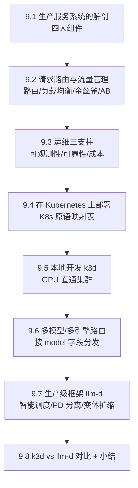
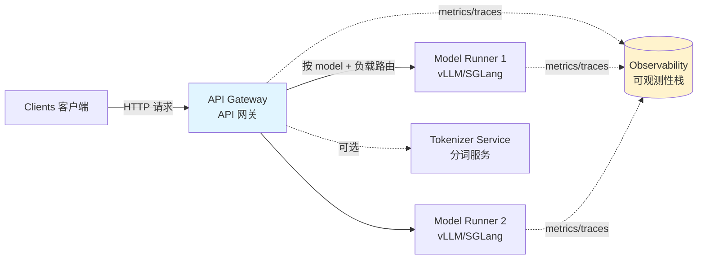
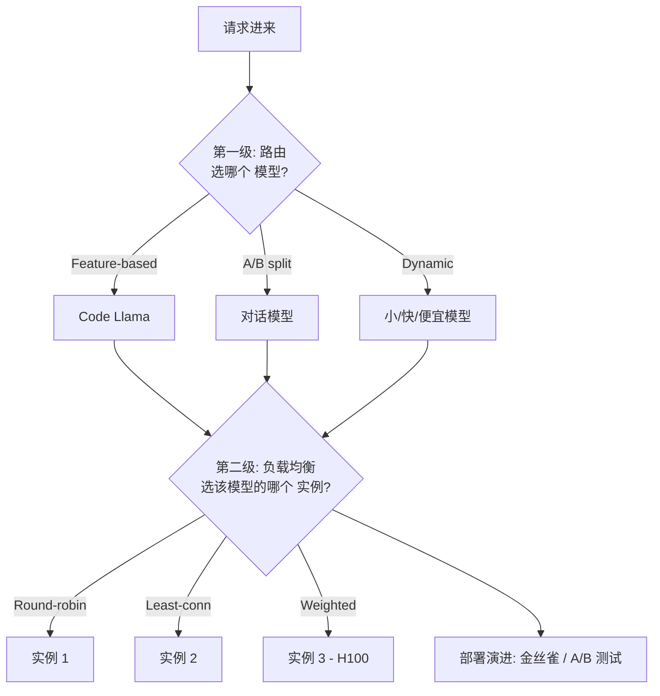
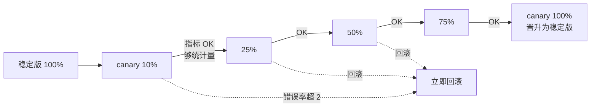
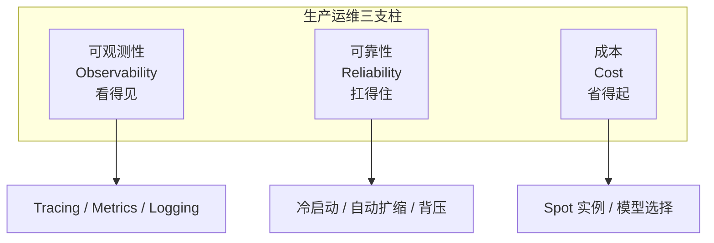
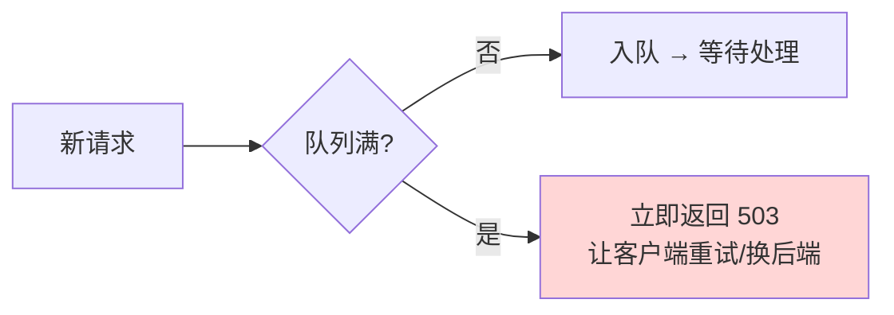
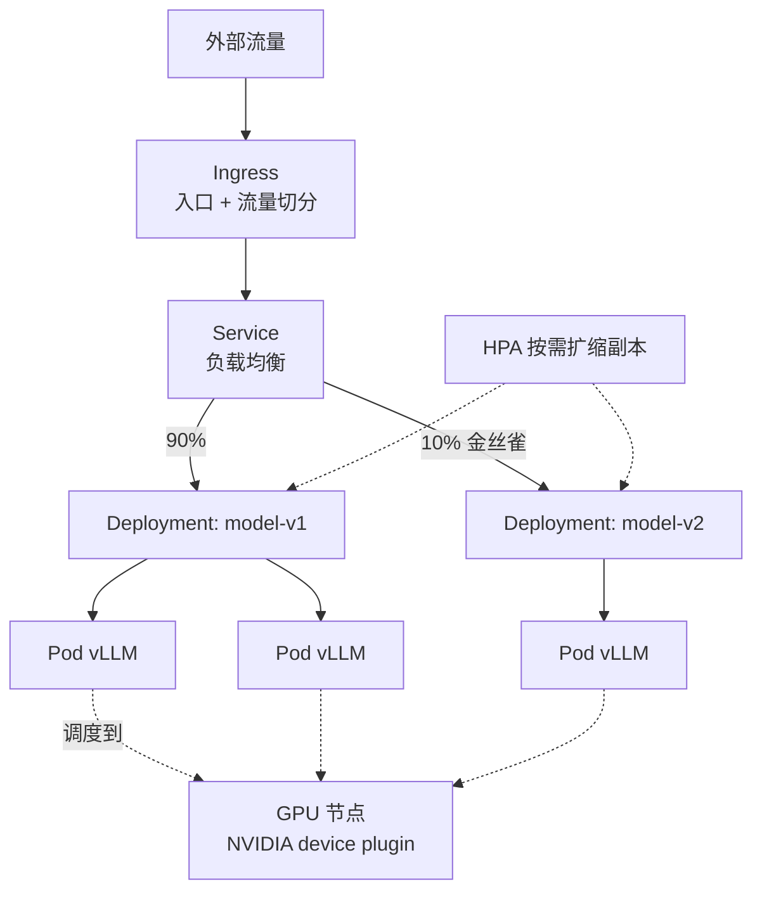
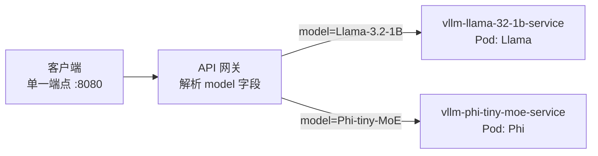
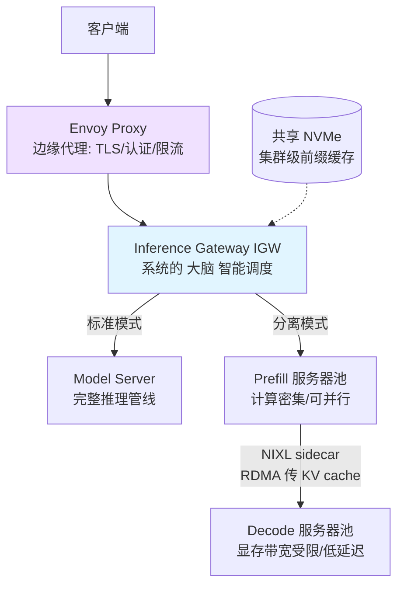

# 第 9 章 · 生产级 LLM 服务栈（Production LLM Serving Stack）🚀

> "Everything fails all the time."（一切随时都在出故障。）
> —— Werner Vogels，Amazon CTO

> 📖 本章对应原书第 9 章（PDF 第 454–499 页）。前面的章节把"怎么训练大模型"（DDP / FSDP / DeepSpeed / Megatron-LM）和"怎么高效推理单节点/多节点"（vLLM / SGLang）讲清楚了。本章要做的事情是：**把这些零件拼装成一个能扛住真实互联网流量、可靠、可扩展、成本可控的完整生产系统**。

---

## 🗺️ 本章地图

这一章的核心是回答一个问题：**"一个模型在 GPU 上跑起来"到"每天服务几百万请求的生产系统"之间，隔着什么？** 答案是一整套分布式系统工程。我们的行进路线：



| 小节 | 你会学到 | 一句话本质 |
|---|---|---|
| 9.1 | 服务系统的四大组件 | 服务 ≠ 模型跑在 GPU 上，而是一套分布式系统 |
| 9.2 | 路由 / 负载均衡 / 金丝雀 / A/B | 让流量流向"对的模型、对的实例、安全的新版本" |
| 9.3 | 可观测性 / 可靠性 / 成本 | 生产系统要的不只是"对"，还要"看得见、扛得住、省得起" |
| 9.4 | Kubernetes 原语映射 | 把手写的模式声明式地交给 K8s 自愈 |
| 9.5 | k3d 本地 GPU 集群 | 用 Docker 里的轻量 K8s 安全地练手 |
| 9.6 | 多模型 / 多引擎路由 | 一个入口，按 `model` 字段分发到不同后端 |
| 9.7 | llm-d 生产栈 | "开箱即用"的智能推理网关 + PD 分离 |
| 9.8 | 两条路线对比 | 手搓学原理，llm-d 上生产 |

> 💡 **一句话贯穿全章**：LLM serving 与传统 ML serving 的所有差异，最终都源于同一个根：**自回归生成 → 输出长度不可预测 + KV cache 随序列线性增长 + 流式返回**。请记住这个第一性原理，后面所有的设计取舍都是它的推论。

---

## 9.1 生产 LLM 服务系统的解剖 🔬

### 9.1.1 为什么 LLM serving 和别的 AI 服务不一样

原书开篇先把 AI serving 的全景铺开，我们对照理解 LLM 的"特殊性"。

| 工作负载 | 硬件 | 延迟特性 | 关键难点 |
|---|---|---|---|
| 传统 ML（GBDT、线性模型、小 NN） | CPU（TF Serving / Triton） | 可预测，输入尺寸固定 | 基本没有 |
| 计算机视觉（分类、检测） | CPU（ONNX Runtime）为主，大模型才上 GPU | 可预测 | 吞吐量高时才需 GPU |
| 扩散模型（Stable Diffusion、DALL-E） | GPU | 迭代去噪，步数固定 | 批处理策略、CFG 缓存 |
| **LLM（本章主角）** | **GPU** | **⚠️ 不可预测** | **自回归 + KV cache + 流式** |

原文点出 LLM 的三个"独一份"特征：

1. **自回归导致输出长度不可预测**：一个"yes/no"问题可能只生成 2 个 token，一个代码生成请求可能吐 2000 个 token。这让批处理（batching）和资源分配与"定长输出"模型**根本上不同**。
2. **KV cache 随序列长度线性增长**：制造出传统 ML serving 里根本不存在的显存压力。
3. **流式（streaming）返回**：聊天应用里用户期望"边生成边看到 token"，而不是等一个最终响应。

> 🔬 **核心论证**：这三点不是并列的三个"特性清单"，而是一条因果链。**自回归**是因，"输出不可预测"是它的直接结果；为了让自回归高效，必须缓存历史 K/V（**KV cache**），于是显存随长度增长；又因为 token 是一个一个生成的，天然适合**流式**推给用户。所以本章讲的路由、批处理、扩缩容、观测，全部是在为这条因果链"擦屁股"和"做优化"。

> ⚠️ **常见坑**：很多团队把 LLM 服务当成"更大的 CV 服务"来做容量规划——用固定 QPS × 固定延迟来估容量。结果上线就被长 prompt / 长输出打爆，因为 LLM 的单请求成本方差极大。**必须按 token 而非按请求来度量容量。**

### 9.1.2 生产服务栈的四大组件

原书给出一张标准的生产 serving 架构图（Figure 9.1）。我们用 mermaid 重画：



逐个拆解（这是本章后面所有内容的"零件清单"）：

#### ① API Gateway（API 网关）—— 唯一入口

> **是什么**：坐在客户端与后端服务之间的组件，负责请求路由、认证、限流、负载均衡。它是一个**单一入口**，把"背后有多个 model runner、有复杂路由决策"这件事对客户端**屏蔽掉**。

- **为什么要它**：客户端不该知道你背后有几个模型、几台机器、模型怎么放的。网关提供"一个 URL 打天下"的抽象。
- **怎么用**：客户端只发 `POST /v1/chat/completions`，网关看请求体里的 `model` 字段决定发给谁。
- **代价**：多一跳（extra hop）网络延迟；网关本身要高可用，否则它就是单点故障。

#### ② Model Runner（模型运行器）—— 系统的心脏 ❤️

> **是什么**：一个**有状态（stateful）、GPU 支撑**的推理引擎，管理模型加载、KV cache、连续批处理（continuous batching）。生产中通常就是第 6、7 章讲的 **vLLM 或 SGLang**。

- **为什么"有状态"很关键**：因为它持有 KV cache 和正在进行的批次——你不能像无状态 web 服务那样随便杀掉重启。这直接影响后面讲的**优雅关闭（graceful shutdown）**和**冷启动**。
- **怎么用**：本章示例把它做成一个 FastAPI 服务包住 vLLM，暴露 `/generate` 端点，启动时加载模型。

#### ③ Monitoring & Observability（监控与可观测性）—— 眼睛 👀

> **是什么**：注意原书的措辞——它**不是一个独立服务**，而是通过 instrumentation 库**嵌入到每个组件里**。包括指标采集（导出到 **Prometheus**）、分布式追踪（**OpenTelemetry**）、结构化日志。

- **为什么**：原文原话——"没有可观测性，生产问题的调试几乎不可能（nearly impossible）"。
- 详见 9.3。

#### ④ Tokenizer Service（分词服务，可选）—— 轻量前哨

> **是什么**：一个**无状态、轻量**的服务，处理文本分词/反分词。

- **为什么现在不太常见**：现代推理引擎（如 vLLM）**内部就做了分词**，所以独立分词服务用得少了。
- **它还有用的场景**（原书列举）：
  - 推理前**先数 token**（用于计费 billing 或限流 rate limiting）；
  - 校验输入长度；
  - 使用自定义推理后端时；
  - **扩散模型**需要 CLIP 分词（示例服务同时加载了 Qwen2.5-1.5B 的分词器给 LLM 用、`openai/clip-vit-large-patch14` 分词器给 Stable Diffusion 用）。
- **代价小**：分词器只在 CPU 上加载词表文件，**不需要 GPU**，可以跑在任意机器上。

> 💡 **实战 / 面试高频**：面试官问"生产 LLM 服务系统由哪几部分组成？"标准答案就是这四个：**网关 + 模型运行器 + 可观测性 + （可选）分词服务**。加分项：能说清"可观测性是嵌入式的、不是独立服务"和"分词服务在 GPU 引擎时代变可选了"。

### 9.1.3 最小可运行示例（`code/basic/`）

原书提供了一个可跑的简化实现，默认用 **Qwen2.5-1.5B-Instruct**（8GB+ 显存即可；更小可换 Qwen2.5-0.5B 或 TinyLlama-1.1B）。

**环境准备**（原书测试版本，抄录并逐行解读）：

```bash
conda create -n usao python=3.12       # 创建独立 Python 3.12 环境
conda activate usao                    # 激活
pip install fastapi==0.133.1 uvicorn==0.35.0 httpx==0.28.1 \
    pydantic==2.12.5 transformers==4.57.3 vllm==0.15.1
```

逐个说明这几个依赖为什么在这里（对应章末 "Code summary"）：

| 依赖 | 角色 |
|---|---|
| `fastapi` | 网关和模型运行器的 HTTP 层 |
| `uvicorn` | ASGI 服务器，用来启动网关/运行器/分词服务 |
| `httpx`（AsyncClient） | 网关**异步**转发请求到模型运行器 |
| `pydantic`（BaseModel） | 推理 API 的请求/响应 schema 校验 |
| `transformers`（AutoTokenizer） | 独立分词（计费/校验/自定义后端） |
| `vllm` | 真正的推理引擎 |

> ⚠️ **常见坑（HF 下载 401/403）**：下载模型报 `401 Client Error` 或 `403 Forbidden`，是没设 Hugging Face token。`export HF_TOKEN=your_huggingface_token`。而且很多模型（如 Llama 系列）是 **gated（门控）** 的，必须先在模型页面**接受许可协议**才能下载。这个坑在后面 K8s 部分还会以 `kubectl create secret` 的形式再出现一次。

**启动流程**（三个终端，体会组件解耦）：

```bash
# 终端 1：启动模型运行器（首次会下载并加载模型，耗时 1~2 分钟，含编译 CUDA graphs）
cd code/basic
uvicorn model_runner:app --host 0.0.0.0 --port 8002

# 终端 2：启动 API 网关（对外入口，做限流 + 转发到运行器）
uvicorn api_gateway:app --host 0.0.0.0 --port 8000
```

`model_runner.py` 是一个 FastAPI 服务，包住 vLLM，启动时加载模型，暴露 `/generate`。
`api_gateway.py` 是对外入口，简化版里做**限流**和**转发**；生产版还要加认证、跨副本负载均衡、请求排队。

**发请求**（打到网关的 8000 端口，而不是运行器的 8002）：

```bash
curl -X POST http://localhost:8000/generate \
  -H "Content-Type: application/json" \
  -d '{"prompt": "What is machine learning?", "max_tokens": 100}'
```

**独立分词服务示例**（`tokenizer_service.py`，跑在 8001）：

```bash
uvicorn tokenizer_service:app --host 0.0.0.0 --port 8001

# LLM 分词
curl -X POST http://localhost:8001/tokenize \
  -H "Content-Type: application/json" \
  -d '{"model": "qwen2.5-1.5b", "text": "Hello world"}'

# 扩散模型走 CLIP 分词（同一个服务，换 model 名）
curl -X POST http://localhost:8001/tokenize \
  -H "Content-Type: application/json" \
  -d '{"model": "stable-diffusion", "text": "a photo of a cat"}'

# 只要 token 数量（计费/限长），用 /count 端点
curl -X POST http://localhost:8001/count \
  -H "Content-Type: application/json" \
  -d '{"model": "qwen2.5-1.5b", "text": "How many tokens is this?"}'
```

> 💡 **实战**：`/count` 这个端点很有代表性——**计费和限长都发生在推理之前**。你不想让一个 100k token 的恶意 prompt 先占满 GPU 再被拒绝，而是要在网关层用轻量 CPU 分词器先"数一数、拦一拦"。这就是"分词服务在 GPU 引擎时代仍有价值"的最实际理由。

---

## 9.2 请求路由与流量管理 🚦

生产系统常常要**同时服务多个模型**、**智能路由**、**跨实例均衡负载**。除此之外，还要能**安全地灰度新版本**、**做实验**。这一节覆盖完整的流量管理图景：**路由 → 负载均衡 → 金丝雀 → A/B**。

先建立一个心智模型——这四件事是"两级决策 + 两种演进"：



### 9.2.1 路由策略（Routing Strategies）—— 选哪个"模型"

原书给出三种多模型部署下的路由方式（实现见 `code/basic/routing.py`，对应 `FeatureBasedRouter`、`ABRouter`、`DynamicRouter` 三个类）：

| 策略 | 依据 | 典型场景 | 代价 / 注意 |
|---|---|---|---|
| **Feature-based（基于特征）** | 检查请求**内容** | 代码类 prompt → Code Llama，闲聊 → 对话模型 | 需要仔细的关键词匹配或分类逻辑 |
| **A/B traffic split（A/B 流量切分）** | **一致性哈希**（用户 ID / 会话 ID 做 hash 输入） | 对比模型变体 | ⚠️ 必须保证**同一用户永远命中同一模型** |
| **Dynamic selection（动态选择）** | 运行时因素：当前负载、延迟预算、成本约束 | 成本敏感 → 小/便宜模型；延迟关键 → 最快模型 | 需要**实时**跟踪模型性能指标 |

> 🔬 **核心论证（为什么 A/B 必须用一致性哈希）**：原文的关键洞察是——用 **用户 ID / 会话 ID** 作为 hash 输入，保证同一用户永远被分到同一个模型变体。**如果用户在两个模型间随机跳来跳去，你就无法把性能差异归因于模型本身。** 这是实验设计的第一性原理：要比较 A 和 B，就必须消除"同一用户体验混合"这个混杂变量（confounding）。

### 9.2.2 负载均衡（Load Balancing）—— 选哪个"实例"

选定模型之后，还要选该模型的**哪个实例**来接这个请求（实现见 `code/basic/load_balancer.py` 和 `health_check.py`）：

| 均衡器 | 机制 | 适用 |
|---|---|---|
| **Round-robin（轮询）** | 按顺序循环，均匀分发 | 实例容量相似、请求成本相似 |
| **Least connections（最少连接）** | 发给**当前活跃请求最少**的实例 | ⭐ 天然适配 LLM——慢请求不会拖垮一个实例而其他实例空闲 |
| **Weighted（加权）** | 给不同实例分配不同容量 | 异构硬件（有的 A100、有的 H100） |

> 💡 **实战 / 面试高频**：为什么 LLM serving 里 **least connections 通常优于 round-robin**？因为 LLM 单请求耗时方差极大（2 token vs 2000 token）。轮询会把一个"生成 2000 token 的巨兽"和一堆短请求平均分到各实例，结果某个实例被长请求卡死、队列堆积，而轮询还傻乎乎继续往它塞。**最少连接**则会自动避开繁忙实例。这又回到了 9.1 的第一性原理：**输出长度不可预测**。

原书还提到一个**健康检查器（health checker）**，它与这些均衡器集成——把不健康的实例从可选池里摘掉。

### 9.2.3 金丝雀部署与流量迁移（Canary & Traffic Shifting）🐤

现在从"路由到已有模型"进阶到"安全地引入**新版本**"。

> **金丝雀部署的核心思想**（原文原话精神）：不要一次把所有流量切到新模型，而是先把**一小部分（比如 10%）** 发给新的"canary（金丝雀）"模型，其余仍走稳定版。同时监控两个版本，对比**错误率**和**延迟**。canary 表现好就逐步加量；表现差就**立即回滚**，把用户影响降到最小。

**关键指标与晋升/回滚策略**（原书给的具体阈值，很值得记）：

- 要跟踪的核心指标：**error rate（错误率）** 和 **latency（延迟）**。
- 一个合理的**晋升策略（promotion policy）**：允许 canary 的错误率**最多比稳定版高 10%**、延迟**最多高 20%**。
- **回滚触发**：canary 错误率**超过稳定版 2 倍**时立即回滚。

**流量迁移（Traffic Shifting）** 是逐步搬人的机制，典型进度：

```
10% → 25% → 50% → 75% → 100%
```

每一步都要**等积累到足够请求量（统计显著性 statistical significance）** 再决定是继续加量还是回滚。



### 9.2.4 A/B 测试（A/B Testing）—— 与金丝雀的区别

> 🔬 **核心论证（金丝雀 vs A/B 的本质区别）**：原文一句话点破——**金丝雀是关于"安全上线（safe rollout）"，A/B 测试是关于"对比备选方案做数据驱动决策（data-driven decision）"**。
> - **金丝雀**：目标是"新版本别炸"，所以盯错误率/延迟，出问题就回滚。
> - **A/B**：目标是"哪个更好"，可以对比两个不同模型、两套 prompt 模板、两种推理配置。
>
> 两者共享同一个技术要求：**一致性分配（consistent assignment）**——同一用户永远看到同一个变体，靠对用户 ID 做一致性哈希实现。

**代码示例**（`code/basic/canary.py`，抄录并逐块讲解）：

```python
from canary import CanaryDeployment, TrafficShifter, ABTestFramework, ABTestConfig

# 例 1：为新模型版本做金丝雀部署
canary = CanaryDeployment(
    stable_model="llama-2-7b-v1",   # 稳定版
    canary_model="llama-2-7b-v2",   # 金丝雀（新版）
    traffic_percent=0.1             # 先给 canary 10% 流量
)

# 路由一个请求 —— 返回 stable 或 canary 模型
model = canary.route({"prompt": "Hello"})
# 拿到响应后记录指标（延迟、是否出错）
canary.record_metrics(model, latency=0.15, error=False)

# 判断是否该晋升或回滚
if canary.should_promote():
    print("Canary performing well, increase traffic")   # 表现好，加量
elif canary.should_rollback():
    print("Canary failing, rolling back")               # 表现差，回滚
```

```python
# 例 2：渐进式流量迁移
shifter = TrafficShifter("model-v1", "model-v2")
shifter.increase_traffic()   # 0%  -> 10%
shifter.increase_traffic()   # 10% -> 25%
# ...根据指标继续加量
```

```python
# 例 3：A/B 测试两个模型
ab = ABTestFramework()
ab.register_test(ABTestConfig(
    test_name="model_comparison",
    variants={"llama-7b": 0.5, "mistral-7b": 0.5},   # 五五开
    metrics=["latency", "quality_score"]             # 关注延迟与质量分
))

# 给用户分配变体（同一用户跨请求一致 —— 靠 user_id 一致性哈希）
variant = ab.assign_variant("model_comparison", user_id="user123")
# 服务完记录指标
ab.record_metric("model_comparison", variant, "latency", 0.12)
# 拿聚合结果
results = ab.get_results("model_comparison")
```

> 💡 **实战**：注意 `assign_variant` 传的是 `user_id`——这就是 9.2.1 和 9.2.4 反复强调的一致性哈希落地点。这些逻辑最终都**接进 API 网关的请求处理管线**里。

---

## 9.3 运维三支柱：可观测性、可靠性、成本 🛠️

流量管理之外，生产系统还需要三类**横切关注点（cross-cutting concerns）**——它们适用于服务栈里的**每一个组件**。



### 9.3.1 可观测性（Observability）—— 三件套

在分布式 LLM 服务里，一个请求可能依次经过 **API 网关 → 分词服务 → 模型运行器**。没有可观测性，调试问题几乎不可能。原书要求**三类**可观测性（实现见 `code/basic/observability.py`）：

| 类型 | 工具 | 机制 | 采样？ | 主要用途 |
|---|---|---|---|---|
| **分布式追踪 Tracing** | OpenTelemetry | 每个服务创建 **span**，用贯穿 HTTP header 的 **trace ID** 串起来 | 采样 | 请求慢时，精确定位是哪个服务贡献了延迟 |
| **指标 Metrics** | Prometheus | 聚合统计：请求数、延迟直方图、错误率、资源利用率 | **不采样（每个请求都记）** | 告警与 SLO 监控 |
| **结构化日志 Logging** | JSON 日志 | 机器可解析的详细信息 | —— | 可查询/聚合（如"找某用户所有 >5s 的请求"） |

> 🔬 **第一性原理（为什么 metrics 不采样、traces 采样）**：原文点出——**metrics 捕获每一个请求，这正是它能用于告警和 SLO 监控的原因**；而 traces 是采样的（不然存储和开销受不了）。所以两者分工明确：**metrics 回答"整体健康吗、要不要告警"，traces 回答"这个慢请求到底卡在哪"**。

**LLM serving 的关键指标**（原书特别列出，面试爱问）：

- 按模型的 **每秒请求数（RPS）**；
- **延迟分位数 p50 / p95 / p99**（不是平均值！LLM 尾延迟很重要）；
- **活跃请求数（active request count）**；
- **GPU 利用率**。

> ⚠️ **常见坑**：只看平均延迟。LLM 请求的延迟分布是长尾的（少数长输出请求把尾巴拉得很长）。**必须看 p95/p99**——用户抱怨的往往是那 5% 的慢请求，而平均值把它们藏起来了。

> 💡 **面试高频**：LLM 特有的两个延迟指标要分开看（后面 llm-d 部分会再强调）：
> - **TTFT（Time-To-First-Token，首 token 时间）**：主要由 **prefill 阶段**决定，用户等第一个字的时间。
> - **TPOT（Time-Per-Output-Token，每 token 时间）**：主要由 **decode 阶段**决定，生成流畅度。
> 章末练习专门要求你用 OpenTelemetry 打出 `latency.ttft_ms` 和 `latency.total_ms` 两个属性。

### 9.3.2 可靠性与容错（Reliability & Fault Tolerance）

实现见 `code/basic/fault_tolerance.py`（含 warmup、autoscaling、请求排队、成本优化路由）。

#### ① 冷启动缓解（Cold Start Mitigation）🥶

> **问题**：LLM 推理有显著冷启动延迟——**加载模型 + 预热 GPU 要 30–60 秒**。

两种对策：

- **启动即预热（warmup on startup）**：模型加载完后**立刻**发几个 dummy 请求走一遍，把 CUDA graph、显存分配、kernel 都跑热。
- **保活请求（keep-alive）**：空闲期周期性发 dummy 请求，防止模型"变冷"。

#### ② 自动扩缩（Autoscaling）📈

基于请求的自动扩缩，按流量调整副本数。关键参数（原书给的经验值）：

| 参数 | 含义 | 经验值 |
|---|---|---|
| target RPS | 目标每秒请求数 | 依 SLO 定 |
| **scale-up 阈值** | 超过目标多少就扩容 | 通常 **120% of target** |
| **scale-down 阈值** | 低于目标多少就缩容 | 通常 **50% of target** |
| cooldown | 冷却期，防抖动 | 依经验 |

> ⚠️ **常见坑（LLM 缩容要保守！）**：原文明确警告——**对 LLM serving，缩容（scale-down）要保守**。因为**新起一个 GPU 实例要好几分钟**（拉镜像 + 下模型 + 加载 + 预热）。宁可留一点富余容量，也别缩太狠导致下一波流量来了措手不及。这和无状态 web 服务"秒级弹性"的直觉完全相反。

#### ③ 背压（Backpressure）🚧

> **机制**：当流量超过容量，用一个**有界请求队列**提供背压——**队列满时，新请求立即用 503 拒绝**，而不是排很久最后超时。

> 🔬 **第一性原理（为什么"快速失败"优于"慢慢超时"）**：立即 503 给了客户端一个**清晰信号**——"稍后重试，或换个后端"。而如果让请求在队列里排 30 秒最后超时，客户端不但白等，还占着连接和内存，形成雪崩。这是分布式系统的经典教训：**fail fast（快速失败）优于 fail slow（慢速失败）**。



### 9.3.3 成本优化（Cost Optimization）💰

GPU 实例很贵，成本优化很重要。两个主要手段：

| 手段 | 做法 | 收益 | 代价 |
|---|---|---|---|
| **Spot / 抢占式实例** | 用 spot 实例扛基线容量 | **便宜 60–90%** | 可能被**短时通知后终止** |
| **模型选择** | 成本敏感请求路由到更小更便宜的模型 | 7B 每 token 成本可能是 13B 的**一半** | 质量略降（很多场景可接受） |

原书给的 **spot 典型策略**：**50% spot 实例扛基线容量**，用 on-demand（按需）实例在 spot 被抢占时**吸收流量**。

> 💡 **实战**：成本优化和 9.2.1 的"动态路由"其实是同一件事的两面——`DynamicRouter` 里"成本敏感 → 小模型"的逻辑，落地就是这里的模型选择。"很多用例的质量差异不值得那个成本"是关键判断——**先量化质量差异，再决定省不省这笔钱**。

---

## 9.4 在 Kubernetes 上部署 LLM serving ☸️

到目前为止讲的路由、负载均衡、金丝雀、可观测性、容错，都是**平台无关（platform-agnostic）** 的模式——你可以在裸机、Docker Compose、任意云上实现。但 **Kubernetes（K8s）** 已成为生产 LLM serving 的**主导平台**。

### 9.4.1 Kubernetes 是什么，为什么适合 LLM serving

> **是什么**：由 Google 发起、现由 CNCF 维护的开源**容器编排系统**。核心是跨机器集群管理容器化工作负载，处理调度、扩缩、网络、存储。

**关键机制（本章反复用到）**：

- **声明式模型（declarative）**：你用 YAML 清单描述**期望状态**（要几个副本、每个要多少 CPU/内存、怎么暴露到网络），K8s **持续工作让实际状态匹配期望状态**。
- **自愈（self-healing）**：自动重启失败容器、节点挂了自动重新调度工作负载。

> 🔬 **第一性原理（为什么声明式 + 自愈 = 天生适合生产）**：回到开篇 Vogels 那句"一切随时都在出故障"。容器会崩、节点会死、GPU 会掉。**命令式**运维（"手动重启那台机器"）在故障常态化的规模下不可持续。**声明式**把"我要 3 个健康副本"这个意图交给系统，系统自己去追平——这正是 9.3 讲的可靠性从"人肉值班"升级为"系统保证"。

### 9.4.2 K8s 原语映射表（Table 9.1）⭐

这是本章**最该背下来**的一张表——把前面手写的模式一一映射到 K8s 原生原语：

| 概念 | Kubernetes 原语 | 实践中 |
|---|---|---|
| **负载均衡** | Service、Ingress | 通过网关做 model-aware 路由 |
| **自动扩缩** | **HPA**（Horizontal Pod Autoscaler）、**KEDA**（事件驱动扩缩） | 按 **RPS 或队列深度** 扩缩 |
| **健康检查** | Liveness / Readiness 探针 | `/health`、`/ready` 端点 |
| **金丝雀部署** | Ingress 流量切分 | 模型版本间**加权路由** |
| **可观测性** | Prometheus、OpenTelemetry | 延迟、吞吐、GPU 指标 |
| **容错** | Pod 重启、**PodDisruptionBudget（PDB）** | **优雅关闭 + 请求排空（draining）** |
| **GPU 调度** | Device plugin、requests/limits | pod spec 里写 `nvidia.com/gpu: 1` |

> 💡 **面试高频**：能把"金丝雀 → Ingress 流量切分"、"自动扩缩 → HPA/KEDA 按 RPS 而非 CPU"、"GPU → device plugin + `nvidia.com/gpu`"这几条对应关系脱口而出，就说明你真的理解了 K8s 在 LLM 场景的用法，而不是背概念。

**架构图（Figure 9.2 精神）**：



外部流量经 **Ingress** → **Service** 负载均衡到多个 **Deployment**。每个 Deployment 管一堆跑 vLLM 的 **Pod**，**HPA** 按需扩缩。两个 Deployment（model-v1 / model-v2）用 **90%/10% 加权切分**实现金丝雀。底层 **GPU 节点**用 NVIDIA device plugin 调度。

> 🔬 **核心论证（为什么生产栈都建在 K8s 上）**：原文一句话——与其从头实现这些模式，K8s 让你**声明期望状态**，把实现细节交给它。加上丰富的 operator 和工具生态，这就是为什么 **vLLM Production Stack** 和 **llm-d** 这些生产 LLM serving 栈**都建在 K8s 上**。

---

## 9.5 本地开发：用 k3d 起 GPU 集群 🧪

直接在生产集群上试错太危险。原书的做法是**两步走**：先用 **k3d**（把 Rancher 的轻量 k3s 塞进 Docker）在本地起一个功能完整的 K8s 集群练手，再上 **llm-d** 生产栈。

**k3d 的优势**：轻量（不需要 VM）、支持 GPU 直通（passthrough）、产出的 manifest **原封不动就能在生产集群跑**。

**三步搭建**（脚本在 `code/k3d/`）：

```bash
cd code/k3d
# Step 1：装前置（NVIDIA Container Toolkit、k3d）
./install-prerequisites.sh
# Step 2：构建带 GPU 的自定义 k3s 镜像
./build.sh
# Step 3：创建带 GPU 支持的集群
./create-cluster.sh
```

**为什么要自定义镜像**：默认 k3s 镜像**不含 GPU 支持**。`build.sh` 用**多阶段构建**把 k3s 二进制拷进 NVIDIA CUDA 基础镜像，装上 container toolkit，配置 containerd 使用 NVIDIA runtime。**NVIDIA device plugin**（`device-plugin-daemonset.yaml`）作为 **DaemonSet** 在集群启动时自动部署，把物理 GPU 作为 `nvidia.com/gpu` 资源暴露给 K8s。

```bash
# 指定版本（需与本机驱动兼容）
K3S_TAG=v1.32.0-k3s1 CUDA_TAG=13.0.0-base-ubuntu24.04 ./build.sh
```

> ⚠️ **常见坑（CUDA 版本兼容）**：CUDA 版本必须与你的 NVIDIA 驱动兼容。跑 `nvidia-smi` 看驱动支持的**最高** CUDA 版本，用**不超过它**的任意版本。

**架构（Figure 9.3 精神）**：宿主机跑 Docker Engine，里面是 k3d 网络的两个节点——控制平面 `server-0` 和工作节点 `agent-0`，都用自定义 `k3s-cuda` 镜像，都通过 `--gpus=all` GPU 直通。

**验证集群**：

```bash
kubectl get nodes
# k3d-mycluster-gpu-server-0   Ready   control-plane   ...
# k3d-mycluster-gpu-agent-0    Ready   <none>          ...

# 验证 GPU 对集群可见
kubectl describe nodes | grep nvidia.com/gpu
```

> 💡 **理解 GPU 计数**：输出里 **Capacity** 是检测到的 GPU 总数，**Allocatable** 是可供调度的数量，**Allocated** 是当前用量（requests/limits，全 0 说明还没 pod 用 GPU）。因为 k3d 把宿主机所有 GPU 传给每个容器，所以**每个节点报告的 GPU 数相同**——这是本地开发的预期行为，别以为是 bug。

### 9.5.1 在 k3d 上部署 vLLM

Manifest 在 `code/k3d/vllm/`，开箱即用。

**门控模型要先建 secret**（又见 HF token 坑）：

```bash
kubectl create secret generic hf-token-secret --from-literal=token="$HF_TOKEN"
```

**部署一个模型**：

```bash
cd code/k3d/vllm
kubectl apply -f llama-3.2-1b.yaml     # 需要约 8GB 显存
# 或 ./deploy-phi-tiny-moe.sh          # Phi-tiny-MoE，更小 GPU 也能跑

# 观察进度
kubectl get pods -l app=vllm -w
# vllm-llama-32-1b-pod-xxx   0/1   ContainerCreating   ...
```

Pod 先 `ContainerCreating`（拉镜像，可能几分钟），变 `Running` 后看日志：

```bash
kubectl logs -l app=vllm --follow
# 模型加载通常 2-5 分钟（取决于大小和是否已缓存）
# 出现 "Application startup complete." 即就绪
```

**测试 API**（端口转发 + OpenAI 兼容格式）：

```bash
kubectl port-forward svc/vllm-llama-32-1b-service 8000:8000 &

curl http://localhost:8000/v1/chat/completions \
  -H "Content-Type: application/json" \
  -d '{
    "model": "meta-llama/Llama-3.2-1B-Instruct",
    "messages": [{"role": "user", "content": "Hello!"}],
    "max_tokens": 50
  }'
```

### 9.5.2 部署 manifest 里的四个"魔鬼细节" 😈

原书特别拎出 `llama-3.2-1b.yaml` 里几个**很容易踩坑**的配置，这几点是**面试和实战的高价值考点**：

| 配置 | 值 | 为什么这么设 | 坑 |
|---|---|---|---|
| `--gpu-memory-utilization` | `0.2`（示例）；单模型追吞吐用 `0.8–0.9` | 只留 20% 显存适合**共享 GPU / 多模型**集群 | 默认约 0.85，多模型时会互相抢爆显存 |
| `initialDelaySeconds`（健康探针） | **120–180 秒** | 模型加载要好几分钟 | ⚠️ **不设延迟，K8s 会无限重启 pod**（死循环）；`failureThreshold` 设 3+，避免 GC 时一次慢探针被误判为崩溃 |
| Volume mount `/models` | 挂持久卷 | 跨 pod 重启**缓存权重** | 7B 模型每次重启都从 HF 重下太慢；缓存后直接从磁盘加载 |
| Shared memory `/dev/shm` | 用 `emptyDir` + `medium: Memory`（或 `--shm-size`） | 张量并行 vLLM worker 的 **NCCL/IPC 缓冲**走 `/dev/shm` | ⚠️ **Docker 默认只有 64MB**，太小会导致**集合通信（collectives）挂起且几乎没有诊断输出**——最难查的坑之一 |

> ⚠️ **重点坑（`/dev/shm` 太小）**：这是分布式推理最阴险的坑。张量并行时，worker 之间的 NCCL 和 IPC 缓冲走共享内存 `/dev/shm`；Docker 默认给 64MB，一旦不够，**集合通信直接 hang 死，还几乎不报错**。务必按张量并行宽度（tensor-parallel width）调大它。

**多 GPU 分片**：单卡放不下的大模型，设 `--tensor-parallel-size` 为 GPU 数并相应更新 resource limits。

**清理**：

```bash
k3d cluster delete mycluster-gpu
docker rmi k3s-cuda:<your-tag>   # 可选，删自定义镜像
```

---

## 9.6 多模型与多引擎路由 🔀

生产部署**很少只服务一个模型**——你可能要不同模型干不同活（小模型处理简单查询、大模型做复杂推理），或者要 A/B 测试不同模型/引擎。

两个自动化脚本：
- `manage-cluster-multi-models.sh`：**单引擎（vLLM）多模型**（Llama-3.2-1B + Phi-tiny-MoE）
- `manage-cluster-multi-engines.sh`：**多引擎单模型**（同一个 Llama-3.2-1B 跑在 vLLM + SGLang 上）

### 9.6.1 多模型路由（按 `model` 字段分发）

> 🔬 **核心论证（关键洞察）**：API 网关可以**根据 OpenAI 兼容请求体里的 `model` 字段**来路由。客户端发 `"model": "meta-llama/Llama-3.2-1B-Instruct"`，网关查表看哪个 K8s service 托管这个模型，转发过去。这就创造了一个**统一端点**——**客户端根本不需要知道哪个后端服务器处理哪个模型**。这正是 9.1 讲的"网关屏蔽复杂性"的落地。



**部署与验证**：

```bash
cd code/k3d
./manage-cluster-multi-models.sh start    # 建 namespace + 部署两模型 + 起网关
./manage-cluster-multi-models.sh status   # 应看到 2 个 vLLM pod 和对应 service
```

**路由配置**（`gateway/routing-config.yaml`，把模型名映射到 K8s service）：

```yaml
routing:
  - model: "meta-llama/Llama-3.2-1B-Instruct"
    service_name: "vllm-llama-32-1b-service.multi-models.svc.cluster.local"
  - model: "microsoft/Phi-tiny-MoE-instruct"
    service_name: "vllm-phi-tiny-moe-service.multi-models.svc.cluster.local"
```

> 💡 **知识点（K8s 服务发现 DNS）**：`vllm-llama-32-1b-service.multi-models.svc.cluster.local` 遵循 `<service>.<namespace>.svc.cluster.local` 命名。网关查到 service 名后转发，**不向客户端暴露后端布局**。理解这个 DNS 格式是读懂任何 K8s 微服务通信的基础。

**测试**（同一个 `:8080`，只换 `model` 字段就打到不同后端）：

```bash
kubectl port-forward svc/vllm-api-gateway 8080:8000 &

# 打到 Llama
curl http://localhost:8080/v1/chat/completions \
  -H "Content-Type: application/json" \
  -d '{"model": "meta-llama/Llama-3.2-1B-Instruct",
       "messages": [{"role": "user", "content": "Hello!"}]}'

# 打到 Phi —— 同端点，不同 model 字段
curl http://localhost:8080/v1/chat/completions \
  -H "Content-Type: application/json" \
  -d '{"model": "microsoft/Phi-tiny-MoE-instruct",
       "messages": [{"role": "user", "content": "Hello!"}]}'
```

### 9.6.2 多引擎路由（按 `inference_server` 字段分发）

更进一步：**同一个模型部署在不同推理引擎（vLLM 和 SGLang）上**，按 `inference_server` 字段路由。用途：**基准测试引擎**或**在引擎间渐进迁移**。

```bash
cd code/k3d
./manage-cluster-multi-engines.sh start   # 建 multi-engines namespace，Llama 同时上 vLLM + SGLang
```

**路由配置**（`code/k3d/gateway/routing-config.yaml`，同模型不同引擎）：

```yaml
routing:
  - model: "meta-llama/Llama-3.2-1B-Instruct"
    inference_server: "vllm"
    service_name: "vllm-llama-32-1b-service.multi-engines.svc.cluster.local"
  - model: "meta-llama/Llama-3.2-1B-Instruct"
    inference_server: "sglang"
    service_name: "sglang-llama-32-1b-service.multi-engines.svc.cluster.local"
  - model: "meta-llama/Llama-3.2-1B-Instruct"
    inference_server: null            # 默认回退到 vLLM
    service_name: "vllm-llama-32-1b-service.multi-engines.svc.cluster.local"
```

> 💡 **设计模式（默认回退）**：第三条 `inference_server: null` 是**兜底（fallback）**——没指定引擎的请求默认走 vLLM。这是路由表设计的常见模式：**总要有一条默认规则**，免得未匹配的请求无处可去。

```bash
kubectl port-forward svc/vllm-api-gateway 8080:8000 &

# 不指定引擎 → 默认 vLLM
curl http://localhost:8080/v1/chat/completions \
  -H "Content-Type: application/json" \
  -d '{"model": "meta-llama/Llama-3.2-1B-Instruct",
       "messages": [{"role": "user", "content": "Hello!"}]}'

# 显式指定 SGLang
curl http://localhost:8080/v1/chat/completions \
  -H "Content-Type: application/json" \
  -d '{"model": "meta-llama/Llama-3.2-1B-Instruct",
       "inference_server": "sglang",
       "messages": [{"role": "user", "content": "Hello!"}]}'
```

网关还聚合 `/v1/models` 端点，返回所有后端**合并**的可用模型列表。生产部署还要加认证（API key / OAuth）、限流（每客户端配额）、可观测性（`code/k3d/gateway/api-gateway.py` 有示例中间件）。

---

## 9.7 生产级框架 llm-d 🏭

手搓 k3d 让你**理解每个组件**，但生产规模部署往往受益于**标准化方案**。原书先横向对比几个 K8s 原生 LLM serving 框架：

| 框架 | 特点 | 依赖 | 适用 |
|---|---|---|---|
| **KServe** | 企业级模型服务，流量治理（金丝雀/A/B）、多模型托管 | 需要 Istio 或 Knative | 企业级流量治理 |
| **KubeAI** | 轻量 operator，**scale-from-zero**、前缀感知负载均衡 | **零外部依赖** | 简单部署 |
| **vLLM production-stack** | 官方 vLLM 部署方案，**LMCache** 集成实现跨实例 KV cache 共享 | —— | 官方 vLLM 支持 + KV cache 共享 |
| **llm-d（本章重点）** | "开箱即用"，组装 vLLM + Envoy + NIXL；生产级 Helm charts；支持 PD 分离、InfiniBand RDMA 高速传输 | —— | 需要**分离推理**或**高速互联**的部署 |

### 9.7.1 llm-d 是什么

> **本质**：一个 **"batteries-included（自带电池）"** 的部署框架，把业界最好的开源组件组装成一个内聚系统。核心仍是 **vLLM**（就是 k3d 里手动部署的那个引擎），但 llm-d 在上面叠了几层智能：



- **Envoy Proxy**：高性能边缘代理，处理"互联网流量的脏活"——TLS 加密、认证、限流、优雅处理不守规矩的客户端。它也是 Istio service mesh 的底座，llm-d 直接拿它当所有推理请求的入口。
- **Inference Gateway（IGW）**：llm-d 的**大脑**，智能请求调度器。Envoy 管通用 HTTP，IGW **懂 LLM 推理**。
- **NIXL**（NVIDIA Inference Xfer Library）：在 InfiniBand RDMA、TPU ICI 等快速互联上做高速数据传输。

### 9.7.2 llm-d 的四大杀手锏 ⚔️

#### ① 智能推理调度（Intelligent Inference Scheduling）

> 🔬 **核心论证**：传统负载均衡器按 round-robin 或简单指标（连接数）分发。但 **LLM 推理有独特性——一个 10,000-token 的 prompt 和一个 100-token 的 prompt 行为完全不同**。IGW 理解这点，它能：
> - **预测请求延迟并据此路由**，保证长请求不阻塞短请求；
> - **前缀缓存感知路由（prefix-cache aware routing）**：如果某个 vLLM 实例已经有某个 system prompt 的 KV cache，后续带相同前缀的请求就路由过去，**大幅降低 TTFT**；
> - **SLA 感知调度**：让付费客户优先拿到算力；
> - **负载感知均衡**：按每个实例的**实际当前容量**分发，而非只数连接数。

这又一次呼应 9.1 的第一性原理——**因为 LLM 单请求成本方差巨大且有 KV cache 局部性**，所以"懂 LLM 的路由"能碾压"通用负载均衡"。

#### ② Prefill/Decode 分离（PD Disaggregation）—— 最创新的特性 ⭐

> 🔬 **第一性原理（为什么要分离）**：传统 LLM serving 里，**同一块 GPU 既做 prefill（处理输入 prompt）又做 decode（逐 token 生成）**。但这两个阶段的**计算画像截然不同**：
>
> | 阶段 | 计算特性 | 优化方向 |
> |---|---|---|
> | **Prefill（预填充）** | **计算受限（compute-bound）、可并行** | 大 batch、高 GPU 利用率、追吞吐 |
> | **Decode（解码）** | **显存带宽受限（memory-bandwidth-bound）、顺序** | 低延迟 |
>
> 把它们放到**不同的服务器池**上，就能**各自独立优化**——prefill 服务器可以激进批处理冲吞吐，decode 服务器可以调到最低延迟。

**挑战与解法**：难点是**在两者间传输 KV cache**。这正是 **NIXL** 发光的地方——用 **RDMA** 在**毫秒级**搬动 GB 级的 cache 数据。一个 **sidecar 容器**协调传输，保证 decode 服务器**恰好在需要时**收到 KV cache。

**收益**：降低 **TTFT**，得到更可预测的 **TPOT**。

> ⚠️ **常见坑（PD 分离不是万能药）**：原文明确——KV cache 传输**需要快速互联**，这条路"在 InfiniBand 或 NVLink 上闪耀，但在慢网络上可能不值得那份复杂度"。别在千兆以太网上硬上 PD 分离，KV cache 传输开销会吃掉全部收益。

#### ③ 分布式前缀缓存（Disaggregated Prefix Caching）

基于 vLLM 的 **KVConnector** 抽象，llm-d 实现了一个缓存层级：

| 层级 | 别名 | 机制 | 收益 |
|---|---|---|---|
| **独立缓存** | N/S（North/South） | KV cache 卸载到本地内存 + NVMe | 单实例服务的并发数超过其 GPU 显存本来能撑的量 |
| **共享缓存** | E/W（East/West） | 实例间传 KV cache | 一台算好的公共 system prompt cache，别人直接取，不用重算 |
| **全局索引** | —— | 集群级前缀视图 | 最优路由决策（代价：额外协调开销） |

#### ④ 变体自动扩缩（Variant Autoscaling）

> 🔬 **核心论证（为什么 HPA 不够）**：传统 K8s HPA 按 **CPU / 内存利用率**扩缩，但这对 GPU 工作负载"意义甚微"。llm-d 的**变体自动扩缩器**：
> - 度量每个模型服务器实例的**实际容量**——给定当前显存压力，每秒能生成多少 token；
> - 分析近期流量模式——请求大小分布、QoS 要求、到达率；
> - 据此算出 **prefill 服务器、decode 服务器、预留给延迟容忍批请求的实例** 的**最优配比**；
> - 实现真正的 **SLO 级效率**——**在延迟恶化之前**扩容，而不是之后。

**硬件支持广度**（避免厂商锁定）：NVIDIA GPU（A100、L4 及更新）、AMD GPU（MI250+）、Google TPU（v5e+）、Intel Data Center GPU Max（Ponte Vecchio）。

### 9.7.3 well-lit paths（"照亮的路径"）—— 部署配方

llm-d 用 "well-lit paths" 指那些**充分测试和基准过**的部署模式，让用户不用靠试错找最优配置：

| 路径 | 何时用 | 收益 |
|---|---|---|
| **Intelligent Inference Scheduling** | **大多数部署的起点** | 把 vLLM 放到 IGW 后面，立刻获得比 round-robin 聪明的均衡 + 前缀感知路由 |
| **Prefill/Decode Disaggregation** | 服务**大模型 + 长 prompt**（如 70B 处理 10k token 文档） | 降 TTFT、更可预测的 TPOT（**前提：有 InfiniBand/NVLink**） |
| **Wide Expert-Parallelism** | **MoE 模型**（Mixtral、DeepSeek） | 专家分布到不同 GPU + 数据并行处理多请求，大幅降延迟提吞吐 |

> 💡 **实战选路建议**（原书 "Choosing Your Path"）：新手从**智能推理调度**起步——从基础 vLLM 改动最小，却能拿到实打实的延迟/吞吐提升。随着部署成熟遇到具体瓶颈再进阶：**用户抱怨长文档 TTFT 慢** → 考虑 PD 分离（且有带宽）；**MoE 模型 GPU 利用率不佳** → 考虑专家并行。

### 9.7.4 llm-d 的监控与部署

**监控**：llm-d 集成标准 K8s 监控栈——**Prometheus** 采集、**Grafana** 可视化。除通用指标外，暴露 LLM 特有遥测：请求延迟分布、tokens/s 吞吐、全队列 GPU 利用率，以及**关键的 KV cache 命中率**。

> 🔬 **核心论证（KV cache 命中率为什么关键）**：原文点出——**高命中率说明前缀感知路由在有效工作；低命中率提示你需要 cache 预热策略或调整路由策略**。这是一个直接反映"智能调度是否真的智能"的诊断信号。配合监控要**分开跟踪 TTFT 和 TPOT**，才能定位延迟来自哪。

**部署（Helm）**：需要生产级 K8s（1.29+）+ 硬核硬件（70B+ 需 A100 及以上，理想有 NVLink + InfiniBand/RoCE RDMA）。用 Helm 一条命令部署整栈：

```yaml
# values.yaml 读起来像一份规格说明书：
# - 2 个 IGW 副本 + 缓存感知路由
# - vLLM 服务 Llama 3.1 70B，跨 4 GPU，90% 显存利用率
# - 分开的 prefill / decode 服务器池，各自副本数和 GPU 分配
# - 自动扩缩：不按 CPU（对 GPU 无意义），而是指定目标 QPS，交给变体扩缩器
```

代码在 `code/llmd/`：`llm-d-multi-engine/`（同模型 Qwen2.5-0.5B 跑 vLLM + SGLang）、`llm-d-multi-model/`（不同 Llama 变体）。

### 9.7.5 llm-d 多模型：自动发现（对比 k3d 手动映射）

> 🔬 **核心论证（llm-d 与 k3d 的最大区别）**：k3d 里你**手动**在网关配置里写 model→service 映射；llm-d 里每个模型有自己的 **ModelService**，**InferencePool 自动发现并路由**——**无需手动服务映射**。这是"手搓"到"生产框架"最本质的跃迁：**从命令式配置到自动发现**。

**关键配置**（Helm values 里的 `modelArtifacts`）：

```yaml
modelArtifacts:
  uri: "hf://meta-llama/Llama-3.2-1B-Instruct"    # 告诉 llm-d 去哪取模型
  name: "meta-llama/Llama-3.2-1B-Instruct"
```

**加上 Inference Gateway**（单端点按 `model` 字段路由）：

```bash
./manage-cluster-multi-models.sh start --with-gateway
# 部署 Gateway API CRD + Envoy 网关
kubectl port-forward svc/llm-gateway 8000:8000 &
# 之后同一 :8000，换 model 字段即打到不同模型
```

> ⚠️ **常见坑 / 版本锁定**：脚本把 vLLM **锁在 v0.14.1** 以匹配 llm-d v0.5.0——**通常比独立 `code/basic/` 栈（0.15.1）落后一两个版本**，因为 llm-d 对自己的镜像矩阵做测试。它也需要自定义 `k3s-cuda` 镜像（默认 k3s 缺 NVIDIA container toolkit）。vLLM 和 llm-d 迭代很快，**部署文件里的镜像 tag 要按需更新**。

> ⚠️ **重要限制（llm-d 是 "vLLM-first"）**：IGW 的智能特性（前缀感知路由、NIXL KV cache 传输、推理调度器）**与 vLLM 内部深度耦合**。SGLang 支持还在开发中（GitHub issue #403），**当前 llm-d 原生路由不支持引擎选择**。要多引擎，得用 `code/llmd/llm-d-multi-engine/` 里的自定义 API 网关层做 workaround。

---

## 9.8 k3d vs llm-d：两条路线对比（Table 9.2）📊

| 特性 | k3d（手动） | llm-d（生产） |
|---|---|---|
| **Setup 搭建** | 手写 YAML 文件 | Helm charts（自动化） |
| **Routing 路由** | 自定义 API 网关 | Inference Gateway（K8s 原生） |
| **Load Balancing 负载均衡** | 基础 round-robin | **智能（前缀缓存感知）** |
| **Monitoring 监控** | 手动搭建 | **内置 Prometheus/Grafana** |
| **Scaling 扩缩** | 手动 pod 管理 | HPA-ready、支持自动扩缩 |
| **Multi-Model 多模型** | 手动服务映射 | **自动发现** |
| **Production Features 生产特性** | 有限 | 完整生产栈 |

> 🔬 **核心论证（最关键的两处差异）**：原文强调，最大差异在 **routing 和 load balancing**——k3d 用自定义网关 + 基础轮询，而 llm-d 的 IGW 是 **K8s 原生 + 前缀缓存感知**，把请求路由到**已有相关 KV cache**的 pod，减少冗余计算。多模型上，k3d 要手动映射，llm-d **自动发现 ModelService 并建路由表**。监控同理：k3d 手动搭 Prometheus/Grafana，llm-d 开箱带预配置仪表盘。

> 💡 **实战心法（什么时候用哪个）**：原文的结论很清爽——**k3d 用来学习和本地开发**（你亲手搭，所以清楚每个组件干什么）；**生产跑真实流量用 llm-d**（久经考验的配置 + 智能路由更稳健）。而且**迁移很直接：概念完全一致，只是实现细节变了**。这正是本章的教学设计——先手搓建立心智模型，再用框架上生产。

---

## 9.9 章末练习速览（原书 Exercises）📝

原书给了 5 个动手练习，正好覆盖本章全部核心能力，也是极好的面试自测清单：

| # | 练习 | 核心考点 |
|---|---|---|
| 1 | 实现带模型路由的 `ModelRouter`（按 `model` 字段转发，未知模型返 404，加健康检查，支持 `/v1/chat/completions` 和 `/v1/completions`） | 9.6 多模型路由 |
| 2 | 实现 `RateLimiter` 限流中间件（**token bucket 算法**、按客户端配额、支持突发 burst、返回 `X-RateLimit-*` 头、清理陈旧条目防内存泄漏） | 9.1/9.3 网关限流 |
| 3 | 实现 `CanaryDeployment` 自动回滚（按百分比路由、跟踪成败率、错误率超阈值触发回滚、支持 10%→25%→50%→100% 渐进） | 9.2.3 金丝雀 |
| 4 | 用 **OpenTelemetry** 做端到端追踪（为 `gateway.receive` / `tokenizer.encode` / `model.inference` / ... 建 span，加 `latency.ttft_ms` 等属性，跨服务传播 trace context） | 9.3.1 可观测性 |
| 5 | 在 k3d 上部署多模型（GPU 直通集群 + 两个 vLLM 实例 + 路由网关 + ConfigMap 映射） | 9.5/9.6 K8s 部署 |

> 💡 **面试高频**：练习 2 的 **token bucket（令牌桶）** 是限流算法的必考项——桶以固定速率注入令牌（对应 `requests_per_minute`），桶容量决定突发能力（`burst_size`），每个请求取一个令牌，取不到就限流。它比"固定窗口计数"更平滑地处理突发流量。

---

## 📌 小结

本章把"模型跑在 GPU 上"升级成了"生产级分布式服务系统"。核心脉络：

1. **一切源于自回归**：LLM serving 与传统 ML 的所有差异，都来自"**输出长度不可预测 + KV cache 线性增长 + 流式返回**"这条因果链。后面每个设计取舍都是它的推论。
2. **四大组件**：API 网关（唯一入口/屏蔽复杂性）+ 模型运行器（有状态心脏，vLLM/SGLang）+ 可观测性（**嵌入式，非独立服务**）+ 可选分词服务（GPU 引擎时代变可选，但计费/限长仍有用）。
3. **两级决策 + 两种演进**：路由选**模型**（feature/A-B/dynamic）→ 负载均衡选**实例**（LLM 场景 least-connections 优于 round-robin）；金丝雀（**安全上线**，错误率超 2x 回滚）vs A/B（**对比决策**，一致性哈希保证同用户同变体）。
4. **运维三支柱**：可观测性（metrics 不采样管告警、traces 采样管定位、分 p95/p99 和 TTFT/TPOT）；可靠性（冷启动预热、**缩容要保守**、背压快速失败）；成本（spot 便宜 60–90% 扛基线、模型选择省 token）。
5. **Kubernetes 是主导平台**：声明式 + 自愈天生适配"故障常态化"的生产。**背下 Table 9.1 的原语映射**。
6. **两条学习路线**：**k3d 手搓**理解每个零件（注意 4 个魔鬼配置：显存利用率、探针 `initialDelaySeconds`、`/models` 缓存、`/dev/shm` 太小会挂 NCCL）；**llm-d 上生产**（IGW 智能调度 + **PD 分离** + 分布式前缀缓存 + 变体扩缩，自动发现模型），迁移时概念不变只换实现。

> 一句话收束原书结语：**从笔记本到百万请求的旅程很长，但模式始终一致——理解你的负载，度量一切，能自动化的都自动化。**（understand your workload, measure everything, and automate what you can.）

下一章的自然问题是：**服务搭好了，它到底跑得多好？** 那一章会用 genai-bench、PyTorch profiler 等工具做吞吐/延迟/扩展效率的基准测试。

---

## 🔗 延伸阅读

**推理引擎与生产栈**
- vLLM：<https://github.com/vllm-project/vllm>
- vLLM Production Stack：<https://github.com/vllm-project/production-stack>
- SGLang：<https://github.com/sgl-project/sglang>

**Kubernetes 与 llm-d**
- llm-d：<https://github.com/llm-d/llm-d> · 文档 <https://www.llm-d.ai>
- Inference Gateway（Gateway API Inference Extension）：<https://github.com/kubernetes-sigs/gateway-api-inference-extension>
- k3d（k3s in Docker）：<https://k3d.io/>
- NVIDIA Device Plugin for K8s：<https://github.com/NVIDIA/k8s-device-plugin>
- Kubernetes Gateway API：<https://gateway-api.sigs.k8s.io/>
- KServe：<https://kserve.github.io/website/> · KubeAI：<https://www.kubeai.org/>

**可观测性与网关**
- OpenTelemetry：<https://opentelemetry.io/> · Prometheus：<https://prometheus.io/> · Grafana：<https://grafana.com/>
- Envoy Proxy：<https://www.envoyproxy.io/> · FastAPI：<https://fastapi.tiangolo.com/>

**关键术语**
- **NIXL**（NVIDIA Inference Xfer Library）：<https://github.com/ai-dynamo/nixl>
- **RDMA**（Remote Direct Memory Access）：不经 CPU/OS 直接在机器间访问内存
- **NVMe**（Non-Volatile Memory Express）：为 SSD 设计的高速存储接口协议

---

> 📎 本章配套代码：`code/basic/`（最小服务栈）、`code/k3d/`（本地 GPU 集群 + 多模型/多引擎）、`code/llmd/`（生产级 llm-d 部署）。建议先跑通 `code/basic/`，再上 k3d，最后体会 llm-d 的"自动发现"与"智能路由"带来的质变。
