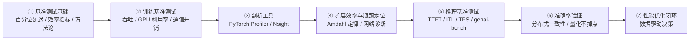
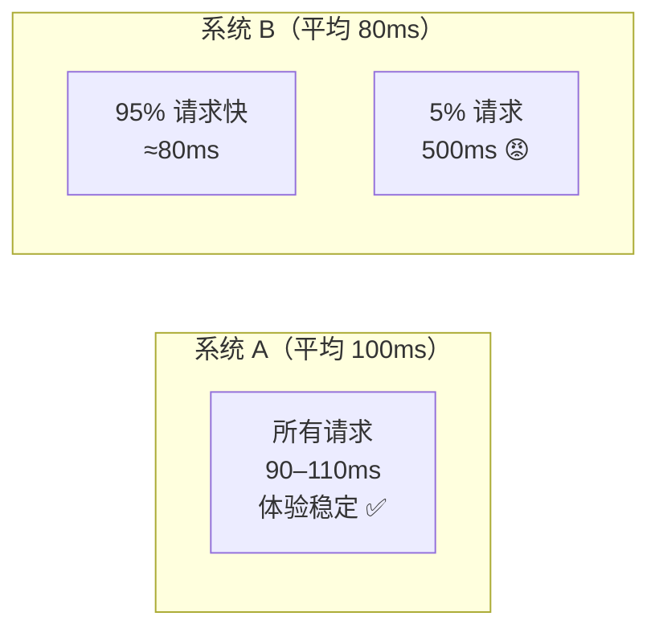
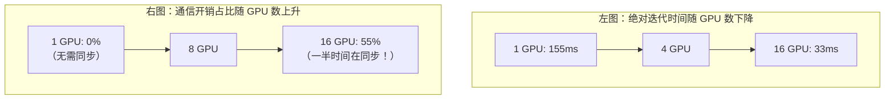
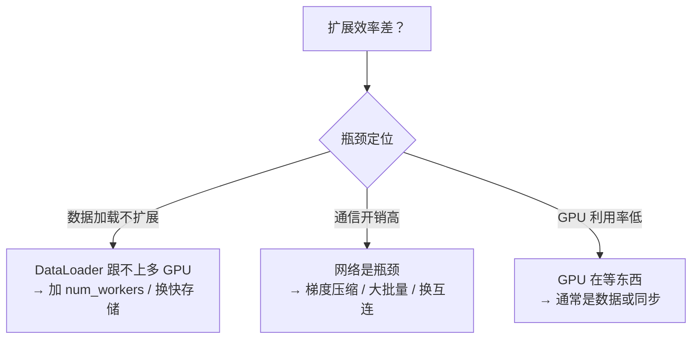
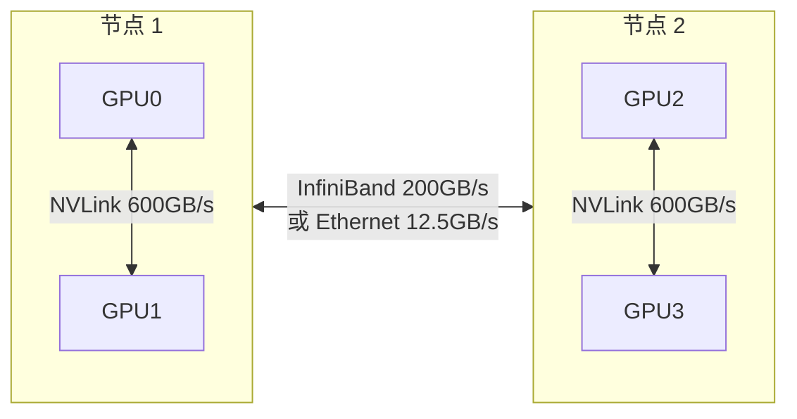
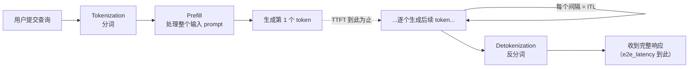

# 第 10 章 分布式基准测试与性能优化 📊

> "If you can't measure it, you can't improve it."（无法度量，就无法改进。）
> —— Peter Drucker

---

## 🗺️ 本章地图

你已经把分布式 AI 系统搭起来了：DDP 在 8 卡集群上同步梯度、FSDP 把 70B 模型切片到多节点、vLLM 用连续批处理服务推理请求、第 9 章的生产栈把流量路由到正确的模型实例。**一切都能跑通——但跑得好吗？**

这一句话，就是「能用的系统」和「优化过的系统」之间的分水岭。本章教你系统性地找出并修复藏在日志里的隐形低效。我们会走完完整的基准测试生命周期：



学完本章，你将能够：
- **设计**可复现的基准实验（正确的 warmup + 度量方法）
- **剖析**训练负载（PyTorch Profiler / Nsight Systems）
- **压测**推理系统（genai-bench + 真实流量模式）
- **评估**模型准确率（GLUE / MMLU / HumanEval 等标准基准）
- **诊断**网络瓶颈（通信剖析）
- **计算并解读**扩展效率（scaling efficiency）

---

## 💰 引子：分布式系统里的「性能鸿沟」

先看一个真实到扎心的场景。

你的团队在 **64 张 GPU（8 节点）** 上训练一个模型。训练完成，模型在基准上表现良好，大家开香槟庆祝。但日志里藏着一个令人不安的模式：

- **GPU 利用率只在 45% 徘徊**
- **从 8 卡扩到 64 卡，扩展效率只有 52%**

这意味着什么？你**为 64 张 GPU 付了钱，实际只拿到了 33 张的有效算力**（64 × 52% ≈ 33）。

> 🔬 **第一性原理：把浪费换算成钱**
>
> 一次两周的训练跑（每卡 336 小时），闲置的 48% 车队 ≈ **31 张 GPU 等效的浪费时间**。按典型云价格 $4–5 / GPU-hour：
>
> $$31 \text{ GPU} \times 336 \text{ h} \times \$4.5/\text{h} \approx \$46{,}872 \approx \$50{,}000$$
>
> **五万美金，因为没人去量利用率而蒸发了。** 而修复方案可能只是一块 $50 的 SSD（数据加载瓶颈）。这就是为什么本章值得你认真读完。

### 为什么分布式基准测试「难」？

单卡训练循环的基准测试很简单：给前向、反向、优化器步各计个时。数字可复现、方法简单、结论可执行。

但当你从 1 卡扩到 8 卡，**你不是在跑 8 份相同的负载**。这 8 张 GPU 必须：
- 每次反向传播后**同步梯度**（AllReduce）
- **协调内存分配**以避免碎片
- 在带宽和延迟各异的网络上**通信**

每一个协调点都引入了单卡训练里不存在的开销。梯度同步里 10% 的低效，在单步看似可忽略，但在两周的训练跑里**会累积成好几天的浪费**。

更麻烦的是，分布式性能取决于「简单计时看不见」的因素：

| 隐形因素 | 影响的指标 |
| :--- | :--- |
| 网络拓扑 | AllReduce 性能 |
| 内存碎片 | 可用批大小 |
| 数据加载吞吐 | GPU 利用率 |

> ⚠️ **常见坑：不做基准测试 = 拿钱猜**
>
> 缺乏系统化基准测试时，优化就变成瞎猜。书中列举了四种典型灾难：
>
> 1. **选型选错**：团队用「固定长度 prompt」评测 vLLM vs SGLang，vLLM 小胜。但生产中请求长度剧烈波动（50 到 5000 tokens），SGLang 的 radix attention 在这种负载下吞吐高 40%。**评测方法没反映生产现实。**
> 2. **资源过度配置**：没有准确的扩展效率数据，容量规划靠保守估计，团队「为了保险」买了双倍硬件——成本翻倍，性能没涨。
> 3. **瓶颈未识别**：64 卡跑两周，事后分析发现 GPU 利用率平均只有 45%——瓶颈是数据加载不是算力。一块 $50 的 SSD 本可省下 $10,000 的 GPU 时间。
> 4. **SLA 违约**：推理服务用「平均 100 tokens 的合成 prompt」通过了压测，生产中真实用户的长文档触发了不同代码路径，**P99 延迟飙到 500ms——是承诺 SLA 的 2.5 倍。**

---

## 📐 第一部分：基准测试基础（Benchmarking Fundamentals）

在钻进具体工具前，先建立适用于**所有**分布式 AI 基准测试（无论训练还是推理）的基础概念。

### 1. 理解百分位延迟（Percentile Latencies）

对任何性能度量，**百分位延迟都比平均值重要**。

| 百分位 | 含义 | 典型用途 |
| :--- | :--- | :--- |
| **P50（中位数）** | 典型行为 | 描述「一般情况」 |
| **P95** | 95% 请求快于此值 | 常见 SLA 目标 |
| **P99** | 捕获最坏 1% | 影响用户体验的尾延迟 |

> 💡 **面试高频：为什么 P99 比平均值更重要？**
>
> 考虑两个系统：
> - **系统 A**：平均延迟 100ms，所有请求都落在 90–110ms 之间。
> - **系统 B**：平均延迟 80ms，但 5% 的请求要 500ms。
>
> 系统 B **平均延迟更好，用户体验却更差**——那 5% 的慢请求制造了愤怒的用户和潜在的超时。
>
> **结论：永远在报告平均值的同时报告 P95 和 P99。** 一个「平均 80ms 但 P99 500ms」的系统会让用户抓狂。



### 2. 效率指标（Efficiency Metrics）

原始性能数字只讲了故事的一半。一个「每秒处理 10,000 样本」的系统听起来很牛——直到你发现它需要 **64 张 GPU** 才能达到。效率指标弥合了这个鸿沟。

**① 扩展效率（Scaling Efficiency）** 回答一个根本问题：**硬件翻倍，性能翻倍吗？**

$$\text{scaling\_efficiency} = \frac{\text{throughput}_N}{\text{throughput}_1 \times N}$$

如果 8 卡只交付 6.5x 吞吐（而非 8x），扩展效率 = 6.5 / 8 = **81.25%**——意味着近 20% 的额外硬件投资，被协调成本吞掉了。

> ⚠️ **常见坑：扩展效率公式别写反**（这是书里第 12 题的考点）
>
> 正确公式是 `efficiency = throughput_N / (throughput_1 × N)`。
> 分母里那个 `× N` 是「理想线性加速」的基线。错误写法（如 `throughput_N / throughput_1`）算出来是**加速比**（speedup）而非效率。

**② 内存效率（Memory Efficiency）** 度量你多有效地利用 GPU 显存。内存碎片可能让你「有 20GB 空闲」，却**无法分配一个 10GB 的张量**——因为那些空闲散落在非连续的区域里。

**③ 每 Token/样本成本（Cost per Token/Sample）** 把技术指标翻译成商业现实。它把性能度量和真实基础设施成本（云实例价格、电费、散热）结合，回答那个最终重要的问题：**每单位有用工作到底花多少钱？**

### 3. 严谨的方法论（三条铁律）

区分「有意义的基准」和「噪声」的，是严谨的方法。三条实践对训练和推理都适用：

> 🔬 **第一性原理：为什么必须 warmup？**
>
> CUDA 操作是**惰性编译**的——首次执行会触发 JIT 编译、内存分配、缓存填充。这些一次性成本会污染你的度量。

| 铁律 | 怎么做 | 数字 |
| :--- | :--- | :--- |
| **① 度量前先热身** | 跑足够多的 warmup 迭代让计时稳定 | 标准 eager PyTorch：**5–10 次**；`torch.compile` 或 CUDA graphs：**20–50 次**（前几步花在捕获和编译上） |
| **② 多次迭代 + 统计** | 单次度量几乎什么都说明不了。性能会因热节流、后台进程、内存碎片、网络拥塞而波动 | 至少跑 **100 次迭代**，报告 mean、std 和百分位 |
| **③ 隔离你要测的东西** | 预加载数据；计时前后各调一次 `torch.cuda.synchronize()` | 同步确保 GPU 操作**真正完成**了，而不只是入了队 |

下面是一段体现这三条铁律的核心代码骨架（对应书中 `code/benchmark_warmup.py`）：

```python
import torch, time, numpy as np

def benchmark(fn, warmup=10, iters=100):
    # 铁律①：warmup，触发 JIT 编译 / 内存分配 / 缓存填充
    for _ in range(warmup):
        fn()
    torch.cuda.synchronize()          # 铁律③：确保 warmup 全部落地

    timings = []
    for _ in range(iters):            # 铁律②：多次迭代
        torch.cuda.synchronize()      # 起点：确保之前的活儿都干完
        t0 = time.perf_counter()
        fn()
        torch.cuda.synchronize()      # 终点：等 GPU 真正算完（不是入队）
        timings.append(time.perf_counter() - t0)

    t = np.array(timings)
    return {                          # 报告统计量，而非单个数字
        "mean": t.mean(), "std": t.std(),
        "p50": np.percentile(t, 50),
        "p95": np.percentile(t, 95),
        "p99": np.percentile(t, 99),
    }
```

**逐行讲解：**
- `for _ in range(warmup): fn()` —— 空跑，把 JIT 编译 / kernel 预热 / 缓存都填满。
- 循环外的 `torch.cuda.synchronize()` —— warmup 的所有异步操作必须落地，否则第一次计时会「继承」warmup 的尾巴。
- 循环内**两处** `synchronize()` —— 起点那次保证「之前的活儿」干完了才起表；终点那次是**最关键**的：GPU 是异步的，`fn()` 返回只代表 kernel 入了队，不代表算完；不同步就会测出荒谬的「0.01ms」。
- `np.percentile` —— 输出分布而非单点，这样才能看到尾延迟。

---

## 🏋️ 第二部分：训练基准测试（Training Benchmarking）

训练一个分布式模型涉及复杂流水线：**数据加载 → 前向 → 反向 → 梯度同步 → 优化器更新**。每个环节都贡献总训练时间，瓶颈可能藏在任何一处。有效的训练基准测试要求**分阶段单独度量**，才能定位优化该往哪儿使劲。

### 关键训练指标

| 指标 | 是什么 | 怎么读 |
| :--- | :--- | :--- |
| **每秒样本数（Samples/sec）** | 首要吞吐指标：所有 GPU 每秒处理的训练样本总数 | 若每秒 1000 样本、每 epoch 100 万样本，则每 epoch ≈ **17 分钟** |
| **GPU 利用率** | GPU 有多少时间在真算，而非等待 | **低于 80% 通常意味着别处有瓶颈**：数据加载太慢 / 通信阻塞计算 / CPU 预处理造成停顿 |
| **通信开销** | 分布式训练的隐形税：每次梯度同步都吃掉本可算数的时间 | 优化良好时通信与反向计算**重叠**，隐藏大部分成本；配置差时 GPU 干等 AllReduce |

> 💡 **实战：MFU —— 把利用率变成第一性原理指标**
>
> 书中主用「GPU 利用率」（`nvidia-smi` 的 SM 占用率）。但工业界更严谨的黄金指标是 **MFU（Model FLOPs Utilization，模型算力利用率）**：
>
> $$\text{MFU} = \frac{\text{实际达成的模型 FLOPs/s}}{\text{硬件峰值 FLOPs/s}}$$
>
> 为什么 MFU 比 `nvidia-smi` 利用率更真实？因为 `nvidia-smi` 显示 100% 可能只是 SM「在忙」，但忙于低效的 memory-bound kernel；MFU 直接问「你把这块卡的浮点峰值榨出了多少」。
>
> **实用估算（Transformer 训练）：** 每个 token 的前向+反向 FLOPs ≈ $6N$（$N$ = 参数量）。于是：
> $$\text{MFU} = \frac{6 N \times (\text{tokens/s})}{\text{GPU 数} \times \text{单卡峰值 FLOPs/s}}$$
>
> - **良好的大模型训练 MFU：40%–55%**（A100/H100 上）
> - **MFU < 35%**：大概率数据加载 / 通信 / 精度配置有问题
> - 上面那个「利用率 45%」的悲剧场景，MFU 可能只有 20% 出头。

### 训练迭代时间的分解（Figure 10.1）

书中图 10.1 揭示了一个分布式训练的普遍模式：



| GPU 数 | 迭代时间 | 通信开销占比 |
| :---: | :---: | :---: |
| 1 | 155 ms | 0%（单卡无需同步） |
| 16 | 33 ms | **55%**（超过一半时间花在梯度同步而非计算） |

**这就是扩展效率下降的原因**：你为 16 张 GPU 付钱，但通信开销意味着你拿不到 16x 吞吐。

> 🔬 **核心论证：分解 = 优化的第一步**
>
> 理解这个分解，是优化的起点：
> - **若通信主导** → 用梯度压缩、更大批量摊薄同步成本、让通信与计算重叠
> - **若数据加载主导** → 加 DataLoader workers / 换更快存储
> - **若反向比前向慢 2x 以上** → 查梯度检查点机会或内存碎片

---

## 🔬 第三部分：剖析工具（Profiling Tools）

### 1. PyTorch Profiler（你的第一件武器）

PyTorch 内置剖析器捕获 CPU 和 CUDA 操作、内存分配，并能导出 trace 供可视化。

**关键配置项：**

| 参数 | 作用 |
| :--- | :--- |
| `activities` | 指定 `CPU` 和 `CUDA` 以同时捕获主机和设备操作 |
| `record_shapes` | 记录张量形状，理解内存模式 |
| `profile_memory` | 追踪内存分配和释放 |
| `with_stack` | 捕获 Python 调用栈，深度调试 |

核心用法骨架：

```python
from torch.profiler import profile, record_function, ProfilerActivity, schedule

with profile(
    activities=[ProfilerActivity.CPU, ProfilerActivity.CUDA],
    record_shapes=True,
    profile_memory=True,
) as prof:
    with record_function("forward"):      # 用 record_function 给代码段打标签
        out = model(x)
    with record_function("backward"):
        out.sum().backward()

# 按 CUDA 总耗时排序，找占用不成比例的操作 = 优化目标
print(prof.key_averages().table(sort_by="cuda_time_total", row_limit=10))
prof.export_chrome_trace("trace.json")    # 用 chrome://tracing 看时间线
```

**逐点讲解：**
- `record_function("forward")` —— **关键**。给代码区域打标签，才能按「阶段」而非按底层算子来识别瓶颈。
- 输出表按 `cuda_time_total` 排序，找**耗时不成比例**的算子——它们就是你的优化目标。
- 导出的 `trace.json` 在 `chrome://tracing` 里打开，可做详细时间线分析。

**进阶：带 schedule 的自动化剖析**——多迭代分析时，用剖析 schedule 自动处理 warmup：

```python
my_schedule = schedule(wait=1, warmup=1, active=3, repeat=2)
# wait：跳过冷启动迭代；warmup：跑但不记录；active：记录指定迭代数；repeat：循环 N 次
```

`tensorboard_trace_handler` 可自动保存 trace 供 TensorBoard 可视化。（完整实现见书中 `code/pytorch_profiler.py`）

### 2. NVIDIA Nsight Systems（系统级深挖）

对更深的分析——尤其是 CUDA kernel 和 NCCL 通信——Nsight Systems 提供 PyTorch 剖析器达不到的系统级视角。

```bash
# 剖析训练脚本
nsys profile --trace=cuda,nvtx,osrt \
    --output=training_profile.nsys-rep \
    python train.py

# 生成报告
nsys stats --report gputrace training_profile.nsys-rep
```

Nsight 捕获：GPU kernel 执行时间、内存传输时间（H2D 主机到设备 / D2H 设备到主机）、CUDA API 调用、同步点、**NCCL 通信操作**。这种细节层次对诊断 kernel 启动开销、次优内存访问模式等微妙问题至关重要。

> 💡 **面试高频：Nsight 还是 PyTorch Profiler？**
>
> | 场景 | 选择 |
> | :--- | :--- |
> | 高层分析、快速上手、要 TensorBoard 集成 | **PyTorch Profiler**（起步首选） |
> | 需理解 CUDA kernel 行为、NCCL 通信模式、系统级交互 | **Nsight Systems** |
> | 剖析自定义 CUDA kernel、调试 PyTorch 视图里看不到的问题 | **Nsight**（必需） |
>
> 一句话：**先用 PyTorch Profiler 定位「哪个阶段慢」，慢在 kernel 级别再上 Nsight。**

### 3. 自定义训练基准类

对跨配置的系统化基准测试，自定义基准类比临时剖析给你更多控制。核心是**分阶段单独度量**——数据加载、前向、反向、优化器步。

> 🔬 **为什么分阶段计时重要？**
>
> - 若**反向比前向慢 3x** → 可能梯度计算低效或内存碎片
> - 若**数据加载主导** → 需要更多 DataLoader workers 或更快存储
> - 没有阶段级分解，你就是在**盲目优化**

**解读结果的经验法则：**

| 观察 | 诊断 | 行动 |
| :--- | :--- | :--- |
| `data_loading` > 总时间 10% | 数据加载慢 | 增加 DataLoader workers |
| `backward` > 2 × `forward` | 梯度计算 / 碎片 | 查梯度检查点或内存碎片 |
| 高方差（mean 与 P99 差距大） | 系统不稳定 | 查热节流或竞争进程 |

（完整 `TrainingBenchmark` 类见书中 `code/training_benchmark.py`）

---

## 📈 第四部分：扩展效率与瓶颈定位

### 度量扩展效率（Figure 10.2）

扩展效率量化你的系统多好地利用额外资源。完美线性扩展（100% 效率）意味着 GPU 翻倍则吞吐翻倍，但通信开销让这在实践中不可能。

**解读扩展效率（书中标准）：**

| 效率区间 | 评级 | 含义与行动 |
| :---: | :--- | :--- |
| **> 90%** | 🟢 优秀 | 系统优化良好 |
| **70–90%** | 🟢 良好 | 调优良好的分布式训练的典型值 |
| **50–70%** | 🟡 中等 | 通信开销显著，**查网络** |
| **< 50%** | 🔴 差 | 有大瓶颈，多半是通信或数据加载 |

> 💡 **实战：用效率做容量规划**
>
> 若你在 8 卡有 **81% 效率**，可以预测 16 卡大约提供 **13x 吞吐**（而非 16x）：
> $$16 \times 0.81 \approx 13$$
> 这帮你做出明智的硬件决策——别买了 16 卡还期待 16x。

### 扩展瓶颈分析与 Amdahl 定律

知道扩展效率差之后，下一步是找出**为什么**。**Amdahl 定律**提供理论上限：即便有无限处理器，加速比也被工作负载的**串行部分**所限制。

> 🔬 **第一性原理：Amdahl 定律**
>
> $$\text{speedup}(N) = \frac{1}{s + \frac{1-s}{N}}, \qquad \text{speedup}(\infty) = \frac{1}{s}$$
>
> 其中 $s$ = 串行部分占比，$N$ = 处理器数。
>
> **有 10% 串行工作（$s=0.1$），即便无限 GPU 也只能提供 10x 加速。** 这就是为什么某些负载「加卡不加速」——你撞上了串行天花板。



**常见瓶颈模式与对应修复：**

| 瓶颈 | 症状 | 修复 |
| :--- | :--- | :--- |
| **数据加载不扩展** | DataLoader 跟不上多 GPU | `num_workers` 设为**每 GPU 的 CPU 核数的 2–4 倍**，`pin_memory=True` |
| **通信开销高** | 网络是瓶颈 | DDP 梯度分桶（**从 25MB 桶起步**，按剖析调）；梯度累积降低同步频率；梯度压缩 |
| **GPU 利用率低** | GPU 干等 | 通常是数据或同步——沿两条线索查 |

> ⚠️ **常见坑（书中 NOTE：优化多节点集群）**
>
> 把扩展效率从 52% 提到 80%，走系统化诊断流程：
> 1. 剖析**通信 vs 计算**时间
> 2. 检查**数据加载吞吐**
> 3. 度量 **GPU 利用率**
> 4. 测节点间**网络带宽**
>
> 常见修复映射到具体瓶颈：
> - 通信瓶颈 → 开梯度压缩 + 优化桶大小
> - 数据加载瓶颈 → 加 `num_workers` + `pin_memory=True`
> - 计算瓶颈 → 查序列化执行的 CPU-GPU 同步点

### 验证分布式训练准确率

性能基准测试度量速度，**准确率基准测试度量正确性**——两者都重要。一个关键问题：**你的分布式设置产出的模型质量，和单卡训练一样吗？**

这不是理论担忧。梯度同步的 bug、不同的有效批大小、数值精度问题，都可能让分布式训练收敛到更差的解。**loss 曲线可能看起来相似，但下游任务准确率可能低 8%——不做系统化对比你永远不会知道。**

验证方法很直接：用**相同超参**在单卡和分布式上训练同一模型，然后在保留测试集上比准确率。用**统计显著性检验**：

> 💡 **面试高频：0.5% 掉点是噪声还是 bug？**
>
> - 0.5% 掉点，**p=0.3** → 大概率是噪声
> - 0.5% 掉点，**p=0.001** → 真问题，需调查
>
> **不看 p 值就下结论，等于用运气做工程决策。**

### 网络与通信剖析（Figure 10.3）

在分布式训练中，**网络常是瓶颈**。节点间一条慢链路就能拖累整个系统。

> 🔬 **第一性原理：带宽层级（bandwidth hierarchy）**
>
> 通信跨越的边界越「外」，惩罚越重：

| 互连 | 位置 | 带宽 |
| :--- | :--- | :---: |
| **NVLink** | 同节点内 GPU 间 | ~600 GB/s |
| **InfiniBand** | 节点间 | ~200 GB/s |
| **Ethernet** | 节点间（100 Gbps） | ~12.5 GB/s |

跨越这些边界的通信模式付出**显著的延迟惩罚**。NVLink 到 Ethernet 相差近 **48 倍**——这就是为什么「让通信留在节点内」是核心优化原则。



**诊断三步走：**

1. **先建立基线连通性**，用标准网络工具：
   - `iftop` —— 实时显示每连接流量
   - `nload` —— 带宽图形
   - `iperf3` —— 测节点间原始 TCP 带宽
   - `nvidia-smi topo -m` —— 显示 GPU 互连拓扑（NVLink / PCIe 连接）
2. **对比理论与实测**：若 `iperf3` 显示 100 Gbps，但训练只达到 20 Gbps 有效带宽，**瓶颈在你的通信模式，不在网络硬件**。
3. **单独测 AllReduce 带宽**（Ring AllReduce 是分布式训练的主导通信操作，同步所有 GPU 的梯度）：
   - **小消息**：高开销（latency-bound，延迟受限）
   - **大消息**：接近峰值带宽（bandwidth-bound，带宽受限）
   - 若大消息带宽远低于硬件规格 → 查拓扑问题或 NCCL 配置

（AllReduce 带宽测试与通信开销分析函数见书中 `code/network_diagnostics.py`）

---

## ⚡ 第五部分：推理基准测试（Inference Benchmarking）

推理基准测试呈现和训练不同的挑战：**请求模式多变、缓存效应重要、尾延迟要求严格**。

> 🔬 **核心论证：训练慢 10% 是烦人，推理违约 P99 是丢客户**
>
> 一个慢 10% 的训练跑只是恼人；一个违反 P99 SLA 的推理端点会**失去客户**。所以推理基准测试对「真实流量分布」的还原度要求更高。

### LLM 推理的专属指标词汇（Figure 10.4–10.8）

LLM 推理有自己的一套指标，捕获自回归生成的独特特征。理解这些指标及其关系，是有效基准测试的关键。



| 指标 | 全称 | 是什么 | 覆盖的阶段 |
| :--- | :--- | :--- | :--- |
| **TPS** | Tokens per Second | 生成吞吐 | 系统总 TPS 计入所有并发请求 |
| **RPS** | Requests per Second | 完整请求生命周期（含排队和路由） | 反映真实 API 容量 |
| **e2e_latency** | End-to-End Latency | 从提交查询到收到完整响应的总时间 | 分词 + prefill + 全部 token 生成 + 反分词 |
| **TTFT** | Time to First Token | 到第一个 token 出现的时间 | 分词 + prefill（处理整个输入 prompt）+ 生成首 token + 反分词 |
| **ITL / TPOT** | Inter-token Latency / Time Per Output Token | 连续 token 之间的平均时间 | 决定流式响应的「打字速度」 |

> ⚠️ **常见坑：ITL 和 TPOT 是同一个东西**（书中第 9 题考点）
>
> **Inter-token Latency（ITL）** 也叫 **Time per Output Token（TPOT）**——两者度量**同一件事**：连续输出 token 之间的时间。别被两个名字骗成两个指标。

**TPS 时间线（Figure 10.5）**：随并发上升，系统总 TPS 增加，直到 GPU 算力饱和；之后可能因内存压力**下降**。这个「饱和点」就是你要在压测里找的拐点。

### 🔑 决定优化方向的核心公式

$$\boxed{\text{e2e\_latency} = \text{TTFT} + (\text{output\_tokens} - 1) \times \text{ITL}}$$

> 💡 **面试高频：这个公式怎么指导优化？**
>
> | 输出长度 | 谁主导 | 优化重点 |
> | :--- | :--- | :--- |
> | **短输出（10–20 tokens）** | **TTFT 主导** | 优化 prefill 和 KV cache 初始化 |
> | **长输出（数百 tokens）** | **ITL 主导** | 优化内存带宽和 decode 效率 |
> | **流式应用** | 两者都要 | 用户感知 TTFT 为「响应时间」、ITL 为「打字速度」 |
>
> 一个只有 10 个输出 token 的请求，你去优化 decode 效率（ITL）几乎白费——它的时间几乎全在 TTFT 上。

### 理解延迟分布（Figure 10.9）

设定现实的 SLA 需要理解延迟**分布**。书中图 10.9 用直方图 + CDF 展示典型分布。**CDF 让你直接读百分位**：曲线穿过 50% 处是 P50，95% 处是 P95，99% 处是 P99。

> ⚠️ **常见坑：P50 50ms 但 P99 500ms 说明什么？**（书中简答题 2）
>
> P99/P50 比值 = 10x，说明**尾延迟有问题**：大多数请求快，但少数经历显著延迟。可能原因：垃圾回收、资源竞争、冷缓存效应。**平均值会把这个问题藏起来，只有百分位能暴露它。**

### 基准测试工具：genai-bench

最简单的推理基准测试——循环发送相同请求——**错过了真实流量的复杂性**。生产用户发送 10 到 10,000 tokens 的 prompt，负载从「单请求的安静期」波动到「数百并发的突发」。只测固定长度 prompt、恒定并发的基准，几乎揭示不了系统在关键时刻的行为。

**genai-bench**（来自 SGLang 项目）用可配置的**流量场景（traffic scenarios）**解决这个鸿沟：

```bash
pip install genai-bench
```

| 场景语法 | 含义 | 用途 |
| :--- | :--- | :--- |
| `D(100,100)` | 确定性：精确 100 输入 + 100 输出 token | 受控对比 |
| `D(512,512)` | 更长上下文 | 测长上下文 |

> 💡 **实战：测一个场景矩阵，而非单点**
>
> - **低并发 + 短上下文** → 建立无批处理效应的基线延迟
> - **高并发 + 短上下文** → 揭示系统批处理请求的能力
> - **任意并发 + 长上下文** → 暴露内存压力和 KV cache 行为
>
> **当延迟随上下文长度非线性增长时，你就找到了内存带宽瓶颈。**

（编程化运行 genai-bench 的完整例子——单基准、测试矩阵、结果分析——见书中 `code/genai_bench_example.py`）

> 📝 **NOTE：性能基准 vs 准确率基准（别混淆两个 "genai-bench"）**
>
> 本节的 **genai-bench**（SGLang 项目）测**工程指标**（吞吐、延迟、扩展）。它不同于测**模型输出质量**的准确率工具 **GenAI-Bench**（text-to-visual 评测，linzhiqiu.github.io）。名字像，用途完全不同。

### 自定义推理基准

当 genai-bench 不合适时（自定义模型、非标准 API、应用专属指标），自建基准给你所需的控制。核心仍是**遵循同样严谨的方法论**：warmup、多次迭代、正确同步、统计报告。

> 💡 **实战：自定义基准最适合 CI/CD 集成**
>
> 你可以定义**性能门禁（performance gates）**，当延迟回退时让构建失败，或长期追踪指标，在渐进退化影响用户前就抓住它。

### 冷启动 vs 热性能

加载模型后的**第一个请求**行为和后续请求截然不同：CUDA kernel 必须 JIT 编译、内存必须分配、缓存必须填充。

> 🔬 **第一性原理：冷启动惩罚随模型规模爆炸**

| 模型规模 | 冷启动 / 热 decode 比 | 主导因素 |
| :--- | :--- | :--- |
| 小模型（1–3B） | **3–5×** | kernel 编译 |
| 中型 LLM | **~16×** | kernel 编译 + 缓存填充 |
| 70B+ 检查点 | **50× 或更多** | 从磁盘加载要几分钟 |

> ⚠️ **常见坑：激进缩容的陷阱**
>
> 若冷启动 30 秒但热请求 100ms，激进的 scale-down 策略造成陷阱：你终止空闲实例省了钱，但流量回来时用户经历 30 秒延迟等新实例预热。
>
> **解法**：同时基准测试冷、热性能，用数据配置 autoscaler 的**最小实例数**——保留足够热实例处理基线流量，不触发冷启动。

### 推理准确率验证

**速度再快，输出错了也白搭。** 推理优化（量化、不同服务引擎、批处理策略）可能以不明显的方式微妙地降低输出质量。

> 🔬 **核心论证：INT8 提速 2x 但数学掉 15% = 坏交易**
>
> 考虑量化：INT8 可能把吞吐提高 2x，但若数学题准确率掉 15%，你做了个坏交易。不同服务引擎可能因采样或数值精度的实现差异，对同一 prompt 产出不同输出——**一个正确，另一个有 bug**。不做准确率基准测试，这些回退会未被察觉地进入生产。

**标准评估方法：**

| 任务类型 | 指标 / 基准 |
| :--- | :--- |
| 文本生成 | BLEU、ROUGE（n-gram 重叠）、BERTScore（语义相似度） |
| 任务专属 | 分类准确率、F1、精确匹配（QA）、Pass@k（代码生成） |
| 标准基准 | GLUE / SuperGLUE、MMLU、HumanEval、HELM |

同样，比较量化模型 vs 全精度基线、或不同引擎输出时，**统计显著性重要**：0.5% 掉点 p=0.3 是噪声，p=0.001 是真回退。

> ⚠️ **面试高频：为什么同样权重的 INT8 模型在 vLLM vs SGLang 上准确率不同？**（书中简答题 4）
>
> 不同的**量化实现、kernel 优化、数值精度处理**，即便权重完全相同，也会造成轻微准确率差异。

### 推理引擎对比（vLLM / SGLang / TensorRT-LLM）

> 💡 **实战：选引擎的正确姿势（书中 NOTE）**
>
> 1. **先定义你的指标**：吞吐、延迟百分位（P50/P95/P99）、内存用量
> 2. 用**生产请求模式**创建真实负载
> 3. 用 genai-bench 跑基准保证一致性
> 4. 分析权衡：**更高吞吐常伴随更高内存；更低延迟可能牺牲批处理效率**
>
> **没有绝对「最好」的引擎——取决于你的具体约束。**

### 推理模型与多步 Agent 的特殊性

传统基准测量单个「请求-响应」周期，但**推理模型**——思维链、工具增强 LLM、多步 Agent——需要不同方法。单次用户交互可能涉及多次模型调用、外部 API 请求、数据库查询、检索操作。**只测模型推理时间会漏掉大部分画面。**

有效基准测试要求把延迟**分解**：
- **每步延迟**（每个推理步的 TTFT 和 ITL）→ 识别哪步慢
- **端到端会话延迟** → 捕获用户感知的总延迟
- **最重要**：分离本地生成时间与外部调用时间

> 🔬 **核心论证：Agent 里 60%+ 延迟来自外部调用**
>
> 在 agentic 工作流中，一个惊人模式常出现：**总延迟的 60% 或更多来自外部调用**——工具调用、API 请求、数据库查询——**而非模型推理**。
>
> 当用户实际在等一个慢 API 响应时，优化模型带来的收益微乎其微。基准数据告诉你到底该：优化模型、并行化工具调用、还是缓存外部结果。**这是 Agent 时代最反直觉也最省钱的洞察。**

（自定义推理基准、冷启动度量、推理会话分析的完整实现见书中 `code/inference_benchmark.py`）

---

## 🧰 附：本章代码与工具速查

| 工具 | 用途 |
| :--- | :--- |
| `torch.profiler` | PyTorch 剖析器，性能分析 |
| `torch.utils.benchmark` | PyTorch 基准测试工具 |
| `nvidia-ml-py` | GPU 监控的 Python 库 |
| `psutil` | 系统 / 进程资源监控 |
| `mlperf_logging` | MLPerf 标准化基准日志 |
| `tensorboard` | 训练指标可视化 |
| `wandb` | 实验追踪（Weights & Biases） |
| `py-spy` | Python 采样剖析器 |
| `nsys` | NVIDIA Nsight Systems（系统级剖析） |
| `ncu` | NVIDIA Nsight Compute（kernel 级剖析） |

---

## 📌 小结

这一章把「找出并修复分布式 AI 系统隐形低效」的完整方法论交给了你。六条核心要点：

1. **方法论决定成败** —— 正确的 warmup、多次运行、方差分析，把有意义的基准和噪声分开。三条铁律：warmup / 多次迭代+统计 / 两处 `synchronize()`。
2. **对工具下对活** —— 训练用 PyTorch Profiler + Nsight；推理用 genai-bench；准确率用 GLUE / MMLU / HumanEval。先高层定位阶段，再 Nsight 挖 kernel。
3. **双重基准测试** —— 性能（速度、吞吐）**和**准确率（质量、正确性）都要测。**降低准确率的优化不是优化。**
4. **网络常是瓶颈** —— 通信开销随规模增长（16 卡可达 55%）。剖析它、理解带宽层级（NVLink 600 vs Ethernet 12.5 GB/s）、优化它。
5. **扩展有极限** —— Amdahl 定律设理论上界（10% 串行 → 最多 10x）。度量你的扩展效率（>90% 优 / <50% 差），做明智的容量规划。
6. **可复现性推动进步** —— 记录一切、版本控制基准脚本、固定随机种子。

一句话收束全章：**没有准确的度量，优化就是蒙眼瞎猜。** 本章提供的可见性，让你能对分布式 AI 系统做**数据驱动**的决策——这正是从「能用」走向「用得好」的唯一路径。

**关键公式速记：**

$$\text{scaling\_efficiency} = \frac{\text{throughput}_N}{\text{throughput}_1 \times N} \qquad \text{e2e\_latency} = \text{TTFT} + (\text{output\_tokens}-1)\times \text{ITL}$$

$$\text{MFU} = \frac{6N \times (\text{tokens/s})}{\text{GPU 数} \times \text{单卡峰值 FLOPs/s}} \qquad \text{speedup}(\infty) = \frac{1}{s}\ (\text{Amdahl})$$

---

## 🔗 延伸阅读

**性能基准工具**
- genai-bench：https://github.com/sgl-project/genai-bench
- PyTorch Profiler：https://pytorch.org/tutorials/recipes/recipes/profiler_recipe.html
- NVIDIA Nsight Systems：https://developer.nvidia.com/nsight-systems
- NVIDIA GenAI-Perf（Triton）：Triton inference server perf_analyzer 文档
- IBM FMWork：https://github.com/IBM/fmwork

**准确率基准**
- GLUE：https://gluebenchmark.com/ ｜ MMLU：https://github.com/hendrycks/test
- HumanEval：https://github.com/openai/human-eval ｜ HELM：https://crfm.stanford.edu/helm/
- Hugging Face Evaluate：https://huggingface.co/docs/evaluate/
- NVIDIA NeMo Evaluator：https://github.com/NVIDIA-NeMo/Evaluator

**论文与标准**
- MLPerf Inference Benchmark：https://arxiv.org/abs/1911.02549
- LLM-Inference-Bench：https://arxiv.org/abs/2411.00136
- MLCommons：https://mlcommons.org/

**承上启下**：本书至此覆盖了分布式 AI 的当下——DDP/FSDP 训练、vLLM/SGLang 推理、Slurm 调度、生产服务栈。**下一章（终章）** 展望新兴趋势与未来方向：MoE 扩展、混合边缘-云架构、进阶并行策略、成本优化。理解领域的走向，会帮你为下一波分布式 AI 创新做好定位。
