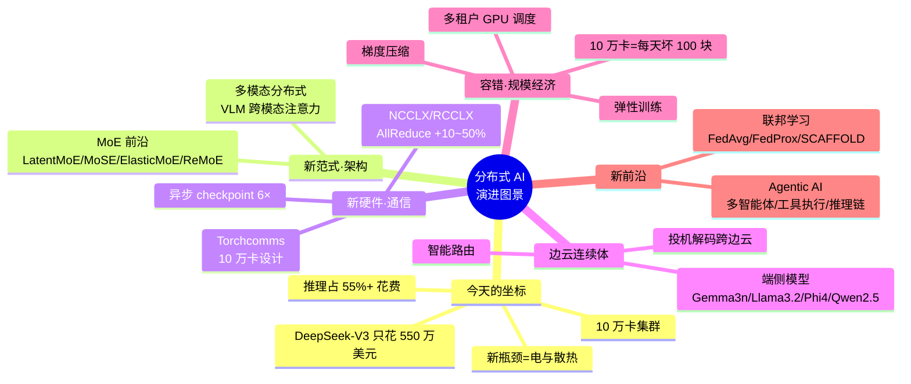
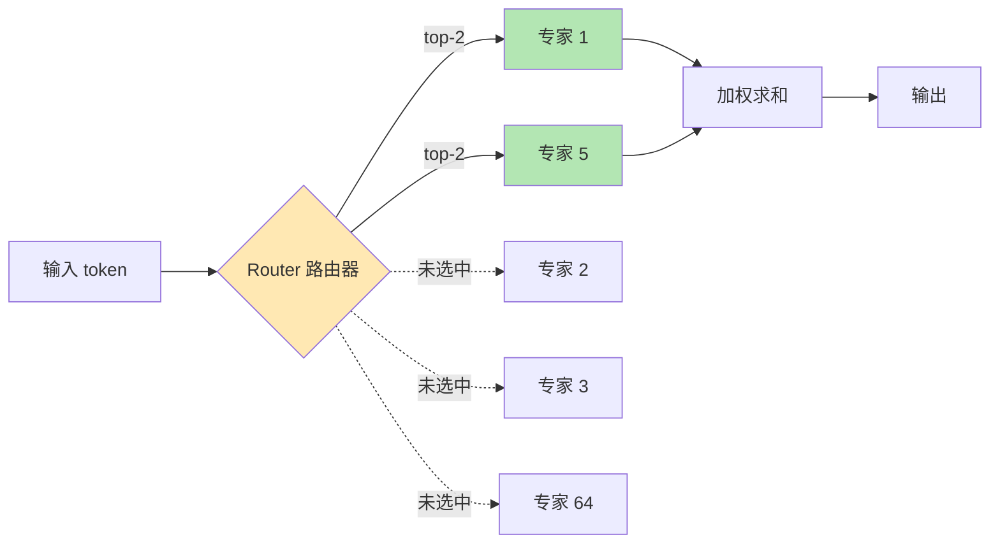
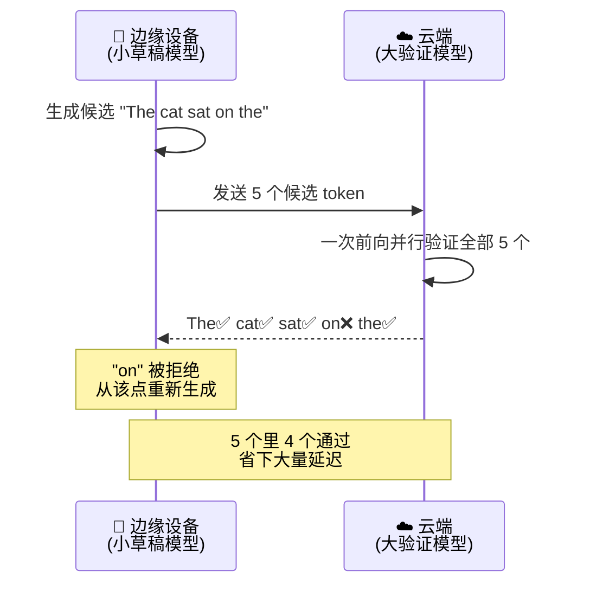
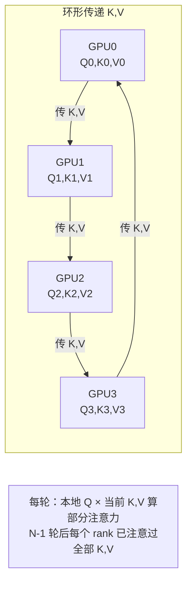
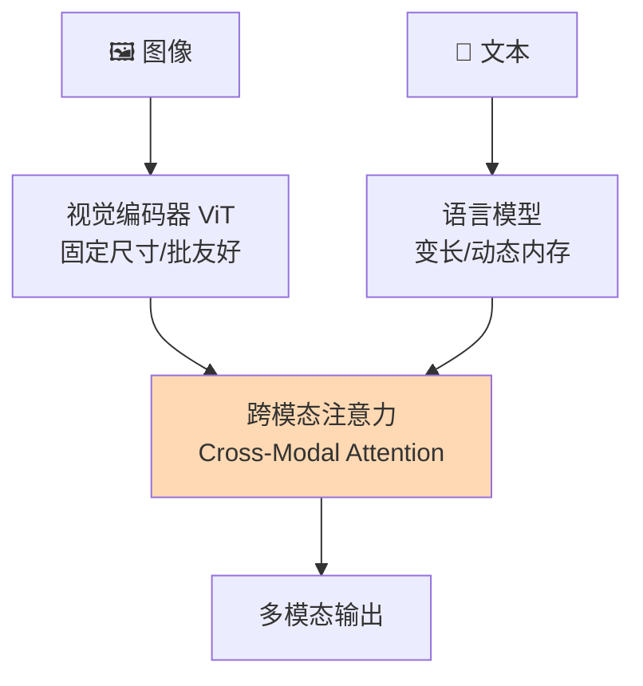
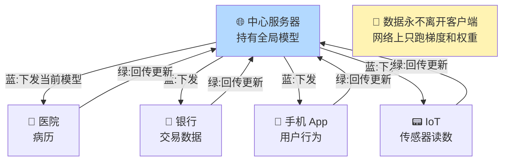
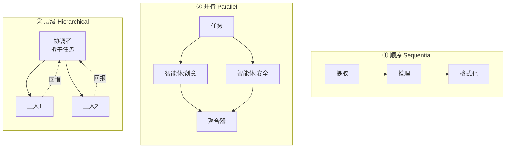
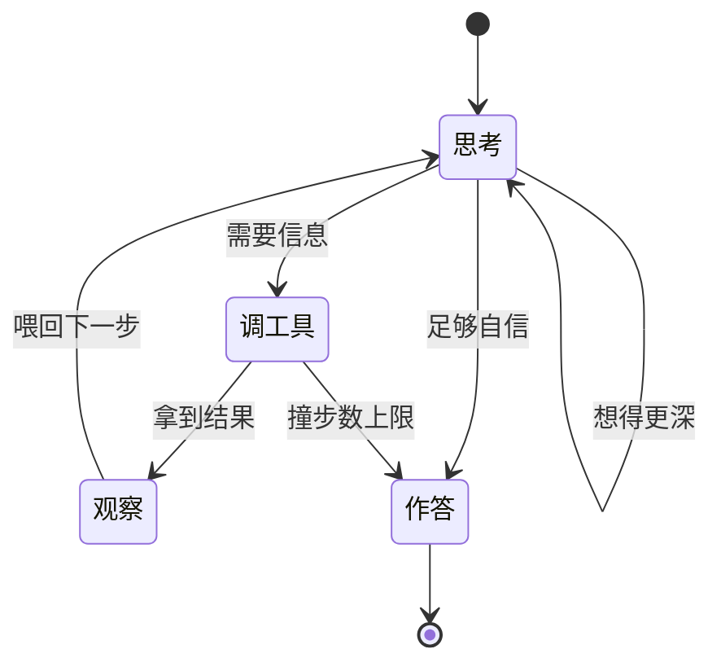
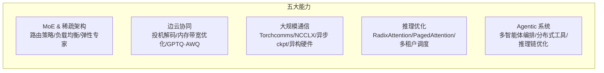

# 第 11 章 · 分布式 AI 的演进图景（The Evolving Landscape of Distributed AI）🌌

> *"预测未来最好的方式，就是把它发明出来。"*
> —— Alan Kay，计算机科学家

---

## 🗺️ 本章地图

这是全书的**收官章**。前十章我们从"一个模型装不下一块 GPU"出发，一路走过 DDP 的梯度同步、FSDP 的显存优化、张量/流水线并行、vLLM 的 PagedAttention、SGLang 的 RadixAttention……把**训练 → 推理 → 部署**这条完整链路搭了起来。本章不再教新的单点技术，而是**站到山顶回望全局**：这个领域今天走到哪了？下一步往哪走？哪些还是没解决的开放问题？

本章会依次讲透六大主题（对应书中六大板块）：

读完本章，你会拥有一张"分布式 AI 领域的地图"——知道趋势往哪走、新硬件长什么样、新范式解决什么问题、哪些坑还没填平，以及**如何持续跟上这个每半年就变天的领域**。

---

## 📍 一、我们今天站在哪里（Where we stand today）

在讲趋势之前，先用几个**硬数字**锚定当下坐标。这些数字放在几年前都是"不可能"。

| 维度 | 今天的数字 | 为什么震撼 |
|---|---|---|
| 单集群规模 | **10 万+ 块 GPU** | 靠 NCCLX、Torchcomms 等新通信框架才撑得起 |
| SGLang 服务规模 | 全球 **40 万+ GPU** | 跑 xAI Grok 3、微软 Azure 的生产负载 |
| DeepSeek-V3 训练成本 | **550 万美元** | 671B 参数 MoE、每 token 只激活 37B，2048 块 H800 |
| 端侧模型内存 | Gemma 3n 只要 **2–3GB RAM** | 靠 Per-Layer Embeddings，手机能跑 LLM |
| 推理占基础设施花费 | **> 55%** 且持续增长 | 训练不再是主线剧情 |

> 🔬 **第一性原理：为什么"推理"必然压倒"训练"？**
> 逻辑极其朴素：**训练只发生一次，推理发生数百万次。**
> $$\text{总推理成本} = (\text{单次推理成本}) \times (\text{调用次数}) $$
> 训练成本是一次性摊销；而一个成功产品每天可能被调用上亿次。当模型成熟、部署铺开，经济账**必然**倒向推理优化。这不是趋势判断，是乘法。所以整个行业的优化重心，从"把集群造得更大"转向"把每一次推理做得更便宜"。

### 1.1 旧瓶颈退场，新瓶颈登场

过去几年，大家抢的是**硅**（GPU 买不到、排不上队）。今天最有意思的转折是：

> ⚠️ **主要瓶颈已经不是芯片可得性，而是电力（power）与散热（cooling）。**

数据中心现在是**围着热限设计**，而不是围着机架空间设计。组织把"散热改造"算进 TCO（总拥有成本），提前几个月锁定云容量承诺。剩下的技术硬骨头也都很有意思：

- **10 万卡以上如何高效扩展** → 需要新的通信模式 + 容错机制；
- **推理里延迟 vs 吞吐的平衡** → 至今仍是"艺术多于科学"；
- **混合云-边架构下的成本优化** → 正在自成一门学问。

### 1.2 涌现趋势速览（Emerging trends at a glance）

书里给了一张"路线图"，把正在重塑分布式 AI 的方向一次列出——后面每一节展开：

| 方向 | 代表技术 | 一句话本质 |
|---|---|---|
| **先进 MoE 架构** | LatentMoE / MoSE / Elastic MoE / ReMoE | 用软硬协同 & 可微路由把"每 FLOP 精度"榨到极致 |
| **端侧与边缘 AI** | Gemma 3n（Per-Layer Embeddings）| 亚十亿参数模型 + 4-bit 量化，手机可用；瓶颈是**内存带宽**不是 FLOPs |
| **下一代通信** | Torchcomms / NCCLX / RCCLX | 面向 10 万卡、异构硬件；AllReduce 提速 10–50%；异步 checkpoint 快 6× |
| **推理引擎进化** | SGLang（RadixAttention）/ vLLM（PagedAttention）| H100 上 16,215 tok/s；KV cache 浪费从 60–80% 压到 <4%；支持 AMD/Intel/TPU/昇腾 |

---

## 🧩 二、新范式之一：MoE —— 事实上的主流架构

MoE（Mixture of Experts，混合专家）的基础我们在**第 5 章**（训练侧的专家并行）和**第 6 章**（vLLM 的 MoE 推理）讲过。这里只讲**研究前沿**——把 MoE 能力继续往前推的四个新方向。

> 💡 **快速回顾 MoE 本质**：一个 MoE 层有很多"专家"（一般是 FFN），一个**路由器（router）**为每个 token 挑 top-k 个专家来算。这样**模型总容量（参数量）**可以极大，而**每个 token 的实际计算量（激活参数）**却很小。DeepSeek-V3 就是典型：671B 总参数，每 token 只激活 37B。这就是"扩容量不成比例地扩算力"。

### 2.1 四个前沿方向

| 方法 | 核心创新 | 解决什么痛点 | 落地 |
|---|---|---|---|
| **LatentMoE** [2] | 硬件-软件**协同设计**，优化"每 FLOP 精度" | 同样算力下拿更高精度 | 被 Nvidia **Nemotron-3** 采用 |
| **MoSE**（Mixture of Slimmable Experts）[3] | **可变宽度**专家执行——推理时动态调专家宽度 | 延迟需求随场景变化时，做**连续的精度-算力权衡** | 部署侧灵活性 |
| **Elastic MoE** [4] | 推理时把激活专家数**放大到训练值的 2–3×**（train top-2 → infer top-4/top-6）| **解耦**训练与推理配置，推理时用更多专家换性能 | 推理时"加码" |
| **ReMoE** [5] | 用**可微的 ReLU 路由**替换不可微的 TopK+Softmax | 让动态计算分配可微、简化训练动力学 | 全可微 MoE |

> 🔬 **核心论证：为什么 ReMoE 要干掉 TopK？**
> 经典路由是 `TopK(Softmax(x·W))`。TopK 这个"选前 k 个"的操作是**离散、不可微**的——梯度没法直接穿过它流回路由器权重。传统做法要靠 Straight-Through Estimator、辅助负载均衡 loss 等"补丁"。ReMoE 换成 ReLU：`gate = ReLU(x·W)`，天然连续可微，激活值为 0 就等于"不选这个专家"。这样**稀疏性**（哪些专家被激活）本身也变成可学习、可微的量，训练动力学更干净。

> 💡 **实战 / 面试高频**：书中指出 `code/moe_layer.py` 提供了扩展第 5 章概念的实现，特别包含**无辅助损失（auxiliary-loss-free）的负载均衡路由**。这是 DeepSeek-V3 的关键技巧之一——传统 MoE 要加一个"负载均衡 loss"逼专家被均匀使用，但这个 loss 会干扰主任务；无辅助损失方案改用**可学习的偏置项**动态调整路由，达到均衡而不污染主 loss。面试常问"MoE 怎么防止专家坍缩/负载不均"，记住这两条路线即可。

> ⚠️ **常见坑：专家并行的通信是 All-to-All**（见本章练习第 7 题）。token 被路由到分散在不同 GPU 上的专家，需要把 token **打散再聚合**，通信模式是**All-to-All**——这是专家并行里最贵的通信原语，比 Broadcast/Reduce/Gather 都重。规模一大，All-to-All 就成为 MoE 训练的头号瓶颈。

---

## 🌐 三、新范式之二：边云连续体（The Edge-Cloud Continuum）

这是分布式 AI 里**最深刻的一次观念转变**：云与边的边界正在模糊。

过去的默认假设很简单：**云上训练、（也许）云上服务、边缘设备只负责"消费"结果**。这个模型正在瓦解。

### 3.1 端侧 AI 为什么现在才行（Why edge AI matters now）

端侧 AI 的价值主张非常有吸引力：

| 好处 | 机制 |
|---|---|
| **延迟骤降** | 消除网络往返，从数百 ms 降到个位数 ms |
| **隐私提升** | 数据永不离开设备 |
| **成本下降** | 不用按 token 付云推理费 |
| **离线可用** | 开启全新用例 |

**三件事同时成熟**，才让端侧 AI 从"实验"变"实用"：

1. **架构更高效**：亚十亿参数模型，能干过去要 7B+ 才能干的活；
2. **量化成熟**：16-bit → 4-bit，存储与内存流量都省 **4×**，用 GPTQ [6]、AWQ [7] 质量损失极小；
3. **硬件进步**：移动端 NPU 强到能以可接受速度跑量化模型。

> 🔬 **第一性原理：手机的瓶颈是"内存带宽"，不是"算力"！**（本章练习第 3 题）
> 这是最常被忽略的关键点。手机内存带宽约 **50–90 GB/s**；而 H100 级数据中心 GPU 是**每秒数 TB**——差距约 **30–50×**（对 H200 更大，对老卡如 V100 更小）。
> 那量化为什么救命？因为它**削减了每次前向传播里跨过这条总线的字节数**，而不只是省了磁盘上存的权重大小。
> $$\text{每次前向的时间} \approx \frac{\text{要搬运的字节数}}{\text{内存带宽}}$$
> 4-bit 量化把权重字节数砍到 1/4，等于每次前向搬运量砍到 1/4，在**带宽受限**的手机上直接换来约 4× 的速度。这就是为什么端侧一定要量化——不是为了省空间，是为了省**带宽**。

### 3.2 实用的端侧模型（Practical On-device models）

| 模型 | 参数量 | 内存 | 用途 |
|---|---|---|---|
| **Gemma 3n** | 5B / 8B | 2–3GB | 通用助手 |
| **Llama 3.2** | 1B / 3B | 1–2GB | 文本任务 |
| **Phi-4 mini** | 3.8B | 2GB | 推理 |
| **Qwen2.5** | 0.5B–1.5B | <1GB | 轻量任务 |

- Google **Gemma 3n** 用 **Per-Layer Embeddings**，让 5B/8B 模型跑出 2B/4B 的内存足迹（约 2–3GB）；
- Meta **Llama 3.2** 的 1B/3B 专为边缘部署设计；
- 微软 **Phi-4 mini** 把强推理塞进 3.8B；
- 阿里 **Qwen2.5** 从 0.5B 到 1.5B 覆盖最轻量任务。

> 💡 **关键洞察**：在小尺度上，**架构与训练质量比原始参数量更重要**。一个训练精良的 1B 模型，很多任务上能打赢训练糟糕的 3B 模型。别只盯着参数数字。

### 3.3 边云协同：跨边界的投机解码（Edge-cloud coordination）

最有意思的系统**不把边和云当两个世界**，而是让它们协作。这里巧妙复用了**第 7 章的投机解码（speculative decoding）**——原本用于单机加速（小草稿模型提议 token、大模型验证），现在跨越边云边界同样奏效。

**为什么快？** 验证很便宜：云模型可以在**一次前向**里评估全部 5 个 token，而逐个生成要 5 次前向。当草稿大多正确（对可预测的文本经常如此），你就拿到了**云级质量 + 边缘级速度**。

> ⚠️ **收益高度依赖任务**：结构化输出（代码、JSON）端到端常有 **3–4× 加速**；而开放式创意文本可能只有 **1.2–1.5×**，因为拒绝频繁 [8]。别把 benchmark 数字当通用承诺。

**智能路由**把协同推得更远：不是每个请求都要上云。好系统会**估计请求难度、看边缘模型的信心、瞄一眼网络状况**，然后决定：本地处理还是发云端？

- 简单查询"东京现在几点？" → 留在设备上；
- 复杂推理任务 → 发云端；
- 路由逻辑还能**从历史决策中学习**，越来越会预测哪些请求本地能成。

> 💡 书中 `code/edge_cloud.py` 实现了三个模式：`EdgeCloudSpeculativeDecoding`（草稿-验证环路）、`IntelligentOffloading`（基于复杂度的路由）、`AdaptiveRouter`（随时间自我改进）。

---

## ⚙️ 四、新硬件 / 新通信：10 万卡规模下的并行

前面章节讲的并行策略——数据并行（第 3 章 DDP、第 4 章 FSDP）、张量并行、流水线并行（第 5 章）——**依旧是地基**。但到了 **10 万卡+** 规模，会冒出需要新解法的新挑战。

### 4.1 通信革命：Torchcomms

PyTorch 推出 **Torchcomms** 是分布式训练基础设施的一次重大演进。旧通信栈虽然能用，但在超大规模下"显老"了。Torchcomms **从零为 10 万卡+ 部署设计**，四大创新：

| 创新 | 含义 | 价值 |
|---|---|---|
| **解耦通信原语** | 把 collectives 从 PyTorch 核心里拆出来 | 研究者可**独立迭代**新集合通信 & 后端 |
| **eager 初始化 + 模型专属提示** | 用模型级 hints 优化 communicator/资源分配 | 超大规模下更省资源 |
| **异构硬件支持** | 单个训练任务里混用多厂商、多代 GPU | 真正的混合部署 |
| **内建容错** | 容错不再是"事后补丁" | 从设计层面抗故障 |

配套发布的 Meta **NCCLX** 后端（AMD 平台对应 **RCCLX**），通过 **Direct Data Access（DDA）** 等技术让 **AllReduce 提速 10–50%**。

> 🔬 **为什么 10–50% 不是"小改进"**：训练一次超大模型可能花数百万美元，其中通信占相当比例。AllReduce 提速 10–50%，可能**就是一次训练"经济上可行"与"不可行"的分界线**。在规模经济里，百分比即是钱。

### 4.2 层级并行（Hierarchical parallelism）

规模一大，你**不是选一种并行，而是组合它们**。典型大训练：**节点间数据并行 + 节点内张量并行 + 跨模型阶段流水线并行**。数学很直白：

$$\text{dp\_size} \times \text{tp\_size} \times \text{pp\_size} = \text{world\_size}$$

难点在**怎么选组合**——这是一门权衡的艺术：

| 并行方式 | 优点 | 代价 |
|---|---|---|
| **张量并行 TP** | 节点内通信开销低（NVLink 快）| **跨节点**开销高 → 一般只在节点内用 |
| **流水线并行 PP** | 能隐藏通信延迟 | 引入**气泡（bubble）**开销 |
| **数据并行 DP** | 扩展性好 | 需要梯度同步 |

最优配置取决于**模型架构、硬件拓扑、batch size 约束**。书中 `code/parallelism.py` 的 `HierarchicalParallelism` 类负责为三个维度创建 process group，确保每块 GPU 都知道自己在每种并行里属于哪个组。

### 4.3 长上下文：序列并行 & Ring Attention

上下文越来越长时，**序列并行（sequence parallelism）**变得必要——把**序列维度**切到多块 GPU 上。每块 GPU 算自己那段序列的注意力，但注意力需要看到**完整的 K、V**，所以要从所有序列并行 rank 那里 **all-gather K 和 V**。

SGLang 的流水线并行在长 prompt 上给出了强力数字：DeepSeek-V3.1 上 **3.31× prefill 吞吐**、百万 token 上下文 **TTFT 降低最高 81%**、**82.8% 扩展效率**。

> ⚠️ **别把"能装下"当"能读懂"**：这些技术解决的是**内存和延迟**；**检索质量是另一回事**——很多模型在远低于其宣传上下文上限时，长文档准确率就已经掉了。上下文窗口大 ≠ 长文档里找得准。

**Ring Attention** [9]（第 5 章上下文并行讲过，这里放到百万 token 场景重看）提供了比标准序列并行更省内存的方案：

| 维度 | 标准序列并行 | Ring Attention |
|---|---|---|
| K,V 处理 | **all-gather** 完整 K,V | 只在环上**传递 K,V 分块** |
| 每 GPU 内存 | O(sequence_length) | 大幅降低 |
| 代价 | 内存吃紧 | **更多通信轮次**（本章练习第 8 题）|

> 🔬 **本质：Ring Attention 是"拿通信换内存"**。它不一次性把全部 K、V 拉到每块 GPU（那要 O(序列长度) 内存），而是把 K、V 分块**绕着 GPU 环传递**，每步算一次部分注意力分数。转 N−1 圈后，每个 rank 就注意过了所有键值。在**内存受限但带宽有余**时，这个交易极划算——百万 token 尺度上，省下的"全量 K,V all-gather"内存，往往就是"装得下"与"OOM"的分界。书中 `RingAttention` 类实现了它。

---

## 🛡️ 五、容错：当事情出错时（Fault Tolerance）

> **在 10 万卡集群里，故障是常态，不是例外。**

### 5.1 一道触目惊心的概率题

假设每块 GPU 日可靠性 99.9%，那么 10 万卡集群里，**每 24 小时预计坏约 100 块**（本章练习第 5 题）。更狠的是"全员平安"的概率：

$$P(\text{全部存活}) = 0.999^{100{,}000} \approx 3.7 \times 10^{-44} \approx 0$$

> 🔬 **第一性原理：故障是"新的正常运行状态"**。$3.7\times10^{-44}$ 意味着——你几乎**不可能**遇到"一天没坏一块卡"的情况。所以在这个规模，你的系统设计前提必须从"故障是异常、需要人工处理"翻转为"故障时刻在发生、系统必须自动扛住"。弹性训练和异步 checkpoint 从"可选优化"变成"强制标配"。

### 5.2 checkpoint 的挑战

传统 checkpoint 是**同步**的：停训练 → 存盘 → 恢复。当 checkpoint 只要几秒、训练只跑几小时时，这没问题。但规模化后，checkpoint 要**几分钟**、训练跑**数周**，同步开销就大得离谱。

PyTorch 的 **Distributed Checkpointing（DCP）** 靠三招做到约 **6× 提速**：

| 优化 | 做法 | 直觉 |
|---|---|---|
| **缓存保存计划**（Cached save plans）| 复用 tensor 元数据 | 形状/dtype 不变，何必每次重算？ |
| **后台保存**（Background saving）| 把实际 I/O 挪到独立线程 | 减少 GIL 争用 |
| **增量保存**（Incremental saves）| 只写自上次以来**变化的** tensor | 没变的不重复写 |

书中 `AsyncCheckpointer`（`code/fault_tolerance.py`）实现了这些思路：用一个后台线程从队列里取保存请求，让训练**继续跑**的同时写 checkpoint，还自动清理旧 checkpoint 省磁盘。

> 💡 **面试高频（本章练习短答第 2 题）：同步 vs 异步 checkpoint 的核心区别？**
> 同步 = 训练**停下来等**存盘完成；异步 = 存盘在后台线程进行，训练**不停**。规模化下异步为什么关键？因为 checkpoint 从"几秒"涨到"几分钟"，如果每次都同步阻塞，累积的停机时间会吃掉可观的算力预算——异步把这段等待藏进了后台。

### 5.3 故障检测与弹性训练

**故障检测**听起来简单——看 worker 有没有响应就行。但细节要命：**等多久才宣布一个 worker 死了？** 太短 → 网络抖动引发误判；太长 → 白等一个真死的 worker。

书中 `FailureDetector` 用**心跳机制**：

| 设计决策 | 典型值 | 权衡 |
|---|---|---|
| 心跳间隔 | 1–5 秒 | 响应性 vs 开销 |
| 超时阈值 | 漏 3–5 次心跳 | 判死前的容忍度 |
| 故障回调 | log / 告警 / checkpoint / abort | 死了之后做什么 |

最高级的是**弹性训练（elastic training）**——系统**不停机**地适应 worker 变化：worker 可以中途加入或离开，坏了就 checkpoint、把活重分给剩下的、继续跑；新 worker 加入就分一份活。这需要精细协调：

- **梯度平均**要考虑变动的 worker 数；
- **数据加载**要动态重分片；
- **学习率调度**可能要随 worker 数调整；
- **checkpoint**要能处理过渡期的部分状态。

`ElasticTrainer`（`code/fault_tolerance.py`）负责这些，提供故障时自动 checkpoint 与优雅降级。

---

## 🖼️ 六、超越文本：多模态分布式训练

今天最吸睛的模型不是纯文本，而是**多模态**——能"看+读"的视觉语言模型（VLM）、处理视频的、听懂音频的。高效分布这些模型需要新模式。

### 6.1 跨模态挑战（The Cross-modal challenge）

一个 VLM 通常有：**视觉编码器**（常是 ViT）产出图像特征 + **语言模型**处理文本并注意这些图像特征。二者相遇的地方，就是**跨模态注意力**（文本 token 去注意视觉特征）。

跨模态注意力可以用**张量并行**（把注意力头切到多 GPU）来并行。但有个微妙点：

> ⚠️ **视觉编码器和语言模型的最优并行策略可能不同**（本章练习短答第 3 题）。视觉编码器处理**固定尺寸**图像，受益于与语言模型**不同的 batch size**；语言模型处理**变长**文本。硬套同一套并行配置会两头不讨好。

书中 `code/multimodal.py` 提供：`VisionEncoder`（带 patch embedding 的 ViT）、`CrossModalAttention`（支持张量并行的文本→视觉注意力）、`VisionLanguageModel`（完整 VLM）。

### 6.2 不同模态的不同脾气

| 模态 | 尺寸 | 特性 |
|---|---|---|
| **图像** | 预处理后固定 | 批友好、内存可预测 |
| **文本** | 变长 | 需 padding、动态内存 |
| **视频** | 多帧 | 高内存、有时序结构 |
| **音频** | 变时长 | 时序结构、可流式 |

`MultimodalDataParallel` 负责把 batch 散到各 worker 同时**保持模态对齐**——这比听起来难：你得保证"一段文本 prompt 对应的图像"落到**同一个 worker** 上，即便各模态 batch size 不同。

---

## 🔒 七、新前沿之一：联邦学习（Federated Learning）

全书此前都默认"所有 GPU 能访问共享数据集"。但**如果数据根本不能移动呢**？隐私法规、竞争顾虑、或纯粹的物流不可行让集中化成为泡影——这就是联邦学习登场的地方。

### 7.1 联邦范式：把模型带到数据身边

联邦学习**反转了脚本**：不是"把数据搬到模型"，而是"把模型搬到数据"。每个参与方——手机、医院、银行——在**本地数据**上训练，只共享**模型更新，从不共享原始数据**。中心服务器聚合更新，产出全局模型。

**经典算法是 FedAvg** [10]：每一轮，服务器把当前模型发给一部分客户端；客户端本地训练几个 epoch，回传更新后的权重；服务器**平均**这些权重得到新全局模型。简单，却出奇有效——领域在它之上建了大量改进。

### 7.2 联邦学习在哪些垂直领域开花

| 领域 | 用法 | 代表 |
|---|---|---|
| **医疗** | 多院协作训诊断模型而不共享病历（保持 HIPAA 合规）| NVIDIA FLARE [11]；跨 20 家医院看到的病理比任何单院都丰富 |
| **手机输入法** | Google Gboard 改进下一词预测，不上传用户输入 | 首批大规模生产部署之一 |
| **金融** | 银行协作反欺诈而不共享交易数据 | 组合模型能抓单家银行看不到的欺诈 |
| **边缘 IoT** | 工业传感器/自动驾驶/智能设备数据难以集中 | 无需海量数据传输即可改进模型 |

### 7.3 异构性的挑战（The challenges of heterogeneity）

联邦学习面对**传统分布式训练里不存在**的挑战：

| 挑战 | 数据中心里 | 联邦里 |
|---|---|---|
| **Non-IID 数据** | 可 shuffle，每块 GPU 见代表性样本 | 每个客户端反映**本地分布**（日本键盘 vs 巴西键盘）→ 统计异构导致发散、收敛慢 |
| **系统异构** | 硬件同质 | 旗舰机 vs 三年老机训不动同一速度；有人中途因电量/网络掉线 → 必须抗掉队者与部分参与 |
| **通信约束** | NVLink 高速 | 走移动网/互联网，带宽有限且贵 → 梯度压缩/量化/低频同步是**可行性**问题而非性能问题 |

### 7.4 现代联邦技术

| 技术 | 做法 | 解决 |
|---|---|---|
| **FedProx** [12] | 本地目标加**近端项** | 防客户端漂离全局模型，稳住高度 non-IID 的训练 |
| **SCAFFOLD** [13] | 用**控制变量**纠正客户端漂移 | 异构数据上比 FedAvg 收敛更快 |
| **差分隐私（DP）** | 给更新加**校准噪声** | 提供形式化隐私保证，医疗/金融尤其重要 |
| **安全聚合** [14] | 服务器只看到更新之**和** | 即便服务器被攻破，也拿不到任何单个客户端的更新 |

### 7.5 把联邦学习用到 LLM 上

给 LLM 做联邦有独特难点：7B 模型塞不进手机，微调也吃内存。近期探索几条路：

- **LoRA 联邦微调**：只训**低秩适配器**，减通信（只换 adapter 权重）+ 减内存（adapter 很小）。FedIT [15] 让联邦 LLM 微调变得实用；
- **拆分学习（Split Learning）**：模型**在客户端与服务器间切开**，客户端跑前几层、发**激活值**（不是原始数据）给服务器完成前向。让客户端不必持有完整模型；
- **端侧个性化**：不训单一全局模型，每台设备维护**个性化版本**——全局模型给起点，本地微调适配个体用户。

### 7.6 Flower 框架 & 何时该用联邦

**Flower** [16] 已成为领先的开源联邦学习框架：简单 API 定义联邦训练环、支持多种聚合策略（FedAvg/FedProx）、集成 PyTorch/TF/JAX、有仿真能力、有生产部署工具。基础联邦训练只要几十行代码。

> 💡 **决策表：什么时候用联邦学习？**（这是**面试与架构选型高频**）

| ✅ 考虑联邦学习 当…… | ❌ 坚持传统训练 当…… |
|---|---|
| 数据**不能离源**（隐私/法规）| 数据**可以集中** |
| 数据天然分布（移动/边缘）| 你**掌控基础设施** |
| 参与方**互不信任** | 单组织内训练 |
| 通信昂贵 | 有高带宽互联 |

> ⚠️ 联邦学习**不是**传统分布式训练的替代品，而是**特定场景的工具**。它有代价——收敛更慢、通信受限、异构挑战——所以**能集中数据时就别用它**。只有当隐私或物流让集中化不可能时，联邦才让"本来不会发生的协作"成为可能。

---

## 🤖 八、新前沿之二：Agentic AI（智能体 AI）

也许最激动人心的近期进展，是 **agentic AI 的崛起**——系统不再只是"回应 prompt"，而是**规划、用工具、采取行动**。它把分布式推理推向新方向。

### 8.1 为什么智能体需要"分布"

想想一个智能体决定**调用工具**时会发生什么：工具可能是代码解释器、浏览器、数据库查询、API 调用。每种工具的资源需求和延迟特性都不同——有的**有状态**、要跑在特定 worker 上；有的**天然可并行**；有的是**顺序瓶颈**。

再叠加**多智能体系统**：多个智能体协作，各有能力，需要通信、协调、有时还得**分歧**。这些通信可能在单节点内，也可能跨分布式系统。

再叠加**长推理链**——像 o1、DeepSeek-R1 [17] 产生的那种——需要跨很多步的持续推理。每步可能含工具调用、记忆查询、与其他智能体协调。这时推理**不是一次前向**，而是可能跑上几分钟的**扩展计算**。

### 8.2 三种多智能体协调模式

| 模式 | 结构 | 适用 |
|---|---|---|
| **顺序处理** | 流水线：一个提取信息→下一个推理→第三个格式化，前者输出=后者输入 | 任务天然分解为**清晰交接的阶段** |
| **并行处理** | 多智能体**同时**做同一任务：要多样视角（一个求创意、一个求安全），或**竞速**取最先完成，结果汇到聚合器 | 要多样性 / 抢时间 |
| **层级处理** | 协调者收任务→拆子任务→派给专业工人→工人回报→协调者综合 | 复杂任务**自然分解**：协调者管战略、工人管战术 |

书中 `code/agentic_inference.py` 实现了全部三种模式，外加根据任务特性选模式的路由逻辑。

### 8.3 分布式工具执行（Distributed tool execution）

智能体决定调工具时，**工具到底在哪跑？** 工具不平等：

| 工具类型 | 约束 | 放置策略 |
|---|---|---|
| 代码解释器 | 需**沙箱**、安全隔离 | 不能随便找地方跑 |
| 浏览器 | 可能需 GPU 渲染 | 找有 GPU 的 worker |
| 简单计算器 | 无状态 | 任意有空闲的 worker |

`DistributedToolExecutor`（`code/agentic_inference.py`）处理这个路由：工具注册时带可选约束（"我要沙箱"/"我要 GPU"/"我无状态、随便跑"）。这开启了高级放置策略：

- **高频工具** → 跨 worker 复制做负载均衡；
- **有状态工具**（数据库连接、浏览器会话）→ **钉在特定 worker** 上让状态在多次调用间保持；
- **资源密集工具** → 隔离到专用 worker，防止饿死其他操作；
- executor 还跟踪执行统计，**随时间学习哪种放置最优**。

### 8.4 推理智能体（Reasoning agents）

最高级的智能体**不只回应——它会思考**。给一个复杂问题，它拆解、尝试、观察结果、调整。这就是 o1、DeepSeek-R1 的领地——推理不是一次前向，而是可能跨数十步的**扩展审议**。

书中 `ReasoningAgent` 捕捉了这个模式：维护一条**推理轨迹（reasoning trace）**——思考、工具调用、观察的滚动记录。每一步，智能体面临选择：**更深思考当前状态、调用工具收集信息、或提交最终答案**。调工具时，结果变成新观察喂进下一个思考。循环持续到智能体足够自信作答、或撞上步数上限。

> 🔬 **核心论证**：这是生产级推理系统的简化版，但抓住了本质动态——**思考与行动的交织、内部审议与外部观察的交替**，正是这个交替让智能体能解决"单次推理搞不定"的复杂问题。

---

## 💰 九、规模的经济学（The Economics of Scale）

随着分布式 AI 成熟，**"多堆 GPU 就完事"的日子结束了**，效率与成本优化成了一等公民。

### 9.1 工作负载分布

企业工作负载**没有单一主导类别**——所以基础设施必须**灵活**：

| 工作负载类型 | 占比 |
|---|---|
| 大规模推理 | **34.6%** |
| 基础模型训练 | 24.9% |
| 领域专属训练 | 23.3% |
| 微调 | 17.2% |

组织普遍采用**混合策略**：

- **公有云**：接弹性、多变、需求难预测的负载；
- **本地部署**：接高吞吐生产推理，成本可预测时更划算；
- **近边缘数据中心**：接延迟敏感的面向用户的 AI 服务。

### 9.2 资源管理与多租户 GPU 共享

**动态资源分配**在负载多变时必不可少。`AdaptiveGPUAllocator` 根据**模型大小（内存需求）、batch size（吞吐需求）、任务优先级（业务重要性）**估算 GPU 需求，并为暂时排不上的任务维护队列。

`MultiTenantGPUScheduler` 实现**时间片 GPU 共享**：优先级加权轮转调度、租户间公平分配、待处理工作队列管理、高优任务抢占。这让多团队/服务**公平共享** GPU，优先级反映业务重要性。

### 9.3 梯度压缩（Gradient compression）

规模化下，**通信开销会盖过计算时间**。`GradientCompression`（`code/resource_management.py`）来降它：

| 方法 | 做法 | 效果 |
|---|---|---|
| **Top-k 稀疏化** [18] | 只保留最大的 k 个梯度值 | k=1% 时达 **100× 压缩**；**误差反馈**（把丢掉的梯度累积到下次迭代）保住收敛 |
| **量化** | 精度降到 8-bit | **4× 压缩**，对训练动力学影响极小；可与稀疏化叠加 |

> 🔬 **第一性原理：为什么梯度可以这么狠地压？**
> 关键洞察：**梯度高度可压缩**。大多数梯度值都很小、对学习贡献甚微。把通信**聚焦在最大的那些值**上、把其余的**累积起来**（误差反馈），就能在**不牺牲收敛**的前提下大幅降低带宽需求。
> $$g_t^{\text{send}} = \text{Top-}k(g_t + e_{t-1}), \quad e_t = (g_t + e_{t-1}) - g_t^{\text{send}}$$
> 这里 $e_t$ 是误差累积项——这一轮被丢弃的小梯度不会凭空消失，而是攒到下一轮，最终仍会被送出。这就是"稀疏但不失真"的秘密。

> 💡 **面试高频（本章练习短答第 4 题）：Top-k 稀疏化 vs 量化，怎么选？**
> - **Top-k 稀疏化**：压缩率极高（1% → 100×），但需要误差反馈机制维持收敛，且稀疏索引本身也要传；
> - **量化**：压缩率温和（8-bit → 4×），实现简单、对训练动力学几乎无影响；
> - **可叠加**：两者结合能拿到更高压缩比。选择取决于你的带宽紧张程度和对实现复杂度的容忍度。

---

## 🎓 十、为未来做准备：该修炼哪些技能

书中给出了面向未来的**技能清单**，这也是一份很好的"分布式 AI 工程师成长路线"：

| 技能领域 | 要掌握什么 | 为什么重要 |
|---|---|---|
| **MoE 与稀疏架构** | 专家路由（TopK / ReLU）、负载均衡、推理时弹性扩专家 | MoE 正成为默认架构 |
| **边云协同** | 投机解码实现、移动端内存带宽优化、量化（GPTQ/AWQ）| 开启此前不实用的部署选项 |
| **大规模通信** | Torchcomms API、NCCLX/RCCLX 后端、异步 checkpoint、异构部署 | 撑起更大训练 + 更高效基建 |
| **推理优化** | RadixAttention/PagedAttention 内部、长上下文流水线并行、多租户调度 | 提升服务效率、降成本 |
| **Agentic 系统** | 多智能体编排、分布式工具执行、推理链优化 | 分布式 AI 遇上复杂问题求解的下一个应用前沿 |

### 10.1 如何持续跟上（Staying current）

> ⚠️ **领域移动极快**——今天看着前沿的技术，**半年后可能就是标准实践**。跟上需要围绕几个信息源建立习惯：

| 信息源类型 | 具体 | 价值 |
|---|---|---|
| **arXiv** | cs.DC / cs.LG 每日新论文；设"distributed training / inference optimization / mixture of experts"关键词提醒 | 最好的工作常在会议发表前数月就出现在这里 |
| **开源项目** | vLLM、SGLang、DeepSpeed、Megatron-LM 的 release notes 与 GitHub 讨论 | 理论与实践相遇之处，看**真正在规模上 work 的东西** |
| **产业博客** | xAI、Anthropic、Google、Meta 团队的技术深潜 | 论文里找不到的实战洞察 |
| **社区** | Hugging Face 论坛、PyTorch Discuss、SGLang Discord | 从业者分享踩坑、一起 debug |
| **会议** | 研究：NeurIPS/ICML/ICLR（关注高效 ML/大规模系统 workshop）；系统：MLSys/OSDI/SOSP（基建/通信/生产部署）；产业：GTC/PyTorch Conference（新硬件框架预告，看未来 12–18 个月要来什么）| 新算法与新硬件首发地 |

---

## 📌 小结

本章作为全书收官，把分布式 AI 的**当下与未来**梳理成八条主线：

1. **推理的大迁移** 🔄：推理已占 AI 基础设施花费 **55%+**，训练成为总算力中较小的一块——因为"训练一次、推理百万次"是不可逆的乘法。这重塑了基建优先级与优化目标。
2. **MoE 主导** 🧩：DeepSeek-V3 证明 671B 模型可用 **550 万美元**训成（每 token 只激活 37B）。理解专家路由、负载均衡、并行至关重要；前沿在 LatentMoE / MoSE / Elastic MoE / ReMoE。
3. **端侧 AI 已实用** 📱：亚十亿参数模型 + 4-bit 量化 + Per-Layer Embeddings 让手机能跑 LLM。**瓶颈是内存带宽，不是算力**。
4. **10 万卡+ 规模** ⚙️：Torchcomms、NCCLX/RCCLX、异步 checkpoint 撑起空前规模；异构硬件支持日益重要。
5. **容错是刚需** 🛡️：10 万卡集群每天约坏 **100 块**，全员存活概率 $\approx 3.7\times10^{-44}$——弹性训练与异步 checkpoint 是**强制项**而非可选项。
6. **多模态与 Agentic** 🤖：VLM 的跨模态注意力、多智能体的工具执行需要新分布式模式，是下一个应用前沿。
7. **联邦学习作为替代范式** 🔒：当数据因隐私/法规不能集中时，FedProx、安全聚合等成熟技术让**本不会发生的协作**成为可能——但能集中就别用它。
8. **推理引擎进化** 🚀：SGLang 靠 RadixAttention 达 16,215 tok/s；vLLM 的 PagedAttention 把 KV cache 浪费压到 **<4%**；两者都已支持多样硬件平台。

> 全书讲过的技术——DDP、FSDP、DeepSpeed、Megatron-LM、vLLM、SGLang——**依旧是地基**。工具会一直换，但你一路建立起来的**系统思维（systems mindset）不会过时**。分布式 AI 的未来正由推边界的研究者和大规模部署的从业者书写——读完这本书，你更有能力去跟随这项工作，甚至**去发明它**。

---

## 🔗 延伸阅读（书中 References，精选）

**MoE 架构**
- DeepSeek-V3 技术报告：https://arxiv.org/abs/2412.19437
- LatentMoE：https://arxiv.org/abs/2601.18089 ｜ MoSE：https://arxiv.org/abs/2602.06154
- Elastic MoE：https://arxiv.org/abs/2501.03140 ｜ ReMoE：https://arxiv.org/abs/2412.14711

**通信与规模**
- Torchcomms：https://pytorch.org/blog/torchcomms/ ｜ NCCL：https://developer.nvidia.com/nccl
- RCCLX（AMD 平台）：https://engineering.fb.com/2026/02/24/data-center-engineering/
- PyTorch Distributed Checkpoint：https://pytorch.org/docs/stable/distributed.checkpoint.html
- 异步 checkpoint 6× 提速：https://pytorch.org/blog/6x-faster-async-checkpointing/
- Deep Gradient Compression：https://arxiv.org/abs/1712.01887

**推理引擎与高效注意力**
- SGLang（RadixAttention）：https://arxiv.org/abs/2312.07104 ｜ 文档：https://sgl-project.github.io/
- vLLM（PagedAttention）：https://arxiv.org/abs/2309.06180 ｜ 文档：https://docs.vllm.ai/
- 投机解码：https://arxiv.org/abs/2211.17192 ｜ Ring Attention：https://arxiv.org/abs/2310.01889
- Multi-head Latent Attention（DeepSeek-V2）：https://arxiv.org/abs/2405.04434 ｜ FlashAttention-2：https://arxiv.org/abs/2307.08691

**端侧 AI 与量化**
- GPTQ：https://arxiv.org/abs/2210.17323 ｜ AWQ：https://arxiv.org/abs/2306.00978
- Google LiteRT：https://ai.google.dev/edge/litert ｜ Gemma 3n：https://ai.google.dev/gemma/docs/gemma-3n

**推理与 Agentic AI**
- DeepSeek-R1：https://arxiv.org/abs/2501.12948 ｜ ReAct：https://arxiv.org/abs/2210.03629

**联邦学习**
- FedAvg：https://arxiv.org/abs/1602.05629 ｜ FedProx：https://arxiv.org/abs/1812.06127
- SCAFFOLD：https://arxiv.org/abs/1910.06378 ｜ Secure Aggregation：https://eprint.iacr.org/2017/281
- Flower：https://flower.ai/ ｜ NVIDIA FLARE：https://github.com/NVIDIA/NVFlare ｜ FedIT：https://arxiv.org/abs/2409.12568

**本书代码索引（对应 API）**
- `torch.distributed.checkpoint.save/load`（DCP 异步/分片 checkpoint）
- `torch.distributed.elastic.multiprocessing`（弹性训练）
- `torch.ao.quantization.quantize_dynamic`（动态量化压缩）
- `flwr.client.NumPyClient` / `flwr.server.strategy.FedAvg`（Flower 联邦）
- `megatron.core.transformer.moe.router.TopKRouter`（Megatron MoE top-k 路由）
- `vllm.LLM`（PagedAttention 推理引擎）｜ `sglang.Engine`（RadixAttention 运行时）

---

> 🎯 **本章练习自测（书中原题，答案见解析）**
> 1. MoE 主要优势？→ **b) 扩容量不成比例地扩算力**
> 2. 64 专家、top-2 路由，每 token 过几个专家？→ **b) 2**
> 3. 端侧 LLM 推理主瓶颈？→ **c) 内存带宽**
> 4. 边云投机解码做什么？→ **b) 小草稿模型提议 token、大模型验证**
> 5. 10 万卡、99.9% 可靠性，每天约坏几块？→ **c) 100**
> 6. MoE 负载均衡 loss 目的？→ **b) 鼓励专家均匀使用**
> 7. 专家并行里最贵的通信？→ **c) All-to-all**
> 8. Ring Attention 用什么换省内存？→ **b) 更多通信轮次**
>
> **动手题**：实现基础 MoE 路由——把 token 路由到 top-k 专家、计算负载均衡 loss、返回加权专家输出。用 4 专家 + top-2 测试，测一个 batch 上的专家利用率。参考 `code/moe_layer.py`。
