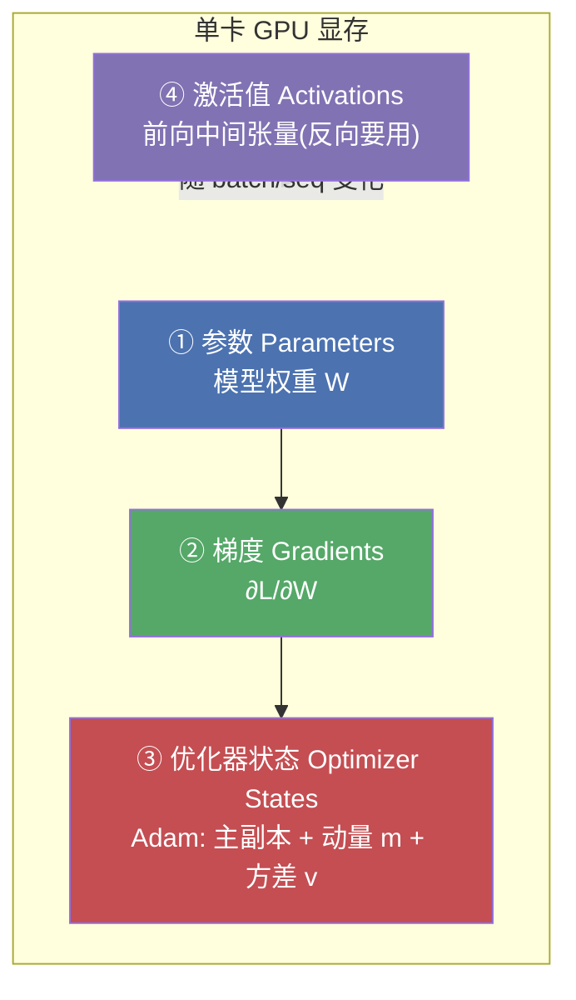
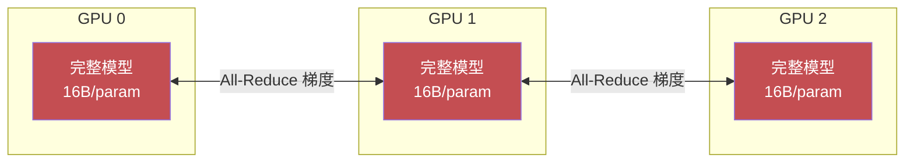
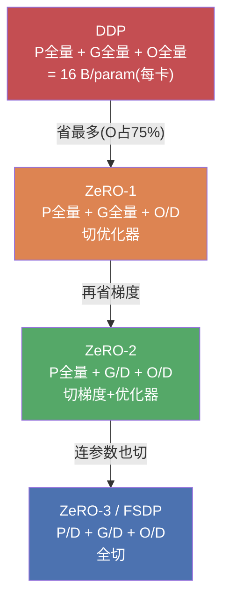
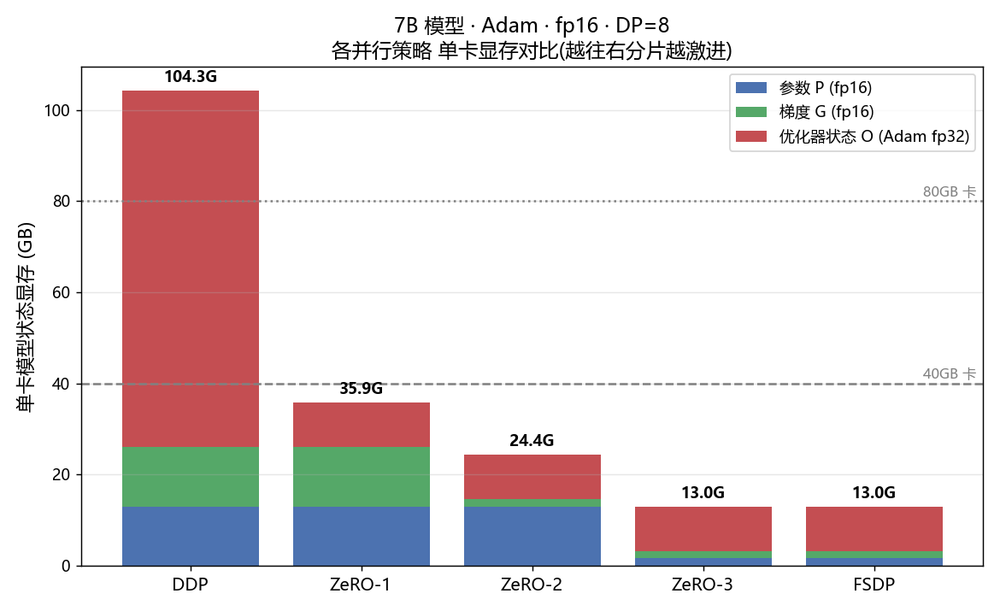
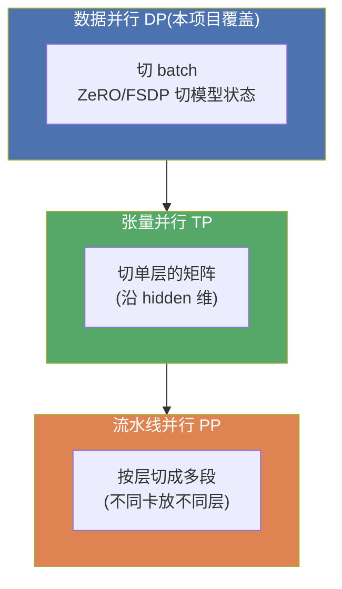

# 🧮 DDP vs FSDP/ZeRO 显存计算器

> 《Distributed AI Systems》配套实战项目 01
> **主题**:给定「模型参数量 / 优化器 / dtype / 数据并行度」,精确算出 **DDP** 与 **ZeRO-1/2/3、FSDP** 各自的**单卡显存占用**,并判断「**能不能塞进你的 GPU**」。
> **特点**:核心计算器零第三方依赖、纯离线、本机可跑;配 37 个 pytest 用例 + 3 张可视化图。

---

## 📖 目录

- [0. 这个项目解决什么问题](#0-这个项目解决什么问题)
- [1. 🔬 第一性原理:训练时显存到底花在哪](#1--第一性原理训练时显存到底花在哪)
- [2. 核心定律:16 字节/参数](#2-核心定律16-字节参数)
- [3. DDP:数据并行为什么这么费显存](#3-ddp数据并行为什么这么费显存)
- [4. ZeRO 三级火箭 & FSDP](#4-zero-三级火箭--fsdp)
- [5. 代码逐行讲解](#5-代码逐行讲解)
- [6. 如何运行](#6-如何运行)
- [7. 三张图讲了什么](#7-三张图讲了什么)
- [8. 💡 面试高频 & ⚠️ 常见坑](#8--面试高频--常见坑)
- [9. 📌 小结 & 🔗 延伸](#9--小结--延伸)

---

## 0. 这个项目解决什么问题

你手上有 8 张 A100-40G,想训一个 7B 模型。用 PyTorch DDP 直接 `OutOfMemoryError`。换 DeepSpeed ZeRO-3 就跑起来了。**为什么?到底省在哪?省了多少?**

面试官最爱问:

> "训练一个 7B / 13B / 70B 的模型,单卡至少需要多少显存?DDP 和 ZeRO-3 差多少倍?"

这个项目就是把这套算账逻辑**代码化**:

```
输入: 参数量 N、优化器、dtype、数据并行度 D
  ↓
输出: DDP / ZeRO-1 / ZeRO-2 / ZeRO-3 / FSDP 各自单卡显存 + 能否放进 GPU
```

一句话价值:**看完能手撕"16 字节/参数"和 ZeRO 分片账,面试再问显存不慌。**

---

## 1. 🔬 第一性原理:训练时显存到底花在哪

> 🔬 **核心论证**:GPU 显存不是被"模型"占的,而是被"训练这个模型所需的一整套状态"占的。搞清楚有哪几块、每块多大,一切并行策略的省显存逻辑就都通了。

训练一步(forward → backward → optimizer.step)期间,显存被 **4 大块**吃掉:



其中 **① + ② + ③** 合称 **模型状态(Model States)**,它的大小**只跟参数量 N 有关**,和 batch/序列长无关 —— 这正是 ZeRO/FSDP 要切的目标。
**④ 激活值** 跟 `batch × seq × hidden × layers` 成正比,由**激活重计算(activation checkpointing)**、序列并行等另一套技术处理。

> 💡 **实战提示**:本计算器聚焦"模型状态"(P+G+O),因为它是**固定成本**、也是 OOM 的主因;激活值单独给了一个粗略估算函数 `estimate_activation_bytes` 作补充。

### 为什么优化器状态是大头?

以最常用的 **Adam / AdamW** 为例。混合精度(mixed precision)训练下,虽然前向/反向用 fp16(2 字节)算得快,但为了数值稳定,**优化器内部必须维护一份 fp32 的"主参数副本"(master weights)**,外加 Adam 自己的一阶动量 `m` 和二阶方差 `v`(都是 fp32):

$$
\underbrace{\text{fp16 参数}}_{2\text{B}} + \underbrace{\text{fp16 梯度}}_{2\text{B}} + \underbrace{\text{fp32 主副本}}_{4\text{B}} + \underbrace{\text{fp32 动量 } m}_{4\text{B}} + \underbrace{\text{fp32 方差 } v}_{4\text{B}} = 16\ \text{B/param}
$$

**优化器状态(③)= 主副本 4 + m 4 + v 4 = 12 字节,占了 16 字节里的 75%!** 所以 ZeRO 第一刀先切它。

---

## 2. 核心定律:16 字节/参数

> 出处:ZeRO 论文(Rajbhandari et al., *ZeRO: Memory Optimizations Toward Training Trillion Parameter Models*, SC 2020),《Distributed AI Systems》一书反复引用。

| 组成 | dtype | 字节/参数 | 归属 |
|---|---|---|---|
| 参数 | fp16 | **2** | ① P |
| 梯度 | fp16 | **2** | ② G |
| 主参数副本 | fp32 | **4** | ③ O |
| Adam 动量 m | fp32 | **4** | ③ O |
| Adam 方差 v | fp32 | **4** | ③ O |
| **合计** | | **16** | |

**换算成 GB 的口算公式**(fp16 + Adam):

$$
\text{DDP 单卡显存(GB)} = \frac{16 \times N}{1024^3} \approx 14.9 \times \frac{N}{10^9}\ \text{GB}
$$

代入几个常见规模(向上取整,不含激活):

| 模型 | 参数量 N | DDP 单卡(≈16N) | ZeRO-3 @ DP=8 |
|---|---|---|---|
| 1B | 1e9 | ~15 GB | ~1.9 GB |
| 7B | 7e9 | **~104 GB** ❌ 塞不进 80G 卡 | ~13 GB ✅ |
| 13B | 13e9 | ~194 GB | ~24 GB |
| 70B | 70e9 | ~1043 GB | ~130 GB(需更大 DP) |

> 💡 **面试可以直接背**:7B 模型 DDP 训练单卡要 ~112GB(16×7),连 80G 的 H100 都塞不下 —— 这就是为什么大模型训练**必须**上 ZeRO/FSDP。

> ⚠️ **坑 1**:很多人只算"参数 2 字节 × N"就以为 7B 只要 14GB。**错**!那只是推理(inference)的量级。**训练**要 16 字节/参数,是推理的 8 倍。区分"训练显存"和"推理显存"是基本功。

不同优化器的"每参数字节"对比(本项目 `OPTIMIZER_STATE_BYTES` 表):

| 优化器 | 优化器状态字节 | 训练总字节(fp16 参数+梯度) | 备注 |
|---|---|---|---|
| Adam / AdamW | 12 (主副本4 + m4 + v4) | **16** | 最常用,最费 |
| SGD + momentum | 8 (主副本4 + 动量4) | 12 | |
| SGD (无动量) | 4 (仅主副本) | 8 | 最省,但收敛差 |
| Adafactor | ~8(近似) | ~12 | 用因式分解省 v |

---

## 3. DDP:数据并行为什么这么费显存

**DDP(Distributed Data Parallel)** 的逻辑:每张卡拿**完整的一份模型**,喂不同的数据 batch,各自算梯度,然后用 **All-Reduce** 把梯度求平均同步。



**关键**:每张卡都存**全量** 16B/param。加卡只能提高吞吐(处理更多数据),**并不能降低单卡显存**。所以模型一大,DDP 直接撞墙。

> 💡 **一句话总结 DDP**:通信简单(只 All-Reduce 梯度)、实现成熟,但**显存不可扩展** —— 单卡放不下整个模型状态就没戏。

---

## 4. ZeRO 三级火箭 & FSDP

ZeRO(**Ze**ro **R**edundancy **O**ptimizer)洞察到:DDP 里每张卡存的 16B/param **完全重复**,是巨大冗余。既然有 D 张卡做数据并行,何不让**每张卡只存 1/D**,用到时再用通信临时凑齐?



### 分片账本(D = 数据并行度)

| 策略 | 参数 P | 梯度 G | 优化器 O | 单卡总字节(fp16+Adam) |
|---|:---:|:---:|:---:|:---|
| **DDP** | 全量 | 全量 | 全量 | $16N$ |
| **ZeRO-1** | 全量 | 全量 | $/D$ | $4N + \frac{12N}{D}$ |
| **ZeRO-2** | 全量 | $/D$ | $/D$ | $2N + \frac{14N}{D}$ |
| **ZeRO-3** | $/D$ | $/D$ | $/D$ | $\frac{16N}{D}$ |
| **FSDP** | $/D$ | $/D$ | $/D$ | $\frac{16N}{D}$(≈ ZeRO-3) |

> 🔬 **第一性原理:FSDP ≈ ZeRO-3**
> PyTorch 原生的 **FSDP(Fully Sharded Data Parallel)** 与 DeepSpeed 的 **ZeRO-3** 是**同一个想法的两种实现**:都把参数/梯度/优化器状态全部沿 DP 维切片,前向/反向时用 **All-Gather** 临时凑齐当前层的完整参数、算完立刻释放。所以**显存公式完全一样**,本项目里 `test_fsdp_equals_zero3` 就是在断言这一点。

### 省显存的代价是什么?(天下没有免费午餐)

| 策略 | 显存 | 通信量 | 通信复杂度 |
|---|---|---|---|
| DDP | 最高 | All-Reduce 梯度(1×) | 最简单 |
| ZeRO-1/2 | 中 | 略增(Reduce-Scatter) | 中 |
| ZeRO-3 / FSDP | 最低 | **~1.5× DDP**(多了参数 All-Gather) | 最复杂 |

> ⚠️ **坑 2**:ZeRO-3/FSDP 不是白省显存的!它在每层前向/反向都要 **All-Gather 参数**,通信量约为 DDP 的 1.5 倍。在**慢网络(如无 NVLink/InfiniBand)**下,ZeRO-3 可能被通信拖慢,得不偿失。**显存换通信**是核心 trade-off。

> 💡 **实战选型口诀**:
> - 模型能塞进单卡 → 用 **DDP**(最快最简单)
> - 稍微超一点 → **ZeRO-1/2**(省显存又不太伤通信)
> - 单卡远远放不下 / 训超大模型 → **ZeRO-3 / FSDP**(唯一选择,认了通信开销)

---

## 5. 代码逐行讲解

项目文件结构:

```
01_ddp_fsdp_memory_calculator/
├── memory_calculator.py          # 核心:计算器(零第三方依赖)
├── run_demo.py                   # 可视化 demo(matplotlib Agg + 微软雅黑)
├── requirements.txt
├── README.md                     # 就是本文件
├── figures/                      # run_demo 生成的 3 张图
│   ├── fig1_strategy_breakdown.png
│   ├── fig2_dp_scaling.png
│   └── fig3_model_size_grid.png
└── tests/
    └── test_memory_calculator.py # 37 个 pytest 用例
```

### 5.1 常量表:dtype 字节 & 优化器状态字节

```python
BYTES_PER_DTYPE = {"fp32": 4, "fp16": 2, "bf16": 2, "fp8": 1, "int8": 1}
```

- 逐点讲:`fp16` 和 `bf16` **都是 2 字节**,区别只在指数/尾数位分配(bf16 范围大、精度低,更适合训练)。字节数一样,所以显存账一样 —— 测试 `test_bf16_same_as_fp16_bytes` 验证了这点。

```python
OPTIMIZER_STATE_BYTES = {"adam": 12, "adamw": 12, "sgd_momentum": 8, "sgd": 4, ...}
```

- 逐点讲:这里的数字是**"每参数优化器状态字节数,含 fp32 主副本"**。Adam = 主副本4 + m4 + v4 = 12;SGD 无动量 = 仅主副本4。把"主副本"归进优化器状态,是为了让 DDP 总和干净地凑成 16(2+2+12)。

### 5.2 `ModelConfig`:输入 + 校验

```python
@dataclass
class ModelConfig:
    num_params: float
    optimizer: str = "adam"
    param_dtype: str = "fp16"
    dp_degree: int = 8

    def __post_init__(self):
        if self.num_params <= 0:
            raise ValueError(...)     # 参数量必须为正
        if self.dp_degree < 1:
            raise ValueError(...)     # DP 度至少 1
        self.optimizer = self.optimizer.lower()   # 大小写归一
        if self.optimizer not in OPTIMIZER_STATE_BYTES: ...
        if self.param_dtype not in BYTES_PER_DTYPE: ...
```

- 逐行讲:`@dataclass` 自动生成 `__init__`;`__post_init__` 在构造后跑,做**入参校验**(fail-fast,非法输入立刻报清晰错误)。`optimizer.lower()` 让 `"Adam"` / `"ADAM"` 都能用。
- 💡 **面试点**:被问"你怎么保证工具健壮性",这段"提前校验 + 明确报错"就是标准答案。5 个 `test_invalid_*_raises` 专测它。

### 5.3 核心函数 `estimate_model_state`(全项目心脏)

```python
def estimate_model_state(cfg, strategy):
    N = cfg.num_params
    D = cfg.dp_degree
    b_param = BYTES_PER_DTYPE[cfg.param_dtype]     # fp16 → 2
    b_opt = OPTIMIZER_STATE_BYTES[cfg.optimizer]   # adam → 12

    param_full = N * b_param      # 全量参数字节 = 2N
    grad_full = N * b_param       # 全量梯度字节 = 2N
    opt_full = N * b_opt          # 全量优化器字节 = 12N

    # —— 按策略决定每块的"分片因子"(1=不切, D=切成1/D) ——
    if strategy == ParallelStrategy.DDP:
        p_shard, g_shard, o_shard = 1, 1, 1
    elif strategy == ParallelStrategy.ZERO1:
        p_shard, g_shard, o_shard = 1, 1, D     # 只切 O
    elif strategy == ParallelStrategy.ZERO2:
        p_shard, g_shard, o_shard = 1, D, D     # 切 G + O
    elif strategy in (ParallelStrategy.ZERO3, ParallelStrategy.FSDP):
        p_shard, g_shard, o_shard = D, D, D     # 全切(FSDP == ZeRO3)

    return MemoryBreakdown(
        strategy=strategy.value,
        param_bytes=param_full / p_shard,
        grad_bytes=grad_full / g_shard,
        optimizer_bytes=opt_full / o_shard,
        dp_degree=D,
    )
```

- 逐行讲:先算"若不分片每卡多少"(`*_full`),再根据策略给每块一个**分片因子**(1 或 D),最后 `full / factor` 就是单卡实际占用。整个 ZeRO/FSDP 的省显存逻辑,浓缩成这张 `if/elif` 分片表 —— **这就是全项目最该记住的 20 行**。
- 💡 **面试点**:能把"ZeRO-1/2/3 分别切了什么"用这张 `(p_shard, g_shard, o_shard)` 表说清楚,基本就过了这道题。

### 5.4 `MemoryBreakdown`:输出 + GB 换算

```python
@dataclass
class MemoryBreakdown:
    strategy: str
    param_bytes: float
    grad_bytes: float
    optimizer_bytes: float
    dp_degree: int

    @property
    def model_state_bytes(self):     # P + G + O
        return self.param_bytes + self.grad_bytes + self.optimizer_bytes

    @property
    def model_state_gb(self):        # 换成 GB(1GB = 1024^3 字节)
        return self.model_state_bytes / (1024 ** 3)
```

- 逐点讲:用 `@property` 把"总字节""GB"做成**惰性计算属性**,调用像访问字段一样自然。
- ⚠️ **坑 3**:GB 有两种口径 —— 二进制 GiB(1024³)vs 十进制 GB(1000³)。显卡标称(如"80GB")是十进制,实际可用略少。本项目统一用 1024³,`test_gb_conversion_consistency` 锁死口径。真上机对拍时留意这点差异。

### 5.5 `can_fit`:能不能塞进显存

```python
def can_fit(breakdown, gpu_mem_gb, activation_gb=0.0, reserved_gb=2.0):
    need = breakdown.model_state_gb + activation_gb + reserved_gb
    return need <= gpu_mem_gb
```

- 逐点讲:总需求 = 模型状态 + 激活 + **预留(reserved)**。`reserved_gb` 默认 2GB,留给 CUDA context、通信 buffer、显存碎片 —— 这些**隐形开销**新手最容易忘。
- ⚠️ **坑 4**:算显存别只算模型状态就下结论"放得下"。真实训练还要 CUDA context(几百 MB~2GB)+ NCCL 通信 buffer + 显存碎片。留 2~4GB 余量是工程常识,`test_can_fit_respects_reserved_and_activation` 演示了"忘了余量就 OOM"。

### 5.6 激活值粗估 `estimate_activation_bytes`

```python
def estimate_activation_bytes(num_layers, hidden_size, seq_len, batch_size,
                              param_dtype="fp16", use_activation_checkpointing=False):
    raw = num_layers * batch_size * seq_len * hidden_size * b * k   # k≈12 经验倍数
    if use_activation_checkpointing:
        raw *= 0.3        # 激活重计算:用算力换显存,近似降到 30%
    return float(raw)
```

- 逐点讲:激活值 ∝ `L × B × S × H`(层数×batch×序列长×隐藏维),这是**数量级估算**不追求精确。开激活重计算(gradient checkpointing)后,不存中间激活、反向时重算,显存大降但多花 ~30% 算力。
- 💡 **面试点**:能说清"激活值和 B·S·H·L 成正比,和参数量 N 无关"就够了;精确值依赖是否 flash-attention 等实现细节。

---

### 5.7 便捷入口 `compare_all_strategies` 与 `summarize`

```python
def compare_all_strategies(cfg):
    strategies = [DDP, ZERO1, ZERO2, ZERO3, FSDP]
    return {s.value: estimate_model_state(cfg, s) for s in strategies}
```

- 逐点讲:一次把 5 种策略全算出来,返回 `{"DDP": 明细, "ZeRO-1": 明细, ...}`。注意返回 key 用 `s.value`(即 `"DDP"`)而不是 `str(s)`(那会得到 `"ParallelStrategy.DDP"`)—— 这是 `str, Enum` 混入的一个小坑,构造 `MemoryBreakdown` 时同样用 `strategy.value`。
- `summarize` 则把这个字典渲染成前面见过的**纯文本对齐表格**,给 CLI/demo 打印用,不依赖任何绘图库。

---

## 5.8 一次完整的手算(把公式和代码对上)

以 **7B 模型 · Adam · fp16 · DP=8** 为例,手推一遍,验证代码输出。

**第一步:全量各块(未分片,单位:字节)**

$$
\begin{aligned}
\text{param\_full} &= N \times 2 = 7\times10^9 \times 2 = 1.4\times10^{10}\ \text{B} \\
\text{grad\_full}  &= N \times 2 = 1.4\times10^{10}\ \text{B} \\
\text{opt\_full}   &= N \times 12 = 8.4\times10^{10}\ \text{B}
\end{aligned}
$$

**第二步:换成 GB(÷ 1024³ ≈ 1.074×10⁹)**

$$
\text{param} = \frac{1.4\times10^{10}}{1024^3} \approx 13.04\ \text{GB},\quad
\text{opt} = \frac{8.4\times10^{10}}{1024^3} \approx 78.23\ \text{GB}
$$

**第三步:按策略分片(D=8)**

| 块 | DDP | ZeRO-1 | ZeRO-2 | ZeRO-3 |
|---|---|---|---|---|
| 参数 | 13.04 | 13.04 | 13.04 | 13.04/8 = **1.63** |
| 梯度 | 13.04 | 13.04 | 13.04/8 = **1.63** | **1.63** |
| 优化器 | 78.23 | 78.23/8 = **9.78** | **9.78** | **9.78** |
| **合计** | **104.31** | **35.86** | **24.45** | **13.04** |

**第四步:和代码输出对拍** —— 与前面 `python memory_calculator.py` 打印的表格**逐格一致** ✅。这就是 `test_ddp_adam_fp16_is_16_bytes_per_param` 等用例在自动化验证的东西。

> 🔬 **第一性原理**:注意 ZeRO-3 合计 13.04 GB = DDP 的 104.31 / 8,精确等于 1/D。因为**全切**时每块都 ÷D,总和自然也 ÷D。而 ZeRO-1/2 不是简单的 1/D,因为还有没切的块"拖后腿"——这解释了为什么图2里只有 ZeRO-3/FSDP 是干净的反比曲线。

---

## 5.9 进阶:怎么把显存再往下压

计算器给的是"标准配方"的账。真实工程里还有几招能进一步省,面试也常追问:

| 技术 | 省哪块 | 大致效果 | 代价 |
|---|---|---|---|
| **8-bit 优化器**(bitsandbytes) | 优化器状态 O | Adam 的 m/v 从 fp32(8B)压到 int8(2B),12B → ~6B | 轻微精度损失 |
| **激活重计算** | 激活值 A | 激活显存降到 ~30% | 多 ~30% 算力(反向重算) |
| **CPU/NVMe Offload**(ZeRO-Offload/Infinity) | O(甚至 P/G) | 状态搬到内存/硬盘,GPU 只留计算所需 | 大幅增加数据搬运,变慢 |
| **更省的优化器**(Adafactor/Lion) | O | Adafactor 用因式分解省掉完整的 v | 部分任务收敛不如 Adam |
| **张量并行 TP** | P/G/O/A 都切 | 沿模型宽度切,和 DP 正交 | 通信频繁,需高速互联 |

> 💡 **面试点**:被问"ZeRO-3 还嫌显存不够怎么办",答案就是这张表:上 8-bit 优化器 + 激活重计算 + offload,再不行叠张量并行(TP)。本计算器算的是 DP 维度这一层,进阶可自行扩展 TP/PP 因子。

---

## 6. 如何运行

**前置**:Python 3.9+;画图需 `matplotlib` + `numpy`(核心计算器本身零依赖)。

```bash
# 进入项目目录
cd 01_ddp_fsdp_memory_calculator

# (可选)装依赖
pip install -r requirements.txt

# ① 跑单元测试(应全绿)
python -m pytest -q
# 预期输出:37 passed in 0.0Xs

# ② 直接看核心计算器的 7B 对比表
python memory_calculator.py

# ③ 生成 3 张可视化图(存到 figures/)
python run_demo.py
```

`python memory_calculator.py` 输出示例:

```
模型: 7.0B 参数 | 优化器: adam | dtype: fp16 | DP 度: 8 | 单卡显存: 40GB
------------------------------------------------------------------------------
策略            参数(GB)      梯度(GB)       优化器(GB)      合计(GB)      能否放下
------------------------------------------------------------------------------
DDP            13.04       13.04         78.23      104.31       ❌ OOM
ZeRO-1         13.04       13.04          9.78       35.86       ✅ 放得下
ZeRO-2         13.04        1.63          9.78       24.45       ✅ 放得下
ZeRO-3          1.63        1.63          9.78       13.04       ✅ 放得下
FSDP            1.63        1.63          9.78       13.04       ✅ 放得下
------------------------------------------------------------------------------
```

一眼读懂:7B 模型在 **40GB 卡**上,DDP 需要 104GB **直接 OOM**;切到 ZeRO-3/FSDP 只要 13GB,**放得下且富余**。这就是分片的威力。

> ⚠️ **坑 5(Windows 中文乱码)**:Windows 控制台默认 GBK 编码,直接 `print` emoji/中文会抛 `UnicodeEncodeError: 'gbk' codec...`。本项目在 `__main__` 里加了 `sys.stdout.reconfigure(encoding="utf-8")` 修复。你自己的脚本遇到同样报错,照抄这一行即可。

> ⚠️ **坑 6(matplotlib 无界面/中文/负号)**:服务器或子进程里画图,**必须先 `matplotlib.use("Agg")` 再 import pyplot**,否则找不到显示后端报错。中文要设 `rcParams["font.sans-serif"]=["Microsoft YaHei","SimHei"]`,否则中文变方框 □□□;还要 `rcParams["axes.unicode_minus"]=False`,否则负号显示成方块。本项目 `run_demo.py` 三条都设了。

---

## 7. 三张图讲了什么

| 图 | 文件 | 讲什么 |
|---|---|---|
| 图1 | `fig1_strategy_breakdown.png` | 7B 模型固定 DP=8,五种策略单卡显存(P/G/O 堆叠),叠 40G/80G 显存线 —— 一眼看出 DDP 撞线、ZeRO-3 富余 |
| 图2 | `fig2_dp_scaling.png` | ZeRO-3/FSDP 下单卡显存随 DP 度增大而**反比下降**(双对数轴),7B/13B/70B 三条线 —— 卡越多单卡越省 |
| 图3 | `fig3_model_size_grid.png` | 1B/7B/13B/70B × 四种策略 分组柱状图 —— 70B 只有 ZeRO-3 才勉强进 80G 卡 |

**图1 预览**(其余两张同目录):



读图要点:红色(优化器状态)在 DDP 里占了绝大部分,这正是 ZeRO-1 先切它、一刀就从 104G 砍到 36G 的原因。

---

## 8. 💡 面试高频 & ⚠️ 常见坑

### 💡 面试高频题(附标准答案)

1. **"7B 模型训练单卡要多少显存?"**
   → 混合精度 + Adam,模型状态 = 16 字节/参数 × 7e9 ≈ **112 GB(二进制约 104 GB)**,不含激活。所以单卡放不下,必须并行。

2. **"DDP 和 ZeRO-3 差在哪?省多少?"**
   → DDP 每卡存全量 16B/param;ZeRO-3 把 P/G/O 全部沿 DP 维切成 1/D。DP=8 时单卡显存降到 **1/8**(104G → 13G)。代价是多了参数 All-Gather,通信约 1.5×。

3. **"ZeRO-1/2/3 分别切了什么?"**
   → Z1 切优化器状态(省最多,因它占 75%);Z2 再切梯度;Z3 连参数也切(全切)。

4. **"FSDP 和 ZeRO-3 什么关系?"**
   → 同一思想的两种实现(PyTorch 原生 vs DeepSpeed),显存公式**完全一致**,都是全分片 + All-Gather 临时凑参数。

5. **"为什么优化器状态这么占地方?"**
   → 混合精度下 Adam 要存 fp32 主副本(4B)+ 动量 m(4B)+ 方差 v(4B)= 12B,是 fp16 参数(2B)的 6 倍。

6. **"怎么进一步省显存?"**
   → 激活重计算(gradient checkpointing)、8-bit 优化器(bitsandbytes,把 12B 压到 ~3B)、CPU offload(ZeRO-Offload/Infinity)、序列并行、更省的优化器(Adafactor/Lion)。

### ⚠️ 常见坑速查

| # | 坑 | 后果 | 对策 |
|---|---|---|---|
| 1 | 只算参数 2B/param 当训练显存 | 少算 8 倍,以为 7B 只要 14G | 训练用 16B/param |
| 2 | ZeRO-3 当免费午餐 | 慢网络下被通信拖垮 | 权衡显存↔通信,慢网慎用全分片 |
| 3 | GiB/GB 口径混用 | 算出来对不上标称显存 | 统一 1024³,注意标称是 1000³ |
| 4 | 忘了 CUDA context/buffer 余量 | 算着放得下却 OOM | 预留 2~4GB |
| 5 | Windows 控制台 GBK 崩 | `UnicodeEncodeError` | `sys.stdout.reconfigure(encoding="utf-8")` |
| 6 | matplotlib 无 Agg/无中文字体 | 报错 or 中文方框/负号方块 | `use("Agg")` + 雅黑 + `unicode_minus=False` |

---

## 9. 📌 小结 & 🔗 延伸

### 📌 小结

- **训练显存 = 参数 + 梯度 + 优化器状态(模型状态)+ 激活值**;模型状态只跟参数量 N 有关,是 OOM 主因。
- **核心定律:混合精度 + Adam = 16 字节/参数**(2+2+12),优化器状态占 75%。
- **DDP** 每卡存全量,显存不可扩展;**ZeRO-1/2/3** 依次切优化器/梯度/参数;**ZeRO-3 = FSDP**,单卡显存降到 1/D。
- **省显存的代价是通信**:ZeRO-3/FSDP 通信约 DDP 的 1.5×,慢网络要权衡。
- 本项目把这套账做成 `estimate_model_state` 一个函数 + `can_fit` 判定,37 个测试全绿,3 张图直观呈现。

### 🔗 延伸阅读

- **ZeRO 论文**:Rajbhandari et al., *ZeRO: Memory Optimizations Toward Training Trillion Parameter Models*, SC 2020.
- **ZeRO-Offload / ZeRO-Infinity**:把状态 offload 到 CPU/NVMe,单卡训更大模型。
- **PyTorch FSDP 官方文档**:`torch.distributed.fsdp`,理解 All-Gather / Reduce-Scatter 通信原语。
- **DeepSpeed 文档**:ZeRO stage 1/2/3 配置、8-bit 优化器、activation checkpointing。
- **Megatron-LM**:张量并行(TP)/流水线并行(PP),与数据并行(DP)组成 3D 并行 —— 本项目只覆盖 DP 维度的分片,进阶可继续算 TP/PP 的显存。
- 本仓库配套:`book-distributed-ai-systems` 后续项目(通信原语、流水线并行、混合并行显存等)。

### 🧩 把本计算器放进"3D 并行"全景里

本项目只算了 **数据并行(DP)** 这一个维度的分片。工业级大模型训练往往叠三种并行:



- **DP(本项目)**:每卡不同数据,ZeRO/FSDP 沿 DP 维切模型状态。
- **TP**:把单层的大矩阵横着切给多张卡,每卡算一部分再拼(通信最密,需 NVLink)。
- **PP**:把模型按层切成几段,像流水线一样传递激活(引入 bubble 空泡)。
- **总并行度** = DP × TP × PP,大模型(如 GPT-3、Llama-70B)三者齐上。

> 💡 **面试点**:能画出这张 3D 并行图、说清"DP 切数据/TP 切宽度/PP 切深度",并指出本计算器算的是 DP 维,是从"会算一维"到"懂全局"的关键一跳。想扩展本项目,只需在 `estimate_model_state` 里再乘上 TP 因子(参数/激活按 TP 度再切)即可。

---

> 🛠️ 本项目为教学演示,显存为**理论估算**(不含框架实现细节、临时 buffer 峰值等);真实占用请以 `torch.cuda.max_memory_allocated()` 实测为准。估算的价值在于**选型前快速算账、避免盲目试错**。
