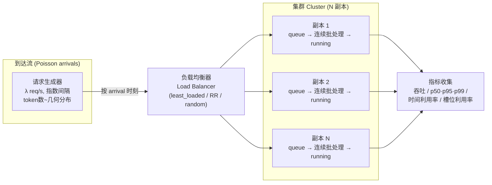
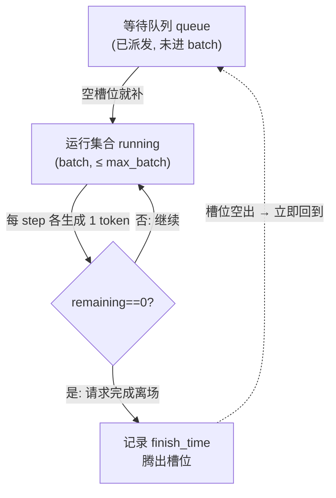
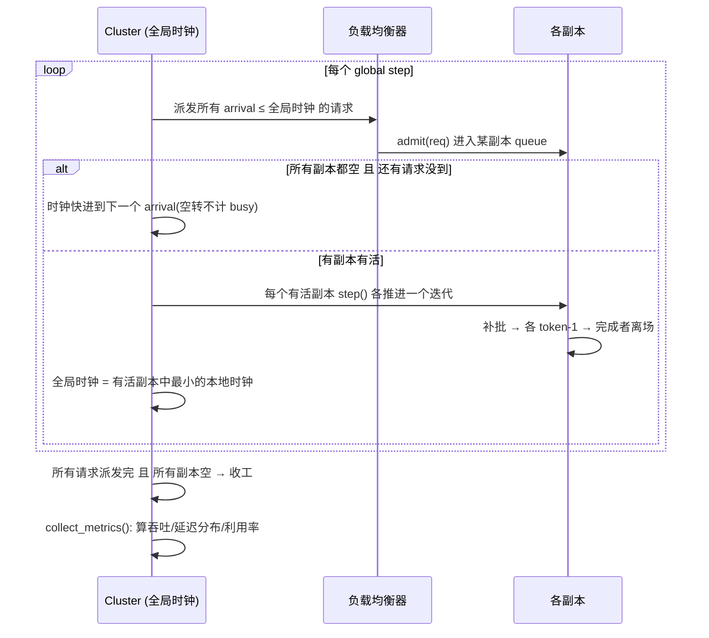
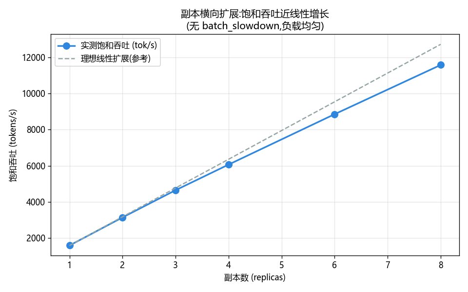
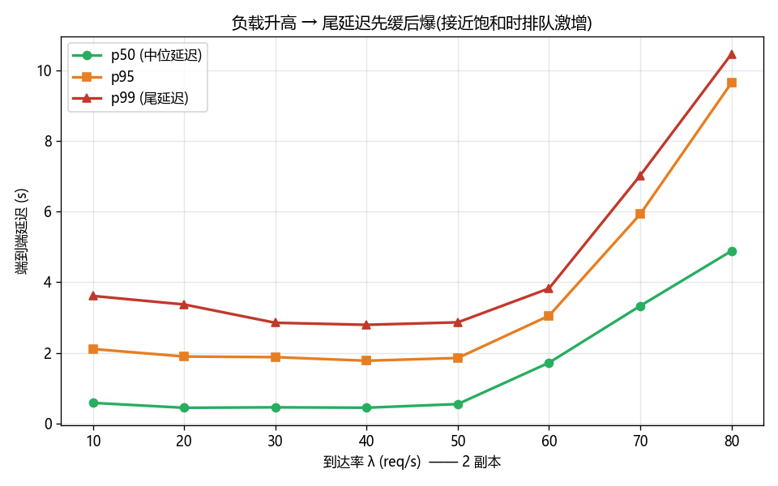
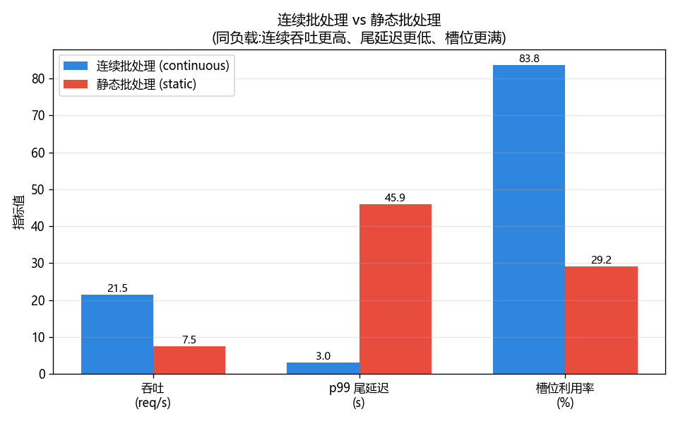
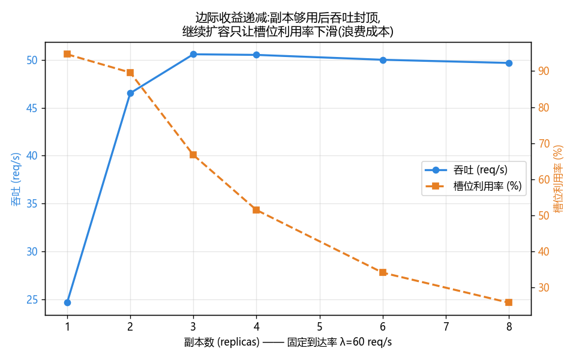

# 🚀 项目 02:分布式推理服务吞吐/延迟仿真(Serving Throughput Simulator)

> 配套《Distributed AI Systems》实战项目 · **本机可跑 / 离线 / 零 GPU / 零联网 / 零 API key**
>
> 用一份纯 Python 的**离散事件仿真**,把"多副本(replica)+ 连续批处理(continuous batching)"的推理服务搬进你的笔记本,亲手测出:**吞吐(throughput)、p50/p95/p99 尾延迟(tail latency)、副本利用率(utilization)、以及扩副本的边际收益(marginal returns)**。

---

## 📖 目录

- [一、这个项目在解决什么问题?](#一这个项目在解决什么问题)
- [二、5 分钟跑起来](#二5-分钟跑起来)
- [三、核心概念:是什么 / 为什么 / 怎么用 / 代价](#三核心概念是什么--为什么--怎么用--代价)
- [四、系统架构(mermaid)](#四系统架构mermaid)
- [五、仿真主循环时序(mermaid)](#五仿真主循环时序mermaid)
- [六、代码逐行讲解](#六代码逐行讲解)
- [七、四组实验与结论(附图)](#七四组实验与结论附图)
- [八、指标定义与数学](#八指标定义与数学)
- [九、测试怎么设计的](#九测试怎么设计的)
- [十、💡 面试高频 & ⚠️ 常见坑 & 🔬 第一性原理](#十-面试高频--常见坑--第一性原理)
- [📌 小结](#-小结)
- [🔗 延伸阅读](#-延伸阅读)

---

## 一、这个项目在解决什么问题?

你是一名 AI/数据工程师,老板问你三个问题:

1. 现在线上 QPS 涨了一倍,**我该加几张卡?加了真能扛住吗?**
2. 用户投诉"偶尔卡一下",**是不是尾延迟(p99)爆了?什么负载下会爆?**
3. 有人说上"连续批处理"能省钱,**到底省多少?**

要回答这些,传统做法是压测——但压测要真卡、真模型、真流量,贵且慢。**本项目用一个可复现的仿真(simulation)先把物理规律摸清**:副本数、到达率、批处理策略这几个旋钮怎么影响吞吐/延迟/利用率。摸清了规律,再去压测验证,事半功倍。

> 🔬 **第一性原理**:推理服务的本质是**一个排队系统(queueing system)**——请求到达 → 排队 → 被一批一批地"喂"给 GPU 前向计算 → 完成离开。吞吐由**服务能力**(副本数 × 每副本每秒能跑多少 token)封顶;延迟由**排队 + 服务**两段构成。负载越接近服务能力,排队越长,尾延迟越"炸"。这套规律和银行柜台、高速收费站是同一个数学(排队论),只是"批处理"这一环让它更有趣。

**为什么不用排队论闭式公式(M/M/c)?** 因为**连续批处理**里,请求在生成过程中动态加入/离开同一个 batch,这种"迭代级(iteration-level)动态拼批"排队论解不出来——只能用仿真逐步推进。这正是本项目的价值。

---

## 二、5 分钟跑起来

```bash
# 目录
cd book-distributed-ai-systems/projects/02_serving_throughput_sim

# (可选)装依赖——核心引擎与测试仅用标准库,出图才需要 matplotlib
pip install -r requirements.txt

# 1) 跑测试:必过(本机实测 28 passed)
python -m pytest -q

# 2) 出图 + 打印指标表(生成 4 张 png)
python run_demo.py

# 3) 直接跑引擎自检
python serving_sim.py
```

`run_demo.py` 会生成 4 张图:

| 文件 | 内容 |
|---|---|
| `scaling_throughput.png` | 副本数 vs 饱和吞吐(近线性 + 边际收益递减) |
| `latency_vs_load.png` | 到达率 vs p50/p95/p99(负载升尾延迟爆炸) |
| `batching_compare.png` | 连续 vs 静态批处理(吞吐/尾延迟/槽位利用率) |
| `utilization_curve.png` | 固定需求下副本数 vs 槽位利用率(过度扩容浪费) |

**终端会打印一张速览表**(节选本机真实输出):

```
[1] 副本横向扩展(饱和,λ=1000):副本数 → 饱和吞吐(tok/s)
   1 副本:     1590 tok/s   (相对单副本 1.00x)
   2 副本:     3144 tok/s   (相对单副本 1.98x)
   4 副本:     6065 tok/s   (相对单副本 3.82x)
   8 副本:    11576 tok/s   (相对单副本 7.28x)

[3] 连续 vs 静态批处理(1 副本, λ=25):
   连续: 吞吐 21.52 req/s  p99  3.023s  槽位利用率 83.8%
   静态: 吞吐  7.50 req/s  p99 45.879s  槽位利用率 29.2%

[4] 边际收益(固定 λ=60):副本数 → 吞吐 / 槽位利用率
   1 副本: 吞吐 24.64 req/s   槽位利用率 94.6%
   2 副本: 吞吐 46.53 req/s   槽位利用率 89.6%
   4 副本: 吞吐 50.53 req/s   槽位利用率 51.5%
   8 副本: 吞吐 49.69 req/s   槽位利用率 25.8%
```

一眼看出结论:**加副本在"容量受限"时几乎线性提吞吐;一旦"需求受限"(副本够用),再加就是浪费**。连续批处理相对静态批处理是碾压级的(吞吐 ~3x、p99 从 46s 砍到 3s)。

---

## 三、核心概念:是什么 / 为什么 / 怎么用 / 代价

### 3.1 副本(Replica)与横向扩展(Horizontal Scaling)

| 维度 | 说明 |
|---|---|
| **是什么** | 一个副本 ≈ 一份完整加载了模型权重的推理实例(通常占 1 张或多张 GPU)。N 个副本 = N 份并行的服务能力。 |
| **为什么** | 单副本吞吐有物理上限;要扛更多流量,最直接的办法是**加副本**(scale out),让负载均衡器把请求摊开。 |
| **怎么用** | 前面挂个负载均衡器(load balancer),按策略(最少负载/轮询/随机)把请求派给某个副本。 |
| **代价** | ① 副本不共享 KV cache,显存翻倍;② 负载不均会导致"有的副本忙死、有的闲死";③ **边际收益递减**:需求封顶后加副本不再提吞吐,只烧钱。 |

### 3.2 连续批处理(Continuous Batching)

| 维度 | 说明 |
|---|---|
| **是什么** | 在**每次前向迭代(iteration)**的粒度上动态拼批:某条请求生成完最后一个 token 就立刻离场,腾出的槽位(slot)马上让排队中的新请求补进来。 |
| **为什么** | 对比**静态批处理**(攒满一批一起跑、跑完一起走):批里请求长短不一,短的先跑完却要**空等**最长的那条(队头阻塞 head-of-line blocking),GPU 槽位大量闲置。连续批处理消除这种等待。 |
| **怎么用** | 调度器维护一个"运行集合(running set)",每个迭代:① 生成完的离场;② 空槽位立即从等待队列补新请求;③ 全体各生成 1 个 token。 |
| **代价** | 实现复杂(要管理动态变化的 batch、KV cache 的分配/回收);对**变长序列**的显存管理是难点(现实中用 PagedAttention 之类解决)。 |

> 💡 **实战**:vLLM / TGI / TensorRT-LLM 的高吞吐,核心武器之一就是连续批处理(又叫 in-flight batching / iteration-level batching)。本项目 `Replica.step()` 用 20 行代码复现了它的骨架。

### 3.3 吞吐 vs 延迟:一对冤家

| 概念 | 定义 | 单位 |
|---|---|---|
| **吞吐 throughput** | 单位时间完成的请求数 / token 数 | req/s、tok/s |
| **延迟 latency** | 单条请求从到达到完成的耗时 | s |
| **p50 / p95 / p99** | 延迟分布的第 50/95/99 百分位,衡量**尾部**体验 | s |

> ⚠️ **坑**:吞吐和延迟经常此消彼长。**攒大 batch → 吞吐高,但请求要等凑批 → 延迟高**。SLA(服务等级协议)通常卡的是 **p99 延迟**,所以不能一味追吞吐。本项目的 `latency_vs_load.png` 就展示了"负载逼近饱和时,吞吐涨得慢、尾延迟却指数式爆炸"的经典权衡。

### 3.4 全部可调旋钮(knobs)一览

`simulate(...)` 顶层入口暴露了全部参数,改一个就是一个实验:

| 参数 | 含义 | 典型值 | 调大的影响 |
|---|---|---|---|
| `n_replicas` | 副本数 | 1~8 | 提升容量上限(容量受限区),需求受限后无用 |
| `rate` | 到达率 λ(req/s) | 5~1000 | 提升负载 → 吞吐先涨后封顶,尾延迟先缓后爆 |
| `duration` | 仿真时长(s) | 8~30 | 更长 → 统计更稳(样本更多) |
| `step_time` | 单次前向迭代耗时(s) | 0.01 | 调大 → 每卡变慢,吞吐等比下降 |
| `max_batch` | batch 容量上限(槽位数) | 8~32 | 调大 → 吞吐上限升,但显存/单步耗时也升 |
| `token_mean` | 每请求生成 token 数均值 | 32~128 | 调大 → 请求更"重",单请求延迟升 |
| `batch_slowdown` | 大 batch 的单步变慢系数 | 0~0.05 | 调大 → 扩展从线性变次线性 |
| `continuous` | 连续/静态批处理 | True | False → 退化成静态,尾延迟爆炸 |
| `policy` | 负载均衡策略 | least_loaded | 换 random → 负载不均、尾延迟略升 |
| `seed` | 随机种子 | 0~ | 换种子 → 换一条随机轨迹(可复现) |

> 💡 **实战玩法**:想复现"张量并行的通信开销让扩展次线性",把 `batch_slowdown` 从 0 调到 0.03,再跑 `scaling_throughput.png`,实测曲线会明显下弯偏离理想线。

### 3.5 一条请求的完整生命周期(walkthrough)

以一条 `arrival=2.0s, total_tokens=3` 的请求为例,`step_time=0.01`:

| 时刻 | 事件 | 状态 |
|---|---|---|
| t=2.0 | 到达,负载均衡器派给"最闲"副本 | 进入该副本 `queue` |
| t=2.0 | 该副本有空槽位 → 补批,记 `start_time=2.0` | 进入 `running`,`remaining=3` |
| t=2.01 | 第 1 个迭代:`remaining` 3→2 | `running` |
| t=2.02 | 第 2 个迭代:`remaining` 2→1 | `running` |
| t=2.03 | 第 3 个迭代:`remaining` 1→0 → 完成,记 `finish_time=2.03` | 离场,腾出槽位 |

于是:`queue_delay = start_time - arrival = 0`(没排队),`latency = finish_time - arrival = 0.03s`。若到达时副本满载,`start_time` 会晚于 `arrival`,`queue_delay > 0`——**排队时延就是尾延迟的主要来源**。

> ⚠️ **坑**:`latency`(端到端)= `queue_delay`(排队)+ `service_time`(生成)。压测时若只看 service_time 会严重低估用户实际体验,一定要测**端到端**。

---

## 四、系统架构(mermaid)



**副本内部**(连续批处理调度器)长这样:



---

## 五、仿真主循环时序(mermaid)

`Cluster.run()` 的全局同步时钟推进逻辑:



---

## 六、代码逐行讲解

三个源文件:`serving_sim.py`(引擎)、`tests/test_serving_sim.py`(测试)、`run_demo.py`(出图)。这里精讲引擎的四个关键片段。

### 6.1 泊松到达流(`poisson_arrivals`,约 L83–L125)

```python
u = 1.0 - rng.random()          # U ∈ (0,1],避免 log(0)
inter = -math.log(u) / rate     # 指数分布间隔:-ln(U)/λ
t += inter                      # 累加得到下一次到达的绝对时刻
if t > duration:
    break
# token 数:几何分布(离散长尾),参数 p = 1/token_mean
p = 1.0 / max(token_mean, 1.0)
u2 = 1.0 - rng.random()
n_tok = int(math.ceil(math.log(u2) / math.log(1.0 - p)))
n_tok = max(token_min, n_tok)   # 至少 1 个 token
```

**逐行**:
- `inter = -ln(U)/λ` 是从均匀随机数生成**指数分布**的标准逆变换法(inverse transform sampling)。指数分布的间隔 ⇒ 到达次数服从**泊松分布**,这就是泊松过程。
- token 数用**几何分布**采样:`ceil(ln U / ln(1-p))`,均值 ≈ `1/p = token_mean`。几何分布是离散、右偏(长尾)的,贴近真实请求"多数短、少数很长"的特征——**长尾正是尾延迟的元凶**。
- `1.0 - rng.random()` 把 `[0,1)` 映射到 `(0,1]`,防止 `log(0)=-inf`。⚠️ 这是数值仿真的经典小坑。

### 6.2 连续批处理的一个迭代(`Replica.step`,约 L204–L250)

```python
if self.continuous:
    self._refill_batch()        # 连续:每个 step 都补满空槽位
else:
    if not self.running:        # 静态:上一批全跑完才收新批
        self._refill_batch()

b = len(self.running)
if b == 0:                      # 没活干:时钟走 step_time,但不计 busy
    self.clock += self.step_time
    self.total_time += self.step_time
    return self.step_time

dt = self.step_time * (1.0 + self.batch_slowdown * (b - 1))  # 大batch略慢
for req in self.running:
    req.remaining -= 1          # batch 内每条各生成 1 个 token
    self.tokens_done += 1
    if req.remaining <= 0:
        req.finish_time = self.clock + dt
        finished.append(req)

self.clock += dt
self.total_time += dt
self.busy_time += dt            # 时间利用率:有 batch 就算忙
self.slot_busy += b * dt        # 槽位利用率:b 个槽位忙了 dt 秒
```

**关键点**:
- **连续 vs 静态的唯一差别就在头 4 行**:连续每步补批,静态必须等 `running` 清空。这一行之差,决定了 GPU 槽位是"常年满载"还是"被最长请求拖着空转"。
- `dt = step_time * (1 + batch_slowdown*(b-1))`:建模"batch 越大,单次前向略慢"。`batch_slowdown=0` 表示理想线性(教学默认);`>0` 时大 batch 有边际成本,能复现真实 GPU 的次线性扩展。
- **两种利用率**:`busy_time` 只看 batch 是否非空(1 条也算满,高负载下恒等于 100%,看不出批处理好坏);`slot_busy = Σ(b·dt)` 才反映 batch **有多满**,是区分连续/静态的关键指标(见 §8.3)。

### 6.3 槽位利用率(`Replica.slot_utilization`,约 L265–L280)

```python
denom = self.max_batch * self.total_time   # 满负荷 = 所有槽位 × 全部时间
return self.slot_busy / denom              # 实际用了多少 槽位·秒
```

> 🔬 **第一性原理**:把 GPU 想成有 `max_batch` 个平行"车道"。`max_batch * total_time` 是所有车道全程满载的理论上限(单位:槽位·秒)。`slot_busy = Σ(b·dt)` 是实际占用。二者相除 = **真实的 batch 填充率**。静态批处理里 `b` 随时间从满衰减到 1(短请求先走),`slot_busy` 小;连续批处理里空位立即补满,`b` 常年接近 `max_batch`,`slot_busy` 大。

### 6.4 百分位(`percentile`,约 L430–L448)

```python
s = sorted(data)
rank = (q / 100.0) * (n - 1)   # 第 q 百分位落在 [0, n-1] 的哪个位置
lo, hi = floor(rank), ceil(rank)
frac = rank - lo
return s[lo]*(1-frac) + s[hi]*frac   # 相邻两点线性插值
```

纯 Python 实现(不强依赖 numpy),用**线性插值法**(numpy 默认的 `linear` 方法)。⚠️ **坑**:百分位有 9 种定义方式,不同库默认不同——报表里写 p99 一定要注明算法,否则对不上数。

---

## 七、四组实验与结论(附图)

### 实验 1:副本翻倍,饱和吞吐近翻倍 ✅



**做法**:用极高到达率(λ=1000)制造**饱和**(容量受限区),此时吞吐由副本数决定而非到达率。
**结论**:1→2→4→8 副本,吞吐 1.00x → 1.98x → 3.82x → 7.28x,**近线性**。曲线在高副本数时略低于理想线——因为固定总负载被摊薄,尾部有副本"吃不饱"。

> 💡 **面试点**:"加卡吞吐会线性涨吗?"——**只在容量受限、且负载能被均匀摊开、无跨副本通信瓶颈时近似成立**。一旦引入张量并行(tensor parallelism)的 all-reduce 通信、或负载不均,就会次线性。

### 实验 2:尾延迟随负载升 ✅



**做法**:固定 2 副本,扫到达率 λ=10→80。
**结论**:λ 从 10 升到 70,p99 从 ~3.6s 跳到 ~7.0s,**接近饱和点后尾延迟急剧恶化**(排队时间主导)。p99 始终 ≥ p95 ≥ p50。

> 🔬 **第一性原理**:排队论里,系统利用率 ρ→1 时,平均排队长度 ∝ 1/(1-ρ) **发散**。所以线上永远不要把副本跑到接近 100% 利用——留 buffer 才能守住 p99 SLA。

### 实验 3:连续批处理碾压静态 ✅



**做法**:同负载(1 副本,λ=25),连续 vs 静态。
**结论**:连续批处理**吞吐 21.5 vs 7.5 req/s(~2.9x)**、**p99 3.0s vs 45.9s(砍掉 93%)**、**槽位利用率 83.8% vs 29.2%**。静态批处理的队头阻塞让短请求陪长请求空等,灾难性。

### 实验 4:扩副本的边际收益递减 ✅



**做法**:固定需求(λ=60),扫副本数 1→8。
**结论**:吞吐在 2~3 副本后**封顶到 ~50 req/s**(被到达率限死),再加副本吞吐不涨;而**槽位利用率从 94.6% 崩到 25.8%**——**过度扩容(over-provisioning)= 烧钱**。

> 💡 **实战决策**:容量规划就是找那个"膝点(knee)":吞吐已满足 SLA、利用率还够高、p99 有安全余量。本项目让你用仿真把膝点找出来,再去下预算。

---

## 八、指标定义与数学

### 8.1 吞吐(throughput)

$$
\text{throughput}_{\text{req}} = \frac{N_{\text{done}}}{\text{makespan}}, \qquad
\text{throughput}_{\text{tok}} = \frac{\sum_i \text{tokens}_i}{\text{makespan}}
$$

其中 `makespan = 最后完成时刻 − 第一个到达时刻`,是端到端的总跨度。

### 8.2 延迟与百分位

单请求延迟 $L_i = \text{finish}_i - \text{arrival}_i$。第 $q$ 百分位:

$$
P_q = s_{\lfloor r\rfloor}(1-f) + s_{\lceil r\rceil}\,f,\quad r = \frac{q}{100}(n-1),\ f = r-\lfloor r\rfloor
$$

($s$ 为升序排序后的延迟序列)。

### 8.3 两种利用率

$$
\underbrace{U_{\text{time}} = \frac{\text{busy\_time}}{\text{total\_time}}}_{\text{batch 是否非空}}
\qquad
\underbrace{U_{\text{slot}} = \frac{\sum_k b_k \, dt_k}{\text{max\_batch}\cdot \text{total\_time}}}_{\text{batch 有多满(关键)}}
$$

- $U_{\text{time}}$:高负载下恒为 1(总有 backlog),**看不出批处理效率**。
- $U_{\text{slot}}$:反映 batch 填充率,**才能区分连续/静态**,也是容量是否浪费的信号。

### 8.4 排队论直觉(为什么尾延迟会炸)

把单副本近似成 M/M/1,利用率 $\rho = \lambda/\mu$($\mu$=服务率)。平均逗留时间:

$$
\mathbb{E}[T] = \frac{1}{\mu - \lambda} = \frac{1/\mu}{1-\rho}
$$

$\rho \to 1$ 时 $\mathbb{E}[T]\to\infty$——这就是实验 2 里 p99 爆炸的数学根源。多副本(M/M/c)把这个"墙"往后推,但墙依然存在。

---

## 九、测试怎么设计的

`tests/test_serving_sim.py`,**本机实测 `28 passed`**。覆盖五条硬性断言 + 工具/边界:

| 组 | 断言 | 关键测试 |
|---|---|---|
| **D** | 所有请求都完成(不丢) | `test_all_requests_complete`(参数化 3 组负载)、`test_no_request_left_behind_high_load` |
| **E** | 副本翻倍 → 饱和吞吐近翻倍 | `test_replica_doubling_doubles_saturated_throughput`(比值 ∈ [1.8, 2.2]) |
| **F** | 连续批处理提槽位利用率 | `test_continuous_batching_improves_slot_utilization`(绝对差 > 0.2) |
| **G** | 尾延迟随负载升 | `test_tail_latency_rises_with_load`、`test_p99_ge_p95_ge_p50` |
| **H** | 扩副本边际收益递减 | `test_diminishing_returns_of_adding_replicas`(1→2 增量 > 4→8 增量) |
| A/B/C/I/J | 百分位/泊松流/数据结构/负载均衡策略/边界 | `test_percentile_*`、`test_poisson_*`、`test_zero_traffic_is_safe` 等 |

**设计原则**:
- 断言用**方向性/区间**(如"比值在 [1.8,2.2]"、"1→2 增量 > 4→8 增量"),而不是钉死某个浮点数——仿真有随机性,钉死会 flaky。
- 全部 `seed` 固定 → **可复现**。
- "副本翻倍近翻倍"必须在**饱和区**测(极高 λ),否则吞吐被到达率限死、根本不会翻倍——这是最容易写错的测试。⚠️

```bash
python -m pytest -q
# ............................                    [100%]
# 28 passed in 0.42s
```

---

## 十、💡 面试高频 & ⚠️ 常见坑 & 🔬 第一性原理

### 💡 面试高频

1. **"连续批处理 vs 静态批处理区别?"** → 静态:攒批→整批跑完→整批放人,短请求被长请求阻塞(队头阻塞),GPU 空转。连续:迭代级动态拼批,完成即离场、空位即补,槽位常年满。本项目实测吞吐差 ~3x、p99 差 ~15x。
2. **"加副本吞吐一定线性涨吗?"** → 只在容量受限 + 负载均匀 + 无跨副本通信瓶颈时近似线性。需求受限后是"零边际收益",过度扩容纯浪费。
3. **"为什么卡 p99 而不是平均延迟?"** → 平均会被大量快请求"稀释",掩盖尾部惨状。用户体验由最差的那部分决定,SLA 卡 p99/p999。
4. **"负载升高时吞吐和延迟怎么变?"** → 吞吐趋近服务能力上限(涨得越来越慢);延迟(尤其尾延迟)在 ρ→1 时按 1/(1-ρ) 发散。
5. **"prefill 和 decode 有什么不同?"(延伸)** → prefill 是并行处理整个 prompt(计算密集、吃算力),decode 是逐 token 自回归(访存密集、吃带宽)。本项目简化为纯 decode;真实系统还要做 prefill/decode 分离调度(如 chunked prefill、disaggregation)。

### ⚠️ 常见坑

1. **"翻倍吞吐"在非饱和区测**:低负载下吞吐 = 到达率,加副本根本不涨。必须制造饱和。
2. **利用率恒 100% 的假象**:只按"batch 非空"算利用率,高负载永远 100%,看不出批处理好坏。要用**槽位利用率**。
3. **`log(0)` 崩溃**:泊松/几何采样时,均匀随机数要落在 `(0,1]`,不能取到 0。
4. **matplotlib 中文乱码 / 负号变方块**:必须
   ```python
   matplotlib.use("Agg")
   plt.rcParams["font.sans-serif"] = ["Microsoft YaHei", "SimHei"]
   plt.rcParams["axes.unicode_minus"] = False
   ```
   `use("Agg")` 要在 `import pyplot` **之前**;`unicode_minus=False` 专治负号显示成"□"。
5. **百分位算法不统一**:9 种定义,库默认各异,报表务必注明。
6. **仿真测试钉死浮点数 → flaky**:用区间/方向性断言 + 固定 seed。

### 🔬 第一性原理

- **推理服务 = 带批处理的排队系统**。吞吐由服务能力封顶,延迟 = 排队 + 服务,ρ→1 时排队发散。
- **批处理的本质是"分摊固定成本"**:一次前向的权重读取、kernel 启动等固定开销被 batch 内多条请求分摊,所以 batch 越大每 token 越便宜——但延迟和显存是代价。
- **连续批处理的本质是"消灭空等"**:把静态批里"短请求陪长请求空转"的 GPU 周期抢救回来,直接转化成吞吐。
- **横向扩展的边际收益**由**瓶颈资源**决定:容量瓶颈时加副本线性提吞吐;需求瓶颈时加副本零收益。找膝点是容量规划的核心。

---

## 十一、动手:设计你自己的实验

引擎参数化得很干净,几行就能问一个新问题。几个练手题:

**Q1:`max_batch` 从 8 加到 32,饱和吞吐涨多少?什么时候到头?**

```python
import serving_sim as ss
for mb in (4, 8, 16, 32, 64):
    m = ss.simulate(n_replicas=1, rate=2000.0, duration=8.0, max_batch=mb, seed=1)
    print(mb, round(m["throughput_tok"]))
```
预期:吞吐随 `max_batch` 上升,但边际递减(受 `rate` 供给和 `token_mean` 影响);现实中还会撞 KV cache 显存墙。

**Q2:加了 `batch_slowdown` 后,扩副本还线性吗?**

```python
for nr in (1, 2, 4):
    m = ss.simulate(n_replicas=nr, rate=1000.0, duration=8.0,
                    batch_slowdown=0.03, seed=1)
    print(nr, round(m["throughput_tok"]))
```
预期:单副本因大 batch 变慢,整体扩展依然近线性(副本间独立),但**单副本内**的 batch 扩展是次线性的——这对应真实 GPU。

**Q3:负载均衡策略对尾延迟影响多大?**

```python
for pol in ("least_loaded", "round_robin", "random"):
    m = ss.simulate(n_replicas=4, rate=150.0, duration=15.0, policy=pol, seed=8)
    print(pol, round(m["p99"], 3))
```
预期:`least_loaded`(近似 JSQ,join-shortest-queue)通常给出最低 p99;`random` 因偶发堆积略差。

**Q4:找到你的 SLA 膝点。** 给定"p99 ≤ 2s"的 SLA,固定 `rate`,二分搜索满足 SLA 的**最小副本数**——这就是容量规划的核心动作。

---

## 十二、常见报错排查(troubleshooting)

| 现象 | 原因 | 解决 |
|---|---|---|
| 终端中文显示成乱码 | Windows 控制台默认 GBK 编码,与源文件 UTF-8 不符 | **不影响正确性**(数值正确);想看清可 `chcp 65001` 切 UTF-8 |
| 图里中文变方块"□" | 没设中文字体 | 确认 `rcParams["font.sans-serif"]=["Microsoft YaHei","SimHei"]` |
| 图里负号变方块 | matplotlib 默认用特殊 minus | 设 `rcParams["axes.unicode_minus"]=False` |
| `RuntimeError: 超出最大步数` | `rate` 极高 + `duration` 极长导致请求海量 | 调小 `duration` 或 `rate`;安全阀是防死循环的兜底 |
| 测试偶发失败 | 改了断言阈值或 seed | 用区间断言,别钉死浮点;保持 seed 固定 |
| `ModuleNotFoundError: matplotlib` | 只跑测试没装出图依赖 | 测试不需要 matplotlib;出图前 `pip install -r requirements.txt` |

---

## 📌 小结

- 用**纯 Python 离散事件仿真**(无 GPU、无模型、离线)复现了分布式推理服务的核心规律。
- 核心引擎 `serving_sim.py`:泊松到达流 + N 副本 + 连续/静态批处理 + 3 种负载均衡 + 完整指标(吞吐/p50·p95·p99/两种利用率)。
- **四条实测结论**:① 副本翻倍→饱和吞吐近翻倍(1.98x);② 尾延迟随负载升(p99 3.6s→7s);③ 连续批处理碾压静态(吞吐 3x、p99 砍 93%、槽位利用率 84% vs 29%);④ 扩副本边际收益递减(需求封顶后利用率崩塌)。
- **测试 `28 passed`**,`run_demo.py` 出 4 张中文标注图。所有断言用区间/方向性 + 固定 seed,可复现不 flaky。
- 这套仿真是**容量规划的推演沙盘**:先在仿真里找到"吞吐达标、利用率够高、p99 有余量"的膝点,再拿去指导真实压测与选型。

## 🔗 延伸阅读

- **Orca**(OSDI'22):Iteration-level scheduling,连续批处理的开山论文。
- **vLLM / PagedAttention**(SOSP'23):把 KV cache 当虚拟内存分页管理,让连续批处理在变长序列下不爆显存。
- **TGI / TensorRT-LLM**:工业级 in-flight batching 实现。
- **DistServe / Splitwise**:prefill/decode 分离(disaggregation),把两种负载放到不同硬件池。
- **排队论**:Kleinrock《Queueing Systems》;Little's Law(L = λW)是所有容量估算的基石。
- 姊妹项目:本仓 `projects/01_*`(如有)——数据/训练侧;本项目专注**推理服务侧**。

---

> 运行环境:Windows 11 · Python 3.13 · numpy 2.3 · matplotlib 3.10 · 无 GPU · 完全离线。
> 本项目所有文件均在 `02_serving_throughput_sim/` 目录内,不写外部。
