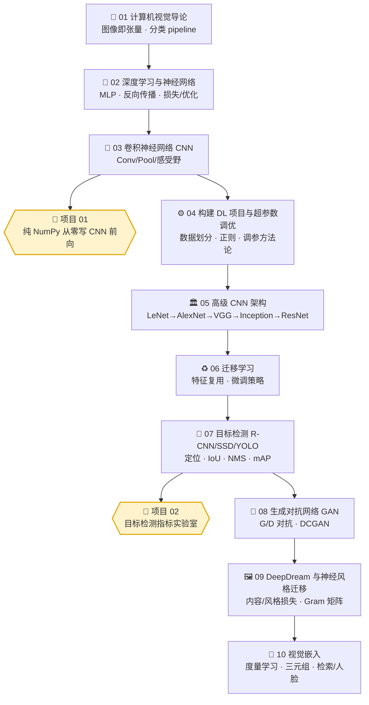

# 👁️ Deep Learning for Vision Systems · 中文逐章精讲 + 实战合集

> 本仓库是 **《Deep Learning for Vision Systems》**（作者 **Mohamed Elgendy**，Manning 出版）的**中文逐章精讲**与**动手实战合集**。
>
> 它不是「翻译」，而是一份**面向理解与面试**的重写：每一章都用**第一性原理**把「为什么这样设计」讲透，配 **mermaid 图**、**可笔算的小例子**、**面试高频题**与**常见坑合集**；两个配套项目全部**纯 NumPy / 离线 / 纯 CPU** 可跑，帮你把「看懂」变成「写得出、讲得清」。

- 🧠 **讲义**（`book-guide/`）：10 章，从计算机视觉导论一路到视觉嵌入（embeddings）。
- 🛠️ **项目**（`projects/`）：2 个动手实验室，各含 `pytest` 测试 + `run_demo.py` 出图脚本。
- 📴 **零门槛跑通**：不联网、不下模型、不需要 GPU、不需要任何 API key；`numpy + matplotlib + pytest`（项目 01 的测试用 CPU 版 `torch` 做数值对拍）即可。

---

## 🗺️ 学习路径（建议顺序）



> 💡 **怎么用这条线**：
> - **打基础** → 01 → 02 → 03，然后立刻做 **项目 01**，把卷积「亲手写一遍」；
> - **进阶架构** → 04 → 05 → 06，理解现代网络怎么堆、怎么复用；
> - **落地检测** → 07，然后做 **项目 02**，把 IoU / NMS / mAP 彻底算明白；
> - **玩生成/进阶** → 08 → 09 → 10，从判别式走向生成式与表示学习。

---

## 📚 逐章讲义（`book-guide/`）

| 章 | 讲义（点击进入） | 一句话简介 |
|:--:|:--|:--|
| 01 | [`book-guide/01_计算机视觉导论.md`](book-guide/01_计算机视觉导论.md) | 图像如何变成张量、什么是分类 pipeline、CV 任务全景，建立「机器怎么看」的直觉。 |
| 02 | [`book-guide/02_深度学习与神经网络.md`](book-guide/02_深度学习与神经网络.md) | 从感知机到 MLP，前向/反向传播、损失函数与梯度下降，把神经网络的「学习」讲透。 |
| 03 | [`book-guide/03_卷积神经网络CNN.md`](book-guide/03_卷积神经网络CNN.md) | 卷积/池化在算什么、输出尺寸公式、感受野、参数共享——CNN 的第一性原理。 |
| 04 | [`book-guide/04_构建DL项目与超参数调优.md`](book-guide/04_构建DL项目与超参数调优.md) | 训练/验证/测试划分、过拟合与正则（Dropout/BN/数据增强）、学习率与调参方法论。 |
| 05 | [`book-guide/05_高级CNN架构.md`](book-guide/05_高级CNN架构.md) | LeNet→AlexNet→VGG→Inception→ResNet 一脉相承的设计动机与「为什么更深更好」。 |
| 06 | [`book-guide/06_迁移学习.md`](book-guide/06_迁移学习.md) | 为什么预训练特征可复用、特征提取 vs 微调、冻结哪些层、小数据集怎么办。 |
| 07 | [`book-guide/07_目标检测_RCNN_SSD_YOLO.md`](book-guide/07_目标检测_RCNN_SSD_YOLO.md) | 定位+分类、两阶段 R-CNN 系与单阶段 SSD/YOLO 的取舍，IoU/NMS/mAP 评价体系。 |
| 08 | [`book-guide/08_生成对抗网络GAN.md`](book-guide/08_生成对抗网络GAN.md) | 生成器 vs 判别器的极大极小博弈、DCGAN、训练不稳定的原因与技巧。 |
| 09 | [`book-guide/09_DeepDream与神经风格迁移.md`](book-guide/09_DeepDream与神经风格迁移.md) | 用梯度「反向作画」：DeepDream 放大特征、风格迁移的内容损失/风格损失与 Gram 矩阵。 |
| 10 | [`book-guide/10_视觉嵌入.md`](book-guide/10_视觉嵌入.md) | 把图片映射到向量空间：度量学习、三元组损失、相似度检索与人脸识别应用。 |

> 每篇讲义结构统一：**是什么 → 为什么 → 第一性原理推导 → 图/例子 → 面试高频题 → 常见坑 → 小结与延伸**。

### 🔎 各章你将「真正学会」什么

- **01 导论**：图像 = `H×W×C` 张量、像素/通道/归一化、监督分类的整条流水线，理解「机器看到的只是数字矩阵」。
- **02 神经网络**：一步步推 `∂L/∂w`，看清链式法则如何把误差从输出层「反传」回每个权重；sigmoid/ReLU/softmax + 交叉熵为什么这么配。
- **03 CNN**：卷积是「局部加权求和 + 参数共享」，`out = ⌊(n + 2p − f) / s⌋ + 1` 怎么来的、感受野如何逐层放大、为什么 CNN 比全连接省参数又抓得住空间结构。
- **04 工程与调参**：偏差/方差诊断、Dropout / BatchNorm / 数据增强各治什么病、学习率与优化器（SGD/Momentum/Adam）的取舍，一套可复用的「训练不动了怎么办」排查表。
- **05 高级架构**：每个里程碑网络「解决了上一代的什么痛点」——AlexNet 的 ReLU/Dropout、VGG 的小核堆叠、Inception 的多尺度、ResNet 的残差与恒等映射。
- **06 迁移学习**：为什么底层特征通用、何时只做特征提取、何时解冻微调、学习率该调多小，小数据集的救命稻草。
- **07 目标检测**：定位+分类的联合任务，两阶段（R-CNN/Fast/Faster）与单阶段（SSD/YOLO）的速度-精度权衡，锚框、IoU、NMS 与 mAP 的完整评价链。
- **08 GAN**：生成器与判别器的极大极小博弈、DCGAN 的架构守则、模式崩塌与训练不稳的直觉解释。
- **09 DeepDream / 风格迁移**：把「训练权重」反过来变成「训练像素」，内容损失 vs 风格损失、Gram 矩阵为什么能表征风格。
- **10 视觉嵌入**：把图片压成向量、用距离衡量相似、三元组损失怎么拉近正样本推远负样本，落到检索与人脸识别。

---

## 🛠️ 动手项目（`projects/`）

| 项目 | 目录 | 一句话简介 | 覆盖章节 |
|:--:|:--|:--|:--:|
| 01 | [`projects/01_cnn_from_scratch`](projects/01_cnn_from_scratch) | **纯 NumPy 从零实现 CNN 前向传播**：`conv2d`（含 stride/padding）、`max_pool2d`、`relu`、`flatten`、`linear`、感受野计算，串成玩具网络 `TinyCNN`，并用 `torch.nn.functional` 做**数值对拍**证明写对了。跑 `run_demo.py` 会把卷积「看见」（Sobel/拉普拉斯/模糊核 + 各层特征图 + 感受野增长图）。 | 03~05 |
| 02 | [`projects/02_detection_metrics_lab`](projects/02_detection_metrics_lab) | **目标检测指标实验室**：纯 NumPy 从零实现 **IoU → NMS → TP/FP 匹配 → PR 曲线 → AP → mAP** 全套评价与后处理。`run_demo.py` 出三张图：NMS 前后对比、PR 曲线、多类 AP/mAP 柱状图。彻底搞懂 COCO mAP 到底怎么算。 | 07 |

### ▶️ 如何跑（两个项目通用）

```bash
# 进入某个项目目录（以项目 01 为例）
cd projects/01_cnn_from_scratch

# 1) 安装依赖（本机若已装可跳过；全部纯 CPU、可离线）
pip install -r requirements.txt

# 2) 跑测试（验证实现正确 / 数值对拍）
pytest -q

# 3) 跑演示，生成可视化 PNG
python run_demo.py
```

- **项目 01** 产出：`feature_maps.png`（经典核特征图）、`tinycnn_maps.png`（`TinyCNN` 各层特征图 + 感受野增长）。
- **项目 02** 产出（在 `outputs/` 下）：`nms_before_after.png`、`pr_curve.png`、`map_bars.png`。
- 两个项目均**离线、纯 CPU、几秒钟跑完**；项目 01 的测试会用到 CPU 版 `torch` 做对拍，核心实现本身不依赖框架。

> 每个项目目录内都有一份**独立的详细 README**（含逐行代码讲解、面试题与踩坑），本页只做总览。

---

## 🎯 面试 / 实战怎么用

**给准备视觉方向面试的人：**

1. **先讲义、后手写**：读完 03 章立刻做项目 01——面试官问「卷积输出尺寸公式怎么来的？感受野怎么算？两个 3×3 为什么能顶一个 5×5？」时，你是**写过一遍**的人，答案脱口而出。
2. **检测题必刷项目 02**：`IoU / NMS / AP / mAP` 是目标检测面试的**必考区**。很多人「听过」但说不清 mAP 的插值口径、NMS 的贪心过程——本项目让你能**从零把它算出来**。
3. **架构演进讲故事**：05 章按 LeNet→AlexNet→VGG→Inception→ResNet 的**动机链**记忆，比死背参数更抗问；被追问「为什么加残差连接」时能讲清梯度消失与恒等映射。
4. **每章末尾的「面试高频题 + 常见坑」**：可当**速记卡**，面试前一晚快速过一遍。

**给做工程 / 想动手的人：**

- 两个项目都是**最小可复现内核**，适合当「读框架源码前的地基」：先自己写一遍 `conv2d` / `nms`，再去看 PyTorch / torchvision 里对应实现，事半功倍。
- `run_demo.py` 的可视化可直接**贴进你的学习笔记 / 博客 / 分享 slides**，把抽象概念讲给别人听。
- 想扩展？项目 01 可加反向传播做成可训练版；项目 02 可接入真实数据集验证你自己检测器的 mAP。

---

## 🗂️ 仓库结构

```text
book-dl-for-vision/
├── README.md                        # 本文件：总览 · 学习路径 · 索引
├── book-guide/                      # 📚 10 章中文逐章精讲
│   ├── 01_计算机视觉导论.md
│   ├── 02_深度学习与神经网络.md
│   ├── 03_卷积神经网络CNN.md
│   ├── 04_构建DL项目与超参数调优.md
│   ├── 05_高级CNN架构.md
│   ├── 06_迁移学习.md
│   ├── 07_目标检测_RCNN_SSD_YOLO.md
│   ├── 08_生成对抗网络GAN.md
│   ├── 09_DeepDream与神经风格迁移.md
│   └── 10_视觉嵌入.md
└── projects/                        # 🛠️ 2 个动手实验室
    ├── 01_cnn_from_scratch/         # 纯 NumPy 写 CNN 前向 + torch 对拍
    │   ├── cnn_numpy.py             #   核心算子实现
    │   ├── run_demo.py              #   出图演示
    │   ├── tests/test_cnn.py        #   pytest 测试
    │   ├── requirements.txt
    │   └── README.md                #   项目详解
    └── 02_detection_metrics_lab/    # IoU/NMS/AP/mAP 从零实现
        ├── detection_metrics.py     #   核心指标实现
        ├── run_demo.py              #   出图演示（→ outputs/）
        ├── tests/test_detection_metrics.py
        ├── requirements.txt
        └── README.md                #   项目详解
```

---

## 📦 环境与约定

- **依赖极简**：`numpy` + `matplotlib` + `pytest`（项目 01 测试另需 CPU 版 `torch`）。
- **完全离线**：不联网、不下数据集、不下预训练模型、不需要 GPU、不需要 API key。
- **可复现**：所有 demo 用**合成数据 / 手工样例**，任何机器上结果一致，方便对照笔算。

---

## 🔗 延伸

- 原书：**《Deep Learning for Vision Systems》**, Mohamed Elgendy, Manning。
- 建议配合本仓库同级的其他 AI-Infra / 深度学习教程一起食用，形成「**理论讲义 → 手写内核 → 工程实践**」的闭环。

> 🚀 **开始吧**：从 [`book-guide/01_计算机视觉导论.md`](book-guide/01_计算机视觉导论.md) 读起，读到第 3 章就打开 [`projects/01_cnn_from_scratch`](projects/01_cnn_from_scratch) 亲手写第一个卷积。
