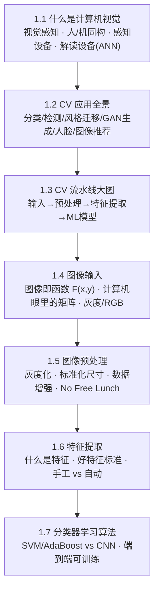
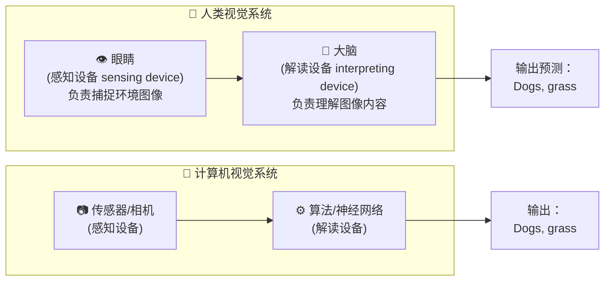
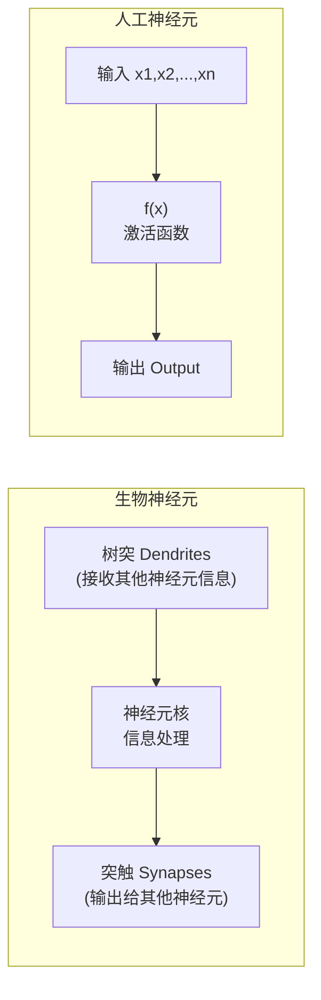
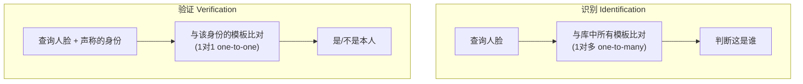
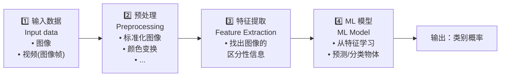
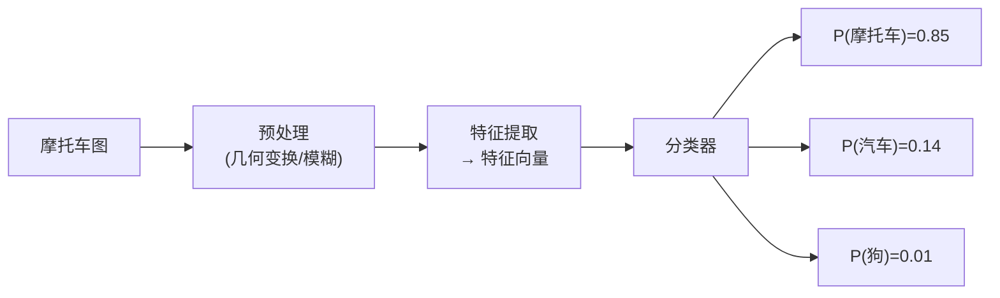
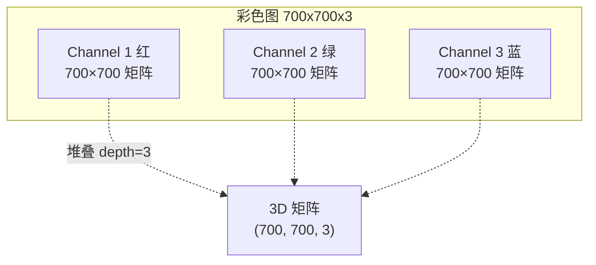
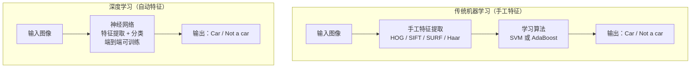
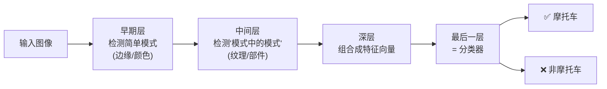

# 🖼️ 第 1 章 计算机视觉导论（Welcome to Computer Vision）

> 逐章精讲 ·《Deep Learning for Vision Systems》(Mohamed Elgendy)
> 对应原书 Chapter 1 / PDF 第 24–56 页（书内页码 3–35）

---

## 🗺️ 本章地图

这一章是整本书的"总纲"。作者不急着讲卷积、反向传播，而是先回答一个更根本的问题：**一个"能看"的系统到底由什么组成，它是怎么把一张图变成一个判断的？** 全章围绕两条主线展开：

1. **视觉系统的两大部件**——感知设备（sensing device，眼睛/相机）+ 解读设备（interpreting device，大脑/算法）。人和机器在最高层次上是同构的。
2. **计算机视觉流水线（CV pipeline）**——解读设备内部的 4 个步骤：`输入数据 → 预处理 → 特征提取 → ML 模型`，这条流水线是后面所有章节的骨架。

本章地图（先建立全局，再逐块深入）：



一句话概括本章的世界观：**深度学习之所以在视觉上封神，本质是把流水线里最难的"特征提取"从人类手工，交给了神经网络自动学习，并且和分类器焊成了一个"端到端可训练"的整体。** 记住这句话，本章你就抓住了 80%。

---

## 🔬 核心论证：为什么"视觉"值得单独成书

作者开篇给了一个哲学定位，值得逐字咀嚼（原文 1.1 节）：

> *"The core concept of any AI system is that it can perceive its environment and take actions based on its perceptions. Computer vision is concerned with the visual perception part."*
> （任何 AI 系统的核心概念，都是"感知环境 → 基于感知采取行动"。计算机视觉专注于其中的**视觉感知**部分。）

拆开看这句话，它其实定义了 AI 的一个通用循环：**感知（perceive）→ 建模（construct a physical model of the world）→ 行动（take actions）**。视觉只是"感知"的一种模态（modality）——人还有听觉、嗅觉、触觉，AI 也可以用雷达、激光、X 光。所以 CV 不是孤岛，它是"多模态感知"里最信息密集的那一路。

> 🔬 **第一性原理：感知 ≠ 处理**
> 作者反复强调一个容易被忽视的区别（原文 1.1.2）：
> *"A machine processing an image is completely different from that machine understanding what's happening within the image."*
> **图像处理（image processing）只是把像素做数学变换；而计算机视觉（computer vision）要"理解"图像内容。** 过去几十年，人们把传统图像处理当成 CV，这不准确——图像处理只是那个更大、更复杂的"理解系统"里的一块拼图（just a piece of a bigger system）。这个区分是本书立论的地基：**本书讲的是"理解"，不是"处理"。**

---

## 👁️ 1.1 什么是计算机视觉：人与机器的同构

### 1.1.1 视觉感知（visual perception）

**是什么**：视觉感知，最朴素地讲，就是"通过视觉输入去观察模式和物体"（observing patterns and objects through sight or visual input）。

**为什么用"perception（感知）"而不是"capture（捕捉）"这个词**：作者用自动驾驶举例——我们要的不只是"拍到"周围环境，而是要**理解**：这是行人、那是车道线、前面那个是限速标志且含义是"限速 60"。关键词 perception 强调的是**理解**，不是记录。

### 1.1.2 视觉系统的两大部件

> 🔬 **本章最重要的一张结构图（人机同构）**

无论人、动物、昆虫，视觉系统在最高层次上都是同一个结构：



对照原书 Figure 1.1 / 1.2：**感知设备（眼睛 ↔ 相机）+ 解读设备（大脑 ↔ 算法）**，两个部件缺一不可。这个二分法是整章的锚点——后面 1.3 节的"流水线"就是把放大镜对准第二个部件（解读设备）内部。

### 从"训狗认脸"看机器学习的本质

作者用一个非常生活化的比喻讲清了监督学习（这是全书唯一一次用"人脑训练"来类比 ML，务必吃透）：

> 有人第一次给你看一张狗的图，你不认识 → 他告诉你"这是狗" → 几次之后你学会认狗。接着给你看马，你的大脑分析特征"四条腿、长脸、长耳朵……是狗吗？" → 被告知"错，这是马" → **你的大脑调整了算法里的一些参数**，学会了狗和马的区别。

把它翻译成 ML 术语（原文 "The ML perspective"）：

| 生活场景 | 机器学习术语 | 含义 |
|---|---|---|
| 看很多"被标注为狗"的图学会认狗 | **监督学习 supervised learning** | 用带标签的数据训练 |
| 图片旁边写着"这是狗" | **标注数据 labeled data** | 已知目标答案的数据 |
| 预测错了被纠正，大脑调参数 | **试错训练 training by trial and error** | 靠反馈反复修正参数（即后面章节的梯度下降） |

> 💡 **实战/面试高频**：面试常问"监督/无监督/强化学习的区别"。这里的比喻给了标准答案的直觉：**监督学习 = 有人手把手告诉你每张图的正确标签，你据此调参**。"大脑调整参数（adjust parameters）"这个动作，正是后面章节要讲的**权重更新（weight update）**。

> ⚠️ **常见坑：人比机器"样本高效"得多**
> 原文点出一个反差：人看几张图就能学会认一个物体，机器却要**成千上万甚至上百万**张样本。这不是机器笨，而是人脑携带了亿万年进化 + 一生经验的"预训练"。理解这一点，你才会明白后面为什么"迁移学习（transfer learning）""数据增强（data augmentation）"这么重要——它们都是在缓解机器"样本饥渴"的问题。

### 1.1.3 感知设备：任务决定传感器

**核心观点**：视觉系统是为**特定任务**设计的，设计的第一步就是"选对感知设备"（identify the task they are built for）。不同任务用不同传感器：

| 应用场景 | 感知设备 | 能力 / 局限 |
|---|---|---|
| 自动驾驶 | **Lidar 激光雷达** | 用不可见光脉冲生成高分辨率 3D 地图 |
| 自动驾驶 | **相机 Camera** | 能看街道标志、路面标线；**但测不了距离** |
| 自动驾驶 | **雷达 Radar** | 能测距离和速度；**但看不清细节** |
| 医学诊断 | **X 光 / CT 扫描** | 捕捉体内结构 |
| 农业 | 特种雷达 | 捕捉地貌 |

> 🔬 **第一性原理：为什么自动驾驶要"多传感器融合（sensor fusion）"？**
> 看上表：相机看得清但不会测距，雷达会测距但看不清，Lidar 能建 3D 图。**没有任何单一传感器能覆盖所有需求**，所以自动驾驶要把它们组合起来（combination of cameras and sensors），做 360° 覆盖、探测三个足球场外的物体。这就是"传感器融合"的第一性动机——用互补弥补各自的物理短板。

**"识别图像"的生物学彩蛋**：蜜蜂的复眼由多达 3 万个镜片组成，分辨率极低（认不清远处物体），但对运动极其敏感。因为蜜蜂高速飞行时不需要高清照片，它需要的是"捕捉最微小的移动"。**启示：传感器的设计永远服从于任务需求，没有"最好的眼睛"，只有"最合适的眼睛"。**

### 1.1.4 解读设备：从生物神经元到人工神经网络

解读设备就是视觉系统的"大脑"。科学家逆向工程中枢神经系统，造出了**人工神经网络（Artificial Neural Networks, ANN）**。



对照原书 Figure 1.3：生物神经元和人工神经元结构同构——都有**输入信号（x1…xn）→ 主处理单元 → 一个输出**。作者给出机制直觉：

> *"each artificial neuron fires a signal to all the neurons that it's connected to when enough of its input signals are activated."*
> （每个人工神经元，当它足够多的输入信号被激活时，就向所有相连的神经元"发放"一个信号。）

**关键升华（deep learning 的定义在此首次出现）**：

> *"when you have millions of these neurons stacked in layers and connected together … yielding a learning behavior. Building a multilayer neural network is called **deep learning**."*
> 单个神经元机制极其简单；但当你把**几百万个神经元堆叠成层（stacked in layers）**、层层相连，就涌现出"学习行为"。**构建多层神经网络，就叫深度学习。**

> 🔬 **第一性原理：深度学习 = 逐层的表示变换**
> 原文一句话点破本质：*"DL methods learn representations through a sequence of transformations of data through layers of neurons."* —— **深度学习通过"逐层的数据变换序列"来学习表示（representation）。** 输入的原始像素在第 1 层变成边缘，第 2 层变成纹理，第 3 层变成部件……越深的层，学到的特征越抽象。这就是"深"的价值，也是 1.7 节和后续章节反复出现的主题。

> 💡 **面试高频：机器能超过人脑吗？**
> 原文给了两个有说服力的场景：① 给你一本一万张、按品种分类的狗图，让你学 130 个品种，你要花多久、100 张测试能对几张？**一个训练几小时的神经网络就能拿到 95%+ 准确率。** ② 神经网络能学一幅画的笔触/配色/明暗，几秒钟把风格迁移到新图。结论：在**图像分类和目标检测**的很多任务上，AI 已达到甚至超越人类水平（superhuman）。面试时可补一句：这是"窄任务超人（narrow superhuman）"，不等于通用智能。

---

## 🎨 1.2 计算机视觉应用全景

这一节是"鸟瞰"（bird's-eye view），把最流行的 DL 视觉应用过一遍。用一张表把它们和背后的算法、任务类型对齐：

| 应用 | 任务类型 | 代表算法 | 一句话本质 |
|---|---|---|---|
| **图像分类** Image Classification | 单物体 → 一个标签 | CNN | 从预定义类别里给整张图贴一个标签 |
| **目标检测与定位** Object Detection | 多物体 → 多标签+位置 | YOLO / SSD / Faster R-CNN | 不仅分类，还画框定位每个物体 |
| **风格迁移** Style Transfer | 生成 | 神经风格迁移 | 把 A 图的艺术风格套到 B 图内容上 |
| **图像生成** Creating Images | 生成 | **GAN**（2014, Goodfellow）| 无中生有造出从未存在的真实图像 |
| **人脸识别** Face Recognition | 细粒度分类 | FR 系统 | 精确识别/标注某个人 |
| **图像推荐** Image Recommendation | 检索 | 相似度匹配 | 给一张图，找出最相似的图 |

### 1.2.1 图像分类

**定义（原文 DEFINITIONS）**：图像分类是"从预定义类别集合里，给一张图分配一个标签"。**CNN（卷积神经网络）在图像分类上真正大放异彩。**

两个例子把"DL 好在哪"讲透了：

- **肺癌诊断**：几乎所有肺癌都始于一个小结节（nodule）。医生对 6–10 mm 的结节识别很准，但 **4 mm 以下常常看漏**。CNN 能自动从 X 光/CT 里学到这些特征，在结节还很小时就检出——**"自动学特征"这一点是关键。**
- **交通标志识别**：传统 CV 方法需要**耗时的人工手工设计特征（handcraft features）**；换成 DL，模型能**自己学出最合适的特征**。

> 🔬 **对比出真章**：这两个例子反复出现同一句潜台词——传统方法要人手工设计特征，DL 让模型自己学。**这正是 1.6 节"手工 vs 自动特征提取"的伏笔，也是整本书的核心卖点。**

### 1.2.2 目标检测与定位

图像分类是 CNN 最基础的应用：**每张图只有一个物体，任务是认出它**。但真实世界一张图里有多个物体，还要知道它们**在哪**。于是有了 **YOLO（You Only Look Once）、SSD（Single-Shot Detector）、Faster R-CNN**：把图切成小区域，给每个区域打类别标签，从而定位并标注**可变数量**的物体。这是自动驾驶等应用的基本前提。

### 1.2.3 & 1.2.4 生成的魔法：风格迁移与 GAN

- **神经风格迁移**：拿一张城市图 + 梵高《星空》的风格 = 输出"梵高画的这座城市"。画家画一幅要几天几周，程序几秒钟搞定。
- **GAN（生成对抗网络）**：2014 年 Ian Goodfellow 发明，作者称之为"真正的魔法——创造的魔法"。GAN 是"进化版 CNN 架构"，能生成**从未见过、完全虚构**的逼真图像（如 StackGAN 用文字描述生成对应高清图）。

> 💡 **产业彩蛋**：2018 年 10 月，一幅 GAN 生成的画作《埃德蒙·贝拉米肖像》拍出 **43.25 万美元**。它由三个 25 岁法国学生用 GAN 制作，网络在 15000 幅 14–20 世纪肖像上训练。作者借此发问：如果机器有了"想象力"，未来电影、音乐甚至书会不会都由计算机创造？

### 1.2.5 & 1.2.6 人脸识别与图像推荐

**人脸识别是"细粒度分类（fine-grained classification）"**，《Handbook of Face Recognition》把它分成两种模式，务必分清：



| 模式 | 匹配方式 | 场景 |
|---|---|---|
| **人脸识别 Face Identification** | 1 对多（one-to-many） | 网上搜明星、自动标注亲友、警方比对嫌犯名单（1 对少 one-to-few） |
| **人脸验证 Face Verification** | 1 对 1（one-to-one） | 手机刷脸解锁——"你声称是机主，比对确认" |

> ⚠️ **常见坑：识别 vs 验证别搞反**。面试/面试官爱考：手机刷脸是 **verification（1:1，你先声称身份）**；机场刷脸找人是 **identification（1:N，不知道你是谁）**。两者算法侧重、误报代价完全不同。

**图像推荐**：给一张查询图，找相似图。购物网站的"你可能还喜欢这些鞋"就是典型（服饰检索 apparel search）。

---

## 🔧 1.3 计算机视觉流水线：大图

从这里开始，作者把放大镜对准**解读设备内部**。虽然应用千差万别，但典型视觉系统都走同一条**计算机视觉流水线（CV pipeline）**：



对照原书 Figure 1.13：`输入数据 → 预处理 → 特征提取 → ML 模型`，这四步是**本书所有章节的骨架**。

### 用摩托车例子走一遍流水线

假设有一张摩托车图，要模型预测它属于 {摩托车、汽车、狗} 中哪一类。作者让你**扮演分类器**走一遍（原文最精彩的教学设计）：



**图像在流水线中的流动（逐步）**：

1. **输入**：相机拍下图像（或视频=图像序列）。
2. **预处理**：标准化图像——缩放、模糊、旋转、变形、彩色转灰度等。**只有把图像标准化（如统一尺寸），才能比较和进一步分析。**
3. **特征提取**：特征是帮我们定义物体的东西，通常是形状或颜色信息。摩托车的区分性特征有：车轮形状、车灯、挡泥板……输出是一个**特征向量（feature vector）**——一串能识别该物体的独特形状列表。
4. **分类**：把特征向量喂给分类模型，逐个看特征推理：
   - 看到"车轮" → 不是狗（狗没轮子），可能是车或摩托。
   - 看到"车灯" → 摩托车概率更高。
   - 看到"后挡泥板" → 更像摩托。
   - "只有两个轮子" → 更接近摩托车。
   - ……继续看车身、脚踏板等，直到给出最佳猜测。

**输出**：每个类别的概率。例子里 P(摩托)=0.85, P(车)=0.14, P(狗)=0.01。模型选对了最高概率类，但还有点分不清车和摩托（14%）。

> 💡 **实战：如何提升准确率？答案就藏在流水线里**
> 原文给了一个"调优 checklist"，本质是**性能问题一定能定位到流水线某一步**：
> | 想提升准确率 | 对应流水线步骤 |
> |---|---|
> | 采集更多训练图 | 步骤 1 输入 |
> | 更多处理去噪 | 步骤 2 预处理 |
> | 提取更好的特征 | 步骤 3 特征提取 |
> | 换分类算法 / 调超参数 | 步骤 4 ML 模型 |
> | 训练更久 | 训练过程 |
>
> **这张表是本章送给工程实践者的最实用武器**：模型效果差别慌，按流水线四步逐一排查。

---

## 🔢 1.4 图像输入：计算机眼里的图像

### 1.4.1 图像即函数（Image as functions）

> 🔬 **本节是全章"第一性原理"最浓的地方，务必吃透**

**核心思想**：一张图像可以表示成一个二元函数 $F(x, y)$，$x, y$ 定义二维平面上的位置。数字图像由**像素（pixel）**网格组成，像素是图像的原始积木（raw building block），每个像素的值代表该位置的光强度（intensity of light）。

**灰度图（grayscale）**：每个像素一个值，范围 0–255。

$$
\text{Grayscale} \Rightarrow F(x, y) = \text{位置 }(x,y)\text{ 处的光强}
$$

- $F(x,y)=0$ → 全黑（black）
- $F(x,y)=255$ → 全白（white）
- 中间值 → 灰度上的不同亮度

**坐标系约定（易错！）**：图像坐标系类似笛卡尔坐标，但**原点 (0,0) 在左上角**。原书 32×16 的摩托车图例：
- $F(12, 13) = 255$ → 白色像素
- $F(20, 7) = 0$ → 黑色像素（摩托车前部）

> ⚠️ **常见坑：图像原点在左上，不是左下**。数学课里坐标原点在左下、y 轴向上；但图像里**原点在左上、y 轴向下**。写图像处理代码时这个约定错一次，整张图就翻转/错位了。另外注意惯例：图像尺寸常写成"宽 × 高"，但矩阵形状是 `(高, 宽)` = `(行, 列)`——`numpy` 里 `img.shape` 先给行（高）。

**图像作为函数最强大的地方**——你可以对它做数学变换！把输入图 $F(x,y)$ 变成新图 $G(x,y)$：

| 应用（想干什么） | 变换公式 |
|---|---|
| 调暗图像 | $G(x, y) = 0.5 \cdot F(x, y)$ |
| 调亮图像 | $G(x, y) = 2 \cdot F(x, y)$ |
| 物体下移 150 像素 | $G(x, y) = F(x, y + 150)$ |
| 二值化（去掉灰，转纯黑白）| $G(x, y) = \begin{cases} 0 & \text{if } F(x,y) < 130 \\ 255 & \text{otherwise} \end{cases}$ |

> 🔬 **第一性原理：所有图像处理 = 逐像素做数学**
> 原文点题：*"Each of these steps is just operating mathematical equations to transform an image pixel by pixel."* —— **灰度转换、缩放、二值化……本质都只是对每个像素套一个数学公式。** 一旦你接受"图像 = 函数/矩阵"这个视角，整个图像处理就从"玄学"变成了"线性代数 + 逐点运算"。这也是为什么后面卷积（convolution）能自然登场——卷积就是一种特殊的邻域数学变换。

### 1.4.2 计算机怎么"看"图像

你看到摩托车，计算机看到的是一个 **2D 像素值矩阵**（intensities across the color spectrum），**没有任何上下文，只是一大堆数据**（just a massive pile of data）。原书 Figure 1.16 展示了一张 24×24 图对计算机而言就是一片 0–99 的数字网格。

- 24×24 图 = 576 个像素。
- 700×500 图 → 矩阵维度 (700, 500)，每个元素是该像素亮度，0=黑，255=白。

> 💡 **面试高频**："计算机是怎么看图的？" 标准答案三段式：① 图是像素矩阵；② 每个像素值是光强度（灰度 0–255）；③ 机器看到的是纯数字、没有语义，语义要靠后面的 ML 模型从这些数字里"学"出来。

### 1.4.3 彩色图像（Color images）

灰度图每像素一个值（1 通道）；**RGB 彩色图每像素 3 个值**，分别是红、绿、蓝的强度。所以彩色图 = **3 个矩阵叠在一起 = 3D 张量**。

$$
\text{Color image in RGB} \Rightarrow F(x, y) = [\,\text{red}(x,y),\ \text{green}(x,y),\ \text{blue}(x,y)\,]
$$



- 700×700 彩色图的维度 = **(700, 700, 3)**，深度（depth）= 3。
- 每像素 3 个数（各 0–255）表示 R/G/B 强度。
- 例：像素 $F(0,0) = [11, 102, 35]$ → 森林绿（Forest Green, HEX #0B6623）。原书 Figure 1.19 列了一堆绿色（薄荷绿 152/251/152、橄榄绿 112/130/56、翡翠绿 0/168/107），说明"不同的绿 = 三通道的不同强度组合"。

> 🔬 **图像作为张量（Tensor）——本章标题要点之一**
> 把三种图统一起来看，你就得到了深度学习里"图像即张量"的完整图景：
> | 图像类型 | 数学对象 | 形状（shape） | 深度学习里的说法 |
> |---|---|---|---|
> | 单个灰度像素 | 标量 scalar | () | 0 维张量 |
> | 灰度图 | 矩阵 matrix | (H, W) | 2D 张量 |
> | RGB 彩色图 | 三通道矩阵 | (H, W, 3) | 3D 张量 |
> | 一批彩色图 | 4D 张量 | (N, H, W, 3) | batch of images |
>
> **一切视觉深度学习，输入端都是张量。** 后面 CNN 的卷积、池化，全都是在这些张量上做运算。张量是连接"图像"和"深度学习框架（PyTorch/TF）"的通用语言。
>
> ⚠️ 补充坑：通道顺序有 **RGB vs BGR** 之别（OpenCV 默认读成 BGR！），以及 **channels-last `(H,W,C)`（TF/NumPy 习惯）vs channels-first `(C,H,W)`（PyTorch 习惯）**。这两个约定不对齐，是新手最常见的"图片颜色发蓝/维度报错"根源。

**HSV、Lab 等其他颜色系统**：原文提到 RGB 之外还有 HSV、Lab，它们表示像素值的**概念都一样**（都是几个数字组合），只是坐标基不同。

---

## 🧹 1.5 图像预处理（Image Preprocessing）

**为什么要预处理**：ML 项目里，数据几乎总是脏的、来自不同源，要先清洗、标准化才能喂给模型。预处理的目标是**降低复杂度、提升算法精度**（reduce complexity and increase accuracy）。核心逻辑：*"We can't write a unique algorithm for each of the conditions in which an image is taken; thus … we convert it into a form that would allow a general algorithm to solve it."* —— **我们没法为每种拍摄条件写一个专门算法，所以把图像统一转成"通用算法能处理"的形式。**

### 1.5.1 彩色转灰度：降低计算复杂度

**为什么**：很多物体不靠颜色也能识别，灰度就够了。彩色图信息量更大 → 更占内存、更多计算。彩色是 3 通道，转灰度后要处理的像素数直接减少（三分之一）。原文关键句：亮暗（intensity）的模式本身就能定义很多物体的形状和特征。

> ⚠️ **常见坑：什么时候颜色不能丢？**
> 原文给了明确的"经验法则（rule of thumb）"和反例，非常实用：
> - **皮肤癌检测**：高度依赖红色（红疹），转灰度会丢关键信息。
> - **自动驾驶车道检测**：要区分**黄线和白线**（它们处理方式不同），灰度图分不出黄和白。
> - **判断法则**：*"look at the image with the human eye. If you are able to identify the object … in a gray image, then you probably have enough information."* —— **用肉眼看灰度图，如果你自己都认得出目标物体，那模型大概也够用；如果认不出，就必须保留颜色。** 这条法则同样适用于其他预处理决策。

### 常见预处理技术

| 技术 | 是什么 | 为什么 |
|---|---|---|
| **彩色转灰度** | 3 通道 → 1 通道 | 降内存、降计算；颜色不重要时 |
| **标准化尺寸 Standardizing** | 缩放到统一宽高 | **CNN 要求输入图尺寸一致**（第 3 章会讲），否则无法成批喂入 |
| **数据增强 Data Augmentation** | 对已有图做缩放/旋转/仿射变换，生成"改版" | 扩大数据集，让网络见过物体的各种形态，提升泛化 |
| **其他** | 去背景降噪、调亮/调暗等 | 按数据集和问题按需选择 |

原书 Figure 1.21 展示了对一张蝴蝶图做增强：去纹理（de-texturized）、去色（de-colorized）、边缘增强（edge enhanced）、显著边缘图（salient edge map）、翻转/旋转（flip/rotate）——**同一张图变出多张，等于免费扩充训练样本。**

> 🔬 **核心论证：No Free Lunch 定理（没有免费的午餐）**
> 原文郑重引入 Wolpert & Macready 的 **No Free Lunch Theorem**：
> *"no one prescribed recipe fits all models."* —— **没有一个万能配方适用于所有模型和所有问题。**
> 搭建网络结构、调超参、选预处理方法……都要**对数据集和问题做出假设**。有些数据集适合转灰度，有些必须保留颜色。**这条定理是本书方法论的定盘星**：不要迷信"最佳实践 = 万能药"，一切都 depends on 你的具体问题。面试被问"XX 是不是最好的方法"，答"No Free Lunch，取决于任务"永远是安全且正确的。

> 💡 **DL 的一个红利**：原文最后点了个甜头——*"unlike traditional machine learning, DL algorithms require minimum data preprocessing because … neural networks do most of the heavy lifting."* **和传统 ML 相比，DL 需要的预处理更少**，因为神经网络自己会处理图像、提取特征。这句话是通往 1.6 节的桥。

---

## 🎯 1.6 特征提取（Feature Extraction）——全章的核心

作者说得很重：*"Feature extraction is a core component of the CV pipeline. In fact, the entire DL model works around the idea of extracting useful features."* **特征提取是 CV 流水线的核心，整个 DL 模型都围绕"提取有用特征"这个思想运转。**

### 特征的定义

> **DEFINITION**：机器学习里，**特征（feature）是被观测现象的一个可测量的属性或特性**。比如预测房价，输入特征可能是 `square_foot`（面积）、`number_of_rooms`（房间数）、`bathrooms`（卫生间数）。**选出能清晰区分物体的好特征，能提升 ML 算法的预测力。**

### 1.6.1 CV 里的特征是什么

**CV 里的特征 = 图像中一段可测量、且对该物体独有的数据**，可以是一种独特的颜色，或一种特定形状（线、边缘、图像段）。**好特征用来把物体彼此区分开。**

作者的经典问答把"特征的强弱"讲活了：
- 给你"车轮" → 猜是摩托车还是狗？→ 摩托车（车轮是**强特征**，能清晰区分）。
- 给你"车轮" → 猜是自行车还是摩托车？→ 分不清！车轮**不够强**，需要更多特征（后视镜、车牌、脚踏板）**共同**描述物体。

ML 的目标就是把原始图像**转成特征向量（feature vector）**——一个 1D 数组，是物体的鲁棒表示（robust representation）——喂给学习算法。

> 🔬 **第一性原理：特征的"可重复性 / 泛化性（repeatability / generalizability）"**
> 这是本节最深刻的一点。原文强调：特征**不是**某一张图里某个具体车轮的精确拷贝。当特征提取器看过成千上万张摩托车图后，它学到的"车轮特征"是一个**带某些模式的圆形**，能识别**所有**图里的车轮——不管它在图的哪个位置、属于哪种摩托车。
> **一句话：好特征检测的是"一般模式（general patterns）"，不是"这一个实例"。** 这正是"过拟合 vs 泛化"的直觉源头——记住训练集里那一个车轮 = 过拟合；学到"车轮的一般样子" = 泛化。

### 1.6.2 什么是好特征

作者用"区分灰狗 Greyhound vs 拉布拉多 Labrador"讲了一个特征评估的方法论：

**好特征例子：身高（height）**。画出身高分布直方图（原书 Figure 1.24）：

```
if height <= 20:  → 大概率是 Labrador（>80%）
if height >= 30:  → 大概率是 Greyhound
if 20 < height < 30:  → 分不清，去找别的特征
```

身高是**有用特征**，因为它**增加了区分信息**（adds information）。虽然它不能区分所有情况（中间段模糊），但没关系。

> ⚠️ **关键洞见：为什么要多个特征，不是一个？**
> 原文金句：*"If only one feature would do the job, we could just write if-else statements instead of bothering with training a classifier."* —— **如果单个特征就能搞定，我们直接写 if-else 就行了，何必训练分类器？** 正因为没有哪个单一特征能独立分类所有物体，我们几乎总是需要**多个特征，每个捕捉不同类型的信息**。这句话一针见血地解释了"机器学习为何存在"。

**坏特征例子：眼睛颜色（eye color）**。假设只有蓝、棕两色，直方图显示两个品种都是约 50/50（原书 Figure 1.25）。**这个特征几乎什么都没告诉我们**，因为它和品种不相关（doesn't correlate）——无法区分灰狗和拉布拉多。

**好特征的四条标准（原文明确列出，面试可直接背）**：

| 标准（英文） | 含义 |
|---|---|
| **Identifiable** | 可识别、能被定位 |
| **Easily tracked and compared** | 易于追踪和比较 |
| **Consistent across different scales, lighting, viewing angles** | 对**尺度、光照、视角**变化保持一致 |
| **Still visible in noisy images or partial occlusion** | 图像有噪声、或只看到物体一部分时仍可见 |

> 💡 **实战心法：扮演分类器（thought experiment）**
> 原文的 TIP 给了个可复用的方法：**要给某问题选特征，就假装你是分类器**。要区分灰狗和拉布拉多，你需要知道什么？——你会问毛长、体型、颜色……这个"扮演分类器"的思想实验，在 1.3 节走流水线时也用过，是本章反复强调的教学法，做特征工程时非常好用。

### 1.6.3 手工特征 vs 自动提取——本书的分水岭

这是整章、乃至整本书**最重要的对比**。用一张图讲清两条路线：



**传统 ML（手工特征）**：靠人的领域知识（domain knowledge）或专家合作，**手工设计特征**，再喂给 SVM 或 AdaBoost 分类。常见的手工特征集：

| 手工特征 | 全称 |
|---|---|
| **HOG** | Histogram of Oriented Gradients（方向梯度直方图）|
| **Haar Cascades** | 哈尔级联 |
| **SIFT** | Scale-Invariant Feature Transform（尺度不变特征变换）|
| **SURF** | Speeded-Up Robust Feature（加速鲁棒特征）|

**深度学习（自动特征）**：**不需要手工提特征**。你把原始图喂进网络，图像穿过各层时，**网络自动识别模式、创建特征，并通过给连接赋权重（weights）来学习每个特征对输出的重要性**。

> 🔬 **第一性原理：神经网络 = 特征提取器 + 分类器，且端到端可训练**
> 原文点睛：*"Neural networks can be thought of as feature extractors plus classifiers that are **end-to-end trainable**."* —— **神经网络 = 特征提取器 + 分类器合体，且端到端一起训练。** 传统方法里"提特征"和"分类"是两个割裂、分别优化的阶段；DL 把它们焊成一个整体，用同一个损失、同一次反向传播一起优化。**这就是深度学习碾压传统 CV 的根本原因**——特征不再由人猜，而是为了最小化最终误差被自动学出来。

> ⚠️ **常见误解澄清：神经网络只学"有用"特征吗？**
> 原文专门辟谣：**不是！** 神经网络会"一股脑抓起所有可用特征，先随机赋权重"。训练过程中，**出现频率最高的模式获得更高权重（被视为更有用），权重最低的特征对输出几乎没影响**。所以网络不是一开始就聪明地只挑好特征，而是**通过调权重，逐渐"学"出哪些特征重要**。（这个学习过程 = 下一章的重点。）

**为什么要用特征（Why use features）**：输入图有太多分类不需要的冗余信息。特征提取的作用是**化繁为简**——扔掉不重要的信息，把复杂的大图数据压成小小的特征集。例：1 万张 1000×1000 的摩托车图，有的背景干净有的杂乱，喂进特征提取后**丢掉所有无关数据，只留一个统一的有用特征列表**，再喂给分类器。**这比让分类器直接啃 1 万张原图简单得多、快得多。**

---

## 🤖 1.7 分类器学习算法（Classifier Learning Algorithm）

到这里，流水线前三步已就位，作者做了个小结：

> - **输入图像**：图像即函数；计算机把灰度图看成 2D 矩阵、彩色图看成 3D 矩阵（3 通道）。
> - **图像预处理**：清洗数据集，做成 ML 算法的合格输入。
> - **特征提取**：把大图数据集转成一个能唯一描述物体的有用特征向量。

**第 4 步——把特征向量喂给分类器，输出类别标签**（如"摩托车 / 非摩托车"）。分类有两条路：

| 路线 | 代表算法 | 特点 |
|---|---|---|
| 传统 ML | **SVM** 等 | 对某些问题结果不错 |
| 深度神经网络 | **CNN** 等 | 在**最复杂**的图像问题上真正大放异彩 |

**神经网络作为分类器的工作方式（原书 Figure 1.29）**：输入图穿过网络各层，**逐层学习特征**：



原文的机制描述极其精炼，值得逐句品：
- **特征提取层（feature extraction layers）**：图像流过网络学特征，**早期层检测图像中的模式，后面的层检测"模式中的模式"（patterns within patterns），层层递进，最终生成特征向量。**
- **分类层（classification layer / 最后一层）**：看前面提取的特征向量，若看到摩托车的特征就"点亮"上方节点，否则点亮下方节点。

> 🔬 **第一性原理："深"为什么有用？——层级特征（hierarchical features）**
> 这是全章收官、也是深度学习的灵魂：*"The deeper your network is (the more layers), the more it will learn the features of the dataset: hence the name **deep learning**."* —— **网络越深（层越多），学到的特征越丰富，这正是"深度学习"名字的由来。**
> 直觉：像素 → 边缘 → 纹理 → 部件（车轮/车灯）→ 整车。每一层在前一层的特征上组合出更抽象的特征。人手工设计特征只能停在浅层（HOG/SIFT 大致是边缘/梯度级别），而深层的"车轮"这种语义特征几乎无法手写——**只有让网络自己逐层学，才够得着。**
> ⚠️ 但原文也留了个伏笔：*"More layers come with some trade-offs."* **层数越多不是白拿的**（更多参数、更易过拟合、更难训练、算力更贵）——这些代价是后两章的主题。

---

## 📌 小结（本章要点回顾）

对照原书 Summary，用"是什么 / 为什么 / 代价"三视角收束全章：

1. **视觉系统 = 感知设备 + 解读设备**。人（眼+脑）和机器（相机+算法）在最高层次同构；感知设备的选择由任务决定（相机/雷达/Lidar/X 光……），没有"最好的眼睛"，只有"最合适的眼睛"。

2. **CV 流水线四步：输入 → 预处理 → 特征提取 → ML 模型**。这是全书骨架；模型效果不好时，按这四步逐一定位（采数据/去噪/换特征/调分类器）。

3. **图像即函数、即张量**：灰度图 = $F(x,y)$ = 2D 矩阵（0–255）；RGB 彩色图 = $F(x,y)=[R,G,B]$ = 3D 张量 (H,W,3)。原点在左上；一切图像处理本质是逐像素做数学。

4. **预处理因问题而异**：灰度化（降复杂度）、统一尺寸（喂 CNN 必需）、数据增强（扩样本提泛化）。**No Free Lunch 定理**——没有万能配方，一切取决于数据和任务；判断法则是"肉眼看灰度图还认得出吗"。

5. **特征是分类的钥匙**：好特征要 identifiable、可追踪比较、对尺度/光照/视角一致、抗噪抗遮挡；且要有**泛化性**（学一般模式，不是记具体实例）。单特征不够，需多特征互补。

6. **本章的题眼——手工特征 vs 自动特征**：传统 ML 靠人手工设计 HOG/SIFT/SURF/Haar + SVM/AdaBoost；深度学习让**网络自动学特征 + 分类，端到端可训练**。这就是 DL 碾压传统 CV 的根本原因。

7. **"深"的价值 = 层级特征**：早期层学边缘、深层学"模式中的模式"，越深越抽象，故名"深度学习"；但层数增加有过拟合/算力等代价（后续章节展开）。

> 💡 **一句话带走全章**：**计算机视觉 = 把"图像张量"喂进一条"输入→预处理→特征→模型"的流水线；深度学习的革命，在于把流水线里最难的"特征提取"从人类手工，升级为神经网络自动、端到端地学习。**

---

## 🔗 延伸阅读与承上启下

- **本章伏笔 → 后续章节**：
  - "大脑调参数""试错训练" → 第 2 章 **人工神经网络与反向传播**（本章反复说的"调整参数"就是梯度下降 + 权重更新）。
  - "端到端可训练""层级特征""层数的 trade-off" → 第 3 章及之后的 **CNN 卷积神经网络**。
  - "标准化尺寸是 CNN 的硬约束" → 第 3 章会正式解释为什么。
  - GAN 生成、风格迁移 → 全书后半的**生成模型**章节（作者已剧透"理解 CNN 后 GAN 就好懂了"）。

- **经典引用（原文提及，值得延伸）**：
  - Ian Goodfellow et al., *Generative Adversarial Networks*, 2014 —— GAN 开山之作。
  - Wolpert & Macready, *No Free Lunch Theorems for Optimization*, IEEE Trans. Evolutionary Computation, 1997 —— 本章方法论定盘星。
  - S. Li et al., *Handbook of Face Recognition*, Springer, 2011 —— 人脸识别/验证两模式出处。
  - 手工特征经典：HOG、SIFT、SURF、Haar Cascades（DL 之前的 CV 主力，理解它们能更体会自动特征的价值）。

- **动手建议**：
  1. 用 `PIL`/`OpenCV` 读一张图，`print(img.shape)` 亲眼看看 (H, W, 3)，再取 `img[0,0]` 看某像素的 RGB —— 把"图像即张量"从概念变成手感。
  2. 亲手实现本章表 1.1 的四个变换（调亮/调暗/平移/二值化），体会"图像处理 = 逐像素数学"。
  3. 用 OpenCV 彩色转灰度 `cv2.cvtColor(img, cv2.COLOR_BGR2GRAY)`，对比通道数从 3 变 1，验证"降复杂度"的说法。
  4. ⚠️ 特意踩一次坑：用 OpenCV 读图后直接用 matplotlib 显示，看看颜色为什么发蓝（BGR vs RGB），把本章的通道顺序坑刻进肌肉记忆。
