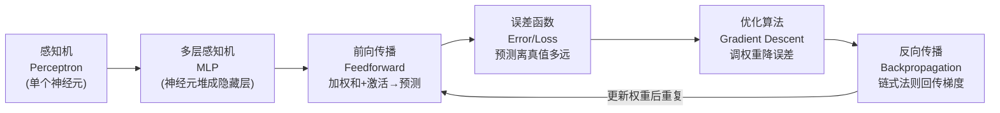
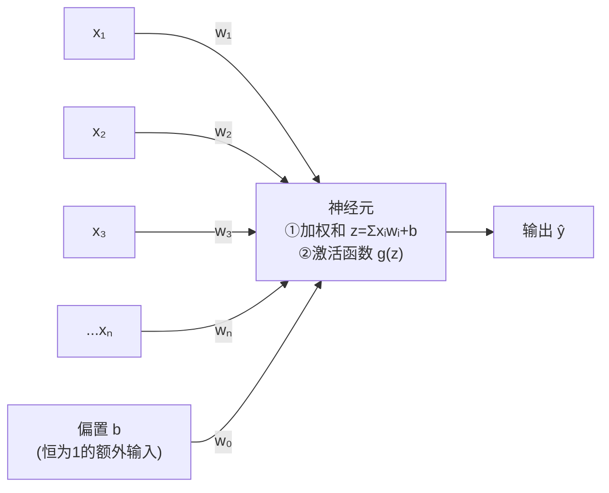
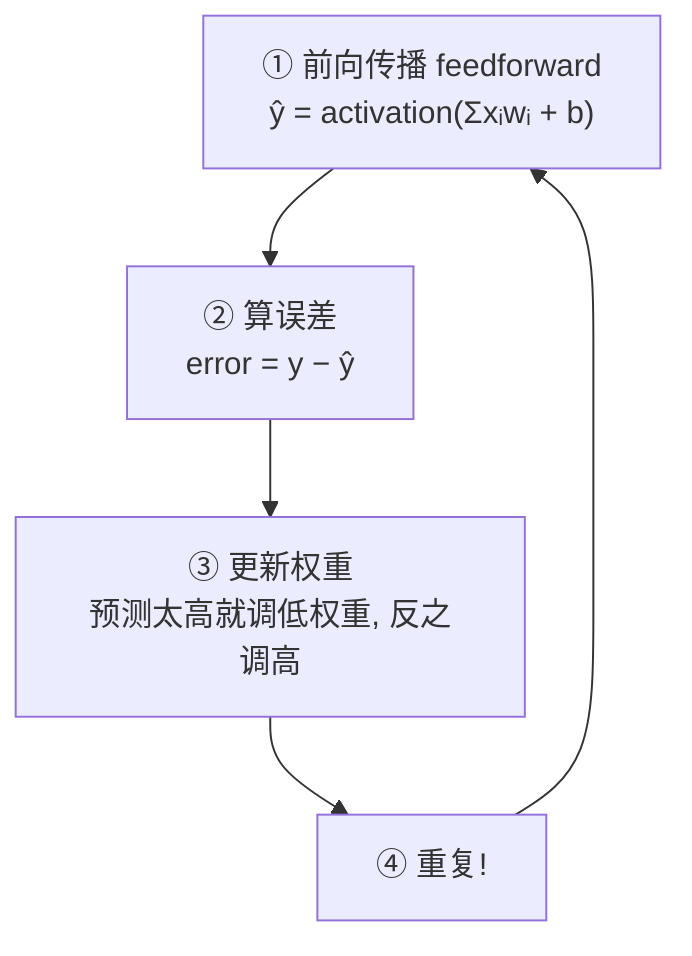
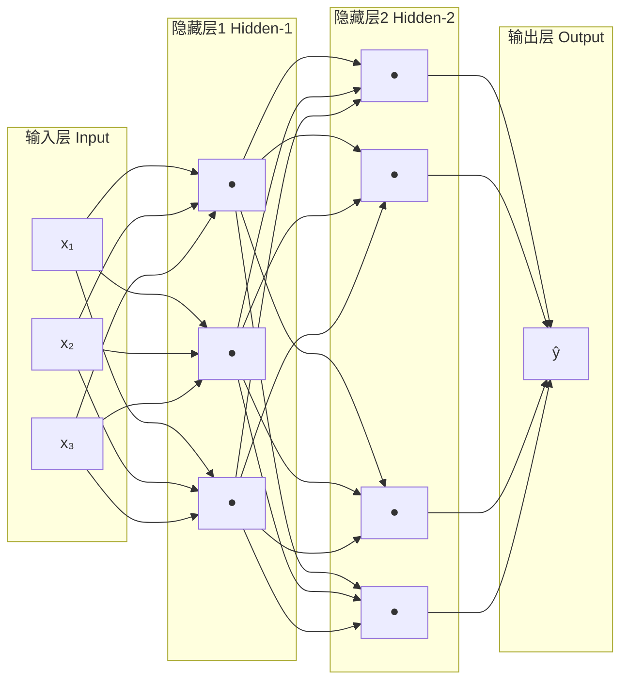
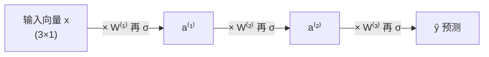
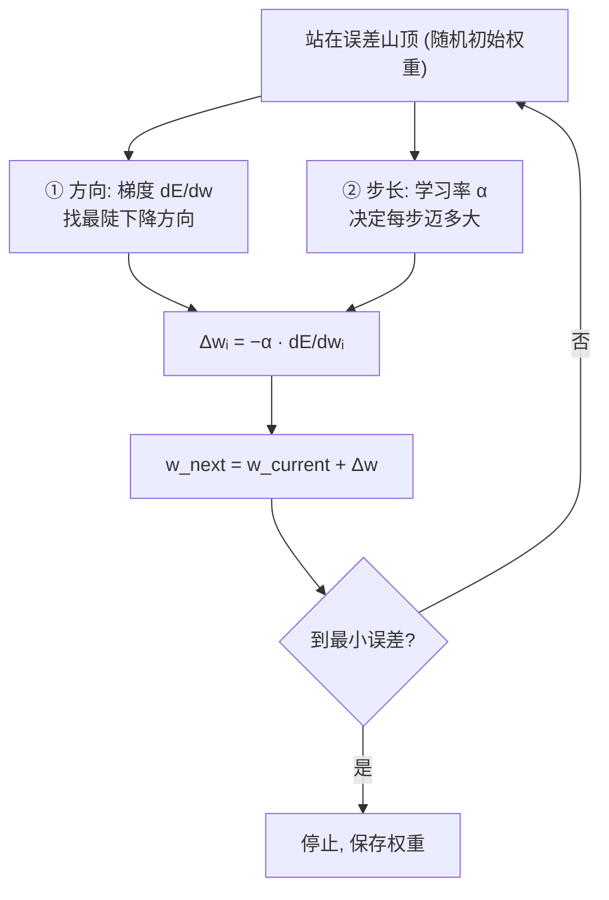
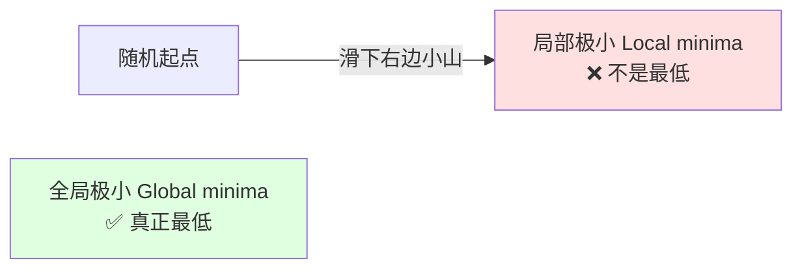
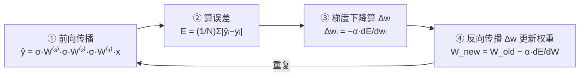
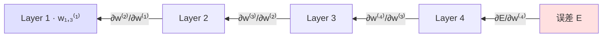
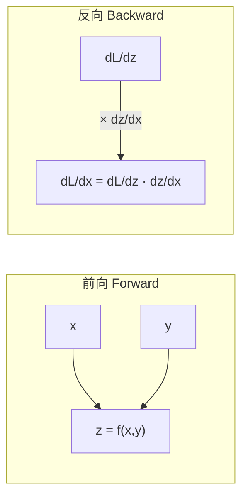

# 第 2 章 · 深度学习与神经网络（Deep Learning and Neural Networks）

> 逐章精讲《Deep Learning for Vision Systems》(Mohamed Elgendy) 第 2 章 · 对应原书第 57–112 页
> 主题：感知机 → 多层感知机（MLP）、激活函数、前向传播、误差函数、优化算法、反向传播

---

## 🗺️ 本章地图

上一章我们把计算机视觉（CV）流水线拆成了四块：输入图像 → 预处理 → 特征提取 → 学习算法（分类器）。传统机器学习里，**特征是人手工设计的**；而深度学习里，**神经网络同时充当"特征提取器"和"分类器"**——它自己从图像里认出模式、抽出特征、再分类到标签。

本章暂时离开 CV 语境，专门把"深度学习算法"这个黑盒**拆开**，看清神经网络到底是怎么学习、怎么预测的。整章围绕一条主线展开：



一句话总纲：**训练 = 前向算预测 → 算误差 → 反向传梯度 → 梯度下降更新权重，如此循环，直到误差足够小。**

| 小节 | 你会学到 | 关键词 |
|---|---|---|
| 2.1 | 感知机：单个神经元怎么算、怎么学、为什么不够用 | 加权和、偏置、阶跃函数、线性可分 |
| 2.2 | 多层感知机（MLP）的架构与超参数 | 输入/隐藏/输出层、全连接、深度 |
| 2.3 | 激活函数大全 | Sigmoid、Tanh、ReLU、Softmax、非线性 |
| 2.4 | 前向传播：一路算到预测输出 | 矩阵乘法、特征学习 |
| 2.5 | 误差函数：怎么量化"错得有多离谱" | MSE、交叉熵 |
| 2.6 | 优化算法：怎么找到最优权重 | 梯度下降、BGD/SGD/MB-GD、学习率 |
| 2.7 | 反向传播：链式法则把梯度传回去 | 链式法则、上游梯度×局部梯度 |

---

## 2.1 感知机（Perceptron）：一切的起点

### 2.1.1 什么是感知机？

**是什么**：感知机是最简单的神经网络——**只含一个神经元（neuron）**。它的灵感来自生物神经元。

🔬 **第一性原理 · 从生物神经元到人工神经元**

> 生物神经元通过**树突（dendrites）**接收来自其他神经元的电信号，以不同强度**调制**这些信号，只有当输入信号的总强度**超过某个阈值**时，才通过**突触（synapses）**"放电（fire）"输出一个信号。输出再喂给下一个神经元，如此传递。

人工神经元照搬了这个"总强度超阈值就放电"的机制，把它拆成**两个连续的函数**：

1. **加权和（weighted sum）**——把所有输入乘上各自的权重再相加，代表"输入信号的总强度"；
2. **阶跃函数（step function）**——如果总强度超过阈值就输出 1（放电），否则输出 0（不放电）。

为什么要给每个输入配一个**权重（weight）**？因为**并非所有输入特征都同等重要**。权重值反映了这个输入的重要性：权重高，就放大这个输入信号；权重低，就削弱它。在神经网络图里，权重就是从输入节点连到神经元的那些**边（edges / 连接线）**。

### 感知机的四个部件



| 部件 | 英文 | 含义 |
|---|---|---|
| 输入向量 | Input vector **X** | 喂给神经元的特征向量 (x₁, x₂, …, xₙ)，大写 X 表示"一批输入" |
| 权重向量 | Weights vector **w** | 每个 xᵢ 配一个 wᵢ，表示该输入的重要性 |
| 神经元函数 | Neuron functions | 内部计算：加权和 + 激活函数 |
| 输出 | Output | 由激活函数类型决定：阶跃函数给 0/1；其他给概率或浮点数 |

💡 **实战直觉 · 权重就是"重要性旋钮"**

> 预测房价，用 3 个特征：面积 x₁、地段 x₂、房间数 x₃。假设面积对房价的影响是地段的 2 倍，地段又是房间数的 2 倍，那学出来的权重可能就像 8、4、2 这样的比例。**权重怎么分配、学习怎么发生，正是神经网络训练的核心**——这也是本章后面要讲透的。

### 加权和函数（Weighted Sum）

又叫**线性组合（linear combination）**，就是所有输入乘权重、求和、再加一个偏置项：

$$
z = \sum_i x_i \cdot w_i + b = x_1 w_1 + x_2 w_2 + x_3 w_3 + \dots + x_n w_n + b
$$

原书的 Python 实现（一行搞定）：

```python
z = np.dot(w.T, X) + b   # X 是输入向量(大写X), w 是权重向量, b 是 y 轴截距(偏置)
```

> **逐行讲解**：`w.T` 是权重向量的转置，`np.dot(w.T, X)` 就是向量点积 = Σxᵢwᵢ，再加上 `b`。用矩阵运算一次算完，比逐个乘加快得多——这是后面前向传播用矩阵表示的伏笔。

### 🔬 核心论证 · 偏置（bias）到底是什么，为什么要加？

回忆一条直线的方程：**y = mx + b**，其中 b 是 **y 轴截距（y-intercept）**。要确定一条直线，你需要两样东西：**斜率**和**线上一个点**。偏置 b 就是 y 轴上的那个点。

- **偏置让直线能上下平移**，从而更好地拟合数据。
- **没有偏置**，直线永远被迫穿过原点 (0,0)，拟合会很差。想象你要用一条**必须过原点**的直线把圆圈和星星分开——很多时候根本做不到！

**工程技巧**：偏置的实现方式是——引入一个**恒等于 1 的额外输入节点**，它的权重 w₀ 就是偏置值 b。这样一来，偏置就被当作**一个普通权重**来对待，同样随机初始化、同样在训练中被学习和调整。所以在深度学习文献里，**权重和偏置常常统一记作 w**。

### 阶跃激活函数（Step / Heaviside Function）

神经元不会直接输出裸的加权和——中间还有一步**激活函数（activation function）**，这是"大脑的决策单元"。感知机用的最简单的激活函数就是**阶跃函数**，产生二值输出：

$$
y = g(z) = \begin{cases} 1 & \text{if } w \cdot x + b > 0 \\ 0 & \text{if } w \cdot x + b \le 0 \end{cases}
$$

原书 Python 实现：

```python
def step_function(z):
    if z <= 0:
        return 0
    else:
        return 1
```

> 一句话：加权和 z ≥ 0 就"放电"（输出 1），否则不放电（输出 0）。这就是感知机做出"决定"的地方。

### 2.1.2 感知机怎么学习？

感知机靠**试错（trial and error）**从错误中学习——把权重当**旋钮**，上下拧，直到网络训练好。逻辑分四步：



1. **前向传播**：算加权和、过激活函数，得到预测 ŷ = activation(Σxᵢwᵢ + b)。
2. **算误差**：拿预测和真实标签比：error = y − ŷ。
3. **更新权重**：预测偏高就调权重让下次预测低一点，反之亦然。
4. **重复**，直到第 2 步的误差非常小（接近 0），意味着预测已经很接近真值。此时停止训练，保存权重，将来用于未知样本。

### 2.1.3 一个神经元够解决复杂问题吗？

**答案：不够。** 原因：**感知机是一个线性函数**，训练出来的神经元只能画出**一条直线**来分隔数据。

💡 **例子 · 选拔球员**

> 用两个特征（身高、年龄）预测球员能否入选校队。训练好的感知机会找到最优权重和偏置，画出**最能分开"入选/未入选"的那条直线**：
> $$z = \text{height} \cdot w_1 + \text{age} \cdot w_2 + b$$
> 来了个新球员（身高 150cm、12 岁），代入算 z：落在线**下方** → 预测不入选；落在**上方** → 入选。

⚠️ **常见坑 · 线性可分 vs 非线性**

| 类型 | 定义 | 能否单直线分开 |
|---|---|---|
| **线性数据集** | 数据能用**一条直线**分开 | ✅ 一条直线搞定 |
| **非线性数据集** | 数据**无法用一条直线**分开 | ❌ 需要多条线围成形状 |

单个感知机只在**线性可分**时好用。碰到非线性数据（比如两类交织在一起），一条直线怎么画都分不开。加**两个**感知机能画两条线，好一点，但还有误判。**加更多神经元 → 拟合更好**。（但加太多会**过拟合 overfitting**，后面细讲。）总规律：**网络越复杂，越能学到数据的特征**。

---

## 2.2 多层感知机（Multilayer Perceptron, MLP）

要分开非线性数据，就得用**几十上百个神经元**。最常见的架构是把神经元**一层层堆叠**——这就是 MLP。

> 📌 术语澄清：**MLP、ANN（人工神经网络）、全连接网络（fully connected network）、前馈网络（feedforward network）**——这几个名字指的是**同一个东西**，可互换使用。

### 2.2.1 MLP 架构



四大组件：

| 组件 | 作用 |
|---|---|
| **输入层 Input layer** | 装特征向量 |
| **隐藏层 Hidden layers** | 神经元层层堆叠；叫"隐藏"是因为我们看不到、也不控制它们的输入输出 |
| **权重连接 Weight connections（边 edges）** | 每条连接配一个权重，反映其对最终预测的影响力 |
| **输出层 Output layer** | 给出预测；回归问题输出实数值，分类问题输出概率（取决于输出层用什么激活函数） |

### 2.2.2 隐藏层在干什么？

**这是特征学习（feature learning）真正发生的地方。**

🔬 **第一性原理 · 逐层学习"模式套模式"**

> 早期的层检测**简单模式**（低级特征：直线、边缘）；后面的层检测"模式里的模式"（更复杂的特征：角点）；再后面是"模式里的模式里的模式"（圆、螺旋）……**堆叠隐藏层 = 从彼此身上学到越来越复杂的特征**，直到拟合数据。

> 这正是后面卷积神经网络（CNN）的核心思想的雏形：**深度越深，学到的特征越抽象、越复杂**。所以，如果你的网络拟合不了数据，一个解法就是**加更多隐藏层**。

### 2.2.3 要多少层、每层多少节点？

这是你作为 ML 工程师要设计和调的**超参数（hyperparameter）**。没有万能配方，但有经验法则：

- 两个或以上隐藏层，就叫**深度神经网络（deep neural network）**。
- **越深 → 越能拟合训练数据**，但太深会**过拟合**（把训练集背下来了，遇到新数据就翻车），而且更**费算力**。
- **起手式**：先搭个小网络（CPU 上大概 3~5 层），看表现。欠拟合就加层，过拟合就减层。多读别人成功的架构，建立直觉。可以去 [TensorFlow Playground](https://playground.tensorflow.org) 玩一玩，直观感受加层的效果。

### 🔬 核心论证 · 全连接（Fully Connected）与权重数量

经典 MLP 的层与层之间是**全连接**的：**每一层的每个节点都连到上一层的所有节点**。

**动手算一算**：假设一个 MLP，输入层 4 节点，两个隐藏层各 5 个神经元，输出层 3 节点。

| 连接 | 计算 | 边数（含偏置） |
|---|---|---|
| Weights_0_1 | 4 输入 × 5 = 20，加 5 个偏置 | **25** |
| Weights_1_2 | 5 × 5 = 25，加 5 个偏置 | **30** |
| Weights_2_out | 5 × 3 = 15，加 3 个偏置 | **18** |
| **总计** | | **73** |

用 Keras 搭出来验证一下：

```python
model = Sequential([
    Dense(5, input_dim=4),
    Dense(5),
    Dense(3)
])
model.summary()
```

输出：

```
Layer (type)          Output Shape     Param #
=================================================
dense (Dense)         (None, 5)        25
dense_1 (Dense)       (None, 5)        30
dense_2 (Dense)       (None, 3)        18
=================================================
Total params: 73
```

> 这 73 个权重先**随机初始化**，再靠前向传播 + 反向传播学出最优值。记住这个"手算边数"的技能——面试常考、debug 常用。

### 2.2.4 超参数速查（本节精华）

| 超参数 | 作用 | 建议 |
|---|---|---|
| **隐藏层数量** | 越多越能学训练数据，但太多会过拟合 | 从小网络起步，逐步加层 |
| **激活函数 Activation** | 引入非线性 | 隐藏层用 **ReLU**，输出层用 **Softmax** |
| **误差函数 Error function** | 衡量预测离真值多远 | 回归用 **MSE**，分类用 **交叉熵** |
| **优化器 Optimizer** | 找最优权重 | 本章讲 BGD/SGD/MB-GD；还有 Adam、RMSprop |
| **批大小 Batch size** | 每次更新参数用多少子样本 | 默认 32，也试 64/128/256；越大越快但越吃内存 |
| **轮数 Epochs** | 整个训练集过网络几遍 | 加到验证准确率开始下降（过拟合信号）为止 |
| **学习率 Learning rate** | 每步下山的步长 | 太小慢但稳，太大快但可能不收敛；从库默认值起手，上下调一个数量级 |

💡 **面试高频 · 分清 epoch / batch / iteration**

> - **Epoch（轮）**：整个训练集**完整过一遍**网络。
> - **Batch size（批大小）**：一次计算梯度用的样本数。
> - 例：1000 个样本，batch_size=256 → epoch 1 = batch1(256) + batch2(256) + batch3(256) + batch4(232)。**千万别把 batch_size 和 epoch 搞混。**

---

## 2.3 激活函数（Activation Functions）

搭网络时的一个关键设计决策：**每个神经元用什么激活函数？** 激活函数也叫**转移函数（transfer functions）**或**非线性（nonlinearities）**，因为它把加权和这个"线性组合"变成非线性模型，放在每个感知机末尾，决定"要不要激活这个神经元"。

### 🔬 核心论证 · 为什么一定要激活函数？

> **为什么不能只算加权和、一路传下去就出结果？**

**激活函数的核心目的：给网络引入非线性。**

$$
\text{线性函数 ∘ 线性函数 = 线性函数}
$$

如果不插入非线性激活函数，那么**无论堆多少层，多层感知机的表现都和单个感知机一样**——你算的还是一条直线，什么有趣的函数都学不出来。此外，激活函数还能把输出**限制在有限值域**内（比如概率 0~1）。

用选球员的例子：加权和 z = height·w₁ + age·w₂ + b 是**无界的**，z 可以是任何数。激活函数（这里是阶跃函数）把它**卡成有限值**：z>0 → 入选，z<0 → 拒绝。**没有激活函数，感知机就只吐一个数，不做任何决定。**

### 逐个激活函数

#### 1️⃣ 线性/恒等函数（Linear / Identity）

$$\text{activation}(z) = z = wx + b$$

**信号原样穿过**，等于没有激活函数。⚠️ **几乎从不使用**。

🔬 **为什么不能用**：算它的导数。设 z(x)=4x，导数 z'(x)=4——**恒为常数，不依赖输入 x**。这意味着每次反向传播**梯度都一样**，误差根本没在改善。**这里没有学习发生（No learning here!）**。

#### 2️⃣ 阶跃函数（Heaviside Step）

二值输出 0/1，主要用于**二分类**（真/假、垃圾邮件/正常、通过/不通过）。给的是**离散答案**。

$$
\text{output} = \begin{cases} 1 & \text{if } w\cdot x + b > 0 \\ 0 & \text{if } w\cdot x + b \le 0 \end{cases}
$$

#### 3️⃣ Sigmoid / 逻辑函数

最常用之一。把所有值**挤压成 0~1 之间的概率**，减少极端值/离群点的影响（但不删除）。把 (−∞, +∞) 的连续变量压成 0~1 的概率。因图形呈 **S 形**又叫 S 曲线。阶跃给离散答案（通过/不通过），Sigmoid 给**概率**（通过的概率 / 不通过的概率）。

$$\sigma(z) = \frac{1}{1 + e^{-z}}$$

```python
import numpy as np
def sigmoid(x):
    return 1 / (1 + np.exp(-x))
```

🔬 **第一性原理 · Sigmoid 是怎么"推导"出来的？**（可选深挖）

> 用年龄预测是否得糖尿病。直接拟合线性模型 z = β₀ + β₁·age，问题来了：年龄 <25 岁时预测概率**为负**，>43 岁时预测概率**>100%**——荒谬！这正说明线性函数在很多场景不work。怎么修？
>
> **第一步：消灭负概率。** 指数函数 exp(·) 的结果永远为正：
> $$p = \exp(z) = \exp(\beta_0 + \beta_1 \text{age})$$
> **第二步：压掉 >1 的值。** 任何数除以比它大的数，结果 <1。于是除以自身加一个小量：
> $$p = \frac{\exp(z)}{\exp(z) + \varepsilon}$$
> 上下同除 exp(z)，就得到熟悉的形式：
> $$p = \frac{1}{1 + \exp(-z)} = \sigma(z)$$
> 画出来正是 S 形：年龄增大，概率渐近趋近 1；权重下降，渐近趋近 0，永远落在 (0,1) 内。**这就是 Sigmoid 函数和逻辑回归。**

#### 4️⃣ Softmax 函数

Sigmoid 的**多类推广**。当类别**超过两个**时，用它得到分类概率——它**强制所有输出加起来等于 1**。深度学习里最常见的用法：从多个选项中预测**单个类别**。

$$\sigma(x_j) = \frac{e^{x_j}}{\sum_i e^{x_i}}$$

> **例**：三个 logit (1.2, 0.9, 0.4) → Softmax → (0.46, 0.34, 0.20)，加起来 = 1。

> 💡 **TIP**：多分类（>2 类且互斥）时，输出层的首选就是 **Softmax**。它对两类也work，此时行为等同 Sigmoid。

#### 5️⃣ 双曲正切（Tanh）

Sigmoid 的"平移版"——不是挤到 0~1，而是挤到 **−1~1**。

$$\tanh(x) = \frac{\sinh(x)}{\cosh(x)} = \frac{e^x - e^{-x}}{e^x + e^{-x}}$$

**Tanh 在隐藏层几乎总比 Sigmoid 好**，因为它**把数据中心化**：均值接近 0（而非 Sigmoid 的 0.5），让下一层学起来更容易。

⚠️ **共同缺陷（Sigmoid & Tanh）**：当 z 很大或很小时，函数**饱和**，**梯度（斜率）趋近 0**，会**拖慢梯度下降**。这正是 ReLU 要解决的问题。

#### 6️⃣ 修正线性单元（ReLU, Rectified Linear Unit）

**只在输入 >0 时激活**；输入 <0 时输出恒为 0；输入 >0 时与输出线性相关。

$$f(x) = \max(0, x)$$

```python
def relu(x):
    if x < 0:
        return 0
    else:
        return x
```

> **写作时的 SOTA 激活函数**。它在很多场景都work得好，在隐藏层里通常比 Sigmoid/Tanh **训练得更好**——因为它对大输入**不饱和**，从而缓解梯度消失。

#### 7️⃣ Leaky ReLU

ReLU 的缺点：x<0 时**导数为 0**（神经元"死掉"，梯度传不回去）。Leaky ReLU 在 x<0 时引入一个**小的负斜率**（约 0.01），"漏"一点梯度过去：

$$f(x) = \max(0.01x, x)$$

```python
def leaky_relu(x):
    if x < 0:
        return x * 0.01
    else:
        return x
```

> **为什么是 0.01？** 有人把它当超参数来调（0.1、0.01、0.002 都试试），但通常没必要——你有更大的问题要操心。Leaky ReLU 常比 ReLU 好一点，但实践中用得不如 ReLU 多。

### 📋 激活函数速查表（Cheat Sheet）

| 激活函数 | 值域/输出 | 公式 | 何时用 |
|---|---|---|---|
| **Linear/恒等** | 原样穿过 | f(x)=x | ⚠️ 几乎不用 |
| **阶跃 Step** | 0 或 1（离散） | 见上 | 二分类，给离散值 |
| **Sigmoid** | (0,1) 概率 | 1/(1+e⁻ᶻ) | 二分类概率 |
| **Softmax** | 各类概率，和=1 | eˣⱼ/Σeˣⁱ | 多分类（互斥），**输出层** |
| **Tanh** | (−1,1) | (eˣ−e⁻ˣ)/(eˣ+e⁻ˣ) | 隐藏层，优于 Sigmoid |
| **ReLU** | max(0,x) | max(0,x) | **隐藏层首选**，优于 Tanh |
| **Leaky ReLU** | 负半轴留小斜率 | max(0.01x, x) | 缓解 ReLU 神经元死亡 |

💡 **面试高频 · 激活函数选型口诀**

> - **隐藏层**：多数情况用 **ReLU**（或 Leaky ReLU）。它算得快，且**不会对大输入饱和**（对比 Sigmoid/Tanh 在 ~1 处饱和），降低**梯度消失（vanishing gradient）**的概率。记住：梯度就是斜率，函数一旦"压平"就没斜率，梯度开始消失。
> - **输出层**：分类且类别互斥 → **Softmax**；二分类 → **Sigmoid**；回归 → **不用激活函数**（加权和节点本身就输出你要的连续值）。

---

## 2.4 前向传播（The Feedforward Process）

**前向传播 = 从输入层经隐藏层一路算到输出层的过程**，信息**向前**流动，靠两个连续函数实现：**加权和 + 激活函数**。简言之，前向传播就是"层层计算，得出一个预测"。

### 权重记号约定

原书用 $W_{ab}^{(n)}$ 表示权重：
- **(n)** = 层号；
- **ab** = 连接第 n 层第 a 个神经元 与 第 (n−1) 层第 b 个神经元 的边。

> 例：$W_{23}^{(2)}$ 连接第 2 层的第 2 个节点 与 第 1 层的第 3 个节点。（不同文献记法不同，**只要全网统一即可**。）偏置也按同样方式随机初始化、训练中学习，为方便统一记作 w。节点值记作 $a_m^n$（第 n 层第 m 个节点的激活值）。

### 2.4.1 前向传播计算（以三层网络为例）

设网络：输入 3 特征 → 隐藏层1（3 神经元）→ 隐藏层2（4 神经元）→ 输出层（1 神经元），激活函数用 σ（Sigmoid）。

**第 1 层**（每个节点 = 加权和过 σ）：

$$
\begin{aligned}
a_1^{(1)} &= \sigma(w_{11}^{(1)}x_1 + w_{21}^{(1)}x_2 + w_{31}^{(1)}x_3) \\
a_2^{(1)} &= \sigma(w_{12}^{(1)}x_1 + w_{22}^{(1)}x_2 + w_{32}^{(1)}x_3) \\
a_3^{(1)} &= \sigma(w_{13}^{(1)}x_1 + w_{23}^{(1)}x_2 + w_{33}^{(1)}x_3)
\end{aligned}
$$

**第 2 层**：同理算出 $a_1^{(2)}, a_2^{(2)}, a_3^{(2)}, a_4^{(2)}$。

**输出层**（第 3 层）：

$$
\hat{y} = a_1^{(3)} = \sigma\big(w_{11}^{(3)}a_1^{(2)} + w_{12}^{(3)}a_2^{(2)} + w_{13}^{(3)}a_3^{(2)} + w_{14}^{(3)}a_4^{(2)}\big)
$$

### 🔬 核心论证 · 用矩阵一次算完

这么小的网络就要解一大堆方程；真实网络输入层、隐藏层各有成百上千节点，逐个算会累死。**改用矩阵乘法，一次通过多个输入**，配合 NumPy 一行代码，计算速度巨幅提升。

从右往左读这个链式表达式（每层：先乘权重矩阵，再过 σ）：

$$
\boxed{\;\hat{y} = \sigma \cdot W^{(3)} \cdot \sigma \cdot W^{(2)} \cdot \sigma \cdot W^{(1)} \cdot (x)\;}
$$



**矩阵乘法规则**（面试必背）：(row₁ × col₁) × (row₂ × col₂)，要求 **col₁ = row₂**，乘积维度为 (row₁ × col₂)。

> 例：一个 (3×3) 矩阵乘 (3×1) 向量 = (3×1) 向量。逐元素：如某行 [3,4,2]·[13,8,6] = 3·13+4·8+2·6 = 83。
> **转置（transpose）**：把 (m×n) 变 (n×m)，行变列、列变行，记作 Aᵀ。

### 2.4.2 特征学习（Feature Learning）

隐藏层的节点 aᵢ **就是每层学出来的新特征**。

💡 **例子 · 房价预测**

> 原始输入 (卧室数=3, 面积=2000, 地段ID=1)。经第一层前向传播，被**变换成一组新特征值** $a_1, a_2, a_3, a_4$；再经下一层，又变换成预测输出 ŷ（最终房价估计）。训练时我们看预测输出、与真实价格比、算误差，如此重复直到误差最小。

> 这些"新特征"我们看不见也不太能控制——**这是神经网络的"魔法"**，所以叫"隐藏层"。回顾 TensorFlow Playground：第一层学直线/边缘，第二层学角点，一直到最后学出圆、螺旋等复杂形状。**网络越深，学到的关于数据的东西越多。**

---

## 2.5 误差函数（Error / Loss / Cost Functions）

前向传播给了预测，怎么评估它？**关键：量化误差——预测离正确答案（标签）有多远。** 误差函数 = 成本函数（cost）= 损失函数（loss），三者可互换。

### 为什么需要误差函数？

**算误差 = 把神经网络变成一个优化问题。** 优化问题的套路是：定义一个误差函数，然后调参数让它取最小值。**只要能定义出误差函数，我们就有很大机会靠优化算法把问题解掉。** 目标：找到能让误差尽可能小的最优权重。如果连"离目标多远"都不知道，下一轮该改什么就无从谈起。

### 🔬 核心论证 · 误差必须恒为正

> 假设两个数据点，第一个误差 +10，第二个 −10，平均误差 = **0**！这具有误导性——"误差=0"意味着完美预测，但实际上它错了两次、每次差 10。我们要**每个预测的误差都为正**，这样求平均时不会相互抵消。就像射箭：脱靶 1 英寸，我们不关心偏哪个方向，只关心离靶心多远。

### 2.5.1 均方误差（MSE, Mean Squared Error）

**回归问题**常用（输出是实数值，如房价）。误差**平方**后对样本数**求平均**：

$$
E(W, b) = \frac{1}{N} \sum_{i=1}^{N} (\hat{y}_i - y_i)^2
$$

**为什么用 MSE？**
- 平方保证误差**恒为正**；
- **大误差被惩罚得更狠**（平方放大）；
- 数学上好求导，方便。

⚠️ **坑**：MSE 对**离群点敏感**（因为平方）。预测股价时敏感是好事（想抓住异常）；预测某城房价时不好（怕被离群值带偏，你更关心中位数）。这时用**平均绝对误差 MAE**——不平方，取绝对值求平均：

$$
E(W, b) = \frac{1}{N} \sum_{i=1}^{N} |\hat{y}_i - y_i|
$$

| 记号 | 含义 |
|---|---|
| E(W, b) | 损失函数（有的文献记 J(W, b)） |
| W | 权重矩阵（有的文献用 θ 表示） |
| b | 偏置向量 |
| N | 训练样本数 |
| ŷᵢ | 预测输出（有的记 h_{w,b}(X)） |
| yᵢ | 真实标签 |
| (ŷᵢ − yᵢ) | 通常叫**残差 residual** |

### 2.5.2 交叉熵（Cross-Entropy）

**分类问题**常用，因为它**量化两个概率分布之间的差异**。

💡 **例子 · 猫狗鱼三分类**

> 输入一张狗的图，**真实分布**（one-hot）：P(cat)=0.0, P(dog)=1.0, P(fish)=0.0。模型**预测分布**：(0.2, 0.3, 0.5)。用公式：
> $$E(W, b) = -\sum_i y_i \log(p_i)$$
> $$E = -(0.0\cdot\log 0.2 + 1.0\cdot\log 0.3 + 0.0\cdot\log 0.5) = 1.2$$
> **只有真实类别那一项起作用**（其他被 0 乘掉）。这就是预测离真值有多"离谱"。
>
> 后续迭代网络学到些模式，狗的预测从 30% 升到 50%：(0.3, 0.5, 0.2)：
> $$E = -(0 + 1.0\cdot\log 0.5 + 0) = 0.69$$
> **预测变好 → 损失从 1.2 降到 0.69。** 理想情况预测 100% 是狗，交叉熵损失 = 0。

跨所有 n 个训练样本的一般式：

$$
E(W, b) = -\sum_{i=1}^{n}\sum_{j=1}^{m} y_{ij}\log(p_{ij})
$$

> 📌 **NOTE**：实际项目里你**不会手算**这些——TensorFlow / PyTorch / Keras 里误差函数就是一个参数选项。但理解底层原理能让你设计网络时更有直觉。

### 2.5.3 误差与权重的关系（为下山做准备）

单输入感知机：设 x=0.3，标签 y=0.8。预测 ŷ = w·x = w·0.3，误差：

$$
\text{error} = |\hat{y} - y| = |(w\cdot x) - y| = |w\cdot 0.3 - 0.8|
$$

🔬 **关键洞察**：输入 x 和目标 y 是**固定值**，永不改变。方程里**唯一能调的变量就是权重 w**！

> **权重就是那个旋钮**，网络上下拧它直到误差最小。把误差对权重画出来，得到一条碗状曲线（成本函数 J(w)）。随机初始化的权重落在曲线某处，我们的使命：**让它沿曲线下降到最优值（最小误差处）。**

---

## 2.6 优化算法（Optimization Algorithms）

**优化 = 换个方式框住问题，让某个值最大化或最小化。** 把网络变成优化问题后，目标就是**最小化误差**——不断更新权重和偏置，直到找到产生最小误差的最优权重。

### 🔬 核心论证 · 为什么不能暴力搜索？

我们要在"误差 vs 权重"的空间里搜索。1 个权重 → 2D 曲线；2 个权重 → 3D 曲面；成百上千个权重 → 人脑无法可视化（我们最多理解 3 维）。

**暴力法可行吗？** 算笔账：预测房价，4 输入 + 1 个 5 神经元隐藏层 = 20 + 5 = **25 个权重**。若每个权重试 1000 个值：

$$
1000^{25} = 10^{75} \text{ 种组合}
$$

用世界最快超算 Sunway TaihuLight（93 petaflops = 93×10¹⁵ FLOPs）：

$$
\frac{10^{75}}{93 \times 10^{15}} \approx 1.08 \times 10^{58}\text{ 秒} = 3.42 \times 10^{50}\text{ 年}
$$

> **比宇宙年龄还长！** 而这只是个几分钟就能用聪明算法训完的简单网络。所以必须换思路——**梯度下降（gradient descent）**。它有三个变体：批量（BGD）、随机（SGD）、小批量（MB-GD）。

### 2.6.2 批量梯度下降（Batch Gradient Descent, BGD）

**梯度（gradient）= 导数 = 曲线在某点切线的斜率/变化率**。**梯度下降 = 迭代更新权重，沿误差曲线的斜坡往下走，直到到达最小误差点。**

下山每一步要定两件事：



**① 方向（梯度）**：站在山顶点 A，环顾四周找**最陡下降**的方向（就是曲线的导数），走一步到 B，再重复（重算前向和误差），直到山底。取误差对权重的导数 $\frac{dE}{dw}$ 就得到方向。

**② 步长（学习率 α）**：每步迈多大，用希腊字母 α 表示，是**最重要的超参数之一**。

⚠️ **学习率的两难**

| 学习率 | 后果 |
|---|---|
| **太小** | 最终能到最小误差（若训练无限久），但**慢**（可能几周几月） |
| **太大** | 从 A 一步跳到对面 B，再跳到 C……**误差来回震荡，永不下降** |

> **实践**：一般初始化为 **0.1 或 0.01**，看网络表现再调。

**合并方向与步长**（权重更新公式）：

$$
\Delta w_i = -\alpha \frac{dE}{dw_i}, \qquad w_{\text{next-step}} = w_{\text{current}} + \Delta w
$$

> **为什么加负号？** 导数算的是**向上**的斜率，我们要**下山**，所以取斜率的**反方向**。

### 🔬 核心论证 · 微积分求导补课

误差图上我们要找"某个权重点处曲线的陡峭程度"——正是导数。**基本求导法则**：

| 法则 | 公式 |
|---|---|
| 常数 Constant | d/dx (c) = 0 |
| 幂 Power | d/dx (xⁿ) = n·xⁿ⁻¹ |
| 常数倍 | d/dx [c·f(x)] = c·f'(x) |
| 和/差 Sum/Diff | d/dx [f±g] = f' ± g' |
| 乘积 Product | d/dx [f·g] = f·g' + g·f' |
| 商 Quotient | d/dx [f/g] = (g·f' − f·g')/g² |
| **链式 Chain** | **d/dx f(g(x)) = f'(g(x))·g'(x)** |

例：f(x)=10x⁵+4x⁷+12x → f'(x)=50x⁴+28x⁶+12。要某点斜率，代入即可：f'(2) 给左边线的斜率，f'(6) 给右边。

**Sigmoid 的导数**（漂亮结果，反向传播要用）：

$$
\sigma'(x) = \sigma(x)\cdot(1 - \sigma(x))
$$

```python
def sigmoid(x):
    return 1/(1+np.exp(-x))
def sigmoid_derivative(x):
    return sigmoid(x) * (1 - sigmoid(x))
```

> 📌 你**不用手算**这些导数——DL 库一行代码搞定。但理解底层能帮你 debug。

### ⚠️ BGD 的两大缺陷

**缺陷一：局部极小值（Local Minima）**。真实误差函数不都是简单碗状，可能有坑、脊、各种崎岖地形。随机起点决定了你可能滑进一个**局部极小值**（局部最低），而不是**全局极小值（global minima）**——整个函数的真正最低点。



**缺陷二：慢且贵**。BGD 每走一步都要**用整个训练集**算梯度：

$$
L(W,b) = \frac{1}{N}\sum_{i=1}^{N}(\hat{y}_i - y_i)^2
$$

> 如果训练集有 **1 亿条**记录，走一步就要对 1 亿条求和——**极慢极贵**。这就是它叫"批量"的原因：一整批数据用一次。

### 2.6.3 随机梯度下降（Stochastic Gradient Descent, SGD）

**每次只随机挑一个数据点**做梯度下降。这提供了很多不同的起点，下遍所有"山"，取所有局部极小中的最小值当全局极小。（Stochastic 就是"随机"的高级说法。）

**SGD 是机器学习（尤其深度学习）用得最多的优化算法。**

| 对比 | Batch GD | SGD |
|---|---|---|
| 每步用多少数据 | 整个训练集 | **随机 1 个样本** |
| 下降路径 | 平滑、近乎直线 | **锯齿状 zigzag** |
| 速度 | 慢 | **快很多** |
| 收敛 | 稳 | 到全局极小附近后会**一直弹跳**，不完全稳定 |

> 实践中弹跳**不是问题**——落在全局极小**附近**对绝大多数实际用途已足够好。**SGD 几乎总比 BGD 又快又好。**

### 2.6.4 & 2.6.5 小批量梯度下降 + 三者总结

**小批量梯度下降（Mini-batch GD, MB-GD）= BGD 和 SGD 的折中**：既不用全部数据、也不用单个样本，而是取**一组（mini-batch）**训练样本算梯度、更新权重，重复直到走完全部数据。**多数情况下 MB-GD 是好的起手式。**

📋 **梯度下降三件套总结**

三种都遵循同一套路：**① 找最陡斜率方向（dE/dw）→ ② 设学习率（步长）→ 更新**。

| 类型 | 每次更新用多少数据 | 特点 |
|---|---|---|
| **Batch GD** | 全部训练数据 | 算全部梯度才走一步，数据大时极贵，不 scale |
| **SGD** | 单个样本 | 比 BGD 快，通常能到全局极小附近 |
| **Mini-batch GD** | 一组样本（batch_size） | 折中，**推荐默认**，batch_size 试 32/64/128/256 |

> **学习率起手**：0.01 → 不行再 0.001 → 0.0001 → 0.00001。越低越保证下到最小误差（若训练无限久）。
> **别混淆**：**epoch** 是过完全部数据一整轮；**batch** 是算一次梯度的那组样本数。
> **进阶优化器**（第 4 章讲）：Nesterov 加速梯度、RMSprop、**Adam**、Adagrad。现在不用管。

---

## 2.7 反向传播（Backpropagation）

**反向传播是神经网络学习的核心。** 到这里，训练神经网络的三步循环已经完整：



权重更新公式（把各部分标注清楚）：

$$
\underbrace{W_{\text{new}}}_{\text{新权重}} = \underbrace{W_{\text{old}}}_{\text{旧权重}} - \underbrace{\alpha}_{\text{学习率}} \cdot \underbrace{\frac{\partial E}{\partial W}}_{\text{误差对权重的导数}}
$$

### 2.7.1 什么是反向传播？

**反向传播（backward pass）= 把"误差对每个权重的导数"从最后一层（输出）一路传回第一层（输入），据此调整权重。** 把 Δw 从预测节点 ŷ 逆着穿过隐藏层回传到输入层，权重就被更新了（w_next = w_current + Δw），误差就往山下走一步。然后循环重启。

**单权重时很简单**：w_new = w − α·(dE/dw)。**但 MLP 有很多权重时就复杂了**——比如怎么算"总误差对第 1 层某个权重 $w_{1,3}^{(1)}$ 的变化"？它离误差函数隔了好几层，不能直接求导。**需要微积分的链式法则（chain rule）。**

### 🔬 第一性原理 · 链式法则（Chain Rule）

$$
\frac{d}{dx}f(g(x)) = f'(g(x))\cdot g'(x)
$$

链式法则用于求"函数套函数"的导数，又叫**外内法则（outside-inside rule）**：**先对外层函数求导，再对内层函数求导，然后相乘。**

> **一句话精髓**："复合函数求导，导数直接相乘。" 这对反向传播极其有用——因为**前向传播就是一堆函数的复合，反向传播就是对这个复合的每一段求导。**

**实现反向传播 = 把一串偏导数连乘**，把误差的影响一路传回输入。要算误差对输入 x 的影响 dE/dx：

$$
\frac{dE}{dx} = \frac{dE}{dB}\cdot\frac{dB}{dA}\cdot\frac{dA}{dx}
$$

> **做的事就一件：上游梯度（upstream gradient）× 局部梯度（local gradient），一路乘到目标值。**

### 具体例子：算 $\frac{dE}{dw_{1,3}^{(1)}}$

假设一个 4 层网络，要算误差对第 1 层第 3 条权重 $w_{1,3}^{(1)}$ 的梯度。从输出节点的边开始，一路把偏导数连乘回到输入：

$$
\frac{\partial E}{\partial w_{1,3}^{(1)}} = \frac{\partial E}{\partial w_{2,1}^{(4)}} \times \frac{\partial w_{2,1}^{(4)}}{\partial w_{2,2}^{(3)}} \times \frac{\partial w_{2,2}^{(3)}}{\partial w_{3,2}^{(2)}} \times \frac{\partial w_{3,2}^{(2)}}{\partial w_{1,3}^{(1)}}
$$

用大白话读：

> 误差回传到边 $w_{1,3}^{(1)}$ = 误差对边 4 的影响 · 对边 3 的影响 · 对边 2 的影响 · 对目标边的影响。



> 公式看着吓人，其实**只是把从输出节点到输入节点这一路上各条边的偏导数乘起来**。复杂的只是记号，不是逻辑。这就是神经网络更新权重的反向传播技术。

### 2.7.2 反向传播要点

- 反向传播是**神经元的学习程序**。
- 它**反复调整连接权重**，最小化成本函数（实际输出向量与期望输出向量之差）。
- 权重调整的**副产品**：隐藏层**学会表征输入层没有的重要特征**。
- 反向传播从**网络末端开始**，把误差往回喂，**递归应用链式法则**，一路算梯度到输入，然后更新权重。
- 终极目标：**选一组最优权重，最小化成本/损失函数**，让模型最好地拟合数据。

**前向 vs 反向对照**（以复合 L = f(x,y)→z 为例）：



---

## 📌 小结

本章把"深度学习算法"这个黑盒彻底拆开，一条主线贯穿始终：

1. **感知机（单神经元）** = 加权和（Σxᵢwᵢ+b）+ 激活函数。**偏置**让决策边界能平移，不必过原点。感知机是**线性**的，只能画一条直线，**只解线性可分问题**。

2. **多层感知机（MLP）** = 把神经元堆成**隐藏层**（全连接）。隐藏层逐层学"模式套模式"，**越深越能拟合**——但太深会**过拟合**且费算力。ANN=MLP=全连接网络=前馈网络。

3. **激活函数**引入**非线性**（否则再多层也等价于单层）。隐藏层首选 **ReLU**（不饱和、缓解梯度消失），输出层分类用 **Softmax**、二分类用 **Sigmoid**、回归**不用激活**。

4. **前向传播** = 加权和 + 激活，逐层算到预测；用**矩阵乘法**一次算完：ŷ = σ·W⁽³⁾·σ·W⁽²⁾·σ·W⁽¹⁾·x。隐藏层节点就是**学出来的新特征**。

5. **误差函数**量化预测离真值多远，**恒为正**（防抵消）。回归用 **MSE**（对离群点敏感，可换 MAE），分类用**交叉熵**（量化两个概率分布差异）。

6. **优化 = 最小化误差**。暴力搜索会算到宇宙毁灭，所以用**梯度下降**：方向（梯度 dE/dw）× 步长（学习率 α），Δw = −α·dE/dw。三变体：**BGD**（全量，慢贵）、**SGD**（单样本，快，锯齿）、**MB-GD**（折中，推荐）。学习率太大震荡、太小龟速。

7. **反向传播 = 学习的核心**：用**链式法则**把误差梯度从输出层一路连乘回输入层（**上游梯度 × 局部梯度**），据此更新每个权重。前向是复合函数，反向是对每段求导。

**训练循环一句话**：前向算预测 → 算误差 → 反向传梯度 → 梯度下降更新权重 → 重复到误差最小。

---

## 🔗 延伸

- 🎮 **动手玩**：[TensorFlow Playground](https://playground.tensorflow.org) —— 拖拽加层、换激活函数，直观看特征学习与过拟合。
- ➡️ **下一章（第 3 章）**：回到 CV，讲最重要的 DL 架构之一——**卷积神经网络（CNN）**。本章的"逐层学复杂特征""隐藏层是特征提取器"的直觉会直接派上用场。
- 📖 **第 4 章**：超参数调优（学习率、dropout、正则化）+ 进阶优化器（Adam、RMSprop）+ 梯度消失/爆炸问题的深入处理。
- 🔬 **想深挖数学**：Sigmoid 导数 σ'=σ(1−σ)、交叉熵求导、链式法则在多层网络的完整推导——建议配合《深度学习》(花书) 第 6 章"深度前馈网络"对照阅读。

> 💡 **写在最后**：这章所有手算（矩阵乘法、求导、反向传播）在真实项目里都由 TensorFlow / PyTorch / Keras **一行代码**代劳。理解底层的意义不在于让你手算，而在于——**当网络不收敛、梯度爆炸、loss 震荡时，你知道该拧哪个旋钮。**
