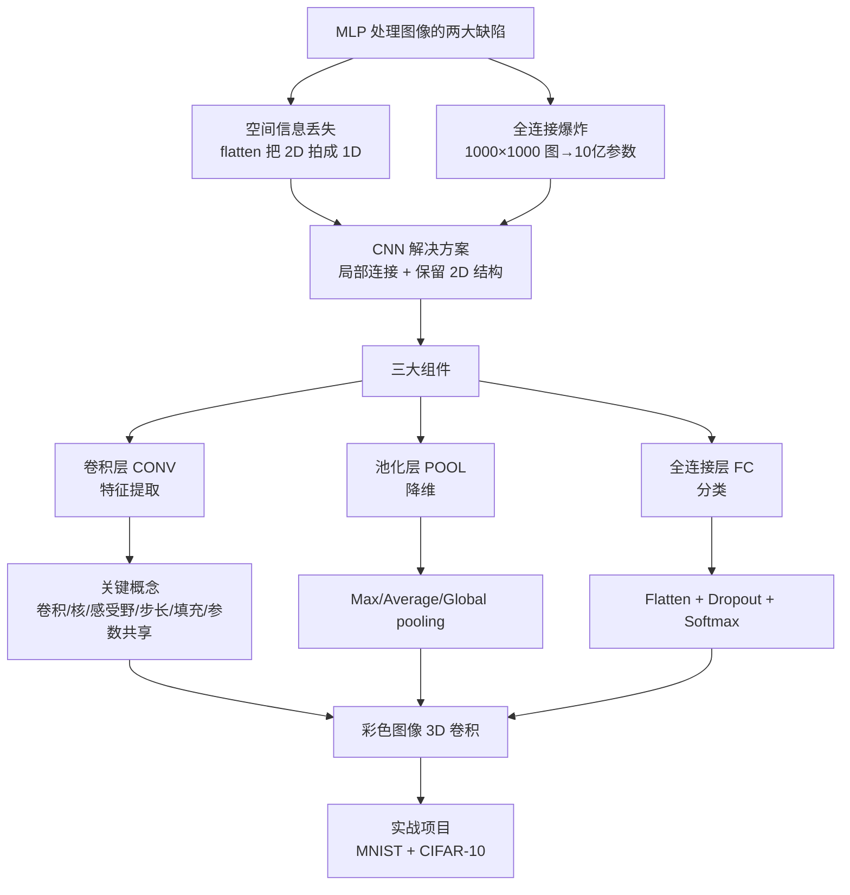
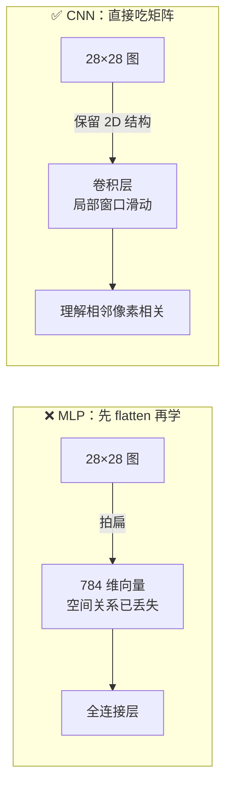
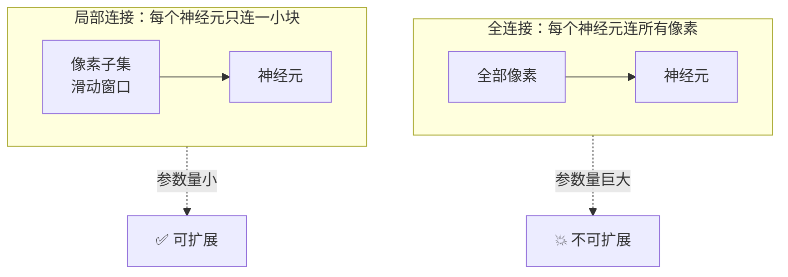
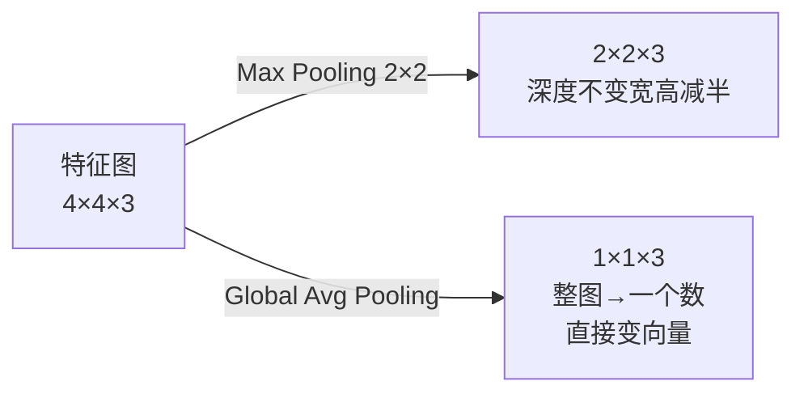
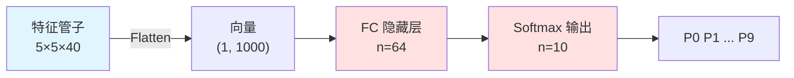
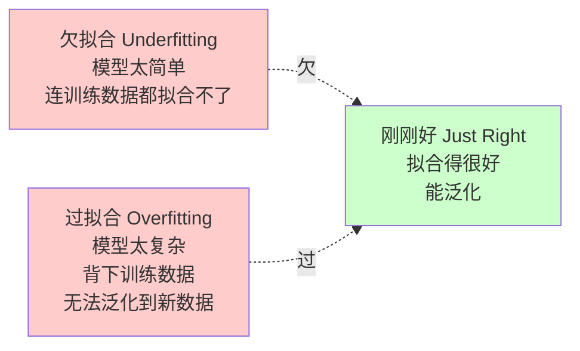
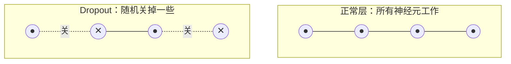
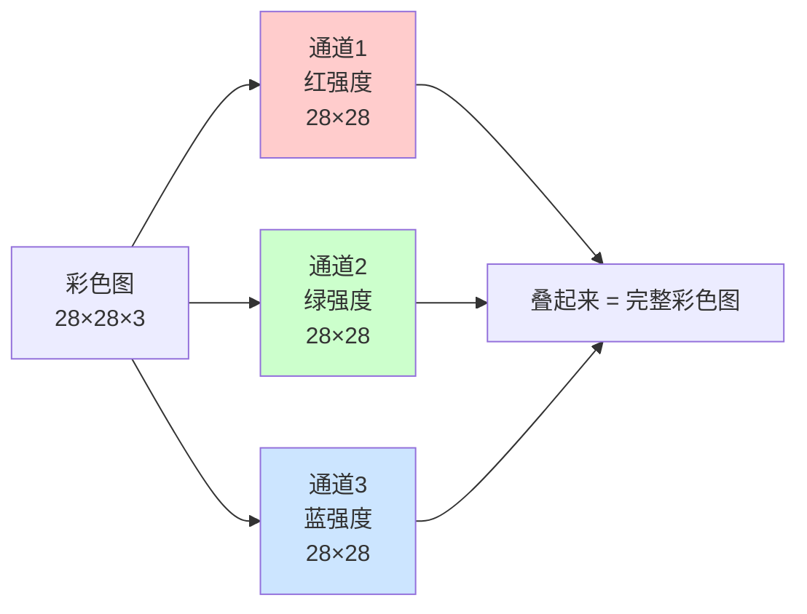
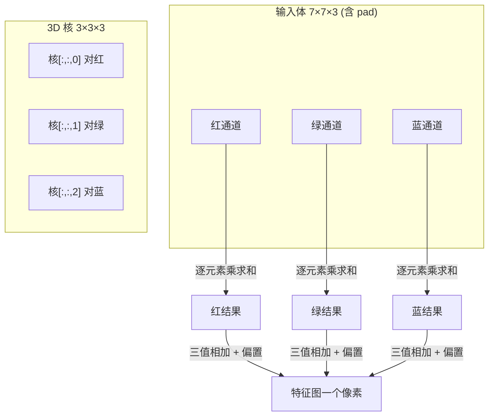
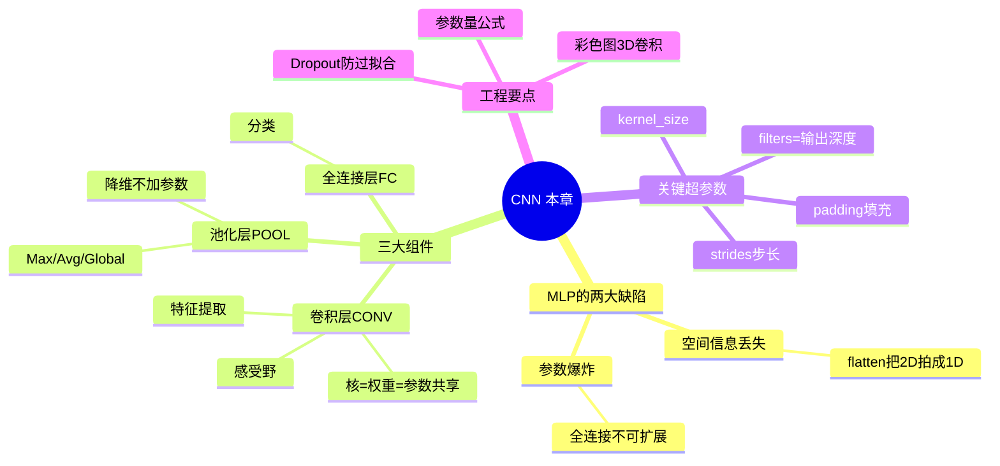

# 🧠 第 3 章 卷积神经网络 CNN（Convolutional Neural Networks）

> 逐章精讲 ·《Deep Learning for Vision Systems》(Mohamed Elgendy) 第 3 章（原书 pp.113–165）
> 主题：卷积 / 池化 / 步长 / 填充、参数共享、感受野、CNN 结构

---

## 🗺️ 本章地图

这一章是整本书的**分水岭**：前一章（MLP / 全连接网络）教会我们"神经网络怎么学"，但当输入变成**图像**时，MLP 会暴露两个致命缺陷。CNN 正是为了修复这两个缺陷而生的架构。读完本章，你应当能亲手用 Keras 搭一个能分类 CIFAR-10 彩色图的 CNN，并且**逐行看懂 model summary 里每个数字从哪来**。

本章脉络如下：



| 小节 | 内容 | 你会得到什么 |
|---|---|---|
| §3.1 | 用 MLP 做图像分类的迷你项目 | 亲眼看到 MLP 的两大缺陷 |
| §3.2 | CNN 架构大图景 | 理解"特征提取 + 分类"两段式 |
| §3.3 | 三大组件详解（CONV/POOL/FC） | 吃透卷积、感受野、步长、填充、池化 |
| §3.4 | MNIST 手写数字 CNN 项目 | 逐行读 model summary、算参数量 |
| §3.5 | Dropout 防过拟合 | 理解为什么"随机关神经元"有效 |
| §3.6 | 彩色图（3D）卷积 | 核变成 3D，参数量 ×3 |
| §3.7 | CIFAR-10 端到端项目 | 7 步走完整训练流程 |

> 💡 **一句话本质**：CNN = 让网络**直接吃原始像素矩阵**，用**在图上滑动的小窗口（卷积核）**逐层提取"从边缘到物体"的层级特征，再交给全连接层分类。

---

## 3.1 🔍 先用 MLP 处理图像——看看它哪里不行

作者的教学策略很聪明：**先让你用上一章学的 MLP 去分类图像，撞上南墙，再引出 CNN**。数据集用 MNIST（0–9 手写数字，28×28 灰度图，10 类）——它是深度学习的"Hello World"。

### 3.1.1 输入层：图像必须先"拍扁"（flatten）

计算机眼里，一张 28×28 的图就是一个 **28×28 的矩阵**，每个元素是 0–255 的像素值（0=黑，255=白，中间是灰阶）。

但 MLP 的输入层**只接受 1D 向量** `(1, n)`，无法直接吃 2D 矩阵。所以第一步必须把矩阵**展平（flatten）**成一根长向量：

$$
x = [\text{row}_1, \text{row}_2, \dots, \text{row}_{28}], \quad n = 28 \times 28 = 784
$$

于是输入层有 784 个节点 $x_1, x_2, \dots, x_{784}$。Keras 代码：

```python
from keras.models import Sequential
from keras.layers import Flatten

model = Sequential()                          # 定义模型
model.add(Flatten(input_shape=(28, 28)))      # Flatten 层：把 28×28 矩阵→784 向量
```

> **逐行讲解**
> - `Flatten` 层专门干"拍扁"这件事：2D 矩阵 → 1D 向量。
> - `input_shape=(28,28)` **必须提供**，告诉网络输入图多大。
> - 一张 4×4 的小图会被展平成 16 维向量，例如
>   `Input = [0, 255, 255, 255, 0, 0, 0, 255, 0, 0, 255, 0, 0, 255, 0, 0]`。

### 3.1.2 隐藏层与 3.1.3 输出层

隐藏层想加几层加几层、每层想放几个神经元放几个——这就是你作为网络工程师的设计工作。书里示范：两个全连接（Dense）隐藏层，每层 512 个节点，都配 ReLU 激活。

```python
from keras.layers import Dense
model.add(Dense(512, activation='relu'))      # 隐藏层 1
model.add(Dense(512, activation='relu'))      # 隐藏层 2
model.add(Dense(10,  activation='softmax'))   # 输出层：10 类 → 10 个节点 + softmax
```

> **为什么输出层是 10 个节点？** 分类问题里，输出节点数 = 类别数。这里分 0–9 共 10 类。`softmax` 把 10 个数挤成一组"和为 1 的概率"，第 $i$ 个数 = "这张图是数字 $i$"的概率。

### 3.1.4 拼起来 & 读 model summary

```python
model = Sequential()
model.add(Flatten(input_shape=(28, 28)))      # 输出 (None, 784)
model.add(Dense(512, activation='relu'))      # 输出 (None, 512)
model.add(Dense(512, activation='relu'))      # 输出 (None, 512)
model.add(Dense(10,  activation='softmax'))   # 输出 (None, 10)
model.summary()
```

跑出来的参数量（Param #）——**这是本章第一个要掌握的算术**：

| 层 | 输出形状 | 参数量计算 | Param # |
|---|---|---|---|
| Flatten | (None, 784) | 只拍扁，不含权重 | **0** |
| Dense_1 | (None, 512) | 784×512 + 512(偏置) | **401,920** |
| Dense_2 | (None, 512) | 512×512 + 512 | **262,656** |
| Dense_3 | (None, 10) | 512×10 + 10 | **5,130** |
| **总计** | | | **669,706** |

> 🔬 **第一性原理：全连接的参数量 = 前层节点数 × 后层节点数 + 后层节点数（偏置）**
> 每个后层神经元都和前层**所有**节点连一根带权重的边，再加一个自己的偏置。所以 784 个输入接到 512 个隐藏单元，就是 $784 \times 512$ 根边 + 512 个偏置 = 401,920。

**这么小的网络就要学近 67 万个参数！** 如果图变大、层变多，这个数字会失控。这直接引出 MLP 的第一个缺陷。

> 💡 **面试高频**：MLP 在 MNIST 上能到 ~96%，CNN 能到 ~99%。为什么 MLP 也不算太差？因为 MNIST **太干净**了——同尺寸、居中、纯灰度。一旦图像有颜色、数字倾斜或不居中，MLP 会崩得很惨。这题考的是"数据集的理想化程度掩盖了模型缺陷"。

### 3.1.5 ⚠️ MLP 处理图像的两大致命缺陷

#### 缺陷一：空间特征丢失（Spatial feature loss）

把 2D 图拍成 1D 向量，就把**像素之间的空间关系全扔了**。MLP 根本不知道这些数字原本是排在网格里、彼此相邻的。它把输入当成"一堆没有结构的数字"。

对 1D 信号（如音频）这没问题，但对图像是灾难：网络无法理解"相邻像素比远处像素关系更紧密"。

> 🔬 **核心论证——为什么空间关系至关重要**
> 书里举了个"正方形"的例子：如果你想让 MLP 认出图中的正方形，它**不会学到"正方形"这个形状特征**，它只会记住"哪些输入节点一起激活时可能是正方形"。于是同一个正方形出现在图的不同位置，MLP 就认不出来了——你得在**每个位置**都放大量正方形样本才行。这显然无法扩展（won't scale）。
>
> 认猫也一样：我们希望网络学到猫的耳朵、鼻子、眼睛这些特征，**无论它们出现在图的哪个位置**。这只有当网络"把图看成一组彼此相邻、高度相关的像素"时才可能发生。

CNN 恰恰相反：**直接吃原始像素矩阵**，天然理解"相邻像素更相关"。



#### 缺陷二：全连接层参数爆炸

"全连接"= 每个节点都连到前后两层的**所有**节点。MNIST 图小（28×28）还好，但换成 **1000×1000** 的图呢？

- 第一隐藏层里**每个**节点就有 100 万个参数（连到 1M 个输入像素）。
- 若第一隐藏层有 1000 个神经元 → **10 亿个参数**，仅仅第一层！
- 层数一多（几十上百层），彻底失控。

CNN 用的是**局部连接层（locally connected layers）**：每个节点只连到前层的一小块像素（叫**滑动窗口 sliding window**），参数量远小于全连接。



> **两大缺陷的共同结论**：我们需要一种**全新的图像处理方式**——既不丢 2D 信息，又不让参数量爆炸。这就是卷积网络。

---

## 3.2 🏗️ CNN 架构大图景

### 3.2.1 回到图像分类流水线

还记得第 1 章的图像分类四步流水线吗？


- **深度学习之前**：第 3 步（特征提取）靠人工手写规则，再把特征向量喂给传统分类器（如 SVM）。
- **神经网络的魔力**：用一个网络（MLP 或 CNN）**同时**做第 3、4 步——特征学习 + 分类。

我们在 MNIST 项目里用 MLP 同时做了 3+4。问题出在哪？**不是分类（第 4 步）——全连接层分类做得很好；问题在特征提取（第 3 步）——全连接层提特征方式太烂。**

> 🔬 **CNN 的核心设计哲学（keep what works, fix what's broken）**
> - 全连接层**分类**做得好 → **保留**它做分类。
> - 全连接层**提特征**做得烂 → **换成**局部连接层（卷积层）做特征提取。
>
> 于是 CNN = **卷积层（特征提取）+ 全连接层（分类）** 的两段式架构。

### CNN 的高层架构


以"分类数字 3 和 7"为例，走一遍：

1. 把**原始图**喂进卷积层。
2. 图穿过 CNN 各层，检测模式、提取**特征图（feature maps）**。**注意两个趋势：图的宽高逐层缩小，特征图数量（深度）逐层增加**——最后得到一长条小尺寸特征。这一步概念上是"网络学会用更抽象的特征表示原图"。
3. 把特征向量喂给全连接层，对提取到的特征分类。
4. 输出层点亮代表正确预测的节点（这里 2 类 → 2 个输出节点）。

> **📖 定义：特征图（feature map）**
> 特征图 = **一个卷积核作用在前一层上的输出**。叫"图"是因为它标记了"某种特征在图像的哪些位置被找到"。CNN 找的特征包括直线、边缘、乃至物体。每个特征图**各司其职**：一个找直线，另一个找曲线。

### 3.2.2–3.2.3 特征提取 & 分类的"人话"比喻

- **特征提取**：想象把大图"掰成"许多含特定特征的小图，堆成一根向量。数字 3（深度=1）掰成 4 个特征 → 深度变 4。图越往后**尺寸越小、深度越深**。
  > ⚠️ **注意这只是比喻**：CNN 并不真的把图切块，而是提取"能把这个物体和别的图区分开"的有意义特征，堆成一个特征数组。
- **分类**：全连接层像个侦探看着特征向量嘀咕——"第一个特征像条边，可能是 3、7 或丑陋的 2……第二个特征有曲线，那肯定不是 7……"直到确信这是数字 3。

### 🔬 CNN 如何逐层学习"模式中的模式"

CNN **不是一层就从图跳到特征向量**，而是在几十上百层里**逐步**学：

```
输入图
+ 第 1 层 ⇒ 模式（边缘、直线等低级特征）
+ 第 2 层 ⇒ 模式中的模式（角、圆、形状）
+ 第 3 层 ⇒ 模式中的模式中的模式（人手、眼睛、耳朵等高级特征）
... 以此类推
```

早期层学**低级特征**（边缘、曲线），后期层学**高级特征**（脸的部件、车轮、猫须）。这个"层级特征"思想是后面所有高级架构（第 5 章）的地基。

---

## 3.3 🧩 CNN 的三大基本组件

几乎每个卷积网络都由这三类层构成：

1. **卷积层（CONV）**——核心，提特征
2. **池化层（POOL）**——降维
3. **全连接层（FC）**——分类

### CNN 的文本表示法

```
INPUT ⇒ CONV ⇒ RELU ⇒ POOL ⇒ CONV ⇒ RELU ⇒ POOL ⇒ FC ⇒ SOFTMAX
```

> ⚠️ **常见坑**：`RELU` 和 `SOFTMAX` **不是独立的层**！它们是前一层用的**激活函数**。写成这样只是为了标明"卷积层用 ReLU，全连接层用 softmax"。上面这串表示"2 个卷积层 + 1 个全连接层"。卷积/全连接层想加多少加多少：前者做特征学习，后者做分类。


---

### 3.3.1 卷积层（Convolutional layers）——CNN 的核心积木

卷积层的作用像一个**"特征探测窗口"**，在图上**逐像素滑动**，提取能识别物体的有意义特征。

#### 🔬 什么是卷积（convolution）？

数学上，卷积是"两个函数产生第三个修改后函数"的运算。在 CNN 语境里：
- **第一个函数** = 输入图像
- **第二个函数** = 卷积核（filter / kernel）
- **结果** = 修改后的新图（特征图）

**关键事实**：
- 中间那个小矩阵（如 3×3）就是**卷积核（kernel）**，又叫**滤波器（filter）**。
- 核在原图上**逐像素滑动**，每滑到一处就做一次数学计算，得到下一层"卷积后"图像的一个值。
- 核覆盖的那块图像区域，叫**感受野（receptive field）**。

> **📖 感受野（Receptive Field）**：卷积核当前正在"卷"的那块图像区域。这是本章必背概念——它回答了"输出图上一个像素，是由输入图上哪一块决定的"。

#### 卷积核里的值是什么？——**它们就是权重（参数共享的来源）**

> 🔬 **第一性原理：卷积核 = 权重**
> CNN 里，卷积矩阵**就是权重**。和 MLP 一样，它们**随机初始化，由网络训练学习**（你不用手动设值）。
>
> 而**参数共享（parameter sharing）**的本质就在这里：**同一个 3×3 核在整张图上滑动时，用的是同一组 9 个权重**。这 9 个权重被图上所有位置"共享"。这就是 CNN 参数量远小于 MLP 的根本原因——MLP 每个位置都要一套独立权重，CNN 一套权重扫全图。

#### 卷积运算（怎么算）

数学和 MLP 一模一样——还记得"加权和"吗？

$$
\text{weighted sum} = x_1 w_1 + x_2 w_2 + \dots + x_n w_n + b
$$

区别只在于 CNN 里神经元和权重**排成矩阵形状**。把感受野里每个像素 × 卷积核对应位置的值，**逐元素相乘再全部相加**，得到新图中心像素的值（这就是第 2 章的矩阵点积）。

**书里的具体算例（3×3 核）**：

$$
\begin{aligned}
&(93 \times -1) + (139 \times 0) + (101 \times 1) \\
+&(26 \times -2) + (252 \times 0) + (196 \times 2) \\
+&(135 \times -1) + (240 \times 0) + (48 \times 1) = \mathbf{243}
\end{aligned}
$$

> **逐行拆**：感受野里 9 个像素分别是 93,139,101 / 26,252,196 / 135,240,48；核是 -1,0,1 / -2,0,2 / -1,0,1（一个 Sobel 竖直边缘核）。对位相乘再求和 = 243。这个 243 就是**新图（特征图 / 激活图 activation map）** 对应位置的像素值。核滑遍全图，就得到整张特征图。

#### 💡 滤波器如何"学"特征？——边缘检测例子

图像处理里，滤波器用来**过滤无关信息或放大特征**。看这个**边缘检测核**：

$$
K = \begin{bmatrix} -1 & -1 & -1 \\ -1 & 4 & -1 \\ -1 & -1 & -1 \end{bmatrix}
$$

当它和输入图 $F(x,y)$ 卷积，产生的特征图会**放大边缘**。书里的算例：

$$
\begin{aligned}
&(0 \times 120) + (-1 \times 140) + (0 \times 120) \\
+&(-1 \times 225) + (4 \times 220) + (-1 \times 205) \\
+&(0 \times 225) + (-1 \times 250) + (0 \times 230) = \mathbf{60}
\end{aligned}
$$

> **怎么读这个 60**：结果 > 0，说明**这里检测到了一个小边缘**。不同的核检测不同特征：有的抓水平边、有的抓竖直边、有的抓角……卷积层堆起来，就实现了"先学边缘直线，后学复杂特征"的层级学习行为。

#### 卷积层整体 & Keras 代码

一个卷积层含**一个或多个**卷积核。**核的数量决定下一层的深度**——因为每个核产出自己的一张特征图。

```python
from keras.layers import Conv2D
model.add(Conv2D(filters=16, kernel_size=2, strides='1',
                 padding='same', activation='relu'))
```

卷积层有 **5 个主要参数**（ReLU 那个已经讲过），剩下 4 个控制输出体积的尺寸和深度：

| 超参数 | 含义 | 常见取值 / 直觉 |
|---|---|---|
| `filters` | 卷积核数量 = **输出的深度** | 16/32/64... 越多越复杂 |
| `kernel_size` | 卷积核矩阵尺寸 | 2×2、3×3、5×5 |
| `strides` | 步长（下一节详解） | 1 或 2 |
| `padding` | 填充（下一节详解） | `'same'` / `'valid'` |
| `activation` | 激活函数 | 隐藏层强烈推荐 `'relu'` |

#### 🔬 卷积核数量 = 隐藏单元数量

作者用 MLP 类比帮你建立直觉：MLP 里堆神经元（隐藏单元）来增加容量；**CNN 里增加核的数量 = 增加隐藏单元数量**。

> **一个 3×3 核 = 9 个隐藏单元**。再加一个 3×3 核 → 18 个；再加 → 27……核越多，隐藏单元越多，网络越复杂，越能检测复杂模式。这和 MLP 里"加神经元"完全对应。

#### 核尺寸（Kernel size）的权衡

`kernel_size` 指卷积核的宽×高。没有万能答案，但有直觉：

| 核尺寸 | 优点 | 代价 |
|---|---|---|
| **小核**（2×2, 3×3） | 捕捉图像**精细细节** | 感受野小 |
| **大核**（5×5+） | 感受野大 | **丢失微小细节**、计算量大、易过拟合 |

> ⚠️ **常见坑**：理论上核越大网络越深越能学，但代价是**计算复杂度更高、可能过拟合**。实践中核**几乎总是方形**，范围 2×2 到 5×5。再大就不推荐了——会丢失重要图像细节。

---

### 步长（Strides）与填充（Padding）——一起控制输出尺寸

这俩超参数**通常一起考虑**，因为它们共同决定卷积层输出的形状。

#### 🚶 步长 Strides——核每次滑动几格

> **步长 = 滤波器在图上滑动的幅度。**

| strides | 行为 | 对输出尺寸的影响 |
|---|---|---|
| 1 | 一次滑 1 像素 | 输出宽高**约等于**输入 |
| 2 | 一次跳 2 像素 | 输出宽高**约为输入一半** |
| ≥3 | 罕见，实践中很少用 | 输出更小 |

> **为什么说"约"？** 因为最终尺寸还取决于 `padding` 怎么处理图像边缘。跳像素（大步长）会在空间上产生更小的输出体积。

#### 🧱 填充 Padding（零填充 zero-padding）——在边缘补零

> **填充 = 在图像边界外围补一圈（或多圈）零。**

```
Padding = 2 表示在图四周各补两层零：

0 0 0 0 0 0 0 0
0 0 0 0 0 0 0 0
0 0 [   原图   ] 0 0
0 0 [  像素值  ] 0 0
0 0 0 0 0 0 0 0
0 0 0 0 0 0 0 0
```

**填充的核心目的**：**保持输出的空间尺寸 = 输入尺寸**（宽高不变）。这样才能在不缩小图的前提下叠很多卷积层——否则每往深走一层图就缩一圈，深网络根本堆不起来。

> 🔬 **strides + padding 的两种意图（核心论证）**
> 用这两个超参数，你其实在二选一：
> 1. **保留所有重要细节，全部传给下一层**（`strides=1` + `padding='same'`）；或
> 2. **主动忽略部分空间信息，让计算更便宜**（大步长 / 无填充）。
>
> 注意：真正负责"缩小图、聚焦特征"的活儿，我们会交给**池化层**。strides 和 padding 只是控制卷积层输出尺寸——是把所有细节传下去，还是丢掉一些。

> 💡 **实战黄金组合**：`kernel_size=3, strides=1, padding='same'` 是最常用的默认配置——保持宽高不变，只增加深度，把缩小尺寸的任务全交给池化层。这让架构设计变得清爽可控。

> 💡 **炼丹是艺术也是科学**（书中原话精神）：作为 DL 工程师，你的大部分工作不是写算法，而是**搭架构 + 调超参数**。别被超参数吓到，本书会给你好的起点值，帮你培养"该拧哪个旋钮"的直觉。

---

### 3.3.2 池化层（Pooling / Subsampling）——降维压缩器

**问题**：卷积层越叠越深 → 参数（权重）越来越多 → 时间和空间复杂度爆炸。**池化层就是来救场的。**

> **池化的本质**：用一个**汇总统计函数**（最大值 / 平均值）对输入降采样，减少传给下一层的参数数量。

#### Max Pooling（最大池化） vs Average Pooling（平均池化）

和卷积核类似，池化窗口也有尺寸和步长、在图上滑动。**但池化窗口没有权重、没有可学参数**——它只是滑过特征图，挑出（或平均）窗口内的值。

**Max pooling 示例（2×2 窗口，步长 2）**：把 4×4 特征图降到 2×2。

```
输入 4×4              Max Pooling (2×2, stride=2)      输出 2×2
┌─────┬─────┐        每个 2×2 块取最大值             ┌───┬───┐
│ 1 9 │ 6 4 │  →  左上块 {1,9,5,4} 取 9  →           │ 9 │ 8 │
│ 5 4 │ 7 8 │     右上块 {6,4,7,8} 取 8              ├───┼───┤
├─────┼─────┤     左下块 {5,1,2,9} 取 9              │ 9 │ 7 │
│ 5 1 │ 2 9 │     右下块 {6,7,6,1}... → 7            └───┴───┘
│ 6 7 │ 6 1 │
└─────┴─────┘
```

> **深度不变，宽高减半**：如果卷积层有 3 张特征图，池化后**还是 3 张**（深度保持），只是每张更小了 —— 因为池化对**每张**特征图独立操作。`(4×4×3) → (2×2×3)`。

#### Global Average Pooling（全局平均池化）——更极端的降维

不设窗口和步长，直接**把整张特征图所有像素求平均**，得到一个数。于是 `(4×4×3)` 这样的 3D 数组直接变成一个 `(1×1×3)` 的向量。



| 池化类型 | 操作 | 输出 | 场景 |
|---|---|---|---|
| **Max pooling** | 窗口内取最大 | 宽高缩小、深度不变 | 最常用，保留最强特征 |
| **Average pooling** | 窗口内取平均 | 宽高缩小、深度不变 | 更平滑 |
| **Global average pooling** | 整张图取平均 | 3D → 1D 向量 | 替代 Flatten+FC，现代架构常用 |

#### 为什么要用池化层？

复杂项目里 CNN 有很多卷积层、每层几十上百个核，参数量极易失控。池化层**保留重要特征、缩小图像维度**——你可以把它想成**图像压缩程序**：降低分辨率，但保住重要特征。

Keras 代码：

```python
from keras.layers import MaxPooling2D
model.add(MaxPooling2D(pool_size=(2, 2), strides=2))
```

> ⚠️ **重要事实：池化层不增加任何参数**！它没有权重，所以 model summary 里池化层后面的 `Param #` 永远是 **0**。Flatten 层同理。

> 💡 **面试高频 / 前沿争议**：很多人**不喜欢池化**，认为可以只靠调 strides + padding 就把尺寸降下来。论文 *"Striving for Simplicity: The All Convolutional Net"*（Springenberg 等，arXiv:1412.6806）就主张**丢掉池化层**，全用重复卷积层，靠偶尔用大步长卷积来降尺寸。这招在训练 GAN（第 10 章）等生成模型时也很有用。趋势是**未来架构池化会越来越少**。但目前池化仍被广泛使用。

#### 🔬 可视化：每层之后图像怎么变？

**卷积层后**：宽高一般不变（用 `padding='same'`），但**深度越来越深**。

```
输入 28×28×1  → CONV_1(4 核) → 28×28×4  → CONV_2(12 核) → 28×28×12
                 深度 1→4                    深度 4→12
```

**池化层后**：深度不变，但**宽高缩小**。

```
28×28 → POOL → 14×14 → POOL → 10×10 → POOL → 5×5
```

> 🔑 **一句话记忆**：**卷积加深度，池化缩尺寸**。图越往深走，越"瘦长"（宽高小、深度大），最后变成一根装满高级特征的"长管子"。

---

### 3.3.3 全连接层（Fully Connected Layers）——负责分类

穿过卷积+池化的特征学习后，我们把所有特征装进了一根"长管子"。现在用这些特征来**分类**——直接搬第 2 章的 MLP。

**为什么用全连接层？** 因为 MLP 分类做得好，只是提特征烂。现在特征已经由卷积层提好了，flatten 之后交给 MLP 分类正合适。

三部分：

1. **输入展平向量（Flatten）**：把特征管子拍成 `(1, n)` 向量。例如特征管子是 `5×5×40` → 展平成 `(1, 1000)`（$5 \times 5 \times 40 = 1000$）。
2. **隐藏层**：加一个或多个全连接层。
3. **输出层**：多分类用 softmax，节点数 = 类别数（如 10 类 → 10 节点）。



> 📌 **术语打通**：MLP = 全连接层（fully connected）= 稠密层（dense）= 有时也叫前馈（feedforward）—— 这些词指的都是**同一种常规神经网络架构**。

---

## 3.4 🔢 实战一：用 CNN 分类 MNIST + 逐行读 summary

现在你已经全副武装，可以搭第一个 CNN 了。用 MNIST。

### 3.4.1 搭建模型架构

```python
from keras.models import Sequential
from keras.layers import Conv2D, MaxPooling2D, Flatten, Dense, Dropout

model = Sequential()
model.add(Conv2D(32, kernel_size=(3, 3), strides=1, padding='same',
                 activation='relu', input_shape=(28, 28, 1)))   # CONV_1: 32 核
model.add(MaxPooling2D(pool_size=(2, 2)))                        # POOL_1
model.add(Conv2D(64, (3, 3), strides=1, padding='same',
                 activation='relu'))                            # CONV_2: 加到 64 核
model.add(MaxPooling2D(pool_size=(2, 2)))                        # POOL_2
model.add(Flatten())                                            # 拍扁
model.add(Dense(64, activation='relu'))                         # FC_1
model.add(Dense(10, activation='softmax'))                      # FC_2 输出层
model.summary()
```

> **逐行讲解**
> - `input_shape=(28,28,1)` **只在第一层给**——后面每层的输入就是前层输出，模型自己知道。
> - 每个卷积/池化层输出都是 3D 张量 `(None, 高, 宽, 通道)`。`通道` = 深度 = 特征图数量。`None` = batch 大小（可变，接受任意 batch_size）。
> - 越往深走，**宽高缩小、深度增加**。

### 逐行读 Model Summary（本节精华）

| 层 | 输出形状 | Param # | 尺寸怎么变的 |
|---|---|---|---|
| conv2d_1 | (None, 28, 28, **32**) | 320 | strides=1+same → 宽高不变；32 核 → 深度 1→32 |
| max_pooling2d_1 | (None, 14, 14, 32) | **0** | 2×2 池化 → 宽高减半；深度不变 |
| conv2d_2 | (None, 14, 14, **64**) | 18,496 | 宽高不变；64 核 → 深度 32→64 |
| max_pooling2d_2 | (None, 7, 7, 64) | **0** | 宽高减半 |
| flatten_1 | (None, **3136**) | **0** | 7×7×64 = 3136 拍成向量 |
| dense_1 | (None, 64) | 200,768 | FC 64 神经元 |
| dense_2 | (None, 10) | 650 | 输出 10 类 |
| **总计** | | **220,234** | |

> 🎯 **关键对比**：CNN 总参数 **220,234**，而本章前面那个 MLP 是 **669,706**——**砍到约三分之一**！而且 CNN 准确率更高（99% vs 96%）。这就是局部连接 + 参数共享的威力。

### 3.4.2 🔬 CNN 参数量怎么算？（必背公式）

MLP 里参数 = 相邻层神经元数相乘。CNN 里没这么直接，但有公式：

$$
\boxed{\text{参数量} = \text{filters} \times \text{kernel\_size}^2 \times \text{前层深度} + \text{filters}}
$$

> 最后那个 `+ filters` 是**偏置**（每个核一个偏置）。

**验证 CONV_2**：`Conv2D(64, (3,3), ...)`，前层深度 = 32：

$$
\text{Params} = 64 \times (3 \times 3) \times 32 + 64 = 64 \times 9 \times 32 + 64 = 18{,}432 + 64 = \mathbf{18{,}496} ✓
$$

**再验证 CONV_1**：`Conv2D(32, (3,3), ...)`，输入深度 = 1（灰度）：

$$
32 \times 9 \times 1 + 32 = 288 + 32 = \mathbf{320} ✓
$$

**验证 dense_1**：3136 → 64 全连接（用 MLP 公式）：

$$
3136 \times 64 + 64 = 200{,}704 + 64 = \mathbf{200{,}768} ✓
$$

> ⚠️ **常见坑**：**池化层和 Flatten 层都不加参数**（Param # = 0）。别在算总参数时把它们算进去。

> 💡 **面试高频**：给你一个 `Conv2D(128, (5,5))`，前层深度 64，问参数量？答：$128 \times 25 \times 64 + 128 = 204{,}928$。会现场推这个公式几乎是 CV 岗必考。

**可训练 vs 不可训练参数**：summary 里 `Trainable params` 是训练时要优化的权重。本例全部可训练。后面章节讲**迁移学习**时，会**冻结（freeze）**预训练层——那时就有"不可训练参数"了。

---

## 3.5 💧 Dropout 层——防止过拟合

三大层讲完了。但还有一类常加的层专门对付**过拟合**。

### 3.5.1 什么是过拟合 / 欠拟合？



| 现象 | 本质 | 表现 |
|---|---|---|
| **欠拟合** | 模型太简单，连训练数据都学不会（如用单感知机分非线性数据） | 训练误差就很高 |
| **过拟合** | 模型太复杂，**背下**训练数据而非学到特征 | 训练准确率超高，测试准确率很差 |

### 3.5.2–3.5.3 什么是 Dropout？为什么有效？

> **Dropout = 训练时随机"关掉"一层里一定比例的神经元**（这些神经元不参与当前这次前向/反向传播）。关掉的比例 `rate` 是超参数。



看似违反直觉——为什么要主动扔掉连接？

> 🔬 **核心论证：为什么随机关神经元反而更好**
> 1. **打破神经元间的"共依赖"（codependency）**：训练时神经元会互相依赖，某几个强节点主导整个网络。随机丢弃迫使其他节点**不能只靠一两个特征**——因为任何特征随时可能被丢掉。结果权重被**摊平**到所有特征上，更多神经元得到训练。
> 2. **等价于集成学习（ensemble）**：每次丢掉不同节点，相当于训练了许多"更弱的子网络"，测试时对它们平均。每个子网络学到数据的不同侧面、犯的错不同，组合起来更强、更不容易过拟合。

> 💡 **书里的绝妙比喻——练二头肌**
> 双手举杠铃时，你会不自觉让**强的那只手**多使劲，于是强手越练越壮、弱手没长进。Dropout 就像"混着练"：绑住右手只练左手，再绑左手只练右手，最后两手都练起来了。神经网络同理——不让某部分权重独大，让所有节点均衡受训。

### 3.5.4 Dropout 放在哪？

标准做法：**在 Flatten 之后、全连接层之间**插几个 dropout 层。

```
CNN 架构: ... CONV ⇒ POOL ⇒ Flatten ⇒ DO ⇒ FC ⇒ DO ⇒ FC
```

> **为什么放在全连接层？** 因为 dropout 在 FC 层里效果被验证得很好；它在卷积/池化层的效果**目前还研究得不充分**。

```python
model.add(Flatten())
model.add(Dropout(rate=0.3))                     # 关掉 30% 神经元
model.add(Dense(64, activation='relu'))
model.add(Dropout(rate=0.5))                     # 关掉 50%
model.add(Dense(10, activation='softmax'))
```

> **`rate` 怎么理解**：`rate=0.3` = 每个 epoch 随机关掉 30% 神经元。10 个节点关 3 个、训 7 个；**每个 epoch 关的是不同的随机节点**。做很多次后，平均下来每个神经元受到差不多的"待遇"。`rate` 也是要调的超参数。

---

## 3.6 🌈 彩色图像（3D）上的卷积

前面都是灰度图（2D 矩阵）。彩色图怎么办？

> **计算机眼里的彩色图 = 3D 矩阵：高 × 宽 × 深度**。RGB 图深度 = 3（红、绿、蓝各一个通道）。一张 28×28 彩色图 = `28×28×3`，可以想成**三张 2D 矩阵叠在一起**，每张是一个颜色通道的强度值。例如某像素 `F(0,0) = [11, 102, 35]`（R=11, G=102, B=35）。

> 📖 **统一表示**：所有图都写成 3D 数组 `高×宽×深度`。灰度图深度=1，彩色图深度=3。



### 3.6.1 彩色图怎么卷积？

和灰度图几乎一样，只是现在**核本身也是 3D 的**——每个颜色通道一个对应的核切片。



**步骤**：
1. 每个颜色通道有自己对应的核切片。
2. 每个核切片在自己的通道图上滑动，逐元素相乘再求和，得到该通道的卷积值。
3. **把三个通道的值加起来 + 偏置 1**，得到特征图上一个节点的值。
4. 按步长滑动，重复，算完整张特征图。

**书里的算例**（对某位置的三通道分别算，再相加）：

$$
\begin{aligned}
\text{红: } & 0{\times}1 + 0{\times}(-1) + 0{\times}0 + 0{\times}1 + 0{\times}1 + 2{\times}0 + 0{\times}0 + 1{\times}1 + 2{\times}(-1) = -1 \\
\text{绿: } & 0{\times}1 + 0{\times}0 + 0{\times}(-1) + 0{\times}(-1) + 0{\times}1 + 1{\times}1 + 0{\times}(-1) + 0{\times}0 + 0{\times}1 = 1 \\
\text{蓝: } & 0{\times}0 + \dots + 1{\times}0 = 0 \\
\hline
\text{总和} & = -1 + 1 + 0 + 1_{\text{(bias)}} = \mathbf{1}
\end{aligned}
$$

### 3.6.2 ⚠️ 计算复杂度怎么变？

> 🔬 **参数量随通道数翻倍的第一性原理**
> - 灰度图上一个 3×3 核 = **9 个参数**。
> - 彩色图上每个核是 3D 的：参数 = 高×宽×深度 = $3 \times 3 \times 3 = \mathbf{27}$ 个参数。
>
> 网络处理彩色图时复杂度上升（要优化更多参数），也更占内存。

| 输入 | 单个 3×3 核参数量 |
|---|---|
| 灰度图（深度 1） | $3 \times 3 \times 1 = 9$ |
| RGB 彩色图（深度 3） | $3 \times 3 \times 3 = 27$ |

> 💡 **实战判断：要不要转灰度？**
> 彩色图信息更多、更占资源，但很多任务**颜色不重要**——靠明暗（intensity）就能定义物体形状（自行车、云、行人都能靠灰度认出）。**但有些任务颜色至关重要**——比如皮肤癌检测严重依赖肤色（红色皮疹）。
> **判断法则（书中金句）**：如果这个识别问题对**人眼来说**用彩色更容易，那对算法多半也是。反之可以放心转灰度省算力。

**多核 → 多特征图**：输入 `7×7×3`，加 **2** 个 `3×3×3` 核 → 输出特征图深度 = **2**（每个核出一张特征图），和灰度图一个道理。**核的数量 = 输出深度**这条规律，彩色图照样成立。

> **📌 关于架构的重要收尾建议（书中原话精神）**
> 强烈建议**直接用别人搭好的现成架构**（AlexNet / ResNet / Inception）当起点，再微调适配你的数据——除非你在做研究。别重复造轮子。核心要带走的是：① 概念上理解 CNN 怎么搭；② **更多层 → 更多神经元 → 更强学习能力，但计算代价也更高**。所以要根据数据的规模和复杂度权衡（简单任务不需要很多层）。

---

## 3.7 🚀 实战二：CIFAR-10 彩色图分类（端到端 7 步）

CIFAR-10：6 万张 `32×32` 彩色图，10 类（飞机/汽车/鸟/猫/鹿/狗/蛙/马/船/卡车），每类 6000 张。


### Step 1｜加载数据集

```python
import keras
from keras.datasets import cifar10
(x_train, y_train), (x_test, y_test) = cifar10.load_data()   # 预打乱的训练/测试集
```

### Step 2｜图像预处理

**① 归一化（Rescale）**——把像素值 `[0,255]` 压到 `[0,1]`：

```python
x_train = x_train.astype('float32') / 255
x_test  = x_test.astype('float32') / 255
```

> 🔬 **为什么要归一化？** 代价函数（cost function）形状像个碗。如果各特征尺度差异大，碗会被拉成"细长椭圆碗"，梯度下降要**绕很久**才能到谷底；特征同尺度时是"标准圆碗"，收敛快。**用梯度下降时，务必让所有特征处于相似尺度，否则收敛巨慢。**

**② 标签独热编码（One-hot encoding）**——把文字标签变成计算机能处理的数字：

```python
from keras.utils import np_utils
num_classes = len(np.unique(y_train))
y_train = keras.utils.to_categorical(y_train, num_classes)
y_test  = keras.utils.to_categorical(y_test,  num_classes)
```

> **独热编码在干嘛**：`dog` → `[0,0,0,0,0,1,0,0,0,0]`（狗那一位是 1，其余全 0）。它把 `(1×n)` 标签向量变成 `(n×10)` 标签矩阵。1000 张图 → 标签矩阵 `(1000×10)`。这也是为什么输出 softmax 层要 10 个节点——每个节点给一类的概率。

**③ 切分验证集**——训练集再切出一块做验证：

```python
(x_train, x_valid) = x_train[5000:], x_train[:5000]
(y_train, y_valid) = y_train[5000:], y_train[:5000]
```

| 数据集 | 用途 |
|---|---|
| **训练集 Training** | 训练模型（学权重） |
| **验证集 Validation** | 调超参数时对模型做**无偏评估**（会随调参逐渐带偏） |
| **测试集 Test** | 对最终模型做**无偏评估**（全程不参与训练/调参） |

### Step 3｜定义模型架构

作者用 AlexNet 的缩小版（AlexNet 是 2011 年 ImageNet 冠军，5 卷积 + 3 全连接，第 5 章详讲）。这里搭 3 卷积 + 2 全连接：

```
CNN: INPUT ⇒ CONV_1 ⇒ POOL_1 ⇒ CONV_2 ⇒ POOL_2 ⇒ CONV_3 ⇒ POOL_3 ⇒ DO ⇒ FC ⇒ DO ⇒ FC(softmax)
```

```python
from keras.models import Sequential
from keras.layers import Conv2D, MaxPooling2D, Flatten, Dense, Dropout

model = Sequential()
model.add(Conv2D(filters=16, kernel_size=2, padding='same',
                 activation='relu', input_shape=(32, 32, 3)))  # CONV_1 (仅此层给 input_shape)
model.add(MaxPooling2D(pool_size=2))
model.add(Conv2D(filters=32, kernel_size=2, padding='same', activation='relu'))  # CONV_2
model.add(MaxPooling2D(pool_size=2))
model.add(Conv2D(filters=64, kernel_size=2, padding='same', activation='relu'))  # CONV_3
model.add(MaxPooling2D(pool_size=2))
model.add(Dropout(0.3))                          # 丢 30%
model.add(Flatten())
model.add(Dense(500, activation='relu'))         # FC
model.add(Dropout(0.4))                          # 丢 40%
model.add(Dense(10, activation='softmax'))       # 输出 10 类
model.summary()
```

**Model summary 关键行**（总参数 **528,054**）：

| 层 | 输出形状 | Param # |
|---|---|---|
| conv2d_1 | (None, 32, 32, 16) | 208 |
| max_pooling2d_1 | (None, 16, 16, 16) | 0 |
| conv2d_2 | (None, 16, 16, 32) | 2,080 |
| max_pooling2d_2 | (None, 8, 8, 32) | 0 |
| conv2d_3 | (None, 8, 8, 64) | 8,256 |
| max_pooling2d_3 | (None, 4, 4, 64) | 0 |
| dropout_1 | (None, 4, 4, 64) | 0 |
| flatten_1 | (None, 1024) | 0 |
| dense_1 | (None, 500) | 512,500 |
| dropout_2 | (None, 500) | 0 |
| dense_2 | (None, 10) | 5,010 |

> **动手验证 conv2d_1**：`filters=16, kernel=2, 输入深度=3` → $16 \times (2\times2) \times 3 + 16 = 16 \times 4 \times 3 + 16 = 192 + 16 = \mathbf{208}$ ✓
> **验证 dense_1**：`1024 → 500` → $1024 \times 500 + 500 = \mathbf{512{,}500}$ ✓（可见**参数大头在全连接层**！）

> 💡 **架构设计经验法则（书中给的起手式）**：小数据集可以从 **2~3 个 3×3 卷积层 + 2×2 池化** 起步；不断加卷积+池化直到图缩到合理尺寸（如 4×4 或 5×5），再接几个全连接层分类。**不要重新发明轮子**——查文献看别人用什么超参数，选一个别人验证过的架构做起点再微调。

### Step 4｜编译模型

定义三个训练超参数：

```python
model.compile(loss='categorical_crossentropy', optimizer='rmsprop',
              metrics=['accuracy'])
```

| 参数 | 作用 |
|---|---|
| **loss（损失函数）** | 网络衡量在训练数据上表现的方式（多分类用 categorical_crossentropy） |
| **optimizer（优化器）** | 优化参数使 loss 最小的机制（通常是 SGD 的某个变体，如 rmsprop） |
| **metrics（指标）** | 训练/测试时监控的指标，通常 `['accuracy']` |

### Step 5｜训练模型

```python
from keras.callbacks import ModelCheckpoint
checkpointer = ModelCheckpoint(filepath='model.weights.best.hdf5',
                               verbose=1, save_best_only=True)   # 只存最优权重
hist = model.fit(x_train, y_train, batch_size=32, epochs=100,
                 validation_data=(x_valid, y_valid),
                 callbacks=[checkpointer], verbose=2, shuffle=True)
```

**怎么读训练日志（本节精华）**：

- `loss`/`acc` 是**训练**数据的误差/准确率；`val_loss`/`val_acc` 是**验证**数据的。
- **理想信号**：`val_loss` 持续下降、`val_acc` 持续上升 → 网络确实在学。
- `ModelCheckpoint(save_best_only=True)`：只在 `val_loss` **改善**时保存权重。日志里 epoch 7 的 `val_loss` 从 0.9445 涨到 1.1300（没改善）→ 这个 epoch **不保存**。训练到 12 轮停下加载最佳权重（epoch 10，`val_loss=0.9157, val_acc=0.6936`）→ 测试准确率约 **69%**。

> ⚠️ **常见坑——盯住这三个训练现象（书中原话）**
> | 现象 | 诊断 | 对策 |
> |---|---|---|
> | `val_loss` 上下震荡（0.8→0.9→0.7→1.0） | **学习率太高**，在误差山上跳来跳去下不去 | 调小学习率，多训一会 |
> | `val_loss` 一直不降 | **欠拟合**，模型太简单 | 加更多隐藏层 |
> | `loss` 在降但 `val_loss` 停止改善 | **过拟合**（训练集背下来了，验证集不灵） | 用 dropout 等防过拟合手段 |

### Step 6｜加载最佳权重

```python
model.load_weights('model.weights.best.hdf5')   # 载入验证准确率最高的那组权重
```

### Step 7｜评估模型

```python
score = model.evaluate(x_test, y_test, verbose=0)
print('\n', 'Test accuracy:', score[1])          # 约 70%
```

> 约 70% 不算差，但还能更好。第 4 章会讲**调参策略**把准确率提到 **90% 以上**。你可以先自己试试加更多卷积+池化层。

---

## 📌 小结（Summary）



- **MLP / ANN / dense / feedforward** 都指同一种**常规全连接**网络。它擅长 1D 输入，但**处理图像有两大硬伤**：① 只吃 `(1×n)` 向量 → 必须 flatten → **丢空间信息**；② 全连接层在大图上产生**百万乃至十亿参数** → 计算复杂度爆炸、不可扩展。
- **CNN 直接吃原始像素矩阵**，无需 flatten，用**局部连接的卷积核**替代 dense 层。**参数共享**（同一个核扫全图）是它参数量小的根本原因。
- **CNN 三大层**：**卷积层**（提特征）+ **池化层**（降维）+ **全连接层**（分类）。
- **卷积核 = 权重**，随机初始化后由网络学习；**核数量 = 下一层深度**；核覆盖的区域叫**感受野**。
- **步长 strides + 填充 padding** 共同控制卷积输出尺寸：`strides=1, padding='same'` 保留全部细节；缩尺寸的活儿主要交给**池化**。
- **参数量公式**：$\text{filters} \times \text{kernel\_size}^2 \times \text{前层深度} + \text{filters}$；**池化 / Flatten 不加参数**。
- **两条尺寸铁律**：**卷积加深度、池化缩宽高**；图越往深走越"瘦长"。
- **Dropout** 随机关掉一定比例神经元防**过拟合**——打破神经元共依赖、等价于集成学习；通常放在 **Flatten 后的全连接层之间**。
- **彩色图 = 3D（高×宽×深度=3）**；卷积核也变 3D，单个 3×3 核参数从 9 变 27；**核数量仍等于输出深度**。
- 过拟合 vs 欠拟合是预测性能差的两大主因：欠拟合=太简单学不会；过拟合=太复杂背下来、不泛化。

---

## 🔗 延伸阅读

| 主题 | 去哪看 | 为什么 |
|---|---|---|
| **诊断网络 & 调参策略** | 本书第 4 章 | 把 CIFAR-10 从 70% 提到 90%+ |
| **经典 CNN 架构** | 本书第 5 章（AlexNet / VGG / ResNet / Inception） | 别造轮子，用现成架构做起点 |
| **迁移学习 & 冻结层** | 后续章节 | 理解"不可训练参数"、加速训练 |
| **丢掉池化层** | *Striving for Simplicity: The All Convolutional Net* (Springenberg et al., [arXiv:1412.6806](https://arxiv.org/abs/1412.6806)) | 全卷积网络，用大步长卷积替代池化 |
| **GAN 中的无池化设计** | 本书第 10 章 | 生成模型里丢池化的实践 |
| **本章代码** | [github.com/moelgendy/deep_learning_for_vision_systems](https://github.com/moelgendy/deep_learning_for_vision_systems) | `mnist_cnn` notebook + CIFAR-10 完整项目 |
| **CIFAR-10 数据集** | [cs.toronto.edu/~kriz/cifar.html](https://www.cs.toronto.edu/~kriz/cifar.html) | 6 万张 32×32 彩色图，10 类 |

> 🎯 **本章三大带走点（作者原话精神）**：① 搞懂四类核心层（卷积/池化/全连接/dropout）**为什么存在**；② 搞懂每个超参数（核数/核尺寸/步长/填充）**在干什么**；③ 会用 Keras **复现任意给定架构**。若你能把本章项目搬到自己的数据集上跑通，就算出师了。
