# 🏗️ 第 4 章 · 构建深度学习项目与超参数调优（Structuring DL Projects & Hyperparameter Tuning）

> 本章对应《Deep Learning for Vision Systems》(Mohamed Elgendy) 第 4 章，原书第 145–192 页。
> 这一章是全书"基础篇"的收官：前面你会搭 MLP（第 2 章）、会搭 CNN（第 3 章），但**知道怎么搭 ≠ 知道怎么把项目做成功**。这一章教的正是后者——一套让深度学习系统"跑通 → 诊断 → 改进"的**工程方法论**。

---

## 🗺️ 本章地图

深度学习是一门**经验科学（empirical process）**。原书开篇就点破了这一点：

> "DL is a very empirical process. It relies on running experiments and observing model performance more than having one go-to formula for success."

没有一个通吃所有问题的公式。真实工作流是：**有个初步想法 → 写代码 → 跑实验 → 看结果 → 用结果反过来修正想法**，循环往复。本章就是把这个循环拆成五个可操作的步骤，每一步都告诉你"看什么指标、怎么判断、往哪个方向调"。

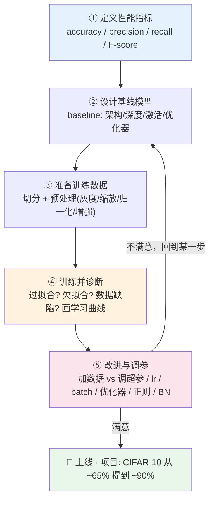

学完你能回答这些原书开篇抛出的"看似随意"的问题：

- 该从什么架构起步？该堆几层？每层多少个隐藏单元/滤波器？
- 学习率设多少？用哪个激活函数？
- **到底是"搞更多数据"更有效，还是"调超参数"更有效？**

一句话概括本章精髓：**先定标尺（指标），再搭骨架（基线），喂好料（数据），照 X 光（诊断），最后精雕（调参）。**

---

## 📊 4.1 定义性能指标（Defining Performance Metrics）

### 🔬 核心论证：为什么 accuracy 不够用？

**是什么。** 准确率（accuracy）衡量模型预测对了几次。测 100 个样本对了 90 个 → 90% 准确率。公式：

$$
\text{accuracy} = \frac{\text{correct predictions}}{\text{total number of examples}} = \frac{\text{预测正确的样本数}}{\text{样本总数}}
$$

**为什么它会骗人。** 原书举了一个杀伤力极强的例子：

> 你要为一种**罕见病**设计诊断系统，假设每一百万人才有一个患者。你**什么模型都不建**，直接硬编码输出"永远阴性（没病）"，你的系统准确率将高达 **99.999%**。

这听起来完美，但它**永远抓不到任何一个真正的病人**。这说明：**在类别极度不平衡（imbalanced）的问题里，accuracy 是个废指标。** 我们需要能从"不同角度"刻画模型能力的指标。

> ⚠️ **常见坑 · 不平衡数据的准确率陷阱**
> 只要你的正负样本比例悬殊（欺诈检测、罕见病、缺陷检测……），第一反应就该是：**别信 accuracy**。一个"全猜多数类"的傻瓜基线往往就有 99% 准确率。这时必须换 precision / recall / F-score。

### 🧩 4.1.2 混淆矩阵（Confusion Matrix）

要理解其他指标，先建一张**混淆矩阵**——一张描述分类模型表现的表。概念简单，但术语容易绕晕，一步步来。

假设建一个"病人是否生病"的分类器：**阳性 positive = 生病**，**阴性 negative = 健康**。跑 1000 个病人，原书表 4.1 的数据是：

|  | 预测为病（positive） | 预测为健康（negative） |
|---|---|---|
| **实际生病（positive）** | 100 → **TP** 真阳性 | 30 → **FN** 假阴性 |
| **实际健康（negative）** | 70 → **FP** 假阳性 | 800 → **TN** 真阴性 |

四个基本量（都是**整数**，不是比率）：

| 术语 | 英文 | 含义 | 别名 |
|---|---|---|---|
| **真阳性** | True Positive (TP) | 模型说"有病"且确实有病 ✅ | — |
| **真阴性** | True Negative (TN) | 模型说"没病"且确实没病 ✅ | — |
| **假阳性** | False Positive (FP) | 模型说"有病"但其实没病 ❌ | 第一类错误（Type I error） |
| **假阴性** | False Negative (FN) | 模型说"没病"但其实有病 ❌ | 第二类错误（Type II error） |

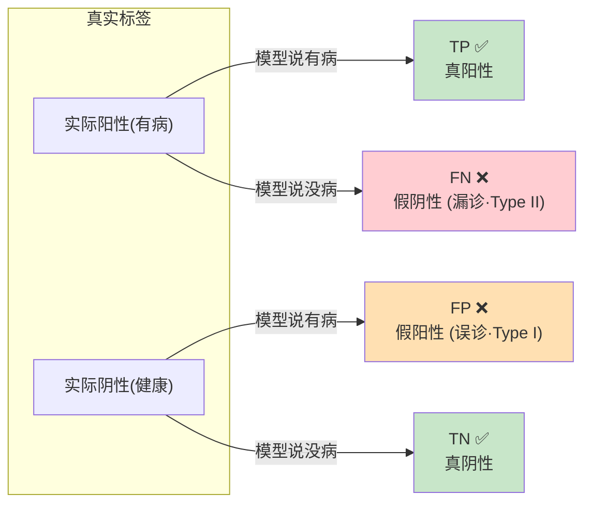

**哪种错误更致命？** 医疗诊断里：把健康人误诊为病人（FP）→ 送去多做检查，代价是钱和虚惊；把病人误判为健康（FN）→ 送回家，**代价是生命**。显然我们**更在乎 FN（漏诊）**。"想抓住所有病人，哪怕误伤几个健康人"——这个诉求对应的指标叫 **recall（召回率）**。

> 🔬 **核心论证 · 指标由"哪种错误更贵"决定**
> 这是全节最本质的一句话：**选指标之前，先问自己——FP 和 FN 哪个后果更严重？**
> - 若 **FP 更严重** → 用 **precision（精确率）**
> - 若 **FN 更严重** → 用 **recall（召回率）**
> 指标不是数学问题，是**业务价值判断**。

### 🎯 4.1.3 精确率与召回率（Precision & Recall）

**召回率 Recall（又叫 sensitivity 灵敏度）** ——在所有真正生病的人里，我抓回来了多少？关注"漏了多少病人（FN）"。

$$
\text{Recall} = \frac{TP}{TP + FN} = \frac{\text{真阳性}}{\text{真阳性} + \text{假阴性}}
$$

代入上表：$\text{Recall} = \dfrac{100}{100 + 30} = \dfrac{100}{130} \approx 76.9\%$。意思是 130 个真病人里抓回了约 77%。

**精确率 Precision（又叫 specificity）** ——在所有被我判为"有病"的人里，有多少真的有病？关注"误报了多少健康人（FP）"。

$$
\text{Precision} = \frac{TP}{TP + FP} = \frac{\text{真阳性}}{\text{真阳性} + \text{假阳性}}
$$

代入上表：$\text{Precision} = \dfrac{100}{100 + 70} = \dfrac{100}{170} \approx 58.8\%$。意思是我判"有病"的 170 人里，真有病的约 59%。

> 💡 **实战 · 两个记忆锚点**
> - **Recall 关心"分母里的真实阳性"**：真病人一共几个，我抓回几个。→ 反映"漏没漏"。
> - **Precision 关心"分母里的预测阳性"**：我喊"病"喊了几次，喊对几次。→ 反映"准不准"。
> 一句顺口溜：**召回怕漏（FN），精确怕误（FP）。**

**换个场景验证判断法：垃圾邮件分类器。** 两种错误：① 把正常邮件误判成垃圾（丢进垃圾箱 → 用户丢失重要邮件）；② 把垃圾邮件误判成正常（进收件箱 → 用户多删一封广告）。哪个更糟？**① 更糟**——绝不能让用户因为误判丢邮件。所以这里 **FP 更严重 → 选 precision**。

### ⚖️ 4.1.4 F-score：一个数概括两者

很多时候我们想用**一个数**同时概括 precision 和 recall。做法是取二者的**调和平均（harmonic mean）**，得到 **F-score**：

$$
\text{F-score} = \frac{2pr}{p + r} \qquad (p = \text{precision},\ r = \text{recall})
$$

> 🔬 **核心论证 · 为什么用调和平均而不是普通平均？**
> 调和平均对"较小值"更敏感——只要 precision 或 recall 有一个很低，F-score 就会被拉下来。这正好符合我们的诉求：**不允许你靠牺牲一个指标去刷高另一个**。
> 例：高召回模型为了不漏病人，把一大堆健康人也误诊成病人（precision 暴跌）。若用普通平均可能还看着不错，但 F-score 会立刻暴露这个问题。

原书对比两个分类器：

| 分类器 | Precision | Recall | F-score |
|---|---|---|---|
| **Classifier A** | 95% | 90% | **92.4%** |
| **Classifier B** | 98% | 85% | **91%** |

B 的 precision 更高，但 recall 拉胯，综合 F-score 反而输给更均衡的 A。**这就是 F-score 的价值：逼你看"两条腿是否一样长"。**

> 📌 **NOTE（原书强调）**：定义评估指标是**必经步骤**，因为它会指导你后续所有改进方向。没有清晰的指标，你根本分不清一次改动到底是**进步还是退步**。

---

## 🧱 4.2 设计基线模型（Designing a Baseline Model）

选好指标后，下一步是搭一个**端到端能跑通的最简系统**——基线（baseline）。基线的意义不是"最优"，而是"给你一个可以开始迭代的起点"。搭基线时你要回答一串问题：

- 用 MLP 还是 CNN（还是后面章节的 RNN）？
- 用 YOLO / SSD 这类目标检测技术吗（后续章节讲）？
- 网络要多深？用什么激活函数？用什么优化器？
- 要不要加 dropout / batch normalization 这类正则化层来防过拟合？

> 🔬 **核心论证 · 基线的第一性原理：站在巨人肩膀上**
> 原书给出黄金法则：**如果你的问题和某个已被充分研究的问题相似，先直接抄那个任务上表现最好的模型和算法。** 甚至可以拿一个在别的数据集上训练好的模型直接用到你的问题上（不用从头训）——这叫**迁移学习（transfer learning）**，第 6 章详讲。
> 深度学习是经验科学，**重新发明轮子的成本极高**。基线阶段最忌"我要原创一个架构"，正确姿势是"先复现 SOTA，再在它上面调"。

### 📐 以 AlexNet 为基线：读懂一个架构里的所有超参数

第 3 章的图像分类项目就是拿经典的 **AlexNet** 当基线。它的结构：

```
INPUT ⇒ CONV1 ⇒ POOL1 ⇒ CONV2 ⇒ POOL2 ⇒ CONV3 ⇒ CONV4 ⇒ CONV5
      ⇒ POOL3 ⇒ FC6 ⇒ FC7 ⇒ SOFTMAX_8
```

即：输入层 → 5 个卷积层（CONV1~CONV5）→ 第 5 卷积层输出喂给 2 个全连接层（FC6、FC7）→ 输出层 FC8（带 softmax）。

**盯着这一个架构，你就能读出自己起步需要的全部网络超参数：**

| 超参数类别 | AlexNet 的取值 |
|---|---|
| **网络深度**（层数） | 5 个卷积层 + 3 个全连接层 |
| **各层深度**（滤波器数） | CONV1=96, CONV2=256, CONV3=384, CONV4=384, CONV5=256 |
| **滤波器尺寸**（filter size） | 11×11, 5×5, 3×3, 3×3, 3×3 |
| **隐藏层激活函数** | ReLU（从 CONV1 一路到 FC7） |
| **池化** | CONV1、CONV2、CONV5 后接 Max pooling |
| **FC 层宽度** | FC6、FC7 各 4096 个神经元 |
| **输出层** | FC8 = 1000 神经元 + softmax |

> 💡 **实战 · 面试高频**："你怎么给一个新 CV 任务选起步架构？"
> 标准答案就是本节：**① 先判断任务类型和相似的已有问题；② 直接搬该领域的经典/SOTA 架构当基线（LeNet/AlexNet/VGG/ResNet/Inception，第 5 章详讲）；③ 跑起来，看指标，再逐个旋钮微调。** 强调"经验迭代"，别一上来就自创网络。

---

## 🧼 4.3 准备训练数据（Getting Your Data Ready）

> 原书大实话："真实世界里数据来的时候都是脏的（messy），根本不是能直接喂进网络的样子。"

好消息：**神经网络对预处理的需求比传统 ML 少**——给足数据，它能从原始数据里自己抽特征。但为了提性能、或迁就网络限制，仍需要一些基本的"数据按摩（data massaging）"。

### ✂️ 4.3.1 数据切分：训练/验证/测试（Train / Validation / Test）

**是什么。** 训练 ML 模型时，我们把数据切成几份，各司其职：

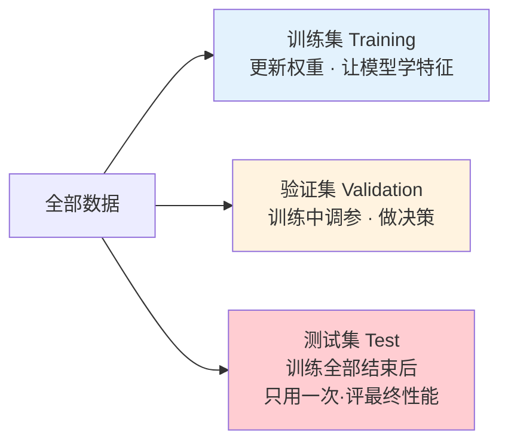

> 🔬 **核心论证 · 黄金法则：绝不用测试数据训练（never use the test data for training）**
> 为什么？为了防止模型"作弊"。训练时给它看训练样本去学特征，然后拿它**从没见过的**测试集去考它——这样才能得到对泛化能力的**无偏（unbiased）评估**。一旦测试集在训练中被"偷看"过，你测出来的分数就是虚高的自欺欺人。

**验证集是干嘛的？为什么不能直接拿测试集调参？**

训练时每个 epoch 后，我们都想看看模型准确率/误差如何、并据此调参。**但如果拿测试集来做这件事，就违反了黄金法则**（测试集在训练中被反复利用 = 变相偷看）。所以我们额外切一份**验证集（validation set）**，专门用于训练过程中的评估和调参；测试集则**雪藏到最后**，训练全部结束才拿出来用一次。

训练伪代码（原书）：

```text
for each epoch
    for each training data instance          # 遍历训练样本
        propagate error through the network  # 前向 + 反向传播误差
        adjust the weights                   # 更新权重
        calculate the accuracy and error over training data   # 算 train_acc / train_loss
    for each validation data instance        # 遍历验证样本
        calculate the accuracy and error over the validation data  # 算 val_acc / val_loss
```

于是每个 epoch 结束你会拿到四个数：`train_loss`、`train_acc`、`val_loss`、`val_acc`。**这四个数就是第 4.4 节诊断过拟合/欠拟合的全部依据。** 原书图 4.4 的真实训练日志片段：

```text
Epoch 1/100
Epoch 00000: val_loss improved from inf to 1.35820, saving model to model.weights.best.hdf5
46s - loss: 1.6192 - acc: 0.4140 - val_loss: 1.3582 - val_acc: 0.5166
Epoch 2/100
Epoch 00001: val_loss improved from 1.35820 to 1.22245, saving model to model.weights.best.hdf5
53s - loss: 1.2881 - acc: 0.5402 - val_loss: 1.2224 - val_acc: 0.5644
```

**切多大比例才合适？**

| 时代/数据量 | 传统小数据集 | 加验证集后 | 大数据时代 |
|---|---|---|---|
| **切分比例** | 80/20 或 70/30（训/测） | 60/20/20 或 70/15/15（训/验/测） | 验证、测试各 **1%** 就够 |

> 🔬 **核心论证 · 切分比例随数据量变化**
> 传统 80/20 是**几万条数据**时代的产物。现在若有 100 万条，验证/测试各留 1 万条（各 1%）就非常够——**没道理白白扣掉几十万条不用来训练**。留太多测试数据是浪费，那些数据拿去训练更值。
> **结论：小数据集用传统比例；大数据集验证/测试集可以设得很小。**

### 🧪 4.3.2 数据预处理（Data Preprocessing）

#### ⚠️ 头号原则：训/验/测必须同分布（same distribution）

原书用了一个刻骨铭心的翻车案例：

> 你做一个**手机上跑的车型识别器**。为了喂饱数据饥渴的网络，你去网上爬了一堆**高清、专业摆拍**的车图，训练、调参、在测试集上分数漂亮，兴冲冲上线——结果发现**在用户手机拍的真实照片上一塌糊涂**。

为什么？因为你的**训练/验证集是高清专业图，而生产环境（真实照片）是模糊、低分辨率、各种奇怪角度的图**。模型被训练成"专精高清图"，自然无法泛化到低质图。

> 🔬 **核心论证 · 同分布是泛化的前提**
> 训练集、验证集、测试集（乃至生产数据）**必须来自同一分布**。上面案例的解药是：**往训练/验证集里也掺进低质量图**，让训练分布贴近真实部署分布。
> 面试常问："线上效果和线下差很多，怎么排查？"——首查**训练/测试分布是否一致（数据漂移）**。

#### 🎨 四种常用图像预处理技术

| 技术 | 是什么 | 为什么/什么时候用 | 代价/注意 |
|---|---|---|---|
| **灰度化 Grayscaling** | 彩色 3 个矩阵 → 灰度 1 个矩阵 | 若问题不依赖颜色，转灰度**省算力**（参数少一大截）| 判断法：**人眼能在灰度图里认出目标 → 网络大概也能**（human-level 规则）|
| **缩放 Resizing** | 把所有图缩到统一尺寸 | 网络要求**所有输入图形状一致**（MLP 输入节点数 = 像素数；CNN 要设第一层 input_shape）| 例：32×32、28×28、64×64 混着的图必须先统一 |
| **归一化 Normalization** | 每个像素减均值、除标准差，rescale 到相近分布 | **加速收敛**、让网络学得更快 | 训练/测试**必须用同一套均值和标准差**！|
| **数据增强 Augmentation** | 翻转/旋转/缩放…生成新样本 | 防过拟合（见 4.8.3）| 后面正则化小节详讲 |

CNN 第一层设定输入形状的 Keras 代码（原书）：

```python
model.add(Conv2D(filters=16, kernel_size=2, padding='same',
                 activation='relu', input_shape=(32, 32, 3)))
#                                    ↑ 必须在第一个卷积层定义图像形状 (宽,高,通道)
```

#### 📉 归一化为什么能加速收敛？（重点难点）

**做法：** 每个像素 $x$ 变成 $\dfrac{x - \mu}{\sigma}$（减均值 → 零中心化；除标准差 → 统一尺度）。变换后数据分布像一条**以 0 为中心的高斯曲线**。理想目标：**值小（多数落在 [0,1]）+ 同质（所有像素同范围）**。


> 🔬 **核心论证 · 为什么不归一化会让梯度下降"来回震荡"？**
> 想象只有两个特征 F1、F2 的代价函数 $J$：
> - **非归一化**：各特征取值范围差别大 → 代价函数等高线是一个**又扁又长的碗（elongated bowl）**。同一个学习率在不同维度上造成的修正量**比例失衡**，逼得 GD 在陡的方向来回**震荡（oscillate）**，沿着"之"字形慢慢挪下山，收敛极慢。
> - **归一化后**：等高线变**对称**（近似正圆碗），GD **一条直线冲向最小值**，快速到达。
>
> 这就是原书图 4.6 的核心：**归一化让误差曲面变"圆"，梯度方向直指谷底。**

> 💡 **实战提示（原书 TIP）**：归一化训练集和测试集时，**务必用同一个均值和标准差**——因为你要让训练/测试数据经历**完全相同的变换**，rescale 方式必须一致。（用训练集统计量去归一化测试集，绝不能各算各的。）

---

## 🩺 4.4 评估模型 · 诊断性能（Evaluating & Interpreting Performance）

基线搭好、数据处理完，训练跑完后，你要当医生：**找瓶颈、诊断哪个部件表现差、判断病因是过拟合、欠拟合还是数据缺陷。**

> 神经网络常被批评为"黑箱（black box）"——即使效果很好也难解释为什么好。本节教你怎么给这个黑箱照 X 光。

### 🔍 4.4.1 诊断过拟合与欠拟合（Overfitting vs. Underfitting）

ML 表现差的**头号病因**就两个：过拟合或欠拟合。

| | **欠拟合 Underfitting** | **过拟合 Overfitting** |
|---|---|---|
| **本质** | 模型**太简单**，连训练数据都学不会 | 模型**太复杂**，把训练数据**背下来了**而非学规律 |
| **训练集表现** | 差 ❌ | 极好 ✅（甚至完美）|
| **新数据表现** | 差 ❌ | 差 ❌（无法泛化）|
| **几何直觉** | 一条直线分不开数据（如单个感知机分两类形状）| 曲线扭曲地穿过每个点，硬把训练数据全分对 |

> 💡 **实战 · 原书神比喻（学生备考）**
> - **欠拟合**：学生根本没好好学，考试挂科。
> - **过拟合**：学生把课本**背得滚瓜烂熟**，问书里的题全对，一问书外的题就傻眼——**没学会举一反三（failed to generalize）**。
> - **刚刚好（just right）**：学生真正理解了课本，遇到相关新题也能答。
> 我们要的正是第三种。

**用两个误差诊断（最实用的判据）：** 盯住 **训练误差 train_error** 和 **验证误差 val_error**。

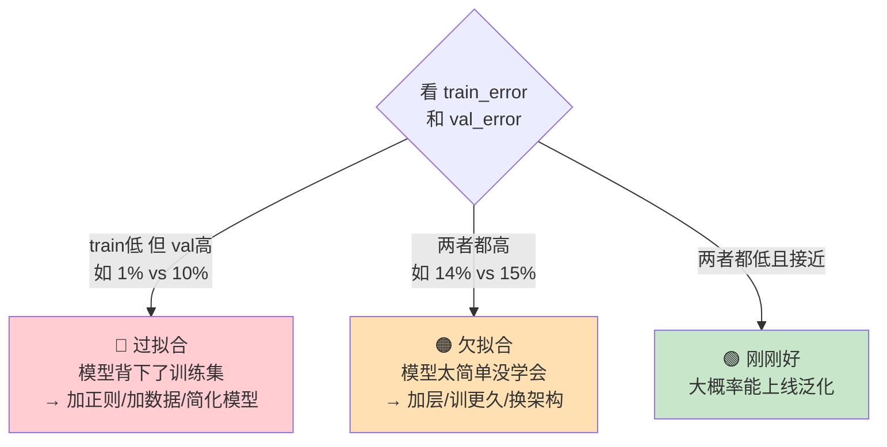

- **过拟合信号**：`train_error=1%` 但 `val_error=10%` → 背下了训练集、泛化不了 → **调超参防过拟合，反复训-测-评直到满意**。
- **欠拟合信号**：`train_error=14%` 且 `val_error=15%` → 太简单没学会 → **加隐藏层 / 训更多 epoch / 换架构**。

### 📈 4.4.2 画学习曲线（Learning Curves）

比起盯着日志里的一串数字，更直观的诊断法是**把训练误差和验证误差随 epoch 的变化画成曲线**。原书图 4.10 给出三种典型形态：

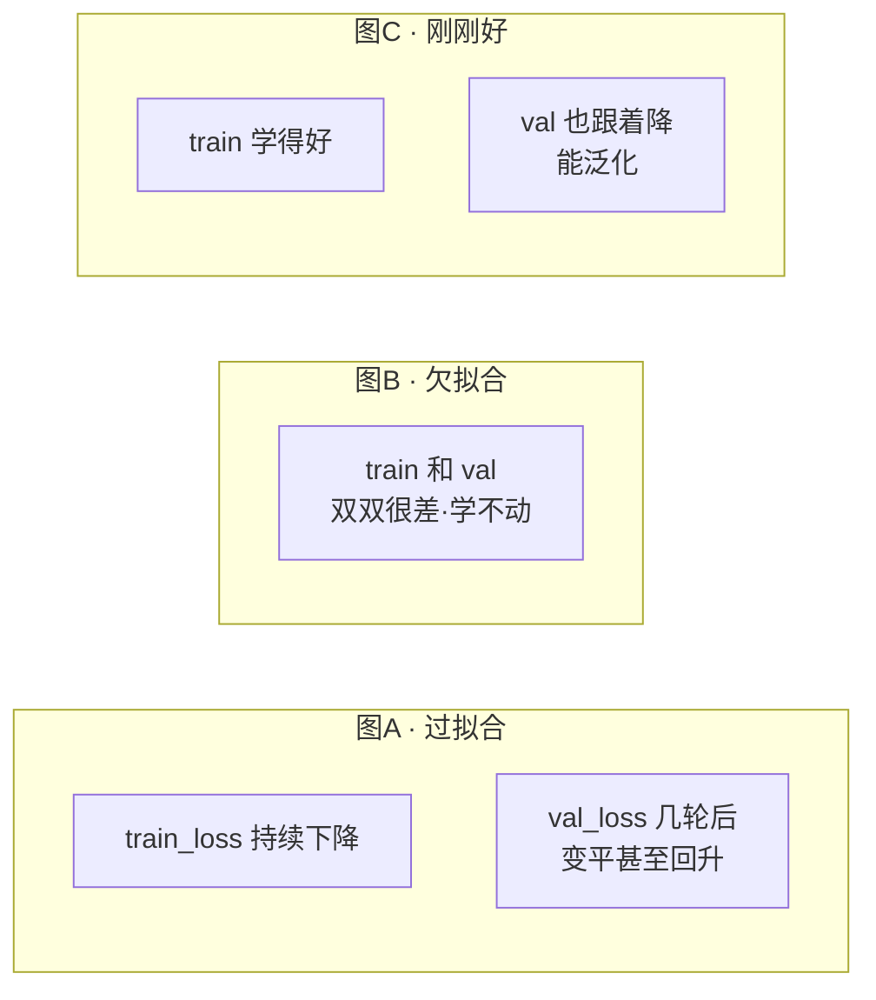

| 曲线形态 | 诊断 | **正确的下一步（很关键别搞反）** |
|---|---|---|
| **A**：train 一直降，val 几轮后走平/回升 | 过拟合 | ⚠️ **别加隐藏单元、别加复杂度！** 网络已经太复杂在背数据了。应该：**收集更多数据 或 用防过拟合技术（正则、dropout、增强）** |
| **B**：train 和 val 都很差 | 欠拟合 | **别加数据**（网络连现有数据都没学会）。应该：**搭更复杂的模型** |
| **C**：train 学得好、val 跟着降 | 刚刚好 | 大概率能在真实测试数据上表现好 🎉 |

> ⚠️ **常见坑 · 过拟合时千万别再加大模型**
> 新手看到效果不好的本能反应是"加层加单元"。但如果是**过拟合**，这么做只会火上浇油。**过拟合的解法是往"简化/更多数据/正则化"方向走，不是往"更复杂"走。** 诊断清病因再开药。

#### 🎚️ 用"人类水平"定贝叶斯误差率（Bayes Error Rate）

**问题：** 我怎么知道当前的误差算好还是坏？总得有个现实的**参照基线**。0% 误差固然理想，但对很多问题**不现实甚至不可能**。

**贝叶斯误差率（Bayes error rate）** = 理论上模型能达到的最优误差。因为人类视觉很强，常拿**人类水平（human-level performance）当贝叶斯误差的代理**：

| 任务 | 人类误差（≈贝叶斯误差） | 模型 95% 准确率的评价 |
|---|---|---|
| 猫狗分类（对人很简单） | ~0.5% | **不满意**，可能欠拟合（离人类差太远）|
| 放射科医学影像分类（对人也难） | ~5% | **表现很好**（已经接近人类极限）|

> 🔬 **核心论证 · 同样是 95%，好坏由"任务难度"决定**
> 脱离任务谈准确率毫无意义。**必须拿人类水平/贝叶斯误差当尺子**，才能判断模型是"还差得远"还是"已经很棒"。（当然 DL 也能超越人类，这只是划基线的方法。原书强调这些百分比都是举例用的任意数字。）

### 🧑‍💻 4.4.3 练习：建-训-评一个网络

原书用一个玩具例子跑通完整流程（配套 notebook 见 manning / computervisionbook 官网）：**造玩具数据 → 80/20 切分 → 搭 MLP → 训练 → 评估 → 可视化**。

```python
# 1. 导入依赖
from sklearn.datasets import make_blobs   # sklearn 造样本数据
from keras.utils import to_categorical    # 把类别向量转 one-hot
from keras.models import Sequential
from keras.layers import Dense
from matplotlib import pyplot

# 2. 用 make_blobs 造 2 特征、3 类的玩具数据
X, y = make_blobs(n_samples=1000, centers=3, n_features=2,
                  cluster_std=2, random_state=2)

# 3. one-hot 编码标签
y = to_categorical(y)

# 4. 切 80% 训练 / 20% 测试（本例为简化没建验证集）
n_train = 800
train_X, test_X = X[:n_train, :], X[n_train:, :]
train_y, test_y = y[:n_train], y[n_train:]
print(train_X.shape, test_X.shape)   # >> (800, 2) (200, 2)

# 5. 搭一个极简两层 MLP
model = Sequential()
model.add(Dense(25, input_dim=2, activation='relu'))   # 2 输入维(2特征), 隐藏层 ReLU
model.add(Dense(3, activation='softmax'))              # 输出层 3 节点(3类), softmax
model.compile(loss='categorical_crossentropy',        # 交叉熵损失(第2章)
              optimizer='adam', metrics=['accuracy'])  # adam 优化器(下一节讲)
model.summary()

# 6. 训练 1000 个 epoch
history = model.fit(train_X, train_y,
                    validation_data=(test_X, test_y),
                    epochs=1000, verbose=1)

# 7. 评估
_, train_acc = model.evaluate(train_X, train_y)
_, test_acc  = model.evaluate(test_X, test_y)
print('Train: %.3f, Test: %.3f' % (train_acc, test_acc))
# >> Train: 0.825, Test: 0.819

# 8. 画准确率学习曲线
pyplot.plot(history.history['accuracy'], label='train')
pyplot.plot(history.history['val_accuracy'], label='test')
pyplot.legend(); pyplot.show()
```

**逐点解读结果（Train 0.825 / Test 0.819）：**
- train 和 test 曲线**行为相似、贴合** → **没有过拟合**（过拟合会表现为 train 好 test 差）。
- 但会不会**欠拟合**？很可能——这么简单的数据只有 **82% 准确率算差**。
- **改进方向**：搭更复杂的网络、尝试其它防欠拟合手段。

> 💡 这个练习完整演示了本章 4.1→4.4 的方法论闭环：**切分 → 搭建 → 训练 → 评估 → 画曲线 → 诊断（此处诊断为欠拟合）→ 定改进方向**。

---

## 🔧 4.5 改进网络与调参（Improving & Tuning Hyperparameters）

诊断完，你要做一个战略决策：**时间该花在"调网络"、"清洗/处理数据"，还是"收集更多数据"上？** 最怕的是埋头一个方向搞几个月，最后发现根本没提升多少。

### 🤔 4.5.1 收集更多数据 vs. 调超参数

新手的本能是"效果不好？加数据！"。但：**收集和标注数据不总是可行，可能极贵，还可能没用。**

> 📝 **NOTE（原书）· 标注的隐藏成本**
> 目前大多数标注仍是**人工**逐张看图打标签（叫 human in the loop）。而且成本天差地别：给猫狗打标签雇普通人就行；给**肺部 X 光标注肿瘤**却需要**合格的医生**，贵得多。所以"加数据"有时能解决问题、增强鲁棒性，但**不总是可行**。

原书给出一套**决策流程**：

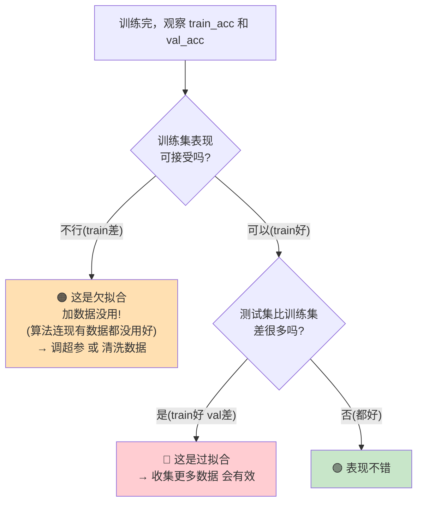

> 🔬 **核心论证 · 加数据只对"过拟合"有用，对"欠拟合"无用**
> - **训练集就很差（欠拟合）** → 学习算法连手头数据都没用好，**再加数据是浪费**，应该调超参/清数据。
> - **训练集好但测试集差（过拟合）** → 泛化不了，**这时加数据才有效**。
>
> 原书 TIP：评估时先给问题**归类**——**是"数据问题"就去搞数据预处理/加数据；是"学习算法问题"就去调网络。**

### 🎛️ 4.5.2 参数 vs. 超参数（Parameters vs. Hyperparameters）

别把这俩搞混——**这是面试必考的基本功。**

| | **参数 Parameters** | **超参数 Hyperparameters** |
|---|---|---|
| **谁来定** | **网络自己**在训练中学出来，我们不手动碰 | **工程师**在训练前设定，然后手动调 |
| **例子** | 权重 weights、偏置 biases | 学习率、批大小、epoch 数、隐藏层数… |
| **怎么更新** | 反向传播自动优化到最小误差 | 靠人（或搜索算法）"旋钮" |

> 💡 **一句话记牢**：**参数是网络学的（weights/biases），超参数是人调的（lr/batch/layers…）。**

### 🎚️ 4.5.3 神经网络超参数全景

> 🔬 **核心论证 · 没有魔法数字（No Free Lunch）**
> 调参最大的难点是**没有对所有问题都有效的万能值**——这就是第 1 章的 **"没有免费午餐定理（no free lunch theorem）"**：好的超参数取决于**具体数据集和任务**。所以要调好参，你必须**理解每个超参数在做什么**，才知道该往哪拧。

原书把超参数比作**黑箱（神经网络）上的旋钮**，我们的工作就是拧到最佳性能：

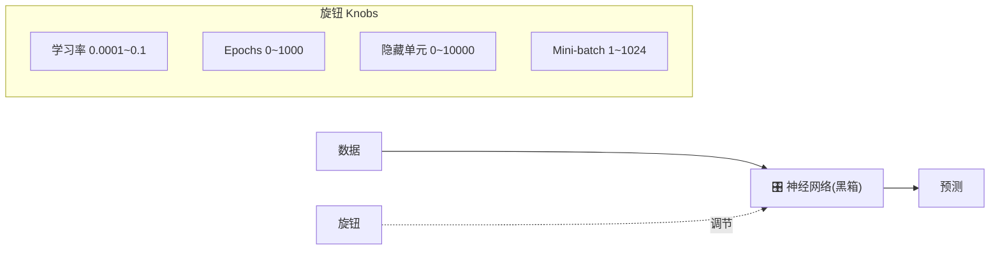

**三大类超参数（本章骨架）：**

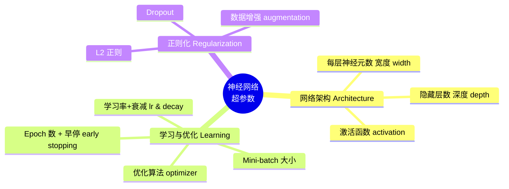

### 🏛️ 4.5.4 网络架构类超参数

#### 深度与宽度（Depth & Width）

- **深度 depth** = 隐藏层数；**宽度 width** = 每层神经元/隐藏单元数。
- 二者共同决定网络的**学习容量（learning capacity）**。目标：**设得足够大以学会数据特征**。太小 → 欠拟合；太大 → 可能过拟合。
- **数据越复杂，需要的学习容量越大**（原书图 4.13）：

| 数据集复杂度 | 所需容量 |
|---|---|
| 很简单 | 单个感知机就能分开 |
| 中等 | 加几个神经元 |
| 复杂 | 需要大量神经元 |

> 🔬 **核心论证 · "宽一点"比"窄一点"更安全**
> 原书给了一条实用经验：**不断加隐藏神经元，直到验证误差不再改善为止。** 权衡在于：更深的网络**训练更贵（算力）**。
> 关键洞见：**单元太少容易欠拟合；单元偏多通常无害——只要配上恰当的正则化（如 dropout）。** 所以宁可"稍微大一点 + 加正则"，也别一开始就抠得太小。
> 👉 想练直觉？去 **TensorFlow Playground**（playground.tensorflow.org）玩，逐步加层加单元，看网络学习行为怎么变。

#### 激活类型（Activation Type）

- 激活函数给神经元引入**非线性**。没有它，神经元之间只是线性组合（加权和）互传，**解不了任何非线性问题**。
- 这是极活跃的研究领域（几周就冒出新激活）。但截至原书写作时的经验：
  - **隐藏层**：**ReLU 及其变体（如 Leaky ReLU）表现最好**。
  - **输出层（分类）**：常用 **softmax**，神经元数 = 类别数。

#### 💰 层数、参数量与算力的权衡（重点难点）

> 🔬 **核心论证 · 神经元越多 = 参数越多 = 算力/内存越贵**
> 考虑架构时要**用"参数量"的视角思考**：网络里神经元越多，要优化的参数就越多，计算复杂度越高（第 3 章教过 `model.summary()` 打印总参数量）。

如果你的硬件（算力/内存）扛不住参数量，有两招**降参**：

1. **减深度和宽度**（砍隐藏层/隐藏单元）→ 直接减参数、降复杂度。
2. **加池化层 / 调卷积层的 stride 和 padding** → 缩小特征图尺寸 → 降参数。

> ⚠️ **常见坑 · OOM（内存溢出）**
> 复杂网络 → 大量训练参数 → 高算力和高内存需求。真实项目里你会频繁在"模型容量"和"硬件预算"之间做权衡（本章项目里作者就因 batch_size=256 撞上 OOM，见 4.10）。

---

## ⚙️ 4.6 学习与优化（Learning and Optimization）

架构搭好，接下来是决定**网络怎么学、怎么优化参数逼近最小误差**的超参数。

### 🎯 4.6.1 学习率与衰减（Learning Rate & Decay）· 头号超参数

> **"学习率是最重要的单个超参数，一定要确保它被调过。如果只有时间调一个超参数，那就调它。"** —— Yoshua Bengio（原书引用）

**是什么。** 梯度下降（GD）在误差曲面上找让误差最低的权重。**学习率 lr = 每一步下山的步长**，代表优化器沿误差曲线下降的快慢。把只有一个权重的代价函数画出来，就是一条 **U 形碗曲线**，权重随机初始化在曲线某处，GD 算梯度找到"减小误差的方向"（导数），每个 epoch 往下迈一步。

**四种学习率情形（原书图 4.15~4.18 的核心）：**

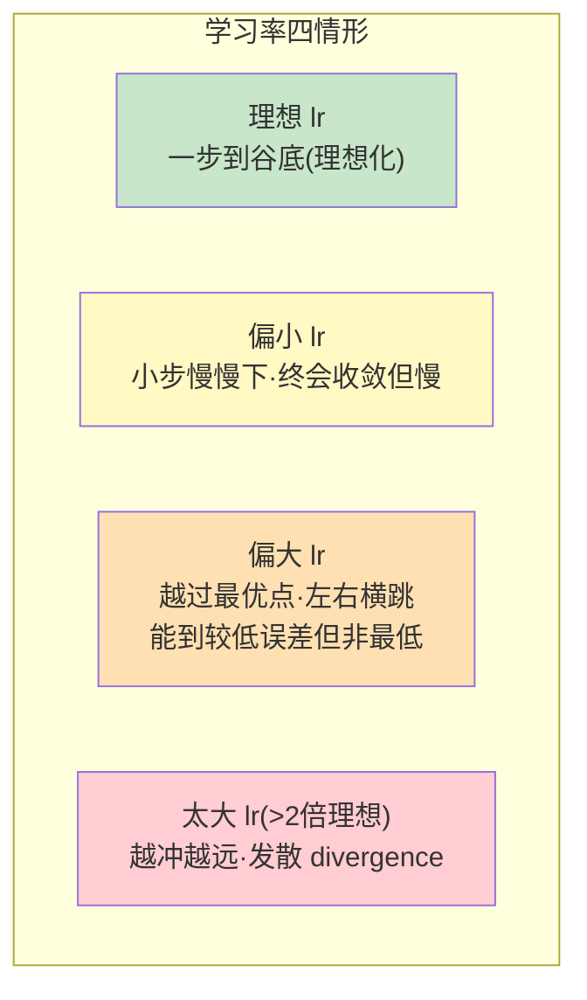

| lr 大小 | 行为 | 结果 |
|---|---|---|
| **理想** | 一步落到最优权重 | 理论理想值（现实中不可能一步到位）|
| **偏小** | 小步小步下山 | 终会收敛，但**慢**（太小则慢到无法接受，理论上跑无穷久必收敛）|
| **偏大** | 越过最优、在两侧反复过冲 | 可能收敛到一个还行的值，但**不是最低误差** |
| **太大（>2 倍理想）** | 离最小值越来越远 | **发散 divergence** ❌ |

> 🔬 **核心论证 · 学习率是"速度 vs 性能"的权衡**
> - **太低**：要很多很多 epoch 才收敛（常常太多）。理论上只要跑无穷久必然收敛。
> - **太高**：一开始可能因大步而更快降到较低误差，但**极可能震荡、发散离开最小值**。
> - **理想**：又快又不发散地冲到谷底。
> 这就是为什么 Bengio 说它是最该调的旋钮——**它同时决定"能不能收敛"和"多快收敛"**。

### 🔎 4.6.2 系统化寻找最优学习率

最优 lr 依赖你的**损失曲面地形**，而地形又由**模型架构 + 数据集**共同决定。实操套路：

1. **先用优化器默认 lr**（Keras/TF/PyTorch 各优化器都有默认值，查文档）——通常就有不错结果。
2. 若训练不好，用**经典候选值**逐个试：`0.1, 0.01, 0.001, 0.0001, 0.00001, 0.000001`。
3. **看 val_loss 调试**：

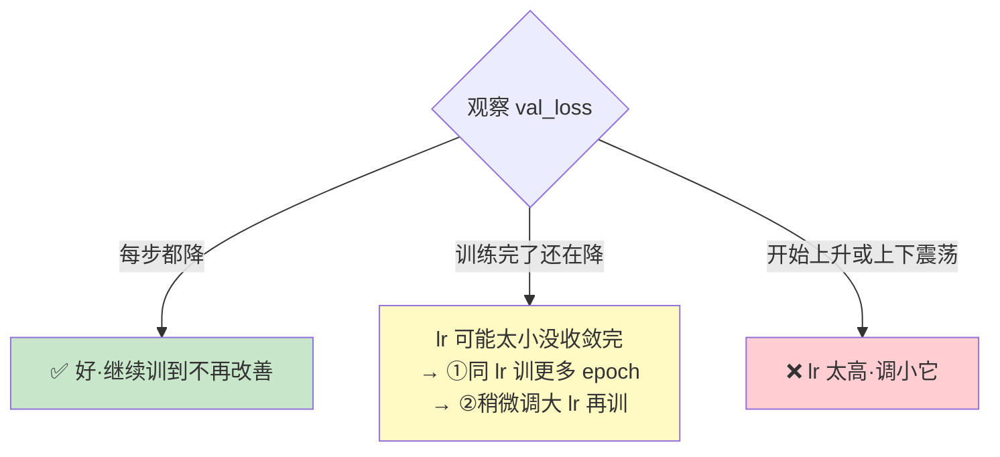

把 loss 对 epoch 画出来，四条曲线对应四种 lr（原书图）：

| 曲线 | 含义 |
|---|---|
| **Much smaller lr** | loss 一直降，但要**很久**才收敛 |
| **Larger lr** | loss 比初始好，但**离最优还远** |
| **Much larger lr** | 先降后升（权重越跑越偏）|
| **Good lr** | loss **持续下降**直到最低可能值 ✅ |

### 📉 4.6.3 学习率衰减与自适应学习（Decay & Adaptive）

固定 lr 要"设值→训完→评估→再调"，很折腾。更聪明的做法是**让 lr 在训练中变化**——往往效果更好、大幅缩短找最优的时间。

**核心思路（第一性原理）：** 一开始用**大 lr 迈大步**快速逼近谷底，之后**逐渐减小 lr** 以免在谷底附近过冲。

| 策略 | 做法 | 特点 |
|---|---|---|
| **线性衰减 Linear decay** | 每 5 个 epoch 把 lr 减半（图 4.19）| 降得较快 |
| **指数衰减 Exponential decay** | 每 8 个 epoch 把 lr 乘 0.1（图 4.20）| 收敛更慢，但终会收敛 |
| **自适应学习 Adaptive** | 启发式**自动**调 lr：进步太慢时还能**调大** lr | 通常比其它策略更好，如 **Adam、Adagrad** |

> 💡 **实战**：自适应优化器（Adam/Adagrad）不仅在需要时**减小** lr，还能在改善太慢（lr 太小）时**增大** lr。这也是 Adam 好用的原因之一（4.7.2 详讲）。

### 📦 4.6.4 Mini-batch 大小（批大小）

`batch_size` 强烈影响**训练的资源需求和速度**。回顾第 2 章的三种 GD：

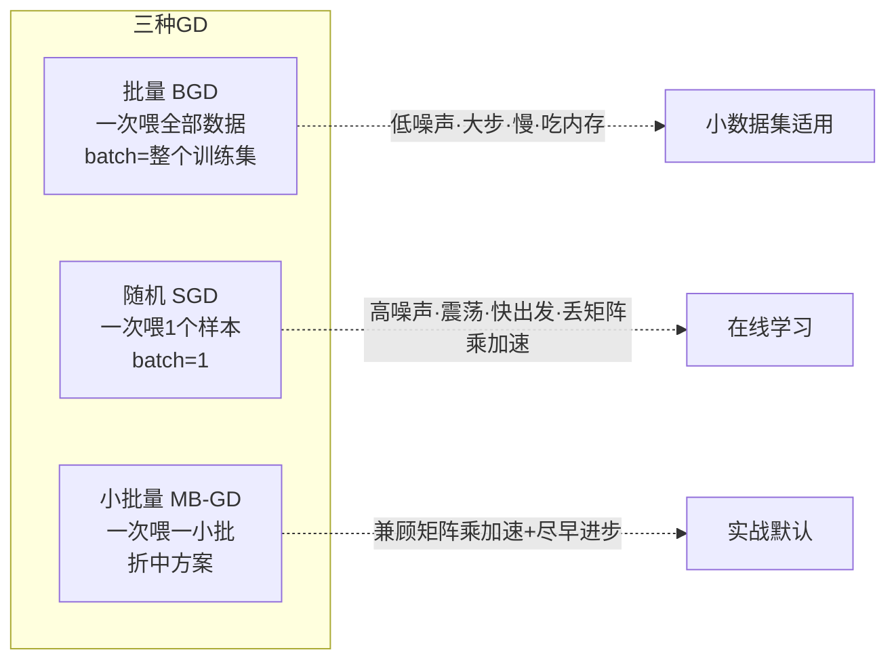

| GD 类型 | 每次用多少数据 | 更新权重时机 | 优点 | 缺点 |
|---|---|---|---|---|
| **批量 BGD** | 整个训练集 | 每个 epoch 更新**一次** | 噪声低、迈向最小值的步子大、稳 | **慢**、**吃巨量内存**（大数据不可行）|
| **随机 SGD**（在线学习）| 单个样本 | 每看**一个样本**就更新 | 出发快、常比 BGD 更接近全局最小 | **噪声极大、来回震荡**、**丢掉矩阵乘法的加速** |
| **小批量 MB-GD** | 一小批（mini-batch）| 每批更新一次 | **兼得**：既享矩阵乘加速，又能尽早开始进步 | 需调 batch 大小 |

> 🔬 **核心论证 · 为什么 SGD 噪声大却常常更好？**
> SGD 每个样本更新一次，方向有时会走错，所以在通往全局最小的路上**剧烈震荡**。但这种噪声**可以用较小的学习率来抑制**——平均下来它仍朝好方向走，且**几乎总比 BGD 表现好、进步更快**。代价是逐样本计算丢掉了矩阵乘法带来的速度红利。MB-GD 正是"两个极端之间"的甜点。

**选 batch 大小的准则（原书）：**

- **小数据集（< 2000）**：直接用 **BGD**，整集训练也很快。
- **大数据集**：从 **64 或 128** 起步，按 `32, 64, 128, 256, 512, 1024` 这个尺度上下调，需要提速就**翻倍**。
- **前提：batch 必须塞得进 CPU/GPU 内存**。1024 及以上可行但少见。

> 🔬 **核心论证 · batch 大小的三方权衡**
> 原书那张关键关系图的意思：
> - **batch 越大** → 每个 epoch 的**算力/内存消耗越高**，但因为用上了矩阵乘法，**收敛所需 epoch 数越少**、每步更稳。
> - **batch 越小（趋近 SGD）** → 单步便宜，但**需要更多 epoch**、噪声大。
> 一句话：**大 batch 用"更多算力/内存"换"更少 epoch"；小 batch 反之。** 找到你硬件能承受的最大 batch，通常就是好选择。

---

## 🚀 4.7 优化算法（Optimization Algorithms）

历史上研究者提出过很多优化算法，但大多**不能很好泛化**到各种网络。最终社区达成共识：**GD 及其若干变体最稳。** 前面讲了 batch/stochastic/mini-batch GD，本节讲两个真正跨架构好用的加强版：**Momentum（动量）** 和 **Adam**。

> 📝 想深挖优化器，原书推荐 Sebastian Ruder 的综述《An overview of gradient descent optimization algorithms》(arxiv 1609.04747)。

### 🏂 4.7.1 带动量的梯度下降（Momentum）

**问题：** SGD 在通往最小值的路上会在**垂直方向反复震荡**（图 4.23），这既拖慢收敛，又让你不敢用大 lr（否则过冲发散）。

**动量的解法：** 让 GD 在**相关方向（水平·朝目标）走得更快**，在**无关方向（垂直·震荡）走得更慢**，从而更快抵达谷底。

> 🔬 **核心论证 · 物理直觉：滚雪球**
> 雪球滚下山会**积累动量（momentum）**，越滚越快。同理，动量项对"梯度方向一致的维度"**累积增大更新**，对"梯度方向来回变的维度"**削减更新**——于是一致的方向加速、震荡的方向被抹平，收敛更快、震荡更少。

**数学（原书"How the math works"框，很简单）：** 在权重更新式里加一个**速度项（velocity term）**：

$$
w_{new} = w_{old} - \alpha \frac{\partial E}{\partial w_i} + \text{velocity term}
$$

即：**新权重 = 旧权重 − 学习率 × 梯度 + 速度项**，而**速度项 = 过去梯度的加权平均**。这就是"记住之前走过的方向"的数学表达。

### 🎈 4.7.2 Adam（自适应矩估计）

**Adam = Adaptive Moment Estimation。** 它像动量一样保留**过去梯度的指数衰减平均**。

> 🔬 **核心论证 · 物理直觉升级：带摩擦的重球**
> 动量像"滚下坡的球"；**Adam 像一个带摩擦的重球**——摩擦力**减缓并控制动量**，不让它冲过头。Adam 通常**优于其它优化器**，因为它能让网络训练**快得多**。

**超参数（好消息：默认值通常就够用）：**

```python
keras.optimizers.Adam(lr=0.001, beta_1=0.9, beta_2=0.999, epsilon=None, decay=0.0)
```

| 超参数 | 含义 | 推荐值 |
|---|---|---|
| `lr` 学习率 | **唯一真正需要你调的**（它不是 Adam 专属参数）| 需自己调 |
| `beta_1` (β₁) | 动量项 | 0.9 |
| `beta_2` (β₂) | RMSprop 项 | 0.999 |
| `epsilon` (ε) | 防除零 | $10^{-8}$ |

> 💡 **面试高频**："SGD、Momentum、Adam 怎么选？"
> - **SGD**：通常也能找到最小值，简单、泛化有时更好。
> - **需要**快速收敛、训练复杂网络 → **稳妥选 Adam**。
> - Momentum 是理解 Adam 的踏板（Adam ≈ 动量 + 自适应学习率）。
> - **Adam 的 β₁/β₂/ε 用默认就行，重点仍是调 lr。**

### ⏱️ 4.7.3 Epoch 数

**一个 epoch = 模型完整过一遍整个训练集。** epoch 越多，模型学到的训练数据特征越多。**判断该加还是该减 epoch：盯住 train_error 和 val_error。**

原书用连续日志演示：

```text
# 前 5 个 epoch（图4.24）—— 训练/验证误差都在降，网络在学，别停！
Epoch 1, Training Error: 5.4353, Validation Error: 5.6394
Epoch 2, Training Error: 5.1364, Validation Error: 5.2216
Epoch 3, Training Error: 4.7343, Validation Error: 4.8337

# 第 6~8 个 epoch（图4.25）—— train 还在降，但 val 从第8个 epoch 起开始震荡/上升！
Epoch 6, Training Error: 3.7312, Validation Error: 3.8324
Epoch 7, Training Error: 3.5324, Validation Error: 3.7215
Epoch 8, Training Error: 3.7343, Validation Error: 3.8337   # ← val 反弹 = 开始过拟合
```

> 🔬 **核心论证 · "train 降但 val 升" = 过拟合的起点**
> 直觉判据：**只要误差还在降，就继续训**。但当 **train_error 还在改善、val_error 却停止改善甚至上升**时，网络就开始**背训练集、丢泛化**了（原书图 4.26 的"模型复杂度图"：欠拟合区 → just right → 过拟合区）。我们需要在"刚要过拟合前"停下——这就是**早停**。

### 🛑 4.7.4 早停（Early Stopping）

**早停** = 监控验证误差，一旦它开始上升就停训，防止过拟合。Keras 接口：

```python
EarlyStopping(monitor='val_loss', min_delta=0, patience=20)
```

| 参数 | 含义 | 怎么设 |
|---|---|---|
| `monitor` | 监控哪个指标 | 通常盯 **val_loss**（它代表内部"模拟测试"，val 好 → test/生产大概也好）|
| `min_delta` | 多大的改善才算"改善" | 无标准值；先跑几个 epoch 看误差变化率来定。**默认 0 在很多情况下就很好用** |
| `patience` | 误差不改善后**再等几个 epoch 才停** | 设 1 = 误差一升就停（太急）；实际误差常小幅震荡后继续改善，所以**通常等 10~20 个 epoch 没改善才停** |

> 💡 **实战 · 早停的最大好处**
> 有了早停，你**几乎不用纠结 epoch 该设多少**——把 epoch 设一个很大的数，让早停算法在"误差停止改善时"自动叫停即可。省心又防过拟合。

---

## 🧯 4.8 正则化技术：防过拟合（Regularization）

一旦诊断出**过拟合**，说明网络太复杂、需要简化。首选武器就是正则化。本节讲三种最常用的：**L2、Dropout、数据增强。**

### ⚖️ 4.8.1 L2 正则化（又叫权重衰减 Weight Decay）

**核心思想：给误差函数加一个惩罚项**，从而**把隐藏单元的权重值压小、逼近零**，简化模型。

$$
\text{error function}_{new} = \text{error function}_{old} + \text{regularization term}
$$

其中 L2 正则项（可配任意误差函数，如 MSE 或交叉熵）：

$$
\text{L2 regularization term} = \frac{\lambda}{2m} \sum w^2
\quad\Rightarrow\quad
\text{error}_{new} = \text{error}_{old} + \frac{\lambda}{2m} \sum w^2
$$

- $\lambda$（lambda）= **正则化参数**（可调超参数）；$m$ = 样本数；$w$ = 权重。

> 🔬 **核心论证 · L2 为什么能减过拟合？（一步步推）**
> 回顾反向传播权重更新式：
> $$W_{new} = W_{old} - \alpha \frac{\partial \text{Error}}{\partial W_x}$$
> 现在往误差里**加了正则项**，于是：
> 1. 新误差 > 旧误差 → 其导数 $\dfrac{\partial \text{Error}}{\partial W_x}$ 也**更大**；
> 2. 减去的这一项更大 → 得到**更小的 $W_{new}$**。
> 所以 L2 **迫使权重朝零"衰减"（但不会精确等于零）**——这正是它别名"**weight decay 权重衰减**"的由来。
> **权重变小 → 神经元影响力被削弱 → 网络等效变简单 → 过拟合减轻。** 若某权重被压到几乎为零，就相当于**注销了这个神经元**，网络神经元更少、更简单。

Keras 里加 L2：

```python
model.add(Dense(units=16, kernel_regularizer=regularizers.l2(λ), activation='relu'))
#                          ↑ 加隐藏层时带上 kernel_regularizer 参数即可
```

> 💡 `λ` 是可调超参数，默认值通常好用；**若仍见过拟合，调大 λ** 以进一步降低模型复杂度（但 λ 过大会让权重可忽略、网络学不到东西）。

### 🎲 4.8.2 Dropout 层

**算法极简：每次训练迭代，每个神经元都有概率 $p$ 被临时"丢弃"（drop out）**——这一轮不参与，下一轮可能又活过来。虽然"故意暂停部分神经元的学习"很反直觉，但**出奇地有效**。丢弃概率 $p$ 叫 **dropout rate**，典型范围 **0.3~0.5**；**从 0.3 起步，若见过拟合就调大**。

> 💡 **实战 · 原书神比喻（掷硬币分工）**
> 想象每天早上你和团队掷硬币决定"谁来做某个关键任务"。几轮下来，**所有成员都学会了这个任务，团队不再依赖某一个人**——整个团队对人员变动**更有韧性**。Dropout 就是逼网络别过度依赖某几个神经元，从而更鲁棒。

**L2 vs. Dropout（都在减复杂度，但方式不同）：**

| | **L2 正则** | **Dropout** |
|---|---|---|
| 减复杂度的方式 | **压小**权重值 → 削弱神经元影响 | 每轮**彻底注销**部分神经元 |
| 结果 | 更鲁棒、抗过拟合 | 更鲁棒、抗过拟合 |
| 原书建议 | **两者一起用** ✅ | **两者一起用** ✅ |

### 🔄 4.8.3 数据增强（Data Augmentation）

**思想：** 拿不到更多真实数据时，就对现有图做**变换**生成新样本——一种**廉价**的"造数据"防过拟合手段。常见变换：**翻转、旋转、缩放、缩放变焦、改光照**等。原书图 4.27 对数字"6"做了 20 种变换，凭空造出 20 倍数据。

> 🔬 **核心论证 · 为什么增强算正则化？**
> 让网络见到同一物体的大量变体（翻转的 6、旋转的 6 仍是 6），**降低了它对物体"原始形态"的依赖**，逼它学更本质的特征。这使网络在新数据上**更有韧性**——本质上和正则化一样是在"抑制对训练集细节的死记硬背"。

Keras 数据增强：

```python
from keras.preprocessing.image import ImageDataGenerator     # 导入增强器
datagen = ImageDataGenerator(horizontal_flip=True, vertical_flip=True)  # 水平/垂直翻转
datagen.fit(training_set)     # 在训练集上计算增强
```

---

## 🧪 4.9 批归一化（Batch Normalization, BN）

前面 4.3 讲的归一化是**对输入层**做的预处理。BN 的灵魂拷问是：**既然输入层归一化有好处，那隐藏层里那些"时刻在变"的抽取特征，为什么不也归一化一下？** 这就是 BN——**把归一化用到隐藏层的激活值上**。

### 🌊 4.9.1 协变量偏移问题（Covariate Shift）

**先看例子：** 你训练一个**猫分类器**，但训练集**全是白猫**。拿去测别的颜色的猫时——表现拉胯。为什么？**因为模型是在"白猫"这个特定分布上训练的，测试集分布一变（各色猫），模型就懵了。**

> **DEFINITION（原书）· 协变量偏移**：若模型在学"把数据集 X 映射到标签 y"，当 **X 的分布发生变化**时，就叫**协变量偏移（covariate shift）**。这时你可能得**重新训练**模型。

### 🔀 4.9.2 神经网络内部的协变量偏移

考虑一个 4 层 MLP，**站在第 3 层（L3）的视角**看：它的输入是 L2 的激活值 $(a_1^2, a_2^2, a_3^2, a_4^2)$。

> 🔬 **核心论证 · 隐藏层遭受的"内部协变量偏移"**
> L3 正努力把 L2 的输出映射到 $\hat{y}$ 去逼近标签 $y$。但**与此同时，前面各层（L1、L2）的参数 (w, b) 也在被训练更新**——L1 参数一变，L2 的激活值就跟着变。**于是从 L3 的视角看，它的输入（L2 激活值）一直在飘移**——这就是网络内部的协变量偏移。
> BN 的作用：**减小隐藏单元值分布的变化程度，让这些值更稳定，使后面的层站在更坚实的地基上学习。**

> 📝 **NOTE（原书精辟）**：BN **并不取消或减少**隐藏单元值的变化，它保证的是**这些变化的"分布形状"保持不变**——即使具体值在变，**均值和方差不变**。

### 🧮 4.9.3 BN 怎么工作（数学三步）

Ioffe & Szegedy 2015 年论文《Batch Normalization: Accelerating Deep Network Training by Reducing Internal Covariate Shift》(arxiv 1502.03167) 提出 BN。它在**每层激活函数之前**插入一个操作：**① 零中心化 → ② 归一化 → ③ 缩放和平移**。


**① 计算 mini-batch 均值与方差**（"batch"之名正来自这里——统计量是在当前小批上算的）：

$$
\mu_B \leftarrow \frac{1}{m}\sum_{i=1}^{m} x_i
\qquad
\sigma_B^2 \leftarrow \frac{1}{m}\sum_{i=1}^{m} (x_i - \mu_B)^2
$$

**② 归一化输入**（$\varepsilon$ 是防除零的小数，典型 $10^{-5}$，以防某些估计里 $\sigma$ 为零）：

$$
\hat{x}_i \leftarrow \frac{x_i - \mu_B}{\sqrt{\sigma_B^2 + \varepsilon}}
$$

**③ 缩放和平移**（乘 $\gamma$ 缩放、加 $\beta$ 平移）：

$$
y_i \leftarrow \gamma \hat{x}_i + \beta
$$

> 🔬 **核心论证 · γ 和 β 是"可学习"参数**
> BN 引入了两个**新的可学习参数** $\gamma$（缩放）和 $\beta$（平移）——优化器会像更新权重、偏置一样更新它们。这一步让模型**自己学出每层输入的最优尺度和均值**（而不是被硬性钉死在标准正态）。
> 实践含义：训练**一开始可能偏慢**（GD 在为每层搜索合适的 γ、β），一旦找到不错的值就会**加速**。

### 💻 4.9.4 Keras 里加 BN（一行的事）

理解原理是为了看懂代码在做什么；实际用 BN **加一行即可**——在隐藏层后插一个 BN 层，先归一化再喂给下一层。

```python
from keras.models import Sequential
from keras.layers import Dense, Dropout
from keras.layers.normalization import BatchNormalization   # 导入 BN 层

model = Sequential()
model.add(Dense(hidden_units, activation='relu'))   # 第一隐藏层
model.add(BatchNormalization())                     # 归一化第1层的结果
model.add(Dropout(0.5))                             # ← dropout 放在 BN 之后!
model.add(Dense(units, activation='relu'))          # 第二隐藏层
model.add(BatchNormalization())                     # 归一化第2层的结果
model.add(Dense(2, activation='softmax'))           # 输出层
```

> ⚠️ **常见坑 · Dropout 要放在 BN 之后**
> 原书特意注释：**若同时用 dropout，最好放在 BN 层之后**——否则被 dropout 随机关掉的节点会**错过归一化步骤**。顺序：`Dense → BatchNorm → Dropout`。

### 📋 4.9.5 BN 直觉小结

> 🔬 **核心论证 · BN 的本质：解耦各层的学习**
> BN 把归一化不只用在输入层，也用在**隐藏层的值**上。这**削弱了前后层学习过程之间的耦合**——从后层视角看，前层不能再"到处乱飘"了，因为它们被约束成**相同的均值和方差**。于是**后层的学习变得更容易**（地基稳了）。实现方式就是靠 $\gamma$、$\beta$ 这两个可学习参数，让隐藏单元维持一个**标准化的分布**。

---

## 🏆 4.10 项目：把图像分类准确率从 ~65% 提到 ~90%

本节回到第 3 章的 **CIFAR-10** 分类项目，用本章学的所有改进技术，把准确率从 **~65% 拉到 ~90%**。完整流程：


**相比第 3 章基线，这个项目叠加了本章的四板斧：**
1. **更深的网络**（6 卷积 + 1 全连接，第 3 章是 3 卷积 + 2 全连接）→ 增加学习容量。
2. **Dropout 层**。
3. **给卷积层加 L2 正则**。
4. **每个卷积层后加 BN**。

### 数据准备（Step 2）

```python
(x_train, y_train), (x_test, y_test) = cifar10.load_data()   # Keras 自带 CIFAR-10
x_train = x_train.astype('float32'); x_test = x_test.astype('float32')
(x_train, x_valid) = x_train[5000:], x_train[:5000]   # 从训练集切出 5000 张做验证
(y_train, y_valid) = y_train[5000:], y_train[:5000]
# >> x_train=(45000,32,32,3)  x_valid=(5000,32,32,3)  x_test=(10000,32,32,3)

# 归一化：减均值除标准差（+1e-7 防除零），训练/验证/测试用同一套 mean/std!
mean = np.mean(x_train, axis=(0,1,2,3)); std = np.std(x_train, axis=(0,1,2,3))
x_train = (x_train-mean)/(std+1e-7)
x_valid = (x_valid-mean)/(std+1e-7)
x_test  = (x_test-mean)/(std+1e-7)

# one-hot 编码标签
num_classes = 10
y_train = np_utils.to_categorical(y_train, num_classes)
y_valid = np_utils.to_categorical(y_valid, num_classes)
y_test  = np_utils.to_categorical(y_test, num_classes)

# 数据增强：旋转/平移/水平翻转
datagen = ImageDataGenerator(rotation_range=15, width_shift_range=0.1,
                             height_shift_range=0.1,
                             horizontal_flip=True, vertical_flip=False)
datagen.fit(x_train)
```

> 💡 **实战 · 怎么选增强类型？** 原书方法论：**去看网络分错/检测差的那些图，理解它为什么错，据此提假设再实验。** 例如漏掉的多是旋转过的形状 → 就试 `rotation` 增强 → 应用、评估、迭代。**决策完全来自"分析你的数据 + 理解网络表现"，不是拍脑袋。**

### 架构（Step 3）· 灵感来自 VGGNet

```python
base_hidden_units = 32       # 隐藏单元基数，集中在一处方便改
weight_decay = 1e-4          # L2 正则超参数 λ
model = Sequential()

# CONV1 —— 第一层要写 input_shape
model.add(Conv2D(base_hidden_units, kernel_size=3, padding='same',
                 kernel_regularizer=regularizers.l2(weight_decay),   # 加 L2
                 input_shape=x_train.shape[1:]))
model.add(Activation('relu'))                                        # ReLU
model.add(BatchNormalization())                                     # BN
# CONV2
model.add(Conv2D(base_hidden_units, kernel_size=3, padding='same',
                 kernel_regularizer=regularizers.l2(weight_decay)))
model.add(Activation('relu')); model.add(BatchNormalization())
# POOL + Dropout（每两个卷积层后才池化一次——VGG 风格）
model.add(MaxPooling2D(pool_size=(2,2))); model.add(Dropout(0.2))

# CONV3、CONV4（单元翻倍=64）... POOL + Dropout(0.3)
# CONV5、CONV6（单元再翻倍=128）... POOL + Dropout(0.4)
# ...（结构对称，逐段加深、dropout 率从 0.2→0.3→0.4 递增）

model.add(Flatten())                            # 展平成 1D 向量
model.add(Dense(10, activation='softmax'))      # 10 类 + softmax
model.summary()
```

**架构设计要点（原书）：**
- **每两个卷积层后才池化一次**（灵感来自 **VGGNet**，牛津 Visual Geometry Group，第 5 章详讲）。
- 卷积核 **3×3**、池化 **2×2**（VGG 风格）。
- **隔一个卷积层加 dropout**，率从 **0.2 递增到 0.4**。
- **每个卷积层后加 BN**。
- 用 `base_hidden_units` 变量集中控制宽度（32→64→128 逐段翻倍）。

### 训练（Step 4）· 超参数策略

```python
batch_size = 128    # 从 64 起步可翻倍提速；作者试 256 撞 OOM 退回 128
epochs = 125        # 从 50 起步发现还在improving，加到 125 达 >90%
checkpointer = ModelCheckpoint(filepath='model.100epochs.hdf5',
                               verbose=1, save_best_only=True)  # 只存最优权重
optimizer = keras.optimizers.adam(lr=0.0001, decay=1e-6)       # Adam + 小 lr + 衰减
model.compile(loss='categorical_crossentropy', optimizer=optimizer,
              metrics=['accuracy'])
history = model.fit_generator(
    datagen.flow(x_train, y_train, batch_size=batch_size),     # 实时数据增强
    callbacks=[checkpointer],
    steps_per_epoch=x_train.shape[0] // batch_size,
    epochs=epochs, verbose=2, validation_data=(x_valid, y_valid))
```

> ⚠️ **常见坑 · OOM（真实翻车记录）**
> 作者本想用 `batch_size=256`，结果报错：
> ```
> Resource exhausted: OOM when allocating tensor with shape[256,128,4,4]
> ```
> 意思是**显存/内存不够**——这正是 4.5.4 讲的"参数量 × batch 大小 → 内存需求"的现实后果。作者退回 **128** 才跑通。**batch 一定要塞得进你的显存。**
>
> 📝 **NOTE**：作者用 **GPU** 训了约 **3 小时**。没 GPU 的话，减少 epoch 数、或让机器训一整晚甚至几天。

### 评估（Step 5）

```python
scores = model.evaluate(x_test, y_test, batch_size=128, verbose=1)
print('\nTest result: %.3f loss: %.3f' % (scores[1]*100, scores[0]))
# >> Test result: 90.260 loss: 0.398   ✅ 从 ~65% 提到 90.26%!

pyplot.plot(history.history['acc'], label='train')
pyplot.plot(history.history['val_acc'], label='test')
pyplot.legend(); pyplot.show()
```

从末尾几个 epoch 的日志（图 4.32）可见 val_loss 一路优化到 0.40 附近、val_acc 到 ~0.896，**train 和 test 曲线贴合 → 没有严重过拟合**。

### 🚧 还能怎么继续提升？（原书给的下一步）

| 方向 | 做法 | 预期 |
|---|---|---|
| **更多 epoch** | 网络到 epoch 123 还在改善 → 加到 150/200 | 继续榨性能 |
| **更深网络** | 加层增加复杂度/学习容量 | ↑ |
| **更低学习率** | 调小 lr（同时要训更久）| 更精细收敛 |
| **换更强架构** | 试 **Inception / ResNet**（第 5 章）| ResNet 训 200 epoch 可达 **~95%** |
| **迁移学习** | 用预训练网络（第 6 章）| 用零头的时间拿到更高分 |

---

## 📌 本章小结（Summary）

原书结尾的**几条黄金经验法则**，也是本章最该背下的结论：

> - **一般规律：网络越深，学得越好。**（当然要配合正则化防过拟合。）
> - **激活函数：截至写作时，隐藏层用 ReLU 最好，输出层用 softmax 最好。**
> - **优化器：SGD 通常能找到最小值；但若要快速收敛、训练复杂网络，稳妥选 Adam。**
> - **训练时长：通常训得越久越好**（配合早停防过拟合）。
> - **L2 正则和 dropout 搭配使用，能有效降低网络复杂度和过拟合。**

把整章串成一句话工作流：

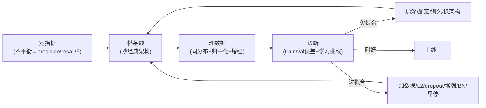

**一张对照表把"病因 → 症状 → 药方"钉死：**

| 病因 | 症状（看两个误差）| 药方 |
|---|---|---|
| **欠拟合** | train 差、val 也差（都高）| 加层/加单元、训更多 epoch、换更强架构、清洗数据；**加数据无用** |
| **过拟合** | train 好、val 差（差距大）| **收集更多数据**、L2、dropout、数据增强、BN、早停、简化模型 |
| **数据缺陷** | 线上远差于线下 | 查**训/测是否同分布**（协变量偏移）、重训、加真实分布样本 |

---

## 🔗 延伸阅读

- **《Deep Learning for Vision Systems》第 5 章**：LeNet / AlexNet / VGG / ResNet / Inception——本章反复提到"抄经典架构当基线"，第 5 章就把这些经典逐一讲透并给 Keras 实现。
- **《Deep Learning for Vision Systems》第 6 章**：迁移学习（transfer learning）——本章多次说"拿预训练网络能用零头时间拿更高分"，第 6 章是正片。
- **Sebastian Ruder,《An overview of gradient descent optimization algorithms》**（arxiv 1609.04747）——SGD/Momentum/Adagrad/RMSprop/Adam 优化器全景综述，原书推荐深挖优化器的入口。
- **Ioffe & Szegedy,《Batch Normalization: Accelerating Deep Network Training by Reducing Internal Covariate Shift》**（arxiv 1502.03167）——BN 原始论文。
- **TensorFlow Playground**（playground.tensorflow.org）——交互式调深度/宽度/激活/学习率，肉眼建立超参数直觉，本章 4.5.4 强烈推荐。
- **面试自测清单**：① accuracy 何时失效、precision/recall/F-score 怎么选？② 参数 vs 超参数？③ 过拟合/欠拟合的诊断判据与相反的解法？④ 归一化为什么加速收敛（等高线视角）？⑤ BGD/SGD/MB-GD 权衡？⑥ SGD/Momentum/Adam 怎么选？⑦ L2 为什么等于 weight decay？⑧ BN 解决什么问题、γ/β 是什么、dropout 为什么放 BN 之后？

> 🎓 **一句话收尾**：深度学习不是"找到完美公式"，而是"**建立一套可迭代的诊断-改进循环**"。本章给你的正是这套循环——把每一次实验都变成有方向的一步，而不是碰运气。
