# 第 5 章 高级 CNN 架构（Advanced CNN Architectures）🏛️

> 对应原书（Mohamed Elgendy《Deep Learning for Vision Systems》）第 5 章，PDF 第 216–260 页。
> 本章把前面学的"卷积层 / 池化层 / 全连接层"这些**积木**，拼装成五座计算机视觉史上的**里程碑建筑**：LeNet → AlexNet → VGGNet → Inception/GoogLeNet → ResNet。

---

## 🗺️ 本章地图

在第 3、4 章里，你学会了 CNN 的基本组件（卷积、池化、全连接）和调参技巧（学习率、优化器、正则化、Dropout、数据增强）。本章要回答的核心问题是：

> **这些积木到底该怎么摆？摆几层？每层多少个滤波器？什么时候插池化？** 🤔

作者 Elgendy 选了 5 个**在各自时代都是 SOTA（state of the art，业界最强）**的经典网络，让你顺着**设计者的思路**走一遍。每个网络都按同一套框架讲：

1. **新特性（Novel features）**——它解决了前一个网络的什么痛点？
2. **网络架构（Architecture）**——组件怎么串成端到端的网络？
3. **代码实现（Keras）**——学会"读论文 → 写代码"这项核心技能。
4. **学习超参数（Hyperparameters）**——照着原论文设置优化器 / 学习率 / 权重衰减。
5. **性能（Performance）**——在 MNIST / ImageNet 等基准上表现如何。

本章的路线图（也是一部 CNN 进化史）：

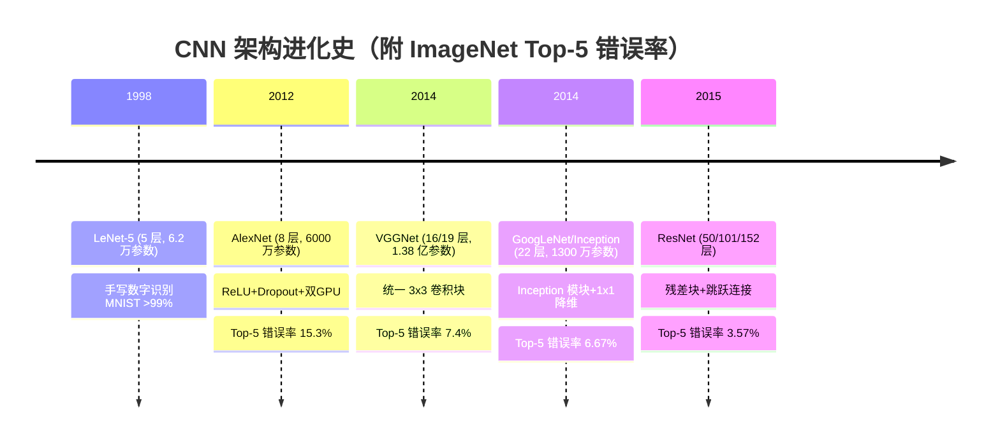

一句话串起五座建筑：

| 网络 | 一句话主张 | 解决的痛点 |
|---|---|---|
| **LeNet** | "卷积+池化+全连接就能识别数字" | 开山：证明 CNN 可行 |
| **AlexNet** | "把网络加深加宽，用 ReLU 训得快" | 更复杂的任务（1000 类 ImageNet） |
| **VGGNet** | "全用 3×3 卷积，架构统一好懂" | AlexNet 超参数太杂乱难调 |
| **Inception** | "别纠结用哪个滤波器，全都用上！" | 手工挑 kernel size / 池化位置太累 |
| **ResNet** | "加一条捷径，让梯度直接流回去" | 太深的网络梯度消失、越深越差 |

> 💡 **实战 / 面试高频**：这张表几乎是每一场 CV / 深度学习面试的必考题。能把"每个网络解决了前一个的什么问题"这条**因果链**讲清楚，比背参数量更能体现你的理解深度。

---

## 🔬 5.1 CNN 设计模式（Design Patterns）

在钻进具体架构之前，先记住三条前辈总结出来的**通用设计模式**。它们能帮你把"无穷多的选择"收敛到几条主线上——**从别人结束的地方开始，而不是从零瞎试**。

### 模式 1：特征提取 + 分类（两段式结构）

几乎**所有** ConvNet（从 1998 的 LeNet 到最新的 Inception、ResNet）都是这两段拼起来的：

- **特征提取部分（feature extraction）**：一串**卷积层**，负责从像素里逐层抽取特征（边缘 → 纹理 → 部件 → 物体）。
- **分类部分（classification）**：一串**全连接层（FC）**+ softmax，负责把特征映射成类别概率。

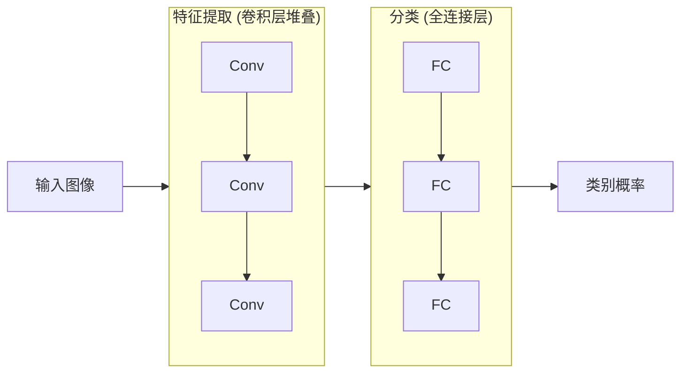

### 模式 2：深度（depth）增大，尺寸（H×W）减小

这里的"深度"指的是**通道数 / 特征图数量**（不是网络层数），要小心区分：

- 输入是彩色图 → 深度 = 3（R、G、B 三个颜色通道）；灰度图 → 深度 = 1。
- **越往深层走**，图像的空间尺寸（H×W）被池化/大步长卷积**不断缩小**，但深度（特征图数）**不断增大**。比如 AlexNet 第一层输出深度就变成了 96——这 96 个"通道"不再是颜色，而是 96 张**特征图（feature maps）**，每张响应一种模式。

一句口诀记住：**空间越走越小，语义越走越厚。** 📐

$$
\underbrace{224\times224\times3}_{\text{输入}} \;\longrightarrow\; \underbrace{55\times55\times96}_{\text{CONV1}} \;\longrightarrow\; \underbrace{27\times27\times256}_{\text{CONV2}} \;\longrightarrow\; \cdots
$$

> 🔬 **第一性原理**：为什么"尺寸减小、深度增大"是合理的？因为**任务在做信息压缩**。输入的原始像素信息量大但冗余（相邻像素高度相关）；随着层数加深，网络把这些冗余像素压缩成**少量、抽象、判别力强**的语义特征。空间维度承载"在哪"，通道维度承载"是什么"——任务从"在哪"逐渐转向"是什么"，所以空间收缩、通道扩张。

### 模式 3：全连接层的单元数（相对宽松）

经验规律：一个网络里所有全连接层的隐藏单元数，要么**都相同**，要么**逐层递减**——很少见到递增的。研究发现"保持单元数恒定"并不伤害性能，所以想省心的话，挑一个数字用到底就行。

> ⚠️ **常见坑**：模式 3 不是硬规则，别当铁律。它更像"减少调参分支"的启发式。真正决定性能的是模式 1、2 和后面每个架构的核心创新。

---

## 📮 5.2 LeNet-5（1998，开山鼻祖）

1998 年 Yann LeCun 等人提出 LeNet-5，用来识别**手写字符**（支票、邮编）。论文标题《Gradient-Based Learning Applied to Document Recognition》。

> 📖 **术语：为什么叫 LeNet-"5"？**
> "5" 指的是 **5 个权重层（weight layers）**：3 个卷积层 + 2 个全连接层。
> **权重层**特指含**可训练权重**的层（卷积层、全连接层）。池化层不含权重，所以**不计入**层数。业界习惯用权重层数来描述网络"深度"，因为它反映了模型的**计算复杂度**。照这个规则，AlexNet 就是 8 层（5 卷积 + 3 全连接）。

### 5.2.1 LeNet 架构

用文字表示这条数据流水线：

```
输入图像 ⇒ C1 ⇒ TANH ⇒ S2 ⇒ C3 ⇒ TANH ⇒ S4 ⇒ C5 ⇒ TANH ⇒ FC6 ⇒ SOFTMAX7
```

其中 C = 卷积层（Convolution），S = 下采样/池化层（Subsampling），FC = 全连接层。

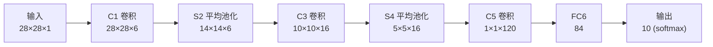

逐层拆解（照论文第 6–8 页）：

| 层 | 类型 | 滤波器数(深度) | kernel | 输出尺寸 |
|---|---|---|---|---|
| C1 | 卷积 | 6 | 5×5 | 28×28×6 |
| S2 | 平均池化 | — | 2×2, s=2 | 14×14×6 |
| C3 | 卷积 | 16 | 5×5 | 10×10×16 |
| S4 | 平均池化 | — | 2×2, s=2 | 5×5×16 |
| C5 | 卷积 | 120 | 5×5 | 1×1×120 |
| FC6 | 全连接 | 84 | — | 84 |
| 输出 | 全连接+softmax | 10 | — | 10 |

三个必须记住的**设计要点**：

1. **每层滤波器数**：C1=6，C3=16，C5=120（模式 2：深度逐层增大）。
2. **卷积核尺寸**：一律 **5×5**。
3. **池化用的是平均池化（Average Pooling）**——注意！LeNet 用的是**求平均值**，而不是我们现在常用的**最大池化（Max Pooling，取最大值）**。
4. **激活函数用 tanh**——1998 年 ReLU 还没被引入深度学习，当时流行 tanh/sigmoid。作者选 tanh 是因为**对称函数被认为收敛更快**。

### 5.2.2 LeNet-5 的 Keras 实现（逐行讲解）

```python
from keras.models import Sequential                                 # 导入序贯模型
from keras.layers import Conv2D, AveragePooling2D, Flatten, Dense   # 导入各种层

model = Sequential()     # 实例化一个空的序贯模型（一层叠一层）

# C1 卷积层：6 个 5×5 滤波器，步长 1，tanh 激活，padding='same' 保持尺寸不变
model.add(Conv2D(filters=6, kernel_size=5, strides=1, activation='tanh',
                 input_shape=(28,28,1), padding='same'))

# S2 池化层：平均池化，2×2 窗口，步长 2 → 尺寸减半
model.add(AveragePooling2D(pool_size=2, strides=2, padding='valid'))

# C3 卷积层：16 个 5×5 滤波器，padding='valid'（不补零，尺寸缩小）
model.add(Conv2D(filters=16, kernel_size=5, strides=1, activation='tanh',
                 padding='valid'))

# S4 池化层
model.add(AveragePooling2D(pool_size=2, strides=2, padding='valid'))

# C5 卷积层：120 个 5×5 滤波器（此时空间尺寸恰好被卷成 1×1）
model.add(Conv2D(filters=120, kernel_size=5, strides=1, activation='tanh',
                 padding='valid'))

model.add(Flatten())        # 把 (1,1,120) 展平成 120 维向量，喂给全连接层

# FC6 全连接层：84 个神经元
model.add(Dense(units=84, activation='tanh'))

# FC7 输出层：10 个神经元 + softmax（对应 10 个数字类别）
model.add(Dense(units=10, activation='softmax'))

model.summary()     # 打印每层输出形状和参数量
```

`model.summary()` 会告诉你 LeNet-5 总共只有 **61,706 个参数**（对比后面动辄上千万甚至上亿的网络，简直是"迷你网络"）。

各层参数量（来自原书 figure 5.5）：

| 层 | 输出形状 | 参数量 |
|---|---|---|
| conv2d_1 (C1) | (None, 28, 28, 6) | 156 |
| average_pooling2d_1 (S2) | (None, 14, 14, 6) | 0 |
| conv2d_2 (C3) | (None, 10, 10, 16) | 2,416 |
| average_pooling2d_2 (S4) | (None, 5, 5, 16) | 0 |
| conv2d_3 (C5) | (None, 1, 1, 120) | 48,120 |
| flatten_1 | (None, 120) | 0 |
| dense_1 (FC6) | (None, 84) | 10,164 |
| dense_2 (输出) | (None, 10) | 850 |
| **合计** | | **61,706** |

> 💡 **实战**：动手验证 C1 的参数量：6 个滤波器 × (5×5 输入通道 1 + 1 偏置) = 6 × 26 = **156** ✅。这个"手算参数量"是面试白板题的常客。公式：`参数 = 滤波器数 × (kernel_h × kernel_w × 输入通道 + 1)`。

### 5.2.3 学习超参数

LeCun 团队用了**分段衰减学习率（scheduled decay）**，训练 20 个 epoch：

```python
def lr_schedule(epoch):
    if epoch <= 2:                 # 前 2 个 epoch
        lr = 5e-4
    elif epoch > 2 and epoch <= 5: # 第 3~5 个 epoch
        lr = 2e-4
    elif epoch > 5 and epoch <= 9: # 第 6~9 个 epoch
        lr = 5e-5
    else:                          # 第 10 个 epoch 之后
        lr = 1e-5
    return lr
```

优化器用普通 **SGD**，损失用交叉熵：

```python
from keras.callbacks import ModelCheckpoint, LearningRateScheduler
lr_scheduler = LearningRateScheduler(lr_schedule)
checkpoint = ModelCheckpoint(filepath='path_to_save_file/file.hdf5',
                             monitor='val_acc', verbose=1, save_best_only=True)
callbacks = [checkpoint, lr_scheduler]
model.compile(loss='categorical_crossentropy', optimizer='sgd', metrics=['accuracy'])

hist = model.fit(X_train, y_train, batch_size=32, epochs=20,
                 validation_data=(X_test, y_test), callbacks=callbacks,
                 verbose=2, shuffle=True)
```

### 5.2.4 LeNet 在 MNIST 上的性能

训练后能达到 **99% 以上准确率**。MNIST 太简单（灰度图、10 类），这也正是 LeNet 的"天花板"——它在真正复杂的彩色多类任务上力不从心，这就引出了 AlexNet。

> 💡 **实战小练习**：书里建议把 tanh 换成 ReLU 重跑一遍，观察差异。你会发现 ReLU 训得更快、往往更准——这也预告了 AlexNet 的第一个杀手锏。

---

## 🚀 5.3 AlexNet（2012，深度学习的引爆点）

MNIST 太简单了。AlexNet 的核心动机是：**造一个更深的网络，去学更复杂的函数**，直面 ImageNet 这种"1000 类、120 万张高清图"的硬骨头。

**AlexNet（Krizhevsky、Sutskever、Hinton，2012）是 ILSVRC 2012 图像分类冠军**，也是第一个真正意义上的"深"网络。它一举把 CV 社区的注意力拉到了卷积网络上——可以说，**现代深度学习浪潮就是从这里被引爆的。** 🎆

和 LeNet 相比：同样的积木（卷积+池化+全连接+softmax），但**更深**（更多隐藏层）、**更宽**（每层更多滤波器）：

| | LeNet | AlexNet |
|---|---|---|
| 权重层数 | 5 | **8**（5 卷积 + 3 全连接） |
| 参数量 | 约 6.1 万 | **约 6000 万**（准确 62,383,848） |
| 神经元数 | — | 约 65 万 |
| 激活函数 | tanh | **ReLU** |
| 数据集 | MNIST（灰度、10 类） | ImageNet（彩色、1000 类） |

> 📚 **ImageNet 与 ILSVRC 是什么？**
> **ImageNet** 是一个超大规模视觉数据库，按 WordNet 词义层级组织，每个词义叫一个 **synset（同义词集）**，目标是每个 synset 有 1000+ 张图。目前有超过 **1400 万**张人工标注图（用亚马逊 Mechanical Turk 众包标注）。
> **ILSVRC**（ImageNet Large Scale Visual Recognition Challenge）是它每年办的软件竞赛，程序比拼谁分类/检测得准。本章就拿 ILSVRC 成绩当**统一标尺**来对比各网络。

### 5.3.1 AlexNet 架构

文字流水线：

```
输入图像 ⇒ CONV1 ⇒ POOL2 ⇒ CONV3 ⇒ POOL4 ⇒ CONV5 ⇒ CONV6 ⇒ CONV7 ⇒ POOL8 ⇒ FC9 ⇒ FC10 ⇒ SOFTMAX
```

5 个卷积层（有的后接最大池化）+ 3 个全连接层 + 1000 路 softmax。用到的 kernel 有 11×11、5×5、3×3 三种尺寸。

> ⚠️ **常见坑（输入尺寸的历史公案）**：原论文写的是 224×224×3，但**只有按 227×227×3 计算，各层尺寸才对得上**。作者建议这是论文里的笔误，实现时用 **227×227×3**。

逐层尺寸推导（这是 CNN 尺寸计算的绝佳练习）。输出尺寸公式：

$$
\text{output} = \left\lfloor \frac{n + 2p - f}{s} \right\rfloor + 1
$$

其中 $n$=输入边长，$p$=padding，$f$=kernel 边长，$s$=stride。

| 层 | 配置 | 尺寸计算 | 输出 |
|---|---|---|---|
| **CONV1** | 11×11, s=4, 96 核 | (227−11)/4 + 1 = 55 | 55×55×96 |
| POOL | 3×3, s=2（重叠池化） | (55−3)/2 + 1 = 27 | 27×27×96 |
| **CONV2** | 5×5, pad=2, s=1, 256 核 | (27+2·2−5)/1 + 1 = 27 | 27×27×256 |
| POOL | 3×3, s=2 | (27−3)/2 + 1 = 13 | 13×13×256 |
| **CONV3** | 3×3, pad=1, 384 核 | (13+2·1−3)/1 + 1 = 13 | 13×13×384 |
| **CONV4** | 3×3, pad=1, 384 核 | 13 | 13×13×384 |
| **CONV5** | 3×3, pad=1, 256 核 | 13 | 13×13×256 |
| POOL | 3×3, s=2 | (13−3)/2 + 1 = 6 | 6×6×256 |
| Flatten | — | 6×6×256 = 9216 | 1×9216 |
| **FC6** | 4096 神经元 | — | 4096 |
| **FC7** | 4096 神经元 | — | 4096 |
| **输出** | 1000 神经元 + softmax | — | 1000 |

注意 **CONV3、CONV4、CONV5 连着三个卷积层中间不插池化**——这是刻意的，用来堆叠更多非线性、加深网络。

### 5.3.2 AlexNet 的六大新特性

这些技巧后来成了深度学习的**标准配置**。

**① ReLU 激活函数** 🔥
用 $f(x)=\max(0,x)$ 替代 tanh/sigmoid。**训练快得多**。为什么？

> 🔬 **第一性原理：梯度消失（vanishing gradient）**
> sigmoid 把整个实数轴挤进 $(0,1)$ 区间（tanh 挤进 $(-1,1)$）。在饱和区（输入很大或很小），输入的巨大变化只带来输出的微小变化——**导数趋近于 0**。反向传播时，每经过一层都要乘一次这个小导数，多层连乘后梯度**指数级衰减到 0**，早期层几乎学不到东西。
> ReLU 在正半轴导数恒为 1，不会饱和，梯度能畅通地流回去。这也是后面 ResNet 要重点解决的问题的"前奏"。

**② Dropout 层** 🎲
在两个全连接层用 **p=0.5** 的 Dropout。被"丢弃"的神经元不参与前向和反向传播。每次输入相当于采样一个不同的子网络（共享权重）。这**打破了神经元间复杂的协同适应（co-adaptation）**——某个神经元不能依赖特定其他神经元的存在，被迫学习更**鲁棒**的特征。是防过拟合的利器。

**③ 数据增强（Data Augmentation）** 🔄
用**保持标签不变**的变换（旋转、翻转、缩放……）人工扩大训练集，防过拟合。

**④ 局部响应归一化（Local Response Normalization, LRN）**
AlexNet 用的是 LRN（跟第 4 章的批归一化 BN 不同），帮助加速收敛。**⚠️ 注意：如今 LRN 已基本被 BN 取代**，本章实现里也改用 BN。

**⑤ 权重正则化（Weight Regularization）**
用了 **weight decay = 0.0005**，即 L2 正则化，缓解过拟合、提升泛化：

```python
model.add(Conv2D(32, (3,3), kernel_regularizer=l2(λ)))
```

λ 是可调超参：还过拟合就调大 λ。

**⑥ 多 GPU 训练** 🖥️🖥️
当年用两块只有 3GB 显存的 GTX 580，装不下 120 万训练样本，团队想了个复杂办法把网络**拆到两块 GPU 上**并行（所以原论文的图是分成上下两条流水线的）。今天有更成熟的分布式训练，不用操心这个细节。

### 5.3.3 AlexNet 的 Keras 实现（含 BN 版）

注意：**每个卷积层后接 BatchNormalization，每个隐藏层用 ReLU 激活**。

```python
from keras.models import Sequential
from keras.regularizers import l2
from keras.layers import (Conv2D, AveragePooling2D, Flatten, Dense,
    Activation, MaxPool2D, BatchNormalization, Dropout)

model = Sequential()

# 第 1 层 (CONV + pool + BN)：96 个 11×11 核，步长 4
model.add(Conv2D(filters=96, kernel_size=(11,11), strides=(4,4),
                 padding='valid', input_shape=(227,227,3)))
model.add(Activation('relu'))                        # 激活也可单独成层
model.add(MaxPool2D(pool_size=(3,3), strides=(2,2)))
model.add(BatchNormalization())

# 第 2 层 (CONV + pool + BN)：256 个 5×5 核，带 L2 正则
model.add(Conv2D(filters=256, kernel_size=(5,5), strides=(1,1), padding='same',
                 kernel_regularizer=l2(0.0005)))
model.add(Activation('relu'))
model.add(MaxPool2D(pool_size=(3,3), strides=(2,2), padding='valid'))
model.add(BatchNormalization())

# 第 3 层 (CONV + BN)：384 个 3×3 核 —— 注意：作者这里没加池化层
model.add(Conv2D(filters=384, kernel_size=(3,3), strides=(1,1), padding='same',
                 kernel_regularizer=l2(0.0005)))
model.add(Activation('relu'))
model.add(BatchNormalization())

# 第 4 层 (CONV + BN)：384 个 3×3 核（同第 3 层）
model.add(Conv2D(filters=384, kernel_size=(3,3), strides=(1,1), padding='same',
                 kernel_regularizer=l2(0.0005)))
model.add(Activation('relu'))
model.add(BatchNormalization())

# 第 5 层 (CONV + BN + pool)：256 个 3×3 核
model.add(Conv2D(filters=256, kernel_size=(3,3), strides=(1,1), padding='same',
                 kernel_regularizer=l2(0.0005)))
model.add(Activation('relu'))
model.add(BatchNormalization())
model.add(MaxPool2D(pool_size=(3,3), strides=(2,2), padding='valid'))
model.add(Flatten())

# 第 6 层 (全连接 + Dropout)
model.add(Dense(units=4096, activation='relu'))
model.add(Dropout(0.5))

# 第 7 层 (全连接 + Dropout)
model.add(Dense(units=4096, activation='relu'))
model.add(Dropout(0.5))

# 第 8 层 (softmax 输出)
model.add(Dense(units=1000, activation='softmax'))
model.summary()
```

打印总参数：**62,383,848**（约 6200 万，其中不可训练参数 2,752 来自 BN 的均值/方差）。

> ⚠️ **常见坑（贯穿本章的主线）**：LeNet 和 AlexNet 都有**海量待调超参数**（每层的 kernel size、stride、padding 各不相同），作者是靠大量试错才定下来的。这让网络**难懂、难管、难复现**。VGGNet 就是来治这个病的。

### 5.3.4 学习超参数

训练 **90 个 epoch**，在两块 GTX 580 上跑了 **6 天**。初始学习率 0.01，动量 0.9，**验证误差不再下降时把 lr 除以 10**：

```python
reduce_lr = ReduceLROnPlateau(monitor='val_loss', factor=np.sqrt(0.1))  # 验证误差平台期时降 lr
optimizer = keras.optimizers.sgd(lr=0.01, momentum=0.9)                 # SGD + 动量
model.compile(loss='categorical_crossentropy', optimizer=optimizer, metrics=['accuracy'])
model.fit(X_train, y_train, batch_size=128, epochs=90,
          validation_data=(X_test, y_test), verbose=2, callbacks=[reduce_lr])
```

### 5.3.5 AlexNet 性能

ILSVRC 2012 冠军，**Top-5 错误率 15.3%**，把第二名（26.2%，用的是传统分类器）甩开一大截。这次碾压级的胜利，让整个 CV 社区认真对待卷积网络。

> 📖 **术语：Top-1 与 Top-5 错误率**
> - **Top-1 错误率** = 分类器**没把正确类排在第 1 名**的比例。
> - **Top-5 错误率** = 正确类**不在前 5 名预测里**的比例。
> 举例：给网络看一张猫图，输出「猫 70%、狗 20%、马 5%、摩托 4%、车 0.6%」。若真标签是"猫"→ Top-1 命中；若真标签是"马"→ Top-1 miss 但 Top-5 命中。ImageNet 有 1000 类且很多类相似（各种狗品种），所以 Top-5 更能全面反映"模型离正确答案有多近"。

---

## 🧱 5.4 VGGNet（2014，统一之美）

VGGNet 由牛津大学 **视觉几何组（Visual Geometry Group）** 于 2014 年提出（名字由此而来），论文《Very Deep Convolutional Networks for Large-Scale Image Recognition》（Simonyan & Zisserman）。

组件和 LeNet/AlexNet **一模一样**，没有任何新组件——**它的创新在于"极简、统一的架构"**。VGGNet（又称 VGG16）有 16 个权重层（13 卷积 + 3 全连接），统一的结构让它在社区里极受欢迎，因为**特别好懂、好实现**。

### 5.4.1 VGGNet 的核心创新：全用 3×3

VGGNet 的杀手锏：**用多个堆叠的小 3×3 卷积核，替代 AlexNet 里的大核（11×11、5×5）**。整个网络遵循统一规则：

- **所有卷积层**：3×3 核，stride=1，padding='same'。
- **所有池化层**：2×2 窗口，stride=2。

于是网络变成一串**统一的卷积块 + 统一的池化层**堆叠。

> 🔬 **第一性原理：为什么"多个 3×3" > "一个大核"？**
>
> **① 等效感受野相同，但非线性更多。** 作者发现：
> - 2 个 3×3 卷积叠加（中间不池化）→ 等效感受野 **5×5**
> - 3 个 3×3 卷积叠加 → 等效感受野 **7×7**
>
> 但堆 3 层意味着中间多插了 2 次 ReLU，**决策函数更有判别力（more discriminative）**，能学更复杂的特征。
>
> **② 参数量更少。** 假设输入输出都是 $C$ 通道：
> - 3 层 3×3 卷积的参数：$3 \times (3^2 C^2) = 27C^2$
> - 1 层 7×7 卷积的参数：$7^2 C^2 = 49C^2$
>
> $$\frac{49C^2 - 27C^2}{27C^2} = \frac{22}{27} \approx 81\%$$
>
> 大核**多用了 81% 的参数**却只有更少的非线性！所以"小核堆深"是**又好又省**的选择。

用一张图理解感受野的叠加：

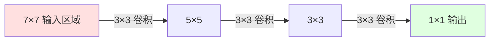

> 📖 **术语：感受野（Receptive Field）**：输出上某个点所"看到"的输入图像的有效区域。堆的卷积层越多，最深层每个点的感受野越大，就能整合越大范围的上下文。

### 5.4.2 VGGNet 的配置（A~E）

作者设计了 A~E 共 5 种配置，都遵循同一套通用设计。最常用的是 **D（VGG16）和 E（VGG19）**，数字指权重层数。

各配置的参数量（单位：百万）：

| 配置 | A / A-LRN | B | C | D (VGG16) | E (VGG19) |
|---|---|---|---|---|---|
| 权重层数 | 11 | 13 | 16 | **16** | **19** |
| 参数量(百万) | 133 | 133 | 134 | **138** | **144** |

VGG16 结构（figure 5.8），13 个卷积层分 5 组，每组后接一次池化：

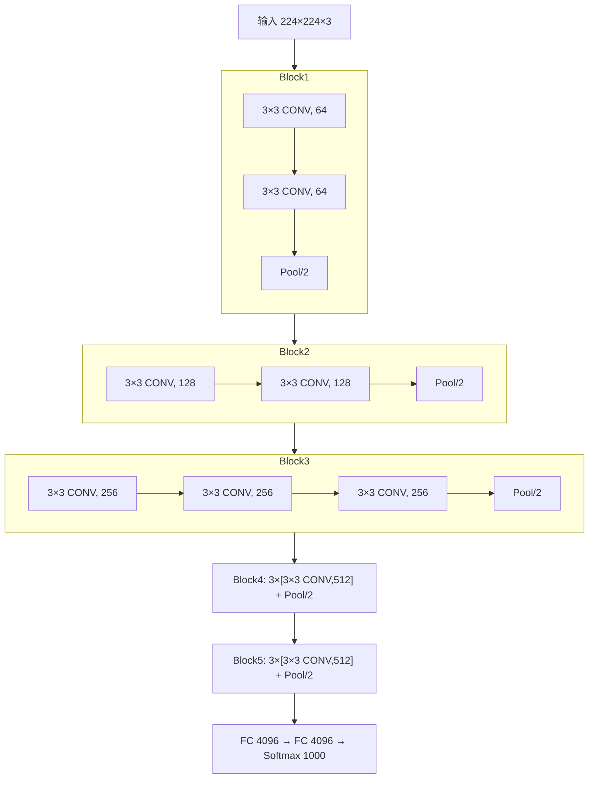

> 💡 **实战**：VGG16 比 VGG19 更常用——因为 VGG16 性能几乎和 VGG19 一样，但参数更少（138M vs 144M），性价比更高。工程上"够用就好"永远优先。

### 5.4.3 VGG16 的 Keras 实现（块状堆叠）

代码之整齐，正是 VGGNet 的魅力所在——**看一眼就懂**：

```python
model = Sequential()

# block #1：两个 64 通道 3×3 卷积 + 池化
model.add(Conv2D(filters=64, kernel_size=(3,3), strides=(1,1), activation='relu',
                 padding='same', input_shape=(224,224,3)))
model.add(Conv2D(filters=64, kernel_size=(3,3), strides=(1,1), activation='relu',
                 padding='same'))
model.add(MaxPool2D((2,2), strides=(2,2)))

# block #2：两个 128 通道
model.add(Conv2D(filters=128, kernel_size=(3,3), strides=(1,1), activation='relu', padding='same'))
model.add(Conv2D(filters=128, kernel_size=(3,3), strides=(1,1), activation='relu', padding='same'))
model.add(MaxPool2D((2,2), strides=(2,2)))

# block #3：三个 256 通道
model.add(Conv2D(filters=256, kernel_size=(3,3), strides=(1,1), activation='relu', padding='same'))
model.add(Conv2D(filters=256, kernel_size=(3,3), strides=(1,1), activation='relu', padding='same'))
model.add(Conv2D(filters=256, kernel_size=(3,3), strides=(1,1), activation='relu', padding='same'))
model.add(MaxPool2D((2,2), strides=(2,2)))

# block #4：三个 512 通道
model.add(Conv2D(filters=512, kernel_size=(3,3), strides=(1,1), activation='relu', padding='same'))
model.add(Conv2D(filters=512, kernel_size=(3,3), strides=(1,1), activation='relu', padding='same'))
model.add(Conv2D(filters=512, kernel_size=(3,3), strides=(1,1), activation='relu', padding='same'))
model.add(MaxPool2D((2,2), strides=(2,2)))

# block #5：三个 512 通道
model.add(Conv2D(filters=512, kernel_size=(3,3), strides=(1,1), activation='relu', padding='same'))
model.add(Conv2D(filters=512, kernel_size=(3,3), strides=(1,1), activation='relu', padding='same'))
model.add(Conv2D(filters=512, kernel_size=(3,3), strides=(1,1), activation='relu', padding='same'))
model.add(MaxPool2D((2,2), strides=(2,2)))

# block #6（分类器）：展平 + 两个 4096 全连接（各带 0.5 Dropout）+ softmax
model.add(Flatten())
model.add(Dense(4096, activation='relu'))
model.add(Dropout(0.5))
model.add(Dense(4096, activation='relu'))
model.add(Dropout(0.5))
model.add(Dense(1000, activation='softmax'))
model.summary()
```

总参数：**138,357,544**（约 1.38 亿）。作者用的正则化：L2（weight decay = 5×10⁻⁴，代码里为简洁省略了）+ 前两个全连接层的 0.5 Dropout。

> ⚠️ **常见坑**：VGGNet 参数量巨大（1.38 亿，其中绝大部分在**第一个全连接层** `7×7×512×4096 ≈ 1.03 亿`），显存和存储开销大。工程部署时它常被更轻量的网络取代，但作为**特征提取骨干（backbone）**和**迁移学习**的基座依然经典。

### 5.4.4 VGGNet 性能

| 网络 | ImageNet Top-5 错误率 |
|---|---|
| AlexNet | 15.3% |
| **VGG16** | **8.1%** |
| **VGG19** | **~7.4%** |

有意思的是：VGGNet 虽然参数更多、更深，**收敛所需的 epoch 反而更少**——这归功于**更大的深度**和**更小的卷积核**带来的**隐式正则化**。

---

## 🎰 5.5 Inception 与 GoogLeNet（2014，"我全都要"）

2014 年 Google 团队发论文《Going Deeper with Convolutions》，主打**在加深网络的同时，提升网络内部计算资源的利用率**。其中一个具体实现叫 **GoogLeNet**，用于 ILSVRC 2014。

它的成绩单堪称惊艳：**22 层（比 VGGNet 深），参数却只有约 1300 万（比 VGGNet 的 1.38 亿少 12 倍），精度还更高。** 秘诀就是那个新组件——**Inception 模块（inception module）**。

### 5.5.1 Inception 的思路：别选，全都用

回顾前面的网络，设计每一层时你都要纠结：

- **卷积核用多大？** 1×1？3×3？5×5？甚至 11×11？小核抓细节，大核看整体。
- **池化层放哪儿？** AlexNet 每 1~2 个卷积后池化；VGGNet 每 2~4 个卷积后池化。

这些都靠试错。Szegedy 团队说：**"与其纠结用哪个 kernel、池化放哪，不如把它们全放进一个模块里同时用！"** 这个模块就叫 Inception 模块。网络就是把 Inception 模块一个个叠起来。

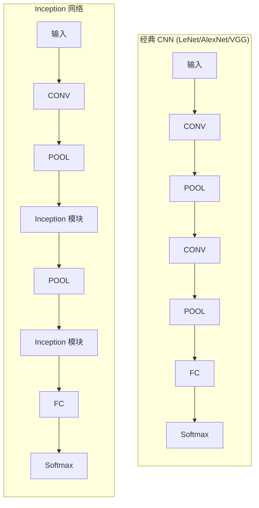

### 5.5.2 朴素版 Inception 模块（Naive）

一个 Inception 模块 = **4 条并行支路**，输出在深度维度拼接（concatenate）：

- 1×1 卷积
- 3×3 卷积
- 5×5 卷积
- 3×3 最大池化

举个例子，输入 32×32×200：

| 支路 | 配置（padding='same'） | 输出 |
|---|---|---|
| 1×1 卷积 | 深度 64 | 32×32×64 |
| 3×3 卷积 | 深度 128 | 32×32×128 |
| 5×5 卷积 | 深度 32 | 32×32×32 |
| 3×3 最大池化 | stride=1 | 32×32×32 |
| **深度拼接** | 64+128+32+32 | **32×32×256** |

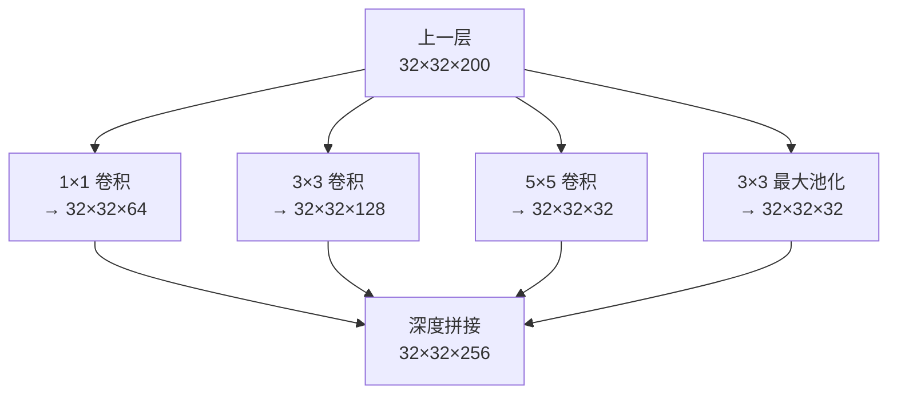

> 📖 **术语：为什么所有支路都用 padding='same'？** 因为要保证 4 条支路输出的 **H×W 相同**，这样才能在深度维度上直接拼起来（只加深度、不动宽高）。

### 5.5.3 带降维的 Inception 模块（1×1 卷积救场）

朴素版有个**要命的计算成本问题**——尤其 5×5 卷积。算一笔账：

输入 32×32×200，过 32 个 5×5 卷积核（每核 5×5×200）：

$$
\underbrace{(32 \times 32 \times 32)}_{\text{输出体积}} \times \underbrace{(5 \times 5 \times 200)}_{\text{每个输出点的乘法}} \approx \mathbf{1.63\ 亿次乘法}
$$

太贵了！**解药：1×1 卷积（降维层 / 瓶颈层）。**

> 🔬 **第一性原理：1×1 卷积在干什么？**
> 1×1 卷积**保持空间维度（H×W）不变，只改变通道数（深度）**。它相当于在每个像素点上，对所有通道做一次全连接的线性组合（+ ReLU）。所以它能把厚厚的 200 通道"压薄"成 16 通道，像瓶子最细的**瓶颈（bottleneck）**——故名**瓶颈层**。

在大核前面先插一个 1×1 卷积降维，再做 5×5。对比：

**朴素版**：直接 5×5 卷积 → **1.63 亿次乘法**

**降维版**：先 1×1 降到 16 通道，再 5×5：

```
1×1 卷积成本：(32×32×16) × (1×1×200) = 3.2M
5×5 卷积成本：(32×32×32) × (5×5×16) = 13.1M
────────────────────────────────────────
总计          = 16.3M  （只有原来的 1/10！）
```

**同样得到 32×32×32 的输出，计算量却砍到十分之一。** 🎉

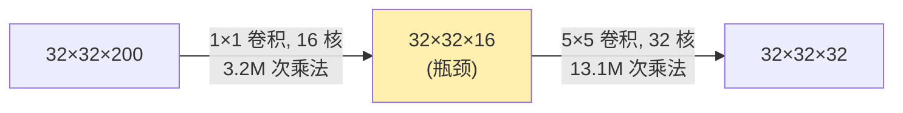

> 💡 **实战 / 面试高频**：1×1 卷积（又叫 network-in-network / 瓶颈层）是深度学习最优雅的技巧之一，ResNet、MobileNet 全在用。面试常问："1×1 卷积有什么用？"标准答案：**① 跨通道信息融合；② 降维减计算量；③ 增加一层非线性（配 ReLU）**。

Szegedy 团队实验证明：**只要降维用得适度，可以大幅压缩表示、省下海量计算，而几乎不损性能。** 完整的降维版 Inception 模块——在 3×3 和 5×5 前各加一个 1×1 降维，在 3×3 池化**后**也加一个 1×1（因为池化不改变深度，需要压一下再拼接）：

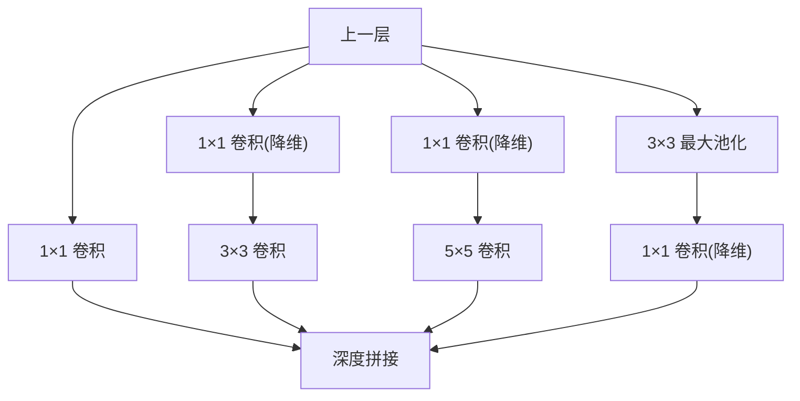

设计直觉：**在大卷积前降维，能让每一阶段大幅增加单元数而不引起后续计算量失控；同时视觉信息在多个尺度上被处理再聚合，下一阶段就能同时抽取不同尺度的特征。**

### 5.5.4 Inception / GoogLeNet 架构

把降维版 Inception 模块叠起来，中间插 3×3 池化下采样，就得到网络。原论文的具体实现 **GoogLeNet** 用了 **9 个 Inception 模块**，分三部分：

- **Part A**：跟 AlexNet/LeNet 一样的经典开头（一串卷积 + 池化）。
- **Part B**：9 个 Inception 模块 —— `2 个 + 池化 + 5 个 + 池化 + 5 个`（图上按 3a/3b、4a~4e、5a/5b 命名）。
- **Part C**：分类器（全局平均池化 + 全连接 + softmax）。

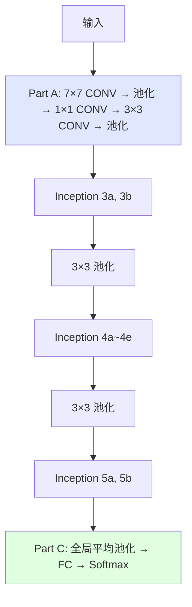

### 5.5.5 GoogLeNet 的 Keras 实现（函数化）

先写一个**通用的 inception_module 函数**，接收每条支路的滤波器数，返回拼接结果：

```python
def inception_module(x, filters_1x1, filters_3x3_reduce, filters_3x3,
                     filters_5x5_reduce, filters_5x5, filters_pool_proj, name=None):
    # 支路 1：1×1 卷积（直接取上一层输入）
    conv_1x1 = Conv2D(filters_1x1, (1,1), padding='same', activation='relu',
                      kernel_initializer=kernel_init, bias_initializer=bias_init)(x)

    # 支路 2：1×1 降维 → 3×3 卷积
    pre_conv_3x3 = Conv2D(filters_3x3_reduce, (1,1), padding='same', activation='relu',
                          kernel_initializer=kernel_init, bias_initializer=bias_init)(x)
    conv_3x3 = Conv2D(filters_3x3, (3,3), padding='same', activation='relu',
                      kernel_initializer=kernel_init, bias_initializer=bias_init)(pre_conv_3x3)

    # 支路 3：1×1 降维 → 5×5 卷积
    pre_conv_5x5 = Conv2D(filters_5x5_reduce, (1,1), padding='same', activation='relu',
                          kernel_initializer=kernel_init, bias_initializer=bias_init)(x)
    conv_5x5 = Conv2D(filters_5x5, (5,5), padding='same', activation='relu',
                      kernel_initializer=kernel_init, bias_initializer=bias_init)(pre_conv_5x5)

    # 支路 4：3×3 池化 → 1×1 卷积（对池化结果降维）
    pool_proj = MaxPool2D((3,3), strides=(1,1), padding='same')(x)
    pool_proj = Conv2D(filters_pool_proj, (1,1), padding='same', activation='relu',
                       kernel_initializer=kernel_init, bias_initializer=bias_init)(pool_proj)

    # 沿深度轴(axis=3)拼接四条支路
    output = concatenate([conv_1x1, conv_3x3, conv_5x5, pool_proj], axis=3, name=name)
    return output
```

**Part A（网络底座）**：7×7 卷积 → 3×3 池化 → 1×1 卷积 → 3×3 卷积 → 3×3 池化。（原图里的 LocalResponseNorm 如今用 BatchNormalization 替代。）

```python
input_layer = Input(shape=(224, 224, 3))
kernel_init = keras.initializers.glorot_uniform()
bias_init   = keras.initializers.Constant(value=0.2)

x = Conv2D(64, (7,7), padding='same', strides=(2,2), activation='relu',
           kernel_initializer=kernel_init, bias_initializer=bias_init)(input_layer)
x = MaxPool2D((3,3), padding='same', strides=(2,2))(x)
x = BatchNormalization()(x)
x = Conv2D(64,  (1,1), padding='same', strides=(1,1), activation='relu')(x)
x = Conv2D(192, (3,3), padding='same', strides=(1,1), activation='relu')(x)
x = BatchNormalization()(x)
x = MaxPool2D((3,3), padding='same', strides=(2,2))(x)
```

**Part B（9 个 Inception 模块）**：滤波器数直接照原论文表格填进函数参数即可。例如 3a、3b：

```python
x = inception_module(x, filters_1x1=64,  filters_3x3_reduce=96,  filters_3x3=128,
                     filters_5x5_reduce=16, filters_5x5=32,  filters_pool_proj=32,  name='inception_3a')
x = inception_module(x, filters_1x1=128, filters_3x3_reduce=128, filters_3x3=192,
                     filters_5x5_reduce=32, filters_5x5=96,  filters_pool_proj=64,  name='inception_3b')
x = MaxPool2D((3,3), padding='same', strides=(2,2))(x)
# ... 接着 4a~4e、池化、5a、5b（滤波器数照表填）
```

3a、3b 的超参数表（figure/table 5.2）：

| 类型 | #1×1 | #3×3 reduce | #3×3 | #5×5 reduce | #5×5 | pool proj |
|---|---|---|---|---|---|---|
| Inception(3a) | 64 | 96 | 128 | 16 | 32 | 32 |
| Inception(3b) | 128 | 128 | 192 | 32 | 96 | 64 |

**Part C（分类器）**：作者发现加一个 7×7 平均池化能把 Top-1 准确率提升约 0.6%，再接 40% Dropout 防过拟合：

```python
x = AveragePooling2D(pool_size=(7,7), strides=1, padding='valid')(x)
x = Dropout(0.4)(x)
x = Dense(10, activation='softmax', name='output')(x)
```

> 💡 **实战：用全局平均池化替代大全连接层**。GoogLeNet 参数只有 VGG 的 1/12，关键就在于它用**平均池化**接近分类头，而不是像 VGG 那样堆两个 4096 的巨型全连接——那正是 VGG 参数爆炸的元凶。

### 5.5.6 学习超参数

SGD + 0.9 动量 + **固定衰减：每 8 个 epoch 学习率乘 0.96**：

```python
epochs = 25
initial_lrate = 0.01
def decay(epoch, steps=100):
    initial_lrate = 0.01
    drop = 0.96
    epochs_drop = 8
    lrate = initial_lrate * math.pow(drop, math.floor((1+epoch)/epochs_drop))
    return lrate
lr_schedule = LearningRateScheduler(decay, verbose=1)
sgd = SGD(lr=initial_lrate, momentum=0.9, nesterov=False)
model.compile(loss='categorical_crossentropy', optimizer=sgd, metrics=['accuracy'])
```

### 5.5.7 Inception 性能

**GoogLeNet 是 ILSVRC 2014 冠军，Top-5 错误率 6.67%**，逼近人类水平，远超 AlexNet、VGGNet。

---

## 🌉 5.6 ResNet（2015，深度的解放）

**残差神经网络（Residual Neural Network, ResNet）**由微软研究院 2015 年提出（He Kaiming 何恺明等，论文《Deep Residual Learning for Image Recognition》）。它引入了带**跳跃连接（skip connection）**的**残差模块**，加上大量批归一化，一举训成了 **50 / 101 / 152 层**的超深网络，复杂度却比 19 层的 VGGNet 还低。**ILSVRC 2015 冠军，Top-5 错误率 3.57%**，碾压之前所有网络。

### 5.6.1 ResNet 要解决的问题：越深越差？

沿着 LeNet → AlexNet → VGGNet → Inception 一路看下来，规律很明显：**越深 → 学习容量越大 → 特征抽取越好**（浅层学边缘，深层学复杂概念）。那我们能不能一直加深，造 50、100、150 层的网络？

过拟合不是主要障碍（有 Dropout、L2、BN 可治）。真正卡住我们的是——**梯度消失（vanishing gradient）**。

> 🔬 **第一性原理：梯度消失 / 梯度爆炸**
> 反向传播时，误差梯度从最后一层往第一层传，**每经过一层就乘一次该层的权重矩阵**。
> - 如果这些乘数普遍 < 1，梯度就**指数级衰减到 0**——早期层收不到有效的更新信号，学不动。结果：网络性能**饱和**，甚至**越深反而越差（degrade）**。这就是梯度消失。
> - 反过来，如果乘数普遍 > 1，梯度会**指数级爆炸**到极大值，这叫梯度爆炸。
>
> 注意：这里的"越深越差"**不是过拟合**（过拟合是训练误差低、测试误差高），而是**连训练误差都降不下去**——是优化本身的失败。这是 ResNet 洞察的关键。

### 跳跃连接（skip connection）：给梯度开一条高速公路

何恺明团队的解法：**加一条捷径（shortcut），让梯度能直接反向传播回早期层**。这条捷径就叫**跳跃连接**，它把早期层的信息直接送到后面的层，给梯度另开一条流动路径。

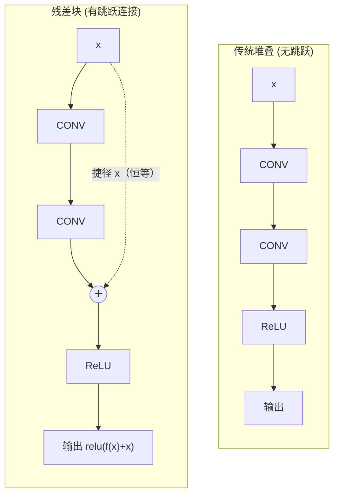

关键细节：**捷径的 x 加在最后一个卷积层的激活函数之前**。设主路径输出为 $f(x)$，捷径直接传来 $x$，两者相加后再过 ReLU：

$$
\text{output} = \text{ReLU}\big(f(x) + x\big)
$$

> 🔬 **第一性原理：为什么"残差"这么有效？**
> 跳跃连接还带来一个巨大好处：**它让网络很容易学到恒等映射（identity function）**。如果某一层其实"多余"，网络只要把主路径 $f(x)$ 学成 0，输出就等于输入 $x$——**这层就"什么都不做"地把信号原样传过去，绝不会让性能变差**。所以加了残差块后，"更深"至少不会比"更浅"更糟。
> 换个角度：网络不再直接学目标映射 $H(x)$，而是学**残差** $f(x) = H(x) - x$。学"差值"通常比学"完整映射"更容易——这就是 Residual（残差）名字的由来。

跳跃连接的代码简单到出奇：

```python
X_shortcut = X                                                # 存下捷径 = 输入 x
X = Conv2D(filters=F1, kernel_size=(3,3), strides=(1,1))(X)   # 主路径：CONV
X = Activation('relu')(X)                                     #          → ReLU
X = Conv2D(filters=F1, kernel_size=(3,3), strides=(1,1))(X)   #          → CONV
X = Add()([X, X_shortcut])                                    # 主路径 + 捷径 相加
X = Activation('relu')(X)                                     # 相加后再 ReLU
```

这个"跳跃连接 + 卷积层"的组合就叫**残差块（residual block）**。ResNet 和 Inception 一样，就是把这种积木堆起来。

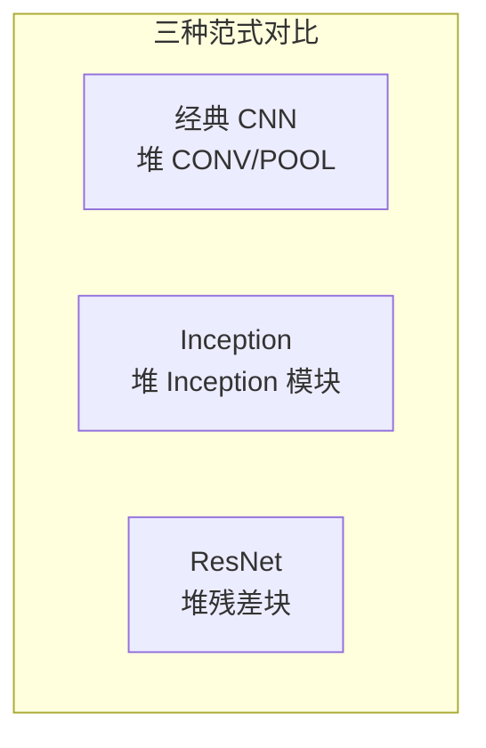

### 5.6.2 残差块（Residual Block）详解

一个残差模块有**两条支路**：

- **捷径路径（shortcut path）**：把输入直接连到第二条支路的加法处。
- **主路径（main path）**：一串卷积+激活。结构是 **`[CONV ⇒ BN ⇒ ReLU] × 3`**，即 3 个卷积层，每个后接批归一化（BN，减过拟合 + 加速训练）。

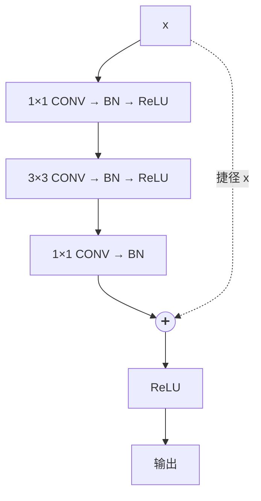

**⚠️ 注意：残差块里没有池化层！** 何恺明团队改用**瓶颈 1×1 卷积**来做降维（跟 Inception 一个思路）。所以每个**瓶颈残差块（bottleneck residual block）**的主路径是：

1. **1×1 卷积**（降维，压通道）
2. **3×3 卷积**（真正做空间卷积）
3. **1×1 卷积**（升维，恢复通道）

这就是著名的 "**沙漏 / 瓶颈**" 结构：先压瘦、再干活、再补回来——把昂贵的 3×3 卷积包在两个便宜的 1×1 之间，大幅省算力。

### 常规捷径 vs. 降维捷径（reduce shortcut）

当残差块堆叠时，**每个 block 的输出维度会变化**。而矩阵相加要求两个矩阵维度一致（`Add()([X, X_shortcut])`）。当主路径尺寸/通道变了、捷径的 $x$ 还是老尺寸时，就加不起来了。

解法：给捷径也加一个**瓶颈层（1×1 卷积 + BN）**来对齐维度，这叫**降维捷径（reduce shortcut）**。

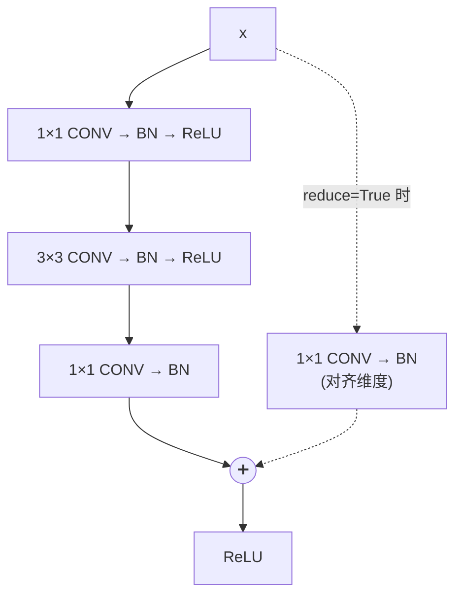

所以捷径有两种：
- **常规捷径（regular）**：直接把输入 $x$ 加到主路径（维度不变时用）。
- **降维捷径（reduce）**：捷径上先加一个 1×1 卷积对齐维度（维度改变时用，通常在每个 stage 的第一个块）。

### 瓶颈残差块的 Keras 实现

写一个带 `reduce` 布尔参数的通用函数：`reduce=True` 用降维捷径，否则用常规捷径。

```python
def bottleneck_residual_block(X, kernel_size, filters, reduce=False, s=2):
    F1, F2, F3 = filters      # 解包三个卷积层的滤波器数

    X_shortcut = X            # 存下捷径的输入值

    if reduce:                # 需要降维：捷径也要过 1×1 卷积对齐维度
        X_shortcut = Conv2D(filters=F3, kernel_size=(1,1), strides=(s,s))(X_shortcut)
        X_shortcut = BatchNormalization(axis=3)(X_shortcut)
        # 主路径第一个 1×1 卷积用相同 strides=s，保证两路尺寸一致
        X = Conv2D(filters=F1, kernel_size=(1,1), strides=(s,s), padding='valid')(X)
        X = BatchNormalization(axis=3)(X)
        X = Activation('relu')(X)
    else:                     # 常规捷径：主路径第一个 1×1 卷积 strides=1
        X = Conv2D(filters=F1, kernel_size=(1,1), strides=(1,1), padding='valid')(X)
        X = BatchNormalization(axis=3)(X)
        X = Activation('relu')(X)

    # 主路径第二段：3×3 卷积
    X = Conv2D(filters=F2, kernel_size=kernel_size, strides=(1,1), padding='same')(X)
    X = BatchNormalization(axis=3)(X)
    X = Activation('relu')(X)

    # 主路径第三段：1×1 卷积（升维，注意这里加完 BN 后先不激活）
    X = Conv2D(filters=F3, kernel_size=(1,1), strides=(1,1), padding='valid')(X)
    X = BatchNormalization(axis=3)(X)

    # 最后一步：主路径 + 捷径 相加，再 ReLU
    X = Add()([X, X_shortcut])
    X = Activation('relu')(X)
    return X
```

### 5.6.3 搭建完整的 ResNet50

**ResNet50** 含 50 个权重层，怎么数出来的？

| 阶段 | 内容 | 卷积层数 |
|---|---|---|
| Stage 1 | 1 个 7×7 卷积 | 1 |
| Stage 2 | 3 个残差块 × [1×1 + 3×3 + 1×1] | 9 |
| Stage 3 | 4 个残差块 × 3 | 12 |
| Stage 4 | 6 个残差块 × 3 | 18 |
| Stage 5 | 3 个残差块 × 3 | 9 |
| 输出 | 1 个全连接 softmax | 1 |
| **合计** | | **50** ✅ |

各版本 ResNet 的残差块重复次数（原论文 figure 5.24）：

| Stage | 输出尺寸 | 50 层 | 101 层 | 152 层 |
|---|---|---|---|---|
| conv1 | 112×112 | 7×7, 64, stride 2 | 同左 | 同左 |
| conv2_x | 56×56 | [1×1,64 / 3×3,64 / 1×1,256] ×3 | ×3 | ×3 |
| conv3_x | 28×28 | [1×1,128 / 3×3,128 / 1×1,512] ×4 | ×4 | ×8 |
| conv4_x | 14×14 | [1×1,256 / 3×3,256 / 1×1,1024] ×6 | ×23 | ×36 |
| conv5_x | 7×7 | [1×1,512 / 3×3,512 / 1×1,2048] ×3 | ×3 | ×3 |
| — | 1×1 | 平均池化 + 1000-d FC + softmax | 同左 | 同左 |

关键约定：**每个 stage 的第一个残差块用 reduce 捷径**（缩小空间尺寸），该 stage 其余块用常规捷径。

```python
def ResNet50(input_shape, classes):
    X_input = Input(input_shape)

    # Stage 1：7×7 卷积 + BN + ReLU + 池化
    X = Conv2D(64, (7,7), strides=(2,2), name='conv1')(X_input)
    X = BatchNormalization(axis=3, name='bn_conv1')(X)
    X = Activation('relu')(X)
    X = MaxPooling2D((3,3), strides=(2,2))(X)

    # Stage 2：3 个残差块（首块 reduce, s=1）
    X = bottleneck_residual_block(X, 3, [64, 64, 256], reduce=True, s=1)
    X = bottleneck_residual_block(X, 3, [64, 64, 256])
    X = bottleneck_residual_block(X, 3, [64, 64, 256])

    # Stage 3：4 个残差块（首块 reduce, s=2）
    X = bottleneck_residual_block(X, 3, [128, 128, 512], reduce=True, s=2)
    X = bottleneck_residual_block(X, 3, [128, 128, 512])
    X = bottleneck_residual_block(X, 3, [128, 128, 512])
    X = bottleneck_residual_block(X, 3, [128, 128, 512])

    # Stage 4：6 个残差块（首块 reduce, s=2）
    X = bottleneck_residual_block(X, 3, [256, 256, 1024], reduce=True, s=2)
    for _ in range(5):
        X = bottleneck_residual_block(X, 3, [256, 256, 1024])

    # Stage 5：3 个残差块（首块 reduce, s=2）
    X = bottleneck_residual_block(X, 3, [512, 512, 2048], reduce=True, s=2)
    X = bottleneck_residual_block(X, 3, [512, 512, 2048])
    X = bottleneck_residual_block(X, 3, [512, 512, 2048])

    # 平均池化 + 输出层
    X = AveragePooling2D((1,1))(X)
    X = Flatten()(X)
    X = Dense(classes, activation='softmax', name='fc' + str(classes))(X)

    model = Model(inputs=X_input, outputs=X, name='ResNet50')
    return model
```

### 5.6.4 学习超参数

跟 AlexNet 类似：mini-batch GD + 0.9 动量，初始 lr=0.1，验证误差不降就除以 10；L2 权重衰减 0.0001；**每个卷积后、激活前**都插 BN 加速训练。

```python
from keras.callbacks import ReduceLROnPlateau
epochs = 200
batch_size = 256
reduce_lr = ReduceLROnPlateau(monitor='val_loss', factor=np.sqrt(0.1),
                              patience=5, min_lr=0.5e-6)  # min_lr 是学习率下界
model.compile(loss='categorical_crossentropy', optimizer=SGD, metrics=['accuracy'])
model.fit(X_train, Y_train, batch_size=batch_size, validation_data=(X_test, Y_test),
          epochs=epochs, callbacks=[reduce_lr])
```

### 5.6.5 ResNet 性能

**ResNet-152 是 ILSVRC 2015 冠军**：单模型 Top-5 错误率 **4.49%**，集成模型 **3.57%**，全面碾压 GoogLeNet（6.67%）。它还横扫了目标检测、图像定位等多项挑战（详见第 7 章）。

> 🔬 **本章最重要的一句话**：残差块的意义远超一个冠军——**它打开了"高效训练几百层超深网络"这扇门**。今天几乎所有主流视觉/多模态模型的骨干里，都能看到跳跃连接的影子（甚至 Transformer 里的残差连接也是同一思想）。

---

## 🧰 关于"用开源实现"的实战忠告

作者在章末给了一条**极其务实的建议**：

> 这些经典网络往往**难以复现**——学习率衰减等超参数的细微调整就能显著影响性能，连 DL 研究者照着别人论文都常常难以复现其精细结果。
>
> 好在很多研究者会**开源**自己的工作。在 GitHub 上搜一下网络名，就能找到多个框架的实现，clone 下来直接训。**能拿到作者的原始实现，通常比从零重写快得多**——虽然从零复现有时也是很好的练习（就像本章做的）。

> 💡 **实战**：在 Keras/PyTorch 里，`keras.applications` 和 `torchvision.models` 直接内置了 VGG16、ResNet50、InceptionV3 等，还带 **ImageNet 预训练权重**。真实项目里 99% 的情况都是"加载预训练骨干 + 微调（fine-tune）"，而不是从头训练——这就是**迁移学习**，也是这些经典架构今天最大的价值。

---

## 📌 小结

| 网络 | 年份 | 层数 | 参数量 | 核心创新 | Top-5 错误率 |
|---|---|---|---|---|---|
| **LeNet-5** | 1998 | 5 | 6.2 万 | 首个成功 CNN（卷积+池化+FC，tanh，平均池化） | MNIST >99% |
| **AlexNet** | 2012 | 8 | 6000 万 | ReLU、Dropout、数据增强、双 GPU、更深更宽 | 15.3% |
| **VGGNet** | 2014 | 16/19 | 1.38/1.44 亿 | 全用 3×3 小核堆深，统一架构，好懂好实现 | 7.4% |
| **Inception/GoogLeNet** | 2014 | 22 | 1300 万 | Inception 模块"我全都要" + 1×1 瓶颈降维 | 6.67% |
| **ResNet** | 2015 | 50/101/152 | — | 残差块 + 跳跃连接，破解梯度消失，训超深网络 | 3.57% |

**贯穿全章的三条主线**（面试时能串起这三条，就赢了）：

1. **越深越强，但深不下去**：加深能提升表达力（LeNet→AlexNet→VGG→Inception→ResNet），但深到一定程度会被**梯度消失**卡死——ResNet 的跳跃连接是终极解药。
2. **超参数从"手工试错"走向"结构化设计"**：LeNet/AlexNet 每层参数各异、难调 → VGG 统一成 3×3 块 → Inception 干脆"全都用" → ResNet 用残差块作为标准积木。
3. **1×1 卷积（瓶颈层）是省算力的通用杀器**：Inception 用它把 5×5 卷积的计算量砍到 1/10，ResNet 用它做瓶颈残差块——**降维 + 跨通道融合 + 加非线性**，一石三鸟。

**几个必背的第一性原理**：
- **模式**：特征提取（卷积）+ 分类（FC）两段式；空间尺寸减小、通道深度增大。
- **ReLU** 破解梯度消失（正半轴导数恒为 1，不饱和）。
- **多个 3×3 > 一个大核**：等效感受野相同，非线性更多，参数少 81%。
- **1×1 卷积**：保持 H×W、只改通道数，是瓶颈/降维层。
- **残差 $f(x)=H(x)-x$**：学"差值"比学"完整映射"容易；跳跃连接让"多深至少不更差"。

---

## 🔗 延伸

- **原始论文**（作者强烈建议亲自读，推荐顺序：AlexNet → VGG → LeNet → Inception → ResNet）：
  - LeNet：LeCun et al., *Gradient-Based Learning Applied to Document Recognition*, 1998
  - AlexNet：Krizhevsky, Sutskever, Hinton, *ImageNet Classification with Deep CNNs*, 2012
  - VGGNet：Simonyan & Zisserman, *Very Deep Convolutional Networks*, 2014（arXiv:1409.1556）
  - Inception：Szegedy et al., *Going Deeper with Convolutions*, 2015
  - ResNet：He et al., *Deep Residual Learning for Image Recognition*, 2015（arXiv:1512.03385）
- **本书前后章节**：第 3 章（卷积/池化/全连接积木）→ 第 4 章（超参数/正则化/BN/数据增强）→ **第 5 章（本章：架构装配）** → 第 6 章（迁移学习，把这些骨干用起来）→ 第 7 章（目标检测，ResNet 大放异彩）。
- **动手复现建议**：`torchvision.models` / `keras.applications` 直接加载带 ImageNet 预训练权重的 VGG16 / ResNet50 / InceptionV3，先跑通推理，再做迁移学习微调，最后挑一个（推荐 ResNet 的瓶颈残差块）**从零手写**加深理解。
- **进阶阅读**（本章之后的架构演进）：ResNeXt、DenseNet、EfficientNet、以及把"注意力+残差"发扬光大的 Vision Transformer（ViT）——你会发现**跳跃连接**这个 2015 年的想法至今无处不在。
