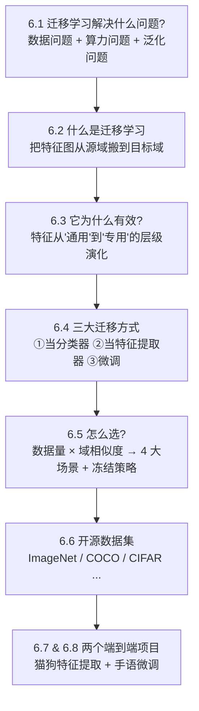
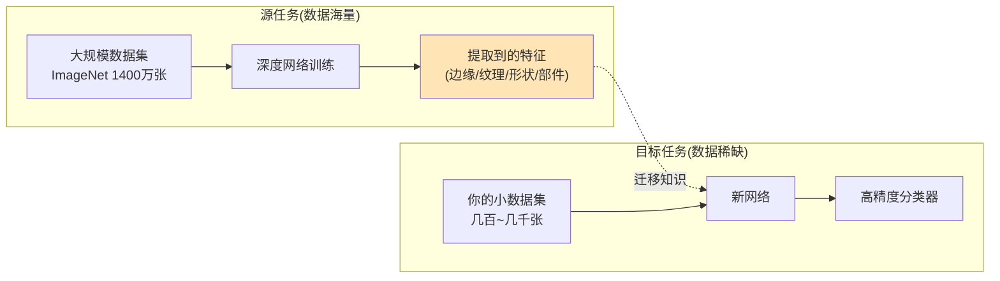
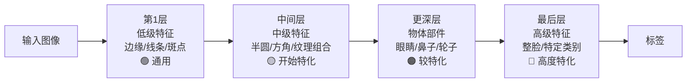
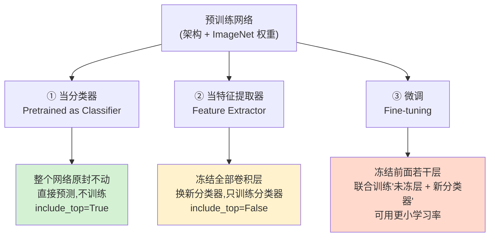
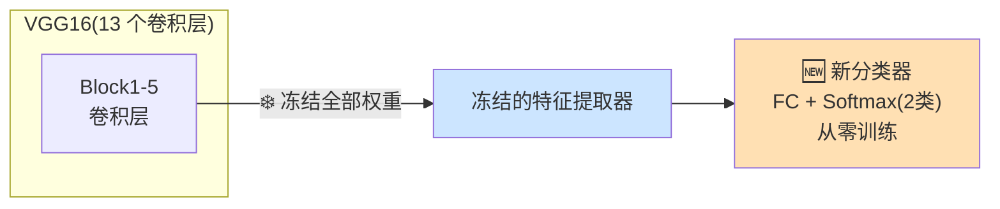
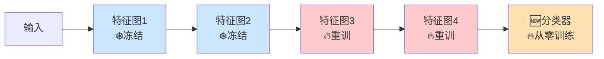
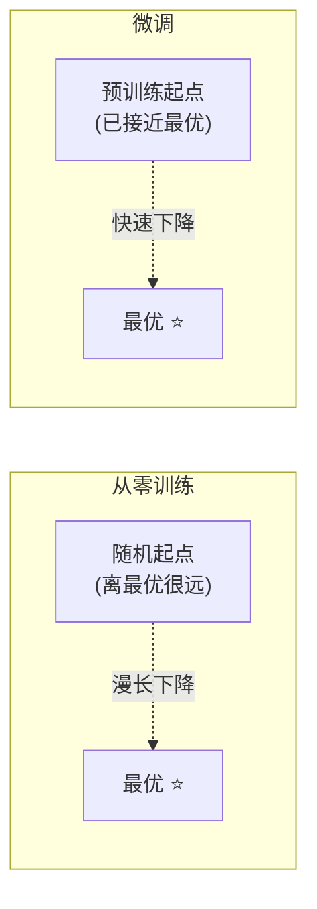
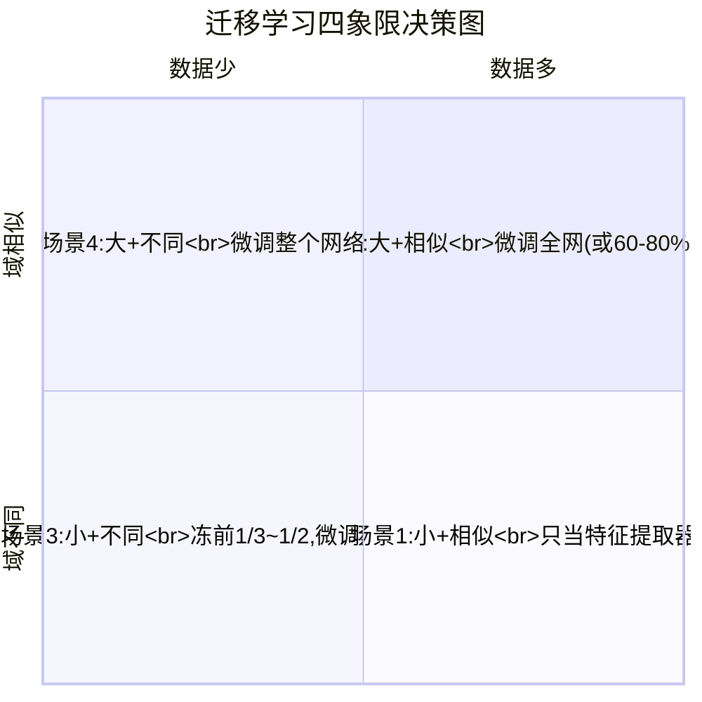
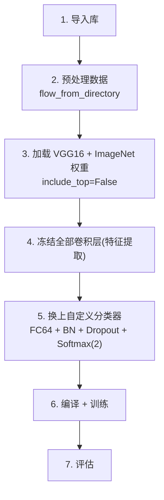
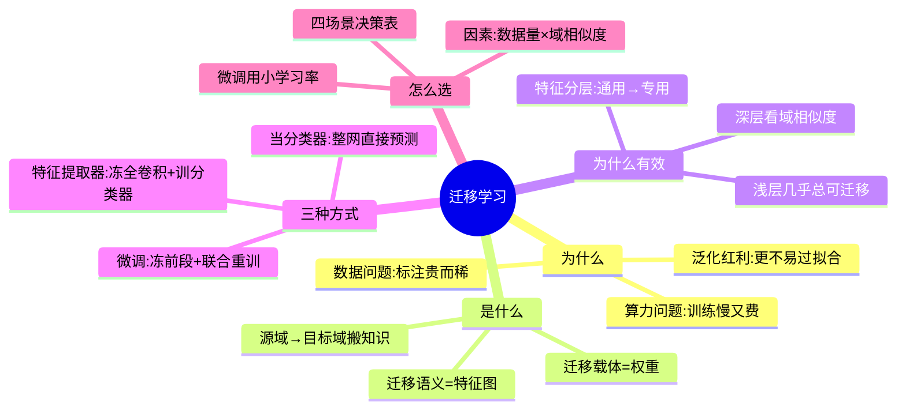

# 第 6 章 迁移学习(Transfer Learning)🚀

> 逐章精讲 ·《Deep Learning for Vision Systems》(Mohamed Elgendy)第 6 章
> 对应原书 pp. 261–303

---

## 🗺️ 本章地图

迁移学习(transfer learning)可能是深度学习里"性价比最高"的一招:**下载别人在海量数据上训练好的网络,把它学到的特征搬过来,只在你自己的小数据集上微调一下,就能又快又好地解决问题。** 用作者的原话:

> "You should never have to train an image classifier from scratch again, unless you have an exceptionally large dataset and a very large computation budget."
> ——除非你有超大数据集 + 超大算力,否则你**再也不用从零训练一个图像分类器**。

本章我们会一步步搞清楚:



阅读本章前,你应该已经掌握:卷积网络(CNN,第 3 章)、经典架构(VGG/GoogLeNet/ResNet,第 5 章)、反向传播与梯度下降(第 2 章)。

学完你会拥有一套**可落地的决策手册**:拿到一个新视觉任务时,该冻多少层、微调多少层、用什么学习率,一目了然。

---

## 6.1 迁移学习到底解决什么问题?🎯

### 是什么

**迁移学习 = 把神经网络在某个数据集上学到的知识(knowledge),迁移到一个相关但不同的新问题上。** 在神经网络语境里,"知识"具体指的是网络学到的**特征(features / feature maps)**。



### 为什么需要它 —— 三座大山

作者指出,**几乎没人会从零训练一整个卷积网络**,原因是两大现实问题,外加一个隐性收益:

| 🏔️ 问题 | 具体表现 | 迁移学习怎么救 |
|---|---|---|
| **① 数据问题(Data problem)** | 从零训练需要海量数据才有像样结果;而采集 + 逐张人工标注既贵又慢,拥有足够大数据集本身就很罕见 | 借用别人在千万级数据上学到的特征,你只需几百~几千张 |
| **② 算力问题(Computation problem)** | 就算凑齐了几十万张图,在百万级数据上训深网也要在多块 GPU 上跑好几周;而且训练是**迭代**过程,反复调超参会让成本爆炸 | 大部分层直接复用,只训练极少参数,普通 CPU 几分钟就能跑完 |
| **③ 泛化 / 过拟合(隐性收益)** | 模型上线后会遇到训练时从没见过的情况:不同相机画质、分辨率、天气……每个用户产生的数据都不一样 | 迁移自"见过千万张图"的网络,模型更不容易过拟合,面对新场景泛化更好 |

> 🔬 **第一性原理:为什么"见得多"就"泛化好"?**
> 深度网络本质是在拟合一个从像素到标签的高维函数。一个只在你几百张"雪地里的狗"上训练的网络,会把"白色背景""雪"误当成"狗"的判别特征;而一个在千万张、各种背景下的图上预训练的网络,早已把"狗"从背景中解耦出来。**迁移的不只是权重,更是一种对视觉世界的通用表征(generic representation of the visual world)。**

> 💡 **实战 / 面试高频**
> 面试常问:"数据很少时你怎么办?" 标准三连答:**数据增强(第 4 章) → 迁移学习 → 更强正则(Dropout/BN)**。迁移学习几乎总是第一选择。能补一句"根据数据量和域相似度选冻结层数(见 6.5)"就更亮眼了。

---

## 6.2 什么是迁移学习?正式定义 📖

> **正式定义:** 迁移学习是把网络从一个**数据充足**的任务上学到的知识(特征图 feature maps),迁移到一个**数据稀缺**的新任务上。做法是——先在与目标问题相似的问题上训练一个网络,然后把训练好模型的**一层或多层**拿出来,放进要解决的新问题的新模型里。

作者引用了迁移学习领域的经典论文 Yosinski et al. (2014)《How Transferable Are Features in Deep Neural Networks?》来给出直觉:

> "In transfer learning, we first train a **base network** on a **base dataset** and task, and then we **repurpose** the learned features, or transfer them to a **second target network** to be trained on a **target dataset** and task. This process will tend to work **if the features are general** ... instead of specific to the base task."
> ——迁移能奏效的前提是:被迁移的特征足够**通用(general)**,同时适用于源任务和目标任务,而不是只对源任务特化。

### 几个关键术语(务必记牢)

| 术语 | 英文 | 含义 |
|---|---|---|
| 源域 | Source domain | 预训练网络所训练的**原始数据集**(如 ImageNet) |
| 目标域 | Target domain | 你想训练网络的**新数据集** |
| 基础网络 | Base network | 在源域上训练好的网络 |
| 预训练模型 | Pretrained model | 已在大数据集(通常是大规模图像分类)上训练好的网络。可以直接拿来预测,也可以只用它的**特征提取部分**再加自己的分类器 |
| 从零训练 | Training from scratch | 模型对世界"零知识",权重随机初始化,需从头训练优化 |

> ⚠️ **常见坑:"分类器"可以不是神经网络层**
> 书中定义提到:加在预训练特征提取器之上的分类器(classifier)可以是一层或多层全连接(dense),**甚至可以是传统机器学习算法,比如 SVM(支持向量机)**。也就是说:用 CNN 提特征 + SVM 分类,是一种完全合法的迁移学习组合。别以为分类器必须是 softmax。

### 一个贯穿全章的例子:猫狗分类 🐱🐶

想训练一个只分"猫 vs 狗"两类的模型,两条路:

1. **从零训练**:为每类采集几十万张图 → 标注 → 从头训练。慢、贵。
2. **迁移学习**:
   - 找一个特征相似的开源数据集 —— 选 **ImageNet**(里面有大量猫狗图,含 120 类狗、2 万多张狗图);
   - 选一个在 ImageNet 上表现好的网络 —— 选 **VGG16**;
   - 下载 VGG16 + 预训练权重 → **去掉它的分类器部分** → **接上自己的分类器** → 重新训练。

这就是把预训练网络**当特征提取器(feature extractor)**用。下一节我们把它落成 Keras 代码。

---

## 6.3 迁移学习为什么有效?🔬

在写代码之前,先建立"第一性"的理解:到底**什么东西**被迁移了?为什么在数据集 A 上训的网络能在数据集 B 上work?

作者用 4 个"温故"问题直击本质:

| # | 问题 | 答案 |
|---|---|---|
| 1 | 训练时网络到底学到了什么? | **特征图(feature maps)** |
| 2 | 这些特征怎么学到的? | 反向传播中不断更新权重,直到得到使误差函数最小的**最优权重** |
| 3 | 特征和权重什么关系? | 特征图是"权重滤波器(weights filter)"在输入图上做**卷积**后的输出 |
| 4 | 到底迁移了什么? | 下载预训练网络的**最优权重**,把它们当作新训练的**起点**,再retrain以适应新问题 |

所以一句话:**迁移学习迁移的物理载体是"权重",迁移的语义是"特征图"。** 当你下载一个预训练模型,你拿到的是两样东西:**网络架构 + 训练好的权重**。

### 6.3.1 神经网络是怎么逐层学特征的?

这是全章最重要的洞察。网络学特征是**分层、由简到繁**的:



以"人脸检测"为例:

- **第一层**:检测边缘、线条、斑点(blobs)。这些**不特定于任何数据集或任务**,是通用特征。
- **中间层**:把线条组装成形状、角、圆 —— 开始出现眼睛、鼻子这类**人脸相关**的组合。
- **最后层**:形成高度特定于任务的特征 —— 能区分"这个人 vs 那个人"的细节。

> 🔬 **核心论证:通用 → 专用 的单向演化**
> 越浅的层特征越通用,越深的层特征越专用(specific)。这是迁移学习整套决策逻辑的地基:
> - 因为**浅层通用** → 几乎总能跨任务复用(所有图像都有边缘和形状);
> - 因为**深层专用** → 是否复用要看源域和目标域有多像。

作者进一步给出一张极具说服力的对比图(图 6.7):把**分别训练来分类"人脸 / 汽车 / 大象 / 椅子"的四个模型**的特征图摆在一起——

> "Notice that the earlier layers' features are **very similar for all the models**. ... The deeper we go into the network, the more specific the features."
> ——四个完全不同任务的模型,**浅层特征长得几乎一样**(都是边缘、线条、斑点);越往深,特征越各自特化。

这就直接证明了:**低级特征几乎总是可迁移的**,因为它们编码的是"图像长什么样"这种普适结构信息。

### 6.3.2 后段特征的可迁移性,取决于域相似度

后段(later layers)特征能不能迁移,**取决于源域和新域的相似程度**:

> "所有图像都必须有形状和边缘,所以浅层通常可以跨域迁移。只有当我们开始提取高级特征(如脸上的鼻子、车上的轮胎)时,才能区分不同物体……基于源域和目标域的相似度,我们可以决定:只迁移低级特征、还是也迁移高级特征、还是介于两者之间。"

这句话,就是下一节"三大迁移方式"和 6.5"四大场景"的全部理论根基。请把它焊在脑子里 🔩。

---

## 6.4 三大迁移学习方式 🛠️

作者把迁移学习归纳为**三种主要方式**。它们的差别只有一个:**冻结多少、重训多少**。



| 方式 | 冻结范围 | 是否训练 | 何时用 |
|---|---|---|---|
| ① 当分类器 | 全部 | ❌ 完全不训练 | 新问题的域与源域**极其相似**,拿来即用 |
| ② 当特征提取器 | 冻结所有卷积层 | ✅ 只训新分类器 | 新任务与源域**相似** |
| ③ 微调 | 冻结前面若干层 | ✅ 训未冻层 + 新分类器 | 域**不同**甚至差异很大;也可全网重训 |

### 6.4.1 方式一:预训练网络当分类器 🏷️

**不冻任何层、不做任何额外训练**——直接下载在相似问题上训好的网络,原封不动部署到你的任务上。前提是:你的新问题域与源域**非常相似**,现成可用。

例如用在 ImageNet 上训练的 VGG16 **直接**预测一张德国牧羊犬的照片(因为 ImageNet 本就含大量狗图):

```python
from keras.preprocessing.image import load_img
from keras.preprocessing.image import img_to_array
from keras.applications.vgg16 import preprocess_input
from keras.applications.vgg16 import decode_predictions
from keras.applications.vgg16 import VGG16

# ① 下载 VGG16 + ImageNet 权重;include_top=True → 保留完整分类器,整网当分类器用
model = VGG16(weights="imagenet", include_top=True, input_shape=(224, 224, 3))

# ② 加载并预处理输入图片
image = load_img('path/to/image.jpg', target_size=(224, 224))  # 读图,缩放到 224×224
image = img_to_array(image)                                    # 转成 NumPy 数组
image = image.reshape((1, image.shape[0], image.shape[1], image.shape[2]))  # 加 batch 维 → (1,224,224,3)
image = preprocess_input(image)                                # VGG 专用预处理(去均值等)

# ③ 预测
yhat = model.predict(image)          # 输出所有类别的概率
label = decode_predictions(yhat)     # 概率 → 类别标签
label = label[0][0]                  # 取概率最高的那个
print('%s (%.2f%%)' % (label[1], label[2] * 100))
```

输出:

```
>> German_shepherd (99.72%)
```

**逐点解读:**
- `include_top=True`:关键。`top` 指网络顶部的**全连接分类器**(FC 4096 → FC 4096 → Softmax 1000)。要整网当分类器,就得保留它。
- `decode_predictions`:把 1000 维概率向量翻译成人类可读标签(如 `German_shepherd`)。
- 99.72% 的高置信度,正是因为 ImageNet 有 2 万多张狗图、分成 120 个品种,网络的表征能力大量用在了"区分狗品种"上。

> 💡 **实战**:这种方式零训练成本,适合快速验证"预训练模型能不能直接解决我的问题"。如果直接预测就够好,你连数据都不用标。

### 6.4.2 方式二:预训练网络当特征提取器 🔧

这是最常用、也是本章开头猫狗例子的做法:

> **拿一个在 ImageNet 上预训练的 CNN → 冻结它的特征提取部分 → 去掉它的分类器 → 接上自己新的 dense 分类器(从零训练)。**



**为什么去掉原分类器?** 作者解释得很清楚:

> "We remove the classification part ... because it is often **very specific to the original classification task**. ... ImageNet has 1,000 classes. The classifier part has been trained to **overfit** the training data to classify them into 1,000 classes. But in our new problem ... we have only two classes."
> ——原分类器是为"1000 类"高度特化(甚至可以说是"刻意过拟合"到 1000 类)训练出来的;而你只有 2 类。**为你自己的 2 类从零训练一个新分类器,效果好得多。**

#### 完整 Keras 代码 + 逐行讲解

**第 1 步:下载 VGG16(不含分类器)作为 base model**

```python
from keras.applications.vgg16 import VGG16
base_model = VGG16(weights="imagenet",     # 下载 ImageNet 预训练权重
                   include_top=False,      # ⭐ 关键:False → 丢掉顶部 FC 分类器
                   input_shape=(224, 224, 3))
base_model.summary()
```

打印 summary,最后几行:

```
=================================================================
Total params: 14,714,688
Trainable params: 14,714,688      ← 此刻 1400 万参数全部可训练
Non-trainable params: 0
```

⚠️ 注意:刚下载时,**所有 1471 万参数默认都是"可训练"的**。我们必须手动冻结它们。

**第 2 步:冻结特征提取层**

```python
for layer in base_model.layers:   # 遍历每一层
    layer.trainable = False        # 锁死权重,训练时不再更新
base_model.summary()
```

冻结后再看 summary:

```
Total params: 14,714,688
Trainable params: 0               ← 可训练参数归零
Non-trainable params: 14,714,688  ← 全部转为"不可训练"
```

> 🔬 **"冻结(freeze)"到底冻的是什么?**
> 冻结 = 把该层的 `trainable` 设为 `False`。反向传播时,梯度**不会**更新这些层的权重(它们被排除在优化之外)。物理效果:这些层就是一个固定的、把图像 → 特征向量的**函数**。你只是在用它,而不是在学它。

**第 3 步:接上自己的新分类器**

```python
from keras.layers import Dense, Flatten
from keras.models import Model

last_layer = base_model.get_layer('block5_pool')  # 取 VGG16 最后一层(7×7×512 的池化输出)
last_output = last_layer.output                   # 拿到它的输出张量,作为新层的输入

x = Flatten()(last_output)                         # 展平:(7,7,512) → 25088 维向量
x = Dense(2, activation='softmax', name='softmax')(x)  # 新增 softmax 层,2 个单元(2 类)
```

**第 4 步:组装新模型**

```python
new_model = Model(inputs=base_model.input,   # 输入 = VGG16 的输入
                  outputs=x)                 # 输出 = 我们新加的 softmax
new_model.summary()
```

新模型 summary 的关键三行:

```
flatten_layer (Flatten)      (None, 25088)             0
softmax (Dense)              (None, 2)                 50178
=================================================================
Total params:        14,789,955
Trainable params:        50,178      ← 只需训练 5 万参数!
Non-trainable params: 14,714,688     ← 1471 万参数被冻结复用
```

> 💡 **这就是迁移学习的魔力所在**
> 从零训练要优化 **1471 万** 参数;用特征提取器只需训练 **5 万** 参数(相差近 300 倍)。作者原话:训练这个新模型**远比从零训练快**,而且因为特征提取器"见过千万张图",最终**性能反而更好、泛化更强**。

> ⚠️ **常见坑:忘了冻结**
> 如果跳过第 2 步的 `layer.trainable = False`,你就是在拿小数据集**重训整个 1471 万参数的网络** → 小数据 + 大模型 = 灾难性过拟合。冻结这一步绝不能漏。

### 6.4.3 方式三:微调(Fine-tuning)🎛️

前两种方式适用于"目标域与源域**相似**"。但如果目标域**不同**、甚至**差异极大**呢?还能用迁移学习吗?**能。** 靠的就是微调。

> **微调的正式定义:** 冻结网络中用于特征提取的**一部分(前面若干层)**,然后**联合训练**(jointly train)"未冻结的层 + 新加的分类器层"。
> 之所以叫"微调",是因为重训这些特征提取层时,我们是在**微调高阶特征表示(fine-tune the higher-order feature representations)**,让它们更贴合新任务的数据。



作者用图 6.10 展示了一条"连续光谱":你可以选择在**任意一层**下刀——

- 冻到最后(只重训分类器)= 退化成**特征提取器**;
- 一层不冻(全网重训)= **retrain the entire network**;
- 中间任意位置 = 各种程度的微调。

> "如果冻结图 6.10 中的特征图 1 和 2,新网络就把**特征图 2 作为输入**,从这一点开始学习,以适配后续层的特征。这为网络**省下了本要花在学习特征图 1、2 上的时间**。"

选择在哪冻,基于我们已知的原理:

- 域**相似** → 可以冻到很深(如冻到特征图 4),因为深层特征也相关;
- 域**差异大** → 只冻很浅(如只冻到特征图 1),重训其余全部,因为深层特征对你没用。

#### 🔬 为什么"微调"比"从零训练"好?(WHY FINE-TUNING BETTER)

作者给了一个非常本质的解释,从**优化收敛**的角度:

> 从零训练时,权重**随机初始化**,梯度下降去找最小化误差的最优权重。随机起点**不保证**离最优值近;若起点离最优值很远,优化器要**很久才收敛**。
> 而预训练网络的权重**已经在它的数据集上优化过了**。用它做起点,相当于**从一个已经很好的位置**出发,收敛**快得多**。
> **即使你决定全网重训**,用训练好的权重做起点,也比随机初始化收敛得快。



> 🔬 **第一性原理**:损失曲面(loss landscape)是高维非凸的。随机初始化像"把你空投到荒野随机一点";预训练权重像"把你放到已知好营地附近"。起点决定了你要走多远、掉进多少局部坑。**好的初始化 = 免费的收敛加速。**

#### ⚠️ 微调必须用更小的学习率(smaller learning rate)

这是微调的**头号实战要点**,面试也爱考:

> "It's common to use a **smaller learning rate** for ConvNet weights that are being fine-tuned, in comparison to the (randomly initialized) weights for the new linear classifier. This is because we expect that the **ConvNet weights are relatively good, so we don't want to distort them too quickly and too much** (especially while the new classifier above them is being trained from random initialization)."

**逐点拆解:**
- 预训练卷积权重**已经很好**,是网络辛苦学来的宝贵资产;
- 大学习率会**一步就把它们"震坏"**(distort),把好特征毁掉;
- 尤其危险的是:新加的分类器**还在随机初始化状态**,它一开始会产生**巨大而混乱的梯度**,若学习率大,这股乱流会顺着反传冲进卷积层,把好权重冲垮;
- 所以:**微调卷积层用小学习率**(如项目 2 里用 `Adam(lr=0.0001)`),保护已有特征,慢慢地、温柔地调。

> 💡 **进阶实战:差分学习率(discriminative / layered LR)**
> 书中只讲"整体用小 lr"。工业界更精细的做法是**分层设不同学习率**:越浅的层学习率越小(它们更通用,几乎不用动),越深的层学习率略大(它们更需要适配)。这是 fast.ai 等框架的标配技巧。

---

## 6.5 如何选择合适的迁移层级?—— 决策手册 🧭

前面反复出现两个决定性因素,这一节把它们变成可执行的规则。

**两大决定因素:**

| 因素 | 说明 | 影响 |
|---|---|---|
| **① 目标数据集大小**(small / large) | 数据少时,多训层数学不到东西,还容易过拟合新数据 → 应**少微调,多依赖源域** | 决定"敢不敢重训" |
| **② 源域与目标域相似度**(similar / different) | 分"车 vs 船"→ ImageNet 很合适;分"X 光片肺癌"→ 域完全不同,需大量微调 | 决定"从哪层开始重训" |

两个因素各分两档,组合出 **4 大场景**:



### 6.5.1 场景 1:数据**小** + 域**相似** → 特征提取器

- 域相似 → 预训练网络的**高级特征也适用**;
- 数据小 → 微调会**过拟合**;
- **策略:冻结整个特征提取部分,只重训分类器。**

> ⚠️ **经典过拟合陷阱(书中原例)**:如果你的小数据集里所有狗都在**雪地**背景下,一旦微调,网络会把"雪""白背景"当成"狗的特征",结果换个天气就认不出狗了。**数据小时,微调 = 引火烧身。**

### 6.5.2 场景 2:数据**大** + 域**相似** → 微调大部分

- 和场景 1 一样可以先冻特征提取、训分类器;
- 但因为**数据多**,可以放心地微调**全部或部分**网络,不太担心过拟合;
- 全网微调没必要(高级特征本就相关);
- **策略:冻结约 60–80% 的预训练网络,重训其余部分。**

### 6.5.3 场景 3:数据**小** + 域**不同** → 冻前段,微调中后段

- 域不同 → **不该**冻高级特征(它们太源域特化了);
- 数据小 → 又**不能**全网微调(会过拟合);
- 折中方案最优;
- **策略:冻结前 1/3 ~ 1/2 的网络**(浅层的通用特征即使域差很大也有用),重训其余。

> 这正是本章**项目 2(手语分类)** 的场景。

### 6.5.4 场景 4:数据**大** + 域**不同** → 微调整个网络

- 数据大到你可能想"干脆从零训练、别迁移了";
- 但实践中**从预训练权重初始化仍然很有价值** —— 收敛更快;
- 数据大 → 有底气全网微调而不怕过拟合;
- **策略:用预训练权重初始化,微调整个网络。**

> 🔬 **本质洞察**:场景 4 揭示了一个反直觉但重要的事实——**即便你数据充足、即便域完全不同,迁移学习(哪怕只当初始化)也依然划算**,因为它省的是"收敛时间"而非"数据"。这就是为什么"再也不用从零训练"这句话成立。

### 6.5.5 四场景速查表 ⭐(表 6.1)

| 场景 | 数据量 | 域相似度 | 推荐方法 | 冻结策略 |
|:---:|:---:|:---:|---|---|
| **1** | 小 | 相似 | 当**特征提取器** | 冻结全部卷积层 |
| **2** | 大 | 相似 | **微调全网** | 冻结 ~60–80%,重训其余 |
| **3** | 小 | 很不同 | 从**较浅层激活**开始微调 | 冻前 1/3~1/2,重训其余 |
| **4** | 大 | 很不同 | **微调整个网络** | 用预训练权重初始化,全网重训 |

> 💡 **面试高频:一句话记忆法**
> - **域相似看数据量**:相似 + 小 = 只训分类器;相似 + 大 = 微调多点。
> - **域不同看数据量**:不同 + 小 = 冻浅层微调中段;不同 + 大 = 全网微调。
> - 一句话总纲:**数据越多越敢重训,域越像越可冻深。**
> - 而且"具体冻几层,常靠 trial and error(试错)定" —— 表格是起点,不是终点。

---

## 6.6 开源数据集速览 📚

要做迁移学习,得知道去哪找"源域"数据集/预训练权重。作者列了 CV 社区最常用的几个:

| 数据集 | 规模 & 特点 | 用途 |
|---|---|---|
| **MNIST** | 6 万训练 + 1 万测试;28×28 灰度;0–9 手写数字 | 图像界的 "hello world";如今太简单(基础 CNN 就 >99%),不再作为 CNN 性能基准 |
| **Fashion-MNIST** | 同 MNIST 格式,但为 10 类服饰(T恤/裤/裙/鞋/包…) | 为替代过于简单的 MNIST 而生 |
| **CIFAR-10** | 32×32 **彩色**;10 类;每类 6000 张(5 万训练 + 1 万测试) | 比 MNIST 难得多(彩色 + 物体形态多变),经典分类基准 |
| **ImageNet** | **1400 万+** 张;按 WordNet 层级组织成 synset(每 synset 目标 1000+ 张) | 迁移学习**最主流的源域**;ILSVRC 挑战赛是架构性能的黄金基准 |
| **MS COCO** | 32.8 万张(20 万+ 标注),150 万物体实例,80 类 | 目标检测、实例分割、图像描述、人体关键点 |
| **Google Open Images** | 900 万+ 张,200 万+ 手工画框,约 1540 万个框、600 类 | **目前最大的带物体定位标注**的数据集 |
| **Kaggle** | ML/DL 竞赛平台 | 海量各领域数据集 + 竞赛 |

> 💡 **实战**:Keras 内置一批可直接下载的预训练网络,完整列表见 `https://keras.io/api/applications`(VGG16/19、ResNet、Inception、MobileNet、EfficientNet…)。`weights="imagenet"` 一行就能拿到 ImageNet 预训练权重。

> ⚠️ **坑:域相似度决定数据集选择**
> 选源域数据集的核心标准是**"和你的目标域像不像"**。分"车 vs 船" → ImageNet 完美;但分"肺部 X 光片肺癌" → ImageNet(自然图像)域差极大,此时要么找**医学影像预训练模型**,要么按场景 3/4 做深度微调。别无脑套 ImageNet。

---

## 6.7 项目一:预训练网络当特征提取器(猫狗分类)🐱🐶

**目标**:用**极小**数据训练一个猫狗分类器。这是**场景 1(数据小 + 域相似)**的实操。附带学会:如何组织自定义数据目录、用 Keras 预处理成训练就绪的张量。

**标准 7 步流程:**



**第 2 步:用目录结构组织数据 + 生成批次**

```python
from keras.preprocessing.image import ImageDataGenerator
train_path, valid_path, test_path = 'data/train', 'data/valid', 'data/test'

# flow_from_directory:按子文件夹名自动推断类别标签
train_batches = ImageDataGenerator().flow_from_directory(
    train_path, target_size=(224, 224), batch_size=10)
valid_batches = ImageDataGenerator().flow_from_directory(
    valid_path, target_size=(224, 224), batch_size=30)
test_batches  = ImageDataGenerator().flow_from_directory(
    test_path,  target_size=(224, 224), batch_size=50, shuffle=False)  # 测试集不打乱
```

**第 3–4 步:下载 VGG16 并冻结**

```python
from keras.applications import vgg16
base_model = vgg16.VGG16(weights="imagenet", include_top=False, input_shape=(224,224,3))
for layer in base_model.layers:
    layer.trainable = False   # 冻结全部卷积层 → 纯特征提取器
```

**第 5 步:加自定义分类器(比之前多了 BN + Dropout 抗过拟合)**

```python
last_output = base_model.get_layer('block5_pool').output
x = Flatten()(last_output)
x = Dense(64, activation='relu', name='FC_2')(x)   # 一层 64 单元的隐藏层
x = BatchNormalization()(x)                        # 批归一化:稳训练
x = Dropout(0.5)(x)                                # 随机丢弃 50%:防过拟合
x = Dense(2, activation='softmax', name='softmax')(x)  # 2 类输出
new_model = Model(inputs=base_model.input, outputs=x)
```

> ⚠️ **坑:softmax 单元数 = 类别数**
> 书中明确:输出层单元数**必须等于类别数**(这里 2 类 = 2 个单元)。隐藏层的单元数(如 64)可以自由调:欠拟合就调大,过拟合就调小。

**训练结果**(20 个 epoch,普通 CPU,每 epoch 约 25–29 秒,**总共不到 10 分钟**):

```
Testing loss: 0.1042
Testing accuracy: 0.9579
```

> 💡 **关键收获**:极小数据集 + 无 GPU + 10 分钟 → **95.79% 准确率**。这就是场景 1 特征提取法的威力。作者特意强调:训练之所以这么快,是因为可训练参数只有 5 万,而 1471 万参数被冻结复用了。

---

## 6.8 项目二:微调(手语数字分类)🤟

**目标**:训练一个手语数字分类器,区分 0–9 共 **10 类**。这是**场景 3(数据小 + 域很不同)**的实操——手语手势与 ImageNet 的自然物体域差异很大。

**数据集(极小):**

| 项 | 值 |
|---|---|
| 类别数 | 10(数字 0–9) |
| 图像尺寸 | 100×100 |
| 色彩空间 | RGB |
| 训练集 | 1712 张 |
| 验证集 | 300 张 |
| 测试集 | 50 张 |

> "如果你在这么小的数据集上**从零训练**,不会有好结果。而用迁移学习,**即便源域和目标域差异很大**,我们仍达到了 **>98%** 的准确率。"

**微调策略(对应场景 3)**:冻结**一部分**特征提取层,重训其余。看 summary 就能验证:

```
Total params:       14,714,688
Trainable params:    7,079,424    ← 约一半参数参与重训(微调)
Non-trainable params: 7,635,264   ← 另一半被冻结
```

对比项目一(特征提取器,可训练参数仅 5 万),项目二**放开了约 700 万参数**去微调——因为域差异大,必须让更深的层也去适配新域。

**编译时用小学习率(呼应 6.4.3 铁律):**

```python
new_model.compile(Adam(lr=0.0001),                 # ⭐ 小学习率,保护预训练特征
                  loss='categorical_crossentropy', # 多类交叉熵(10 类)
                  metrics=['accuracy'])

from keras.callbacks import ModelCheckpoint
checkpointer = ModelCheckpoint(filepath='signlanguage.model.hdf5',
                               save_best_only=True)  # 只保存验证最优的模型
history = new_model.fit_generator(train_batches, steps_per_epoch=18,
                   validation_data=valid_batches, validation_steps=3,
                   epochs=20, verbose=1, callbacks=[checkpointer])
```

**训练动态**(节选):从 Epoch 1 的 `acc: 0.18`(几乎瞎猜)一路涨到 Epoch 11 的 `val_acc: 1.0000`,每 epoch 约 40 秒,CPU 即可。最终测试准确率 **>98%**。

**用混淆矩阵评估**(第 4 章的评估工具在此复用):

```python
from sklearn.metrics import confusion_matrix
cm = confusion_matrix(np.argmax(test_targets, axis=1),
                      np.argmax(new_model.predict(test_tensors), axis=1))
# ... plt.imshow(cm) 可视化 ...
```

> ⚠️ **坑 & 作者的诚实提醒**:测试集只有 **50 张**,准确率要"打个折扣看(take with a grain of salt)"。样本太少时,单一准确率数字不可尽信——这也是为什么要看**混淆矩阵**(能看清每一类分错到哪去了),而不只盯着一个总准确率。

### 两个项目对比总结

| 维度 | 项目一(特征提取器) | 项目二(微调) |
|---|---|---|
| 场景 | 场景 1:小 + 相似 | 场景 3:小 + 很不同 |
| 任务 | 猫 vs 狗(2 类) | 手语数字(10 类) |
| 冻结 | 冻结**全部**卷积层 | 冻结**一部分**,重训其余 |
| 可训练参数 | ~5 万 | ~700 万 |
| 学习率 | 常规 | **更小**(0.0001) |
| 结果 | 95.79% | >98% |

---

## 📌 本章小结



**7 个必须带走的要点:**

1. **迁移的是权重,搬的是特征。** 下载预训练模型 = 拿到"架构 + 训练好的权重",直接用别人在千万张图上学到的通用视觉表征。
2. **特征是分层演化的:浅层通用 → 深层专用。** 这是所有冻结/微调决策的地基。四个不同任务模型的浅层特征几乎一模一样,证明了低级特征的可迁移性。
3. **三种方式本质只差"冻多少":** 当分类器(全冻不训)→ 特征提取器(冻全卷积、训分类器)→ 微调(冻前段、联合重训)。
4. **`include_top` 是开关:** `True` = 保留原分类器整网当分类器用;`False` = 丢掉分类器换自己的。
5. **冻结 = `layer.trainable=False`**,把可训练参数从千万级降到几万级,普通 CPU 几分钟搞定,且泛化更好。
6. **四场景决策表**是拿到新任务时的第一份说明书:数据越多越敢重训,域越像越可冻深;具体层数靠试错微调。
7. **微调必须用更小的学习率**,以免大梯度(尤其来自随机初始化的新分类器)"震坏"辛苦学来的预训练特征。

**一句话总纲:** 除非你既有超大数据又有超大算力,否则永远优先迁移学习——它省的不只是数据,更是收敛时间和泛化能力。

---

## 🔗 延伸阅读

- **奠基论文**:Yosinski, Clune, Bengio, Lipson. *How Transferable Are Features in Deep Neural Networks?* NeurIPS 2014. [arxiv.org/abs/1411.1792](https://arxiv.org/abs/1411.1792) —— 本章"通用 vs 专用特征、可迁移性随层深衰减"结论的原始出处,值得精读。
- **可视化特征层级**:Zeiler & Fergus. *Visualizing and Understanding Convolutional Networks* (ZFNet, 2014) —— 直观看到浅层学边缘、深层学部件,与本章图 6.6/6.7 一脉相承。
- **Keras 预训练模型清单**:[keras.io/api/applications](https://keras.io/api/applications) —— VGG/ResNet/Inception/EfficientNet 全家桶,一行下载。
- **前置章节**:第 2 章(反向传播/梯度下降,理解"为何微调收敛更快")、第 3 章(CNN 基础)、第 5 章(VGG/GoogLeNet/ResNet 架构)、第 4 章(混淆矩阵等评估指标)。
- **进阶实战技巧(书外)**:差分学习率(discriminative LR)、逐步解冻(gradual unfreezing)、两阶段训练(先训分类器再解冻微调)—— 工业界微调的标准流程,fast.ai 课程有系统讲解。
- **下一步**:掌握迁移学习后,可衔接目标检测(第 7 章)与图像生成/GAN 等,它们同样大量依赖 ImageNet 预训练 backbone。

---

> 💬 **写在最后**:迁移学习之所以是"深度学习最重要的技术之一",不是因为它复杂,恰恰因为它简单而普适——它把"训练一个视觉模型"从"少数拥有海量数据和 GPU 集群的巨头的特权",变成了"任何有一台笔记本和几百张图的人都能做的事"。理解本章的四场景决策表,你就拥有了 90% 视觉项目的起手式。
