# 第 7 章 目标检测：R-CNN、SSD 与 YOLO 🎯

> 对应原书 *Deep Learning for Vision Systems*（Mohamed Elgendy）第 7 章 "Object detection with R-CNN, SSD, and YOLO"，PDF 第 304–359 页。
> 本篇是**逐章精讲**：把书里的概念、公式、代码、图示全部吃透，再用中文重讲一遍，并补充第一性原理、面试高频与实战踩坑。

---

## 🗺️ 本章地图

前面几章我们做的都是**图像分类**（image classification）：假设图里只有一个主体，模型只需回答"这是什么类别"。但真实世界里，一张图往往有**多个**目标，我们既要知道它们**是什么**，还要知道它们**在哪里**。这就是**目标检测**（object detection）。

本章的推进逻辑是"通用框架 → 三大流派 → 动手项目"：

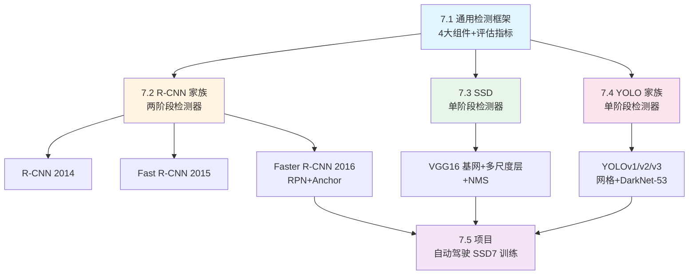

学完本章，你将能：
- 分清**分类 vs 检测**，理解检测任务多出来的"定位"到底难在哪；
- 讲清 **IoU / NMS / mAP** 三大基础概念（面试必考）；
- 说清 **R-CNN → Fast → Faster** 的进化主线，以及 **anchor / RPN / 多任务损失**；
- 对比**两阶段 vs 单阶段**（two-stage vs one-stage）检测器的速度—精度权衡；
- 读懂 SSD 与 YOLOv3 的架构与"框数怎么算出来的"；
- 上手一个自动驾驶场景的 SSD7 训练项目。

| 术语（英）| 中文 | 一句话解释 |
|---|---|---|
| Localization | 定位 | 画出目标的边界框 |
| Bounding box | 边界框 / 检测框 | `(x, y, w, h)`，中心点坐标 + 宽高 |
| RoI (Region of Interest) | 感兴趣区域 | 可能含目标的候选区域 |
| Objectness score | 目标性得分 | 该区域"有没有物体"的概率 |
| IoU | 交并比 | 预测框与真值框的重叠度 |
| NMS | 非极大值抑制 | 每个目标只留一个框 |
| mAP | 平均精度均值 | 检测器精度的核心指标 |
| Anchor / Prior | 锚框 / 先验框 | 预先铺好的参考框 |

---

## 7.0 分类 vs 检测：多出来的那一半难度 🔍

书里开篇用一张表（原书 Table 7.1）把两个任务对立起来，我把它整理成下表：

| | 图像分类（Image classification）| 目标检测（Object detection）|
|---|---|---|
| **目标** | 预测图中物体的类别 | 预测图中所有物体的**位置**（边界框）**和**类别 |
| **输入** | 一张图，**单个**主体 | 一张图，**一个或多个**物体 |
| **输出** | 一个类别标签（cat / dog…）| 每个物体一个边界框（坐标）+ 一个类别 |
| **示例输出** | "84% 是猫" | box1 坐标 `(x,y,w,h)` + 类别概率；box2 坐标 + 类别概率… |

> ⚠️ **坐标约定要记牢**：书里统一用 `(x, y, w, h)`，其中 **`(x, y)` 是边界框的中心点坐标**（不是左上角！），`w`、`h` 是框的宽和高。不同框架/数据集约定不同（有的用左上角+右下角 `xmin,ymin,xmax,ymax`，比如本章末尾的 Udacity 数据集），**读代码前先确认坐标格式**，否则框会画歪。

🔬 **第一性原理：检测为什么比分类难一个量级？**
分类只需在最后接一个 softmax，把整张图压成一个类别向量——这是一个**固定维度**的输出。而检测的输出维度是**可变**的：图里有几个物体、在哪、多大，事先都不知道。你不能用一个定长向量表示"任意多个框"。整章要讲的三大流派，本质上都是在回答同一个问题：**如何把"可变数量的框"这个难题，转化成神经网络能吃的"固定形状"输出？**
- R-CNN 家族的答案：先用算法**提议**一堆候选框，再逐个分类（两阶段）。
- SSD / YOLO 的答案：预先在图上**密集铺满**固定数量的框，让网络一次性对每个框做判断（单阶段）。

检测被广泛用于自动驾驶（识别车辆、行人、道路、障碍物来规划路线）、机器人抓取、安防（检测入侵者、危险品）等。

---

## 7.1 通用目标检测框架 🏗️

在扎进具体算法前，先建立一个"高层工作流"的心智模型。书里指出：一个典型的目标检测框架有**四大组件**。

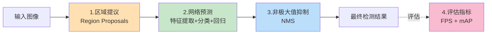

### 7.1.1 区域提议（Region proposals）📦

**是什么**：系统扫描图像，提出一批 **RoI**——它认为"很可能含有物体"的区域。衡量"含物体可能性"的分数叫 **objectness score（目标性得分）**。得分高的区域进入下一步，得分低的直接丢弃。

**怎么做**：
- 最早用 **selective search（选择性搜索）** 算法生成候选（后面讲 R-CNN 会展开）。
- 更先进的做法用深度网络提取的视觉特征来生成区域（Faster R-CNN 的 RPN 就是这类）。

**代价**：这一步会产生**大量（数千个）**候选框。区域越多，召回越全，但计算越贵。书里点破了这里的**权衡（trade-off）**：

> region 的数量 vs 计算复杂度——正确的做法是用**问题特定的信息**来减少 RoI 数量。

网络会给每个区域打 objectness score，超过阈值的判为**前景（foreground，有物体）**，否则判为**背景（background）**。这个阈值是可配置的。

### 7.1.2 网络预测（Network predictions）🧠

这一步用一个**预训练 CNN**（在 ImageNet / MS COCO 上训过的）做特征提取——因为分类预训练模型提取的特征"泛化得相当好"。然后对每个候选区域做**两个预测**：

1. **边界框预测（Bounding-box prediction）**：定位框的坐标 `(x, y, w, h)`。
2. **类别预测（Class prediction）**：经典 softmax，输出每个类别的概率。

> 💡 **关键观察**：因为提议了成千上万个区域，**同一个物体一定会被多个框同时框住**，且每个框都带正确的类别。书里举例：一只狗可能被 5 个 RoI 命中，于是有 5 个框围着它。检测和分类都对，但这不是我们要的——多数任务**每个物体只要一个框**。想象你做"数狗"的系统，5 个框会把 1 只狗数成 5 只。解决它，就要靠下一步的 NMS。

### 7.1.3 非极大值抑制（NMS）✂️

**是什么**：Non-Maximum Suppression，"非极大值抑制"。顾名思义，它在围着同一物体的所有框里，**找出预测概率最大的那个框，抑制（删除）其余的**。目标：把每个物体的候选框缩减到**唯一一个**。

书里给出的 **NMS 四步算法**：

1. **丢弃低置信度框**：所有预测概率低于**置信度阈值（confidence threshold）**的框直接删掉。
2. **选最高分框**：在剩下的框里，挑预测概率最高的那个。
3. **算重叠**：计算其余同类框与它的重叠度，即 **IoU**（下节详解）。IoU 高且同类的框被聚在一起。
4. **抑制高重叠框**：把与最高分框 IoU 大于 **NMS 阈值**（常用 0.5，可调）的框全部抑制掉。

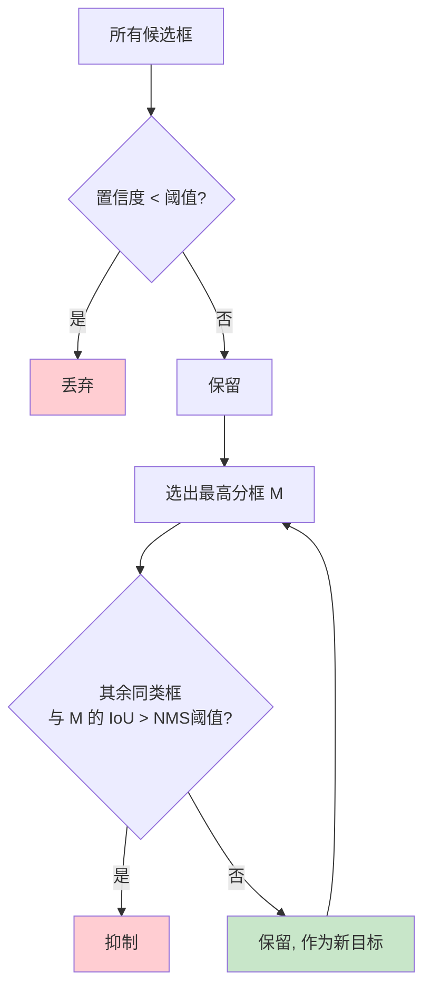

> ⚠️ **常见坑**：NMS 的两个阈值（**confidence threshold** 和 **NMS threshold**）要按场景调。想输出更多框就调低 NMS 阈值，想更干净就调高。密集小目标场景（如人群、车流）用标准 0.5 常常会误删相邻的真实目标——这是经典的"NMS 误伤"问题。

### 7.1.4 评估指标：IoU / mAP / FPS 📏

检测器用**两个核心指标**评估：**FPS**（速度）和 **mAP**（精度）。

#### ① FPS（Frames Per Second，每秒帧数）——测速度

最常用的速度指标。实时应用（自动驾驶、视频监控）对 FPS 要求很高。书里后面会给出对比：Faster R-CNN 只有 ~7 FPS，而 SSD300 能到 59 FPS。

#### ② IoU（Intersection over Union，交并比）——判定"预测对不对"的基础

**是什么**：IoU 衡量**预测框**与**真值框（ground truth）** 的重叠程度。

$$
\text{IoU} = \frac{\text{Area of overlap（交集面积）}}{\text{Area of union（并集面积）}} = \frac{B_{\text{predicted}} \cap B_{\text{ground truth}}}{B_{\text{predicted}} \cup B_{\text{ground truth}}}
$$

IoU 取值范围 **0（完全不重叠）到 1（100% 重叠）**。书里给了三档直观示例：

| IoU 值 | 质量 | 直观感受 |
|---|---|---|
| 0.4034 | Poor（差）| 框歪了一大截 |
| 0.7330 | Good（好）| 大致对上 |
| 0.9264 | Excellent（极好）| 几乎完美贴合 |

**IoU 怎么用来判定 TP/FP**：设一个 **IoU 阈值**（标准值 0.5，可调）。
- IoU **> 阈值** → 判为 **True Positive（TP，真正例）**——预测正确。
- IoU **< 阈值** → 判为 **False Positive（FP，假正例）**——预测错误。

> 💡 **面试高频**：`mAP@0.5` 和 `mAP@0.75` 是什么意思？
> 就是 IoU 阈值取 0.5 或 0.75 时算出的 mAP。COCO 挑战赛常用这两档。阈值越高，对框的贴合度要求越严，mAP 一般越低。COCO 的主指标其实是 `mAP@[0.5:0.95]`（10 个阈值取平均），本书用 0.5 单档讲清概念即可。

#### ③ 从 PR 曲线到 mAP——测精度

有了 TP、FP 的定义，就能算每个类别的**精确率（Precision）**和**召回率（Recall）**（第 4 章讲过）：

$$
\text{Precision} = \frac{TP}{TP + FP}, \qquad \text{Recall} = \frac{TP}{TP + FN}
$$

- **Precision（精确率）**：预测为正的框里，真正对的比例（衡量"报出来的准不准"）。
- **Recall（召回率）**：所有真实目标里，被找到的比例（衡量"该找的找全没"）。
- **FN（False Negative，假负例）**：漏检的真实目标。

**PR 曲线（Precision-Recall curve）**：通过**改变置信度阈值**，逐点画出 (Recall, Precision) 得到曲线。

> 好检测器的标志：**随着 recall 上升，precision 依然保持高位**。差检测器为了拉高 recall，只能增加 FP（precision 下降）。所以 PR 曲线通常**从高精确率起步，随召回上升而下降**。

**mAP 的完整计算（书里的 RECAP 五步）**：

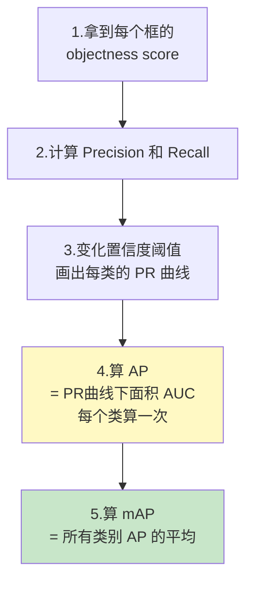

- **AP（Average Precision，平均精度）** = PR 曲线下的面积（AUC）。**每个类别**算一个 AP。
- **mAP（mean Average Precision，平均精度均值）** = 所有类别 AP 的**平均值**。

> ⚠️ 书里提醒：有些论文把 **AP 和 mAP 混用**，看论文时注意上下文。另外 mAP 比 accuracy 这种传统指标计算复杂得多——**好消息是绝大多数检测框架都帮你算好了**，不用手写。

> 🔬 **为什么检测用 mAP 而不是 accuracy？** 分类每张图一个标签，accuracy 直接可算。但检测的输出是"一堆带置信度的框"，同一张图既可能漏检（FN）又可能误检（FP），还要看框贴不贴合（IoU）。单一 accuracy 无法同时刻画"准、全、贴"。mAP 通过"扫置信度阈值 + 取曲线面积 + 跨类平均"，把这几个维度压成一个可比较的标量——这是**用曲线下面积一次性平衡 precision 与 recall** 的经典思路。

---

## 7.2 R-CNN 家族：两阶段检测器的开山祖 🧱

**R-CNN**（Region-based CNN，基于区域的卷积神经网络）由 Ross Girshick 等人 2014 年提出，随后演化出 **Fast R-CNN（2015）** 和 **Faster R-CNN（2016）**。这是一条清晰的进化主线，我们逐个看。

### 7.2.1 R-CNN（2014）：把检测变成"逐区域分类" 🐣

R-CNN 是家族里最朴素的一个，但它是理解后续所有算法的**基石**。它在 PASCAL VOC-2012 和 ILSVRC 2013 上拿到了当时的 SOTA。

**R-CNN 的四大模块**：

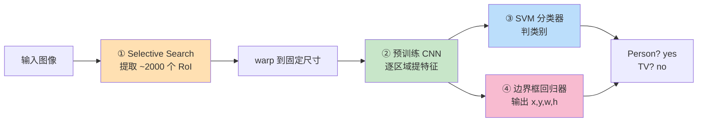

1. **提取 RoI（Selective Search）**：一个叫 **selective search** 的算法扫描图像，找出"像物体"的区域（blob），提出约 **2000 个** RoI。因为 CNN 要求**固定输入尺寸**，这些大小不一的 RoI 会被 **warp（拉伸/扭曲）** 到统一尺寸。
2. **特征提取模块**：对每个候选区域跑一遍预训练 CNN，提取特征。
3. **分类模块**：训一个 **SVM（支持向量机）** 这种传统机器学习分类器，基于特征判类别。
4. **定位模块（边界框回归器）**：这是个**回归**问题（输出连续值，不是离散类别），预测 4 个实数 `(x, y, w, h)` 来定位框。

> 📌 **Selective Search 是什么**（书里的补充框）：一个**贪心搜索**算法，结合了**穷举搜索**（检查所有可能位置）和**自底向上分割**（层次化地把相似区域合并）。工作流程：
> 1. 计算所有相邻区域的相似度；
> 2. 合并最相似的两个区域，重新计算新区域与邻居的相似度；
> 3. 重复，直到整个物体被一个区域覆盖。
> 递归合并出约 **2000 个**待检查区域。书里说：把它当**黑盒**就行，它智能地扫图并提出 RoI 位置。

**训练 R-CNN**：四个模块里，除了 selective search 不用训，其余三个都要**分别训练**：
1. 训特征提取 CNN（从头训很少见，通常是 fine-tune 预训练网络）；
2. 训 SVM 分类器；
3. 训边界框回归器（为 K 个类别各输出 4 个实数，收紧框）。

**R-CNN 的致命缺点** ⚠️（书里明确列出）：

| 缺点 | 原因 |
|---|---|
| **检测极慢** | 每张图 ~2000 个 RoI，**每个都要独立跑一遍 CNN 前向**，无计算共享。50 秒/图，无法实时。|
| **训练是多阶段流水线** | CNN + SVM + 回归器三个模块分开训，流程复杂，非端到端。|
| **训练费时费空间** | 特征要写到磁盘，深网络（如 VGG16）训几千张图要**几天 GPU**，特征占**几百 GB**。|

> 🔬 **本质**：R-CNN 不是一个端到端学习定位的深度网络，而是**多个独立算法拼起来**做检测。它证明了"CNN 特征 + 逐区域分类"这条路能work，但把 2000 个重叠区域各跑一次 CNN 的重复计算，就是它慢的病根。后面两代都在**消除这个重复计算**。

### 7.2.2 Fast R-CNN（2015）：一张图只跑一次 CNN ⚡

Ross Girshick 2015 年提出 Fast R-CNN，两个关键改动直击 R-CNN 的痛点：

1. **先提特征，再提区域**：不再对 2000 个区域各跑一次 CNN，而是**先对整张图跑一次 CNN**得到特征图，再在特征图上提区域。→ 从 2000 次卷积降到 **1 次**。
2. **用 softmax 替代 SVM**：把分类任务并入 CNN，用一个 softmax 层直接输出类别概率。→ 一个模型搞定"特征提取 + 分类"。

**Fast R-CNN 架构模块**：

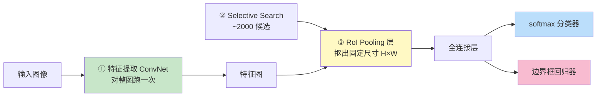

- **RoI Pooling 层**（新组件）：用 max pooling 把任意大小的 RoI 特征转成**固定尺寸 H×W** 的小特征图，再送进全连接层。（细节在 Faster R-CNN 节讲。）
- **两头输出（Two-head output）**：模型分叉成两个 head——softmax 分类器 + 边界框回归器。

> ⚠️ 注意：Fast R-CNN 是在**最后一层特征图**上提议区域（不像 R-CNN 从原图提），这样只需训**一个** ConvNet。

#### 多任务损失（Multi-task loss）——Fast R-CNN 的核心公式

因为 Fast R-CNN 端到端地同时学"类别"和"框"，损失是**多任务损失**。目标检测要优化两件事：**分类**和**定位**，所以有两个损失：$L_{cls}$（分类）和 $L_{loc}$（定位）。

**① 分类损失**（对 K+1 个类别，+1 是背景类）：

$$
L_{cls}(p, u) = -\log p_u
$$

其中 $u$ 是真实标签（$u=0$ 表示背景），$p$ 是 RoI 在 K+1 类上的概率分布。这就是标准的 log loss。

**② 定位损失**（用 smooth L1）：

$$
L_{loc}(t^u, u) = \sum_{i} \text{L1}_{\text{smooth}}(t_i^u - v_i)
$$

- $v = (x, y, w, h)$ 是真值框；
- $t^u = (t_x^u, t_y^u, t_w^u, t_h^u)$ 是预测的框修正量；
- **smooth L1** 是一种鲁棒损失函数，书里强调它**对离群点比 L2 更不敏感**。

**③ 总损失**：

$$
L(p, u, t^u, v) = L_{cls}(p, u) + [u \geq 1]\, L_{box}(t^u, v)
$$

其中**指示函数** $[u \geq 1]$ 的作用是：**当区域是背景时（$u=0$），把定位损失清零**。

$$
[u \geq 1] = \begin{cases} 1 & \text{if } u \geq 1 \\ 0 & \text{otherwise} \end{cases}
$$

> 💡 **为什么背景要屏蔽定位损失？** 背景里根本没有物体，"框在哪"毫无意义，硬去回归一个不存在物体的框只会污染梯度。指示函数就是"只有确实有物体时，才惩罚框回归"。这个技巧后面 Faster R-CNN、SSD、YOLO 全都在用。

**Fast R-CNN 的剩余瓶颈** ⚠️：测试快多了（一张图只卷一次），训练也在一个网络里。但 **selective search 生成区域这一步依然很慢，而且是另一个独立模型算出来的**——不是端到端。要真正端到端，就得把"区域提议"也塞进网络里。这就是 Faster R-CNN 做的事。

### 7.2.3 Faster R-CNN（2016）：用 RPN 把区域提议焊进网络 🚀

Shaoqing Ren 等人 2016 年提出。核心创新：**用 RPN（Region Proposal Network，区域提议网络）替代 selective search**，让"提区域"也变成网络的一部分，可训练、可共享特征。至此检测器**第一次做到端到端、接近实时**。

**Faster R-CNN = 两个网络**：

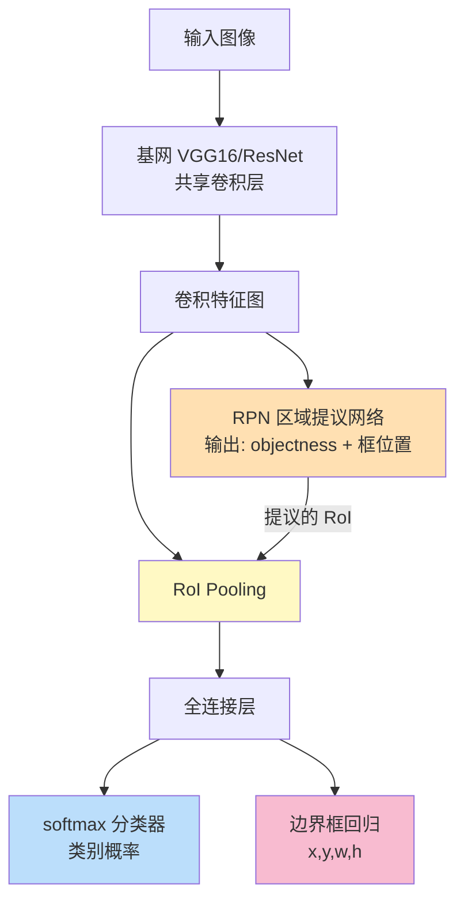

1. **RPN**：一个卷积网络，从基网最后的特征图上**提议 RoI**。两个输出——**objectness score**（有/无物体）和**框位置**。
2. **Fast R-CNN 部分**：基网（预训练 CNN 提特征）+ RoI Pooling + 输出层（softmax 分类 + 框回归）。

**关键点**：RPN 和 Fast R-CNN **共享**预训练 VGG16 的卷积层——省算力的核心。整个流水线（特征提取 → 区域提议 → RoI Pooling → 分类 → 框回归）全在一个网络里，端到端可训。

#### 基网（Base network）

先拿一个预训练 CNN（原论文用 ZF 和 VGG），**切掉分类头**，只留特征提取部分。书里对比了几个基网的规模：

| 基网 | 参数量 | 特点 |
|---|---|---|
| MobileNet | ~330 万 | 小而快，移动端优化 |
| ResNet-152 | ~6000 万 | 曾经的 ImageNet SOTA，深、容量大 |
| DenseNet | 更少参数、更好结果 | 更新的架构 |

> 📌 **VGG vs ResNet**（书里补充框）：如今 **ResNet 基本取代 VGG** 做基网。ResNet 层数更多（更深）→ 容量更大 → 能学更复杂特征；且靠**残差连接 + 批归一化（BN）** 让深网络好训（VGG 时代还没发明 BN）。

#### RPN 详解：objectness + anchor 的精髓

RPN 又叫 **attention network（注意力网络）**——它引导网络"注意"到图里有意思的区域。RPN 结构（原书 Figure 7.12）：

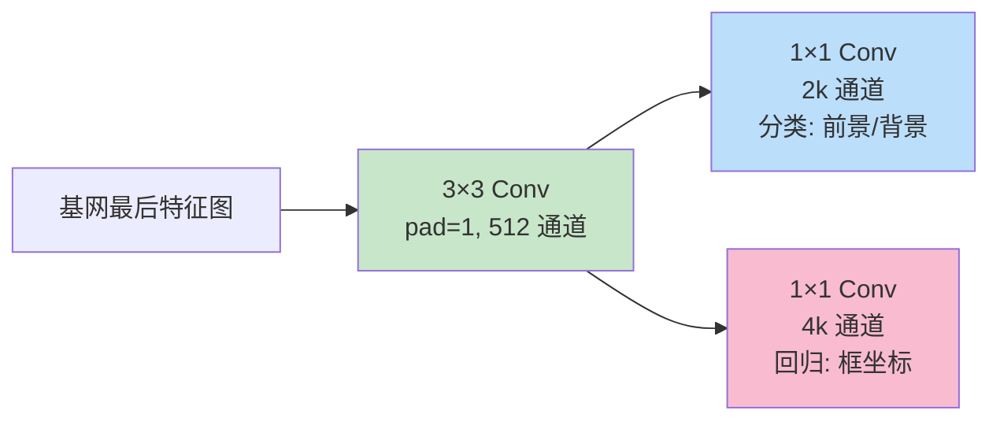

- 一个 **3×3 全卷积层**（512 通道）像滑窗一样扫过特征图；
- 输出分叉给**两个并行的 1×1 卷积层**：一个**分类层**（判前景/背景），一个**回归层**（预测框）。

> ⚠️ **关键区分**：RPN 的分类器**不预测物体类别**，只用**二分类**预测 objectness score——"这块区域里有没有物体？"有就往后送给全连接层做真正的分类。别把 RPN 的 objectness 和最终的类别预测搞混。

> 📌 **FCN（全卷积网络）**（书里补充框）：检测网络应当是**全卷积**的——没有全连接层。好处有二：① **更快**（只有卷积）；② **能接受任意分辨率的输入图**。全卷积让网络对输入尺寸不敏感。但实践中为了**批处理**（GPU 并行加速），一个 batch 里的图仍需统一尺寸。

#### Anchor boxes（锚框）：本章最重要的概念之一 ⚓

**为什么要 anchor？** 书里点破了一个直接回归中心点 `(x, y)` 的难题：网络得强行保证预测值落在图像边界内，很难约束。**解决方案**：预先铺好一批**参考框（anchor boxes / 锚框）**，让回归层**预测相对锚框的偏移量（deltas）** $(\Delta x, \Delta y, \Delta w, \Delta h)$ 来微调锚框，而不是从零预测绝对坐标。

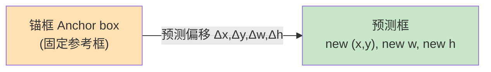

**anchor 怎么铺**：滑窗在特征图**每个位置**生成 **k 个** anchor box，都以该滑窗中心为中心，但**尺度（scale）和长宽比（aspect ratio）各不相同**，以覆盖各种大小/形状的物体。原论文用 **9 个 anchor**（3 种长宽比 × 3 种尺度）。

**训练 RPN**：用人工标注的真值框训练。对每个 anchor 算它与真值框的重叠度 $p$：

$$
p = \begin{cases} 1 & \text{if IoU} > 0.7 \quad \text{(正样本，含物体)} \\ -1 & \text{if IoU} < 0.3 \quad \text{(负样本，背景)} \\ 0 & \text{otherwise \quad (忽略)} \end{cases}
$$

> 💡 **注意中间的"忽略区"**：IoU 在 0.3～0.7 之间的 anchor 既不算正也不算负，训练时直接跳过。因为这些"模棱两可"的框会给分类器传递噪声信号。这是 anchor 匹配的标准做法。

**RPN 的输出维度**：每个位置 k 个 anchor → RPN 输出 **2k 个分数**（每个 anchor 前景/背景各一分）和 **4k 个坐标**。例如 k=9 → 18 个 objectness 分数 + 36 个坐标。

> 💡 **面试高频：RPN 能单独用吗？**（书里补充框）能。在**单类检测**问题里（比如只检测人脸），objectness 概率可直接当类别概率——因为"前景 = 那唯一的类，背景 = 不是"。好处是 RPN 只用卷积层，**训练和推理都很快**。

#### Faster R-CNN 的多任务损失

和 Fast R-CNN 一样是多任务损失，但符号更细：

$$
L(\{p_i\}, \{t_i\}) = \frac{1}{N_{cls}} \sum_i L_{cls}(p_i, p_i^*) + \frac{\lambda}{N_{loc}} \sum_i p_i^* \cdot \text{L1}_{\text{smooth}}(t_i - t_i^*)
$$

书里贴心地给了一张符号表（原书 Table 7.2）：

| 符号 | 含义 |
|---|---|
| $p_i$ / $p_i^*$ | 预测的 anchor 目标性概率 / 真值（0 或 1）|
| $t_i$ / $t_i^*$ | 预测的 4 个框参数 / 真值框参数 |
| $N_{cls}$ | 分类损失归一化项，Ren 等设为 mini-batch ≈ **256** |
| $N_{loc}$ | 回归损失归一化项，设为 anchor 位置数 ≈ **2400** |
| $L_{cls}(p_i, p_i^*)$ | 二分类 log loss：$-p_i^*\log p_i - (1-p_i^*)\log(1-p_i)$ |
| $\text{L1}_{\text{smooth}}$ | 鲁棒的框回归损失（对离群点比 L2 不敏感）|
| $\lambda$ | 平衡系数，设 ≈ **10**（让分类和定位两项权重大致相等）|

书里教了个读复杂公式的诀窍：**先忽略归一化项和求和下标 (i)**，看单个实例的简化版：

$$
\text{Loss} = L_{cls}(p, p^*) + p^* \cdot \text{L1}_{\text{smooth}}(t - t^*)
$$

- 第一项**分类损失** = 交叉熵（预测概率 $p$ 与真值 $p^*$ 的误差）；
- 第二项**定位损失** = 预测框与真值框的 smooth L1 差异，**再乘以 $p^*$**——如果不是物体（$p^*=0$），整个定位损失被清零（和 Fast R-CNN 的指示函数异曲同工）；
- 两者相加，再把 $\sum$ 和 (i) 放回去求和。

> 🔬 **λ 与 N 的作用（第一性原理）**：分类和回归两个损失的**数值量级不一样**，且**正样本数远少于总 anchor 数**。$N_{cls}$、$N_{loc}$ 做归一化，$\lambda$ 做量级平衡——目的是**让两个任务的梯度贡献大致均衡**，不让某一个损失主导优化。这是所有多任务学习的通用工程手法。

### 7.2.4 R-CNN 家族总结：一张表看进化 📊

书里 Table 7.3 是全章最该背下来的对比表（数据基于 PASCAL VOC 2007）：

| | **R-CNN** | **Fast R-CNN** | **Faster R-CNN** |
|---|---|---|---|
| **mAP (VOC 2007)** | 66.0% | 66.9% | 66.9% |
| **区域提议方式** | Selective Search（对**原图**）| Selective Search（对**特征图**）| **RPN**（网络学习）|
| **CNN 前向次数** | ~2000 次（每区域一次）| **1 次**（整图）| 1 次（整图）|
| **分类器** | SVM（分开训）| softmax（并入网络）| softmax |
| **端到端** | ❌ 三个独立模型 | ⚠️ SS 仍独立 | ✅ 完全端到端 |
| **测试时间/图** | **50 秒** | **2 秒** | **0.2 秒** |
| **相对 R-CNN 加速** | 1× | **25×** | **250×** |
| **主要局限** | 每区域独跑 CNN，慢；三模型 | SS 慢，仍非端到端 | 区域提议仍耗时；多系统串联 |

> 💡 **一句话记住进化主线**：
> **R-CNN**（selective search + 逐区域 CNN + SVM）→ **Fast R-CNN**（整图 CNN + RoI Pooling + softmax，但 SS 仍慢）→ **Faster R-CNN**（RPN 取代 SS，端到端，250 倍加速）。

**R-CNN 家族的共同局限**（书里点明）：训练笨重耗时、多阶段训练、推理仍慢——**没有一个能真正实时**。要实时，得换思路——这就引出了单阶段检测器。

### 两阶段 vs 单阶段检测器：全章的核心分野 ⚖️

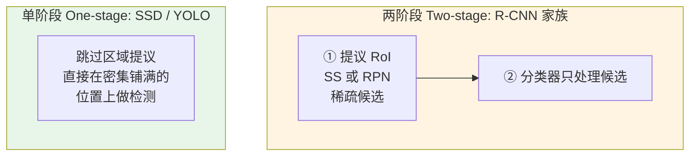

| | 两阶段（Two-stage）| 单阶段（One-stage）|
|---|---|---|
| 代表 | R-CNN 家族 | SSD、YOLO |
| 流程 | 先提议 RoI（稀疏），再分类 | 跳过提议，直接在密集采样位置检测 |
| 精度 | **更高** | 略低 |
| 速度 | 慢 | **显著更快** |
| 适用 | 精度优先 | 实时优先 |

> 🔬 **核心权衡（记住这句）**：**单阶段通常精度略逊于两阶段，但速度显著更快。** 之所以单阶段快，是因为它省掉了"提议区域"这一步，用"预先密集铺满固定数量的框，一次性判断"来换速度；代价是要处理海量框（大部分是背景），精度会有损失。

---

## 7.3 SSD：单次多框检测器 🎯

**SSD**（Single Shot MultiBox Detector，单次多框检测器）由 Wei Liu 等人 2016 年提出，创下了当时的性能记录：在 PASCAL VOC / MS COCO 上 **74%+ mAP @ 59 FPS**。

**"single-shot"的含义**：R-CNN 家族是多阶段（先算 objectness，再送分类器）；SSD/YOLO 让卷积层**一次性直接做出两个预测**——图像只过一遍网络。每个框的 objectness 用**逻辑回归**预测（表示与真值的重叠度：100% 重叠 → 1，无重叠 → 0），阈值设 0.5：高于 50% 认为有物体。

### 7.3.1 SSD 高层架构：三大部分

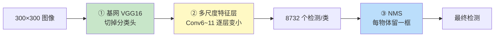

1. **基网提特征**：预训练分类网（原论文用 **VGG16**），切掉分类层。
2. **多尺度特征层**：基网后面接一串卷积，**尺寸逐层递减**，以在**多个尺度**上做检测。
3. **NMS**：消除重叠框，每个物体留一个。

书里指出：层 **4_3、7、8_2、9_2、10_2、11_2** 直接向 NMS 层做预测。

### 🔢 8732 从哪来？——SSD 框数计算（面试高频）

不同尺度的特征图各配一个 3×3 卷积做检测。每个位置配几个默认框（default box），每框输出 `(类别数 + 4 个框值)`。设 20 类 + 1 背景：

| 特征层 | 特征图尺寸 | 每位置框数 | 框数 |
|---|---|---|---|
| Conv4_3 | 38 × 38 | 4 | **5776** |
| Conv7 | 19 × 19 | 6 | 2166 |
| Conv8_2 | 10 × 10 | 6 | 600 |
| Conv9_2 | 5 × 5 | 6 | 150 |
| Conv10_2 | 3 × 3 | 4 | 36 |
| Conv11_2 | 1 × 1 | 4 | 4 |
| **合计** | | | **8732** |

$$
5776 + 2166 + 600 + 150 + 36 + 4 = \boxed{8732 \text{ 个框}}
$$

> 💡 对比：YOLO 最后 7×7 位置、每位置 2 框 = **98 框**（YOLOv1）。SSD 框多得多，所以**必须靠 NMS 大幅削减**。

### 7.3.2 基网：VGG16

SSD 建在 **VGG16** 上（切掉全连接分类层），因为它在高质量图像分类上表现强、迁移学习效果好。书里给了 Keras 代码片段（典型 VGG16），两个要点：
- **conv4_3** 层会被拿去**直接做预测**；
- **pool5** 层送给下一层 conv6，即多尺度特征层的第一层。

书里贴的 VGG16 前几层代码（逐行看结构，无需背）：

```python
conv1_1 = Conv2D(64, (3, 3), activation='relu', padding='same')
conv1_2 = Conv2D(64, (3, 3), activation='relu', padding='same')(conv1_1)
pool1   = MaxPooling2D(pool_size=(2, 2), strides=(2, 2), padding='same')(conv1_2)
# ... conv2/3/4/5 结构类似, 通道数 64→128→256→512→512, 每组后接 pool
conv4_3 = Conv2D(512, (3, 3), activation='relu', padding='same')(conv4_2)  # 拿去直接预测
pool5   = MaxPooling2D(pool_size=(3, 3), strides=(1, 1), padding='same')(conv5_3)  # 送 conv6
```

> 📌 **每个框的输出长啥样**（书里补充框）：对每个特征位置，网络预测 —— **4 个框值 `(x,y,w,h)` + 1 个 objectness 分数 + C 个类别概率**，共 **5 + C** 个值。若有 4 类，一个预测向量是 `[x, y, w, h, objectness, C1, C2, C3, C4]`。

**基网怎么做预测**（书里的船只例子）：
1. SSD 在图上**铺一层 anchor 网格**（SSD 里 anchor 叫 **priors，先验框**），每个 anchor 中心生成一组框；
2. 网络把每个框当独立小图看，问："这框里有船吗？"（"我提到船的特征了吗？"）；
3. 找到含船特征的框，就把坐标和分类送去 NMS；
4. NMS 只留与真值框重叠最大的那个。

> ⚠️ **术语对照**：R-CNN 叫 **anchor**，SSD 叫 **prior**，YOLO 也用 anchor——**都是同一个东西**：预先铺好的参考框。

> 📌 **基网可换**：VGG19、ResNet 更深、精度可能更高但更慢；**MobileNet** 是精度与速度的好折中。

### 7.3.3 多尺度特征层：为什么要"逐层变小" 🔭

**核心动机**（书里的马群例子）：一张图里的物体**大小不一**。基网能检测远处的小马（能塞进 anchor），但可能**检测不到离镜头最近的大马**——因为把那匹大马的框单独抠出来看，根本看不出马的特征（框太小只框到局部）。

**传统笨办法**：把图缩放成不同尺寸各跑一遍再合并——太贵。
**SSD 的聪明办法**：用**同一个网络里不同大小的特征层**做预测，**共享参数**跨所有尺度。

> 🔬 **第一性原理**：CNN 逐层下采样，特征图分辨率逐渐降低。**低分辨率的深层特征图**（每个格子"看"的原图区域大，感受野大）→ 用来检测**大物体**；**高分辨率的浅层特征图**（感受野小）→ 检测**小物体**。书里的话："SSD 用低分辨率层检测大尺度物体，例如 4×4 特征图检测更大物体，8×8 检测更小物体。"

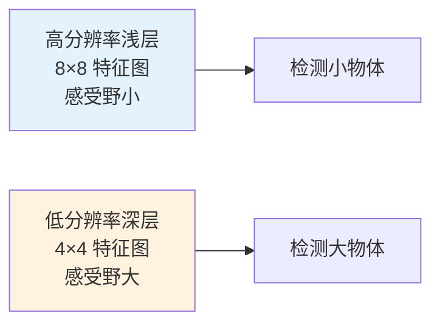

> ⚠️ **注意理解误区**：卷积层**并不真的把图缩小**成一张能看的小图。图经过卷积后会变成"完全随机的样子"，但**保留了特征**。书里的"缩小图"只是帮你直观理解的比喻。

**多尺度有多重要？**（原书 Figure 7.23 实验）：预测源从**全部 6 层**降到**1 层**，mAP 从 **74.3% 暴跌到 62.4%**。用单独 conv7 层预测时性能最差。结论：**必须把不同尺度的框分散到不同层上**。

**多尺度层架构**：Liu 等人加了 6 个逐渐变小的卷积层（大量试错调出来的）。conv6 核 3×3，conv7 核 1×1；conv8～11 是"块"（每块两个卷积，核 1×1 和 3×3）。书里的 Keras 代码：

```python
# conv6 和 conv7 —— 注意 conv6 用了空洞卷积 dilation_rate=(6,6)
conv6 = Conv2D(1024, (3, 3), dilation_rate=(6, 6), activation='relu', padding='same')(pool5)
conv7 = Conv2D(1024, (1, 1), activation='relu', padding='same')(conv6)
# conv8 块: 1×1 降维 + 3×3 stride=2 下采样
conv8_1 = Conv2D(256, (1, 1), activation='relu', padding='same')(conv7)
conv8_2 = Conv2D(512, (3, 3), strides=(2, 2), activation='relu', padding='valid')(conv8_1)
# conv9/10/11 块结构类似, 通道数递减
```

> 📌 **空洞卷积 / 膨胀卷积（Atrous / Dilated Convolution）**（书里补充框）：给卷积核引入一个**膨胀率（dilation rate）** 参数，定义核内值的间距。一个 **3×3 核 + 膨胀率 2** 拥有和 **5×5 核相同的感受野，却只用 9 个参数**（想象把 5×5 核每隔一行一列删掉）。好处：**用同样的算力得到更宽的感受野**。在实时分割里特别流行。Keras 写法：`Conv2D(1024, (3,3), dilation_rate=(2,2), ...)`。

### 7.3.4 SSD 的 NMS

SSD 每类生成海量框，必须靠 NMS 剪枝。做法：
1. 按**置信度分数**排序预测框；
2. 从最高分开始，计算同类中其他框与它的 IoU；
3. IoU **超过阈值**（Liu 等人用 **0.45**）的框被忽略（它们和高分框重叠太多，很可能检的是同一物体）；
4. **每张图最多留 top 200 个预测**。

---

## 7.4 YOLO：你只看一次 👁️

**YOLO**（You Only Look Once）由 Joseph Redmon 等人提出，是最早的快速实时检测器之一。三代进化：

| 版本 | 年份 | 特点 | mAP |
|---|---|---|---|
| **YOLOv1** | 2016 | "统一、实时"——把检测和分类统一成单网络 | — |
| **YOLOv2 (YOLO9000)** | 2016 | 能检 9000+ 类；引入预定义 anchor | 16%（不高但极快）|
| **YOLOv3** | 2018 | 显著更大；YOLO 家族最佳 | **57.9%** |

> YOLO 精度接近但不及 R-CNN，胜在**速度**，常用于**实时视频/摄像头**。本节重点讲 **YOLOv3**（当时 YOLO 家族 SOTA）。

### YOLO 的核心思路：网格化 🔲

YOLO **不做区域提议**。它把输入图切成 **S×S 的网格（grid）**，每个网格格子（cell）**直接**预测框和类别。

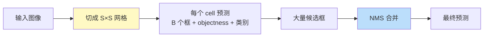

**责任分配规则**：如果某个真值框的**中心**落在某个 cell 里，**这个 cell 就负责检测那个物体**。

### 7.4.1 YOLOv3 每个 cell 预测什么

每个 grid cell 预测 **B 个框**，每个框含：

**① B 个框的坐标** $(b_x, b_y, b_w, b_h)$，其中 x、y 是**相对 cell 位置的偏移**。

**② Objectness 分数** $P_0$（过 sigmoid 变成 0～1 概率）：

$$
P_0 = \Pr(\text{containing an object}) \times \text{IoU}(\text{pred}, \text{truth})
$$

> 💡 这个公式很妙：objectness 不只是"有没有物体"，还**乘上了预测框与真值的 IoU**——即"有物体"的置信度天然包含了"框贴不贴合"。这样一个分数就同时编码了"存在性"和"定位质量"。

**③ 类别预测**：若框含物体，预测 K 个类别的概率。

> ⚠️ **面试高频：v3 为什么把 softmax 换成 sigmoid？**
> v3 之前用 **softmax** 算类别分数，但 softmax 隐含"**每个框恰好属于一个类**"（属于 A 就绝不属于 B）。这在某些数据集成立，但遇到 **Women 和 Person** 这种**可共存**的标签就错了（一个人既是 Women 又是 Person）。改用 **sigmoid** 做**多标签（multilabel）** 建模，更贴合真实数据。

**每个 cell 的预测向量**（原书 Figure 7.26）形如：`[框坐标(4), objectness(1), 类别(K)]`，即每框 `5 + K` 个值，B 个框 × S×S 个格子：

$$
\text{总预测值} = S \times S \times (5B + K)
$$

### YOLOv3 的多尺度预测 🔭

和 SSD 的多尺度异曲同工：YOLOv3 有 **9 个 anchor**，在**三个不同尺度**上预测（每尺度 3 个 anchor，即每 cell B=3 个框）。检测层在**步长（stride）32、16、8** 的三种特征图上做检测。

对 **416×416** 输入图：

| 尺度（特征图）| 步长 | 负责检测 |
|---|---|---|
| 13 × 13 | 32 | **大**物体 |
| 26 × 26 | 16 | **中**物体 |
| 52 × 52 | 8 | **小**物体 |

> 📌 **上采样（upsampling）的关键作用**：v2 常被吐槽检不到**小物体**（下采样丢了细粒度特征）。v3 的做法：先下采样到 stride 32 做第一次检测，然后**上采样 2 倍**、与前面同尺寸的浅层特征图**拼接（concatenate）**，在 stride 16 做第二次检测；再重复一次，在 stride 8 做第三次。上采样+拼接让网络**保留细粒度特征**，对小目标检测至关重要。

**YOLOv3 输出多少框？**（面试高频计算）对 416×416：

$$
[(52\times52) + (26\times26) + (13\times13)] \times 3 = (2704 + 676 + 169) \times 3 = \boxed{10647 \text{ 个框}}
$$

削减到 1 个的两步：① 按 objectness 分数**过滤**（低于阈值丢弃）；② **NMS** 治多重检测。

### 7.4.2 YOLOv3 架构：DarkNet-53 🕸️

YOLO 是**单网络**，统一检测和分类。架构受 GoogLeNet（Inception）启发，但**用 1×1 降维层 + 3×3 卷积**替代 Inception 模块——Redmon 称之为 **DarkNet**。

| 版本 | 骨干 | 层数 | 问题 |
|---|---|---|---|
| YOLOv2 | Darknet-19 | 19 + 11 = 30 层 | 无残差、无跳连、无上采样 → 检不到小物体 |
| YOLOv3 | **Darknet-53** | 53 + 53 = **106 层**全卷积 | 更慢，但精度大涨 |

**Darknet-53 的关键升级**（v2 所缺的现代要素，v3 全补上）：**残差块（residual blocks）、跳跃连接（skip connections）、上采样（upsampling）**。Darknet-53 有 53 层、在 ImageNet 上训练；检测时再叠 53 层，共 106 层全卷积。

**完整数据流**（原书 Figure 7.30）：

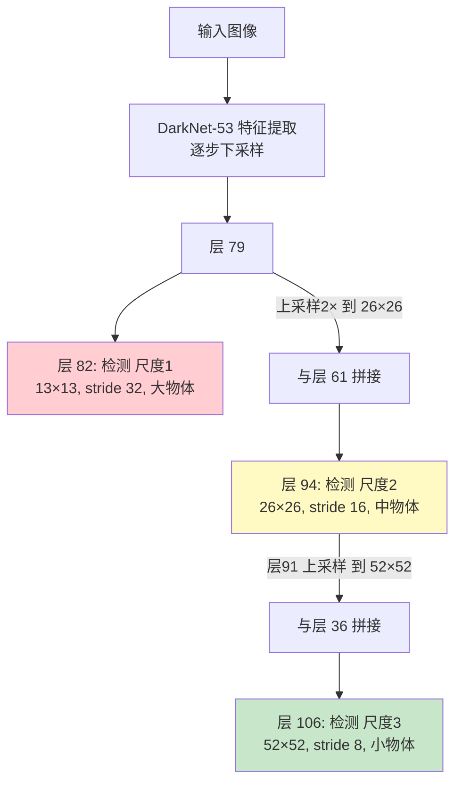

- 图过 DarkNet-53，下采样到层 79 → 层 82 在 **13×13** 做第一次检测（大物体）；
- 层 79 特征图上采样 2× 到 26×26，与**层 61** 拼接 → 层 94 在 **26×26** 检测（中物体）；
- 层 91 上采样后与**层 36** 深度拼接 → 层 106 在 **52×52** 检测（小物体）。

> 🔬 **YOLO 慢在哪、又为何值得**：v3 比 v2 慢，是因为 106 层比 30 层深得多。但残差连接让深网络可训、上采样+多尺度拼接让小目标可检——**这是用深度和多尺度换精度**，把 mAP 从 v2 的 16% 拉到 57.9%。

### SSD vs YOLO 快速对比 ⚖️

| | SSD | YOLOv3 |
|---|---|---|
| 提出年份 | 2016 | 2018 |
| 基网 | VGG16 | Darknet-53 |
| 多尺度 | 6 个不同尺寸卷积层 | 3 个尺度（stride 32/16/8）|
| 框数（典型）| 8732 | 10647 |
| 类别激活 | softmax | **sigmoid**（多标签）|
| objectness | 逻辑回归 | sigmoid，且 = Pr × IoU |
| 共同点 | **单阶段**、一次前向、用 anchor、靠 NMS 剪枝 | 同 |

---

## 7.5 项目：训练 SSD 网络做自动驾驶检测 🚗

代码基于 Pierluigi Ferrari 的 [ssd_keras 仓库](https://github.com/pierluigiferrari/ssd_keras)，随书代码可下载。为了能在个人电脑上训练，本项目用的是 **SSD7**——SSD300 的**七层精简版**（不是最优架构，但够快，作者说在 CPU 上约训 20 小时，GPU 快很多）。

**数据集**：Udacity 自动驾驶玩具数据集，22000+ 张标注图，**5 类**：car、truck、pedestrian、bicyclist、traffic light。图统一 resize 到 **高 300 × 宽 480**。标注是 CSV 格式（`frame, xmin, xmax, ymin, ymax, class_id`）——注意这里坐标是**左上/右下角**格式，不是中心+宽高。

> 📌 **标注工具**（书里补充框）：自己标数据可用开源工具 **LabelImg**（`pip install labelImg`），简单易上手。

### 训练七步流程

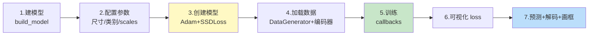

**Step 1–2：建模型 + 配置**。关键配置参数（书里代码）：

```python
img_height, img_width, img_channels = 300, 480, 3   # 输入尺寸
intensity_mean, intensity_range = 127.5, 127.5      # 归一化到 [-1, 1]
n_classes = 5                                        # 5 个正类(类ID 0 永远留给背景)
scales = [0.08, 0.16, 0.32, 0.64, 0.96]             # anchor 尺度因子(逐层变大)
aspect_ratios = [0.5, 1.0, 2.0]                     # anchor 长宽比
two_boxes_for_ar1 = True                            # 长宽比=1 时生成两个框
variances = [1.0, 1.0, 1.0, 1.0]                    # 编码坐标的缩放方差
normalize_coords = True                             # 用相对图像尺寸的坐标
```

> ⚠️ **坑：类别 ID 0 必须留给背景**。`n_classes=5` 指 5 个**正类**，加背景实际是 6。SSD/检测框架几乎都有这个约定，标数据时别把真实类别编成 0。

**Step 3：创建模型 + 损失**。用 Adam 优化器 + 自定义 `SSDLoss`（多任务：分类 log loss + 定位 smooth L1）：

```python
adam = Adam(lr=0.001, beta_1=0.9, beta_2=0.999, epsilon=1e-08)
ssd_loss = SSDLoss(neg_pos_ratio=3, alpha=1.0)   # 参数同 SSD 论文
model.compile(optimizer=adam, loss=ssd_loss.compute_loss)
```

> 💡 **`neg_pos_ratio=3` 是什么**——**难负样本挖掘（hard negative mining）**。8732 个框里绝大多数是背景（负样本），正负极度不平衡。SSD 规定**负:正 = 3:1**，只挑损失最大的负样本参与训练，防止背景淹没正样本梯度。这是 SSD 的关键工程技巧（书里代码带出，值得记）。

**Step 4：加载数据**。用 `DataGenerator` 解析 CSV，划分训练 18000 / 验证 4241 张。关键是 **`SSDInputEncoder`**——把真值框编码成 SSD 损失需要的格式，它要知道各预测层的空间尺寸来**生成 anchor**，匹配规则：

```python
ssd_input_encoder = SSDInputEncoder(
    ...,
    pos_iou_threshold=0.5,   # IoU>0.5 的 anchor 判为正样本
    neg_iou_limit=0.3,       # IoU<0.3 判为负样本(和 RPN 的 0.7/0.3 一个思路)
    matching_type='multi', ...)
```

还定义了丰富的**数据增强链**（随机亮度/对比度/饱和度/色相/翻转/平移/缩放）——检测任务数据增强要**同步变换框坐标**，这也是框架帮你处理的。

**Step 5：训练**。设 callbacks：`ModelCheckpoint`（存最优权重）、`CSVLogger`、`EarlyStopping`（val_loss 连续 10 轮不降就停）、`ReduceLROnPlateau`（plateau 时学习率 ×0.2）。1 epoch = 1000 步，共 20 epoch：

```python
history = model.fit_generator(
    generator=train_generator, steps_per_epoch=1000, epochs=20,
    callbacks=callbacks, validation_data=val_generator, ...)
```

**Step 6：可视化 loss**。画 `loss` 和 `val_loss` 曲线，确认训练方向对（两者都平稳下降）。

**Step 7：预测**。对验证集预测后，**必须解码原始输出**（`decode_detections`，内含 NMS）：

```python
y_pred = model.predict(batch_images)
y_pred_decoded = decode_detections(
    y_pred,
    confidence_thresh=0.5,   # 置信度阈值
    iou_threshold=0.45,      # NMS 的 IoU 阈值(同 Liu 论文)
    top_k=200,               # 每图最多 200 框
    normalize_coords=normalize_coords,
    img_height=img_height, img_width=img_width)
```

输出每个框的 `class / conf / xmin / ymin / xmax / ymax`，画到图上（如 `car 0.93`、`jeep 0.88`），并叠上真值框对比。

> ⚠️ **坑：模型原始输出不能直接用**。网络吐出的是编码后的、带海量框的原始张量，**必须经 `decode_detections`（解码 + 置信度过滤 + NMS）** 才是人能看的框。忘了这步会得到一堆重叠的乱框。

---

## 📌 本章小结

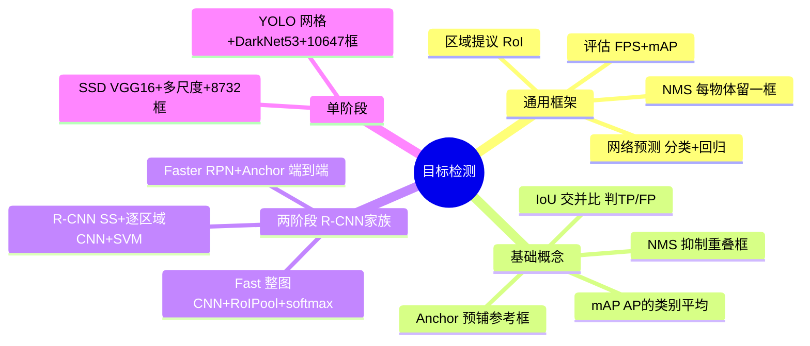

**必记清单**：

1. **分类 vs 检测**：检测 = 分类 + 定位；输出是"可变数量的框"，这是全部难度来源。
2. **通用框架四组件**：区域提议 → 网络预测（分类+框回归）→ NMS → 评估（FPS + mAP）。
3. **三大基础概念**（面试必考）：
   - **IoU** = 交集/并集，∈[0,1]，用阈值（标准 0.5）判 TP/FP；
   - **NMS** 四步：删低置信 → 选最高分 → 算 IoU → 抑制高重叠；
   - **mAP** 五步：objectness → PR → 画 PR 曲线 → AP（曲线下面积，每类）→ mAP（类别平均）。
4. **R-CNN 进化主线**：R-CNN（50s，三模型）→ Fast（2s，整图卷一次）→ Faster（0.2s，RPN 端到端，250× 加速）。
5. **Anchor/Prior**：预铺参考框，让网络**回归偏移量**而非绝对坐标，是 Faster/SSD/YOLO 共用的核心机制。
6. **两阶段 vs 单阶段**：两阶段（R-CNN 家族）精度高但慢；单阶段（SSD/YOLO）快但精度略低。
7. **框数计算**：SSD = 8732；YOLOv3（416 输入）= 10647；都靠 NMS 削减。
8. **多尺度检测**：深层低分辨率检大物体，浅层高分辨率检小物体（SSD 用不同卷积层，YOLOv3 用 stride 32/16/8 三尺度 + 上采样拼接）。
9. **YOLOv3 亮点**：sigmoid 多标签分类、objectness = Pr×IoU、Darknet-53（残差+跳连+上采样）。

**面试速答卡** 🎤：

| 问题 | 一句话答案 |
|---|---|
| IoU 是什么 | 预测框与真值框的交集/并集，衡量重叠度 |
| NMS 解决什么 | 同一物体多个重叠框 → 只留置信度最高的一个 |
| mAP 怎么算 | 每类 PR 曲线下面积(AP)，再对所有类求平均 |
| Anchor 为何存在 | 直接回归绝对坐标难约束，改回归相对锚框的偏移 |
| Faster 比 Fast 快在哪 | 用可学习的 RPN 取代慢的 selective search |
| 两阶段 vs 单阶段 | 两阶段先提议再分类(准/慢)，单阶段一次搞定(快/略逊) |
| YOLOv3 为何用 sigmoid | 支持多标签(如 Women 和 Person 共存)，softmax 假设互斥 |
| SSD 8732 怎么来 | 6 个特征层各位置框数之和：38²×4+19²×6+... |

---

## 🔗 延伸阅读

**本章原始论文**（书中引用）：
- **R-CNN**：Girshick et al., *Rich Feature Hierarchies for Accurate Object Detection and Semantic Segmentation*, 2014. [arxiv 1311.2524](http://arxiv.org/abs/1311.2524)
- **Fast R-CNN**：Girshick, 2015. [arxiv 1504.08083](http://arxiv.org/abs/1504.08083)
- **Faster R-CNN**：Ren, He, Girshick, Sun, *Towards Real-Time Object Detection with RPN*, 2016. [arxiv 1506.01497](http://arxiv.org/abs/1506.01497)
- **Selective Search**：Uijlings et al., 2012.
- **SSD**：Liu et al., *SSD: Single Shot MultiBox Detector*, 2016. [arxiv 1512.02325](http://arxiv.org/abs/1512.02325)
- **YOLOv1**：Redmon et al., *You Only Look Once*, 2016. [arxiv 1506.02640](http://arxiv.org/abs/1506.02640)
- **YOLOv2/9000**：Redmon & Farhadi, 2016. [arxiv 1612.08242](http://arxiv.org/abs/1612.08242)
- **YOLOv3**：Redmon & Farhadi, *An Incremental Improvement*, 2018. [arxiv 1804.02767](http://arxiv.org/abs/1804.02767)

**基网相关**：VGG（Simonyan & Zisserman, 2014）、MobileNet（Howard et al., 2017）、DenseNet（Huang et al., 2016）、ZFNet（Zeiler & Fergus, 2013）。

**动手代码**：
- 本章 SSD7 项目仓库：[github.com/pierluigiferrari/ssd_keras](https://github.com/pierluigiferrari/ssd_keras)（含 SSD7/SSD300/SSD512 教程）
- Udacity 自动驾驶数据集：[github.com/udacity/self-driving-car](https://github.com/udacity/self-driving-car/tree/master/annotations)
- 标注工具 LabelImg：`pip install labelImg`

**承上启下**：本章（连同前几章的分类/迁移学习）完成了 CV 的**判别式任务**（分类、检测）。原书下一部分（Part 3）转向**生成式模型**（GAN、神经风格迁移、视觉嵌入）——从"理解图像"走向"创造图像"。

> 💡 **进阶方向**（超出本书范围，但值得了解）：本章讲到 YOLOv3（2018）为止。后续 anchor-free 检测器（FCOS、CenterNet）、Transformer 检测器（DETR）、以及 YOLOv4~v8 等都在持续刷新速度—精度前沿。掌握了本章的 IoU/NMS/anchor/mAP 与两阶段—单阶段之分，理解这些新架构会顺畅很多。
