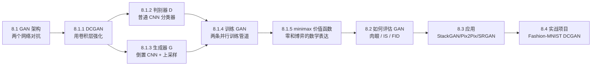
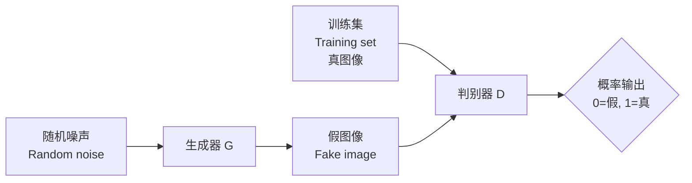
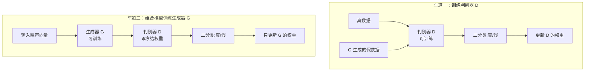
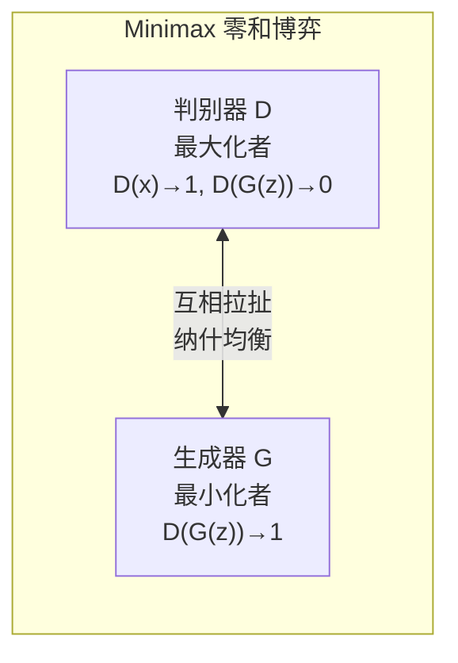
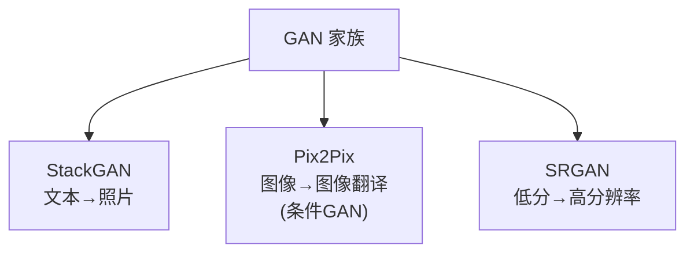

# 🎨 第 8 章 生成对抗网络 GAN（Generative Adversarial Networks）

> 逐章精讲《Deep Learning for Vision Systems》（Mohamed Elgendy 著）第 8 章，对应原书 pp. 362–394。
> 本章我们把「让机器学会想象、学会创造」这件近乎魔法的事，拆成两个互相拆台的神经网络之间的一场博弈，再一行行把 DCGAN 代码讲透、亲手在 Fashion-MNIST 上训练出全新的服装设计。

---

## 🗺️ 本章地图

在前面几章里，深度网络一直在做**判别式（discriminative）**的事：给一张图，输出「这是猫还是狗」「框在哪里」。这些任务本质是 `图像 → 标签` 的确定性映射。本章彻底换了个方向——我们要让网络做**生成式（generative）**的事：`随机噪声 → 一张全新的、从没存在过的图`。



学完本章你将能回答：

- **是什么**：GAN 是两个网络（生成器 G、判别器 D）互相博弈、共同进步的架构。
- **为什么能工作**：造假者与警察的「猫鼠游戏」逼着双方不断变强，最终 G 学会了真实数据的分布。
- **怎么用**：DCGAN 的判别器就是普通 CNN 分类器，生成器是「倒置 CNN + 上采样」，训练时开两条管道并冻结判别器权重。
- **代价与坑**：GAN 没有可收敛的 loss 可看、训练极不稳定、评估困难（这正是本章反复强调的痛点）。

> 💡 **一句话本质**：GAN 把「生成」这个无监督难题，巧妙地转化成了一个「判别真假」的**有监督**问题——判别器充当了生成器的**可学习损失函数**。这是 Yann LeCun 称其为「近十年机器学习最有趣想法」的根本原因。

---

## 🥊 8.1 GAN 架构：两个网络的拳击赛

GAN 由 Ian Goodfellow 等人在 2014 年提出（论文《Generative Adversarial Networks》）。它的核心思想叫**对抗训练（adversarial training）**：让两个神经网络互相竞争。

- **生成器（Generator, G）**：试图把随机噪声转换成「看起来像是从原始数据集里采样出来的」观测（图像）。
- **判别器（Discriminator, D）**：试图预测一个观测到底是来自真实数据集，还是 G 伪造的赝品。

书里给了两个绝妙的类比，务必记牢——面试时脱口而出这两个比喻会显得你真懂：

| 类比 | 生成器 G | 判别器 D | 动态过程 |
| :--- | :--- | :--- | :--- |
| 🥊 **两个拳击手** | 一个拳手 | 另一个拳手 | 比赛中互相学习对方的招式，越打越强 |
| 🕵️ **造假者 vs 警察** | 造假者（印假钞） | 警察（查假钞） | 造假者越印越逼真，警察越查越精，螺旋式升级 |



### GAN 的三步数据流

书中图 8.4 把整个流程说得很清楚，一个 GAN 走这三步：

1. **G 吃随机数，吐一张图**。
2. **这张生成图和一批真实数据集里的图，一起喂给 D**。
3. **D 对真图和假图都输出概率**：一个 0～1 之间的数，`1` 代表「我判定它是真的」，`0` 代表「我判定它是假的」。

> 🔬 **第一性原理：为什么生成器长得像「倒过来的卷积网」？**
> 仔细看两个网络的形状：判别器 D 是**标准 CNN**——卷积层不断缩小、深度不断加深，最后压成一个扁平向量再输出一个概率。生成器 G 恰好相反，它从一个**扁平向量（噪声）出发**，把特征图一步步**放大（upscale）**，直到尺寸和训练集图像一样大。
> 本质上，D 在做**降维压缩**（图像 → 1 个数），G 在做**升维展开**（100 维噪声 → 28×28 图像）。G 是 D 在信息流方向上的镜像。

### 🧱 8.1.1 深度卷积 GAN（DCGAN）

2014 年的原始 GAN 论文里，G 和 D 用的是**多层感知机（MLP）**。但很快人们（Alec Radford 等，2016）证明：用**卷积层**能给判别器更强的预测力，从而反过来提升生成器和整体模型的精度。这种用卷积搭的 GAN 叫 **DCGAN（Deep Convolutional GAN）**。

> 现在所有 GAN 架构默认都含卷积层，所以「DC」其实是隐含的。本章后面 **GAN 和 DCGAN 指的是同一个东西**。

DCGAN 论文（Radford et al., 2016）确立了几条至今仍是「金科玉律」的工程约定，本章的代码全部遵循：

| DCGAN 约定 | 判别器 D | 生成器 G |
| :--- | :--- | :--- |
| **下采样方式** | 用 **strided 卷积**（步长>1）而非池化层 | —— |
| **上采样方式** | —— | 用 **UpSampling2D**（重复像素）而非池化 |
| **激活函数** | **LeakyReLU**（α=0.2） | 隐层用 **ReLU**，输出层用 **tanh** |
| **归一化** | BatchNormalization | BatchNormalization |
| **正则** | Dropout(0.25) | —— |

### 🕵️ 8.1.2 判别器模型（The discriminator model）

判别器的目标很朴素：**预测一张图是真是假**。这就是一个**标准的有监督二分类问题**！所以我们可以直接复用前几章学过的分类 CNN：堆叠卷积层，最后接一个用 **sigmoid 激活**的 dense 输出层。

> **为什么用 sigmoid？** 因为这是二分类，我们要的输出是 0～1 之间的概率值：`0` = 生成器造的假图，`1` = 100% 真图。

训练判别器非常直白（图 8.5）：喂给它**带标签**的图——假图（G 的输出，标签 0）+ 真图（训练集，标签 1），让它学会分类。

下面是书中的 Keras 实现，逐行讲解（输入图像形状 28×28×1，可按需修改）：

```python
def discriminator_model():
    discriminator = Sequential()                                    # ① 实例化一个顺序模型，命名为 discriminator

    discriminator.add(Conv2D(32, kernel_size=3, strides=2,
                      input_shape=(28,28,1), padding="same"))       # ② 第1个卷积层：32个3×3核，步长2→尺寸减半
    discriminator.add(LeakyReLU(alpha=0.2))                         # ③ LeakyReLU 激活（负半轴斜率0.2）
    discriminator.add(Dropout(0.25))                                # ④ 25% dropout，防过拟合

    discriminator.add(Conv2D(64, kernel_size=3, strides=2, padding="same"))
    discriminator.add(ZeroPadding2D(padding=((0,1),(0,1))))         # ⑤ 补零：把 7×7 调成 8×8 便于后续对齐
    discriminator.add(BatchNormalization(momentum=0.8))             # ⑥ BN 层，加速学习、提升精度
    discriminator.add(LeakyReLU(alpha=0.2))
    discriminator.add(Dropout(0.25))

    discriminator.add(Conv2D(128, kernel_size=3, strides=2, padding="same"))  # ⑦ 第3个卷积块（卷积+BN+LeakyReLU+Dropout）
    discriminator.add(BatchNormalization(momentum=0.8))
    discriminator.add(LeakyReLU(alpha=0.2))
    discriminator.add(Dropout(0.25))

    discriminator.add(Conv2D(256, kernel_size=3, strides=1, padding="same"))  # ⑧ 第4个卷积块（注意步长=1，不再缩小）
    discriminator.add(BatchNormalization(momentum=0.8))
    discriminator.add(LeakyReLU(alpha=0.2))
    discriminator.add(Dropout(0.25))

    discriminator.add(Flatten())                                    # ⑨ 展平
    discriminator.add(Dense(1, activation='sigmoid'))               # ⑩ 输出 1 个神经元 + sigmoid → 真假概率

    discriminator.summary()

    img_shape = (28,28,1)
    img = Input(shape=img_shape)                                    # ⑪ 定义输入
    probability = discriminator(img)                                # ⑫ 跑一遍得到概率
    return Model(img, probability)                                  # ⑬ 返回「图像→概率」的模型
```

**逐点解读**：

- **③ 为什么用 LeakyReLU 而不是 ReLU？** 普通 ReLU 在负半轴梯度为 0，容易「死亡」；在 GAN 这种梯度信号本就稀薄、脆弱的场景，判别器一旦有大片神经元死掉，就给不出有用的梯度反馈给生成器。LeakyReLU 在负半轴保留一个小斜率（0.2），保证梯度永远能流回去。**这是 DCGAN 的关键稳定技巧之一。**
- **⑤ ZeroPadding2D**：第二个卷积后特征图变成 7×7，补零成 8×8，是为了让后续 strided 卷积的尺寸算得整齐。
- **⑧ 最后一个卷积步长=1**：前几层用步长 2 疯狂下采样（28→14→7→4），到 256 通道这层不再缩小尺寸，只加深特征。

书中图 8.6 给出的模型摘要要点：**特征图的宽高不断变小（14→8→4），深度不断变大（32→64→128→256）**。这正是标准 CNN 的经典行为——空间信息被压缩、语义信息被提炼。总参数约 39.4 万。

> ⚠️ **常见坑**：判别器里千万别忘了 BatchNormalization 和 Dropout。GAN 最怕判别器「太强」——它一强，生成器就永远被吊打、拿不到有用梯度，训练直接崩。Dropout 相当于故意给判别器「戴上手铐」，让这场比赛势均力敌。

### 🎨 8.1.3 生成器模型（The generator model）

生成器吃一段随机噪声，模仿训练集去造假图，目标是**骗过判别器**。随着训练，它一轮比一轮强；但判别器也在同步变强，所以 G 必须不停进步才能跟上。

生成器长得像**一个倒置的卷积网（inverted ConvNet）**（图 8.7）：它把一个含随机噪声的向量，先 reshape 成一个有宽/高/深的**立方体积（cube volume）**，把它当作特征图，再喂给若干卷积层，最终「长成」一张完整图像。

#### 🔑 上采样（Upsampling）：如何把特征图放大？

传统 CNN 用**池化层下采样**。生成器要反着来——用**上采样层（upsampling layer）**放大。Keras 的 `UpSampling2D` 用一个缩放因子 `size` 把图像尺寸放大，**做法就是简单重复每一行和每一列的像素**：

```python
keras.layers.UpSampling2D(size=(2, 2))
```

书中图 8.8、8.9 的例子很直观：

```
size=(2,2)：                          size=(3,3)：
输入 [[1,2],        输出 [[1,1,2,2],   输入 [[1,2],   输出 [[1,1,1,2,2,2],
      [3,4]]   →         [1,1,2,2],          [3,4]]  →      [1,1,1,2,2,2],
                         [3,3,4,4],                          [1,1,1,2,2,2],
                         [3,3,4,4]]                          [3,3,3,4,4,4],
                                                             [3,3,3,4,4,4],
                                                             [3,3,3,4,4,4]]
```

> 💡 **实战 tip**：`UpSampling2D` 只是**纯重复像素**，本身不含可学习参数（看图 8.10 摘要，它的 Param # = 0）。真正把放大后的「马赛克块」学成平滑纹理的，是它**后面那个卷积层**。所以 DCGAN 里典型的组合永远是 `UpSampling2D → Conv2D`。更现代的做法是用 `Conv2DTranspose`（转置卷积）一步完成放大+学习，但本书为了直观选了「上采样+卷积」这条更好理解的路。

下面是书中生成器的 Keras 实现（8.1.3 节版本），逐行讲：

```python
def generator_model():
    generator = Sequential()

    generator.add(Dense(128 * 7 * 7, activation="relu", input_dim=100))  # ① 全连接：把100维噪声→6272个神经元
    generator.add(Reshape((7, 7, 128)))                                  # ② reshape 成 7×7×128 的立方体积
    generator.add(UpSampling2D(size=(2,2)))                              # ③ 上采样：7×7 → 14×14

    generator.add(Conv2D(128, kernel_size=3, padding="same"))           # ④ 卷积（学习纹理）
    generator.add(BatchNormalization(momentum=0.8))                     # ⑤ BN
    generator.add(Activation("relu"))                                   # ⑥ ReLU
    generator.add(UpSampling2D(size=(2,2)))                             # ⑦ 上采样：14×14 → 28×28

    # 卷积 + 批归一化
    generator.add(Conv2D(64, kernel_size=3, padding="same"))
    generator.add(BatchNormalization(momentum=0.8))
    generator.add(Activation("relu"))

    # 最后一个卷积，filters=1（灰度图单通道）
    generator.add(Conv2D(1, kernel_size=3, padding="same"))
    generator.add(Activation("tanh"))                                   # ⑧ 输出层用 tanh！
    generator.summary()

    noise = Input(shape=(100,))                                         # ⑨ 长度100的噪声向量
    fake_image = generator(noise)                                       # ⑩ 生成假图
    return Model(noise, fake_image)                                     # ⑪ 返回「噪声→假图」的模型
```

**逐点解读**：

- **① 为什么第一层是 Dense 而不是卷积？** 因为输入是一个 1D 的 100 维噪声向量，卷积需要 2D/3D 的空间结构。所以先用全连接把 100 维「铺开」成 `128×7×7=6272` 个数，再 reshape 成能做卷积的立方体积。
- **⑧ 输出层为什么用 tanh 而不是 sigmoid？** 因为训练时我们把真实图像归一化到了 **[-1, 1]** 区间（见下方实战代码 `X_train / 127.5 - 1`）。tanh 的值域恰好是 [-1, 1]，让生成器输出和真实数据的取值范围完全对齐——**这是 DCGAN 论文明确建议的、能显著加速收敛的技巧**。若真实数据归一化到 [0,1]，则输出层才该用 sigmoid。

书中图 8.10 摘要要点：输出形状从 6272 维 1D 向量出发 → reshape 成 7×7×128 → 上采样两次到 14×14、28×28；**深度从 128 → 64 → 1 递减**（因为要输出单通道灰度 MNIST）。

> 💡 **举一反三**：如果你要生成**彩色图**，只需把最后一个卷积层的 `filters` 从 `1` 改成 `3`（RGB 三通道）即可。

#### 📊 G 与 D 尺寸变化对比（吃透这张表就吃透了架构）

| 维度 | 判别器 D（标准 CNN） | 生成器 G（倒置 CNN） |
| :--- | :--- | :--- |
| **输入** | 28×28×1 图像 | 100 维噪声向量 |
| **空间尺寸** | 逐渐**缩小** 28→14→8→4 | 逐渐**放大** 7→14→28 |
| **通道深度** | 逐渐**加深** 32→64→128→256 | 逐渐**变浅** 128→64→1 |
| **缩放手段** | strided 卷积（步长2） | UpSampling2D（重复像素） |
| **隐层激活** | LeakyReLU | ReLU |
| **输出** | Dense(1)+**sigmoid** → 概率 | Conv2D(1)+**tanh** → 图像 |
| **信息流方向** | 图像 → 语义（压缩） | 语义 → 图像（展开） |

### 🔁 8.1.4 训练 GAN（Training the GAN）

判别器在被训练成一个**更好的分类器**——最大化「给真图打真、给假图打假」的正确率（警察越来越会分真假钞）。生成器在被训练成一个**更好的伪造者**——最大化「骗过判别器」的概率。两个网络都在各自的方向上越来越强。

训练 GAN 涉及**两个过程**：

1. **训练判别器**：直白的有监督训练。喂给它带标签的图（G 生成的=假，训练数据=真），用 sigmoid 输出学分类。**没有新东西。**
2. **训练生成器**：**这里有点微妙。生成器不能像判别器那样单独训练！** 它需要判别器来告诉它「假图造得好不好」。所以我们要搭一个**组合网络（combined network）**，把 G 和 D 串起来，专门用来训练 G。

> 🔬 **核心机制：两条并行的训练管道**
> 把训练想象成两条并行的车道（图 8.11）：
> - **车道一**：单独训练判别器 D。
> - **车道二**：组合模型（G+D），只训练生成器 G。**关键——训练组合模型时，要冻结（freeze）判别器的权重**，因为这条车道只想更新 G。



**为什么训练 G 时必须冻结 D 的权重？** 书中给出了极其关键的解释：

> 因为 G 和 D 的**损失函数是往相反方向拉的**。如果我们不冻结判别器权重，D 会被拉向「生成器正在学习的那个方向」——也就是它会更倾向于把生成图判成真的，**这恰恰是我们不想要的结果**（我们要 D 当一个诚实的裁判，而不是被 G 收买）。

**冻结不影响之前编译好的判别器**：可以想象成有「两个判别器」——虽然实际不是，但这样更好理解。车道一里的 D 照常更新，车道二里的 D 只是借来当「不动的裁判」。

#### 训练判别器的代码

```python
discriminator = discriminator_model()
discriminator.compile(loss='binary_crossentropy',
                      optimizer='adam',
                      metrics=['accuracy'])           # 二元交叉熵 + Adam

# 用随机批次做单步梯度更新
noise = np.random.normal(0, 1, (batch_size, 100))     # 采样噪声
gen_imgs = generator.predict(noise)                   # 生成一批假图
# 真图标 1（valid），假图标 0（fake）
d_loss_real = discriminator.train_on_batch(imgs, valid)
d_loss_fake = discriminator.train_on_batch(gen_imgs, fake)
```

#### 训练生成器（组合模型）的代码

```python
generator = generator_model()

z = Input(shape=(100,))               # 组合模型的输入是噪声 z
image = generator(z)                  # G 把噪声变成图

discriminator.trainable = False       # ❄️ 冻结判别器权重！

valid = discriminator(image)          # 冻结的 D 判断这张图的真假

combined = Model(z, valid)            # 组合模型：噪声 → 真假判断
combined.compile(loss='binary_crossentropy', optimizer=optimizer)

# 训练：注意标签给的是 valid（全1）！
g_loss = combined.train_on_batch(noise, valid)
```

> ⚠️ **最容易懵的一行**：`combined.train_on_batch(noise, valid)` 里，标签给的是 `valid`（全 1），即「假装这些假图是真的」。这就是训练 G 的诀窍——**我们告诉组合模型「目标是让判别器把这些生成图判成真（1）」**。误差反传时，由于 D 被冻结，梯度会一路传回并只更新 G 的权重，逼着 G 生成越来越能骗过 D 的图。

**训练 epochs**：把上面代码塞进一个循环，跑若干 epoch。每个 epoch 里，两个编译好的模型（判别器 + 组合模型）同时训练，G 和 D 一起进步。可以每隔几个 epoch 打印生成结果，肉眼观察 G 的进步（图 8.13 展示了 MNIST 从 epoch 0 的纯噪声，到 epoch 9500 逼真手写数字的演化）。

### 🎯 8.1.5 GAN 的 minimax 价值函数

书中这句话点破了 GAN 的数学本质：

> **GAN 训练更像一场零和博弈（zero-sum game），而不是一个优化问题。**

在零和博弈里，总效用分数在玩家间瓜分，一方得分上升必然导致另一方下降。在 AI 里这叫 **minimax 博弈论**：一个玩家叫**最大化者（maximizer）**，想拿最高分；另一个叫**最小化者（minimizer）**，通过反制拿最低分。

GAN 玩的就是这样一场 minimax 游戏，整个网络在优化下面这个价值函数 $V(D,G)$：

$$
\min_{G}\ \max_{D}\ V(D,G) = \mathbb{E}_{x \sim p_{\text{data}}(x)}\big[\log D(x)\big] + \mathbb{E}_{z \sim p_{z}(z)}\big[\log\big(1 - D(G(z))\big)\big]
$$

先把符号表吃透（书中表 8.1）：

| 符号 | 含义 |
| :--- | :--- |
| $G$ | 生成器（Generator） |
| $D$ | 判别器（Discriminator） |
| $z$ | 喂给 G 的随机噪声 |
| $G(z)$ | G 拿噪声 $z$ 试图重建的「真」图（即假图） |
| $D(G(z))$ | 判别器对 G 生成图的输出（判它多真） |
| $D(x)$ | 判别器对真实数据的输出 |
| $\log D(x)$ | 判别器对真实数据的对数概率输出 |
| $\mathbb{E}$ | 期望（对整个数据分布取平均） |

**这个吓人的公式其实只是两个竞争目标的数学写法**。判别器从两个来源取输入：

- **来自 G 的假数据 $G(z)$**——判别器对它的输出记作 $D(G(z))$。
- **来自真实训练数据的 $x$**——判别器对它的输出记作 $\log D(x)$。

拆成两半看最清楚：

| 训练流 | 对应项 | 目标 |
| :--- | :--- | :--- |
| **判别器单独训练** | $\mathbb{E}_{x \sim p_{\text{data}}}[\log D(x)]$ | **最大化** minimax 函数：让预测尽量接近 **1**（把真图判真） |
| **组合模型训练 G** | $\mathbb{E}_{z \sim p_z(z)}[\log(1 - D(G(z)))]$ | **最小化** minimax 函数：让预测尽量接近 **0** |

> 🔬 **第一性原理：为什么要套一层 log？**
> 书里点破：「log 保证了——我们离正确值越远（越接近错误值），受到的惩罚就越大。」这正是对数似然（log-likelihood）的威力：当 $D(x)$ 从 0.9 掉到 0.1，$\log D(x)$ 从 $-0.05$ 暴跌到 $-1$，惩罚呈**指数级放大**，梯度信号更强，逼着网络快速纠错。

**两个玩家各自的算盘**（这段是理解 GAN 的核心，务必背下来）：

- **判别器 D 想最大化目标**：让 $D(x) \to 1$（真图判真）、$D(G(z)) \to 0$（假图判假）。
- **生成器 G 想最小化目标**：让 $D(G(z)) \to 1$，即**骗得判别器以为生成的 $G(z)$ 是真的**。

训练早期，D 会**高置信度地**拒绝 G 的假图（因为 G 还没学会，假图和真图差太远）。随着我们训练 D 去最大化正确分类概率，同时训练 G 去最小化 D 对假图的分类误差，两者螺旋上升。**当 G 造的假图被识别为真图时，训练停止**——此时 G 已经学会了真实数据的分布。



---

## 📏 8.2 如何评估 GAN 模型（这是 GAN 最头疼的问题）

普通分类/检测网络用一个 loss 函数训练到收敛就行，loss 降下来就是好。**但 GAN 完全不同！**

> 🔬 **核心痛点（面试高频）**：GAN 的生成器**没有一个客观的损失函数**。它是被判别器「训练」的，而判别器本身也在变。两者一起训练以维持一种**均衡（equilibrium）**。因此**光看 loss 无法判断训练进度或模型好坏**——G 的 loss 降了可能只是因为 D 变弱了，不代表图变好了。

这带来一个根本困境：**GAN 的模型必须靠「生成图像的质量」来评估，而这往往要靠肉眼人工检查。** 这让下面这些事都变得极难，且业界至今**没有公认的最佳方案**：

- 在一次训练中挑出最好的生成器（即：**何时该停止训练？**）。
- 挑哪些生成图来展示模型能力。
- 对比、benchmark 不同 GAN 架构。
- 调超参并对比结果。

书中介绍了三类评估手段：

### 8.2.1 人工评估（Manual / Human annotators）

Tim Salimans 等人（2016）雇 Amazon Mechanical Turk（MTurk）的标注员，做了个网页界面让人区分真图假图。

> ⚠️ **坑**：人工评估的指标**极不稳定**——它随任务设置和标注员的积极性剧烈波动。书中提到一个有趣现象：**一旦给标注员反馈他们的错误，结果会大变**——因为标注员从反馈中学习后，更善于挑出生成图的瑕疵，给出更「悲观」（更严格）的质量评估。

### 8.2.2 Inception Score（IS，起始分数）

IS 基于一个启发式：**真实的样本，扔进预训练网络（如在 ImageNet 上训练的 Inception）应该能被清晰分类**（名字里的 inception 就来自这）。它看两个值：

| 评估维度 | 含义 | 好的表现 |
| :--- | :--- | :--- |
| **图像可预测性高** | 用预训练 Inception 分类器对每张生成图算 softmax | 好图应给出**尖锐**的高置信度预测（明确属于某一类） |
| **生成样本多样** | 生成图在各类别上的分布 | **没有任何一个类别独占**（避免模式崩溃） |

把大量生成图分类，预测每张图属于各类的概率，再汇总成一个分数，同时捕捉「每张图有多像已知类」和「整批图在已知类上有多多样」。两点都满足 → **IS 越高越好**。

### 8.2.3 Fréchet Inception Distance（FID，弗雷歇距离）

由 Martin Heusel 等人（2017）提出，作为 IS 的**改进版**。

- 同样用 Inception 模型提取图像特征（激活值）。
- 对**真实图**和**生成图**各算一批激活，把它们分别拟合成一个**多元高斯分布**。
- 计算两个高斯分布之间的 **Fréchet 距离**（又叫 **Wasserstein-2 距离**）。

> 💡 **IS vs FID 对比记忆**：
> - **IS** 只看生成图本身，**分数越高越好**。
> - **FID** 同时对比生成图和真实图的分布，**分数越低越好**（距离越小 = 越接近真实统计特性）。
> - ⚠️ **FID 需要足够大的样本量**（建议 **50000** 张）。样本太少会**高估** FID，且估计方差大。

### 8.2.4 该用哪个？

IS 和 FID 都易实现、易在批量生成图上计算，所以「训练中系统性地生成图、保存模型，事后再做模型选择」这个实践应当坚持。但书中反复强调：

> **业界对「评估 GAN 的唯一最佳方法」没有共识**。不同分数评估图像生成的不同侧面，单一分数不可能覆盖所有方面。**入门时，从肉眼人工检查开始就是个好主意**——它能帮你走很远，边调实现边测配置。

此外还有领域专用指标，如 Konstantin Shmelkov 团队（2018）的 **GAN-train** 和 **GAN-test**，分别近似 GAN 的**召回率（多样性）**和**精确率（图像质量）**。

---

## 🚀 8.3 GAN 的热门应用

生成建模五年内突飞猛进，如今 GAN 已在医疗、汽车、艺术等行业大显身手。本节只做「开眼界」，不实现。



| 应用 | 代表架构 | 作者/年份 | 核心思路 |
| :--- | :--- | :--- | :--- |
| **文本→照片合成** | **StackGAN** | Zhang et al., 2016 | 两阶段：Stage-I 根据文本画出粗糙形状和颜色（低分辨率），Stage-II 接过来补上照片级细节、修正缺陷，生成 256×256 高清图 |
| **图像→图像翻译** | **Pix2Pix** | Isola et al., 2016 | 通用图像翻译：街景分割图↔真实照片、灰度↔彩色、草图↔产品照、白天↔黑夜。是一种**条件 GAN（cGAN）**——生成以输入源图为条件 |
| **图像超分辨率** | **SRGAN** | Ledig et al., 2016 | 把低分辨率图转成高分辨率图 |

### Pix2Pix 的关键创新（值得单独记）

> 🔬 Pix2Pix 的巧妙之处：它**学习了一个适配任务和数据的损失函数**，因此能用在各种场景。它是**条件 GAN（cGAN）**——输出图的生成以一张输入源图为条件。判别器同时拿到**源图 + 目标图**，必须判断「目标是不是源图的一个合理变换」。

体验地址：`https://affinelayer.com/pixsrv`（Isola 团队做的交互 demo，能把猫的草图边缘转成照片）。想动手玩更多 GAN，书中强推 Erik Linder-Norén 维护的 **Keras-GAN** 仓库 `https://github.com/eriklindernoren/Keras-GAN`——本章大量代码正是受它启发并改编。

---

## 🛠️ 8.4 实战项目：亲手搭一个 DCGAN

现在把前面所有片段拼成端到端的 DCGAN，在 **Fashion-MNIST** 数据集上训练。

> **为什么选 Fashion-MNIST？** 它是 MNIST 的直接替代品：60000 张训练图 + 10000 张测试图，每张 28×28 灰度，10 个类别（T恤/裤子/套衫/裙子/外套/凉鞋/衬衫/运动鞋/包/短靴）。**灰度单通道 → 计算量小，没 GPU 的个人电脑也能训**；数据干净、图都居中，几乎不用预处理。

### Step 1｜导入库

```python
from __future__ import print_function, division
from keras.datasets import fashion_mnist
from keras.layers import Input, Dense, Reshape, Flatten, Dropout
from keras.layers import BatchNormalization, Activation, ZeroPadding2D
from keras.layers.advanced_activations import LeakyReLU
from keras.layers.convolutional import UpSampling2D, Conv2D
from keras.models import Sequential, Model
from keras.optimizers import Adam
import numpy as np
import matplotlib.pyplot as plt
```

### Step 2｜下载并可视化数据

```python
(training_data, _), (_, _) = fashion_mnist.load_data()   # 一行下载
X_train = training_data / 127.5 - 1.                     # ★关键：把 [0,255] 归一化到 [-1,1]
X_train = np.expand_dims(X_train, axis=3)                # 增加通道维 → (N,28,28,1)
```

> ⚠️ **对齐前面 tanh 的伏笔**：这里 `/ 127.5 - 1` 把像素从 `[0,255]` 映射到 `[-1,1]`。这**正是生成器输出层用 tanh 的原因**——两边取值范围必须一致，模型才能更快收敛（详见第 4 章数据归一化）。这两处一定要成对出现，是 DCGAN 最容易被忽视的一致性约束。

### Step 3｜搭生成器

项目版和 8.1.3 节的生成器几乎一样，通用方案是 `卷积 ⇒ 批归一化 ⇒ ReLU` 反复堆叠，直到得到 28×28×1：

```python
def build_generator():
    generator = Sequential()
    generator.add(Dense(128 * 7 * 7, activation="relu", input_dim=100))
    generator.add(Reshape((7, 7, 128)))
    generator.add(UpSampling2D())                                     # 默认 size=(2,2)：7→14
    generator.add(Conv2D(128, kernel_size=3, padding="same", activation="relu"))
    generator.add(BatchNormalization(momentum=0.8))
    generator.add(UpSampling2D())                                     # 14→28
    # 卷积 + 批归一化
    generator.add(Conv2D(64, kernel_size=3, padding="same", activation="relu"))
    generator.add(BatchNormalization(momentum=0.8))
    # 最后一层 filters=1
    generator.add(Conv2D(1, kernel_size=3, padding="same", activation="relu"))
    generator.summary()

    noise = Input(shape=(100,))
    fake_image = generator(noise)
    return Model(inputs=noise, outputs=fake_image)
```

> ⚠️ **书中原文的一个 bug（值得警惕）**：注意这个项目版 `build_generator` 的**最后一层激活是 `relu`**，而 8.1.3 节讲原理时用的是 `tanh`。既然 Step 2 把数据归一化到了 `[-1,1]`，输出层理应用 `tanh` 才对——用 relu 会把负值全砍成 0，和 [-1,1] 的真实数据分布不匹配。**这是原书代码的疏漏**，你自己实现时应把最后一层改成 `tanh`。（原理讲解版是对的。）这也再次印证了本章主题：GAN 的一致性细节极其脆弱，一处不匹配就可能训不好。

### Step 4｜搭判别器

判别器就是个卷积分类器（图 8.20）。**下采样不用池化层，只用 strided 卷积**（照抄 Radford et al. 的做法）。深度从 32→64→128→256 逐层翻倍。每个卷积块的方案是 `卷积 ⇒ 批归一化 ⇒ LeakyReLU`：

```python
def build_discriminator():
    discriminator = Sequential()
    discriminator.add(Conv2D(32, kernel_size=3, strides=2,
                      input_shape=(28,28,1), padding="same"))
    discriminator.add(LeakyReLU(alpha=0.2))
    discriminator.add(Dropout(0.25))

    discriminator.add(Conv2D(64, kernel_size=3, strides=2, padding="same"))
    discriminator.add(ZeroPadding2D(padding=((0,1),(0,1))))    # 7×7 → 8×8
    discriminator.add(BatchNormalization(momentum=0.8))
    discriminator.add(LeakyReLU(alpha=0.2))
    discriminator.add(Dropout(0.25))

    discriminator.add(Conv2D(128, kernel_size=3, strides=2, padding="same"))
    discriminator.add(BatchNormalization(momentum=0.8))
    discriminator.add(LeakyReLU(alpha=0.2))
    discriminator.add(Dropout(0.25))

    discriminator.add(Conv2D(256, kernel_size=3, strides=1, padding="same"))
    discriminator.add(BatchNormalization(momentum=0.8))
    discriminator.add(LeakyReLU(alpha=0.2))
    discriminator.add(Dropout(0.25))

    discriminator.add(Flatten())
    discriminator.add(Dense(1, activation='sigmoid'))

    img = Input(shape=(28,28,1))
    probability = discriminator(img)
    return Model(inputs=img, outputs=probability)
```

### Step 5｜搭组合模型

```python
optimizer = Adam(learning_rate=0.0002, beta_1=0.5)   # ★DCGAN 论文推荐的黄金超参
discriminator = build_discriminator()
discriminator.compile(loss='binary_crossentropy',
                      optimizer=optimizer, metrics=['accuracy'])
discriminator.trainable = False                      # ❄️ 冻结！

generator = build_generator()
z = Input(shape=(100,))
img = generator(z)                                   # 噪声 → 假图
valid = discriminator(img)                           # 冻结的 D 判真假
combined = Model(inputs=z, outputs=valid)            # 组合模型 = 堆叠的 G+D
combined.compile(loss='binary_crossentropy', optimizer=optimizer)
```

> 💡 **面试高频超参**：`Adam(lr=0.0002, beta_1=0.5)` 是 DCGAN 论文里被验证过、几乎成为默认的组合。特别是把 Adam 的 `beta_1` 从默认的 0.9 降到 **0.5**——这能显著稳定 GAN 的训练，减少震荡。记住这个数字，很多面试会问「训练 GAN 你会怎么设优化器」。

### Step 6｜训练函数

```python
def train(epochs, batch_size=128, save_interval=50):
    valid = np.ones((batch_size, 1))                 # 对抗性 ground truth：真=1
    fake = np.zeros((batch_size, 1))                 # 假=0

    for epoch in range(epochs):
        ## 训练判别器
        idx = np.random.randint(0, X_train.shape[0], batch_size)  # 随机取一批真图
        imgs = X_train[idx]
        noise = np.random.normal(0, 1, (batch_size, 100))         # 采样噪声
        gen_imgs = generator.predict(noise)                       # 生成一批假图
        d_loss_real = discriminator.train_on_batch(imgs, valid)   # 真图标 1
        d_loss_fake = discriminator.train_on_batch(gen_imgs, fake)# 假图标 0
        d_loss = 0.5 * np.add(d_loss_real, d_loss_fake)           # 真假损失取平均

        ## 训练组合网络（生成器）
        g_loss = combined.train_on_batch(noise, valid)            # ★噪声标 1（骗过 D）

        print("%d [D loss: %f, acc.: %.2f%%] [G loss: %f]" %
              (epoch, d_loss[0], 100*d_loss[1], g_loss))
        if epoch % save_interval == 0:
            plot_generated_images(epoch, generator)               # 定期存图
```

**逐点解读训练循环的精髓**：

1. **D 分两次训练**：先用真图（标 1）训一次，再用假图（标 0）训一次，损失取平均。这是让 D 在真假两边都学到东西。
2. **`d_loss = 0.5 * (d_loss_real + d_loss_fake)`**：判别器的总损失是真假两批的平均，这样真假样本对判别器的影响权重均衡。
3. **训练 G 那行 `combined.train_on_batch(noise, valid)`**：标签又是 `valid`（全 1）。**这是整个 GAN 最精妙的一行**——它告诉组合模型「我要让 D 把这些假图判成真」，梯度反传时因 D 被冻结，只更新 G，逼 G 造出更逼真的图。

配套的存图函数：

```python
def plot_generated_images(epoch, generator, examples=100, dim=(10, 10), figsize=(10, 10)):
    noise = np.random.normal(0, 1, size=[examples, latent_dim])
    generated_images = generator.predict(noise)
    generated_images = generated_images.reshape(examples, 28, 28)
    plt.figure(figsize=figsize)
    for i in range(generated_images.shape[0]):
        plt.subplot(dim[0], dim[1], i+1)
        plt.imshow(generated_images[i], interpolation='nearest', cmap='gray_r')
        plt.axis('off')
    plt.tight_layout()
    plt.savefig('gan_generated_image_epoch_%d.png' % epoch)
```

### Step 7｜训练并观察结果

```python
train(epochs=1000, batch_size=32, save_interval=50)   # 跑 1000 epoch，每 50 存一次图
```

训练时会打印类似（图 8.22）：

```
0 [D loss: 0.963556, acc.: 42.19%] [G loss: 0.726341]
1 [D loss: 0.707453, acc.: 65.62%] [G loss: 1.239887]
2 [D loss: 0.478705, acc.: 76.56%] [G loss: 1.666347]
...
```

> 🔬 **怎么读这些数字？（面试高频）** 别期待 loss 单调下降！健康的 GAN 训练里，**D loss 和 G loss 会互相拉锯、上下震荡**——D loss 降说明判别器占上风，G loss 就会升；反之亦然。**理想状态是两者维持在一个动态均衡附近**（D 的准确率在 50% 上下徘徊，说明它已经分不清真假了，G 赢了）。如果 D loss 一路跌到 0、G loss 一路飙升，说明判别器碾压了生成器，训练崩溃（**模式崩溃 mode collapse** 的前兆之一）。

作者自己跑了 10000 epoch，结果演化（图 8.23）：

| Epoch | 生成结果 |
| :--- | :--- |
| **0** | 纯随机噪声，无任何模式 |
| **50** | 开始出现模式：中心亮、四周暗（因训练图的形状都居中） |
| **1,000** | 清晰形状，能猜出是什么衣物 |
| **10,000** | 生成出训练集里**从未出现过的全新设计**（如一件全新的连衣裙款式） |

> 💡 **这就是 GAN 的魔力所在**：epoch 10000 的那件连衣裙，**不是训练集里任何一张图的拷贝**，而是 GAN 学会「连衣裙的模式」后**原创**出来的全新设计。这印证了本章开头图 8.1 的论断——GAN 生成的是**真正新造的**内容，不是记忆背诵。想更精细就训更久，或把生成器加深。

> 💡 **进阶数据集**：练手可试 CIFAR、Google 的 Quick, Draw!（世界最大涂鸦集）、Stanford Cars（16000+ 张、196 种车型）——训个 GAN 设计你的梦中座驾！

---

## 📌 小结（Summary）

把本章的骨架浓缩成一张「必背清单」：

| 知识点 | 一句话本质 |
| :--- | :--- |
| **GAN 是什么** | 从训练集学模式，造出分布相似的**全新图像** |
| **架构** | 两个互相竞争的深度网络：生成器 G + 判别器 G |
| **生成器 G** | 把随机噪声变成「像采样自原数据集」的观测；结构像**倒置 CNN**，从窄输入起、上采样几次到目标尺寸 |
| **判别器 D** | 判断观测是真数据还是 G 的赝品；就是个**标准分类 CNN**（sigmoid 输出真假概率） |
| **上采样层** | 通过**重复每一行每一列的像素**放大图像尺寸（无可学习参数） |
| **训练方式** | 分批、开**两条并行管道**：车道一单练 D；车道二冻结 D 的权重、只更新 G |
| **minimax 目标** | $\min_G \max_D V(D,G)$，一场零和博弈：D 想最大化分对真假的概率，G 想最小化被抓概率 |
| **评估** | 主要靠**肉眼观察**生成质量；量化指标有 **Inception Score（越高越好）** 和 **FID（越低越好）** |
| **训练特性** | **没有可收敛的 loss**、极不稳定、D 和 G loss 互相拉锯，需维持均衡 |
| **应用** | 文本→图（StackGAN）、图→图翻译（Pix2Pix）、超分辨率（SRGAN）等 |

**三条最该刻进 DNA 的工程约定（DCGAN 精髓）**：

1. **归一化 [-1,1] + 生成器输出层 tanh** 必须成对出现。
2. **D 用 strided 卷积下采样、LeakyReLU；G 用 UpSampling+卷积上采样、ReLU**。
3. **训 G 时冻结 D 权重**，且用 `Adam(lr=0.0002, beta_1=0.5)`。

---

## 🔗 延伸阅读

**原始论文（本章引用）**：

- Goodfellow et al., 2014, *Generative Adversarial Networks* — GAN 开山之作，minimax 公式出处。`arxiv.org/abs/1406.2661`
- Radford et al., 2016, *Unsupervised Representation Learning with DCGANs* — **DCGAN**，本章所有工程约定的来源。`arxiv.org/abs/1511.06434`
- Salimans et al., 2016, *Improved Techniques for Training GANs* — Inception Score + 人工评估。`arxiv.org/abs/1606.03498`
- Heusel et al., 2017, *GANs Trained by a Two Time-Scale Update Rule...* — **FID** 出处。`arxiv.org/abs/1706.08500`
- Zhang et al., 2016, *StackGAN* — 文本到照片合成。`arxiv.org/abs/1612.03242`
- Isola et al., 2016, *Image-to-Image Translation with Conditional Adversarial Networks* — **Pix2Pix**。`arxiv.org/abs/1611.07004`
- Ledig et al., 2016, *Photo-Realistic Single Image Super-Resolution...* — **SRGAN**。`arxiv.org/abs/1609.04802`

**动手资源**：

- Keras-GAN 仓库（Erik Linder-Norén）：`github.com/eriklindernoren/Keras-GAN` — 本章代码的灵感来源，几十种 GAN 的 Keras 实现。
- Pix2Pix 在线 demo：`affinelayer.com/pixsrv`
- 进阶数据集：CIFAR、Google Quick, Draw!、Stanford Cars。

**面试自测（读完请合上书回答）**：

1. 为什么训练生成器时必须冻结判别器的权重？不冻结会怎样？
2. GAN 为什么不能只看 loss 判断好坏？该怎么评估？
3. 生成器输出层用 tanh 还是 sigmoid，取决于什么？
4. `combined.train_on_batch(noise, valid)` 里为什么假图的标签给的是 1？
5. 写出 minimax 价值函数，并解释 D 和 G 各自想让它变大还是变小。
6. IS 和 FID 分别越高越好还是越低越好？FID 为什么需要 5 万样本？

> 下一步：本章是「生成式模型」的入门。想继续深挖，可延伸到 **条件 GAN（cGAN）**、**CycleGAN**（无配对图像翻译）、**StyleGAN**（可控高清人脸），乃至后来居上的 **扩散模型（Diffusion Models）**——它们在图像生成质量上已全面超越 GAN，但 GAN「判别器即损失函数」的对抗思想至今仍是理解现代生成模型不可绕过的基石。
