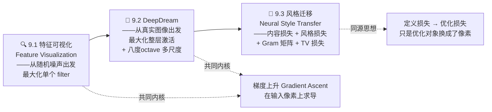
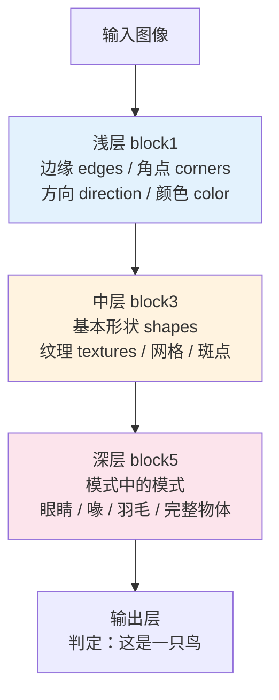
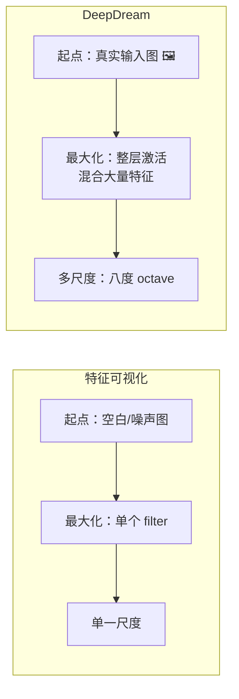
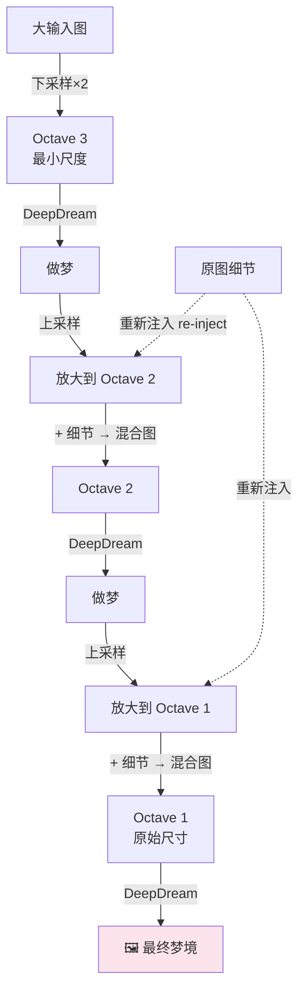
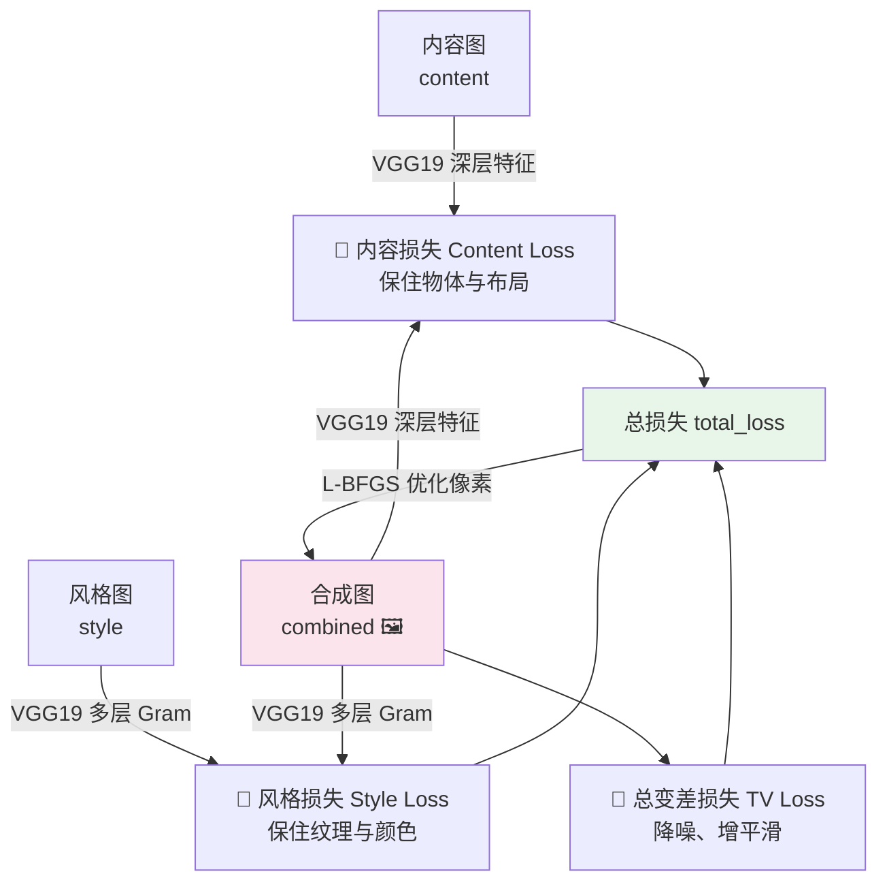
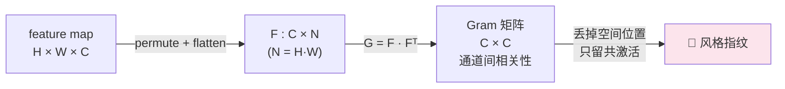
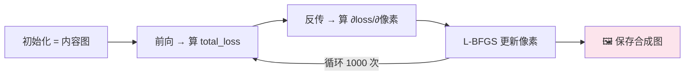

# 第 9 章 🎨 DeepDream 与神经风格迁移

> 对应《Deep Learning for Vision Systems》(Mohamed Elgendy) 第 9 章，PDF 第 395–420 页。
> 本章把 CNN 从"分类器"翻转成"艺术家"：先打开黑箱看看网络到底看见了什么（特征可视化），再让网络在你的照片上"做梦"（DeepDream），最后把一张画的笔触搬到你的照片上（神经风格迁移）。

---

## 🗺️ 本章地图

前面的章节里，CNN 一直是一个**判别式（discriminative）**工具：给它一张图，它告诉你"这是猫"。本章我们要做一件反直觉的事——**把梯度算在输入图像上，而不是权重上**，让网络反过来"生成"图像。这条主线串起三个技术，难度层层递进：



| 小节 | 技术 | 核心问题 | 从哪出发 | 优化什么 | 用什么网络 |
|------|------|----------|----------|----------|-----------|
| 9.1 | 特征可视化 | CNN 到底看见了什么？ | 随机噪声 | 单个 filter 的平均激活 | VGG16 |
| 9.2 | DeepDream | 让网络在照片上"做梦" | 真实照片 | 整层激活的 L2 范数加权和 | Inception v3 |
| 9.3 | 风格迁移 | 把 A 的内容 + B 的风格合成 | 内容图（或噪声） | 内容损失 + 风格损失 + TV 损失 | VGG19 |

学完本章你将拿到三样东西：① 打开 CNN 黑箱、做 AI 可解释性的一把钥匙；② 一份可跑的 DeepDream / 风格迁移代码骨架；③ 对"梯度上升 vs 梯度下降""Gram 矩阵为什么代表风格"这类面试高频题的第一性理解。

---

## 🔬 第一性原理：为什么可以"在图像上求梯度"？

在讲三个算法之前，先把贯穿全章的**唯一内核**讲透。前面章节训练网络时，我们做的是：

$$
\theta \leftarrow \theta - \eta \, \frac{\partial \mathcal{L}}{\partial \theta}
$$

**固定输入图像 $x$，更新权重 $\theta$**，让 loss 下降。反向传播算的是"loss 对每个权重的偏导"。

本章把这件事**整个翻过来**：

$$
x \leftarrow x + \eta \, \frac{\partial \mathcal{L}}{\partial x}
$$

**固定权重 $\theta$（用预训练网络，冻结不动），更新输入图像 $x$**。反向传播照样能把梯度一路传回到输入层——因为卷积、激活、池化全都是可微的，链式法则不在乎终点是权重还是像素。区别只有两点：

1. **优化对象**：权重 → 像素。
2. **优化方向**：下降（descent，找 loss 最小）→ **上升（ascent，找激活最大）**。

> 💡 **一句话内核**：整章都是"把一个预训练 CNN 当成固定的、可微的评分函数，然后用梯度去雕刻输入图像，让某个分数越来越高"。特征可视化、DeepDream、风格迁移只是**评分函数（loss）设计得不同**而已。抓住这句话，本章就没有难点了。

### 梯度上升 vs 梯度下降（书中重点框）

书里特意开了一个框澄清这对概念，这也是**面试高频送分题**：

| | 梯度下降 GD | 梯度上升 GA |
|---|-----------|------------|
| 目标 | 最小化 loss（找局部最小） | 最大化目标（找局部最大） |
| 更新方向 | 沿**负梯度** $-\nabla$ | 沿**正梯度** $+\nabla$ |
| 更新式 | $x \leftarrow x - \eta \nabla$ | $x \leftarrow x + \eta \nabla$ |
| 本章用途 | 风格迁移里最小化总损失 | 可视化 / DeepDream 里最大化激活 |
| 几何直觉 | 顺着山坡往下走到谷底 | 顺着山坡往上爬到峰顶 |

书中原话（第 378 页）：

> "To visualize feature maps, we want to **maximize** these features to make them show on the output image. In order to maximize the loss function, we want to **reverse the GD process** by using a gradient ascent algorithm. It takes steps proportional to the **positive of the gradient** to approach a local maximum."

⚠️ **常见坑**：梯度上升 = 梯度下降 + 一个负号，本质是同一套反向传播。不要以为需要另写一套"上升版反向传播"。代码里体现为 `x += step * grads`（加号）而不是 `x -= step * grads`（减号）。

---

# 9.1 🔍 卷积网络眼中的世界：特征可视化

## 9.1.1 为什么要打开黑箱？

书的开篇提出一个尖锐问题（第 375 页）：深度学习无所不能，但**神经网络到底怎么"看"世界，仍然是个黑箱**。我们能解释反向传播的数学，却说不清"网络到底靠什么特征认出一只鸟"。这带来两个现实痛点：

1. **科研侧**：搞懂网络识别模式的方式，才能进一步提升性能。
2. **商业侧（AI 可解释性 / AI explainability）**：书中原文说，很多业务负责人"感觉没法基于模型预测做决策，因为没人真正懂黑箱里发生了什么"。可视化就是把黑箱撬开给人看。

### CNN 逐层抽象：从边缘到完整物体

回顾 CNN 的层级结构（第 376 页）——一个典型网络有 10~30 层堆叠，特征抽象程度**随深度递增**：



书里引用了 François Chollet《Python 深度学习》的一句经典比喻：

> "You can think of a deep network as a **multistage information-distillation operation**, where information goes through successive filters and comes out increasingly purified."
> （深度网络是一个多级信息蒸馏管道，信息穿过一层层滤波器，越来越纯净。）

**翻转黑箱的思路**（第 376 页）：想知道什么样的图会让网络输出"Bird"？从一张**随机噪声图**出发，一点点微调像素，朝着"网络认为最像鸟的特征"逼近（对应书中图 9.1）。这就是特征可视化的直觉。

## 9.1.2 用梯度上升可视化单个 filter

可视化某个 filter 学到的模式，最简单的办法是：**在输入空间做梯度上升，最大化该 filter 的响应**。从一张空白/噪声图出发，不断调整像素，直到得到"这个 filter 最兴奋"的图像。

> 📌 这个概念最早由 **Erhan 等人 2009** 提出（*Visualizing Higher-Layer Features of a Deep Network*），本节代码改编自 Keras 官方文档（Chollet 的 Keras Blog）。

### 三层可视化对比（书中图 9.2 / 9.3 / 9.4）

书里把 VGG16 的浅、中、深三层拿出来可视化，直观展示"模式中的模式"：

| 层 | 层名 | 看到的东西 | 书中描述 |
|----|------|-----------|----------|
| 浅 | `block1_conv1` | 低级通用特征 | 方向和颜色滤波器（direction & color） |
| 中 | `block3_conv2` | 纹理组合成基本形状 | 网格与斑点纹理→初现形状，但还认不出 |
| 深 | `block5_conv3` | 可辨识的形状 | "找到了模式中的模式"——能看见眼睛、喙，猜出是鸟/鱼；或链条；或食物/水果 |

> 🔬 **核心论证**：深层 filter 之所以能可视化出"眼睛、喙"，是因为网络训练时确实在用这些特征做判别。这就把"可解释性"落到了实处——书中举例（图 9.4 左），从可视化里看到眼睛和喙，就能推断**网络靠这两个特征认鸟**。

### ⚠️ 从可视化到对抗样本（adversarial case）

书中一个精彩的应用洞察（第 380–381 页）：既然网络给"眼睛+喙"很高权重，那么如果一张鸟图**眼睛和喙被树叶挡住、只露身体**（图 9.6），网络很可能**漏检**——而普通人一眼就能认出。

- **根因**：网络把判别权重过度集中在少数特征（眼、喙）上。
- **解法**：**数据增强 + 收集更多对抗样本**进训练集，逼网络给"身体形状、颜色"等其他特征也加高权重。

> 💡 **实战串联**：这一段其实把"特征可视化"和第 4 章"数据增强"、后面章节"对抗鲁棒性"缝在了一起——可视化不只是好玩，它是**诊断训练集缺口**的工具。

## 9.1.3 实现一个特征可视化器（逐行讲解）

下面逐段抄录书中代码并讲透。⚠️ 书中明确提示：**这些片段是教学示意，直接跑会报错**（是老版 Keras 的 symbolic API），完整可跑代码要下载配书资源。我们重在理解**流程与思想**。

### 第 1 步：加载预训练 VGG16（掐掉分类头）

```python
from keras.applications.vgg16 import VGG16
model = VGG16(weights='imagenet', include_top=False)
```

- `weights='imagenet'`：用 ImageNet 预训练权重，网络已经"见过世面"。
- `include_top=False`：**去掉顶部的全连接分类层**，只留卷积特征提取部分。因为我们要的是中间的 feature map，不需要最终分类。

### 第 2 步：列出所有卷积层，挑一个来可视化

```python
for layer in model.layers:
    if 'conv' not in layer.name:      # 只看卷积层
        continue
    filters, biases = layer.get_weights()   # 取出该层 filter 权重
    print(layer.name, layer.output.shape)
```

运行后得到 VGG16 全部 13 个卷积层（书中图 9.7）：`block1_conv1` (64 个 filter) → `block2_conv1` (128) → … → `block5_conv3` (512)。**通道数随深度翻倍**（64→128→256→512），这是 VGG 的经典设计。

### 第 3 步：定义"最大化某 filter"的损失，并算归一化梯度

这是**全节最核心的代码**：

```python
from keras import backend as K
layer_name = 'block1_conv1'
filter_index = 0                              # 想看第 0 号 filter（0~63 任选）

layer_dict = dict([(layer.name, layer) for layer in model.layers[1:]])
layer_output = layer_dict[layer_name].output

loss = K.mean(layer_output[:, :, :, filter_index])   # ① loss = 该 filter 的平均激活
grads = K.gradients(loss, input_img)[0]              # ② 求 loss 对输入图像的梯度
grads /= (K.sqrt(K.mean(K.square(grads))) + 1e-5)    # ③ 梯度归一化（除以 L2 范数）
iterate = K.function([input_img], [loss, grads])     # ④ 打包成可调用函数
```

逐行拆解：

- **①** `loss = K.mean(layer_output[:, :, :, filter_index])`
  取 `layer_output` 的第 `filter_index` 个通道（`[:, :, :, filter_index]`），对它整个 feature map 求**平均值**。这个平均激活越大，说明"这个 filter 越兴奋"。**这就是我们要最大化的目标**。
- **②** `grads = K.gradients(loss, input_img)[0]`
  求 loss **对输入图像 `input_img`** 的梯度——注意求导对象是**输入图**，不是权重！这正是本章内核。
- **③** 梯度归一化：`grads /= (sqrt(mean(square(grads))) + 1e-5)`
  除以梯度自身的 L2 范数（RMS），把梯度缩放到稳定量级。`+ 1e-5` 防止除零。**作用**：避免梯度忽大忽小，让梯度上升"步长均匀、过程平滑"。
- **④** `iterate` 是一个函数：喂进图像，吐出 `(loss, grads)`。

### 第 4 步：真正做梯度上升（20 步）

```python
import numpy as np
input_img_data = np.random.random((1, 3, img_width, img_height)) * 20 + 128  # 灰底+噪声
for i in range(20):                                      # 上升 20 步
    loss_value, grads_value = iterate([input_img_data])
    input_img_data += grads_value * step                 # ★ 加号！梯度上升
```

- 初始图 `np.random.random(...) * 20 + 128`：值域大约 `[128, 148]`，即**灰色 + 轻微噪声**（不是纯黑纯白，给梯度一个可以"起步"的地方）。
- 循环里 `input_img_data += grads_value * step`——**加号 = 梯度上升**。每一步都把图像朝"让该 filter 更兴奋"的方向推一点点。

### 第 5 步：把张量还原成可看的图（deprocess）

```python
def deprocess_image(x):
    x -= x.mean()             # 中心化到 0
    x /= (x.std() + 1e-5)     # 标准化，使 std ≈ 1
    x *= 0.1                  # 缩放，使 std ≈ 0.1
    x += 0.5                  # 平移到 0.5 附近
    x = np.clip(x, 0, 1)      # 裁剪到 [0, 1]
    x *= 255                  # 拉回 [0, 255]
    x = x.transpose((1, 2, 0))              # CHW → HWC（通道维挪到最后）
    x = np.clip(x, 0, 255).astype('uint8')  # 转成 8 位 RGB
    return x
```

**为什么要 deprocess？** 梯度上升出来的张量数值分布是任意的（可能有负数、可能很大），不能直接当图片显示。这段做的是**统计标准化 → 映射到合法像素区间 [0,255] → 转 uint8 RGB**。`transpose((1,2,0))` 是把 `(通道, 高, 宽)` 转成 `(高, 宽, 通道)`——这是老版 Keras `channels_first` 遗留，现代 TF 默认 `channels_last` 就不需要了。

结果（书中图 9.8）：`block1_conv1` 可视化出的是**规则的方向纹理**。换到 `block5_conv2/conv3` 就能看到**羽毛、眼睛**这类接近真实物体的纹理。

> 💡 **面试高频**：请解释特征可视化的完整流程。
> 答：① 加载预训练 CNN 并冻结权重；② 选一层的某个 filter，定义 loss = 该 filter 平均激活；③ 对输入图像求梯度并归一化；④ 从灰噪图出发，`x += step*grad` 做梯度上升若干步；⑤ deprocess 还原成 RGB。浅层出方向/颜色，深层出可辨识形状。

---

# 9.2 💭 DeepDream

## 9.2.1 DeepDream 是什么

**DeepDream** 由 Google 研究员 Alexander Mordvintsev 等人于 **2015** 提出，是一种"艺术化图像修改技术"，用 CNN 生成**梦境般、致幻的（dream-like, hallucinogenic）**图像。

书中给的例子（图 9.9/9.10）：一张海洋照片（两只海豚+其他生物）被 DeepDream 处理后——两只海豚被融成一个物体，一张脸被替换成**像狗的脸**，背景长出**边缘状纹理**。

> 🔬 **为什么全是狗脸、鸟羽、眼睛？** 书中给出关键解释：DeepDream 的 ConvNet 在 **ImageNet** 上预训练，而 ImageNet 里**狗的品种、鸟的种类被严重过度表示（overrepresented）**。所以网络"最熟悉"的就是这些。如果换一个在"汽车数据集"上预训练的网络，你的梦里就会长出汽车零件。**梦的内容 = 预训练数据的镜子**。

## 9.2.2 DeepDream = 特征可视化 + 三处改动

DeepDream 最初就是"把 CNN 倒过来跑、用梯度上升最大化某层激活"的一个好玩实验。它沿用 9.1 的内核，但做了**三处关键改动**（书中第 385 页）：



| 维度 | 特征可视化 | DeepDream |
|------|-----------|-----------|
| **输入图像** | 无（从空白/噪声起） | **有真实输入图**——目的是把特征"印"到照片上 |
| **最大化对象** | 单个 filter 的激活 | **整层所有 filter 的激活**——一次混合大量特征 |
| **多尺度** | 单尺度 | **八度 octave**：在不同缩放尺度上处理，提升视觉质量 |

**为什么要"最大化整层"而不是单个 filter？** 因为要的是丰富、混杂的梦境效果——整层激活最大化会把该层学到的**一大堆特征同时叠加**上去，而不是只强化一种模式。

## 🎼 八度（Octave）：DeepDream 的灵魂

**Octave 只是"区间/尺度"的花哨说法**（书原话："Octave is just a fancy word for an interval"）。

**要解决的问题**（第 386 页）：预训练网络（如 ImageNet）见惯的是**小尺寸图**。如果你的输入图很大（比如 1000×1000），网络提取的特征都很小，DeepDream 会在图上印满**细碎、噪点般的小模式**，显得杂乱而非艺术。

**解法**：在**多个缩放尺度**上处理图像。每个 octave 做三件事：

1. **注入细节（Inject details）**：为避免每次放大后丢失细节，把丢失的细节**重新注入**回图像，形成混合图（blended image）。
2. **跑 DeepDream**：把混合图送进 DeepDream 算法。
3. **升尺度（Upscale）**到下一个区间。



**流程解读**（对应书中图 9.12）：先把原图**下采样两次**到最小的 octave 3。第一个尺度不需要注入细节（它就是没被放大过的源）。做梦 → 放大 → **放大会丢细节导致模糊/像素化** → 所以从原图里算出"丢掉的细节"重新注入 → 得到混合图 → 再做梦……如此递归，直到回到原始尺寸。

> ⚠️ **常见坑**：为什么必须"重新注入细节"？因为下采样→做梦→上采样这条链里，上采样是**不可逆的信息损失**（模糊）。如果不把原图的高频细节补回来，多跑几个 octave 后图像会越来越糊。`lost_detail = 原图 - 上采样(下采样(原图))` 正是这部分丢失的高频。

DeepDream 三个关键超参（书中第 387 页）：

```python
num_octave = 3      # 尺度个数
octave_scale = 1.4  # 相邻尺度比例，每级比上一级大 40%
iterations = 20     # 每个尺度上梯度上升的迭代次数
```

## 9.2.3 DeepDream 的 Keras 实现（逐段讲解）

书中实现基于 Chollet 的 Keras 官方代码，用 **Inception v3**（作者说它"产出好看的梦")。

### 第 1 步：加载 Inception v3

```python
import numpy as np
from keras.applications import inception_v3
from keras import backend as K
from keras.preprocessing.image import save_img

K.set_learning_phase(0)     # 关闭所有训练相关操作（Dropout/BN 进推理模式）
model = inception_v3.InceptionV3(weights='imagenet', include_top=False)
```

- `K.set_learning_phase(0)`：告诉 Keras 现在是**推理模式**——因为我们**不训练网络**，只优化图像。这会让 BatchNorm、Dropout 用推理行为。
- 同样 `include_top=False`，只要特征提取部分。

### 第 2 步：选哪些层来"造梦"，并配权重

```python
layer_contributions = {
    'mixed2': 0.4,
    'mixed3': 2.,
    'mixed4': 1.5,
    'mixed5': 2.3,
}
```

- Inception v3 里的 `mixedN` 是 Inception 模块的拼接层。
- **字典 value = 该层对梦的贡献权重**，权重越大贡献越大。
- 书中提醒：**改这些层和权重，梦就完全变样**。经验法则——**浅层出边缘和几何图案，深层注入致幻的狗、猫、鸟等"迷幻视觉"**。

### 第 3 步：定义损失 = 各层激活 L2 范数的加权和

这是 DeepDream 与特征可视化**最本质的区别所在**：

```python
layer_dict = dict([(layer.name, layer) for layer in model.layers])
loss = K.variable(0.)     # 标量损失，从 0 开始累加

for layer_name in layer_contributions:
    coeff = layer_contributions[layer_name]
    activation = layer_dict[layer_name].output
    scaling = K.prod(K.cast(K.shape(activation), 'float32'))   # 该层元素总数，用于归一化
    # 只取非边界像素 [2:-2, 2:-2]，避免边缘伪影
    loss = loss + coeff * K.sum(K.square(activation[:, 2:-2, 2:-2, :])) / scaling
```

逐点讲：

- `K.square(activation)` 再 `K.sum` = 该层激活的 **L2 范数平方**（衡量整层"总兴奋度"）。对比 9.1 只取单个 filter 的均值——这里是**整层所有 filter 一起最大化**。
- `coeff *` = 按前面配的权重加权。
- `/ scaling`（除以元素总数）= 归一化，让不同大小的层可比。
- `activation[:, 2:-2, 2:-2, :]`：**掐掉上下左右各 2 个边界像素**。书中注释明说"avoid border artifacts by only involving non-border pixels"——**边界像素卷积时补零，激活不可靠，会产生边缘伪影**，所以排除。

> ⚠️ **常见坑（边界伪影 border artifacts）**：卷积边缘因 padding 引入的激活是"假的"，直接算进 loss 会让梦在图像四周长出难看的框状纹理。切掉 `[2:-2, 2:-2]` 是工程上的小技巧但很重要。

### 第 4 步：梯度、归一化、梯度上升函数

```python
dream = model.input
grads = K.gradients(loss, dream)[0]           # loss 对梦图（=输入）的梯度
grads /= K.maximum(K.mean(K.abs(grads)), 1e-7)  # 用梯度绝对值均值归一化

outputs = [loss, grads]
fetch_loss_and_grads = K.function([dream], outputs)

def eval_loss_and_grads(x):
    outs = fetch_loss_and_grads([x])
    return outs[0], outs[1]     # loss_value, grad_values

def gradient_ascent(x, iterations, step, max_loss=None):
    for i in range(iterations):
        loss_value, grad_values = eval_loss_and_grads(x)
        if max_loss is not None and loss_value > max_loss:
            break               # loss 太大就提前停止，防止图像过曝/失控
        print('...Loss value at', i, ':', loss_value)
        x += step * grad_values  # ★ 加号：梯度上升
    return x
```

- 梯度归一化这里用 `mean(abs(grads))`（L1 均值）而非 9.1 的 L2，效果类似——**让步长稳定**。
- `max_loss` 是**安全阀**：一旦 loss 超过阈值（默认 10）就跳出，防止梦"过火"变成一团噪声。
- 核心还是 `x += step * grad_values`——**在梦图上做梯度上升**。

### 第 5 步：八度主循环（把细节注入落到代码）

```python
step = 0.01; num_octave = 3; octave_scale = 1.4; iterations = 20; max_loss = 10.

base_image_path = 'input.jpg'
img = preprocess_image(base_image_path)
original_shape = img.shape[1:3]

# 生成从大到小的尺度列表，再反转成从小到大
successive_shapes = [original_shape]
for i in range(1, num_octave):
    shape = tuple([int(dim / (octave_scale ** i)) for dim in original_shape])
    successive_shapes.append(shape)
successive_shapes = successive_shapes[::-1]     # 反转：先处理最小尺度

original_img = np.copy(img)
shrunk_original_img = resize_img(img, successive_shapes[0])

for shape in successive_shapes:
    print('Processing image shape', shape)
    img = resize_img(img, shape)                                  # ① 缩放到当前尺度
    img = gradient_ascent(img, iterations=iterations,             # ② 做梦
                          step=step, max_loss=max_loss)
    upscaled_shrunk_original_img = resize_img(shrunk_original_img, shape)
    same_size_original = resize_img(original_img, shape)
    lost_detail = same_size_original - upscaled_shrunk_original_img  # ③ 算丢失的细节
    img += lost_detail                                            # ④ 重新注入细节
    shrunk_original_img = resize_img(original_img, shape)

    phil_img = deprocess_image(np.copy(img))
    save_img('deepdream_output/dream_at_scale_' + str(shape) + '.png', phil_img)

final_img = deprocess_image(np.copy(img))
save_img('final_dream.png', final_img)          # 保存最终梦境
```

**这段是 octave 思想的代码化**，最关键是③④两行：

$$
\text{lost\_detail} = \underbrace{\text{original@shape}}_{\text{原图缩到当前尺度}} - \underbrace{\text{upscale}(\text{shrunk\_original})}_{\text{小图放大到当前尺度}}
$$

- `same_size_original`：把**原图**直接缩到当前 shape（细节完整）。
- `upscaled_shrunk_original_img`：把**之前的小图**放大到当前 shape（放大过，细节已丢）。
- 两者之差 = **上采样丢掉的高频细节**，`img += lost_detail` 把它补回梦图。

> 💡 **实战**：想让梦更"温和"就调低 `step`、减少 `iterations`；想更"迷幻"就加大深层的权重。`num_octave` 越多、图像越平滑但越慢。`max_loss` 是防失控的保险丝，别去掉。

### DeepDream 的 4 个 takeaway（书中小结精华）

- DeepDream 把 CNN **倒过来跑**，基于网络提取的表征生成输出——和特征可视化同源。
- 与特征可视化不同：DeepDream **需要真实输入图**，且**最大化整层**而非单个 filter，从而一次混合大量特征。
- 用**八度 octave** 多尺度 + 细节重注入，解决大图上小碎模式的问题。
- DeepDream **不限于图像**——同样思想可用于语音、音乐等。

---

# 9.3 🎨 神经风格迁移（Neural Style Transfer）

## 9.3.1 问题定义与损失设计

**神经风格迁移**由 **Gatys 等人 2015**（*A Neural Algorithm of Artistic Style*, arXiv:1508.06576）提出。目标一句话：

> **把「风格图 style image」的风格，套到「内容图 content image」的内容上，合成一张新图。**

- **内容（content）** = 图像的**高层宏观结构**（有哪些物体、放在哪）。
- **风格（style）** = **纹理、颜色、视觉图案**（笔触、色调）。

书中例子（图 9.16）：内容图里的海豚、鱼、植物**保留**，但被换上风格图的**蓝黄笔触纹理**。

> 🔬 **核心思想**：风格迁移和全书所有 DL 算法一样——**先定义 loss 说清"想要什么"，再优化这个 loss**。区别只在于：这里优化的是**像素**（合成图），且 loss 由三部分组成。

### 总损失 = 内容损失 + 风格损失 + 噪声损失



书中给出总损失的语义表达式（第 393 页）：

```text
total_loss = [ style(style_image)    - style(combined_image)    ]   # 风格损失
           + [ content(content_image)- content(combined_image)  ]   # 内容损失
           + total_variation_loss                                   # 噪声损失
```

三种损失各司其职：

| 损失 | 比较对象 | 最小化后的效果 |
|------|----------|----------------|
| **内容损失** Content | 内容图 vs 合成图 | 合成图保留更多**原始内容/物体布局** |
| **风格损失** Style | 风格图 vs 合成图 | 合成图的**风格/纹理**贴近风格图 |
| **总变差损失** TV（噪声损失） | 合成图自身 | 图像**更平滑、噪点更少** |

> ⚠️ **史料坑**：**Gatys 等人原论文并没有 TV 损失！** 书中明确注明（第 393 页 NOTE）——是后续实践者发现"鼓励空间平滑"能让风格迁移**更美观**，才加进来的正则项。面试若被问"原始论文有几个损失"，答案是**两个（内容+风格）**，TV 是工程增补。

---

## 9.3.1 📐 内容损失（Content Loss）

**内容损失衡量两张图在"主体内容和布局"上的差异**。核心思路：用**深层 feature map** 来打分——深层提取的是高层语义（海豚、植物、水），所以两张场景相似的图，深层特征也相似。

**为什么用深层？** 浅层（block1/block2）只有边缘、线条、斑点等低级特征，无法代表"内容"。要保住"内容"，必须 tap 进**深层**。书中选 VGG19 的 `block5_conv2`。

内容损失就是两张图深层特征的**均方误差（MSE）**（书中第 394 页公式）：

$$
\mathcal{L}_{\text{content}} = \sum \big[\, \text{content}(\text{original}) - \text{content}(\text{combined}) \,\big]^2
$$

### 代码：把三张图拼一起喂进 VGG19

```python
content_image = K.variable(preprocess_image(content_image_path))    # 内容图
style_image   = K.variable(preprocess_image(style_image_path))      # 风格图
combined_image = K.placeholder((1, img_nrows, img_ncols, 3))        # 待优化的合成图（占位符）

# 三张图沿 batch 维拼成一个输入张量，一次前向拿到全部特征
input_tensor = K.concatenate([content_image, style_image, combined_image], axis=0)
model = vgg19.VGG19(input_tensor=input_tensor, weights='imagenet', include_top=False)
```

> 💡 **妙招**：把内容图、风格图、合成图**拼成一个 batch=3 的张量**一次前向传播，就能在**同一次计算**里同时拿到三者在各层的特征——省一半代码、省计算。索引约定：`[0]`=内容图、`[1]`=风格图、`[2]`=合成图。

```python
outputs_dict = dict([(layer.name, layer.output) for layer in model.layers])
layer_features = outputs_dict['block5_conv2']        # 选深层

content_image_features = layer_features[0, :, :, :]  # 索引 0 = 内容图
combined_features       = layer_features[2, :, :, :] # 索引 2 = 合成图

def content_loss(content_image, combined_image):
    return K.sum(K.square(combined - base))          # MSE：Σ(合成 - 内容)²

content_loss = content_weight * content_loss(content_image_features, combined_features)
```

**逐点**：取 `block5_conv2` 的输出，分别抽出内容图（`[0]`）和合成图（`[2]`）的特征，求平方差之和。最后乘 `content_weight` 缩放。

## 权重参数（书中重点框）

三个权重决定内容、风格、噪声在结果里的相对重要性：

```python
content_weight          # 内容重要性
style_weight            # 风格重要性
total_variation_weight  # 平滑重要性
```

书中经典例子：**若 `style_weight = 100`、`content_weight = 1`**，意思是"我愿意牺牲一点内容，换更强烈的艺术风格"。`total_variation_weight` 越大，图像越平滑。

> 💡 **调参直觉**：`style_weight / content_weight` 这个**比值**决定"像画还是像照片"。比值大 → 艺术夸张、内容模糊；比值小 → 内容清晰、风格淡。这是风格迁移最重要的一个旋钮。

---

## 9.3.2 🎨 风格损失（Style Loss）与 Gram 矩阵

风格损失**比内容损失难**，涉及两个关键设计：**多层表示** + **Gram 矩阵**。

### 关键设计一：多层表示风格（multi-scale）

内容损失只用**一个深层**（只关心高层语义）。但风格损失要用**多个层**——因为风格是**多尺度**的：低层捕捉细纹理，中层捕捉笔触，高层捕捉大色块图案。多层一起，才能完整抓住风格图的纹理，同时**排除内容图的物体全局排布**。

### 关键设计二：Gram 矩阵（本节的绝对核心）🔬

> **Gram 矩阵：一种量化"两个 feature map 有多么『同时被激活』"的方法。**

**为什么用 Gram 矩阵代表风格？** 直觉是：**风格 = 特征之间的相关性（correlation），而非特征的空间位置**。

- 如果 filter A（检测"金色斑块"）和 filter B（检测"漩涡笔触"）**总是同时激活**，说明这张图的风格里"金色 + 漩涡"是共现的纹理特征。
- 我们**不关心它们出现在图的哪个位置**（那是内容的事）——只关心它们**共现的强度**。
- Gram 矩阵 $G_{ij}$ = 第 $i$ 个和第 $j$ 个 feature map 的**内积**，正好度量这种"通道两两之间的共激活相关性"，而且**内积对空间位置求和 = 丢掉了空间信息**——这恰恰是我们想要的（保风格、去内容）。

**数学定义**：设某层 feature map 展平后为矩阵 $F$（形状 `[通道数 C, 高×宽 N]`，每行是一个 filter 在所有空间位置上的响应），则 Gram 矩阵：

$$
G = F F^{\mathsf T}, \qquad G_{ij} = \sum_{k=1}^{N} F_{ik} F_{jk}
$$

- $G$ 是 $C \times C$ 的方阵（通道数 × 通道数）。
- $G_{ij}$ = filter $i$ 和 filter $j$ 在**所有空间位置上响应的点积** = 它们的共激活相关性。
- 对 $k$（空间位置）求和 = **把"在哪出现"抹掉**，只留"一起出现多强"。



**代码**（书中第 396 页，逐行）：

```python
def gram_matrix(x):
    features = K.batch_flatten(K.permute_dimensions(x, (2, 0, 1)))  # ① HWC→CHW→展平成 C×N
    gram = K.dot(features, K.transpose(features))                  # ② G = F · Fᵀ
    return gram
```

- **①** `permute_dimensions(x, (2, 0, 1))`：把 `(H, W, C)` 重排成 `(C, H, W)`，让通道维在前；`batch_flatten` 把每个通道的 `H×W` 拍平成一行，得到 `F`，形状 `[C, N]`（N=H·W）。
- **②** `K.dot(features, K.transpose(features))` = $F F^{\mathsf T}$，得到 `[C, C]` 的 Gram 矩阵。

**风格损失函数**：对同一层，分别算风格图和合成图的 Gram 矩阵，再求它们的**均方误差**：

```python
def style_loss(style, combined):
    S = gram_matrix(style)                       # 风格图的 Gram
    C = gram_matrix(combined)                    # 合成图的 Gram
    channels = 3
    size = img_nrows * img_ncols
    return K.sum(K.square(S - C)) / (4.0 * (channels ** 2) * (size ** 2))
```

对应数学式（Gatys 论文的形式）：

$$
\mathcal{L}_{\text{style}}^{(l)} = \frac{1}{4 C^2 N^2} \sum_{i,j} \big( G_{ij}^{\text{style}} - G_{ij}^{\text{combined}} \big)^2
$$

- `K.sum(K.square(S - C))` = 两个 Gram 矩阵逐元素平方差之和。
- 分母 `4 · channels² · size²` 是**归一化常数**（$C$=通道数，$N$=H·W），让不同大小的层可比、梯度量级稳定。

**多层加权求和**——风格用 5 个层（每个 block 的第一个卷积层）：

```python
feature_layers = ['block1_conv1', 'block2_conv1',
                  'block3_conv1', 'block4_conv1', 'block5_conv1']

for layer_name in feature_layers:
    layer_features = outputs_dict[layer_name]
    style_reference_features = layer_features[1, :, :, :]   # 索引 1 = 风格图
    combination_features     = layer_features[2, :, :, :]   # 索引 2 = 合成图
    sl = style_loss(style_reference_features, combination_features)
    style_loss += (style_weight / len(feature_layers)) * sl  # 平均分配到各层
```

- 取索引 `[1]`（风格图）和 `[2]`（合成图）的特征。
- `style_weight / len(feature_layers)` = 把总风格权重**平均分给 5 个层**。
- 训练时最小化这个损失，就**逼合成图的风格（Gram 相关性）去对齐风格图**。

> 💡 **面试高频**：Gram 矩阵为什么能代表风格而不是内容？
> 答：Gram 矩阵是 feature map 通道间的**内积（相关性）矩阵**，$G_{ij}=\sum_k F_{ik}F_{jk}$ 对空间位置 $k$ 求和，**丢弃了特征出现的位置信息**，只保留"哪些特征倾向于共同出现"。位置=内容、共现相关性=风格，所以 Gram 抓风格、丢内容。

> ⚠️ **常见坑**：书中代码列表里 `'Block5_conv1'` 首字母大写是**书里的笔误**，实际 VGG19 层名是全小写 `block5_conv1`，照抄会 KeyError。

---

## 9.3.3 🌊 总变差损失（Total Variation Loss）

**总变差损失（TV loss）衡量合成图的噪声程度**，最小化它 → 图像更平滑。做法很朴素（书中第 397 页）：

1. 图像**向右平移一个像素**，算它与原图的平方误差（水平相邻像素差）。
2. 图像**向下平移一个像素**，算平方误差（垂直相邻像素差）。
3. 两者之和 = 总变差损失。

```python
def total_variation_loss(x):
    a = K.square(
        x[:, :img_nrows-1, :img_ncols-1, :] - x[:, 1:, :img_ncols-1, :])   # 垂直方向相邻差
    b = K.square(
        x[:, :img_nrows-1, :img_ncols-1, :] - x[:, :img_nrows-1, 1:, :])   # 水平方向相邻差
    return K.sum(K.pow(a + b, 1.25))

tv_loss = total_variation_weight * total_variation_loss(combined_image)
```

数学上（$x$ 为图像）：

$$
\mathcal{L}_{TV} = \sum_{i,j} \Big( (x_{i+1,j}-x_{i,j})^2 + (x_{i,j+1}-x_{i,j})^2 \Big)^{1.25}
$$

- `a`：每个像素与其**正下方**像素的差的平方（垂直梯度）。
- `b`：每个像素与其**右边**像素的差的平方（水平梯度）。
- `K.pow(a + b, 1.25)`：加起来后取 1.25 次幂（比 1 次略强的惩罚，抑制大跳变）。
- **相邻像素差越大 = 越"毛糙"/噪声越多**；最小化它 → **相邻像素更接近 → 图像更平滑**。

> 🔬 **第一性理解**：TV 损失是一个**空间平滑正则项**。它不看内容也不看风格，只惩罚"相邻像素剧烈跳变"。这就是为什么它能压掉风格迁移优化过程中产生的高频噪点、让成品更耐看。

**总损失** = 三者相加：

```python
total_loss = content_loss + style_loss + tv_loss
```

---

## 9.3.4 ⚙️ 网络训练：用 L-BFGS 优化像素

有了总损失，就用优化器最小化它。**注意：这里"训练"的是像素，不是权重！** 书中用一个 `Evaluator` 类，把"算 loss"和"算 grads"分开缓存（因为 L-BFGS 会分别索取二者）：

```python
class Evaluator(object):
    def __init__(self):
        self.loss_value = None
        self.grads_values = None
    def loss(self, x):
        assert self.loss_value is None
        loss_value, grad_values = eval_loss_and_grads(x)
        self.loss_value = loss_value       # 算一次同时得到 loss 和 grads
        self.grad_values = grad_values     # 缓存 grads 供 grads() 取用
        return self.loss_value
    def grads(self, x):
        assert self.loss_value is not None
        grad_values = np.copy(self.grad_values)
        self.loss_value = None             # 清空，强制下次重新算
        self.grad_values = None
        return grad_values

evaluator = Evaluator()
```

> 💡 **为什么要这个类？** L-BFGS 优化器要求你分别提供 `loss` 函数和 `grads` 函数。但一次前向传播其实**同时**能算出 loss 和 grads——重复算两遍浪费。`Evaluator` 就是**算一次、缓存两个结果**：`loss()` 触发计算并缓存 grads，`grads()` 直接返回缓存。断言 `assert` 保证 loss/grads 严格交替调用。

训练循环——用 SciPy 的 **L-BFGS**（`fmin_l_bfgs_b`）：

```python
from scipy.optimize import fmin_l_bfgs_b

iterations = 1000
x = preprocess_image(content_image_path)    # ★ 用内容图作为合成图的初始值

for i in range(iterations):
    x, min_val, info = fmin_l_bfgs_b(evaluator.loss, x.flatten(),
                                     fprime=evaluator.grads, maxfun=20)
    img = deprocess_image(x.copy())
    fname = result_prefix + '_at_iteration_%d.png' % i
    save_img(fname, img)                    # 每轮保存当前合成图
```

- **初始化用内容图**（不是随机噪声）——从内容图起步，收敛更快、内容保留更稳。
- `fmin_l_bfgs_b`：**L-BFGS** 是拟牛顿二阶优化法，风格迁移这种"变量=一张图的所有像素、目标固定"的问题，它比 SGD 收敛更快更稳（这也是 Gatys 原论文的选择）。`maxfun=20` 限制每次调用内部最多 20 次函数评估。



### ⚠️ 实战 TIP（书中原话）

- **内容图**：选**不需要高细节**的图更好——太复杂的内容会和风格打架。
- **风格图**：选**纹理丰富**的画更好；**平坦风格图（如白背景）不适合**——没纹理可迁移，出不来好看效果。

> ⚠️ **本节最大的认知坑**：这里所谓"训练/network training"其实是**优化一张图像**，网络权重全程冻结。每换一对（内容图，风格图）都要**从头跑 1000 次 L-BFGS**——这就是 Gatys 原始方法**慢**的根源。后来的"快速风格迁移"（Johnson et al. 2016，训练一个前馈生成网络）才把它变成实时，但那超出本章范围。

---

## 🆚 三种技术横向对比（一张表看穿全章）

| 维度 | 特征可视化 (9.1) | DeepDream (9.2) | 风格迁移 (9.3) |
|------|------------------|-----------------|----------------|
| **起点图像** | 灰色噪声 | 真实照片 | 内容图（或噪声） |
| **优化对象** | 输入像素 | 输入像素 | 合成图像素 |
| **优化方向** | 梯度上升 ⬆️ | 梯度上升 ⬆️ | 梯度下降 ⬇️（最小化总损失） |
| **loss 内容** | 单个 filter 均值 | 整层激活 L2 加权和 | 内容 + 风格 + TV |
| **是否需真实输入图** | 否 | 是 | 是（两张：内容+风格） |
| **代表网络** | VGG16 | Inception v3 | VGG19 |
| **关键机制** | 归一化梯度 | 八度 octave + 细节重注入 | Gram 矩阵 |
| **优化器** | 手写 GA 循环 | 手写 GA 循环 | L-BFGS |
| **产物** | filter 长什么样 | 迷幻梦境图 | 内容+风格合成图 |
| **主要用途** | 可解释性 / 诊断 | 艺术 / 娱乐 | 艺术创作 |

> 💡 **一图记全章**：三者共用"梯度算在像素上"的内核。可视化是最纯的形式（单 filter、无输入图）；DeepDream 加了"真实图 + 整层 + 多尺度"；风格迁移则把 loss 拆成三块、并引入 Gram 矩阵这个"风格指纹"。

---

## 📌 小结

1. **贯穿全章的唯一内核**：把预训练 CNN 当成**固定、可微的评分函数**，用反向传播**把梯度算到输入像素上**，再用梯度上升（可视化/DeepDream）或下降（风格迁移）雕刻图像。梯度上升 = 梯度下降换个符号，本质同一套反传。

2. **特征可视化（9.1）**：从灰噪图出发，最大化某层单个 filter 的平均激活。**浅层出方向/颜色，深层出眼睛/羽毛等可辨识形状**——这是 AI 可解释性的抓手，还能诊断训练集缺口（对抗样本）。

3. **DeepDream（9.2）**：特征可视化的"三处升级"——① 用真实输入图；② 最大化**整层** L2 激活（混合大量特征）；③ **八度 octave** 多尺度 + 细节重注入。梦里全是狗脸鸟羽，是因为 ImageNet 里狗鸟被过度表示。用 `max_loss` 当安全阀，切边界像素避伪影。

4. **风格迁移（9.3）**：**总损失 = 内容损失 + 风格损失 + TV 损失**。
   - **内容损失**：深层特征的 MSE（保物体与布局）。
   - **风格损失**：多层 **Gram 矩阵**的 MSE。Gram 是通道间内积、对空间求和，**丢位置、留共激活相关性**——这正是"风格"。
   - **TV 损失**：相邻像素差的惩罚，一个空间平滑正则（**原论文没有，是工程增补**）。
   - 用 **L-BFGS 优化像素**（不是权重），从内容图起步跑 1000 次。`style_weight/content_weight` 比值是最重要的旋钮。

5. **面试锦囊**：梯度上升 vs 下降、Gram 矩阵为何代表风格、DeepDream 与特征可视化的三点区别、TV 损失是不是原论文的、风格迁移"训练"的到底是什么（答：像素）——这些都是本章高频考点。

---

## 🔗 延伸阅读

- 📄 **Gatys, Ecker, Bethge (2015)** — *A Neural Algorithm of Artistic Style*, arXiv:1508.06576。风格迁移开山之作，Gram 矩阵 + 内容/风格双损失的原始来源。
- 📄 **Mordvintsev, Olah, Tyka (2015)** — *Inceptionism: Going Deeper into Neural Networks*（DeepDream，Google AI Blog）。八度、整层最大化的出处。
- 📄 **Erhan, Bengio, Courville, Vincent (2009)** — *Visualizing Higher-Layer Features of a Deep Network*。特征可视化（梯度上升到输入）的理论起点。
- 📄 **Johnson, Alahi, Fei-Fei (2016)** — *Perceptual Losses for Real-Time Style Transfer and Super-Resolution*。把风格迁移从"每张图跑 1000 步 L-BFGS"变成"训练一个前馈网络、推理即出图"的实时方案，解决本章最大痛点（慢）。
- 📖 **François Chollet, *Deep Learning with Python*** — 本章 DeepDream / 风格迁移代码的原始出处，"信息蒸馏"比喻也来自此书。
- 🔧 **Keras 官方示例**：[DeepDream](https://keras.io/examples/generative/deep_dream/) · [Neural Style Transfer](https://keras.io/examples/generative/neural_style_transfer/)。可跑的现代版代码，建议从这里起步实验。
- ➡️ **下一章预告**：第 10 章《视觉嵌入 Visual Embeddings》——用损失函数表达图像间相似度，训练 CNN 学习嵌入函数，落到人脸识别、以图搜图等应用。
