# 🧭 第 10 章 视觉嵌入(Visual Embeddings)

> 本章对应《Deep Learning for Vision Systems》(Mohamed Elgendy)第 10 章,原书 pp.400–436(PDF 420–456)。作者 Ratnesh Kumar(Inria STARS 团队博士,长期研究相机网络里的物体再识别)。
>
> 前几章我们学会了用 CNN **分类**一张图像("这是猫还是狗")。本章要解决一个更微妙、也更实用的问题:**如何度量两张图像有多相似?** 这背后是人脸识别、以图搜图、商品推荐、跨摄像头追踪等一大批"每天都在用"的系统。答案是——**把图像投影到一个向量空间(嵌入空间)里,让相似的图像离得近、不相似的离得远,然后用距离来比较。**

---

## 🗺️ 本章地图

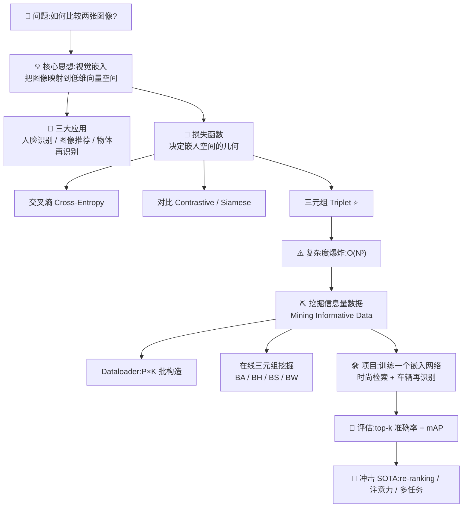

| 小节 | 主题 | 关键词 | 你会学到 |
|---|---|---|---|
| 10.0 | 为什么需要嵌入 | 维度诅咒、低维流形 | 直接用像素为什么不行 |
| 10.1 | 应用场景 | FR / 推荐 / re-ID | 嵌入落地在哪 |
| 10.2 | 学习嵌入 | 监督、数据驱动 | 训练流程四步 |
| 10.3 | 损失函数 | 交叉熵/对比/三元组 | 三种 loss 的公式与代价 |
| 10.4 | 挖掘信息量数据 | BA/BH/BS/BW、hard/semi-hard | 三元组太多怎么挑 |
| 10.5 | 项目实战 | DeepFashion / VeRi | 完整训练+测试+评估 |
| 10.6 | 冲击 SOTA | re-ranking / 注意力 / MTL | 再榨 5% 精度的技巧 |

---

## 🎬 10.0 开场:为什么"比较两张图像"这么难?

假设你在逛购物网站,看中一双高跟鞋,网站给你推荐"相似款"。或者你在社交平台上传一张照片,系统自动把你和朋友都标注出来。又或者交警要在全城几十个摄像头里找到同一辆车。这些看似不同的任务,底层其实是**同一个数学问题**:

> **给定一张查询图(query),在一个图像库(gallery/database)里,按"相似程度"排序,把最像的排在前面。**

### 🔬 第一性原理:为什么不直接用像素比较?

书里问了一个非常关键的"傻"问题:**我们能不能直接拿图像的像素值来当嵌入,省掉学习这一步?** 答案是:不行,而且是"根本行不通"。原文列了三条硬伤:

1. **维度爆炸,存储/检索代价不可承受**。一张高清图 1920×1080,双精度存储,光一张图就是数百万维。图像库有百万张时,两两比距离的计算量"computationally prohibitive"(计算上不可行)。

2. **像素相似 ≠ 语义相似**。同一个人在不同光照/角度下,像素差异巨大;而两个不同的人在相同姿势下,像素反而可能接近。**你想要的"语义相似度"事先是不知道的(a priori 未知)**,必须靠监督学习去挖掘——这正是 CNN 大显身手的地方。

3. **维度诅咒(curse of dimensionality)**。原文:*"as the dimensionality increases, the volume of the space increases so fast that the available data becomes sparse."* 维度一高,空间体积暴涨,你手头的数据在里面稀疏得像撒进宇宙的几粒沙,任何学习算法都会失效。

而**自然数据的几何是非均匀的,会聚集在低维结构(low-dimensional structures)附近**。所以用整张图像的尺寸当维度是"杀鸡用牛刀"(overkill)。

> 🔬 **核心论证**:学习嵌入的目标是**双重的(twofold)**——
> ① 学到用于比较的**语义**(the required semantics for comparison);
> ② 达到**更低的维度**(a lower dimensionality)。
> 一句话:把"高维、含噪、语义不明"的原始像素,压缩成"低维、干净、语义清晰"的向量。

### 📐 什么是嵌入(Embedding)?——书中定义逐字解读

> **DEFINITION(原书定义)**:*"An embedding is a vector space, typically of lower dimension than the input space, which preserves relative dissimilarity (in the input space)."*
>
> 嵌入是一个**向量空间**,维度通常**低于**输入空间,并且**保留了输入空间里的相对差异性**。

逐点拆解这句话:

| 短语 | 含义 | 为什么重要 |
|---|---|---|
| vector space(向量空间) | 每张图 → 一个向量(一个点) | 有了"点",才能算"距离" |
| lower dimension(更低维) | 128 维 ≪ 200 万维 | 省存储、省算力、抗维度诅咒 |
| preserves relative dissimilarity(保留相对差异) | 原空间里像/不像的关系,映射后仍然保持 | 这是嵌入"有用"的唯一理由 |

> 💡 **术语并列备忘**:本章里 **vector space(向量空间)= embedding space(嵌入空间)**,两者互换使用。在本章语境中,**训练好的 CNN 的最后一个全连接层(last fully connected layer)就是这个向量空间**。比如一个 128 个神经元的全连接层,对应一个 **128 维**的向量空间。

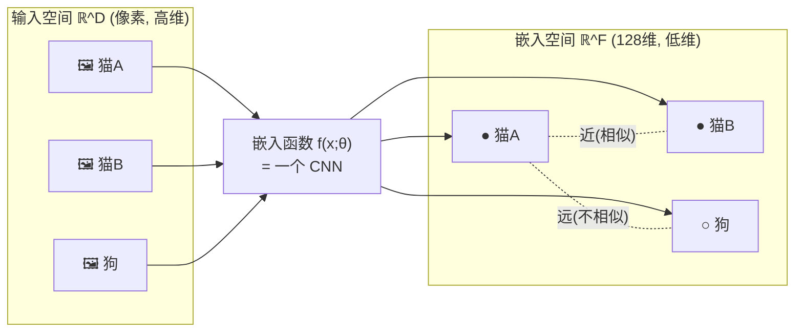

在本章语境里,**visual embedding(视觉嵌入)特指:接在 CNN 后面、位于损失层之前的最后一个全连接层**。"联合训练(joint training)"指的是**同时训练这个嵌入层和 CNN 的参数**——CNN 不是拿来当固定特征提取器,而是和嵌入层一起被 loss 驱动着学。

---

## 📱 10.1 应用:嵌入到底用在哪?

书里给了三大类应用,它们共享同一个底座——**一个能捕捉并保留"输入相似度"的嵌入函数**。

### 10.1.1 人脸识别(Face Recognition, FR)

人脸识别是**细粒度分类(fine-grained classification)**的一种。《Handbook of Face Recognition》把它分成两种模式:

| 模式 | 英文 | 匹配方式 | 生活例子 |
|---|---|---|---|
| **人脸辨识** | Face **identification** | 一对多(one-to-many) | 拿一张查询脸,和库里所有模板比对,确定"这是谁";城市在监控名单里比对嫌疑人(one-to-few);社交平台自动给你打标签 |
| **人脸验证** | Face **verification** | 一对一(one-to-one) | 一张查询脸,和一个"声称身份"的模板脸比对,确认"是不是本人";手机刷脸解锁 |

> ⚠️ **辨识 vs 验证别搞混**:辨识是"你是谁?"(从 N 个人里找),验证是"你是不是他?"(0/1 判断)。但**两者都依赖同一个好的嵌入函数**——能捕捉人脸之间有意义的差异。

### 10.1.2 图像推荐系统(Image Recommendation)

给一张查询图,找库里相似的图。购物网站的"猜你喜欢的相似商品"就是它。**关键洞察:相似度取决于你选的"相似度度量(similarity measure)",而嵌入会因度量不同而不同。**

| 相似度类型 | 英文 | 检索目标 | 例子 |
|---|---|---|---|
| **颜色相似** | Color similarity | 颜色接近 | 同色系的画、同色的鞋(不管款式);红车/白车/黑车各自聚成一团 |
| **语义相似** | Semantic similarity | 语义属性相同 | 都是高跟鞋、都是 SUV、都是跑车;可创造性地把颜色+语义结合 |

> 💡 **实战启发**:同一批图像,你想要"按颜色检索"还是"按款式检索",训练出来的嵌入空间是完全不同的两个空间。**相似度的定义权在你手里**——你用什么标注去监督,网络就学到什么样的"相似"。

### 10.1.3 物体再识别(Object Re-identification, re-ID)

典型场景是**监控摄像头网络(CCTV)**。安保人员想查询某个特定的人/车,在所有摄像头里找出他/它的位置。系统要在一个摄像头里识别出移动物体,再在**跨摄像头**间"再识别(re-identify)",建立一致的身份。

- **行人再识别(person re-ID)**:和人脸验证很像——只关心"两个摄像头里的两个人是不是同一个",**不需要知道他具体是谁**。
- **车辆再识别(vehicle re-ID)**:本章项目的重点任务之一,跨摄像头找同一辆车。

> 🔬 **贯穿全章的主线**:所有这些应用,核心都是**依赖一个嵌入函数,把输入的相似性(与不相似性)保留到输出的嵌入空间**。剩下的章节,就是在讲**怎么设计损失函数**和**怎么采样(挖掘)信息量数据点**,来训练出高质量的嵌入。

---

## 🎓 10.2 学习嵌入:训练流程四步走

由于"事先知道正确的比较语义"很难,所以**监督学习(supervised)最流行**。我们不手工设计相似度特征,而是**用带标注的训练集,数据驱动地学**。整个流程非常直接:

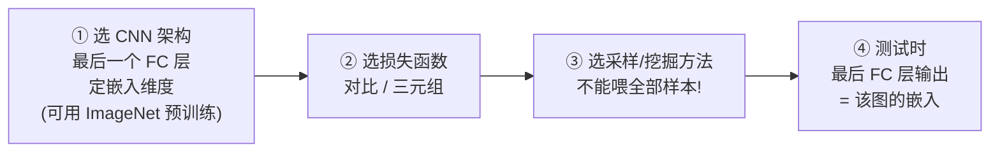

逐条读原文:

1. **选一个 CNN 架构**。任何合适的都行。实践中用**最后一个全连接层**来定嵌入,所以这个 FC 层的大小 = 嵌入向量空间的维度。数据集小时,建议用 ImageNet **预训练**打底。
2. **选一个损失函数**。流行的是 **contrastive(对比)** 和 **triplet(三元组)**(见 10.3)。
3. **选一个数据采样(挖掘)方法**。天真地把所有可能样本都喂进去是"wasteful and prohibitive"(浪费且不可行),必须**挖掘信息量数据点(mining informative data points)**(见 10.4)。
4. **测试时**,最后一个全连接层的输出就是对应图像的嵌入。

> ⚠️ **常见坑**:训练时后面还挂着 loss 层;**推理时要把 loss 层"剥掉(strip off)",取剥掉后的最后一层作为嵌入**。这个"训练时有 loss 层、推理时没有"的差异,在下面交叉熵损失里会引出一个著名问题。

---

## 🧮 10.3 损失函数:嵌入空间的"塑形师"

### 10.3.1 问题的数学形式化(Formalization)

这一小节把符号定清楚,后面所有 loss 都用这套符号,务必先吃透。

**数据集**:

$$\chi = \{(x_i, y_i)\}_{i=1}^{N}$$

- $N$:训练图像数量
- $x_i$:第 $i$ 张输入图像
- $y_i$:它的标签

**目标是学一个嵌入函数**:

$$f(x;\theta): \mathbb{R}^D \rightarrow \mathbb{R}^F$$

把 $\mathbb{R}^D$(输入,像素高维)里的图像,映射到 $\mathbb{R}^F$(特征/嵌入,低维)空间,使得**相同身份的图像在特征空间里度量上靠近**(反之不同身份的靠远)。

**优化目标**(找最优参数 $\theta^*$):

$$\theta^* = \arg\min_{\theta} \; \mathcal{L}\big(f(\theta;\chi)\big)$$

**距离度量**:

$$D(x_i, x_j): \mathbb{R}^F \times \mathbb{R}^F \rightarrow \mathbb{R}$$

衡量图像 $x_i$ 和 $x_j$ 在嵌入空间里的距离。为简洁,记 $D(x_i,x_j)$ 为 $D_{ij}$。标签用 $y_{ij}$ 表示这一对样本的关系:

| $y_{ij}$ 取值 | 含义 |
|---|---|
| $y_{ij}=1$ | 样本 $i$ 和 $j$ 属于**同一类** |
| $y_{ij}=0$ | 样本 $i$ 和 $j$ 属于**不同类** |

**训练好后,我们希望学到的嵌入函数满足**:

- ✅ **对视角、光照、形状变化保持不变(invariant)**——同一个物体换个角度/换个光照,嵌入还是那个嵌入。
- ✅ **计算高效**——这要求**低维**向量空间。空间越大,比较任意两张图的计算越多,时间复杂度越高。

> 💡 **面试高频**:嵌入维度是一个**精度 vs 效率**的权衡。维度大→表达能力强但检索慢、存储贵;维度小→快、省,但可能损失区分度。本章项目最终固定为 **128 维**,就是这个权衡的产物。

流行的三种 loss:**交叉熵、对比、三元组**。逐个来。

---

### 10.3.2 交叉熵损失(Cross-Entropy Loss)——把嵌入当分类来学

**思路**:把"学嵌入"当成一个**细粒度分类**问题,用第 2 章讲过的交叉熵损失训练。

$$\mathcal{L}(\chi) = -\sum_{i=1}^{N}\sum_{k=1}^{C} y_{ij}\, \log p\big(y_{ij}\mid f(x;\theta)\big)$$

其中 $p(y_{ij}\mid f(x;\theta))$ 是**后验类概率**。在 CNN 文献里,**softmax loss** 就指"softmax 层 + 交叉熵损失,以判别式方式训练"。

**做法(见图 10.9)**:

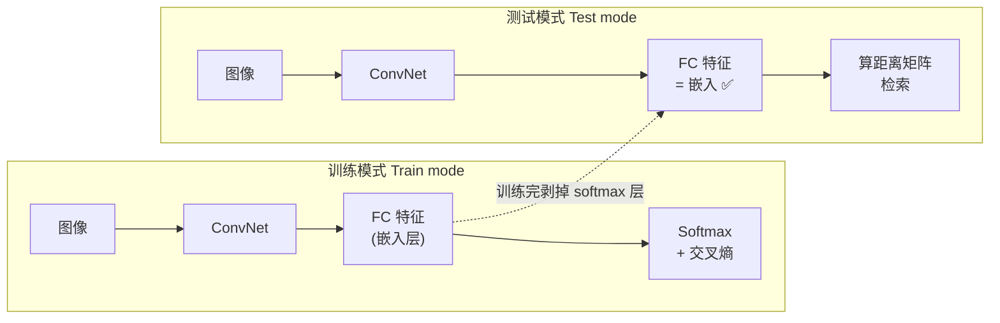

- 训练:在 loss 层前加一个全连接(嵌入)层。**每个身份(identity)当作一个独立类别**,类别数 = 训练集里的身份数。
- 推理:把最后的分类层**剥掉**,从新的最后一层取嵌入。
- 最小化交叉熵,会让 CNN 的参数 $\theta$ 使"正确类概率→1,其余类→0"。

> ⚠️ **交叉熵学嵌入的两大硬伤(原书 NOTE)**:
>
> 1. **训练与推理脱节(disconnect between training and inference)**。训练目标是"分对类",但推理目标是"算距离找相似"——两个目标不是一回事。所以它的性能通常**逊于**对比/三元组损失(后两者直接把"相对距离保持"写进 loss)。
> 2. **大规模时计算爆炸**。设想一个有 **100 万个身份**的数据集——loss 层就要 100 万个神经元!根本训不动。
>
> 💡 **但它有一个宝贵用途**:**预训练(pretraining)**。用一个可行的子集(比如 1000 个身份)先用交叉熵训一遍,能让后续的嵌入损失(对比/三元组)**收敛更快**。这是标准套路,10.4 还会用到。

---

### 10.3.3 对比损失(Contrastive Loss / Siamese Loss)——成对拉近推远

**思路**:让所有同类实例**无限接近**,让异类实例**推远**。("无限接近"是因为 CNN 无法训到损失恰好为 0。)

$$l_{\text{contrastive}}(i,j) = y_{ij}\, D_{ij}^2 + (1 - y_{ij})\,\big[\alpha - D_{ij}^2\big]_{+}$$

**逐项拆解**:

| 符号 | 含义 |
|---|---|
| $[\,\cdot\,]_+ = \max(0, \cdot)$ | **合页损失(hinge loss)**,负数截断为 0 |
| $\alpha$ | 预设的**阈值/间隔(margin)**,决定异类样本贡献 loss 的上限 |
| $D_{ij}$ | 样本 $i,j$ 在嵌入空间的距离 |

**几何直觉**:
- 当 $y_{ij}=1$(同类):loss = $D_{ij}^2$。距离越大,惩罚越大 → **逼它们靠近**。
- 当 $y_{ij}=0$(异类):loss = $[\alpha - D_{ij}^2]_+$。**只有当两个异类样本距离 < margin($\alpha$)时才产生 loss** → 逼它们推到至少 $\alpha$ 远;已经足够远的异类对,loss = 0,不再管。

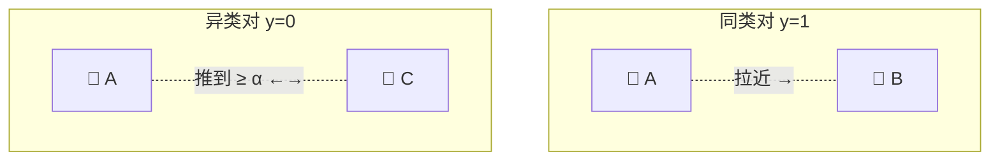

> 💡 **为什么叫 Siamese(孪生)损失?** 可以把它想象成一对**共享参数的孪生网络**:两个 CNN(权重完全相同)各喂一张图,输出两个嵌入,再算距离。Chopra 等人的开创性工作([6])就用它做人脸验证。

> ⚠️ **对比损失的局限(Manmatha 等人 [7] 的分析)**:**所有异类都用同一个 margin $\alpha$**。这意味着"视觉上差异巨大的类"和"视觉上相似的类",被要求嵌入到**相同的特征间隔**里。这个假设**太严格**,限制了嵌入流形(manifold)的结构,让学习变难。相比之下,三元组损失更灵活(下面讲)。
>
> **复杂度**:每个 epoch 是 $O(N^2)$——因为要遍历所有**样本对**。

---

### 10.3.4 三元组损失(Triplet Loss)⭐——本章主角

**渊源**:受 Weinberger 等人 [8] "为最近邻分类做度量学习"的开创性工作启发,**FaceNet(Schroff 等人 [9])**提出了适合查询-检索任务的 triplet loss。

**核心思想**:让**同类**数据点之间的距离,**小于**它们到**异类**数据点的距离。相比对比损失只看"一对",三元组损失通过**同时考虑从同一个点出发的正对距离和负对距离**,给 loss 加上了"上下文"。

$$l_{\text{triplet}}(a, p, n) = \big[D_{ap} - D_{an} + \alpha\big]_{+}$$

**三个角色**(这是理解本章后半段的钥匙):

| 角色 | 英文 | 含义 |
|---|---|---|
| **锚点** | anchor (a) | 参照样本 |
| **正样本** | positive (p) | 与 anchor **同类** |
| **负样本** | negative (n) | 与 anchor **异类** |

- $D_{ap}$:锚点到正样本的距离(希望**小**)
- $D_{an}$:锚点到负样本的距离(希望**大**)
- $\alpha$:margin,要求 $D_{an}$ 至少比 $D_{ap}$ 大 $\alpha$

**几何直觉**:loss 想要 $D_{ap} + \alpha < D_{an}$,即"**anchor-positive 要比 anchor-negative 近至少一个 margin**"。满足了就 loss=0,不满足才产生梯度。

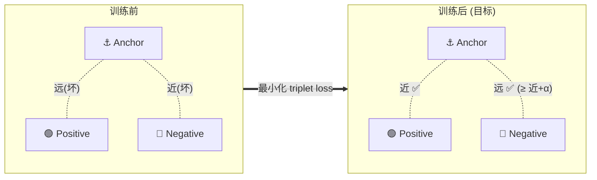

> 🔬 **对比损失 vs 三元组损失的本质区别**:
> - 对比损失是**绝对的**——同类必须"绝对靠近某个值",异类必须"绝对远过 margin"。它用**同一把尺子**量所有类。
> - 三元组损失是**相对的**——只要求"正样本比负样本近就行",不强求绝对距离。这给了嵌入流形更大的自由度,所以在配了合适的 hard 挖掘后,**三元组损失通常比对比损失效果更好**。

> ⚠️ **代价**:三元组损失要三个项,**每个 epoch 训练复杂度 $O(N^3)$**——在真实数据集上"计算上不可行"。这个爆炸的复杂度,正是 10.4"挖掘"整节要解决的问题。

---

### 10.3.5 三种损失的复杂度实测(Naive 实现)

书里用一个玩具例子把复杂度算清楚:

- 身份数 $N = 100$
- 每个身份的样本数 $S = 10$

若**天真地(naive)**实现(见图 10.12,一个大 for 循环遍历所有可能组合),每个 epoch 的复杂度:

| 损失 | 需要遍历 | 复杂度公式 | 数量级 | 直觉 |
|---|---|---|---|---|
| **交叉熵** | 所有样本 | $O(N \times S)$ | $O(10^3)$ | 只需过一遍样本,最省 |
| **对比** | 所有样本**对** | $O(N \times S \times N \times S)$ | $O(10^6)$ | 二次方,访问所有两两距离 |
| **三元组** | 所有样本**三元组** | $\approx O((NS)^3)$ | $O(10^9)$ | 三次方,最贵 |

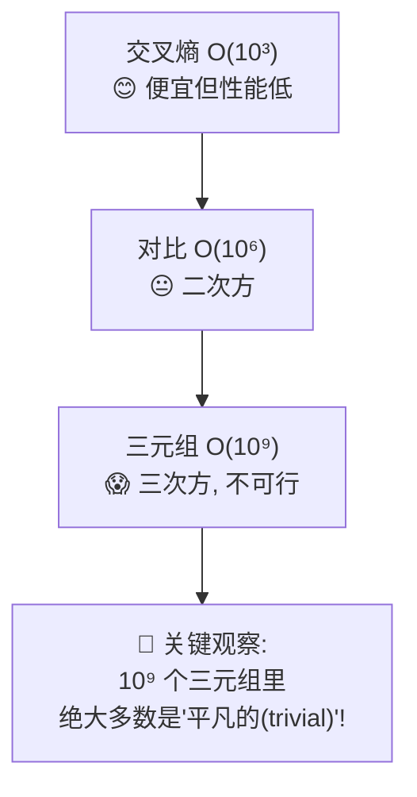

> 🔬 **本章最关键的洞察(务必记住)**:$O(10^9)$ 个三元组里,**能对 loss 做出强贡献的没几个**。训练中大多数三元组是**平凡的(trivial)**——当前网络在它们上面 loss 已经很低了(anchor-positive 已经比 anchor-negative 近得多),这些三元组**不提供有意义的梯度**,反而拖慢收敛。更糟的是,**平凡三元组数量远多于信息量三元组**,会把后者的贡献"冲淡(wash out)"。

**破局思路**:与其枚举全部 $O(N^3)$,不如:

1. **只在当前 batch(由 dataloader 构造)内构造三元组集合**;
2. **从这个集合里挖掘出一个信息量子集**。

这就把"离线枚举全数据集"变成了"在线 batch 内挖掘"——下一节的主题。

> 💡 **术语:mining(挖掘)** = 挑选信息量三元组的过程。这是本章的精髓。

---

## ⛏️ 10.4 挖掘信息量数据(Mining Informative Data)

### 离线 vs 在线

- **离线训练(offline)**:图 10.12 的天真实现属于此类——选三元组要考虑**整个数据集**,没法在训练途中"边训边挑"。不可行。
- **在线 batch 挖掘(online batch-based triplet mining)**:**FaceNet [9]** 提出——**边训边在当前 batch 内构造并挖掘三元组,忽略 batch 外的全部数据**。这招极其有效,拿下了当年人脸识别的 SOTA。

一个 epoch 内的信息流(图 10.13):

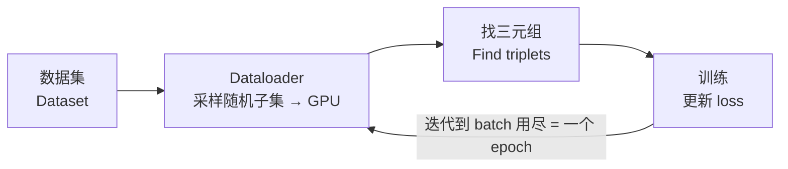

> 💡 **OpenFace [37] 的工程分工**:dataloader 按预定义统计量构造 batch,**嵌入在 GPU 上算**,然后**有效三元组在 CPU 上生成**来算 loss。这是实践中常见的 GPU/CPU 分工。

---

### 10.4.1 Dataloader:好的批构造是挖掘的前提

**Dataloader 的作用**:从数据集里选一个随机子集(mini-batch),它对"能不能挖到信息量三元组"至关重要。

> ⚠️ **天真 dataloader 的坑**:如果只是随机选一个子集,可能**类别多样性太差**。极端情况:随机选出的一个 batch 里**只有一个类别**——那就**一个有效三元组都没有**(没有负样本!),整个 batch 白跑。
>
> **要求**:在 dataloader 层就要保证 batch 有**足够的类别多样性**,才好挖三元组。

**改进方案一:先挖 B 个三元组,再堆成 3B 图像的 batch**
- 选出 B 个三元组 → 堆成 batch(B 个 anchor + B 个 positive + B 个 negative)= **3B 张图** → 算 3B 个嵌入更新 loss。
- **Hermans 等人 [11]** 指出:这 3B 张图里其实藏着 $6B^2 - 4B$ 个有效三元组,**只用 B 个是巨大的浪费(under-utilization)**。

**改进方案二(现在的业界标准):P×K 批构造**

Hermans 等人 [11] 提出一个关键的组织性改动:

$$\text{随机采 } P \text{ 个身份} \times \text{每个身份随机采 } K \text{ 张图} = \text{batch size } PK$$

- 用这个 dataloader(配合合适的挖掘),他们在**行人再识别**上做到 SOTA。
- Kumar 等人 [10, 12] 用同样思路,在**车辆再识别**多个数据集上做到 SOTA。
- **默认推荐:$P=18, K=4$,即 42 张/batch。**

**一个 P×K batch 里有多少有效三元组?**(书中的工作示例,$P=10, K=4$)

| 量 | 公式 | 数值 |
|---|---|---|
| 总锚点数 | $PK$ | 40 |
| 每个锚点的正样本数 | $K-1$ | 3 |
| 每个锚点的负样本数 | $K(P-1)$ | $4 \times 9 = 36$ |
| **有效三元组总数** | $PK \times (K-1) \times K(P-1)$ | $40 \times 3 \times 36 = 4320$ |

> 💡 **记这个公式**:$\text{有效三元组数} = PK(K-1)\cdot K(P-1)$。它是后面 BA(batch all)的求和项数,面试常问"一个 P×K 批里能构造多少三元组"。

> 🧩 **注意到没有?** 对每个锚点,我们都有**一组正样本**和**一组负样本**。既然大多数三元组是平凡的,接下来的挖掘技术,本质就是**从这两组里筛出信息量最大的子集**。

---

### 10.4.2 什么是"信息量数据"?——Hard Data Mining

**Hard data mining(困难数据挖掘)**是一种**自举(bootstrapping)**技术,广泛用于目标检测、动作定位等:每次迭代,**把当前模型跑在验证集上,挖出模型表现差的"困难数据(hard data)"**,只把这些困难数据喂给优化器——让模型学得更有效、收敛更快。

在三元组语境下,"困难"的定义(⚠️ 容易记反,重点):

| 类型 | 定义 | 记忆法 |
|---|---|---|
| **困难负样本** hard negative | **离锚点近**的负样本 | 异类却离得近 → 网络容易搞错 → loss 高 → 困难 |
| **困难正样本** hard positive | **离锚点远**的正样本 | 同类却离得远 → 网络没学好 → loss 高 → 困难 |

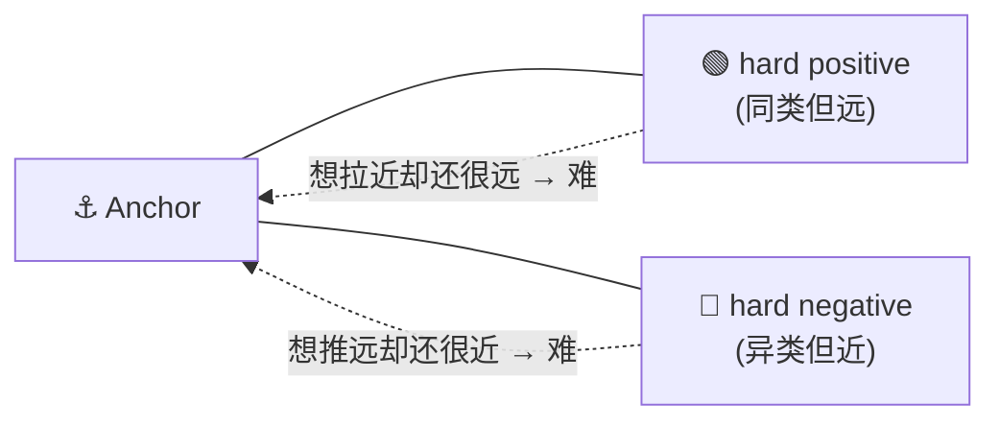

> ⚠️ **只挖最难的会翻车**:如果**只**喂困难数据,而这些困难数据里混了**离群点(outliers)**——比如**标注错误**或**图像质量差**的样本——模型会拼命去拟合这些垃圾,反而**丧失区分正常数据的能力,训练停滞**。这是 hard mining 的最大陷阱。

**FaceNet 的解药:semi-hard(半困难)采样**

为对付离群点,FaceNet [9] 提出 **semi-hard 采样**:挖既**不太难、也不太平凡**的"中等"三元组,用 margin 参数来卡:**只考虑那些落在 margin 内、且比选定正样本更远的负样本**(见图 10.14),从而**忽略太容易和太难的负样本**。

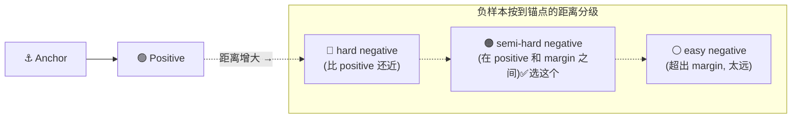

> ⚠️ **代价**:semi-hard 引入了**额外的超参数(margin)要调**。而且 FaceNet 是在 **1800 张图的大 batch** 上、在 **CPU** 上枚举三元组的。相比之下,[11] 的默认 42 张 batch **小到可以在 GPU 上高效枚举全部有效三元组**——这是为什么小 batch + P×K 成了主流。

**困难度是"相对锚点、且随 epoch 变化"的**(图 10.15):正样本离锚点越**远**越难;负样本离锚点越**近**越难。同一个样本,在不同训练阶段的"难度"是不同的——因为嵌入空间一直在变。

---

现在,一个 P×K batch 造好了,有 PK 个可能的锚点。**如何为这些锚点找正/负样本,就是各种挖掘技术的核心分歧。** 书里介绍四种:BA、BH、BS、BW。

### 10.4.3 批全部(Batch All, BA)

**用上所有有效三元组,不做任何排序/选择。** 对每个锚点,把所有可能的有效三元组求和。

- 更新 triplet loss 的项数 = $PK(K-1)\cdot K(P-1)$(就是前面算的有效三元组总数)。
- ✅ 优点:所有三元组一视同仁,**实现最简单**。
- ⚠️ 缺点:**信息被平均掉(information averaging out)**。大多数三元组是平凡的,少数才有信息量;等权求和 → 信息量三元组的贡献被**冲淡**。Hermans 等人 [11] 在行人再识别上亲身踩到这个坑。

### 10.4.4 批困难(Batch Hard, BH)

**与 BA 相反,只挑对锚点而言最难的数据。** 对每个锚点,只算**恰好一个最难正样本 + 一个最难负样本**。

- 更新 triplet loss 的项数 = $PK$(锚点总数)。
- ✅ 优点:**抗"信息平均"**,平凡样本被忽略。
- ⚠️ 缺点:**难以对付离群点**。离群点(标注错误等)会混进来,模型拼命去拟合它们,**损害训练质量**。而且——**如果网络没预训练,样本的"难度"根本不可靠**(此时最难样本约等于随机样本),会导致**训练停滞**。FaceNet [9] 和车辆 re-ID 从零训练 [10] 都报告过这个问题。

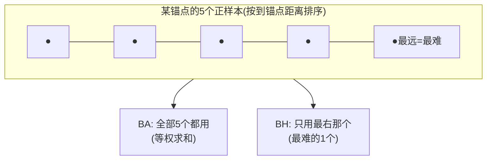

> 💡 **BA vs BH 一句话总结**:BA "全都要"(简单但被平均冲淡),BH "只要最难"(抗平均但怕离群点、怕冷启动)。两者是两个极端,BS 和 BW 是它们之间的折中。

### 三元组损失的统一表达式(Ristani 等人 [13])

Ristani 等人在多相机 re-ID 的名作 [13] 里,把各种批采样技术**统一成一个表达式**。设 batch 里 $a$ 是锚点,$N(a)$、$P(a)$ 分别是它的负/正样本子集:

$$l_{\text{triplet}}(a) = \Big[\alpha + \sum_{p \in P(a)} w_p D_{ap} - \sum_{n \in N(a)} w_n D_{an}\Big]_{+}$$

- $w_p$:正样本 $p$ 的**权重(重要性)**;$w_n$:负样本 $n$ 的重要性。
- 一个 epoch 的总 loss:$\mathcal{L}(\theta;\chi) = \sum_{a \in \text{all batches } B} l_{\text{triplet}}(a)$。

**BA 和 BH 都是这个式子的特例**——区别只在**怎么设 $w_p, w_n$**。这个统一视角是理解 BS/BW 的基础。

### 10.4.5 批加权(Batch Weighted, BW)

BA 给所有样本**均匀权重**,会淹没重要的困难样本(它们数量上被平凡样本压倒)。Ristani 等人 [13] 的 **BW**:**按样本到锚点的距离加权**,给信息量大(更难)的样本更高权重。

- 正样本权重 $w_p = \dfrac{e^{D_{ap}}}{\sum_{x \in P(a)} e^{D_{ax}}}$ ——正样本**离锚点越远(越难)权重越大**。
- 负样本权重 $w_n = \dfrac{e^{-D_{an}}}{\sum_{x \in N(a)} e^{-D_{ax}}}$ ——负样本**离锚点越近(越难)权重越大**(注意负号)。
- 本质:用 **softmax 归一化**,把注意力"柔和地"倾斜向困难样本,而不是像 BH 那样"一刀切只留最难一个"。

### 10.4.6 批采样(Batch Sample, BS)

BS(在 [11] 实现页讨论,被 Kumar 等人 [10] 用于车辆 re-ID SOTA):**用"锚点到样本距离"的分布,以类别方式(categorically / multinomial)随机采一个正样本和一个负样本。**

- 正样本:从 $\text{multinomial}\{D_{ax}\}_{x \in P(a)}$ 采(距离越大概率越高)。
- 负样本:从 $\text{multinomial}\{-D_{ax}\}_{x \in N(a)}$ 采(距离越小概率越高)。
- ✅ 相比 BH,BS **避免采到离群点**——因为它按分布采样,而不是硬取最极端的那个,更可能选到"信息量大但不是离群点"的样本。

### 四种挖掘策略总表(书中表 10.1)

| 挖掘 | 正样本权重 $w_p$ | 负样本权重 $w_n$ | 说明 |
|---|---|---|---|
| **All (BA)** | 1 | 1 | 全部样本均匀加权 |
| **Hard (BH)** | $[x_p == \arg\max_{x\in P(a)} D_{ax}]$ | $[x_n == \arg\min_{x\in N(a)} D_{ax}]$ | 各取一个最难 |
| **Sample (BS)** | $[x_p == \text{multinomial}\{D_{ax}\}]$ | $[x_n == \text{multinomial}\{-D_{ax}\}]$ | 从多项分布采一个 |
| **Weighted (BW)** | $\dfrac{e^{D_{ap}}}{\sum_{x\in P(a)} e^{D_{ax}}}$ | $\dfrac{e^{-D_{an}}}{\sum_{x\in N(a)} e^{-D_{ax}}}$ | 按到锚点距离软加权 |

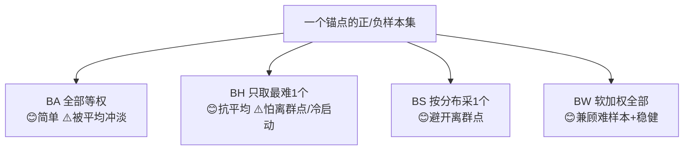

> 💡 **实战选型建议**(结合 10.5 的实验结果):
> - 从零训练、网络还没预训练 → **别直接上 BH**(难度不可靠),先用交叉熵/BA 预热。
> - 想要稳健又高性能 → **BW**(在时尚检索里全面胜出)。
> - 数据可能有离群点 → **BS**(在 VeRi 车辆再识别里 mAP 最高)。
> - 要简单基线 → **BA**。

---

## 🛠️ 10.5 项目:训练一个嵌入网络

本节把上面所有概念串成一个完整项目——**图像查询检索系统**,两个经典任务:

| 任务 | 英文 | 数据集 | 场景 |
|---|---|---|---|
| **购物难题** | Shopping dilemma | DeepFashion | 找和查询款相似的服饰 |
| **再识别** | Re-identification | VeRi | 跨摄像头/视角找同一辆车 |

**无论哪个任务,训练/推理/评估流程都一样。** 成功训练嵌入网络的"配料":

- **训练集**:监督学习,标注隐含相似度度量。**数据集组织成文件夹,每个文件夹 = 一个身份/类别**。目标:同类图在嵌入空间靠近,异类远离。
- **测试集**:通常拆成两部分——
  - **query set(查询集)**:用作查询的图。
  - **gallery set(图库集,论文里常叫 test set)**:每张图对每个 query 图**排名(检索)**。若嵌入学得完美,query 的 top 检索结果应全是同类。
- **距离度量**:用**欧氏距离(Euclidean / L2)**衡量两个嵌入的相似度。
- **评估**:用 **top-k 准确率** 和 **mAP(mean Average Precision,平均精度均值)**。

### 📏 评估指标:AP 与 mAP(公式详解)

对查询图 $q$,单个查询的平均精度:

$$AP(q) = \frac{\sum_{k} P(k)\cdot \delta_k}{N_{gt}(q)}$$

| 符号 | 含义 |
|---|---|
| $P(k)$ | 排名 $k$ 处的**精度(precision at rank k)** |
| $N_{gt}(q)$ | $q$ 的**真实正确检索总数**(ground-truth true retrievals) |
| $\delta_k$ | **布尔指示函数**:query $q$ 匹配到某测试图,若在 rank $\le k$ 处正确则为 1(正确 = query 和该测试图的真值标签相同) |

对**所有查询图取平均**得到 mAP:

$$mAP = \frac{\sum_{q} AP(q)}{Q}$$

其中 $Q$ 是查询图总数。

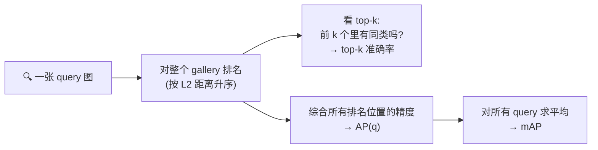

> 💡 **top-k 准确率 vs mAP 的区别**:top-k 只关心"前 k 名里有没有对的"(命中即算对);mAP 更严格,它奖励"把所有正确项都排到前面",综合了排名质量。两个都看,才能全面判断嵌入好坏。

### 10.5.1 时尚任务(DeepFashion)

判断"两张店内照是不是同一件衣服"。用 Liu 等人 [3] 的 **DeepFashion** 数据集(取自 Forever 21 目录):**54,642 张图,11,735 件服饰**;约 25,000 张训练 + 26,000 张测试(拆成 query/gallery)。

### 10.5.2 车辆再识别(VeRi)

跨摄像头网络匹配物体外观(交警在全城摄像头找某辆车)。用 Liu 等人 [14,36] 的 **VeRi** 数据集:**40,000 个边界框标注,776 辆车,20 个摄像头**;每辆车被 2–18 个摄像头以不同视角、不同光照拍到(含侧视,更有挑战)。

> **本项目只用类别/身份级标注**,不用 make/model/颜色/时空等属性——加更多信息能提精度,但超出本章范围(10.6 会点到)。

### 10.5.3 实现:超参数清单

项目基于 [11] 的三元组学习 GitHub 代码库。关键超参数(逐条讲):

| 超参数 | 设置 | 为什么 |
|---|---|---|
| **预训练** | ImageNet [15] | 小数据集上打底,让嵌入损失收敛更快 |
| **输入尺寸** | 224 × 224 | 标准分类输入尺寸 |
| **主干架构** | **MobileNet-v1** [16] | 569M MACs,**仅 4.24M 参数**,ImageNet top-1 = 70.9%;轻量,适合部署 |
| **优化器** | **Adam** [17],$\varepsilon=10^{-3}, \beta_1=0.9, \beta_2=0.999$,初始 lr = 0.0003 | 自适应学习率,默认超参 |
| **数据增强** | 在线,标准图像翻转(flip) | 便宜有效的增广 |
| **Batch** | $P=18$ 身份 × $K=4$ 张 = 72 张 | 保证类别多样性,便于挖三元组 |
| **Margin** | 用 **softplus** $\ln(1+\cdot)$ 替代硬合页 $[\cdot]_+$ | 平滑变体,梯度更友好,免去调硬 margin |
| **嵌入维度** | **128** | 精度与效率的权衡,低维检索快 |

> 💡 **术语:MAC(乘累加,Multiply-Accumulate)**——计算两数之积并加到累加器上的操作。执行它的硬件单元叫 MAC unit。MACs 数常用来衡量模型的**计算量**(比参数量更能反映推理开销)。

> 💡 **softplus 小技巧**:硬合页 $[\cdot]_+ = \max(0,\cdot)$ 在 0 点不可导、且完全满足 margin 后梯度为 0(样本"躺平"不再学)。换成 softplus $\ln(1+e^{x})$ 后,处处可导、永远有一点梯度,训练更稳。这是三元组损失的常见实用改良。

### 10.5.4 测试与结果

每个数据集给 query + gallery 两个文件,算 mAP 和 top-k;并且**可视化**——取随机 query,画出 top-k 检索图(X 标记检索错误)。

**任务 1:店内检索(In-shop Retrieval)结果**(表 10.2):

| 方法 | top-1 | top-2 | top-5 | top-10 | top-20 |
|---|---|---|---|---|---|
| Batch all | 83.79 | 89.81 | 94.40 | 96.38 | 97.55 |
| Batch hard | 86.40 | 91.22 | 95.43 | 96.85 | 97.83 |
| Batch sample | 86.62 | 91.36 | 95.36 | 96.72 | 97.84 |
| **Batch weighted** | **87.70** | **92.26** | 95.77 | 97.22 | **98.09** |
| ABE [18] | 87.30 | – | – | 96.70 | 97.90 |
| BIER [19] | 76.90 | – | – | 92.80 | 95.20 |

- **BW 全面胜出**,top-1 > 87%(第一个检索结果就找到同类)。
- top-k 随 k 增大**单调升高**(k 越大越容易命中)。
- 与 SOTA 的 ABE(注意力集成)、BIER(在线梯度提升训练度量 CNN 集成)**打成平手甚至更好**。

**任务 2:车辆再识别(VeRi)结果**(表 10.3 节选,`*` 表示用了时空信息):

| 方法 | mAP | top-1 | top-5 |
|---|---|---|---|
| **Batch sample** | **67.55** | 90.23 | 96.42 |
| Batch hard | 65.10 | 87.25 | 94.76 |
| Batch all | 66.91 | 90.11 | 96.01 |
| Batch weighted | 67.02 | 89.99 | 96.54 |
| GSTE [20] | 59.47 | **96.24** | **98.97** |
| PAMTRI (All) [23] | **71.88** | 92.86 | 96.97 |
| VAMI+ST* [21] | 61.32 | 85.92 | 91.84 |

> 🔬 **观察**:本项目(仅用身份标注)在 VeRi 上,**BS 的 mAP(67.55)在四种批采样里最高**,且**不使用任何额外信息源**(时空、属性)就能和 SOTA 打得有来有回。PAMTRI(All)mAP 更高(71.88),但它额外用了**关键点 + 属性 + 合成数据**——用更多标注换精度。检索有明显的**视角不变性**:同一辆车的不同视角都被检索进 top-5。

> ⚠️ **对比 SOTA 的陷阱(原书 sidebar)**:训练深度网络要调一堆超参,比较算法时**很容易被误导**——某方法"更好"可能只是因为它的主干 CNN 在相同预训练集上表现更佳,或训练算法(SGD vs Adam)不同。**别只看表格数字,要深入算法机理看全貌。**

### 竞争方法一览(车辆 re-ID)

| 方法 | 核心思路 | 额外标注 |
|---|---|---|
| CLVR [26] | 用 model 标签做细粒度分类损失(类似 10.3.2) | ID |
| GSTE [20] | 用 K-Means 聚类类内变化,更有指导地训练 | ID(+K-Means 参数) |
| PAMTRI [23] | 多任务学习,用关键点标注+合成数据;PAMTRI(All)最佳 | ID + 关键点 + 属性 |
| AAVER [25] | 双路网络提全局+局部特征拼成嵌入 | ID + 关键点朝向 |
| VAMI [21] | 用 GAN 合成多视角 + 多视角注意力,帮学更好嵌入 | ID(+GAN) |
| Path-LSTM [22] | 生成多条路径提案做时空正则,加 LSTM 排序 | ID + 时空 |
| MSVR [24] | 图像金字塔多分支多尺度表示 | ID |

> 💡 **license plate(车牌)的现实无奈**:车牌本是全局唯一标识,但标准安装的交通摄像头**很难提取车牌**,所以必须靠**视觉特征**。⚠️ 若两辆车 make/model/颜色全同(且无划痕文字等标记),**视觉特征无法区分**——此时只有**时空信息(GPS)**能救。

---

## 🚀 10.6 冲击当前精度上限

深度学习日新月异。书里给了几条"再榨精度"的方向:

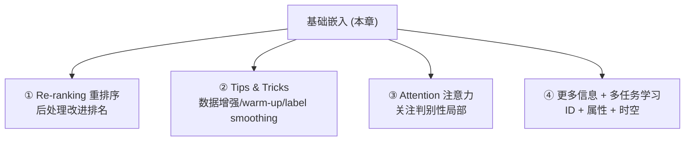

**① 重排序(Re-ranking)**:拿到初始排名后,用**后处理**改进相关图的排名。Zhong 等人 [28] 的经典做法:给探针 $p$ 和图库,提取外观特征(嵌入)和 **k-reciprocal 特征**,算原始距离 $d$ 和 **Jaccard 距离** $J_d$,最终距离 = 两者组合。**AAVER [25] 靠 re-ranking 后处理把 mAP 提升了 5%。**

> **术语:Jaccard 距离** = 两个集合的**交集/并集**(交并比的补)。

**② Tips & Tricks(Luo 等人 [29])**:用 [11] 的批构造 + 数据增强 + **warm-up 学习率** + **label smoothing** 等技巧,做出了强基线。
- **warm-up 学习率**:在最初若干 epoch 内,让学习率**线性调制**(从小到大),避免冷启动时大步长把参数带跑偏。
- **label smoothing(标签平滑)**:调制交叉熵,让 loss **不对训练集过度自信**,帮助泛化、防过拟合——**小数据集上尤其有用**。

**③ 注意力(Attention)**:本章学的是**全局**嵌入,没显式引导网络关注物体的**判别性局部**。Liu [30]、Chen [31] 等人用注意力,还能提升**跨域(cross-domain)**再识别性能 [32]。

**④ 用更多信息指导训练(多任务学习 MTL)**:融合身份 + 属性(make/model)+ 时空(GPS)信息,理论上精度更高,**代价是要标更多数据**。多属性可用 **MTL** 框架;当多任务 loss 冲突时,用交叉验证加权,或用多目标优化(Sener 等人 [32])来解。

---

## 📌 小结

> **一句话概括本章**:视觉嵌入 = 用 CNN 把图像映射到一个**低维向量空间**,让"相似"变成"距离近";训练靠**度量学习损失**(核心是三元组损失),难点在**从海量三元组里挖掘出信息量大的那批**。

**知识主干**:

1. **为什么要嵌入**:直接用像素 → 维度爆炸 + 语义不明 + 维度诅咒。目标是**学语义 + 降维**双赢。嵌入 = 保留相对差异性的低维向量空间;**训练好的 CNN 最后一个 FC 层就是它**。

2. **三大应用**:人脸识别(辨识 one-to-many / 验证 one-to-one)、图像推荐(颜色/语义相似度)、物体再识别(跨摄像头 re-ID)。都靠**同一个保相似度的嵌入函数**。

3. **三种损失**(记住复杂度和特点):

   | 损失 | 公式核心 | 复杂度/epoch | 特点 |
   |---|---|---|---|
   | 交叉熵 | 当分类训,剥掉 softmax 取嵌入 | $O(NS)$ | 便宜、可预训练;但**训练/推理脱节**,性能偏低 |
   | 对比(Siamese) | $y D^2 + (1{-}y)[\alpha{-}D^2]_+$ | $O(N^2)$ | 成对拉近推远;**统一 margin 太死板** |
   | 三元组 ⭐ | $[D_{ap}-D_{an}+\alpha]_+$ | $O(N^3)$ | **相对约束更灵活、性能最好**;但复杂度爆炸 |

4. **挖掘信息量数据**(破解 $O(N^3)$):
   - **在线 batch 挖掘**(FaceNet)+ **P×K dataloader**(Hermans,默认 P=18,K=4)。
   - 一个 P×K 批有 $PK(K-1)K(P-1)$ 个有效三元组;大多数**平凡**,少数**信息量大**。
   - **hard = 相对锚点**:hard negative 离锚点近、hard positive 离锚点远;**只挖最难会被离群点带偏** → semi-hard 折中。
   - 四种策略:**BA**(全都要/被平均冲淡)、**BH**(只取最难/怕离群点+冷启动)、**BS**(按分布采一个/避开离群点)、**BW**(软加权/稳健高性能)。

5. **项目**:MobileNet-v1 + Adam + 128 维嵌入 + softplus margin;在 DeepFashion(**BW 胜出,top-1≈87.7%**)和 VeRi(**BS 的 mAP 最高≈67.55**)上验证。评估用 **top-k 准确率 + mAP**,距离用 **L2**。

6. **冲击 SOTA**:re-ranking(+5% mAP)、warm-up/label smoothing、注意力、多任务学习(融合属性/时空)。

---

## 🔗 延伸阅读

- **FaceNet**(Schroff et al., 2015):三元组损失 + semi-hard 挖掘的开山之作,人脸识别嵌入的奠基。
- **In Defense of the Triplet Loss for Person Re-Identification**(Hermans et al., 2017,即 [11]):本章 P×K 批构造与 BA/BH 的来源,附有 GitHub 代码 `VisualComputingInstitute/triplet-reid`。
- **Ristani et al., 2018**([13]):批采样统一表达式与 BW,多相机再识别。
- **DeepFashion**([3])/ **VeRi**([14]):本章两个项目数据集,以图搜衣/车辆再识别基准。
- **Olivier Moindrot 博客**"Triplet Loss and Online Triplet Mining in TensorFlow":工程实现三元组损失/在线挖掘的经典教程。
- **Chopra et al.**([6]):对比损失(Siamese)做人脸验证的开创工作。
- **Zhong et al.**([28]):k-reciprocal re-ranking,再识别后处理标配。
- **Bag of Tricks**(Luo et al., [29]):行人再识别强基线的训练技巧合集。

> 🧩 **面试高频三连**:
> 1. "三元组损失为什么比对比损失好?" → 相对约束更灵活 + 配合 hard mining。
> 2. "$O(N^3)$ 怎么解决?" → 在线 batch 挖掘 + P×K dataloader + BA/BH/BS/BW。
> 3. "hard negative 是离锚点近还是远?" → **近**(异类却近 → loss 高 → 难);⚠️只挖最难会被离群点带偏,故用 semi-hard / BS。

---

> 📖 下一步:本章是《Deep Learning for Vision Systems》的收官章之一。视觉嵌入把前面所有 CNN 知识(卷积特征、迁移学习、损失设计)收束到"度量学习"这个统一框架里——它是人脸识别、以图搜图、跨摄像头追踪的共同底座,也是通往对比学习(SimCLR/MoCo)、多模态检索(CLIP)等现代表示学习的桥梁。
