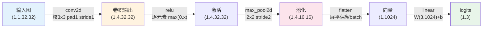
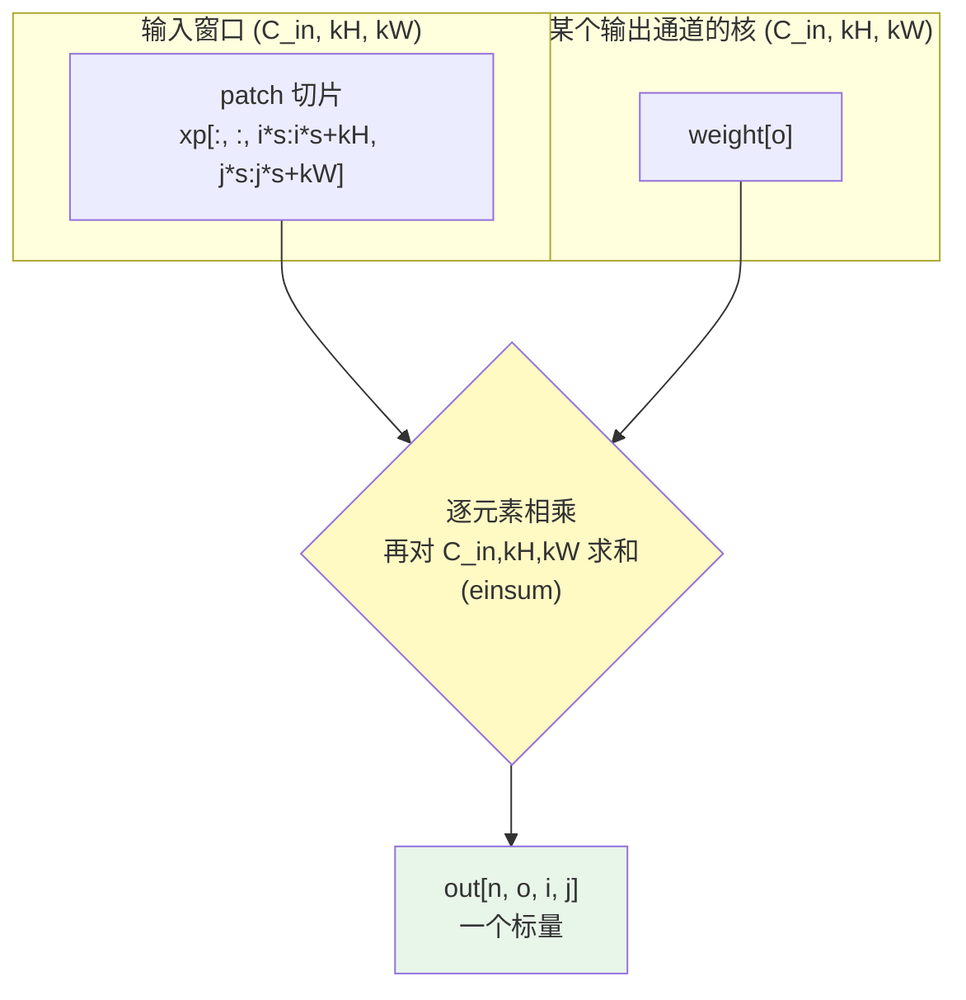
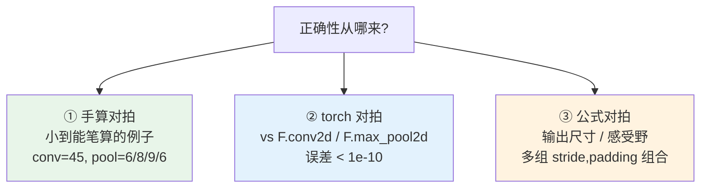

# 🧱 项目 01：纯 NumPy 从零实现 CNN 前向传播（Conv / Pool / ReLU / FC）

> 配套书：**《Deep Learning for Vision Systems》**（Mohamed Elgendy）第 3~5 章。
> 本项目把「卷积神经网络前向推理」拆成最小积木，**不用任何深度学习框架**，只用 NumPy 一行行写出来，
> 再用 `torch.nn.functional` 做**数值对拍**证明我们写对了。
>
> 🎯 学完你能回答：卷积到底在算什么？输出尺寸公式怎么来的？`stride/padding` 各是什么代价？
> 感受野怎么算？为什么两个 3×3 能顶一个 5×5？—— 全是视觉 / 面试高频。

---

## 📁 目录

- [1. 这个项目是什么 & 为什么值得手写](#1)
- [2. 快速开始（30 秒跑通）](#2)
- [3. 数据流总览（mermaid）](#3)
- [4. 🔬 第一性原理：卷积到底在算什么](#4)
- [5. 核心算子逐个讲解（配代码）](#5)
  - [5.1 输出尺寸公式 `conv_output_size`](#51)
  - [5.2 `conv2d` 二维卷积](#52)
  - [5.3 `max_pool2d` 最大池化](#53)
  - [5.4 `relu` / `flatten` / `linear`](#54)
  - [5.5 感受野 `receptive_field`](#55)
- [6. 手算对拍：一个能用笔算验证的例子](#6)
- [7. 测试怎么设计的（三条腿）](#7)
- [8. Demo：把卷积『看见』](#8)
- [9. 💡 面试高频 20 问速答](#9)
- [10. ⚠️ 常见坑合集](#10)
- [11. 📌 小结 & 🔗 延伸](#11)

---

<a id="1"></a>
## 1. 这个项目是什么 & 为什么值得手写

**是什么**：一个 `cnn_numpy.py`，纯 NumPy 实现 CNN 前向所需的全部算子——
`conv2d`（支持 stride/padding）、`max_pool2d`、`relu`、`flatten`、`linear`，
外加两个工具函数 `conv_output_size`（输出尺寸公式）和 `receptive_field`（感受野）。
再把它们串成一个玩具网络 `TinyCNN`。

**为什么值得手写**（明明有 PyTorch）：

| 只调框架 | 手写一遍 |
|---|---|
| 知道 `nn.Conv2d(3, 64, 3, padding=1)` 怎么写 | 知道这行**背后 for 循环在滑什么窗、乘什么、加什么** |
| 输出尺寸靠试或报错才知道 | **公式刻进脑子**，一眼算出 shape |
| 面试被问「卷积复杂度」卡壳 | 从代码结构直接读出 $O(N \cdot C_{out} \cdot C_{in} \cdot H_{out} \cdot W_{out} \cdot k^2)$ |
| padding 用 0 还是 -inf 分不清 | 池化那个 -inf 的坑亲手踩过 |

> 🔬 **核心论证**：深度学习框架把卷积做成了黑箱 API，但视觉工程师的护城河恰恰在于
> **理解黑箱**。当你 debug 一个 shape 对不上、或者感受野不够导致模型看不到全局的问题时，
> 靠的不是记 API，而是这套底层直觉。手写一遍是获得直觉最快的路。

---

<a id="2"></a>
## 2. 快速开始（30 秒跑通）

```bash
# 进入项目目录
cd book-dl-for-vision/projects/01_cnn_from_scratch

# （可选）装依赖；本机通常已装好
pip install -r requirements.txt

# 跑测试：应看到 "46 passed"
python -m pytest -q

# 跑 demo：生成两张特征图 PNG
python run_demo.py
```

跑完你会得到：

- `feature_maps.png` —— 经典核（Sobel/Laplacian/模糊）在合成图上的特征提取效果；
- `tinycnn_maps.png` —— TinyCNN 各层（Conv→ReLU→Pool）的特征图 + 感受野标注。

> ⚠️ **离线保证**：全程**不联网、不下模型、不需要 key、不需要 GPU**。
> `torch` 只在**测试**里用来对拍，核心 `cnn_numpy.py` 连 import torch 都没有。

**环境**（开发实测）：Python 3.13 / numpy 2.3 / matplotlib 3.10 / torch 2.12 CPU。

---

<a id="3"></a>
## 3. 数据流总览（mermaid）

一张灰度图 `(1, 1, 32, 32)` 流过 TinyCNN 的形状变化：



再看单个 `conv2d` 内部，一个输出点是怎么算出来的：



**一句话**：卷积输出的**每个点** = 输入上一个小窗口和核**逐元素相乘再求和**（点积），
换个窗口滑一下再算一次，滑遍全图。

---

<a id="4"></a>
## 4. 🔬 第一性原理：卷积到底在算什么

### 4.1 数学定义（我们实现的是「互相关」）

深度学习里说的「卷积」，严格数学名字叫**互相关（cross-correlation）**——
区别只在于**数学卷积要把核翻转 180°**，而深度学习不翻（因为核是学出来的，翻不翻等价）。
我们实现的、以及 PyTorch `conv2d` 实现的，都是**不翻核**的版本：

$$
\text{out}[n, o, i, j] = b_o + \sum_{c=0}^{C_{in}-1} \sum_{p=0}^{k_H-1} \sum_{q=0}^{k_W-1}
x[n, c,\, i\cdot s + p,\, j\cdot s + q] \cdot w[o, c, p, q]
$$

- $n$：batch 里第几张图
- $o$：第几个输出通道（= 第几个卷积核）
- $i, j$：输出特征图上的空间位置
- $c$：输入通道
- $p, q$：核内偏移
- $s$：stride
- $b_o$：第 $o$ 个输出通道的偏置

> 这条公式**就是 `conv2d` 函数里那行 `np.einsum("ncyx,ocyx->no", patch, weight)`**。
> `ncyx,ocyx->no` 的意思：`patch` 下标是 `(n, c, y, x)`，`weight` 下标是 `(o, c, y, x)`，
> 把 `c, y, x` 三个共有下标**乘起来求和**，只留下 `(n, o)`——正是「对输入通道和核内所有位置求点积」。

### 4.2 CNN 三大先验（Inductive Bias）

卷积相比全连接（FC）省了天量参数，靠的是三个「关于图像的假设」：

| 先验 | 含义 | 在代码里的体现 |
|---|---|---|
| **局部连接** | 一个输出点只看输入的一个小窗口，不看全图 | `patch` 只切 `kH×kW` 大小 |
| **权重共享** | 同一个核在全图滑动复用，参数量与图大小无关 | for 循环里 `weight` 从不变 |
| **平移等变** | 图里物体平移，特征图上响应也跟着平移 | 滑窗结构天然保证 |

> 💡 **面试高频**：「为什么图像用 CNN 而不用 MLP？」
> 答：一张 224×224×3 图接一个 1000 维 FC，权重就是 224·224·3·1000 ≈ **1.5 亿**；
> 换成 3×3×3×64 卷积核只有 **1728** 个参数还能全图复用。局部连接 + 权重共享是关键。

---

<a id="5"></a>
## 5. 核心算子逐个讲解（配代码）

所有代码在 [`cnn_numpy.py`](./cnn_numpy.py)。下面逐个拆。

<a id="51"></a>
### 5.1 输出尺寸公式 `conv_output_size`

**是什么**：给定输入边长、核、stride、padding，算输出边长。这是全项目最该背下来的一条公式。

```python
def conv_output_size(in_size, kernel, stride=1, padding=0):
    numerator = in_size + 2 * padding - kernel
    if numerator < 0:
        raise ValueError(...)          # 核比填充后输入还大，无合法窗口
    return numerator // stride + 1
```

**公式**（向下取整）：

$$
\text{out} = \left\lfloor \frac{\text{in} + 2 \cdot \text{padding} - \text{kernel}}{\text{stride}} \right\rfloor + 1
$$

**逐项理解**：

- `in + 2*padding`：两侧各填 `padding`，输入变长了；
- `- kernel`：核要放进去，最后一个能放的位置在末尾往回退 `kernel-1`，所以有效可滑范围是 `... - kernel`；
- `/ stride`：每步跳 `stride`，能滑几步；
- `+ 1`：第一个窗口（位置 0）也算一个。

**代价 / 权衡**：

| 你想要 | 怎么设 | 代价 |
|---|---|---|
| 输出尺寸不变（same 卷积） | `padding = (kernel-1)//2`，stride=1 | 边缘补 0 引入伪信息 |
| 输出减半（下采样） | stride=2 | 丢一半空间分辨率 |
| 尽量不丢边缘信息 | padding 大 | 计算量增大、边缘全是补的 0 |

> 💡 **面试**：`padding=1, kernel=3, stride=1` 为什么保持尺寸？代入公式 `(H+2-3)/1+1 = H`。这就是 VGG 全程用的 same 卷积。

<a id="52"></a>
### 5.2 `conv2d` 二维卷积

**核心实现**（省略注释）：

```python
def conv2d(x, weight, bias=None, stride=1, padding=0):
    N, C_in, H, W = x.shape
    C_out, C_in_w, kH, kW = weight.shape
    assert C_in == C_in_w                        # 通道必须对齐
    H_out = conv_output_size(H, kH, stride, padding)
    W_out = conv_output_size(W, kW, stride, padding)
    xp = _pad_nchw(x, padding)                    # 零填充
    out = np.zeros((N, C_out, H_out, W_out))
    for i in range(H_out):
        for j in range(W_out):
            patch = xp[:, :, i*stride:i*stride+kH, j*stride:j*stride+kW]
            out[:, :, i, j] = np.einsum("ncyx,ocyx->no", patch, weight)
    if bias is not None:
        out = out + bias.reshape(1, C_out, 1, 1)
    return out
```

**逐行讲**：

1. **拆形状**：输入 NCHW，权重 OIHW（out, in, kH, kW），这是 PyTorch 的布局，对拍才对得上；
2. **assert 通道对齐**：`weight` 的第 2 维必须 == 输入通道，否则维度错还不报错很难查（⚠️ 坑）；
3. **算输出尺寸**：复用 5.1 的公式，保证和测试一致；
4. **padding**：`_pad_nchw` 只在 H、W 两个空间维填 0，N、C 不动；
5. **双重 for**：只在**输出的两个空间维**循环。batch、通道、核内乘加全交给 `einsum` 向量化——这是可读性与速度的折中；
6. **einsum 那行**：见 4.1，就是把公式里三重求和一次算完；
7. **bias 广播**：`(C_out,)` reshape 成 `(1, C_out, 1, 1)`，广播到每个空间位置。

> ⚠️ **坑 1**：`patch` 与 `weight` 的下标顺序在 einsum 里必须精确对应 `(n,c,y,x)` vs `(o,c,y,x)`，写反 y/x 结果就转置了还不报错。
> ⚠️ **坑 2**：全用 `float64`。若混 float32，与 torch 对拍时误差会放大到 1e-6，测试的 `atol=1e-10` 就过不了。

**复杂度**：外层 `H_out·W_out` 次循环，每次 einsum 是 `N·C_out·C_in·k²`，总计
$O(N \cdot C_{out} \cdot C_{in} \cdot H_{out} \cdot W_{out} \cdot k^2)$。这也是真实卷积的理论 FLOPs。

> 💡 **进阶**：工业实现（cuDNN）不这么滑窗，而是用 **im2col** 把每个窗口拉平成一列，
> 把卷积变成一次大矩阵乘（GEMM），从而吃满 BLAS。我们为了可读没做 im2col，但你该知道有这回事。

<a id="53"></a>
### 5.3 `max_pool2d` 最大池化

```python
def max_pool2d(x, kernel=2, stride=None, padding=0):
    if stride is None:
        stride = kernel                          # 默认不重叠
    ...
    if padding > 0:
        xp = np.pad(x, ..., constant_values=-np.inf)   # 关键：-inf 而非 0
    for i in range(H_out):
        for j in range(W_out):
            window = xp[:, :, i*stride:i*stride+kernel, j*stride:j*stride+kernel]
            out[:, :, i, j] = window.max(axis=(2, 3))
```

**要点**：

- **默认 stride = kernel**：最常见的 2×2/stride2「不重叠池化」，把空间尺寸砍半；
- **⚠️ 最大的坑：padding 用 `-inf` 不用 `0`**。如果输入含负值，用 0 填充会让 max 错选到填充的 0，
  与 torch 行为不符。用 `-np.inf` 保证填充值**永远选不中**。测试 `test_max_pool2d_negative_padding_uses_neg_inf` 专门守这个坑；
- **`window.max(axis=(2,3))`**：在窗口的两个空间维取最大，保留 N、C。

> 💡 **面试**：池化的作用？① 降维减计算；② 提供**局部平移不变性**（小抖动不改变 max）；③ 扩大后续层感受野。
> 现代网络（ResNet 后期）常用 **stride 卷积**替代池化，因为池化是不可学的硬下采样。

<a id="54"></a>
### 5.4 `relu` / `flatten` / `linear`

```python
def relu(x):
    return np.maximum(0.0, x)          # 逐元素 max(0, x)

def flatten(x):
    return x.reshape(x.shape[0], -1)   # (N,C,H,W) -> (N, C*H*W)

def linear(x, weight, bias=None):
    y = x @ weight.T                   # weight 是 (out, in)，要转置
    if bias is not None:
        y = y + bias.reshape(1, -1)
    return y
```

- **ReLU**：⚠️ 用 `np.maximum`（两数组逐元素取大），**不是** `np.max`（那会把张量塌成一个标量）；
- **flatten**：默认 C-order 展平，与 `torch.flatten(x, 1)` 顺序一致，接 FC 时权重才对得上；
- **linear**：⚠️ 权重是 `(out_features, in_features)`（PyTorch 约定），所以 `x @ weight.T`。记反了会维度报错（幸好会报错）。

<a id="55"></a>
### 5.5 感受野 `receptive_field`

**是什么**：输出特征图上**一个点**，能「看到」原图多大的区域。太小 → 模型看不到全局；太大 → 定位不精。

```python
def receptive_field(kernels, strides):
    rf, jump = 1, 1
    for k, s in zip(kernels, strides):
        rf = rf + (k - 1) * jump       # 感受野累加
        jump = jump * s                # 有效步幅累乘
    return rf
```

**递推公式**：

$$
RF_l = RF_{l-1} + (k_l - 1)\cdot \text{jump}_{l-1}, \qquad
\text{jump}_l = \text{jump}_{l-1}\cdot s_l
$$

其中 `jump`（有效步幅）= 相邻两个输出点对应到输入上间隔多少像素。

> 💡 **面试招牌题**：为什么 VGG 用两个 3×3 替代一个 5×5？
> - 感受野相同：`receptive_field([3,3],[1,1]) == 5`；
> - 参数更少：`2·(3·3)=18 < 5·5=25`；
> - 非线性更多：两层之间夹一个 ReLU，表达力更强。
> 三个 3×3 顶 7×7 同理（`test_receptive_field_three_3x3_equals_7x7`）。

---

<a id="6"></a>
## 6. 手算对拍：一个能用笔算验证的例子

测试里 `test_conv2d_hand_computed` 用一个**你自己能算**的例子锁死正确性：

```
输入 x:          核 w (全1):
  1 2 3            1 1 1
  4 5 6      *     1 1 1     ,  stride=1, padding=0
  7 8 9            1 1 1
```

核是 3×3 全 1，输入也是 3×3，无 padding → 输出 1×1，值就是**窗口内所有元素之和**：

$$
1+2+3+4+5+6+7+8+9 = 45
$$

代码断言 `out[0,0,0,0] == 45.0`。**你能心算的例子，就是最可靠的测试。**

另一个 `test_conv2d_hand_computed_with_stride_padding`：2×2 平均核（每个值 0.25）、pad1、stride2，
左上角窗口只有一个真实像素 `x[0,0]=1` 落进去（其余是 padding 的 0），结果 = `0.25·(0+0+0+1)=0.25`。

---

<a id="7"></a>
## 7. 测试怎么设计的（三条腿）

见 [`tests/test_cnn.py`](./tests/test_cnn.py)，`46 passed`。测试哲学是**三条腿站得稳**：



| 测试类别 | 代表用例 | 守什么 |
|---|---|---|
| 输出尺寸公式 | `test_conv_output_size` (6 组参数化) | same/下采样/核=输入 各种边界 |
| 尺寸 vs torch | `test_conv_output_size_matches_torch` | 20 组随机参数与真实卷积 shape 一致 |
| **conv 数值 vs torch** | `test_conv2d_matches_torch` | 2×3×2=**18 组** stride×pad×通道组合，`atol=1e-10` |
| conv 手算 | `test_conv2d_hand_computed` | 心算 45 |
| pool vs torch | `test_max_pool2d_matches_torch` | 含重叠池化 (2,1) |
| **pool -inf 坑** | `test_max_pool2d_negative_padding_uses_neg_inf` | 全负输入 + padding 不选到 0 |
| relu/flatten/linear | 各自 vs torch | 数值与展平顺序 |
| 感受野 | `test_receptive_field_*` | 单层/两 3×3=5/三 3×3=7/带 stride |
| 端到端 | `test_full_pipeline_matches_torch` | 整条链路 vs torch 逐层 |

> ⚠️ **坑**：测试里 `sys.path.insert` 把上一级目录加进来才能 import `cnn_numpy`。
> 若你把测试搬到别处跑，记得保留这几行，否则 `ModuleNotFoundError`。

跑测试：

```bash
python -m pytest -q          # 46 passed
python -m pytest -v          # 想看每个用例名字
python -m pytest -q -k conv  # 只跑卷积相关
```

---

<a id="8"></a>
## 8. Demo：把卷积『看见』

`python run_demo.py` 会：

1. **合成一张 32×32 图**（十字 + 圆环 + 斜纹），不依赖任何数据集；
2. 用 **4 个经典手工核**卷积，输出 `feature_maps.png`：
   - **Sobel-X** → 竖直边缘亮（十字的竖条、圆环左右）；
   - **Sobel-Y** → 水平边缘亮（十字的横条、圆环上下）；
   - **Laplacian** → 全向边缘（所有轮廓）；
   - **Box Blur** → 整体模糊。
3. 跑 **TinyCNN**，输出 `tinycnn_maps.png`：Conv→ReLU→Pool 三行特征图 + 感受野标注。

**为什么这些图能证明卷积在「提特征」**：同一张图，换个核就提出完全不同的信息，
Sobel-X 只看竖边、Sobel-Y 只看横边——这正是「卷积核 = 特征探测器」的直观证据。
CNN 训练做的事，就是**自动学出**这些核，而不是手工设计。

**matplotlib 的两处硬要求**（本机踩坑，务必照做）：

```python
matplotlib.use("Agg")                                    # 无窗口后端，只写文件不弹窗
matplotlib.rcParams["font.sans-serif"] = ["Microsoft YaHei", "SimHei"]  # 中文不乱码
matplotlib.rcParams["axes.unicode_minus"] = False        # 负号不变成方块
```

还有一处 Windows 专属坑（见下一节）：`sys.stdout.reconfigure(encoding="utf-8")`。

---

<a id="9"></a>
## 9. 💡 面试高频 20 问速答

| # | 问题 | 一句话答 |
|---|---|---|
| 1 | 卷积输出尺寸公式？ | $\lfloor(H+2p-k)/s\rfloor+1$ |
| 2 | same 卷积 padding 怎么设？ | $(k-1)/2$，stride=1 |
| 3 | 深度学习的「卷积」和数学卷积区别？ | 不翻核，其实是互相关 |
| 4 | 为什么图像不用 MLP？ | 参数爆炸；CNN 靠局部连接+权重共享 |
| 5 | CNN 三大先验？ | 局部连接、权重共享、平移等变 |
| 6 | 卷积复杂度？ | $O(N C_{out} C_{in} H_o W_o k^2)$ |
| 7 | 1×1 卷积干嘛用？ | 跨通道线性组合、升降维、加非线性 |
| 8 | 池化作用？ | 降维、平移不变、扩感受野 |
| 9 | max pool vs avg pool？ | max 保留最强响应/纹理；avg 更平滑/保背景 |
| 10 | 为什么现在少用池化？ | stride 卷积可学，池化不可学 |
| 11 | 感受野公式？ | $RF_l=RF_{l-1}+(k_l-1)\text{jump}_{l-1}$ |
| 12 | 两个 3×3 vs 一个 5×5？ | 同感受野、更少参数、更多非线性 |
| 13 | 为什么用 ReLU？ | 便宜、缓解梯度消失、稀疏 |
| 14 | im2col 是什么？ | 把窗口拉平成列，卷积变 GEMM 吃满 BLAS |
| 15 | 卷积核 OIHW 各是啥？ | out通道、in通道、核高、核宽 |
| 16 | NCHW vs NHWC？ | 前者 PyTorch 默认、后者 TF/推理引擎常用 |
| 17 | padding=0 会怎样？ | 每层缩小、边缘信息用得少 |
| 18 | 步幅越大越好吗？ | 省算力但丢分辨率，可能漏小目标 |
| 19 | bias 有必要吗？ | 通常有；后接 BN 时可省（BN 有偏移项） |
| 20 | 特征图通道数由谁决定？ | 卷积核个数 = 输出通道数 |

---

<a id="10"></a>
## 10. ⚠️ 常见坑合集

1. **池化 padding 用 0 导致选错值** —— 输入含负数时必须用 `-inf` 填充。本项目有专门测试守。
2. **`np.max` vs `np.maximum`** —— ReLU 要用 `np.maximum(0, x)`（逐元素）；`np.max` 会塌成标量。
3. **权重布局记反** —— 卷积核 OIHW、FC 权重 `(out, in)`。记反了要么维度报错，要么 einsum 悄悄转置。
4. **float32/float64 混用** —— 对拍 torch 时统一 `float64`，否则 1e-10 的误差门槛过不了。
5. **Windows 控制台 GBK 编码** —— `print` emoji/部分中文会 `UnicodeEncodeError`。
   开头加 `sys.stdout.reconfigure(encoding="utf-8")`。本 demo 已内置。
6. **matplotlib 中文乱码 / 负号方块** —— 必须设 `font.sans-serif` + `axes.unicode_minus=False`。
7. **忘了 `matplotlib.use("Agg")`** —— 在无显示环境/后台会因找不到 GUI 后端报错或卡住。**必须在 import pyplot 之前设**。
8. **测试 import 不到模块** —— `tests/` 里要 `sys.path.insert` 上一级目录。
9. **核比输入大** —— 无 padding 时 `kernel > in` 会让分子为负，本项目直接抛 `ValueError`，别让它悄悄产生空 shape。

---

<a id="11"></a>
## 11. 📌 小结 & 🔗 延伸

### 📌 小结

- **卷积 = 局部加权求和 + 权重共享**，一行 einsum `ncyx,ocyx->no` 就是那条三重求和公式；
- **输出尺寸公式** $\lfloor(H+2p-k)/s\rfloor+1$ 要背到条件反射；
- **池化 padding 用 -inf**、**权重布局 OIHW / (out,in)**、**float64 对拍**是三个必踩的坑；
- **感受野递推**解释了「小核堆叠替代大核」这条现代 CNN 设计铁律；
- 正确性靠**手算 + torch 对拍 + 公式验证**三条腿，46 个测试全绿才算写对。

### 文件清单

| 文件 | 作用 |
|---|---|
| [`cnn_numpy.py`](./cnn_numpy.py) | 核心：所有算子 + TinyCNN |
| [`tests/test_cnn.py`](./tests/test_cnn.py) | 46 个测试（手算/torch/公式对拍） |
| [`run_demo.py`](./run_demo.py) | 合成图卷积 + 特征图可视化 |
| [`requirements.txt`](./requirements.txt) | 依赖 |
| `feature_maps.png` / `tinycnn_maps.png` | demo 产物 |

### 🔗 延伸

- **下一步（项目 02 预告）**：给这些算子加**反向传播**（conv/pool 的梯度），训练它认 MNIST；
- **im2col + GEMM**：把 `conv2d` 改成 im2col 版，对比速度，理解 cuDNN 为何快；
- **书**：《Deep Learning for Vision Systems》第 3~5 章；《动手学深度学习》第 6~7 章卷积部分；
- **论文**：VGG（3×3 堆叠）、NIN（1×1 卷积）、ResNet（stride 卷积替代池化）；
- **可视化**：把学到的核可视化（本项目手工核 → 换成训练出的核，观察它们像不像 Gabor/边缘探测器）。

> 🚀 手写一遍胜过调十次 API。当你能默写出那行 einsum 和输出尺寸公式，卷积对你就不再是黑箱。
