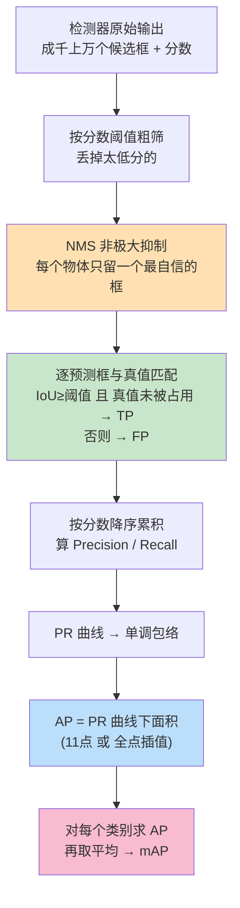
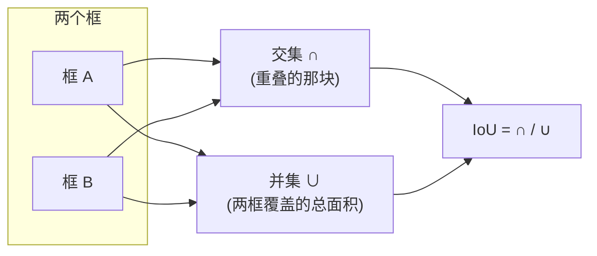
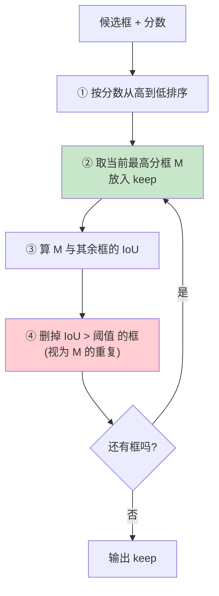
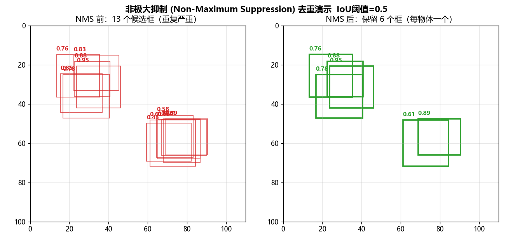
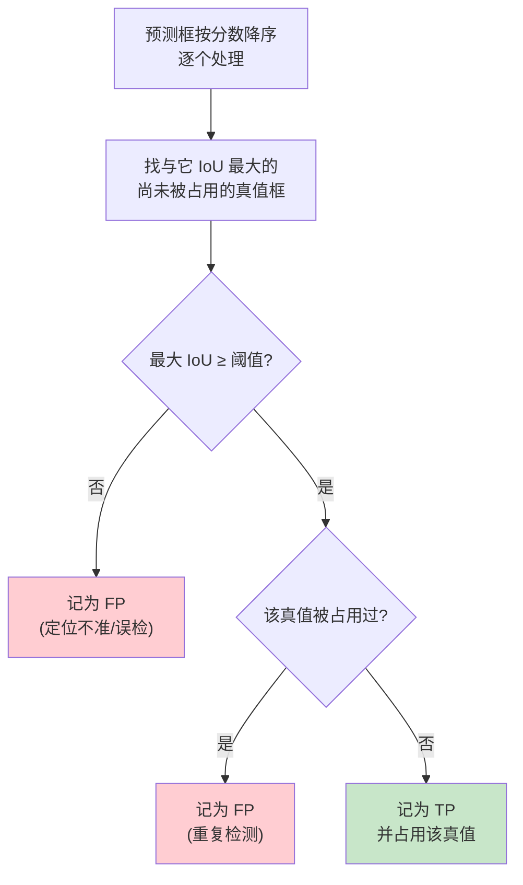
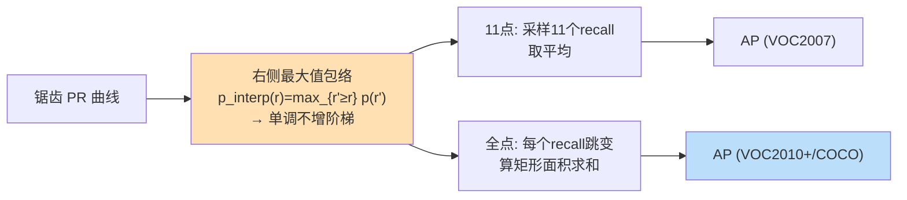
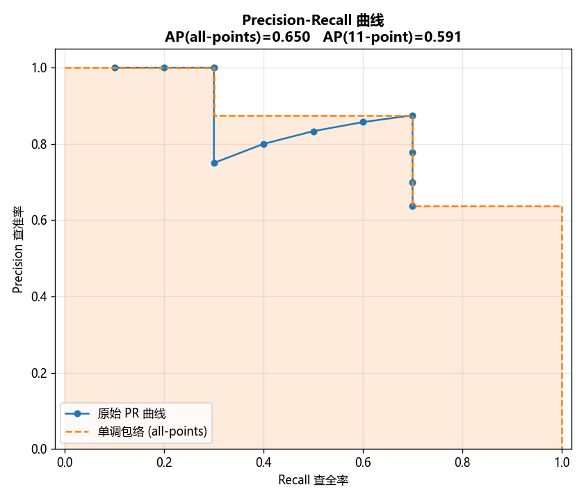
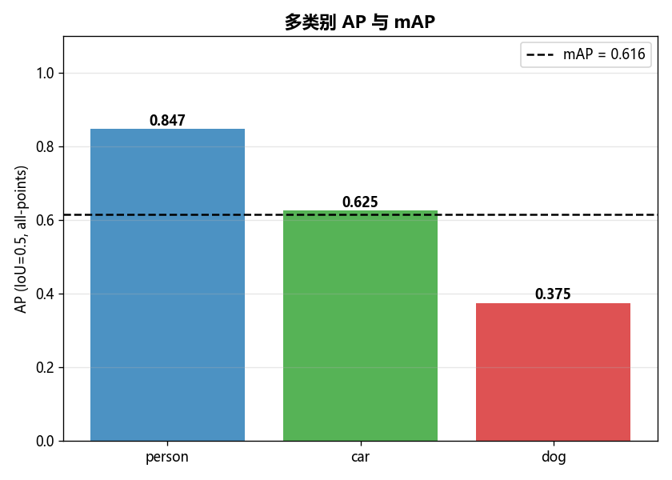

# 🎯 目标检测指标实验室 · Detection Metrics Lab

> 配套书籍：**《Deep Learning for Vision Systems》**（Mohamed Elgendy）第 7 章「Object detection with R-CNN, SSD, and YOLO」
>
> 本项目用 **纯 numpy**（不依赖任何检测框架、不下载任何模型、不联网、不需要 GPU）从零实现目标检测里最核心的一整套评价与后处理工具：
> **IoU → NMS → TP/FP 匹配 → Precision-Recall 曲线 → AP → mAP**。
>
> 目标读者：从**零基础**（第一次听说"什么是 IoU"）到**进阶**（准备面试、想彻底搞懂 COCO mAP 怎么算的）。

---

## 📖 目录

1. [这是什么 · 为什么重要](#1-这是什么--为什么重要)
2. [10 秒跑起来](#2-10-秒跑起来)
3. [全景图：一张预测经过哪些环节](#3-全景图一张预测经过哪些环节)
4. [概念 1 · IoU 交并比](#4-概念-1--iou-交并比)
5. [概念 2 · NMS 非极大抑制](#5-概念-2--nms-非极大抑制)
6. [概念 3 · TP / FP / FN 与匹配](#6-概念-3--tp--fp--fn-与匹配)
7. [概念 4 · Precision / Recall / PR 曲线](#7-概念-4--precision--recall--pr-曲线)
8. [概念 5 · AP：两种插值口径](#8-概念-5--ap两种插值口径)
9. [概念 6 · mAP：多类平均](#9-概念-6--map多类平均)
10. [代码逐行讲解](#10-代码逐行讲解)
11. [如何运行 · 测试与出图](#11-如何运行--测试与出图)
12. [💡 面试高频题集](#12--面试高频题集)
13. [⚠️ 常见坑合集](#13-️-常见坑合集)
14. [📌 小结](#14--小结)
15. [🔗 延伸阅读](#15--延伸阅读)

---

## 1. 这是什么 · 为什么重要

**是什么。** 目标检测（object detection）不仅要说"图里有没有猫"（那是分类 classification），还要**框出**猫在哪（定位 localization）。于是评价一个检测器好不好，就不能只看"分类对不对"，还要看：

- **框得准不准**？（预测框和真实框重合多少 → **IoU**）
- **有没有对同一个物体吐一大堆重复框**？（→ **NMS** 去重）
- **在"宁可多报"和"宁可少报"之间权衡得怎么样**？（→ **PR 曲线**）
- **综合一个数字打分**是多少？（→ 单类 **AP**、多类 **mAP**）

**为什么重要。** `mAP` 是**目标检测领域事实上的头号指标**——PASCAL VOC、COCO、Open Images 所有检测榜单都用它排名。看懂 mAP 怎么一步步从 IoU 累积出来，是：

- 📄 **读论文**的前提（每篇检测论文表格里全是 `AP / AP50 / AP75 / mAP`）；
- 💼 **面试**的高频考点（"手写一下 NMS"、"IoU=0.5 的 mAP 和 IoU=0.75 有啥区别"几乎必问）；
- 🛠️ **调模型**的抓手（mAP 低到底是框不准、还是漏检、还是误检多？拆开看就懂了）。

> 🔬 **第一性原理**：检测指标的一切，都建立在**"如何判定一个预测框算不算命中一个真实框"**这一个原子决策上。这个决策由 **IoU 阈值** 定义。IoU 阈值一变，"命中"的定义变，后面 TP/FP/PR/AP/mAP 全跟着变。所以搞懂检测指标，本质上就是搞懂"IoU 阈值如何一路传导到最终那个 mAP 数字"。

---

## 2. 10 秒跑起来

```bash
# 进入项目目录
cd book-dl-for-vision/projects/02_detection_metrics_lab

# 跑测试（应看到 28 passed）
python -m pytest -q

# 跑演示（在 outputs/ 生成 3 张图）
python run_demo.py
```

无需联网、无需 GPU、无需下载任何模型或数据集。所有"数据"都是脚本里现造的玩具框。

---

## 3. 全景图：一张预测经过哪些环节

从检测器原始输出，到最终一个 mAP 数字，数据流是这样的：



本项目 `detection_metrics.py` 里的函数，正好一一对应上面每个方框：

| 环节 | 函数 |
|------|------|
| IoU（贯穿全程） | `iou`, `iou_matrix`, `box_area` |
| NMS 去重 | `nms`, `batched_nms` |
| TP/FP 匹配 | `match_detections` |
| PR 曲线 | `precision_recall_curve` |
| 单类 AP | `average_precision`, `compute_ap` |
| 多类 mAP | `mean_average_precision` |

---

## 4. 概念 1 · IoU 交并比

### 是什么

**IoU (Intersection over Union，交并比)** 衡量两个框重合的程度：

$$
\text{IoU}(A, B) = \frac{|A \cap B|}{|A \cup B|} = \frac{\text{交集面积}}{\text{并集面积}}
$$

取值范围 `[0, 1]`：`0` 完全不重叠，`1` 完全重合。



### 为什么用它

分类只有"对/错"，但定位是连续的——预测框可能"差一点点"或"差很多"。IoU 把"差多少"量化成一个 `[0,1]` 的数，于是我们可以用一个**阈值**（如 0.5）把连续的"重合度"切成二元的"算命中 / 不算命中"。

### 怎么算（向量化推导 —— 面试常问）

给定框 `[x1, y1, x2, y2]`（左上角、右下角）：

1. **交集矩形**的左上角 = 两框左上角**逐元素取大**：`(max(ax1,bx1), max(ay1,by1))`
2. **交集矩形**的右下角 = 两框右下角**逐元素取小**：`(min(ax2,bx2), min(ay2,by2))`
3. **交集宽高** = `max(0, 右下 - 左上)`（不重叠时右下<左上，会出负数 → 裁成 0）
4. **交集面积** = 宽 × 高
5. **并集面积** = 面积A + 面积B − 交集面积（**减去重复算的那块**）
6. **IoU** = 交集 / (并集 + eps)

> ✍️ **手算对拍**（测试 `test_iou_half_overlap_known_value`）：
> `A=[0,0,10,10]`（面积 100），`B=[5,0,15,10]`（面积 100）。
> 交集 x∈[5,10]、y∈[0,10] → `5×10=50`。并集 `= 100+100−50 = 150`。
> **IoU `= 50/150 = 1/3 ≈ 0.333`**。

### 代价 / 局限

- IoU **对小物体极其敏感**：小框差几像素，IoU 就掉一大截；大框差几像素几乎无感。
- IoU 在两框**完全不相交时恒为 0**，梯度消失——所以做**回归损失**时人们发明了 GIoU / DIoU / CIoU（本项目只做评价指标，不涉及损失，但面试可能追问，见 [第12节](#12--面试高频题集)）。

---

## 5. 概念 2 · NMS 非极大抑制

### 是什么 / 为什么

检测器对**同一个物体**通常会吐出一大堆高度重叠、分数相近的框（因为它在很多相邻的锚点/位置上都"觉得这里有物体"）。**NMS (Non-Maximum Suppression，非极大抑制)** 的任务：**每个物体只保留一个最自信的框**，删掉其余重复框。



### 怎么用（贪心算法 greedy）

1. 按分数降序排序。
2. 弹出最高分框 → 加入 `keep`。
3. 计算它和剩余框的 IoU，**IoU > 阈值** 的删掉（认为是同一物体的重复）。
4. 在剩下的框里重复 2–3，直到没框。

> ✍️ **阈值敏感**（测试 `test_nms_threshold_sensitivity`）：两个 IoU=1/3 的框，
> - 阈值 `0.5`：`1/3 < 0.5` → **不抑制** → 保留 2 个；
> - 阈值 `0.3`：`1/3 > 0.3` → **抑制** → 保留 1 个。

### 代价 / 坑

- **阈值太高**（如 0.9）→ 抑制不够 → 一个物体留下多个重复框（误检 FP 变多）。
- **阈值太低**（如 0.2）→ 抑制太狠 → **两个真的挨得很近的物体**（如人群里两个人）被误删一个（漏检 FN 变多）。这是 NMS 的经典痛点，催生了 **Soft-NMS**（不硬删、而是给重叠框降分）。
- **不同类别不能互相抑制**！一个"人"框和一个"车"框哪怕高度重叠也不该删——这就是 `batched_nms` 的作用（本项目实现了）。

### 演示效果

`run_demo.py` 的 `demo_nms()` 造了两个物体、每个物体一簇抖动框（共 13 个候选），NMS 后保留 6 个：



---

## 6. 概念 3 · TP / FP / FN 与匹配

要算 Precision/Recall，先得把每个预测框判成三类之一：

| 术语 | 全称 | 含义（检测语境） |
|------|------|------|
| **TP** | True Positive 真阳性 | 预测框**命中**了一个真值框（IoU≥阈值 且 该真值没被占用）✅ |
| **FP** | False Positive 假阳性 | 预测框**没命中**（IoU 不够，或命中了一个**已被占用**的真值 = 重复检测）❌ |
| **FN** | False Negative 假阴性 | 一个真值框**没被任何预测命中**（漏检）🕳️ |

> ⚠️ 检测里**没有 TN**（True Negative）。因为"背景框"是无穷多的，谈"正确地不报背景"没意义。这是检测指标和普通二分类指标的一个关键区别。

### 匹配规则（PASCAL VOC / COCO 通用）



**关键点：一个真值框最多被匹配一次。** 高分预测先挑，挑走后低分预测即使 IoU 也够，也只能算 FP（重复检测）。这正是 `test_match_detections_double_detection_is_fp` 验证的：两个框都命中同一真值 → 高分 TP、低分 FP。

---

## 7. 概念 4 · Precision / Recall / PR 曲线

### 定义

$$
\text{Precision（查准率）} = \frac{TP}{TP + FP} = \frac{\text{预测对的}}{\text{所有预测}}
\qquad
\text{Recall（查全率）} = \frac{TP}{TP + FN} = \frac{\text{找回的真值}}{\text{所有真值}}
$$

- **Precision** 回答：我报出来的框，有多少是真的？（越高越"不乱报"）
- **Recall** 回答：所有真实物体，我找回了多少？（越高越"不漏报"）

二者**天然矛盾**：把置信度阈值调低 → 报得多 → Recall↑ 但 FP 也多 → Precision↓。反之亦然。

### PR 曲线怎么来的

想象把**置信度阈值**从高往低慢慢降。每降一点，就多接受一批预测。**对按分数降序排好的 TP/FP 序列做累积和 `cumsum`**，第 `k` 项就代表"只取前 k 个最自信预测"时的状态：

$$
\text{precision}_k = \frac{\text{cumTP}_k}{\text{cumTP}_k + \text{cumFP}_k},
\qquad
\text{recall}_k = \frac{\text{cumTP}_k}{n_{gt}}
$$

把 `(recall_k, precision_k)` 一串点连起来，就是 **PR 曲线**。它**天生带锯齿**：每遇到一个 FP，precision 掉一下；每遇到一个 TP，recall 前进一步、precision 回升一点。

> 🔬 **第一性原理**：PR 曲线的横轴 recall 是**单调不减**的（cumTP 只增不减，n_gt 固定），但纵轴 precision **会上下抖动**。正是这个抖动，逼出了下一节的"插值/包络"操作——我们要一条光滑单调的曲线来算面积。

---

## 8. 概念 5 · AP：两种插值口径

**AP (Average Precision，平均精度)** = **PR 曲线下的面积（AUC-PR）** 的某种近似。计算前都要先把锯齿 precision 变成**单调不增的包络**：

$$
p_{\text{interp}}(r) = \max_{r' \ge r}\; \text{precision}(r')
$$

直觉："事后诸葛"——在某个 recall 处，允许用它**之后**出现过的更高 precision 顶上来。这样曲线变成一级级往下的阶梯，消除锯齿。

历史上有两种主流口径：

### (a) 11 点插值（PASCAL VOC 2007）

在 `recall = 0, 0.1, 0.2, …, 1.0` 这 **11 个固定点**上，各取"该 recall 之后的最大 precision"，然后求平均：

$$
\text{AP}_{11} = \frac{1}{11}\sum_{t \in \{0,0.1,\dots,1.0\}} p_{\text{interp}}(t)
$$

优点：简单、稳定。缺点：只采样 11 个点，**粗糙**，对高精度检测器区分度不够。

### (b) 全点插值（PASCAL VOC 2010+ / COCO）

不再只看 11 个点，而是在**每一个 recall 变化处**都算矩形面积，求精确的阶梯下面积：

$$
\text{AP}_{\text{all}} = \sum_i (r_{i+1} - r_i)\, \cdot\, p_{\text{interp}}(r_{i+1})
$$

优点：精确、区分度高，**现代论文和 COCO 都用这个**。COCO 的 `mAP@[.5:.95]` 还会在 IoU=0.5,0.55,…,0.95 共 10 个阈值上各算一遍再平均（本项目提供单阈值版，多阈值一个 for 循环即可扩展）。



> ✍️ **手算对拍**（测试 `test_ap_all_points_known_value` / `test_ap_11_points_known_value`）：
> 序列 TP/FP = `[TP, FP, TP, TP]`，`n_gt=3`。
> `cumTP=[1,1,2,3]`, `cumFP=[0,1,1,1]` →
> `precision=[1, 0.5, 0.667, 0.75]`, `recall=[1/3, 1/3, 2/3, 1.0]`。
> 右侧最大包络：`recall=1/3` 处 = `max(1,0.5,0.667,0.75)=1.0`；`recall=2/3` 处 = `max(0.667,0.75)=0.75`；`recall=1.0` 处 = `0.75`。
>
> - **全点**：`AP = (1/3)·1.0 + (1/3)·0.75 + (1/3)·0.75 = 0.8333`。
> - **11 点**：11 个采样点的包络 precision 分别是 4 个 1.0、3 个 0.75、4 个 0.75 → `AP = (4·1.0 + 7·0.75)/11 = 9.25/11 = 0.8409`。
>
> 两种口径给出**不同的数**（0.833 vs 0.841），这就是为什么报 AP 一定要说清用的哪种口径！

### 演示效果

`demo_pr_curve()` 在一批预测上画 PR 曲线（蓝色锯齿）+ 单调包络（橙色阶梯，阴影为 AP 面积）：



---

## 9. 概念 6 · mAP：多类平均

**mAP (mean Average Precision)** = **对每个类别各算一个 AP，再取算术平均**：

$$
\text{mAP} = \frac{1}{|\mathcal{C}|}\sum_{c \in \mathcal{C}} \text{AP}_c
$$

- 每个类别**独立**做匹配、独立算 PR 曲线、独立算 AP。
- 某类别**没有真值**时通常**跳过不计入平均**（本项目 `mean_average_precision` 就是这么做的，见 `test_map_skips_class_without_gt`）。

> ⚠️ **术语混乱预警**：VOC 里 "mAP" 就指 IoU=0.5 下各类 AP 的平均；COCO 里的 "mAP"（也写作 `AP`）默认指 **IoU 从 0.5 到 0.95、步长 0.05 共 10 个阈值下各类 AP 再平均**（记作 `AP@[.5:.95]`），另有 `AP50`（=VOC 口径）、`AP75`（更严）。面试时务必问清对方指的是哪个！

### 演示效果

`demo_map()` 造了 3 个类别、不同命中率，算 per-class AP 和总 mAP：



---

## 10. 代码逐行讲解

以下抄录 `detection_metrics.py` 的关键片段并逐行讲。完整文件见同目录。

### 10.1 `iou_matrix` —— 向量化两两 IoU（核心中的核心）

```python
def iou_matrix(boxes_a, boxes_b):
    boxes_a = np.asarray(boxes_a, dtype=np.float64).reshape(-1, 4)
    boxes_b = np.asarray(boxes_b, dtype=np.float64).reshape(-1, 4)

    if boxes_a.shape[0] == 0 or boxes_b.shape[0] == 0:
        return np.zeros((boxes_a.shape[0], boxes_b.shape[0]))   # ← 空输入返回形状正确的空矩阵

    area_a = box_area(boxes_a)                                  # (Na,) 每个 A 框面积
    area_b = box_area(boxes_b)                                  # (Nb,) 每个 B 框面积

    lt = np.maximum(boxes_a[:, None, :2], boxes_b[None, :, :2]) # ← 交集左上角: 逐元素 max, 广播成 (Na,Nb,2)
    rb = np.minimum(boxes_a[:, None, 2:], boxes_b[None, :, 2:]) # ← 交集右下角: 逐元素 min
    wh = np.clip(rb - lt, 0, None)                              # ← 交集宽高, 不重叠时裁成 0（关键!）
    inter = wh[:, :, 0] * wh[:, :, 1]                           # ← 交集面积 (Na,Nb)

    union = area_a[:, None] + area_b[None, :] - inter           # ← 并集 = A+B-交集, 广播成 (Na,Nb)
    eps = np.finfo(np.float64).eps
    return inter / (union + eps)                                # ← +eps 防除零
```

**逐行要点：**

- `boxes_a[:, None, :2]` 把 `(Na,4)` 变成 `(Na,1,2)`，`boxes_b[None, :, :2]` 变成 `(1,Nb,2)`。numpy **广播**让它们逐元素运算得到 `(Na,Nb,2)`——**一次算出所有框对**，不用双重 for 循环。这是"向量化"的精髓，面试常要求现场写。
- `np.clip(rb - lt, 0, None)` 是**最容易漏**的一步：两框不重叠时 `rb < lt`，差是负数，若不裁 0，负宽×负高会得**正的假交集**，IoU 全错。
- `+ eps` 防止两个空框（面积都 0）导致 `0/0=nan`。

### 10.2 `nms` —— 贪心非极大抑制

```python
def nms(boxes, scores, iou_threshold=0.5):
    boxes = np.asarray(boxes, dtype=np.float64).reshape(-1, 4)
    scores = np.asarray(scores, dtype=np.float64).reshape(-1)
    if boxes.shape[0] == 0:
        return np.empty((0,), dtype=np.int64)                  # ← 空输入直接返回空

    order = scores.argsort()[::-1]                             # ← argsort 升序, [::-1] 反转 = 分数降序索引
    keep = []
    while order.size > 0:
        i = order[0]                                           # ← 当前最高分框
        keep.append(int(i))
        if order.size == 1:
            break
        rest = order[1:]
        ious = iou_matrix(boxes[i][None, :], boxes[rest])[0]   # ← i 与其余所有框的 IoU (1×len → 取[0])
        remain_mask = ious <= iou_threshold                    # ← 保留"不算重复"的框
        order = rest[remain_mask]                              # ← 把重复框剔除, 进入下一轮
    return np.array(keep, dtype=np.int64)
```

**逐行要点：**

- `scores.argsort()[::-1]`：numpy 的 `argsort` 只有升序，取降序的惯用法是切片反转。
- `ious <= iou_threshold` 用 `<=` 而非 `<`：IoU **恰好等于**阈值时，主流实现（torchvision）判定为"重复"予以抑制。边界口径要和标准一致。
- 每轮 `order` 只保留没被抑制的框，循环规模逐轮缩小，最坏 O(N²)。

### 10.3 `match_detections` —— 判 TP/FP

```python
    order = pred_scores.argsort()[::-1]            # 分数降序 —— 高分预测优先挑真值
    ious = iou_matrix(pred_boxes[order], gt_boxes) # (P,G) 每个预测对每个真值的 IoU
    gt_matched = np.zeros(n_gt, dtype=bool)        # 每个真值是否已被占用
    for p in range(n_pred):
        row = ious[p]
        best_gt = int(np.argmax(row))              # 与该预测 IoU 最大的真值
        best_iou = row[best_gt]
        if best_iou >= iou_threshold and not gt_matched[best_gt]:
            tp[p] = 1.0; gt_matched[best_gt] = True # ← 命中且真值空闲 → TP, 占用它
        else:
            fp[p] = 1.0                             # ← 否则 → FP（IoU不够 或 真值已被占）
```

**要点：** `gt_matched` 布尔数组保证"一个真值只能被占一次"，第二个命中它的框（即使 IoU 够）落入 `else` 分支算 FP——这就是"重复检测记 FP"的实现。

### 10.4 `average_precision` —— 全点插值那段最精妙

```python
    mrec = np.concatenate([[0.0], recall, [1.0]])  # 两端补哨兵 recall 0 和 1
    mpre = np.concatenate([[0.0], precision, [0.0]])
    for i in range(mpre.size - 2, -1, -1):
        mpre[i] = max(mpre[i], mpre[i + 1])         # ← 从右往左取 cummax = 单调不增包络
    idx = np.where(mrec[1:] != mrec[:-1])[0]        # ← 只在 recall "跳变"处
    ap = np.sum((mrec[idx + 1] - mrec[idx]) * mpre[idx + 1])  # ← Σ 宽×高 = 阶梯下面积
```

**要点：**

- **从右往左** `max(mpre[i], mpre[i+1])` 一遍就把 precision 变成单调不增包络（等价于 `p_interp(r)=max_{r'≥r}p(r')`）。
- `mrec[1:] != mrec[:-1]` 找出 recall 发生变化的位置——只有 recall 前进时才有新面积，recall 不变（同一 recall 上多个 FP）不贡献宽度。
- 乘积求和就是阶梯下的**精确面积**，不用数值积分近似。

---

## 11. 如何运行 · 测试与出图

### 目录结构

```
02_detection_metrics_lab/
├── README.md                        ← 你正在读的这份
├── requirements.txt                 ← 依赖（numpy/matplotlib/pytest）
├── detection_metrics.py             ← 核心算法（纯 numpy）
├── run_demo.py                      ← 演示：出 3 张图到 outputs/
├── outputs/                         ← 运行 run_demo.py 后生成的图
│   ├── nms_before_after.png
│   ├── pr_curve.png
│   └── map_bars.png
└── tests/
    └── test_detection_metrics.py    ← 28 个单元测试
```

### 跑测试

```bash
python -m pytest -q
```

预期输出：`28 passed`。测试覆盖：

- **IoU**：相同框=1、不相交=0、边缘相接=0、半重叠=1/3、包含=0.25、退化框裁 0、空输入。
- **NMS**：去重正确、无重叠全保留、按分数排序、阈值敏感、空输入、全重叠只留 1、分类别不互抑。
- **匹配/PR/AP/mAP**：TP/FP 基本判定、重复检测记 FP、完美检测器 AP=1、两种口径手算对拍、端到端 `compute_ap`、两类 mAP。
- **边界**：无预测、无真值、某类无真值被跳过、空 PR 曲线、非法 method 抛异常。

### 出图

```bash
python run_demo.py
```

在 `outputs/` 生成三张 PNG。脚本用 `matplotlib.use("Agg")`（无界面后端，服务器也能跑）+ `Microsoft YaHei` 字体（中文不乱码）。

> ⚠️ **中文字体坑**：Windows 上若不设 `rcParams["font.sans-serif"]=["Microsoft YaHei","SimHei"]`，中文标题会变成一堆方块 □□□；不设 `rcParams["axes.unicode_minus"]=False`，负号会渲染成方块。本项目已在 `run_demo.py` 顶部设好。

---

## 12. 💡 面试高频题集

> 目标检测指标是 CV 岗（尤其自动驾驶、安防、遥感）**必考**区。下面按频率排列。

**Q1. 手写 NMS。**
> 见 `nms` 函数。口述版：按分数降序，每次取最高分入 keep，删掉与它 IoU>阈值的框，重复。复杂度 O(N²)。追问优化：坐标排序法、Soft-NMS、或 GPU 版把 IoU 矩阵一次算出。

**Q2. IoU 怎么向量化算一批框？**
> 见 `iou_matrix`。核心：左上角逐元素 max、右下角逐元素 min、宽高 clip 到 0、并集=A+B−交集。务必强调**clip 负数**和**广播**两点。

**Q3. mAP 是怎么一步步算出来的？**
> IoU 定命中 → 匹配出 TP/FP → 按分数降序累积算 Precision/Recall → PR 曲线取包络 → 积分得单类 AP → 各类平均得 mAP。能把这条链条说顺就过关。

**Q4. AP 的 11 点插值和全点插值有什么区别？**
> 11 点（VOC2007）只在 11 个 recall 采样求平均，粗糙；全点（VOC2010+/COCO）在每个 recall 跳变处算精确阶梯面积。同一 PR 曲线两者数值不同（本项目实测 0.833 vs 0.841）。

**Q5. COCO 的 `AP`、`AP50`、`AP75` 分别是什么？**
> `AP50`=IoU 阈值 0.5 的 mAP（=VOC 口径，宽松）；`AP75`=IoU 0.75（严格，看定位精度）；COCO 主指标 `AP`=IoU 从 0.5 到 0.95 步长 0.05 共 10 档各算再平均（`AP@[.5:.95]`），最全面。

**Q6. 为什么检测里没有 TN？Precision/Recall 的分母各是什么？**
> 背景框无穷多，TN 无意义。Precision 分母=所有预测(TP+FP)，Recall 分母=所有真值(TP+FN=n_gt)。

**Q7. 一个真值被两个预测都命中，怎么算？**
> 高分那个算 TP 并占用真值，低分那个即使 IoU 够也算 FP（重复检测）。见 `test_match_detections_double_detection_is_fp`。

**Q8. NMS 阈值调高/调低分别有什么后果？**
> 调高→抑制不足→重复框多→FP↑；调低→抑制过度→挨近的两物体被误删→FN↑。密集场景用 Soft-NMS 缓解。

**Q9. IoU 作为回归损失有什么问题？怎么改进？**
> 两框不相交时 IoU≡0，梯度为 0 学不动；且 IoU 相同的两框相对位置可能差很远。改进：GIoU（加最小包围框惩罚）、DIoU（加中心距离）、CIoU（再加长宽比）。

**Q10. mAP 高但实际体验差，可能是什么原因？**
> mAP 是所有类、所有阈值的平均，可能掩盖某个关键类很差；或验证集分布和线上不一致；或 mAP@0.5 宽松、实际需要高定位精度（该看 AP75）。

---

## 13. ⚠️ 常见坑合集

| # | 坑 | 后果 | 本项目怎么处理 |
|---|----|------|----------------|
| 1 | 交集宽高不 clip 负数 | 不重叠框算出正的假交集，IoU 全错 | `np.clip(rb-lt, 0, None)` |
| 2 | 并集忘了减交集 | IoU 偏小 | `union = A + B - inter` |
| 3 | NMS 忘记分类别 | 人框把车框误删 | 提供 `batched_nms` |
| 4 | NMS 边界用 `<` 还是 `<=` | 与 torchvision 口径不一致，AP 对不上 | 统一用 `ious <= thr` 保留 |
| 5 | 一个真值被多次匹配 | TP 虚高、mAP 虚高 | `gt_matched` 布尔占用 |
| 6 | TP/FP 没按分数降序累积 | PR 曲线错乱 | `match_detections` 内部先 `argsort` |
| 7 | 11 点 vs 全点口径混用 | 报的 AP 数不可比 | 两种都实现，用 `method` 显式选 |
| 8 | 某类无真值仍计入 mAP | mAP 被 0 拉低或报错 | `mean_average_precision` 跳过无 gt 的类 |
| 9 | 除零（空框/无预测） | 出现 `nan` | 全程 `+eps`、空输入早返回 |
| 10 | matplotlib 中文/负号方块 | 图看不了 | `Agg` + `Microsoft YaHei` + `unicode_minus=False` |
| 11 | 坐标系搞反（y 向上/向下） | 画框上下颠倒 | demo 里 `ax.invert_yaxis()` 贴合图像坐标 |

---

## 14. 📌 小结

- **IoU** 是一切的基石：交/并，记得 **clip 负交集** 和 **并集减交集**。
- **NMS** 每物体留一个最自信框；**分类别**做、阈值要 tune、密集场景考虑 Soft-NMS。
- **匹配**把预测判成 **TP/FP**，核心是"一个真值只占一次"；检测里**没有 TN**。
- **PR 曲线** 由 TP/FP 按分数降序**累积**而来，天生锯齿，需取**单调包络**。
- **AP** = 包络后 PR 曲线下面积；**11 点（VOC07）** vs **全点（VOC10+/COCO）** 数值不同，报数必须说清口径。
- **mAP** = 各类 AP 平均；COCO 的 `AP` 还跨 10 个 IoU 阈值平均。
- 全部用 **纯 numpy 向量化** 实现，`28 passed`，离线出 3 张图。

一句话记忆链：**IoU 定命中 → 匹配出 TP/FP → 累积算 P/R → 包络求 AP → 各类平均得 mAP**。

---

## 15. 🔗 延伸阅读

- 📕 Mohamed Elgendy, *Deep Learning for Vision Systems*, 第 7 章（R-CNN / SSD / YOLO，含 IoU、NMS、mAP 讲解）。
- 📄 Everingham et al., *The PASCAL Visual Object Classes (VOC) Challenge* —— 11 点/全点 AP 的原始定义。
- 📄 Lin et al., *Microsoft COCO: Common Objects in Context* —— COCO mAP@[.5:.95] 口径来源。
- 📄 Bodla et al., *Soft-NMS — Improving Object Detection With One Line of Code*（ICCV 2017）。
- 📄 Rezatofighi et al., *Generalized Intersection over Union (GIoU)*（CVPR 2019）—— IoU 损失改进。
- 🛠️ `torchvision.ops.nms` / `batched_nms` / `box_iou` —— 工业标准实现，可对拍本项目结果。
- 🛠️ `pycocotools.cocoeval.COCOeval` —— 官方 COCO 评测代码，理解本项目后再读会很轻松。

> 本项目是《Deep Learning for Vision Systems》配套实战之 **02 · 目标检测指标**。姊妹项目见同级 `projects/` 目录。
